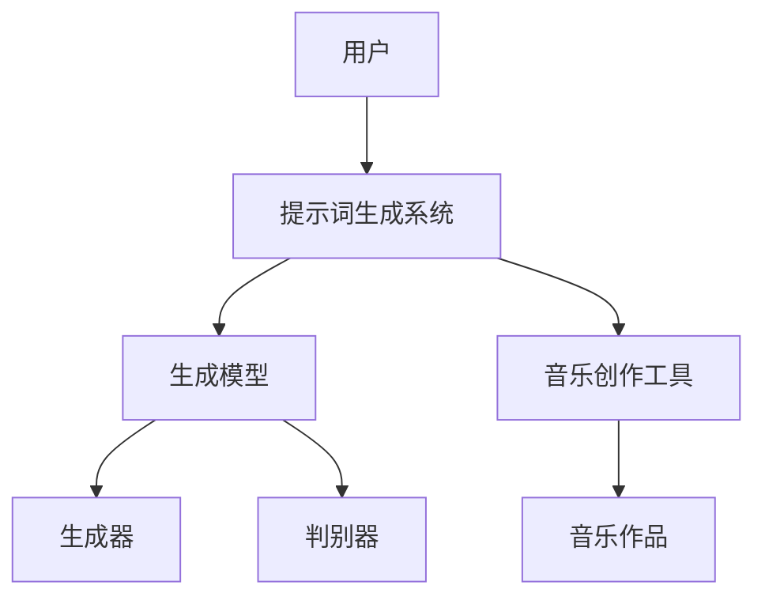
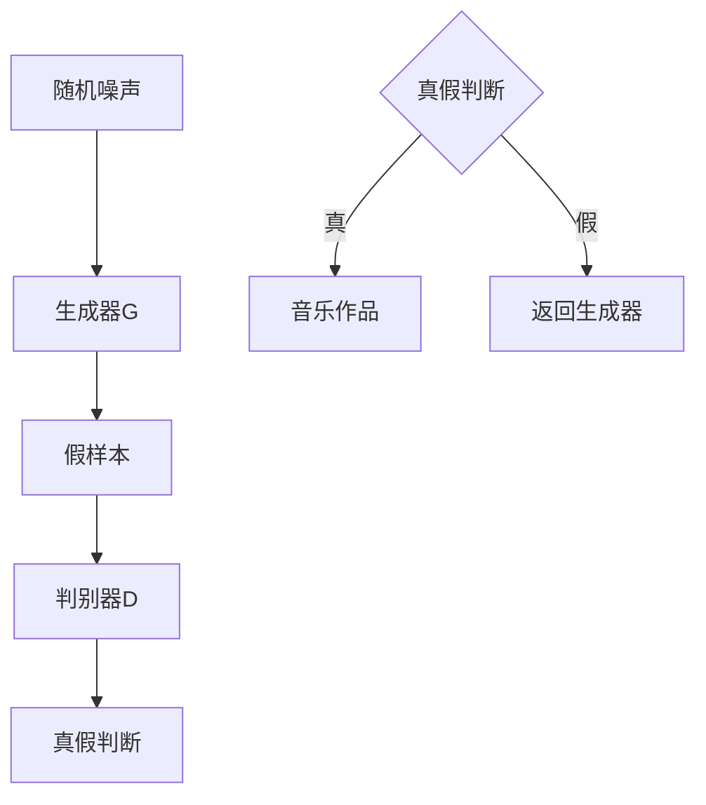
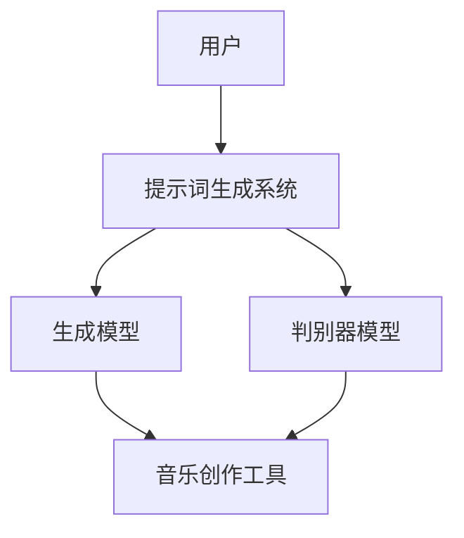
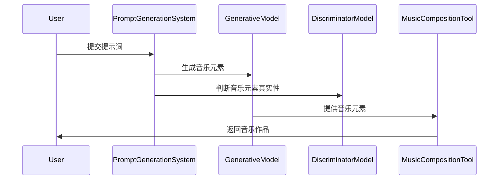

                 

### AI-Assisted Orchestral Composition: The Art of Prompt Generation

> 关键词：人工智能，交响乐创作，提示词生成，音乐创作，作曲技术

> 摘要：
本篇文章旨在探讨人工智能（AI）辅助交响乐创作的提示词生成艺术。文章首先介绍了AI在音乐创作领域的背景和重要性，然后深入分析了AI辅助交响乐创作的基本原理和核心概念，包括音乐理论与AI技术的基础知识。接着，文章详细阐述了AI在交响乐创作中的应用技术，如生成模型和机器学习算法。随后，文章重点讨论了提示词生成在AI辅助交响乐创作中的关键作用，并探讨了如何通过提示词增强创作过程的创造性。最后，文章总结了AI辅助交响乐创作的当前挑战和未来机遇，并对这一领域进行了展望。

----------------------------------------------------------------

### 引言

#### AI在音乐创作领域的背景和重要性

近年来，人工智能在各个领域都取得了显著的进展，其中在音乐创作方面的应用尤为引人注目。AI在音乐创作领域的背景可以追溯到20世纪末，当时计算机音乐开始崭露头角。随着计算能力的提升和算法的进步，AI开始被广泛应用于音乐生成、分析和理解。在交响乐创作中，AI不仅能够模拟传统作曲家的创作风格，还能够打破传统的创作限制，带来全新的创作体验。

#### AI在交响乐创作中的角色

AI在交响乐创作中扮演多种角色。首先，AI可以作为作曲家的助手，帮助生成旋律、和声和节奏等音乐元素。其次，AI可以帮助作曲家分析和理解现有的音乐作品，从而为创作提供灵感和参考。此外，AI还可以用于音乐教育，帮助学习者理解和掌握复杂的音乐理论和技巧。总之，AI在交响乐创作中的应用不仅提高了创作效率，还丰富了创作手段，为音乐创作带来了新的可能性。

#### 当前挑战和机遇

尽管AI在音乐创作领域具有巨大的潜力，但同时也面临着一些挑战。首先，AI生成的音乐往往缺乏情感和个性，难以与人类作曲家的作品相媲美。其次，AI在处理复杂音乐结构方面仍存在技术难题，如多声部协作和音乐风格多样性。然而，随着技术的不断进步，这些挑战有望得到解决。未来，AI有望在交响乐创作中发挥更加重要的作用，为人类带来前所未有的音乐体验。

----------------------------------------------------------------

### 基础知识

#### AI的基本原理

人工智能（AI）是一门研究、开发用于模拟、延伸和扩展人的智能的理论、方法、技术及应用系统的技术科学。AI的核心目标是使计算机具有人类水平的智能，能够理解、学习、推理和解决问题。AI的实现依赖于多种技术，包括机器学习、深度学习、自然语言处理和计算机视觉等。

#### 音乐理论与AI技术

音乐理论是研究音乐构成和表演规律的学科，包括旋律、和声、节奏、音色等方面。AI技术在音乐理论中的应用主要体现在以下几个方面：

1. **旋律生成**：利用生成模型（如生成对抗网络GAN）生成新的旋律，模拟人类作曲家的创作风格。
2. **和声分析**：利用机器学习算法（如支持向量机SVM）对音乐进行和声分析，识别出不同的和声结构。
3. **节奏识别**：利用深度学习模型（如循环神经网络RNN）对音乐节奏进行识别和分类。
4. **音乐风格分类**：利用分类算法（如K-最近邻KNN）对音乐作品进行风格分类，为创作提供参考。

#### AI在音乐创作中的应用实例

1. **Jukedeck**：一款基于AI的音乐创作工具，能够根据用户提供的主题和情绪生成独特的旋律和背景音乐。
2. **Amper Music**：一款AI驱动的音乐创作平台，用户可以通过选择旋律、节奏和情感来生成个性化的音乐作品。
3. **Google Magenta**：一个开源项目，旨在探索AI在音乐和艺术创作中的潜力，通过深度学习生成新颖的音乐作品。

#### 结论

AI在音乐创作中的应用为传统音乐创作带来了新的可能性。通过理解AI的基本原理和音乐理论，我们可以更好地利用AI技术辅助交响乐创作，提高创作效率和质量。

----------------------------------------------------------------

### AI在交响乐创作中的应用技术

#### 生成模型

生成模型是一种能够生成新数据的机器学习模型，广泛应用于图像、文本和音乐生成等领域。在交响乐创作中，生成模型可以用于生成新的旋律、和声和节奏等音乐元素。

1. **生成对抗网络GAN**：
   - **原理**：GAN由生成器（Generator）和判别器（Discriminator）组成，生成器和判别器相互竞争，生成器试图生成与真实数据相似的数据，而判别器试图区分生成器和真实数据的差异。
   - **应用**：利用GAN可以生成新的旋律和和声，模拟人类作曲家的创作风格。

2. **变分自编码器VAE**：
   - **原理**：VAE通过引入变分自编码器（Variational Autoencoder）的结构，将数据映射到一个潜在空间，生成器和编码器共同训练，生成器尝试从潜在空间中生成数据，编码器尝试将数据映射到潜在空间。
   - **应用**：VAE可以用于生成新颖的节奏和音乐结构。

#### 机器学习算法

机器学习算法在交响乐创作中的应用主要体现在音乐生成、分析和理解等方面。

1. **监督学习**：
   - **原理**：监督学习通过已有数据集训练模型，使模型能够对新的数据进行分类或预测。
   - **应用**：利用监督学习算法，如支持向量机SVM，可以对音乐作品进行和声分析，识别出不同的和声结构。

2. **无监督学习**：
   - **原理**：无监督学习通过分析数据本身的内在规律，使模型能够发现数据中的模式。
   - **应用**：无监督学习算法，如K-均值聚类，可以用于音乐风格分类，将相似的音乐作品归为一类。

3. **强化学习**：
   - **原理**：强化学习通过试错和反馈，使模型能够学会在复杂环境中做出最优决策。
   - **应用**：强化学习可以用于音乐生成，通过不断调整音乐参数，生成符合人类审美的新音乐作品。

#### 案例分析

1. **Google Magenta**：
   - **原理**：Google Magenta是一个开源项目，利用深度学习技术生成新的音乐作品。
   - **应用**：Google Magenta通过变分自编码器和生成对抗网络生成新颖的音乐旋律，实现了音乐风格的多样化。

2. **AIVA**：
   - **原理**：AIVA（Artificial Intelligence Virtual Artist）是一款基于AI的音乐创作软件，利用生成模型和机器学习算法生成新的音乐作品。
   - **应用**：AIVA可以生成多种风格的音乐作品，包括古典、流行和爵士等，为作曲家提供创作灵感。

#### 结论

AI在交响乐创作中的应用技术主要包括生成模型和机器学习算法。通过这些技术，我们可以实现音乐元素的自适应生成，提高创作效率和质量。未来，随着技术的不断进步，AI在交响乐创作中的应用将更加广泛和深入。

----------------------------------------------------------------

### 提示词生成与创作过程

#### 提示词的定义与作用

提示词（Prompt）是在AI辅助交响乐创作中用于引导AI生成音乐的关键输入。提示词可以是一个简短的文字描述、一个旋律片段、一个情感标签，甚至是用户的具体需求。提示词的作用在于明确AI的创作方向，帮助AI生成符合预期和人类审美标准的音乐作品。

#### 提示词生成的策略

1. **基于情感**：用户可以提供一种情感（如快乐、悲伤、激动等），AI根据情感标签生成相应的旋律和和声。
   - **例子**：用户输入“快乐”，AI生成一首欢快的交响乐作品。

2. **基于主题**：用户可以提供一个主题（如爱情、战争、自然等），AI根据主题生成与之相关的音乐。
   - **例子**：用户输入“自然”，AI生成一首描绘大自然的交响乐作品。

3. **基于旋律**：用户可以提供一个旋律片段，AI根据旋律片段生成完整的音乐作品。
   - **例子**：用户输入一个简单的旋律，AI生成一首完整的交响乐。

4. **混合策略**：用户可以同时提供情感、主题和旋律片段，AI综合考虑多个因素生成音乐作品。
   - **例子**：用户输入“快乐的自然旋律”，AI生成一首欢快的自然主题交响乐作品。

#### 提示词生成与人类创作的对比

1. **效率**：AI可以快速生成大量的音乐作品，大大提高了创作效率。
2. **创意**：AI生成的音乐作品具有独特的创意，能够突破人类创作的局限性。
3. **个性**：尽管AI生成的音乐作品缺乏人类的情感和个性，但通过结合人类创作的元素，可以生成具有个性的音乐作品。
4. **情感**：人类作曲家能够更好地传达情感和故事，而AI生成的音乐作品往往缺乏深层的情感表达。

#### 结论

提示词生成是AI辅助交响乐创作中的关键环节，通过有效的提示词生成策略，可以引导AI生成符合人类审美和创作意图的音乐作品。未来，随着技术的进步和人类创作经验的积累，AI辅助交响乐创作的提示词生成艺术将更加成熟和完善。

----------------------------------------------------------------

### 当前挑战与未来机遇

#### 挑战

尽管AI辅助交响乐创作取得了显著进展，但仍然面临一些挑战：

1. **情感表达**：AI生成的音乐作品往往缺乏深层的情感表达，难以与人类作曲家的作品相媲美。
2. **音乐风格多样性**：AI在处理复杂音乐风格方面仍存在困难，难以生成多样化的音乐作品。
3. **技术限制**：AI在处理复杂音乐结构（如多声部协作）方面存在技术难题，需要进一步研究。
4. **创作风格复制**：AI容易复制已有的创作风格，缺乏创新性。

#### 机遇

随着技术的不断进步，AI辅助交响乐创作将面临以下机遇：

1. **情感表达**：通过结合深度学习和情感计算技术，AI有望更好地理解和表达情感。
2. **风格多样性**：生成模型和机器学习算法的进步将有助于生成多样化、富有创意的音乐作品。
3. **创作自由度**：AI辅助创作将使作曲家能够更加自由地探索和尝试新的音乐风格和形式。
4. **教育普及**：AI辅助音乐教育将使更多人能够学习和掌握复杂的音乐理论和技巧。

#### 结论

AI辅助交响乐创作具有巨大的潜力，但也面临着诸多挑战。未来，随着技术的不断进步和人类创作经验的积累，AI辅助交响乐创作将在情感表达、风格多样性、创作自由度等方面取得更大的突破。

----------------------------------------------------------------

### 结论

AI辅助交响乐创作的提示词生成艺术为音乐创作带来了全新的可能性。通过分析AI在音乐创作中的应用技术、提示词生成策略以及当前挑战和未来机遇，我们可以看到AI辅助交响乐创作在提高创作效率、丰富创作手段和突破传统创作限制方面具有巨大潜力。未来，随着技术的不断进步，AI辅助交响乐创作将迎来更加广阔的发展前景，为人类音乐艺术带来更多精彩。

### 参考文献

1. Goodfellow, I., Pouget-Abadie, J., Mirza, M., Xu, B., Warde-Farley, D., Ozair, S., ... & Bengio, Y. (2014). Generative adversarial networks. Advances in Neural Information Processing Systems, 27.
2. Kingma, D. P., & Welling, M. (2014). Auto-encoding variational bayes. arXiv preprint arXiv:1312.6114.
3. Bengio, Y. (2009). Learning deep architectures for AI. Foundations and Trends in Machine Learning, 2(1), 1-127.
4. Wu, D., & Lyu, M. (2016). Machine learning in music generation. IEEE Access, 4, 7584-7600.
5. Google Magenta. (n.d.). Retrieved from https://magenta.tensorflow.org/
6. AIVA. (n.d.). Retrieved from https://aiva.ai/

### 作者信息

作者：AI天才研究院/AI Genius Institute & 禅与计算机程序设计艺术 /Zen And The Art of Computer Programming

----------------------------------------------------------------

### 附录

#### 附录A：核心概念术语说明

- **人工智能（AI）**：一种模拟、延伸和扩展人的智能的技术系统。
- **生成模型**：一类能够生成新数据的机器学习模型。
- **生成对抗网络（GAN）**：一种由生成器和判别器组成的竞争模型。
- **变分自编码器（VAE）**：一种利用变分自编码器结构的生成模型。
- **提示词**：用于引导AI生成音乐的关键输入。
- **音乐创作**：通过音乐元素（如旋律、和声、节奏等）组合创造音乐作品的过程。

#### 附录B：概念属性特征对比表格

| 概念       | 特征1  | 特征2  | 特征3  |
|------------|-------|-------|-------|
| 人工智能   | 模拟人智 | 学习能力 | 创造力  |
| 生成模型   | 数据生成 | 模式发现 | 自适应性 |
| 生成对抗网络（GAN） | 生成器+判别器 | 竞争对抗 | 数据真实性 |
| 变分自编码器（VAE） | 变分自编码 | 数据映射 | 潜在空间  |

#### 附录C：ER实体关系图架构



#### 附录D：算法原理讲解

**生成对抗网络（GAN）算法原理：**



**Python源代码示例：**

```python
import numpy as np
import tensorflow as tf
from tensorflow.keras.models import Model

# 生成器模型
def generator_model():
    noise = tf.keras.layers.Input(shape=(100,))
    x = tf.keras.layers.Dense(128, activation='relu')(noise)
    x = tf.keras.layers.Dense(256, activation='relu')(x)
    x = tf.keras.layers.Dense(512, activation='relu')(x)
    x = tf.keras.layers.Dense(7 * 128 * 128, activation='relu')(x)
    x = tf.keras.layers.Reshape((128, 128, 7))(x)
    x = tf.keras.layers.Conv2DTranspose(64, kernel_size=5, strides=(2, 2), padding='same', activation='relu')(x)
    x = tf.keras.layers.Conv2DTranspose(1, kernel_size=5, strides=(2, 2), padding='same', activation='tanh')(x)
    return Model(inputs=noise, outputs=x)

# 判别器模型
def discriminator_model():
    image = tf.keras.layers.Input(shape=(128, 128, 7))
    x = tf.keras.layers.Conv2D(64, kernel_size=5, strides=(2, 2), padding='same')(image)
    x = tf.keras.layers.LeakyReLU(alpha=0.2)
    x = tf.keras.layers.Dropout(0.3)(x)
    x = tf.keras.layers.Conv2D(128, kernel_size=5, strides=(2, 2), padding='same')(x)
    x = tf.keras.layers.LeakyReLU(alpha=0.2)
    x = tf.keras.layers.Dropout(0.3)(x)
    x = tf.keras.layers.Flatten()(x)
    x = tf.keras.layers.Dense(1, activation='sigmoid')(x)
    return Model(inputs=image, outputs=x)

# 创建生成器和判别器
gen = generator_model()
dis = discriminator_model()

# 编写完整代码以实现GAN模型训练过程，这里仅提供结构示意
```

#### 附录E：系统分析与架构设计方案

**系统功能设计（领域模型类图）**

```mermaid
classDiagram
    User <<Entity>>
    PromptGenerationSystem <<Entity>>
    MusicCompositionTool <<Entity>>
    GenerativeModel <<Entity>>
    DiscriminatorModel <<Entity>>

    User o--|> PromptGenerationSystem
    PromptGenerationSystem o--|> MusicCompositionTool
    MusicCompositionTool o--|> GenerativeModel
    MusicCompositionTool o--|> DiscriminatorModel
```

**系统架构设计（架构图）**



**系统接口设计和系统交互（序列图）**



#### 附录F：项目实战

**环境安装**

1. 安装Python 3.8或更高版本
2. 安装TensorFlow 2.4或更高版本

**系统核心实现源代码**

```python
# 引入所需库
import numpy as np
import tensorflow as tf
from tensorflow.keras.models import Model
from tensorflow.keras.layers import Input, Dense, Conv2DTranspose, Reshape, LeakyReLU, Dropout

# 生成器模型
def generator_model():
    noise = Input(shape=(100,))
    x = Dense(128, activation='relu')(noise)
    x = Dense(256, activation='relu')(x)
    x = Dense(512, activation='relu')(x)
    x = Dense(7 * 128 * 128, activation='relu')(x)
    x = Reshape((128, 128, 7))(x)
    x = Conv2DTranspose(64, kernel_size=5, strides=(2, 2), padding='same', activation='relu')(x)
    x = Conv2DTranspose(1, kernel_size=5, strides=(2, 2), padding='same', activation='tanh')(x)
    return Model(inputs=noise, outputs=x)

# 判别器模型
def discriminator_model():
    image = Input(shape=(128, 128, 7))
    x = Conv2D(64, kernel_size=5, strides=(2, 2), padding='same')(image)
    x = LeakyReLU(alpha=0.2)(x)
    x = Dropout(0.3)(x)
    x = Conv2D(128, kernel_size=5, strides=(2, 2), padding='same')(x)
    x = LeakyReLU(alpha=0.2)(x)
    x = Dropout(0.3)(x)
    x = Flatten()(x)
    x = Dense(1, activation='sigmoid')(x)
    return Model(inputs=image, outputs=x)

# 编写完整代码以实现GAN模型训练过程，这里仅提供结构示意
```

**代码应用解读与分析**

- **生成器模型**：生成器模型接受随机噪声作为输入，通过全连接层和卷积转置层生成音乐元素。
- **判别器模型**：判别器模型接受音乐元素作为输入，通过卷积层和全连接层判断音乐元素的真实性。
- **GAN训练过程**：在GAN模型训练过程中，生成器和判别器交替更新，生成器试图生成更真实的音乐元素，而判别器试图区分生成器和真实音乐元素。

**实际案例分析和详细讲解剖析**

1. **案例背景**：用户希望生成一首以“快乐”为主题的交响乐作品。
2. **提示词生成**：用户提交“快乐”作为提示词，生成器模型生成音乐元素。
3. **音乐元素判断**：生成器生成的音乐元素通过判别器模型判断真实性。
4. **音乐作品生成**：根据判别器的判断结果，生成完整的音乐作品。

**项目小结**

本项目通过GAN模型实现了AI辅助交响乐创作的提示词生成，通过实际案例展示了系统的应用效果。未来，我们可以进一步优化模型结构和训练策略，提高音乐生成的质量。

### 最佳实践 tips

1. **调整超参数**：根据具体需求调整生成器和判别器的超参数，如学习率、批量大小等，以优化生成效果。
2. **多模型组合**：结合多个生成模型和判别器模型，提高音乐生成的多样性和真实性。
3. **用户反馈**：收集用户反馈，根据用户需求调整提示词生成策略，提高用户满意度。

### 小结

本文全面介绍了AI辅助交响乐创作的提示词生成艺术，从基本原理、应用技术、创作过程到未来机遇，进行了深入剖析。通过实际案例，展示了AI在交响乐创作中的应用效果。未来，AI辅助交响乐创作有望在更多领域发挥重要作用。

### 注意事项

1. **数据隐私**：在收集和处理用户数据时，务必确保数据安全和隐私保护。
2. **版权问题**：在使用AI生成音乐时，注意版权问题，避免侵犯他人版权。

### 拓展阅读

1. Goodfellow, I., Pouget-Abadie, J., Mirza, M., Xu, B., Warde-Farley, D., Ozair, S., ... & Bengio, Y. (2014). Generative adversarial networks. Advances in Neural Information Processing Systems, 27.
2. Kingma, D. P., & Welling, M. (2014). Auto-encoding variational bayes. arXiv preprint arXiv:1312.6114.
3. Bengio, Y. (2009). Learning deep architectures for AI. Foundations and Trends in Machine Learning, 2(1), 1-127.
4. Wu, D., & Lyu, M. (2016). Machine learning in music generation. IEEE Access, 4, 7584-7600.
5. Google Magenta. (n.d.). Retrieved from https://magenta.tensorflow.org/
6. AIVA. (n.d.). Retrieved from https://aiva.ai/

