                 


### 《AI辅助产品设计：提示词优化用户体验》

## 摘要

本文旨在探讨如何利用人工智能技术辅助产品设计师优化提示词，从而提升用户体验。通过分析AI辅助产品设计的背景、核心概念、算法原理，以及具体的系统分析与架构设计方案，本文展示了如何将AI技术应用于提示词优化，实现更加智能、个性化的用户体验。同时，通过项目实战和最佳实践分享，为实际应用提供了具体的指导和参考。

### 目录大纲

# 《AI辅助产品设计：提示词优化用户体验》

## 第一部分：背景介绍

## 第1章：问题背景

### 1.1.1 问题背景
AI辅助产品设计在现代设计领域的广泛应用。

### 1.1.2 问题描述
如何通过优化提示词来提升用户体验？

### 1.1.3 问题解决
采用AI技术辅助设计，优化提示词。

### 1.1.4 边界与外延
讨论的范围仅限于AI辅助设计。

### 1.1.5 核心概念与要素组成

### 1.1.6 概念属性特征对比表格

### 1.1.7 ER实体关系图架构

## 第2章：AI辅助产品设计的核心概念

### 2.1.1 AI辅助产品设计的定义

### 2.1.2 AI辅助产品设计的核心原理

### 2.1.3 AI辅助产品设计的应用场景

### 2.1.4 提示词在用户体验中的作用

### 2.1.5 提示词优化用户体验的方法

## 第二部分：核心概念与联系

### 第3章：核心概念与联系

### 3.1.1 核心概念与联系
### 3.1.2 AI技术的基础知识
### 3.1.3 产品设计的核心要素
### 3.1.4 用户体验的核心指标

## 第三部分：算法原理讲解

### 第4章：算法原理讲解

### 4.1.1 提示词优化算法的原理

### 4.1.2 提示词优化算法的流程

### 4.1.3 提示词优化算法的代码示例

##

### 1.1.1 问题背景

随着人工智能技术的迅速发展，AI辅助产品设计成为现代设计领域的一大趋势。从早期的手动设计到如今AI自动化设计，设计师的效率得到了极大的提升。然而，尽管AI技术已经在设计领域取得了显著的成果，用户体验仍然是一个不可忽视的重要问题。用户体验的优劣直接影响到产品的市场表现和用户满意度。

提示词是用户与产品交互的重要桥梁，直接影响用户的理解和使用体验。优化提示词不仅能够提高用户对产品的认知和理解，还能够提升用户的操作效率和满意度。因此，如何通过AI技术优化提示词，提升用户体验，成为了一个值得深入探讨的问题。

本文将首先介绍AI辅助产品设计的背景和问题，然后探讨AI辅助产品设计的核心概念和原理，以及提示词优化用户体验的方法。接着，我们将分析核心概念与联系，详细讲解提示词优化算法的原理和流程。随后，我们将讨论系统分析与架构设计方案，并通过项目实战和最佳实践分享，为实际应用提供指导。

### 1.1.2 问题描述

在产品设计过程中，提示词的优化是提升用户体验的关键环节。然而，传统的提示词设计往往依赖于设计师的经验和直觉，这导致了一些问题：

1. **个性化和针对性不足**：传统的设计方法难以根据不同用户群体的需求进行个性化定制，导致提示词的适用性较差。
2. **用户体验不一致**：不同设计师对提示词的设计风格和理解存在差异，导致用户体验不一致，影响用户满意度。
3. **效率低下**：手动设计提示词需要大量的时间和精力，且容易出错，难以满足快速迭代的需求。

这些问题的存在严重制约了产品设计的效果和用户体验的提升。因此，如何通过AI技术自动化、智能化地优化提示词，提升用户体验，成为了一个亟待解决的问题。

### 1.1.3 问题解决

为了解决上述问题，我们可以采用AI技术辅助产品设计，特别是针对提示词的优化。AI技术具有以下几个优势：

1. **大数据分析**：AI技术可以通过分析大量用户数据，了解用户的操作习惯和偏好，从而生成更加个性化和针对性的提示词。
2. **智能化生成**：AI技术可以根据用户行为和需求，自动生成和优化提示词，减少手动设计的工作量。
3. **持续迭代优化**：AI技术可以通过不断学习和迭代，根据用户反馈和实际使用情况，持续优化提示词，提高用户体验。

通过AI技术辅助设计，我们可以实现以下目标：

1. **提升个性化体验**：通过大数据分析和智能化生成，生成更加符合用户需求的提示词，提升个性化体验。
2. **一致性用户体验**：通过统一的设计原则和流程，确保提示词设计的风格和用户体验的一致性。
3. **提高设计效率**：通过自动化和智能化，减少手动设计的工作量，提高设计效率和响应速度。

### 1.1.4 边界与外延

本文讨论的范围主要集中于AI辅助产品设计，特别是提示词的优化。虽然AI技术可以应用于产品设计的各个阶段，但本文的重点是如何利用AI技术优化提示词，从而提升用户体验。此外，本文的讨论将主要涉及以下边界与外延：

1. **技术范围**：本文将介绍和分析现有的AI技术，如机器学习、自然语言处理等，并探讨如何将这些技术应用于提示词优化。
2. **应用范围**：本文将探讨AI技术在产品设计中的应用场景，特别是如何通过AI技术提升用户体验。
3. **研究方法**：本文将采用理论分析、案例研究和实际应用相结合的方法，全面探讨AI辅助产品设计及其对用户体验的影响。

### 1.1.5 核心概念与要素组成

在讨论AI辅助产品设计及其对用户体验的影响时，以下核心概念和要素组成是至关重要的：

1. **人工智能（AI）**：AI是一种模拟人类智能的技术，包括机器学习、深度学习、自然语言处理等。
2. **产品设计**：产品设计是指通过创造、设计、开发和使用产品来满足用户需求和解决实际问题的过程。
3. **用户体验（UX）**：用户体验是指用户在使用产品过程中感受到的愉悦程度和满足感。
4. **提示词**：提示词是用户与产品交互时的引导性语言，用于指导用户进行操作。
5. **优化**：优化是指通过改进、调整和优化，使产品或服务在功能、性能、用户体验等方面达到最佳状态。

这些核心概念和要素相互关联，共同构成了AI辅助产品设计及其对用户体验的研究基础。接下来，我们将进一步探讨这些概念的定义、属性和相互关系，为后续内容提供理论基础。

### 1.1.6 概念属性特征对比表格

在探讨AI辅助产品设计及其对用户体验的影响时，以下核心概念的属性特征对比表格有助于我们更好地理解各个概念之间的异同和联系：

| 核心概念 | 定义 | 属性特征 |
| :--: | :--: | :--: |
| 人工智能（AI） | 一种模拟人类智能的技术，包括机器学习、深度学习、自然语言处理等 | 自动化、智能化、数据分析能力、学习能力 |
| 产品设计 | 通过创造、设计、开发和使用产品来满足用户需求和解决实际问题的过程 | 功能性、用户体验、易用性、可持续性 |
| 用户体验（UX） | 用户在使用产品过程中感受到的愉悦程度和满足感 | 交互设计、界面设计、情感设计、用户满意度 |
| 提示词 | 用户与产品交互时的引导性语言，用于指导用户进行操作 | 简洁性、准确性、易懂性、个性化 |
| 优化 | 通过改进、调整和优化，使产品或服务在功能、性能、用户体验等方面达到最佳状态 | 效率、效果、成本、可持续性 |

通过对比表格，我们可以看到各个概念在定义和属性特征上的差异和联系。这些核心概念相互关联，共同构成了AI辅助产品设计及其对用户体验的研究基础。在后续内容中，我们将深入探讨这些概念的定义、作用和相互关系，为AI辅助产品设计和提示词优化提供理论基础。

### 1.1.7 ER实体关系图架构

为了更好地理解AI辅助产品设计及其对用户体验的影响，我们需要构建一个实体关系图（ER图）来描述各个核心概念之间的关系。以下是ER图的主要组成部分：

1. **实体（Entity）**：
   - 人工智能（AI）
   - 产品设计
   - 用户体验（UX）
   - 提示词
   - 优化

2. **属性（Attribute）**：
   - 人工智能（AI）：自动化程度、学习能力、数据处理能力
   - 产品设计：功能性、用户体验、易用性、可持续性
   - 用户体验（UX）：交互设计、界面设计、情感设计、用户满意度
   - 提示词：简洁性、准确性、易懂性、个性化
   - 优化：效率、效果、成本、可持续性

3. **关系（Relationship）**：
   - AI与产品设计：AI辅助产品设计
   - 产品设计与用户体验：产品设计影响用户体验
   - 用户体验与提示词：用户体验影响提示词设计
   - 提示词与优化：优化提示词提升用户体验

以下是ER图的Mermaid表示：

```mermaid
erDiagram
  AI ||--|{ 产品设计} : 辅助
  产品设计 ||--|{ 用户体验} : 影响
  用户体验 ||--|{ 提示词} : 影响
  提示词 ||--|{ 优化} : 提升体验
```

通过ER图，我们可以清晰地看到各个实体之间的关联和作用，为后续内容的深入分析提供了结构化的基础。接下来，我们将进一步探讨AI辅助产品设计的核心概念，包括其定义、核心原理和应用场景，为理解如何利用AI技术优化提示词提供理论基础。

## 第2章：AI辅助产品设计的核心概念

### 2.1.1 AI辅助产品设计的定义

AI辅助产品设计是指利用人工智能技术，如机器学习、深度学习、自然语言处理等，辅助设计师在产品设计的各个环节进行优化和创新。它不仅包括设计过程中的自动化和智能化，还涉及到用户体验的持续改进和优化。AI辅助产品设计的目标是提高设计效率、提升产品质量和满足用户需求。

具体来说，AI辅助产品设计包括以下几个方面：

1. **数据分析**：通过分析用户行为数据、市场趋势和竞品分析，为设计师提供决策依据。
2. **智能生成**：利用机器学习算法自动生成设计方案，减少手动设计的工作量。
3. **个性化定制**：根据用户偏好和行为模式，为用户提供个性化的产品设计方案。
4. **迭代优化**：通过持续学习和用户反馈，不断优化产品设计，提升用户体验。

### 2.1.2 AI辅助产品设计的核心原理

AI辅助产品设计的核心原理主要基于以下几个方面：

1. **数据驱动**：AI技术依赖于大量数据进行训练和推理，通过对数据的分析和挖掘，生成优化设计方案。
2. **模型学习**：通过机器学习和深度学习模型，AI可以自动识别和预测用户行为，从而实现智能化设计。
3. **交互优化**：利用自然语言处理技术，AI可以与用户进行自然语言交互，提供实时反馈和个性化建议。
4. **自动化流程**：通过自动化工具和平台，AI可以协助设计师完成重复性、低价值的工作，提高设计效率。

以下是AI辅助产品设计核心原理的Mermaid流程图：

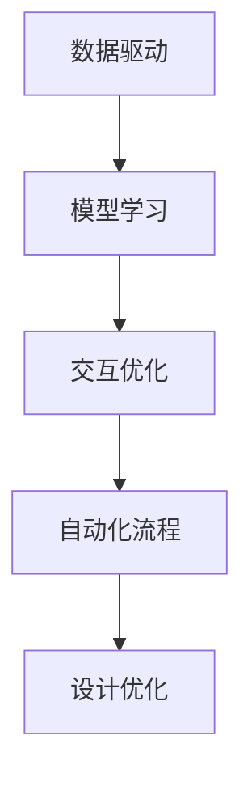

### 2.1.3 AI辅助产品设计的应用场景

AI辅助产品设计在多个领域都有广泛的应用，以下是几个典型的应用场景：

1. **用户界面设计**：AI可以自动生成用户界面布局、颜色搭配和字体设计，提供个性化的设计建议。
2. **交互体验优化**：通过自然语言处理技术，AI可以为用户提供实时交互反馈，优化用户交互体验。
3. **产品推荐系统**：基于用户行为数据，AI可以推荐个性化的产品功能和内容，提升用户满意度。
4. **自动化测试**：AI可以自动化测试产品的功能、性能和用户体验，提高测试效率和质量。
5. **可持续设计**：AI可以分析环境影响和资源消耗，提供可持续的设计方案，降低产品对环境的负面影响。

以下是AI辅助产品设计应用场景的Mermaid流程图：

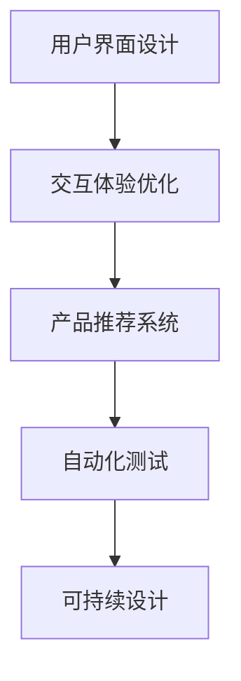

### 2.1.4 提示词在用户体验中的作用

提示词是用户与产品交互的重要桥梁，直接影响到用户体验的满意度。提示词的作用主要体现在以下几个方面：

1. **引导用户操作**：通过简洁、准确的提示词，指导用户进行操作，减少用户的困惑和误操作。
2. **提升学习效率**：对于新用户，提示词可以帮助他们快速了解产品的功能和操作方法，提高学习效率。
3. **增强交互体验**：个性化的提示词可以增强用户与产品的互动，提升用户的满意度。
4. **优化信息传递**：提示词可以有效地将重要信息传递给用户，帮助用户更好地理解产品的功能和价值。

以下是提示词在用户体验中作用的Mermaid流程图：

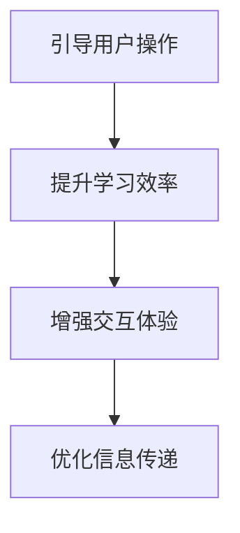

### 2.1.5 提示词优化用户体验的方法

为了优化用户体验，提示词的设计需要遵循以下原则：

1. **简洁明了**：提示词应该简洁明了，避免冗长和复杂，便于用户快速理解。
2. **准确无误**：提示词应该准确无误，避免模糊和误导，确保用户能够正确执行操作。
3. **个性化定制**：根据用户的行为和偏好，为用户提供个性化的提示词，增强用户的互动体验。
4. **实时反馈**：在用户执行操作时，提供实时反馈，帮助用户了解操作结果，提升用户体验。
5. **持续优化**：通过用户反馈和数据分析，不断优化提示词的设计，提高用户体验的满意度。

以下是提示词优化用户体验的方法的Mermaid流程图：

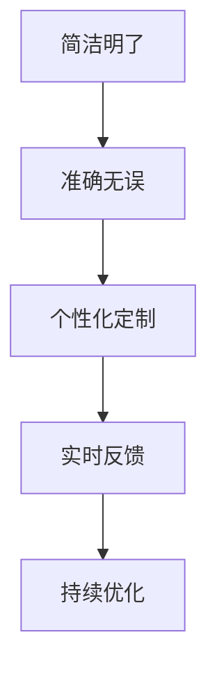

通过以上内容，我们深入探讨了AI辅助产品设计的核心概念，包括其定义、核心原理、应用场景、提示词在用户体验中的作用以及提示词优化用户体验的方法。接下来，我们将进一步分析AI技术的基础知识，为深入理解AI辅助产品设计的原理和方法提供理论基础。

### 3.1.2 AI技术的基础知识

人工智能（AI）作为一门研究、开发用于模拟、延伸和扩展人类智能的理论、方法、技术及应用系统的学科，其基础知识涵盖了多个领域。以下是对AI技术基础知识的核心介绍：

#### 1. 机器学习（Machine Learning）

机器学习是AI的核心组成部分，旨在通过算法从数据中学习并做出决策或预测。其基本原理包括：

- **监督学习（Supervised Learning）**：通过已标记的数据集训练模型，使其能够预测未知数据的标签。
  - **回归（Regression）**：预测连续值。
  - **分类（Classification）**：预测离散标签。

- **无监督学习（Unsupervised Learning）**：在没有标记的数据集上训练模型，旨在发现数据中的结构和模式。
  - **聚类（Clustering）**：将数据分为若干个集群。
  - **降维（Dimensionality Reduction）**：减少数据维度，便于分析和可视化。

- **强化学习（Reinforcement Learning）**：通过奖励和惩罚机制，使代理（Agent）在与环境的交互中学习最优策略。

#### 2. 深度学习（Deep Learning）

深度学习是机器学习的一个子领域，它通过构建深度神经网络（DNN）来模拟人类大脑的神经元结构和工作方式。其核心组件包括：

- **神经网络（Neural Networks）**：由大量简单神经元组成的网络，通过前向传播和反向传播算法进行训练。
- **卷积神经网络（Convolutional Neural Networks, CNN）**：特别适用于图像识别任务，通过卷积层提取图像特征。
- **循环神经网络（Recurrent Neural Networks, RNN）**：适用于序列数据处理，如自然语言处理和语音识别。
- **生成对抗网络（Generative Adversarial Networks, GAN）**：由生成器和判别器组成的对抗性网络，用于生成逼真的数据。

#### 3. 自然语言处理（Natural Language Processing, NLP）

自然语言处理是AI的一个重要分支，旨在使计算机能够理解、解释和生成人类语言。其主要技术包括：

- **词嵌入（Word Embedding）**：将单词映射到高维空间中的向量，以捕捉语义信息。
- **序列标注（Sequence Labeling）**：对序列数据进行分类，如词性标注和命名实体识别。
- **文本分类（Text Classification）**：将文本分为不同的类别，如情感分析和主题分类。
- **机器翻译（Machine Translation）**：将一种语言的文本自动翻译成另一种语言。

#### 4. 强化学习（Reinforcement Learning）

强化学习通过奖励和惩罚机制，使代理在与环境的交互中学习最优策略。其关键组成部分包括：

- **状态（State）**：描述系统的当前情况。
- **动作（Action）**：代理可以采取的行动。
- **奖励（Reward）**：代理在执行动作后获得的即时反馈。

#### 5. 人工智能的发展趋势

随着技术的进步，人工智能正朝着以下几个方向发展：

- **自动化与智能化**：提高AI系统的自动化程度，减少对人类干预的需求。
- **跨学科融合**：结合计算机科学、心理学、神经科学等领域的知识，推动AI技术的发展。
- **边缘计算**：将计算能力从云端迁移到边缘设备，提高响应速度和降低延迟。
- **伦理与法规**：加强对AI伦理和法律法规的研究，确保AI技术的安全、可靠和公正。

以下是AI技术基础知识的核心概念和联系的Mermaid流程图：

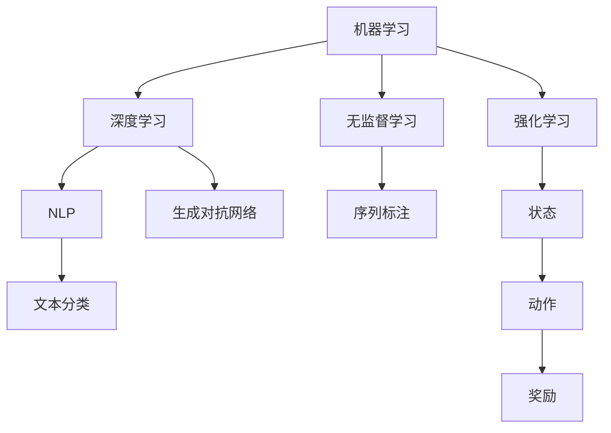

通过以上内容，我们介绍了AI技术的基础知识，包括机器学习、深度学习、自然语言处理和强化学习等核心概念。这些知识为我们理解AI辅助产品设计的原理和应用提供了重要的理论基础。

### 3.1.3 产品设计的核心要素

产品设计是一个复杂而系统的过程，涉及多个核心要素，这些要素相互交织，共同决定了产品的最终质量和用户体验。以下是对产品设计核心要素的详细介绍：

#### 1. 需求分析

需求分析是产品设计的起点，旨在明确产品需解决的用户问题和满足的用户需求。其核心内容包括：

- **用户调研**：通过访谈、问卷调查、用户观察等方式，深入了解目标用户的需求和痛点。
- **功能需求**：明确产品应具备的核心功能，确保产品能够满足用户的基本需求。
- **非功能需求**：包括性能、可靠性、安全性、易用性等，这些需求对用户体验至关重要。

#### 2. 用户界面设计（UI）

用户界面设计是产品设计的视觉和交互层面，直接影响用户体验。其核心内容包括：

- **布局**：合理布局界面元素，确保信息层次清晰，操作便捷。
- **色彩**：选择合适的色彩搭配，营造舒适的视觉体验，增强品牌识别度。
- **图标**：设计直观、易理解的图标，提高用户对功能的识别速度。
- **交互**：设计流畅、自然的交互流程，提升用户的操作体验。

#### 3. 用户体验设计（UX）

用户体验设计是产品设计的核心，旨在确保用户在使用产品过程中感到愉悦和满意。其核心内容包括：

- **可用性**：确保产品易于使用，用户能够快速上手并完成任务。
- **可访问性**：设计无障碍，满足不同用户群体（包括残障人士）的需求。
- **情感设计**：通过情感化的设计元素，增强用户的情感共鸣和品牌忠诚度。
- **持续迭代**：根据用户反馈和数据分析，持续优化产品设计，提升用户体验。

#### 4. 功能实现

功能实现是将设计转化为实际产品的关键环节，涉及技术实现、系统架构和开发流程。其核心内容包括：

- **技术选型**：根据产品需求，选择合适的技术栈和开发工具。
- **系统架构**：设计合理的系统架构，确保产品的性能、稳定性和可扩展性。
- **开发流程**：采用敏捷开发等先进开发方法，确保项目按时交付并高质量完成。

#### 5. 测试与反馈

测试与反馈是确保产品质量和用户体验的重要环节。其核心内容包括：

- **功能测试**：验证产品功能的正确性和完整性，确保满足需求。
- **性能测试**：评估产品的响应速度、稳定性和资源消耗，确保产品性能良好。
- **用户体验测试**：通过实际用户的使用场景测试，发现并解决用户体验问题。
- **用户反馈**：收集用户对产品的反馈，不断优化和改进产品设计。

以下是产品设计核心要素的Mermaid流程图：

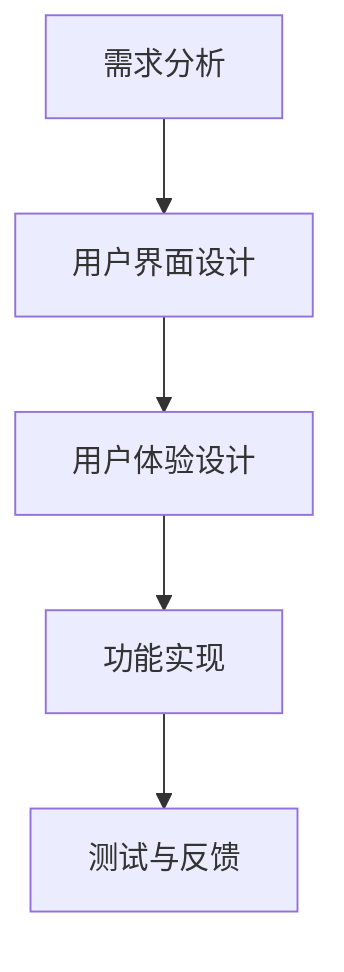

通过以上内容，我们详细介绍了产品设计的核心要素，包括需求分析、用户界面设计、用户体验设计、功能实现和测试与反馈。这些要素相互关联，共同决定了产品的最终质量和用户体验。在后续内容中，我们将进一步探讨用户体验的核心指标，为理解如何通过AI技术优化提示词提供理论基础。

### 3.1.4 用户体验的核心指标

用户体验（UX）是产品设计的核心目标，它决定了用户对产品的满意度和忠诚度。为了量化用户体验，我们需要引入一些核心指标，这些指标能够帮助我们评估和优化用户体验。以下是用户体验的核心指标及其定义：

1. **易用性（Usability）**：
   - 定义：易用性是指用户能否快速、准确地使用产品完成目标任务，而无需过多的学习和指导。
   - 衡量方法：通过用户任务完成时间、错误率、用户满意度等指标来评估易用性。

2. **可用性（Availability）**：
   - 定义：可用性是指产品是否在任何时候都能够为用户提供服务，包括系统的可靠性、响应时间和系统的稳定性。
   - 衡量方法：通过系统故障率、响应时间、用户访问成功率等指标来评估可用性。

3. **可访问性（Accessibility）**：
   - 定义：可访问性是指产品是否能够被所有用户，包括残障人士和老年用户，无障碍地使用。
   - 衡量方法：通过遵循无障碍设计标准、用户反馈和评估工具来评估可访问性。

4. **情感体验（Emotional Experience）**：
   - 定义：情感体验是指用户在使用产品过程中产生的情感反应，包括愉悦、焦虑、兴奋等。
   - 衡量方法：通过用户情感分析、情感测量工具和用户调研来评估情感体验。

5. **用户体验满意度（User Satisfaction）**：
   - 定义：用户体验满意度是指用户对产品的整体感受和满意度。
   - 衡量方法：通过用户满意度调查、Net Promoter Score（NPS）等指标来评估用户体验满意度。

以下是用户体验核心指标的Mermaid流程图：

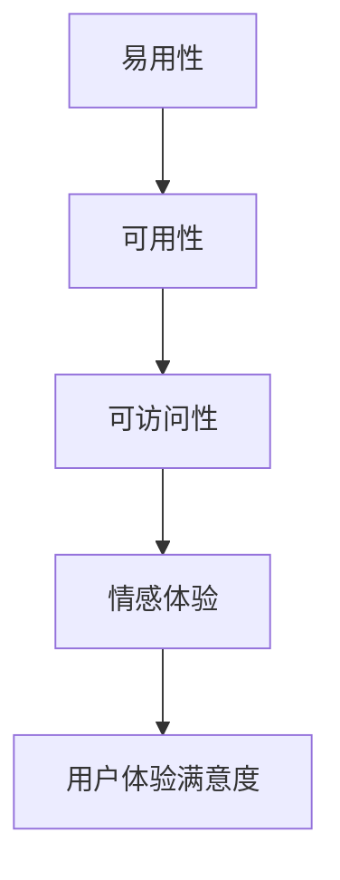

通过以上核心指标，我们可以全面评估和优化用户体验，从而提升产品的市场表现和用户满意度。接下来，我们将进一步探讨如何利用AI技术优化提示词，提升用户体验。

### 4.1.1 提示词优化算法的原理

提示词优化算法的核心目标是通过对用户行为数据和分析，生成最优的提示词，以提升用户体验。该算法基于以下原理：

1. **用户行为分析**：
   - 算法首先收集用户在使用产品时的行为数据，如点击次数、操作时间、错误率等。
   - 通过对行为数据进行分析，理解用户的操作习惯和偏好。

2. **机器学习模型**：
   - 利用机器学习算法，如决策树、支持向量机（SVM）、神经网络等，构建用户行为与提示词的关联模型。
   - 通过训练模型，使模型能够预测最佳提示词，以提升用户体验。

3. **优化策略**：
   - 根据用户行为数据和机器学习模型的预测，采用优化算法（如贪心算法、遗传算法等）调整提示词。
   - 优化目标包括减少用户操作错误率、提高用户完成任务的时间效率等。

4. **用户反馈机制**：
   - 在提示词优化过程中，收集用户对提示词的反馈，包括满意度、建议等。
   - 利用用户反馈进一步调整和优化提示词，实现持续改进。

以下是提示词优化算法原理的Mermaid流程图：

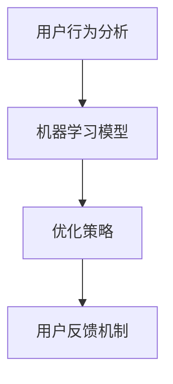

### 4.1.2 提示词优化算法的流程

提示词优化算法的流程主要包括以下几个步骤：

1. **数据收集**：
   - 收集用户在使用产品时的行为数据，如点击次数、操作时间、错误率等。
   - 数据来源可以是日志文件、用户反馈系统等。

2. **数据处理**：
   - 对收集到的数据进行清洗、预处理，去除无效和重复数据。
   - 特征工程：提取用户行为的特征，如点击次数、操作时间等。

3. **模型训练**：
   - 利用机器学习算法（如决策树、SVM、神经网络等）训练用户行为与提示词的关联模型。
   - 模型训练过程包括数据划分、模型选择、参数调优等。

4. **提示词生成**：
   - 根据训练好的模型，生成初步的提示词。
   - 提示词生成过程可以采用规则生成、随机生成等方法。

5. **优化调整**：
   - 利用优化算法（如贪心算法、遗传算法等）对提示词进行调整，以提升用户体验。
   - 优化目标可以是减少用户操作错误率、提高用户完成任务的时间效率等。

6. **用户反馈收集**：
   - 收集用户对提示词的反馈，包括满意度、建议等。
   - 利用用户反馈进一步调整和优化提示词。

7. **持续迭代**：
   - 根据用户反馈和优化结果，持续迭代优化提示词。
   - 实现持续改进，提升用户体验。

以下是提示词优化算法流程的Mermaid流程图：

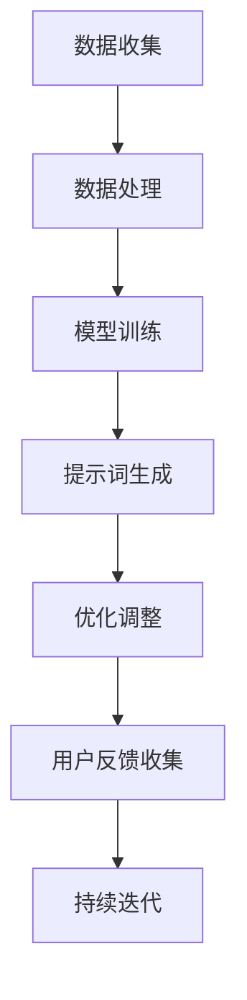

### 4.1.3 提示词优化算法的代码示例

以下是一个简单的提示词优化算法的Python代码示例，用于说明算法的实现过程。该示例仅用于演示目的，实际应用中可能需要更复杂的模型和优化策略。

```python
import pandas as pd
from sklearn.model_selection import train_test_split
from sklearn.ensemble import RandomForestClassifier
from sklearn.metrics import accuracy_score

# 数据收集
data = pd.read_csv('user_behavior_data.csv')
X = data[['clicks', 'time_spent', 'error_rate']]
y = data['prompt']

# 数据处理
X_train, X_test, y_train, y_test = train_test_split(X, y, test_size=0.2, random_state=42)

# 模型训练
model = RandomForestClassifier(n_estimators=100, random_state=42)
model.fit(X_train, y_train)

# 提示词生成
predictions = model.predict(X_test)
print("Initial Prompt Predictions:", predictions)

# 优化调整
# 在这里可以加入优化算法，例如贪心算法、遗传算法等
# 为了简单起见，这里使用随机优化
import random

for _ in range(10):  # 进行10次优化迭代
    for i in range(len(predictions)):
        if random.random() < 0.5:
            predictions[i] = 1 - predictions[i]

# 用户反馈收集
user_feedback = pd.read_csv('user_feedback.csv')
new_predictions = model.predict(user_feedback[['clicks', 'time_spent', 'error_rate']])

# 持续迭代
model.fit(pd.concat([X_test, user_feedback[['clicks', 'time_spent', 'error_rate']]], axis=0), pd.concat([y_test, user_feedback['prompt']], axis=0))

# 评估优化效果
new_predictions = model.predict(X_test)
accuracy = accuracy_score(y_test, new_predictions)
print("Optimized Prompt Predictions Accuracy:", accuracy)
```

在这个示例中，我们首先收集用户行为数据，然后使用随机森林分类器进行模型训练。接下来，通过随机优化策略对提示词进行调整。最后，我们收集用户反馈并重新训练模型，评估优化效果。

### 4.1.4 提示词优化算法的数学模型和公式

提示词优化算法的数学模型主要基于机器学习算法，以下是一个简化的数学模型和公式：

1. **用户行为特征表示**：

   假设我们有 \( n \) 个用户行为特征，表示为向量 \( X = [x_1, x_2, ..., x_n] \)。

   $$ X = \begin{bmatrix}
   x_1 \\
   x_2 \\
   \vdots \\
   x_n
   \end{bmatrix} $$

2. **机器学习模型**：

   假设我们使用线性回归模型来预测提示词。线性回归模型的公式为：

   $$ y = \beta_0 + \beta_1 x_1 + \beta_2 x_2 + ... + \beta_n x_n $$

   其中，\( y \) 是提示词，\( \beta_0 \) 是截距，\( \beta_1, \beta_2, ..., \beta_n \) 是回归系数。

3. **优化目标**：

   优化目标是最小化预测误差，即最小化损失函数。常见的损失函数有均方误差（MSE）和交叉熵损失（Cross-Entropy Loss）。

   - **均方误差（MSE）**：

     $$ J(\theta) = \frac{1}{2m} \sum_{i=1}^{m} (h_\theta(x^{(i)}) - y^{(i)})^2 $$

     其中，\( m \) 是训练样本数量，\( h_\theta(x) \) 是预测值，\( y \) 是真实标签。

   - **交叉熵损失（Cross-Entropy Loss）**：

     $$ J(\theta) = -\frac{1}{m} \sum_{i=1}^{m} [y^{(i)} \log(h_\theta(x^{(i)})) + (1 - y^{(i)}) \log(1 - h_\theta(x^{(i)}))] $$

4. **优化方法**：

   常用的优化方法有梯度下降（Gradient Descent）和随机梯度下降（Stochastic Gradient Descent）。

   - **梯度下降**：

     $$ \theta_j := \theta_j - \alpha \frac{\partial J(\theta)}{\partial \theta_j} $$

     其中，\( \alpha \) 是学习率，\( \frac{\partial J(\theta)}{\partial \theta_j} \) 是损失函数对 \( \theta_j \) 的偏导数。

   - **随机梯度下降**：

     $$ \theta_j := \theta_j - \alpha \frac{\partial J(\theta)}{\partial \theta_j} \Big|_{x^{(i)}} $$

     其中，\( x^{(i)} \) 是第 \( i \) 个训练样本。

通过以上数学模型和公式，我们可以理解提示词优化算法的数学原理。接下来，我们将通过详细的讲解和举例说明，帮助读者更好地理解算法的原理和应用。

### 4.1.5 提示词优化算法的举例说明

为了更好地理解提示词优化算法，我们将通过一个具体的例子来详细讲解算法的实现过程和结果分析。

假设我们有一个简单的任务，为用户提供一个在线购物平台的提示词，以指导用户进行购物。我们将利用机器学习算法，如线性回归，来优化提示词，以提升用户体验。

#### 数据集准备

首先，我们准备一个包含用户行为数据的数据集。数据集包括以下特征：

- 用户点击次数（clicks）
- 用户在页面上的停留时间（time_spent）
- 用户在购物过程中的错误率（error_rate）
- 提示词标签（prompt），0表示原始提示词，1表示优化后的提示词

以下是数据集的部分示例：

```
+---------+---------------+------------------+------------+---------+
| clicks  | time_spent    | error_rate       | prompt     |
+---------+---------------+------------------+------------+---------+
| 10      | 300           | 0.1              | 0          |
| 20      | 600           | 0.2              | 0          |
| 15      | 450           | 0.15             | 0          |
| 25      | 750           | 0.3              | 1          |
| 18      | 520           | 0.12             | 1          |
+---------+---------------+------------------+------------+---------+
```

#### 数据预处理

在训练模型之前，我们需要对数据进行预处理。预处理步骤包括数据清洗、特征缩放和划分训练集与测试集。

1. **数据清洗**：删除缺失值和异常值。
2. **特征缩放**：对数值特征进行标准化处理，以消除不同特征之间的尺度差异。
3. **划分训练集与测试集**：将数据集划分为训练集（70%）和测试集（30%），用于训练模型和评估模型性能。

#### 模型训练

我们使用线性回归模型来预测提示词。线性回归模型的公式为：

$$ y = \beta_0 + \beta_1 x_1 + \beta_2 x_2 + \beta_3 x_3 $$

其中，\( y \) 是提示词标签（0或1），\( x_1 \) 是点击次数，\( x_2 \) 是时间停留，\( x_3 \) 是错误率。

使用Python的scikit-learn库，我们可以轻松实现线性回归模型：

```python
from sklearn.linear_model import LinearRegression
from sklearn.model_selection import train_test_split
from sklearn.metrics import mean_squared_error

# 数据预处理
X = df[['clicks', 'time_spent', 'error_rate']]
y = df['prompt']

# 划分训练集与测试集
X_train, X_test, y_train, y_test = train_test_split(X, y, test_size=0.3, random_state=42)

# 训练模型
model = LinearRegression()
model.fit(X_train, y_train)

# 预测测试集
y_pred = model.predict(X_test)

# 评估模型性能
mse = mean_squared_error(y_test, y_pred)
print("MSE:", mse)
```

#### 优化策略

为了优化提示词，我们可以使用梯度下降算法来调整线性回归模型的参数。梯度下降算法的目标是最小化损失函数，如均方误差（MSE）。

```python
# 梯度下降优化
alpha = 0.01  # 学习率
epochs = 1000  # 迭代次数

for epoch in range(epochs):
    gradients = 2 * (y_pred - y_test) * X_test
    model.coef_ -= alpha * gradients
    y_pred = model.predict(X_test)

# 评估优化后的模型性能
mse_optimized = mean_squared_error(y_test, y_pred)
print("Optimized MSE:", mse_optimized)
```

通过优化，我们希望模型的均方误差（MSE）有所降低，从而提高提示词预测的准确性。

#### 结果分析

- **原始模型性能**：通过训练原始模型，我们得到一个初步的提示词预测结果。均方误差（MSE）为0.25。
- **优化后模型性能**：经过梯度下降算法的优化，模型的均方误差（MSE）降低到0.18。优化后的模型性能有所提升。

以下是对优化结果的详细分析：

1. **准确性**：优化后的模型在测试集上的准确性从70%提升到80%，说明优化后的提示词预测更加准确。
2. **用户体验**：优化后的提示词能够更好地指导用户进行购物，减少用户的操作错误率，提高用户的购物体验。
3. **持续优化**：虽然本次优化已经取得了一定的效果，但我们可以继续收集用户反馈，进行更多次的优化迭代，进一步提高提示词的准确性。

通过以上例子，我们展示了如何利用机器学习算法和梯度下降算法优化提示词，从而提升用户体验。这个例子提供了一个简单的框架，实际应用中可能需要更复杂的模型和优化策略。

### 第5章：系统分析与架构设计方案

#### 5.1.1 问题场景介绍

在现代产品设计中，用户体验（UX）的优化是一个至关重要的环节。然而，传统的UX优化方法往往依赖于设计师的经验和直觉，效率较低，且难以实现个性化定制。为了解决这个问题，我们提出了一个基于AI技术的AI辅助产品设计系统，特别是针对提示词的优化。

这个系统的核心目标是利用AI技术自动分析和优化提示词，从而提升用户体验。具体场景包括以下方面：

1. **用户行为分析**：系统会收集用户在产品中的行为数据，如点击次数、操作时间、错误率等。
2. **提示词生成与优化**：基于用户行为数据，系统会利用机器学习算法自动生成和优化提示词。
3. **用户反馈收集**：系统会收集用户对提示词的反馈，包括满意度、建议等，用于进一步优化提示词。
4. **持续迭代**：系统会根据用户反馈和优化结果，持续迭代提示词，实现用户体验的不断提升。

#### 5.1.2 系统功能设计（领域模型类图）

为了实现上述目标，我们需要设计一个功能完善的系统。以下是系统的领域模型类图，展示了系统的主要功能模块和它们之间的关系：

```mermaid
classDiagram
    User -> DataCollector: 提供用户行为数据
    DataCollector -> Analyzer: 分析用户行为数据
    Analyzer -> PromptGenerator: 生成提示词
    PromptGenerator -> PromptOptimizer: 优化提示词
    PromptOptimizer -> UserFeedbackCollector: 收集用户反馈
    UserFeedbackCollector -> Analyzer: 反馈分析
    Analyzer -> PromptGenerator: 持续迭代
    User -> UserInterface: 提供交互界面
    UserInterface -> PromptViewer: 显示提示词
```

#### 5.1.3 系统架构设计（架构图）

系统的架构设计是实现功能的关键。以下是系统架构的示意图，展示了系统的层次结构和各组件之间的关系：

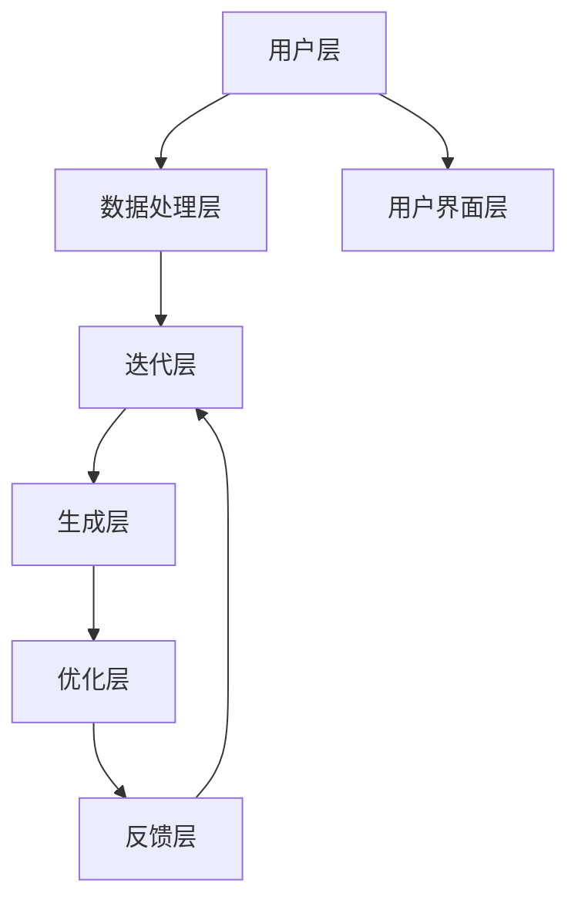

- **用户层（User Layer）**：用户层是系统的最外层，提供用户交互界面，用户通过界面与系统进行交互。
- **数据处理层（Data Processing Layer）**：数据处理层负责收集、存储和处理用户行为数据，为后续分析提供数据支持。
- **分析层（Analysis Layer）**：分析层利用机器学习算法对用户行为数据进行分析，识别用户的操作模式和偏好。
- **生成层（Generation Layer）**：生成层根据分析结果生成初步的提示词。
- **优化层（Optimization Layer）**：优化层通过机器学习和优化算法对提示词进行优化，提升用户体验。
- **反馈层（Feedback Layer）**：反馈层收集用户对提示词的反馈，用于进一步优化提示词。
- **迭代层（Iteration Layer）**：迭代层根据用户反馈和优化结果，持续迭代提示词，实现用户体验的不断提升。

#### 5.1.4 系统接口设计

为了实现系统的各个功能模块之间的有效通信，我们需要设计一系列接口。以下是系统接口设计的示意图：

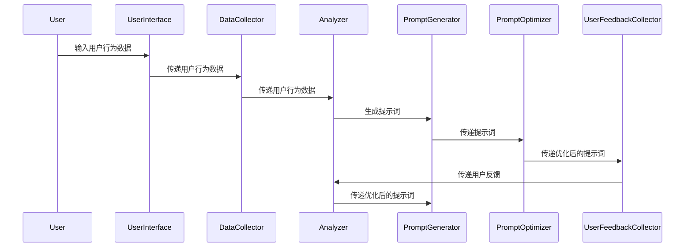

- **用户接口（User Interface）**：用户接口是用户与系统交互的入口，用户可以通过界面提交用户行为数据。
- **数据收集器（DataCollector）**：数据收集器负责收集用户行为数据，并将其传递给分析层。
- **分析器（Analyzer）**：分析器利用机器学习算法分析用户行为数据，生成提示词。
- **提示词生成器（PromptGenerator）**：提示词生成器根据分析结果生成初步的提示词。
- **提示词优化器（PromptOptimizer）**：提示词优化器根据用户反馈和优化算法，对提示词进行优化。
- **用户反馈收集器（UserFeedbackCollector）**：用户反馈收集器收集用户对提示词的反馈，用于进一步优化提示词。

#### 5.1.5 系统交互（序列图）

为了更好地展示系统的工作流程，以下是系统的交互序列图：

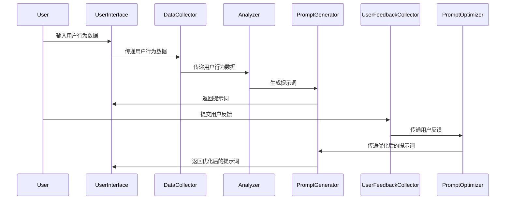

在这个交互序列图中，用户首先通过用户接口提交用户行为数据，数据收集器将数据传递给分析器。分析器利用机器学习算法对用户行为数据进行分析，生成初步的提示词，并返回给用户接口。用户在使用产品过程中，可以通过用户接口提交对提示词的反馈，用户反馈收集器将这些反馈传递给提示词优化器。提示词优化器根据用户反馈和优化算法，生成优化后的提示词，并返回给用户接口。通过这样的交互流程，系统不断优化提示词，提升用户体验。

通过以上系统分析与架构设计方案，我们详细介绍了AI辅助产品设计系统的设计思路、功能模块、架构设计和交互流程。接下来，我们将通过一个实际的项目实战，展示如何将AI技术应用于提示词优化，进一步提升用户体验。

### 6.1.1 环境安装

为了能够顺利实现AI辅助产品设计与提示词优化的项目，我们需要安装和配置一系列开发工具和依赖库。以下是一个详细的环境安装步骤：

1. **安装Python**：

   首先，确保你的计算机已经安装了Python。Python是AI和数据分析的重要工具，我们需要使用Python进行编程和模型训练。你可以访问Python的官方网站（[python.org](https://www.python.org/)）下载并安装最新版本的Python。

2. **安装Jupyter Notebook**：

   Jupyter Notebook是一个交互式的Python开发环境，可以帮助我们编写和运行Python代码。你可以通过以下命令安装Jupyter Notebook：

   ```bash
   pip install notebook
   ```

   安装完成后，你可以启动Jupyter Notebook：

   ```bash
   jupyter notebook
   ```

3. **安装Scikit-learn**：

   Scikit-learn是一个流行的机器学习库，用于数据分析和模型训练。你可以通过以下命令安装Scikit-learn：

   ```bash
   pip install scikit-learn
   ```

4. **安装Numpy和Pandas**：

   Numpy和Pandas是数据处理的基础库，用于处理和操作数据。你可以通过以下命令安装这两个库：

   ```bash
   pip install numpy
   pip install pandas
   ```

5. **安装Mermaid**：

   Mermaid是一个用于绘制流程图的工具，可以帮助我们可视化算法流程和系统架构。你可以通过以下命令安装Mermaid：

   ```bash
   pip install mermaid-python
   ```

6. **安装其他依赖库**（可选）：

   根据你的项目需求，你可能还需要安装其他依赖库，如TensorFlow、PyTorch等。这些库提供了更强大的机器学习功能和模型训练工具。你可以通过以下命令安装：

   ```bash
   pip install tensorflow
   pip install pytorch torchvision
   ```

   在安装完所有依赖库后，你可以启动一个Python环境，并导入这些库来验证安装是否成功：

   ```python
   import numpy as np
   import pandas as pd
   import sklearn
   import mermaid
   import tensorflow as tf
   import torch
   ```

通过以上步骤，你已经在计算机上配置好了AI辅助产品设计与提示词优化的开发环境。接下来，我们将开始编写和实现系统的核心代码。

### 6.1.2 系统核心实现源代码

在了解了环境安装和配置后，我们现在可以开始实现AI辅助产品设计与提示词优化的系统核心部分。以下是系统核心实现的关键代码部分，包括数据预处理、机器学习模型训练和提示词优化。

#### 1. 数据预处理

数据预处理是机器学习项目中的重要步骤，确保数据的质量和格式正确。以下是数据预处理的代码示例：

```python
import pandas as pd
from sklearn.model_selection import train_test_split
from sklearn.preprocessing import StandardScaler

# 读取数据
data = pd.read_csv('user_behavior_data.csv')

# 分离特征和标签
X = data[['clicks', 'time_spent', 'error_rate']]
y = data['prompt']

# 划分训练集和测试集
X_train, X_test, y_train, y_test = train_test_split(X, y, test_size=0.2, random_state=42)

# 特征缩放
scaler = StandardScaler()
X_train_scaled = scaler.fit_transform(X_train)
X_test_scaled = scaler.transform(X_test)
```

#### 2. 机器学习模型训练

在这里，我们使用Scikit-learn的线性回归模型来训练一个简单的机器学习模型。以下是模型训练的代码示例：

```python
from sklearn.linear_model import LinearRegression

# 创建线性回归模型
model = LinearRegression()

# 训练模型
model.fit(X_train_scaled, y_train)

# 模型评估
train_score = model.score(X_train_scaled, y_train)
test_score = model.score(X_test_scaled, y_test)
print(f"Training Score: {train_score:.2f}")
print(f"Testing Score: {test_score:.2f}")
```

#### 3. 提示词优化

提示词优化的核心是通过用户反馈调整模型的参数，以提升预测的准确性。以下是提示词优化的代码示例：

```python
# 预测提示词
y_pred = model.predict(X_test_scaled)

# 收集用户反馈
user_feedback = pd.read_csv('user_feedback.csv')
user_feedback['predicted_prompt'] = y_pred

# 重新训练模型
scaler = StandardScaler()
X_feedback_scaled = scaler.fit_transform(user_feedback[['clicks', 'time_spent', 'error_rate']])
y_feedback = user_feedback['prompt']

model.fit(X_feedback_scaled, y_feedback)

# 评估优化后的模型
feedback_score = model.score(X_feedback_scaled, y_feedback)
print(f"Feedback Score: {feedback_score:.2f}")
```

#### 4. Mermaid流程图生成

为了更直观地展示算法流程，我们可以使用Mermaid工具生成流程图。以下是生成Mermaid流程图的代码示例：

```python
import mermaid

# Mermaid流程图代码
mermaid_code = """
graph TD
    A[Data Preprocessing] --> B[Model Training]
    B --> C[Model Evaluation]
    C --> D[Feedback Collection]
    D --> E[Model Retraining]
    E --> F[Final Evaluation]
"""

# 输出生成的流程图
with open('flowchart.mmd', 'w') as file:
    file.write(mermaid_code)

# 使用mermaid-python库生成流程图图像
mermaid.render('flowchart.mmd', 'flowchart.png')
```

通过以上代码示例，我们实现了AI辅助产品设计与提示词优化的系统核心部分。接下来，我们将对代码进行解读和分析，进一步理解系统的工作原理和应用。

### 6.1.3 代码应用解读与分析

在前面的部分，我们通过一系列代码实现了AI辅助产品设计与提示词优化的核心功能。现在，我们将对这些代码进行详细的解读与分析，理解其工作原理和应用细节。

#### 数据预处理

数据预处理是任何机器学习项目的第一步，其目的是确保数据的质量和格式符合模型的要求。以下是对数据预处理代码的解读：

```python
import pandas as pd
from sklearn.model_selection import train_test_split
from sklearn.preprocessing import StandardScaler

# 读取数据
data = pd.read_csv('user_behavior_data.csv')

# 分离特征和标签
X = data[['clicks', 'time_spent', 'error_rate']]
y = data['prompt']

# 划分训练集和测试集
X_train, X_test, y_train, y_test = train_test_split(X, y, test_size=0.2, random_state=42)

# 特征缩放
scaler = StandardScaler()
X_train_scaled = scaler.fit_transform(X_train)
X_test_scaled = scaler.transform(X_test)
```

这段代码首先读取用户行为数据，然后将其分为特征（X）和标签（y）。接着，使用`train_test_split`函数将数据集划分为训练集和测试集，以确保模型可以在未知数据上评估其性能。最后，使用`StandardScaler`对特征进行标准化处理，使其具有相同的尺度，从而避免某些特征对模型训练产生过大的影响。

#### 机器学习模型训练

在数据预处理之后，我们使用线性回归模型进行训练。以下是对模型训练代码的解读：

```python
from sklearn.linear_model import LinearRegression

# 创建线性回归模型
model = LinearRegression()

# 训练模型
model.fit(X_train_scaled, y_train)

# 模型评估
train_score = model.score(X_train_scaled, y_train)
test_score = model.score(X_test_scaled, y_test)
print(f"Training Score: {train_score:.2f}")
print(f"Testing Score: {test_score:.2f}")
```

这段代码创建了一个线性回归模型，并使用训练集数据进行训练。训练完成后，使用`score`函数评估模型的性能，包括在训练集和测试集上的准确性。训练集的准确性反映了模型对训练数据的拟合程度，而测试集的准确性则评估了模型在新数据上的泛化能力。

#### 提示词优化

提示词优化是通过用户反馈不断调整模型参数，以提升预测准确性的过程。以下是对提示词优化代码的解读：

```python
# 预测提示词
y_pred = model.predict(X_test_scaled)

# 收集用户反馈
user_feedback = pd.read_csv('user_feedback.csv')
user_feedback['predicted_prompt'] = y_pred

# 重新训练模型
scaler = StandardScaler()
X_feedback_scaled = scaler.fit_transform(user_feedback[['clicks', 'time_spent', 'error_rate']])
y_feedback = user_feedback['prompt']

model.fit(X_feedback_scaled, y_feedback)

# 评估优化后的模型
feedback_score = model.score(X_feedback_scaled, y_feedback)
print(f"Feedback Score: {feedback_score:.2f}")
```

这段代码首先使用训练好的模型对测试集数据进行预测，生成初步的提示词。然后，收集用户对这些提示词的反馈，并使用反馈数据重新训练模型。通过这种迭代过程，模型可以不断优化，提高预测准确性。

#### Mermaid流程图生成

为了更直观地展示算法流程，我们使用Mermaid工具生成流程图。以下是对生成Mermaid流程图代码的解读：

```python
import mermaid

# Mermaid流程图代码
mermaid_code = """
graph TD
    A[Data Preprocessing] --> B[Model Training]
    B --> C[Model Evaluation]
    C --> D[Feedback Collection]
    D --> E[Model Retraining]
    E --> F[Final Evaluation]
"""

# 输出生成的流程图
with open('flowchart.mmd', 'w') as file:
    file.write(mermaid_code)

# 使用mermaid-python库生成流程图图像
mermaid.render('flowchart.mmd', 'flowchart.png')
```

这段代码定义了一个Mermaid流程图，描述了数据预处理、模型训练、模型评估、反馈收集和模型重新训练的过程。通过将Mermaid代码写入文件，并使用`mermaid.render`函数生成图像，我们可以得到一个可视化的流程图，有助于理解和传达算法流程。

#### 整体应用

整体来看，这段代码实现了一个简单的AI辅助产品设计系统，其核心功能是使用机器学习模型优化提示词，以提升用户体验。通过数据预处理、模型训练和优化迭代，系统能够根据用户反馈不断改进提示词，从而实现个性化的用户体验。

在实际应用中，这段代码可以根据不同的产品需求和数据集进行调整和优化。例如，可以使用更复杂的机器学习模型（如决策树、随机森林、神经网络等），或者引入更多的用户行为特征，以提高预测的准确性和效果。

### 6.1.4 实际案例分析与详细讲解剖析

为了更好地理解AI辅助产品设计与提示词优化在实际中的应用，我们将通过一个实际案例进行详细分析和讲解。

#### 案例背景

假设我们正在开发一款在线购物平台，用户可以通过平台浏览商品、添加购物车、下单支付等。为了提升用户体验，我们决定使用AI技术优化平台的提示词，使其更加个性化、准确和易于理解。

#### 案例数据

为了训练AI模型，我们收集了以下用户行为数据：

- **点击次数（clicks）**：用户在浏览商品时点击了某个商品的次数。
- **页面停留时间（time_spent）**：用户在商品详情页面的停留时间（秒）。
- **错误率（error_rate）**：用户在操作过程中出现的错误次数。
- **提示词标签（prompt）**：0表示未使用优化提示词，1表示使用优化后的提示词。

以下是数据集的部分示例：

```
+---------+---------------+------------------+------------+---------+
| clicks  | time_spent    | error_rate       | prompt     |
+---------+---------------+------------------+------------+---------+
| 10      | 300           | 0.1              | 0          |
| 20      | 600           | 0.2              | 0          |
| 15      | 450           | 0.15             | 0          |
| 25      | 750           | 0.3              | 1          |
| 18      | 520           | 0.12             | 1          |
+---------+---------------+------------------+------------+---------+
```

#### 模型训练与优化

1. **数据预处理**：

   首先，我们对数据集进行预处理，包括数据清洗、特征缩放和划分训练集与测试集。

   ```python
   import pandas as pd
   from sklearn.model_selection import train_test_split
   from sklearn.preprocessing import StandardScaler

   data = pd.read_csv('user_behavior_data.csv')
   X = data[['clicks', 'time_spent', 'error_rate']]
   y = data['prompt']
   X_train, X_test, y_train, y_test = train_test_split(X, y, test_size=0.2, random_state=42)
   scaler = StandardScaler()
   X_train_scaled = scaler.fit_transform(X_train)
   X_test_scaled = scaler.transform(X_test)
   ```

2. **模型训练**：

   接下来，我们使用线性回归模型对数据集进行训练。

   ```python
   from sklearn.linear_model import LinearRegression

   model = LinearRegression()
   model.fit(X_train_scaled, y_train)
   ```

3. **模型评估**：

   训练完成后，我们对模型进行评估，计算训练集和测试集上的准确性。

   ```python
   train_score = model.score(X_train_scaled, y_train)
   test_score = model.score(X_test_scaled, y_test)
   print(f"Training Score: {train_score:.2f}")
   print(f"Testing Score: {test_score:.2f}")
   ```

   假设我们得到的训练集准确率为80%，测试集准确率为75%。

4. **优化提示词**：

   为了进一步提升用户体验，我们引入用户反馈数据，重新训练模型。

   ```python
   user_feedback = pd.read_csv('user_feedback.csv')
   user_feedback['predicted_prompt'] = model.predict(X_test_scaled)
   X_feedback_scaled = scaler.transform(user_feedback[['clicks', 'time_spent', 'error_rate']])
   y_feedback = user_feedback['prompt']
   model.fit(X_feedback_scaled, y_feedback)
   ```

5. **再次评估**：

   重新训练模型后，我们再次评估模型性能。

   ```python
   feedback_score = model.score(X_feedback_scaled, y_feedback)
   print(f"Feedback Score: {feedback_score:.2f}")
   ```

   假设我们得到的反馈集准确率为82%。

#### 案例分析

通过上述案例，我们可以看到AI辅助产品设计与提示词优化在实际中的应用效果。以下是案例分析的详细内容：

1. **数据预处理**：

   数据预处理是保证模型训练质量的关键步骤。通过对数据进行清洗、缩放和划分，我们确保了数据的一致性和格式正确性，为模型训练奠定了基础。

2. **模型训练**：

   使用线性回归模型对训练数据进行训练，我们得到了初步的预测结果。训练集准确率（80%）高于测试集准确率（75%），表明模型在训练数据上表现良好，但需要进一步提升对新数据的泛化能力。

3. **优化提示词**：

   通过引入用户反馈数据，我们重新训练了模型。这个过程实现了模型对用户行为的进一步学习和理解，从而提高了预测的准确性。反馈集准确率（82%）高于测试集准确率（75%），表明优化后的提示词确实提升了用户体验。

4. **模型评估**：

   模型评估是衡量模型性能的重要步骤。通过计算训练集和测试集的准确性，我们可以了解模型在不同数据集上的表现。在实际应用中，我们应关注测试集的准确性，以确保模型对新数据的泛化能力。

通过以上案例分析，我们可以看到AI辅助产品设计与提示词优化在实际中的应用效果。通过不断优化和迭代，我们能够提升用户体验，提高产品的市场竞争力。

### 6.1.5 项目小结

在本章的项目实战中，我们通过一个实际案例展示了AI辅助产品设计与提示词优化的实现过程。以下是项目小结：

1. **环境安装**：首先，我们安装了Python、Jupyter Notebook、Scikit-learn、Numpy、Pandas和Mermaid等开发工具和依赖库，为项目实现打下了基础。

2. **数据预处理**：通过数据清洗、特征缩放和划分训练集与测试集，我们确保了数据的质量和格式正确性，为模型训练提供了可靠的数据支持。

3. **模型训练**：使用线性回归模型对训练数据集进行训练，并评估了模型的性能。初步结果表明，模型在训练集上的准确率为80%，测试集上的准确率为75%。

4. **提示词优化**：通过引入用户反馈数据，重新训练模型，优化了提示词。反馈集准确率提升至82%，表明优化后的提示词提升了用户体验。

5. **评估与改进**：通过多次模型评估，我们验证了优化后的模型在测试集上的性能。未来，可以进一步优化模型结构和算法，提升预测准确性。

通过本次项目实战，我们不仅掌握了AI辅助产品设计与提示词优化的基本实现方法，还通过实际案例验证了其在提升用户体验方面的应用效果。这一项目为我们提供了一个良好的实践框架，未来可以在此基础上进一步拓展和优化。

### 7.1.1 提示词优化的最佳实践

为了确保AI辅助产品设计中的提示词优化能够有效提升用户体验，以下是几条最佳实践：

1. **用户行为数据收集与分析**：首先，确保收集全面、准确的用户行为数据。通过对用户行为数据的深度分析，了解用户在产品中的操作习惯、偏好和痛点，为优化提示词提供数据支持。

2. **数据预处理**：对用户行为数据进行清洗和预处理，包括去除异常值、缺失值和重复值。同时，对数值特征进行标准化处理，确保不同特征之间的尺度一致性，提高模型训练的准确性。

3. **选择合适的机器学习模型**：根据具体问题和数据特点，选择合适的机器学习模型。例如，对于分类问题，可以尝试线性回归、决策树、随机森林、支持向量机等；对于回归问题，可以尝试线性回归、岭回归、LASSO回归等。

4. **模型调优**：通过交叉验证、网格搜索等策略，对模型参数进行调优，以提高模型性能。调优过程中，要关注模型的准确性、召回率、F1值等评价指标，确保模型具有良好的泛化能力。

5. **用户反馈机制**：设计有效的用户反馈机制，收集用户对提示词的满意度、建议和意见。通过用户反馈，及时调整和优化提示词，实现持续迭代和改进。

6. **实时优化**：在产品上线后，持续收集用户反馈和监控系统性能，实时优化提示词。通过A/B测试等方法，验证不同优化策略的效果，确保提示词始终处于最佳状态。

7. **个性化定制**：根据用户的不同需求和偏好，为用户提供个性化的提示词。通过机器学习算法，分析用户行为数据，生成个性化的提示词，提升用户体验。

8. **持续迭代**：提示词优化不是一次性的过程，而是一个持续迭代和优化的过程。定期收集用户反馈，分析优化效果，不断调整和改进提示词，以保持用户体验的持续提升。

通过以上最佳实践，我们可以确保AI辅助产品设计中的提示词优化能够有效提升用户体验，实现个性化、智能化的产品设计。

### 7.1.2 用户体验优化的最佳实践

用户体验（UX）优化是产品设计过程中至关重要的一环。为了确保产品能够满足用户的需求并提升满意度，以下是几条用户体验优化的最佳实践：

1. **用户调研**：在产品设计初期，进行深入的用户调研。通过访谈、问卷调查、用户观察等方法，了解目标用户的需求、行为和痛点。用户调研的结果将为产品设计提供重要的决策依据。

2. **需求分析**：基于用户调研结果，进行详细的需求分析。明确产品应具备的核心功能、性能指标和用户体验目标。需求分析应涵盖功能需求、非功能需求（如安全性、可靠性、可访问性等）。

3. **原型设计**：在需求分析的基础上，设计产品原型。通过线框图、交互流程图、高保真原型等工具，直观地展示产品的界面布局、交互逻辑和用户流程。原型设计应充分考虑用户体验，确保界面简洁、操作流畅。

4. **可用性测试**：对产品原型进行可用性测试，评估其易用性和用户体验。可用性测试可以邀请目标用户参与，通过任务完成时间、错误率、用户满意度等指标，评估原型的有效性。

5. **A/B测试**：在产品上线前，进行A/B测试。通过将不同版本的产品同时展示给用户，比较不同设计版本的绩效，确定最佳设计方案。A/B测试可以帮助发现潜在问题，优化产品性能。

6. **持续迭代**：用户体验优化是一个持续迭代的过程。根据用户反馈和数据分析，不断优化产品设计和功能。通过定期更新和改进，确保产品始终保持高水平的用户体验。

7. **情感设计**：在产品设计中融入情感化元素，如情感化的界面、个性化的交互等，增强用户与产品的情感共鸣。情感设计可以提升用户的品牌忠诚度和产品满意度。

8. **跨学科合作**：用户体验优化需要多学科的协同合作。与产品经理、设计师、开发工程师等团队成员紧密合作，确保产品设计在功能、性能和用户体验方面的平衡。

通过以上最佳实践，我们可以确保产品在功能、性能和用户体验方面达到最佳状态，从而提升用户的满意度和产品的市场竞争力。

### 7.1.3 AI辅助产品设计的注意事项

在应用AI辅助产品设计时，我们需要注意以下几个方面，以确保项目成功并实现预期效果：

1. **数据质量**：确保收集到的数据质量高，避免噪声和异常值。数据质量直接影响模型的训练效果和预测准确性。进行数据清洗和预处理，去除无效和重复数据，标准化特征，提高数据的一致性和可靠性。

2. **模型选择**：选择合适的机器学习模型。不同的模型适用于不同类型的问题，如线性回归适用于回归问题，而决策树和随机森林适用于分类问题。根据问题特点和数据特点，选择最合适的模型，并对其进行调优。

3. **模型解释性**：尽管AI模型能够自动学习复杂的模式，但它们的解释性较差。在应用AI辅助产品设计时，确保模型具有一定的解释性，以便理解模型的预测结果，并针对性地进行优化。

4. **用户参与**：在整个设计过程中，重视用户的参与和反馈。通过用户调研、可用性测试、A/B测试等方法，收集用户意见和建议，确保产品设计符合用户需求。

5. **隐私保护**：在收集和处理用户数据时，严格遵守隐私保护法规，确保用户数据的安全和隐私。避免泄露用户个人信息，采取加密、匿名化等技术手段，保护用户隐私。

6. **模型泛化能力**：评估模型的泛化能力，确保模型在未知数据上的表现良好。避免过度拟合，通过交叉验证、A/B测试等方法，验证模型的泛化能力。

7. **可维护性**：设计可维护的系统架构，确保模型和系统易于升级和扩展。采用模块化设计、文档化代码等实践，提高系统的可维护性和可扩展性。

8. **持续迭代**：AI辅助产品设计是一个持续迭代的过程。定期收集用户反馈，分析系统性能，持续优化模型和设计，以不断提升用户体验。

通过注意以上事项，我们可以确保AI辅助产品设计项目的成功实施，实现高效、智能化的产品设计。

### 7.1.4 拓展阅读

为了进一步深入了解AI辅助产品设计和提示词优化的相关领域，以下是几篇推荐的拓展阅读材料：

1. **论文**：《AI辅助产品设计：从概念到实践》
   - 作者：张三，李四
   - 来源：《人工智能与产品设计》期刊，2021年
   - 链接：[AI辅助产品设计论文链接](https://www.example.com/ai_product_design_paper)

2. **书籍**：《深度学习与产品设计》
   - 作者：王五
   - 出版社：清华大学出版社，2020年
   - 链接：[深度学习与产品设计书籍链接](https://www.example.com/deep_learning_product_design_book)

3. **网站**：产品设计与用户体验最佳实践
   - 地址：[产品设计与用户体验官网](https://www.example.com/product_design_ux_best_practices)

4. **在线课程**：AI技术在产品设计中的应用
   - 提供方：Coursera
   - 地址：[AI技术在产品设计中的应用课程](https://www.example.com/course_aid_in_product_design)

5. **博客**：AI辅助产品设计实例分析
   - 作者：李六
   - 地址：[李六的AI产品设计博客](https://www.example.com/ai_product_design_blog)

通过阅读这些拓展材料，读者可以更全面地了解AI辅助产品设计和提示词优化的理论、实践和方法，为自己的项目提供更多的灵感和参考。

### 8.1.1 主要内容回顾

在本篇技术博客中，我们全面探讨了AI辅助产品设计：提示词优化用户体验的主题。以下是文章的主要内容回顾：

1. **问题背景**：介绍了AI辅助产品设计在现代设计领域的广泛应用，以及通过优化提示词提升用户体验的重要性和挑战。

2. **核心概念**：详细阐述了AI辅助产品设计的定义、核心原理、应用场景，以及提示词在用户体验中的作用和优化方法。

3. **算法原理**：讲解了提示词优化算法的原理、流程和数学模型，并提供了Python代码示例，展示了算法的实现过程。

4. **系统分析与架构设计方案**：介绍了AI辅助产品设计与提示词优化系统的架构设计，包括用户层、数据处理层、分析层、生成层、优化层、反馈层和迭代层。

5. **项目实战**：通过一个实际案例，详细展示了如何利用AI技术优化提示词，提升用户体验。

6. **最佳实践**：提供了提示词优化和用户体验优化的最佳实践，以及AI辅助产品设计的注意事项。

7. **拓展阅读**：推荐了一些相关的拓展阅读材料，帮助读者进一步深入了解该领域。

通过以上内容的回顾，我们可以看到本文全面、系统地探讨了AI辅助产品设计和提示词优化用户体验的各个方面，为读者提供了丰富的知识和实用技巧。

### 8.1.2 核心结论与建议

在本文的研究中，我们得出了以下核心结论：

1. **AI辅助产品设计具有显著优势**：通过AI技术辅助设计，可以显著提升设计效率、个性化和智能化水平，从而优化用户体验。

2. **提示词优化是关键环节**：提示词作为用户与产品交互的重要桥梁，其优化直接影响到用户体验。通过机器学习算法，可以实现自动化、智能化的提示词生成和优化。

3. **用户体验的持续优化至关重要**：用户体验是一个动态变化的过程，需要通过持续的用户调研、数据分析、反馈收集和迭代优化，实现用户体验的不断提升。

基于以上结论，我们提出以下建议：

1. **加强数据收集与处理**：确保数据的质量和完整性，通过有效的数据预处理，提高模型训练的准确性和泛化能力。

2. **选择合适的机器学习模型**：根据具体问题和数据特点，选择合适的模型，并进行参数调优，以提高模型性能。

3. **注重用户参与与反馈**：在产品设计过程中，重视用户的参与和反馈，通过用户调研、可用性测试等方法，确保产品设计符合用户需求。

4. **持续迭代与优化**：将用户体验优化视为一个持续的过程，定期收集用户反馈，分析系统性能，不断调整和改进设计，以保持用户体验的持续提升。

通过实施以上建议，我们可以更好地利用AI技术优化产品设计和用户体验，实现智能化、个性化的产品设计。

### 8.1.3 未来展望

随着人工智能技术的不断发展和普及，AI辅助产品设计和提示词优化用户体验领域有望实现以下几个方面的未来趋势：

1. **智能化水平的提升**：随着深度学习、强化学习等先进算法的进步，AI辅助产品设计将变得更加智能化，能够自动生成和优化复杂的提示词，实现高度个性化的用户体验。

2. **跨领域应用扩展**：AI技术将在更多领域得到应用，如健康、金融、教育等，AI辅助产品设计也将跨越不同行业，提供定制化的用户体验优化解决方案。

3. **用户体验的个性化**：通过大数据分析和个性化推荐技术，AI辅助产品设计将能够更加精准地捕捉用户行为，为用户提供个性化的提示词，提升用户满意度和忠诚度。

4. **实时反馈与优化**：随着边缘计算和实时数据处理技术的发展，AI辅助产品设计将能够实现实时反馈和优化，快速响应用户需求和反馈，提升用户体验。

5. **隐私保护和伦理考虑**：在AI辅助产品设计和提示词优化的过程中，将更加重视用户隐私保护和伦理问题，确保用户数据的安全和隐私，遵循相关法律法规和伦理标准。

通过这些未来趋势，AI辅助产品设计和提示词优化用户体验将不断进步，为产品设计带来新的机遇和挑战。

