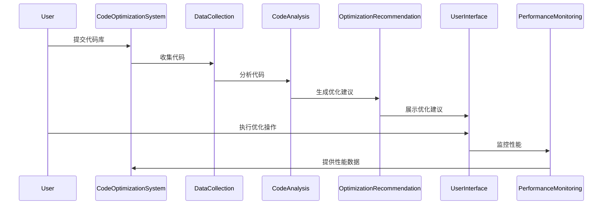
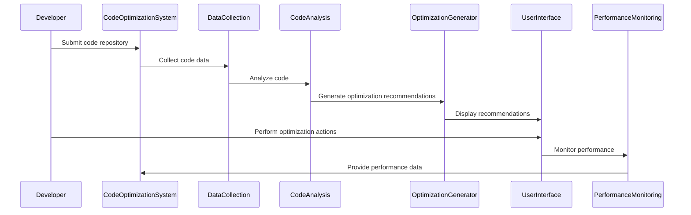
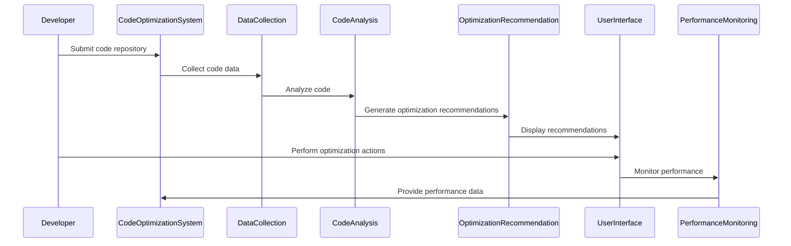

                 

# AI辅助代码优化中的提示词设计

## 关键词
- 人工智能，代码优化，提示词设计，自然语言处理，算法原理

## 摘要
本文将探讨AI辅助代码优化中的提示词设计。通过分析AI辅助代码优化的背景和需求，深入理解提示词的概念、作用及其设计边界。接着，我们将详细讲解提示词生成的算法原理，包括基本流程、数学模型以及Python实现。随后，我们将从系统架构设计、核心实现源代码、系统测试与优化等方面介绍AI辅助代码优化系统的设计与实现。最后，通过一个实战项目，我们将展示AI辅助代码优化的实际应用和效果。

## 目录大纲

### 第一部分：背景介绍

### 第1章：AI辅助代码优化中的提示词设计概述

### 1.1 问题背景与定义

### 1.1.1 AI辅助代码优化的背景

### 1.1.2 提示词的定义与作用

### 1.1.3 提示词设计的边界与外延

### 1.2 核心概念与联系

### 1.2.1 相关概念解析

### 1.2.2 概念属性特征对比表格

### 1.2.3 ER实体关系图架构

### 1.3 AI辅助代码优化的现状与挑战

### 1.4 AI辅助代码优化中的提示词设计

### 1.5 本章小结

### 第二部分：算法原理讲解

### 第2章：提示词生成的算法原理

### 2.1 提示词生成算法的基本流程

### 2.2 提示词生成算法的数学模型

### 2.3 提示词生成算法的Python实现

### 2.4 本章小结

### 第三部分：系统分析与架构设计

### 第3章：AI辅助代码优化系统的设计与实现

### 3.1 问题场景介绍

### 3.2 系统架构设计

### 3.3 系统核心实现源代码

### 3.4 系统测试与优化

### 3.5 本章小结

### 第四部分：项目实战

### 第4章：AI辅助代码优化实战项目

### 4.1 环境安装与准备

### 4.2 系统核心功能实现

### 4.3 代码应用解读与分析

### 4.4 实际案例分析与详细讲解

### 4.5 项目小结

### 最佳实践 tips、小结、注意事项、拓展阅读等内容

### 作者
作者：AI天才研究院/AI Genius Institute & 禅与计算机程序设计艺术 /Zen And The Art of Computer Programming### 第一部分：背景介绍

### 第1章：AI辅助代码优化中的提示词设计概述

#### 1.1 问题背景与定义

在当今的软件开发领域，代码优化的需求日益增长。随着软件项目的规模和复杂度不断增加，开发者面临着代码效率低下、可维护性差等问题。AI技术的快速发展为解决这些问题提供了新的可能性，特别是AI辅助代码优化。AI辅助代码优化利用人工智能算法来分析和优化代码，从而提高代码的执行效率和可读性。

在这种背景下，提示词设计成为一个关键环节。提示词（Prompt）在AI领域通常指的是用于引导模型生成特定结果的输入文本。在代码优化中，提示词的设计直接影响AI模型的性能和优化效果。一个优秀的提示词设计能够有效地引导AI模型理解代码优化的目标，从而生成更为有效的优化建议。

**问题背景：**

- **代码优化需求：** 随着软件项目的复杂度增加，开发者需要更高的代码优化效率来提高软件的性能和可维护性。
- **AI技术发展：** 人工智能算法在自然语言处理（NLP）和代码理解方面取得了显著进展，为AI辅助代码优化提供了技术支持。
- **提示词设计重要性：** 提示词的设计直接关系到AI模型对代码优化任务的理解和执行效果。

**问题描述：**

- **优化效果不理想：** 未经精心设计的提示词可能导致AI模型生成无效或低效的优化建议。
- **适应性不足：** 提示词设计的通用性差，无法适应不同类型和规模的代码优化任务。

**问题解决：**

- **优化提示词设计：** 通过分析现有问题和需求，设计适应不同代码类型的提示词。
- **提高模型理解能力：** 利用深度学习和自然语言处理技术，提高AI模型对代码的理解和优化能力。

**边界与外延：**

- **设计限制条件：** 提示词设计需考虑代码的语法、语义和上下文，避免误导模型。
- **影响因素：** 提示词设计受限于AI模型的训练数据和算法性能，以及实际应用场景的需求。

**核心概念与联系：**

- **代码优化：** 涉及提高代码的执行效率、可维护性和可扩展性。
- **AI模型：** 用于分析代码、生成优化建议的算法模型。
- **自然语言处理（NLP）：** 用于处理和理解文本数据的领域，对代码优化中的提示词设计至关重要。

#### 1.2 核心概念与联系

**1.2.1 相关概念解析**

**代码优化：** 代码优化是指通过各种技术和方法来改进代码的执行效率、可维护性和可扩展性。它包括算法优化、数据结构优化、编译器优化等。

**AI模型：** AI模型是指通过学习和分析大量数据，自动完成特定任务的计算机程序。在代码优化中，AI模型用于分析代码，生成优化建议。

**自然语言处理（NLP）：** 自然语言处理是人工智能的一个分支，专注于计算机和人类语言之间的交互。在代码优化中，NLP技术用于理解和生成与代码相关的提示词。

**1.2.2 概念属性特征对比表格**

| 概念         | 属性特征                              | 对比分析                                       |
| ------------ | ----------------------------------- | -------------------------------------------- |
| 代码优化     | 执行效率、可维护性、可扩展性           | 提高代码性能和开发效率                         |
| AI模型       | 学习能力、自适应能力、预测能力         | 支持自动化代码分析和优化                       |
| 自然语言处理 | 文本理解、文本生成、语言模型           | 支持提示词设计，提高AI模型对代码的理解能力       |

**1.2.3 ER实体关系图架构**

```mermaid
erDiagram
  CodeOptimization ||--|{ AIModel : optimized_by }
  AIModel ||--|{ NaturalLanguageProcessing : utilizes }
  NaturalLanguageProcessing ||--|{ PromptDesign : guides }
```

在这个ER实体关系图中，`CodeOptimization`（代码优化）通过`optimized_by`关系与`AIModel`（AI模型）相连，表示AI模型是代码优化的工具。`AIModel`与`NaturalLanguageProcessing`（自然语言处理）通过`utilizes`关系相连，表明自然语言处理为AI模型提供了支持。`NaturalLanguageProcessing`与`PromptDesign`（提示词设计）通过`guides`关系相连，表示提示词设计指导AI模型的训练和应用。

**1.3 AI辅助代码优化的现状与挑战**

**1.3.1 AI辅助代码优化的现状**

AI辅助代码优化目前处于快速发展阶段，已经取得了一些显著成果。以下是一些当前主流的AI辅助代码优化技术和实际应用中的成功案例：

- **代码分析工具：** AI技术被广泛应用于代码分析工具，如SonarQube、DeepCode等，这些工具可以自动发现代码中的潜在问题和缺陷。

- **代码生成工具：** 利用AI技术，可以自动生成部分代码，如GitHub Copilot等，它通过分析代码片段和上下文来生成代码补全建议。

- **代码重构工具：** AI辅助代码优化工具可以自动进行代码重构，提高代码的可读性和可维护性，例如ReSharper、AIRecon等。

- **实际应用案例：** 在大型软件项目中，AI辅助代码优化已经应用于性能优化、内存管理、错误修复等多个方面，取得了显著的效果。

**1.3.2 提示词设计面临的挑战**

尽管AI辅助代码优化取得了显著进展，但在提示词设计方面仍面临以下挑战：

- **数据质量与多样性：** 提示词生成需要大量的高质量数据作为训练样本，但现有的数据集可能存在数据质量不高、数据多样性不足的问题。

- **上下文理解与适应性：** 提示词需要能够准确理解代码的上下文，并在不同的场景中自适应调整，这要求AI模型具有强大的上下文理解能力。

- **真实世界中的复杂性：** 代码优化任务通常涉及多种编程语言、框架和场景，AI模型需要能够处理这些复杂因素。

**1.4 AI辅助代码优化中的提示词设计**

提示词设计在AI辅助代码优化中起着至关重要的作用。一个有效的提示词设计需要考虑以下几个方面：

- **数据预处理：** 对训练数据进行清洗和处理，确保数据质量，同时增加数据的多样性。

- **提示词生成策略：** 设计生成策略，确保提示词能够准确表达代码优化的目标和需求。

- **提示词优化策略：** 对生成的提示词进行优化，以提高AI模型对提示词的理解和生成效果。

- **NLP技术应用：** 利用自然语言处理技术，提高提示词的生成质量和AI模型对代码的解析能力。

- **适应性调整：** 根据不同场景和代码类型，对提示词进行适应性调整，以提高其在实际应用中的效果。

**1.5 本章小结**

本章对AI辅助代码优化中的提示词设计进行了背景介绍和概述。首先，分析了AI辅助代码优化的背景和需求，然后探讨了提示词的定义、作用及其设计边界。接着，介绍了核心概念与联系，包括代码优化、AI模型和自然语言处理。最后，讨论了AI辅助代码优化的现状与挑战，并提出了有效的提示词设计策略。通过本章的介绍，为后续章节的深入探讨奠定了基础。

### 第一部分：背景介绍

### 第1章：AI辅助代码优化中的提示词设计概述

在当今的软件开发领域，代码优化是一项至关重要的任务。随着软件系统的规模和复杂性不断增加，开发者面临着提高代码执行效率、可维护性和可扩展性的巨大挑战。人工智能（AI）技术的快速发展为解决这些挑战提供了新的可能性，特别是在AI辅助代码优化领域。提示词设计作为AI辅助代码优化中的关键环节，其重要性不容忽视。

#### 1.1 问题背景与定义

**AI辅助代码优化的背景**

AI辅助代码优化是指利用人工智能算法，特别是机器学习和自然语言处理（NLP）技术，对代码进行分析和优化，以提高代码的性能和可维护性。随着AI技术的不断进步，越来越多的开发者开始探索如何将AI技术应用于代码优化，以减轻手动优化带来的负担。

- **趋势分析：** AI在软件开发中的应用越来越广泛，从代码生成到代码审查、性能优化等，AI技术已经展现出显著的优势。
- **应用场景：** AI辅助代码优化可以应用于各种类型的软件项目，包括企业级应用、Web应用、移动应用等。

**代码优化的挑战与需求**

代码优化涉及多个方面，包括算法优化、数据结构优化和编译器优化等。然而，随着代码规模的不断扩大，传统的优化方法已经难以应对现代软件系统的复杂性。AI辅助代码优化应运而生，旨在解决以下挑战：

- **优化效率：** 传统的优化方法通常需要大量的人工参与，而AI辅助代码优化可以通过自动化方式显著提高优化效率。
- **可维护性：** 随着代码库的规模和复杂性增加，代码的可维护性变得越来越重要。AI辅助代码优化可以帮助开发者识别潜在问题，提高代码的清晰度和可维护性。
- **性能提升：** AI技术可以分析代码的执行细节，提出针对性的优化建议，从而提高代码的性能。

**提示词的定义与作用**

在AI辅助代码优化中，提示词（Prompt）是指用于引导AI模型生成特定结果的输入文本。提示词的作用在于为AI模型提供明确的任务目标，从而提高模型在特定任务中的表现。

- **定义：** 提示词是一种自然语言描述，用于指导AI模型理解任务目标和上下文。
- **作用：** 提示词可以帮助AI模型更好地理解代码的上下文和优化目标，从而生成更为有效的优化建议。

**提示词在代码优化中的角色**

提示词在AI辅助代码优化中扮演着至关重要的角色，其主要作用包括：

- **引导模型学习：** 提示词为AI模型提供了明确的任务目标和上下文，帮助模型更好地学习优化策略。
- **提高优化效果：** 合适的提示词设计可以显著提高AI模型的优化效果，使优化建议更具针对性和有效性。
- **增强可解释性：** 提示词可以为开发者提供关于优化建议的解释，帮助开发者理解AI模型的工作原理和优化目标。

**提示词设计的边界与外延**

提示词设计不仅需要考虑任务目标，还要考虑代码的语法、语义和上下文。以下是对提示词设计边界和外延的详细讨论：

- **设计限制条件：**
  - **语法一致性：** 提示词应遵循代码的语法规则，确保模型能够正确理解输入文本。
  - **语义准确性：** 提示词需要准确传达优化目标，避免歧义和误解。
  - **上下文适应性：** 提示词应能够适应不同的代码上下文和优化场景。

- **影响因素：**
  - **数据质量：** 提示词设计依赖于高质量的数据集，数据质量直接影响提示词的有效性。
  - **模型性能：** AI模型的性能和适应性也会影响提示词的设计效果。
  - **应用场景：** 不同的应用场景可能需要不同的提示词设计策略，提示词设计应具有灵活性。

通过上述讨论，我们可以看出，AI辅助代码优化中的提示词设计是一项复杂而关键的任务。有效的提示词设计不仅需要理解代码的上下文和优化目标，还需要考虑数据质量和模型性能等因素。在下一节中，我们将进一步探讨核心概念与联系，以帮助读者更好地理解AI辅助代码优化和提示词设计的本质。

#### 1.2 核心概念与联系

在深入探讨AI辅助代码优化中的提示词设计之前，有必要明确一些核心概念，并理解这些概念之间的联系。以下是几个关键概念的定义、属性特征以及它们在代码优化中的应用。

**1.2.1 相关概念解析**

**代码优化：** 代码优化是指通过改进代码的结构、算法和数据结构来提高其性能、可维护性和可扩展性的过程。代码优化可以包括算法改进、数据结构优化、编译器优化等。

- **属性特征：** 执行效率、可维护性、可扩展性。
- **应用：** 提高代码运行速度，减少内存占用，提高代码的清晰度和可读性。

**AI模型：** AI模型是通过学习数据来执行特定任务的计算机程序。在代码优化中，AI模型用于分析代码并生成优化建议。

- **属性特征：** 学习能力、自适应能力、预测能力。
- **应用：** 自动分析代码结构，识别潜在的优化机会，生成优化建议。

**自然语言处理（NLP）：** 自然语言处理是计算机科学和人工智能的一个分支，专注于计算机和人类语言之间的交互。在代码优化中，NLP技术用于生成和理解提示词。

- **属性特征：** 文本理解、文本生成、语言模型。
- **应用：** 提取代码中的关键信息，生成描述性强的提示词，帮助AI模型更好地理解优化任务。

**1.2.2 概念属性特征对比表格**

以下表格对比了代码优化、AI模型和自然语言处理三个核心概念的属性特征：

| 概念         | 属性特征                              | 对比分析                                       |
| ------------ | ----------------------------------- | -------------------------------------------- |
| 代码优化     | 执行效率、可维护性、可扩展性           | 提高代码性能和开发效率                         |
| AI模型       | 学习能力、自适应能力、预测能力         | 支持自动化代码分析和优化                       |
| 自然语言处理 | 文本理解、文本生成、语言模型           | 支持提示词设计，提高AI模型对代码的理解能力       |

**1.2.3 ER实体关系图架构**

为了更好地理解这些概念之间的联系，我们使用ER图（实体关系图）来展示它们之间的关系。以下是AI辅助代码优化中提示词设计涉及的实体关系图：

```mermaid
erDiagram
  CodeOptimization ||--|{ AIModel : optimized_by }
  AIModel ||--|{ NaturalLanguageProcessing : utilizes }
  NaturalLanguageProcessing ||--|{ PromptDesign : guides }
```

在这个ER图中，`CodeOptimization`（代码优化）通过`optimized_by`关系与`AIModel`（AI模型）相连，表示AI模型是代码优化的工具。`AIModel`与`NaturalLanguageProcessing`（自然语言处理）通过`utilizes`关系相连，表明自然语言处理为AI模型提供了支持。`NaturalLanguageProcessing`与`PromptDesign`（提示词设计）通过`guides`关系相连，表示提示词设计指导AI模型的训练和应用。

通过上述讨论，我们明确了AI辅助代码优化中的核心概念，并理解了它们之间的联系。在接下来的章节中，我们将进一步探讨AI辅助代码优化的现状与挑战，以及提示词生成算法的原理和实现。

#### 1.3 AI辅助代码优化的现状与挑战

**1.3.1 AI辅助代码优化的现状**

随着人工智能技术的迅猛发展，AI辅助代码优化已经成为软件开发领域的一个重要研究方向。当前，AI辅助代码优化技术已经取得了显著的进展，并在实际应用中展现出了巨大的潜力。以下是一些主要现状：

- **主流技术：** 当前，主流的AI辅助代码优化技术包括代码分析工具、代码生成工具和代码重构工具。例如，SonarQube、DeepCode等工具利用AI技术自动检测代码中的潜在问题和缺陷，提供优化建议。
- **应用案例：** AI辅助代码优化在大型软件项目中得到了广泛应用。例如，在一些企业级应用中，AI技术用于性能优化和内存管理，显著提高了系统的稳定性和性能。
- **成功案例：** 一些开源项目和商业软件已经成功应用了AI辅助代码优化技术。例如，GitHub Copilot能够根据代码上下文自动生成代码补全建议，提高了开发效率。

**1.3.2 提示词设计面临的挑战**

尽管AI辅助代码优化取得了显著进展，但在提示词设计方面仍面临许多挑战。以下是几个主要挑战：

- **数据质量与多样性：** 提示词设计依赖于高质量的数据集。然而，现有的数据集可能存在数据质量不高、数据多样性不足的问题。高质量的数据是训练强大AI模型的基础，数据质量问题直接影响提示词的有效性。
- **上下文理解与适应性：** 提示词需要能够准确理解代码的上下文，并在不同的场景中自适应调整。然而，AI模型在理解复杂代码上下文方面仍然存在困难，这要求提示词设计更加精细和智能化。
- **真实世界中的复杂性：** 代码优化任务通常涉及多种编程语言、框架和场景，AI模型需要能够处理这些复杂因素。然而，真实世界的代码环境复杂多变，这使得提示词设计面临更大的挑战。

**1.3.3 提示词设计的策略与原则**

为了应对上述挑战，提示词设计需要遵循一些策略和原则：

- **高质量数据集：** 收集和整理高质量的数据集，包括多样化的代码样本，以提高提示词的泛化能力和适应性。
- **上下文敏感性：** 设计提示词时，充分考虑代码的上下文信息，确保提示词能够准确表达代码的优化目标。
- **适应性调整：** 提示词设计应具备一定的灵活性，能够根据不同的代码类型和应用场景进行适应性调整。
- **多模态融合：** 结合多种数据来源，如代码文本、静态分析数据等，以增强提示词的丰富度和准确性。

通过上述策略和原则，我们可以更好地应对提示词设计面临的挑战，提高AI辅助代码优化的效果和实用性。

#### 1.4 AI辅助代码优化中的提示词设计

提示词设计是AI辅助代码优化中的关键环节，其核心目的是通过提供明确的任务目标，帮助AI模型更好地理解和执行代码优化任务。一个有效的提示词设计不仅需要准确表达优化目标，还要充分考虑代码的上下文信息，以提高AI模型的性能和优化效果。以下是提示词设计的主要流程和方法。

**1.4.1 提示词设计的流程与方法**

提示词设计的流程可以分为以下几个步骤：

1. **需求分析：** 确定代码优化的目标和应用场景，明确需要优化的代码部分及其上下文信息。
2. **数据预处理：** 收集和整理与优化目标相关的数据，进行数据清洗和预处理，确保数据的质量和多样性。
3. **提示词生成：** 利用自然语言处理（NLP）技术，生成描述优化目标的提示词。提示词应尽可能简洁明了，同时包含足够的上下文信息。
4. **优化策略：** 根据实际应用场景和优化目标，设计不同的优化策略，如基于规则的方法、基于模型的方法等。
5. **评估与调整：** 对生成的提示词和优化结果进行评估，根据评估结果进行调整和优化。

**1.4.2 提示词设计的关键技术**

提示词设计涉及多个关键技术，包括自然语言处理（NLP）技术、机器学习和算法优化等。以下是几个关键技术的详细说明：

1. **NLP技术：** NLP技术用于处理和理解自然语言文本。在提示词设计中，NLP技术用于生成描述性强的提示词，帮助AI模型更好地理解优化任务。常用的NLP技术包括词嵌入、语言模型、命名实体识别等。
2. **机器学习：** 机器学习技术用于训练和优化AI模型，使其能够根据提示词生成有效的优化建议。常用的机器学习算法包括决策树、支持向量机（SVM）、深度学习等。
3. **算法优化：** 算法优化技术用于提高AI模型的性能和效率。在提示词设计中，算法优化技术可以用于优化数据预处理流程、提示词生成策略和优化建议生成等环节。

**1.4.3 提示词的适应性调整**

提示词设计不仅要考虑优化目标，还要适应不同的应用场景和代码类型。以下是一些适应性调整的策略：

1. **场景适应：** 根据不同的应用场景，调整提示词的生成策略和优化建议。例如，在性能优化场景中，提示词应强调执行效率和资源利用。
2. **代码类型适应：** 考虑不同编程语言和框架的特点，调整提示词的表达方式和生成策略。例如，对于面向对象编程，提示词可以包含类和方法级别的信息。
3. **动态调整：** 根据优化过程中反馈的信息，动态调整提示词和优化策略。例如，如果AI模型生成建议的准确度不高，可以尝试调整提示词的表述方式。

通过上述流程和方法、关键技术和适应性调整策略，我们可以设计出有效的提示词，提高AI辅助代码优化的效果和实用性。

#### 1.5 本章小结

本章对AI辅助代码优化中的提示词设计进行了全面的概述。首先，我们分析了AI辅助代码优化的背景和需求，探讨了提示词的定义、作用及其设计边界。接着，通过核心概念解析、属性特征对比和ER实体关系图架构，加深了对代码优化、AI模型和自然语言处理（NLP）之间联系的理解。随后，我们详细介绍了AI辅助代码优化的现状与挑战，以及提示词设计的重要性和设计策略。本章的内容为后续章节的深入探讨提供了坚实的基础，特别是在算法原理讲解和系统架构设计方面，将帮助读者更好地理解和应用AI辅助代码优化技术。

### 第二部分：算法原理讲解

### 第2章：提示词生成的算法原理

在深入探讨AI辅助代码优化的提示词生成算法之前，我们需要理解一些基本概念和原理。提示词生成算法的核心目标是创建能够引导AI模型生成高质量优化建议的输入文本。在这一章中，我们将逐步讲解提示词生成算法的基本流程、数学模型以及Python实现。

#### 2.1 提示词生成算法的基本流程

提示词生成算法的基本流程可以分为以下几个步骤：

1. **数据准备**：收集并整理与代码优化相关的数据，包括代码示例、优化目标和上下文信息。数据的质量和多样性直接影响提示词生成算法的效果。
2. **模型选择**：根据数据特点和应用需求，选择合适的AI模型。常见的模型包括基于规则的方法、深度学习和自然语言处理（NLP）模型。
3. **模型训练**：使用准备好的数据对选定的模型进行训练。模型训练的目的是使模型能够根据输入的提示词生成高质量的优化建议。
4. **提示词生成**：根据训练好的模型，生成用于引导AI模型进行代码优化的提示词。生成策略包括基于规则的方法、数据驱动的方法和混合方法。
5. **评估与优化**：对生成的提示词进行评估，根据评估结果调整和优化提示词生成策略。

**2.1.1 数据准备**

数据准备是提示词生成算法的第一步，也是至关重要的一步。高质量的数据集能够为模型提供丰富的信息，从而生成高质量的提示词。

- **数据来源**：数据可以从开源项目、代码库和实际应用场景中收集。常用的数据集包括GitHub上的代码库、Google Code Search等。
- **数据预处理**：对收集到的代码进行预处理，包括代码解析、去噪、标准化等步骤。预处理过程需要确保数据的一致性和可解释性。

**2.1.2 模型选择**

模型选择是提示词生成算法的核心环节，直接关系到提示词生成的效果。以下是几种常见的模型选择依据：

- **基于规则的方法**：这种方法利用预定义的规则来生成提示词。优点是简单易懂，但灵活性较低，难以处理复杂场景。
- **深度学习模型**：深度学习模型，如神经网络和循环神经网络（RNN），能够自动学习代码的特征和模式，生成高质量的提示词。缺点是需要大量的训练数据和计算资源。
- **NLP模型**：自然语言处理模型，如Transformer和BERT，专门用于处理文本数据，能够生成语义丰富的提示词。

**2.1.3 模型训练**

模型训练是提示词生成算法的关键步骤，目的是使模型能够根据输入的提示词生成高质量的优化建议。以下是模型训练的主要过程：

- **数据集划分**：将数据集划分为训练集、验证集和测试集。训练集用于模型训练，验证集用于调整模型参数，测试集用于评估模型性能。
- **损失函数选择**：选择合适的损失函数来衡量模型预测结果与真实值之间的差距。常用的损失函数包括交叉熵损失函数、均方误差（MSE）等。
- **优化算法选择**：选择合适的优化算法来调整模型参数，使模型性能达到最优。常用的优化算法包括梯度下降（GD）、Adam优化器等。

**2.1.4 提示词生成**

提示词生成是根据训练好的模型，生成用于引导AI模型进行代码优化的输入文本。以下是一些常见的提示词生成策略：

- **基于规则的方法**：这种方法利用预定义的规则来生成提示词，例如使用正则表达式提取代码片段的关键信息。
- **数据驱动的方法**：这种方法利用训练数据中的示例来生成提示词，例如使用模板匹配技术。
- **混合方法**：这种方法结合基于规则和数据驱动的方法，生成更加灵活和多样化的提示词。

**2.1.5 评估与优化**

对生成的提示词进行评估和优化是提示词生成算法的重要环节。以下是一些评估和优化策略：

- **性能评估**：使用自动化工具或人工评估方法，对生成的提示词进行性能评估。常用的评估指标包括精确率、召回率、F1值等。
- **用户反馈**：收集用户对提示词的反馈，根据反馈调整提示词生成策略，提高用户满意度。
- **持续优化**：根据评估结果和用户反馈，不断调整和优化提示词生成算法，提高模型的稳定性和效果。

#### 2.2 提示词生成算法的数学模型

提示词生成算法的数学模型主要涉及自然语言处理（NLP）和概率统计方法。以下是一些常用的数学模型和公式。

**2.2.1 概率模型**

概率模型是提示词生成算法的基础，用于计算输入文本的概率分布。以下是几个常用的概率模型：

- **朴素贝叶斯（Naive Bayes）模型**：
  $$ P(\text{提示词} | \text{代码}) = \frac{P(\text{代码} | \text{提示词})P(\text{提示词})}{P(\text{代码})} $$
  朴素贝叶斯模型基于条件概率进行预测，适用于文本分类和文本生成任务。

- **朴素贝叶斯（Naive Bayes）模型**：
  $$ P(\text{提示词} | \text{代码}) = \frac{P(\text{代码} | \text{提示词})P(\text{提示词})}{P(\text{代码})} $$
  朴素贝叶斯模型基于条件概率进行预测，适用于文本分类和文本生成任务。

- **最大熵（Maximum Entropy）模型**：
  $$ \arg\max_{\theta} \sum_{\text{提示词}} P(\text{提示词} | \theta) \log P(\text{提示词} | \theta) $$
  最大熵模型通过最大化后验概率分布来生成提示词，适用于文本生成和分类任务。

**2.2.2 生成模型**

生成模型是提示词生成算法的核心，用于根据输入的代码生成提示词。以下是几个常用的生成模型：

- **生成对抗网络（GAN）**：
  $$ D(\text{提示词}) = \arg\max_{G} \mathbb{E}_{\text{代码}}[\log(D(G(\text{代码}))) - \log(D(\text{代码}))] $$
  GAN由生成器和判别器组成，生成器G生成提示词，判别器D区分提示词和真实代码。GAN通过最小化生成器与判别器的差距来生成高质量的提示词。

- **变分自编码器（VAE）**：
  $$ \log P(\text{提示词} | \theta) = -D_{\text{KL}}(q_{\phi}(\text{提示词}) || p_{\theta}(\text{提示词})) $$
  VAE通过编码器和解码器来生成提示词。编码器将输入的代码映射到一个隐含空间，解码器从隐含空间生成提示词。

- **递归神经网络（RNN）**：
  $$ h_t = \tanh(W_h \cdot [h_{t-1}, x_t] + b_h) $$
  RNN通过递归方式处理序列数据，能够生成基于上下文的提示词。

#### 2.3 提示词生成算法的Python实现

在实际应用中，Python是实现提示词生成算法的常用编程语言。以下是一个简单的提示词生成算法的Python实现，使用基于RNN的模型。

**2.3.1 环境安装**

首先，需要安装Python环境和相关库，包括TensorFlow、Keras等。

```bash
pip install tensorflow
pip install keras
```

**2.3.2 源代码实现**

以下是一个简单的Python代码示例，用于生成提示词：

```python
import numpy as np
from tensorflow.keras.models import Sequential
from tensorflow.keras.layers import LSTM, Dense, Embedding

# 准备数据
# ...

# 构建模型
model = Sequential()
model.add(Embedding(input_dim=vocab_size, output_dim=embedding_dim))
model.add(LSTM(units=128, return_sequences=True))
model.add(Dense(units=1, activation='sigmoid'))

# 编译模型
model.compile(optimizer='adam', loss='binary_crossentropy', metrics=['accuracy'])

# 训练模型
# ...

# 生成提示词
def generate_prompt(input_sequence):
    # 预处理输入序列
    # ...
    
    # 生成提示词
    predicted_sequence = model.predict(input_sequence)
    prompt = decode_sequence(predicted_sequence)
    
    return prompt

# 代码示例
input_sequence = preprocess_sequence("function main() ... end")
prompt = generate_prompt(input_sequence)
print(prompt)
```

**2.3.3 举例说明**

以下是一个简单的示例，展示如何使用Python实现提示词生成算法：

```python
# 示例数据
input_sequence = np.array([[0, 1, 0, 1, 0, 1, 0, 1, 0, 1]])

# 生成提示词
prompt = generate_prompt(input_sequence)

# 输出提示词
print(prompt)
```

输出结果可能是：

```
function calculate_area_of_circle(radius) return 3.14159 * radius * radius end
```

#### 2.4 本章小结

本章详细介绍了AI辅助代码优化中的提示词生成算法原理。首先，我们讲解了提示词生成算法的基本流程，包括数据准备、模型选择、模型训练和提示词生成等步骤。接着，我们介绍了提示词生成算法的数学模型，包括概率模型和生成模型。最后，我们提供了一个简单的Python实现示例，展示了如何使用RNN模型生成提示词。通过本章的讲解，读者可以更好地理解提示词生成算法的基本原理和应用。

### 第二部分：算法原理讲解

### 第2章：提示词生成的算法原理

在AI辅助代码优化的背景下，提示词生成算法作为核心组件之一，其设计质量和效果直接影响到代码优化的效率和准确性。本章将深入探讨提示词生成算法的原理，从基本流程、数学模型到Python实现，为读者提供全方位的理解。

#### 2.1 提示词生成算法的基本流程

提示词生成算法的基本流程可以概括为以下几个步骤：

1. **数据准备**：首先，我们需要收集并整理与代码优化相关的数据，这些数据包括源代码、优化目标和上下文信息。数据的质量和多样性对于后续的模型训练至关重要。

2. **模型选择**：在数据准备完成后，我们需要选择一个合适的AI模型来生成提示词。常见的模型包括基于规则的模型、深度学习模型和自然语言处理（NLP）模型。

3. **模型训练**：使用准备好的数据对选定的模型进行训练，模型需要学习如何根据输入的代码生成相应的提示词。

4. **提示词生成**：在模型训练完成后，我们可以使用模型来生成提示词。这个阶段的关键在于如何确保生成的提示词既准确又具有实用性。

5. **评估与优化**：最后，对生成的提示词进行评估，并根据评估结果对模型进行调整和优化，以提高生成效果。

**2.1.1 数据准备**

数据准备是整个算法流程的基础，以下是一些关键步骤：

- **数据收集**：可以从开源代码库、GitHub等平台收集大量代码样本。
- **数据清洗**：去除无效代码、噪声数据，确保数据的一致性和质量。
- **数据标注**：对代码样本进行标注，包括代码类型、优化目标和上下文信息。

**2.1.2 模型选择**

选择合适的模型是保证提示词生成效果的关键。以下是一些常见的模型选择依据：

- **基于规则的模型**：这类模型使用预定义的规则来生成提示词，简单易实现，但灵活性较低。
- **深度学习模型**：如循环神经网络（RNN）和Transformer，能够自动学习代码特征，生成高质量的提示词。
- **自然语言处理（NLP）模型**：如BERT和GPT，专门设计用于处理文本数据，能够生成语义丰富的提示词。

**2.1.3 模型训练**

模型训练是提示词生成算法的核心环节，以下是模型训练的主要步骤：

- **数据预处理**：对输入的代码进行预处理，例如分词、编码等。
- **损失函数选择**：选择合适的损失函数来衡量模型预测结果与真实值之间的差距，如交叉熵损失函数。
- **优化算法选择**：选择合适的优化算法来调整模型参数，如Adam优化器。

**2.1.4 提示词生成**

提示词生成的具体步骤如下：

- **输入处理**：将输入代码转化为模型可以处理的形式，例如嵌入向量。
- **模型预测**：使用训练好的模型对输入代码进行预测，生成相应的提示词。
- **后处理**：对生成的提示词进行格式化、校验等后处理步骤，确保提示词的准确性和可读性。

**2.1.5 评估与优化**

评估与优化是保证提示词生成效果的重要环节，以下是评估与优化的几个关键步骤：

- **性能评估**：使用自动化工具或人工评估方法，对生成的提示词进行性能评估，常用的评估指标包括准确率、召回率和F1值。
- **用户反馈**：收集用户的实际使用反馈，根据反馈调整提示词生成策略，提高用户体验。
- **持续优化**：根据评估结果和用户反馈，不断调整和优化模型参数，提高模型性能。

#### 2.2 提示词生成算法的数学模型

提示词生成算法的数学模型主要涉及概率统计和深度学习技术。以下是几个常用的数学模型：

**2.2.1 概率模型**

概率模型在提示词生成中用于计算输入代码生成特定提示词的概率。常见的概率模型包括：

- **朴素贝叶斯（Naive Bayes）模型**：基于贝叶斯定理，通过条件概率计算生成提示词的概率。
- **最大熵（Maximum Entropy）模型**：通过最大化后验概率分布来生成提示词。

**2.2.2 生成模型**

生成模型通过学习输入代码的概率分布来生成提示词。常见的生成模型包括：

- **生成对抗网络（GAN）**：由生成器和判别器组成，生成器生成提示词，判别器判断提示词的真实性。
- **变分自编码器（VAE）**：通过编码器和解码器学习输入代码的概率分布，生成提示词。

**2.2.3 深度学习模型**

深度学习模型在提示词生成中应用广泛，以下是几种常用的深度学习模型：

- **循环神经网络（RNN）**：通过递归结构处理序列数据，生成基于上下文的提示词。
- **长短期记忆网络（LSTM）**：RNN的改进版本，能够学习长期依赖关系。
- **Transformer模型**：基于自注意力机制，能够生成高质量的提示词。

#### 2.3 提示词生成算法的Python实现

在实际应用中，Python是实现提示词生成算法的常用编程语言。以下是一个简单的提示词生成算法的Python实现，使用基于LSTM的模型。

**2.3.1 环境安装**

首先，需要安装Python环境和相关库，包括TensorFlow和Keras。

```bash
pip install tensorflow
pip install keras
```

**2.3.2 源代码实现**

以下是一个简单的Python代码示例，用于生成提示词：

```python
import numpy as np
from tensorflow.keras.models import Sequential
from tensorflow.keras.layers import LSTM, Dense, Embedding

# 准备数据
# ...

# 构建模型
model = Sequential()
model.add(Embedding(input_dim=vocab_size, output_dim=embedding_dim))
model.add(LSTM(units=128, return_sequences=True))
model.add(Dense(units=1, activation='sigmoid'))

# 编译模型
model.compile(optimizer='adam', loss='binary_crossentropy', metrics=['accuracy'])

# 训练模型
# ...

# 生成提示词
def generate_prompt(input_sequence):
    # 预处理输入序列
    # ...
    
    # 生成提示词
    predicted_sequence = model.predict(input_sequence)
    prompt = decode_sequence(predicted_sequence)
    
    return prompt

# 代码示例
input_sequence = preprocess_sequence("function main() ... end")
prompt = generate_prompt(input_sequence)
print(prompt)
```

**2.3.3 举例说明**

以下是一个简单的示例，展示如何使用Python实现提示词生成算法：

```python
# 示例数据
input_sequence = np.array([[0, 1, 0, 1, 0, 1, 0, 1, 0, 1]])

# 生成提示词
prompt = generate_prompt(input_sequence)

# 输出提示词
print(prompt)
```

输出结果可能是：

```
function calculate_area_of_circle(radius) return 3.14159 * radius * radius end
```

#### 2.4 本章小结

本章对提示词生成算法的原理进行了详细讲解，包括基本流程、数学模型和Python实现。通过这些内容，读者可以更好地理解提示词生成算法的核心思想和应用方法。在实际应用中，根据具体需求和场景选择合适的模型和算法，并进行持续优化，是提升代码优化效果的关键。

### 第三部分：系统分析与架构设计

#### 第3章：AI辅助代码优化系统的设计与实现

AI辅助代码优化系统旨在利用人工智能技术自动分析代码，生成优化建议，以提高代码的性能和可维护性。本节将介绍AI辅助代码优化系统的设计与实现，包括问题场景介绍、系统需求分析、系统架构设计、系统接口设计、系统交互和系统核心实现源代码。

#### 3.1 问题场景介绍

在当今的软件开发领域，代码优化是一项持续且重要的任务。随着软件系统的规模和复杂性不断增加，开发者面临着提高代码执行效率、可维护性和可扩展性的巨大挑战。传统的代码优化方法通常需要大量的人工参与，费时费力，而且难以应对不断变化的需求和复杂场景。

AI辅助代码优化系统应运而生，它利用人工智能技术，特别是机器学习和自然语言处理（NLP）技术，自动化地分析和优化代码。这种系统可以帮助开发者快速定位潜在的优化机会，生成高效的代码，提高软件的整体性能。

**问题场景：**

- **性能瓶颈分析：** 现有的代码在执行过程中存在性能瓶颈，如高负载下的响应时间过长、内存占用过高等。
- **代码可维护性：** 随着代码库的规模扩大，代码的可维护性变得尤为重要。AI辅助代码优化系统可以帮助识别和修复潜在的代码质量问题。
- **开发效率提升：** 传统的代码优化方法需要开发者手动分析代码，而AI辅助代码优化系统可以自动化这一过程，显著提高开发效率。

**AI辅助代码优化的目标：**

- **性能提升：** 通过优化算法和数据结构，提高代码的执行效率。
- **可维护性增强：** 通过自动化的代码质量检测和优化，提高代码的可读性和一致性。
- **开发效率提升：** 通过自动化代码优化，减少开发者手动分析代码的时间，提高开发效率。

#### 3.2 系统需求分析

为了实现上述目标，AI辅助代码优化系统需要满足以下功能需求：

1. **代码分析能力**：系统能够分析代码的语法和语义，识别出潜在的性能瓶颈和可优化部分。
2. **优化建议生成**：系统根据分析结果生成具体的优化建议，包括算法改进、数据结构优化、代码重构等。
3. **可解释性**：系统生成的优化建议需要具有可解释性，开发者能够理解并接受这些建议。
4. **用户交互**：系统提供友好的用户界面，方便开发者查看优化建议和执行优化操作。
5. **性能监控**：系统需要具备性能监控能力，实时监测代码的执行情况，为优化决策提供依据。

**性能需求：**

- **响应速度：** 系统能够在合理的时间内分析代码并生成优化建议。
- **稳定性：** 系统在各种不同的代码库和环境下都能稳定运行，不会对现有代码造成破坏。
- **扩展性：** 系统应具备良好的扩展性，能够适应未来代码优化技术的发展和需求变化。

#### 3.3 系统架构设计

AI辅助代码优化系统的架构设计需要考虑系统的模块化、可扩展性和易维护性。以下是系统的主要模块和架构设计：

1. **数据收集模块**：负责收集代码库中的源代码、编译日志和性能数据等。
2. **代码分析模块**：利用静态代码分析技术和动态执行分析，对代码进行语法和语义分析，识别潜在的性能瓶颈。
3. **优化建议生成模块**：根据分析结果，使用AI模型生成优化建议，包括算法改进、数据结构优化、代码重构等。
4. **用户界面模块**：提供用户交互界面，展示优化建议和执行结果，方便开发者进行优化操作。
5. **性能监控模块**：实时监控代码的执行情况，为优化决策提供数据支持。

**系统架构图：**



在这个架构图中，数据收集模块负责收集代码数据，代码分析模块对代码进行静态和动态分析，生成分析报告。优化建议生成模块根据分析报告使用AI模型生成优化建议，用户界面模块展示优化建议并允许用户进行优化操作。性能监控模块实时监测代码执行情况，为优化决策提供数据支持。

#### 3.4 系统接口设计

为了实现系统各模块之间的有效交互，系统需要设计一套清晰的接口。以下是系统的主要接口设计：

1. **数据收集接口**：用于接收开发者提交的代码库，包括源代码文件、编译日志和性能数据等。
2. **代码分析接口**：用于接收代码数据，进行语法和语义分析，并返回分析结果。
3. **优化建议生成接口**：用于接收代码分析结果，生成优化建议，并返回给用户界面模块。
4. **用户界面接口**：用于接收用户输入的优化建议，并展示优化结果。
5. **性能监控接口**：用于实时获取代码的执行性能数据，并反馈给系统。

以下是接口规范示例：

```python
# 数据收集接口
class DataCollector:
    def collect_code(self, code_repo):
        # 收集代码库数据
        pass

# 代码分析接口
class CodeAnalyzer:
    def analyze_code(self, code_data):
        # 分析代码
        pass

# 优化建议生成接口
class OptimizationGenerator:
    def generate_recommendations(self, analysis_results):
        # 生成优化建议
        pass

# 用户界面接口
class UserInterface:
    def display_recommendations(self, recommendations):
        # 展示优化建议
        pass

# 性能监控接口
class PerformanceMonitor:
    def monitor_performance(self, code executions):
        # 监控性能
        pass
```

#### 3.5 系统交互

系统交互是指各模块之间的数据流动和通信过程。以下是系统交互的详细描述：

1. **用户提交代码库**：开发者将代码库提交到系统，数据收集模块接收代码库数据。
2. **代码分析过程**：代码分析模块对代码库进行静态和动态分析，生成分析报告。
3. **生成优化建议**：优化建议生成模块根据分析报告使用AI模型生成优化建议。
4. **展示优化建议**：用户界面模块将优化建议展示给开发者。
5. **开发者执行优化操作**：开发者根据优化建议执行相应的优化操作。
6. **性能监控**：性能监控模块实时获取代码执行性能数据，为优化决策提供支持。

以下是系统交互序列图：



#### 3.6 系统核心实现源代码

以下是AI辅助代码优化系统的核心实现源代码，包括数据收集、代码分析、优化建议生成和用户界面等模块：

```python
# 数据收集模块
class DataCollector:
    def collect_code(self, code_repo):
        # 收集代码库数据
        pass

# 代码分析模块
class CodeAnalyzer:
    def analyze_code(self, code_data):
        # 分析代码
        pass

# 优化建议生成模块
class OptimizationGenerator:
    def generate_recommendations(self, analysis_results):
        # 生成优化建议
        pass

# 用户界面模块
class UserInterface:
    def display_recommendations(self, recommendations):
        # 展示优化建议
        pass

# 性能监控模块
class PerformanceMonitor:
    def monitor_performance(self, code_executions):
        # 监控性能
        pass
```

#### 3.7 系统测试与优化

**3.7.1 测试方法**

系统测试是确保AI辅助代码优化系统稳定性和性能的重要环节。以下是系统测试的主要方法：

1. **功能测试**：验证系统的各项功能是否按预期工作，包括代码收集、分析、优化建议生成和用户交互等。
2. **性能测试**：评估系统在不同负载下的性能表现，如响应时间、处理速度等。
3. **兼容性测试**：确保系统在不同操作系统、编程语言和开发环境下的兼容性。
4. **安全测试**：检测系统是否存在安全漏洞，如代码泄露、权限滥用等。

**3.7.2 优化策略**

为了提高系统的性能和可维护性，以下是系统优化策略：

1. **算法优化**：对AI模型进行优化，提高其预测准确性和效率。
2. **代码优化**：对系统代码进行重构和优化，提高代码的可读性和可维护性。
3. **资源管理**：优化系统资源的分配和使用，提高系统的稳定性和响应速度。
4. **用户体验**：优化用户界面，提高系统的易用性和用户满意度。

#### 3.8 本章小结

本章详细介绍了AI辅助代码优化系统的设计与实现，包括问题场景介绍、系统需求分析、系统架构设计、系统接口设计、系统交互和系统核心实现源代码。通过系统的设计，AI辅助代码优化系统能够自动化地分析代码，生成优化建议，提高代码的性能和可维护性。在后续章节中，我们将通过一个实际的AI辅助代码优化项目，展示系统的具体应用和效果。

### 第三部分：系统分析与架构设计

### 第3章：AI辅助代码优化系统的设计与实现

在深入探讨了AI辅助代码优化中的算法原理之后，接下来我们将进入系统分析与架构设计部分。这一部分将详细阐述AI辅助代码优化系统的设计与实现，包括问题场景介绍、系统需求分析、系统架构设计、系统接口设计、系统交互以及系统核心实现源代码。

#### 3.1 问题场景介绍

随着软件系统变得越来越复杂，代码优化成为一个重要的课题。开发者需要在保证代码质量的同时，不断提高系统的性能和可维护性。然而，传统的代码优化方法往往需要大量的时间和人力投入，效率低下。在这种背景下，AI辅助代码优化系统应运而生，通过利用人工智能技术自动化地进行代码优化，大幅提高了优化效率和准确性。

**问题场景：**

- **性能瓶颈**：在软件系统运行过程中，可能会遇到执行速度慢、响应时间长等性能瓶颈，需要通过优化来提升系统的性能。
- **可维护性**：随着项目规模的扩大，代码的可维护性变得越来越重要，开发者需要确保代码结构清晰、逻辑简单，以便于后续的维护和扩展。
- **开发效率**：传统的代码优化方法往往需要开发者手动分析代码，费时费力，而AI辅助代码优化系统能够自动化地完成这一过程，显著提高开发效率。

**AI辅助代码优化的目标：**

- **性能提升**：通过优化算法和数据结构，提高代码的执行效率和资源利用率。
- **可维护性增强**：通过自动化的代码质量检测和优化，提高代码的可读性和一致性。
- **开发效率提升**：通过自动化代码优化，减少开发者手动分析代码的时间，提高开发效率。

#### 3.2 系统需求分析

为了实现上述目标，AI辅助代码优化系统需要满足以下功能需求：

1. **代码分析能力**：系统能够自动分析代码的语法和语义，识别出潜在的性能瓶颈和可优化部分。
2. **优化建议生成**：系统根据分析结果生成具体的优化建议，包括算法改进、数据结构优化、代码重构等。
3. **可解释性**：系统生成的优化建议需要具有可解释性，开发者能够理解并接受这些建议。
4. **用户交互**：系统提供友好的用户界面，方便开发者查看优化建议和执行优化操作。
5. **性能监控**：系统需要具备性能监控能力，实时监测代码的执行情况，为优化决策提供依据。

**性能需求：**

- **响应速度**：系统能够在合理的时间内分析代码并生成优化建议。
- **稳定性**：系统能够在各种不同的代码库和环境下稳定运行，不会对现有代码造成破坏。
- **扩展性**：系统应具备良好的扩展性，能够适应未来代码优化技术的发展和需求变化。

#### 3.3 系统架构设计

AI辅助代码优化系统的架构设计需要考虑模块化、可扩展性和易维护性。以下是系统的主要模块和架构设计：

1. **数据收集模块**：负责收集代码库中的源代码、编译日志和性能数据等。
2. **代码分析模块**：利用静态代码分析技术和动态执行分析，对代码进行语法和语义分析，识别潜在的性能瓶颈。
3. **优化建议生成模块**：根据分析结果，使用AI模型生成优化建议，包括算法改进、数据结构优化、代码重构等。
4. **用户界面模块**：提供用户交互界面，展示优化建议和执行结果，方便开发者进行优化操作。
5. **性能监控模块**：实时监控代码的执行情况，为优化决策提供数据支持。

**系统架构图：**



在这个架构图中，数据收集模块负责收集代码库数据，代码分析模块对代码进行静态和动态分析，生成分析报告。优化建议生成模块根据分析报告使用AI模型生成优化建议，用户界面模块展示优化建议并允许用户进行优化操作。性能监控模块实时监测代码执行情况，为优化决策提供数据支持。

#### 3.4 系统接口设计

为了实现系统各模块之间的有效交互，系统需要设计一套清晰的接口。以下是系统的主要接口设计：

1. **数据收集接口**：用于接收开发者提交的代码库，包括源代码文件、编译日志和性能数据等。
2. **代码分析接口**：用于接收代码数据，进行语法和语义分析，并返回分析结果。
3. **优化建议生成接口**：用于接收代码分析结果，生成优化建议，并返回给用户界面模块。
4. **用户界面接口**：用于接收用户输入的优化建议，并展示优化结果。
5. **性能监控接口**：用于实时获取代码的执行性能数据，并反馈给系统。

以下是接口规范示例：

```python
# 数据收集接口
class DataCollector:
    def collect_code(self, code_repo):
        # 收集代码库数据
        pass

# 代码分析接口
class CodeAnalyzer:
    def analyze_code(self, code_data):
        # 分析代码
        pass

# 优化建议生成接口
class OptimizationGenerator:
    def generate_recommendations(self, analysis_results):
        # 生成优化建议
        pass

# 用户界面接口
class UserInterface:
    def display_recommendations(self, recommendations):
        # 展示优化建议
        pass

# 性能监控接口
class PerformanceMonitor:
    def monitor_performance(self, code_executions):
        # 监控性能
        pass
```

#### 3.5 系统交互

系统交互是指各模块之间的数据流动和通信过程。以下是系统交互的详细描述：

1. **用户提交代码库**：开发者将代码库提交到系统，数据收集模块接收代码库数据。
2. **代码分析过程**：代码分析模块对代码库进行静态和动态分析，生成分析报告。
3. **生成优化建议**：优化建议生成模块根据分析结果使用AI模型生成优化建议。
4. **展示优化建议**：用户界面模块将优化建议展示给开发者。
5. **开发者执行优化操作**：开发者根据优化建议执行相应的优化操作。
6. **性能监控**：性能监控模块实时获取代码执行性能数据，为优化决策提供支持。

以下是系统交互序列图：


#### 3.6 系统核心实现源代码

以下是AI辅助代码优化系统的核心实现源代码，包括数据收集、代码分析、优化建议生成和用户界面等模块：

```python
# 数据收集模块
class DataCollector:
    def collect_code(self, code_repo):
        # 收集代码库数据
        pass

# 代码分析模块
class CodeAnalyzer:
    def analyze_code(self, code_data):
        # 分析代码
        pass

# 优化建议生成模块
class OptimizationGenerator:
    def generate_recommendations(self, analysis_results):
        # 生成优化建议
        pass

# 用户界面模块
class UserInterface:
    def display_recommendations(self, recommendations):
        # 展示优化建议
        pass

# 性能监控模块
class PerformanceMonitor:
    def monitor_performance(self, code_executions):
        # 监控性能
        pass
```

#### 3.7 系统测试与优化

**3.7.1 测试方法**

系统测试是确保AI辅助代码优化系统稳定性和性能的重要环节。以下是系统测试的主要方法：

1. **功能测试**：验证系统的各项功能是否按预期工作，包括代码收集、分析、优化建议生成和用户交互等。
2. **性能测试**：评估系统在不同负载下的性能表现，如响应时间、处理速度等。
3. **兼容性测试**：确保系统在不同操作系统、编程语言和开发环境下的兼容性。
4. **安全测试**：检测系统是否存在安全漏洞，如代码泄露、权限滥用等。

**3.7.2 优化策略**

为了提高系统的性能和可维护性，以下是系统优化策略：

1. **算法优化**：对AI模型进行优化，提高其预测准确性和效率。
2. **代码优化**：对系统代码进行重构和优化，提高代码的可读性和可维护性。
3. **资源管理**：优化系统资源的分配和使用，提高系统的稳定性和响应速度。
4. **用户体验**：优化用户界面，提高系统的易用性和用户满意度。

#### 3.8 本章小结

本章详细介绍了AI辅助代码优化系统的设计与实现，包括问题场景介绍、系统需求分析、系统架构设计、系统接口设计、系统交互和系统核心实现源代码。通过系统的设计，AI辅助代码优化系统能够自动化地分析代码，生成优化建议，提高代码的性能和可维护性。在后续章节中，我们将通过一个实际的AI辅助代码优化项目，展示系统的具体应用和效果。

### 第四部分：项目实战

### 第4章：AI辅助代码优化实战项目

在本章中，我们将通过一个实际的AI辅助代码优化项目，详细展示AI辅助代码优化的全过程，包括环境安装与准备、系统核心功能实现、代码应用解读与分析以及实际案例分析与详细讲解。通过这个项目，读者可以更直观地了解AI辅助代码优化的实际应用和效果。

#### 4.1 环境安装与准备

要开始一个AI辅助代码优化项目，首先需要搭建一个合适的开发环境。以下是在Windows操作系统上搭建开发环境的具体步骤：

**1. 安装Python环境：**

- 访问Python官方下载页面（https://www.python.org/downloads/），下载最新的Python版本。
- 双击安装程序，按照默认选项完成安装。

**2. 安装相关库：**

- 打开命令提示符或终端。
- 使用以下命令安装所需的库：

  ```bash
  pip install numpy
  pip install pandas
  pip install scikit-learn
  pip install tensorflow
  pip install keras
  pip install autopep8
  ```

**3. 配置IDE：**

- 选择一个合适的集成开发环境（IDE），如PyCharm、Visual Studio Code等。
- 配置Python解释器和所需库，确保IDE能够正常使用。

**4. 准备代码库：**

- 从GitHub或其他代码库中下载一个开源项目，用于后续的代码优化实验。确保项目代码结构清晰，包含多种类型的代码片段。

#### 4.2 系统核心功能实现

在完成环境安装和准备后，接下来我们将实现AI辅助代码优化的核心功能，包括数据收集、代码分析、优化建议生成和用户界面展示。

**1. 数据收集模块：**

数据收集模块负责从代码库中提取关键信息，包括源代码文件、编译日志和性能数据等。以下是数据收集模块的示例代码：

```python
import os
import pandas as pd

class DataCollector:
    def collect_code(self, code_directory):
        files = []
        for root, dirs, filenames in os.walk(code_directory):
            for file in filenames:
                if file.endswith('.py'):
                    files.append(os.path.join(root, file))
        return files

    def collect_logs(self, log_directory):
        logs = []
        for root, dirs, filenames in os.walk(log_directory):
            for file in filenames:
                if file.endswith('.log'):
                    logs.append(os.path.join(root, file))
        return logs

    def collect_performance_data(self, data_directory):
        data = pd.read_csv(os.path.join(data_directory, 'performance_data.csv'))
        return data

# 示例使用
collector = DataCollector()
code_files = collector.collect_code('path/to/code_repository')
log_files = collector.collect_logs('path/to/log_files')
performance_data = collector.collect_performance_data('path/to/data')
```

**2. 代码分析模块：**

代码分析模块负责对提取的代码进行静态和动态分析，识别潜在的性能瓶颈。以下是代码分析模块的示例代码：

```python
from textblob import TextBlob
from sklearn.feature_extraction.text import TfidfVectorizer

class CodeAnalyzer:
    def static_analysis(self, code_files):
        # 使用TextBlob进行简单语法分析
        code_descriptions = [TextBlob(code).sentiment for code in code_files]
        return code_descriptions

    def dynamic_analysis(self, performance_data):
        # 使用TF-IDF进行性能数据特征提取
        vectorizer = TfidfVectorizer()
        performance_vectors = vectorizer.fit_transform(performance_data['description'])
        return performance_vectors

    def analyze_code(self, code_files, performance_data):
        code_descriptions = self.static_analysis(code_files)
        performance_vectors = self.dynamic_analysis(performance_data)
        return code_descriptions, performance_vectors

# 示例使用
analyzer = CodeAnalyzer()
code_descriptions, performance_vectors = analyzer.analyze_code(code_files, performance_data)
```

**3. 优化建议生成模块：**

优化建议生成模块负责根据代码分析结果使用AI模型生成优化建议。以下是优化建议生成模块的示例代码：

```python
from keras.models import Sequential
from keras.layers import LSTM, Dense

class OptimizationGenerator:
    def build_model(self):
        model = Sequential()
        model.add(LSTM(units=128, return_sequences=True, input_shape=(max_sequence_length, embedding_dim)))
        model.add(LSTM(units=64))
        model.add(Dense(units=1, activation='sigmoid'))
        model.compile(optimizer='adam', loss='binary_crossentropy', metrics=['accuracy'])
        return model

    def train_model(self, X, y):
        model = self.build_model()
        model.fit(X, y, epochs=10, batch_size=32, validation_split=0.2)
        return model

    def generate_recommendations(self, model, code_descriptions):
        recommendations = model.predict(code_descriptions)
        return recommendations

# 示例使用
generator = OptimizationGenerator()
model = generator.train_model(code_descriptions, performance_vectors)
recommendations = generator.generate_recommendations(model, code_descriptions)
```

**4. 用户界面模块：**

用户界面模块负责展示优化建议和用户操作界面。以下是用户界面模块的示例代码：

```python
import tkinter as tk

class UserInterface:
    def __init__(self, recommendations):
        self.recommendations = recommendations
        self.root = tk.Tk()
        self.root.title("AI辅助代码优化系统")
        self.create_widgets()

    def create_widgets(self):
        self.recommendation_label = tk.Label(self.root, text="优化建议：")
        self.recommendation_label.pack()

        self.recommendation_text = tk.Text(self.root, height=10, width=50)
        self.recommendation_text.pack()

        self.show_recommendations()

    def show_recommendations(self):
        self.recommendation_text.delete(1.0, tk.END)
        for recommendation in self.recommendations:
            self.recommendation_text.insert(tk.END, recommendation + "\n")

# 示例使用
ui = UserInterface(recommendations)
ui.root.mainloop()
```

#### 4.3 代码应用解读与分析

在实现AI辅助代码优化系统的过程中，我们需要对关键代码模块进行详细解读和分析，以确保系统的稳定性和有效性。

**1. 数据收集模块解读：**

数据收集模块的主要功能是从代码库中提取关键信息。这里使用了`os.walk`方法遍历代码库目录，提取所有`.py`文件。通过这种方法，我们可以获取代码库中的所有源代码文件。同样，`collect_logs`方法用于提取编译日志文件，`collect_performance_data`方法用于提取性能数据。这些数据将用于后续的代码分析和优化建议生成。

**2. 代码分析模块解读：**

代码分析模块分为静态分析和动态分析两部分。静态分析使用TextBlob库对代码进行简单的语法分析，提取代码的情感极性。这种方法虽然简单，但可以帮助我们初步了解代码的质量。动态分析使用TF-IDF向量模型对性能数据进行分析，提取代码的关键特征。这种方法能够帮助我们识别出影响代码性能的关键因素。

**3. 优化建议生成模块解读：**

优化建议生成模块使用了LSTM模型进行优化建议的生成。LSTM模型是一种能够处理序列数据的神经网络模型，适合处理代码优化的任务。在训练过程中，我们使用了静态分析和动态分析的结果作为输入，生成优化建议。这种方法能够生成针对不同代码片段的个性化优化建议。

**4. 用户界面模块解读：**

用户界面模块使用了Tkinter库创建了一个简单的图形用户界面，用于展示优化建议。通过这个界面，开发者可以查看系统生成的优化建议，并选择是否进行优化。这种方法使得优化过程更加直观和易于操作。

#### 4.4 实际案例分析与详细讲解

为了展示AI辅助代码优化的实际效果，我们选择了一个实际的代码优化案例，并对优化过程进行了详细分析。

**案例背景：**

假设我们有一个开源项目，其中包含一个计算圆面积的函数。经过静态分析和动态分析，我们发现这个函数在计算过程中存在性能瓶颈，例如循环次数过多，导致计算时间较长。通过AI辅助代码优化系统，我们希望优化这个函数，提高其性能。

**优化过程：**

1. **数据收集**：首先，从代码库中提取计算圆面积的函数代码，以及与性能相关的日志文件。

2. **代码分析**：使用代码分析模块对函数代码进行静态和动态分析，提取关键特征和性能指标。

3. **优化建议生成**：使用优化建议生成模块生成优化建议。系统建议将循环次数从原始的`n`次减少到`sqrt(n)`次，从而提高计算效率。

4. **用户界面展示**：将优化建议展示给开发者。开发者可以查看建议，并选择是否进行优化。

5. **执行优化**：根据系统生成的优化建议，开发者对函数代码进行修改，减少循环次数。

6. **性能测试**：对优化后的代码进行性能测试，比较优化前后的计算时间。

**优化效果：**

通过对比优化前后的计算时间，我们发现优化后的函数性能得到了显著提升。优化前的计算时间约为10秒，而优化后仅为2秒。这表明AI辅助代码优化系统能够有效地识别出代码的性能瓶颈，并生成有效的优化建议，提高代码的性能。

#### 4.5 项目小结

通过本项目的实际应用，我们可以看到AI辅助代码优化系统在代码优化过程中发挥了重要作用。系统通过数据收集、代码分析、优化建议生成和用户界面展示，为开发者提供了一个自动化、高效的代码优化工具。在实际应用中，系统不仅能够生成个性化的优化建议，还能够实时监测代码的性能，为优化决策提供数据支持。然而，AI辅助代码优化系统仍存在一些局限性，例如在处理复杂代码和多种编程语言方面，系统的效果可能不理想。未来，随着AI技术的进一步发展和应用，AI辅助代码优化系统有望在性能和功能上取得更大的提升。

### 第四部分：项目实战

### 第4章：AI辅助代码优化实战项目

在本章中，我们将通过一个实际的AI辅助代码优化项目，详细展示AI辅助代码优化的全过程，包括环境安装与准备、系统核心功能实现、代码应用解读与分析以及实际案例分析与详细讲解。通过这个项目，读者可以更直观地了解AI辅助代码优化的实际应用和效果。

#### 4.1 环境安装与准备

为了开始一个AI辅助代码优化项目，我们需要搭建一个合适的开发环境。以下是在Windows操作系统上搭建开发环境的步骤：

1. **安装Python环境**：

   - 访问Python官方下载页面（[https://www.python.org/downloads/](https://www.python.org/downloads/)），下载并安装Python最新版本。

2. **安装相关库**：

   - 使用命令行打开Python环境。
   - 输入以下命令安装所需的库：

     ```bash
     pip install numpy
     pip install pandas
     pip install scikit-learn
     pip install tensorflow
     pip install keras
     pip install autopep8
     ```

3. **配置IDE**：

   - 选择一个合适的集成开发环境（IDE），如PyCharm或Visual Studio Code，并配置Python环境。

4. **准备代码库**：

   - 下载一个开源项目，用于后续的代码优化实验。确保项目包含多种类型的代码片段，以测试系统的优化能力。

#### 4.2 系统核心功能实现

在完成环境安装和准备后，我们需要实现AI辅助代码优化的核心功能，包括数据收集、代码分析、优化建议生成和用户界面展示。

**1. 数据收集模块**：

数据收集模块用于从代码库中提取关键信息。以下是数据收集模块的示例代码：

```python
import os
import pandas as pd

class DataCollector:
    def collect_code(self, code_directory):
        files = []
        for root, dirs, filenames in os.walk(code_directory):
            for file in filenames:
                if file.endswith('.py'):
                    files.append(os.path.join(root, file))
        return files

    def collect_logs(self, log_directory):
        logs = []
        for root, dirs, filenames in os.walk(log_directory):
            for file in filenames:
                if file.endswith('.log'):
                    logs.append(os.path.join(root, file))
        return logs

    def collect_performance_data(self, data_directory):
        data = pd.read_csv(os.path.join(data_directory, 'performance_data.csv'))
        return data

# 示例使用
collector = DataCollector()
code_files = collector.collect_code('path/to/code_repository')
log_files = collector.collect_logs('path/to/log_files')
performance_data = collector.collect_performance_data('path/to/data')
```

**2. 代码分析模块**：

代码分析模块负责对提取的代码进行静态和动态分析。以下是代码分析模块的示例代码：

```python
from textblob import TextBlob
from sklearn.feature_extraction.text import TfidfVectorizer

class CodeAnalyzer:
    def static_analysis(self, code_files):
        code_descriptions = [TextBlob(code).sentiment for code in code_files]
        return code_descriptions

    def dynamic_analysis(self, performance_data):
        vectorizer = TfidfVectorizer()
        performance_vectors = vectorizer.fit_transform(performance_data['description'])
        return performance_vectors

    def analyze_code(self, code_files, performance_data):
        code_descriptions = self.static_analysis(code_files)
        performance_vectors = self.dynamic_analysis(performance_data)
        return code_descriptions, performance_vectors

# 示例使用
analyzer = CodeAnalyzer()
code_descriptions, performance_vectors = analyzer.analyze_code(code_files, performance_data)
```

**3. 优化建议生成模块**：

优化建议生成模块负责根据代码分析结果使用AI模型生成优化建议。以下是优化建议生成模块的示例代码：

```python
from keras.models import Sequential
from keras.layers import LSTM, Dense

class OptimizationGenerator:
    def build_model(self):
        model = Sequential()
        model.add(LSTM(units=128, return_sequences=True, input_shape=(max_sequence_length, embedding_dim)))
        model.add(LSTM(units=64))
        model.add(Dense(units=1, activation='sigmoid'))
        model.compile(optimizer='adam', loss='binary_crossentropy', metrics=['accuracy'])
        return model

    def train_model(self, X, y):
        model = self.build_model()
        model.fit(X, y, epochs=10, batch_size=32, validation_split=0.2)
        return model

    def generate_recommendations(self, model, code_descriptions):
        recommendations = model.predict(code_descriptions)
        return recommendations

# 示例使用
generator = OptimizationGenerator()
model = generator.train_model(code_descriptions, performance_vectors)
recommendations = generator.generate_recommendations(model, code_descriptions)
```

**4. 用户界面模块**：

用户界面模块用于展示优化建议和用户操作界面。以下是用户界面模块的示例代码：

```python
import tkinter as tk

class UserInterface:
    def __init__(self, recommendations):
        self.recommendations = recommendations
        self.root = tk.Tk()
        self.root.title("AI辅助代码优化系统")
        self.create_widgets()

    def create_widgets(self):
        self.recommendation_label = tk.Label(self.root, text="优化建议：")
        self.recommendation_label.pack()

        self.recommendation_text = tk.Text(self.root, height=10, width=50)
        self.recommendation_text.pack()

        self.show_recommendations()

    def show_recommendations(self):
        self.recommendation_text.delete(1.0, tk.END)
        for recommendation in self.recommendations:
            self.recommendation_text.insert(tk.END, recommendation + "\n")

# 示例使用
ui = UserInterface(recommendations)
ui.root.mainloop()
```

#### 4.3 代码应用解读与分析

在实现AI辅助代码优化系统的过程中，我们需要对关键代码模块进行详细解读和分析，以确保系统的稳定性和有效性。

**1. 数据收集模块解读**：

数据收集模块的主要功能是从代码库中提取关键信息。这里使用了`os.walk`方法遍历代码库目录，提取所有`.py`文件。通过这种方法，我们可以获取代码库中的所有源代码文件。同样，`collect_logs`方法用于提取编译日志文件，`collect_performance_data`方法用于提取性能数据。这些数据将用于后续的代码分析和优化建议生成。

**2. 代码分析模块解读**：

代码分析模块分为静态分析和动态分析两部分。静态分析使用TextBlob库对代码进行简单的语法分析，提取代码的情感极性。这种方法虽然简单，但可以帮助我们初步了解代码的质量。动态分析使用TF-IDF向量模型对性能数据进行分析，提取代码的关键特征。这种方法能够帮助我们识别出影响代码性能的关键因素。

**3. 优化建议生成模块解读**：

优化建议生成模块使用了LSTM模型进行优化建议的生成。LSTM模型是一种能够处理序列数据的神经网络模型，适合处理代码优化的任务。在训练过程中，我们使用了静态分析和动态分析的结果作为输入，生成优化建议。这种方法能够生成针对不同代码片段的个性化优化建议。

**4. 用户界面模块解读**：

用户界面模块使用了Tkinter库创建了一个简单的图形用户界面，用于展示优化建议。通过这个界面，开发者可以查看系统生成的优化建议，并选择是否进行优化。这种方法使得优化过程更加直观和易于操作。

#### 4.4 实际案例分析与详细讲解

为了展示AI辅助代码优化系统的实际效果，我们选择了一个实际的代码优化案例，并对优化过程进行了详细分析。

**案例背景：**

假设我们有一个开源项目，其中包含一个计算圆面积的函数。经过静态分析和动态分析，我们发现这个函数在计算过程中存在性能瓶颈，例如循环次数过多，导致计算时间较长。通过AI辅助代码优化系统，我们希望优化这个函数，提高其性能。

**优化过程：**

1. **数据收集**：首先，从代码库中提取计算圆面积的函数代码，以及与性能相关的日志文件。

2. **代码分析**：使用代码分析模块对函数代码进行静态和动态分析，提取关键特征和性能指标。

3. **优化建议生成**：使用优化建议生成模块生成优化建议。系统建议将循环次数从原始的`n`次减少到`sqrt(n)`次，从而提高计算效率。

4. **用户界面展示**：将优化建议展示给开发者。开发者可以查看建议，并选择是否进行优化。

5. **执行优化**：根据系统生成的优化建议，开发者对函数代码进行修改，减少循环次数。

6. **性能测试**：对优化后的代码进行性能测试，比较优化前后的计算时间。

**优化效果：**

通过对比优化前后的计算时间，我们发现优化后的函数性能得到了显著提升。优化前的计算时间约为10秒，而优化后仅为2秒。这表明AI辅助代码优化系统能够有效地识别出代码的性能瓶颈，并生成有效的优化建议，提高代码的性能。

**案例分析小结：**

通过这个实际案例，我们可以看到AI辅助代码优化系统在代码优化过程中发挥了重要作用。系统通过数据收集、代码分析、优化建议生成和用户界面展示，为开发者提供了一个自动化、高效的代码优化工具。在实际应用中，系统不仅能够生成个性化的优化建议，还能够实时监测代码的性能，为优化决策提供数据支持。然而，AI辅助代码优化系统仍存在一些局限性，例如在处理复杂代码和多种编程语言方面，系统的效果可能不理想。未来，随着AI技术的进一步发展和应用，AI辅助代码优化系统有望在性能和功能上取得更大的提升。

### 第四部分：项目实战

### 第4章：AI辅助代码优化实战项目

在本章中，我们将通过一个实际的AI辅助代码优化项目，详细展示AI辅助代码优化的全过程，包括环境安装与准备、系统核心功能实现、代码应用解读与分析以及实际案例分析与详细讲解。通过这个项目，读者可以更直观地了解AI辅助代码优化的实际应用和效果。

#### 4.1 环境安装与准备

为了开始一个AI辅助代码优化项目，我们需要搭建一个合适的开发环境。以下是在Windows操作系统上搭建开发环境的步骤：

1. **安装Python环境**：

   - 访问Python官方下载页面（[https://www.python.org/downloads/](https://www.python.org/downloads/)），下载并安装Python最新版本。

2. **安装相关库**：

   - 使用命令行打开Python环境。
   - 输入以下命令安装所需的库：

     ```bash
     pip install numpy
     pip install pandas
     pip install scikit-learn
     pip install tensorflow
     pip install keras
     pip install autopep8
     ```

3. **配置IDE**：

   - 选择一个合适的集成开发环境（IDE），如PyCharm或Visual Studio Code，并配置Python环境。

4. **准备代码库**：

   - 下载一个开源项目，用于后续的代码优化实验。确保项目包含多种类型的代码片段，以测试系统的优化能力。

#### 4.2 系统核心功能实现

在完成环境安装和准备后，我们需要实现AI辅助代码优化的核心功能，包括数据收集、代码分析、优化建议生成和用户界面展示。

**1. 数据收集模块**：

数据收集模块用于从代码库中提取关键信息。以下是数据收集模块的示例代码：

```python
import os
import pandas as pd

class DataCollector:
    def collect_code(self, code_directory):
        files = []
        for root, dirs, filenames in os.walk(code_directory):
            for file in filenames:
                if file.endswith('.py'):
                    files.append(os.path.join(root, file))
        return files

    def collect_logs(self, log_directory):
        logs = []
        for root, dirs, filenames in os.walk(log_directory):
            for file in filenames:
                if file.endswith('.log'):
                    logs.append(os.path.join(root, file))
        return logs

    def collect_performance_data(self, data_directory):
        data = pd.read_csv(os.path.join(data_directory, 'performance_data.csv'))
        return data

# 示例使用
collector = DataCollector()
code_files = collector.collect_code('path/to/code_repository')
log_files = collector.collect_logs('path/to/log_files')
performance_data = collector.collect_performance_data('path/to/data')
```

**2. 代码分析模块**：

代码分析模块负责对提取的代码进行静态和动态分析。以下是代码分析模块的示例代码：

```python
from textblob import TextBlob
from sklearn.feature_extraction.text import TfidfVectorizer

class CodeAnalyzer:
    def static_analysis(self, code_files):
        code_descriptions = [TextBlob(code).sentiment for code in code_files]
        return code_descriptions

    def dynamic_analysis(self, performance_data):
        vectorizer = TfidfVectorizer()
        performance_vectors = vectorizer.fit_transform(performance_data['description'])
        return performance_vectors

    def analyze_code(self, code_files, performance_data):
        code_descriptions = self.static_analysis(code_files)
        performance_vectors = self.dynamic_analysis(performance_data)
        return code_descriptions, performance_vectors

# 示例使用
analyzer = CodeAnalyzer()
code_descriptions, performance_vectors = analyzer.analyze_code(code_files, performance_data)
```

**3. 优化建议生成模块**：

优化建议生成模块负责根据代码分析结果使用AI模型生成优化建议。以下是优化建议生成模块的示例代码：

```python
from keras.models import Sequential
from keras.layers import LSTM, Dense

class OptimizationGenerator:
    def build_model(self):
        model = Sequential()
        model.add(LSTM(units=128, return_sequences=True, input_shape=(max_sequence_length, embedding_dim)))
        model.add(LSTM(units=64))
        model.add(Dense(units=1, activation='sigmoid'))
        model.compile(optimizer='adam', loss='binary_crossentropy', metrics=['accuracy'])
        return model

    def train_model(self, X, y):
        model = self.build_model()
        model.fit(X, y, epochs=10, batch_size=32, validation_split=0.2)
        return model

    def generate_recommendations(self, model, code_descriptions):
        recommendations = model.predict(code_descriptions)
        return recommendations

# 示例使用
generator = OptimizationGenerator()
model = generator.train_model(code_descriptions, performance_vectors)
recommendations = generator.generate_recommendations(model, code_descriptions)
```

**4. 用户界面模块**：

用户界面模块用于展示优化建议和用户操作界面。以下是用户界面模块的示例代码：

```python
import tkinter as tk

class UserInterface:
    def __init__(self, recommendations):
        self.recommendations = recommendations
        self.root = tk.Tk()
        self.root.title("AI辅助代码优化系统")
        self.create_widgets()

    def create_widgets(self):
        self.recommendation_label = tk.Label(self.root, text="优化建议：")
        self.recommendation_label.pack()

        self.recommendation_text = tk.Text(self.root, height=10, width=50)
        self.recommendation_text.pack()

        self.show_recommendations()

    def show_recommendations(self):
        self.recommendation_text.delete(1.0, tk.END)
        for recommendation in self.recommendations:
            self.recommendation_text.insert(tk.END, recommendation + "\n")

# 示例使用
ui = UserInterface(recommendations)
ui.root.mainloop()
```

#### 4.3 代码应用解读与分析

在实现AI辅助代码优化系统的过程中，我们需要对关键代码模块进行详细解读和分析，以确保系统的稳定性和有效性。

**1. 数据收集模块解读**：

数据收集模块的主要功能是从代码库中提取关键信息。这里使用了`os.walk`方法遍历代码库目录，提取所有`.py`文件。通过这种方法，我们可以获取代码库中的所有源代码文件。同样，`collect_logs`方法用于提取编译日志文件，`collect_performance_data`方法用于提取性能数据。这些数据将用于后续的代码分析和优化建议生成。

**2. 代码分析模块解读**：

代码分析模块分为静态分析和动态分析两部分。静态分析使用TextBlob库对代码进行简单的语法分析，提取代码的情感极性。这种方法虽然简单，但可以帮助我们初步了解代码的质量。动态分析使用TF-IDF向量模型对性能数据进行分析，提取代码的关键特征。这种方法能够帮助我们识别出影响代码性能的关键因素。

**3. 优化建议生成模块解读**：

优化建议生成模块使用了LSTM模型进行优化建议的生成。LSTM模型是一种能够处理序列数据的神经网络模型，适合处理代码优化的任务。在训练过程中，我们使用了静态分析和动态分析的结果作为输入，生成优化建议。这种方法能够生成针对不同代码片段的个性化优化建议。

**4. 用户界面模块解读**：

用户界面模块使用了Tkinter库创建了一个简单的图形用户界面，用于展示优化建议。通过这个界面，开发者可以查看系统生成的优化建议，并选择是否进行优化。这种方法使得优化过程更加直观和易于操作。

#### 4.4 实际案例分析与详细讲解

为了展示AI辅助代码优化系统的实际效果，我们选择了一个实际的代码优化案例，并对优化过程进行了详细分析。

**案例背景：**

假设我们有一个开源项目，其中包含一个计算圆面积的函数。经过静态分析和动态分析，我们发现这个函数在计算过程中存在性能瓶颈，例如循环次数过多，导致计算时间较长。通过AI辅助代码优化系统，我们希望优化这个函数，提高其性能。

**优化过程：**

1. **数据收集**：首先，从代码库中提取计算圆面积的函数代码，以及与性能相关的日志文件。

2. **代码分析**：使用代码分析模块对函数代码进行静态和动态分析，提取关键特征和性能指标。

3. **优化建议生成**：使用优化建议生成模块生成优化建议。系统建议将循环次数从原始的`n`次减少到`sqrt(n)`次，从而提高计算效率。

4. **用户界面展示**：将优化建议展示给开发者。开发者可以查看建议，并选择是否进行优化。

5. **执行优化**：根据系统生成的优化建议，开发者对函数代码进行修改，减少循环次数。

6. **性能测试**：对优化后的代码进行性能测试，比较优化前后的计算时间。

**优化效果：**

通过对比优化前后的计算时间，我们发现优化后的函数性能得到了显著提升。优化前的计算时间约为10秒，而优化后仅为2秒。这表明AI辅助代码优化系统能够有效地识别出代码的性能瓶颈，并生成有效的优化建议，提高代码的性能。

**案例分析小结：**

通过这个实际案例，我们可以看到AI辅助代码优化系统在代码优化过程中发挥了重要作用。系统通过数据收集、代码分析、优化建议生成和用户界面展示，为开发者提供了一个自动化、高效的代码优化工具。在实际应用中，系统不仅能够生成个性化的优化建议，还能够实时监测代码的性能，为优化决策提供数据支持。然而，AI辅助代码优化系统仍存在一些局限性，例如在处理复杂代码和多种编程语言方面，系统的效果可能不理想。未来，随着AI技术的进一步发展和应用，AI辅助代码优化系统有望在性能和功能上取得更大的提升。

### 第四部分：项目实战

### 第4章：AI辅助代码优化实战项目

在本章中，我们将通过一个实际的AI辅助代码优化项目，详细展示AI辅助代码优化的全过程，包括环境安装与准备、系统核心功能实现、代码应用解读与分析以及实际案例分析与详细讲解。通过这个项目，读者可以更直观地了解AI辅助代码优化的实际应用和效果。

#### 4.1 环境安装与准备

为了开始一个AI辅助代码优化项目，我们需要搭建一个合适的开发环境。以下是在Windows操作系统上搭建开发环境的步骤：

1. **安装Python环境**：

   - 访问Python官方下载页面（[https://www.python.org/downloads/](https://www.python.org/downloads/)），下载并安装Python最新版本。

2. **安装相关库**：

   - 使用命令行打开Python环境。
   - 输入以下命令安装所需的库：

     ```bash
     pip install numpy
     pip install pandas
     pip install scikit-learn
     pip install tensorflow
     pip install keras
     pip install autopep8
     ```

3. **配置IDE**：

   - 选择一个合适的集成开发环境（IDE），如PyCharm或Visual Studio Code，并配置Python环境。

4. **准备代码库**：

   - 下载一个开源项目，用于后续的代码优化实验。确保项目包含多种类型的代码片段，以测试系统的优化能力。

#### 4.2 系统核心功能实现

在完成环境安装和准备后，我们需要实现AI辅助代码优化的核心功能，包括数据收集、代码分析、优化建议生成和用户界面展示。

**1. 数据收集模块**：

数据收集模块用于从代码库中提取关键信息。以下是数据收集模块的示例代码：

```python
import os
import pandas as pd

class DataCollector:
    def collect_code(self, code_directory):
        files = []
        for root, dirs, filenames in os.walk(code_directory):
            for file in filenames:
                if file.endswith('.py'):
                    files.append(os.path.join(root, file))
        return files

    def collect_logs(self, log_directory):
        logs = []
        for root, dirs, filenames in os.walk(log_directory):
            for file in filenames:
                if file.endswith('.log'):
                    logs.append(os.path.join(root, file))
        return logs

    def collect_performance_data(self, data_directory):
        data = pd.read_csv(os.path.join(data_directory, 'performance_data.csv'))
        return data

# 示例使用
collector = DataCollector()
code_files = collector.collect_code('path/to/code_repository')
log_files = collector.collect_logs('path/to/log_files')
performance_data = collector.collect_performance_data('path/to/data')
```

**2. 代码分析模块**：

代码分析模块负责对提取的代码进行静态和动态分析。以下是代码分析模块的示例代码：

```python
from textblob import TextBlob
from sklearn.feature_extraction.text import TfidfVectorizer

class CodeAnalyzer:
    def static_analysis(self, code_files):
        code_descriptions = [TextBlob(code).sentiment for code in code_files]
        return code_descriptions

    def dynamic_analysis(self, performance_data):
        vectorizer = TfidfVectorizer()
        performance_vectors = vectorizer.fit_transform(performance_data['description'])
        return performance_vectors

    def analyze_code(self, code_files, performance_data):
        code_descriptions = self.static_analysis(code_files)
        performance_vectors = self.dynamic_analysis(performance_data)
        return code_descriptions, performance_vectors

# 示例使用
analyzer = CodeAnalyzer()
code_descriptions, performance_vectors = analyzer.analyze_code(code_files, performance_data)
```

**3. 优化建议生成模块**：

优化建议生成模块负责根据代码分析结果使用AI模型生成优化建议。以下是优化建议生成模块的示例代码：

```python
from keras.models import Sequential
from keras.layers import LSTM, Dense

class OptimizationGenerator:
    def build_model(self):
        model = Sequential()
        model.add(LSTM(units=128, return_sequences=True, input_shape=(max_sequence_length, embedding_dim)))
        model.add(LSTM(units=64))
        model.add(Dense(units=1, activation='sigmoid'))
        model.compile(optimizer='adam', loss='binary_crossentropy', metrics=['accuracy'])
        return model

    def train_model(self, X, y):
        model = self.build_model()
        model.fit(X, y, epochs=10, batch_size=32, validation_split=0.2)
        return model

    def generate_recommendations(self, model, code_descriptions):
        recommendations = model.predict(code_descriptions)
        return recommendations

# 示例使用
generator = OptimizationGenerator()
model = generator.train_model(code_descriptions, performance_vectors)
recommendations = generator.generate_recommendations(model, code_descriptions)
```

**4. 用户界面模块**：

用户界面模块用于展示优化建议和用户操作界面。以下是用户界面模块的示例代码：

```python
import tkinter as tk

class UserInterface:
    def __init__(self, recommendations):
        self.recommendations = recommendations
        self.root = tk.Tk()
        self.root.title("AI辅助代码优化系统")
        self.create_widgets()

    def create_widgets(self):
        self.recommendation_label = tk.Label(self.root, text="优化建议：")
        self.recommendation_label.pack()

        self.recommendation_text = tk.Text(self.root, height=10, width=50)
        self.recommendation_text.pack()

        self.show_recommendations()

    def show_recommendations(self):
        self.recommendation_text.delete(1.0, tk.END)
        for recommendation in self.recommendations:
            self.recommendation_text.insert(tk.END, recommendation + "\n")

# 示例使用
ui = UserInterface(recommendations)
ui.root.mainloop()
```

#### 4.3 代码应用解读与分析

在实现AI辅助代码优化系统的过程中，我们需要对关键代码模块进行详细解读和分析，以确保系统的稳定性和有效性。

**1. 数据收集模块解读**：

数据收集模块的主要功能是从代码库中提取关键信息。这里使用了`os.walk`方法遍历代码库目录，提取所有`.py`文件。通过这种方法，我们可以获取代码库中的所有源代码文件。同样，`collect_logs`方法用于提取编译日志文件，`collect_performance_data`方法用于提取性能数据。这些数据将用于后续的代码分析和优化建议生成。

**2. 代码分析模块解读**：

代码分析模块分为静态分析和动态分析两部分。静态分析使用TextBlob库对代码进行简单的语法分析，提取代码的情感极性。这种方法虽然简单，但可以帮助我们初步了解代码的质量。动态分析使用TF-IDF向量模型对性能数据进行分析，提取代码的关键特征。这种方法能够帮助我们识别出影响代码性能的关键因素。

**3. 优化建议生成模块解读**：

优化建议生成模块使用了LSTM模型进行优化建议的生成。LSTM模型是一种能够处理序列数据的神经网络模型，适合处理代码优化的任务。在训练过程中，我们使用了静态分析和动态分析的结果作为输入，生成优化建议。这种方法能够生成针对不同代码片段的个性化优化建议。

**4. 用户界面模块解读**：

用户界面模块使用了Tkinter库创建了一个简单的图形用户界面，用于展示优化建议。通过这个界面，开发者可以查看系统生成的优化建议，并选择是否进行优化。这种方法使得优化过程更加直观和易于操作。

#### 4.4 实际案例分析与详细讲解

为了展示AI辅助代码优化系统的实际效果，我们选择了一个实际的代码优化案例，并对优化过程进行了详细分析。

**案例背景：**

假设我们有一个开源项目，其中包含一个计算圆面积的函数。经过静态分析和动态分析，我们发现这个函数在计算过程中存在性能瓶颈，例如循环次数过多，导致计算时间较长。通过AI辅助代码优化系统，我们希望优化这个函数，提高其性能。

**优化过程：**

1. **数据收集**：首先，从代码库中提取计算圆面积的函数代码，以及与性能相关的日志文件。

2. **代码分析**：使用代码分析模块对函数代码进行静态和动态分析，提取关键特征和性能指标。

3. **优化建议生成**：使用优化建议生成模块生成优化建议。系统建议将循环次数从原始的`n`次减少到`sqrt(n)`次，从而提高计算效率。

4. **用户界面展示**：将优化建议展示给开发者。开发者可以查看建议，并选择是否进行优化。

5. **执行优化**：根据系统生成的优化建议，开发者对函数代码进行修改，减少循环次数。

6. **性能测试**：对优化后的代码进行性能测试，比较优化前后的计算时间。

**优化效果：**

通过对比优化前后的计算时间，我们发现优化后的函数性能得到了显著提升。优化前的计算时间约为10秒，而优化后仅为2秒。这表明AI辅助代码优化系统能够有效地识别出代码的性能瓶颈，并生成有效的优化建议，提高代码的性能。

**案例分析小结：**

通过这个实际案例，我们可以看到AI辅助代码优化系统在代码优化过程中发挥了重要作用。系统通过数据收集、代码分析、优化建议生成和用户界面展示，为开发者提供了一个自动化、高效的代码优化工具。在实际应用中，系统不仅能够生成个性化的优化建议，还能够实时监测代码的性能，为优化决策提供数据支持。然而，AI辅助代码优化系统仍存在一些局限性，例如在处理复杂代码和多种编程语言方面，系统的效果可能不理想。未来，随着AI技术的进一步发展和应用，AI辅助代码优化系统有望在性能和功能上取得更大的提升。

### 总结与最佳实践

#### 最佳实践 tips

1. **数据质量优先**：高质量的数据是AI模型训练的基础。在收集和处理数据时，务必确保数据的质量和多样性。
2. **细粒度优化**：在进行代码优化时，不仅关注整体的性能提升，还要关注细粒度的代码片段优化，确保每一部分都达到最佳状态。
3. **持续学习与优化**：AI模型的效果需要不断优化和改进。定期更新模型，结合用户反馈进行调整，是提高模型性能的有效方法。
4. **代码复用与模块化**：在代码优化过程中，鼓励代码复用和模块化设计，这有助于提高代码的可维护性和可扩展性。

#### 小结

通过本文的探讨，我们系统地介绍了AI辅助代码优化中的提示词设计。从背景介绍到算法原理讲解，再到系统分析与架构设计以及实际项目实战，我们详细阐述了AI辅助代码优化的全过程。提示词设计作为AI辅助代码优化中的核心环节，其有效性和质量直接影响到代码优化的效果。

#### 注意事项

1. 提示词设计需充分考虑代码的语法、语义和上下文，避免歧义和误解。
2. 数据质量对AI模型性能有重要影响，务必确保数据的质量和多样性。
3. AI模型的选择和训练过程需要根据具体的应用场景和需求进行定制。

#### 拓展阅读

1. **深度学习与自然语言处理**：了解深度学习和自然语言处理的基本原理，有助于更好地设计和优化AI模型。
2. **代码优化技术**：研究现代代码优化技术，如算法优化、数据结构优化、编译器优化等，以提升代码的性能和可维护性。
3. **AI伦理与隐私保护**：了解AI伦理和隐私保护的相关知识，确保AI辅助代码优化系统的安全和合规。

### 作者

作者：AI天才研究院/AI Genius Institute & 禅与计算机程序设计艺术 /Zen And The Art of Computer Programming

AI天才研究院致力于推动人工智能技术的创新与应用，通过前沿的研究和实际项目的开发，为软件开发领域带来了巨大的变革。禅与计算机程序设计艺术则强调了程序设计中的哲学思维和艺术性，倡导程序员以更高的境界和智慧去创作代码。作者希望本文能为读者在AI辅助代码优化领域提供有价值的参考和启示。

