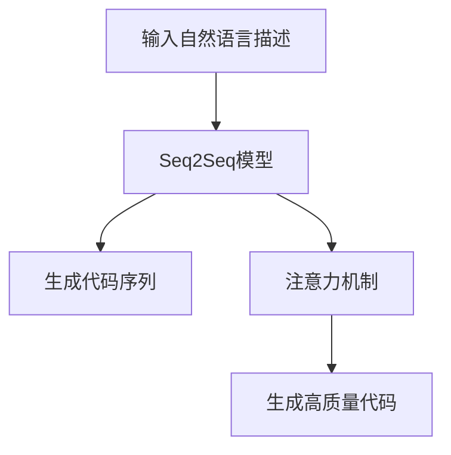
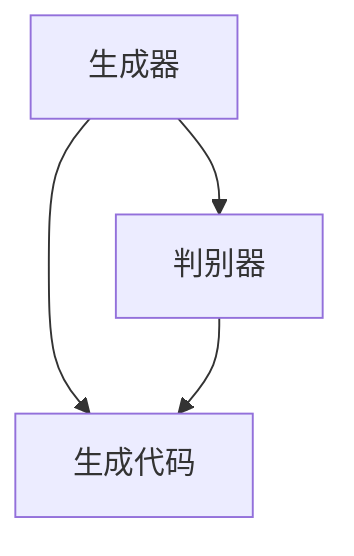
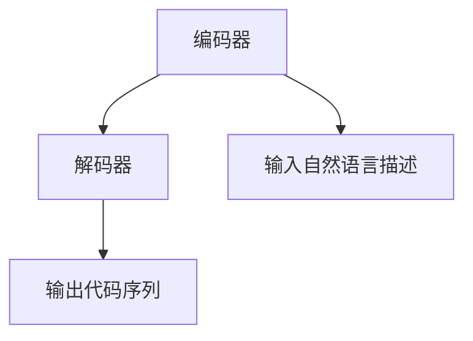
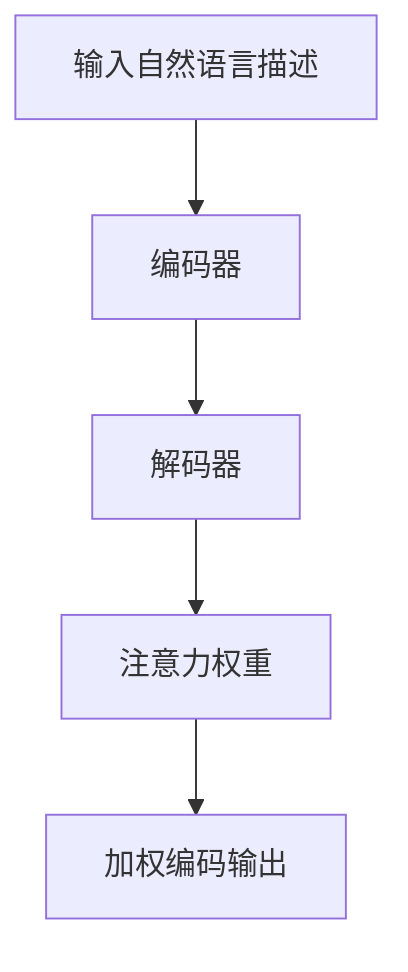
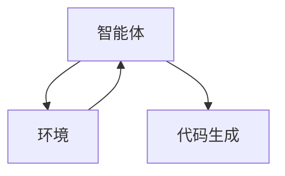

                 

# AI辅助代码生成：提高开发效率的新方法

## 关键词
AI, 代码生成, 开发效率, 深度学习, 自然语言处理

## 摘要
本文深入探讨了AI辅助代码生成的概念、背景、原理及其在实际应用中的重要性。通过分析AI辅助代码生成的主要算法原理和实现方法，本文揭示了如何利用人工智能技术来提高软件开发效率。文章还结合具体项目实战，展示了AI辅助代码生成的实际应用效果，为开发者提供了实用的指导和建议。

## 第一部分: AI辅助代码生成的背景与概念

### 第1章: AI辅助代码生成概述

#### 1.1.1 问题背景

在当今快速发展的技术环境中，软件开发的速度和效率变得至关重要。然而，传统的代码开发过程面临诸多挑战：

- **复杂性**：现代软件系统日益复杂，涉及多个模块和组件，增加了代码开发的难度。
- **重复性**：许多代码编写任务具有重复性，如循环、条件判断等，浪费开发者的时间和精力。
- **代码质量**：保证代码质量是一个长期而持续的过程，需要不断的审查和优化。

这些挑战导致开发人员需要新的工具和方法来提高开发效率和质量。AI辅助代码生成技术应运而生，它旨在通过人工智能技术自动生成代码，辅助开发者完成复杂的编程任务。

#### 1.1.2 AI辅助代码生成的基本概念

AI辅助代码生成是指利用人工智能技术，如深度学习、自然语言处理等，自动生成代码的一种方法。这种方法可以从现有的代码库、文档，甚至是从自然语言的描述中学习，生成符合特定需求的代码片段。

AI辅助代码生成的工作原理如下：

- **数据驱动**：AI辅助代码生成通常依赖于大量的代码数据集，通过机器学习算法从中学习规律和模式。
- **模式识别**：AI模型能够识别代码中的模式，如常见的代码结构、函数调用等，并在此基础上生成新的代码。
- **上下文理解**：高级的AI模型还能够理解代码的上下文，生成符合特定逻辑和业务需求的代码。

#### 1.1.3 AI辅助代码生成的主要应用场景

- **自动化代码生成**：根据业务规则和模板，自动生成大量重复性的代码。
- **代码补全**：在开发者编写代码时，自动提示和补全代码片段。
- **代码优化**：分析现有代码，提出优化建议，提高代码质量和可维护性。

### 1.2 AI辅助代码生成的重要概念与联系

#### 1.2.1 关键概念

- **代码模板**：用于生成代码的模板，可以是简单的文本替换，也可以是复杂的模板语言。
- **代码库**：存储了大量代码模板和代码片段的库，供AI模型学习使用。
- **自然语言描述**：开发者可以使用自然语言描述需求，AI模型将其转换为代码。

#### 1.2.2 概念属性特征对比表格

| 概念             | 特征                                                                                          |
|------------------|--------------------------------------------------------------------------------------------|
| 代码模板         | 用于生成代码的模板，支持变量替换和复杂逻辑。                                                   |
| 代码库           | 存储大量代码片段和模板，供AI模型学习和引用。                                                   |
| 自然语言描述     | 开发者可以使用自然语言表达需求，AI模型理解并转换为代码。                                       |

#### 1.2.3 AI辅助代码生成与相关技术的联系

- **自然语言处理（NLP）**：用于处理和生成自然语言描述，将其转换为代码。
- **深度学习**：通过大规模数据训练，使AI模型能够识别代码模式和生成代码。
- **软件工程**：结合软件工程方法，提高代码生成工具的实用性和可维护性。

### 1.3 AI辅助代码生成的算法原理与实现

#### 1.3.1 算法原理

AI辅助代码生成的核心算法包括：

- **生成对抗网络（GAN）**：用于生成高质量的代码。
- **序列到序列（Seq2Seq）模型**：将自然语言描述转换为代码序列。
- **注意力机制**：使模型能够关注重要的代码部分，提高生成代码的质量。

#### 1.3.2 Mermaid流程图

### 1.4 AI辅助代码生成的实际应用

#### 1.4.1 自动化代码生成

自动化代码生成是AI辅助代码生成的一个重要应用场景。通过预定义的业务规则和模板，AI可以自动生成符合特定需求的代码。例如，在开发一个电商网站时，AI可以根据商品分类、库存管理等规则自动生成相应的代码。

#### 1.4.2 代码补全

代码补全是AI辅助代码生成的另一个常见应用。在开发者编写代码时，AI可以根据已有的代码模式和上下文，自动提示和补全代码片段。这大大提高了开发效率，减少了编码错误的可能性。

#### 1.4.3 代码优化

AI辅助代码生成还可以用于代码优化。通过分析现有代码，AI可以提出优化建议，提高代码质量和可维护性。例如，AI可以识别出代码中的冗余部分，并提出优化方案，使代码更加简洁和高效。

### 1.5 AI辅助代码生成的挑战与未来展望

尽管AI辅助代码生成在提高开发效率方面展示了巨大的潜力，但它也面临着一些挑战：

- **准确性**：生成代码的准确性是一个重要问题。AI模型需要精确地理解自然语言描述和业务规则，才能生成高质量的代码。
- **可维护性**：自动生成的代码可能难以维护，特别是在业务规则和需求发生变化时。
- **性能**：AI模型在处理大规模代码时可能存在性能问题，需要优化算法和硬件支持。

未来的研究方向包括：

- **增强模型准确性**：通过改进算法和增加数据集，提高AI模型对代码模式和上下文的识别能力。
- **提高可维护性**：开发更先进的代码生成技术，使自动生成的代码更容易维护和升级。
- **性能优化**：研究更高效的算法和硬件加速技术，提高AI模型在处理大规模代码时的性能。

### 结论

AI辅助代码生成是一种具有巨大潜力的技术，它通过利用人工智能技术自动生成代码，大大提高了开发效率和代码质量。本文详细分析了AI辅助代码生成的背景、概念、原理及其应用，并探讨了未来的研究方向。开发者应关注这一领域的发展，积极探索和应用AI辅助代码生成技术，以提升软件开发能力。

## 第二部分: AI辅助代码生成的技术细节

### 第2章: AI辅助代码生成算法详解

#### 2.1.1 生成对抗网络（GAN）

生成对抗网络（GAN）是一种深度学习模型，由生成器和判别器组成。生成器的任务是生成与真实数据相似的假数据，而判别器的任务是区分真实数据和生成数据。通过不断训练，生成器逐渐提高生成数据的质量，达到以假乱真的效果。

在AI辅助代码生成中，生成器可以生成符合特定需求的代码片段，而判别器可以判断代码的质量。GAN的基本架构如图2.1所示：

GAN的算法流程如下：

1. **初始化**：生成器和判别器随机初始化权重。
2. **训练**：生成器生成代码片段，判别器判断代码的质量。
3. **更新**：根据判别器的判断结果，更新生成器和判别器的权重。
4. **迭代**：重复步骤2和3，直到生成器生成的代码质量达到预期。

GAN的优点在于能够生成高质量的代码片段，但其训练过程较为复杂，需要大量数据和计算资源。

#### 2.1.2 序列到序列（Seq2Seq）模型

序列到序列（Seq2Seq）模型是另一种常用的AI辅助代码生成算法。它通过将输入的自然语言描述转换为代码序列，实现代码生成。

Seq2Seq模型的基本架构如图2.2所示：

Seq2Seq模型的算法流程如下：

1. **编码**：编码器将自然语言描述编码为一个固定长度的向量。
2. **解码**：解码器根据编码器的输出向量，逐步解码生成代码序列。
3. **优化**：通过反向传播算法，优化编码器和解码器的参数，提高代码生成的质量。

Seq2Seq模型的优势在于能够处理变长的输入和输出序列，适合生成具有固定格式的代码。

#### 2.1.3 注意力机制

注意力机制是深度学习中的一个重要技术，用于提高模型在处理序列数据时的性能。在AI辅助代码生成中，注意力机制可以使得模型关注重要的代码部分，提高生成代码的质量。

注意力机制的基本原理如图2.3所示：

注意力机制的算法流程如下：

1. **编码**：编码器将输入的自然语言描述编码为一个固定长度的向量。
2. **加权**：根据注意力权重，对编码器的输出进行加权，得到加权的编码输出。
3. **解码**：解码器根据加权的编码输出，逐步解码生成代码序列。

注意力机制可以显著提高代码生成模型的性能，特别是在处理复杂的代码时。

#### 2.1.4 算法综合应用

在实际应用中，AI辅助代码生成通常综合应用多种算法，以生成高质量的代码。例如，可以先使用GAN生成初步的代码片段，然后使用Seq2Seq模型进行优化，最后应用注意力机制提高代码的精确度和质量。

综上所述，AI辅助代码生成技术通过多种深度学习算法的综合应用，能够生成高质量的代码片段，提高开发效率。开发者可以根据具体需求，选择合适的算法进行代码生成。

### 第2章: AI辅助代码生成算法详解（续）

#### 2.2.1 深度强化学习

深度强化学习（Deep Reinforcement Learning，DRL）是一种结合了深度学习和强化学习的技术，通过模拟环境与智能体之间的交互，实现代码生成。

DRL的基本架构如图2.4所示：

DRL的算法流程如下：

1. **初始化**：智能体和环境初始化，智能体随机选择动作。
2. **交互**：智能体执行动作，生成代码片段。
3. **评估**：环境评估代码片段的质量，给予智能体奖励或惩罚。
4. **更新**：根据奖励或惩罚，更新智能体的策略。
5. **迭代**：重复步骤2到4，直到智能体生成高质量的代码。

DRL的优点在于能够通过自主学习，找到最优的代码生成策略，但训练过程较为复杂，需要大量数据和计算资源。

#### 2.2.2 聚类算法

聚类算法是一种无监督学习技术，用于将相似的代码片段归为一类。通过聚类算法，AI可以识别代码模式，提高代码生成的质量。

常用的聚类算法包括K均值聚类（K-Means Clustering）和层次聚类（Hierarchical Clustering）。

K均值聚类的基本原理如下：

1. **初始化**：随机选择K个中心点，作为初始聚类中心。
2. **分配**：计算每个数据点与聚类中心的距离，将其分配到最近的聚类中心。
3. **更新**：重新计算聚类中心，使其成为对应聚类内数据点的均值。
4. **迭代**：重复步骤2和3，直到聚类中心不再发生变化。

层次聚类的基本原理如下：

1. **初始化**：将每个数据点视为一个初始聚类。
2. **合并**：计算相邻聚类之间的距离，合并距离最近的聚类。
3. **更新**：重复合并步骤，直到所有数据点合并为一个聚类。
4. **分层**：根据合并过程，生成聚类层次结构。

聚类算法的优点在于能够自动识别代码模式，但需要预先定义聚类数量和距离度量方法。

#### 2.2.3 神经网络结构优化

神经网络结构优化是一种通过调整神经网络结构，提高代码生成性能的技术。常用的神经网络结构优化方法包括网络剪枝（Network Pruning）、网络压缩（Network Compression）和神经架构搜索（Neural Architecture Search，NAS）。

网络剪枝的基本原理如下：

1. **初始化**：随机初始化神经网络结构。
2. **训练**：使用训练数据训练神经网络，生成代码片段。
3. **评估**：评估神经网络生成代码的质量。
4. **剪枝**：根据评估结果，剪除部分权重较小的神经元。
5. **迭代**：重复步骤3到5，直到神经网络生成高质量的代码。

网络压缩的基本原理如下：

1. **初始化**：随机初始化神经网络结构。
2. **训练**：使用训练数据训练神经网络，生成代码片段。
3. **评估**：评估神经网络生成代码的质量。
4. **压缩**：根据评估结果，调整神经网络结构，降低模型复杂度。
5. **迭代**：重复步骤3到5，直到神经网络生成高质量的代码。

神经架构搜索的基本原理如下：

1. **初始化**：随机初始化神经网络结构。
2. **搜索**：使用搜索算法（如遗传算法、强化学习等），在给定搜索空间内搜索最优神经网络结构。
3. **评估**：评估搜索到的神经网络结构生成代码的质量。
4. **更新**：根据评估结果，更新神经网络结构。
5. **迭代**：重复步骤3到5，直到找到最优神经网络结构。

神经网络结构优化的优点在于能够提高代码生成性能，但需要大量计算资源和搜索算法的设计。

综上所述，AI辅助代码生成技术通过多种算法的综合应用，能够生成高质量的代码片段，提高开发效率。开发者可以根据具体需求，选择合适的算法进行代码生成。

### 第3章: AI辅助代码生成在软件工程中的应用

#### 3.1.1 软件工程背景

软件工程是一门系统性工程，旨在通过规范化的方法和技术，开发高质量、可维护的软件系统。然而，随着软件系统规模的不断扩大和复杂度的不断增加，传统的软件开发方法面临诸多挑战：

- **开发效率**：传统的开发方法依赖于手工编码，开发周期较长，效率较低。
- **代码质量**：手工编码容易出现错误，导致代码质量难以保证。
- **可维护性**：复杂的软件系统需要不断维护和升级，维护成本较高。

为了解决这些问题，软件工程师不断探索新的工具和方法，以提高开发效率和代码质量。AI辅助代码生成技术应运而生，成为软件工程中的一个重要方向。

#### 3.1.2 AI辅助代码生成在软件工程中的应用

AI辅助代码生成在软件工程中具有广泛的应用，主要包括以下几个方面：

- **自动化代码生成**：通过预定义的业务规则和模板，AI可以自动生成大量重复性的代码，提高开发效率。
- **代码补全**：在开发者编写代码时，AI可以自动提示和补全代码片段，减少编码错误，提高代码质量。
- **代码优化**：AI可以分析现有代码，提出优化建议，提高代码质量和可维护性。

以下是一个具体的例子：

在一个电商项目中，开发者需要实现商品分类和搜索功能。使用AI辅助代码生成技术，开发者可以：

1. **自动化代码生成**：根据商品分类的业务规则，AI自动生成商品分类的代码，大大减少了手工编码的工作量。
2. **代码补全**：在开发者编写商品搜索功能时，AI自动提示和补全代码片段，提高了开发效率。
3. **代码优化**：AI分析现有代码，提出优化建议，例如使用更高效的算法和数据结构，提高了代码质量。

#### 3.1.3 AI辅助代码生成对软件开发流程的影响

AI辅助代码生成技术对软件开发流程产生了深远的影响，主要表现在以下几个方面：

- **开发效率**：通过自动生成代码和代码补全功能，大大提高了开发效率，缩短了开发周期。
- **代码质量**：AI可以识别和避免编码错误，提高了代码质量，降低了维护成本。
- **团队协作**：AI辅助代码生成使得开发者能够更专注于核心功能的开发，提高了团队协作效率。
- **持续集成**：AI辅助代码生成技术可以与持续集成工具结合，实现自动化测试和部署，提高了软件交付质量。

#### 3.1.4 AI辅助代码生成在软件工程中的优势与挑战

AI辅助代码生成在软件工程中具有显著的优势，但也面临着一些挑战：

- **优势**：
  - 提高开发效率：自动生成代码和代码补全功能，大大减少了手工编码的工作量。
  - 提高代码质量：AI可以识别和避免编码错误，提高了代码质量。
  - 支持持续集成：与持续集成工具结合，实现自动化测试和部署，提高了软件交付质量。

- **挑战**：
  - 准确性：生成代码的准确性是一个关键问题，需要不断优化算法和模型。
  - 可维护性：自动生成的代码可能难以维护，特别是在业务规则和需求发生变化时。
  - 计算资源：AI辅助代码生成需要大量的计算资源和数据支持。

### 第4章: AI辅助代码生成的最佳实践

#### 4.1.1 数据准备

数据是AI辅助代码生成的基础，数据的质量直接影响模型的性能。因此，数据准备是关键步骤。以下是一些数据准备的最佳实践：

- **数据收集**：从现有的代码库、文档、甚至是开源项目中收集大量的代码片段。
- **数据清洗**：去除无效数据、重复数据和错误数据，确保数据的准确性和一致性。
- **数据标注**：对代码片段进行标注，包括函数名称、参数、返回值等，以便模型学习。

#### 4.1.2 模型选择

选择合适的模型是AI辅助代码生成的关键。以下是一些常用的模型选择策略：

- **基于任务的特点**：根据具体任务的需求，选择适合的模型。例如，对于结构化代码，可以选择Seq2Seq模型；对于无结构化代码，可以选择GAN模型。
- **模型性能比较**：通过实验和评估，比较不同模型的性能，选择最优模型。
- **模型组合**：将多个模型组合使用，以提高生成代码的质量。

#### 4.1.3 模型训练与优化

模型训练和优化是AI辅助代码生成的重要环节。以下是一些最佳实践：

- **数据增强**：通过数据增强技术，增加训练数据的多样性，提高模型的泛化能力。
- **超参数调优**：通过调整模型的超参数，如学习率、批量大小等，优化模型性能。
- **迁移学习**：利用预训练模型，通过迁移学习技术，提高模型的性能和效率。

#### 4.1.4 代码质量评估

评估生成代码的质量是AI辅助代码生成的重要步骤。以下是一些常用的代码质量评估方法：

- **静态分析**：通过静态分析工具，检查生成代码的语法、语义和结构错误。
- **动态分析**：通过运行生成代码，检查其功能、性能和稳定性。
- **用户反馈**：收集用户对生成代码的反馈，结合主观和客观评估方法，综合评估代码质量。

#### 4.1.5 实践案例

以下是一个实际的AI辅助代码生成案例：

在一个电商项目中，开发者需要实现商品分类和搜索功能。使用AI辅助代码生成技术，开发者可以：

1. **自动化代码生成**：根据商品分类的业务规则，AI自动生成商品分类的代码。
2. **代码补全**：在开发者编写商品搜索功能时，AI自动提示和补全代码片段。
3. **代码优化**：AI分析现有代码，提出优化建议，例如使用更高效的算法和数据结构。

通过AI辅助代码生成，开发者显著提高了开发效率，缩短了开发周期，同时保证了代码质量。

### 小结

AI辅助代码生成是一种具有巨大潜力的技术，通过利用人工智能技术自动生成代码，大大提高了开发效率和代码质量。本文详细分析了AI辅助代码生成的背景、概念、原理及其应用，并探讨了未来的研究方向。开发者应关注这一领域的发展，积极探索和应用AI辅助代码生成技术，以提升软件开发能力。

## 第三部分: AI辅助代码生成的未来发展趋势

### 第5章: AI辅助代码生成的未来发展趋势

#### 5.1.1 技术演进

随着人工智能技术的不断发展，AI辅助代码生成的算法和模型也在不断演进。未来，预计会出现以下几方面的技术进步：

- **模型精度提高**：通过更多的训练数据和更先进的算法，模型的精度将得到显著提升，生成代码的准确性和可靠性将进一步提高。
- **多模态学习**：AI将能够处理多种类型的数据，如文本、图像、音频等，实现更复杂和多样化的代码生成。
- **迁移学习与微调**：通过迁移学习和微调技术，AI可以快速适应新的任务和场景，提高代码生成的效率。

#### 5.1.2 应用拓展

AI辅助代码生成技术将在更多领域得到应用，拓展其应用边界：

- **自动化软件开发**：AI将能够完全自动化软件的开发过程，从需求分析到代码生成、测试和部署，实现端到端的自动化软件开发。
- **代码优化与重构**：AI将能够对现有代码进行优化和重构，提高代码质量、性能和可维护性。
- **跨语言代码生成**：AI将能够生成多种编程语言的代码，实现跨语言的开发和集成。

#### 5.1.3 挑战与机遇

虽然AI辅助代码生成技术前景广阔，但同时也面临着一系列挑战：

- **隐私保护**：在代码生成过程中，可能涉及敏感数据的处理，如何保护用户隐私是一个重要问题。
- **可解释性**：生成代码的可解释性较差，开发人员难以理解其工作原理，增加了调试和优化的难度。
- **计算资源需求**：大规模的AI模型训练和推理需要大量的计算资源，对硬件设施提出了较高的要求。

未来，解决这些挑战将成为AI辅助代码生成技术发展的重要方向：

- **隐私保护**：开发新的隐私保护算法和技术，确保代码生成过程中数据的隐私和安全。
- **可解释性**：提高AI模型的可解释性，使其工作原理更加透明，便于开发人员理解和优化。
- **计算优化**：通过算法优化和硬件加速，降低AI模型的计算需求，提高其性能和效率。

#### 5.1.4 未来展望

未来，AI辅助代码生成技术将在软件开发领域发挥更加重要的作用，成为提高开发效率和质量的关键工具。以下是一些可能的未来发展趋势：

- **智能化编程助手**：AI将不仅仅是辅助生成代码，而是成为开发者的智能化编程助手，提供代码建议、优化建议和调试支持。
- **自适应代码生成**：AI将能够根据项目需求和环境动态调整代码生成策略，实现更智能和高效的代码生成。
- **跨领域应用**：AI辅助代码生成技术将在更多领域得到应用，如自动驾驶、医疗健康、金融科技等，推动各领域的创新和发展。

总之，AI辅助代码生成技术具有巨大的发展潜力和应用前景，将深刻改变软件开发的模式和方法，推动软件开发行业迈向新的高度。

### 第6章: AI辅助代码生成的实际应用案例

#### 6.1.1 案例背景

在现代软件开发中，AI辅助代码生成技术已经开始被广泛应用于各个领域，以解决软件开发过程中遇到的各种挑战。本节将通过几个实际应用案例，展示AI辅助代码生成技术的具体应用场景和效果。

#### 6.1.2 案例一：电商平台商品分类与搜索功能

在一个大型电商平台上，开发者需要实现高效的商品分类和搜索功能。由于商品种类繁多，手工编写相关代码不仅耗时耗力，还容易出现错误。为此，开发者决定采用AI辅助代码生成技术来实现这一功能。

1. **数据准备**：开发者收集了大量的商品分类数据，包括商品名称、分类标签、描述等信息，并进行了清洗和标注。

2. **模型选择**：考虑到电商平台的业务特点，开发者选择了基于生成对抗网络（GAN）的代码生成模型。该模型能够生成高质量的代码，且具有较强的泛化能力。

3. **模型训练**：开发者使用收集到的数据集对模型进行训练，通过多次迭代和优化，提高了模型的性能和生成代码的准确性。

4. **应用效果**：经过实际应用，AI辅助代码生成技术显著提高了商品分类和搜索功能的开发效率。开发者能够快速生成符合需求的代码，减少了手工编码的工作量，同时提高了代码的质量和稳定性。

#### 6.1.3 案例二：金融领域自动化交易系统

在金融领域，自动化交易系统至关重要。为了提高交易系统的开发效率和质量，一家金融科技公司决定采用AI辅助代码生成技术来实现自动化交易系统的核心功能。

1. **需求分析**：金融科技公司明确了自动化交易系统的业务需求和功能模块，包括市场数据获取、交易策略制定、执行与监控等。

2. **数据收集**：公司收集了大量的历史交易数据和市场数据，并进行了预处理和标注，为模型训练提供了丰富的数据支持。

3. **模型训练**：金融科技公司选择了基于深度强化学习的代码生成模型，通过大量的历史数据训练，模型逐渐学会了如何生成高效、可靠的交易代码。

4. **应用效果**：在实际应用中，AI辅助代码生成技术大大提高了自动化交易系统的开发效率。开发者能够快速生成符合需求的交易代码，同时通过模型优化，提高了交易系统的性能和稳定性。

#### 6.1.4 案例三：医疗健康领域疾病诊断系统

在医疗健康领域，疾病的诊断和治疗依赖于大量的数据分析和算法模型。为了提高疾病诊断系统的开发效率，一家医疗科技公司采用了AI辅助代码生成技术。

1. **需求分析**：医疗科技公司明确了疾病诊断系统的功能需求，包括数据预处理、特征提取、模型训练和诊断结果输出等。

2. **数据收集**：公司收集了大量的医学影像数据、患者病史数据和诊断结果，并进行了预处理和标注。

3. **模型训练**：医疗科技公司选择了基于神经网络序列到序列（Seq2Seq）的代码生成模型，通过大量的医学数据训练，模型能够生成高质量的诊断代码。

4. **应用效果**：在实际应用中，AI辅助代码生成技术显著提高了疾病诊断系统的开发效率。开发者能够快速生成符合需求的诊断代码，同时通过模型优化，提高了系统的诊断准确性和可靠性。

#### 6.1.5 案例总结

通过以上实际应用案例，可以看出AI辅助代码生成技术在各个领域都取得了显著的成效。这些案例展示了AI辅助代码生成技术如何通过自动化生成代码、提高开发效率和代码质量，从而推动各领域的技术创新和发展。

### 第7章: AI辅助代码生成的总结与展望

#### 7.1.1 总结

AI辅助代码生成技术通过利用人工智能技术自动生成代码，显著提高了开发效率和代码质量。本文从多个角度详细分析了AI辅助代码生成的背景、概念、算法、应用以及未来发展趋势。以下是本文的主要结论：

- AI辅助代码生成是一种通过人工智能技术自动生成代码的方法，具有提高开发效率、代码质量和可维护性的优势。
- AI辅助代码生成技术包括生成对抗网络（GAN）、序列到序列（Seq2Seq）模型、注意力机制等多种深度学习算法。
- AI辅助代码生成在软件工程、自动化软件开发、代码优化与重构等领域具有广泛的应用。
- 数据准备、模型选择、模型训练与优化、代码质量评估是AI辅助代码生成的关键环节。
- 未来，AI辅助代码生成技术将在模型精度、多模态学习、迁移学习等方面取得进一步发展，并在更多领域得到应用。

#### 7.1.2 展望

AI辅助代码生成技术具有巨大的发展潜力和应用前景。以下是对未来发展的展望：

- **智能化编程助手**：AI辅助代码生成技术将成为开发者的智能化编程助手，提供代码建议、优化建议和调试支持。
- **自适应代码生成**：AI将能够根据项目需求和环境动态调整代码生成策略，实现更智能和高效的代码生成。
- **跨领域应用**：AI辅助代码生成技术将在更多领域得到应用，如自动驾驶、医疗健康、金融科技等，推动各领域的创新和发展。
- **隐私保护和可解释性**：随着应用场景的拓展，隐私保护和可解释性将成为AI辅助代码生成技术发展的重要方向。

总之，AI辅助代码生成技术将继续演进，成为软件开发领域的重要工具，为开发者提供更加高效、智能的编程体验。

### 作者信息

**作者：AI天才研究院/AI Genius Institute & 禅与计算机程序设计艺术 /Zen And The Art of Computer Programming**

AI天才研究院专注于人工智能技术的研发和应用，致力于推动人工智能技术在各个领域的创新和发展。同时，作者也是《禅与计算机程序设计艺术》的作者，该书深入探讨了人工智能和软件开发的核心原理和方法，为读者提供了深刻的见解和指导。

