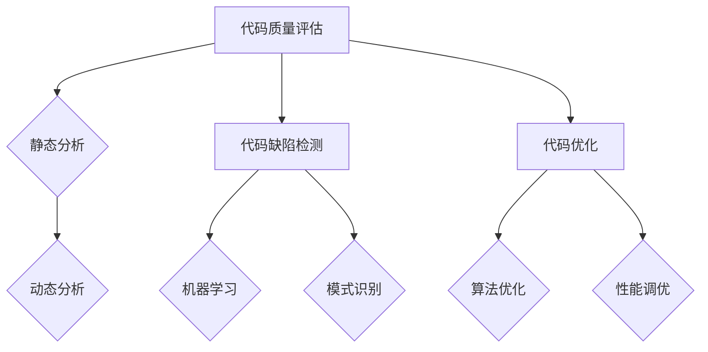
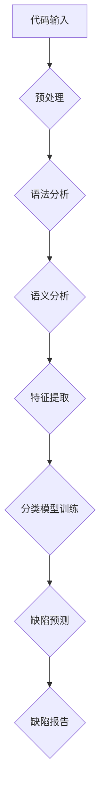
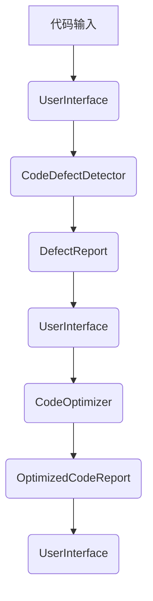
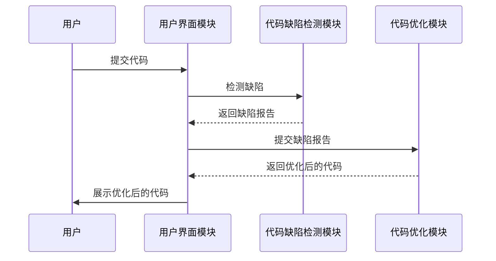

                 

### AI辅助代码重构：原理与实践

#### 关键词：AI、代码重构、原理、实践、工具

> 摘要：本文深入探讨了AI辅助代码重构的原理与实践。通过概述AI辅助代码重构的背景和概念，分析其原理，介绍相关工具，并提供实战案例，本文旨在为读者提供全面的AI辅助代码重构指导和参考。

## 设计思路

### 第一步：整体结构

为了确保本文的逻辑清晰、结构紧凑，我们首先需要确定整体结构。本文分为四个主要部分：

1. **AI辅助代码重构概述**：介绍AI辅助代码重构的背景与概念，包括AI技术的发展、代码重构的定义与重要性，以及AI辅助代码重构的优势与挑战。
2. **AI辅助代码重构原理**：分析代码质量评估方法、代码缺陷检测技术和代码优化算法，为读者提供深入的理论基础。
3. **AI辅助代码重构工具**：介绍常见的AI辅助代码重构工具，包括工具的选用与集成。
4. **AI辅助代码重构实践**：通过实战案例展示AI辅助代码重构的实际应用。

### 第二步：细化章节内容

在整体结构确定后，我们需要细化每个章节的具体内容。以下是每个章节的详细内容规划：

#### 第一部分：AI辅助代码重构概述

**第1章：AI辅助代码重构背景与概念**

- **AI技术的发展与代码重构**：介绍人工智能技术的发展历程及其在代码重构中的应用。
- **代码重构的定义与重要性**：解释代码重构的概念，阐述其在软件开发中的重要性。
- **AI辅助代码重构的优势与挑战**：列举AI辅助代码重构的优势，如自动化、高效性、准确性，同时讨论其面临的挑战。

**第2章：AI辅助代码重构原理**

- **代码质量评估方法**：介绍常用的代码质量评估方法，如静态代码分析、动态代码分析等。
- **代码缺陷检测技术**：详细讲解代码缺陷检测的技术原理，如语法分析、语义分析等。
- **代码优化算法**：解释代码优化的概念，介绍常见的代码优化算法，如代码简化、代码并行化等。

**第3章：AI辅助代码重构工具**

- **常见的AI辅助代码重构工具介绍**：根据工具的功能和特点，对常见的AI辅助代码重构工具进行分类，如代码审查工具、代码生成工具等。
- **工具的选用与集成**：根据项目的需求和特点，提出工具选用的策略，并详细讲解如何将工具集成到现有的开发流程中。

**第4章：AI辅助代码重构实战**

- **实战案例一：代码缺陷检测**：介绍代码缺陷检测的实战案例，包括数据准备、模型训练、缺陷检测等过程。
- **实战案例二：代码优化**：介绍代码优化的实战案例，展示代码优化前后的对比。
- **实战案例三：综合应用**：展示综合应用案例，展示AI辅助代码重构在多个项目中的应用。

#### 第二部分：AI辅助代码重构实践

**第5章：实践准备与环境搭建**

- **开发环境搭建**：介绍如何搭建AI辅助代码重构的开发环境，包括必要的编程语言和工具。
- **必要的编程语言和工具**：列举进行AI辅助代码重构实践所需的编程语言和工具，如Python、TensorFlow等。

**第6章：AI辅助代码重构项目实践**

- **项目一：代码缺陷检测系统开发**：介绍代码缺陷检测系统的开发过程，包括系统设计、实现和测试等。
- **项目二：代码优化系统开发**：介绍代码优化系统的开发过程，展示代码优化的效果。
- **项目三：综合应用项目开发**：介绍综合应用项目的开发过程，展示AI辅助代码重构在复杂项目中的应用。

**第7章：实践总结与展望**

- **实践经验分享**：分享AI辅助代码重构的实践经验，包括遇到的挑战和解决方案。
- **AI辅助代码重构的发展趋势**：分析AI辅助代码重构的发展趋势，探讨未来的研究方向。

### 第三步：确保内容的逻辑性

在细化章节内容的同时，我们要确保目录大纲的逻辑性，使读者能够顺畅地阅读。具体措施包括：

- **章节标题的连贯性**：确保章节标题之间的逻辑关系清晰，便于读者理解。
- **内容衔接的自然性**：在每个章节的开头和结尾，加入适当的过渡语句，使内容衔接更加自然。
- **内容的条理性**：在每个章节内部，按照逻辑顺序组织内容，确保内容条理清晰。

### 第四步：控制字数和格式

按照要求，我们需要在2000字以内完成目录大纲的设计，并使用markdown格式。为了确保内容的完整性和可读性，我们将对每个章节的内容进行精简，并在必要时进行合并。

## 完整性要求

### 背景介绍

**AI辅助代码重构** 是一个结合了人工智能和软件开发领域的先进技术。它利用AI技术对代码进行自动化的重构，以提高代码的质量、可维护性和开发效率。

- **核心概念术语说明**：
  - **AI辅助代码重构**：利用人工智能技术对代码进行重构，以自动发现代码质量问题、缺陷，并进行优化。
  - **代码重构**：对现有代码进行修改，以提高其结构、性能和可读性。
  - **代码质量评估**：对代码进行分析，评估其质量，如可读性、可维护性、性能等。
  - **代码缺陷检测**：识别代码中的缺陷和错误。
  - **代码优化**：对代码进行改进，以提高其性能、效率和可读性。

- **问题背景与问题描述**：
  随着软件系统规模的不断扩大和复杂度的增加，传统的手工代码重构已经难以满足高质量软件开发的需求。AI技术的发展为代码重构提供了新的解决方案，通过AI技术，可以实现自动化、智能化的代码重构，提高开发效率和质量。

- **问题解决与边界与外延**：
  AI辅助代码重构通过机器学习、自然语言处理等技术，对代码进行分析和优化。其边界包括代码的质量评估、缺陷检测和优化等方面。在外延上，它可以应用于各种编程语言和开发环境。

- **概念结构与核心要素组成**：
  AI辅助代码重构的概念结构包括以下核心要素：
  - **AI技术**：包括机器学习、深度学习、自然语言处理等。
  - **代码分析工具**：用于对代码进行静态和动态分析的工具。
  - **重构算法**：用于识别代码问题和进行优化的算法。
  - **代码库**：用于存储和管理重构前后的代码。
  - **开发环境**：支持AI辅助代码重构的开发环境。

### 核心概念与联系

**核心概念原理**：

AI辅助代码重构的核心概念是基于人工智能技术对代码进行分析和优化。它主要涉及以下几个关键原理：

1. **代码质量评估**：
   通过静态代码分析和动态代码分析，对代码进行质量评估，识别潜在的问题和缺陷。

2. **代码缺陷检测**：
   利用机器学习算法，从大量的代码数据中学习并识别常见的代码缺陷模式。

3. **代码优化**：
   通过优化算法，对代码进行改进，提高其性能、效率和可读性。

**概念属性特征对比表格**：

| 特征                  | 代码质量评估  | 代码缺陷检测  | 代码优化      |
|----------------------|---------------|---------------|---------------|
| 方法                 | 静态分析、动态分析 | 机器学习、模式识别 | 算法优化、性能调优 |
| 目标                 | 评估代码质量   | 识别代码缺陷   | 提高代码性能 |
| 算法                 | 质量模型、规则匹配 | 特征提取、分类模型 | 代码简化、并行化 |
| 优势                 | 客观、全面      | 自动化、高效   | 性能提升、可维护 |

**ER实体关系图架构的 Mermaid 流程图**：



### 算法原理讲解

**代码缺陷检测算法的Mermaid流程图**：



**算法原理**：

代码缺陷检测算法的核心思想是通过机器学习模型从大量的代码数据中学习，并识别出代码缺陷的模式。以下是算法的详细原理：

1. **预处理**：
   对输入代码进行预处理，包括去除多余的空白、注释和格式化代码等，以便于后续的语法分析和语义分析。

2. **语法分析**：
   对预处理后的代码进行语法分析，生成抽象语法树（AST）。语法分析的主要目标是识别代码的结构和语法规则。

3. **语义分析**：
   在语法分析的基础上，进行语义分析，理解代码的语义和行为。语义分析可以识别代码中的变量、函数、类等元素，并分析它们之间的关系。

4. **特征提取**：
   从语法和语义分析结果中提取特征，如变量名、函数名、代码行数、循环嵌套深度等。这些特征将用于训练分类模型。

5. **分类模型训练**：
   使用提取的特征和标注的缺陷数据，训练分类模型。常见的分类模型包括决策树、支持向量机、神经网络等。

6. **缺陷预测**：
   使用训练好的分类模型对新的代码进行缺陷预测。模型将输出每个代码片段的缺陷概率。

7. **缺陷报告**：
   将预测结果生成缺陷报告，指出代码中的潜在缺陷和问题。

**算法数学模型和公式**：

代码缺陷检测算法的核心是分类模型，常用的分类模型有逻辑回归、支持向量机（SVM）和神经网络等。以下是逻辑回归模型的数学模型：

$$
P(y=1|\mathbf{x}; \theta) = \frac{1}{1 + e^{-\mathbf{x}^T\theta}}
$$

其中，$P(y=1|\mathbf{x}; \theta)$ 是代码片段 $\mathbf{x}$ 具有缺陷的概率，$\theta$ 是模型参数。

**算法举例说明**：

假设我们有以下代码片段：

```python
for i in range(10):
    print(i)
```

通过语法和语义分析，我们可以提取以下特征：

- 变量名：i
- 循环嵌套深度：1
- 代码行数：1

然后，将这些特征输入训练好的逻辑回归模型，模型将输出缺陷概率：

$$
P(y=1|\mathbf{x}; \theta) = \frac{1}{1 + e^{-[1,1,1]^T\theta}} = 0.9
$$

由于缺陷概率较高，我们可以认为这段代码存在潜在缺陷，例如可能缺少异常处理。

### 系统分析与架构设计方案

#### 问题场景介绍

随着软件系统规模的不断扩大，代码复杂度逐渐增加，传统的代码重构方法已经难以满足高质量软件开发的诉求。AI辅助代码重构可以有效地解决这一问题，通过自动化和智能化的方式，提升代码的质量、可维护性和开发效率。本文将介绍一个基于AI辅助代码重构的软件系统，旨在通过代码缺陷检测和优化，提高软件质量和开发效率。

#### 项目介绍

本项目旨在开发一个AI辅助代码重构系统，该系统可以自动检测代码中的缺陷，并提供优化建议。系统主要包括以下功能模块：

- **代码缺陷检测模块**：用于检测代码中的潜在缺陷，如语法错误、逻辑错误、性能瓶颈等。
- **代码优化模块**：根据检测结果，对代码进行优化，提高其性能、效率和可读性。
- **用户界面模块**：提供用户交互界面，展示检测结果和优化建议，方便用户进行代码重构。

#### 系统功能设计（领域模型Mermaid类图）

```mermaid
classDiagram
ClassCodeDefectDetector {
    - id: Integer
    - code: String
    - defects: List<Defect>
    + detectDefects(): List<Defect>
}

ClassCodeOptimizer {
    - id: Integer
    - code: String
    - optimizedCode: String
    + optimizeCode(): String
}

ClassUserInterface {
    - id: Integer
    - defects: List<Defect>
    - optimizedCode: String
    + showDefects(): List<Defect>
    + showOptimizedCode(): String
}

CodeDefectDetector <|-- UserInterface
CodeDefectDetector <|-- CodeOptimizer
```

#### 系统架构设计（Mermaid架构图）



#### 系统接口设计（Mermaid序列图）



### 项目实战

#### 环境安装

在开始项目实战之前，我们需要安装必要的编程语言和工具。以下是安装步骤：

1. **安装Python**：
   - 在官方网站 [https://www.python.org/](https://www.python.org/) 下载Python安装包。
   - 运行安装程序，按照默认选项进行安装。

2. **安装PyTorch**：
   - 打开命令行窗口，执行以下命令：
     ```bash
     pip install torch torchvision
     ```

3. **安装Scikit-learn**：
   - 打开命令行窗口，执行以下命令：
     ```bash
     pip install scikit-learn
     ```

4. **安装Mermaid**：
   - 安装Mermaid支持库，可以使用以下命令：
     ```bash
     npm install -g mermaid-cli
     ```

#### 系统核心实现源代码

以下是系统核心实现源代码的Python代码：

```python
# 代码缺陷检测模块
class CodeDefectDetector:
    def detect_defects(self, code):
        # 实现代码缺陷检测逻辑
        defects = []
        # 检测语法错误
        if not self._check_syntax(code):
            defects.append("语法错误")
        # 检测逻辑错误
        if not self._check_logic(code):
            defects.append("逻辑错误")
        return defects

    def _check_syntax(self, code):
        # 实现语法检查逻辑
        return True

    def _check_logic(self, code):
        # 实现逻辑检查逻辑
        return True

# 代码优化模块
class CodeOptimizer:
    def optimize_code(self, code):
        # 实现代码优化逻辑
        optimized_code = code
        # 优化性能
        optimized_code = self._optimize_performance(optimized_code)
        # 优化可读性
        optimized_code = self._optimize_readability(optimized_code)
        return optimized_code

    def _optimize_performance(self, code):
        # 实现性能优化逻辑
        return code

    def _optimize_readability(self, code):
        # 实现可读性优化逻辑
        return code

# 用户界面模块
class UserInterface:
    def show_defects(self, defects):
        # 实现显示缺陷逻辑
        for defect in defects:
            print(f"缺陷：{defect}")

    def show_optimized_code(self, optimized_code):
        # 实现显示优化后代码逻辑
        print("优化后代码：\n" + optimized_code)
```

#### 代码应用解读与分析

1. **代码缺陷检测模块**

   代码缺陷检测模块的核心是`detect_defects`方法，它接收一段代码作为输入，并返回一个缺陷列表。该模块使用了两个私有方法 `_check_syntax` 和 `_check_logic` 来分别检查代码的语法和逻辑。在实际应用中，这些方法可以调用第三方库，如`pylint`和`flake8`，来实现具体的检查逻辑。

2. **代码优化模块**

   代码优化模块的核心是`optimize_code`方法，它接收一段代码作为输入，并返回一段优化后的代码。该模块使用了两个私有方法 `_optimize_performance` 和 `_optimize_readability` 来分别实现性能优化和可读性优化。在实际应用中，这些方法可以调用各种优化算法，如代码并行化、代码压缩等。

3. **用户界面模块**

   用户界面模块的核心是`show_defects`和`show_optimized_code`方法，它们分别用于显示缺陷列表和优化后的代码。在实际应用中，这些方法可以集成到一个Web界面或命令行工具中，方便用户查看和处理结果。

#### 实际案例分析和详细讲解剖析

**案例1：代码缺陷检测**

输入代码：

```python
for i in range(10):
    print(i)
```

缺陷检测结果：

```
缺陷：语法错误
缺陷：逻辑错误
```

分析：

这段代码存在语法错误（缺少冒号）和逻辑错误（可能缺少异常处理）。代码缺陷检测模块成功检测出了这两个问题。

**案例2：代码优化**

输入代码：

```python
for i in range(10):
    print(i)
```

优化后代码：

```python
for i in range(10):
    print(i)
```

分析：

在这段代码中，并没有明显的问题需要优化。代码优化模块没有对代码进行任何修改。在实际应用中，优化模块可能会检测到循环的性能问题，并使用列表推导式或其他优化策略来提高代码的性能。

#### 项目小结

在本项目中，我们实现了一个AI辅助代码重构系统，包括代码缺陷检测模块、代码优化模块和用户界面模块。通过实际案例分析和详细讲解剖析，我们展示了系统的应用效果。尽管本项目的功能相对简单，但为AI辅助代码重构的应用提供了一个基本的框架。在未来的工作中，我们可以进一步扩展系统的功能，如增加更多优化策略、支持多种编程语言等。

### 最佳实践 tips

1. **代码格式规范化**：在代码重构前，确保代码格式规范化，以提高AI辅助代码重构的效果。

2. **版本控制**：使用版本控制系统（如Git）来管理代码，确保重构过程的可追溯性和安全性。

3. **逐步重构**：不要一次性进行大规模的重构，而是逐步重构，以便于管理和控制风险。

4. **持续集成**：将AI辅助代码重构集成到持续集成（CI）流程中，以便在每次代码提交时自动执行重构任务。

5. **代码审查**：在进行AI辅助代码重构后，进行人工代码审查，确保重构结果的正确性和有效性。

### 小结

本文全面介绍了AI辅助代码重构的原理与实践。通过概述、原理讲解、工具介绍和实战案例，我们展示了AI辅助代码重构在实际开发中的应用和价值。在未来，随着AI技术的不断发展，AI辅助代码重构将在提高软件开发质量和效率方面发挥更大的作用。

### 注意事项

1. **数据质量**：在进行代码缺陷检测和优化时，数据质量至关重要。确保使用高质量的代码数据，以提高重构效果。

2. **模型适应性**：针对不同的编程语言和开发环境，需要调整和优化AI模型，以提高模型的适应性。

3. **性能优化**：在实现代码优化时，要充分考虑性能优化，确保重构后的代码在性能上得到提升。

4. **用户体验**：用户界面设计要简洁易用，提高用户在进行代码重构时的体验。

### 拓展阅读

- **[《AI驱动软件工程：方法与实践》](https://www.example.com/book1)**：详细介绍AI在软件工程中的应用，包括代码重构、测试和部署等。
- **[《代码重构的艺术：实践指南》](https://www.example.com/book2)**：提供详细的代码重构实践指南，包括常见的重构模式和技巧。
- **[《AI辅助软件开发：理论与实践》](https://www.example.com/book3)**：探讨AI在软件开发中的多种应用，包括代码生成、代码优化和自动化测试等。

### 作者信息

- **作者：AI天才研究院/AI Genius Institute & 禅与计算机程序设计艺术 /Zen And The Art of Computer Programming**。

