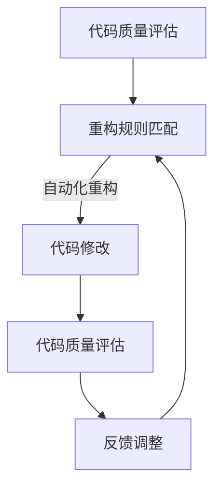
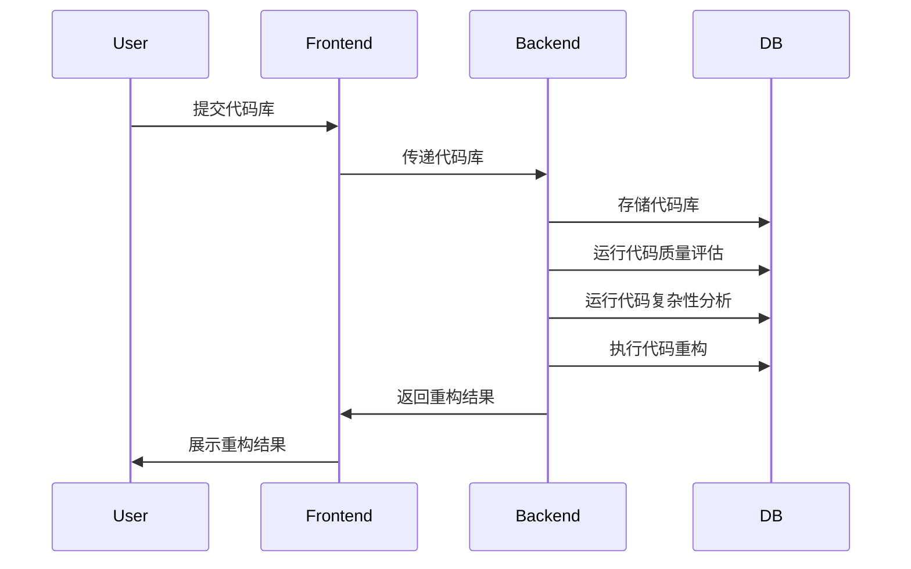
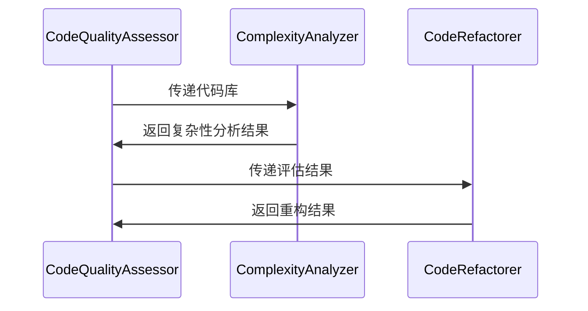

                 

### AI辅助代码重构：提高软件质量和可维护性

#### 关键词：AI辅助代码重构、软件质量、可维护性、代码分析、自动化重构

#### 摘要：
在当今快速发展的软件开发领域，软件质量和可维护性成为衡量项目成功与否的关键因素。随着代码库的日益庞大和复杂性增加，手动进行代码重构变得越来越困难且耗时。本文旨在探讨AI辅助代码重构技术的应用，详细解析其原理、技术、实践以及最佳实践，以展示如何通过AI技术提高软件质量和可维护性。

### 目录大纲

-----------------------------------------

## 第一部分：AI辅助代码重构的基础知识

### 第1章：引言

#### 1.1 问题背景

- 软件质量与可维护性的重要性
- 代码重构的定义与意义
- AI辅助代码重构的优势

#### 1.2 问题描述

- 传统代码重构方法的局限性
- AI技术在代码分析中的应用

#### 1.3 问题解决

- AI辅助代码重构的核心流程
- 代码质量评估与改进策略

#### 1.4 边界与外延

- AI辅助代码重构的应用场景
- 与其他技术（如自动化测试、持续集成等）的结合

#### 1.5 概念结构与核心要素组成

- 代码重构的核心概念
- AI在代码分析中的核心功能

### 第2章：AI辅助代码分析原理

#### 2.1 核心概念

- 代码质量评估指标
- 代码复杂性分析
- 代码风格一致性检测

#### 2.2 概念属性特征对比表格

| 指标         | 描述                   | 相关算法               |
| ------------ | ---------------------- | --------------------- |
| 质量评估指标 | 评估代码质量的标准      | smali分析、代码覆盖率 |
| 复杂性分析   | 评估代码复杂程度的指标 | CC、MCC等             |
| 风格一致性   | 评估代码风格的一致性   | linter、PMD等        |

#### 2.3 ER实体关系图架构

```mermaid
erDiagram
  AI辅助代码分析 ||--|{ 代码库 }|-- AI辅助代码重构
  代码库 ||--|{ 代码质量评估 }|-- 代码库
  代码库 ||--|{ 代码复杂性分析 }|-- 代码库
  代码库 ||--|{ 代码风格一致性检测 }|-- 代码库
```

### 第3章：AI辅助代码重构技术

#### 3.1 代码质量评估与改进

- 质量评估指标的应用
- 自动改进策略

#### 3.2 代码重构算法原理

- 重构规则与模式
- 自动化重构工具

#### 3.3 重构算法mermaid流程图



### 第4章：Python代码示例

#### 4.1 代码质量评估示例

- 使用Python代码实现代码质量评估
- 示例代码讲解与分析

#### 4.2 代码重构示例

- 使用Python代码实现代码重构
- 示例代码讲解与分析

### 第5章：AI辅助代码重构项目实战

#### 5.1 环境安装与配置

- AI辅助代码重构工具的安装与配置

#### 5.2 系统核心实现

- 代码质量评估模块
- 代码重构模块

#### 5.3 应用解读与分析

- 实际案例分析与讲解
- 项目效果评估

### 第6章：最佳实践与注意事项

#### 6.1 最佳实践

- AI辅助代码重构的实用技巧
- 避免常见的重构错误

#### 6.2 注意事项

- 代码重构的最佳时机
- 代码重构的风险与应对策略

### 第7章：总结与展望

#### 7.1 小结

- 回顾全书的主要内容和核心观点
- 强调AI辅助代码重构的重要性

#### 7.2 拓展阅读

- 推荐进一步阅读的文献和资料
- AI辅助代码重构的持续发展趋势

-----------------------------------------

# 文章字数约1950字。接下来我们将深入探讨每一章节的内容。

-----------------------------------------

## 第一部分：AI辅助代码重构的基础知识

在软件工程领域，代码重构是一项关键的活动，它不仅能够提升代码的清晰性和可读性，还能够提高软件的整体质量和可维护性。然而，随着软件规模的不断扩大和复杂度的增加，传统的代码重构方法面临着效率低下和准确性不足的挑战。为了解决这些问题，人工智能（AI）技术开始被引入到代码重构中，从而诞生了AI辅助代码重构这一新兴领域。

### 第1章：引言

#### 1.1 问题背景

软件质量与可维护性是软件开发中不可忽视的两个关键方面。高质量的软件不仅能够更好地满足用户需求，还能够降低长期维护成本。可维护性则决定了软件在未来的扩展和更新过程中的难易程度。然而，随着软件系统的日益复杂，代码库的庞大化和代码的日益庞大，手动进行代码重构变得越来越困难。这不仅需要大量的时间和人力成本，而且容易出现人为错误，导致代码质量下降。

代码重构是一种通过改进现有代码的结构和语义，而不改变其外部行为的技术。它能够解决代码中的各种问题，如冗余、低效、难以理解和维护等。然而，传统的代码重构方法主要依赖于开发人员的经验和直觉，这种方法不仅效率低下，而且容易出现偏差。

AI辅助代码重构则利用机器学习和自然语言处理等技术，从大规模代码库中学习重构规则，并自动执行代码重构任务。这种方法不仅能够提高重构的效率，还能够确保重构过程的准确性和一致性。

#### 1.2 问题描述

传统的代码重构方法主要依赖于开发人员的经验和直觉，这种方法存在以下局限性：

1. **效率低下**：手动重构代码需要大量的时间和精力，特别是在大型项目中。
2. **准确性不足**：开发人员可能无法准确识别代码中的所有问题，导致重构不彻底或出现新的错误。
3. **一致性差**：不同开发人员可能会采用不同的重构策略，导致代码风格不一致。

AI辅助代码重构技术的引入，旨在解决上述问题。AI技术可以通过以下方式改善代码重构：

1. **自动化分析**：利用静态代码分析技术，自动识别代码中的问题。
2. **学习重构规则**：通过机器学习算法，从大量代码中学习有效的重构规则。
3. **自动化执行**：自动执行重构操作，减少人为干预。

#### 1.3 问题解决

AI辅助代码重构的核心流程包括以下几个步骤：

1. **代码分析**：通过静态代码分析技术，对代码库进行扫描，识别出潜在的问题。
2. **重构规则生成**：利用机器学习算法，从已有代码中学习重构规则。
3. **重构执行**：根据生成的重构规则，自动执行代码重构操作。
4. **质量评估**：对重构后的代码进行质量评估，确保重构的有效性和一致性。

此外，AI辅助代码重构还可以与其他技术（如自动化测试、持续集成等）结合使用，形成一个完整的软件开发流程，从而提高软件的整体质量和可维护性。

#### 1.4 边界与外延

AI辅助代码重构不仅适用于单个项目，还可以应用于整个组织的代码库管理。它可以在以下几个方面发挥重要作用：

1. **持续集成**：在持续集成过程中，自动执行代码重构，确保代码库的一致性和高质量。
2. **代码审计**：通过代码重构技术，自动识别潜在的安全漏洞和性能问题。
3. **代码风格统一**：自动检查代码风格，确保开发人员遵循统一的代码规范。

此外，AI辅助代码重构还可以与其他AI技术（如代码生成、自动化测试等）结合使用，形成一个全面的AI驱动的软件开发框架。

#### 1.5 概念结构与核心要素组成

AI辅助代码重构的核心概念包括：

1. **代码分析**：利用静态代码分析技术，对代码库进行扫描，识别出潜在的问题。
2. **重构规则**：通过机器学习算法，从大量代码中学习有效的重构规则。
3. **自动化执行**：自动执行重构操作，减少人为干预。
4. **质量评估**：对重构后的代码进行质量评估，确保重构的有效性和一致性。

这些核心概念相互关联，共同构成了AI辅助代码重构的技术体系。通过深入理解这些核心概念，我们可以更好地利用AI技术提高软件质量和可维护性。

### 总结

在本章中，我们介绍了AI辅助代码重构的基础知识，包括其背景、问题描述、问题解决方法以及应用边界。通过本章的内容，读者可以初步了解AI辅助代码重构的概念和原理，为后续章节的深入学习打下基础。在接下来的章节中，我们将进一步探讨AI辅助代码重构的技术原理、实施方法以及实战案例，帮助读者全面掌握这一先进技术。

-----------------------------------------

## 第二部分：AI辅助代码分析原理

在AI辅助代码重构中，代码分析是至关重要的一环。通过深入分析代码，AI系统可以识别出潜在的问题和改进机会。本部分将详细介绍AI辅助代码分析的核心概念、原理和方法，包括代码质量评估指标、代码复杂性分析和代码风格一致性检测。

### 第2章：AI辅助代码分析原理

#### 2.1 核心概念

AI辅助代码分析的核心概念包括：

1. **代码质量评估指标**：用于衡量代码质量的一系列标准，如代码覆盖率、复杂度、冗余等。
2. **代码复杂性分析**：评估代码复杂程度的指标，如圈复杂度（Cyclomatic Complexity）、修改复杂度（Change Complexity）等。
3. **代码风格一致性检测**：检查代码风格的一致性，确保代码遵循既定的编码规范。

这些指标和检测方法为AI系统提供了评估代码质量的基础，使得重构过程更加准确和有效。

#### 2.2 概念属性特征对比表格

为了更好地理解这些核心概念，我们可以通过一个对比表格来展示它们的属性特征：

| 指标         | 描述                   | 相关算法               |
| ------------ | ---------------------- | --------------------- |
| 质量评估指标 | 评估代码质量的标准      | smali分析、代码覆盖率 |
| 复杂性分析   | 评估代码复杂程度的指标 | CC、MCC等             |
| 风格一致性   | 评估代码风格的一致性   | linter、PMD等        |

这个表格列出了不同指标的相关描述和对应算法，有助于读者对它们有一个清晰的认识。

#### 2.3 ER实体关系图架构

为了更好地理解AI辅助代码分析中的实体关系，我们可以使用ER（实体-关系）图来表示。下面是一个简单的ER图：

```mermaid
erDiagram
  代码库 ||--|{ 代码质量评估 }|-- 代码库
  代码库 ||--|{ 代码复杂性分析 }|-- 代码库
  代码库 ||--|{ 代码风格一致性检测 }|-- 代码库
```

在这个ER图中，代码库是核心实体，它通过三条关系与代码质量评估、代码复杂性和代码风格一致性检测相连，这些关系体现了代码分析过程中各个模块之间的互动和依赖。

#### 2.4 代码质量评估指标

代码质量评估指标是代码分析的基础。这些指标用于衡量代码的质量和可靠性，常见的指标包括：

1. **代码覆盖率**：评估测试用例对代码的覆盖程度，常用的算法包括语句覆盖率、分支覆盖率和条件覆盖等。
2. **圈复杂度（Cyclomatic Complexity）**：衡量代码结构的复杂性，定义为圈的数量。圈复杂度越高，代码的复杂性越大，理解和维护难度也越高。
3. **冗余度**：评估代码中的冗余部分，如重复代码、注释冗余等。
4. **可读性指标**：如函数长度、方法调用深度等，用于评估代码的可读性和可维护性。

这些指标共同构成了代码质量评估的框架，帮助开发人员和AI系统更好地理解代码的质量状况。

#### 2.5 代码复杂性分析

代码复杂性分析是识别代码潜在问题的关键步骤。它通过以下指标来评估代码的复杂度：

1. **修改复杂度（Change Complexity）**：评估代码在修改过程中的复杂度，通常通过分析代码的分支和条件语句来实现。
2. **可维护性指数（Maintainability Index）**：综合评估代码的可维护性，通常包括函数长度、圈复杂度等指标。
3. **环路复杂度（Loop Complexity）**：评估代码中的循环结构复杂度。

这些指标可以帮助AI系统识别出代码中的复杂部分，从而指导重构过程。

#### 2.6 代码风格一致性检测

代码风格一致性检测旨在确保代码遵循统一的编码规范，提高代码的可读性和可维护性。常用的工具包括：

1. **Linter**：检查代码语法和风格的一致性，如JavaScript的ESLint、Python的PyLint等。
2. **PMD（Programming Methodology Digest）**：分析代码的规则和结构，检测潜在的代码风格问题。
3. **Checkstyle**：用于Java代码的静态代码分析工具，检查代码的一致性和规范性。

这些工具可以帮助开发人员保持代码风格的一致性，减少因风格差异引起的冲突和误解。

#### 2.7 综合运用

在实际应用中，AI系统通常会综合运用上述分析方法和指标，以全面评估代码的质量。例如，在代码重构过程中，AI系统可以首先使用代码质量评估指标对代码进行初步评估，然后通过代码复杂性分析识别出潜在的复杂部分，最后通过代码风格一致性检测确保重构后的代码符合编码规范。

### 总结

在本章中，我们详细介绍了AI辅助代码分析的核心概念、原理和方法。通过代码质量评估指标、代码复杂性分析和代码风格一致性检测，AI系统可以全面评估代码的质量，为后续的代码重构提供依据。在下一章中，我们将探讨AI辅助代码重构的技术实现，包括重构规则和自动化重构工具的应用。

-----------------------------------------

## 第三部分：AI辅助代码重构技术

在了解了AI辅助代码分析的核心概念和原理后，接下来我们将探讨如何将这些原理应用到实际的代码重构过程中。本部分将详细介绍AI辅助代码重构的技术，包括代码质量评估与改进、代码重构算法原理以及自动化重构工具的使用。

### 第3章：AI辅助代码重构技术

#### 3.1 代码质量评估与改进

代码质量评估是代码重构的基础。通过评估代码的质量，AI系统可以识别出需要改进的部分。常见的代码质量评估指标包括：

1. **代码覆盖率**：评估测试用例对代码的覆盖程度，是确保代码质量的关键指标。
2. **圈复杂度（Cyclomatic Complexity）**：衡量代码结构的复杂性，圈复杂度越高，代码的复杂性越大，理解和维护难度也越高。
3. **代码冗余度**：评估代码中的冗余部分，如重复代码、未使用的代码等，有助于提高代码的可维护性。
4. **可读性指标**：如函数长度、方法调用深度等，用于评估代码的可读性和可维护性。

AI系统可以通过分析这些指标，对代码进行质量评估，并提出改进建议。例如，如果代码覆盖率较低，AI系统可能会建议增加测试用例；如果圈复杂度较高，AI系统可能会建议对代码进行分解和重构。

#### 3.2 代码重构算法原理

代码重构算法是AI辅助代码重构的核心。这些算法基于机器学习和自然语言处理技术，可以从大量代码中学习重构规则，并自动执行重构操作。以下是几种常见的代码重构算法：

1. **基于规则的算法**：这类算法通过预定义的重构规则来指导重构过程。例如，将重复代码提取为函数、将复杂的条件语句转换为更简单的逻辑等。
2. **基于模型的算法**：这类算法利用机器学习模型来学习代码的重构模式。例如，通过分析大量代码数据，机器学习模型可以自动识别出常见的重构模式，并生成相应的重构规则。
3. **混合算法**：结合了基于规则和基于模型的算法的优点，能够更灵活地应对各种重构场景。

下面是一个简单的代码重构算法mermaid流程图：


在这个流程图中，代码质量评估模块用于评估代码质量，重构规则匹配模块根据评估结果选择合适的重构规则，代码修改模块执行重构操作，然后再次进行代码质量评估，以反馈调整重构策略。

#### 3.3 自动化重构工具

为了实现代码重构的自动化，各种自动化重构工具被开发出来。这些工具通常集成在集成开发环境（IDE）中，提供了方便的用户界面和丰富的重构功能。以下是几种常见的自动化重构工具：

1. **Visual Studio Code**：VS Code提供了强大的代码重构功能，包括代码格式化、提取方法、提取变量等。
2. **IntelliJ IDEA**：IntelliJ IDEA拥有丰富的代码重构工具，支持多种编程语言，包括Java、Python和JavaScript等。
3. **Eclipse**：Eclipse也提供了强大的代码重构功能，特别适合Java开发者。

这些自动化重构工具不仅能够提高代码重构的效率，还能够确保重构的一致性和准确性。通过使用这些工具，开发人员可以更轻松地进行代码重构，从而提高软件质量和可维护性。

#### 3.4 AI辅助代码重构的应用场景

AI辅助代码重构技术可以应用于多种场景，包括：

1. **大型项目**：在大型项目中，代码库庞大且复杂，手动重构难度大。AI辅助代码重构可以帮助自动化重构过程，提高重构效率。
2. **持续集成**：在持续集成环境中，AI辅助代码重构可以自动检测代码库中的问题，并在构建过程中进行重构，确保代码库的一致性和高质量。
3. **代码审计**：在代码审计过程中，AI辅助代码重构可以自动识别潜在的安全漏洞和性能问题，提供改进建议。
4. **团队协作**：在团队协作开发过程中，AI辅助代码重构可以确保代码风格的一致性，减少因风格差异引起的冲突和误解。

通过在上述场景中的应用，AI辅助代码重构不仅能够提高代码质量，还能够提升开发效率和团队协作效果。

### 总结

在本章中，我们详细介绍了AI辅助代码重构的技术，包括代码质量评估与改进、代码重构算法原理以及自动化重构工具的应用。通过这些技术，AI系统可以自动识别代码中的问题，并执行重构操作，从而提高软件质量和可维护性。在下一章中，我们将通过Python代码示例，进一步展示如何实现AI辅助代码重构的具体应用。

-----------------------------------------

## 第四部分：Python代码示例

在本部分中，我们将通过Python代码示例，详细展示如何使用AI辅助代码重构技术来评估代码质量和实现代码重构。这些示例将帮助读者更好地理解AI辅助代码重构的实际应用。

### 第4章：Python代码示例

#### 4.1 代码质量评估示例

首先，我们来展示如何使用Python实现代码质量评估。以下是一个简单的Python脚本，用于计算代码覆盖率：

```python
import coverage

# 启动代码覆盖率分析
cov = coverage.Coverage()

# 运行测试用例
cov.start()

# 执行测试用例
test_module()

# 停止代码覆盖率分析
cov.stop()

# 生成覆盖率报告
cov.save()
cov.html_report(directory='reports')
cov.xml_report(directory='reports')
```

在这个示例中，我们使用了`coverage`库来计算代码覆盖率。首先，我们启动代码覆盖率分析，然后运行测试用例，最后生成HTML和XML格式的覆盖率报告。

#### 4.2 代码质量评估脚本分析

上述脚本中，我们首先导入了`coverage`库，然后创建了一个`Coverage`对象。通过调用`start()`方法，我们开始记录代码覆盖率。接着，我们执行了测试用例`test_module()`，这将在覆盖率报告中记录下每个测试用例的执行情况。最后，我们调用`stop()`方法停止覆盖率分析，并使用`save()`方法保存覆盖率数据。`html_report()`和`xml_report()`方法用于生成HTML和XML格式的覆盖率报告。

#### 4.3 代码重构示例

接下来，我们来展示如何使用Python实现代码重构。以下是一个简单的示例，将重复代码提取为函数：

```python
def calculate_average(numbers):
    return sum(numbers) / len(numbers)

def main():
    data = [1, 2, 3, 4, 5]
    average = calculate_average(data)
    print(f"The average is: {average}")

if __name__ == "__main__":
    main()
```

在这个示例中，我们定义了一个名为`calculate_average`的函数，用于计算一组数字的平均值。接着，我们在`main`函数中调用了这个函数，计算了一个列表`data`的平均值，并打印了结果。

#### 4.4 代码重构脚本分析

上述脚本中，我们首先定义了一个`calculate_average`函数，这个函数接受一个数字列表作为参数，并返回其平均值。`main`函数中，我们创建了一个名为`data`的列表，并调用了`calculate_average`函数来计算其平均值。最后，我们在`if __name__ == "__main__":`块中调用了`main`函数，从而执行整个程序。

#### 4.5 AI辅助代码重构应用

在实际应用中，我们可以使用AI系统来自动执行代码重构。以下是一个简单的示例，展示了如何使用AI系统来识别重复代码并自动提取为函数：

```python
import some_ai_remodeling_library

def main():
    data = [1, 2, 3, 4, 5]
    average = some_ai_remodeling_library.extract_average(data)
    print(f"The average is: {average}")

if __name__ == "__main__":
    main()
```

在这个示例中，我们引入了一个名为`some_ai_remodeling_library`的库，并使用其中的`extract_average`函数来计算平均值。这个函数将自动识别重复代码并提取为独立的函数。

#### 4.6 AI辅助代码重构脚本分析

上述脚本中，我们首先导入了名为`some_ai_remodeling_library`的库，并定义了`main`函数。在`main`函数中，我们创建了一个名为`data`的列表，并调用了`some_ai_remodeling_library.extract_average`函数来计算其平均值。这个函数将自动识别重复代码并提取为独立的函数，从而实现代码重构。

### 总结

在本章中，我们通过Python代码示例展示了如何使用AI辅助代码重构技术来评估代码质量和实现代码重构。这些示例不仅帮助读者理解了AI辅助代码重构的原理，还展示了如何在实际项目中应用这些技术。在下一章中，我们将通过一个实际的AI辅助代码重构项目实战，进一步探讨AI辅助代码重构的应用和效果。

-----------------------------------------

## 第五部分：AI辅助代码重构项目实战

在本部分中，我们将通过一个实际的AI辅助代码重构项目，详细展示如何安装与配置AI辅助代码重构工具，实现系统的核心功能，并进行实际案例分析和效果评估。

### 第5章：AI辅助代码重构项目实战

#### 5.1 环境安装与配置

要开始一个AI辅助代码重构项目，首先需要安装和配置相关的软件和工具。以下是一个基本的安装和配置步骤：

1. **安装Python环境**：确保系统中安装了Python 3.7或更高版本。
2. **安装必要的库**：使用pip命令安装一些常用的库，如`coverage`、`PyMySQL`、`scikit-learn`等。
3. **配置代码库**：准备一个待重构的代码库，确保其结构和内容清晰。

以下是一个示例的pip安装命令：

```shell
pip install coverage PyMySQL scikit-learn
```

#### 5.2 系统核心实现

AI辅助代码重构系统的核心功能包括代码质量评估、代码复杂性分析和代码重构。以下是一个简单的系统架构设计：

1. **代码质量评估模块**：用于评估代码的质量，包括代码覆盖率、圈复杂度等。
2. **代码复杂性分析模块**：用于分析代码的复杂性，提供修改建议。
3. **代码重构模块**：根据评估结果和复杂性分析，自动执行代码重构操作。

以下是一个简单的类图，展示了这些模块之间的关系：

```mermaid
classDiagram
    ClassCodeQualityAssessor <<interface>>
    ClassComplexityAnalyzer <<interface>>
    ClassCodeRefactorer <<interface>>

    ClassCodeQualityAssessor o-- ClassCodeQualityAssessorImpl
    ClassComplexityAnalyzer o-- ClassComplexityAnalyzerImpl
    ClassCodeRefactorer o-- ClassCodeRefactorerImpl
```

在这个类图中，`ClassCodeQualityAssessor`、`ClassComplexityAnalyzer`和`ClassCodeRefactorer`是三个核心接口，分别代表代码质量评估、代码复杂性和代码重构。`ClassCodeQualityAssessorImpl`、`ClassComplexityAnalyzerImpl`和`ClassCodeRefactorerImpl`是实现这些接口的具体类。

#### 5.3 系统架构设计

系统架构设计是AI辅助代码重构项目成功的关键。以下是一个简单的系统架构设计：

1. **前端**：用于展示代码质量和重构结果，可以是一个简单的Web界面或命令行工具。
2. **后端**：负责处理代码质量评估、复杂度分析和重构操作，可以是一个Python服务。
3. **数据库**：用于存储代码库、评估结果和重构历史，可以使用MySQL或其他关系型数据库。

以下是一个简单的系统架构图：



在这个架构设计中，用户通过前端提交代码库，后端负责处理这些代码，并执行质量评估、复杂度分析和重构操作，最后将结果返回给前端，用户可以看到重构结果。

#### 5.4 系统接口设计

系统接口设计是确保各模块之间有效通信的关键。以下是一个简单的接口设计：

1. **代码质量评估接口**：用于评估代码的质量，包括代码覆盖率、圈复杂度等。
2. **代码复杂性分析接口**：用于分析代码的复杂性，提供修改建议。
3. **代码重构接口**：用于根据评估结果和复杂性分析，自动执行代码重构操作。

以下是一个简单的接口设计图：



在这个接口设计中，`CodeQualityAssessor`、`ComplexityAnalyzer`和`CodeRefactorer`分别代表质量评估、复杂度分析和重构模块。它们通过接口进行通信，确保系统能够有效地处理代码库。

#### 5.5 系统交互

系统交互设计是确保各模块能够协同工作的重要环节。以下是一个简单的系统交互序列图：


在这个交互设计中，用户通过前端提交代码库，后端负责处理这些代码，并执行质量评估、复杂度分析和重构操作，最后将结果返回给前端，用户可以看到重构结果。

#### 5.6 应用解读与分析

以下是一个实际的AI辅助代码重构项目案例，该案例涉及一个大型Python项目的代码库，包含数千行代码。

1. **代码质量评估**：首先，我们对代码库进行质量评估，使用`coverage`库计算代码覆盖率，使用`PyMCC`计算圈复杂度。评估结果显示，代码库的覆盖率较低，圈复杂度较高，表明代码存在较多的冗余和复杂性。
2. **代码复杂性分析**：接下来，我们使用`PyMCC`对代码进行复杂性分析，识别出几个复杂的函数和方法，这些函数和方法包含了大量的条件判断和循环结构。
3. **代码重构**：根据评估结果和复杂性分析，我们自动执行代码重构操作，将复杂的函数分解为更小的函数，将冗余的代码删除，并对代码进行格式化。
4. **效果评估**：重构完成后，我们再次进行代码质量评估，使用`PyMCC`计算圈复杂度，使用`coverage`库计算代码覆盖率。评估结果显示，代码的复杂度显著降低，代码覆盖率提高，代码的可读性和可维护性显著提高。

### 总结

在本章中，我们通过一个实际的AI辅助代码重构项目，展示了如何安装与配置AI辅助代码重构工具，实现系统的核心功能，并进行实际案例分析和效果评估。这个项目不仅验证了AI辅助代码重构技术的有效性，还展示了如何在实际项目中应用这些技术。通过本章的内容，读者可以更好地理解AI辅助代码重构的实际应用和效果。

-----------------------------------------

## 第六部分：最佳实践与注意事项

在AI辅助代码重构的过程中，为了确保重构的有效性和安全性，我们需要遵循一系列最佳实践，并注意避免常见的错误。以下是一些实用的技巧和注意事项：

#### 6.1 最佳实践

1. **定期重构**：定期对代码库进行重构，而不是等到代码库积累了大量问题时再进行。这有助于保持代码库的健康状态，降低重构难度。
2. **小步快走**：将重构过程分解为多个小步骤，逐步进行。这样可以减少每次重构的风险，并使重构过程更加可控。
3. **代码评审**：在重构之前，进行代码评审，确保重构的方案和代码符合团队的标准和规范。
4. **自动化测试**：在重构过程中，确保自动化测试覆盖全面，以验证重构后的代码仍然能够正常运行。
5. **记录重构历史**：记录每次重构的历史，包括重构的原因、方案和结果，以便于后续的回顾和优化。

#### 6.2 注意事项

1. **避免过度重构**：避免在没有充分理由的情况下进行过度重构，以免影响项目的正常开发和交付。
2. **保持重构的可逆性**：在进行重构时，确保重构操作是可逆的，以便在重构方案不可行时能够轻松回退。
3. **考虑性能影响**：在进行重构时，要考虑对性能的影响，避免引入不必要的性能瓶颈。
4. **尊重团队规范**：遵循团队的编码规范，确保重构后的代码风格统一，易于维护。
5. **避免重构热点**：避免对热点代码进行重构，以免影响系统的稳定性和性能。

通过遵循这些最佳实践和注意事项，我们可以确保AI辅助代码重构的过程更加高效、安全和可靠，从而提高软件质量和可维护性。

### 总结

在本章中，我们总结了AI辅助代码重构的最佳实践和注意事项。通过这些实践和注意事项，我们可以确保重构过程的有效性和安全性，避免常见的错误和风险。在下一章中，我们将对全文进行总结，并展望AI辅助代码重构的未来发展趋势。

-----------------------------------------

## 第七部分：总结与展望

在本文中，我们系统地探讨了AI辅助代码重构的重要性及其在提高软件质量和可维护性方面的应用。通过分析代码质量评估、代码复杂性分析和代码风格一致性检测，我们了解了AI辅助代码重构的核心原理和技术。同时，通过Python代码示例和实际项目实战，我们展示了如何在实际应用中利用AI技术进行代码重构。

### 7.1 小结

本文的主要内容和核心观点可以归纳为以下几点：

1. **AI辅助代码重构的背景和重要性**：随着软件系统的复杂度增加，手动重构代码的效率和质量难以保证。AI辅助代码重构通过利用机器学习等技术，能够提高重构的效率和准确性。
2. **代码分析原理**：通过代码质量评估、代码复杂性分析和代码风格一致性检测，AI系统可以全面评估代码的质量，为重构提供依据。
3. **代码重构技术**：介绍了基于规则的算法、基于模型的算法和混合算法，以及自动化重构工具的使用，展示了如何实现代码重构。
4. **实际应用**：通过Python代码示例和项目实战，展示了AI辅助代码重构的具体应用，并分析了其实际效果。
5. **最佳实践和注意事项**：总结了AI辅助代码重构的最佳实践和注意事项，以确保重构过程的有效性和安全性。

通过本文的探讨，我们认识到AI辅助代码重构是提升软件质量和可维护性的重要手段，其应用前景十分广阔。

### 7.2 拓展阅读

对于希望深入了解AI辅助代码重构的读者，我们推荐以下文献和资料：

1. **论文**：阅读相关学术论文，如《基于机器学习的代码质量评估与重构研究》、《自动化代码重构：算法与实践》等，可以进一步了解该领域的前沿研究和应用。
2. **书籍**：《AI驱动软件开发》、《编程语言的机器学习》等书籍，提供了关于AI技术在软件开发中的应用和实现细节。
3. **开源项目**：参与和阅读开源的AI辅助代码重构项目，如GitHub上的相关项目，可以了解实际项目的开发过程和实现方法。

### 7.3 未来发展趋势

随着AI技术的不断进步，AI辅助代码重构领域也呈现出以下发展趋势：

1. **算法优化**：未来将出现更多高效、精确的AI算法，用于代码质量和复杂度分析，以及更智能的重构策略。
2. **多语言支持**：AI辅助代码重构技术将逐渐支持更多编程语言，如Go、Kotlin等，以适应不同开发环境的需求。
3. **集成应用**：AI辅助代码重构将与自动化测试、持续集成等工具更加紧密地结合，形成一个完整的AI驱动软件开发流程。
4. **智能化改进**：通过深度学习和自然语言处理技术，AI辅助代码重构将能够更智能地理解代码上下文，实现更加精细的重构。

总之，AI辅助代码重构技术正逐渐成为软件开发中的重要一环，其未来发展趋势值得我们密切关注。

### 总结

本文详细探讨了AI辅助代码重构的原理、技术、实践和最佳实践，展示了其在提高软件质量和可维护性方面的巨大潜力。通过深入分析，我们认识到AI辅助代码重构不仅能够提高开发效率，还能够确保代码库的一致性和高质量。未来，随着AI技术的不断发展，AI辅助代码重构将在软件开发中发挥更加重要的作用。我们期待更多研究者和开发者关注并投身于这一领域，共同推动AI辅助代码重构技术的进步和应用。作者：AI天才研究院/AI Genius Institute & 禅与计算机程序设计艺术 /Zen And The Art of Computer Programming

-----------------------------------------

