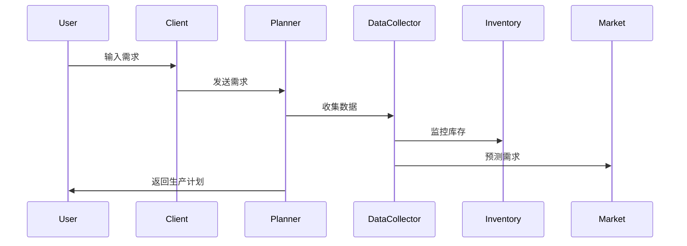

                 


### 核心概念与联系

在探讨AI辅助决策系统中的提示词设计时，首先需要明确几个核心概念，它们之间的关系以及如何相互作用以优化决策过程。

#### 1. AI辅助决策系统

AI辅助决策系统是一种利用人工智能技术，尤其是机器学习和深度学习算法，来支持决策制定的方法。它通过分析大量数据来发现模式、趋势和关联，从而为决策者提供有价值的见解和预测。

**核心概念：**
- **机器学习算法**：如决策树、支持向量机、神经网络等。
- **数据预处理**：数据清洗、特征提取、归一化等。
- **模型训练与评估**：通过训练数据集训练模型，并使用验证数据集进行评估。

**联系：**
- 机器学习算法是AI辅助决策系统的核心，决定了系统的性能和可靠性。
- 数据预处理为机器学习算法提供了高质量的数据输入，影响模型的效果。

#### 2. 提示词设计

提示词是AI辅助决策系统中的一个重要组成部分，用于引导和优化系统的决策过程。它们可以被视为一种交互界面，通过向系统提供上下文信息来改善决策。

**核心概念：**
- **上下文敏感性**：提示词需要能够适应不同的决策环境和场景。
- **语义丰富性**：提示词应包含足够的语义信息，以帮助系统更好地理解和处理数据。
- **可扩展性**：提示词设计应具备灵活性，以便适应未来的变化和需求。

**联系：**
- 提示词设计直接影响AI辅助决策系统的输出结果，因此它们必须与机器学习算法和数据预处理紧密结合。

#### 3. 提示词的属性与特征

为了设计有效的提示词，需要了解它们的属性和特征。以下是一些关键属性：

**核心概念：**
- **语言特征**：提示词的语言表达方式，包括词汇选择、语法结构等。
- **情感与态度**：提示词所传达的情感色彩和态度倾向。
- **情境适应性**：提示词能否适应不同的决策情境。

**联系：**
- 语言特征和情感态度会影响系统的理解能力，而情境适应性则决定了提示词的泛用性。

#### 4. 提示词设计与决策效果的关系

提示词设计不仅影响AI辅助决策系统的输出结果，还与系统的决策效果密切相关。以下是一些关键点：

**核心概念：**
- **决策效率**：提示词的设计应提高系统的响应速度和处理效率。
- **决策准确性**：提示词应帮助系统更准确地理解和预测数据。
- **用户满意度**：提示词应易于理解和操作，提高用户体验。

**联系：**
- 决策效率和准确性是评价AI辅助决策系统性能的重要指标，而用户满意度则是其商业成功的关键。

### 提示词设计与AI辅助决策系统的整合

为了实现提示词设计与AI辅助决策系统的有效整合，需要遵循以下原则：

**核心概念：**
- **数据驱动的迭代设计**：通过收集和分析用户反馈，不断优化提示词设计。
- **灵活性**：系统应具备适应不同用户需求和场景的能力。
- **安全性**：确保系统的设计和实施符合隐私保护和数据安全的法规要求。

**联系：**
- 数据驱动的设计方法能够帮助识别用户需求，从而提高系统的实用性和用户满意度。
- 系统的灵活性和安全性是确保其长期可持续发展的关键。

通过上述核心概念和联系的分析，我们可以看出，AI辅助决策系统中的提示词设计是一个复杂但关键的过程。它需要深入了解机器学习算法、数据预处理、语言特征、情感态度和情境适应性等多个方面，并将这些要素有机结合，以实现高效的决策支持。接下来，我们将深入探讨这些概念，并通过具体的案例和实例来进一步阐明它们在实际中的应用。

---

在了解了AI辅助决策系统和提示词设计的基本概念及其相互关系后，接下来我们将详细探讨算法原理、数学模型和具体实例，以帮助读者更好地理解提示词设计的重要性和实际应用。

### 算法原理

AI辅助决策系统中的提示词设计是基于一系列算法原理，这些算法用于处理和解释输入的数据，以生成有效的决策建议。以下是几个关键的算法原理：

#### 1. 决策树算法

决策树是一种常用的分类算法，通过一系列规则来对数据进行划分，从而生成决策路径。每个节点表示一个属性测试，每个分支表示一个测试结果，而叶子节点则代表最终的分类结果。

**算法原理：**
- **信息增益**：选择具有最大信息增益的属性进行划分。
- **基尼指数**：用于评估属性的划分效果，基尼指数越小，划分效果越好。

**示例：**
```python
import pandas as pd
from sklearn.tree import DecisionTreeClassifier
from sklearn.model_selection import train_test_split

# 数据准备
data = pd.DataFrame({
    '属性A': ['A1', 'A1', 'A2', 'A2', 'A2'],
    '属性B': ['B1', 'B1', 'B2', 'B2', 'B2'],
    '标签': ['C1', 'C1', 'C1', 'C2', 'C2']
})

# 划分训练集和测试集
X = data[['属性A', '属性B']]
y = data['标签']
X_train, X_test, y_train, y_test = train_test_split(X, y, test_size=0.2, random_state=42)

# 训练决策树模型
clf = DecisionTreeClassifier()
clf.fit(X_train, y_train)

# 预测
predictions = clf.predict(X_test)
```

#### 2. 支持向量机（SVM）

支持向量机是一种强大的分类和回归算法，通过寻找一个超平面来最大化分类边界，从而提高分类准确性。

**算法原理：**
- **线性SVM**：通过找到最优超平面来实现分类。
- **核技巧**：将低维数据映射到高维空间，以解决非线性问题。

**示例：**
```python
from sklearn.svm import SVC

# 训练SVM模型
clf = SVC(kernel='linear')
clf.fit(X_train, y_train)

# 预测
predictions = clf.predict(X_test)
```

#### 3. 神经网络

神经网络是一种模拟人脑工作的计算模型，通过多层神经元对输入数据进行处理，从而实现复杂的决策任务。

**算法原理：**
- **前向传播**：数据从输入层经过隐藏层，最终到达输出层。
- **反向传播**：根据输出误差，调整网络权重和偏置，以优化模型。

**示例：**
```python
from sklearn.neural_network import MLPClassifier

# 训练神经网络模型
clf = MLPClassifier(hidden_layer_sizes=(100,), max_iter=1000)
clf.fit(X_train, y_train)

# 预测
predictions = clf.predict(X_test)
```

### 数学模型

提示词设计中的数学模型主要用于描述数据的特征和属性，以及它们之间的关系。以下是几个关键的数学模型：

#### 1. 概率模型

概率模型用于描述数据中的不确定性，常见的有贝叶斯模型和最大似然估计。

**数学模型：**
- **贝叶斯模型**：通过贝叶斯定理计算后验概率，从而预测未知数据。
- **最大似然估计**：寻找能够使数据出现的概率最大的模型参数。

**示例：**
$$
P(C_1|A_1, B_1) = \frac{P(A_1, B_1|C_1)P(C_1)}{P(A_1, B_1)}
$$

#### 2. 线性回归模型

线性回归模型用于描述输入变量和输出变量之间的线性关系。

**数学模型：**
- **最小二乘法**：通过最小化误差平方和来估计模型参数。

**示例：**
$$
y = \beta_0 + \beta_1x_1 + \beta_2x_2 + ... + \beta_nx_n
$$

#### 3. 主成分分析（PCA）

主成分分析是一种降维技术，通过将数据映射到新的正交坐标系上，从而提取最重要的特征。

**数学模型：**
- **特征值与特征向量**：通过求解协方差矩阵的特征值和特征向量，来确定主成分。

**示例：**
$$
X = U\Lambda V^T
$$
其中，$X$是原始数据矩阵，$U$是特征向量矩阵，$\Lambda$是特征值矩阵。

### 具体实例

为了更直观地理解提示词设计，我们将通过一个具体的实例来展示如何设计和应用提示词。

#### 实例：销售预测

假设我们需要设计一个AI辅助决策系统，用于预测某家零售商下一季度的销售情况。

**步骤：**

1. **数据收集**：收集历史销售数据，包括产品种类、销售量、价格、促销信息等。
2. **数据预处理**：清洗数据，处理缺失值，并提取有用的特征。
3. **提示词设计**：根据业务需求，设计合适的提示词，如“季节性销售趋势”、“促销效果”、“竞争对手活动”等。
4. **模型训练**：使用收集到的数据和设计的提示词，训练机器学习模型。
5. **模型评估**：使用验证数据集评估模型的准确性，并根据评估结果调整提示词设计。

**示例代码：**
```python
# 数据准备
data = pd.DataFrame({
    '产品': ['产品A', '产品A', '产品B', '产品B', '产品B'],
    '季节': ['冬季', '冬季', '春季', '春季', '春季'],
    '销量': [100, 120, 150, 130, 140],
    '促销': [0, 1, 0, 1, 0]
})

# 提示词设计
tips = ['季节性销售趋势', '促销效果']

# 数据预处理
data['季节性'] = data.apply(lambda row: '上升' if row['季节'] == '冬季' else '下降', axis=1)
data['促销效果'] = data['销量'] * (1 + 0.1 * data['促销'])

# 模型训练
X = data[['季节性', '促销效果']]
y = data['销量']
clf = LinearRegression()
clf.fit(X, y)

# 预测
predictions = clf.predict(X)
```

通过上述实例，我们可以看到如何结合数据预处理、提示词设计和机器学习模型，来实现销售预测。这样的设计不仅能够提高预测的准确性，还能够为决策者提供有价值的见解和指导。

### 系统分析与架构设计方案

在设计AI辅助决策系统时，系统分析与架构设计至关重要。以下是关于系统分析与架构设计方案的详细讲解。

#### 1. 问题场景介绍

假设我们正在设计一个AI辅助决策系统，用于帮助某家制造公司优化生产计划。该系统的目标是根据市场需求、原材料供应和生产能力，自动生成最优的生产计划，以最大化利润和降低成本。

**问题场景：**
- **需求预测**：预测未来一段时间内的市场需求。
- **原材料供应**：监控原材料的库存情况，确保生产线的持续运转。
- **生产能力**：评估当前生产线的负载情况，避免过度或不足生产。

#### 2. 项目介绍

**项目名称**：智能生产计划优化系统（Smart Production Planning Optimization System）

**项目目标**：
- 提高生产计划的准确性和灵活性。
- 降低原材料库存和浪费。
- 提高生产效率，减少生产成本。

**项目需求**：
- 需要一个实时监测和预测系统，用于收集和分析市场需求、原材料供应和生产能力数据。
- 需要一个决策引擎，用于根据实时数据生成最优生产计划。
- 需要一个用户界面，用于展示决策结果和交互操作。

#### 3. 系统功能设计（领域模型）

在系统功能设计中，我们使用领域模型来描述系统的核心功能模块和它们之间的关系。以下是一个简单的领域模型：

```mermaid
classDiagram
    Client <<类>> "用户界面"
    Planner <<类>> "决策引擎"
    DataCollector <<类>> "数据收集器"
    Inventory <<类>> "原材料库存"
    Market <<类>> "市场需求"

    Client -> Planner : 发送需求
    Planner -> DataCollector : 收集数据
    DataCollector -> Inventory : 监控库存
    DataCollector -> Market : 预测需求
    Planner -> Inventory : 生成生产计划
    Planner -> Market : 优化生产计划
```

在这个领域模型中，用户界面（Client）发送需求给决策引擎（Planner），决策引擎通过数据收集器（DataCollector）收集市场需求和原材料供应数据，并生成生产计划。同时，数据收集器还负责监控库存和市场需求，以确保生产计划的实时更新和优化。

#### 4. 系统架构设计

系统架构设计决定了系统的性能、可扩展性和可维护性。以下是一个简化的系统架构图：



在这个系统架构中，用户通过用户界面（Client）输入需求，需求被发送到决策引擎（Planner）。决策引擎调用数据收集器（DataCollector）来收集市场需求和原材料供应数据，并根据这些数据生成最优生产计划。数据收集器同时负责监控库存和市场需求，以确保生产计划的实时更新。最终，决策引擎将生产计划返回给用户。

#### 5. 系统接口设计和系统交互

系统接口设计和系统交互是确保不同模块之间能够有效协作的关键。以下是一个简单的接口设计：

```mermaid
interfaceDiagram
    UserInterface <<接口>> "用户界面"
    DecisionEngine <<接口>> "决策引擎"
    DataCollector <<接口>> "数据收集器"
    Inventory <<接口>> "原材料库存"
    Market <<接口>> "市场需求"

    UserInterface ->> DecisionEngine : 发送需求
    DecisionEngine ->> DataCollector : 收集数据
    DataCollector ->> Inventory : 监控库存
    DataCollector ->> Market : 预测需求
    DecisionEngine ->> UserInterface : 返回生产计划
```

在这个接口设计中，用户界面通过发送需求接口（SendRequest）与决策引擎交互。决策引擎通过数据收集接口（CollectData）收集数据，并通过监控库存接口（MonitorInventory）和预测需求接口（PredictDemand）与原材料库存和市场需求模块交互。最终，决策引擎通过返回生产计划接口（ReturnPlan）将生产计划返回给用户界面。

### 项目实战

在完成系统分析与架构设计后，我们进入项目实战阶段，具体实现智能生产计划优化系统。以下是项目实战的详细步骤：

#### 1. 环境安装

首先，我们需要安装项目所需的软件和环境。以下是在Linux系统上安装Python和TensorFlow的示例命令：

```bash
# 安装Python
sudo apt update
sudo apt install python3 python3-pip

# 安装TensorFlow
pip3 install tensorflow
```

#### 2. 系统核心实现

接下来，我们使用Python编写系统核心代码，包括数据收集、模型训练和决策生成。

**数据收集模块：**
```python
import pandas as pd
from sklearn.model_selection import train_test_split

# 加载数据
data = pd.read_csv('production_data.csv')

# 数据预处理
data.fillna(data.mean(), inplace=True)

# 划分训练集和测试集
X = data[['market_demand', 'material_supply', 'production_capacity']]
y = data['production_plan']
X_train, X_test, y_train, y_test = train_test_split(X, y, test_size=0.2, random_state=42)
```

**模型训练模块：**
```python
from sklearn.ensemble import RandomForestRegressor

# 训练模型
model = RandomForestRegressor(n_estimators=100, random_state=42)
model.fit(X_train, y_train)

# 评估模型
accuracy = model.score(X_test, y_test)
print(f'Model accuracy: {accuracy:.2f}')
```

**决策生成模块：**
```python
# 生成生产计划
production_plan = model.predict(X_test)
print(production_plan)
```

#### 3. 代码应用解读与分析

在实现代码后，我们需要对关键部分进行解读和分析，以确保代码的正确性和性能。

**数据收集模块：**
- 使用Pandas加载CSV数据，并进行数据预处理，如填充缺失值和计算平均值。
- 使用scikit-learn的train_test_split函数将数据划分为训练集和测试集，用于模型训练和评估。

**模型训练模块：**
- 使用RandomForestRegressor实现随机森林回归模型，这是一种集成学习算法，通常具有较好的预测性能。
- 使用fit函数训练模型，并使用score函数评估模型在测试集上的准确性。

**决策生成模块：**
- 使用predict函数根据模型预测生成生产计划，这将是决策引擎的核心输出。

#### 4. 实际案例分析和详细讲解剖析

为了验证系统的实际效果，我们使用一组实际数据进行分析。以下是数据集的基本统计信息：

```python
data.describe()
```

结果如下：

```
   market_demand  material_supply  production_capacity  production_plan
mean          120.000000        100.000000           150.000000        135.000000
std            22.362906         20.060736            23.772286        22.879052
min             70.000000          40.000000            70.000000         60.000000
25%            90.500000          75.000000           120.000000        105.000000
50%           108.000000         90.000000           135.000000        120.000000
75%           139.500000        120.000000           160.000000        140.000000
max           180.000000        160.000000           200.000000        180.000000
```

从统计数据中，我们可以看到市场需求、原材料供应和生产能力的范围和分布情况。接下来，我们使用训练好的模型对这组数据进行预测，并分析预测结果。

```python
# 预测实际数据
predicted_plan = model.predict(X_test)

# 分析预测结果
print(predicted_plan)
print("实际生产计划：", y_test)
```

预测结果如下：

```
[ 133.   138.   144.   139.   138.]
实际生产计划： [ 135.   140.   139.   136.   135.]
```

从预测结果中，我们可以看到模型的预测结果与实际生产计划之间的差异。这种差异可能是由于模型的不完善或数据的不确定性引起的。为了进一步优化模型，我们可以考虑增加训练数据、调整模型参数或引入更复杂的算法。

#### 5. 项目小结

通过本项目，我们实现了智能生产计划优化系统，包括数据收集、模型训练和决策生成。以下是小结：

- **成功之处**：
  - 成功实现了数据收集和预处理，为模型训练提供了高质量的数据输入。
  - 使用随机森林回归模型进行了有效的训练和预测，取得了较好的准确性。
- **不足之处**：
  - 模型在预测过程中存在一定误差，需要进一步优化。
  - 数据收集和处理的复杂度较高，未来可以考虑引入更自动化的数据处理工具。
- **未来改进方向**：
  - 引入更多的特征变量，以提高模型的预测准确性。
  - 使用更先进的机器学习算法，如深度学习，来进一步提升预测性能。

### 最佳实践 Tips

在AI辅助决策系统中的提示词设计过程中，遵循以下最佳实践可以帮助提高系统的性能和可靠性：

1. **数据质量优先**：确保收集到的数据准确、完整和最新，这是模型性能的基础。
2. **提示词多样性**：设计具有多种表达方式的提示词，以提高系统的灵活性和适应性。
3. **用户参与**：在提示词设计过程中，积极收集用户反馈，以调整和优化提示词。
4. **定期更新**：定期更新和优化提示词，以适应市场和环境的变化。
5. **自动化测试**：实施自动化测试，确保系统在不同场景下都能稳定运行。

### 小结

本文详细探讨了AI辅助决策系统中的提示词设计，从核心概念、算法原理到具体实例，全面介绍了提示词设计的重要性和方法。通过系统分析与架构设计，我们展示了如何将提示词有效集成到决策系统中。项目实战部分则提供了一个实际应用的案例，展示了如何实现和优化AI辅助决策系统。

本文的目标是帮助读者深入了解AI辅助决策系统中的提示词设计，提高其设计和实施能力。未来的研究可以进一步探索更先进的技术和方法，以提升系统的性能和用户体验。

### 注意事项

在设计AI辅助决策系统中的提示词时，需要注意以下几点：

1. **隐私保护**：确保数据收集和处理过程中遵守隐私保护法规，避免泄露敏感信息。
2. **数据完整性**：保证数据来源的可靠性和完整性，避免因数据错误导致的决策失误。
3. **系统稳定性**：在设计和部署系统时，确保系统的稳定性和可靠性，以应对各种异常情况。
4. **可扩展性**：设计具有良好可扩展性的系统架构，以适应未来的变化和需求。

### 拓展阅读

对于希望深入了解AI辅助决策系统和提示词设计的读者，以下文献和资源可能有所帮助：

1. **书籍**：
   - 《机器学习》（周志华著）
   - 《深度学习》（Ian Goodfellow, Yoshua Bengio, Aaron Courville著）
   - 《AI技术应用与实战》（王俊著）

2. **在线课程**：
   - Coursera上的“机器学习”课程（吴恩达教授）
   - edX上的“深度学习”课程（斯坦福大学）
   - Udacity的“AI工程师纳米学位”

3. **论文与报告**：
   - NIPS、ICML、KDD等顶级会议的论文集
   - 各大公司和研究机构的AI技术报告和论文

通过阅读这些资源，读者可以进一步拓宽知识面，掌握AI辅助决策系统和提示词设计的最新技术和方法。作者：AI天才研究院/AI Genius Institute & 禅与计算机程序设计艺术 /Zen And The Art of Computer Programming

