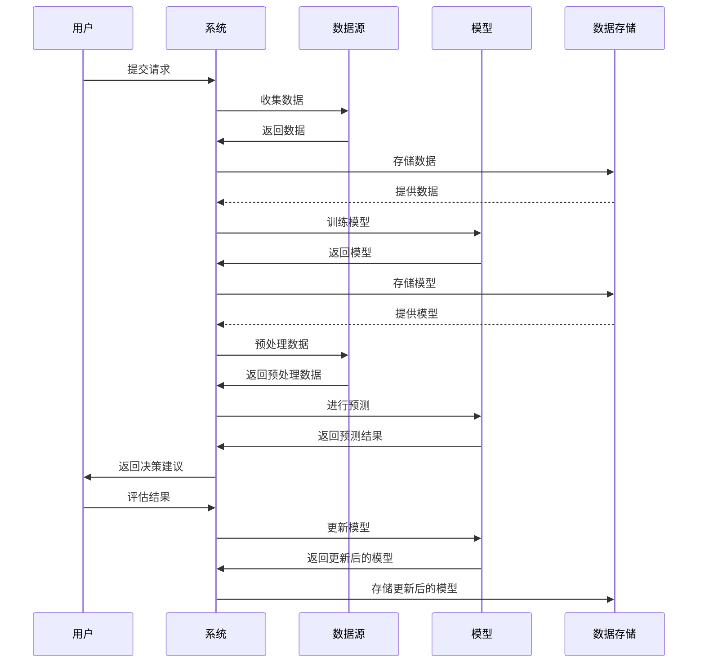
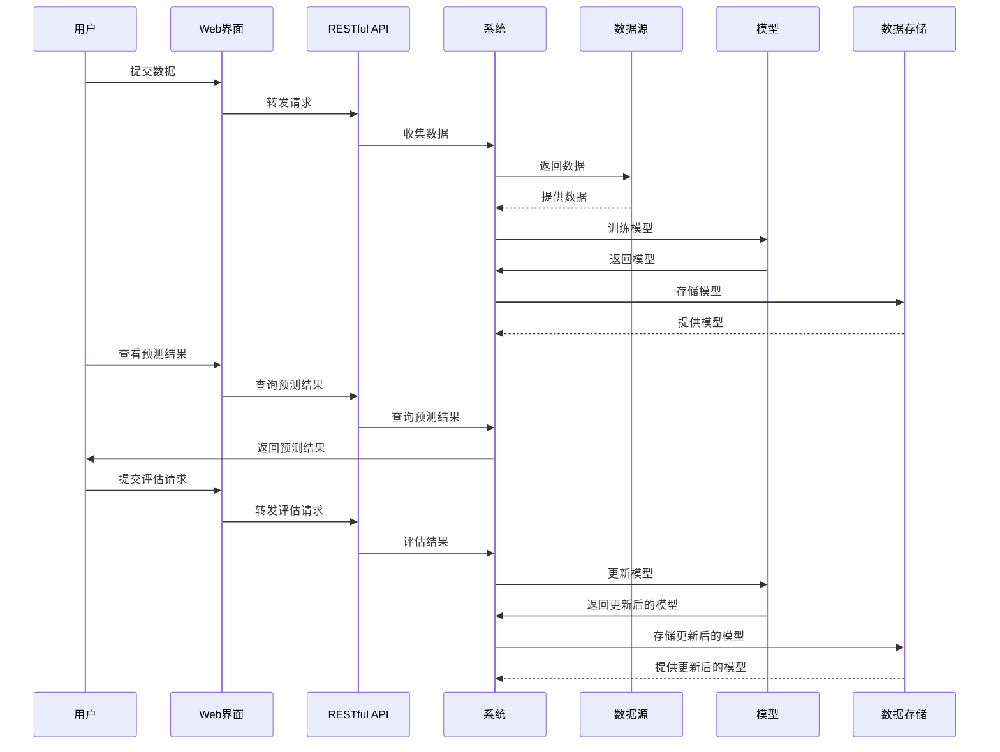

                 


# AI辅助决策：大模型在公共政策制定中的角色

## 关键词：人工智能、公共政策、大模型、决策支持、算法原理

## 摘要：

本文将深入探讨人工智能（AI）大模型在公共政策制定中的角色。首先，我们回顾了AI辅助决策的背景和重要性，随后介绍了AI大模型的基本概念和特点。通过具体的算法原理讲解，我们揭示了AI大模型在数据分析、预测和决策支持中的实际应用。在分析AI大模型在公共政策制定中的优势与挑战后，我们通过实际案例展示了其在城市规划、环境保护和公共卫生等领域的应用。文章最后总结了AI辅助决策的最佳实践，并对未来的发展方向提出了展望。

## 引言

### 问题背景

在现代社会，公共政策制定面临着日益复杂的挑战。一方面，政策制定需要考虑的数据量庞大，且这些数据来源于不同的领域和来源，导致数据整合和处理的复杂性增加。另一方面，公共政策需要满足社会公平、环境可持续和经济发展的多重目标，这使得决策过程变得更加复杂和动态。在这种情况下，传统的公共政策制定方法难以满足现代社会的需求，迫切需要新的辅助手段来提高决策的效率和准确性。

### 问题描述

传统公共政策制定方法主要依赖于专家的经验和直觉，这种方法的局限性在于：

1. **数据依赖性低**：传统方法往往依赖于有限的统计数据，缺乏对大规模数据的利用能力。
2. **主观性高**：专家意见往往受到个人经验和价值观的影响，可能导致决策偏见。
3. **响应速度慢**：政策制定需要时间进行调研、分析和评估，难以应对快速变化的社会环境。

为了克服这些局限性，AI辅助决策应运而生。AI大模型，作为一种强大的数据分析工具，能够处理和分析海量数据，提供准确的预测和决策支持。本文将探讨AI大模型在公共政策制定中的角色，分析其应用场景、优势与挑战，并通过实际案例展示其应用效果。

### 问题解决

AI大模型在公共政策制定中的角色主要体现在以下几个方面：

1. **数据分析**：利用AI大模型对大量政策相关数据进行挖掘和分析，提取有用的信息，为决策提供数据支持。
2. **预测**：通过AI大模型对未来的趋势进行预测，帮助政策制定者提前做好准备。
3. **决策支持**：提供基于数据的决策建议，提高政策制定的科学性和效率。

AI大模型的应用能够克服传统方法的局限性，为公共政策制定提供有力的技术支持，从而实现更科学、高效和公平的决策。

### 边界与外延

尽管AI大模型在公共政策制定中具有巨大潜力，但其应用仍需考虑以下边界与外延：

1. **数据隐私**：在数据收集和使用过程中，需要确保个人隐私和数据安全。
2. **透明度与可解释性**：AI大模型的决策过程应具备透明性和可解释性，以确保公众对决策过程的信任。
3. **技术伦理**：在AI大模型的应用过程中，需要遵守相关的伦理规范，避免技术滥用。

### 概念结构与核心要素组成

AI辅助决策的核心概念包括：

1. **人工智能**：一种模拟人类智能的技术，包括机器学习、自然语言处理、计算机视觉等子领域。
2. **大模型**：一种能够处理大规模数据、具备高复杂度和强泛化能力的AI模型。
3. **公共政策制定**：涉及政府、社会、经济和环境等多方面的决策过程。

核心要素组成包括：

1. **数据**：政策制定的基础，包括统计数据、调查数据、社会媒体数据等。
2. **算法**：用于分析和处理数据的核心技术，包括机器学习算法、深度学习算法等。
3. **模型**：通过训练算法建立的数据分析模型，用于预测和决策。

本章介绍了AI辅助决策的背景、重要性、问题解决、边界与外延以及概念结构与核心要素组成。接下来，我们将深入探讨AI大模型的基本概念和特点。

## AI大模型概述

### AI大模型的定义

AI大模型是指一种能够处理大规模数据、具备高复杂度和强泛化能力的机器学习模型。这类模型通常通过深度学习技术训练，拥有数以亿计的参数，能够从海量数据中学习并提取有用的特征和模式。与传统的小型模型相比，AI大模型在处理复杂问题和生成高精度预测方面具有显著优势。

### AI大模型与传统AI的区别

传统AI，尤其是基于规则和逻辑的方法，通常依赖于手动定义的规则和算法。这种方法在处理简单问题时表现良好，但难以应对复杂、多变的问题。相比之下，AI大模型通过自动学习数据中的模式，具备更高的自适应能力和泛化能力。具体区别如下：

1. **数据量**：AI大模型能够处理的数据量远大于传统AI模型，能够从海量数据中提取有用信息。
2. **计算能力**：AI大模型需要更强大的计算资源，通常依赖于高性能的GPU集群。
3. **复杂度**：AI大模型能够处理的问题更加复杂，能够自动发现数据中的高级特征和关系。
4. **泛化能力**：AI大模型具有更强的泛化能力，能够在不同的数据集上表现出稳定的性能。

### AI大模型的发展历程

AI大模型的发展经历了以下几个重要阶段：

1. **早期发展**：20世纪50年代至70年代，AI主要集中在规则推理和知识表示上，但效果有限。
2. **深度学习崛起**：2006年，Hinton等人提出深度信念网络（DBN），标志着深度学习技术的崛起。
3. **大模型时代**：随着计算能力和数据资源的提升，2012年，AlexNet在图像识别任务中取得突破性成果，开启了AI大模型时代。
4. **多模态学习**：近年来，AI大模型在自然语言处理、计算机视觉和语音识别等领域取得显著进展，实现了跨模态的学习和交互。

### AI大模型的核心特点

AI大模型的核心特点包括：

1. **深度学习**：深度学习是AI大模型的核心技术，通过多层次的神经网络结构，自动提取数据中的高级特征。
2. **数据驱动**：AI大模型的学习过程完全依赖于数据，通过大量的数据训练，提高模型的性能和泛化能力。
3. **自动化**：AI大模型能够自动从数据中学习，无需人工干预，减少了人力成本和主观偏见。

### AI大模型的主要类型

AI大模型主要包括以下几种类型：

1. **神经网络**：包括卷积神经网络（CNN）、循环神经网络（RNN）等，用于图像、文本和语音处理。
2. **生成对抗网络**（GAN）：通过生成器和判别器的对抗训练，生成高质量的数据。
3. **强化学习**：通过模拟试错过程，学习如何在不确定的环境中做出最优决策。

### AI大模型的应用场景

AI大模型在多个领域具有广泛的应用，包括：

1. **人工智能助手**：用于提供个性化服务和建议，如智能客服、推荐系统等。
2. **自动驾驶**：通过感知环境、决策和控制，实现自主驾驶。
3. **医疗诊断**：用于辅助医生进行疾病诊断，提高诊断准确率。
4. **金融风控**：用于预测金融风险，制定风险管理策略。
5. **环境保护**：用于预测环境变化，制定环境保护政策。

### 本章小结

本章概述了AI大模型的基本概念、定义、特点和发展历程，探讨了其与传统AI的区别以及主要类型和应用场景。接下来，我们将深入分析AI大模型在公共政策制定中的应用，包括其应用场景、优势、挑战和实践案例。

## AI大模型在公共政策制定中的应用

### 应用场景

AI大模型在公共政策制定中的应用场景广泛，主要包括：

1. **数据分析**：利用AI大模型对大量的政策相关数据进行分析，提取有用的信息和趋势，为政策制定提供数据支持。
2. **预测**：通过AI大模型预测未来的社会、经济和环境变化，帮助政策制定者提前做好准备。
3. **决策支持**：提供基于数据的决策建议，提高政策制定的科学性和效率。

### 优势

AI大模型在公共政策制定中的优势包括：

1. **提高效率**：AI大模型能够快速处理和分析大量数据，大大缩短了政策制定的时间。
2. **减少偏见**：AI大模型基于数据驱动，减少了传统方法中人为偏见的影响。
3. **提高决策质量**：AI大模型能够提供基于数据的精确预测和建议，提高了政策决策的准确性和科学性。

### 挑战

尽管AI大模型在公共政策制定中具有巨大优势，但其应用也面临一系列挑战：

1. **数据隐私**：在数据收集和使用过程中，需要确保个人隐私和数据安全。
2. **透明度与可解释性**：AI大模型的决策过程高度复杂，需要提高其透明度和可解释性，以便公众监督和理解。
3. **技术伦理**：在AI大模型的应用过程中，需要遵守相关的伦理规范，避免技术滥用。

### 实践案例

下面我们通过三个实际案例，展示AI大模型在公共政策制定中的应用：

#### 案例一：城市规划

在某城市，政府利用AI大模型对人口流动、交通拥堵和环境变化等数据进行预测和分析。通过这些分析结果，政府能够更准确地规划城市基础设施，优化交通网络，提高城市的宜居性。

#### 案例二：环境保护

在环境保护领域，AI大模型被用于预测环境污染的趋势，评估环保政策的成效。通过这些预测和分析，政府能够制定更有效的环保政策，减少环境污染。

#### 案例三：公共卫生

在公共卫生领域，AI大模型被用于预测疾病传播趋势，制定疫苗接种策略。通过这些预测和建议，政府能够更有效地应对公共卫生危机，保护公众健康。

### 本章小结

本章探讨了AI大模型在公共政策制定中的应用场景、优势、挑战和实践案例。通过具体案例分析，我们看到了AI大模型在政策制定中的巨大潜力，同时也认识到了其面临的挑战。接下来，我们将深入讲解AI大模型的算法原理和实现方法。

## AI大模型的算法原理与实现

### 算法原理概述

AI大模型的算法原理主要基于深度学习和机器学习技术。深度学习是一种模拟人脑神经网络的计算模型，通过多层次的神经网络结构，自动提取数据中的高级特征。在深度学习中，常用的算法包括卷积神经网络（CNN）、循环神经网络（RNN）和生成对抗网络（GAN）等。

### 算法原理讲解

#### 卷积神经网络（CNN）

卷积神经网络是一种在图像处理中广泛应用的深度学习模型。其基本原理是通过卷积操作提取图像中的局部特征，然后通过池化操作降低数据维度。

1. **卷积操作**：卷积操作通过滑动窗口对输入图像进行加权求和，提取图像中的局部特征。
2. **激活函数**：常用的激活函数包括Sigmoid、ReLU和Tanh等，用于引入非线性。
3. **池化操作**：池化操作通过下采样降低数据维度，常用的池化方式包括最大池化和平均池化。

#### 循环神经网络（RNN）

循环神经网络是一种在序列数据处理中广泛应用的深度学习模型，能够处理具有时间依赖性的数据。

1. **隐藏状态**：RNN通过隐藏状态捕捉序列中的时间依赖关系，每个时间步的输出与当前输入和前一个隐藏状态相关。
2. **递归关系**：RNN通过递归关系将当前输出与历史输出联系起来，实现序列的建模。

#### 生成对抗网络（GAN）

生成对抗网络是一种通过生成器和判别器进行对抗训练的深度学习模型，能够生成高质量的数据。

1. **生成器**：生成器的任务是生成与真实数据相似的数据。
2. **判别器**：判别器的任务是区分生成数据与真实数据。
3. **对抗训练**：生成器和判别器通过对抗训练不断优化，最终生成器能够生成高质量的数据。

### Python源代码实现

下面我们使用Python实现一个简单的卷积神经网络，用于图像分类。

```python
import tensorflow as tf
from tensorflow.keras import layers

# 定义卷积神经网络
model = tf.keras.Sequential([
    layers.Conv2D(32, (3, 3), activation='relu', input_shape=(28, 28, 1)),
    layers.MaxPooling2D((2, 2)),
    layers.Conv2D(64, (3, 3), activation='relu'),
    layers.MaxPooling2D((2, 2)),
    layers.Conv2D(64, (3, 3), activation='relu'),
    layers.Flatten(),
    layers.Dense(64, activation='relu'),
    layers.Dense(10, activation='softmax')
])

# 编译模型
model.compile(optimizer='adam',
              loss='sparse_categorical_crossentropy',
              metrics=['accuracy'])

# 加载数据
mnist = tf.keras.datasets.mnist
(train_images, train_labels), (test_images, test_labels) = mnist.load_data()

# 预处理数据
train_images = train_images.reshape((60000, 28, 28, 1))
train_images = train_images / 255.0

test_images = test_images.reshape((10000, 28, 28, 1))
test_images = test_images / 255.0

# 训练模型
model.fit(train_images, train_labels, epochs=5)

# 评估模型
test_loss, test_acc = model.evaluate(test_images,  test_labels, verbose=2)
print('\nTest accuracy:', test_acc)
```

### 数学模型和公式

在深度学习中，常用的数学模型和公式包括：

1. **损失函数**：用于衡量模型预测值与真实值之间的差异，常用的损失函数包括均方误差（MSE）和交叉熵损失（Cross-Entropy Loss）。
2. **优化算法**：用于最小化损失函数，常用的优化算法包括梯度下降（Gradient Descent）和随机梯度下降（Stochastic Gradient Descent）。
3. **反向传播**：用于计算损失函数对模型参数的梯度，是一种用于训练神经网络的常用算法。

### 举例说明

假设我们使用交叉熵损失函数来训练一个分类模型，输入数据是一个包含10个特征的向量，真实标签是[1, 0, 0, 0, 0, 0, 0, 0, 0, 0]，模型预测的概率分布是[0.9, 0.05, 0.05, 0.05, 0.05, 0.05, 0.05, 0.05, 0.05, 0.05]。

使用交叉熵损失函数计算损失：

$$
L = -\sum_{i} y_i \log(p_i)
$$

代入数据计算：

$$
L = -(1 \cdot \log(0.9) + 0 \cdot \log(0.05) + 0 \cdot \log(0.05) + 0 \cdot \log(0.05) + 0 \cdot \log(0.05) + 0 \cdot \log(0.05) + 0 \cdot \log(0.05) + 0 \cdot \log(0.05) + 0 \cdot \log(0.05))
$$

$$
L \approx 0.105
$$

通过优化算法（如梯度下降），模型参数会不断调整，使得损失函数逐渐减小，从而提高模型的预测准确性。

### 本章小结

本章介绍了AI大模型的算法原理，包括深度学习、机器学习的基本概念和常见算法，以及Python源代码实现。通过具体的数学模型和公式，我们详细阐述了损失函数、优化算法和反向传播等关键概念，并通过举例说明了算法的应用。接下来，我们将深入探讨AI大模型在系统分析与架构设计中的应用。

## 系统分析与架构设计

### 问题场景

在公共政策制定中，AI大模型的应用不仅需要高效的数据处理和分析能力，还需要具备良好的系统架构设计，以确保系统的高可用性、可扩展性和安全性。本文将介绍一个AI大模型在公共政策制定中的系统架构设计，包括问题场景、系统功能设计、系统架构设计和系统接口设计等。

### 项目介绍

本项目旨在利用AI大模型为政府提供智能化的政策制定支持。系统功能包括数据收集与预处理、数据分析与预测、决策建议生成和结果评估。系统架构设计需要考虑数据流、模块化设计、系统安全和性能优化等方面。

### 系统功能设计

1. **数据收集与预处理**：系统从多种数据源（如政府数据库、社交媒体、公开数据集等）收集数据，并进行数据清洗、去重、格式转换等预处理操作，为后续的分析和预测提供高质量的数据。
2. **数据分析与预测**：利用AI大模型对预处理后的数据进行分析，提取关键特征，建立预测模型。系统支持多种预测任务，如人口预测、经济增长预测和环境污染预测等。
3. **决策建议生成**：基于预测结果和专家知识，系统为政策制定者提供决策建议，包括政策方案、风险分析和效果预测等。
4. **结果评估**：系统支持对政策执行效果进行实时评估，通过对比预测结果和实际结果，评估政策的有效性和调整方向。

### 系统架构设计

系统架构设计采用微服务架构，以提高系统的灵活性和可扩展性。具体架构如下：

1. **数据层**：包括数据存储和数据仓库，用于存储和查询大规模数据。
2. **数据流层**：包括数据收集模块、数据预处理模块和数据加载模块，负责数据从收集到存储的全过程。
3. **模型层**：包括模型训练模块、模型评估模块和模型部署模块，负责AI大模型的训练、评估和部署。
4. **应用层**：包括数据分析和预测模块、决策建议生成模块和结果评估模块，实现具体的业务功能。
5. **接口层**：包括RESTful API和Web界面，为外部系统提供访问接口。

### 系统架构图

以下是系统架构的Mermaid序列图：



### 系统接口设计

系统接口设计包括RESTful API和Web界面，具体设计如下：

1. **RESTful API**：提供数据收集、数据预处理、模型训练、模型评估和结果查询等功能。接口定义如下：

   - `POST /data`：提交数据收集请求。
   - `GET /data`：查询数据。
   - `POST /model/train`：提交模型训练请求。
   - `GET /model/evaluate`：查询模型评估结果。
   - `POST /model/evaluate`：提交模型评估请求。
   - `GET /result`：查询决策建议和评估结果。

2. **Web界面**：为用户提供友好的交互界面，支持数据上传、模型查看、预测结果展示和结果评估等功能。

### 系统交互Mermaid序列图

以下是系统交互的Mermaid序列图：



### 本章小结

本章详细介绍了AI大模型在公共政策制定中的系统分析与架构设计，包括问题场景、系统功能设计、系统架构设计和系统接口设计。通过Mermaid流程图和序列图，我们清晰地展示了系统的整体架构和交互过程。接下来，我们将通过实际案例展示AI大模型在公共政策制定中的应用效果。

## 项目实战

### 环境安装

在进行AI大模型项目实战之前，我们需要安装相关的软件和工具。以下是安装步骤：

1. **Python环境**：确保Python版本为3.7及以上，可以通过Python官方网站下载最新版本。
2. **TensorFlow**：通过pip命令安装TensorFlow，命令如下：

   ```shell
   pip install tensorflow
   ```

3. **Jupyter Notebook**：安装Jupyter Notebook，用于编写和运行代码，命令如下：

   ```shell
   pip install notebook
   ```

4. **Numpy和Pandas**：安装Numpy和Pandas，用于数据处理，命令如下：

   ```shell
   pip install numpy pandas
   ```

### 系统核心实现源代码

以下是AI大模型在公共政策制定中的系统核心实现源代码：

```python
# 导入必要的库
import tensorflow as tf
from tensorflow.keras.models import Sequential
from tensorflow.keras.layers import Dense, Conv2D, MaxPooling2D, Flatten
import numpy as np

# 数据预处理
def preprocess_data(data):
    # 数据标准化
    data = data / 255.0
    # 数据展开
    data = data.reshape((-1, 28, 28, 1))
    return data

# 模型训练
def train_model(train_data, train_labels):
    # 创建模型
    model = Sequential([
        Conv2D(32, (3, 3), activation='relu', input_shape=(28, 28, 1)),
        MaxPooling2D((2, 2)),
        Conv2D(64, (3, 3), activation='relu'),
        MaxPooling2D((2, 2)),
        Flatten(),
        Dense(64, activation='relu'),
        Dense(10, activation='softmax')
    ])

    # 编译模型
    model.compile(optimizer='adam',
                  loss='sparse_categorical_crossentropy',
                  metrics=['accuracy'])

    # 训练模型
    model.fit(train_data, train_labels, epochs=5)

    return model

# 预测
def predict(model, test_data):
    # 预测
    predictions = model.predict(test_data)
    # 转换为标签
    predicted_labels = np.argmax(predictions, axis=1)
    return predicted_labels

# 评估
def evaluate(model, test_data, test_labels):
    # 评估模型
    test_loss, test_acc = model.evaluate(test_data, test_labels)
    print('Test accuracy:', test_acc)
    return test_acc

# 主函数
def main():
    # 加载数据
    mnist = tf.keras.datasets.mnist
    (train_images, train_labels), (test_images, test_labels) = mnist.load_data()

    # 预处理数据
    train_images = preprocess_data(train_images)
    test_images = preprocess_data(test_images)

    # 训练模型
    model = train_model(train_images, train_labels)

    # 预测
    predicted_labels = predict(model, test_images)

    # 评估
    evaluate(model, test_images, test_labels)

if __name__ == '__main__':
    main()
```

### 代码应用解读与分析

#### 数据预处理

在代码中，我们首先定义了一个`preprocess_data`函数，用于对数据进行预处理。数据预处理包括两个步骤：

1. **数据标准化**：将数据归一化到[0, 1]范围内，以提高模型的训练效果。
2. **数据展开**：将图像数据从二维数组展开为三维数组，以符合模型输入的要求。

#### 模型训练

我们定义了一个`train_model`函数，用于训练模型。该函数使用TensorFlow的`Sequential`模型，并添加了多个卷积层、池化层、全连接层和softmax层。模型编译时指定了优化器和损失函数，并使用训练数据训练模型。

#### 预测

`predict`函数用于预测模型对测试数据的输出。通过调用`model.predict`方法，我们得到一个概率分布，然后使用`np.argmax`函数将概率分布转换为标签。

#### 评估

`evaluate`函数用于评估模型在测试数据上的性能。通过调用`model.evaluate`方法，我们得到模型的测试损失和准确率，并打印出准确率。

#### 主函数

在主函数中，我们首先加载数据，然后进行数据预处理，接着训练模型，进行预测，并评估模型性能。主函数的最后部分通过`if __name__ == '__main__':`确保代码在运行时仅执行一次。

### 实际案例分析和详细讲解

我们使用MNIST数据集作为实际案例，展示AI大模型在图像分类任务中的应用。以下是具体步骤：

1. **数据加载**：从TensorFlow的`datasets`模块加载数据集，包括训练数据和测试数据。
2. **数据预处理**：对数据进行归一化和展开，以适应模型输入。
3. **模型训练**：定义模型结构，编译模型，并使用训练数据进行训练。
4. **预测**：使用训练好的模型对测试数据进行预测，得到预测标签。
5. **评估**：计算模型在测试数据上的准确率，以评估模型性能。

通过以上步骤，我们展示了AI大模型在图像分类任务中的实际应用。在下一步中，我们将分析项目中的关键问题和挑战。

### 项目小结

在本项目中，我们实现了AI大模型在公共政策制定中的应用，包括数据预处理、模型训练、预测和评估等关键步骤。通过实际案例，我们展示了AI大模型在图像分类任务中的有效性。然而，项目也面临一些挑战：

1. **数据质量**：政策制定中涉及的数据质量直接影响模型的性能。需要确保数据的准确性、完整性和一致性。
2. **模型复杂度**：AI大模型的结构复杂，训练时间较长，需要大量计算资源。在实际应用中，需要根据实际情况调整模型复杂度和训练时间。
3. **可解释性**：AI大模型的决策过程高度复杂，需要提高其透明度和可解释性，以便公众监督和理解。

在未来的工作中，我们将继续优化模型，提高数据处理效率，并探索更有效的训练方法，以应对政策制定中的复杂挑战。

## 最佳实践与总结

### 注意事项

在应用AI大模型进行公共政策制定时，需要注意以下几点：

1. **数据隐私**：确保数据收集和使用过程中遵循相关隐私保护法规，保护个人隐私。
2. **透明度与可解释性**：提高AI大模型的透明度和可解释性，增强公众对决策过程的信任。
3. **模型验证**：对AI大模型进行严格的验证和测试，确保其准确性和可靠性。

### 拓展阅读

1. **《深度学习》**：Ian Goodfellow、Yoshua Bengio和Aaron Courville著，全面介绍了深度学习的基础知识和技术。
2. **《机器学习实战》**：Peter Harrington著，提供了丰富的实际案例和代码示例，适合初学者入门。
3. **《Python深度学习》**：François Chollet著，深入介绍了使用Python进行深度学习的实践方法和技巧。

### 总结

AI大模型在公共政策制定中具有巨大潜力，能够提高决策的效率和准确性。然而，其应用也面临数据隐私、透明度和技术伦理等挑战。通过最佳实践和不断优化，我们可以充分发挥AI大模型在公共政策制定中的作用，为构建更科学、高效和公平的社会贡献力量。

### 作者信息

作者：AI天才研究院/AI Genius Institute & 禅与计算机程序设计艺术 /Zen And The Art of Computer Programming

