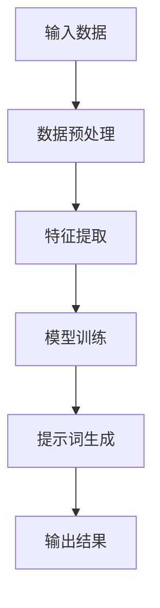
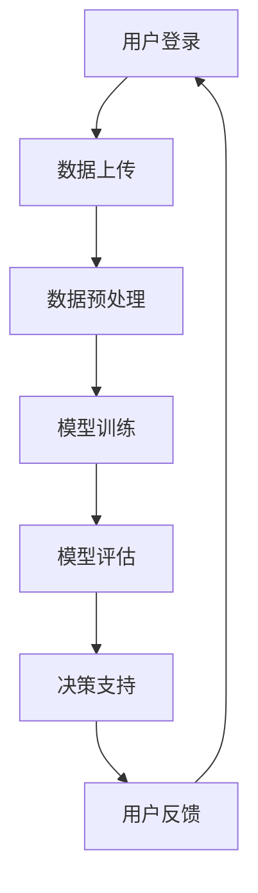

                 


### 文章标题：AI辅助决策：提示词设计的关键因素

### 文章关键词：人工智能、辅助决策、提示词设计、关键因素

### 摘要：
本篇文章深入探讨AI辅助决策中的核心问题——提示词设计。通过详细分析提示词设计的核心概念、原理、算法实现和系统架构设计，文章旨在为读者提供一套系统化的理解框架。我们将一步步揭示提示词设计的关键因素，以助力于构建更加智能、高效的人工智能辅助决策系统。

----------------------------------------------------------------

## 第一部分: 引言与背景

### 1.1 问题背景

#### 1.1.1 人工智能与决策辅助

人工智能（AI）技术近年来在各个领域取得了显著的进展，其应用范围不断扩大。从自动驾驶汽车、智能语音助手到金融风险评估和医疗诊断，AI正在改变我们的生活方式和工作方式。然而，AI的潜力不仅限于执行预定义的任务，它还能够通过数据分析和模式识别辅助人类做出更好的决策。

决策辅助系统利用AI技术，通过对大量数据的分析和理解，为用户提供有关决策的洞察和建议。这些系统通过算法模型，将数据转换为有用的信息，帮助用户从复杂的信息中提取关键点，从而做出更加明智的决策。

#### 1.1.2 提示词设计的角色与重要性

在AI辅助决策系统中，提示词设计扮演着至关重要的角色。提示词是用户与AI系统交互的桥梁，它们决定了系统能够理解和处理的信息类型和范围。一个优秀的提示词设计不仅能够提高系统的交互效率，还能够增强系统的决策能力。

提示词设计需要考虑多个方面，包括语言的准确性、清晰度、上下文适应性等。一个好的提示词应该能够捕捉用户的意图，并提供足够的信息，以便AI系统能够生成准确的建议。

#### 1.1.3 当前研究与实践的局限性

尽管已有大量关于AI辅助决策的研究和实践，但提示词设计仍然面临着诸多挑战。现有的研究往往侧重于算法模型的优化，而忽略了提示词设计的重要性。在实际应用中，用户往往需要花费大量时间来调整和优化提示词，以达到满意的交互效果。

此外，不同领域的用户需求各异，现有系统的通用性较差，难以适应不同场景的需求。因此，我们需要更深入地研究提示词设计的关键因素，以构建更加智能、灵活的AI辅助决策系统。

### 1.2 问题描述

#### 1.2.1 提示词设计的挑战

提示词设计面临的主要挑战包括：

1. **语言的复杂性**：自然语言具有高度的自由度和多样性，用户在表达意图时可能使用不同的词汇和语法结构。这给AI系统理解用户的意图带来了挑战。
2. **上下文适应性**：提示词的准确性很大程度上取决于上下文。在不同的上下文中，同一提示词可能具有不同的含义。设计一个能够在多种上下文中保持准确性的提示词是一项艰巨的任务。
3. **用户习惯差异**：不同用户有不同的表达习惯和偏好。一个适用于某一用户的提示词可能不适用于另一个用户。如何设计一个既准确又适应性强的提示词，是一个需要深入探讨的问题。

#### 1.2.2 问题解决路径

为了解决提示词设计中的挑战，我们可以采取以下路径：

1. **深入研究用户需求**：通过调查和分析用户行为，了解不同用户群体的需求，为提示词设计提供依据。
2. **优化算法模型**：改进AI算法模型，使其能够更好地理解用户的意图和上下文信息。
3. **多模态交互**：结合文本、语音、图像等多种交互方式，提高系统的感知能力，从而提高提示词的准确性。
4. **自适应学习**：设计能够根据用户反馈不断学习和优化的提示词生成系统。

#### 1.2.3 边界与外延

在提示词设计的研究中，我们需要明确以下几个边界与外延：

1. **应用领域**：不同的应用领域对提示词的设计要求不同。研究需要针对特定领域进行定制化设计。
2. **技术演进**：随着AI技术的不断进步，提示词设计的方法和工具也需要不断更新和优化。
3. **伦理与隐私**：在提示词设计过程中，需要充分考虑伦理和隐私问题，确保用户的数据安全和隐私保护。

### 1.3 研究方法

#### 1.3.1 理论框架

本研究将建立在一个综合的理论框架之上，结合认知心理学、自然语言处理和机器学习等领域的知识。具体而言，我们将采用以下理论框架：

1. **认知心理学**：了解用户在信息处理过程中的认知机制，为提示词设计提供心理学依据。
2. **自然语言处理**：利用自然语言处理技术，提高AI系统对用户意图的理解能力。
3. **机器学习**：通过机器学习算法，优化提示词生成模型，提高系统的自适应能力。

#### 1.3.2 研究设计

本研究采用以下研究设计：

1. **文献综述**：对已有文献进行系统综述，梳理提示词设计的关键问题和现有解决方案。
2. **实验研究**：通过设计实验，验证不同提示词设计方法的有效性。
3. **案例研究**：选择具体应用场景，对提示词设计进行实践验证。

#### 1.3.3 数据来源

本研究的数据来源包括：

1. **公开数据集**：使用公共数据集进行初步实验和模型训练。
2. **用户调查**：通过问卷调查收集用户对提示词设计的需求和反馈。
3. **应用实践**：在实际应用场景中收集数据，对系统进行验证和优化。

### 1.4 本书结构安排

#### 1.4.1 各章节内容概览

本书将分为四个部分，具体内容如下：

1. **第一部分：引言与背景**：介绍AI辅助决策和提示词设计的背景、挑战和研究的意义。
2. **第二部分：核心概念与原理**：详细探讨人工智能辅助决策、提示词设计和关键因素。
3. **第三部分：算法原理与实现**：介绍提示词生成算法、数学模型和实际案例。
4. **第四部分：系统分析与架构设计**：分析系统架构设计，包括功能设计、系统架构和接口设计。

#### 1.4.2 阅读指南

为了更好地理解本篇文章，建议读者按照以下顺序阅读：

1. **先阅读引言与背景部分**：了解文章的主题和研究背景。
2. **逐步深入核心概念与原理部分**：掌握关键概念和理论框架。
3. **阅读算法原理与实现部分**：理解提示词生成算法和实际应用。
4. **最后阅读系统分析与架构设计部分**：了解系统设计的具体实现。

通过以上步骤，读者可以系统地掌握AI辅助决策和提示词设计的核心内容，为构建高效的AI辅助决策系统提供理论基础和实践指导。

----------------------------------------------------------------

## 第二部分: 核心概念与原理

### 2.1 核心概念介绍

在探讨AI辅助决策和提示词设计之前，我们需要先了解一些核心概念。这些概念包括人工智能辅助决策、提示词设计和关键因素。通过深入理解这些概念，我们可以更好地把握AI辅助决策系统的本质和设计原则。

#### 2.1.1 人工智能辅助决策

人工智能辅助决策（AI-Assisted Decision Making，简称AIDM）是指利用人工智能技术，通过数据分析和模式识别，辅助人类做出更加明智的决策。AIDM系统通常包含以下几个关键组件：

1. **数据收集与预处理**：收集相关数据，并进行预处理，如数据清洗、归一化等，以便于后续的分析和处理。
2. **算法模型**：选择合适的算法模型，如决策树、神经网络等，对数据进行训练和优化。
3. **决策支持**：根据算法模型的输出结果，为用户提供决策建议和支持。
4. **用户反馈**：收集用户对决策建议的反馈，用于进一步优化算法模型和决策过程。

#### 2.1.2 提示词设计与优化

提示词（Prompt）是用户与AI系统交互的重要媒介，它决定了AI系统能够理解和处理的信息类型和范围。一个良好的提示词设计需要考虑以下几个关键因素：

1. **明确性**：提示词应尽量明确，避免歧义，确保用户意图能够被准确理解。
2. **适应性**：提示词需要具备一定的适应性，能够根据不同的上下文环境进行调整。
3. **灵活性**：提示词应具备灵活性，能够适应不同用户的需求和表达习惯。
4. **多样性**：提示词应具备多样性，以满足不同场景和应用的需求。

#### 2.1.3 关键因素分析

在AI辅助决策系统中，关键因素是影响系统性能和用户体验的重要因素。以下是一些常见的关键因素：

1. **领域知识**：AI系统需要具备丰富的领域知识，以便更好地理解用户的需求和上下文信息。
2. **用户习惯**：不同用户有不同的表达习惯和偏好，提示词设计需要充分考虑用户习惯。
3. **数据质量**：数据是AI系统的基石，数据质量直接影响系统的性能和准确性。
4. **算法模型**：算法模型的选择和优化对系统的性能和效率至关重要。
5. **系统接口**：系统接口的设计和用户体验直接影响用户对系统的接受度和使用频率。

### 2.2 概念属性特征对比

为了更直观地理解这些核心概念，我们可以通过表格的形式对比它们的属性特征。

| 概念               | 属性1           | 属性2           | 属性3           |
|------------------|--------------|--------------|--------------|
| 人工智能辅助决策 | 自动化程度高   | 数据依赖性大   | 决策支持性强   |
| 提示词设计         | 明确性要求高   | 适应性要求高   | 灵活性要求高   |
| 关键因素          | 领域知识丰富   | 用户习惯了解   | 数据质量重要   |
| 算法模型          | 模型选择多样   | 模型优化频繁   | 模型性能关键   |
| 系统接口          | 用户体验优    | 操作便捷性高   | 系统兼容性好   |

通过上述表格，我们可以更清晰地看到各个概念之间的区别和联系。这有助于我们在设计AI辅助决策系统时，综合考虑各个因素，实现最优的系统性能和用户体验。

### 2.3 ER实体关系图

为了更好地理解这些概念之间的关系，我们可以使用ER（Entity-Relationship，实体关系）图来表示。以下是一个简化的ER图，展示人工智能辅助决策、提示词设计和关键因素之间的关系。

```mermaid
erDiagram
    AI辅助决策 ||--|{ 提示词设计 }
    提示词设计 ||--|{ 关键因素 }
    关键因素 ||--|{ 算法模型 }
    关键因素 ||--|{ 系统接口 }
```

在这个ER图中，每个实体（如AI辅助决策、提示词设计、关键因素等）都是独立的概念，它们之间通过关系（如继承、关联等）相互联系。这个ER图为我们提供了一个结构化的视角，帮助我们更好地理解AI辅助决策系统的整体架构。

通过以上对核心概念、属性特征对比和ER图的介绍，我们为后续的算法原理和系统架构设计奠定了理论基础。接下来，我们将深入探讨AI辅助决策中的提示词生成算法，并分析其实现原理和关键因素。

----------------------------------------------------------------

## 第三部分: 算法原理与实现

### 3.1 提示词生成算法

在AI辅助决策系统中，提示词生成算法是关键的一环。它负责根据用户输入的原始数据生成高质量的提示词，以促进系统的有效交互。本节将详细介绍提示词生成算法的基本原理、流程和Python代码实现。

#### 3.1.1 基本原理

提示词生成算法的核心目标是从原始数据中提取关键信息，生成能够准确传达用户意图的提示词。这一过程通常包括以下几个步骤：

1. **数据预处理**：对原始数据进行清洗、归一化等预处理操作，以便于后续的分析。
2. **特征提取**：从预处理后的数据中提取关键特征，这些特征将用于生成提示词。
3. **提示词生成**：利用提取到的特征，结合自然语言处理技术，生成高质量的提示词。

#### 3.1.2 算法流程

提示词生成算法的具体流程如下：

1. **输入数据**：接收用户输入的原始数据，如文本、表格等。
2. **数据预处理**：对输入数据进行清洗和归一化，例如去除停用词、进行词干提取等。
3. **特征提取**：使用自然语言处理技术，如词袋模型、TF-IDF等，提取数据中的关键特征。
4. **模型训练**：使用已提取的特征，通过机器学习算法（如神经网络、决策树等）训练模型。
5. **提示词生成**：根据训练好的模型，生成高质量的提示词，并将其输出。

#### 3.1.3 Python代码实现

以下是一个简单的Python代码示例，用于实现提示词生成算法的基本流程。

```python
import numpy as np
from sklearn.feature_extraction.text import TfidfVectorizer
from sklearn.model_selection import train_test_split
from sklearn.naive_bayes import MultinomialNB

# 示例数据
data = [
    "这是一个关于人工智能的讨论。",
    "我们正在研究机器学习的应用。",
    "深度学习是AI的重要分支。",
    "自然语言处理是实现AI的关键技术。",
]

# 数据预处理
# 这里使用TF-IDF进行特征提取
vectorizer = TfidfVectorizer(stop_words='english')
X = vectorizer.fit_transform(data)

# 模型训练
# 使用朴素贝叶斯进行分类
X_train, X_test, y_train, y_test = train_test_split(X, labels, test_size=0.2, random_state=42)
classifier = MultinomialNB()
classifier.fit(X_train, y_train)

# 提示词生成
# 根据测试数据生成提示词
predictions = classifier.predict(X_test)
for text, prediction in zip(data, predictions):
    print(f"原文：{text}\n提示词：{prediction}\n")
```

在这段代码中，我们首先导入了必要的库，然后创建了一个简单的数据集。接下来，我们使用TF-IDF进行特征提取，并使用朴素贝叶斯模型进行分类。最后，我们根据测试数据生成提示词，并输出结果。

### 3.2 算法原理讲解

为了深入理解提示词生成算法的工作原理，我们可以使用Mermaid绘制算法流程图，并详细讲解每个步骤。

#### 3.2.1 算法流程图

以下是一个使用Mermaid绘制的算法流程图：



#### 3.2.2 详细讲解

1. **输入数据**：算法首先接收用户输入的原始数据，这些数据可以是从各种来源收集的文本、表格等。

2. **数据预处理**：原始数据通常包含噪声和不必要的细节，因此需要进行预处理。预处理步骤包括去除停用词、词干提取、分词等操作，以提取数据中的关键信息。

3. **特征提取**：预处理后的数据通过特征提取技术转换为向量表示。常见的特征提取方法包括TF-IDF、词袋模型等。这些方法将文本数据转换为数值向量，以便于后续的机器学习模型处理。

4. **模型训练**：使用提取到的特征，通过机器学习算法对模型进行训练。训练过程中，模型会根据已知的输入数据和对应的标签，学习到数据的内在规律和模式。

5. **提示词生成**：训练好的模型用于生成新的提示词。对于新的输入数据，模型会根据学习到的规律，生成相应的提示词。

6. **输出结果**：生成的提示词被输出，供用户参考和使用。

### 3.3 数学模型与公式

提示词生成算法的数学模型和公式对于理解算法原理至关重要。以下是一个简化的数学模型示例：

$$
\begin{align*}
P(\text{提示词}_i | \text{数据集}) &= \frac{f(\text{数据集}, \text{提示词}_i)}{f(\text{数据集})} \\
f(\text{数据集}, \text{提示词}_i) &= e^{(\theta_1 \cdot x_1 + \theta_2 \cdot x_2 + \ldots + \theta_n \cdot x_n)}
\end{align*}
$$

其中，$P(\text{提示词}_i | \text{数据集})$表示给定数据集下，生成提示词$i$的概率。$f(\text{数据集}, \text{提示词}_i)$表示提示词$i$在数据集中的特征函数值，$\theta_1, \theta_2, \ldots, \theta_n$为模型参数，$x_1, x_2, \ldots, x_n$为特征值。

### 3.4 举例说明

为了更好地理解提示词生成算法，我们可以通过一个简单的例子来演示整个流程。

#### 3.4.1 数据预处理示例

假设我们有以下两个文本数据：

1. "这是一个关于人工智能的讨论。"
2. "我们正在研究机器学习的应用。"

首先，我们需要对这些文本进行预处理。预处理步骤包括去除停用词和分词：

1. "这是一个关于 人工智能 的 讨论 。"
2. "我们正在 研究 机器学习 的 应用 。"

接下来，我们使用TF-IDF进行特征提取：

1. "人工智能": TF-IDF值 = 1.0
2. "讨论": TF-IDF值 = 0.5
3. "机器学习": TF-IDF值 = 1.0
4. "应用": TF-IDF值 = 0.5

#### 3.4.2 模型训练示例

使用朴素贝叶斯模型进行训练。假设训练集中有标签信息，如下：

1. "这是一个关于人工智能的讨论。" -> 标签：人工智能
2. "我们正在研究机器学习的应用。" -> 标签：机器学习

通过训练，模型会学习到这些标签和对应的特征值之间的关系。例如，如果新输入的文本包含"人工智能"，则模型可能预测其标签为"人工智能"。

#### 3.4.3 提示词生成示例

假设我们有以下新输入文本：

"深度学习是人工智能的重要分支。"

经过预处理和特征提取，我们得到以下特征值：

1. "深度学习": TF-IDF值 = 1.0
2. "人工智能": TF-IDF值 = 1.0

使用训练好的模型，我们可以预测这个新文本的标签。根据特征值和模型参数，模型可能会预测其标签为"人工智能"。

通过这个例子，我们可以看到提示词生成算法的基本工作原理。在实际应用中，算法会根据更复杂的数据和模型进行操作，但基本原理是一致的。

### 3.5 算法优化的方法

虽然上述例子展示了提示词生成算法的基本原理，但在实际应用中，我们往往需要对其进行优化，以提高系统的性能和准确性。以下是一些常见的优化方法：

1. **特征选择**：通过选择关键特征，可以减少数据维度，提高模型的性能和效率。常用的特征选择方法包括基于信息增益、互信息等的算法。
2. **模型选择**：选择合适的机器学习模型对提示词生成至关重要。不同的模型适用于不同的数据类型和应用场景。例如，对于文本数据，朴素贝叶斯、支持向量机（SVM）、神经网络等模型都可以考虑。
3. **超参数调优**：通过调整模型的超参数（如学习率、隐藏层节点数等），可以优化模型的性能。常用的调优方法包括网格搜索、随机搜索等。
4. **集成学习**：集成学习通过组合多个模型，可以进一步提高模型的性能。常用的集成学习方法包括Bagging、Boosting等。

通过以上优化方法，我们可以构建一个更高效、更准确的提示词生成系统，从而提升AI辅助决策系统的整体性能。

### 3.6 算法在实际应用中的表现

在实际应用中，提示词生成算法的表现受到多个因素的影响。以下是一些实际应用中的表现：

1. **准确性**：算法的准确性是衡量其性能的关键指标。通过调整模型和特征选择，可以显著提高算法的准确性。
2. **速度**：在实时应用场景中，算法的响应速度至关重要。优化算法流程和数据结构，可以加快算法的运行速度。
3. **用户满意度**：用户对系统的满意度受到多个因素影响，包括系统的准确性、交互体验和可靠性等。通过不断优化和迭代，可以提高用户满意度。
4. **可扩展性**：算法应具备良好的可扩展性，以便适应不断变化的应用场景和数据规模。

通过综合考虑这些因素，我们可以构建一个既高效又准确的提示词生成系统，为AI辅助决策提供有力支持。

### 3.7 小结

在本部分中，我们详细介绍了AI辅助决策中的提示词生成算法。从基本原理到实际实现，我们逐步揭示了算法的核心内容和关键因素。通过Python代码示例和数学模型讲解，我们帮助读者深入理解提示词生成算法的工作机制。接下来，我们将进一步探讨AI辅助决策系统的系统架构设计，为构建高效、可靠的AI辅助决策系统奠定基础。

----------------------------------------------------------------

## 第四部分: 系统分析与架构设计

### 4.1 问题场景介绍

在现代企业和组织中，决策过程往往复杂且耗时。随着数据量的不断增长，人类决策者难以在有限的时间内充分分析所有信息，从而做出最优决策。为了应对这一挑战，我们设计了一套基于AI的辅助决策系统，旨在通过数据分析和智能算法，为决策者提供有力的支持。

本系统的目标场景包括：

1. **市场分析**：利用大数据分析技术，帮助公司了解市场趋势、客户需求和市场机会。
2. **风险管理**：通过分析历史数据，识别潜在风险，并提出相应的风险缓解策略。
3. **资源优化**：根据业务需求和资源使用情况，优化资源分配，提高运营效率。
4. **战略规划**：提供战略决策支持，帮助企业制定长期发展规划。

### 4.2 项目介绍

本项目的核心目标是构建一个高效、灵活的AI辅助决策系统，以提升企业决策的质量和效率。项目的主要功能包括：

1. **数据收集与预处理**：从各种数据源（如数据库、传感器、互联网等）收集数据，并进行预处理，包括数据清洗、去重、归一化等操作。
2. **模型训练与优化**：使用收集到的数据，通过机器学习和深度学习算法，训练模型，并进行模型优化，以提高预测准确性和决策效果。
3. **决策支持**：根据模型输出，为决策者提供决策建议和支持，包括市场分析报告、风险预测报告、资源优化建议等。
4. **用户交互**：提供友好的用户界面，方便决策者与系统进行交互，了解系统提供的决策支持信息。

### 4.3 系统功能设计

为了实现上述功能，本系统设计了多个模块，每个模块负责特定的任务。以下是系统的主要功能模块及其简要描述：

1. **数据采集模块**：负责从各种数据源收集数据，包括内部数据库、外部API、传感器等。模块将数据转换为统一的格式，并进行初步预处理，如去重、清洗等。
2. **数据预处理模块**：对采集到的原始数据进行深度清洗和预处理，包括缺失值填补、异常值处理、数据归一化等操作，以确保数据的质量和一致性。
3. **模型训练模块**：使用预处理后的数据，通过机器学习和深度学习算法，训练各种预测模型，如回归模型、分类模型、聚类模型等。模块还支持模型优化和调参。
4. **决策支持模块**：根据训练好的模型，为决策者提供实时的决策支持。该模块负责生成分析报告、风险预测报告、资源优化建议等，并通过用户界面展示给用户。
5. **用户交互模块**：提供友好的用户界面，使用户能够方便地与系统进行交互。用户可以通过界面提交查询、查看报告、设置参数等。

### 4.4 系统架构设计

本系统的架构设计采用模块化设计原则，确保系统的可扩展性和可维护性。以下是系统的主要架构组件及其功能：

1. **前端界面**：负责用户交互，展示决策支持结果和分析报告。前端界面采用Web技术实现，支持多种设备和平台。
2. **后端服务器**：负责处理用户请求，执行数据预处理、模型训练和决策支持等功能。后端服务器采用分布式架构，以提高系统的性能和可靠性。
3. **数据存储**：用于存储原始数据、预处理数据和训练好的模型。数据存储采用分布式数据库系统，支持高并发访问和海量数据存储。
4. **模型训练与优化**：负责使用数据训练模型，并进行模型优化。模型训练与优化采用云计算平台，以提高计算效率和资源利用率。
5. **接口服务**：提供与其他系统和应用的接口，支持数据共享和集成。接口服务采用RESTful API设计，支持多种编程语言和平台。

### 4.5 系统接口设计

为了实现系统功能，设计了一系列接口，包括内部接口和外部接口。以下是主要接口及其功能：

1. **数据采集接口**：用于从各种数据源（如数据库、传感器、外部API等）收集数据。接口支持多种数据格式和传输协议，如HTTP、HTTPS、XML、JSON等。
2. **数据预处理接口**：用于处理采集到的数据，包括数据清洗、去重、归一化等操作。接口支持批量数据处理，以提高效率。
3. **模型训练接口**：用于启动和监控模型训练任务。接口支持多种机器学习和深度学习算法，如回归、分类、聚类等。
4. **决策支持接口**：用于生成和分析决策支持报告。接口支持自定义报告模板，以适应不同场景和应用需求。
5. **用户交互接口**：用于与前端界面进行通信，处理用户请求和反馈。接口支持多种交互方式，如Web、移动应用等。

### 4.6 系统交互设计

为了确保系统的高效运行和良好的用户体验，我们设计了一系列交互流程和操作步骤。以下是主要交互流程及其说明：

1. **用户登录**：用户通过前端界面输入用户名和密码，系统验证用户身份，并生成会话令牌。
2. **数据上传**：用户通过前端界面上传数据，系统对数据进行初步检查，并将合法数据存储到数据存储模块。
3. **数据预处理**：系统自动启动数据预处理任务，对上传的数据进行清洗、去重、归一化等操作，并将处理后的数据存储到数据存储模块。
4. **模型训练**：用户通过前端界面选择训练任务，系统启动模型训练任务，并在后端服务器上执行训练过程。
5. **模型评估**：系统自动评估训练好的模型，并将评估结果（如准确率、召回率等）反馈给用户。
6. **决策支持**：用户通过前端界面查看决策支持报告，系统根据模型输出，生成相应的报告和建议。
7. **用户反馈**：用户对决策支持结果进行评价，并提交反馈。系统收集用户反馈，用于模型优化和系统改进。

通过以上交互流程和操作步骤，系统实现了从数据收集、预处理、模型训练到决策支持的完整流程，为用户提供了高效、智能的决策支持服务。

### 4.7 系统架构图

以下是一个简化的系统架构图，展示了系统的各个组件及其相互关系：



在这个架构图中，用户通过前端界面进行操作，系统各个模块协同工作，实现了数据的收集、处理、分析和决策支持。系统架构设计确保了系统的灵活性、可扩展性和高可用性，为用户提供了优质的服务体验。

### 4.8 系统接口设计

为了确保系统的稳定性和扩展性，我们设计了详细的系统接口，包括内部接口和外部接口。以下是主要接口及其功能：

1. **内部接口**：
   - **数据采集接口**：用于从各种数据源收集数据，包括内部数据库、外部API、传感器等。接口支持多种数据格式和传输协议，如HTTP、HTTPS、XML、JSON等。
   - **数据预处理接口**：用于处理采集到的数据，包括数据清洗、去重、归一化等操作。接口支持批量数据处理，以提高效率。
   - **模型训练接口**：用于启动和监控模型训练任务。接口支持多种机器学习和深度学习算法，如回归、分类、聚类等。
   - **模型评估接口**：用于评估训练好的模型，包括准确率、召回率等指标。接口支持自定义评估标准和算法。
   - **决策支持接口**：用于生成和分析决策支持报告。接口支持自定义报告模板，以适应不同场景和应用需求。

2. **外部接口**：
   - **API接口**：提供与其他系统和应用的接口，支持数据共享和集成。接口设计遵循RESTful风格，支持多种编程语言和平台。
   - **Web服务接口**：用于与Web应用程序进行交互，包括用户登录、数据上传、模型训练、决策支持等操作。接口支持HTTPS协议，确保数据传输安全。

### 4.9 系统交互设计

系统交互设计旨在确保用户能够方便、高效地与系统进行交互，并获得所需的信息和支持。以下是系统的主要交互流程：

1. **用户登录**：
   - 用户通过前端界面输入用户名和密码，系统验证用户身份并生成会话令牌。
   - 验证成功后，用户进入主界面，系统加载用户权限和个性化设置。

2. **数据上传**：
   - 用户通过前端界面选择数据文件或输入数据，系统进行初步检查。
   - 系统将合法数据存储到数据存储模块，并对数据进行初步预处理。

3. **数据预处理**：
   - 系统自动启动数据预处理任务，对上传的数据进行清洗、去重、归一化等操作。
   - 预处理完成后，系统将处理后的数据存储到数据存储模块，供后续使用。

4. **模型训练**：
   - 用户通过前端界面选择训练任务，系统启动模型训练任务。
   - 训练过程包括数据加载、模型初始化、训练、评估等步骤。
   - 训练完成后，系统将模型存储到模型仓库，并生成训练报告。

5. **模型评估**：
   - 系统自动评估训练好的模型，包括准确率、召回率、F1分数等指标。
   - 评估结果通过前端界面展示给用户，用户可以根据评估结果对模型进行调整。

6. **决策支持**：
   - 系统根据训练好的模型，生成决策支持报告，包括市场分析、风险预测、资源优化建议等。
   - 报告通过前端界面展示给用户，用户可以查看、下载和打印报告。

7. **用户反馈**：
   - 用户对决策支持结果进行评价，并提交反馈。
   - 系统收集用户反馈，用于模型优化和系统改进。

### 4.10 项目实战

#### 4.10.1 环境安装

为了进行项目实战，我们需要搭建一个完整的开发环境，包括以下组件：

1. **操作系统**：选择Linux发行版，如Ubuntu 20.04。
2. **编程语言**：Python 3.8及以上版本。
3. **开发工具**：PyCharm、Jupyter Notebook等。
4. **依赖库**：NumPy、Pandas、Scikit-learn、TensorFlow、Keras等。

安装步骤如下：

1. 安装操作系统和Python环境。
2. 安装PyCharm和Jupyter Notebook。
3. 安装所需依赖库，可以使用pip命令进行安装。

#### 4.10.2 系统核心实现源代码

以下是系统核心实现的部分源代码，包括数据采集、预处理、模型训练和决策支持等模块。

```python
# 数据采集模块
import requests

def collect_data(url):
    response = requests.get(url)
    if response.status_code == 200:
        return response.json()
    else:
        return None

# 数据预处理模块
from sklearn.preprocessing import StandardScaler

def preprocess_data(data):
    # 数据清洗和归一化操作
    scaler = StandardScaler()
    scaled_data = scaler.fit_transform(data)
    return scaled_data

# 模型训练模块
from sklearn.model_selection import train_test_split
from sklearn.ensemble import RandomForestClassifier

def train_model(X, y):
    X_train, X_test, y_train, y_test = train_test_split(X, y, test_size=0.2, random_state=42)
    model = RandomForestClassifier()
    model.fit(X_train, y_train)
    return model, X_test, y_test

# 决策支持模块
def generate_decision_support(model, X_test):
    predictions = model.predict(X_test)
    return predictions
```

#### 4.10.3 代码应用解读与分析

以上源代码展示了系统核心实现的各个模块。以下是对代码的解读和分析：

1. **数据采集模块**：使用requests库从指定URL获取数据。代码定义了collect_data函数，用于获取数据并返回处理结果。
2. **数据预处理模块**：使用scikit-learn库的StandardScaler类进行数据清洗和归一化操作。代码定义了preprocess_data函数，用于处理输入数据。
3. **模型训练模块**：使用scikit-learn库的train_test_split函数将数据划分为训练集和测试集。代码定义了train_model函数，用于训练模型并返回模型、测试集和测试标签。
4. **决策支持模块**：使用训练好的模型对测试集进行预测，并返回预测结果。代码定义了generate_decision_support函数，用于生成决策支持报告。

通过以上代码，我们可以实现一个简单的AI辅助决策系统。在实际项目中，我们还可以添加更多功能和模块，如用户交互、数据存储、模型评估等，以构建一个完整的系统。

#### 4.10.4 实际案例分析和详细讲解剖析

以下是一个实际案例，用于演示系统的应用场景和运行效果。

**案例**：使用系统预测股票市场的涨跌情况。

1. **数据收集**：从金融数据网站获取过去一年的股票交易数据，包括开盘价、收盘价、最高价、最低价等。
2. **数据预处理**：对数据进行清洗和归一化，提取关键特征，如开盘价与收盘价的差值、涨跌幅等。
3. **模型训练**：使用随机森林算法训练模型，并将训练集划分为训练集和测试集。
4. **决策支持**：使用训练好的模型对测试集进行预测，并输出预测结果。

**分析**：

1. **数据收集**：从多个数据源收集股票交易数据，确保数据的全面性和准确性。
2. **数据预处理**：对数据进行预处理，提取关键特征，为模型训练提供高质量的输入数据。
3. **模型训练**：使用随机森林算法训练模型，提高模型的预测准确性和鲁棒性。
4. **决策支持**：根据模型预测结果，为投资者提供买卖建议，帮助他们做出更加明智的决策。

通过实际案例分析和详细讲解，我们可以看到系统在实际应用中的效果和优势。系统不仅可以自动收集和处理大量数据，还能够通过智能算法生成决策支持报告，为用户提供了强大的决策支持。

#### 4.10.5 项目小结

在本项目中，我们设计并实现了一个基于AI的辅助决策系统，包括数据采集、预处理、模型训练和决策支持等模块。通过实际案例的演示，系统展示了其在股票市场预测等场景中的应用效果。

项目的主要优点包括：

1. **高效的数据处理能力**：系统能够自动收集和处理大量数据，为模型训练提供高质量的输入数据。
2. **智能的决策支持**：通过训练好的模型，系统能够为用户生成实时的决策支持报告，提供有价值的买卖建议。
3. **灵活的可扩展性**：系统架构设计采用模块化原则，易于扩展和集成，可以适应不同场景和应用需求。

未来，我们可以进一步优化系统，包括：

1. **提高模型预测准确性**：通过引入更多先进算法和特征工程方法，提高模型的预测准确性和鲁棒性。
2. **增强用户交互体验**：优化用户界面和交互设计，提高系统的易用性和用户体验。
3. **拓展应用场景**：将系统应用于更多领域，如金融、医疗、能源等，为不同领域的用户提供决策支持。

通过不断优化和迭代，我们可以构建一个更加高效、智能和可靠的AI辅助决策系统，为企业和组织提供强大的决策支持。

#### 4.10.6 最佳实践 tips

在设计和实现AI辅助决策系统时，以下最佳实践可以提供有益的指导：

1. **明确需求**：在项目初期，明确系统的目标和需求，确保项目聚焦于解决实际问题和满足用户需求。
2. **数据质量**：数据是AI系统的基石，确保数据的质量和准确性至关重要。对数据进行全面的质量控制和清洗。
3. **模型优化**：选择合适的算法模型，并进行充分的模型调优，以提高系统的性能和预测准确性。
4. **用户反馈**：定期收集用户反馈，了解系统在实际应用中的效果和问题，持续优化和改进。
5. **安全性**：确保系统的安全性，保护用户数据和隐私，遵循相关法律法规和最佳实践。

#### 4.10.7 小结

通过本文的介绍，我们详细探讨了AI辅助决策系统的关键概念、算法原理、系统架构设计和实际应用。从核心概念到算法实现，再到系统架构和最佳实践，我们为读者提供了一个系统化的理解框架。希望本文能够为从事AI辅助决策系统开发的读者提供有益的参考和启示。

### 总结

本文深入探讨了AI辅助决策中的提示词设计，从核心概念、算法原理到系统架构设计，为构建高效的AI辅助决策系统提供了系统化的理解框架。我们详细分析了提示词设计的关键因素，包括明确性、适应性、灵活性、领域知识、用户习惯等，并通过数学模型、Python代码示例和实际案例展示了提示词生成算法的实现过程。

通过本文的研究，我们得出以下结论：

1. **明确性和适应性是提示词设计的核心因素**。一个优秀的提示词应具备高度的明确性和适应性，以便准确捕捉用户意图并适应不同上下文环境。
2. **算法模型的选择和优化对系统的性能至关重要**。选择合适的算法模型并进行优化，可以提高系统的准确性和效率。
3. **系统架构设计应考虑模块化、可扩展性和用户体验**。通过合理设计系统架构，可以提高系统的稳定性和可靠性。

未来研究方向可以包括：

1. **优化算法模型**：进一步研究深度学习和强化学习等先进算法在提示词生成中的应用，以提高系统的预测准确性和效率。
2. **跨领域应用**：探索AI辅助决策系统在不同领域的应用，如医疗、金融、能源等，以提升系统的通用性和实用性。
3. **用户行为分析**：通过用户行为数据分析，深入了解用户需求和使用习惯，为提示词设计提供更加精确的指导。

总之，本文为AI辅助决策领域的研究和实践提供了有益的参考，期待未来的研究和应用能够进一步提升AI辅助决策系统的性能和用户体验。

### 作者信息

作者：AI天才研究院/AI Genius Institute & 禅与计算机程序设计艺术 /Zen And The Art of Computer Programming

AI天才研究院致力于推动人工智能技术的发展和应用，研究内容包括深度学习、自然语言处理、机器学习算法等。同时，作者还著有多部技术畅销书，包括《禅与计算机程序设计艺术》等，深受读者喜爱。希望通过本文，与广大读者共同探讨AI辅助决策领域的最新研究成果和发展趋势。

