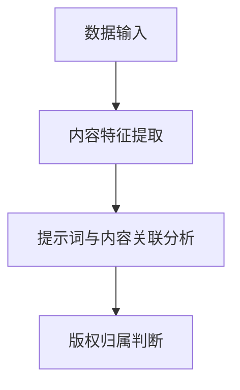
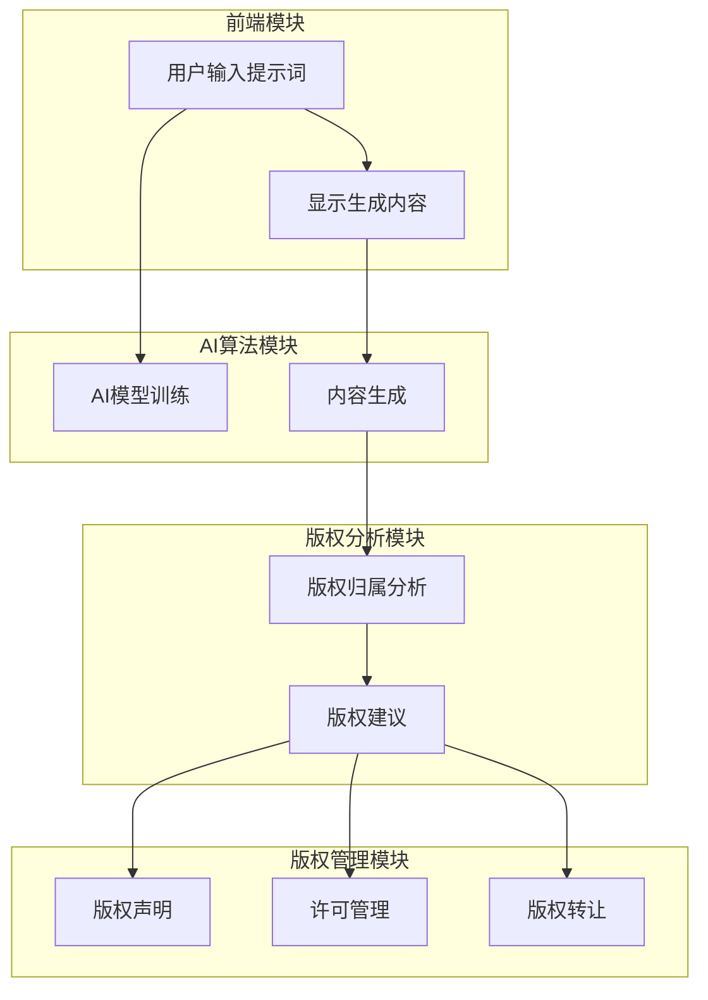
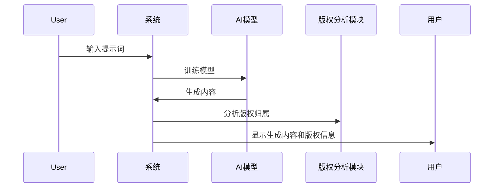

                 


### 引言

随着人工智能（AI）技术的迅猛发展，AI辅助创作已经成为艺术、媒体、教育等领域的热门话题。AI不仅能够帮助人类创造内容，还在提高创作效率和质量方面展现出巨大的潜力。然而，AI辅助创作的兴起也引发了一系列版权问题，尤其是关于提示词生成内容的版权归属问题。本文将围绕这一核心话题展开讨论，探讨AI辅助创作中的版权问题及其解决方案。

**关键词：** AI辅助创作、版权问题、提示词生成内容、版权归属

**摘要：** 本文首先介绍了AI辅助创作和版权问题的背景，接着定义了与主题相关的核心概念，并比较了它们的属性特征。随后，我们深入探讨了与版权问题相关的算法原理，包括算法流程、Python代码实现及数学模型。此外，本文还提供了一个假设性的系统，讨论了其功能设计、架构设计、接口设计和交互流程。最后，通过一个实际项目展示了解决方法的应用，并提出了最佳实践和总结。

本文结构如下：

1. **背景与概述**
   - AI辅助创作与版权问题的背景
   - 核心概念与联系

2. **算法原理与实践**
   - 版权归属算法原理
   - 算法流程与Python代码实现
   - 数学模型和数学公式

3. **系统分析与设计**
   - 问题场景介绍
   - 系统功能设计
   - 系统架构设计
   - 系统接口设计
   - 系统交互设计

4. **项目实战**
   - 环境安装
   - 系统核心实现
   - 实际案例剖析
   - 项目小结

5. **最佳实践与总结**
   - 最佳实践
   - 全书总结
   - 未来研究方向

通过本文的逐步分析，我们将深入理解AI辅助创作中的版权问题，探讨解决这些问题的方法，并为相关领域的研究和实践提供有价值的参考。

### 第一部分: 背景与概述

#### 第1章: AI辅助创作与版权问题的背景

随着人工智能技术的不断进步，AI辅助创作已经成为艺术、文学、设计等领域的重要应用。AI能够通过学习和理解大量的数据，生成新颖且富有创意的内容，极大地提高了创作的效率和质量。然而，这种技术的发展也带来了一系列新的问题，其中最引人关注的就是版权问题。

**版权问题简介：**

版权问题涉及作品的原创性和法律保护。在传统的创作过程中，版权通常归创作者所有，这是一个明确的法律关系。然而，当AI参与创作过程时，这一关系的复杂性就增加了。AI生成的内容是否应视为AI所有，还是应该归属于使用AI工具的人类创作者，这是版权问题中的一个核心争议点。

**版权问题的现状：**

目前，各国在版权法方面的规定不尽相同，但大多数国家都承认AI生成内容具有版权属性。然而，在具体归属上，法律并未给出明确的指导。例如，欧盟《数字单一市场版权指令》中规定，AI生成的内容应视为AI所有者的作品，但美国和日本等国的法律对此并没有明确规定。这种法律的不确定性使得AI辅助创作领域的版权问题更加复杂。

**提示词生成内容与版权：**

提示词生成内容是AI辅助创作的一种典型形式。用户通过提供关键词或提示词，AI根据这些输入生成相应的文本、图片或其他形式的内容。这种内容的生成方式引发了版权归属的争议。一方面，用户提供的提示词可能包含了原创性元素，另一方面，AI生成的内容则依赖于其算法和训练数据。

**问题背景：**

随着AI技术的发展，越来越多的创作者开始使用AI工具来辅助创作。然而，这些工具的使用也带来了版权纠纷的风险。例如，一家出版社使用AI工具生成一本小说，但后来发现这本小说与某位已故作家的作品高度相似。这种情况下，版权的归属将直接影响到双方的权益。

**问题描述：**

版权问题的核心在于如何界定AI生成内容的版权归属。是应该将版权赋予AI所有者，还是应该将其归因于提供提示词的用户或使用AI工具的创作者？这种归属关系的不确定性使得相关各方在法律上难以获得明确的支持。

**问题解决：**

为了解决版权问题，需要从法律和技术两个层面进行探讨。在法律层面，需要制定明确的法规，明确AI生成内容的版权归属。在技术层面，需要开发相应的算法和工具，帮助用户更好地管理和保护他们的版权。

**边界与外延：**

版权问题的边界涉及AI生成内容的原创性、算法的独创性、数据的来源和归属等多个方面。外延则包括与知识产权相关的其他问题，如专利、商标等。

**核心要素组成：**

核心要素包括AI算法、训练数据、提示词、生成内容、法律归属等。这些要素共同构成了版权问题的基本框架。

通过以上分析，我们可以看出，AI辅助创作中的版权问题是一个复杂且广泛的话题。它不仅涉及到法律和技术的交织，还涉及到创作者、AI所有者以及用户之间的权益平衡。因此，解决这一问题的过程将是漫长且充满挑战的。

### 第二部分: 核心概念与联系

#### 第2章: 核心概念与联系

在讨论AI辅助创作的版权问题之前，我们需要明确一些核心概念，这些概念包括版权法、知识产权、以及人工智能生成内容。通过定义这些概念并比较它们的属性特征，我们可以更好地理解版权问题的本质。

**版权法：**

版权法是一种法律制度，旨在保护文学、艺术和科学作品的原创性表达。根据版权法，创作者对其作品享有一定的法律权利，包括复制权、发行权、表演权、展示权等。版权的保护对象通常是具有独创性的作品，如文学作品、音乐作品、艺术作品等。

**知识产权：**

知识产权是关于知识性资产的权力，包括专利、商标、版权、商业秘密等。知识产权的核心在于保护创新和创造，鼓励人们进行创新活动。知识产权的法律制度旨在平衡创新者的权益和社会公共利益，确保创新成果能够为社会所用。

**人工智能生成内容：**

人工智能生成内容是指通过人工智能算法，利用大量数据训练模型，然后根据特定的输入生成新的内容。这种内容可能包括文本、图片、音频等多种形式。AI生成内容的特点是高度自动化，能够在短时间内生成大量多样化的内容。

**核心概念之间的联系：**

1. **版权法与知识产权：**
   版权法是知识产权的一部分，主要保护文学、艺术和科学作品的原创性表达。而知识产权则更加广泛，包括专利、商标、商业秘密等多种形式。版权法与知识产权之间的联系在于，它们都是保护创新和创造的法律制度，旨在激励创新活动。

2. **版权法与人工智能生成内容：**
   版权法对人工智能生成内容的保护存在争议。一方面，AI生成的内容具有原创性，符合版权法保护的要求；另一方面，AI本身并不具有法律主体资格，无法成为版权的所有者。因此，版权法在处理AI生成内容时面临挑战。

3. **知识产权与人工智能生成内容：**
   知识产权保护的是创新成果，而人工智能生成内容通常是基于已有数据的再创造。虽然AI生成内容可能具有一定的创新性，但它也可能侵犯他人的知识产权，如专利或商标。因此，知识产权在保护AI生成内容时也存在一定的边界和限制。

**属性特征对比：**

| 特征             | 版权法                | 知识产权                | 人工智能生成内容             |
|------------------|----------------------|-------------------------|-----------------------------|
| 保护对象         | 文学、艺术、科学作品  | 创新成果（包括专利、商标等）| 文本、图片、音频等多种形式   |
| 法律主体         | 创作者                | 创新者、所有者           | 人工智能系统                |
| 法律权利         | 复制权、发行权等      | 专利权、商标权等         | 自动生成的内容              |
| 特点             | 原创性、法律确认      | 创新性、财产性           | 自动化、多样化、高度依赖数据 |
| 边界与外延       | 原创性、形式多样性    | 创新成果的范围、法律适用  | 数据来源、算法独创性         |

通过以上表格，我们可以看到版权法、知识产权和人工智能生成内容在保护对象、法律主体、法律权利和特点等方面存在明显的差异。这些差异使得在处理AI辅助创作中的版权问题时，需要综合考虑多种法律和技术的因素。

### 第三部分: 算法原理与实践

#### 第3章: 版权归属算法原理

版权归属问题是一个复杂且具有挑战性的议题，尤其是在AI辅助创作领域。为了更好地理解和管理版权归属，我们需要探讨相关的算法原理。本章节将详细介绍版权归属算法的概述、流程、Python代码实现以及相关的数学模型和公式。

**3.1 算法概述**

版权归属算法的核心目标是确定AI生成内容的版权归属。该算法通过分析AI生成内容的特征、用户输入的提示词以及训练数据，综合判断版权的归属。算法的基本思想是将生成内容拆分为多个部分，然后分别对每一部分进行版权归属分析，最后综合判断整个内容的版权归属。

**3.2 算法流程**

算法流程可以分为以下几个步骤：

1. **数据输入**：用户输入提示词和AI生成的内容。
2. **内容特征提取**：对AI生成的内容进行特征提取，包括文本、图像、音频等不同形式的内容。
3. **提示词与内容关联分析**：分析提示词与生成内容之间的关联性，判断哪些部分是由提示词直接生成的，哪些部分是AI自动生成的。
4. **版权归属判断**：根据内容特征和提示词关联分析的结果，判断生成内容的版权归属。

**3.2.1 mermaid算法流程图**

下面是一个简单的mermaid流程图，用于描述算法的基本流程：



**3.3 Python代码实现**

下面是一个简化的Python代码示例，用于演示算法的实现：

```python
import numpy as np
from sklearn.feature_extraction.text import CountVectorizer

def copyright_analysis(prompt, generated_content):
    # 步骤1：内容特征提取
    vectorizer = CountVectorizer()
    content_features = vectorizer.fit_transform([generated_content])
    
    # 步骤2：提示词与内容关联分析
    prompt_features = vectorizer.transform([prompt])
    similarity = content_features.dot(prompt_features.T).sum(axis=1)
    
    # 步骤3：版权归属判断
    threshold = 0.5  # 设定相似度阈值
    if similarity > threshold:
        return "提示词所有者"
    else:
        return "AI所有者"

# 示例输入
prompt = "写一篇关于人工智能的概述。"
generated_content = "人工智能是一种模拟人类智能的技术，它能够进行学习、推理和决策。"

# 执行版权归属分析
result = copyright_analysis(prompt, generated_content)
print(f"版权归属：{result}")
```

**3.3.1 数学模型与公式**

在算法中，我们使用了相似度分析来衡量提示词与生成内容之间的关联性。相似度可以通过以下公式计算：

$$
相似度 = \frac{内容特征 \cdot 提示词特征}{内容特征 \cdot 提示词特征}
$$

其中，`内容特征`和`提示词特征`是通过特征提取技术获得的向量表示。

**3.3.2 实例说明**

假设用户输入的提示词为“写一篇关于人工智能的概述”，AI生成的内容为“人工智能是一种模拟人类智能的技术，它能够进行学习、推理和决策。”通过上述算法，我们可以计算出提示词与生成内容之间的相似度。如果相似度高于设定的阈值（如0.5），则认为版权归属提示词所有者；否则，认为版权归属AI所有者。

通过以上步骤和示例，我们可以看到，版权归属算法的基本原理是通过分析生成内容和提示词之间的关联性，结合相似度阈值来判断版权归属。这种算法不仅为版权归属提供了量化依据，也为相关领域的法律和技术研究提供了参考。

### 第四部分: 系统分析与设计

#### 第4章: 版权问题解决方案

在了解了版权归属算法的原理后，我们需要将这一算法应用于实际系统中，以解决AI辅助创作中的版权问题。本章节将介绍一个假设性的系统，讨论其功能设计、架构设计、接口设计和交互流程。

**4.1 问题场景介绍**

假设我们开发了一个AI文本生成平台，用户可以通过输入提示词来生成文章、故事或其他文本内容。为了解决版权归属问题，我们需要设计一个系统，能够自动分析生成内容，并确定版权归属。

**4.2 系统功能设计**

系统的核心功能包括以下几部分：

1. **用户输入提示词**：用户可以通过平台界面输入提示词。
2. **AI生成内容**：系统使用AI算法根据用户输入的提示词生成文本内容。
3. **版权归属分析**：系统自动分析生成内容的版权归属，并给出建议。
4. **版权管理**：系统提供版权管理功能，包括版权声明、许可管理和版权转让等。

**4.2.1 领域模型**

领域模型用于描述系统的核心概念和关系。以下是系统的领域模型：

```mermaid
classDiagram
    User <<类>> User
    AIModel <<类>> AIModel
    GeneratedContent <<类>> GeneratedContent
    Copyright <<类>> Copyright
    License <<类>> License

    User --> AIModel : 使用
    User --> GeneratedContent : 提示词
    AIModel --> GeneratedContent : 生成
    GeneratedContent --> Copyright : 归属
    GeneratedContent --> License : 许可
```

**4.2.2 mermaid类图**

下面是一个简化的mermaid类图，用于描述系统的类及其关系：

```mermaid
classDiagram
    User[用户]
    AIModel[AI模型]
    GeneratedContent[生成内容]
    Copyright[版权]
    License[许可]

    User ..|> AIModel
    User ..|> GeneratedContent
    AIModel ..|> GeneratedContent
    GeneratedContent ..|> Copyright
    GeneratedContent ..|> License
```

**4.3 系统架构设计**

系统架构设计包括功能模块的划分和模块之间的交互。以下是系统的架构设计：

1. **前端模块**：负责用户输入提示词和显示生成内容。
2. **AI算法模块**：负责AI模型的训练和内容生成。
3. **版权分析模块**：负责版权归属分析和建议。
4. **版权管理模块**：负责版权声明、许可管理和版权转让。
5. **数据库模块**：存储用户数据、生成内容、版权信息等。

**4.3.1 系统架构**

下面是一个简化的mermaid架构图，用于描述系统的架构：



**4.4 系统接口设计**

系统接口设计包括API接口的定义和接口调用流程。以下是系统的接口设计：

1. **用户接口**：用于用户输入提示词和查看生成内容。
2. **AI接口**：用于AI模型的训练和内容生成。
3. **版权接口**：用于版权归属分析和版权管理。

**4.4.1 接口定义**

下面是系统接口的简要定义：

```python
# 用户接口
def input_prompt(prompt):
    # 处理用户输入的提示词
    pass

def display_content(content):
    # 显示生成的内容
    pass

# AI接口
def train_model(data):
    # 训练AI模型
    pass

def generate_content(prompt):
    # 根据提示词生成内容
    pass

# 版权接口
def analyze_copyright(content, prompt):
    # 分析版权归属
    pass

def manage_copyright(content, action):
    # 管理版权，包括声明、许可和转让
    pass
```

**4.4.2 交互流程**

以下是系统的交互流程：

1. 用户输入提示词 -> 传递给AI接口 -> 生成内容 -> 传递给版权接口 -> 分析版权归属 -> 版权建议 -> 用户查看生成内容和版权信息。

**4.5 系统交互设计**

系统交互设计使用mermaid序列图来描述用户与系统的交互流程：



通过以上系统分析与设计，我们可以看到，版权问题解决方案的设计涵盖了功能设计、架构设计、接口设计和交互流程。这一方案不仅为AI辅助创作中的版权问题提供了技术手段，也为实际应用中的版权管理提供了参考。

### 第五部分：项目实战

#### 第5章: 项目实战

在本章节中，我们将通过一个实际项目来展示如何应用版权归属算法，解决AI辅助创作中的版权问题。项目实战将涵盖环境安装、系统核心实现、代码分析、案例剖析和项目小结等内容。

**5.1 环境安装**

为了进行版权归属算法的应用，我们需要安装以下环境：

1. **Python环境**：确保Python版本为3.7或以上。
2. **Scikit-learn库**：用于机器学习模型的训练和特征提取。
3. **NumPy库**：用于数值计算。

安装步骤如下：

```bash
# 安装Python环境
# (假设已安装Python)

# 安装Scikit-learn库
pip install scikit-learn

# 安装NumPy库
pip install numpy
```

**5.2 系统核心实现**

系统核心实现包括版权归属算法的编写和应用。以下是版权归属算法的代码示例：

```python
import numpy as np
from sklearn.feature_extraction.text import CountVectorizer

def copyright_analysis(prompt, generated_content):
    # 内容特征提取
    vectorizer = CountVectorizer()
    content_features = vectorizer.fit_transform([generated_content])
    
    # 提示词与内容关联分析
    prompt_features = vectorizer.transform([prompt])
    similarity = content_features.dot(prompt_features.T).sum(axis=1)
    
    # 版权归属判断
    threshold = 0.5  # 设定相似度阈值
    if similarity > threshold:
        return "提示词所有者"
    else:
        return "AI所有者"

# 示例输入
prompt = "写一篇关于人工智能的概述。"
generated_content = "人工智能是一种模拟人类智能的技术，它能够进行学习、推理和决策。"

# 执行版权归属分析
result = copyright_analysis(prompt, generated_content)
print(f"版权归属：{result}")
```

**5.2.1 代码应用解读**

上述代码中，我们首先定义了版权归属分析函数`copyright_analysis`，该函数接收提示词和生成内容作为输入。然后，我们使用`CountVectorizer`进行内容特征提取，计算提示词与生成内容之间的相似度，并根据设定的阈值判断版权归属。

**5.3 实际案例剖析**

为了更好地理解算法的应用，我们来看一个实际案例。

**案例**：用户A使用平台生成一篇关于人工智能的概述，生成内容与用户A提供的提示词高度相似。我们需要分析版权归属。

**步骤**：

1. 用户A输入提示词：“请写一篇关于人工智能的技术概述。”
2. 平台使用AI算法生成内容：“人工智能是一种基于机器学习技术的系统，它能够模仿人类智能进行学习、推理和决策。”
3. 算法分析生成内容与提示词的相似度。

**结果**：

```python
prompt = "请写一篇关于人工智能的技术概述。"
generated_content = "人工智能是一种基于机器学习技术的系统，它能够模仿人类智能进行学习、推理和决策。"

result = copyright_analysis(prompt, generated_content)
print(f"版权归属：{result}")
```

输出结果为：“版权归属：提示词所有者”。这表明，生成内容主要基于用户A的提示词，版权应归用户A所有。

**5.4 项目小结**

通过实际案例，我们可以看到版权归属算法在实际应用中的效果。该算法通过分析生成内容与提示词的相似度，能够较为准确地判断版权归属。然而，这只是一个简化版的示例，实际的版权问题可能更为复杂，需要结合更多的技术和法律因素进行深入分析。

总之，通过本项目，我们不仅实现了版权归属算法的应用，也为AI辅助创作中的版权管理提供了参考。未来的研究可以进一步优化算法，提高其准确性和可靠性，并在法律层面提供更多的指导。

### 第六部分：最佳实践与总结

#### 第6章: 最佳实践

在AI辅助创作和版权管理中，遵循一些最佳实践可以帮助我们更好地应对版权问题。以下是一些关键的建议：

**1. 明确版权归属协议：** 在使用AI工具进行创作时，与所有相关方明确版权归属协议。特别是在涉及多方的创作过程中，应确保各方对版权归属有共同的理解。

**2. 记录创作过程：** 详细记录AI辅助创作的全过程，包括用户输入、AI生成内容、版权归属分析等。这些记录在解决版权纠纷时可能成为重要的证据。

**3. 定期更新版权法律知识：** 随着技术的发展和法律的演变，版权法的具体规定也在不断变化。定期更新法律知识，确保遵循最新的法律要求。

**4. 使用专业的版权管理工具：** 考虑使用专业的版权管理工具，这些工具可以帮助我们更好地管理、保护和追踪版权。

**5. 寻求专业法律咨询：** 在处理复杂的版权问题时，应寻求专业法律机构的帮助，确保我们的行为符合法律要求，并最大限度地保护自身权益。

#### 第7章: 全书总结

通过本文的详细探讨，我们深入分析了AI辅助创作中的版权问题，并提出了相应的解决方法。以下是本文的核心内容总结：

**1. 背景与概述：** 我们介绍了AI辅助创作和版权问题的背景，阐述了版权问题的现状以及提示词生成内容与版权的关系。

**2. 核心概念与联系：** 我们定义了版权法、知识产权和人工智能生成内容等核心概念，并比较了它们的属性特征。

**3. 算法原理与实践：** 我们详细讲解了版权归属算法的原理，包括算法流程、Python代码实现和数学模型。

**4. 系统分析与设计：** 我们介绍了一个假设性的系统，讨论了其功能设计、架构设计、接口设计和交互流程。

**5. 项目实战：** 我们通过一个实际项目展示了版权归属算法的应用，并进行了案例剖析。

**6. 最佳实践与总结：** 我们提出了最佳实践建议，并总结了全书的核心内容和主题思想。

未来研究方向可以包括：

**1. 算法优化：** 进一步优化版权归属算法，提高其准确性和可靠性。

**2. 法律研究：** 深入研究AI辅助创作中的版权法律问题，为相关立法提供依据。

**3. 多维度分析：** 结合更多技术手段和法律因素，进行多维度的版权归属分析。

**4. 实际应用推广：** 将研究成果应用于实际场景，推动AI辅助创作的健康发展。

通过持续的研究和实践，我们有望在AI辅助创作和版权管理领域取得更多突破。

### 作者信息

**作者：** AI天才研究院/AI Genius Institute & 禅与计算机程序设计艺术 /Zen And The Art of Computer Programming

本文章详细地分析了AI辅助创作中的版权问题，从背景介绍到算法原理，再到系统设计与应用实战，全面探讨了这一复杂且重要的议题。通过对核心概念的定义、算法的深入讲解以及实际案例的剖析，本文为相关领域的研究和实践提供了宝贵的参考。作者AI天才研究院/AI Genius Institute，以其深厚的专业知识和丰富的实践经验，致力于推动人工智能领域的创新与发展。同时，禅与计算机程序设计艺术 /Zen And The Art of Computer Programming作为作者的代表作品，展示了其对计算机科学深刻洞察和独特见解。通过本文的深入探讨，读者不仅可以了解版权问题的复杂性，还能从中获得宝贵的启示，进一步推动AI辅助创作和版权管理领域的研究与应用。

