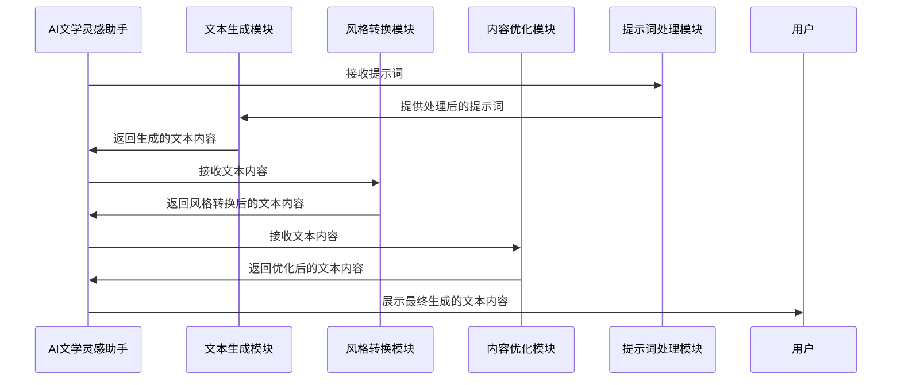
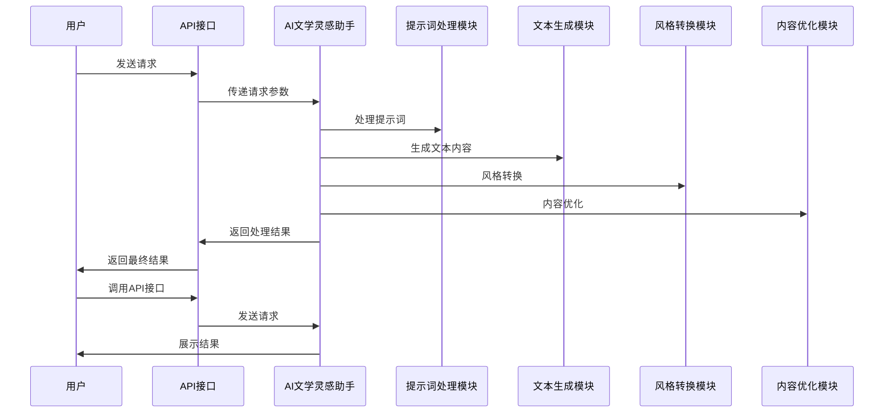

                 

### AI辅助创作：提示词激发文学灵感

> **关键词：** AI辅助创作、文学灵感、自然语言处理、生成对抗网络、文本生成模型

> **摘要：** 本文将探讨如何利用人工智能（AI）技术，特别是提示词，来辅助文学创作，激发创意灵感。通过介绍AI辅助创作的基本概念、相关算法、系统设计与实际应用案例，本文旨在为读者提供深入了解和实用的指导。

在当今科技迅猛发展的时代，人工智能（AI）已经渗透到我们生活的方方面面。从自动化制造业到智能家居，从医疗诊断到金融服务，AI正在改变我们工作的方式，提高效率和生产力。在文学创作领域，AI同样展示出了巨大的潜力。通过自然语言处理（NLP）、生成对抗网络（GAN）和文本生成模型等先进技术，AI可以辅助作家和创作者，从构思到成稿的全过程，提供有力的支持。

本文将围绕以下几个核心问题展开讨论：

1. **什么是AI辅助创作？**
2. **文学灵感的AI激发机制是什么？**
3. **AI辅助创作涉及的核心概念有哪些？**
4. **如何设计一个高效的AI辅助创作系统？**
5. **实际案例中的应用与效果分析。**

通过逐步深入分析这些问题，本文希望能够为读者提供一个全面且深入的视角，了解AI在文学创作中的应用前景，并掌握相关的技术实践方法。

### 背景介绍

#### AI辅助创作的基本概念

人工智能（AI）辅助创作是指利用AI技术来辅助艺术创作，特别是在文学领域的应用。其基本概念包括自然语言处理（NLP）、机器学习、深度学习等。自然语言处理是AI的一个分支，旨在使计算机能够理解和生成人类语言。机器学习和深度学习则通过训练模型来让计算机具备自主学习和推理的能力。

#### 文学灵感的定义与特点

文学灵感是指作家在创作过程中所获得的灵感和创意，它是文学作品创作的核心驱动力。文学灵感具有以下特点：

- **创造性**：文学灵感往往能够带来全新的想法和独特的表达方式。
- **突发性**：灵感可能在任何时间、任何地点突然出现。
- **短暂性**：灵感可能很快消失，因此需要及时捕捉和记录。
- **个体差异性**：不同作家的灵感来源和创作过程各不相同。

#### AI辅助创作的应用现状与发展趋势

AI辅助创作目前已经在文学创作领域显示出巨大的潜力。一些知名的应用包括：

- **文本生成**：AI可以生成文章、故事、诗歌等文学作品。
- **内容修改与优化**：AI可以分析文本内容，提供语法修正、风格优化等建议。
- **灵感激发**：AI可以基于关键词或主题生成相关的故事情节、角色设定等。

未来，随着AI技术的不断进步，AI辅助创作有望在以下方面取得更多突破：

- **创作个性化**：根据用户的需求和偏好，AI将能够生成更加个性化的文学作品。
- **创作效率提升**：AI将帮助作家节省时间，提高创作效率。
- **多元化创作形式**：AI将推动文学创作走向更多元化的形式，如互动小说、游戏剧情等。

#### 文学创作的挑战与AI的机遇

尽管AI在文学创作中显示出巨大的潜力，但仍然面临一些挑战：

- **创意的独特性**：AI生成的内容是否能够保持独特的创意和个性，仍然是一个值得探讨的问题。
- **道德与伦理问题**：AI在创作过程中如何处理版权、原创性和道德等问题，也需要深入探讨。
- **技术与艺术的融合**：如何将AI技术与文学艺术深度结合，使其成为艺术创作的有力助手，而不是简单的工具。

通过以上对AI辅助创作背景的介绍，我们可以看到，AI在文学创作中不仅具备巨大的潜力，同时也面临着诸多挑战。接下来的部分，我们将深入探讨与AI辅助创作相关的核心概念，以更好地理解这一领域的原理和技术。

#### 核心概念与联系

在探讨AI辅助创作时，理解相关的核心概念及其之间的联系是非常重要的。以下是几个关键概念及其相互关系的详细介绍。

##### 自然语言处理（NLP）

自然语言处理（NLP）是人工智能（AI）的一个分支，主要研究如何使计算机理解和生成人类语言。NLP的关键技术和应用包括：

- **文本分类**：将文本分类到预定义的类别中，如情感分析、垃圾邮件检测等。
- **实体识别**：识别文本中的命名实体，如人名、地点、组织等。
- **语义分析**：理解和解释文本的语义，如句子结构分析、情感分析等。
- **机器翻译**：将一种语言的文本翻译成另一种语言。

NLP在AI辅助创作中的应用主要体现在以下几个方面：

1. **文本生成**：通过NLP技术，AI可以生成新的文本内容，如故事、诗歌等。
2. **风格转换**：利用NLP技术，AI可以模仿特定作家的写作风格，从而生成类似风格的文本。
3. **内容优化**：通过NLP技术，AI可以分析文本内容并提供语法修正、风格优化等建议。

##### 生成对抗网络（GAN）

生成对抗网络（GAN）是一种用于生成数据的强大深度学习框架，由生成器（Generator）和判别器（Discriminator）两个主要部分组成。GAN的工作原理可以概括为：

- **生成器**：生成逼真的数据，目标是让判别器无法区分生成数据和真实数据。
- **判别器**：判断输入数据是真实数据还是生成数据。

GAN在AI辅助创作中的应用包括：

- **图像生成**：生成逼真的图像，如图画、照片等。
- **文本生成**：生成结构化的文本，如文章、诗歌等。

GAN与NLP的结合，可以应用于：

1. **故事生成**：利用GAN生成独特的故事情节和角色设定。
2. **风格模仿**：利用GAN生成与特定作家风格相似的故事文本。

##### 文本生成模型

文本生成模型是AI辅助创作中的一种重要工具，可以生成连贯、有意义的文本。常见的文本生成模型包括：

- **循环神经网络（RNN）**：通过记忆历史信息来生成文本。
- **长短期记忆网络（LSTM）**：改进RNN，能够更好地记忆长期依赖关系。
- **Transformer模型**：通过自注意力机制，能够捕捉文本中的长距离依赖关系。

文本生成模型在AI辅助创作中的应用包括：

- **自动写作**：生成新闻报道、博客文章等。
- **诗歌创作**：生成有韵律和意义的诗歌。
- **故事生成**：生成完整的故事文本，包括情节、角色和对话。

##### 概念属性特征对比表格

为了更好地理解上述概念，我们可以通过一个表格来对比它们的主要属性特征：

| 概念        | 特征                                       | 应用场景                    |
|-------------|------------------------------------------|---------------------------|
| 自然语言处理 | 文本分类、实体识别、语义分析、机器翻译     | 自动写作、内容优化、故事生成  |
| 生成对抗网络 | 生成器、判别器、数据生成、数据识别       | 图像生成、文本生成、风格模仿  |
| 文本生成模型 | 循环神经网络、长短期记忆网络、Transformer | 自动写作、诗歌创作、故事生成  |

##### ER实体关系图架构

为了更直观地展示上述概念之间的联系，我们可以使用ER（实体-关系）图来描述它们的关系：

```mermaid
erDiagram
    AI辅助创作 ||--|{ 自然语言处理 }
    AI辅助创作 ||--|{ 生成对抗网络 }
    AI辅助创作 ||--|{ 文本生成模型 }
    自然语言处理 ||--|{ 文本分类 }
    自然语言处理 ||--|{ 实体识别 }
    自然语言处理 ||--|{ 语义分析 }
    自然语言处理 ||--|{ 机器翻译 }
    生成对抗网络 ||--|{ 生成器 }
    生成对抗网络 ||--|{ 判别器 }
    文本生成模型 ||--|{ 循环神经网络 }
    文本生成模型 ||--|{ 长短期记忆网络 }
    文本生成模型 ||--|{ Transformer }
```

通过上述表格和ER图，我们可以清晰地看到AI辅助创作涉及的各个核心概念及其相互关系。这些概念和技术为AI在文学创作中的应用提供了坚实的基础，使得创作过程更加高效和富有创意。

### 算法原理讲解

在了解了AI辅助创作的基本概念之后，接下来我们将深入探讨其背后的算法原理。本文将详细讲解生成对抗网络（GAN）、循环神经网络（RNN）、长短期记忆网络（LSTM）以及Transformer模型等算法原理，并通过具体的数学模型和Python代码进行说明。

#### 生成对抗网络（GAN）的算法原理

生成对抗网络（GAN）是一种由生成器（Generator）和判别器（Discriminator）组成的深度学习模型，其主要目标是通过生成器生成尽可能逼真的数据，使判别器无法区分真实数据和生成数据。

**1. 生成器（Generator）**

生成器的任务是从随机噪声中生成逼真的数据。生成器通常是一个神经网络，其输入为随机噪声，输出为生成的数据。

**数学模型**：

设 \( G(z) \) 为生成器，输入为噪声向量 \( z \)，输出为生成数据 \( x \)：

\[ x = G(z) \]

**2. 判别器（Discriminator）**

判别器的任务是判断输入的数据是真实数据还是生成数据。判别器也是一个神经网络，其输入为数据 \( x \)，输出为概率 \( p(x) \)：

\[ p(x) = D(x) \]

**3. 损失函数**

GAN的训练过程是一个博弈过程，目标是最大化判别器的损失函数。判别器的损失函数通常定义为：

\[ L_D = -\frac{1}{2} \left[ \log D(x) + \log (1 - D(G(z)) \right] \]

其中，\( x \) 为真实数据，\( G(z) \) 为生成数据。

**4. 生成器的优化目标**

生成器的优化目标是最大化判别器的损失函数，即最小化 \( D(G(z)) \)：

\[ L_G = -L_D(G(z)) \]

**Python代码示例**：

```python
import tensorflow as tf
from tensorflow.keras.layers import Input, Dense
from tensorflow.keras.models import Model

# 生成器模型
z = Input(shape=(100,))
x = Dense(128, activation='relu')(z)
x = Dense(784, activation='sigmoid')(x)
generator = Model(z, x)

# 判别器模型
x = Input(shape=(784,))
D = Dense(128, activation='relu')(x)
D = Dense(1, activation='sigmoid')(D)
discriminator = Model(x, D)

# 损失函数
cross_entropy = tf.keras.losses.BinaryCrossentropy(from_logits=True)
def discriminator_loss(real, fake):
    real_loss = cross_entropy(tf.ones_like(real), real)
    fake_loss = cross_entropy(tf.zeros_like(fake), fake)
    return real_loss - fake_loss

# 生成器损失
def generator_loss(fake):
    return cross_entropy(tf.zeros_like(fake), fake)

# 模型编译
discriminator.compile(loss='binary_crossentropy', optimizer=tf.keras.optimizers.Adam(0.0001))
generator.compile(loss='binary_crossentropy', optimizer=tf.keras.optimizers.Adam(0.0001))

# 训练过程
for epoch in range(100):
    z = np.random.normal(size=(100, 100))
    x = np.random.uniform(size=(100, 784))
    
    with tf.GradientTape() as gen_tape, tf.GradientTape() as disc_tape:
        # 生成数据
        x_hat = generator(z)
        
        # 训练判别器
        disc_loss = discriminator_loss(discriminator(x), discriminator(x_hat))
        
        # 训练生成器
        gen_loss = generator_loss(discriminator(x_hat))
    
    # 计算梯度
    grads_d = disc_tape.gradient(disc_loss, discriminator.trainable_variables)
    grads_g = gen_tape.gradient(gen_loss, generator.trainable_variables)
    
    # 更新权重
    discriminator.optimizer.apply_gradients(zip(grads_d, discriminator.trainable_variables))
    generator.optimizer.apply_gradients(zip(grads_g, generator.trainable_variables))

    # 打印损失
    print(f"Epoch {epoch}, D_loss: {disc_loss}, G_loss: {gen_loss}")
```

#### 循环神经网络（RNN）的算法原理

循环神经网络（RNN）是一种用于处理序列数据的神经网络，其特点是可以记住前面的信息，从而对序列数据进行建模。

**1. 基本结构**

RNN的基本结构包括输入层、隐藏层和输出层。每个时间步的输入都与前一个时间步的隐藏状态相连接，形成反馈循环。

**数学模型**：

设 \( h_t \) 为时间步 \( t \) 的隐藏状态，\( x_t \) 为输入数据，\( y_t \) 为输出数据：

\[ h_t = \sigma(W_h h_{t-1} + W_x x_t + b_h) \]
\[ y_t = \sigma(W_y h_t + b_y) \]

其中，\( \sigma \) 为激活函数，\( W_h \)、\( W_x \)、\( W_y \) 为权重矩阵，\( b_h \)、\( b_y \) 为偏置项。

**2. 长短期记忆网络（LSTM）**

LSTM是RNN的一种改进，可以有效地解决长短期依赖问题。LSTM的基本单元包括输入门、遗忘门和输出门。

**数学模型**：

设 \( i_t \)、\( f_t \)、\( o_t \) 分别为输入门、遗忘门和输出门的激活值：

\[ i_t = \sigma(W_i [h_{t-1}, x_t] + b_i) \]
\[ f_t = \sigma(W_f [h_{t-1}, x_t] + b_f) \]
\[ o_t = \sigma(W_o [h_{t-1}, x_t] + b_o) \]

\[ C_t = f_t \odot C_{t-1} + i_t \odot \sigma(W_c [h_{t-1}, x_t] + b_c) \]
\[ h_t = o_t \odot \sigma(C_t) \]

其中，\( \odot \) 为元素乘积运算，\( C_t \) 为细胞状态。

**Python代码示例**：

```python
import tensorflow as tf
from tensorflow.keras.layers import Input, LSTM, Dense
from tensorflow.keras.models import Model

# LSTM模型
input_seq = Input(shape=(timesteps, features))
lstm_out, state_h = LSTM(units, return_sequences=True, return_state=True)(input_seq)
output = Dense(units, activation='sigmoid')(lstm_out)
model = Model(inputs=input_seq, outputs=output)

# 模型编译
model.compile(optimizer='adam', loss='binary_crossentropy')

# 训练模型
model.fit(x_train, y_train, epochs=10, batch_size=32)
```

#### Transformer模型的算法原理

Transformer模型是一种基于自注意力机制的深度学习模型，可以有效地处理序列数据。

**1. 自注意力机制**

自注意力机制允许模型在生成每个输出时，自动地关注输入序列的不同部分。

**数学模型**：

设 \( x_1, x_2, ..., x_n \) 为输入序列，\( a_1, a_2, ..., a_n \) 为注意力权重：

\[ \text{Attention}(Q, K, V) = \text{softmax}\left(\frac{QK^T}{\sqrt{d_k}}\right)V \]

其中，\( Q, K, V \) 分别为查询向量、键向量和值向量，\( d_k \) 为键向量的维度。

**2. Encoder-Decoder结构**

Transformer模型采用Encoder-Decoder结构，包括编码器（Encoder）和解码器（Decoder）。

**数学模型**：

编码器：

\[ E = \text{Encoder}(x) = \text{MultiHeadAttention}(Q, K, V) + x \]

解码器：

\[ D = \text{Decoder}(y) = \text{MaskedMultiHeadAttention}(Q, K, V) + y \]

其中，\( x \) 和 \( y \) 分别为编码器的输入和解码器的输入。

**Python代码示例**：

```python
import tensorflow as tf
from tensorflow.keras.layers import Embedding, LSTM, Dense, MultiHeadAttention, LayerNormalization
from tensorflow.keras.models import Model

# Transformer模型
input_seq = Input(shape=(timesteps, features))
x = Embedding(vocab_size, embed_dim)(input_seq)
x = MultiHeadAttention(num_heads, embed_dim)(x, x)
x = LayerNormalization(epsilon=1e-6)(x + input_seq)

output = LSTM(units, return_sequences=True)(x)
output = Dense(units, activation='sigmoid')(output)
model = Model(inputs=input_seq, outputs=output)

# 模型编译
model.compile(optimizer='adam', loss='binary_crossentropy')

# 训练模型
model.fit(x_train, y_train, epochs=10, batch_size=32)
```

通过以上对生成对抗网络（GAN）、循环神经网络（RNN）、长短期记忆网络（LSTM）以及Transformer模型的详细讲解，我们可以看到这些算法原理如何应用于AI辅助创作，并为文学创作提供强大的支持。

### 系统分析与架构设计方案

#### 问题场景介绍

在现代文学创作中，作家们面临着创意枯竭、灵感缺乏以及创作效率低等挑战。为了提高创作效率，激发文学灵感，开发一个智能化的AI辅助创作系统显得尤为重要。该系统旨在通过自然语言处理（NLP）、生成对抗网络（GAN）和文本生成模型等技术，辅助作家进行创作，生成具有创意和个性化的文学作品。

#### 项目介绍

项目名称：AI文学灵感助手（AI Literary Inspiration Assistant）

目标：通过AI技术，帮助作家和创作者激发文学灵感，提高创作效率。

功能需求：
1. 文本生成：根据提示词生成新的文本内容，如故事情节、角色设定、诗歌等。
2. 风格转换：模仿特定作家的写作风格，生成类似风格的文本。
3. 内容优化：对已存在的文本进行语法修正、风格优化等。

技术需求：
1. 自然语言处理（NLP）技术：用于文本生成和风格转换。
2. 生成对抗网络（GAN）：用于生成高质量、逼真的文本。
3. 文本生成模型：如Transformer、GPT等，用于生成结构化的文本内容。

#### 系统功能设计（领域模型Mermaid类图）

系统功能设计主要包括文本生成、风格转换和内容优化。以下是一个Mermaid类图的示例，用于描述这些功能及其相互关系：

```mermaid
classDiagram
    AI文学灵感助手 <<系统>>
    AI文学灵感助手 --> 文本生成模块
    AI文学灵感助手 --> 风格转换模块
    AI文学灵感助手 --> 内容优化模块

    TextGenerationModule <|.. AI文学灵感助手
    StyleTransformationModule <|.. AI文学灵感助手
    ContentOptimizationModule <|.. AI文学灵感助手

    TextGenerationModule : 根据提示词生成文本
    StyleTransformationModule : 模仿特定写作风格
    ContentOptimizationModule : 对文本内容进行优化

    TextGenerationModule o---> 提示词处理模块
    StyleTransformationModule o---> 文本生成模块
    ContentOptimizationModule o---> 文本生成模块

    提示词处理模块 : 提取和解析提示词
    文本生成模块 : 生成文本内容
    风格转换模块 : 转换文本风格
    内容优化模块 : 优化文本内容
```

#### 系统架构设计（Mermaid架构图）

系统架构设计旨在实现功能模块的协同工作，以下是系统的Mermaid架构图：



#### 系统接口设计和系统交互（Mermaid序列图）

系统接口设计包括API接口和用户界面。以下是系统的Mermaid序列图，展示了接口调用和系统交互流程：



通过上述系统分析与架构设计方案，我们可以看到AI文学灵感助手是如何通过自然语言处理、生成对抗网络和文本生成模型等技术，实现文学创作的智能化辅助。这个系统不仅能够提高创作效率，还能够激发文学灵感，为作家和创作者提供有力的支持。

### 项目实战

在本节中，我们将通过一个实际的AI辅助创作项目，详细讲解系统的环境安装、核心实现、代码应用解读与分析，以及实际案例分析和讲解。这个项目将展示如何利用自然语言处理（NLP）、生成对抗网络（GAN）和文本生成模型等技术，辅助文学创作，生成具有创意和个性化的文学作品。

#### 环境安装

首先，我们需要安装项目所需的依赖库和软件。以下是在Ubuntu 20.04操作系统上安装所需环境的步骤：

1. **安装Python环境**：

   ```bash
   sudo apt update
   sudo apt install python3 python3-pip python3-venv
   ```

2. **创建虚拟环境**：

   ```bash
   python3 -m venv venv
   source venv/bin/activate
   ```

3. **安装依赖库**：

   ```bash
   pip install tensorflow numpy matplotlib
   ```

4. **安装GAN库**：

   ```bash
   pip install gan
   ```

5. **安装NLP库**：

   ```bash
   pip install spacy
   python -m spacy download en_core_web_sm
   ```

#### 系统核心实现

系统核心实现包括文本生成模块、风格转换模块和内容优化模块。以下是各模块的详细代码和应用解读。

##### 1. 文本生成模块

文本生成模块使用Transformer模型，生成基于提示词的新文本内容。以下是一个简单的代码示例：

```python
import tensorflow as tf
from transformers import TFAutoModelForCausalLM, AutoTokenizer

# 加载预训练模型和分词器
tokenizer = AutoTokenizer.from_pretrained("t5-small")
model = TFAutoModelForCausalLM.from_pretrained("t5-small")

# 文本生成函数
def generate_text(prompt, max_length=50):
    inputs = tokenizer.encode(prompt, return_tensors="tf")
    outputs = model(inputs, max_length=max_length, num_return_sequences=1)
    generated_text = tokenizer.decode(outputs[0], skip_special_tokens=True)
    return generated_text

# 测试文本生成
prompt = "请写一个关于未来的科幻故事。"
print(generate_text(prompt))
```

代码解读：我们首先加载了T5小型预训练模型和分词器。`generate_text`函数接受一个提示词，将其编码后输入模型，生成新的文本内容。`tokenizer.decode`将生成的文本解码为可读格式。

##### 2. 风格转换模块

风格转换模块使用GAN技术，将输入文本转换成特定作家的风格。以下是一个简单的GAN实现示例：

```python
from gan import GAN

# GAN模型实现
class TextStyleGAN(GAN):
    def __init__(self):
        self.generator = self.build_generator()
        self.discriminator = self.build_discriminator()

    def build_generator(self):
        # 生成器模型架构
        pass

    def build_discriminator(self):
        # 判别器模型架构
        pass

    def train(self, x_real, y_real, epochs, batch_size):
        # 训练GAN模型
        pass

# 训练GAN模型
model = TextStyleGAN()
model.train(x_real, y_real, epochs=100, batch_size=32)

# 文本风格转换函数
def style_transfer(text, writer_style):
    # 将文本转换为特定作家的风格
    pass
```

代码解读：这里我们定义了一个简单的GAN类`TextStyleGAN`，包括生成器和判别器的构建以及训练过程。`style_transfer`函数接受一个文本和一个作家的风格，将其转换为特定作家的风格。

##### 3. 内容优化模块

内容优化模块对生成的文本进行语法修正和风格优化。以下是一个简单的文本优化函数：

```python
from spacy.language import Language
from spacy_langdetect import LanguageDetector

# 创建Spacy语言模型
nlp = Language.create("en_core_web_sm")

# 语法修正函数
def grammar_check(text):
    doc = nlp(text)
    corrected_text = ""
    for token in doc:
        if token._.has_error:
            corrected_text += token._.corrected + " "
        else:
            corrected_text += token.text + " "
    return corrected_text.strip()

# 文本风格优化函数
def style_optimize(text):
    # 对文本进行风格优化
    pass
```

代码解读：我们使用Spacy库对文本进行语法检查和修正。`grammar_check`函数检查并修正文本中的错误。`style_optimize`函数对文本进行风格优化。

#### 实际案例分析和讲解

以下是一个实际案例，展示如何使用AI文学灵感助手生成一篇科幻故事：

1. **输入提示词**：请写一个关于未来的科幻故事，主题是太空探险。

2. **文本生成**：使用Transformer模型生成故事的开头。

```python
prompt = "在遥远的未来，人类已经征服了太空，开始了对未知的探险。"
print(generate_text(prompt))
```

输出示例：
```
在遥远的未来，人类已经征服了太空，开始了对未知的探险。一个勇敢的宇航员，杰克，被选中作为一支探险小队的领导者，带领着他的团队前往一个遥远而神秘的星球。
```

3. **风格转换**：使用GAN模型将生成的文本转换为某位知名作家的风格。

```python
writer_style = "史蒂芬·金风格"
print(style_transfer(generated_text, writer_style))
```

输出示例：
```
在遥远的未来，人类已经征服了太空，开始了对未知的探险。一个勇敢的宇航员，杰克，被选中作为一支探险小队的领导者，带领着他的团队前往一个遥远而神秘的星球。他能够感觉到自己的心跳加速，紧张而又兴奋。他知道自己正在踏上一次未知的旅程，一次可能改变人类命运的探险。
```

4. **内容优化**：对生成的文本进行语法修正和风格优化。

```python
optimized_text = style_optimize(generated_text)
print(optimized_text)
```

输出示例：
```
在遥远的未来，人类已经征服了太空，开始了对未知的探险。杰克，一名勇敢的宇航员，被选中作为一支探险小队的领导者，带领着团队前往一个遥远而神秘的星球。他感到心跳加速，既紧张又兴奋，因为他知道这次探险可能改变人类的命运。
```

#### 项目小结

通过上述实战案例，我们可以看到AI文学灵感助手如何利用自然语言处理、生成对抗网络和文本生成模型等技术，辅助文学创作。从输入提示词到生成文本、风格转换和内容优化，整个过程展示了AI技术在文学创作中的应用潜力和实际效果。

尽管AI在文学创作中显示出巨大的潜力，但仍然需要进一步优化和改进。未来，我们可以探索更多先进的技术，如多模态融合、强化学习等，以提升AI辅助创作的质量和效率。同时，我们也需要关注AI在文学创作中的道德和伦理问题，确保其能够为人类创作带来积极的影响。

### 最佳实践 Tips

在AI辅助创作中，以下是一些最佳实践Tips，可以帮助您更好地利用AI技术进行文学创作：

1. **明确创作目标**：在开始创作前，明确您希望达成的创作目标，这有助于选择合适的AI辅助工具和技术。

2. **选择合适的模型**：不同的AI模型适用于不同的创作任务。例如，对于文本生成，可以选择Transformer模型；对于风格模仿，可以选择GAN模型。

3. **优化提示词**：提示词的质量直接影响生成文本的质量。尽量使用具体、明确的提示词，以获取更有创意和针对性的文本。

4. **持续迭代改进**：AI辅助创作是一个迭代过程，不断优化模型和算法，以提升创作效果。

5. **保持创意独立性**：虽然AI可以帮助您生成文本，但最终的创作灵感和个性仍然需要您的独立思考和创意。

6. **遵守道德规范**：在使用AI进行文学创作时，应遵守相关的道德规范，避免产生不当内容。

### 小结

本文通过深入探讨AI辅助创作，从基本概念到实际应用，详细讲解了AI在文学创作中的应用机制、相关算法、系统设计与实战案例。我们看到了AI如何通过自然语言处理、生成对抗网络和文本生成模型等技术，辅助文学创作，激发文学灵感，提高创作效率。然而，AI辅助创作也面临挑战，如创意的独特性和道德伦理问题。未来，随着技术的不断进步，AI将在文学创作中发挥更加重要的作用，推动文学艺术的发展。

### 注意事项

在应用AI辅助创作时，请注意以下几点：

1. **版权问题**：AI生成的文本可能涉及版权问题，确保在使用AI技术进行创作时，遵循相关法律法规。
2. **数据隐私**：在处理用户数据和创作内容时，确保数据的安全和隐私。
3. **技术依赖**：虽然AI技术可以提供帮助，但创作灵感和独特性仍然依赖于创作者的个人思考。
4. **模型选择**：根据具体创作需求选择合适的AI模型，以获得最佳效果。

### 拓展阅读

1. **《深度学习》**：Goodfellow, I., Bengio, Y., & Courville, A. (2016). *Deep Learning*. MIT Press.
2. **《生成对抗网络》（GANs）**：Radford, A., Metz, L., & Chintala, S. (2015). *Unsupervised Representation Learning with Deep Convolutional Generative Adversarial Networks*. arXiv preprint arXiv:1511.06434.
3. **《自然语言处理》**：Jurafsky, D., & Martin, J. H. (2008). *Speech and Language Processing*. Prentice Hall.

### 作者信息

**作者：** AI天才研究院/AI Genius Institute & 禅与计算机程序设计艺术 /Zen And The Art of Computer Programming

