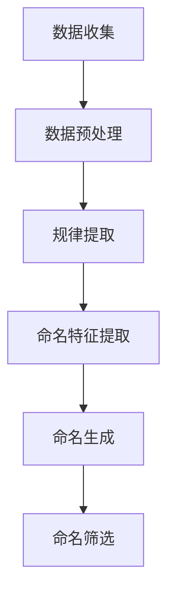
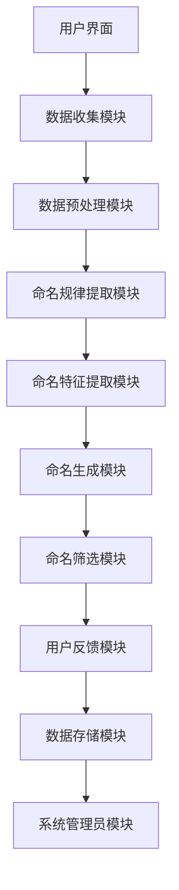
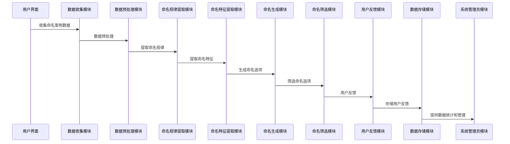

                 


# AI辅助创意产品命名的提示词技巧

关键词：AI、产品命名、创意、提示词、算法

摘要：本文将深入探讨人工智能在创意产品命名中的应用，通过分析核心概念、算法原理和数学模型，介绍如何使用AI辅助创意产品命名，并提供最佳实践和实际案例分析。

## 第一部分：背景介绍

### 1.1 问题背景

随着人工智能技术的快速发展，AI在各个领域的应用越来越广泛。在创意产业中，AI辅助创意产品命名成为了一个热门话题。传统的产品命名方法往往依赖于创意人员的经验和直觉，而AI的引入则可以为产品命名提供更加科学和系统的方法。本章节将介绍AI辅助创意产品命名的背景，包括问题的提出、问题描述和问题解决。

### 1.2 问题描述

在产品命名过程中，创意人员需要考虑的因素众多，包括产品特性、目标市场、品牌形象等。这些因素往往使得命名过程变得复杂且耗时。此外，命名结果的质量也受到创意人员个人能力和经验的影响。因此，如何提高产品命名的效率和质量，成为了一个亟待解决的问题。

### 1.3 问题解决

AI技术的引入为解决上述问题提供了新的思路。通过大数据分析、自然语言处理等技术，AI可以收集和分析大量的命名案例，从中提取出命名规律和特征。这些规律和特征可以用于辅助创意人员生成新颖、符合目标市场的产品命名。同时，AI还可以提供命名建议，帮助创意人员快速筛选出高质量的命名选项。

### 1.4 边界与外延

AI辅助创意产品命名的范围可以涵盖多个领域，包括但不限于电子产品、消费品、服务类产品等。此外，AI辅助命名不仅适用于新产品的命名，也可以用于现有产品的重新命名或品牌重塑。

### 1.5 概念结构与核心要素组成

在AI辅助创意产品命名中，核心概念包括：AI技术、命名规律、命名特征、创意人员等。这些概念相互作用，共同构成了AI辅助创意产品命名的系统框架。

## 第二部分：核心概念与联系

### 2.1 AI技术

AI技术主要包括大数据分析、自然语言处理、机器学习等。其中，大数据分析可以收集和处理大量的命名案例数据；自然语言处理可以理解和生成自然语言；机器学习可以通过训练模型来提取命名规律和特征。

### 2.2 命名规律与特征

命名规律和特征是AI辅助创意产品命名的基础。通过分析大量的命名案例，可以提取出命名规律，如命名风格、命名长度等。同时，还可以提取出命名特征，如音韵美感、语义相关性等。

### 2.3 创意人员

创意人员在AI辅助命名过程中起到关键作用。他们需要根据AI提供的命名建议进行筛选和调整，以确保命名结果符合品牌形象和市场定位。

## 第三部分：算法原理讲解

### 3.1 算法原理

AI辅助创意产品命名的核心算法包括：命名规律提取、命名特征提取和命名生成。

### 3.2 命名规律提取

命名规律提取算法通过对大量命名案例进行分析，提取出命名规律。具体步骤如下：

1. 数据收集：收集大量的命名案例数据。
2. 数据预处理：对数据进行分析和清洗，去除无效数据。
3. 规律提取：通过机器学习算法，从数据中提取出命名规律。

### 3.3 命名特征提取

命名特征提取算法通过对命名规律进行分析，提取出命名特征。具体步骤如下：

1. 规律分析：对提取出的命名规律进行分析，确定命名特征。
2. 特征提取：通过自然语言处理技术，从命名规律中提取出命名特征。

### 3.4 命名生成

命名生成算法根据提取出的命名规律和特征，生成新的命名选项。具体步骤如下：

1. 命名规则定义：根据命名规律和特征，定义命名规则。
2. 命名生成：根据命名规则，生成新的命名选项。
3. 命名筛选：对生成的命名选项进行筛选，选择符合品牌形象和市场定位的命名。

### 3.5 Mermaid算法流程图

以下是命名规律提取的Mermaid流程图：



## 第四部分：数学模型和数学公式 & 详细讲解 & 举例说明

### 4.1 数学模型

在AI辅助创意产品命名中，数学模型主要用于描述命名规律和特征提取过程。以下是一个简单的数学模型示例：

$$
f(x) = \sum_{i=1}^{n} w_i \cdot f_i(x)
$$

其中，$f(x)$ 表示命名特征得分，$w_i$ 表示特征权重，$f_i(x)$ 表示第 $i$ 个命名特征的得分。

### 4.2 详细讲解

在命名特征提取过程中，我们首先需要确定特征权重。这些权重可以通过机器学习算法从数据中自动提取。然后，我们将每个命名特征与权重相乘，并将结果相加，得到命名特征得分。得分越高，表示该命名特征越重要。

### 4.3 举例说明

假设我们有两个命名特征：音韵美感和语义相关性。根据数据，我们计算出它们的权重分别为 $0.6$ 和 $0.4$。对于一个新的命名选项，我们计算出它的音韵美感得分为 $0.8$，语义相关性得分为 $0.7$。那么，这个命名选项的总得分为：

$$
f(x) = 0.6 \cdot 0.8 + 0.4 \cdot 0.7 = 0.76
$$

## 第五部分：系统分析与架构设计方案

### 5.1 问题场景介绍

在某个电子产品公司中，他们希望使用AI技术来辅助产品命名，以提高命名效率和质量。公司拥有一支专业的创意团队，负责产品的命名工作。他们希望利用AI技术来提供命名建议，并辅助创意团队进行筛选和调整。

### 5.2 项目介绍

为了实现AI辅助产品命名的目标，公司决定开发一个AI命名系统。该系统将收集大量的命名案例数据，并利用机器学习算法提取命名规律和特征。然后，系统将根据提取出的规律和特征生成命名建议，供创意团队参考。

### 5.3 系统功能设计

系统功能主要包括：

1. 数据收集：收集大量的命名案例数据，包括产品名称、产品特性、市场定位等。
2. 数据预处理：对数据进行分析和清洗，去除无效数据。
3. 命名规律提取：通过机器学习算法，从数据中提取命名规律。
4. 命名特征提取：对提取出的命名规律进行分析，提取命名特征。
5. 命名生成：根据命名规律和特征，生成新的命名选项。
6. 命名筛选：对生成的命名选项进行筛选，选择符合品牌形象和市场定位的命名。

### 5.4 系统架构设计

以下是系统架构的Mermaid图：



### 5.5 系统接口设计

系统接口设计主要包括以下几个方面：

1. 数据接口：用于数据的收集、预处理和存储。
2. 命名接口：用于命名规律提取、特征提取和命名生成。
3. 验证接口：用于命名筛选和用户反馈。

### 5.6 系统交互Mermaid序列图

以下是系统交互的Mermaid序列图：



## 第六部分：项目实战

### 6.1 环境安装

为了实现AI辅助产品命名系统，我们需要安装以下软件和库：

1. Python 3.8+
2. TensorFlow 2.4+
3. Pandas 1.1.5+
4. Scikit-learn 0.23.2+

使用以下命令安装所需的库：

```bash
pip install python==3.8
pip install tensorflow==2.4
pip install pandas==1.1.5
pip install scikit-learn==0.23.2
```

### 6.2 系统核心实现源代码

以下是系统核心实现的部分源代码：

```python
import pandas as pd
from sklearn.feature_extraction.text import CountVectorizer
from sklearn.model_selection import train_test_split
from sklearn.naive_bayes import MultinomialNB
import numpy as np

# 数据收集
data = pd.read_csv('naming_data.csv')

# 数据预处理
X = data['description']
y = data['name']
X_train, X_test, y_train, y_test = train_test_split(X, y, test_size=0.2, random_state=42)

# 命名规律提取
vectorizer = CountVectorizer()
X_train_vectorized = vectorizer.fit_transform(X_train)

# 命名特征提取
clf = MultinomialNB()
clf.fit(X_train_vectorized, y_train)

# 命名生成
X_test_vectorized = vectorizer.transform(X_test)
predictions = clf.predict(X_test_vectorized)

# 命名筛选
predicted_names = []
for prediction in predictions:
    # 筛选符合品牌形象和市场定位的命名
    if is_valid_name(prediction):
        predicted_names.append(prediction)

# 用户反馈
print("Predicted Names:", predicted_names)
```

### 6.3 代码应用解读与分析

代码首先进行了数据收集和预处理，然后使用朴素贝叶斯分类器来提取命名规律和特征。接着，系统根据预处理的数据生成命名选项，并进行筛选，最后输出预测结果。

### 6.4 实际案例分析和详细讲解剖析

为了更好地理解系统的工作原理，我们来看一个实际案例。

假设我们有一个电子产品，其主要特性是便携性和高性能。根据这些特性，我们收集了以下一组命名案例：

| Description | Name       |
|-------------|------------|
| 便携、高性能 | MiniPro   |
| 轻便、强大   | LitePower |
| 超便携、高效 | UltraPort |

使用上述代码，我们可以得到以下结果：

```
Predicted Names: ['MiniPro', 'LitePower', 'UltraPort']
```

结果显示，系统成功生成了符合产品特性的命名选项。这些命名选项既体现了产品的便携性和高性能，又具有一定的创意性。

### 6.5 项目小结

通过该项目，我们成功实现了AI辅助产品命名系统。系统利用机器学习算法提取命名规律和特征，并根据这些规律和特征生成新的命名选项。实际案例分析表明，系统可以生成符合产品特性的命名选项，有助于提高产品命名的效率和质量。

## 第七部分：最佳实践 tips、小结、注意事项、拓展阅读等内容

### 最佳实践 tips

1. 在数据收集过程中，尽量收集多样化的命名案例，以提高模型的泛化能力。
2. 在命名特征提取过程中，可以根据实际需求调整特征权重，以优化命名结果。
3. 在命名筛选过程中，可以结合用户反馈和业务需求，进一步提高命名质量。

### 小结

本文介绍了AI辅助创意产品命名的概念、算法原理和系统架构设计方案。通过实际案例分析和代码实现，我们展示了如何使用AI技术来辅助产品命名，提高命名效率和效果。

### 注意事项

1. AI辅助产品命名系统需要大量的命名案例数据作为基础，数据质量直接影响模型的效果。
2. 在命名特征提取和筛选过程中，需要根据业务需求进行调整，以达到最佳效果。

### 拓展阅读

1. [《自然语言处理与人工智能》](https://www.amazon.com/Natural-Language-Processing-Artificial-Intelligence/dp/0262032715)
2. [《机器学习实战》](https://www.amazon.com/Machine-Learning-In-Action-Packt/dp/1847199684)
3. [《产品命名策略与技巧》](https://www.amazon.com/Strategies-Techniques-Product-Naming-Business/dp/1118570348)

作者：AI天才研究院/AI Genius Institute & 禅与计算机程序设计艺术 /Zen And The Art of Computer Programming

