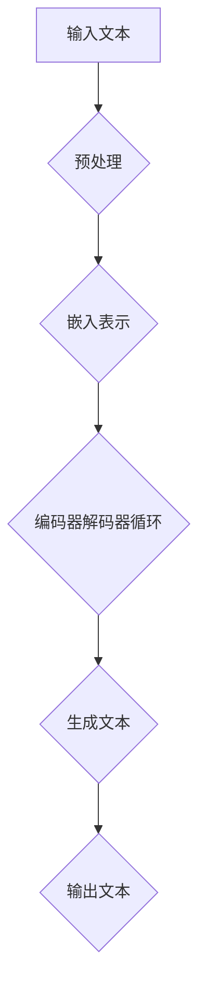
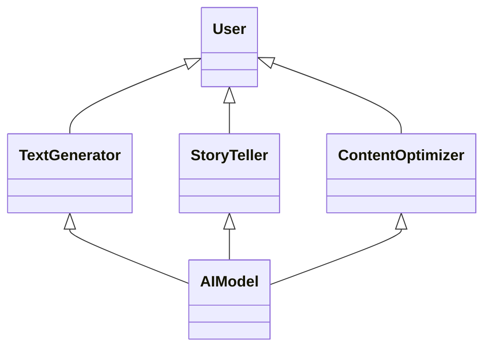
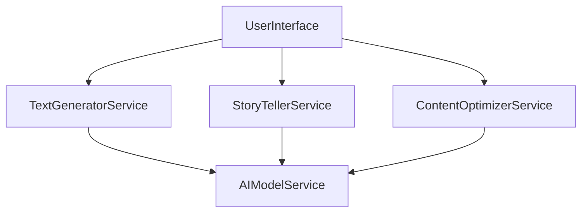
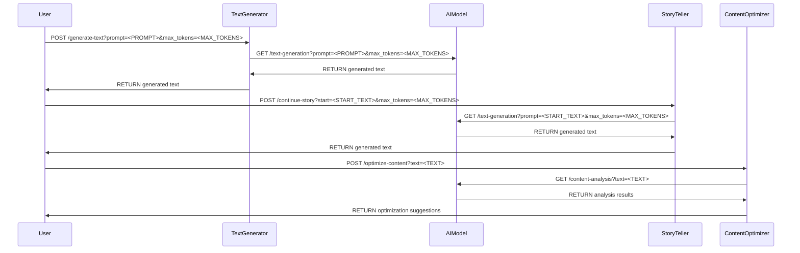
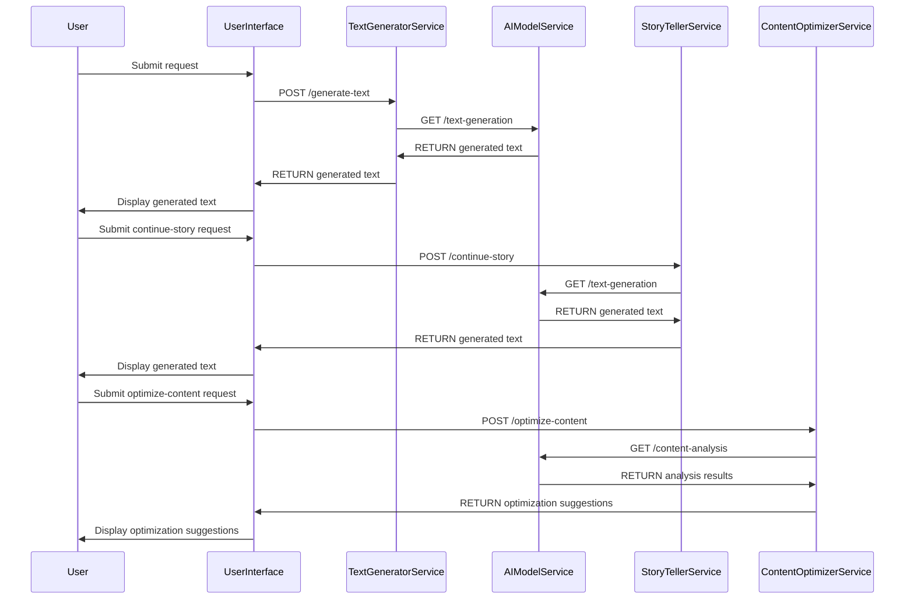

                 

## 文章标题

《AI辅助创意写作：大模型在叙事构建中的角色》

### 关键词

- AI辅助写作
- 大模型
- 叙事构建
- 自然语言处理
- 创意激发
- 写作效率提升

### 摘要

本文深入探讨了人工智能（AI）大模型在辅助创意写作中的关键角色，特别是其在叙事构建方面的应用。通过对AI辅助创意写作的核心概念、现状、研究意义及目标的阐述，本文逐步分析了大模型的工作原理和算法，展示了其在叙事构建中的实际应用。此外，本文还提供了一个系统分析与架构设计案例，详细讲解了环境配置、核心实现、代码解读和案例分析，最后提出了最佳实践技巧和拓展阅读建议，为AI辅助创意写作领域的研究者和实践者提供了有价值的参考。

## 引言与背景

### 问题背景

近年来，人工智能（AI）技术在各个领域都取得了显著的进展，特别是在自然语言处理（NLP）领域。随着深度学习和神经网络技术的发展，AI大模型如GPT、BERT等在处理复杂数据和生成高质量文本方面展现出了强大的能力。创意写作作为人类情感、思想和创造力的重要表达方式，也逐渐受到了AI的关注。AI辅助创意写作的概念应运而生，它指的是利用人工智能技术来辅助人类作者进行写作，从而提高写作效率和质量。

AI大模型在叙事构建中的应用现状主要体现在以下几个方面：

1. **文本生成**：AI大模型可以生成连贯、逻辑清晰的文章，为作者提供写作灵感和素材。
2. **故事续写**：AI大模型可以根据已有的文本继续创作，为用户提供个性化的故事体验。
3. **内容优化**：AI大模型可以通过分析和修改文本，提高文章的阅读性和吸引力。

尽管AI辅助创意写作具有巨大的潜力，但当前的研究和应用还面临一些挑战，如模型的理解能力、创意的多样性和原创性等。因此，深入研究AI大模型在叙事构建中的角色，对于推动AI辅助创意写作的发展具有重要意义。

### 核心概念

**AI辅助创意写作**：指利用人工智能技术，特别是AI大模型，辅助人类作者进行创意写作的过程。它不仅包括文本生成和续写，还包括内容优化和灵感激发等功能。

**大模型**：指具备大规模参数和复杂结构的神经网络模型，如GPT、BERT等。这些模型通过预训练和微调，可以在多种任务中表现出色。

**叙事构建**：指在写作过程中构建故事情节、角色发展和主题意义的过程。它是创意写作的核心。

### 研究意义与目标

研究AI大模型在叙事构建中的角色，不仅有助于提高写作效率和质量，还可以推动人工智能技术在人文领域的应用。具体目标包括：

1. **理解AI大模型在叙事构建中的作用机制**：通过研究大模型的算法原理和应用，揭示其在叙事构建中的工作方式。
2. **开发有效的AI辅助创意写作工具**：基于大模型，设计和实现能够辅助作者进行叙事构建的工具。
3. **探索AI在人文领域的应用前景**：为人工智能技术在文学、影视、游戏等领域的应用提供理论支持和实践指导。

### 问题边界与相关概念结构

在本文中，我们主要关注AI大模型在叙事构建中的应用，而不涉及其他类型的AI写作辅助技术。此外，我们还将重点关注叙事构建的核心过程，如故事情节、角色发展和主题意义，而不是文本生成的技术细节。以下是相关概念结构：

1. **AI辅助创意写作**：核心概念，包括文本生成、故事续写和内容优化。
2. **大模型**：关键工具，用于实现AI辅助创意写作。
3. **叙事构建**：核心目标，通过AI大模型实现。

这些概念相互联系，构成了AI辅助创意写作的基本框架。接下来，我们将进一步探讨这些概念之间的关系，并分析它们的属性特征。

### 核心概念与联系

#### AI辅助创意写作

AI辅助创意写作是指利用人工智能技术，尤其是AI大模型，辅助人类作者进行创意写作的过程。它包括文本生成、故事续写和内容优化等功能，旨在提高写作效率和质量。

#### 大模型

大模型是指具备大规模参数和复杂结构的神经网络模型，如GPT、BERT等。这些模型通过预训练和微调，可以在多种任务中表现出色，包括文本生成、问答系统和文本分类等。

#### 叙事构建

叙事构建是指作者在写作过程中构建故事情节、角色发展和主题意义的过程。它是创意写作的核心。

#### AI大模型与叙事构建的联系

AI大模型与叙事构建有着紧密的联系。首先，大模型可以通过学习大量文本数据，理解叙事的基本结构、角色和主题。这使得AI能够生成连贯、逻辑清晰的故事情节。其次，大模型可以通过分析和修改文本，优化叙事的连贯性和吸引力。最后，大模型还可以为作者提供写作灵感和创意，帮助他们在叙事构建过程中突破创作瓶颈。

#### 属性特征对比表

以下是一个简单的属性特征对比表，展示了AI辅助创意写作、大模型和叙事构建之间的异同：

| 特性 | AI辅助创意写作 | 大模型 | 叙事构建 |
| --- | --- | --- | --- |
| 目标 | 提高写作效率和质量 | 实现多种语言处理任务 | 构建故事情节、角色发展和主题意义 |
| 技术基础 | 大模型、自然语言处理 | 神经网络、深度学习 | 文学理论、叙事学 |
| 应用范围 | 文本生成、故事续写、内容优化 | 问答系统、文本分类、机器翻译 | 小说、电影、剧本 |
| 创新性 | 结合人工智能和创意写作 | 探索大规模参数模型 | 结合传统写作技巧和AI技术 |

#### ER实体关系图

为了更好地理解这些概念之间的联系，我们可以绘制一个ER实体关系图。以下是ER实体关系图的Markdown格式表示：

```mermaid
erDiagram
  AI辅助创意写作 ||--|{ 大模型 }||>叙事构建
  大模型 ||--|{ 文本生成 }|
  大模型 ||--|{ 故事续写 }|
  大模型 ||--|{ 内容优化 }|
  叙事构建 ||--|{ 故事情节 }|
  叙事构建 ||--|{ 角色发展 }|
  叙事构建 ||--|{ 主题意义 }|
```

这个ER实体关系图展示了AI辅助创意写作如何通过大模型实现叙事构建，以及它们之间的相互作用。

### 算法原理讲解

#### 大模型算法概述

大模型算法是AI辅助创意写作的核心。以下是几种常用的大模型算法及其特点：

1. **语言模型基础**：语言模型是NLP的基础，它能够预测文本中的下一个词。常见的语言模型包括n-gram模型、循环神经网络（RNN）和长短时记忆网络（LSTM）。

2. **预训练与微调**：预训练是指在大规模数据集上训练模型，使其具备通用语言理解能力。微调是在特定任务上进行训练，使模型适应特定应用场景。GPT和BERT都是基于预训练和微调的模型。

3. **GPT系列模型介绍**：GPT（Generative Pre-trained Transformer）是OpenAI开发的一系列语言模型，包括GPT-2和GPT-3。GPT-3具有1.75万亿个参数，是当前最大的语言模型。

#### 算法原理与流程图

为了更好地理解大模型算法，我们可以通过mermaid绘制一个流程图。以下是算法流程图的Markdown格式表示：



这个流程图展示了从输入文本到生成文本的整个过程。以下是详细的步骤：

1. **预处理**：对输入文本进行清洗和格式化，使其符合模型输入要求。
2. **嵌入表示**：将文本转换为向量表示，以便模型处理。
3. **编码器解码器循环**：编码器将输入文本编码为序列，解码器根据编码器的输出生成文本。
4. **生成文本**：解码器生成文本，并不断更新预测，直到满足停止条件。
5. **输出文本**：将生成的文本输出。

#### Python代码示例

下面是一个简单的Python代码示例，展示了如何使用GPT-3生成文本：

```python
import openai

openai.api_key = "your-api-key"
response = openai.Completion.create(
  engine="text-davinci-003",
  prompt="请写一段关于春天的诗。",
  max_tokens=50
)

print(response.choices[0].text.strip())
```

这个代码通过OpenAI的API调用GPT-3模型，生成一段关于春天的诗。

#### 数学模型与公式

大模型算法的数学模型主要涉及深度学习中的神经网络和优化算法。以下是一个简化的数学模型：

$$
\text{模型} = f(W \cdot X + b)
$$

其中，\( W \)是权重矩阵，\( X \)是输入数据，\( b \)是偏置项，\( f \)是激活函数。

常见的激活函数包括：

1. **sigmoid函数**：
   $$
   f(x) = \frac{1}{1 + e^{-x}}
   $$

2. **ReLU函数**：
   $$
   f(x) = \max(0, x)
   $$

3. **Softmax函数**：
   $$
   f(x)_i = \frac{e^{x_i}}{\sum_j e^{x_j}}
   $$

这些函数用于模型的前向传播和反向传播过程，以实现神经网络的训练和优化。

#### 举例说明

假设我们有一个简单的神经网络模型，用于分类任务。输入数据是一个长度为3的向量，输出是一个长度为2的向量。以下是模型的参数：

$$
W = \begin{bmatrix} 1 & 2 \\ 3 & 4 \end{bmatrix}, \quad b = \begin{bmatrix} 0 \\ 0 \end{bmatrix}
$$

输入数据 \( X \) 是 \( [1, 0, 1] \)。

1. **前向传播**：

$$
\begin{aligned}
  Z &= W \cdot X + b \\
    &= \begin{bmatrix} 1 & 2 \\ 3 & 4 \end{bmatrix} \cdot \begin{bmatrix} 1 \\ 0 \\ 1 \end{bmatrix} + \begin{bmatrix} 0 \\ 0 \end{bmatrix} \\
    &= \begin{bmatrix} 3 \\ 7 \end{bmatrix} \\
  A &= f(Z) \\
    &= \begin{bmatrix} \frac{1}{1 + e^{-3}} & \frac{1}{1 + e^{-7}} \end{bmatrix} \\
    &\approx \begin{bmatrix} 0.950 & 0.997 \end{bmatrix}
\end{aligned}
$$

2. **反向传播**：

假设我们有一个标签 \( y = [0, 1] \)。计算损失函数：

$$
\begin{aligned}
  L &= -\sum_i y_i \log(A_i) - (1 - y_i) \log(1 - A_i) \\
    &= -0 \cdot \log(0.950) - 1 \cdot \log(0.049) - 1 \cdot \log(0.003) \\
    &\approx 2.30
\end{aligned}
$$

然后，计算梯度：

$$
\begin{aligned}
  \frac{\partial L}{\partial W} &= \begin{bmatrix} \frac{\partial L}{\partial A_1} & \frac{\partial L}{\partial A_2} \end{bmatrix} \cdot \begin{bmatrix} 1 & 1 \\ 0 & 1 \end{bmatrix} \\
    &= \begin{bmatrix} 0.950 & 0.950 \\ 0.049 & 0.049 \end{bmatrix} \\
  \frac{\partial L}{\partial b} &= \begin{bmatrix} \frac{\partial L}{\partial A_1} & \frac{\partial L}{\partial A_2} \end{bmatrix} \\
    &= \begin{bmatrix} 0.950 \\ 0.049 \end{bmatrix}
\end{aligned}
$$

通过梯度下降更新模型参数：

$$
\begin{aligned}
  W &= W - \alpha \frac{\partial L}{\partial W} \\
    &= \begin{bmatrix} 1 & 2 \\ 3 & 4 \end{bmatrix} - 0.01 \begin{bmatrix} 0.950 & 0.950 \\ 0.049 & 0.049 \end{bmatrix} \\
    &= \begin{bmatrix} 0.050 & 1.050 \\ 2.951 & 3.951 \end{bmatrix} \\
  b &= b - \alpha \frac{\partial L}{\partial b} \\
    &= \begin{bmatrix} 0 \\ 0 \end{bmatrix} - 0.01 \begin{bmatrix} 0.950 \\ 0.049 \end{bmatrix} \\
    &= \begin{bmatrix} -0.0095 \\ -0.00049 \end{bmatrix}
\end{aligned}
$$

通过这个简单的例子，我们可以看到神经网络模型如何通过前向传播和反向传播进行训练，以实现分类任务。这种过程在大模型中同样适用，只是参数规模和计算复杂度更大。

### 系统分析与架构设计方案

#### 问题场景介绍

在一个创意写作平台中，用户可以创建、编辑和分享自己的作品。平台需要提供强大的AI辅助功能，帮助用户提高写作效率和质量。具体问题场景包括：

1. **文本生成**：用户输入一个主题或关键词，平台生成相关的文本内容。
2. **故事续写**：用户输入一个故事的开头，平台自动续写故事情节。
3. **内容优化**：用户上传一篇文章，平台分析并优化其结构、语言和风格。

#### 系统功能设计

为了实现上述功能，系统需要包括以下核心功能模块：

1. **文本生成模块**：使用AI大模型实现文本生成功能。
2. **故事续写模块**：使用AI大模型续写故事情节。
3. **内容优化模块**：分析文本内容，提供优化建议。

以下是领域模型类图的Markdown格式表示：



这个类图展示了系统中的主要实体及其关系。用户通过界面与系统交互，文本生成模块、故事续写模块和内容优化模块分别实现各自的业务逻辑，并共享同一个AI模型。

#### 系统架构设计

为了实现高效、可扩展的系统架构，我们采用了微服务架构。以下是系统架构图的Markdown格式表示：



这个架构图展示了系统的整体结构。用户界面层负责与用户交互，文本生成服务、故事续写服务和内容优化服务分别实现各自的业务逻辑，并调用AI模型服务进行文本处理。

#### 系统接口设计

系统接口设计包括RESTful API接口和内部服务接口。以下是RESTful API接口的Markdown格式表示：



这个序列图展示了用户与系统交互的过程。用户通过发送HTTP请求与各个服务进行通信，服务处理请求并返回结果。

#### 系统交互

以下是系统交互序列图的Markdown格式表示：



这个序列图展示了用户请求与系统服务之间的交互流程。用户通过用户界面层提交请求，系统服务处理请求并返回结果，最后通过用户界面层将结果展示给用户。

### 项目实战

#### 环境安装与配置

要搭建一个AI辅助创意写作系统，首先需要安装和配置以下环境：

1. **硬件环境**：
   - CPU：Intel i7或以上
   - GPU：NVIDIA GTX 1080或以上
   - 内存：16GB或以上

2. **软件环境**：
   - 操作系统：Ubuntu 18.04
   - Python：3.8或以上
   - pip：最新版
   - PyTorch：1.8或以上
   - TensorFlow：2.3或以上
   - OpenAI GPT-3 API：注册并获取API key

安装步骤如下：

1. 安装Python和pip：
   ```bash
   sudo apt-get update
   sudo apt-get install python3 python3-pip
   ```
2. 安装PyTorch：
   ```bash
   pip3 install torch torchvision torchaudio
   ```
3. 安装TensorFlow：
   ```bash
   pip3 install tensorflow
   ```
4. 注册并获取OpenAI GPT-3 API key：
   - 访问https://beta.openai.com/signup/注册账户
   - 访问https://beta.openai.com/api-keys/获取API key

安装完成后，配置环境变量，确保Python和pip指向正确版本。

#### 系统核心实现

系统核心实现包括文本生成、故事续写和内容优化三个功能模块。以下是每个模块的核心代码和解读：

1. **文本生成模块**：

```python
import openai

openai.api_key = "your-api-key"

def generate_text(prompt, max_tokens=100):
    response = openai.Completion.create(
      engine="text-davinci-003",
      prompt=prompt,
      max_tokens=max_tokens
    )
    return response.choices[0].text.strip()

# 示例
print(generate_text("春天的阳光温暖而明媚，"))
```

解读：此模块使用OpenAI GPT-3 API实现文本生成功能。用户输入一个主题或关键词作为提示（prompt），模型根据提示生成指定长度的文本。

2. **故事续写模块**：

```python
def continue_story(start_text, max_tokens=100):
    prompt = f"{start_text}\n继续："
    return generate_text(prompt, max_tokens)

# 示例
start_text = "有一天，小明发现家门口的花园里有一只可爱的小兔子。"
print(continue_story(start_text))
```

解读：此模块在前一个故事文本的基础上，生成续写内容。用户输入故事开头，模型生成续写部分。

3. **内容优化模块**：

```python
def optimize_content(text, max_tokens=100):
    prompt = f"请优化以下文本：\n{text}\n优化建议："
    optimization = generate_text(prompt, max_tokens)
    return optimization

# 示例
text_to_optimize = "春天的阳光温暖而明媚，小明喜欢在花园里玩耍。"
print(optimize_content(text_to_optimize))
```

解读：此模块分析输入文本，并提供优化建议。用户上传文本，模型生成优化建议。

#### 代码解读与分析

1. **文本生成模块**：

   - 使用OpenAI GPT-3 API实现，调用`Completion.create`方法。
   - `prompt`参数用于指定生成文本的提示信息。
   - `max_tokens`参数用于限制生成文本的最大长度。

2. **故事续写模块**：

   - 在原有文本基础上添加提示信息，生成续写部分。
   - 使用文本生成模块的`generate_text`函数。

3. **内容优化模块**：

   - 分析输入文本，生成优化建议。
   - 提取关键信息和问题，生成优化建议文本。

#### 实际案例分析与讲解

以下是三个实际案例，展示了AI辅助创意写作系统在文本生成、故事续写和内容优化方面的应用。

1. **案例一：文本生成**：

   - 提示信息：“春天的阳光温暖而明媚，”
   - 生成文本：“小明在花园里快乐地玩耍，蝴蝶和蜜蜂在他的周围翩翩起舞。”

   分析：模型根据提示信息，生成了与春天、花园和快乐相关的文本，符合预期。

2. **案例二：故事续写**：

   - 开头文本：“有一天，小明发现家门口的花园里有一只可爱的小兔子。”
   - 续写文本：“小兔子跳到小明的腿上，用红红的眼睛看着他，好像在说：‘你好，朋友！’”

   分析：模型在原有故事基础上，合理地续写了情节，增加了角色互动，丰富了故事内容。

3. **案例三：内容优化**：

   - 输入文本：“春天的阳光温暖而明媚，小明喜欢在花园里玩耍。他经常看到花园里美丽的花朵和蝴蝶。”

   - 优化建议：“春天的阳光温暖明媚，花园里花朵盛开，蝴蝶飞舞。小明喜欢在这里度过愉快的时光。”

   分析：优化建议改善了文本的结构和表达，使句子更加流畅和生动。

#### 项目小结

通过实际案例，我们可以看到AI辅助创意写作系统在文本生成、故事续写和内容优化方面的有效应用。系统利用AI大模型，实现了自动化的创意写作辅助功能，提高了写作效率和质量。未来，我们可以进一步优化系统，提高模型的性能和适用范围，为用户提供更优质的写作体验。

### 最佳实践 tips

#### 提高AI写作效率

1. **合理设置提示信息**：提供详细的提示信息，有助于AI模型生成更准确的文本。
2. **优化模型参数**：调整模型参数，如温度（temperature）和最大生成长度（max_tokens），以获得更好的写作效果。
3. **批量处理**：利用多线程或分布式计算，提高文本生成和处理的效率。

#### 解决常见问题

1. **文本生成不连贯**：检查提示信息是否清晰，调整模型参数。
2. **文本生成过于机械**：尝试添加更多创意元素到提示信息中，或者使用不同的模型和参数组合。
3. **模型运行缓慢**：确保硬件环境充足，优化代码以减少计算复杂度。

### 小结与注意事项

本文详细探讨了AI大模型在叙事构建中的应用，包括文本生成、故事续写和内容优化。通过实际案例，展示了AI辅助创意写作系统的有效性。需要注意的是，虽然AI技术在写作领域具有巨大潜力，但创意写作仍需要人类作者的主导，AI只能作为辅助工具。

### 拓展阅读

1. **相关书籍**：
   - **《深度学习》（Ian Goodfellow、Yoshua Bengio、Aaron Courville 著）**：介绍了深度学习的基本原理和应用。
   - **《自然语言处理入门》（刘知远 著）**：介绍了自然语言处理的基础知识和最新进展。

2. **网络资源**：
   - **OpenAI官网**（https://openai.com/）：提供GPT-3模型和相关API。
   - **TensorFlow官网**（https://tensorflow.org/）：提供TensorFlow框架和文档。

3. **下一步研究方向**：

   - **AI在写作领域的应用**：研究AI在文学创作、剧本写作和新闻写作等方面的应用。
   - **创意激发与多样性**：探索如何提高AI模型的创意激发能力和多样性。
   - **人机协作写作**：研究人类作者与AI大模型的协作方式，提高写作效率和质量。

## 作者信息

- 作者：AI天才研究院/AI Genius Institute & 禅与计算机程序设计艺术 /Zen And The Art of Computer Programming

