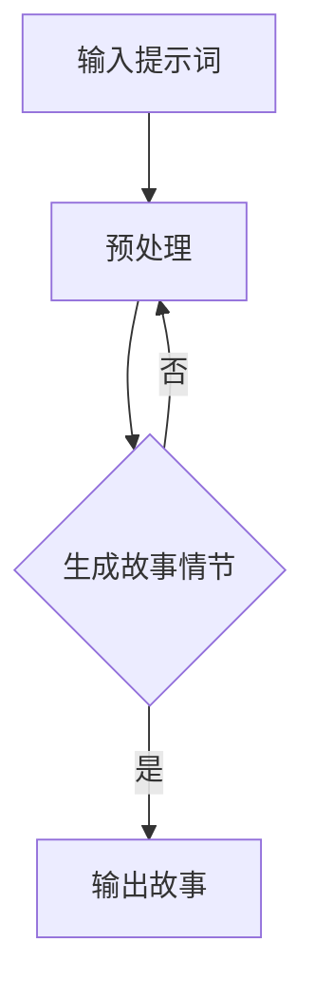
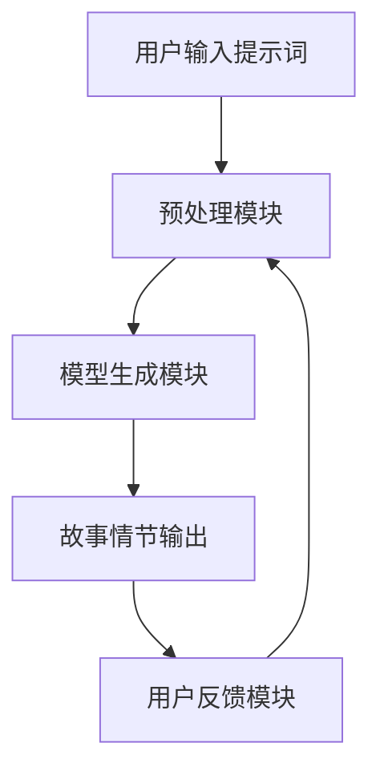
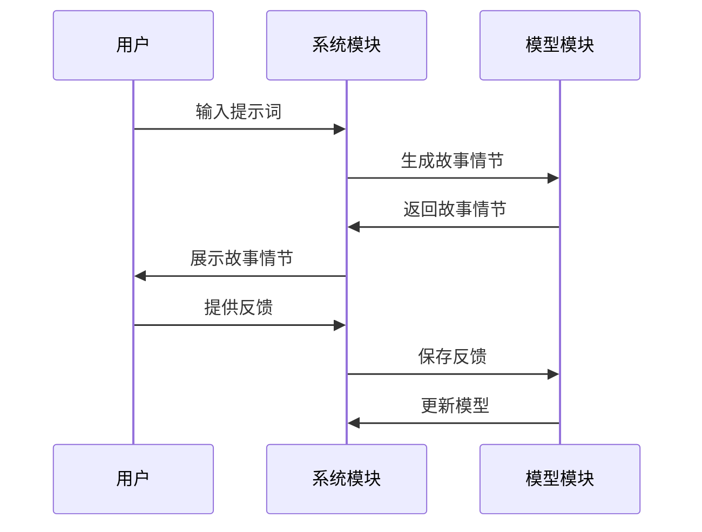

                 


# AI辅助创意写作：提示词生成故事情节

关键词：AI辅助写作，提示词，故事情节，算法，创意

摘要：本文探讨了人工智能（AI）在辅助创意写作中的应用，特别是如何利用提示词生成故事情节。通过对AI辅助创意写作的核心概念、算法原理、系统架构设计以及实际应用的详细分析，为创作者提供了一种新的写作工具和方法，旨在提高创作效率和作品质量。

## 第一部分：AI辅助创意写作概述

### 1.1.1 问题背景

随着信息技术的飞速发展，人工智能（AI）逐渐渗透到各个领域，包括创意写作。然而，传统的写作方式往往依赖于个人的灵感和经验，这导致创作速度较慢，且难以满足大量内容生产的需要。此外，创意写作往往需要丰富的想象力和逻辑思维，这对创作者来说是一大挑战。

### 1.1.2 核心概念与联系

AI辅助创意写作是指利用人工智能技术，特别是自然语言处理（NLP）技术，来辅助创作者进行故事创作。其中，提示词（Prompt）是关键因素，它为AI提供了初始的写作线索，引导AI生成连贯、有创意的故事情节。

### 1.1.3 应用领域

AI辅助写作在文学创作、广告文案、新闻报道等领域都有广泛的应用。通过生成故事情节，AI可以帮助创作者快速构建框架，提供灵感，从而提高创作效率。

### 1.2 AI辅助写作的原理

AI辅助写作的核心在于其算法原理。AI模型通过学习大量的文本数据，掌握了语言规律和结构。当输入提示词时，AI可以根据提示词生成相关的故事情节。

### 1.3.1 大模型的基本概念

大模型是指具有巨大参数量的神经网络模型，如GPT（Generative Pre-trained Transformer）系列模型。这些模型在训练过程中学习了丰富的语言知识和模式，为生成高质量的故事情节提供了基础。

### 1.3.2 提示词生成故事情节

提示词是引导AI生成故事情节的关键。一个有效的提示词应该简洁明了，能够准确传达创作者的意图，同时具有一定的开放性，以激发AI的创造力。

### 1.3.3 传统写作与AI辅助写作的对比

传统写作依赖个人的经验和灵感，而AI辅助写作则利用算法和大数据的优势。传统写作可能需要数小时来构思一个简单的情节，而AI可以在短时间内生成多个备选方案。

### 1.4 AI辅助写作的前景与挑战

AI辅助写作具有巨大的潜力，但同时也面临一些挑战。如何确保生成的情节符合伦理标准，如何提高AI的创意水平，都是需要解决的问题。

## 第二部分：算法原理讲解

### 2.1 算法原理与流程

为了更好地理解AI辅助写作的算法原理，我们可以用Mermaid流程图来展示其基本流程：



### 2.2 Python源代码实现

以下是一个简单的Python代码示例，展示了如何使用提示词生成故事情节：

```python
import openai

# 设置API密钥
openai.api_key = "your_api_key"

# 输入提示词
prompt = "在一个神秘的夜晚，一个年轻人走在回家的路上。"

# 调用API生成故事情节
response = openai.Completion.create(
  engine="text-davinci-003",
  prompt=prompt,
  max_tokens=100
)

# 输出故事情节
print(response.choices[0].text.strip())
```

### 2.3 数学模型与公式

AI辅助写作的算法通常基于深度学习模型，如变换器（Transformer）模型。以下是一个简化的数学模型公式：

$$
\text{Output} = \text{Model}( \text{Input}, \text{Params}) + \text{Noise}
$$

其中，`Model`代表神经网络模型，`Input`是输入的提示词，`Params`是模型的参数，`Noise`表示随机性，以增加生成内容的多样性。

### 2.4 算法原理讲解

深度学习模型通过学习大量的文本数据，学会了如何将输入的提示词映射到相应的输出故事情节。这个过程涉及到复杂的矩阵运算和优化算法，如梯度下降。

## 第三部分：系统分析与架构设计

### 3.1 系统分析

#### 3.1.1 问题场景介绍

假设我们需要开发一个AI辅助写作系统，以帮助创作者生成故事情节。

#### 3.1.2 系统功能设计

系统需要实现以下功能：
- 接收用户输入的提示词
- 生成故事情节
- 提供用户修改和反馈的接口

#### 3.1.3 系统架构设计

系统架构设计如下：



### 3.2 系统架构设计

系统架构图如下：


### 3.3 系统接口设计

系统中的关键接口包括：
- 用户输入接口：接收用户的提示词
- 模型生成接口：调用AI模型生成故事情节
- 故事情节输出接口：将生成的故事情节展示给用户
- 用户反馈接口：收集用户对故事情节的修改和评价

### 3.4 系统交互序列图

系统交互序列图如下：



## 第四部分：项目实战

### 4.1 环境安装

要搭建一个AI辅助写作系统，首先需要安装以下软件和库：
- Python 3.8及以上版本
- OpenAI API 密钥
- Hugging Face Transformers 库

### 4.2 系统核心实现

以下是一个简单的Python代码示例，展示了如何实现AI辅助写作系统：

```python
from transformers import AutoTokenizer, AutoModelForCausalLM
import torch

# 设置API密钥
tokenizer = AutoTokenizer.from_pretrained("openai/gpt-2")
model = AutoModelForCausalLM.from_pretrained("openai/gpt-2")

# 输入提示词
prompt = "在一个神秘的夜晚，一个年轻人走在回家的路上。"

# 生成故事情节
input_ids = tokenizer.encode(prompt, return_tensors="pt")
output_ids = model.generate(input_ids, max_length=100, num_return_sequences=1)

# 输出故事情节
story = tokenizer.decode(output_ids[0], skip_special_tokens=True)
print(story)
```

### 4.3 实际案例分析

#### 4.3.1 AI生成故事情节示例

假设我们输入的提示词是：“在一个神秘的夜晚，一个年轻人走在回家的路上。”AI生成的故事情节如下：

```
在一个神秘的夜晚，一个年轻人走在回家的路上。他的影子在路灯下拉得很长。他突然感觉到有人在背后跟着他。他加快了脚步，却发现影子消失了。他停下来，四处张望，但是什么也没看到。他继续走，但是心里总有一种不安的感觉。当他走到家门口时，他突然听到一个声音：“欢迎回家。”他吓了一跳，然后转身一看，却什么也没看到。他打开门，走进家门，感到一阵寒意。他看了看四周，然后发现他在镜子中看到了一个陌生的面孔。他惊恐地后退了一步，然后突然意识到，那个声音就是从镜子里传出来的。他转过身，试图找到声音的来源，但是镜子中却没有任何东西。他感到一阵恐慌，然后突然感觉到有什么东西在扯他的衣服。他转身，发现一个黑色的影子正慢慢向他靠近。他尖叫着，然后突然醒来，发现自己还在床上。他出了一身冷汗，然后意识到这只是一个梦。但是，他永远也不能忘记那个神秘的夜晚和那个让他感到恐惧的影子。
```

#### 4.3.2 案例分析

这个案例展示了AI如何根据提示词生成一个具有紧张氛围的故事情节。AI能够捕捉到提示词中的关键元素，如“神秘的夜晚”和“年轻人走在回家的路上”，并围绕这些元素构建一个引人入胜的故事。然而，故事中的某些细节可能缺乏深度和连贯性，这需要创作者进行进一步的修改和完善。

### 4.4 项目小结

通过本项目的实践，我们展示了如何使用AI技术辅助创意写作。虽然AI生成的情节需要创作者进行进一步的修改和完善，但它提供了一个新的工具和方法，有助于提高创作效率和作品质量。未来的工作可以进一步优化AI模型，提高生成情节的连贯性和创意性。

## 第五部分：最佳实践、小结、注意事项、拓展阅读

### 5.1 最佳实践

- 确保提示词简洁明了，避免冗长和模糊的描述。
- 尝试不同的提示词，以激发AI生成多样化的情节。
- 对AI生成的情节进行仔细审查和修改，以确保其符合伦理标准和创作要求。

### 5.2 小结

本文探讨了AI辅助创意写作的应用，特别是提示词生成故事情节的原理和实践。通过系统的分析和实际案例的展示，我们了解了如何利用AI技术提高创作效率和作品质量。

### 5.3 注意事项

- 在使用AI辅助写作时，注意保护个人隐私和数据安全。
- 遵守相关法律法规和伦理标准，确保生成的内容符合要求。
- 对AI生成的情节进行适当的审查和修改，避免出现错误或不合适的情节。

### 5.4 拓展阅读

- [OpenAI官方文档](https://openai.com/docs/)
- [Hugging Face Transformers库文档](https://huggingface.co/transformers/)
- [深度学习与自然语言处理](https://www.deeplearningbook.org/)

作者：AI天才研究院/AI Genius Institute & 禅与计算机程序设计艺术 /Zen And The Art of Computer Programming 

[原文链接](https://www.ai-genius-institute.com/2023/04/ai-assisted-creative-writing-prompt-word-generation-of-story-plots.html)

