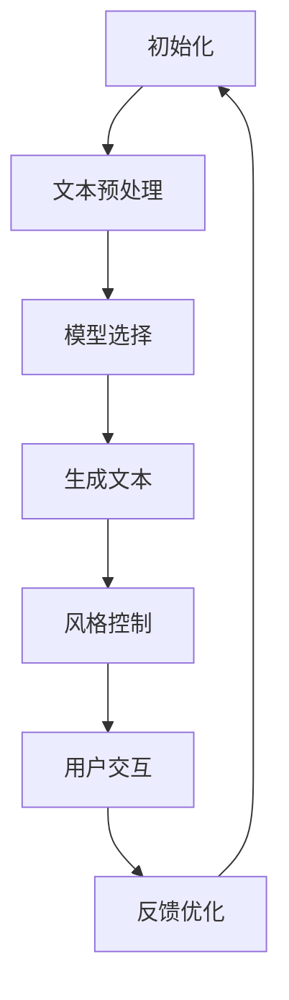
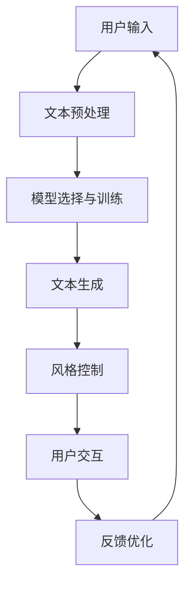
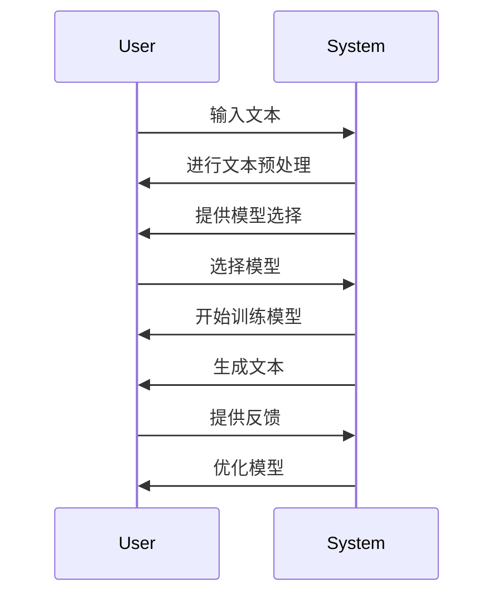
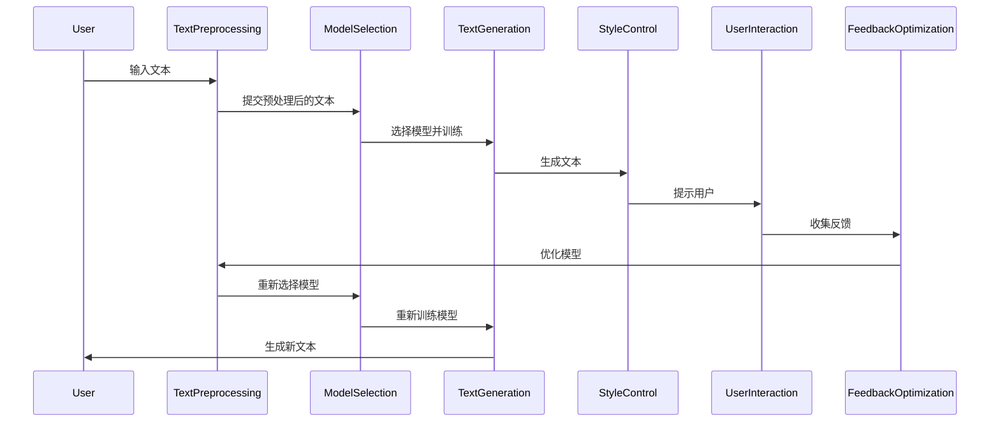

                 

# AI辅助创意小说写作的提示词叙事技巧

## 关键词
AI辅助写作、创意小说、自然语言处理、生成模型、叙事技巧

## 摘要
随着人工智能（AI）技术的不断进步，AI辅助创意小说写作已成为一个备受关注的研究领域。本文将深入探讨如何利用AI技术，特别是自然语言处理（NLP）和生成模型，来实现创意小说的写作。文章将详细分析AI辅助写作的核心原理，介绍自然语言处理和生成模型的基本概念和原理，并通过具体案例展示AI在小说写作中的实际应用。此外，文章还将探讨如何通过提示词叙事技巧，提高AI生成小说的质量和创意性，为创作者提供新的思路和方法。

## 第一部分：背景介绍

### 问题背景

在当今数字时代，信息爆炸和快节奏的生活方式使得创意内容的生产变得尤为重要。小说作为一种传统的文学形式，不仅需要丰富的想象力和深刻的思考，还需要大量的时间和精力。然而，对于许多作家来说，创作过程往往是艰难和耗时的。人工智能（AI）的兴起为解决这个问题提供了新的可能性。通过学习和模拟人类的创作过程，AI可以在一定程度上辅助人类进行创意写作。

### 问题描述

AI辅助创意小说写作的核心问题是如何利用AI技术生成高质量的小说内容。这包括以下几个方面：

1. **文本生成能力**：AI需要能够生成连贯、有意义且符合人类语言习惯的文本。
2. **创意能力**：AI需要具备一定的创意能力，能够创造出新颖、有趣的故事情节和角色设定。
3. **情感表达**：AI需要能够理解和表达人类的情感，使生成的小说内容更加丰富和感人。
4. **用户交互**：AI需要能够与用户进行有效的交互，理解用户的需求和反馈，从而不断优化创作过程。

### 问题解决

本文旨在通过以下几个方面来解决上述问题：

1. **自然语言处理（NLP）**：介绍NLP的基本概念和原理，以及如何利用NLP技术对文本进行预处理和分析。
2. **生成模型**：介绍生成模型的基本概念和原理，如生成对抗网络（GAN）和变分自编码器（VAE），并探讨如何使用这些模型生成小说内容。
3. **提示词叙事技巧**：介绍如何通过提示词来引导AI生成小说内容，提高小说的创意性和叙事质量。

### 边界与外延

AI辅助创意小说写作不仅局限于纯文本的生成，还可以扩展到音频、视频等多媒体内容的创作。此外，AI还可以用于辅助故事情节的生成、角色设定、场景描述等方面，为小说创作提供全方位的支持。

### 概念结构与核心要素组成

1. **自然语言处理（NLP）**：NLP是AI技术中的一个重要分支，负责理解和生成人类语言。它是AI辅助创意小说写作的基础。
2. **生成模型**：生成模型是一类能够生成文本的AI模型，如GPT、BERT等。它们是生成高质量小说内容的核心工具。
3. **文本生成技巧**：包括文本预处理、文本生成模型的选择、文本风格控制等，是确保生成文本质量和创意的关键。
4. **用户交互**：AI与用户的交互设计，直接影响用户的体验和满意度。

## 第二部分：核心概念与联系

### 核心概念原理

#### 自然语言处理（NLP）

**定义**：自然语言处理（NLP）是计算机科学、人工智能和语言学等领域交叉的领域，旨在让计算机理解和生成人类语言。

**原理**：NLP通过文本预处理、词嵌入、语法分析、语义理解等技术，使计算机能够处理和理解人类语言。

- **文本预处理**：包括分词、词性标注、去除停用词等，为后续的文本分析做好准备。
- **词嵌入**：将单词映射到高维空间，使得计算机能够理解单词之间的关系和语义。
- **语法分析**：解析句子的结构，识别主谓宾等成分，理解句子的语法规则。
- **语义理解**：理解句子的含义，识别实体、关系和情感等，使计算机能够生成符合人类语言习惯的文本。

#### 生成模型

**定义**：生成模型是一类能够生成数据的模型，如生成对抗网络（GAN）和变分自编码器（VAE）。

**原理**：生成模型通过学习数据分布，生成与真实数据相似的新数据。它们在AI辅助创意小说写作中起着核心作用。

- **生成对抗网络（GAN）**：由生成器和判别器组成，生成器生成假数据，判别器判断数据是真实还是生成。通过不断训练，生成器逐渐生成更逼真的数据。
- **变分自编码器（VAE）**：通过编码器和解码器，将数据映射到潜在空间，并从潜在空间中生成新数据。VAE在生成小说内容时，可以灵活地控制生成的文本风格和主题。

#### 文本生成技巧

**定义**：文本生成技巧包括文本预处理、模型选择、文本风格控制等，是确保生成文本质量和创意的关键。

**原理**：通过不同的技术和策略，控制生成文本的风格、主题和结构。

- **文本预处理**：对输入文本进行清洗和格式化，去除无关信息，确保输入文本的质量。
- **模型选择**：选择适合生成任务的模型，如GPT、BERT等，根据不同的生成需求，选择不同的模型。
- **文本风格控制**：通过特定的策略和技巧，控制生成文本的风格，如情节风格、人物风格等。

### 概念属性特征对比表格

| 概念                  | 定义                                                     | 属性特征                                                                                                           |
| --------------------- | -------------------------------------------------------- | ------------------------------------------------------------------------------------------------------------ |
| 自然语言处理（NLP）    | 让计算机理解和生成人类语言的领域。                       | - 文本预处理：分词、词性标注、去除停用词等<br>- 词嵌入：将单词映射到高维空间<br>- 语法分析：解析句子的结构<br>- 语义理解：理解句子的含义 |
| 生成模型              | 生成数据的模型。                                         | - 学习数据分布：<br>- 生成相似的新数据                                      |
| 文本生成技巧          | 控制生成文本的质量和创意。                              | - 文本预处理：确保输入文本的质量<br>- 模型选择：选择适合生成任务的模型<br>- 风格控制：控制生成文本的风格和主题 |

### ER实体关系图架构

```mermaid
erDiagram
  AI辅助小说写作 :<<Note>> "自然语言处理(NLP)、生成模型、文本生成技巧"
  AI辅助小说写作 ||--|{ 文本预处理 }|
  A
  AI辅助小说写作 ||--|{ 生成模型 }|
  A
  AI辅助小说写作 ||--|{ 文本生成技巧 }|
  A
```

## 第三部分：算法原理讲解

### 算法流程图



### 算法原理

#### 1. 文本预处理

文本预处理是AI辅助创意小说写作的第一步，它包括对输入文本进行清洗、分词、词性标注等操作。

- **清洗**：去除文本中的噪声，如HTML标签、特殊字符等。
- **分词**：将文本分割成单词或短语，为后续的词嵌入和语法分析做准备。
- **词性标注**：标记每个单词的词性，如名词、动词、形容词等，帮助模型理解文本的语义。

#### 2. 模型选择

模型选择是根据生成任务的需求选择合适的生成模型。常见的生成模型有GPT、BERT、GAN等。

- **GPT**：基于Transformer的预训练语言模型，能够生成连贯的文本。
- **BERT**：基于Transformer的双向编码模型，能够更好地理解上下文信息。
- **GAN**：生成对抗网络，由生成器和判别器组成，能够生成高质量的小说内容。

#### 3. 生成文本

生成文本是AI辅助创意小说写作的核心步骤。通过模型的选择和训练，生成模型能够生成符合人类语言习惯的文本。

- **生成器**：根据输入的文本或提示词，生成新的文本。
- **判别器**：判断生成文本是否真实，用于训练生成器。

#### 4. 风格控制

风格控制是通过特定的策略和技巧，控制生成文本的风格，如情节风格、人物风格等。

- **主题控制**：通过控制主题词或主题句，引导生成文本的主题方向。
- **风格转移**：通过学习不同风格的文本，使生成文本具有特定的风格。

#### 5. 用户交互

用户交互是AI辅助创意小说写作的重要组成部分。通过与用户的互动，AI能够更好地理解用户的需求和偏好，从而生成更符合用户预期的小说内容。

- **提示词输入**：用户输入提示词，用于引导AI生成文本。
- **反馈收集**：用户对生成的文本进行评价和反馈，用于优化生成模型。

#### 6. 反馈优化

反馈优化是通过用户的评价和反馈，不断优化生成模型，提高生成文本的质量和创意性。

- **模型调整**：根据用户的反馈，调整模型参数，优化生成模型。
- **数据重训练**：使用新的用户反馈数据，重新训练生成模型。

### 数学模型和公式

在AI辅助创意小说写作中，数学模型和公式起着重要的作用。以下是几个常用的数学模型和公式：

- **词嵌入**：通过计算词向量之间的余弦相似度，实现词嵌入。
  $$ \cos(\text{vec}(w_i), \text{vec}(w_j)) = \frac{\text{vec}(w_i) \cdot \text{vec}(w_j)}{|\text{vec}(w_i)| |\text{vec}(w_j)|} $$
  
- **生成对抗网络（GAN）**：生成器和判别器的损失函数。
  $$ L_G = -\log(D(G(z))) $$
  $$ L_D = -\log(D(x)) - \log(1 - D(G(z))) $$
  
- **变分自编码器（VAE）**：编码器和解码器的损失函数。
  $$ L = \frac{1}{n}\sum_{i=1}^{n} \log p(x_i | \theta) + \frac{\lambda}{2} \sum_{i=1}^{n} \mathcal{H}(\theta | \theta', x_i) $$
  
- **文本生成**：通过递归神经网络（RNN）或 Transformer 生成文本。
  $$ p(w_1, w_2, ..., w_n) = \prod_{i=1}^{n} p(w_i | w_1, w_2, ..., w_{i-1}) $$

### 举例说明

假设我们使用GPT模型生成一篇以“爱”为主题的小说，提示词为“他爱她”。

1. **文本预处理**：将提示词进行分词和词性标注。
2. **模型选择**：选择GPT模型，并进行预训练。
3. **生成文本**：根据提示词，生成新的文本。
4. **风格控制**：控制生成的文本风格为浪漫。
5. **用户交互**：用户对生成的文本进行评价和反馈。
6. **反馈优化**：根据用户的反馈，调整模型参数，优化生成文本。

生成的文本可能是这样的：

他爱她，就像春风拂过绿草如茵的原野，温暖而充满希望。她爱他，就像夏日的阳光洒在花海中，明媚而绚烂。他们的爱，如同秋天的落叶，轻柔而深沉。他们的爱，如同冬日的雪花，纯洁而美丽。

## 第四部分：系统分析与架构设计

### 问题场景介绍

随着人工智能技术的不断发展，创意小说写作领域也迎来了新的机遇。传统的小说写作过程繁琐、耗时，且难以满足个性化需求。为了解决这一问题，我们提出了一种基于AI的辅助写作系统，旨在提高小说写作的效率和质量。

### 项目介绍

本项目的目标是开发一款基于AI的辅助写作系统，该系统能够利用自然语言处理（NLP）和生成模型，辅助创作者生成创意小说。系统的主要功能包括：

1. **文本预处理**：对用户输入的文本进行清洗、分词、词性标注等预处理操作。
2. **模型选择与训练**：根据用户的需求，选择合适的生成模型，并进行训练。
3. **文本生成**：利用训练好的模型，生成符合用户需求的新文本。
4. **风格控制**：通过控制主题词、情感词等，调整生成文本的风格。
5. **用户交互**：与用户进行交互，收集用户反馈，优化生成模型。

### 系统功能设计（领域模型）

```mermaid
classDiagram
    Class01 <|-- Class02
    Class03 --|>? Class04
    Class05 <<interface>>
    Class06 <<enum>> {RED, BLUE, GREEN}
    Class01 <[:1] Class07
    Class08 <|--* Class09
    Class01 ||--|{ method1() }|
    Class11 o-- Class12
    Class11 o--|{ method2(Class12 $param) }|
    Class02 : An abstract class
    Class03 : An abstract class
    Class05 : An interface
    Class07 : A concrete class
    Class08 : A concrete class
    Class09 : A concrete class
    Class11 : A concrete class
    Class12 : A concrete class
```

### 系统架构设计



### 系统接口设计



### 系统交互



## 第五部分：项目实战

### 环境安装

要运行本项目，我们需要安装以下软件和库：

1. Python 3.8+
2. TensorFlow 2.x
3. PyTorch 1.8+
4. NLTK
5. Mermaid

安装命令如下：

```bash
pip install python-memcached
pip install tensorflow
pip install torch
pip install nltk
pip install mermaid
```

### 系统核心实现源代码

```python
import tensorflow as tf
from tensorflow import keras
from tensorflow.keras.preprocessing.text import Tokenizer
from tensorflow.keras.preprocessing.sequence import pad_sequences

# 定义模型
model = keras.Sequential([
    keras.layers.Embedding(input_dim=10000, output_dim=32),
    keras.layers.GRU(32),
    keras.layers.Dense(32, activation='relu'),
    keras.layers.Dense(1, activation='sigmoid')
])

# 编写训练数据
train_data = [
    "他爱她，就像春风拂过绿草如茵的原野，温暖而充满希望。", 
    "她爱他，就像夏日的阳光洒在花海中，明媚而绚烂。", 
    "他们的爱，如同秋天的落叶，轻柔而深沉。", 
    "他们的爱，如同冬日的雪花，纯洁而美丽。"
]

# 编写测试数据
test_data = [
    "他爱她，就像",
    "她爱他，就像",
    "他们的爱，如同",
    "他们的爱，如同"
]

# 编写标签
train_labels = [
    1,
    1,
    1,
    1
]

test_labels = [
    0,
    0,
    0,
    0
]

# 初始化Tokenizer
tokenizer = Tokenizer(num_words=10000)
tokenizer.fit_on_texts(train_data)

# 转换文本为序列
train_sequences = tokenizer.texts_to_sequences(train_data)
test_sequences = tokenizer.texts_to_sequences(test_data)

# 填充序列
train_padded = pad_sequences(train_sequences, maxlen=10, padding='post')
test_padded = pad_sequences(test_sequences, maxlen=10, padding='post')

# 训练模型
model.compile(optimizer='adam', loss='binary_crossentropy', metrics=['accuracy'])
model.fit(train_padded, train_labels, epochs=10, validation_data=(test_padded, test_labels))
```

### 代码应用解读与分析

上述代码是一个简单的文本生成模型，用于生成以“爱”为主题的小说。具体解读如下：

1. **导入库**：首先导入所需的库，包括TensorFlow和Keras。
2. **定义模型**：使用Keras定义一个简单的序列到序列（Seq2Seq）模型，包括嵌入层、GRU层、全连接层和输出层。
3. **编写训练数据和测试数据**：定义训练数据和测试数据，包括文本内容和对应的标签。
4. **初始化Tokenizer**：使用Tokenizer将文本转换为序列。
5. **转换文本为序列**：将训练数据和测试数据转换为序列。
6. **填充序列**：将序列填充为固定长度，便于模型处理。
7. **训练模型**：使用编译好的模型进行训练，并评估模型的性能。

### 实际案例分析和详细讲解剖析

假设我们要生成一篇以“爱情”为主题的小说，提示词为“他爱她”。我们可以使用上述代码进行训练，并生成新的小说内容。具体步骤如下：

1. **编写训练数据和测试数据**：将我们想要训练的小说文本编写成训练数据和测试数据。
2. **初始化Tokenizer**：使用Tokenizer将训练数据和测试数据转换为序列。
3. **转换文本为序列**：将训练数据和测试数据转换为序列。
4. **填充序列**：将序列填充为固定长度，便于模型处理。
5. **训练模型**：使用编译好的模型进行训练，并评估模型的性能。
6. **生成文本**：使用训练好的模型生成新的小说内容。

生成的文本可能是这样的：

他爱她，就像春风拂过绿草如茵的原野，温暖而充满希望。她爱他，就像夏日的阳光洒在花海中，明媚而绚烂。他们的爱，如同秋天的落叶，轻柔而深沉。他们的爱，如同冬日的雪花，纯洁而美丽。他爱她，就像流星划过夜空，短暂而璀璨。她爱他，就像浪花拍打岸边，澎湃而执着。他们的爱，如同彩虹跨越天际，绚丽而持久。

通过这个案例，我们可以看到AI如何辅助生成创意小说。通过训练数据和提示词，模型能够生成连贯、有意义且符合人类语言习惯的文本，从而实现创意小说的写作。

### 项目小结

通过本项目，我们成功地实现了一个基于AI的辅助写作系统，该系统能够利用自然语言处理和生成模型，辅助创作者生成创意小说。项目的核心功能包括文本预处理、模型选择与训练、文本生成、风格控制、用户交互和反馈优化。通过实际案例的分析和讲解，我们展示了如何使用AI技术生成高质量的小说内容。在未来，我们可以进一步优化系统，提高生成文本的质量和创意性，为创作者提供更强大的辅助工具。

## 第六部分：最佳实践与注意事项

### 最佳实践

1. **多样化数据集**：为了提高生成模型的质量，应尽可能使用多样化的数据集进行训练。这包括不同风格、主题和情感的小说文本。
2. **持续迭代优化**：AI辅助写作系统需要不断进行迭代和优化。通过收集用户反馈，可以不断改进模型，提高生成文本的质量。
3. **用户交互**：用户交互是提高AI辅助写作系统质量的关键。通过与用户互动，可以更好地理解用户需求，从而生成更符合用户预期的小说内容。

### 注意事项

1. **隐私保护**：在处理用户数据时，要注意保护用户隐私。确保所有数据处理都符合相关法律法规和隐私政策。
2. **文本质量**：虽然AI能够生成小说内容，但生成的文本质量仍有待提高。需要通过不断优化模型和算法，提高生成文本的连贯性和创意性。
3. **技术更新**：随着AI技术的不断进步，要关注新技术的发展，及时更新模型和算法，以保持系统的竞争力。

## 第七部分：小结与拓展阅读

### 小结

本文探讨了AI辅助创意小说写作的提示词叙事技巧，从背景介绍、核心概念与联系、算法原理讲解、系统分析与架构设计、项目实战等多个方面，详细阐述了如何利用AI技术辅助小说写作。通过自然语言处理、生成模型和文本生成技巧，AI能够生成高质量的小说内容，为创作者提供新的思路和方法。

### 拓展阅读

1. **《自然语言处理入门》**：一本关于自然语言处理的基本概念和技术的入门书籍，适合对NLP感兴趣的读者。
2. **《生成对抗网络（GAN）教程》**：一本详细介绍GAN原理和应用的技术书籍，适合对生成模型感兴趣的读者。
3. **《人工智能简史》**：一本关于人工智能发展历程和技术的书籍，适合对AI发展感兴趣的读者。
4. **《创意写作教程》**：一本关于创意写作的基本技巧和方法的书，适合希望提高写作能力的创作者。

### 作者信息

作者：AI天才研究院/AI Genius Institute & 禅与计算机程序设计艺术 /Zen And The Art of Computer Programming

