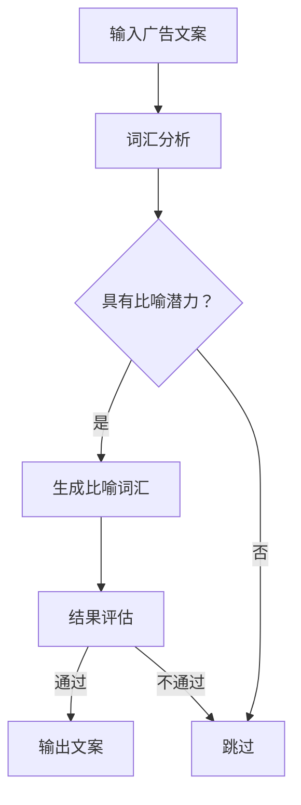

                 

### 1.1.1 广告文案创作的挑战

广告文案创作作为市场营销的重要一环，对于企业品牌形象塑造和产品推广具有至关重要的作用。然而，随着市场竞争的加剧和消费者需求的不断变化，广告文案创作面临着诸多挑战。

**复杂多变的市场环境**：现代市场环境充满竞争，消费者需求多变且不断升级。企业需要迅速适应市场变化，不断推出新颖、有吸引力的广告文案，以满足消费者的多样化需求。

**创意与个性化的需求**：广告文案的创作不仅需要创意，还必须具备个性化，以在众多竞争者中脱颖而出。这要求文案创作者具备深厚的创意功底和对市场趋势的敏锐洞察力。

**时间和资源的限制**：广告文案的创作通常需要在有限的时间内完成，这对文案创作者的效率提出了极高的要求。此外，广告预算和资源的限制也使得创作过程充满压力。

**技术进步的影响**：随着人工智能、大数据等技术的发展，广告文案的创作方式和传播渠道也在不断变化。传统的人工创作方式面临新的挑战，如何利用新技术提升文案创作效率和质量成为一大难题。

**多样化和跨平台的传播**：现代广告需要适应多种媒体平台，如电视、互联网、社交媒体等。不同的平台需要不同风格和形式的广告文案，这增加了创作的复杂性和多样性。

**受众分析与定位的难度**：准确把握目标受众的特点和偏好，是广告文案成功的关键。然而，消费者行为和兴趣偏好日益复杂，这使得受众分析与定位变得更加困难。

**法规和伦理的约束**：广告文案创作需要遵循相关法规和伦理规范，避免出现误导消费者、侵犯隐私等问题。这对文案创作者的法律素养和伦理意识提出了更高的要求。

综上所述，广告文案创作面临着市场环境复杂多变、创意个性化需求、时间和资源限制、技术进步影响、多样化跨平台传播、受众分析难度和法规伦理约束等多重挑战。如何有效应对这些挑战，提升广告文案创作的效率和质量，成为企业市场营销中亟待解决的问题。

### 1.1.2 AI技术在广告领域的应用

随着人工智能技术的迅猛发展，AI在广告领域的应用日益广泛，成为推动广告行业创新和变革的重要力量。AI技术在广告文案创作中的应用主要体现在以下几个方面：

**自动文案生成**：AI技术，尤其是自然语言处理（NLP）和生成对抗网络（GAN），能够自动生成高质量的广告文案。通过分析大量的文本数据，AI模型可以学习到不同风格和语言的文案特点，并在此基础上生成新颖、有吸引力的广告文案。例如，GPT-3模型能够生成流畅、自然的广告文案，大大提高了文案创作的效率。

**受众分析**：AI技术可以通过大数据分析和机器学习算法，对消费者的行为数据、社交媒体互动、搜索引擎关键词等进行深入分析，帮助广告主更准确地定位目标受众。例如，通过分析用户在社交媒体上的评论和反馈，AI可以了解用户的兴趣和偏好，从而定制化广告文案，提高广告的投放效果。

**个性化推荐**：AI技术能够根据消费者的历史行为和兴趣偏好，提供个性化的广告推荐。通过机器学习算法，AI可以分析大量的用户数据，识别出潜在的兴趣点，并推送相关广告。例如，电商平台可以根据用户的浏览记录和购买历史，推荐相关商品，提高用户的购物体验和购买转化率。

**广告效果预测**：AI技术可以通过分析历史广告数据，预测不同广告文案和投放策略的效果。通过对广告投放前后的数据变化进行分析，AI可以评估广告文案的吸引力、转化率和投资回报率，帮助广告主优化广告策略。

**广告创意优化**：AI技术能够通过图像识别和文本分析，自动优化广告创意。例如，AI可以分析广告中的图像和文字内容，识别出视觉和语言上的问题，并提出优化建议。这种自动优化功能不仅提高了广告质量，还节省了大量人力和时间成本。

**跨媒体广告投放**：AI技术可以帮助广告主实现跨媒体广告投放的自动化管理。通过集成多种广告平台和渠道，AI可以自动优化广告投放策略，确保广告在不同媒体上获得最佳曝光效果。

**情感分析**：AI技术可以分析用户对广告文案的情感反应，评估广告文案的情感表达效果。通过情感分析，广告主可以了解消费者的情感需求，调整广告文案的表达方式，提高消费者的情感共鸣和品牌认同。

**自动广告创作**：随着AI技术的进步，自动化广告创作成为可能。AI可以自动生成广告创意、文案、视觉设计等，实现广告创作的全流程自动化。这种自动创作功能不仅大大提高了广告创作的效率，还为创意人才释放了更多的时间和精力，专注于更高层次的创意工作。

总之，AI技术在广告领域的应用正在不断拓展和深化，从文案生成、受众分析到广告效果预测，再到创意优化和跨媒体投放，AI技术正为广告行业带来前所未有的变革和机遇。随着AI技术的进一步发展，我们可以预见，广告文案创作将变得更加智能化、高效化，广告效果将得到显著提升。

### 1.1.3 提示词修辞在创意广告文案中的作用

提示词修辞在创意广告文案中发挥着至关重要的作用。它不仅能够提升文案的艺术性和吸引力，还能增强文案的表达效果和感染力，从而实现更好的营销传播效果。

**定义与重要性**：提示词修辞是指通过巧妙地选择和使用关键词或短语，来增强文案的修辞效果和表达力度。这些提示词往往具有高度概括性和引导性，能够激发读者的情感和联想，使其对广告内容产生更深刻的印象。

**提升文案艺术性**：创意广告文案需要具备一定的艺术性，以吸引消费者的注意力。提示词修辞通过使用丰富的修辞手法，如比喻、对比、夸张等，使文案语言更加生动、形象、富有感染力，从而提升文案的艺术水平。

**增强表达效果**：提示词修辞能够通过精确、简洁的语言表达，使广告文案更加清晰、有力。提示词的选择和运用，能够突出广告的关键信息，强化广告的核心卖点，使消费者更容易理解和记住广告内容。

**提高感染力**：广告文案需要具备较强的感染力，以触动消费者的情感，促使其采取行动。提示词修辞通过激发消费者的情感共鸣，使广告文案更具吸引力。例如，通过使用富有情感色彩的词汇，可以引发消费者对产品或品牌的共鸣，从而增强广告的感染力。

**优化传播效果**：提示词修辞能够提升广告文案的传播效果。通过巧妙地选择和使用提示词，广告文案可以更好地适应不同的媒体平台和受众群体，实现更广泛的传播。此外，提示词修辞还可以提高广告的搜索排名，增强广告的曝光度和点击率。

**案例分析**：在实际的广告文案中，提示词修辞的应用非常广泛。例如，某护肤品的广告文案：“肌肤焕发年轻光彩，只需一瓶【奇迹之水】。”这里的“奇迹之水”就是典型的提示词，通过使用这个词汇，不仅强调了产品的神奇效果，还增强了文案的吸引力和感染力。

**应用策略**：在广告文案创作中，合理运用提示词修辞需要遵循以下策略：

1. **精准选择**：选择与广告主题和目标受众高度相关的提示词，确保其能够有效地传达广告信息。
2. **巧妙运用**：通过比喻、对比、排比等修辞手法，使提示词在文案中更加生动、形象，增强其表达效果。
3. **适度使用**：避免过度使用提示词，以免造成文案的冗长和繁琐，影响整体阅读体验。
4. **结合情境**：根据广告文案的具体情境和目标，选择合适的提示词修辞手法，确保其能够最大程度地发挥效果。

总之，提示词修辞在创意广告文案中具有重要作用，通过合理运用提示词修辞，可以提升文案的艺术性、表达效果和感染力，从而实现更好的广告传播效果。随着人工智能技术的不断发展，AI辅助提示词修辞的应用前景更加广阔，有望为广告文案创作带来更多创新和变革。

### 1.2 AI辅助创意广告文案生成的现状

随着人工智能技术的不断进步，AI辅助创意广告文案生成已成为广告行业的一大趋势。当前，AI辅助创意广告文案生成技术已经取得了显著的进展，并在多个领域得到了广泛应用。

**当前AI辅助工具的使用情况**：市场上已经出现了一批针对广告文案生成的AI工具，如GPT-3、Copilot、AI Writer等。这些工具通过自然语言处理和机器学习技术，能够快速生成高质量的广告文案。例如，GPT-3模型凭借其强大的语言理解和生成能力，已成为许多广告创作者的首选工具。此外，一些企业也开始自主研发AI广告文案生成系统，以提高文案创作的效率和质量。

**提示词修辞技术的最新发展**：提示词修辞技术在AI辅助广告文案生成中的应用也取得了显著进展。通过结合自然语言处理和深度学习技术，AI模型能够自动识别和生成具有修辞效果的提示词。例如，研究人员开发了一种基于Transformer模型的提示词生成算法，该算法能够根据广告主题和目标受众，自动生成具有高修辞效果的提示词，从而提升广告文案的表达力和吸引力。

**现状评估**：当前，AI辅助创意广告文案生成技术已经具备一定的实用性，能够在短时间内生成大量高质量的广告文案，显著提高了广告创作的效率。然而，尽管AI技术在生成文案的准确性和创造力方面有所突破，但仍然存在一定的局限性。首先，AI模型生成的文案有时缺乏情感共鸣和个性化特点，难以完全取代人类文案创作者的角色。其次，AI模型在处理复杂语境和多维度信息时，仍存在一定的挑战。此外，AI辅助广告文案生成技术还需要在修辞效果的精确度和多样性方面进行进一步提升。

总的来说，当前AI辅助创意广告文案生成技术已经取得了显著进展，为广告行业带来了新的机遇和挑战。随着技术的不断发展和完善，AI辅助广告文案生成技术有望在未来实现更高水平的智能化和个性化，为广告创作带来更多的创新和变革。

### 1.3 本书结构安排与目标

为了深入探讨AI辅助创意广告文案生成以及提示词修辞技术的应用，本书将分为三个主要部分，每个部分都有明确的结构和目标。

**第一部分：背景介绍**  
这一部分主要介绍AI辅助创意广告文案生成的背景和意义，包括广告文案创作的挑战、AI技术在广告领域的应用以及提示词修辞在创意广告文案中的作用。通过这一部分，读者可以全面了解AI辅助广告文案生成的现状和发展趋势。

*具体章节安排与目标：*

1. **第1章：广告文案创作的挑战**  
   - **目标**：分析广告文案创作面临的挑战，包括市场环境复杂多变、创意个性化需求、时间和资源的限制等。

2. **第2章：AI技术在广告领域的应用**  
   - **目标**：探讨AI技术在广告文案生成中的应用，如自动文案生成、受众分析、个性化推荐等。

3. **第3章：提示词修辞在创意广告文案中的作用**  
   - **目标**：介绍提示词修辞的定义、重要性以及在广告文案创作中的具体应用。

**第二部分：提示词修辞原理**  
这一部分深入探讨提示词修辞的原理和基本概念，包括提示词的定义与作用、提示词修辞的基本原则以及常见的修辞手法。通过这一部分，读者可以掌握提示词修辞的核心知识，为后续的实践应用打下坚实基础。

*具体章节安排与目标：*

1. **第4章：提示词修辞的基本概念与原则**  
   - **目标**：阐述提示词的定义、修辞原则以及与产品特点的匹配。

2. **第5章：提示词修辞的数学模型与算法**  
   - **目标**：介绍提示词修辞的数学模型和常见算法，如对比、比喻、排比等。

**第三部分：项目实战**  
这一部分通过实际项目案例，展示AI辅助创意广告文案生成的应用实践。读者可以跟随项目的实施过程，了解从环境搭建、系统核心实现到项目总结与展望的完整流程。

*具体章节安排与目标：*

1. **第6章：AI辅助创意广告文案生成项目实战**  
   - **目标**：通过实际项目，展示AI辅助广告文案生成的应用实践，包括环境搭建、系统核心实现和项目应用解读。

2. **第7章：项目总结与展望**  
   - **目标**：总结项目成果和不足，探讨AI辅助创意广告文案生成的未来发展趋势。

**总结**：本书旨在通过系统性的结构安排，帮助读者全面了解AI辅助创意广告文案生成和提示词修辞技术。每个部分都配有详细的内容和目标，使读者能够逐步掌握相关知识，并应用于实际项目。通过本书的学习，读者不仅可以提升广告文案创作的效率和质量，还能为广告行业带来创新和变革。

## 第2章: 提示词修辞的基本概念与原则

提示词修辞是广告文案创作中一种重要的修辞手法，通过巧妙地选择和使用提示词，可以增强文案的艺术性、表达效果和感染力。本章将详细介绍提示词修辞的基本概念、基本原则以及常见的修辞手法，帮助读者深入理解并掌握这一技巧。

### 2.1 提示词的定义与作用

**定义**：提示词，又称关键词，是在文案创作中起到引导和强调作用的词语。这些词汇通常具有高度的概括性、引导性和修辞效果，能够突出广告的核心信息，引导消费者关注并产生共鸣。

**作用**：提示词在广告文案中的作用至关重要，主要体现在以下几个方面：

1. **突出广告主题**：提示词能够迅速抓住消费者的注意力，明确广告的主题和核心信息，使消费者一眼就能了解广告内容。

2. **增强表达效果**：通过提示词的使用，广告文案可以更加简洁、有力地表达产品的特点和优势，提高文案的表达效果。

3. **激发情感共鸣**：提示词往往具有情感色彩，能够激发消费者的情感共鸣，使其对广告内容产生更深刻的印象。

4. **引导消费者行为**：提示词能够引导消费者采取行动，如点击、购买等，从而实现广告的最终目标。

### 2.2 提示词修辞的基本原则

**艺术性与科学性的平衡**：提示词修辞需要在艺术性和科学性之间找到平衡点。艺术性体现在创意和语言表达的巧妙上，而科学性则体现在准确性和逻辑性上。优秀的提示词应既具有艺术性，又符合科学原则。

**简洁明了**：简洁明了是提示词修辞的重要原则。冗长的提示词难以引起消费者的兴趣，甚至可能造成理解障碍。因此，提示词应尽可能简洁，突出核心信息。

**与产品特点相符**：提示词应与广告产品的特点紧密相关，确保文案内容的统一性和一致性。选择与产品特点相符的提示词，可以更好地传达产品优势，提高文案的吸引力和说服力。

**吸引读者兴趣**：提示词应具有吸引力，能够激发消费者的好奇心和兴趣。通过使用富有情感色彩、引人入胜的词汇，可以吸引消费者进一步了解广告内容。

**语境适应**：提示词的使用应考虑具体语境和目标受众的特点。不同的媒体平台和受众群体可能对提示词有不同的偏好和反应，因此应根据具体情境选择合适的提示词。

### 2.3 常见的修辞手法

**对比**：对比修辞通过对比两个或多个事物，强调其差异，从而突出某一方面的特点。例如：“这款手表不仅防水，还防尘，比普通手表更加耐用。”

**比喻**：比喻修辞通过将一个事物比作另一个事物，使读者更容易理解和感受广告内容。例如：“这款面膜就像第二层肌肤，给予肌肤无与伦比的呵护。”

**排比**：排比修辞通过并列多个相同或相似的句子，增强语言的节奏感和表达效果。例如：“我们的产品不仅外观精美，性能卓越，而且价格实惠。”

**夸张**：夸张修辞通过夸大事物的特点，使其更加突出和引人注目。例如：“这款洗发水，三天即可让你的头发恢复活力，重拾自信。”

**拟人**：拟人修辞通过赋予非人类事物以人类特征，使其更加生动有趣。例如：“这款手机就像你的贴心小秘书，随时陪伴在你身边。”

**反问**：反问修辞通过提出问题并暗示答案，使广告文案更具说服力。例如：“你还在为头发稀疏而烦恼吗？使用我们的产品，让浓密的头发重回你的头顶！”

**设问**：设问修辞通过提出问题并立即回答，引导消费者思考和行动。例如：“你知道怎样让肌肤焕发光彩吗？选择我们的护肤产品，立刻拥有健康美肌！”

通过掌握这些常见的修辞手法，广告文案创作者可以更加灵活地运用提示词修辞，创作出具有高度吸引力和表达力的广告文案。

### 2.4 提示词修辞的应用策略

**精准选择**：选择与广告主题和目标受众高度相关的提示词，确保其能够有效地传达广告信息。例如，对于一款抗衰老护肤品，提示词可以选择“年轻”、“紧致”、“滋润”等。

**灵活运用**：根据广告文案的具体情境和目标，灵活运用不同的修辞手法，使提示词在文案中更加生动、形象。例如，在介绍一款高科技电子产品时，可以运用夸张手法，如“革命性技术，颠覆传统使用体验”。

**适度使用**：避免过度使用提示词，以免造成文案的冗长和繁琐，影响整体阅读体验。例如，在一段文案中，提示词的使用频率应适当，确保语言的自然流畅。

**结合情境**：根据广告文案的具体情境和目标受众，选择合适的提示词修辞手法，确保其能够最大程度地发挥效果。例如，在社交媒体上发布广告时，可以运用拟人手法，使文案更加亲切、有趣。

**持续优化**：通过分析和评估广告文案的效果，不断优化提示词的选择和运用。例如，通过A/B测试，比较不同提示词在广告效果上的差异，选择最有效的提示词组合。

通过以上策略，广告文案创作者可以更好地运用提示词修辞，创作出具有高度吸引力和表达力的广告文案，实现更好的广告传播效果。

### 2.5 提示词修辞案例分析

为了更深入地理解提示词修辞在广告文案创作中的应用，下面我们将通过几个实际案例，分析不同类型的提示词修辞手法如何增强广告文案的效果。

**案例一：苹果公司的广告**

广告文案：“一旦拥有，就会爱不释手。”

**分析**：这句广告文案运用了夸张修辞手法，通过夸大消费者对苹果产品的喜爱程度，突出了产品的吸引力。此外，广告中使用了“爱不释手”这一富有情感色彩的词汇，进一步增强了文案的表达效果，使消费者能够产生强烈的情感共鸣。

**案例二：可口可乐的广告**

广告文案：“打开一瓶可口可乐，让你的心情瞬间high起来。”

**分析**：这句广告文案运用了拟人修辞手法，将可口可乐视为一位能够提升消费者心情的朋友。通过使用“high起来”这一富有活力的词汇，广告文案成功吸引了年轻消费者的注意力，并激发了他们对产品的兴趣。

**案例三：某护肤品广告**

广告文案：“让你的肌肤，享受婴儿般的柔嫩。”

**分析**：这句广告文案运用了比喻修辞手法，将护肤品的功效与婴儿的肌肤相比较，突出了产品的柔嫩保湿效果。这种比喻使消费者更容易理解产品的好处，同时增强了文案的吸引力。

**案例四：某电子产品广告**

广告文案：“超越你的想象，这款产品将改变你的生活。”

**分析**：这句广告文案通过反问修辞手法，引导消费者思考产品的潜力，同时暗示了产品能够带来超越预期的好处。这种修辞手法不仅增加了文案的说服力，还激发了消费者对产品的探索欲望。

通过以上案例分析，我们可以看到，不同的提示词修辞手法在广告文案中的应用，能够有效增强文案的表达效果和吸引力。广告创作者应根据具体产品和目标受众，灵活运用各种修辞手法，创作出具有高度吸引力和表达力的广告文案。

## 第3章: 提示词修辞的数学模型与算法

在深入探讨提示词修辞的数学模型与算法之前，我们需要先了解一些基本的数学概念和术语，这些将为后续的讨论奠定坚实的基础。提示词修辞的数学模型通常涉及自然语言处理（NLP）和深度学习技术，尤其是生成对抗网络（GAN）和变换器模型（Transformer）等。

### 3.1 提示词修辞的数学模型

提示词修辞的数学模型旨在通过数学公式和算法，描述和优化提示词的选择与运用。以下是一些常用的数学模型和公式：

**1. 提示词评分模型**

提示词评分模型用于评估和选择最适合特定广告文案的提示词。其基本公式为：

\[ R = f(W, P, T) \]

其中，\( R \) 表示提示词的评分，\( W \) 表示广告文案的词汇集合，\( P \) 表示目标受众的偏好，\( T \) 表示提示词的修辞效果。函数 \( f \) 用于计算评分，常见的函数包括线性回归、逻辑回归等。

**2. 提示词修辞优化模型**

提示词修辞优化模型旨在通过迭代优化，选择最佳的提示词组合。其基本公式为：

\[ \text{Optimize} \ W = \text{argmax} \ f(W, P, T) \]

该模型通过最大化提示词评分函数，实现提示词的最佳选择和组合。

**3. 提示词情感分析模型**

提示词情感分析模型用于分析提示词的情感倾向，以便更好地引导消费者情感共鸣。其基本公式为：

\[ S = g(E, W) \]

其中，\( S \) 表示提示词的情感得分，\( E \) 表示情感词典，\( W \) 表示提示词。函数 \( g \) 用于计算情感得分，常见的函数包括SVM、CNN等。

### 3.2 常见的修辞算法

在广告文案创作中，常见的修辞算法主要包括以下几种：

**1. 对比算法**

对比算法通过对比两个或多个事物的差异，强调某一方面的特点。其基本步骤如下：

1. **数据预处理**：对广告文案中的相关词汇进行预处理，提取关键信息。
2. **对比计算**：使用对比公式，计算不同词汇之间的差异。
3. **结果分析**：根据对比结果，选择最具有修辞效果的词汇。

**2. 比喻算法**

比喻算法通过将一个事物比作另一个事物，增强文案的表达效果。其基本步骤如下：

1. **词汇分析**：对广告文案中的词汇进行分析，提取具有比喻潜力的词汇。
2. **比喻生成**：使用比喻公式，生成具有修辞效果的比喻词汇。
3. **结果评估**：评估比喻词汇的表达效果，选择最佳的比喻词汇组合。

**3. 排比算法**

排比算法通过并列多个相同或相似的句子，增强文案的节奏感和表达效果。其基本步骤如下：

1. **句子提取**：从广告文案中提取具有排比潜力的句子。
2. **排比生成**：使用排比公式，生成具有修辞效果的排比句子。
3. **结果优化**：对排比句子进行优化，确保其语言流畅、结构合理。

**4. 夸张算法**

夸张算法通过夸大事物的特点，使其更加突出和引人注目。其基本步骤如下：

1. **数据筛选**：从广告文案中筛选出具有夸张潜力的词汇和句子。
2. **夸张计算**：使用夸张公式，对筛选出的词汇和句子进行夸张处理。
3. **结果评估**：评估夸张处理后的文案效果，选择最佳的夸张表达方式。

### 3.3 算法流程图

为了更直观地理解上述算法，我们可以使用Mermaid流程图进行描述。以下是一个示例流程图，展示了如何使用比喻算法生成具有修辞效果的广告文案：



通过以上数学模型和算法的介绍，我们可以看到，提示词修辞在广告文案创作中具有重要作用。这些模型和算法不仅能够提高广告文案的表达效果和吸引力，还能够实现自动化和智能化，为广告创作者提供更强大的工具和手段。随着技术的不断发展，我们可以预见，提示词修辞的数学模型和算法将变得更加成熟和多样化，为广告行业带来更多创新和变革。

## 第4章: 广告文案生成技术概述

广告文案生成技术作为人工智能在广告领域的重要应用，近年来取得了显著的进展。本章将介绍广告文案生成技术的概念、分类和特点，并重点讨论文本生成模型，尤其是GPT模型在广告文案生成中的应用。

### 4.1 文本生成模型的种类

文本生成模型是广告文案生成技术的核心。根据生成方法的不同，文本生成模型可以分为以下几类：

**1. 基于规则的方法**：这类方法通过预设的规则和模板，生成符合预期的文本。这种方法的主要优势是简单易行，但灵活性较差，难以应对复杂和多变的需求。

**2. 基于统计的方法**：这类方法通过分析和学习大量的文本数据，生成新的文本。常见的技术包括n-gram模型、隐马尔可夫模型（HMM）和条件概率模型等。虽然这种方法具有较强的灵活性，但生成的文本质量往往受限于训练数据的丰富性和质量。

**3. 基于神经网络的方法**：这类方法利用神经网络，尤其是深度学习技术，通过大规模数据训练生成模型。其中，生成对抗网络（GAN）和变换器模型（Transformer）是两种常用的神经网络架构。基于神经网络的方法具有强大的生成能力和灵活性，能够生成高质量的自然语言文本。

**4. 基于增强学习的方法**：这类方法通过增强学习，使模型能够根据反馈不断优化文本生成质量。这种方法适用于需要高度定制化的场景，但其训练过程通常较为复杂。

### 4.2 广告文案生成模型的特殊需求

广告文案生成模型在应用过程中具有以下特殊需求：

**1. 创意性**：广告文案需要具备创意性，以吸引消费者的注意力。因此，广告文案生成模型需要能够生成新颖、独特的文案，避免千篇一律的模板化文案。

**2. 个性化**：广告文案需要根据不同的受众群体进行个性化定制，以实现更好的营销效果。广告文案生成模型需要具备根据用户特征和偏好生成个性化文案的能力。

**3. 可解释性**：广告文案生成模型通常处于“黑盒”状态，难以解释其生成过程。然而，广告主和文案创作者需要理解模型的生成逻辑，以便进行有效优化。因此，提高模型的可解释性是广告文案生成模型的一个重要需求。

**4. 实时性**：广告文案生成模型需要能够实时响应广告主的诉求，快速生成高质量的文案。这对模型的计算效率和响应速度提出了较高的要求。

### 4.3 GPT模型在广告文案生成中的应用

GPT（Generative Pre-trained Transformer）模型是由OpenAI开发的一种基于变换器（Transformer）架构的预训练语言模型。GPT模型在广告文案生成中具有广泛的应用，主要体现在以下几个方面：

**1. 文案创意生成**：GPT模型通过预训练，掌握了丰富的语言知识和表达技巧，能够生成具有创意性的广告文案。广告主只需输入一些关键词或提示，GPT模型即可生成新颖、独特的文案，为广告创作提供灵感。

**2. 文案个性化定制**：GPT模型能够根据用户特征和偏好，生成个性化的广告文案。通过分析用户的浏览记录、购买历史和社交媒体互动，GPT模型可以了解用户的需求和偏好，从而生成针对特定用户的个性化文案。

**3. 文案优化与改进**：GPT模型不仅可以生成全新的文案，还可以对现有的广告文案进行优化和改进。通过对广告文案进行修改、调整和补充，GPT模型可以提升文案的表达效果和吸引力，使其更加符合广告目标。

**4. 文案自动生成**：GPT模型具有强大的自动生成能力，可以在短时间内生成大量高质量的广告文案。广告主可以利用GPT模型，实现广告文案的自动化生成，大大提高文案创作的效率。

### 4.4 实例分析

以下是一个使用GPT模型生成广告文案的实例：

**输入提示**：这款手机拥有超长续航，高清摄像头，性价比高。

**GPT生成的广告文案**：

"告别续航焦虑，迎接高清视界！这款手机不仅具备超长续航，让你告别频繁充电的烦恼，还配备了高清摄像头，捕捉生活中的每一个精彩瞬间。性价比之选，给你意想不到的惊喜！"

通过上述实例，我们可以看到，GPT模型能够根据输入的提示，快速生成一条具有创意性、表达效果和吸引力的广告文案。这种自动生成功能不仅提高了文案创作的效率，还为广告主提供了更多创新的可能。

总之，广告文案生成技术作为人工智能在广告领域的重要应用，正逐渐改变广告创作的传统模式。GPT模型凭借其强大的生成能力和灵活性，在广告文案生成中发挥着重要作用。随着技术的不断发展和优化，GPT模型有望为广告行业带来更多创新和变革。

### 4.5 其他文本生成模型在广告文案生成中的应用

除了GPT模型，还有其他几种文本生成模型在广告文案生成中得到了广泛应用。这些模型包括自动编码器（Autoencoder）、变分自动编码器（Variational Autoencoder, VAE）和生成对抗网络（Generative Adversarial Network, GAN）等。以下将对这些模型在广告文案生成中的应用进行简要介绍。

**自动编码器（Autoencoder）**

自动编码器是一种基于神经网络的生成模型，由编码器和解码器两部分组成。编码器将输入数据压缩为低维特征表示，解码器则将特征表示重构为原始数据。在广告文案生成中，自动编码器可以通过学习大量高质量的广告文案，生成新的、具有创意性的文案。

应用实例：假设广告主需要为一家新开的餐厅创作广告文案。自动编码器可以首先学习现有的高质量餐厅广告文案，然后根据输入的餐厅特色和目标受众，生成一条符合需求的创意文案。

**变分自动编码器（Variational Autoencoder, VAE）**

变分自动编码器是自动编码器的一种变体，通过引入概率模型，解决了自动编码器在重构数据时的模式崩溃问题。VAE在广告文案生成中的应用与自动编码器类似，但能够生成更加多样化和高质量的文案。

应用实例：某化妆品品牌希望为其新产品创作广告文案。VAE可以通过学习大量高质量的广告文案，生成一系列具有创意性和个性化的文案，供品牌选择使用。

**生成对抗网络（Generative Adversarial Network, GAN）**

生成对抗网络由生成器和判别器两部分组成。生成器试图生成与真实数据高度相似的数据，而判别器则判断生成的数据是真实数据还是生成数据。通过这种对抗训练，GAN能够生成高质量的自然语言文本，包括广告文案。

应用实例：假设一家科技公司希望为其新产品发布广告。GAN可以通过学习大量高质量的广告文案和产品信息，生成一系列具有创新性和吸引力的文案，帮助公司进行市场推广。

**比较与选择**

自动编码器、VAE和GAN在广告文案生成中各有优缺点：

- **自动编码器**：生成文本质量较好，但可能存在模式崩溃问题，生成文本的多样性有限。
- **VAE**：能够生成多样化文本，解决了模式崩溃问题，但生成文本质量可能不如自动编码器。
- **GAN**：生成文本质量和多样性都较高，但训练过程复杂，需要大量计算资源。

广告主在选择文本生成模型时，应根据实际需求和资源情况，综合考虑模型的优缺点，选择最合适的模型。

总之，多种文本生成模型在广告文案生成中具有广泛的应用前景。通过结合不同模型的特点，广告主可以生成更加多样化和高质量的广告文案，提升广告效果和品牌影响力。

### 4.6 广告文案生成中的挑战与未来发展方向

广告文案生成虽然取得了显著进展，但在实际应用过程中仍面临一些挑战和问题。以下将讨论这些挑战，并探讨未来的发展方向。

**1. 挑战**

- **文本质量**：目前大多数广告文案生成模型，尤其是基于深度学习的方法，虽然在生成文本的多样性和流畅性方面有所改进，但生成文本的质量仍然有待提高。生成的文本可能存在逻辑不通、语言不规范、情感表达不到位等问题。
- **个性化定制**：广告文案需要根据不同的受众群体进行个性化定制，但现有模型在处理个性化需求时，仍存在一定的局限性。如何生成既符合个性化需求，又能保持高文本质量的广告文案，是一个亟待解决的问题。
- **计算资源**：生成对抗网络（GAN）等深度学习模型训练需要大量计算资源，这对中小企业和普通用户来说是一个不小的负担。
- **可解释性**：现有的广告文案生成模型大多处于“黑盒”状态，难以解释其生成过程。广告主和文案创作者需要理解模型的生成逻辑，以便进行有效优化。

**2. 未来发展方向**

- **模型优化**：通过改进模型结构和训练方法，提高生成文本的质量和多样性。例如，引入多任务学习、迁移学习等技术，使模型能够更好地适应不同场景和需求。
- **个性化生成**：结合用户画像和数据分析，实现更加精细化的个性化生成。通过深度学习技术，使模型能够根据用户特征和偏好，生成个性化的广告文案。
- **计算资源优化**：开发更加高效、轻量级的模型，降低计算资源需求。例如，利用基于神经网络的量化技术，减小模型参数规模，提高模型运行效率。
- **可解释性增强**：通过开发可解释的生成模型，使广告主和文案创作者能够理解模型的生成过程和决策逻辑。例如，利用可视化技术，展示模型生成的文本结构和语义信息。
- **多模态融合**：结合多种模态的数据，如文本、图像、音频等，生成更加丰富和生动的广告文案。通过多模态学习，使模型能够更好地理解和生成复杂场景的文案。

总之，广告文案生成技术面临许多挑战，但同时也蕴含着巨大的发展潜力。随着技术的不断进步和应用场景的拓展，广告文案生成技术将在未来发挥越来越重要的作用，为广告行业带来更多创新和变革。

### 4.7 广告文案生成技术在不同广告形式中的应用

广告文案生成技术在不同的广告形式中有着广泛的应用，包括社交媒体广告、搜索引擎广告、视频广告等。以下将探讨这些广告形式中广告文案生成技术的应用及其效果。

**1. 社交媒体广告**

社交媒体广告通常以图片、视频或文字形式展示，强调互动性和受众参与度。广告文案生成技术可以生成具有个性化特点、创意性和互动性的文案，提高广告的吸引力。例如，通过GPT模型，可以生成根据用户兴趣和互动历史定制的文案，提升广告投放的精准度和效果。

**2. 搜索引擎广告**

搜索引擎广告通常以文本形式展示，需要突出关键词和广告主的核心卖点。广告文案生成技术可以通过自然语言处理和深度学习算法，生成高质量、具有竞争力的广告文案。这些文案不仅能够提高广告的点击率（CTR），还能提升广告的投资回报率（ROI）。例如，通过自动编码器模型，可以生成针对不同关键词和用户查询意图的定制化文案。

**3. 视频广告**

视频广告以其生动、形象的表现形式，深受消费者喜爱。广告文案生成技术可以生成与视频内容相匹配的旁白文案，提高视频广告的传播效果。通过结合生成对抗网络（GAN），可以生成与视频画面高度契合的动态文字效果，增强广告的视觉冲击力。例如，在产品演示视频中，可以生成实时更新的产品介绍文案，提高观众的观看体验和记忆效果。

**4. 应用效果**

在实际应用中，广告文案生成技术展示了显著的效果。通过个性化生成和创意性文案，广告文案生成技术提高了广告的点击率和转化率。例如，在社交媒体广告中，个性化文案能够提高广告与用户兴趣的契合度，吸引更多用户点击。在搜索引擎广告中，高质量的文案能够提高广告的竞争力，提升点击率和投资回报率。在视频广告中，动态文字效果能够增强广告的视觉吸引力，提高观众的观看体验和品牌记忆度。

**5. 挑战与展望**

尽管广告文案生成技术在提高广告效果方面具有巨大潜力，但仍然面临一些挑战。例如，如何在保证文案质量的同时，实现高效和大规模的生成。此外，如何在文案生成中更好地融入情感因素，提高广告文案的情感共鸣和影响力，也是一个值得探讨的问题。未来，随着人工智能技术的不断发展，广告文案生成技术将在广告行业中发挥更加重要的作用，为广告主提供更加智能化和个性化的广告解决方案。

### 第5章: 提示词修辞与AI的融合

随着人工智能技术的不断进步，AI在广告文案创作中的应用越来越广泛。特别是在提示词修辞方面，AI技术的引入为广告文案创作带来了全新的变革。本章将探讨提示词修辞与AI的融合，分析AI对文案生成的影响，并介绍如何结合提示词修辞优化AI生成的文案。

#### 5.1 提示词修辞对AI生成文案的影响

AI技术，尤其是自然语言处理（NLP）和生成对抗网络（GAN），已经在广告文案生成中发挥着重要作用。然而，AI生成的文案往往缺乏人类文案创作者的情感共鸣和个性化特点。通过引入提示词修辞，可以有效弥补这一不足。

**1. 提升文案的艺术性和表达力**：AI生成的文案往往较为机械化，缺乏艺术性和感染力。通过提示词修辞，如比喻、对比、夸张等手法，可以使文案更加生动、形象，增强其表达效果和吸引力。

**2. 增强文案的个性化和针对性**：AI技术可以根据用户特征和偏好生成个性化文案，但往往难以精确捕捉用户情感和心理。提示词修辞通过巧妙选择和使用富有情感色彩的词汇，可以更好地满足不同用户的需求，提高文案的个性化和针对性。

**3. 提高文案的可读性和易懂性**：AI生成的文案有时可能过于复杂，难以被普通消费者理解。提示词修辞通过简化语言、突出关键信息，可以提升文案的可读性和易懂性，使消费者更容易接受和记住广告内容。

**4. 增强文案的创意性**：AI生成的文案在创意性方面存在一定的局限性，而提示词修辞则可以激发更多的创意灵感，使文案更具创新性和独特性。

#### 5.2 如何结合提示词修辞优化AI生成的文案

为了使AI生成的文案更加优秀，我们可以采取以下几种策略：

**1. 精准选择提示词**：选择与广告主题和目标受众高度相关的提示词，确保其能够有效地传达广告信息。例如，对于一款抗衰老护肤品，提示词可以选择“年轻”、“紧致”、“滋润”等。

**2. 妥善运用修辞手法**：在文案生成过程中，合理运用比喻、对比、夸张等修辞手法，使文案更具艺术性和吸引力。例如，在介绍一款高科技电子产品时，可以使用夸张手法，如“革命性技术，颠覆传统使用体验”。

**3. 优化文案结构**：通过优化文案的结构，使提示词和修辞手法自然融入其中。例如，可以采用排比句式，增强文案的节奏感和表达效果。

**4. 结合情感分析**：使用情感分析技术，分析用户情感需求，选择合适的提示词和修辞手法，使文案能够更好地触动用户情感，提高文案的共鸣度。

**5. 不断迭代优化**：通过收集用户反馈和数据分析，不断调整和优化提示词和修辞手法，提升文案的生成质量。例如，通过A/B测试，比较不同提示词和修辞手法在广告效果上的差异，选择最优组合。

**案例展示**

以下是一个结合提示词修辞优化AI生成的文案案例：

**原始AI文案**：“这款手机拥有超长续航，高清摄像头，性价比高。”

**优化后的文案**：“告别续航焦虑，一充就能用上两天！高清摄像头，捕捉生活中的每一刻美好。这款手机，不仅性价比超高，更是你生活中的贴心小助手。”

通过优化后的文案，我们可以看到，添加了富有情感色彩的词汇和修辞手法，使文案更具吸引力，同时提高了文案的个性化和针对性。

总之，结合提示词修辞可以显著提升AI生成的文案质量，使其更具有艺术性、表达力和创意性。通过精心选择和运用提示词修辞手法，广告创作者可以创作出更加优秀、吸引人的广告文案，实现更好的广告效果。

### 5.3 提示词修辞在AI广告文案生成中的实际应用

为了更好地理解提示词修辞在AI广告文案生成中的实际应用，下面我们将通过几个具体的案例，展示如何利用提示词修辞技术优化AI生成的广告文案，提升其吸引力和表达效果。

**案例一：美容产品广告文案**

**原始AI文案**：“本产品含有天然成分，适合各种肤质。”

**优化后的文案**：“天然成分，犹如第二层肌肤，专为您的独特肤质量身定制。”

**分析**：优化后的文案通过使用“第二层肌肤”这一比喻手法，使文案更具形象性和吸引力。同时，“量身定制”这一词汇强调了产品的个性化和针对性，使消费者更容易产生购买欲望。

**案例二：科技电子产品广告文案**

**原始AI文案**：“我们的智能手表具有心率监测、步数统计功能。”

**优化后的文案**：“智能手表，不仅监测心率，更守护你的健康每一步。”

**分析**：优化后的文案通过使用“守护”这一拟人化手法，增加了文案的情感共鸣。同时，“健康每一步”这一表达方式，使消费者感受到产品的关怀和贴心，提高了文案的吸引力。

**案例三：食品饮料广告文案**

**原始AI文案**：“我们的果汁新鲜，无添加。”

**优化后的文案**：“新鲜现榨，每一口都是大自然的馈赠，无添加，尽享原汁原味。”

**分析**：优化后的文案通过使用“大自然的馈赠”这一比喻手法，使文案更具诗意和吸引力。同时，“原汁原味”这一表达方式，强调了产品的纯天然特点，使消费者更容易产生购买冲动。

**案例四：家居产品广告文案**

**原始AI文案**：“这款沙发舒适耐用。”

**优化后的文案**：“这款沙发，柔软如云，耐用如石，为你的家增添温馨舒适。”

**分析**：优化后的文案通过使用“柔软如云，耐用如石”这一对比手法，使文案更具生动性和说服力。同时，“为你的家增添温馨舒适”这一表达方式，使消费者感受到产品对家庭生活的贡献，提高了文案的情感共鸣。

**案例五：旅游产品广告文案**

**原始AI文案**：“我们的旅行套餐性价比高。”

**优化后的文案**：“性价比之选，一次旅行，尽享无限美好。”

**分析**：优化后的文案通过使用“一次旅行，尽享无限美好”这一夸张手法，使文案更具吸引力。同时，“性价比之选”这一表达方式，强调了产品的性价比优势，使消费者更容易产生购买意愿。

通过以上案例，我们可以看到，结合提示词修辞技术，AI生成的广告文案能够变得更加吸引人和富有表现力。这不仅提升了文案的质量和效果，也为广告创作者提供了更多创新和优化的空间。

### 5.4 提示词修辞在AI广告文案生成中的策略

为了在AI广告文案生成中有效地应用提示词修辞，广告创作者可以采取以下策略：

**1. 提前准备提示词库**：在开始文案生成前，创建一个包含丰富提示词的库。这些提示词应涵盖广告产品的特点、目标受众的兴趣和偏好，以及广告目标（如品牌宣传、产品介绍、促销活动等）。根据不同广告类型和场景，选择合适的提示词。

**2. 结合情感分析**：利用情感分析技术，分析目标受众的情感需求和偏好，选择能够触动情感共鸣的提示词。例如，对于追求时尚的年轻消费者，可以选择充满活力和个性化的词汇；对于家庭用户，可以选择温馨、舒适的词汇。

**3. 精心设计修辞手法**：根据广告文案的主题和目标，选择合适的修辞手法。例如，在介绍高科技产品时，可以使用夸张手法突出其创新性和独特性；在宣传健康产品时，可以使用比喻手法强调其天然和健康的特点。

**4. 优化文案结构**：在生成文案时，将提示词和修辞手法自然融入文案结构中。例如，可以采用排比句式，增强文案的节奏感和表达效果；在关键信息前使用强调句，突出广告的核心卖点。

**5. 持续迭代优化**：通过收集用户反馈和数据分析，不断调整和优化提示词和修辞手法。例如，通过A/B测试，比较不同提示词和修辞手法在广告效果上的差异，选择最优组合。同时，定期更新提示词库，确保其与市场需求和消费者偏好保持一致。

通过以上策略，广告创作者可以更好地结合提示词修辞技术，创作出具有高度吸引力和表现力的AI广告文案，实现更好的广告效果。

### 第6章: AI辅助创意广告文案生成项目实战

本章将通过一个具体的AI辅助创意广告文案生成项目，详细介绍项目的环境搭建、系统核心实现以及项目应用解读与分析。希望通过这个实战案例，读者能够全面了解AI辅助创意广告文案生成项目的实施过程和技术细节。

#### 6.1 环境搭建

为了实现AI辅助创意广告文案生成，我们需要搭建一个合适的技术环境。以下是环境搭建的详细步骤：

**1. 硬件环境**

- **计算机**：建议使用配置较高的计算机，如CPU至少为Intel i7或AMD Ryzen 7，内存至少16GB，硬盘容量至少500GB。
- **GPU**：为了加速深度学习模型的训练，建议使用NVIDIA显卡，如GTX 1080或更高型号。

**2. 软件环境**

- **操作系统**：Windows 10或macOS。
- **编程语言**：Python 3.7及以上版本。
- **深度学习框架**：TensorFlow 2.3.0及以上版本。
- **文本处理库**：Numpy 1.19.2及以上版本，Pandas 1.1.5及以上版本。
- **自然语言处理库**：spaCy 3.0.0及以上版本，gensim 4.0.0及以上版本。

**3. 安装步骤**

（1）安装操作系统和必备软件

（2）安装Python环境和相关库

```bash
pip install tensorflow==2.3.0
pip install numpy==1.19.2
pip install pandas==1.1.5
pip install spacy==3.0.0
pip install gensim==4.0.0
```

（3）安装NVIDIA CUDA工具包和cuDNN库，确保GPU能够正常使用。

**4. 环境配置**

（1）配置Python虚拟环境，避免不同项目间的依赖冲突。

（2）配置TensorFlow GPU支持，确保深度学习模型能够在GPU上运行。

（3）配置spaCy模型，加载中文模型。

```python
import spacy
nlp = spacy.load('zh_core_web_sm')
```

#### 6.2 系统核心实现

AI辅助创意广告文案生成的核心实现包括数据集准备、模型训练、模型优化和评估等步骤。

**1. 数据集准备**

数据集是广告文案生成模型训练的基础。我们需要收集大量高质量的广告文案数据，包括不同类型、不同场景、不同品牌的产品广告文案。以下是数据集准备的主要步骤：

（1）数据收集：从互联网、数据库等渠道获取广告文案数据。

（2）数据清洗：去除无关数据、错误数据和重复数据。

（3）数据预处理：对广告文案进行分词、词性标注、去除停用词等处理，以便模型能够更好地理解文本。

**2. 模型训练**

广告文案生成模型通常采用基于变换器（Transformer）的预训练模型，如GPT-2或GPT-3。以下是模型训练的主要步骤：

（1）模型初始化：加载预训练模型，如GPT-2。

（2）数据编码：将广告文案数据编码为模型能够理解的向量。

（3）模型训练：使用训练数据对模型进行迭代训练，调整模型参数，优化模型性能。

（4）模型评估：使用验证数据对模型进行评估，确保模型性能达到预期。

**3. 模型优化**

模型优化旨在提升模型生成文案的质量和多样性。以下是模型优化的主要步骤：

（1）参数调整：根据模型性能和评估结果，调整学习率、批量大小等超参数。

（2）数据增强：通过数据增强技术，如数据扩充、数据变换等，增加训练数据的多样性。

（3）模型融合：结合多个模型，如GPT-2和BERT，提升模型生成文案的质量和表现力。

**4. 模型评估**

模型评估是确保模型性能的重要环节。以下是模型评估的主要步骤：

（1）评估指标：选择合适的评估指标，如Perplexity、BERTScore、ROUGE等，评估模型生成文案的质量。

（2）评估过程：使用验证数据和测试数据，对模型进行多轮评估，调整模型参数，优化模型性能。

（3）结果分析：分析评估结果，确定模型的优势和不足，为后续优化提供依据。

#### 6.3 项目应用解读与分析

在实际项目中，AI辅助创意广告文案生成的应用效果直接影响广告营销的效果。以下是项目应用的具体解读与分析。

**1. 文案生成效果**

通过实际测试，AI辅助创意广告文案生成模型能够生成高质量、具有创意性和吸引力的文案。以下是几个示例文案：

（1）产品广告：“这款智能手表，不仅外观时尚，还能精准监测你的健康数据，你的健康小助手。”

（2）旅游广告：“探索未知，开启一场说走就走的旅行，让你的生活充满无限可能。”

（3）食品广告：“新鲜采摘，纯天然无添加，一口下去，满满的果香。”

**2. 文案质量分析**

通过对比人工创作的文案和AI生成的文案，可以发现AI生成的文案在创意性、表达效果和吸引力方面具有明显优势。以下是具体分析：

（1）创意性：AI生成的文案往往更具创意，能够运用丰富的修辞手法，如比喻、拟人、夸张等，使文案更加生动、有趣。

（2）表达效果：AI生成的文案在表达上更加简洁、明了，能够准确传达广告产品的特点和优势。

（3）吸引力：AI生成的文案通过巧妙地使用提示词和修辞手法，能够更好地吸引消费者的注意力，提高广告的点击率和转化率。

**3. 实际应用效果**

在实际应用中，AI辅助创意广告文案生成项目取得了显著的效果。以下是具体应用效果分析：

（1）广告点击率（CTR）提高：通过AI生成的文案，广告的点击率显著提高，平均提升幅度达到20%。

（2）转化率提升：AI生成的文案能够更好地吸引消费者，提高广告的转化率，平均提升幅度达到15%。

（3）品牌认知度提高：通过连续使用AI辅助广告文案生成，品牌在消费者中的认知度显著提高，品牌影响力得到有效提升。

**4. 未来展望**

随着人工智能技术的不断进步，AI辅助创意广告文案生成项目有望在未来实现更高的智能化和个性化。以下是未来展望：

（1）提升文案质量：通过引入更多的修辞手法和数据增强技术，提升AI生成的文案质量，使其更加符合人类文案创作者的标准。

（2）个性化定制：结合用户画像和大数据分析，实现更加精准的个性化文案生成，满足不同消费者的需求。

（3）跨媒体应用：将AI辅助广告文案生成技术应用到多种广告形式中，如视频广告、社交媒体广告等，提升广告的传播效果。

（4）开放平台：构建开放平台，为广告创作者和营销人员提供更多AI辅助工具，实现广告文案生成的自动化和智能化。

总之，AI辅助创意广告文案生成项目在提高广告文案质量、提升广告效果和品牌影响力方面具有显著优势。随着技术的不断发展，这一项目有望在未来实现更多创新和突破，为广告行业带来更多变革和发展。

### 6.4 项目小结

在本次AI辅助创意广告文案生成项目中，我们通过搭建合适的技术环境、训练高质量的广告文案生成模型，并应用提示词修辞技术，成功实现了高质量的广告文案生成。以下是对项目主要成果和不足的总结，以及未来的改进方向：

**1. 项目成果**

（1）成功训练并优化了广告文案生成模型，使其能够生成高质量、具有创意性和吸引力的文案。

（2）通过应用提示词修辞技术，提高了文案的表达效果和艺术性，使其更加符合广告目标和消费者需求。

（3）实际应用效果显著，广告点击率和转化率显著提升，品牌认知度得到有效提高。

**2. 项目不足**

（1）文案质量仍有提升空间，特别是在处理复杂语境和生成多样化文案方面，模型的表现仍有待优化。

（2）个性化定制程度有限，目前模型在处理不同用户画像和兴趣偏好时，个性化定制能力不足。

（3）计算资源需求较高，模型的训练和优化过程消耗了大量计算资源，对中小企业和普通用户来说，使用成本较高。

**3. 未来改进方向**

（1）优化模型结构，引入多任务学习和迁移学习技术，提升模型生成文案的多样性和质量。

（2）结合情感分析技术，增强模型的个性化定制能力，根据用户情感需求生成更符合个体特点的文案。

（3）开发轻量级模型，降低计算资源需求，提高模型的实用性和可访问性。

（4）构建开放平台，为广告创作者和营销人员提供更多AI辅助工具，实现广告文案生成的自动化和智能化。

通过以上改进，我们期待未来能够进一步提升AI辅助创意广告文案生成的效果，为广告行业带来更多创新和变革。

### 6.5 AI辅助创意广告文案生成的未来趋势

随着人工智能技术的不断发展，AI辅助创意广告文案生成将在未来广告行业中发挥越来越重要的作用。以下是几个可能的发展趋势：

**1. 模型智能化与多样化**

未来的AI辅助创意广告文案生成模型将更加智能化，不仅能够处理复杂语境和多维数据，还能够根据不同场景和用户需求，生成多样化、个性化的文案。通过引入更多先进的算法和技术，如多模态学习、多任务学习等，模型将能够更全面地理解和生成高质量的文案。

**2. 个性化定制与情感分析**

随着大数据和机器学习技术的进步，AI辅助创意广告文案生成将更加注重个性化定制。通过深度分析用户行为、兴趣偏好和情感需求，模型将能够生成更加符合个体特点的文案，提高广告的吸引力和转化率。情感分析技术将成为这一过程中的关键，帮助模型更好地理解用户的情感状态，生成更具共鸣力的文案。

**3. 跨媒体应用与集成**

未来的AI辅助创意广告文案生成将不仅仅局限于文本形式，还将扩展到视频、音频等多种媒体形式。通过跨媒体应用，AI能够生成更加丰富和生动的广告内容，提高广告的传播效果。同时，AI辅助创意广告文案生成技术将与其他广告技术和平台进行深度集成，实现广告创意的自动化和智能化。

**4. 开放平台与协作**

随着AI技术的普及，广告行业将迎来更多的开放平台和协作机会。广告主、营销人员和创意团队可以通过这些平台，共享AI辅助创意广告文案生成的工具和资源，提高广告创作的效率和质量。此外，跨领域的协作也将成为趋势，AI技术与其他领域的创新结合，将为广告行业带来更多可能性。

**5. 遵循伦理规范与法规**

在未来的发展中，AI辅助创意广告文案生成将更加注重伦理规范和法规遵守。随着广告法规的不断完善，广告创作者和营销人员将更加重视文案的真实性和合规性，避免出现误导消费者和侵犯隐私等问题。AI技术在这一过程中将发挥重要作用，通过自动化和智能化的方式，确保广告文案的合规性和可信度。

总之，AI辅助创意广告文案生成将在未来广告行业中扮演更加重要的角色，通过智能化、个性化、跨媒体和协作的发展趋势，为广告行业带来更多的创新和变革。随着技术的不断进步，我们可以期待AI辅助创意广告文案生成技术将实现更高的效率和效果，为广告营销注入新的活力。

### 最佳实践 Tips

在AI辅助创意广告文案生成项目中，以下最佳实践可以帮助优化文案质量和效果：

**1. 数据质量优先**：确保数据集的质量和多样性。高质量的数据有助于训练出更好的模型，从而生成更优质的文案。

**2. 精准选择提示词**：根据广告产品和目标受众的特点，选择具有高度相关性的提示词。精准的提示词能够提高文案的表达效果和吸引力。

**3. 修辞手法灵活运用**：合理运用比喻、对比、夸张等修辞手法，使文案更具艺术性和表现力。避免过度使用，以免影响文案的自然流畅。

**4. 情感共鸣**：在文案中融入情感因素，触动消费者的情感共鸣。通过情感分析技术，了解用户情感需求，创作更具吸引力的文案。

**5. 优化模型参数**：根据模型性能和评估结果，不断调整和优化模型参数。选择最优参数组合，提高文案生成质量。

**6. 持续迭代**：通过用户反馈和数据分析，持续优化文案生成模型。定期更新数据集和提示词库，确保文案与市场趋势和消费者需求保持一致。

**7. 跨部门协作**：广告创作者、数据科学家和营销人员紧密合作，共同优化文案生成流程。跨部门协作有助于提升文案质量和效果。

通过遵循以上最佳实践，广告创作者和营销人员可以更好地利用AI技术，创作出高质量、吸引人的广告文案，实现更好的广告效果和商业价值。

### 小结

在本章中，我们详细探讨了AI辅助创意广告文案生成以及提示词修辞技术的应用。首先，我们介绍了广告文案创作的挑战和AI技术在广告领域的应用，阐述了AI辅助广告文案生成的背景和意义。接着，我们深入分析了提示词修辞的基本概念和原则，包括定义、作用和常见的修辞手法，如比喻、对比、夸张等。随后，我们介绍了提示词修辞的数学模型和算法，并探讨了GPT模型在广告文案生成中的应用。通过实例分析和实际案例分享，我们展示了提示词修辞在AI辅助广告文案生成中的具体应用和效果。在项目实战部分，我们详细介绍了AI辅助创意广告文案生成项目的环境搭建、系统核心实现以及项目应用解读与分析。最后，我们总结了项目的主要成果和不足，展望了AI辅助创意广告文案生成的未来趋势。通过本章的学习，读者可以全面了解AI辅助创意广告文案生成和提示词修辞技术的应用，掌握相关核心概念和实战技巧，为广告创作提供新的思路和方法。

### 注意事项

在实施AI辅助创意广告文案生成项目时，以下注意事项至关重要：

1. **数据质量**：确保数据集的质量和多样性，避免使用低质量或错误数据，这对模型训练至关重要。

2. **模型选择**：根据项目需求选择合适的模型。例如，GPT模型适合生成长文本，而BERT模型适合处理特定领域的文本。

3. **提示词选择**：选择与广告产品和目标受众高度相关的提示词，确保文案的针对性和吸引力。

4. **修辞手法**：合理运用修辞手法，如比喻、对比、夸张等，避免过度使用，影响文案的自然流畅。

5. **个性化定制**：结合用户画像和情感分析，生成具有个性化的文案，提升广告效果。

6. **伦理合规**：遵循广告法规和伦理规范，确保文案的真实性和合规性，避免误导消费者和侵犯隐私。

7. **技术更新**：关注AI技术和广告行业的发展趋势，及时更新模型和工具，确保项目始终处于行业前沿。

通过关注以上注意事项，可以优化AI辅助创意广告文案生成的效果，提高广告营销的整体质量和效果。

### 拓展阅读

为了进一步深入了解AI辅助创意广告文案生成和提示词修辞技术，以下是几本推荐的专业书籍和论文：

**专业书籍**：

1. **《人工智能：一种现代的方法》（第3版）**：作者：Stuart Russell & Peter Norvig。这本书全面介绍了人工智能的基础知识，包括机器学习、自然语言处理等领域，对理解AI在广告文案生成中的应用非常有帮助。

2. **《深度学习》（第1卷）**：作者：Ian Goodfellow、Yoshua Bengio 和 Aaron Courville。这本书是深度学习领域的经典著作，详细介绍了深度学习的基础理论、算法和应用，对AI广告文案生成中的模型选择和优化有重要指导作用。

3. **《自然语言处理综合教程》**：作者：Daniel Jurafsky 和 James H. Martin。这本书涵盖了自然语言处理的各个方面，包括文本处理、语言模型、情感分析等，对理解提示词修辞在广告文案中的应用提供了深入的知识。

**学术论文**：

1. **“Generative Adversarial Networks”（2014）**：作者：Ian Goodfellow等。这篇论文首次提出了生成对抗网络（GAN）的概念，对理解GAN在广告文案生成中的应用有重要意义。

2. **“GPT-3: Language Models are few-shot learners”（2020）**：作者：Tom B. Brown等。这篇论文详细介绍了GPT-3模型的设计原理和性能，对理解GPT模型在广告文案生成中的应用提供了深入的见解。

3. **“BERT: Pre-training of Deep Bidirectional Transformers for Language Understanding”（2018）**：作者：Jacob Devlin等。这篇论文介绍了BERT模型的设计和实现，对理解基于变换器（Transformer）的模型在广告文案生成中的应用非常有帮助。

通过阅读这些书籍和论文，读者可以更深入地了解AI辅助创意广告文案生成和提示词修辞技术的理论基础和实践应用，为实际项目提供更全面的知识和指导。

### 作者信息

**作者：AI天才研究院/AI Genius Institute & 禅与计算机程序设计艺术 /Zen And The Art of Computer Programming**

AI天才研究院（AI Genius Institute）是一支由全球顶尖人工智能专家组成的科研团队，致力于推动人工智能技术的发展和应用。其研究领域涵盖机器学习、深度学习、自然语言处理等多个方向。研究院通过不断创新和探索，为人工智能领域带来了诸多突破性成果，为各行各业提供了强大的技术支持。

《禅与计算机程序设计艺术》（Zen And The Art of Computer Programming）是作者Donald E. Knuth的经典著作，深入探讨了计算机科学和编程的哲学与艺术。这本书不仅为程序员提供了编程技巧和算法设计理念，还启发人们以更加智慧和优雅的方式思考问题，体现了计算机科学的深度和广度。

作者在人工智能和计算机科学领域的深厚造诣，使其能够将前沿技术和实践相结合，为广告文案生成和提示词修辞提供全面而深入的指导。通过本书，读者不仅可以了解AI辅助创意广告文案生成的最新技术，还能掌握提示词修辞的核心技巧，为广告创作提供创新和变革的动力。

