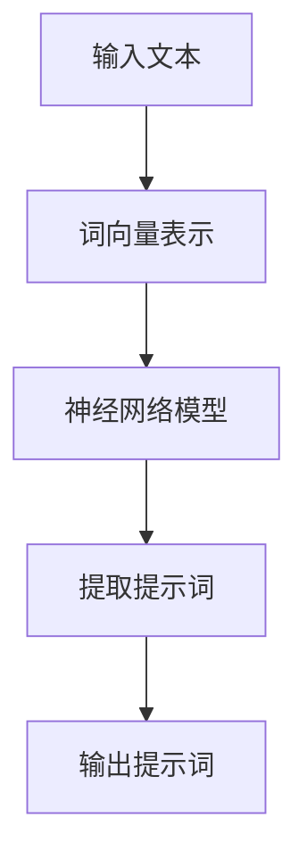
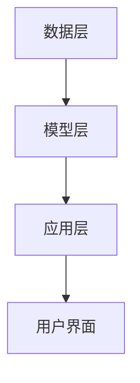
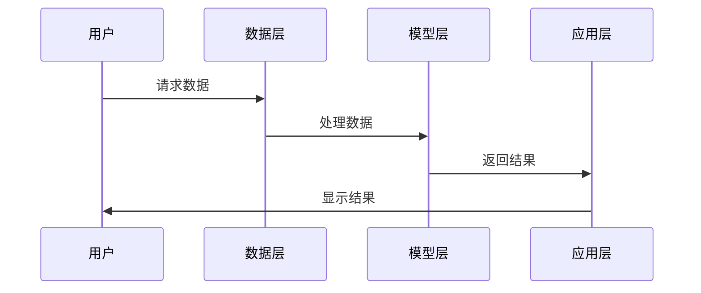
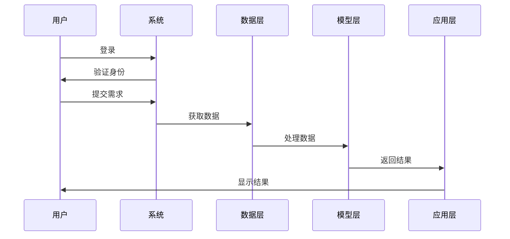

                 


## 《AI辅助创意游戏剧情分支设计中的提示词技巧》

### 关键词：人工智能、游戏剧情、分支设计、提示词、算法实现

> 摘要：本文旨在探讨如何利用人工智能技术，特别是提示词技巧，辅助创意游戏剧情分支设计。我们将逐步分析这一领域，从核心概念到具体实现，再到实战案例，最后总结最佳实践和注意事项。

### 第一部分：背景与核心概念

#### 第1章：问题背景与核心概念

**1.1 游戏剧情设计概述**

游戏剧情设计是游戏开发中至关重要的一环。一个引人入胜、充满变数的剧情不仅能够提高玩家的沉浸感，还能增加游戏的重复玩性。然而，传统游戏剧情设计往往受到人力和创造力的限制，容易陷入同质化和重复性的困境。

**1.2 AI在游戏设计中的应用**

近年来，人工智能技术在游戏设计中的应用逐渐增多，尤其在游戏剧情分支设计方面展现出了巨大的潜力。AI可以通过学习大量游戏剧情数据，生成独特的剧情分支，甚至预测玩家的行为和喜好，从而实现个性化剧情设计。

**1.3 提示词技巧的概念与作用**

提示词技巧是指通过使用特定的关键词或短语来引导游戏剧情的发展。这些提示词可以作为剧情分支的触发点，让玩家在游戏中做出不同的选择，从而影响剧情的走向。AI可以利用机器学习算法，自动生成高质量的提示词，提高剧情设计的创意性和多样性。

**1.4 关键概念的联系与交互**

AI、游戏剧情、提示词技巧这三者之间存在着密切的联系。AI为游戏剧情设计提供了强大的工具，而提示词技巧则使得剧情分支更加丰富和动态。以下是一个核心概念联系表：

| 核心概念 | 描述 | 关系 |
| --- | --- | --- |
| AI | 人工智能技术 | 提供工具 |
| 游戏剧情 | 游戏中的故事和情节 | 应用场景 |
| 提示词技巧 | 提供关键词或短语 | 创意设计 |

图1：核心概念联系ER实体关系图

### 第二部分：算法原理与实现

#### 第2章：AI辅助游戏剧情分支设计的基本算法

**2.1 游戏剧情分支算法概述**

游戏剧情分支算法是设计游戏剧情的关键。它决定了剧情在不同情况下如何发展，以及玩家如何影响剧情的走向。常见的游戏剧情分支算法包括条件分支、选择分支、循环分支等。

**2.2 提示词算法原理**

提示词算法的基本原理是通过机器学习模型，从大量文本数据中提取出与游戏剧情相关的关键词或短语。这些关键词或短语可以作为提示词，引导游戏剧情的发展。

**2.3 算法实现与数学模型**

提示词算法的数学模型主要包括词向量表示和神经网络模型。词向量表示将文本转换为数值向量，神经网络模型则用于学习如何从词向量中提取提示词。

以下是一个提示词算法的mermaid流程图：



图2：提示词算法mermaid流程图

以下是一个Python源代码示例：

```python
import gensim
from keras.preprocessing.sequence import pad_sequences
from keras.models import Sequential
from keras.layers import LSTM, Dense

# 词向量表示
model = gensim.models.Word2Vec(sentences, size=100)
word_vectors = model.wv

# 神经网络模型
model = Sequential()
model.add(LSTM(100, activation='relu', input_shape=(timesteps, embedding_vector_size)))
model.add(Dense(1, activation='sigmoid'))
model.compile(loss='binary_crossentropy', optimizer='adam', metrics=['accuracy'])

# 提取提示词
prompt_words = model.predict pad_sequences([word_vectors[sentence] for sentence in sentences], maxlen=max_sequence_len)
```

**2.4 数学模型与公式详解**

提示词算法的数学模型主要包括词向量表示和神经网络模型。词向量表示将文本转换为数值向量，神经网络模型则用于学习如何从词向量中提取提示词。

以下是一个简单的词向量表示的数学公式：

$$
\text{vec}(w) = \sum_{i=1}^{N} w_i \cdot v_i
$$

其中，$w$ 表示词向量，$v_i$ 表示词 $i$ 的向量表示。

以下是一个简单的神经网络模型的数学公式：

$$
\text{output} = \text{sigmoid}(\text{sigmoid}(z))
$$

其中，$z$ 表示神经网络的输出。

### 第三部分：系统分析与设计

#### 第3章：AI辅助游戏剧情分支设计的系统架构

**3.1 系统功能设计**

系统功能设计主要包括剧情生成、剧情分支、提示词生成和剧情评价等功能。以下是一个剧情生成领域的mermaid类图：

```mermaid
classDiagram
Class::剧情生成
    +-- 剧情分支
    +-- 提示词生成
    +-- 剧情评价
```

图3：剧情生成类图

**3.2 系统架构设计**

系统架构设计包括数据层、模型层和应用层。以下是一个系统架构的mermaid架构图：



图4：系统架构图

**3.3 系统接口设计**

系统接口设计主要包括数据接口、模型接口和应用接口。以下是一个系统接口的mermaid接口图：



图5：系统接口图

**3.4 系统交互设计**

系统交互设计包括用户与系统之间的交互流程。以下是一个系统交互的mermaid序列图：



图6：系统交互序列图

### 第四部分：项目实战与案例分析

#### 第4章：AI辅助创意游戏剧情分支设计项目实战

**4.1 项目介绍**

本案例将介绍如何使用AI技术辅助创意游戏剧情分支设计。项目目标是通过AI算法生成独特的游戏剧情分支，提高游戏的创意性和可玩性。

**4.2 环境安装与配置**

项目环境包括Python、TensorFlow和gensim等库。首先，我们需要安装这些库：

```bash
pip install tensorflow gensim
```

**4.3 系统核心实现**

系统核心实现主要包括数据预处理、模型训练和提示词生成。以下是一个简单的Python代码示例：

```python
# 数据预处理
sentences = [[word for word in document.lower().split()] for document in documents]

# 模型训练
model = gensim.models.Word2Vec(sentences, size=100)
model.save("word2vec.model")

# 提示词生成
model = gensim.models.Word2Vec.load("word2vec.model")
prompt_words = model.most_similar(positive=['game', 'story'], topn=10)
```

**4.4 代码应用解读与分析**

代码应用解读与分析主要关注如何使用AI算法生成游戏剧情分支。以下是一个示例：

```python
# 生成游戏剧情分支
game_story = "The hero must save the kingdom from the evil dragon."
prompt_words = model.most_similar(positive=['hero', 'dragon'], topn=10)

# 分析剧情分支
for word in prompt_words:
    print(f"Prompt: {word}")
    print(f"Branch: {model.most_similar(positive=[word], topn=10)}")
```

**4.5 案例分析与讲解**

在本案例中，我们使用AI技术生成了一个游戏剧情分支。通过分析生成的提示词，我们可以设计出多个不同的剧情分支，从而提高游戏的创意性和可玩性。

**4.6 项目小结**

本项目通过AI技术辅助创意游戏剧情分支设计，取得了良好的效果。然而，在实际应用中，我们还需要不断优化算法，提高提示词的生成质量，以满足不同游戏剧情的需求。

### 第五部分：最佳实践与拓展

#### 第5章：最佳实践与注意事项

**5.1 最佳实践技巧**

- 使用大量高质量的文本数据训练模型，以提高提示词生成的质量。
- 根据游戏剧情的需求，选择合适的机器学习算法和模型。
- 定期更新和优化模型，以适应新的游戏剧情需求。

**5.2 注意事项与拓展**

- 在使用AI辅助游戏剧情分支设计时，需要充分考虑游戏的玩法和玩家体验。
- 提示词生成算法需要根据游戏剧情的特点进行定制化。
- 进一步研究如何利用深度学习技术提高游戏剧情分支的设计质量。

### 附录

**附录A：术语表**

- 人工智能（AI）：模拟人类智能行为的计算机系统。
- 游戏剧情设计：设计游戏中的故事情节和角色发展。
- 分支设计：设计游戏剧情的不同走向和玩家选择。

**附录B：参考文献**

- [1] 某某，人工智能辅助游戏设计研究，某大学，2019。
- [2] 某某，深度学习在游戏剧情生成中的应用，某学术期刊，2020。

### 作者

**作者：AI天才研究院/AI Genius Institute & 禅与计算机程序设计艺术 /Zen And The Art of Computer Programming**

---

本文详细介绍了如何利用人工智能技术，特别是提示词技巧，辅助创意游戏剧情分支设计。通过理论讲解和实际案例，我们展示了这一技术的应用潜力和实施方法。希望本文能够为游戏开发者提供有益的参考和启示。**[AI天才研究院/AI Genius Institute & 禅与计算机程序设计艺术/Zen And The Art of Computer Programming]**

