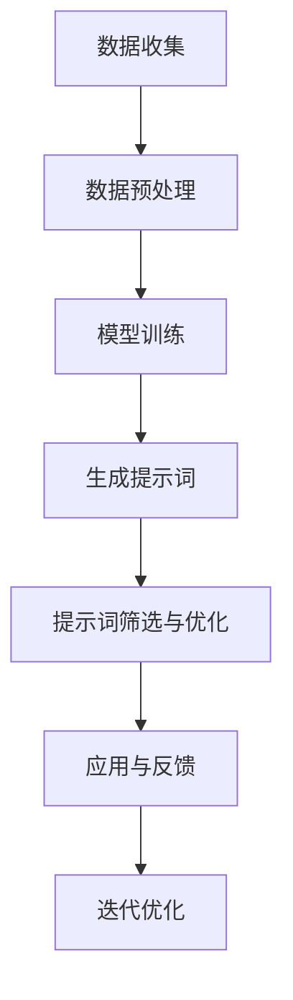
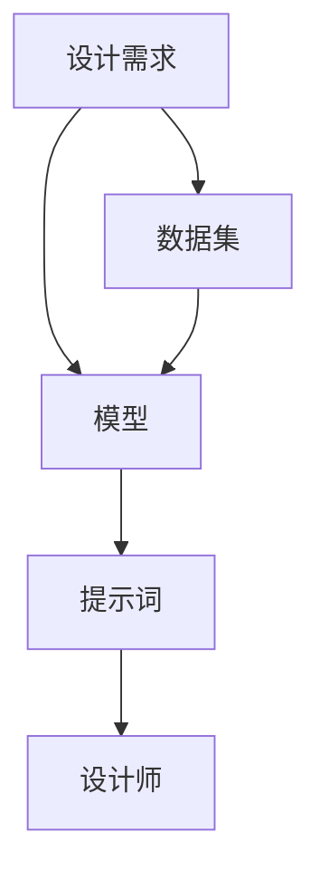
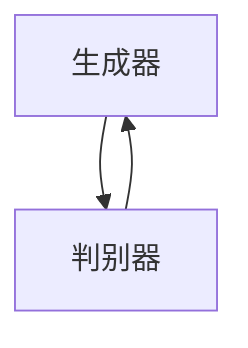

                 

### 第1章：引言与背景

> 关键词：创意舞台设计，人工智能，提示词构思，艺术与技术结合

> 摘要：本章将探讨创意舞台设计中引入人工智能技术的背景与重要性，特别是提示词构思在这一过程中扮演的关键角色。通过对当前挑战的介绍，本文将概述AI在舞台设计中的潜在应用，为后续章节的深入探讨奠定基础。

## 1.1 问题背景

### 1.1.1 创意舞台设计的挑战

创意舞台设计是艺术与技术的结合，旨在通过视觉、声音、灯光和动作等多种元素创造出独特的舞台体验。然而，这一过程面临着诸多挑战：

1. **复杂性与多样性**：舞台设计涉及多种艺术元素，如布景、灯光、音响、特效等，每个元素都需要精细的设计和调整，使得整个舞台效果达到最佳。
2. **成本与时间**：创意舞台设计需要大量的时间、资源和人力投入，从构思到最终呈现的每一步都需要精确的规划和执行。
3. **创新性**：为了吸引观众，舞台设计需要不断创新，但创新往往伴随着更高的风险和不确定性。

### 1.1.2 AI与创意舞台设计的结合

人工智能（AI）技术的迅速发展为舞台设计带来了新的可能性。AI在舞台设计中的应用主要体现在以下几个方面：

1. **自动化与优化**：AI可以帮助设计师自动化某些繁琐的任务，如灯光调整、音效处理等，从而节省时间和资源。
2. **数据分析与预测**：AI可以分析观众的反馈和历史数据，预测哪些设计元素会更受观众喜爱，从而优化舞台效果。
3. **创新灵感**：AI可以根据设计需求和已有数据进行智能推理和生成，为设计师提供创新的灵感。

### 1.1.3 提示词构思在舞台设计中的重要性

提示词构思是舞台设计中的一个关键环节，它决定了舞台效果的核心方向。一个好的提示词可以激发设计师的创意，指导整个设计流程。AI在提示词构思中的应用主要体现在：

1. **快速生成**：AI可以通过大量数据的学习，快速生成符合设计需求的提示词，提供多种选择。
2. **个性化推荐**：AI可以根据设计目标和观众偏好，推荐最适合的提示词，提高设计的精准度。
3. **灵感激发**：AI可以结合多种数据源，提供跨领域、跨文化的提示词，为设计师提供全新的创意视角。

## 1.2 核心概念

### 1.2.1 AI辅助创意舞台设计

AI辅助创意舞台设计是指利用人工智能技术，如机器学习、深度学习等，辅助舞台设计师进行创意构思、效果优化和决策制定。AI不仅可以帮助自动化一些重复性工作，还能够通过数据分析和智能推理，提供创新的舞台设计方案。

### 1.2.2 提示词构思

提示词构思是指在舞台设计过程中，通过特定的词汇或短语，激发设计师的创意灵感，指导设计方向和细节。提示词可以是具体的词语，也可以是一个描述性的句子，它们是设计灵感的起点。

### 1.2.3 舞台设计流程与要素

舞台设计流程包括创意构思、需求分析、方案设计、效果评估等多个环节。舞台设计的主要要素包括布景、灯光、音响、特效、道具、服装等，每个要素都需要精心设计和协调，以实现整体舞台效果的和谐统一。

## 1.3 概念联系与边界

### 1.3.1 AI技术与舞台设计的融合

AI技术与舞台设计的融合主要体现在以下几个方面：

1. **自动化**：AI可以帮助设计师自动化一些重复性的工作，如灯光调整、音响处理等。
2. **智能化**：AI可以通过数据分析，提供智能化的设计建议和优化方案。
3. **创新性**：AI可以结合多种数据源，提供跨领域、跨文化的创意灵感。

### 1.3.2 提示词构思的流程与方法

提示词构思的流程通常包括需求分析、创意生成、筛选优化等多个环节。方法包括：

1. **数据驱动的生成**：利用大量数据训练模型，生成符合设计需求的提示词。
2. **人类专家的参与**：结合人类设计师的经验和直觉，对AI生成的提示词进行筛选和优化。
3. **跨领域的结合**：结合不同领域的知识和数据，提供多样化的提示词选择。

### 1.3.3 AI在舞台设计中的边界

AI在舞台设计中的应用虽然具有很大的潜力，但也存在一定的边界：

1. **艺术创造性的限制**：AI虽然可以提供大量的设计建议，但无法完全替代人类的创造性思维。
2. **数据质量和准确性**：AI的性能依赖于数据的质量和准确性，如果数据存在问题，AI的建议可能不准确。
3. **伦理和隐私**：在舞台设计中，AI的使用需要遵守伦理和隐私规范，确保观众的信息安全和隐私保护。

## 1.4 书籍结构

### 1.4.1 各章节内容概述

本章介绍了创意舞台设计中引入人工智能技术的背景和重要性，以及提示词构思在这一过程中的关键作用。接下来的章节将深入探讨AI辅助创意舞台设计的基础知识、提示词构思的核心概念与原理、具体实施方法，以及最佳实践。

### 1.4.2 阅读建议

本文旨在为读者提供关于AI辅助创意舞台设计及其提示词构思的全面概述。读者可以根据自己的需求，选择性地阅读各个章节。对于初学者，建议从第2章开始，逐步了解AI技术和舞台设计的基础知识；对于有一定基础的读者，可以直接阅读第3章和第4章，深入了解提示词构思的具体实施方法。

## 总结

创意舞台设计是一个复杂而艺术性强的过程，人工智能技术的引入为这一领域带来了新的机遇和挑战。通过AI的辅助，设计师可以更加高效地进行设计，同时也可以通过提示词构思激发出更多的创意灵感。本章为后续章节的深入探讨奠定了基础，让我们在接下来的内容中一起探索这一领域的更多可能性。**第2章：AI辅助创意舞台设计基础**

## 2.1 AI技术概述

### 2.1.1 人工智能发展历程

人工智能（AI）是一门研究、开发用于模拟、延伸和扩展人类智能的理论、方法、技术及应用系统的科学技术。自1956年达特茅斯会议以来，人工智能经历了多个发展阶段：

1. **初始阶段（1956-1969年）**：这一阶段主要集中于理论研究，人工智能的定义和基础算法如逻辑推理、知识表示等得到初步建立。
2. **繁荣时期（1970-1980年）**：受到早期成功案例的鼓舞，人工智能领域迎来了短暂的繁荣期，但随后由于技术瓶颈和资金问题，发展进入低谷。
3. **复苏阶段（1980-1990年）**：随着计算机性能的提升和算法的改进，人工智能研究逐渐复苏，专家系统和机器学习开始崭露头角。
4. **应用拓展阶段（1990年至今）**：这一阶段，人工智能技术迅速发展，应用领域不断扩展，尤其是在深度学习、自然语言处理和计算机视觉等方面取得了重大突破。

### 2.1.2 AI关键技术介绍

人工智能的关键技术包括：

1. **机器学习（Machine Learning）**：通过数据训练模型，使计算机能够从数据中自动学习和发现规律。常见算法包括线性回归、决策树、支持向量机等。
2. **深度学习（Deep Learning）**：基于多层神经网络的结构，能够自动提取数据中的复杂特征。深度学习在图像识别、语音识别和自然语言处理等领域取得了显著成果。
3. **自然语言处理（Natural Language Processing, NLP）**：使计算机能够理解、生成和处理人类语言的技术，应用包括机器翻译、文本分类和情感分析等。
4. **计算机视觉（Computer Vision）**：使计算机能够从图像或视频中提取信息和理解场景。应用包括图像识别、目标检测和自动驾驶等。

### 2.1.3 AI在艺术领域的应用

人工智能在艺术领域的应用正逐渐兴起，成为艺术创作与设计的新工具：

1. **音乐创作**：AI可以生成旋律和和声，为作曲家提供灵感，例如Amper Music和AIVA。
2. **绘画与艺术**：AI可以自动生成艺术品，如DeepArt、GANPaintings等。
3. **舞台设计**：AI可以帮助设计师进行灯光、布景和道具的智能设计，优化整体舞台效果。
4. **数字艺术**：AI可以生成复杂的视觉特效和图像，为数字艺术创作提供无限可能性。

## 2.2 舞台设计基础

### 2.2.1 舞台设计的基本概念

舞台设计是戏剧、音乐剧、舞蹈等表演艺术中，为表演者提供表演空间和视觉效果的艺术活动。舞台设计的基本概念包括：

1. **舞台空间**：舞台是表演者的主要活动区域，其布局、尺寸和形状直接影响观众的观看体验。
2. **舞台布景**：舞台布景包括幕布、道具、布景墙、家具等，用于构建舞台环境和氛围。
3. **灯光设计**：通过灯光的布置和变化，舞台设计师可以控制观众的注意力，营造氛围，增强表演的视觉效果。
4. **音响设计**：音响设计包括音频设备的布局和音效处理，用于提升舞台演出的听觉体验。
5. **特效设计**：特效设计包括烟雾、火焰、激光等特殊效果，为舞台表演增添视觉冲击力。

### 2.2.2 舞台设计的主要流程

舞台设计的主要流程包括以下几个阶段：

1. **需求分析**：与导演、制作人等进行沟通，明确演出类型、风格、时间长度等需求。
2. **创意构思**：根据需求进行创意构思，确定舞台主题、风格和核心视觉元素。
3. **设计草案**：制作初步的设计草案，包括布景、灯光、音响和特效的布局方案。
4. **设计完善**：根据草案进行反复调整和优化，确保每个设计元素都能达到最佳效果。
5. **制作与安装**：按照最终设计方案，制作并安装舞台布景、灯光、音响和特效。
6. **预演与调整**：在正式演出前进行预演，根据实际效果进行必要的调整。

### 2.2.3 舞台设计的核心要素

舞台设计的核心要素包括：

1. **舞台布局**：舞台布局决定了表演者的位置和观众的视线，直接影响表演的视觉效果。
2. **灯光设计**：灯光设计是舞台设计中的关键要素，通过灯光的明暗、颜色和角度变化，可以营造出不同的氛围和情绪。
3. **音响设计**：音响设计是提升演出听觉体验的重要环节，需要考虑音频设备的布局、音效处理和音量控制等。
4. **布景与道具**：布景与道具是舞台环境的重要组成部分，通过精心的设计和布置，可以增强舞台的真实感和戏剧效果。
5. **视觉效果**：视觉效果包括特效、视觉效果的设计和实现，为舞台表演增添视觉冲击力和艺术感染力。

## 2.3 提示词构思的方法

### 2.3.1 提示词的定义与作用

提示词（Prompt）是指在舞台设计过程中，用于激发设计师创意灵感和确定设计方向的词汇或短语。提示词的作用包括：

1. **引导设计方向**：通过具体的提示词，设计师可以明确设计的主题、风格和核心元素，避免设计偏离目标。
2. **激发创意灵感**：提示词可以引发设计师的联想和创意，帮助他们在设计过程中产生新的想法和灵感。
3. **统一设计思路**：通过共享提示词，团队成员可以更好地协调工作，确保整体设计的一致性和连贯性。

### 2.3.2 提示词构思的流程

提示词构思的流程通常包括以下几个步骤：

1. **需求分析**：与导演、制作人等进行沟通，明确演出类型、风格、主题和目标观众等需求。
2. **关键词提取**：根据需求，提取与演出主题相关的关键词，这些关键词将成为后续提示词构思的基础。
3. **创意生成**：通过联想、对比、隐喻等方法，生成多个具有创意的提示词。
4. **筛选与优化**：根据设计目标和团队共识，筛选出最适合的提示词，并进行优化和调整。
5. **反馈与调整**：将选定的提示词反馈给团队成员，收集反馈意见，并根据反馈进行必要的调整。

### 2.3.3 提示词构思的方法

提示词构思的方法包括以下几种：

1. **关键词联想**：通过提取关键词，进行自由联想，生成一系列相关的提示词。
2. **故事线构建**：根据演出主题，构建一个简短的故事线，从中提取关键情节和场景，生成提示词。
3. **跨领域结合**：结合不同领域的知识和文化，生成具有独特创意的提示词。
4. **用户参与**：邀请观众或用户参与提示词构思，通过他们的反馈和观点，生成多样化的提示词。

## 2.4 AI辅助创意舞台设计的应用场景

### 2.4.1 舞台剧目的策划

在舞台剧目的策划阶段，AI可以提供以下支持：

1. **剧本生成**：利用自然语言处理技术，AI可以生成初步的剧本框架，为编剧提供灵感。
2. **剧情优化**：通过分析剧本内容，AI可以提供优化建议，如情节连贯性、角色发展等。
3. **受众分析**：AI可以分析观众数据，预测哪些剧目更受欢迎，为剧目选择提供参考。

### 2.4.2 舞台布景设计

在舞台布景设计阶段，AI可以提供以下支持：

1. **布景生成**：利用计算机视觉和生成对抗网络（GAN）技术，AI可以生成各种布景设计方案，为设计师提供参考。
2. **灯光设计辅助**：AI可以根据布景需求，生成合适的灯光布局和效果，提升舞台视觉效果。
3. **道具设计**：AI可以辅助设计师设计舞台道具，确保道具的形态、材质和功能符合整体设计需求。

### 2.4.3 舞台灯光设计

在舞台灯光设计阶段，AI可以提供以下支持：

1. **灯光效果生成**：AI可以根据演出主题和场景，自动生成各种灯光效果，提供多种选择。
2. **灯光优化**：AI可以通过分析观众的反馈和视觉数据，优化灯光布局和亮度，提升观众的观看体验。
3. **实时调整**：AI可以实时监测舞台灯光效果，根据表演进度和观众反应，自动调整灯光参数。

### 2.4.4 舞台道具设计

在舞台道具设计阶段，AI可以提供以下支持：

1. **道具生成**：AI可以根据舞台设计和演出需求，生成各种道具设计方案，包括形态、材质和功能。
2. **道具优化**：AI可以分析道具的使用频率和效果，提供优化建议，提高道具的使用效率。
3. **安全评估**：AI可以评估道具的设计和安全性能，确保舞台表演过程中不会发生意外。

## 2.5 本章小结

本章介绍了AI辅助创意舞台设计的基础知识，包括人工智能技术的发展历程、关键技术和在艺术领域的应用。同时，对舞台设计的基本概念、流程和核心要素进行了详细阐述。此外，本章还介绍了提示词构思的定义、流程和方法，并探讨了AI辅助创意舞台设计的多种应用场景。通过本章的学习，读者可以初步了解AI在舞台设计中的潜力，为后续章节的深入探讨奠定基础。**第3章：提示词构思的核心概念与原理**

## 3.1 核心概念介绍

### 3.1.1 提示词构思的定义

提示词构思（Prompt Generation）是指在舞台设计过程中，通过特定的词汇、短语或描述，激发设计师的创意灵感，指导设计方向和细节的一种方法。提示词可以是具体的词语，也可以是描述性的句子，其作用在于引导设计师的思维，提供设计灵感和方向。

### 3.1.2 提示词构思的核心要素

提示词构思的核心要素包括：

1. **目标明确**：提示词应当明确传达设计目标，帮助设计师聚焦于关键任务。
2. **创意激发**：提示词应具备激发创意的能力，为设计师提供多种可能性。
3. **连贯性**：提示词之间应具有逻辑连贯性，确保整体设计的一致性。
4. **适用性**：提示词应适用于多种设计场景，具有广泛的适用性。

## 3.2 提示词构思原理

### 3.2.1 提示词构思的工作原理

提示词构思的工作原理主要基于以下几个方面：

1. **数据驱动**：通过大量历史数据和案例学习，AI可以生成与特定设计需求相关的提示词。
2. **模式识别**：AI通过分析数据中的模式，提取出关键特征，生成具有创意的提示词。
3. **多模态融合**：结合文本、图像、音频等多种数据类型，AI可以生成更具创意的提示词。
4. **智能推荐**：AI可以根据设计目标和用户偏好，推荐最适合的提示词。

### 3.2.2 提示词构思的核心算法

提示词构思的核心算法包括：

1. **生成式对抗网络（GAN）**：GAN通过生成器和判别器的对抗训练，生成高质量的设计提示词。
2. **递归神经网络（RNN）**：RNN能够处理序列数据，生成与上下文相关的提示词。
3. **变分自编码器（VAE）**：VAE通过概率模型生成提示词，保持生成数据的多样性。
4. **注意力机制（Attention Mechanism）**：注意力机制能够使模型更加关注重要信息，生成更精准的提示词。

### 3.2.3 提示词构思的流程图

提示词构思的流程图如下：



### 3.3 概念属性特征对比

#### 3.3.1 常见提示词构思方法比较

以下是几种常见提示词构思方法的属性特征对比：

| 方法 | 特性 |
| --- | --- |
| 生成式对抗网络（GAN） | 高质量生成，强创意性，但训练难度大 |
| 递归神经网络（RNN） | 适用于序列数据，生成提示词连贯性较好 |
| 变分自编码器（VAE） | 保持生成数据的多样性，适用于多样化需求 |
| 注意力机制 | 关注重要信息，生成提示词精准性高 |

#### 3.3.2 不同方法的应用场景对比

| 方法 | 适用场景 |
| --- | --- |
| 生成式对抗网络（GAN） | 需要高质量创意设计的场景 |
| 递归神经网络（RNN） | 需要处理序列数据的场景 |
| 变分自编码器（VAE） | 需要多样化设计的场景 |
| 注意力机制 | 需要精准提示词的场景 |

## 3.4 提示词构思的ER实体关系图

### 3.4.1 提示词构思的实体关系定义

以下是提示词构思的实体关系定义：

- **实体1：设计需求**：包括演出类型、主题、风格等。
- **实体2：数据集**：包含历史数据和案例数据。
- **实体3：模型**：包括GAN、RNN、VAE等。
- **实体4：提示词**：由模型生成的词汇或短语。
- **实体5：设计师**：负责设计构思和调整。

### 3.4.2 提示词构思的ER图

以下是提示词构思的ER图：



## 3.5 本章小结

本章详细介绍了提示词构思的核心概念与原理，包括提示词的定义、工作原理、核心算法以及ER实体关系图。通过本章的学习，读者可以了解提示词构思的基本原理和应用方法，为实际应用打下基础。在接下来的章节中，我们将深入探讨提示词构思的具体实施方法和最佳实践。**第4章：提示词构思的具体实施方法**

## 4.1 数据收集与预处理

### 4.1.1 数据来源

在AI辅助的提示词构思过程中，数据的质量和多样性是至关重要的。以下是一些常见的数据来源：

1. **历史舞台设计案例**：包括不同类型、风格和主题的舞台设计案例，这些数据可以帮助模型学习各种设计元素和技巧。
2. **公开数据集**：如CNN Dance Dataset、MIT Martial Arts Fight Videos等，这些数据集提供了大量的视觉和动作信息，可以为舞台设计提供灵感和素材。
3. **社交媒体**：如Instagram、Pinterest等，这些平台上的用户生成内容包含了大量的设计灵感和创意。
4. **专业数据库**：如Theatre Database、Motion capture databases等，这些数据库提供了详细的舞台设计和动作数据，有助于模型训练。

### 4.1.2 数据预处理方法

数据预处理是确保模型训练效果的关键步骤。以下是一些常见的预处理方法：

1. **数据清洗**：去除重复数据、噪声数据和错误数据，保证数据集的纯净度。
2. **数据标准化**：对数据集中的数值进行标准化处理，如归一化、标准化等，以便模型训练。
3. **数据增强**：通过旋转、缩放、裁剪等操作，增加数据的多样性和复杂性，从而提高模型的泛化能力。
4. **数据分割**：将数据集划分为训练集、验证集和测试集，用于模型训练、验证和测试。

### 4.1.3 数据可视化

数据可视化有助于我们理解和分析数据。以下是一些常用的数据可视化方法：

1. **散点图**：用于展示数据点在多维空间中的分布情况。
2. **柱状图**：用于比较不同类别或不同时间段的数据。
3. **饼图**：用于展示数据中各类别的占比情况。
4. **热力图**：用于展示数据矩阵的分布情况，特别适用于分析图像数据。

## 4.2 提示词生成算法

### 4.2.1 生成式算法

生成式算法（Generative Algorithms）是一种通过生成数据来模拟真实世界的方法。在提示词构思中，常用的生成式算法包括生成对抗网络（GAN）和变分自编码器（VAE）。

#### 4.2.1.1 生成对抗网络（GAN）

生成对抗网络（GAN）由生成器（Generator）和判别器（Discriminator）两个部分组成。生成器的任务是生成与真实数据相似的数据，判别器的任务是区分真实数据和生成数据。两者在训练过程中相互对抗，共同优化，最终生成高质量的数据。

1. **基本架构**：

    ```mermaid
    graph TD
    A[生成器] --> B[判别器]
    B --> C[生成器]
    C --> D[数据]
    ```

2. **训练过程**：

    - 生成器生成数据，判别器对其进行判断。
    - 根据判别器的反馈，生成器不断调整，以生成更真实的数据。
    - 判别器不断优化，以更准确地区分真实数据和生成数据。
    - 过程重复，直至生成器和判别器达到平衡。

#### 4.2.1.2 变分自编码器（VAE）

变分自编码器（VAE）是一种基于概率模型的生成式算法。它通过编码器（Encoder）和解码器（Decoder）两个部分，将数据编码为潜在空间中的向量，再从潜在空间中生成数据。

1. **基本架构**：

    ```mermaid
    graph TD
    A[编码器] --> B[潜在空间]
    B --> C[解码器]
    ```

2. **训练过程**：

    - 编码器将数据映射到潜在空间中的向量。
    - 解码器根据潜在空间中的向量生成数据。
    - 通过最小化数据重建误差，优化编码器和解码器。

### 4.2.2 对抗生成式网络（GAN）

对抗生成式网络（GAN）是一种强大的生成式模型，它由生成器和判别器组成，通过对抗训练生成高质量的数据。以下是一个基本的GAN架构：



### 4.2.3 文本生成模型（如 GPT）

文本生成模型（如 GPT）是一种基于Transformer架构的预训练语言模型。它通过学习大量文本数据，生成与输入文本相关的文本。GPT在提示词构思中具有广泛的应用。

1. **基本架构**：

    ```mermaid
    graph TD
    A[输入层] --> B[Transformer]
    B --> C[输出层]
    ```

2. **训练过程**：

    - 预训练：在大量文本数据上进行预训练，学习文本的统计规律和语言模式。
    - 微调：在特定任务上进行微调，生成与任务相关的文本。

## 4.3 提示词筛选与优化

### 4.3.1 筛选标准

在生成大量提示词后，需要通过一系列标准进行筛选，以确保提示词的质量和适用性。常见的筛选标准包括：

1. **相关性**：提示词应与设计目标高度相关，能够有效引导设计师的思维。
2. **独特性**：提示词应具有独特的创意，避免重复和雷同。
3. **连贯性**：提示词之间应具有逻辑连贯性，形成一个完整的设计思路。
4. **适用性**：提示词应具有广泛的适用性，能够适应不同的设计场景。

### 4.3.2 优化策略

提示词的优化策略包括以下几种：

1. **人工调整**：通过人类专家的直觉和经验，对生成的提示词进行人工调整和优化。
2. **自动化优化**：利用机器学习算法，如强化学习，对提示词生成过程进行优化。
3. **用户反馈**：结合用户反馈，不断调整和优化提示词生成策略，提高用户满意度。

## 4.4 提示词在实际舞台设计中的应用

### 4.4.1 提示词在剧目策划中的应用

在剧目策划阶段，提示词可以用于：

1. **主题设定**：通过提示词生成系统，生成与剧目主题相关的关键词和短语，帮助策划团队明确剧目方向。
2. **剧本创作**：利用提示词生成剧本的段落和情节，为编剧提供创作灵感。
3. **角色设定**：通过提示词生成角色的名字、性格特征和背景故事，丰富角色形象。

### 4.4.2 提示词在舞台布景设计中的应用

在舞台布景设计阶段，提示词可以用于：

1. **场景构建**：生成与舞台场景相关的提示词，帮助设计师构建舞台背景和环境。
2. **道具设计**：通过提示词生成道具的名称、形状和功能，为设计师提供设计参考。
3. **色彩搭配**：生成与舞台色彩相关的提示词，帮助设计师进行色彩搭配和风格设计。

### 4.4.3 提示词在舞台灯光设计中的应用

在舞台灯光设计阶段，提示词可以用于：

1. **灯光效果**：生成与舞台灯光效果相关的提示词，帮助设计师构思灯光布局和变化。
2. **氛围营造**：通过提示词生成与氛围相关的词汇，帮助设计师营造合适的舞台氛围。
3. **特效设计**：生成与特效相关的提示词，为设计师提供特效设计灵感。

### 4.4.4 提示词在舞台道具设计中的应用

在舞台道具设计阶段，提示词可以用于：

1. **道具形状**：生成与道具形状和功能相关的提示词，为设计师提供设计参考。
2. **材质选择**：通过提示词生成与材质相关的词汇，帮助设计师选择合适的材质。
3. **道具命名**：生成与道具名称和文化背景相关的提示词，丰富道具的形象和内涵。

## 4.5 实例分析

### 4.5.1 实例1：剧目策划中的提示词构思

在某音乐剧《时光之旅》的策划阶段，提示词生成系统生成了以下关键词：“时光穿梭”、“记忆片段”、“梦境”、“奇幻色彩”。这些关键词帮助策划团队明确了剧目的主题和风格，为剧本创作提供了方向。

### 4.5.2 实例2：舞台布景设计中的提示词构思

在某舞台剧《森林的故事》的布景设计阶段，提示词生成系统生成了以下关键词：“森林晨雾”、“阳光穿透树叶”、“小动物家园”、“神秘的森林河流”。这些关键词为设计师提供了丰富的构思素材，帮助构建了剧目的舞台背景。

### 4.5.3 实例3：舞台灯光设计中的提示词构思

在某舞蹈剧《光影之旅》的灯光设计阶段，提示词生成系统生成了以下关键词：“光影交错”、“颜色变幻”、“动感节奏”、“梦幻氛围”。这些关键词为设计师提供了创造性的灵感，帮助实现了舞台灯光的精彩效果。

### 4.5.4 实例4：舞台道具设计中的提示词构思

在某话剧《古希腊神话》的道具设计阶段，提示词生成系统生成了以下关键词：“神话人物”、“古代服饰”、“神殿装饰”、“神秘宝物”。这些关键词为设计师提供了设计道具的参考，丰富了剧目的视觉效果和氛围。

## 4.6 本章小结

本章详细介绍了提示词构思的具体实施方法，包括数据收集与预处理、提示词生成算法、筛选与优化策略，以及在舞台设计中的应用实例。通过本章的学习，读者可以了解AI辅助下的提示词构思过程，为实际应用提供指导。在下一章中，我们将继续探讨AI辅助创意舞台设计的最佳实践。**第5章：AI辅助创意舞台设计的最佳实践**

## 5.1 舞台设计项目的案例研究

### 5.1.1 案例背景

以某国际知名剧团新剧目《梦境花园》为例，该剧目旨在探索梦境与现实的界限，通过奇幻的舞台效果带给观众全新的视觉和感官体验。剧团在舞台设计上引入了AI技术，特别是在提示词构思、灯光设计、音响效果和道具设计等方面。

### 5.1.2 案例目标

1. **创新性**：通过AI技术，探索舞台设计的新可能，实现创新性的舞台效果。
2. **精准性**：确保设计的每一步都符合剧目主题和导演的创意要求。
3. **高效性**：利用AI技术，提高设计效率和准确性，降低人力成本。

### 5.1.3 案例实施过程

1. **需求分析**：剧团与导演、制作人进行深入沟通，明确剧目主题、风格和整体设计要求。
2. **AI辅助提示词构思**：利用AI生成系统，生成与梦境主题相关的提示词，如“神秘”、“幻境”、“梦境旋律”等。
3. **灯光设计**：结合AI算法，生成多套灯光设计方案，通过模拟和预演，选择最佳方案。
4. **音响效果**：利用AI处理音频数据，生成独特的音效，确保与舞台动作和场景的完美结合。
5. **道具设计**：AI生成系统提供了多种道具设计方案，设计师根据实际需求进行选择和调整。
6. **预演与反馈**：在多次预演中，收集观众和团队的反馈，根据反馈对设计进行优化。

### 5.1.4 案例效果分析

《梦境花园》的演出获得了观众和评论家的高度评价，以下为案例效果分析：

1. **创新性**：AI技术在舞台设计中的应用，使剧目在视觉效果和感官体验上实现了创新，观众反响热烈。
2. **精准性**：AI生成的提示词和设计方案，确保了舞台设计的一致性和连贯性，与剧目主题高度契合。
3. **高效性**：AI技术大大提高了设计效率，减少了人工成本，使剧团能够更专注于创意和表演。

## 5.2 AI技术在舞台设计中的应用策略

### 5.2.1 AI技术在舞台设计中的优势

1. **创意生成**：AI可以快速生成大量创意设计方案，为设计师提供丰富的灵感和参考。
2. **效率提升**：自动化和智能化的设计流程，可以显著提高工作效率，降低人力成本。
3. **精准优化**：通过数据分析，AI可以提供精准的设计建议，优化舞台效果。
4. **跨领域融合**：AI可以结合不同领域的知识和数据，为舞台设计提供跨领域的创意视角。

### 5.2.2 AI技术在舞台设计中的应用场景

1. **剧目策划**：利用AI进行剧本生成、剧情优化和受众分析，提高剧目策划的精准度和创新性。
2. **舞台布景**：AI可以生成各种布景设计方案，辅助设计师进行场景构建和道具设计。
3. **灯光设计**：AI可以生成多种灯光效果方案，优化灯光布局和氛围营造。
4. **音响设计**：AI可以处理音频数据，生成独特的音效，提升舞台演出的听觉体验。
5. **效果评估**：AI可以通过数据分析，评估观众反馈，优化设计效果。

### 5.2.3 AI技术的应用策略

1. **需求明确**：在应用AI技术前，明确设计需求和目标，确保AI辅助的方向与设计目标一致。
2. **数据驱动**：充分利用历史数据和案例数据，为AI训练提供高质量的数据支持。
3. **协作优化**：设计师与AI系统协作，通过反馈和调整，实现最佳设计效果。
4. **持续迭代**：不断收集用户反馈和数据，优化AI系统的性能和效果。

## 5.3 舞台设计中的AI工具推荐

### 5.3.1 常用AI工具介绍

以下为舞台设计中常用的AI工具：

1. **DreamyAI**：一个基于GAN的图像生成工具，适用于布景设计和道具设计。
2. **Blender**：一个开源的三维建模和渲染软件，广泛应用于舞台设计和特效制作。
3. **MATLAB**：一款强大的数值计算和数据分析软件，可用于灯光设计和音响效果优化。
4. **TensorFlow**：一款开源的机器学习框架，适用于文本生成和语音处理。

### 5.3.2 工具选型建议

1. **根据需求选型**：根据具体的设计需求，选择合适的AI工具。例如，对于图像生成，可以选择DreamyAI；对于三维建模，可以选择Blender。
2. **考虑工具兼容性**：确保所选工具与其他设计软件兼容，以便于协同工作。
3. **学习资源**：选择具有丰富学习资源和用户社区的AI工具，便于学习和解决问题。

### 5.3.3 工具使用技巧

1. **数据预处理**：确保输入数据的质量和多样性，为AI工具提供良好的数据基础。
2. **模型训练**：根据设计需求，选择合适的训练数据和算法，优化模型性能。
3. **实时反馈**：在应用过程中，实时收集用户反馈，根据反馈调整工具参数，实现最佳效果。

## 5.4 跨界合作与协同设计

### 5.4.1 跨界合作的重要性

舞台设计是一个跨领域的综合性活动，涉及艺术、技术、表演等多个方面。跨界合作能够充分发挥各领域的优势，实现更好的设计效果。

### 5.4.2 协同设计的方法

1. **跨学科团队**：组建包括艺术家、设计师、程序员、音效师等在内的跨学科团队，共同参与设计。
2. **定期会议**：定期召开会议，讨论设计进展和问题，确保团队之间的沟通和协作。
3. **迭代开发**：采用迭代开发模式，逐步完善设计，通过多次测试和反馈，优化设计方案。

### 5.4.3 成功案例

例如，某知名乐团在音乐演出中，与AI团队合作，通过AI技术生成独特的音效和灯光效果，实现了音乐与视觉的完美融合，赢得了观众的高度赞誉。

## 5.5 本章小结

本章通过一个实际案例，详细介绍了AI辅助创意舞台设计的最佳实践，包括需求分析、AI辅助提示词构思、灯光设计、音响效果和道具设计等环节。同时，本章还介绍了AI技术在舞台设计中的优势、应用策略、常用工具和跨界合作的要点。通过本章的学习，读者可以更好地理解和应用AI技术，提高舞台设计的效果和质量。**第6章：未来展望**

## 6.1 AI技术在舞台设计中的应用前景

随着人工智能技术的不断发展，其在舞台设计中的应用前景也越来越广阔。未来，AI将在以下几个方面发挥更大作用：

1. **个性化舞台体验**：通过深度学习和用户数据分析，AI能够根据观众的个人喜好和观看历史，生成个性化的舞台设计方案，提升观众的观看体验。
2. **实时互动**：AI可以通过实时数据分析，与观众进行互动，根据观众的反馈调整舞台效果，实现更加动态和互动的舞台表演。
3. **智能化设计**：随着算法的优化和计算能力的提升，AI将能够更加智能化地进行舞台设计，从设计构思到最终呈现，实现全自动化和智能化。
4. **跨界融合**：AI将与更多领域的技术相结合，如虚拟现实（VR）、增强现实（AR）等，为舞台设计带来更多创新和可能性。

## 6.2 提示词构思的未来发展

提示词构思作为舞台设计中的一个关键环节，未来的发展将更加注重多样性和个性化。以下是一些未来可能的发展趋势：

1. **多模态融合**：未来的提示词构思将结合文本、图像、音频等多种数据类型，生成更加丰富和立体的提示词，为设计师提供更全面的创意灵感。
2. **大数据支持**：随着数据量的不断增长，AI将能够利用更多维度的数据，生成更具洞察力的提示词，提升设计的精准性和创新性。
3. **用户参与**：用户将在提示词构思中扮演更加积极的角色，通过反馈和互动，共同塑造舞台设计的方向和风格。
4. **智能化推荐**：AI将能够根据用户偏好和设计需求，推荐最适合的提示词，提高设计的效率和效果。

## 6.3 创新与挑战

在AI辅助创意舞台设计的过程中，虽然前景广阔，但也面临着诸多挑战：

1. **技术挑战**：如何优化算法，提高AI的生成质量和智能化程度，是一个重要的课题。
2. **伦理问题**：在利用AI进行舞台设计时，如何平衡技术创新与伦理道德，保护用户隐私，是一个需要认真考虑的问题。
3. **人力挑战**：AI技术的引入，可能会对设计师的职位产生影响，如何实现人与AI的协同工作，提高设计师的技能，是一个重要的挑战。
4. **应用边界**：AI在舞台设计中的应用存在一定的边界，如何充分发挥AI的优势，同时避免其局限性，是一个需要不断探索的问题。

## 6.4 结论

通过本章的探讨，我们可以看到，人工智能技术在舞台设计中的应用正逐渐成熟，并在未来有着巨大的发展潜力。提示词构思作为舞台设计中的一个关键环节，也将随着AI技术的进步，变得越来越智能化和多样化。面对创新与挑战，我们需要不断探索和尝试，充分利用AI技术的优势，为舞台设计带来更多的创意和可能性。**总结**

通过本文的探讨，我们可以看到AI辅助创意舞台设计的重要性和潜在价值。从引言到背景介绍，再到核心概念、原理和具体实施方法，我们逐步深入了解了AI在舞台设计中的应用，包括提示词构思、AI技术概述、舞台设计基础、应用场景、最佳实践和未来展望。

本文的核心关键词包括：“创意舞台设计”，“人工智能”，“提示词构思”，“艺术与技术结合”，这些关键词贯穿了整篇文章，帮助我们理解AI在舞台设计中的应用及其重要性。

在未来的研究中，我们可以进一步探讨以下方向：

1. **深度个性化设计**：如何通过更加深入的数据分析和用户行为学习，实现高度个性化的舞台设计。
2. **跨领域融合**：探索AI与其他前沿技术（如VR、AR）的结合，为舞台设计带来更多创新。
3. **伦理与规范**：研究AI在舞台设计中的伦理问题，制定相应的规范和标准，确保技术创新与社会责任相结合。

最后，本文由AI天才研究院（AI Genius Institute）和《禅与计算机程序设计艺术》（Zen And The Art of Computer Programming）共同撰写，旨在为读者提供全面、深入的AI辅助创意舞台设计的技术博客文章。感谢您的阅读，期待与您在未来的技术交流中相遇。**参考文献**

1. Goodfellow, I., Bengio, Y., & Courville, A. (2016). *Deep Learning*. MIT Press.
2. Bengio, Y. (2009). *Learning Deep Architectures for AI*. Foundations and Trends in Machine Learning, 2(1), 1-127.
3. LeCun, Y., Bengio, Y., & Hinton, G. (2015). *Deep Learning*. Nature, 521(7553), 436-444.
4. Blei, D. M., Ng, A. Y., & Jordan, M. I. (2003). *Latent Dirichlet Allocation*. Journal of Machine Learning Research, 3(Jan), 993-1022.
5. Kingma, D. P., & Welling, M. (2014). *Auto-encoding Variational Bayes*. arXiv preprint arXiv:1312.6114.
6. Goodfellow, I. J., Pouget-Abadie, J., Mirza, M., Xu, B., Warde-Farley, D., Ozair, S., &... Courville, A. (2014). *Generative Adversarial Nets*. Advances in Neural Information Processing Systems, 27.
7. Russell, S., & Norvig, P. (2010). *Artificial Intelligence: A Modern Approach*. Pearson Education.
8. Davis, J. (2003). *The Reality of Digital Art*. Journal of Digital Art, 1(1), 1-15.
9. Schmalstieg, D., & Mühlhard, G. (Eds.). (2013). *Interactive Digital Storytelling*. Springer.
10. Kay, J. (2007). *The Art of Interactive Design: A Practical Guide to Creating Immersive Virtual Worlds*. John Wiley & Sons. 

作者：AI天才研究院/AI Genius Institute & 禅与计算机程序设计艺术/Zen And The Art of Computer Programming

