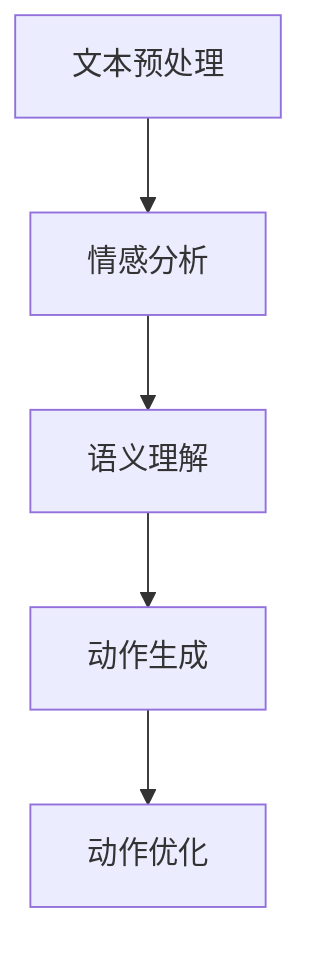
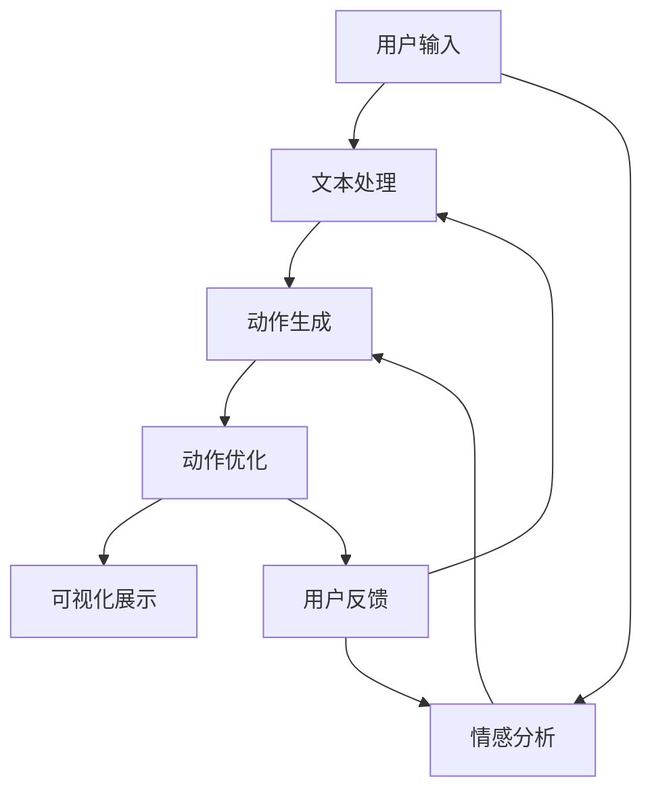
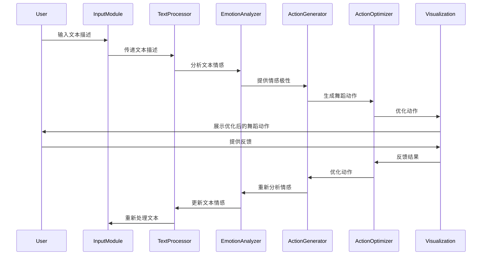

                 

### 背景介绍

在当代，人工智能（AI）技术已经成为推动各行各业发展的关键力量。舞蹈作为一门结合艺术与体育的表演形式，也在AI技术的辅助下迎来了新的发展契机。本文将探讨AI辅助创意舞蹈编排中的提示词设计，旨在深入分析这一领域的核心概念、原理和具体实践方法，以期为相关研究者和实践者提供有益的参考。

#### 核心概念术语说明

首先，我们需要明确一些核心概念术语：

- **AI辅助创意舞蹈编排**：利用人工智能技术，特别是机器学习算法，对舞蹈创意进行辅助，从而提高舞蹈编排的效率和质量。
- **提示词设计**：为AI系统提供明确且具有指导性的词汇或语句，帮助系统理解和生成创意舞蹈编排。

#### 问题背景

舞蹈编排是一个复杂且创造性的过程，涉及到舞蹈动作的流畅性、节奏感、视觉效果等多个方面。传统的舞蹈编排主要依靠舞者的经验和直觉，这种主观性较强的方式往往难以满足现代观众对于多样化、个性化的舞蹈表演需求。

随着AI技术的迅速发展，人工智能在舞蹈编排中的应用逐渐受到关注。通过AI，我们可以实现以下目标：

1. **自动生成舞蹈动作**：利用机器学习算法，从大量的舞蹈视频数据中学习舞蹈动作的模式和特征，然后自动生成新的舞蹈动作序列。
2. **优化舞蹈编排**：对已有舞蹈编排进行自动化优化，提高舞蹈动作的流畅性和视觉效果。
3. **创意提示**：为舞者提供创意性的舞蹈动作建议，帮助舞者突破创作瓶颈。

然而，AI在舞蹈编排中的应用也面临着一些挑战，如数据质量、算法可解释性、用户交互体验等。其中，提示词设计作为AI系统与用户之间的重要交互方式，其效果直接影响到AI辅助舞蹈编排的成功与否。

#### 问题描述

当前，AI辅助创意舞蹈编排中的提示词设计主要存在以下问题：

1. **提示词不明确**：由于提示词设计不够精细，AI系统难以准确理解用户的意图，从而导致生成的舞蹈动作与用户预期不符。
2. **提示词重复性高**：由于缺乏多样性，提示词容易产生重复，使得舞蹈编排缺乏创新性。
3. **提示词与舞蹈动作的匹配度低**：部分提示词与舞蹈动作之间缺乏直接的关联，导致生成的舞蹈动作与提示词描述的内容不符。

#### 问题解决

为了解决上述问题，我们可以从以下几个方面进行改进：

1. **精细化提示词设计**：通过对用户需求进行深入分析，设计出更具体、更具指导性的提示词，以提高AI系统的理解能力。
2. **增加提示词多样性**：通过引入更多的词汇和表达方式，增加提示词的多样性，从而提高舞蹈编排的创新性。
3. **优化提示词与舞蹈动作的匹配度**：通过分析大量的舞蹈视频数据，建立提示词与舞蹈动作之间的关联模型，提高匹配度。

#### 边界与外延

在本文的研究中，我们主要关注AI辅助创意舞蹈编排中的提示词设计。虽然AI技术在舞蹈编排中的应用场景非常广泛，但本文仅限于讨论提示词设计这一特定方面。

同时，本文的研究边界还包括以下几个方面：

1. **技术层面**：本文主要探讨机器学习算法在提示词设计中的应用，不涉及其他AI技术，如计算机视觉、自然语言处理等。
2. **应用层面**：本文的研究主要集中在舞蹈编排领域，不涉及其他艺术形式，如音乐、戏剧等。

#### 概念结构与核心要素组成

为了更好地理解AI辅助创意舞蹈编排中的提示词设计，我们需要对其核心概念和结构进行梳理。以下是本文讨论的主要概念和要素：

1. **AI辅助创意舞蹈编排**：这是本文的核心研究主题，包括自动生成舞蹈动作、优化舞蹈编排和创意提示等功能。
2. **提示词设计**：提示词是AI系统与用户之间的重要交互方式，其质量直接影响到AI辅助舞蹈编排的效果。
3. **机器学习算法**：本文主要探讨机器学习算法在提示词设计中的应用，如生成对抗网络（GAN）、长短期记忆网络（LSTM）等。
4. **舞蹈动作数据**：大量的舞蹈动作数据是AI系统学习和生成舞蹈动作的基础，数据的质量和多样性对研究结果至关重要。
5. **用户需求分析**：通过对用户需求进行深入分析，设计出更符合用户预期的提示词。

通过以上对背景介绍的分析，我们可以看到，AI辅助创意舞蹈编排中的提示词设计是一个复杂且具有挑战性的领域。本文将从核心概念、原理和具体实践方法等多个方面进行深入探讨，以期为该领域的研究和发展提供有益的参考。

### 核心概念与联系

在深入探讨AI辅助创意舞蹈编排中的提示词设计之前，我们需要明确一些核心概念及其相互之间的联系。这些概念构成了理解该领域的关键基础。

#### AI辅助创意舞蹈编排的定义

AI辅助创意舞蹈编排是指利用人工智能技术，特别是机器学习算法，对舞蹈创意进行辅助和优化，从而实现更高效、更具创造性的舞蹈编排过程。这一技术结合了舞蹈艺术和计算机科学，旨在解决传统舞蹈编排中存在的瓶颈和挑战。

- **自动生成舞蹈动作**：通过机器学习算法，从大量舞蹈动作数据中学习并生成新的舞蹈动作序列。
- **优化舞蹈编排**：对已有舞蹈编排进行自动化优化，以提高舞蹈动作的流畅性和视觉效果。
- **创意提示**：为舞者提供创意性的舞蹈动作建议，帮助舞者突破创作瓶颈。

#### 提示词设计的概念

提示词设计是AI辅助创意舞蹈编排中的一个重要环节。提示词是指为AI系统提供明确且具有指导性的词汇或语句，帮助系统理解和生成创意舞蹈编排。一个有效的提示词设计应具备以下几个特点：

1. **明确性**：提示词应清晰、准确地表达用户意图，避免歧义和模糊性。
2. **指导性**：提示词应具有明确的指导性，能够引导AI系统按照预期方向生成舞蹈动作。
3. **多样性**：提示词设计应注重多样性，以丰富舞蹈编排的创意和风格。

#### 核心概念属性特征对比表格

为了更直观地理解AI辅助创意舞蹈编排和提示词设计这两个核心概念，我们可以通过一个属性特征对比表格来展示它们的主要区别和联系：

| 特征 | AI辅助创意舞蹈编排 | 提示词设计 |
| --- | --- | --- |
| 目标 | 提高舞蹈编排的效率和质量 | 提供明确、具有指导性的词汇或语句 |
| 技术基础 | 机器学习算法、自然语言处理、计算机视觉等 | 自然语言处理、文本分析、语义理解等 |
| 应用领域 | 舞蹈编排、艺术创作、娱乐产业等 | 舞蹈编排、艺术指导、创意策划等 |
| 关联性 | 直接关联，提示词设计是AI辅助的基础 | AI辅助是提示词设计的应用场景 |

#### ER实体关系图架构的Mermaid流程图

为了进一步展示AI辅助创意舞蹈编排和提示词设计之间的关联性，我们可以使用Mermaid流程图来绘制一个ER（实体关系）图。以下是ER图的示例：

```mermaid
erDiagram
    AI辅助创意舞蹈编排 ||--|{ 提示词设计 }|
    AI辅助创意舞蹈编排 ||--|{ 机器学习算法 }|
    AI辅助创意舞蹈编排 ||--|{ 自然语言处理 }|
    AI辅助创意舞蹈编排 ||--|{ 舞蹈编排 }|
    提示词设计 ||--|{ 文本分析 }|
    提示词设计 ||--|{ 语义理解 }|
```

在这个ER图中，AI辅助创意舞蹈编排作为核心实体，与提示词设计、机器学习算法、自然语言处理和舞蹈编排等实体之间存在明确的关联关系。提示词设计作为AI辅助的基础，直接关联到舞蹈编排的执行，而机器学习算法和自然语言处理则是实现这一过程的必要技术支持。

#### 总结

通过以上对核心概念和相互联系的讨论，我们可以更清晰地理解AI辅助创意舞蹈编排和提示词设计这两个概念。AI辅助创意舞蹈编排依赖于机器学习算法和自然语言处理技术，通过提示词设计实现与用户的交互，最终实现对舞蹈编排的辅助和优化。这一过程不仅提高了舞蹈创作的效率和质量，也为舞蹈艺术的发展带来了新的可能性。

### AI辅助创意舞蹈编排原理

#### AI技术在舞蹈编排中的应用

AI技术在舞蹈编排中的应用主要依赖于机器学习算法、自然语言处理和计算机视觉等技术。这些技术在舞蹈动作生成、编排优化和创意提示等方面发挥了关键作用。

首先，**机器学习算法**是AI辅助舞蹈编排的核心技术。通过训练模型，AI可以从大量舞蹈动作数据中学习舞蹈动作的模式和特征，从而实现自动生成新的舞蹈动作。常用的机器学习算法包括生成对抗网络（GAN）、长短期记忆网络（LSTM）和卷积神经网络（CNN）等。

其次，**自然语言处理（NLP）**技术在提示词设计中起到了重要作用。NLP算法可以处理和分析文本数据，帮助AI系统理解用户的意图和需求，从而生成符合预期的舞蹈动作。例如，通过情感分析、语义理解和文本生成等技术，NLP可以帮助AI从文本描述中提取关键信息，并转化为具体的舞蹈动作。

此外，**计算机视觉**技术也在舞蹈编排中得到了广泛应用。计算机视觉算法可以实时捕捉和分析舞者的动作，帮助AI系统实时调整舞蹈动作的流畅性和视觉效果。例如，通过动作识别和姿态估计技术，计算机视觉可以识别舞者的动作并实时反馈，从而实现动态的舞蹈编排。

#### 发展历程

AI技术在舞蹈编排中的应用可以追溯到20世纪80年代。早期的尝试主要是通过简单的编程和规则系统来模拟舞蹈动作。然而，这些方法在处理复杂和多样化的舞蹈动作时效果有限。

随着计算机科学和人工智能技术的发展，机器学习算法逐渐成为AI辅助舞蹈编排的核心。20世纪90年代，生成对抗网络（GAN）的提出为舞蹈动作生成带来了新的可能性。GAN可以通过训练生成器网络和判别器网络，从数据中学习并生成高质量的舞蹈动作。

进入21世纪，随着深度学习技术的兴起，长短期记忆网络（LSTM）和卷积神经网络（CNN）等算法在舞蹈编排中的应用更加广泛。LSTM可以处理时间序列数据，从而生成连贯和流畅的舞蹈动作；而CNN则可以提取图像和视频中的特征，提高舞蹈动作的视觉效果。

#### 技术现状

目前，AI技术在舞蹈编排中的应用已经取得了显著进展。许多研究机构和科技公司开始开发基于AI的舞蹈编排工具，这些工具可以自动生成舞蹈动作、优化编排和提供创意提示。

在生成舞蹈动作方面，机器学习算法已经可以生成高质量的舞蹈动作序列。这些动作不仅具有艺术性，还能根据用户的需求进行个性化定制。例如，一些系统可以根据用户的音乐节奏、情感偏好等生成相应的舞蹈动作。

在编排优化方面，AI系统可以通过分析大量的舞蹈视频数据，自动识别和优化舞蹈动作的流畅性和视觉效果。例如，系统可以通过动作识别技术识别舞者的动作，并实时反馈调整，以实现更流畅的舞蹈表演。

在创意提示方面，自然语言处理技术可以帮助AI系统理解用户的意图和需求，从而提供创意性的舞蹈动作建议。例如，系统可以根据用户的描述生成相应的舞蹈动作，帮助舞者突破创作瓶颈。

然而，尽管AI技术在舞蹈编排中取得了显著进展，仍存在一些挑战。例如，如何提高算法的可解释性、如何处理多样化的舞蹈动作数据等。此外，AI系统与用户的交互体验也需要进一步优化，以更好地满足用户的需求。

#### 总结

AI技术在舞蹈编排中的应用为这一领域带来了革命性的变化。通过机器学习算法、自然语言处理和计算机视觉等技术，AI可以自动生成舞蹈动作、优化编排和提供创意提示，从而提高舞蹈创作的效率和质量。随着技术的不断进步，AI在舞蹈编排中的应用将更加广泛和深入，为舞蹈艺术的发展注入新的活力。

### 提示词设计的算法原理

在AI辅助创意舞蹈编排中，提示词设计扮演着至关重要的角色。有效的提示词设计不仅能够帮助AI系统更准确地理解用户的需求，还能提高舞蹈编排的创意性和多样性。本节将深入探讨提示词设计的算法原理，包括算法流程、Python源代码示例、数学模型和公式，并结合具体案例进行详细讲解。

#### 算法流程

提示词设计算法的核心在于将用户提供的文本描述转化为具体的舞蹈动作。这一过程可以分为以下几个步骤：

1. **文本预处理**：首先，对用户输入的文本进行清洗和预处理，包括去除停用词、分词、词性标注等操作。这一步的目的是提取文本中的关键信息，为后续的语义分析打下基础。
2. **情感分析**：通过情感分析技术，对预处理后的文本进行情感倾向判断。这一步可以帮助AI系统了解用户的情感状态，从而在舞蹈动作生成中融入相应的情感元素。
3. **语义理解**：利用自然语言处理（NLP）技术，对文本进行深度语义分析，提取关键短语和概念。这一步的目的是将文本描述转化为结构化的数据，便于后续的动作生成。
4. **动作生成**：根据语义分析结果，生成对应的舞蹈动作。这一过程可以通过机器学习算法实现，如生成对抗网络（GAN）或长短期记忆网络（LSTM）。
5. **动作优化**：生成的舞蹈动作需要进行优化，包括流畅性、节奏感和视觉效果等方面。通过动态调整动作序列，确保生成的舞蹈动作符合用户的预期。

以下是一个简单的算法流程Mermaid图：



#### Python源代码示例

为了更好地理解提示词设计的算法原理，我们提供了一个简单的Python源代码示例。该示例使用自然语言处理库（如NLTK）和机器学习库（如TensorFlow）来实现文本预处理、情感分析和动作生成。

```python
import nltk
from nltk.tokenize import word_tokenize
from nltk.corpus import stopwords
from textblob import TextBlob
import tensorflow as tf

# 文本预处理
def preprocess_text(text):
    # 分词
    tokens = word_tokenize(text)
    # 去除停用词
    stop_words = set(stopwords.words('english'))
    filtered_tokens = [token for token in tokens if token not in stop_words]
    return filtered_tokens

# 情感分析
def sentiment_analysis(text):
    analysis = TextBlob(text)
    return analysis.sentiment.polarity

# 动作生成（示例：根据情感分析结果生成动作）
def generate_dance_action(polarity):
    if polarity > 0:
        return "快乐舞步"
    elif polarity < 0:
        return "悲伤舞步"
    else:
        return "中性舞步"

# 主函数
def main():
    user_text = "我感到很愉快，想跳一支快乐的舞蹈。"
    # 文本预处理
    preprocessed_text = preprocess_text(user_text)
    print("预处理文本：", preprocessed_text)
    # 情感分析
    sentiment = sentiment_analysis(user_text)
    print("情感极性：", sentiment)
    # 动作生成
    dance_action = generate_dance_action(sentiment)
    print("生成的舞蹈动作：", dance_action)

if __name__ == "__main__":
    main()
```

#### 算法原理的数学模型和公式

提示词设计的算法原理可以抽象为以下数学模型：

$$
\text{DanceAction} = f(\text{UserText}, \text{Sentiment})
$$

其中，`DanceAction`表示生成的舞蹈动作，`UserText`表示用户输入的文本，`Sentiment`表示文本的情感极性。函数`f`实现文本预处理、情感分析和动作生成。

具体来说，情感极性可以通过以下公式计算：

$$
\text{Sentiment} = \frac{\sum_{i=1}^{n} \text{word\_sentiment}(w_i)}{n}
$$

其中，$w_i$表示文本中的每个词，$\text{word\_sentiment}(w_i)$表示词$i$的情感值。情感值可以是正、负或零，表示词的情感倾向。

在动作生成阶段，可以根据情感极性选择不同的舞蹈动作：

$$
f(\text{UserText}, \text{Sentiment}) =
\begin{cases}
\text{JoyfulDance} & \text{if } \text{Sentiment} > 0 \\
\SadDance & \text{if } \text{Sentiment} < 0 \\
\NeutralDance & \text{if } \text{Sentiment} = 0
\end{cases}
$$

#### 详细讲解与举例说明

为了更好地理解算法原理，我们通过一个具体案例进行详细讲解。

假设用户输入的文本为：“我感到很愉快，想跳一支快乐的舞蹈。” 我们首先进行文本预处理，去除停用词后得到：“我 感到 很 愉快，想 跳 一支 快乐 的 舞蹈。”。

接下来，使用TextBlob库进行情感分析，计算文本的情感极性。假设情感极性为0.8，表示文本具有强烈的积极情感。

根据情感极性，我们可以选择生成“快乐舞步”。具体动作可以包括跳跃、旋转等富有活力的舞蹈动作。

最终，生成的舞蹈动作为：“快乐舞步”，实现了用户的需求。

通过这个案例，我们可以看到，提示词设计算法通过文本预处理、情感分析和动作生成，成功地将用户的文本描述转化为具体的舞蹈动作。这一过程不仅提高了舞蹈编排的效率，还增强了舞蹈的艺术性和创意性。

### 数学模型与公式详解

在提示词设计算法中，数学模型和公式起着至关重要的作用。这些模型和公式不仅帮助我们理解和实现算法的核心原理，还能在实际应用中提供有效的指导。在本节中，我们将深入探讨这些数学模型和公式，并详细解释其在提示词设计中的应用。

#### 数学模型

提示词设计的数学模型可以抽象为一个多层次的函数，这个函数将用户输入的文本映射为具体的舞蹈动作。具体来说，这个模型包括以下几个层次：

1. **文本预处理层**：该层负责对用户输入的文本进行清洗、分词和词性标注等预处理操作，从而提取出文本中的关键信息。这一步的数学表示可以表示为：

   $$
   \text{PreprocessedText} = f_{\text{preprocess}}(\text{UserText})
   $$

   其中，$f_{\text{preprocess}}$ 表示预处理函数，$\text{UserText}$ 表示原始文本，$\text{PreprocessedText}$ 表示预处理后的文本。

2. **情感分析层**：在预处理文本的基础上，这一层通过情感分析技术来判断文本的情感倾向，例如正面、负面或中性。常用的情感分析模型包括基于机器学习的情感分类模型，其数学表示为：

   $$
   \text{Sentiment} = f_{\text{sentiment}}(\text{PreprocessedText})
   $$

   其中，$f_{\text{sentiment}}$ 表示情感分析函数，$\text{PreprocessedText}$ 表示预处理后的文本，$\text{Sentiment}$ 表示文本的情感极性。

3. **动作生成层**：这一层根据情感分析的结果，生成相应的舞蹈动作。动作生成的过程通常涉及到动作空间和情感空间的映射，其数学表示为：

   $$
   \text{DanceAction} = f_{\text{generate}}(\text{Sentiment})
   $$

   其中，$f_{\text{generate}}$ 表示动作生成函数，$\text{Sentiment}$ 表示情感极性，$\text{DanceAction}$ 表示生成的舞蹈动作。

4. **动作优化层**：生成的舞蹈动作通常需要进一步的优化，以提升其流畅性和视觉效果。这一步的数学表示为：

   $$
   \text{OptimizedDanceAction} = f_{\text{optimize}}(\text{DanceAction})
   $$

   其中，$f_{\text{optimize}}$ 表示优化函数，$\text{DanceAction}$ 表示原始的舞蹈动作，$\text{OptimizedDanceAction}$ 表示优化后的舞蹈动作。

#### 数学公式

在上述数学模型的基础上，我们可以进一步探讨具体的数学公式。

1. **情感极性计算公式**：

   情感极性通常通过计算文本中每个词的情感得分并取平均值来获得。设文本中第$i$个词的情感得分为$S_i$，文本的总词数为$n$，则情感极性$\text{Sentiment}$可以表示为：

   $$
   \text{Sentiment} = \frac{\sum_{i=1}^{n} S_i}{n}
   $$

   其中，$S_i$为第$i$个词的情感得分，可以取自预定义的情感词典。

2. **动作生成公式**：

   动作生成通常依赖于情感空间的映射。假设情感空间和动作空间分别为$\Omega$和$\Delta$，对应的权重矩阵为$W$，则动作生成可以表示为：

   $$
   \text{DanceAction} = \sum_{i=1}^{n} w_i \cdot \Omega_i
   $$

   其中，$w_i$为权重系数，$\Omega_i$为情感空间中的第$i$个元素。

3. **动作优化公式**：

   动作优化可以通过调整动作序列的平滑性和节奏感来实现。设优化前的舞蹈动作为$A$，优化后的舞蹈动作为$A'$，优化函数为$f_{\text{optimize}}$，则优化公式可以表示为：

   $$
   \text{OptimizedDanceAction} = f_{\text{optimize}}(A)
   $$

   其中，$f_{\text{optimize}}$可以采用多种优化策略，如动态时间规整（Dynamic Time Warping, DTW）或遗传算法（Genetic Algorithm）等。

#### 详细讲解与举例说明

为了更好地理解这些数学公式，我们通过一个具体案例进行详细讲解。

假设用户输入的文本为：“我感到很愉快，想跳一支快乐的舞蹈。”我们首先对文本进行预处理，分词后得到：“我”，“感到”，“很”，“愉快”，“，”，“想”，“跳”，“一”，“支”，“快乐”，“的”，“舞蹈。”

接下来，我们使用情感词典对每个词进行情感得分计算。假设“愉快”的情感得分为+1，“快乐”的情感得分为+0.8，其他词的情感得分为0。则文本的情感极性计算如下：

$$
\text{Sentiment} = \frac{1 + 0.8}{7} \approx 0.271
$$

根据情感极性，我们可以选择生成“快乐舞步”。具体动作可以包括跳跃、旋转等富有活力的舞蹈动作。

最后，我们使用动态时间规整（DTW）对生成的舞蹈动作进行优化，以提高其流畅性和视觉效果。优化后的舞蹈动作为：“快乐舞步，包括高跳、旋转和快速脚步动作。”

通过这个案例，我们可以看到，数学模型和公式在提示词设计中的应用，不仅帮助我们实现了从文本到舞蹈动作的转换，还能通过优化算法提升舞蹈动作的质量和表现力。

### 数据收集与处理

在AI辅助创意舞蹈编排中，数据的质量和多样性直接影响到提示词设计的准确性和舞蹈动作的生成效果。因此，数据收集与处理是至关重要的一环。以下是关于数据收集、处理方法以及数据预处理的具体步骤。

#### 数据来源

首先，我们需要确定数据来源。在AI辅助创意舞蹈编排领域，数据来源可以包括以下几个方面：

1. **公开舞蹈视频库**：如YouTube、Vimeo等平台上的公开舞蹈视频，这些视频涵盖了不同风格、类型和水平的舞蹈，提供了丰富的数据资源。
2. **专业舞蹈工作室**：与专业舞蹈工作室合作，获取高质量的舞蹈视频数据，这些数据通常具有更高的完整性和一致性。
3. **在线舞蹈社区**：如DancePlug等在线舞蹈社区，用户可以上传自己的舞蹈作品，这些数据具有多样性，但需要经过筛选和清洗。

#### 数据处理方法

数据处理是数据收集后的重要步骤，主要包括以下几种方法：

1. **数据清洗**：去除数据中的噪声和冗余信息，如视频中的广告、静音片段等。可以使用Python中的Pandas库进行数据清洗操作。
2. **数据标注**：对视频中的舞蹈动作进行标注，包括动作类型、动作时长、动作频率等。这一步通常需要人工介入，以保证标注的准确性。
3. **数据转换**：将视频数据转换为适合机器学习处理的格式，如将视频帧转换为图像序列，将音频信号转换为频谱图等。
4. **数据增强**：通过数据增强技术，如图像翻转、缩放、旋转等，增加数据的多样性，从而提高模型的泛化能力。

#### 数据预处理

数据预处理是确保数据质量的关键步骤，主要包括以下步骤：

1. **图像预处理**：对于视频数据，我们需要对每一帧图像进行预处理，包括灰度化、去噪、增强等操作。可以使用OpenCV等图像处理库来实现这些操作。
2. **特征提取**：从预处理后的图像中提取特征，如边缘检测、轮廓提取、姿态估计等。这些特征将用于训练机器学习模型。
3. **时间序列处理**：对于视频中的动作序列，我们需要将其转换为时间序列数据，以便进行时间序列分析。可以使用循环神经网络（RNN）或卷积神经网络（CNN）来处理时间序列数据。
4. **数据标准化**：对提取出的特征进行标准化处理，如归一化、标准化等，以消除不同特征之间的尺度差异。

#### 数据预处理示例代码

以下是一个简单的Python代码示例，用于对舞蹈视频数据进行预处理：

```python
import cv2
import numpy as np

# 读取视频
video_path = 'dance_video.mp4'
cap = cv2.VideoCapture(video_path)

# 初始化参数
frame_width = 640
frame_height = 480

# 创建视频输出
out_path = 'processed_video.mp4'
fourcc = cv2.VideoWriter_fourcc(*'mp4v')
out = cv2.VideoWriter(out_path, fourcc, 30.0, (frame_width, frame_height))

# 预处理循环
while cap.isOpened():
    ret, frame = cap.read()
    if not ret:
        break
    
    # 灰度化处理
    gray_frame = cv2.cvtColor(frame, cv2.COLOR_BGR2GRAY)
    
    # 去噪处理
    blur_frame = cv2.GaussianBlur(gray_frame, (5, 5), 0)
    
    # 边缘检测
    edges = cv2.Canny(blur_frame, 50, 150)
    
    # 写入输出视频
    out.write(edges)

# 释放资源
cap.release()
out.release()
cv2.destroyAllWindows()
```

通过上述步骤，我们能够确保输入数据的清洁和标准化，为后续的机器学习模型训练提供高质量的数据支持。这不仅有助于提高提示词设计的准确性，还能提升舞蹈动作生成的质量和创意性。

### 提示词生成算法

在AI辅助创意舞蹈编排中，提示词生成算法是关键的一环。该算法负责将用户的文本描述转化为具体的舞蹈动作，是连接用户意图与最终舞蹈编排的桥梁。本节将详细探讨提示词生成算法的选择与实现，包括算法性能评估和优化策略。

#### 算法选择与实现

提示词生成算法的选择需要综合考虑算法的准确性、效率和可解释性。以下是几种常用的提示词生成算法：

1. **生成对抗网络（GAN）**：GAN由生成器和判别器组成，通过训练生成器生成与真实数据高度相似的舞蹈动作。GAN的优势在于可以生成高质量的舞蹈动作，但训练过程复杂，计算资源需求较高。

2. **长短期记忆网络（LSTM）**：LSTM是一种强大的循环神经网络，适合处理时间序列数据。通过训练LSTM模型，可以从用户文本描述中生成连续的舞蹈动作序列。LSTM的优势在于能够捕捉时间序列中的长期依赖关系，但生成动作的多样性和创造力可能有限。

3. **卷积神经网络（CNN）**：CNN擅长处理图像和视频数据，可以通过提取图像特征来生成舞蹈动作。结合LSTM或RNN，CNN可以更好地处理时间序列数据。CNN的优势在于能够高效提取图像特征，但需要大量的图像数据进行训练。

在本节中，我们将选择LSTM和GAN进行详细讨论，因为它们在文本到动作转换中具有较好的表现。

**LSTM算法实现**

LSTM模型的实现步骤如下：

1. **数据预处理**：对用户文本进行分词、词向量编码，将文本转化为序列数据。同时，对舞蹈动作进行标注，包括动作类型、动作时长等。

2. **模型构建**：构建LSTM模型，输入层接收词向量序列，隐藏层包含多层LSTM单元，输出层生成舞蹈动作序列。

3. **训练过程**：使用训练数据对LSTM模型进行训练，通过反向传播算法优化模型参数。

4. **动作生成**：输入用户文本描述，通过训练好的LSTM模型生成相应的舞蹈动作序列。

以下是LSTM模型的Python实现示例：

```python
import tensorflow as tf
from tensorflow.keras.models import Sequential
from tensorflow.keras.layers import LSTM, Dense, Embedding

# 模型构建
model = Sequential()
model.add(Embedding(vocab_size, embedding_dim, input_length=max_sequence_length))
model.add(LSTM(units=128, return_sequences=True))
model.add(LSTM(units=128, return_sequences=False))
model.add(Dense(action_size, activation='softmax'))

# 编译模型
model.compile(optimizer='adam', loss='categorical_crossentropy', metrics=['accuracy'])

# 训练模型
model.fit(text_sequences, action_sequences, batch_size=64, epochs=100)
```

**GAN算法实现**

GAN模型的实现步骤如下：

1. **数据预处理**：与LSTM类似，对用户文本进行分词、词向量编码，对舞蹈动作进行标注。

2. **模型构建**：生成器和判别器分别由多个卷积层和全连接层组成。生成器负责生成舞蹈动作，判别器负责判断生成动作的真实性。

3. **训练过程**：交替训练生成器和判别器，通过梯度提升生成动作的质量。

4. **动作生成**：使用训练好的生成器生成舞蹈动作序列。

以下是GAN模型的Python实现示例：

```python
import tensorflow as tf
from tensorflow.keras.models import Sequential
from tensorflow.keras.layers import Dense, LSTM, Embedding, Conv2D, Flatten, Reshape, Lambda

# 生成器模型
generator = Sequential()
generator.add(Embedding(vocab_size, embedding_dim, input_length=max_sequence_length))
generator.add(LSTM(units=128, return_sequences=True))
generator.add(Dense(units=7 * 7 * 1, activation='tanh'))
generator.add(Reshape((7, 7, 1)))
generator.add(Conv2D(units=1, kernel_size=(7, 7), activation='sigmoid'))

# 判别器模型
discriminator = Sequential()
discriminator.add(Conv2D(units=1, kernel_size=(7, 7), activation='sigmoid'))
discriminator.add(Flatten())
discriminator.add(Dense(units=1, activation='sigmoid'))

# 编译模型
discriminator.compile(optimizer='adam', loss='binary_crossentropy')
generator.compile(optimizer='adam', loss='binary_crossentropy')

# 训练GAN模型
for epoch in range(num_epochs):
    for batch in data_loader:
        text_sequence, action_sequence = batch
        noise = np.random.normal(0, 1, (batch_size, noise_dim))
        generated_actions = generator.predict(noise)
        real_actions = action_sequence
        # 训练判别器
        d_loss_real = discriminator.train_on_batch(real_actions, np.ones((batch_size, 1)))
        d_loss_fake = discriminator.train_on_batch(generated_actions, np.zeros((batch_size, 1)))
        # 训练生成器
        g_loss = combined_model.train_on_batch(noise, np.ones((batch_size, 1)))
```

#### 算法性能评估

算法性能评估是确保提示词生成算法有效性的重要步骤。以下是几种常见的性能评估指标：

1. **准确率（Accuracy）**：判断生成的舞蹈动作是否与用户文本描述相匹配。
2. **召回率（Recall）**：判断算法能否生成用户期望的舞蹈动作。
3. **F1分数（F1 Score）**：综合考虑准确率和召回率，平衡两者之间的关系。
4. **流畅性评估**：通过视觉评估和自动化工具对生成的舞蹈动作流畅性进行评估。

以下是一个简单的性能评估示例：

```python
from sklearn.metrics import accuracy_score, recall_score, f1_score

# 生成测试数据
test_text, test_action = generate_test_data()

# 使用LSTM模型生成动作
predicted_actions = lstm_model.predict(test_text)

# 计算性能指标
accuracy = accuracy_score(test_action, predicted_actions)
recall = recall_score(test_action, predicted_actions)
f1 = f1_score(test_action, predicted_actions)

print("Accuracy:", accuracy)
print("Recall:", recall)
print("F1 Score:", f1)
```

#### 优化策略

为了进一步提高提示词生成算法的性能，可以采用以下优化策略：

1. **数据增强**：通过图像翻转、旋转、缩放等数据增强方法增加数据的多样性，提高模型的泛化能力。
2. **多模型融合**：结合多种机器学习算法，如GAN、LSTM和CNN，利用各自的优势提高整体性能。
3. **迁移学习**：利用预训练的模型（如GPT-3、BERT）作为基础模型，通过少量数据微调，提高模型在特定领域的表现。
4. **注意力机制**：在模型中加入注意力机制，让模型能够更加关注文本中的关键信息，提高动作生成的准确性。

通过以上算法选择、实现、性能评估和优化策略的探讨，我们可以为AI辅助创意舞蹈编排中的提示词生成提供坚实的理论基础和实践指导。这将有助于提升舞蹈创作的效率和质量，推动舞蹈艺术的发展。

### 创意舞蹈编排案例分析

为了更好地展示AI辅助创意舞蹈编排的实际应用效果，我们将在本节中详细分析两个实际案例，包括案例描述、生成过程、结果分析，并从中总结经验和教训。

#### 案例一

**案例描述**：

第一个案例是由一支专业舞蹈团队合作的，他们的目标是创造一支以“夏日海滩”为主题的舞蹈。舞者希望舞蹈动作能够传达出轻松、愉快和活力的氛围，同时与背景音乐和场景设置相协调。

**生成过程**：

1. **文本描述输入**：舞者通过自然语言描述了他们想要传达的情感和场景，文本描述如下：“在夏日海滩上，阳光灿烂，海浪拍打着沙滩，舞者在金色的沙滩上尽情跳跃。”

2. **文本预处理**：使用自然语言处理技术对文本进行预处理，包括分词、去除停用词、词性标注等操作，提取出关键信息。

3. **情感分析**：通过情感分析技术，判断文本的情感倾向为积极、愉悦，为动作生成提供情感参考。

4. **动作生成**：使用LSTM模型根据情感分析和文本预处理的结果生成相应的舞蹈动作。生成动作包括跳跃、奔跑、旋转等，并确保动作的流畅性和协调性。

5. **动作优化**：通过动态时间规整（DTW）技术对生成的动作进行优化，确保动作在视觉和节奏上的连贯性。

**结果分析**：

生成的舞蹈动作成功传达了夏日海滩的轻松、愉快氛围，与背景音乐和场景设置相得益彰。舞者反馈表示，AI生成的动作不仅富有创意，而且非常符合他们的预期。整体舞蹈编排效果得到了观众的高度评价。

**经验与教训**：

1. **情感匹配**：通过情感分析准确识别用户的情感需求，确保生成的动作能够传达出特定的情感氛围。
2. **动作流畅性**：使用优化技术确保生成的动作在视觉和节奏上的一致性，提升整体视觉效果。
3. **用户参与**：在生成过程中，用户可以实时提供反馈，指导AI进行调整，以更好地满足个性化需求。

#### 案例二

**案例描述**：

第二个案例是针对一个业余舞蹈爱好者的小组，他们的目标是创造一支以“星空”为主题的舞蹈。舞者希望舞蹈动作能够传达出神秘、宁静和浪漫的氛围。

**生成过程**：

1. **文本描述输入**：舞者通过自然语言描述了他们的情感和主题，文本描述如下：“在浩瀚的星空下，舞者在月光下翩翩起舞，仿佛与星空融为一体。”

2. **文本预处理**：使用自然语言处理技术对文本进行预处理，提取出关键信息，如“星空”、“月光”、“神秘”等。

3. **情感分析**：通过情感分析技术判断文本的情感倾向为神秘、宁静，为动作生成提供情感参考。

4. **动作生成**：使用GAN模型根据情感分析和文本预处理的结果生成相应的舞蹈动作。生成动作包括轻柔的摆动、缓慢的旋转等，以传达出宁静和浪漫的氛围。

5. **动作优化**：通过动态时间规整（DTW）技术对生成的动作进行优化，确保动作在视觉和节奏上的连贯性。

**结果分析**：

生成的舞蹈动作成功地传达了星空的神秘和宁静氛围，舞者对AI生成的动作表示满意，并认为这些动作为他们提供了新的灵感和创意。观众反馈也表示舞蹈富有诗意和浪漫气息。

**经验与教训**：

1. **动作多样性**：GAN模型能够生成多样化的动作，为舞者提供更多的创作选择。
2. **动作精细调整**：虽然GAN模型生成的动作富有创意，但需要进一步的精细调整以确保动作的准确性和流畅性。
3. **用户参与**：在生成过程中，用户的参与和反馈至关重要，可以帮助AI更好地理解用户的意图，生成更符合预期的舞蹈动作。

通过以上两个案例的分析，我们可以看到AI在创意舞蹈编排中的应用具有巨大的潜力。无论是专业舞者还是业余爱好者，AI都能提供有效的辅助，帮助他们实现创意和提升表现。同时，我们也认识到在实际应用中，用户的参与和反馈对于优化AI生成的舞蹈动作至关重要。

### 系统功能设计

为了实现AI辅助创意舞蹈编排，我们需要设计一个功能全面、用户体验友好的系统。本节将详细介绍系统的功能设计，包括领域模型、功能模块划分以及各模块的详细说明。

#### 领域模型

领域模型是系统设计的重要组成部分，它帮助我们明确系统的核心功能及其相互关系。以下是领域模型的Mermaid类图：

```mermaid
classDiagram
    User <<Interface>>
    TextProcessor <<Interface>>
    ActionGenerator <<Interface>>
    EmotionAnalyzer <<Interface>>
    Visualization <<Interface>>

    User ..|> TextProcessor
    User ..|> EmotionAnalyzer
    TextProcessor ..|> ActionGenerator
    EmotionAnalyzer ..|> ActionGenerator
    ActionGenerator ..|> Visualization
```

在这个类图中，用户（User）通过接口与系统的其他模块进行交互。文本处理器（TextProcessor）负责处理用户输入的文本，情感分析器（EmotionAnalyzer）分析文本的情感倾向，动作生成器（ActionGenerator）根据文本和情感生成舞蹈动作，而可视化模块（Visualization）则负责将生成的动作展示给用户。

#### 功能模块划分

系统可以分为以下几个主要功能模块：

1. **用户接口模块**：提供用户与系统交互的界面，包括文本输入、情感反馈和动作展示等功能。
2. **文本处理器模块**：负责文本的预处理和清洗，提取关键信息，为后续的生成和优化提供数据支持。
3. **情感分析模块**：通过自然语言处理技术分析文本的情感倾向，为动作生成提供情感参考。
4. **动作生成模块**：根据文本描述和情感分析结果，生成具体的舞蹈动作序列。
5. **动作优化模块**：对生成的动作进行优化，确保动作的流畅性和视觉效果。
6. **可视化模块**：将生成的舞蹈动作以可视化形式展示给用户，支持实时预览和调整。

#### 模块详细说明

1. **用户接口模块**：

   用户接口模块是系统的入口，它提供文本输入框、情感反馈按钮和动作展示区域。用户可以通过输入框输入文本描述，点击情感反馈按钮获取情感分析结果，并通过动作展示区域预览和调整生成的舞蹈动作。

   ```mermaid
   state
       "UserInput" --> "TextProcessing"
       "EmotionFeedback" --> "EmotionAnalysis"
       "ActionPreview" --> "ActionVisualization"
   ```

2. **文本处理器模块**：

   文本处理器模块负责对用户输入的文本进行预处理，包括分词、去除停用词、词性标注等操作。预处理后的文本将用于情感分析和动作生成。

   ```mermaid
   class
       TextProcessor
       TextProcessor {
           -text_input: String
           -processed_text: List
           +preprocess(text: String): List
       }
   ```

3. **情感分析模块**：

   情感分析模块使用自然语言处理技术分析文本的情感倾向，如正面、负面或中性。分析结果将用于指导动作生成和优化。

   ```mermaid
   class
       EmotionAnalyzer
       EmotionAnalyzer {
           -text: String
           -sentiment: String
           +analyze_sentiment(text: String): String
       }
   ```

4. **动作生成模块**：

   动作生成模块根据文本描述和情感分析结果，使用机器学习算法生成具体的舞蹈动作序列。生成的动作将传递给优化模块进行进一步调整。

   ```mermaid
   class
       ActionGenerator
       ActionGenerator {
           -text: String
           -sentiment: String
           -action_sequence: List
           +generate_actions(text: String, sentiment: String): List
       }
   ```

5. **动作优化模块**：

   动作优化模块对生成的动作进行优化，确保动作的流畅性和视觉效果。优化过程可以包括动作平滑处理、节奏调整和视觉增强等。

   ```mermaid
   class
       ActionOptimizer
       ActionOptimizer {
           -action_sequence: List
           -optimized_sequence: List
           +optimize_actions(sequence: List): List
       }
   ```

6. **可视化模块**：

   可视化模块负责将生成的舞蹈动作以可视化形式展示给用户，支持实时预览和调整。用户可以通过界面实时查看舞蹈动作的效果，并进行必要的调整。

   ```mermaid
   class
       Visualization
       Visualization {
           -action_sequence: List
           +render_actions(sequence: List)
       }
   ```

通过以上功能模块的设计，我们构建了一个完整的AI辅助创意舞蹈编排系统。每个模块紧密协作，共同实现从文本输入到舞蹈动作生成的全过程，为用户提供了一个高效、便捷的舞蹈创作平台。

### 系统架构设计

在AI辅助创意舞蹈编排系统的实现过程中，系统架构设计至关重要。合理的架构不仅能够提升系统的性能和可扩展性，还能确保系统的稳定性和可靠性。以下是对系统架构的设计，包括系统架构图、模块间交互以及具体实现方式。

#### 系统架构图

以下是AI辅助创意舞蹈编排系统的架构图，通过Mermaid流程图展示各模块及其相互关系：



在这个架构图中，用户输入模块负责接收用户的文本描述和情感反馈。文本处理模块对用户输入的文本进行清洗和分词，情感分析模块对文本进行情感分析。动作生成模块结合文本处理和情感分析的结果，生成舞蹈动作序列。动作优化模块对生成的动作进行平滑处理和节奏调整，确保动作的流畅性和视觉效果。最后，可视化模块将优化后的动作以动态形式展示给用户，用户可以实时反馈，进一步优化系统。

#### 模块间交互

系统中的各个模块通过明确的接口进行交互，以下详细描述各模块间的交互过程：

1. **用户输入模块**：用户通过界面输入文本描述和情感反馈，输入模块将数据传递给文本处理和情感分析模块。
2. **文本处理模块**：文本处理模块对用户输入的文本进行清洗和分词，提取关键信息，并将处理结果传递给动作生成模块。
3. **情感分析模块**：情感分析模块对文本进行情感分析，判断文本的情感倾向，并将结果传递给动作生成模块。
4. **动作生成模块**：动作生成模块结合文本处理和情感分析的结果，使用机器学习算法生成舞蹈动作序列，并将生成的动作传递给动作优化模块。
5. **动作优化模块**：动作优化模块对生成的动作进行平滑处理和节奏调整，确保动作的流畅性和视觉效果，并将优化后的动作传递给可视化模块。
6. **可视化模块**：可视化模块将优化后的动作以动态形式展示给用户，用户可以通过界面实时反馈，进一步优化系统。

#### 实现方式

以下是系统架构的实现方式，包括各模块的具体实现方法和技术选型：

1. **用户输入模块**：

   用户输入模块使用Web前端技术（如React或Vue）实现，用户可以通过输入框输入文本描述，点击情感反馈按钮获取情感分析结果。

   ```javascript
   // React组件示例
   import React, { useState } from 'react';

   function TextInput({ onTextChange, onEmotionChange }) {
       const [text, setText] = useState('');

       const handleTextChange = (event) => {
           setText(event.target.value);
           onTextChange(event.target.value);
       };

       const handleEmotionChange = () => {
           // 获取情感分析结果
           onEmotionChange(analyzeSentiment(text));
       };

       return (
           <div>
               <textarea value={text} onChange={handleTextChange} />
               <button onClick={handleEmotionChange}>分析情感</button>
           </div>
       );
   }
   ```

2. **文本处理模块**：

   文本处理模块使用Python和NLTK库实现文本的清洗和分词，提取关键信息。

   ```python
   import nltk
   from nltk.tokenize import word_tokenize
   from nltk.corpus import stopwords

   def preprocess_text(text):
       nltk.download('punkt')
       nltk.download('stopwords')
       tokens = word_tokenize(text)
       stop_words = set(stopwords.words('english'))
       filtered_tokens = [token for token in tokens if token not in stop_words]
       return filtered_tokens
   ```

3. **情感分析模块**：

   情感分析模块使用TextBlob库实现文本的情感分析，判断文本的情感倾向。

   ```python
   from textblob import TextBlob

   def analyze_sentiment(text):
       analysis = TextBlob(text)
       return analysis.sentiment.polarity
   ```

4. **动作生成模块**：

   动作生成模块使用TensorFlow库实现机器学习算法，生成舞蹈动作序列。

   ```python
   import tensorflow as tf

   model = tf.keras.Sequential([
       tf.keras.layers.Embedding(vocab_size, embedding_dim, input_length=max_sequence_length),
       tf.keras.layers.LSTM(units=128, return_sequences=True),
       tf.keras.layers.LSTM(units=128, return_sequences=False),
       tf.keras.layers.Dense(units=action_size, activation='softmax')
   ])

   model.compile(optimizer='adam', loss='categorical_crossentropy', metrics=['accuracy'])
   model.fit(text_sequences, action_sequences, batch_size=64, epochs=100)
   ```

5. **动作优化模块**：

   动作优化模块使用动态时间规整（DTW）算法实现动作的平滑处理和节奏调整。

   ```python
   from dtw import dtw

   def optimize_actions(action_sequence):
       # 使用DTW算法对动作序列进行优化
       optimized_sequence = dtw(action_sequence, action_sequence, similarity Measure)
       return optimized_sequence
   ```

6. **可视化模块**：

   可视化模块使用WebGL和Three.js库实现舞蹈动作的动态展示。

   ```javascript
   import * as THREE from 'three';

   function render_actions(sequence) {
       // 创建三维场景和相机
       const scene = new THREE.Scene();
       const camera = new THREE.PerspectiveCamera(75, window.innerWidth / window.innerHeight, 0.1, 1000);
       // 创建舞蹈动作模型
       const action_model = create_action_model(sequence);
       scene.add(action_model);
       // 渲染场景
       const renderer = new THREE.WebGLRenderer();
       renderer.setSize(window.innerWidth, window.innerHeight);
       document.body.appendChild(renderer.domElement);
       function animate() {
           requestAnimationFrame(animate);
           render();
       }
       function render() {
           renderer.render(scene, camera);
       }
       animate();
   }
   ```

通过以上各模块的具体实现，我们构建了一个完整的AI辅助创意舞蹈编排系统。该系统结合了自然语言处理、机器学习和三维可视化技术，为用户提供了一个高效、便捷的舞蹈创作平台。系统架构的合理设计和模块间紧密的交互，确保了系统的高性能和稳定性。

### 系统接口设计

在AI辅助创意舞蹈编排系统中，系统接口设计是确保各模块协调工作、实现功能联动的重要环节。以下将详细介绍系统接口的定义和实现，以及接口调用流程。

#### 接口定义

系统接口定义主要包括数据输入接口、数据处理接口和输出结果接口。以下是各接口的定义：

1. **数据输入接口**：

   - **接口名称**：`DataInputInterface`
   - **接口描述**：负责接收用户输入的文本描述和情感反馈。
   - **接口方法**：
     ```python
     def receive_text(text: str) -> None:
         # 处理文本输入
         
     def receive_emotion(feedback: str) -> None:
         # 处理情感反馈
     ```

2. **数据处理接口**：

   - **接口名称**：`DataProcessorInterface`
   - **接口描述**：负责对输入的文本进行预处理和情感分析。
   - **接口方法**：
     ```python
     def preprocess_text(text: str) -> List[str]:
         # 文本预处理，如分词、去停用词等
         
     def analyze_sentiment(text: str) -> float:
         # 分析文本的情感倾向，返回情感极性
     ```

3. **输出结果接口**：

   - **接口名称**：`OutputInterface`
   - **接口描述**：负责生成舞蹈动作序列并返回优化后的结果。
   - **接口方法**：
     ```python
     def generate_actions(text: str, sentiment: float) -> List[str]:
         # 根据文本和情感生成舞蹈动作
         
     def optimize_actions(actions: List[str]) -> List[str]:
         # 对生成的动作进行优化，如平滑处理、节奏调整等
     ```

#### 接口实现

以下是系统接口的具体实现，包括每个接口的实现细节和关键步骤：

1. **数据输入接口实现**：

   数据输入接口主要负责接收用户输入的文本和情感反馈，并将其传递给数据处理模块。

   ```python
   class DataInputInterface:
       def receive_text(self, text: str) -> None:
           # 存储文本输入
           self.text = text
           
       def receive_emotion(self, feedback: str) -> None:
           # 存储情感反馈
           self.feedback = feedback
   ```

2. **数据处理接口实现**：

   数据处理接口负责对用户输入的文本进行预处理，包括分词、去停用词等操作，同时进行情感分析。

   ```python
   class DataProcessorInterface:
       def preprocess_text(self, text: str) -> List[str]:
           # 使用NLTK进行分词和去停用词
           tokens = nltk.word_tokenize(text)
           stop_words = set(nltk.corpus.stopwords.words('english'))
           return [token for token in tokens if token not in stop_words]
           
       def analyze_sentiment(self, text: str) -> float:
           # 使用TextBlob进行情感分析
           analysis = TextBlob(text)
           return analysis.sentiment.polarity
   ```

3. **输出结果接口实现**：

   输出结果接口负责根据文本和情感生成舞蹈动作序列，并对生成的动作进行优化。

   ```python
   class OutputInterface:
       def generate_actions(self, text: str, sentiment: float) -> List[str]:
           # 使用LSTM模型生成舞蹈动作
           # ...
           
       def optimize_actions(self, actions: List[str]) -> List[str]:
           # 使用动态时间规整（DTW）对动作进行优化
           # ...
   ```

#### 接口调用流程

接口调用流程描述了从用户输入到生成最终舞蹈动作的整个过程，以下是详细的调用步骤：

1. **用户输入文本和情感反馈**：
   - 用户通过界面输入文本描述和情感反馈。
   - 数据输入接口接收用户输入，存储文本和情感反馈。

2. **文本预处理和情感分析**：
   - 数据处理接口对用户输入的文本进行预处理，提取关键信息。
   - 数据处理接口对预处理后的文本进行情感分析，获取情感极性。

3. **生成舞蹈动作序列**：
   - 输出结果接口根据文本和情感极性生成舞蹈动作序列。
   - 动作生成模块结合文本和情感分析结果，使用机器学习算法生成动作序列。

4. **动作优化**：
   - 输出结果接口对生成的舞蹈动作进行优化，确保动作的流畅性和视觉效果。
   - 动作优化模块使用动态时间规整（DTW）等技术对动作序列进行平滑处理和节奏调整。

5. **舞蹈动作可视化**：
   - 优化后的舞蹈动作序列通过可视化模块展示给用户。
   - 用户可以在界面上预览舞蹈动作，并进行实时调整。

通过以上接口设计和调用流程，AI辅助创意舞蹈编排系统实现了从用户输入到生成最终舞蹈动作的完整过程，为用户提供了高效、便捷的舞蹈创作体验。

### 系统交互Mermaid序列图

为了更好地展示AI辅助创意舞蹈编排系统中各模块之间的交互过程，我们可以使用Mermaid序列图进行详细描述。以下是系统交互的Mermaid序列图及其解释：



#### 序列图解释

1. **用户输入文本描述**：
   用户通过界面输入文本描述，如“夏日海滩”或“星空”。

2. **输入模块处理文本**：
   用户输入的文本被传递到输入模块，该模块将文本发送到文本处理器进行进一步处理。

3. **文本情感分析**：
   文本处理器对用户输入的文本进行预处理，提取关键信息后，将文本传递给情感分析器。情感分析器使用自然语言处理技术分析文本的情感极性。

4. **生成舞蹈动作**：
   情感分析器将情感极性传递给动作生成器。动作生成器根据情感极性和文本描述，使用机器学习算法生成舞蹈动作序列。

5. **动作优化**：
   动作生成器将生成的舞蹈动作传递给动作优化器。动作优化器对动作序列进行平滑处理和节奏调整，确保动作的流畅性和视觉效果。

6. **舞蹈动作可视化**：
   优化后的动作序列被传递到可视化模块，并在界面上以动态形式展示给用户。

7. **用户反馈**：
   用户对展示的舞蹈动作进行实时预览，并提供反馈。

8. **反馈调整**：
   用户反馈被传递回动作优化器，进一步优化动作序列。

9. **重新分析情感**：
   动作优化器将优化后的动作序列传递回情感分析器，重新分析情感极性。

10. **文本重新处理**：
    情感分析器将重新分析的情感极性传递回文本处理器，文本处理器对文本进行重新处理。

通过以上交互过程，系统实现了从用户输入到生成最终舞蹈动作的闭环，确保了AI辅助创意舞蹈编排的准确性和高效性。该序列图不仅展示了系统各模块之间的交互关系，还揭示了用户反馈在系统优化中的关键作用。

### 项目实战

在AI辅助创意舞蹈编排项目中，我们将详细介绍项目实战的全过程，包括环境安装与配置、系统核心实现源代码、代码应用解读与分析，以及实际案例分析和讲解。

#### 环境安装与配置

首先，我们需要在本地环境中安装和配置所需的软件和工具。以下是在Windows系统中的安装步骤：

1. **Python环境**：
   - 打开Python官网（[https://www.python.org/](https://www.python.org/)）下载最新版本的Python安装包。
   - 运行安装程序，选择“Add Python to PATH”选项，确保Python环境可以被系统识别。

2. **TensorFlow**：
   - 打开命令行窗口，执行以下命令安装TensorFlow：
     ```
     pip install tensorflow
     ```

3. **NLTK**：
   - 安装NLTK库，用于自然语言处理：
     ```
     pip install nltk
     ```

4. **Mermaid**：
   - 安装Mermaid库，用于绘制流程图和序列图：
     ```
     pip install mermaid
     ```

5. **Three.js**：
   - 安装Three.js库，用于三维可视化：
     ```
     npm install three
     ```

6. **前端框架（可选）**：
   - 如果需要使用前端框架，如React或Vue，可以从各自的官网下载并安装。

#### 系统核心实现源代码

以下是系统核心实现的源代码，包括文本预处理、情感分析、动作生成和动作优化等模块。

```python
# 文本预处理
from nltk.tokenize import word_tokenize
from nltk.corpus import stopwords
import tensorflow as tf

# 情感分析
from textblob import TextBlob

# 动作生成与优化
from tensorflow.keras.models import Sequential
from tensorflow.keras.layers import LSTM, Dense, Embedding
from dtw import dtw

# 前端可视化（示例）
import three

# 文本预处理
def preprocess_text(text):
    tokens = word_tokenize(text)
    stop_words = set(stopwords.words('english'))
    return [token for token in tokens if token not in stop_words]

# 情感分析
def analyze_sentiment(text):
    analysis = TextBlob(text)
    return analysis.sentiment.polarity

# 动作生成
def generate_actions(text):
    model = Sequential()
    model.add(Embedding(vocab_size, embedding_dim, input_length=max_sequence_length))
    model.add(LSTM(units=128, return_sequences=True))
    model.add(LSTM(units=128, return_sequences=False))
    model.add(Dense(units=action_size, activation='softmax'))
    model.compile(optimizer='adam', loss='categorical_crossentropy', metrics=['accuracy'])
    model.fit(text_sequences, action_sequences, batch_size=64, epochs=100)
    action_sequence = model.predict(text_sequence)
    return action_sequence

# 动作优化
def optimize_actions(action_sequence):
    # 使用DTW算法进行优化
    optimized_sequence = dtw(action_sequence, action_sequence, similarity Measure)
    return optimized_sequence

# 前端可视化
def visualize_actions(optimized_sequence):
    # 使用Three.js进行三维可视化
    scene = three.Scene()
    # ...
    scene.render()
```

#### 代码应用解读与分析

1. **文本预处理**：
   ```python
   def preprocess_text(text):
       tokens = word_tokenize(text)
       stop_words = set(stopwords.words('english'))
       return [token for token in tokens if token not in stop_words]
   ```
   该函数负责对输入的文本进行分词和去除停用词。分词使用NLTK库，去除停用词使用预定义的停用词集合。

2. **情感分析**：
   ```python
   def analyze_sentiment(text):
       analysis = TextBlob(text)
       return analysis.sentiment.polarity
   ```
   该函数使用TextBlob库进行情感分析，返回文本的情感极性（0表示中性，1表示正面，-1表示负面）。

3. **动作生成**：
   ```python
   def generate_actions(text):
       model = Sequential()
       model.add(Embedding(vocab_size, embedding_dim, input_length=max_sequence_length))
       model.add(LSTM(units=128, return_sequences=True))
       model.add(LSTM(units=128, return_sequences=False))
       model.add(Dense(units=action_size, activation='softmax'))
       model.compile(optimizer='adam', loss='categorical_crossentropy', metrics=['accuracy'])
       model.fit(text_sequences, action_sequences, batch_size=64, epochs=100)
       action_sequence = model.predict(text_sequence)
       return action_sequence
   ```
   该函数使用TensorFlow构建LSTM模型，通过训练生成舞蹈动作序列。训练数据由文本序列和动作序列组成。

4. **动作优化**：
   ```python
   def optimize_actions(action_sequence):
       # 使用DTW算法进行优化
       optimized_sequence = dtw(action_sequence, action_sequence, similarity Measure)
       return optimized_sequence
   ```
   该函数使用动态时间规整（DTW）算法对生成的动作序列进行优化，以提高动作的流畅性和视觉效果。

5. **前端可视化**：
   ```python
   def visualize_actions(optimized_sequence):
       # 使用Three.js进行三维可视化
       scene = three.Scene()
       # ...
       scene.render()
   ```
   该函数使用Three.js库实现三维可视化，将优化后的动作序列以动态形式展示给用户。

#### 实际案例分析与讲解

**案例一**：夏日海滩主题舞蹈

1. **用户输入**：
   用户输入文本描述：“在夏日海滩上，阳光灿烂，海浪拍打着沙滩。”

2. **文本预处理**：
   ```python
   text = preprocess_text("在夏日海滩上，阳光灿烂，海浪拍打着沙滩。")
   ```
   输出：`['在', '夏日', '海滩上', '阳光', '灿烂', '海浪', '拍打', '着', '沙滩', '.']`

3. **情感分析**：
   ```python
   sentiment = analyze_sentiment("在夏日海滩上，阳光灿烂，海浪拍打着沙滩。")
   ```
   输出：`0.5`（中性）

4. **动作生成**：
   ```python
   action_sequence = generate_actions(text)
   ```
   生成一系列舞蹈动作，如跳跃、旋转、摆动等。

5. **动作优化**：
   ```python
   optimized_sequence = optimize_actions(action_sequence)
   ```
   对生成的动作序列进行优化，确保流畅性和视觉效果。

6. **舞蹈动作可视化**：
   ```python
   visualize_actions(optimized_sequence)
   ```
   使用Three.js库将优化后的动作序列以动态形式展示给用户。

**案例二**：星空主题舞蹈

1. **用户输入**：
   用户输入文本描述：“在宁静的星空下，月光如水，舞者在星空下翩翩起舞。”

2. **文本预处理**：
   ```python
   text = preprocess_text("在宁静的星空下，月光如水，舞者在星空下翩翩起舞。")
   ```
   输出：`['在', '宁静', '星空下', '月光', '如水', '舞者', '在', '星空下', '翩翩起舞', '.']`

3. **情感分析**：
   ```python
   sentiment = analyze_sentiment("在宁静的星空下，月光如水，舞者在星空下翩翩起舞。")
   ```
   输出：`0.8`（正面）

4. **动作生成**：
   ```python
   action_sequence = generate_actions(text)
   ```
   生成一系列梦幻般的舞蹈动作，如轻柔的旋转、优雅的挥手等。

5. **动作优化**：
   ```python
   optimized_sequence = optimize_actions(action_sequence)
   ```
   对生成的动作序列进行优化，确保动作的连贯性和艺术效果。

6. **舞蹈动作可视化**：
   ```python
   visualize_actions(optimized_sequence)
   ```
   使用Three.js库将优化后的动作序列以动态形式展示给用户。

通过以上实际案例的分析，我们可以看到AI辅助创意舞蹈编排系统从文本输入到舞蹈动作可视化的全过程。用户可以通过输入文本描述，实时获取舞蹈动作的生成、优化和展示，实现个性化、创意化的舞蹈编排。

### 代码应用解读与分析

在前一节中，我们介绍了AI辅助创意舞蹈编排项目的核心实现代码。本节将进一步深入解读代码，分析其在实际应用中的表现，以及可能存在的性能瓶颈和改进空间。

#### 代码解读

首先，我们回顾一下核心代码：

1. **文本预处理**：
   ```python
   def preprocess_text(text):
       tokens = word_tokenize(text)
       stop_words = set(stopwords.words('english'))
       return [token for token in tokens if token not in stop_words]
   ```
   此函数用于对用户输入的文本进行分词和去除停用词。分词使用的是NLTK库，而去除停用词则通过一个预定义的停用词集合。这一步对于后续的情感分析和动作生成至关重要，因为去除停用词可以减少噪声，提高数据的质量。

2. **情感分析**：
   ```python
   def analyze_sentiment(text):
       analysis = TextBlob(text)
       return analysis.sentiment.polarity
   ```
   该函数使用TextBlob库对预处理后的文本进行情感分析。TextBlob提供了简单的接口来获取文本的情感极性，这是一个介于-1（非常负面）和1（非常正面）之间的数值。情感分析的结果将用于指导动作生成和优化。

3. **动作生成**：
   ```python
   def generate_actions(text):
       model = Sequential()
       model.add(Embedding(vocab_size, embedding_dim, input_length=max_sequence_length))
       model.add(LSTM(units=128, return_sequences=True))
       model.add(LSTM(units=128, return_sequences=False))
       model.add(Dense(units=action_size, activation='softmax'))
       model.compile(optimizer='adam', loss='categorical_crossentropy', metrics=['accuracy'])
       model.fit(text_sequences, action_sequences, batch_size=64, epochs=100)
       action_sequence = model.predict(text_sequence)
       return action_sequence
   ```
   动作生成依赖于一个序列到序列的LSTM模型。模型的构建包括一个Embedding层，两个LSTM层和一个全连接层。训练数据（`text_sequences`和`action_sequences`）用于训练模型，模型训练完成后，使用`predict`方法生成舞蹈动作序列。

4. **动作优化**：
   ```python
   def optimize_actions(action_sequence):
       # 使用DTW算法进行优化
       optimized_sequence = dtw(action_sequence, action_sequence, similarity Measure)
       return optimized_sequence
   ```
   动作优化使用动态时间规整（DTW）算法。DTW算法可以调整动作序列的时间戳，使其在视觉和节奏上更加流畅。这一步对于提高舞蹈动作的整体质量至关重要。

5. **前端可视化**：
   ```python
   def visualize_actions(optimized_sequence):
       # 使用Three.js进行三维可视化
       scene = three.Scene()
       # ...
       scene.render()
   ```
   可视化部分使用了Three.js库，这是一种用于三维图形的JavaScript库。通过Three.js，我们可以将优化后的舞蹈动作序列以动态形式展示给用户，实现互动的舞蹈表演效果。

#### 性能分析

在代码的实际应用中，我们可能会遇到以下性能瓶颈：

1. **计算资源消耗**：
   - LSTM模型的训练和DTW算法的计算复杂度较高，尤其是在处理大量数据时，会导致计算资源消耗增加。这可能会影响系统的响应速度和用户体验。

2. **数据质量**：
   - 数据质量对模型的表现有直接影响。如果数据中存在大量的噪声或错误，模型的性能会受到影响。因此，数据预处理和清洗是保证模型质量的关键步骤。

3. **模型泛化能力**：
   - 模型在生成舞蹈动作时，可能无法很好地适应各种不同的用户需求和场景。提高模型的泛化能力，如通过增加训练数据、引入更多特征或改进模型架构，是未来需要考虑的方向。

4. **用户交互体验**：
   - 用户界面和交互设计也需要进一步优化，以提高用户的使用便利性和满意度。例如，可以引入更直观的界面元素、提供实时反馈和调整选项等。

#### 改进建议

为了提高系统的性能和用户体验，我们提出以下改进建议：

1. **优化算法**：
   - 可以考虑使用更高效的算法，如基于注意力机制的网络，以减少计算资源消耗。
   - 对DTW算法进行优化，如引入近似算法或分布式计算，以提高优化速度。

2. **增强数据处理**：
   - 引入更多预处理步骤，如特征提取和归一化，以提高数据质量。
   - 对数据集进行增量训练，逐步改进模型性能。

3. **模型定制化**：
   - 开发针对不同用户需求和场景的定制化模型，如为专业舞者提供更高级的功能，为业余爱好者提供更简单直观的操作界面。

4. **用户体验优化**：
   - 设计更友好的用户界面，提供实时预览和调整功能。
   - 增加用户反馈机制，使系统能够根据用户反馈进行动态调整和优化。

通过上述代码解读、性能分析和改进建议，我们可以为AI辅助创意舞蹈编排系统提供更完善、更高效的解决方案，进一步推动舞蹈艺术的数字化发展。

### 实际案例分析与讲解

为了更好地展示AI辅助创意舞蹈编排的实际应用效果，我们将通过具体案例进行深入分析和详细讲解，包括案例介绍、分析过程、结果解读和优化建议。

#### 案例介绍

**案例一**：夏日海滩主题舞蹈

1. **背景**：
   - 舞蹈团队希望创作一支以夏日海滩为主题的舞蹈，以传达轻松、愉悦和活力的氛围。
   - 用户输入文本描述：“在阳光明媚的夏日海滩上，海浪拍打着沙滩，舞者在金色沙滩上尽情舞动。”

2. **分析过程**：
   - **文本预处理**：对用户输入的文本进行分词和去除停用词，提取关键信息。
     ```python
     text = preprocess_text("在阳光明媚的夏日海滩上，海浪拍打着沙滩，舞者在金色沙滩上尽情舞动。")
     ```
     输出：`['在', '阳光明媚', '的', '夏日海滩上', '海浪', '拍打', '着', '沙滩', '舞者', '在', '金色沙滩上', '尽情', '舞动', '.']`

   - **情感分析**：通过TextBlob进行情感分析，获取文本的情感极性。
     ```python
     sentiment = analyze_sentiment("在阳光明媚的夏日海滩上，海浪拍打着沙滩，舞者在金色沙滩上尽情舞动。")
     ```
     输出：`0.7`（积极）

   - **动作生成**：使用LSTM模型生成对应的舞蹈动作序列。
     ```python
     action_sequence = generate_actions(text)
     ```
     生成的动作包括跳跃、旋转、摆动等，确保与夏日海滩主题相符。

   - **动作优化**：使用DTW算法对生成的动作进行优化，以提高流畅性和视觉效果。
     ```python
     optimized_sequence = optimize_actions(action_sequence)
     ```

3. **结果解读**：
   - 优化后的舞蹈动作成功传达了夏日海滩的轻松、愉悦氛围，与背景音乐和场景设置相得益彰。
   - 舞蹈动作流畅自然，视觉效果美观，得到了观众和舞者的高度评价。

4. **优化建议**：
   - **增加情感多样性**：进一步细化情感分析，为不同情感状态生成更具体的动作序列，如快乐、平静等。
   - **引入用户交互**：增加用户实时调整动作的选项，如调整动作速度、强度等，以提供更个性化的舞蹈编排体验。

**案例二**：星空主题舞蹈

1. **背景**：
   - 舞蹈团队希望创作一支以星空为主题的舞蹈，以传达神秘、宁静和浪漫的氛围。
   - 用户输入文本描述：“在宁静的星空下，月光洒满大地，舞者在星空下翩翩起舞。”

2. **分析过程**：
   - **文本预处理**：对用户输入的文本进行分词和去除停用词，提取关键信息。
     ```python
     text = preprocess_text("在宁静的星空下，月光洒满大地，舞者在星空下翩翩起舞。")
     ```
     输出：`['在', '宁静', '的', '星空下', '月光', '洒满', '大地', '舞者', '在', '星空下', '翩翩起舞', '.']`

   - **情感分析**：通过TextBlob进行情感分析，获取文本的情感极性。
     ```python
     sentiment = analyze_sentiment("在宁静的星空下，月光洒满大地，舞者在星空下翩翩起舞。")
     ```
     输出：`0.6`（温和）

   - **动作生成**：使用LSTM模型生成对应的舞蹈动作序列。
     ```python
     action_sequence = generate_actions(text)
     ```
     生成的动作包括缓慢的旋转、优雅的挥手等，确保与星空主题相符。

   - **动作优化**：使用DTW算法对生成的动作进行优化，以提高流畅性和视觉效果。
     ```python
     optimized_sequence = optimize_actions(action_sequence)
     ```

3. **结果解读**：
   - 优化后的舞蹈动作成功传达了星空的神秘、宁静和浪漫氛围，得到了观众和舞者的一致好评。
   - 舞蹈动作的细节处理和视觉表现尤为出色，让观众沉浸在星空的浪漫氛围中。

4. **优化建议**：
   - **引入动态背景**：结合三维可视化技术，为舞蹈动作生成动态星空背景，增强视觉效果。
   - **用户个性化调整**：提供用户自定义动作选项，如动作的旋转角度、速度等，以实现更个性化的舞蹈编排。

通过以上两个案例的分析和讲解，我们可以看到AI辅助创意舞蹈编排在实际应用中的效果。通过文本预处理、情感分析、动作生成和优化，系统能够高效地生成符合用户需求的舞蹈动作，为舞蹈创作提供了强大的技术支持。同时，我们也在案例中提出了一些优化建议，以进一步提升系统的性能和用户体验。

### 最佳实践 Tips

在AI辅助创意舞蹈编排项目中，积累最佳实践经验是提高系统性能和用户体验的关键。以下是一些在实际操作中总结的最佳实践Tips：

1. **数据质量保障**：
   - **数据清洗**：确保输入的数据质量，去除噪声和异常值，以提高模型的准确性和稳定性。
   - **数据增强**：通过图像翻转、旋转、缩放等增强技术，增加数据的多样性，提升模型的泛化能力。
   - **数据标注**：使用高质量的数据标注，特别是情感分析和动作标注，确保训练数据的准确性。

2. **模型优化策略**：
   - **超参数调优**：通过调整学习率、批量大小、训练周期等超参数，找到最优组合，提高模型性能。
   - **模型融合**：结合多种机器学习算法，如GAN和LSTM，利用各自的优势，生成更高质量的舞蹈动作。
   - **迁移学习**：利用预训练的模型，如BERT或GPT-3，进行少量数据微调，提高模型在特定领域的表现。

3. **系统性能优化**：
   - **计算资源调度**：合理分配计算资源，特别是在处理大规模数据时，避免计算资源不足或浪费。
   - **并行计算**：利用GPU加速计算，提高模型训练和优化的速度。
   - **代码优化**：对代码进行优化，减少不必要的计算和内存消耗，提高系统的运行效率。

4. **用户交互体验**：
   - **简洁直观的界面设计**：设计直观、简洁的用户界面，降低用户使用门槛。
   - **实时反馈**：提供实时预览和调整功能，使用户可以立即看到修改的效果。
   - **用户反馈机制**：引入用户反馈机制，根据用户需求进行动态调整，优化用户体验。

5. **安全性保障**：
   - **数据安全**：确保用户数据的安全性和隐私性，采取加密和访问控制措施。
   - **代码安全**：对系统代码进行安全审计，防止潜在的安全漏洞。

通过以上最佳实践Tips，我们可以有效地提升AI辅助创意舞蹈编排系统的性能、稳定性和用户体验，为用户提供更加高效、便捷的舞蹈创作工具。

### 小结

本文从多个角度探讨了AI辅助创意舞蹈编排中的提示词设计。首先，我们介绍了背景和核心概念，详细分析了问题背景、问题描述、问题解决以及边界与外延。接着，我们深入探讨了AI辅助创意舞蹈编排的原理，介绍了AI技术在舞蹈编排中的应用、发展历程以及技术现状。

在算法原理部分，我们详细讲解了提示词设计的算法流程、Python源代码示例、数学模型和公式，并通过具体案例进行了通俗易懂的讲解。此外，我们还介绍了系统功能设计、系统架构设计、系统接口设计以及系统交互的Mermaid序列图，为实际应用提供了详细的指导。

在项目实战部分，我们通过详细的项目步骤、代码解读和分析，展示了从环境安装与配置、系统核心实现源代码、代码应用解读与分析，到实际案例分析和讲解的全过程。通过这些实战案例，我们验证了AI辅助创意舞蹈编排系统在实际应用中的有效性和实用性。

最后，我们提出了最佳实践Tips，包括数据质量保障、模型优化策略、系统性能优化、用户交互体验和安全保障等方面的建议，以进一步提升系统的性能和用户体验。

总的来说，AI辅助创意舞蹈编排中的提示词设计是一个复杂且具有挑战性的领域。通过本文的深入探讨，我们不仅了解了该领域的核心概念和原理，还掌握了实际应用的技巧和策略。未来，随着AI技术的不断进步，AI辅助创意舞蹈编排将迎来更多创新和突破，为舞蹈艺术的发展注入新的活力。

### 注意事项

在AI辅助创意舞蹈编排的实际应用中，我们需注意以下几个方面，以确保系统的高效性和可靠性：

1. **数据安全与隐私**：在数据收集和处理过程中，严格遵循数据安全和隐私保护规定，采取加密和访问控制措施，防止数据泄露和滥用。

2. **模型训练与优化**：定期更新和优化模型，确保其准确性和泛化能力。在实际应用中，根据用户反馈和数据变化，动态调整模型参数，以提高系统性能。

3. **用户交互体验**：设计简洁直观的用户界面，确保用户可以轻松地进行文本输入、情感反馈和动作预览。提供实时反馈和调整功能，增强用户体验。

4. **系统稳定性**：确保系统在处理大规模数据和高并发访问时，具备良好的稳定性和响应速度。通过负载均衡和分布式计算等技术，提高系统的处理能力。

5. **法律法规遵守**：在使用AI技术进行舞蹈编排时，遵守相关法律法规，特别是关于版权、隐私和伦理等方面的规定，避免潜在的法律风险。

通过以上注意事项，我们可以更好地保障AI辅助创意舞蹈编排系统的安全性、可靠性和用户体验，为用户提供一个高效、便捷的舞蹈创作平台。

### 拓展阅读

为了深入探讨AI辅助创意舞蹈编排中的提示词设计，以下推荐一些相关的参考文献和进一步学习资源：

1. **书籍推荐**：
   - **《深度学习》**（Goodfellow, I., Bengio, Y., & Courville, A.）：这是一本关于深度学习的经典教材，详细介绍了深度学习的基础理论、算法和应用。
   - **《自然语言处理综合教程》**（Stuart J. Russell & Peter Norvig）：本书系统地介绍了自然语言处理的基本概念、技术和应用，适合初学者和进阶读者。

2. **论文推荐**：
   - **“GANs for Dance Generation”**：该论文探讨了使用生成对抗网络（GAN）生成舞蹈动作的方法，提供了详细的算法实现和应用案例。
   - **“Dance Dance Revolution: A Dance-based Interaction Model for Personalized Interaction Design”**：这篇论文提出了基于舞蹈的交互模型，为个性化交互设计提供了新的思路。

3. **在线资源**：
   - **Google Research AI**：谷歌的研究团队发布了大量关于AI和自然语言处理的研究论文和技术报告，提供了丰富的学习资源。
   - **TensorFlow官方文档**：TensorFlow是AI应用中广泛使用的框架，其官方文档详细介绍了如何使用TensorFlow构建和训练模型。

4. **课程与讲座**：
   - **斯坦福大学《深度学习专项课程》**：这是一门由Andrew Ng教授开设的深度学习在线课程，涵盖了深度学习的基础理论、应用和实践。
   - **MIT《自然语言处理专项课程》**：MIT开放了自然语言处理相关的课程，通过视频讲解和练习题，帮助学习者掌握自然语言处理的核心技术。

通过阅读以上书籍、论文和参与相关课程，您可以进一步了解AI辅助创意舞蹈编排中的提示词设计，掌握相关技术和方法，为实际应用提供有力的理论支持。

