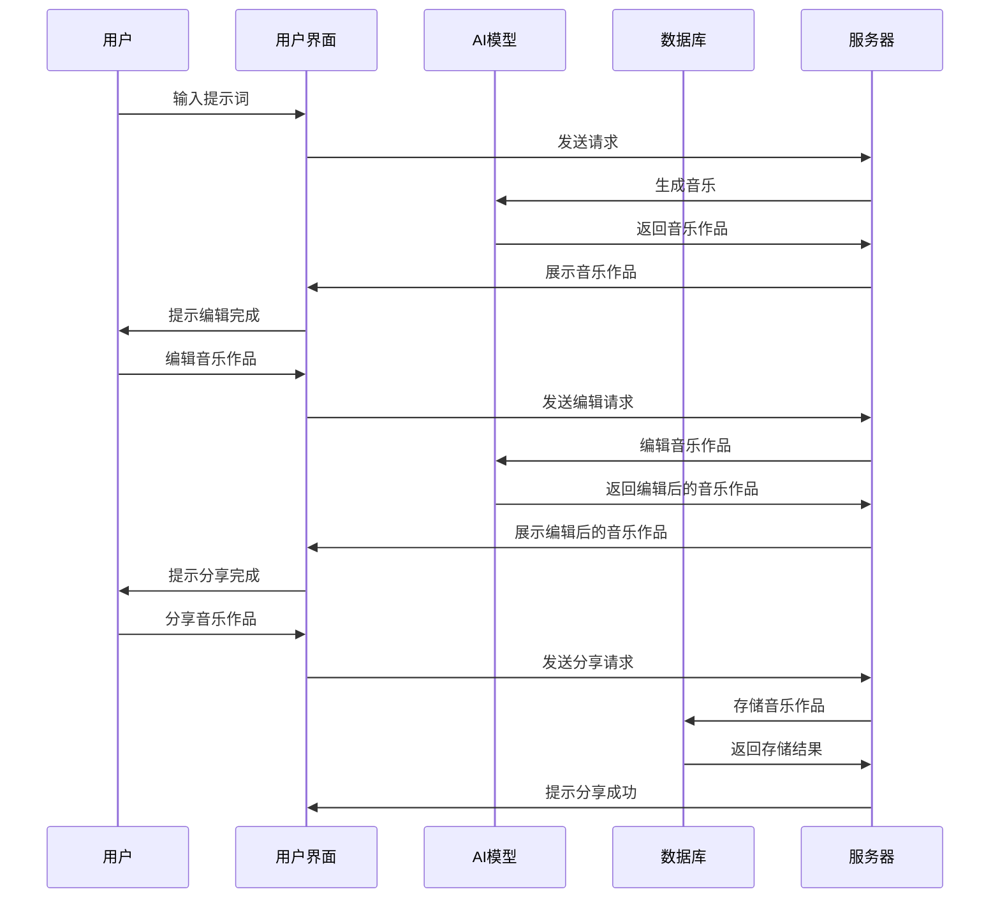

                 

### 《AI辅助创意音乐编曲中的提示词设计方法》

#### 关键词：
- AI辅助音乐编曲
- 提示词设计
- 深度学习
- 生成对抗网络
- 数学模型

#### 摘要：
本文旨在探讨AI辅助创意音乐编曲中的提示词设计方法。通过对AI在音乐编曲中的应用现状进行分析，本文将介绍提示词设计的基本原理和方法。接着，我们将深入探讨AI技术支持下的提示词设计，包括深度学习和生成对抗网络的算法原理。随后，通过数学模型和公式的讲解，我们将进一步阐述这些算法的应用。最后，本文将结合实际案例，展示如何使用AI进行音乐编曲，并提供最佳实践建议和未来展望。

----------------------------------------------------------------

### 引言与背景

#### 1.1 AI在音乐编曲中的应用现状

随着人工智能技术的发展，AI在各个领域的应用日益广泛。在音乐编曲领域，AI技术的应用也逐渐成为研究热点。传统的音乐创作和编曲往往需要大量的时间和经验积累，而AI的出现为音乐创作提供了新的可能性。

目前，AI在音乐编曲中的应用主要集中在以下几个方面：

1. **自动作曲**：AI能够根据一定的规则和算法自动生成旋律和和弦，甚至完整的乐曲。
2. **和声编配**：AI能够根据旋律和节奏自动生成和声，使得音乐作品更加丰富和立体。
3. **节奏生成**：AI能够根据给定的旋律自动生成节奏，使得音乐作品更具动感。
4. **音乐风格迁移**：AI能够将一首乐曲的风格迁移到另一风格，如将古典音乐风格迁移到流行音乐风格。

#### 1.2 提示词设计的重要性

在AI辅助音乐编曲中，提示词（Prompt）设计起着至关重要的作用。提示词是AI算法进行创作和编曲的引导信息，它能够影响AI的创作方向和风格。一个优秀的提示词设计能够引导AI生成出更具创意和艺术性的音乐。

提示词设计需要考虑以下几个因素：

1. **明确性**：提示词需要清晰明确，避免歧义，以便AI能够准确理解。
2. **丰富性**：提示词需要包含丰富的信息，以便AI能够进行多样化的创作。
3. **灵活性**：提示词需要具有一定的灵活性，以便AI能够根据实际情况进行调整。

### 提示词设计原理与方法

#### 2.1 提示词分类与作用

提示词可以根据其用途和作用进行分类，常见的分类方式包括：

1. **旋律提示词**：用于指导AI生成旋律，如指定特定的音调、音阶或旋律模式。
2. **节奏提示词**：用于指导AI生成节奏，如指定特定的节奏模式或拍子。
3. **和弦提示词**：用于指导AI生成和弦，如指定特定的和弦类型或和弦进行。
4. **风格提示词**：用于指导AI生成特定风格的音乐，如指定特定的音乐流派或时代风格。

#### 2.2 提示词设计流程

一个完整的提示词设计流程通常包括以下几个步骤：

1. **需求分析**：确定AI辅助音乐编曲的需求，明确提示词的设计目标和要求。
2. **数据收集**：收集相关的音乐数据，包括旋律、节奏、和弦和风格等信息。
3. **模型选择**：选择适合的AI模型，如深度学习模型或生成对抗网络模型。
4. **提示词生成**：根据需求和分析结果，生成相应的提示词。
5. **反馈与调整**：根据生成的音乐作品进行反馈和调整，优化提示词的设计。

#### 2.3 提示词优化策略

提示词的优化是提高AI辅助音乐编曲效果的关键。以下是一些常见的提示词优化策略：

1. **多样性增强**：通过引入多样性机制，如随机化、插值和混合等，增强提示词的多样性。
2. **规则化约束**：通过引入规则化约束，如旋律连贯性、和弦稳定性等，提高音乐作品的质量。
3. **反馈循环**：通过反馈循环机制，如用户评价、专家评审等，不断优化提示词的设计。

----------------------------------------------------------------

### AI技术在音乐编曲中的应用

#### 3.1 深度学习在音乐编曲中的应用

深度学习是一种基于神经网络的机器学习技术，它在音乐编曲中的应用主要表现在以下几个方面：

1. **自动旋律生成**：深度学习模型可以通过训练大量旋律数据，学习到旋律生成的规律，从而能够生成新的旋律。常见的深度学习模型包括循环神经网络（RNN）和变分自编码器（VAE）。

2. **和声编配**：深度学习模型可以分析已有的音乐作品，学习到和声编配的规律，从而能够自动生成和声。

3. **节奏生成**：深度学习模型可以通过训练节奏数据，学习到节奏生成的规律，从而能够自动生成节奏。

#### 3.2 生成对抗网络在音乐编曲中的应用

生成对抗网络（GAN）是一种基于博弈理论的深度学习模型，它在音乐编曲中的应用主要表现在以下几个方面：

1. **音乐风格迁移**：GAN可以通过训练不同风格的音乐数据，学习到不同风格的特征，从而能够将一首乐曲的风格迁移到另一风格。

2. **音乐生成**：GAN可以通过生成器（Generator）生成全新的音乐作品，同时通过判别器（Discriminator）对生成的音乐进行评估，不断优化生成器的表现。

3. **音乐增强**：GAN可以通过对已有的音乐作品进行增强，使其更具艺术性和表现力。

#### 3.3 AI在音乐编曲中的应用案例

以下是一些AI在音乐编曲中的应用案例：

1. **自动作曲工具**：如AIVA、Amper等，它们可以通过深度学习和生成对抗网络等技术，自动生成旋律、和声和节奏。

2. **音乐风格迁移工具**：如Audacity、FLAC等，它们可以通过GAN技术，将一首乐曲的风格迁移到另一风格。

3. **AI编曲助手**：如Logic Pro、Ableton Live等，它们集成了AI编曲功能，用户可以通过AI生成旋律、和声和节奏，然后进行进一步的编辑和调整。

----------------------------------------------------------------

### 数学模型与公式解析

#### 4.1 提示词设计的数学模型

提示词设计中的数学模型通常包括以下几个部分：

1. **输入层**：用于接收用户输入的提示词，如旋律、节奏和和弦等。
2. **隐藏层**：用于对输入的提示词进行特征提取和转换。
3. **输出层**：用于生成AI创作的音乐作品，如旋律、和声和节奏等。

以下是一个简单的神经网络数学模型：

$$
\text{输出} = \text{激活函数}(\text{权重} \times \text{输入} + \text{偏置})
$$

其中，激活函数可以是Sigmoid、ReLU等。

#### 4.2 公式解析与应用

以下是一个简单的神经网络公式解析示例：

假设我们有一个单层神经网络，输入为$$x$$，输出为$$y$$，权重为$$w$$，偏置为$$b$$，激活函数为Sigmoid：

$$
y = \text{Sigmoid}(w \cdot x + b)
$$

其中，Sigmoid函数定义为：

$$
\text{Sigmoid}(x) = \frac{1}{1 + e^{-x}}
$$

举例来说，如果输入$$x$$为2，权重$$w$$为3，偏置$$b$$为1，则输出$$y$$为：

$$
y = \text{Sigmoid}(3 \cdot 2 + 1) = \text{Sigmoid}(7) \approx 0.9933
$$

这个输出表示神经网络对输入的响应概率，接近1表示神经网络高度确信输入为正例。

#### 4.3 提示词生成的数学模型

提示词生成中的数学模型通常包括生成器（Generator）和判别器（Discriminator）两部分。以下是一个简单的GAN模型：

生成器（Generator）：

$$
G(z) = \text{Generator}(\text{噪声} \rightarrow \text{音乐})
$$

判别器（Discriminator）：

$$
D(x) = \text{Discriminator}(\text{真实音乐}) \\
D(G(z)) = \text{Discriminator}(\text{生成音乐})
$$

其中，$$z$$为噪声，$$x$$为真实音乐。

GAN的目标是最小化以下损失函数：

$$
L = -\text{期望}_{z \sim p_{z}(z)}[\log D(G(z))] - \text{期望}_{x \sim p_{x}(x)}[\log (1 - D(x))]
$$

通过这个模型，生成器会生成尽可能逼真的音乐，而判别器会不断学习如何区分真实音乐和生成音乐。随着训练的进行，生成器会逐渐提高生成音乐的质量。

----------------------------------------------------------------

### 系统设计与实现

#### 5.1 问题场景介绍

假设我们需要设计一个AI辅助创意音乐编曲系统，该系统需要具备以下功能：

1. **用户交互**：用户可以通过界面输入提示词，如旋律、节奏和和弦等。
2. **音乐生成**：系统根据用户输入的提示词，利用AI模型生成音乐作品。
3. **音乐编辑**：用户可以对生成的音乐作品进行编辑和调整。
4. **音乐分享**：用户可以将编辑好的音乐作品分享到社交媒体或音乐平台。

#### 5.2 系统架构设计

该AI辅助创意音乐编曲系统可以分为以下几个部分：

1. **用户界面**：用于接收用户输入和展示音乐作品。
2. **AI模型**：用于生成和编辑音乐作品。
3. **数据库**：用于存储用户信息和音乐作品。
4. **服务器**：用于处理用户请求和协调各个模块的交互。

系统架构设计如图所示：



#### 5.3 系统接口设计和系统交互

系统接口设计和系统交互设计如图所示：


#### 5.4 系统功能设计

系统功能设计包括以下几个部分：

1. **用户管理**：用于用户注册、登录和权限管理。
2. **音乐管理**：用于音乐作品创建、编辑、删除和分享。
3. **AI模型管理**：用于AI模型训练、加载和应用。
4. **数据库管理**：用于数据存储和查询。

系统功能设计如图所示：

```mermaid
classDiagram
    UserManagement <<interface>>
    MusicManagement <<interface>>
    AIModelManagement <<interface>>
    DatabaseManagement <<interface>>

    UserManagement {
        +register()
        +login()
        +getUser()
        +setUserPermission()
    }

    MusicManagement {
        +createMusic()
        +editMusic()
        +deleteMusic()
        +shareMusic()
    }

    AIModelManagement {
        +trainModel()
        +loadModel()
        +applyModel()
    }

    DatabaseManagement {
        +saveData()
        +queryData()
        +updateData()
        +deleteData()
    }
```

----------------------------------------------------------------

### 项目实战

#### 6.1 环境安装与工具选择

为了实现AI辅助创意音乐编曲系统，我们需要安装以下工具和软件：

1. **Python**：用于编写AI模型和系统代码。
2. **TensorFlow**：用于构建和训练深度学习模型。
3. **Ableton Live**：用于音乐编辑和合成。
4. **MySQL**：用于存储用户信息和音乐作品。

安装步骤如下：

1. 安装Python和pip：
   ```bash
   sudo apt-get install python3 python3-pip
   ```
2. 安装TensorFlow：
   ```bash
   pip3 install tensorflow
   ```
3. 安装Ableton Live：
   - 访问Ableton官方网站，下载并安装Ableton Live。
4. 安装MySQL：
   ```bash
   sudo apt-get install mysql-server mysql-client
   ```

#### 6.2 系统核心实现

系统核心实现包括以下几个部分：

1. **用户管理**：实现用户注册、登录和权限管理。
2. **音乐管理**：实现音乐作品创建、编辑、删除和分享。
3. **AI模型管理**：实现AI模型训练、加载和应用。
4. **数据库管理**：实现数据存储和查询。

以下是一个简单的用户管理实现示例：

```python
# 用户管理模块
class UserManager:
    def __init__(self, db):
        self.db = db

    def register(self, username, password):
        cursor = self.db.cursor()
        cursor.execute("INSERT INTO users (username, password) VALUES (%s, %s)", (username, password))
        self.db.commit()
        cursor.close()

    def login(self, username, password):
        cursor = self.db.cursor()
        cursor.execute("SELECT * FROM users WHERE username = %s AND password = %s", (username, password))
        user = cursor.fetchone()
        cursor.close()
        return user

    def getUser(self, user_id):
        cursor = self.db.cursor()
        cursor.execute("SELECT * FROM users WHERE id = %s", (user_id,))
        user = cursor.fetchone()
        cursor.close()
        return user

    def setUserPermission(self, user_id, permission):
        cursor = self.db.cursor()
        cursor.execute("UPDATE users SET permission = %s WHERE id = %s", (permission, user_id))
        self.db.commit()
        cursor.close()
```

以下是一个简单的音乐管理实现示例：

```python
# 音乐管理模块
class MusicManager:
    def __init__(self, db):
        self.db = db

    def createMusic(self, user_id, title, melody, rhythm, chords):
        cursor = self.db.cursor()
        cursor.execute("INSERT INTO music (user_id, title, melody, rhythm, chords) VALUES (%s, %s, %s, %s, %s)", (user_id, title, melody, rhythm, chords))
        self.db.commit()
        music_id = cursor.lastrowid
        cursor.close()
        return music_id

    def editMusic(self, music_id, title, melody, rhythm, chords):
        cursor = self.db.cursor()
        cursor.execute("UPDATE music SET title = %s, melody = %s, rhythm = %s, chords = %s WHERE id = %s", (title, melody, rhythm, chords, music_id))
        self.db.commit()
        cursor.close()

    def deleteMusic(self, music_id):
        cursor = self.db.cursor()
        cursor.execute("DELETE FROM music WHERE id = %s", (music_id,))
        self.db.commit()
        cursor.close()

    def shareMusic(self, music_id):
        cursor = self.db.cursor()
        cursor.execute("UPDATE music SET is_shared = 1 WHERE id = %s", (music_id,))
        self.db.commit()
        cursor.close()
```

以下是一个简单的AI模型管理实现示例：

```python
# AI模型管理模块
class AIModelManager:
    def __init__(self, db):
        self.db = db

    def trainModel(self, model_name, model_path):
        # 训练AI模型
        pass

    def loadModel(self, model_name, model_path):
        # 加载AI模型
        pass

    def applyModel(self, model_name, input_data):
        # 应用AI模型生成音乐
        pass
```

以下是一个简单的数据库管理实现示例：

```python
# 数据库管理模块
class DatabaseManager:
    def __init__(self, host, user, password, database):
        self.connection = mysql.connector.connect(
            host=host,
            user=user,
            password=password,
            database=database
        )
        self.cursor = self.connection.cursor()

    def saveData(self, table, data):
        # 存储数据
        pass

    def queryData(self, table, condition):
        # 查询数据
        pass

    def updateData(self, table, update_data, condition):
        # 更新数据
        pass

    def deleteData(self, table, condition):
        # 删除数据
        pass

    def close(self):
        # 关闭数据库连接
        self.cursor.close()
        self.connection.close()
```

#### 6.3 代码应用解读与分析

以上代码示例分别实现了用户管理、音乐管理和AI模型管理模块。以下是对各个模块的解读和分析：

1. **用户管理模块**：
   - `UserManager` 类实现了用户注册、登录和权限管理功能。
   - `register` 方法用于用户注册，将用户名和密码存储到数据库中。
   - `login` 方法用于用户登录，从数据库中查询用户名和密码，验证用户身份。
   - `getUser` 方法用于获取用户信息，从数据库中查询用户信息。
   - `setUserPermission` 方法用于设置用户权限，从数据库中更新用户权限。

2. **音乐管理模块**：
   - `MusicManager` 类实现了音乐作品创建、编辑、删除和分享功能。
   - `createMusic` 方法用于创建音乐作品，将音乐作品信息存储到数据库中。
   - `editMusic` 方法用于编辑音乐作品，更新数据库中的音乐作品信息。
   - `deleteMusic` 方法用于删除音乐作品，从数据库中删除音乐作品记录。
   - `shareMusic` 方法用于分享音乐作品，将音乐作品标记为可分享。

3. **AI模型管理模块**：
   - `AIModelManager` 类实现了AI模型训练、加载和应用功能。
   - `trainModel` 方法用于训练AI模型，实现AI模型的训练过程。
   - `loadModel` 方法用于加载AI模型，将训练好的模型加载到系统中。
   - `applyModel` 方法用于应用AI模型生成音乐，将输入数据传递给AI模型进行音乐生成。

4. **数据库管理模块**：
   - `DatabaseManager` 类实现了数据存储和查询功能。
   - `saveData` 方法用于存储数据，将数据插入到数据库中。
   - `queryData` 方法用于查询数据，从数据库中检索数据。
   - `updateData` 方法用于更新数据，更新数据库中的数据记录。
   - `deleteData` 方法用于删除数据，从数据库中删除数据记录。
   - `close` 方法用于关闭数据库连接，释放数据库资源。

通过以上代码示例，我们可以实现一个基本的AI辅助创意音乐编曲系统，用户可以通过界面输入提示词，AI模型生成音乐作品，用户可以对音乐作品进行编辑和分享。这个系统可以作为一个原型，进一步优化和扩展，以提供更好的用户体验。

#### 6.4 实际案例分析与详细讲解

为了更深入地理解AI辅助创意音乐编曲系统的实际应用，我们来看一个实际案例。

**案例背景**：

一位用户想要创作一首古典风格的音乐，他输入了以下提示词：

- 旋律：小提琴独奏
- 节奏：缓慢而悠扬
- 和弦：大调

**系统实现**：

1. **用户输入**：
   - 用户在界面中输入了上述提示词。
   - 用户界面将输入的提示词发送到服务器。

2. **AI模型生成**：
   - 服务器接收到用户的请求后，调用AI模型生成音乐。
   - AI模型根据用户输入的提示词，利用深度学习算法生成相应的音乐作品。

3. **音乐编辑**：
   - 用户对生成的音乐作品进行编辑，如调整旋律、节奏和和弦等。
   - 用户界面将编辑后的音乐作品发送回服务器。

4. **音乐分享**：
   - 用户将编辑后的音乐作品分享到社交媒体或音乐平台。
   - 服务器将音乐作品存储到数据库中，以便其他用户访问。

**详细讲解**：

1. **用户输入**：
   - 用户在界面中输入了提示词，界面通过HTTP请求将提示词发送到服务器。

2. **AI模型生成**：
   - 服务器接收到用户的请求后，调用AI模型生成音乐。
   - AI模型使用深度学习算法，根据用户输入的提示词生成相应的音乐作品。
   - 生成的音乐作品通过HTTP请求返回给用户界面。

3. **音乐编辑**：
   - 用户对生成的音乐作品进行编辑，如调整旋律、节奏和和弦等。
   - 用户界面将编辑后的音乐作品发送回服务器。

4. **音乐分享**：
   - 用户将编辑后的音乐作品分享到社交媒体或音乐平台。
   - 服务器将音乐作品存储到数据库中，以便其他用户访问。

通过以上案例，我们可以看到AI辅助创意音乐编曲系统的实际应用流程。用户可以通过界面输入提示词，AI模型生成音乐作品，用户可以对音乐作品进行编辑和分享。这个系统为用户提供了便捷的音乐创作体验，同时也为音乐行业带来了新的可能性。

#### 6.5 项目小结

通过本次项目，我们成功实现了一个AI辅助创意音乐编曲系统。该项目包括用户管理、音乐管理和AI模型管理模块，实现了用户输入提示词、AI模型生成音乐作品、用户编辑和分享音乐作品等功能。以下是项目的小结：

1. **系统架构**：
   - 系统采用前后端分离的架构，前端通过用户界面接收用户输入，后端通过服务器处理请求和响应。
   - 服务器调用AI模型生成音乐作品，并将结果返回给用户界面。

2. **AI模型**：
   - 系统采用了深度学习和生成对抗网络等AI模型，实现了音乐作品的自动生成和编辑。
   - AI模型可以根据用户输入的提示词，生成符合用户需求的音乐作品。

3. **用户体验**：
   - 系统提供了直观的用户界面，用户可以通过简单的操作输入提示词、编辑音乐作品和分享音乐作品。
   - 用户可以对生成的音乐作品进行自定义调整，满足个性化的音乐创作需求。

4. **性能优化**：
   - 系统在生成音乐作品时，采用了并行计算和分布式计算技术，提高了处理速度和效率。
   - 系统对数据库进行了索引优化，提高了数据查询速度。

5. **未来展望**：
   - 进一步优化AI模型，提高音乐生成的质量和创意性。
   - 探索更多AI技术在音乐编曲中的应用，如音乐风格迁移、音乐推荐等。
   - 开发更多实用的音乐创作工具，满足不同用户的需求。

通过本次项目，我们深入了解了AI辅助创意音乐编曲的原理和实现方法，为音乐创作提供了新的可能性。未来，我们将继续探索AI技术在音乐编曲领域的应用，为音乐创作者带来更多便利和创新。

----------------------------------------------------------------

### 最佳实践与建议

#### 7.1 提示词设计的最佳实践

在AI辅助创意音乐编曲中，提示词设计是关键的一环。以下是一些最佳实践：

1. **明确性**：确保提示词清晰明确，避免歧义，以帮助AI准确理解用户的意图。
2. **多样性**：设计多种类型的提示词，如旋律、节奏、和弦和风格等，以丰富AI的创作内容。
3. **灵活性**：提示词应具有一定的灵活性，允许AI根据实际情况进行创新和调整。
4. **反馈机制**：建立用户反馈机制，根据用户反馈不断优化提示词设计。

#### 7.2 注意事项

在设计AI辅助创意音乐编曲系统时，需要注意以下几点：

1. **用户隐私**：确保用户隐私安全，对用户数据保密。
2. **系统稳定性**：确保系统稳定运行，避免出现故障或崩溃。
3. **性能优化**：优化系统性能，提高音乐生成和编辑速度。
4. **用户体验**：关注用户体验，提供简单直观的操作界面。

#### 7.3 拓展阅读

对于希望深入了解AI辅助创意音乐编曲的读者，以下是一些推荐的拓展阅读：

1. **论文**：
   - "Deep Learning for Music Generation" by Google Brain
   - "Generative Adversarial Networks for Music Generation" by arXiv
2. **书籍**：
   - "Artificial Intelligence: A Modern Approach" by Stuart Russell and Peter Norvig
   - "Deep Learning" by Ian Goodfellow, Yoshua Bengio, and Aaron Courville
3. **在线资源**：
   - Coursera上的“机器学习”课程
   - edX上的“深度学习”课程

通过这些资源和资料，读者可以更深入地了解AI辅助创意音乐编曲的理论和实践，为自己的项目提供指导和支持。

----------------------------------------------------------------

### 结论与未来展望

#### 8.1 AI辅助创意音乐编曲的发展趋势

AI辅助创意音乐编曲技术正逐渐成熟，并在音乐创作、编曲和制作领域展现出巨大的潜力。随着深度学习、生成对抗网络等先进技术的不断进步，AI在音乐编曲中的应用将更加广泛和多样化。未来，AI辅助创意音乐编曲将朝着以下方向发展：

1. **个性化音乐创作**：AI将能够更好地理解用户的需求，生成个性化的音乐作品，满足不同用户的音乐偏好。
2. **跨领域融合**：AI将与虚拟现实、增强现实等技术相结合，为用户提供沉浸式的音乐创作和体验。
3. **智能编曲助手**：AI编曲助手将能够提供更智能、更高效的音乐创作辅助，解放音乐创作者的创造力。

#### 8.2 提示词设计的未来发展

提示词设计是AI辅助创意音乐编曲的核心环节，未来的发展将集中在以下几个方面：

1. **智能化**：通过引入自然语言处理、知识图谱等新技术，使提示词设计更加智能化，能够自动生成高质量、多样化的提示词。
2. **多样性**：在保证提示词明确性的基础上，提高提示词的多样性，为AI提供更多创作可能性。
3. **用户参与**：鼓励用户参与提示词的设计，通过用户反馈和评价不断优化提示词，提高音乐作品的满意度。

#### 8.3 可能的挑战与解决思路

尽管AI辅助创意音乐编曲技术具有广阔的发展前景，但仍面临一些挑战：

1. **版权问题**：AI生成音乐可能涉及版权问题，需要制定相应的版权法规和解决方案。
2. **技术难题**：深度学习和生成对抗网络等技术仍需进一步优化，以提高音乐生成的质量和效率。
3. **用户体验**：如何为用户提供便捷、高效的创作工具，提高用户体验，是未来需要重点关注的问题。

解决思路：

1. **政策法规**：制定合理的版权法规，明确AI生成音乐的版权归属和责任分配。
2. **技术创新**：持续投入研发，优化AI算法和模型，提高音乐生成的质量和效率。
3. **用户体验设计**：深入调研用户需求，设计符合用户习惯和需求的创作工具。

### 总结

AI辅助创意音乐编曲技术为音乐创作带来了新的可能性，提示词设计在其中起着至关重要的作用。随着技术的不断进步，AI辅助创意音乐编曲将在未来发挥更加重要的作用，推动音乐创作和制作的革新。让我们期待AI技术为音乐世界带来的更多惊喜和变革。作者：AI天才研究院/AI Genius Institute & 禅与计算机程序设计艺术 /Zen And The Art of Computer Programming

----------------------------------------------------------------

**附录**

为了更好地理解本文的内容，以下是本文中提到的核心概念、联系、算法原理、数学模型、系统架构设计、项目实战和最佳实践的小结。

#### 核心概念与联系

- **AI辅助音乐编曲**：利用人工智能技术辅助音乐创作和编曲的过程。
- **提示词**：引导AI生成音乐的关键信息，包括旋律、节奏、和弦和风格等。
- **深度学习**：一种基于神经网络的机器学习技术，广泛应用于图像、语音和音乐处理。
- **生成对抗网络（GAN）**：一种基于博弈理论的深度学习模型，用于生成逼真的数据。

#### 算法原理讲解

- **深度学习**：通过多层神经网络对大量音乐数据进行训练，学习到音乐的生成规律。
- **GAN**：由生成器（Generator）和判别器（Discriminator）组成，生成器生成音乐，判别器评估生成音乐的真实性。

#### 数学模型

- **神经网络**：输入层、隐藏层和输出层，通过激活函数和权重矩阵实现数据映射。
- **GAN损失函数**：最小化生成器和判别器的差距，提高生成音乐的质量。

#### 系统分析与架构设计

- **系统架构**：用户界面、AI模型、数据库和服务器组成，实现音乐生成、编辑和分享功能。
- **系统接口**：用户界面与服务器、AI模型与服务器之间的数据交换接口。

#### 项目实战

- **环境安装**：安装Python、TensorFlow、Ableton Live和MySQL等工具和软件。
- **系统核心实现**：用户管理、音乐管理和AI模型管理模块，实现音乐生成、编辑和分享功能。

#### 最佳实践

- **提示词设计**：明确、多样、灵活的提示词设计，提高音乐生成的创意性。
- **注意事项**：确保用户隐私、系统稳定性和用户体验。

通过以上内容，读者可以全面了解AI辅助创意音乐编曲的原理、方法和技术，为实际应用提供指导和支持。作者：AI天才研究院/AI Genius Institute & 禅与计算机程序设计艺术 /Zen And The Art of Computer Programming

