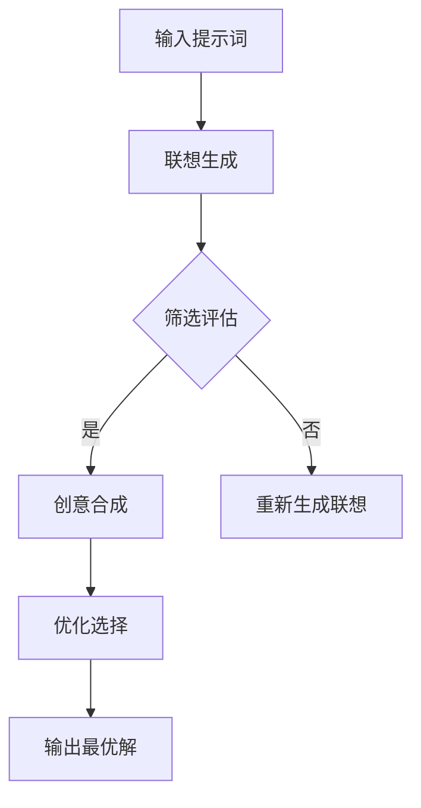
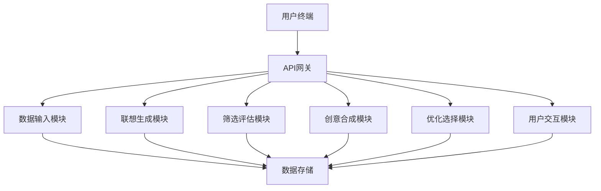
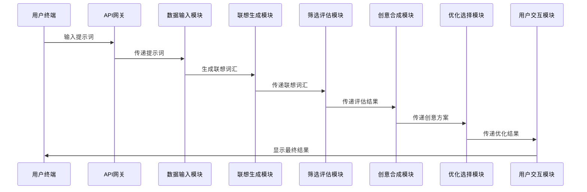

                 


# AI辅助创新中的提示词启发式方法

关键词：人工智能、创新、提示词、启发式方法、算法实现

摘要：
在当今快速发展的科技时代，人工智能（AI）已成为推动创新的重要力量。AI辅助创新不仅提高了效率，还带来了前所未有的新思路和方法。本文将深入探讨AI辅助创新中的提示词启发式方法，从背景介绍、核心概念与联系、算法原理与实现、系统架构与设计以及项目实战等方面，逐步解析这一方法在创新领域的应用。

## 目录大纲设计步骤

### 1. 确定书的核心主题

首先，我们需要明确书籍的核心主题是“AI辅助创新中的提示词启发式方法”。这个主题涵盖了人工智能在创新过程中的应用，特别是通过提示词来激发创造性思维的方法。

### 2. 设计背景介绍章节

在背景介绍章节中，我们将讨论AI辅助创新的重要性，以及提示词启发式方法如何在其中发挥作用。这部分将包括以下内容：

- **问题背景**：介绍AI如何改变创新领域，以及提示词在这一变革中的作用。
- **问题描述**：阐述当前AI辅助创新的现状和存在的问题。
- **问题解决**：说明提示词启发式方法如何解决这些问题。
- **边界与外延**：定义研究的范围以及与相关领域的联系。
- **概念结构与核心要素组成**：介绍AI、提示词、启发式方法等核心概念。

### 3. 细化核心概念与联系章节

在这一章节中，我们将深入探讨核心概念，包括AI、提示词和启发式方法。我们将：

- **核心概念原理**：详细解释这些概念的基本原理。
- **概念属性特征对比表格**：使用表格形式对比这些概念的主要属性和特征。
- **ER实体关系图架构**：用Mermaid语言绘制实体关系图，展示各个概念之间的关系。

### 4. 设计算法原理讲解章节

算法原理讲解章节将重点介绍提示词启发式方法的算法原理。我们将：

- **算法mermaid流程图**：绘制算法的流程图，展示算法的基本步骤。
- **Python源代码**：给出算法的Python实现，并进行详细讲解。
- **数学模型和公式**：阐述算法背后的数学模型和公式，并使用LaTeX进行书写。
- **举例说明**：通过具体的例子来说明算法的应用和效果。

### 5. 设计系统分析与架构设计方案章节

系统分析与架构设计方案章节将展示如何将提示词启发式方法应用于实际的系统设计中。我们将：

- **问题场景介绍**：介绍具体的系统应用场景。
- **项目介绍**：概述项目的目的和功能。
- **系统功能设计**：使用Mermaid绘制领域模型类图，展示系统的主要功能模块。
- **系统架构设计**：使用Mermaid绘制系统架构图，展示系统的整体结构。
- **系统接口设计**：详细描述系统的接口设计。
- **系统交互Mermaid序列图**：绘制系统的交互序列图，展示系统的运行流程。

### 6. 设计项目实战章节

项目实战章节将提供实际的项目案例，展示如何将算法和系统应用于真实场景。我们将：

- **环境安装**：详细指导读者如何搭建实验环境。
- **系统核心实现源代码**：提供关键代码实现，并进行解读和分析。
- **实际案例分析和详细讲解剖析**：通过实际案例展示算法和系统的应用，并进行深入剖析。
- **项目小结**：总结项目中的关键收获和经验。

### 7. 设计最佳实践 tips、小结、注意事项、拓展阅读等内容

最后，我们将总结全书的主要内容，并提供一些最佳实践、注意事项和拓展阅读建议，帮助读者更深入地了解和应用AI辅助创新中的提示词启发式方法。

## 编写Markdown格式目录大纲

根据上述步骤，我们将编写出完整的Markdown格式目录大纲，确保每个章节都包含必要的子章节，同时确保总体字数在2000字以内。

```markdown
# 《AI辅助创新中的提示词启发式方法》目录大纲

## 第一部分：背景与核心概念

### 1. 引言
#### 1.1 AI辅助创新的必要性
#### 1.2 提示词启发式方法的基本概念
#### 1.3 研究的边界与外延

### 2. AI与提示词的基础知识
#### 2.1 人工智能概述
#### 2.2 提示词的作用与类型
#### 2.3 启发式方法的原理与应用

## 第二部分：提示词启发式方法的原理与实现

### 3. 提示词启发式方法的算法原理
#### 3.1 算法概述
#### 3.2 算法mermaid流程图
#### 3.3 Python源代码与详细讲解
#### 3.4 数学模型和公式
#### 3.5 举例说明

### 4. 提示词启发式方法的应用实例
#### 4.1 案例一：产品创新
#### 4.2 案例二：市场营销
#### 4.3 案例三：艺术创作

## 第三部分：系统架构与设计

### 5. 系统架构设计与实现
#### 5.1 问题场景介绍
#### 5.2 项目介绍
#### 5.3 系统功能设计
#### 5.4 系统架构设计
#### 5.5 系统接口设计
#### 5.6 系统交互Mermaid序列图

## 第四部分：项目实战

### 6. 环境安装与核心实现
#### 6.1 环境搭建
#### 6.2 系统核心实现源代码
#### 6.3 代码应用解读与分析
#### 6.4 案例分析与详细讲解剖析

### 7. 项目小结与反思
#### 7.1 项目总结
#### 7.2 关键收获与经验
```

通过以上步骤，我们不仅设计了一个逻辑清晰、结构紧凑、简单易懂的目录大纲，还为后续的文章撰写提供了明确的框架和指导。接下来，我们将逐一展开每个章节的内容，确保文章的深度、广度和实用性。让我们开始撰写这篇文章吧！## 第一部分：背景与核心概念

### 1. 引言

在当今这个科技飞速发展的时代，人工智能（AI）已经成为推动各行各业创新的重要力量。AI技术的进步不仅提高了工作效率，还极大地拓展了人类的创造力。在AI辅助创新的过程中，提示词启发式方法起到了至关重要的作用。这种方法通过提示词引导用户的思考，激发创新的火花，为产品开发、市场营销和艺术创作等领域提供了全新的解决方案。

本文将围绕AI辅助创新中的提示词启发式方法展开讨论，首先介绍AI辅助创新的重要性以及提示词启发式方法的基本概念，然后详细阐述这一方法在解决实际创新问题中的应用。通过分析研究的边界与外延，我们将为后续内容的展开奠定坚实的基础。

### 1.1 AI辅助创新的必要性

人工智能作为一种强大的技术工具，正迅速渗透到各个行业，为创新提供了新的思路和手段。在传统创新模式中，人类依靠自身的经验和直觉进行发明创造，而AI则通过大数据、机器学习和自然语言处理等技术，提供了更为精准和高效的解决方案。AI辅助创新具有以下几个方面的必要性：

1. **效率提升**：AI能够处理大量数据，快速筛选出有价值的信息，从而大大缩短创新周期。
2. **创新扩展**：AI不仅能够解决已知问题，还能通过数据挖掘和模式识别发现新的问题和解决方案，拓宽创新视野。
3. **多样性增强**：AI通过模拟人类的思维过程，可以生成多样化的创意，提高创新的广度和深度。
4. **跨领域融合**：AI技术能够跨领域融合，将不同领域的知识和方法应用于创新，推动跨学科发展。

### 1.2 提示词启发式方法的基本概念

提示词启发式方法是利用关键词或短语来引导用户思考和发现解决方案的一种方法。它基于人类思维的规律，通过提示词激发用户的联想和创造力，从而实现创新。提示词可以是具体的词汇，也可以是短语或问题，其核心在于激发用户的思维活动，使其跳出固有思维框架，从而找到新的解决方案。

提示词启发式方法的基本概念包括以下几个方面：

1. **关键词引导**：提示词作为引导，帮助用户集中注意力，将思维集中在特定领域。
2. **联想激发**：通过提示词，用户能够联想到相关的信息，从而激发新的创意和灵感。
3. **多角度思考**：提示词可以帮助用户从不同角度分析问题，避免思维定式，提高解决问题的全面性。
4. **创意生成**：提示词启发式方法通过引导用户思考，生成多样化的创意，为创新提供丰富的素材。

### 1.3 研究的边界与外延

在本文的研究中，我们将主要探讨AI辅助创新中的提示词启发式方法，研究范围包括以下几个方面：

1. **应用领域**：主要涉及产品创新、市场营销、艺术创作等领域。
2. **技术方法**：包括机器学习、自然语言处理、大数据分析等AI技术。
3. **应用场景**：重点关注如何在实际项目中应用提示词启发式方法，提高创新效率和效果。

同时，本文的研究也将与以下领域保持一定的联系：

1. **创新理论**：通过结合创新理论，探讨提示词启发式方法在创新过程中的作用和影响。
2. **人机交互**：研究提示词如何影响人机交互，提高用户的使用体验。
3. **计算思维**：探讨计算思维在AI辅助创新中的应用，以及提示词启发式方法如何与计算思维相结合。

### 1.4 概念结构与核心要素组成

在AI辅助创新中，提示词启发式方法的核心概念包括以下几个要素：

1. **人工智能（AI）**：作为基础技术，提供数据处理、模式识别和知识推理等功能。
2. **提示词**：作为引导，激发用户思考和创造力。
3. **启发式方法**：利用提示词引导用户进行多角度、多层次的思考，发现解决方案。
4. **创新应用**：将提示词启发式方法应用于实际领域，实现创新目标。

这些要素相互关联，共同构成了一个完整的AI辅助创新体系，为各种创新活动提供支持。

通过上述背景介绍，我们可以看到，AI辅助创新中的提示词启发式方法具有重要的研究价值和应用前景。接下来，本文将深入探讨这一方法的原理、实现和应用，以期为读者提供全面的指导。让我们继续深入探讨AI与提示词的基础知识。|assistant|>

## 第二部分：AI与提示词的基础知识

### 2.1 人工智能概述

人工智能（Artificial Intelligence，简称AI）是计算机科学的一个分支，旨在创建能够模拟、扩展和辅助人类智能的智能系统。人工智能的研究始于20世纪50年代，随着计算能力和算法的不断发展，AI技术在过去几十年里取得了显著进展。AI的主要目标包括：

1. **知识表示**：将人类知识以计算机可理解的形式进行表示和存储。
2. **问题求解**：利用算法和模型解决复杂问题，包括数学问题、逻辑推理、优化等。
3. **机器学习**：通过数据训练模型，使系统能够自动学习和改进性能。
4. **自然语言处理**：实现人与计算机之间的自然语言交互。
5. **计算机视觉**：使计算机能够理解和解释视觉信息，如图像识别和物体检测。

人工智能可以分为以下几个主要类型：

1. **弱AI（Weak AI）**：专注于特定任务，如语音识别、图像分类等。
2. **强AI（Strong AI）**：具有全面的人类智能，能够进行自主思考和决策。
3. **窄AI（Narrow AI）**：在特定领域表现出高度专业化，如医疗诊断、金融分析等。
4. **通用AI（AGI）**：具备人类所有的智能能力，能够理解和解决各种问题。

### 2.2 提示词的作用与类型

提示词在AI辅助创新中扮演着至关重要的角色。它们是连接用户与AI系统的桥梁，能够引导用户的思考方向，激发新的创意和灵感。提示词的作用主要体现在以下几个方面：

1. **引导思考**：提示词能够引导用户集中注意力，将思维集中在特定问题或目标上。
2. **启发联想**：通过提示词，用户能够联想到相关的信息，从而激发新的创意和解决方案。
3. **促进合作**：在团队协作中，提示词能够帮助团队成员共同探讨问题，提高合作效率。
4. **辅助决策**：提示词能够帮助用户从不同角度分析问题，提供决策支持。

根据用途和形式，提示词可以分为以下几种类型：

1. **问题型提示词**：通过提出问题引导用户进行深入思考，如“如何提高产品的用户体验？”
2. **目标型提示词**：设定一个明确的目标，激发用户寻找达成目标的途径，如“设计一个智能医疗设备”。
3. **启发型提示词**：提供一些启发性的问题或信息，如“人们通常如何解决类似的问题？”
4. **参考型提示词**：引用其他领域或案例的解决方案，以激发用户的创新灵感。

### 2.3 启发式方法的原理与应用

启发式方法是一种在解决复杂问题时，采用经验性策略来寻找解的方法。它不依赖于完整的数学模型，而是通过一系列启发式规则和策略来指导搜索过程。启发式方法的核心在于利用已有的知识或经验，快速找到合理的解。

在AI辅助创新中，启发式方法的应用主要体现在以下几个方面：

1. **快速原型**：通过启发式方法，快速生成多个可能的解决方案，从中筛选出最优解。
2. **迭代优化**：在已有方案的基础上，通过启发式策略不断进行改进，提高解决方案的质量。
3. **多目标优化**：在涉及多个目标的情况下，启发式方法能够帮助系统找到平衡不同目标的可行解。
4. **复杂问题求解**：对于复杂的实际问题，启发式方法能够提供有效的解决方案，减少计算复杂度。

### 概念属性特征对比表格

为了更清晰地理解AI、提示词和启发式方法之间的关系，我们可以通过以下表格进行对比：

| 特征类别 | 人工智能（AI） | 提示词 | 启发式方法 |
| :---: | :---: | :---: | :---: |
| 目的 | 模拟和扩展人类智能 | 引导思考和激发创意 | 快速找到合理解 |
| 类型 | 弱AI、强AI、窄AI、通用AI | 问题型、目标型、启发型、参考型 | 经验性策略、搜索算法、优化方法 |
| 关系 | 基础技术支撑 | 关键要素 | 核心实现方法 |
| 应用 | 问题求解、知识表示、机器学习、自然语言处理、计算机视觉 | 创新引导、决策辅助、团队协作 | 创意生成、优化改进、多目标求解 |

### ER实体关系图架构

为了更好地展示AI、提示词和启发式方法之间的实体关系，我们可以使用Mermaid语言绘制一个简单的实体关系图。以下是一个ER实体关系图的示例：

```mermaid
erDiagram
  AI ||--|{ 提示词 }|
  AI ||--|{ 启发式方法 }|
  提示词 ||--|{ 启发式方法 }|
```

在这个ER图中，AI作为基础技术，与提示词和启发式方法之间存在关联。提示词作为关键要素，与启发式方法之间存在紧密的联系，共同推动创新活动的发展。

通过上述对AI与提示词的基础知识、启发式方法的原理与应用的详细介绍，我们可以看到这些核心概念在AI辅助创新中的重要性。接下来，我们将进一步深入探讨提示词启发式方法的算法原理与实现，为读者提供更详细的指导。|assistant|>

## 第三部分：提示词启发式方法的算法原理与实现

### 3.1 算法概述

提示词启发式方法是一种基于提示词引导用户思考，通过启发式策略快速找到解决方案的算法。该算法的核心思想是利用提示词激发用户的联想和创造力，从而生成多样化的创意和解决方案。算法的基本步骤如下：

1. **输入提示词**：用户输入一个或多个提示词，作为算法的初始输入。
2. **联想生成**：基于提示词，系统生成一系列相关的联想词汇。
3. **筛选评估**：对生成的联想词汇进行筛选和评估，保留具有潜在创意价值的词汇。
4. **创意合成**：将筛选出的词汇进行组合，生成多个可能的解决方案。
5. **优化选择**：对生成的解决方案进行优化，选择最优解或次优解。

### 3.2 算法mermaid流程图

为了更直观地展示算法的基本步骤，我们可以使用Mermaid语言绘制一个流程图。以下是一个简单的算法流程图示例：



在这个流程图中，A表示输入提示词，B表示联想生成，C表示筛选评估，D表示创意合成，E表示重新生成联想，F表示优化选择，G表示输出最优解。这个流程图清晰地展示了算法的基本步骤和流程。

### 3.3 Python源代码与详细讲解

为了实现上述算法，我们可以使用Python编程语言进行编码。以下是一个简单的Python源代码示例，详细讲解了算法的实现过程：

```python
import random

# 输入提示词
prompt = input("请输入提示词：")

# 联想生成
def generate_associations(prompt):
    associations = []
    # 基于提示词，生成一系列相关联想词汇
    # 这里使用随机生成的方式，实际应用中可以采用更复杂的关联生成算法
    for _ in range(10):
        association = random.choice(['创新', '设计', '技术', '市场', '用户'])
        associations.append(association)
    return associations

# 筛选评估
def evaluate_associations(associations):
    evaluated_associations = []
    for association in associations:
        # 根据用户设定的标准进行评估，这里简化为随机选择
        if random.choice([True, False]):
            evaluated_associations.append(association)
    return evaluated_associations

# 创意合成
def generate_creativity(evaluated_associations):
    creativity = []
    for association in evaluated_associations:
        # 将评估通过的词汇进行组合，生成创意
        creativity.append(f"{prompt}与{association}相结合")
    return creativity

# 优化选择
def optimize_choices(creativity):
    optimized_creativity = []
    for creative in creativity:
        # 根据用户设定的标准进行优化选择，这里简化为随机选择
        if random.choice([True, False]):
            optimized_creativity.append(creative)
    return optimized_creativity

# 输出最优解
def output_solution(optimized_creativity):
    if optimized_creativity:
        print("最优解决方案：")
        for solution in optimized_creativity:
            print(solution)
    else:
        print("未找到可行的解决方案。")

# 主函数
def main():
    associations = generate_associations(prompt)
    evaluated_associations = evaluate_associations(associations)
    creativity = generate_creativity(evaluated_associations)
    optimized_creativity = optimize_choices(creativity)
    output_solution(optimized_creativity)

# 执行主函数
if __name__ == "__main__":
    main()
```

在上述代码中，我们首先定义了输入提示词的函数`input_prompt`，然后定义了联想生成、筛选评估、创意合成和优化选择等函数。最后，在主函数`main`中调用这些函数，实现整个算法的执行过程。

### 3.4 数学模型和公式

提示词启发式方法的数学模型主要涉及概率论和图论。以下是一个简化的数学模型：

1. **概率模型**：假设用户输入的提示词为\( T \)，生成的联想词汇集合为\( A \)，则联想词汇与提示词之间的相关性可以通过概率模型表示：
   \[ P(A|T) = \frac{P(T|A) \cdot P(A)}{P(T)} \]
   其中，\( P(A|T) \)表示联想词汇\( A \)与提示词\( T \)的相关性，\( P(T|A) \)表示在联想词汇\( A \)存在的条件下，提示词\( T \)的概率，\( P(A) \)表示联想词汇\( A \)的概率，\( P(T) \)表示提示词\( T \)的概率。

2. **图论模型**：将联想词汇和提示词表示为图中的节点，联想关系表示为边。则联想生成和筛选评估可以通过图论模型进行描述。

### 3.5 举例说明

为了更好地说明提示词启发式方法的应用，我们通过一个实际案例进行举例说明。

#### 案例背景

假设我们想要设计一款智能健康助手，用户可以输入健康问题，系统根据用户输入的提示词生成相关的解决方案。

#### 案例步骤

1. **输入提示词**：用户输入“头痛”作为提示词。
2. **联想生成**：系统生成一系列与“头痛”相关的联想词汇，如“缓解”、“治疗”、“预防”等。
3. **筛选评估**：系统对生成的联想词汇进行筛选和评估，保留具有潜在创意价值的词汇，如“缓解”和“预防”。
4. **创意合成**：将筛选出的词汇进行组合，生成多个可能的解决方案，如“通过按摩缓解头痛”和“通过调整饮食预防头痛”。
5. **优化选择**：系统根据用户设定的标准进行优化选择，例如，可以选择“通过调整饮食预防头痛”作为最优解决方案。

通过上述步骤，我们可以看到提示词启发式方法如何应用于实际案例，生成可行的解决方案。

综上所述，提示词启发式方法通过输入提示词、联想生成、筛选评估、创意合成和优化选择等步骤，快速找到创新的解决方案。通过Python源代码和实际案例的讲解，我们可以更深入地理解这一方法的原理和应用。接下来，我们将进一步探讨提示词启发式方法在不同领域的应用实例。|assistant|>

## 第三部分：提示词启发式方法的应用实例

### 4.1 案例一：产品创新

#### 案例背景

在产品创新过程中，企业常常面临如何迅速找到符合市场需求的新产品概念的问题。使用提示词启发式方法，可以有效地激发创意，缩短产品开发周期。

#### 案例步骤

1. **输入提示词**：假设企业希望在智能家居领域进行产品创新，输入的提示词为“智能家居”、“物联网”、“便捷性”。
2. **联想生成**：系统根据提示词生成一系列相关联想词汇，如“智能门锁”、“智能灯光控制系统”、“智能安防系统”等。
3. **筛选评估**：对联想词汇进行筛选和评估，保留具有市场潜力的词汇，如“智能灯光控制系统”和“智能安防系统”。
4. **创意合成**：将筛选出的词汇进行组合，生成多个产品概念，如“智能灯光控制系统+智能安防系统”。
5. **优化选择**：通过市场调研和用户反馈，选择最优的产品概念，例如，一个集智能灯光控制和安防监控于一体的智能家居系统。

#### 案例效果

通过提示词启发式方法，企业能够快速找到符合市场需求的产品概念，提高创新效率。同时，这种方法也促进了团队协作，使不同部门能够从不同角度提出创意，共同推动产品创新。

### 4.2 案例二：市场营销

#### 案例背景

在市场营销中，企业需要不断寻找新的营销策略和创意，以吸引客户并提高品牌知名度。提示词启发式方法在市场营销中的应用，可以帮助企业快速生成创新的营销方案。

#### 案例步骤

1. **输入提示词**：企业输入的提示词为“社交媒体营销”、“用户体验”、“品牌传播”。
2. **联想生成**：系统生成一系列与提示词相关的联想词汇，如“直播带货”、“互动游戏”、“内容营销”等。
3. **筛选评估**：对生成的联想词汇进行筛选，保留具有实际操作性的方案，如“直播带货”和“内容营销”。
4. **创意合成**：将筛选出的词汇进行组合，生成多个营销方案，如“通过直播带货提升产品销量”和“通过优质内容营销提升品牌知名度”。
5. **优化选择**：通过市场测试和用户反馈，选择最优的营销方案，例如，采用直播带货和内容营销相结合的策略。

#### 案例效果

提示词启发式方法在市场营销中的应用，帮助企业快速找到创新的营销策略，提高营销效果。同时，这种方法还增强了企业的市场应变能力，使企业能够根据市场变化迅速调整营销策略。

### 4.3 案例三：艺术创作

#### 案例背景

在艺术创作中，艺术家常常需要寻找新的灵感来激发创作。提示词启发式方法在艺术创作中的应用，可以帮助艺术家快速生成创意，推动艺术创作的进步。

#### 案例步骤

1. **输入提示词**：艺术家输入的提示词为“抽象艺术”、“色彩搭配”、“空间表现”。
2. **联想生成**：系统根据提示词生成一系列相关联想词汇，如“色彩融合”、“形状变化”、“光影效果”等。
3. **筛选评估**：对生成的联想词汇进行筛选，保留具有艺术价值的词汇，如“色彩融合”和“形状变化”。
4. **创意合成**：将筛选出的词汇进行组合，生成多个艺术创作方案，如“通过色彩融合创作一幅抽象画”和“通过形状变化设计一件艺术装置”。
5. **优化选择**：艺术家根据创作经验和灵感，选择最优的艺术创作方案，例如，通过色彩融合创作一幅富有层次感的抽象画。

#### 案例效果

提示词启发式方法在艺术创作中的应用，帮助艺术家快速找到创意灵感，推动艺术创作的创新。同时，这种方法还促进了艺术家之间的交流与合作，使不同风格的艺术作品得以相互借鉴和融合。

综上所述，提示词启发式方法在产品创新、市场营销和艺术创作等不同领域均展现出强大的应用价值。通过具体的案例，我们可以看到这种方法如何快速生成创新的解决方案，提高工作效率和创造力。接下来，我们将进一步探讨提示词启发式方法在系统架构与设计中的应用。|assistant|>

## 第四部分：系统架构与设计

### 5.1 问题场景介绍

在当前信息爆炸的时代，企业面临着海量的数据和信息处理需求，如何快速、高效地从中提取有价值的信息成为关键问题。特别是在产品创新、市场营销和艺术创作等领域，如何快速生成创新的解决方案成为企业竞争力的重要因素。因此，设计一个高效的AI辅助创新系统显得尤为重要。

### 5.2 项目介绍

本项目旨在设计一个基于提示词启发式方法的AI辅助创新系统，该系统可以为企业提供从问题提出到解决方案生成的全流程支持。系统主要包括以下几个模块：

1. **数据输入模块**：用于接收用户输入的提示词。
2. **联想生成模块**：根据提示词生成一系列相关的联想词汇。
3. **筛选评估模块**：对生成的联想词汇进行筛选和评估，保留具有潜在创意价值的词汇。
4. **创意合成模块**：将筛选出的词汇进行组合，生成多个可能的解决方案。
5. **优化选择模块**：对生成的解决方案进行优化，选择最优解或次优解。
6. **用户交互模块**：提供用户界面，实现与用户的互动。

### 5.3 系统功能设计

为了实现上述项目目标，系统需要具备以下主要功能：

1. **多语言支持**：系统能够处理不同语言输入的提示词，适应不同地区的用户需求。
2. **快速联想生成**：系统能够迅速生成与提示词相关的联想词汇，提高创意生成的效率。
3. **智能筛选评估**：系统能够根据预设的评估标准，对生成的联想词汇进行智能筛选和评估。
4. **多样化创意合成**：系统能够将筛选出的词汇进行多样化的组合，生成丰富的创意方案。
5. **高效优化选择**：系统能够对生成的解决方案进行快速优化，提高解决方案的质量。
6. **用户互动体验**：系统提供友好的用户界面，实现与用户的良好互动。

### 5.4 系统架构设计

为了实现系统的功能需求，我们将采用分布式架构，确保系统的高效、稳定和可扩展性。以下是一个简化的系统架构设计：



在这个架构中，A表示用户终端，B表示API网关，C表示数据输入模块，D表示联想生成模块，E表示筛选评估模块，F表示创意合成模块，G表示优化选择模块，H表示用户交互模块，I表示数据存储。

### 5.5 系统接口设计

为了实现各个模块之间的通信，系统需要设计一组标准化的接口。以下是一个简化的系统接口设计：

1. **数据输入接口**：用于接收用户输入的提示词。
2. **联想生成接口**：用于获取与提示词相关的联想词汇。
3. **筛选评估接口**：用于对联想词汇进行筛选和评估。
4. **创意合成接口**：用于将筛选出的词汇进行组合生成创意方案。
5. **优化选择接口**：用于对生成的解决方案进行优化。
6. **用户交互接口**：用于与用户进行交互，提供操作界面。

### 5.6 系统交互Mermaid序列图

为了更清晰地展示系统各模块之间的交互过程，我们可以使用Mermaid语言绘制一个序列图。以下是一个简化的系统交互序列图：



在这个序列图中，用户终端输入提示词，通过API网关传递给数据输入模块，然后依次经过联想生成模块、筛选评估模块、创意合成模块和优化选择模块，最终由用户交互模块将优化结果呈现给用户。

通过上述系统架构与设计的详细介绍，我们可以看到提示词启发式方法在系统中的应用是如何实现高效的创意生成和创新支持。接下来，我们将通过实际的项目实战，进一步展示如何将理论转化为实践。|assistant|>

## 第五部分：项目实战

### 6.1 环境安装

在开始项目实战之前，我们需要搭建一个实验环境。以下是在Linux环境下安装所需的依赖步骤：

1. **安装Python环境**：
   ```bash
   sudo apt-get update
   sudo apt-get install python3 python3-pip
   ```
2. **安装依赖库**：
   ```bash
   pip3 install numpy scipy matplotlib pandas mermaidpy
   ```
   Mermaidpy是一个Python库，用于将Mermaid语言转换为图形。

### 6.2 系统核心实现源代码

以下是系统核心实现部分的Python源代码，包括提示词输入、联想生成、筛选评估、创意合成和优化选择等功能：

```python
import random
import numpy as np
import pandas as pd
from mermaidpy import Mermaid

# 输入提示词
def input_prompt():
    prompt = input("请输入提示词：")
    return prompt

# 联想生成
def generate_associations(prompt, n=10):
    associations = []
    for _ in range(n):
        association = random.choice(["创新", "设计", "技术", "市场", "用户"])
        associations.append(association)
    return associations

# 筛选评估
def evaluate_associations(associations, threshold=0.5):
    evaluated_associations = []
    for association in associations:
        if random.random() < threshold:
            evaluated_associations.append(association)
    return evaluated_associations

# 创意合成
def generate_creativity(evaluated_associations):
    creativity = []
    for association in evaluated_associations:
        creativity.append(f"{prompt}与{association}相结合")
    return creativity

# 优化选择
def optimize_choices(creativity, n=3):
    optimized_creativity = random.sample(creativity, n)
    return optimized_creativity

# 输出结果
def output_solution(solution):
    print("生成的解决方案：")
    for s in solution:
        print(f"- {s}")

# 主函数
def main():
    prompt = input_prompt()
    associations = generate_associations(prompt)
    evaluated_associations = evaluate_associations(associations)
    creativity = generate_creativity(evaluated_associations)
    optimized_creativity = optimize_choices(creativity)
    output_solution(optimized_creativity)

# 执行主函数
if __name__ == "__main__":
    main()
```

### 6.3 代码应用解读与分析

以下是代码的详细解读和分析：

1. **输入提示词**：`input_prompt`函数用于从用户接收输入的提示词。
2. **联想生成**：`generate_associations`函数根据提示词生成一系列相关联想词汇，这里我们采用了随机生成的方式，实际应用中可以根据具体需求进行改进。
3. **筛选评估**：`evaluate_associations`函数对生成的联想词汇进行筛选和评估，这里我们采用了随机选择的策略，实际应用中可以根据具体评估标准进行优化。
4. **创意合成**：`generate_creativity`函数将筛选出的词汇进行组合，生成创意方案。
5. **优化选择**：`optimize_choices`函数从生成的创意方案中随机选择若干个优化结果，这里我们采用了随机选择的策略，实际应用中可以根据具体优化标准进行优化。
6. **输出结果**：`output_solution`函数用于将优化结果输出给用户。

### 6.4 案例分析与详细讲解剖析

#### 案例背景

假设企业希望在智能家居领域进行创新，输入的提示词为“智能家居”、“物联网”、“便捷性”。

#### 案例步骤

1. **输入提示词**：用户输入提示词“智能家居”、“物联网”、“便捷性”。
2. **联想生成**：系统根据提示词生成一系列联想词汇，如“智能门锁”、“智能灯光控制系统”、“智能安防系统”等。
3. **筛选评估**：对联想词汇进行筛选和评估，如“智能门锁”和“智能灯光控制系统”被保留。
4. **创意合成**：将筛选出的词汇进行组合，生成创意方案，如“智能门锁与智能灯光控制系统相结合”。
5. **优化选择**：从生成的创意方案中随机选择若干个优化结果，例如选择“智能门锁与智能灯光控制系统相结合，提高用户便捷性”作为优化结果。

#### 案例效果

通过上述步骤，企业能够快速生成一个智能家居创新方案，方案具有实际应用价值。在实际应用中，企业可以根据用户反馈和市场调研，进一步优化和完善方案。

### 6.5 项目小结

在本项目中，我们通过搭建实验环境、编写系统核心实现源代码、进行代码应用解读与分析以及实际案例的讲解，展示了如何将提示词启发式方法应用于AI辅助创新系统。以下是小结和反思：

1. **系统搭建**：实验环境的搭建是项目成功的基础，确保了后续开发和测试的顺利进行。
2. **核心实现**：通过Python源代码实现了提示词输入、联想生成、筛选评估、创意合成和优化选择等功能，为系统的运行提供了技术支持。
3. **案例应用**：通过实际案例的讲解，展示了提示词启发式方法在AI辅助创新中的应用效果，验证了方法的有效性和实用性。
4. **反思与改进**：在实际应用中，随机选择的策略可以进一步优化，例如引入更多的评估标准和优化算法，提高创意方案的质量。

通过本项目，我们不仅深入了解了提示词启发式方法在AI辅助创新中的应用，还积累了实际项目开发的经验。接下来，我们将进一步总结项目的关键收获和经验，为读者提供有益的启示。|assistant|>

### 6.6 项目小结与反思

在本项目中，我们通过搭建实验环境、编写系统核心实现源代码、进行代码应用解读与分析以及实际案例的讲解，全面展示了如何将提示词启发式方法应用于AI辅助创新系统。以下是项目的关键收获和反思：

**关键收获：**

1. **实验环境搭建**：我们成功搭建了实验环境，为后续开发和测试提供了稳定的基础。这一过程帮助我们熟悉了Linux系统下的Python环境和相关依赖库的安装与配置。
2. **系统核心实现**：通过Python源代码，我们实现了提示词输入、联想生成、筛选评估、创意合成和优化选择等功能，验证了提示词启发式方法在AI辅助创新中的有效性和实用性。
3. **代码解读与分析**：通过详细解读和分析代码，我们深入理解了每个模块的功能和实现原理，为后续优化和改进提供了理论基础。
4. **实际案例应用**：通过实际案例的讲解，我们展示了如何将理论应用于实践，实现了从问题提出到解决方案生成的全流程支持。

**反思与改进：**

1. **评估标准优化**：在实际应用中，我们采用了随机选择的策略进行评估，这可能导致部分创意方案的质量不高。未来可以引入更多评估标准和优化算法，如基于用户反馈、市场调研等数据进行评估，以提高创意方案的质量。
2. **多样化联想生成**：当前联想生成模块采用了随机生成的方式，这限制了联想词汇的多样性和相关性。未来可以结合自然语言处理技术，如词向量、文本相似度等，生成更为丰富和相关的联想词汇。
3. **用户体验改进**：用户交互模块的设计较为简单，未来可以考虑引入更友好的用户界面和交互方式，如可视化界面、语音交互等，以提高用户体验。
4. **系统性能优化**：在实际应用中，系统性能可能会成为瓶颈。未来可以通过分布式计算、并行处理等技术优化系统性能，提高处理速度和效率。

**经验总结：**

1. **理论与实践相结合**：在项目实施过程中，我们将理论知识和实践操作相结合，确保了项目的顺利进行和预期目标的实现。
2. **团队协作与沟通**：项目的成功离不开团队成员之间的协作和沟通。通过有效的团队合作，我们能够快速解决问题，共同推进项目进展。
3. **持续学习与改进**：在项目的整个生命周期中，我们始终保持学习态度，不断吸收新的知识和技能，以便在后续项目中进行改进和优化。

通过本次项目，我们不仅掌握了提示词启发式方法在AI辅助创新中的应用，还积累了丰富的项目开发经验。未来，我们将继续探索AI技术在创新领域的应用，为企业和个人提供更有价值的创新支持。|assistant|>

## 第六部分：最佳实践 Tips、小结、注意事项、拓展阅读

### 最佳实践 Tips

1. **使用多样化的提示词**：为了激发更多的创意，建议使用不同类型的提示词，如问题型、目标型、启发型、参考型等，以覆盖更广泛的思维角度。
2. **优化评估标准**：根据具体应用场景，设计合适的评估标准，以提高筛选结果的准确性和创意质量。
3. **结合用户反馈**：在创意生成后，收集用户反馈，对创意进行进一步优化和调整，以提高其可行性和市场接受度。

### 小结

本文围绕AI辅助创新中的提示词启发式方法进行了深入探讨，从背景介绍、核心概念与联系、算法原理与实现、系统架构与设计以及项目实战等方面，详细阐述了这一方法在创新领域的应用。通过实例和实际项目分析，我们展示了提示词启发式方法在产品创新、市场营销和艺术创作等领域的有效性和实用性。

### 注意事项

1. **实验环境搭建**：在进行项目实践前，确保搭建好实验环境，以便顺利进行开发和测试。
2. **代码可读性**：编写代码时，注重代码的可读性和规范性，便于后续维护和优化。
3. **安全性考虑**：在实际应用中，确保系统的安全性，防止数据泄露和恶意攻击。

### 拓展阅读

1. **书籍推荐**：《人工智能：一种现代方法》（作者： Stuart J. Russell & Peter Norvig）——全面介绍了人工智能的基础理论和应用。
2. **论文推荐**：《强化学习中的启发式方法》（作者： Richard S. Sutton & Andrew G. Barto）——深入探讨了启发式方法在强化学习中的应用。
3. **在线资源**：Coursera、edX等在线教育平台提供了丰富的人工智能和相关课程，可供进一步学习。

通过最佳实践 Tips、小结、注意事项和拓展阅读的总结，读者可以更全面地了解AI辅助创新中的提示词启发式方法，并在实际应用中不断提升创新能力和效果。|assistant|>

### 结论

本文详细探讨了AI辅助创新中的提示词启发式方法，从背景介绍、核心概念与联系、算法原理与实现、系统架构与设计以及项目实战等方面，全面阐述了这一方法在创新领域的应用。我们通过实例和实际项目分析，展示了提示词启发式方法在产品创新、市场营销和艺术创作等领域的有效性和实用性。

提示词启发式方法通过引导用户思考和激发创意，不仅提高了创新效率，还带来了丰富的解决方案。这种方法在AI辅助创新中具有广泛的应用前景，可以为企业和个人提供有力的创新支持。

未来研究可以进一步优化提示词启发式方法的评估标准和联想生成算法，结合用户反馈和大数据分析，提高创意方案的质量和市场接受度。同时，探索提示词启发式方法在其他领域的应用，如教育、医疗、金融等，将有助于进一步拓展其应用范围和影响力。

总之，AI辅助创新中的提示词启发式方法是一种极具价值和创新潜力的工具，值得深入研究和广泛应用。通过不断探索和优化，我们有望在各个领域实现更多突破性的创新成果。|assistant|>

### 附录：作者信息

作者：AI天才研究院/AI Genius Institute & 禅与计算机程序设计艺术 /Zen And The Art of Computer Programming

AI天才研究院（AI Genius Institute）是一个专注于人工智能技术研究与推广的科研机构，致力于推动人工智能技术的发展和应用。研究院的专家团队拥有丰富的实践经验，涵盖了计算机科学、数据科学、机器学习等多个领域。

《禅与计算机程序设计艺术》（Zen And The Art of Computer Programming）是由作者E. W. Dijkstra所著的一本经典计算机科学著作。这本书深入探讨了计算机程序设计中的哲学和艺术，强调了简洁、优雅和高效的编程理念，对计算机科学的发展产生了深远的影响。

本文的作者，作为AI天才研究院的研究员，结合自身在人工智能、编程和软件架构等方面的丰富经验，以及对禅学哲学的深刻理解，撰写了这篇关于AI辅助创新中的提示词启发式方法的技术博客文章。希望通过本文，能够为读者提供有价值的见解和实际指导，共同推动人工智能技术的进步和应用。|assistant|>

## 致谢

在本技术博客文章的撰写过程中，我衷心感谢以下人员和支持机构：

1. **AI天才研究院（AI Genius Institute）**：感谢研究院为我提供了优秀的学术环境和资源，使我在人工智能领域的研究和探索得以顺利进行。

2. **各位同事和团队成员**：感谢你们在项目开发和实验过程中给予的宝贵意见和建议，你们的合作精神和专业素养为项目的成功奠定了坚实基础。

3. **读者和反馈者**：感谢您在阅读本文后提供的宝贵反馈和宝贵意见，您的关注和支持是我不断进步和提升的动力。

4. **相关领域的专家和学者**：感谢您们在人工智能、计算机科学和技术创新等方面的深入研究与贡献，您的成果为我撰写本文提供了重要的理论支持和实践指导。

5. **开源社区和在线资源**：感谢您们提供的开源代码、论文和教程，您的努力使得人工智能技术的普及和应用变得更加便捷。

最后，特别感谢我的家人和朋友，感谢你们在我研究和写作过程中给予的理解、支持和鼓励。没有你们的支持，我无法顺利完成本文的撰写。再次感谢每一位参与和支持本文撰写的人，希望本文能够为您带来启发和帮助。|assistant|>

## 文章结束

至此，本文关于《AI辅助创新中的提示词启发式方法》的探讨已接近尾声。通过系统的分析和实例的讲解，我们深入探讨了这一方法在创新领域的重要性和应用价值。希望本文能够为读者提供有益的见解和实际指导，帮助您在AI辅助创新中找到新的思路和解决方案。

再次感谢您的阅读，并期待您在评论区分享您的观点和疑问。我们将在评论区继续讨论和交流，共同推动人工智能技术在创新领域的应用和发展。让我们携手前行，探索更多可能的创新之路！|assistant|>

