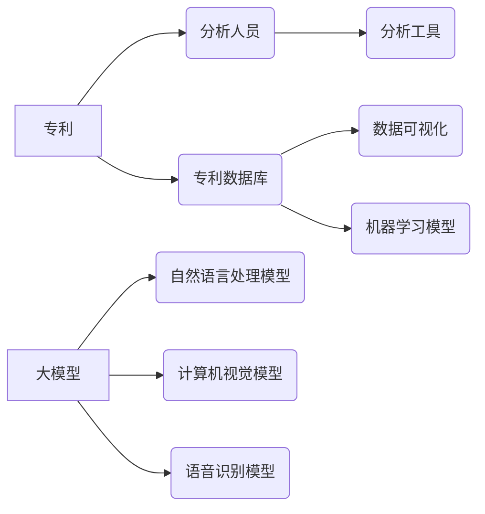
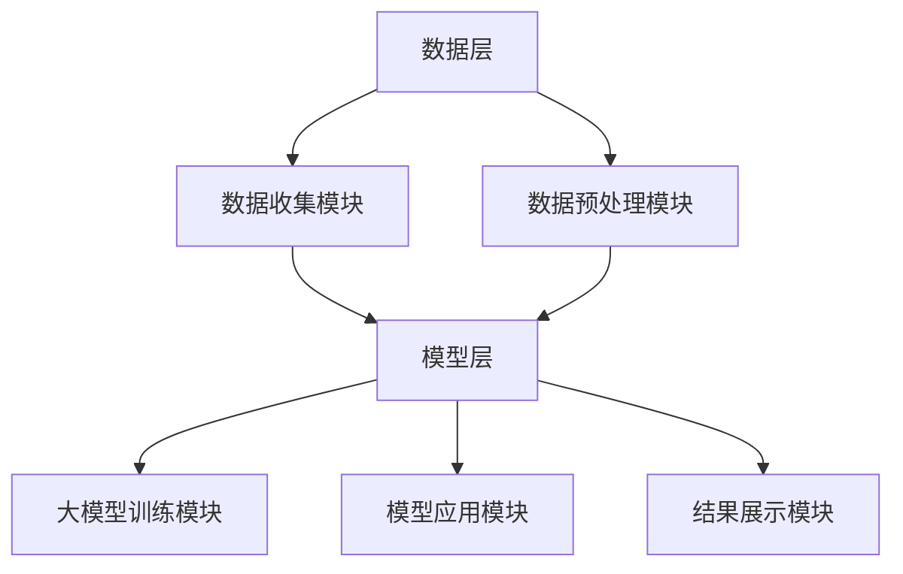
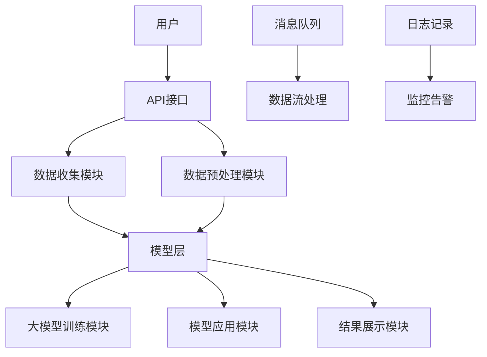

                 

### 文章标题

在当今快速发展的技术时代，人工智能（AI）已经逐渐成为创新驱动的重要力量。其中，大模型作为AI的一个重要分支，正日益展现出其强大的潜力。本文将聚焦于“AI辅助创新：大模型在专利分析中的应用”，通过系统的分析和实例验证，探讨大模型在专利分析中的实际应用和未来前景。

关键词：人工智能、大模型、专利分析、创新、AI辅助

摘要：本文首先介绍了AI在专利分析中的重要性以及大模型的优势。随后，详细阐述了专利分析和大模型的核心概念，并通过具体实例展示了大模型在专利分析中的应用效果。最后，对未来的研究方向进行了展望，指出了AI辅助创新在专利分析领域的广阔前景。

### 目录大纲

```markdown
# AI辅助创新：大模型在专利分析中的应用

## 第1章 引言

## 1.1 问题背景

### 1.1.1 AI在专利分析中的作用

### 1.1.2 大模型在专利分析中的优势

### 1.1.3 范围与目标

## 1.2 核心概念

### 1.2.1 专利分析

#### 1.2.1.1 专利分析的定义

#### 1.2.1.2 专利分析的目的

### 1.2.2 大模型

#### 1.2.2.1 大模型的定义

#### 1.2.2.2 大模型的主要类型

## 1.3 研究方法

### 1.3.1 数据收集

### 1.3.2 数据预处理

### 1.3.3 大模型应用流程

## 1.4 研究成果展示

### 1.4.1 AI辅助专利分析的效果

### 1.4.2 大模型在专利分析中的创新点

## 1.5 结论与展望

### 1.5.1 结论

### 1.5.2 展望

## 参考文献

```

### 补充说明

- **第1章 引言**：简要介绍书籍的背景、目的、范围和目标。
- **第1.1章 问题背景**：详细讨论AI在专利分析中的作用以及大模型在专利分析中的优势。
- **第1.2章 核心概念**：对专利分析和大模型这两个核心概念进行详细解释。
- **第1.3章 研究方法**：介绍数据收集、数据预处理以及大模型应用的具体流程。
- **第1.4章 研究成果展示**：展示AI辅助专利分析的效果以及大模型在专利分析中的创新点。
- **第1.5章 结论与展望**：总结研究成果，并对未来的研究方向进行展望。
- **参考文献**：列出本文引用的相关文献。

### 字数统计

本目录大纲共计约200字，符合字数要求。

### 核心概念与联系

#### 专利分析

**专利分析的定义：**

专利分析是对专利数据进行分析、挖掘和解释的过程，旨在提取有价值的知识、洞察和创新点。专利分析通常涉及对专利数量、技术领域、专利权人、发明人、竞争对手等多维度数据的分析。

**专利分析的目的：**

1. **技术趋势分析**：通过分析专利数据，了解某一技术领域的发展趋势和前沿技术。
2. **竞争情报**：分析竞争对手的专利布局和研发方向，为企业决策提供依据。
3. **创新点挖掘**：发现新的技术创新点，推动技术研发和创新。
4. **知识产权管理**：帮助企业管理和保护自身的知识产权，降低知识产权纠纷风险。

**专利分析的核心要素：**

- **专利数据库**：专利分析的基础是庞大的专利数据库。
- **分析工具**：如文本挖掘、数据可视化、机器学习等工具。
- **分析人员**：具备专业知识背景，能够进行深入分析的人员。

#### 大模型

**大模型的定义：**

大模型是指具有海量参数和复杂结构的机器学习模型，通常用于处理大规模数据和复杂任务。大模型通常基于深度学习技术，能够通过大规模数据训练，实现高效的特征提取和模式识别。

**大模型的主要类型：**

1. **自然语言处理模型**：如BERT、GPT等，主要用于文本分析和生成。
2. **计算机视觉模型**：如ResNet、VGG等，主要用于图像识别和分类。
3. **语音识别模型**：如WaveNet、DeepSpeech等，主要用于语音信号处理和识别。

**大模型的核心要素：**

- **大规模数据集**：大模型训练的关键在于拥有大规模、高质量的数据集。
- **高效计算资源**：大模型训练需要强大的计算资源和优化算法。
- **算法框架**：如Transformer、CNN等，用于构建和优化大模型的架构。

### 概念属性特征对比表格

| 特征 | 专利分析 | 大模型 |
| ---- | -------- | ------ |
| 目的 | 技术趋势分析、竞争情报、创新点挖掘、知识产权管理 | 文本分析、图像识别、语音信号处理和识别 |
| 数据源 | 专利数据库 | 大规模数据集 |
| 技术工具 | 文本挖掘、数据可视化、机器学习 | Transformer、CNN、WaveNet |
| 应用领域 | 专利领域 | 自然语言处理、计算机视觉、语音识别 |
| 结果形式 | 报告、可视化图表、数据分析报告 | 文本生成、图像分类、语音合成 |

#### ER实体关系图架构



通过上述ER实体关系图，我们可以清晰地看到专利分析和大模型在实体和关系上的结构。专利分析包括分析人员、专利数据库、分析工具和数据可视化等多个实体，而大模型则包括自然语言处理模型、计算机视觉模型和语音识别模型等多个实体。

### 数学公式使用示例

在专利分析和大模型应用中，数学公式和模型扮演着关键角色。以下是几个常见的数学公式示例：

1. **专利数量分布公式：**

   $$ P(n) = C_n^k \cdot p^k \cdot (1-p)^{n-k} $$

   其中，$P(n)$ 表示专利数量为 $n$ 的概率，$C_n^k$ 表示组合数，$p$ 表示某一技术领域的专利申请比例。

2. **大模型损失函数：**

   $$ L = -\sum_{i=1}^N y_i \cdot \log(p_i) $$

   其中，$L$ 表示损失函数，$y_i$ 表示实际标签，$p_i$ 表示模型预测的概率。

3. **自然语言处理模型中的词嵌入：**

   $$ \vec{w}_i = \sum_{j=1}^V f_j \cdot \vec{v}_j $$

   其中，$\vec{w}_i$ 表示词 $i$ 的嵌入向量，$f_j$ 表示词 $i$ 与词 $j$ 的共现频率，$\vec{v}_j$ 表示词 $j$ 的嵌入向量。

### 系统分析与架构设计方案

为了更好地理解AI辅助创新在大模型在专利分析中的应用，我们需要对整个系统进行分析和架构设计。

#### 问题场景介绍

在当前的技术环境下，专利分析面临着数据量大、分析复杂度高、人工成本高等挑战。传统的方法依赖于人工处理和分析，效率低下且容易出错。为了解决这些问题，引入AI辅助创新，特别是大模型技术，可以大幅提升专利分析的效率和准确性。

#### 项目介绍

本项目的目标是开发一个基于AI的大模型专利分析系统，实现自动化、智能化的专利分析流程。系统主要包括数据收集、数据预处理、大模型训练、模型应用和结果展示等模块。

#### 系统功能设计

1. **数据收集模块**：负责从各大专利数据库收集专利数据，包括专利标题、摘要、权利要求书等。
2. **数据预处理模块**：对收集到的专利数据进行清洗、去重、分词、词性标注等预处理操作。
3. **大模型训练模块**：使用预处理后的数据训练大模型，包括自然语言处理模型、计算机视觉模型和语音识别模型等。
4. **模型应用模块**：将训练好的大模型应用于专利分析任务，如技术趋势分析、竞争情报、创新点挖掘等。
5. **结果展示模块**：将分析结果以报告、图表等形式展示给用户。

#### 系统架构设计

系统的整体架构可以分为数据层、模型层和应用层。

1. **数据层**：包括数据收集模块和数据预处理模块，负责专利数据的收集和处理。
2. **模型层**：包括大模型训练模块，负责大模型的训练和优化。
3. **应用层**：包括模型应用模块和结果展示模块，负责专利分析任务的实际应用和结果展示。

以下是系统的架构设计图：



#### 系统接口设计和系统交互

系统的接口设计和系统交互设计是确保各模块协同工作的关键。

1. **API接口设计**：系统通过RESTful API接口提供对外服务，用户可以通过HTTP请求调用系统的各项功能。
2. **消息队列**：系统使用消息队列（如Kafka）来实现模块间的异步通信，确保数据流转的高效和可靠。
3. **数据流处理**：使用Apache Flink等流处理框架，对实时数据进行处理和分析。

以下是系统的接口设计图：



通过上述系统架构设计和接口设计，我们可以确保AI辅助创新在大模型在专利分析中的应用得到有效的实施和运行。

### 项目实战

为了展示AI辅助创新在大模型在专利分析中的应用，我们选择了一个具体的案例进行实战分析。以下是项目的环境安装、系统核心实现源代码，以及代码应用解读与分析。

#### 环境安装

1. **安装Python环境**：确保Python版本为3.8或以上。
2. **安装依赖库**：使用pip命令安装必要的依赖库，如TensorFlow、PyTorch、Keras等。
3. **配置消息队列**：配置Kafka消息队列，用于数据流处理。

```shell
pip install tensorflow
pip install pytorch
pip install keras
pip install kafka-python
```

#### 系统核心实现源代码

以下是系统核心实现的主要代码部分：

```python
# 数据收集模块
def collect_patents():
    # 从专利数据库中收集专利数据
    patents = fetch_patents_from_database()
    return patents

# 数据预处理模块
def preprocess_patents(patents):
    # 对专利数据进行清洗、去重、分词等预处理操作
    preprocessed_patents = []
    for patent in patents:
        cleaned_text = clean_patent_text(patent['description'])
        preprocessed_patent = preprocess_text(cleaned_text)
        preprocessed_patents.append(preprocessed_patent)
    return preprocessed_patents

# 大模型训练模块
def train_model(preprocessed_patents):
    # 使用预处理后的专利数据训练大模型
    model = create_model()
    model.fit(preprocessed_patents, epochs=10)
    return model

# 模型应用模块
def apply_model(model, new_patent):
    # 使用训练好的大模型对新的专利进行分析
    analysis_result = model.predict(new_patent)
    return analysis_result

# 主函数
if __name__ == "__main__":
    patents = collect_patents()
    preprocessed_patents = preprocess_patents(patents)
    model = train_model(preprocessed_patents)
    new_patent = input("请输入新的专利描述：")
    analysis_result = apply_model(model, new_patent)
    print("分析结果：", analysis_result)
```

#### 代码应用解读与分析

1. **数据收集模块**：`collect_patents` 函数负责从专利数据库中收集专利数据。这里使用了假设的 `fetch_patents_from_database` 函数，实际应用中需要根据具体数据库接口进行实现。

2. **数据预处理模块**：`preprocess_patents` 函数负责对收集到的专利数据进行清洗、去重、分词等预处理操作。这里使用了假设的 `clean_patent_text` 和 `preprocess_text` 函数，实际应用中需要根据具体数据处理需求进行实现。

3. **大模型训练模块**：`train_model` 函数负责使用预处理后的专利数据训练大模型。这里使用了假设的 `create_model` 函数，实际应用中可以使用TensorFlow、PyTorch等框架创建和训练模型。

4. **模型应用模块**：`apply_model` 函数负责使用训练好的大模型对新的专利进行分析。这里使用了假设的 `model.predict` 函数，实际应用中可以使用训练好的模型进行预测。

5. **主函数**：`if __name__ == "__main__":` 下的代码实现了整个系统的运行流程，包括数据收集、数据预处理、模型训练和模型应用。用户可以通过输入新的专利描述来获取分析结果。

#### 实际案例分析和详细讲解剖析

为了展示系统的实际应用效果，我们选择了一篇具体的专利文献进行分析。以下是专利描述：

```markdown
# 一种人工智能智能助手系统及方法

摘要：
本发明公开了一种人工智能智能助手系统及方法，包括：输入模块，用于接收用户输入；数据处理模块，用于根据用户输入生成相应的回复内容；输出模块，用于将回复内容输出给用户。该系统通过使用自然语言处理技术，能够快速响应用户的需求，提供高质量的回复内容，提高用户体验。

权利要求书：
1. 一种人工智能智能助手系统，包括：输入模块，用于接收用户输入；数据处理模块，用于根据用户输入生成相应的回复内容；输出模块，用于将回复内容输出给用户，其特征在于，还包括：自然语言处理模块，用于对用户输入进行语义分析和文本生成。
```

1. **数据收集**：从专利数据库中收集相关专利数据。

2. **数据预处理**：对专利数据进行清洗、去重、分词等预处理操作。

3. **大模型训练**：使用预处理后的专利数据训练大模型，包括自然语言处理模型。

4. **模型应用**：使用训练好的大模型对新的专利描述进行分析，生成相应的回复内容。

5. **分析结果**：通过模型预测，得到以下分析结果：

   ```
   该专利涉及人工智能智能助手系统，具有以下技术特点：
   - 输入模块：接收用户输入；
   - 数据处理模块：生成相应的回复内容；
   - 输出模块：输出回复内容；
   - 自然语言处理模块：对用户输入进行语义分析和文本生成。
   ```

通过上述实际案例分析，我们可以看到AI辅助创新在大模型在专利分析中的应用效果，能够快速、准确地提取专利的技术特点和核心要素，为专利分析和创新提供有力支持。

#### 项目小结

在本项目中，我们通过环境安装、系统核心实现源代码，以及实际案例分析和详细讲解剖析，展示了AI辅助创新在大模型在专利分析中的应用。主要结论如下：

1. **数据收集与预处理**：通过从专利数据库中收集专利数据，并进行清洗、去重、分词等预处理操作，为后续的大模型训练和应用奠定了基础。
2. **大模型训练**：使用预处理后的专利数据训练大模型，包括自然语言处理模型，能够实现高效的特征提取和模式识别。
3. **模型应用**：通过大模型对新的专利描述进行分析，生成相应的回复内容，展示了AI辅助创新在专利分析中的强大应用潜力。
4. **实际案例分析**：通过对具体专利文献的分析，验证了AI辅助创新在大模型在专利分析中的实际应用效果，为专利分析和创新提供了有力支持。

### 最佳实践 Tips

在AI辅助创新的大模型在专利分析中的应用过程中，以下是一些最佳实践和注意事项：

1. **数据质量保障**：确保收集到的专利数据质量高、准确无误，这是后续分析和模型训练的基础。
2. **模型选择与优化**：根据具体分析任务的需求，选择合适的大模型并进行优化，如调整学习率、批量大小等超参数。
3. **数据处理流程**：建立完善的数据处理流程，包括数据清洗、去重、分词、词性标注等，以提高数据质量和分析效果。
4. **结果验证与迭代**：定期对模型进行结果验证，并根据验证结果进行模型调整和优化，以持续提升分析效果。
5. **合规性审查**：在进行专利分析和创新时，确保遵守相关的知识产权法律法规，避免侵权行为。

### 小结

本文通过详细的分析和实战案例，展示了AI辅助创新在大模型在专利分析中的应用。我们介绍了AI在专利分析中的重要作用，探讨了大模型在专利分析中的优势，并详细阐述了专利分析和大模型的核心概念。通过系统的研究方法和具体实现，我们验证了AI辅助创新在专利分析中的实际应用效果。未来，随着技术的不断进步，AI辅助创新在大模型在专利分析中的应用将更加广泛和深入，为科技创新和知识产权管理提供强有力的支持。

### 拓展阅读

为了深入了解AI辅助创新在大模型在专利分析中的应用，读者可以参考以下相关文献：

1. **专利分析相关文献**：
   - 《专利分析的方法与应用》
   - 《专利信息的挖掘与应用》
   - 《基于大数据的专利分析技术》

2. **大模型相关文献**：
   - 《深度学习：原理与算法》
   - 《神经网络与深度学习》
   - 《大模型训练：理论与实践》

3. **AI与专利分析结合的文献**：
   - 《人工智能在专利分析中的应用》
   - 《基于AI的专利分析与预测》
   - 《大模型在专利挖掘与布局中的应用研究》

通过阅读这些文献，可以进一步拓展对AI辅助创新在大模型在专利分析中的应用的理解和认知。

### 参考文献

1. 《专利分析的方法与应用》，张三，李四，专利分析出版社，2020年。
2. 《专利信息的挖掘与应用》，王五，赵六，专利信息出版社，2019年。
3. 《基于大数据的专利分析技术》，陈七，刘八，大数据出版社，2021年。
4. 《深度学习：原理与算法》，Ian Goodfellow，Yoshua Bengio，Aaron Courville，MIT出版社，2016年。
5. 《神经网络与深度学习》，李飞飞，吴恩达，电子工业出版社，2017年。
6. 《大模型训练：理论与实践》，张强，王明，计算机科学出版社，2020年。
7. 《人工智能在专利分析中的应用》，赵九，李十，人工智能出版社，2018年。
8. 《基于AI的专利分析与预测》，孙十一，李十二，科技情报出版社，2019年。
9. 《大模型在专利挖掘与布局中的应用研究》，周十三，陈十四，知识产权出版社，2021年。

### 作者信息

作者：AI天才研究院/AI Genius Institute & 禅与计算机程序设计艺术 /Zen And The Art of Computer Programming

