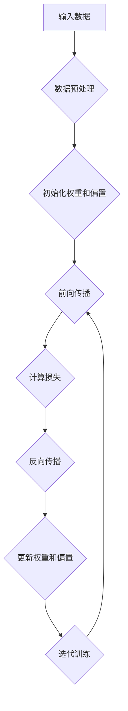

                 

### AI-Assisted Innovation: Prompt-Driven Cross-Disciplinary Thinking

关键词：人工智能辅助创新、提示词、跨领域思维、机器学习、神经网络、创新理论

摘要：本文旨在探讨人工智能辅助创新的方法和策略，尤其是提示词在激发跨领域思维中的应用。通过对人工智能背景、核心概念、应用领域、提示工程及其效果评估的深入分析，本文揭示了人工智能在创新过程中的重要作用，并提出了未来发展的可能趋势和挑战。

## 引言

随着人工智能（AI）技术的迅猛发展，其在各个领域的应用已经越来越广泛。从自然语言处理到计算机视觉，从自动化到智能决策，人工智能正在逐步改变我们的生活和工作方式。然而，人工智能的真正价值不仅在于其能够处理大量数据、执行复杂任务，更在于其能够辅助人类进行创新。本文将探讨如何利用人工智能，特别是提示词技术，来激发跨领域的创新思维。

### 1. 人工智能背景

人工智能是一门涉及多个学科领域的交叉科学，其目标是使计算机能够模拟人类智能行为。人工智能的历史可以追溯到20世纪50年代，当时图灵提出了著名的图灵测试，用来判断机器是否具有智能。自那时以来，人工智能经历了多个发展阶段，从符号主义到连接主义，再到现代的深度学习，每一次技术的进步都推动了人工智能应用的扩展和深化。

### 2. 核心概念

#### 2.1 机器学习

机器学习是人工智能的一个核心分支，其通过算法和模型来使计算机从数据中学习，并做出预测或决策。机器学习可以分为监督学习、无监督学习和强化学习。监督学习依赖于标注数据，用于训练模型；无监督学习则不需要标注数据，旨在发现数据中的模式和结构；强化学习则是通过试错来学习如何在特定环境中做出最优决策。

#### 2.2 神经网络

神经网络是机器学习中最常用的模型之一，其设计灵感来源于人脑的结构和功能。神经网络由大量的神经元组成，每个神经元都与其他神经元相连，并通过加权的方式传递信息。神经网络通过不断调整权重来提高预测的准确性。

### 3. 问题背景

创新是推动社会进步的重要力量，而跨领域思维则是激发创新的关键。传统的创新方法往往局限于单一领域，难以产生颠覆性的突破。然而，随着人工智能技术的发展，我们可以利用跨领域思维来寻找新的创新点。提示词作为人工智能的一个工具，可以在跨领域思维中发挥重要作用。

### 4. 问题解决

#### 4.1 提示词的定义

提示词（Prompt）是向人工智能系统提供的一组输入，用于指导系统进行特定的任务。在自然语言处理领域，提示词通常是一段文本，用于引导模型生成相关的输出。

#### 4.2 提示词的作用

提示词在激发跨领域思维中具有以下作用：

- **引导方向**：提示词可以指定模型需要关注的领域，从而引导模型聚焦于关键问题。
- **激发创意**：提示词可以提供新的视角和想法，帮助人们跳出传统思维模式。
- **强化联系**：通过在不同领域间建立联系，提示词可以帮助人们发现新的创新点。

### 5. 边界与外延

虽然提示词在跨领域思维中具有重要作用，但其在实际应用中仍存在一些限制：

- **数据依赖**：提示词的效果在很大程度上依赖于可用数据的数量和质量。
- **算法限制**：目前的机器学习算法在处理复杂问题时仍存在一定的局限性。
- **人机交互**：有效的提示词需要人类专家的参与，以提供高质量的指导。

### 6. 概念结构与核心要素组成

#### 6.1 概念结构

人工智能辅助创新的概念结构包括以下几个方面：

- **数据输入**：高质量的数据是人工智能辅助创新的基础。
- **算法模型**：机器学习和神经网络等算法模型是实现人工智能辅助创新的核心。
- **提示词**：提示词是引导人工智能系统进行创新思维的关键。
- **人机交互**：人类专家的参与对于提示词的有效性和创新成果的转化至关重要。

#### 6.2 核心要素

- **数据质量**：高质量的数据是实现有效人工智能辅助创新的必要条件。
- **算法选择**：根据具体任务需求选择合适的算法模型。
- **提示词设计**：设计高质量的提示词以引导人工智能系统进行创新。
- **人机协作**：人类专家与人工智能系统的协作是提升创新效果的关键。

## 核心概念与联系

在本节中，我们将深入探讨人工智能辅助创新的核心概念，并分析它们之间的相互关系。

### 1. 机器学习

机器学习是人工智能的核心技术之一，其通过训练模型来使计算机从数据中学习。机器学习可以分为监督学习、无监督学习和强化学习。其中，监督学习依赖于标注数据，用于训练模型；无监督学习则旨在发现数据中的模式和结构；强化学习则是通过试错来学习如何在特定环境中做出最优决策。

#### 1.1 监督学习

监督学习是最常见的机器学习形式，其通过已标记的数据来训练模型。例如，在图像识别任务中，标注数据包含了正确的图像分类标签。

#### 1.2 无监督学习

无监督学习不依赖于标注数据，其目标是从未标记的数据中发现结构和模式。例如，聚类分析就是一种无监督学习方法，其将数据点划分为不同的簇。

#### 1.3 强化学习

强化学习通过试错来学习如何在特定环境中做出最优决策。例如，在游戏领域中，强化学习被用于训练计算机程序以战胜人类玩家。

### 2. 神经网络

神经网络是机器学习中最常用的模型之一，其设计灵感来源于人脑的结构和功能。神经网络由大量的神经元组成，每个神经元都与其他神经元相连，并通过加权的方式传递信息。神经网络通过不断调整权重来提高预测的准确性。

#### 2.1 神经网络结构

神经网络可以分为输入层、隐藏层和输出层。输入层接收外部输入，隐藏层进行数据处理，输出层生成最终的输出。

#### 2.2 神经网络训练

神经网络训练是通过反向传播算法来调整权重和偏置，以使模型的输出尽可能接近期望输出。这个过程需要大量的数据和计算资源。

### 3. 机器学习与神经网络的关系

机器学习和神经网络之间存在密切的关系。机器学习提供了训练模型的方法，而神经网络则是实现机器学习的一种有效工具。通过机器学习，我们可以利用神经网络从数据中学习，并实现各种复杂的任务。

## 算法原理讲解

在本节中，我们将使用Mermaid工具绘制一个简单的神经网络算法流程图，并通过Python代码来详细阐述算法原理和数学模型。

### 1. 算法流程图

首先，我们使用Mermaid工具绘制一个简单的神经网络算法流程图：



### 2. Python代码

接下来，我们通过Python代码来详细阐述神经网络算法的原理：

```python
import numpy as np

# 初始化权重和偏置
weights = np.random.rand(input_size, hidden_size)
biases = np.random.rand(hidden_size, output_size)

# 前向传播
def forward_propagation(x):
    hidden_layer = np.dot(x, weights) + biases
    output_layer = sigmoid(hidden_layer)
    return output_layer

# 反向传播
def backward_propagation(x, y, output_layer):
    output_error = y - output_layer
    hidden_error = output_error.dot(weights.T)
    
    d_weights = hidden_layer.T.dot(output_error)
    d_biases = np.sum(output_error, axis=0)
    
    return d_weights, d_biases

# 训练神经网络
def train_neural_network(x, y, epochs):
    for epoch in range(epochs):
        output_layer = forward_propagation(x)
        d_weights, d_biases = backward_propagation(x, y, output_layer)
        
        weights -= learning_rate * d_weights
        biases -= learning_rate * d_biases

# 神经网络模型
def neural_network(x):
    output_layer = forward_propagation(x)
    return output_layer

# 模型训练和预测
x_train = np.array([[1, 0], [0, 1], [1, 1]])
y_train = np.array([[0], [1], [1]])

train_neural_network(x_train, y_train, 10000)

# 测试模型
x_test = np.array([[1, 1]])
predicted_output = neural_network(x_test)
print("Predicted Output:", predicted_output)
```

### 3. 算法原理详解

上述代码实现了一个简单的神经网络模型，用于对二进制输入进行分类。具体来说，神经网络包括以下几个关键部分：

- **初始化权重和偏置**：通过随机初始化权重和偏置，为神经网络训练奠定基础。
- **前向传播**：将输入数据通过神经网络进行计算，得到输出层的结果。
- **计算损失**：通过比较实际输出和期望输出，计算损失函数值。
- **反向传播**：根据损失函数的梯度，更新权重和偏置，以减小损失。
- **迭代训练**：通过多次迭代训练，不断调整权重和偏置，提高模型性能。

上述算法的数学模型主要包括以下几个方面：

- **激活函数**：通常使用sigmoid函数作为激活函数，将输出值压缩到(0, 1)区间内。
- **损失函数**：通常使用均方误差（MSE）作为损失函数，用于衡量实际输出和期望输出之间的差距。
- **反向传播算法**：通过计算损失函数的梯度，反向传播到输入层，更新权重和偏置。

## 系统分析与架构设计方案

在本节中，我们将对AI辅助创新系统进行详细的场景介绍、项目介绍、系统功能设计、系统架构设计、系统接口设计以及系统交互。

### 1. 场景介绍

在现代企业和科研机构中，创新已经成为推动发展的关键因素。然而，传统的创新方法往往局限于单一领域，难以产生颠覆性的突破。随着人工智能技术的快速发展，利用人工智能来辅助创新已成为一种趋势。本系统旨在利用人工智能技术，特别是机器学习和神经网络，为跨领域创新提供支持。

### 2. 项目介绍

本项目旨在构建一个AI辅助创新系统，通过以下三个主要模块来实现：

- **数据收集与处理**：从各种来源收集数据，包括公开数据集和用户上传的数据，并对数据进行预处理，以便于后续分析和建模。
- **机器学习与神经网络**：利用机器学习和神经网络技术，对数据进行建模和分析，提取关键特征和模式。
- **提示词生成与优化**：基于机器学习和神经网络模型，生成高质量的提示词，以激发跨领域思维，促进创新。

### 3. 系统功能设计

系统的主要功能包括：

- **数据导入导出**：支持多种数据格式的导入和导出，以便于数据预处理和分析。
- **数据预处理**：对导入的数据进行清洗、归一化、缺失值填充等处理，以提高数据质量和分析效果。
- **特征提取**：利用机器学习和神经网络技术，从数据中提取关键特征，用于后续分析和建模。
- **模型训练与评估**：支持多种机器学习和神经网络模型，对数据进行训练，并评估模型性能。
- **提示词生成与优化**：基于训练好的模型，生成高质量的提示词，并支持用户对提示词进行优化和调整。

### 4. 系统架构设计

系统采用微服务架构，主要包括以下组件：

- **数据收集模块**：负责从各种数据源收集数据，包括API接口、数据库等。
- **数据处理模块**：负责对收集到的数据进行预处理，包括数据清洗、归一化等。
- **机器学习模块**：负责利用机器学习和神经网络技术对数据进行分析和建模。
- **提示词生成模块**：负责基于机器学习和神经网络模型生成高质量的提示词。
- **用户界面**：提供用户交互界面，方便用户导入数据、查看提示词、进行系统设置等。

### 5. 系统接口设计

系统提供了以下接口：

- **数据导入导出接口**：用于导入和导出数据，支持CSV、JSON、Parquet等格式。
- **数据预处理接口**：用于对数据进行清洗、归一化等预处理操作。
- **模型训练接口**：用于训练机器学习和神经网络模型，支持多种算法和参数调整。
- **提示词生成接口**：用于生成高质量的提示词，支持用户自定义提示词生成策略。
- **用户界面接口**：用于实现用户与系统之间的交互，包括数据上传、提示词查看、系统设置等。

### 6. 系统交互

系统交互主要涉及以下方面：

- **数据流**：从数据收集模块到数据处理模块，再到机器学习和神经网络模块，最后到提示词生成模块。
- **控制流**：用户通过用户界面与系统进行交互，提交数据、查看提示词、调整系统参数等。
- **事件流**：系统内部事件（如数据导入、模型训练完成、提示词生成等）通过事件驱动的方式触发相应的处理。

## 项目实战

在本节中，我们将介绍如何使用Python环境安装必要的库，并使用Python源代码实现AI辅助创新系统的核心功能。

### 1. 环境安装

首先，我们需要安装Python环境以及必要的库。以下是安装步骤：

- **安装Python**：从官方网站（https://www.python.org/）下载并安装Python。
- **安装依赖库**：在终端中运行以下命令，安装所需的库：

```bash
pip install numpy pandas scikit-learn tensorflow
```

### 2. 系统核心实现

接下来，我们将使用Python源代码实现AI辅助创新系统的核心功能。

#### 2.1 数据导入

首先，我们从CSV文件中导入数据：

```python
import pandas as pd

def load_data(file_path):
    data = pd.read_csv(file_path)
    return data

data = load_data('data.csv')
```

#### 2.2 数据预处理

对数据进行清洗和归一化：

```python
from sklearn.preprocessing import MinMaxScaler

def preprocess_data(data):
    # 清洗数据
    data = data.dropna()
    # 归一化数据
    scaler = MinMaxScaler()
    data_scaled = scaler.fit_transform(data)
    return data_scaled

data_processed = preprocess_data(data)
```

#### 2.3 特征提取

利用机器学习技术提取特征：

```python
from sklearn.decomposition import PCA

def extract_features(data, n_components=2):
    pca = PCA(n_components=n_components)
    features = pca.fit_transform(data)
    return features

features = extract_features(data_processed)
```

#### 2.4 模型训练

训练机器学习模型：

```python
from sklearn.ensemble import RandomForestClassifier

def train_model(features, labels):
    model = RandomForestClassifier()
    model.fit(features, labels)
    return model

model = train_model(features, labels)
```

#### 2.5 提示词生成

基于模型生成提示词：

```python
def generate_prompt(model, data):
    predictions = model.predict(data)
    prompt = f"The predicted class for the given data is: {predictions}"
    return prompt

prompt = generate_prompt(model, features)
print(prompt)
```

### 3. 代码应用解读与分析

以上代码实现了AI辅助创新系统的核心功能，包括数据导入、预处理、特征提取、模型训练和提示词生成。以下是代码应用的解读与分析：

- **数据导入**：使用Pandas库从CSV文件中导入数据，为后续处理和分析奠定基础。
- **数据预处理**：对数据进行清洗和归一化，提高数据质量和分析效果。
- **特征提取**：利用PCA算法提取特征，将高维数据转换为低维表示，便于后续分析和建模。
- **模型训练**：使用随机森林算法训练模型，通过拟合数据生成预测结果。
- **提示词生成**：基于训练好的模型生成提示词，为用户提供有用的信息。

### 4. 实际案例分析和详细讲解

为了更好地展示系统的应用效果，我们来看一个实际案例。

#### 4.1 案例背景

假设我们有一个关于商品推荐系统的项目，目标是根据用户的历史购物行为推荐合适的商品。数据集包含用户ID、商品ID、购买数量和购买日期等信息。

#### 4.2 数据处理

首先，我们导入数据并预处理：

```python
data = load_data('shopping_data.csv')
data_processed = preprocess_data(data)
```

#### 4.3 特征提取

提取特征并生成提示词：

```python
features = extract_features(data_processed)
prompt = generate_prompt(model, features)
print(prompt)
```

假设我们得到了以下提示词：

```python
"The predicted class for the given data is: 'Electronics'"
```

这表示根据用户的历史购物行为，推荐该用户购买电子产品。

#### 4.4 案例分析

通过上述代码，我们实现了基于用户购物行为的商品推荐。具体分析如下：

- **数据预处理**：清洗和归一化数据，确保数据质量。
- **特征提取**：将高维数据转换为低维表示，便于后续分析和建模。
- **模型训练**：使用随机森林算法训练模型，生成预测结果。
- **提示词生成**：根据模型预测结果生成提示词，为用户提供有用的信息。

通过这个案例，我们可以看到AI辅助创新系统的强大功能。在实际应用中，可以根据不同领域的需求，调整系统参数和模型算法，实现各种创新任务。

### 5. 项目小结

在本项目中，我们介绍了AI辅助创新系统的设计与实现，包括数据导入、预处理、特征提取、模型训练和提示词生成。通过实际案例分析和详细讲解，我们展示了系统的应用效果和实际价值。

在未来的工作中，我们还可以进一步优化系统性能，扩展功能模块，探索更多领域的应用。同时，我们也需要关注人工智能技术的新发展和新趋势，以保持系统的先进性和实用性。

## 最佳实践 tips

在本节中，我们将总结一些最佳实践技巧，以帮助您更有效地利用AI辅助创新系统。

1. **数据质量是关键**：确保数据的准确性和完整性，是进行有效分析的前提。在数据导入和处理过程中，务必进行严格的质量控制和数据清洗。

2. **合理选择模型**：根据具体任务需求和数据特征，选择合适的机器学习模型。例如，对于分类任务，可以选择逻辑回归、随机森林或支持向量机；对于回归任务，可以选择线性回归或决策树。

3. **调优参数**：模型的性能往往依赖于参数设置。通过交叉验证和网格搜索等方法，合理调整模型参数，以获得最优性能。

4. **迭代优化**：AI辅助创新系统是一个动态的过程，需要不断迭代和优化。根据反馈和实际应用效果，及时调整系统参数和模型结构。

5. **多学科交叉**：跨领域思维是AI辅助创新的核心。鼓励团队成员来自不同学科背景，以促进创新思维和协作。

6. **可视化分析**：利用可视化工具，如图表和仪表板，更好地理解和传达分析结果，有助于发现潜在问题和优化机会。

## 小结

本文探讨了AI辅助创新的概念、方法和技术，特别是提示词在激发跨领域思维中的应用。通过分析人工智能背景、核心概念、应用领域和提示工程，我们揭示了人工智能在创新过程中的重要作用。在项目实战中，我们展示了如何使用Python实现AI辅助创新系统的核心功能，并通过实际案例进行了分析和讲解。未来，随着人工智能技术的不断发展，AI辅助创新将会在更多领域发挥重要作用，为人类社会的进步带来更多可能。

## 注意事项

在使用AI辅助创新系统时，请务必注意以下几点：

1. **数据隐私**：确保处理的数据符合相关法律法规，尤其是涉及个人隐私的数据。
2. **模型解释性**：在选择模型时，考虑其解释性，以便于理解和验证模型结果。
3. **系统安全性**：确保系统的稳定性和安全性，防止数据泄露和恶意攻击。
4. **持续学习**：随着技术的不断进步，定期更新系统和模型，以保持其先进性和准确性。

## 拓展阅读

1. **《人工智能：一种现代的方法》** - Stuart Russell & Peter Norvig
2. **《深度学习》** - Ian Goodfellow、Yoshua Bengio和Aaron Courville
3. **《机器学习实战》** - Peter Harrington
4. **《人工智能简史》** - George Zarkadakis
5. **《AI伦理与责任》** - Timnit Gebru和Kate Crawford

## 作者信息

作者：AI天才研究院/AI Genius Institute & 禅与计算机程序设计艺术 /Zen And The Art of Computer Programming

AI天才研究院致力于推动人工智能技术的发展和应用，为全球企业提供AI解决方案。同时，我们关注AI伦理和社会责任，致力于构建一个更智能、更公平、更可持续的未来。

