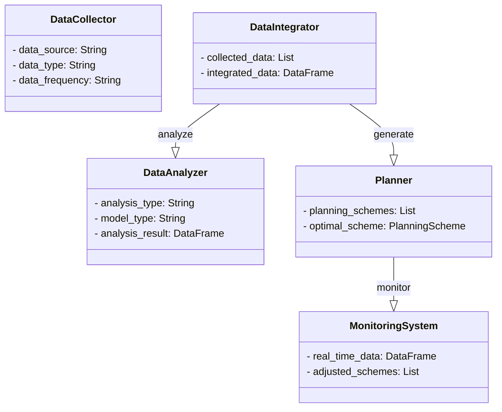
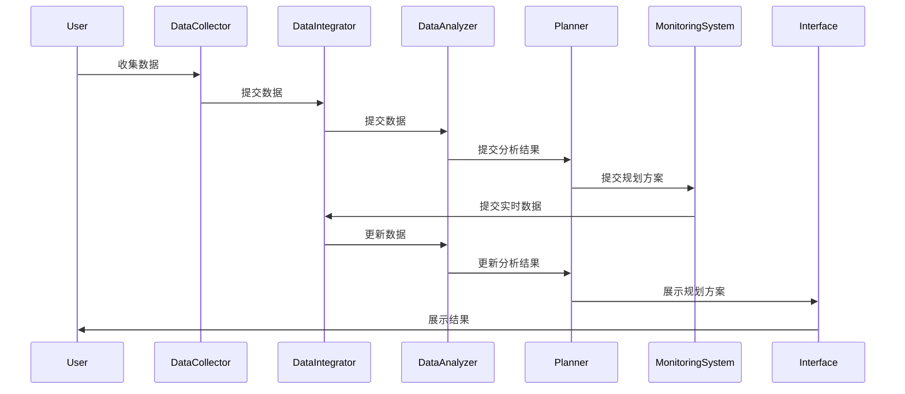
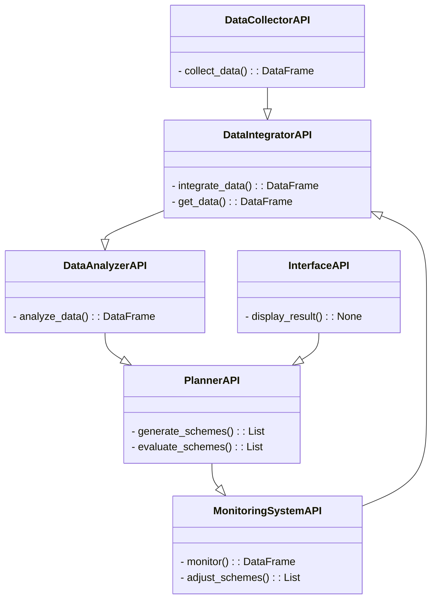
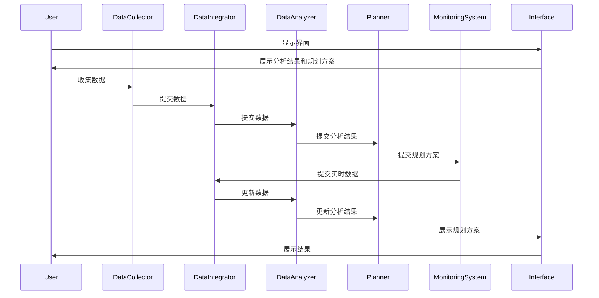

                 

### 文章标题：AI辅助城市规划：大模型在智慧城市中的角色

关键词：AI、城市规划、大模型、智慧城市、算法、系统架构

摘要：随着人工智能技术的迅猛发展，AI在各个领域的应用不断拓展，尤其是在城市规划中，大模型的应用正逐步改变传统的规划方式。本文旨在探讨AI辅助城市规划的核心概念、算法原理、系统架构以及实际应用，以期为智慧城市的发展提供新的思路。

### 目录大纲设计

1. **第一部分：背景介绍**
   - **第1章：问题背景与核心概念**
     - **1.1 问题背景**
     - **1.2 核心概念**
     - **1.2.1 AI的概念**
     - **1.2.2 城市规划的概念**
     - **1.2.3 AI辅助城市规划的核心要素**

2. **第二部分：AI辅助城市规划的核心概念与联系**
   - **第2章：AI辅助城市规划的核心概念**
   - **第3章：核心概念的联系与融合**
     - **3.2 AI辅助城市规划的ER实体关系图**

3. **第三部分：AI辅助城市规划的算法原理与实现**
   - **第4章：算法原理与数学模型**
   - **第5章：算法实现与Python代码**

4. **第四部分：系统分析与架构设计**
   - **第6章：城市规划系统功能设计与架构**
     - **6.1 问题场景介绍**
     - **6.2 系统功能设计**
     - **6.3 系统架构设计**
     - **6.4 系统接口设计与交互**

5. **第五部分：项目实战与案例分析**
   - **第7章：AI辅助城市规划项目实战**

6. **第六部分：最佳实践与拓展阅读**
   - **第8章：AI辅助城市规划的最佳实践**
   - **第9章：拓展阅读与未来发展**

### 第一部分：背景介绍

#### 第1章：问题背景与核心概念

##### 1.1 问题背景

城市规划是城市发展的重要组成部分，它不仅关系到城市空间的合理利用，还直接影响居民的生活质量。然而，随着城市化进程的加速，城市规划面临着诸多挑战：

1. **数据复杂性**：城市规划需要处理海量的数据，包括人口、交通、环境、经济等多方面的数据，如何有效地整合和处理这些数据成为一大难题。
2. **动态变化性**：城市规划是一个动态的过程，城市的发展受到多种因素的影响，如何实时更新和调整规划方案是一个挑战。
3. **效率问题**：传统城市规划方法往往需要大量的时间和人力，效率较低，如何在保证质量的前提下提高规划效率成为关键。

为解决这些问题，人工智能（AI）技术的引入成为了一个新的趋势。AI技术，特别是大模型，可以提供高效的数据处理和分析能力，为城市规划提供有力的支持。

##### 1.2 智慧城市与AI技术的关系

智慧城市是城市发展的新阶段，它强调利用信息技术和AI技术实现城市的智能化管理。AI技术在智慧城市中扮演着重要角色，主要体现在以下几个方面：

1. **数据分析与决策支持**：AI技术可以对城市各类数据进行分析，为城市规划提供科学依据，辅助决策者做出更合理的决策。
2. **智能交通管理**：通过AI技术，可以实时监测交通状况，优化交通流量，减少拥堵，提高交通效率。
3. **公共安全与应急响应**：AI技术可以实现对城市安全风险的预测和监控，提高公共安全和应急响应的效率。
4. **能源管理**：AI技术可以帮助城市实现能源的智能管理，降低能源消耗，提高能源利用效率。

##### 1.3 AI辅助城市规划的现状与挑战

目前，AI辅助城市规划已经在一些城市得到了初步的应用，取得了显著的成果。然而，AI技术在城市规划中的应用仍面临一些挑战：

1. **技术成熟度**：尽管AI技术发展迅速，但在城市规划中的应用仍存在一些技术难题，如数据质量、模型准确性等。
2. **数据隐私与安全**：城市规划涉及大量的个人数据，如何保障数据的安全和隐私是一个重要问题。
3. **人才短缺**：AI技术在城市规划中的应用需要专业的技术人才，但目前这方面的人才相对短缺。

##### 1.2 核心概念

###### 1.2.1 AI的概念

人工智能（AI，Artificial Intelligence）是指模拟、延伸和扩展人的智能的理论、方法、技术及应用。它主要包括以下几种类型：

1. **机器学习**：通过数据驱动的方法，让计算机自动学习并做出决策。
2. **深度学习**：一种特殊的机器学习方法，通过神经网络模拟人脑的学习过程。
3. **自然语言处理**：使计算机能够理解和处理自然语言。
4. **计算机视觉**：使计算机能够理解和解释视觉信息。

###### 1.2.2 城市规划的概念

城市规划是指根据城市发展的目标和需求，对城市的空间布局、土地利用、交通组织、环境治理等进行合理规划和设计，以实现城市的可持续发展。

城市规划的主要任务包括：

1. **空间规划**：确定城市的空间结构和功能分区。
2. **土地利用规划**：合理分配土地资源，满足各类用地的需求。
3. **交通规划**：优化交通组织，提高交通效率。
4. **环境规划**：保护城市环境，实现生态平衡。

###### 1.2.3 AI辅助城市规划的核心要素

AI辅助城市规划的核心要素包括：

1. **数据**：高质量的数据是AI辅助城市规划的基础，包括城市的人口、经济、交通、环境等多方面的数据。
2. **算法**：AI算法是实现城市规划目标的关键，如机器学习、深度学习等。
3. **模型**：通过构建数学模型，将AI算法应用于城市规划中，实现对城市数据的分析和预测。
4. **平台**：构建一个集数据管理、算法应用、模型预测为一体的平台，以支持城市规划的智能化。

### 第二部分：AI辅助城市规划的核心概念与联系

#### 第2章：AI辅助城市规划的核心概念

##### 2.1 人工智能基本原理

人工智能（AI，Artificial Intelligence）是指模拟、延伸和扩展人的智能的理论、方法、技术及应用。它主要包括以下几种类型：

1. **机器学习**：通过数据驱动的方法，让计算机自动学习并做出决策。
   - **监督学习**：有明确的目标和标准，通过训练数据学习，如分类、回归等。
   - **无监督学习**：没有明确的目标和标准，通过观察数据模式学习，如聚类、降维等。
   - **半监督学习**：既有有标签的数据，也有无标签的数据，通过这两种数据共同训练模型。

2. **深度学习**：一种特殊的机器学习方法，通过神经网络模拟人脑的学习过程。
   - **卷积神经网络（CNN）**：主要用于图像处理。
   - **循环神经网络（RNN）**：主要用于序列数据处理。
   - **生成对抗网络（GAN）**：用于生成数据、图像、文本等。

3. **自然语言处理**：使计算机能够理解和处理自然语言。
   - **词向量**：将自然语言文本映射到高维空间。
   - **语言模型**：通过统计方法或神经网络方法建模自然语言的概率分布。
   - **机器翻译**：将一种语言的文本翻译成另一种语言。

4. **计算机视觉**：使计算机能够理解和解释视觉信息。
   - **图像识别**：识别图像中的物体、场景等。
   - **目标检测**：检测图像中的目标物体，并标注其位置。
   - **图像生成**：根据给定的条件生成新的图像。

##### 2.2 城市规划中的AI应用

AI技术在城市规划中的应用主要体现在以下几个方面：

1. **土地利用规划**
   - **土地使用预测**：通过分析历史数据和现有数据，预测未来的土地利用需求。
   - **土地资源分配**：根据城市发展的目标和需求，合理分配土地资源。

2. **交通规划**
   - **交通流量预测**：通过分析历史交通数据和实时数据，预测未来的交通流量。
   - **交通组织优化**：根据交通流量预测结果，优化交通组织和信号灯控制，减少交通拥堵。

3. **环境影响评估**
   - **环境影响预测**：通过分析环境数据和规划方案，预测规划方案可能对环境造成的影响。
   - **环境影响评估**：对规划方案进行评估，选择对环境影响最小的方案。

##### 2.2.1 AI在土地利用规划中的应用

AI技术在土地利用规划中的应用主要包括以下几个方面：

1. **土地使用预测**：
   - **数据来源**：收集城市的历史土地使用数据、人口数据、经济数据等。
   - **模型构建**：使用机器学习算法，如回归分析、神经网络等，构建土地使用预测模型。
   - **预测结果**：通过模型预测未来的土地使用需求。

2. **土地资源分配**：
   - **需求分析**：分析城市的发展目标和需求，确定各类用地（如住宅、商业、工业等）的需求。
   - **资源分配**：根据需求分析结果，合理分配土地资源，确保各类用地的需求得到满足。

##### 2.2.2 AI在交通规划中的应用

AI技术在交通规划中的应用主要包括以下几个方面：

1. **交通流量预测**：
   - **数据来源**：收集历史交通数据、实时交通数据、天气预报数据等。
   - **模型构建**：使用机器学习算法，如时间序列分析、神经网络等，构建交通流量预测模型。
   - **预测结果**：通过模型预测未来的交通流量，为交通组织和信号灯控制提供依据。

2. **交通组织优化**：
   - **交通流量分析**：通过分析交通流量预测结果，确定交通拥堵的关键区域和时间段。
   - **组织优化**：根据交通流量分析结果，优化交通组织和信号灯控制，减少交通拥堵。

##### 2.2.3 AI在环境影响评估中的应用

AI技术在环境影响评估中的应用主要包括以下几个方面：

1. **环境影响预测**：
   - **数据来源**：收集城市规划方案相关的数据，如土地使用数据、交通流量数据、污染物排放数据等。
   - **模型构建**：使用机器学习算法，如回归分析、神经网络等，构建环境影响预测模型。
   - **预测结果**：通过模型预测规划方案可能对环境造成的影响。

2. **环境影响评估**：
   - **评估指标**：根据城市规划方案的特点，确定评估指标，如空气质量、水质、噪音等。
   - **评估方法**：使用机器学习算法，如分类、回归等，对规划方案进行评估，选择对环境影响最小的方案。

#### 第3章：核心概念的联系与融合

##### 3.1 AI与城市规划的融合

随着AI技术的快速发展，其在城市规划中的应用也日益广泛。AI与城市规划的融合主要体现在以下几个方面：

1. **数据分析与预测**：AI技术可以高效地处理和分析城市规划所需的大量数据，包括人口、交通、环境、经济等，为城市规划提供科学依据。

2. **决策支持**：通过机器学习、深度学习等算法，AI可以帮助规划者预测未来城市的发展趋势，优化城市规划方案。

3. **智能化管理**：AI技术可以实现城市运行的智能化管理，如智能交通管理、智能环境监测、智能安全监控等，提高城市的管理效率。

##### 3.1.1 融合的概念与必要性

融合是指将AI技术与城市规划有机地结合，使城市规划更加智能化、高效化。融合的必要性主要体现在以下几个方面：

1. **提高规划效率**：传统的城市规划方法往往需要大量的时间和人力，而AI技术可以自动化、高效地处理和分析数据，提高规划效率。

2. **提升规划质量**：AI技术可以对城市数据进行深入分析，发现潜在的问题和趋势，为规划者提供更全面、准确的规划依据。

3. **实现动态调整**：城市规划是一个动态的过程，AI技术可以帮助规划者实时监测城市变化，动态调整规划方案，确保规划的实时性和有效性。

##### 3.1.2 融合的实现路径

实现AI与城市规划的融合，需要从以下几个方面入手：

1. **数据收集与处理**：收集城市规划所需的各类数据，如人口、交通、环境、经济等，并对数据进行清洗、整合和分析。

2. **算法选择与应用**：根据城市规划的需求，选择合适的AI算法，如机器学习、深度学习、自然语言处理等，并应用于城市规划中。

3. **系统开发与部署**：开发一个集数据管理、算法应用、模型预测为一体的平台，以支持城市规划的智能化。

##### 3.1.3 融合的挑战与解决方案

尽管AI与城市规划的融合具有巨大的潜力，但在实际应用过程中仍面临一些挑战：

1. **数据质量**：城市规划所需的数据往往来源于不同的渠道，数据质量参差不齐，如何保证数据的质量是一个重要问题。

2. **算法准确性**：AI算法的准确性直接影响到规划结果的可靠性，如何提高算法的准确性是一个关键问题。

3. **技术成熟度**：目前AI技术在城市规划中的应用仍处于初步阶段，一些技术难题尚未解决。

针对这些挑战，可以采取以下解决方案：

1. **数据质量提升**：建立统一的数据标准，对数据进行严格的清洗和整合，确保数据质量。

2. **算法优化**：不断优化AI算法，提高算法的准确性和鲁棒性，以满足城市规划的需求。

3. **技术积累**：加强AI技术在城市规划中的应用研究，积累经验，逐步解决技术难题。

##### 3.2 AI辅助城市规划的ER实体关系图

实体关系图（Entity-Relationship Diagram，ER图）是用于描述数据之间关系的图形化工具，它可以清晰地展示数据实体以及实体之间的关系。在AI辅助城市规划中，ER图可以帮助我们更好地理解数据之间的关系，从而更好地设计和实现城市规划系统。

以下是一个简化的AI辅助城市规划的ER实体关系图：

```mermaid
erDiagram
    User ||--|{ Data } : has
    Data ||--|{ Analysis } : is
    Analysis ||--|{ Planning } : guides
    Planning ||--|{ Project } : implements
```

在这个ER图中，包括以下几个实体：

1. **User**：表示城市规划的参与者，如城市规划师、政府部门等。
2. **Data**：表示城市规划所需的各种数据，如人口数据、交通数据、环境数据等。
3. **Analysis**：表示对数据的分析结果，如土地使用预测、交通流量预测、环境影响评估等。
4. **Planning**：表示基于分析结果的城市规划方案。
5. **Project**：表示实际实施的城市建设项目。

实体之间的关系如下：

1. **User has Data**：城市规划师等用户拥有数据。
2. **Data is Analysis**：数据经过分析得到分析结果。
3. **Analysis guides Planning**：分析结果指导城市规划。
4. **Planning implements Project**：规划方案实施为建设项目。

通过这个ER图，我们可以更好地理解AI辅助城市规划的数据流程和关系，为系统设计提供参考。

### 第三部分：AI辅助城市规划的算法原理与实现

#### 第4章：算法原理与数学模型

##### 4.1 机器学习算法在AI辅助城市规划中的应用

机器学习（Machine Learning，ML）是人工智能（AI）的一个重要分支，其核心在于利用数据进行预测和决策。在AI辅助城市规划中，机器学习算法被广泛应用于数据分析、预测模型构建等方面。

1. **监督学习算法**：监督学习是一种从标记数据中学习的方法，输入和输出都是已知的，通过学习输入和输出之间的关系，预测新的输入对应的输出。常见的监督学习算法包括：
   - **线性回归（Linear Regression）**：用于预测连续的输出值。
   - **逻辑回归（Logistic Regression）**：用于预测离散的输出值。
   - **决策树（Decision Tree）**：通过树形结构进行决策，适用于分类和回归任务。
   - **支持向量机（Support Vector Machine，SVM）**：用于分类问题，通过寻找最佳分类边界。

2. **无监督学习算法**：无监督学习是在没有标记数据的情况下，通过学习数据的内在结构，如聚类和降维。常见的无监督学习算法包括：
   - **K-均值聚类（K-Means Clustering）**：将数据分为K个簇，每个簇内的数据点距离聚类中心最近。
   - **主成分分析（Principal Component Analysis，PCA）**：通过线性变换，降低数据的维度，同时保留数据的主要信息。
   - **自编码器（Autoencoder）**：用于学习数据的编码和解码，通过最小化重构误差。

3. **半监督学习算法**：半监督学习结合了监督学习和无监督学习，利用少量的标记数据和大量的未标记数据来训练模型。常见的半监督学习算法包括：
   - **标签传播（Label Propagation）**：通过已标记数据点之间的相似性，传播标签到未标记数据点。
   - **自适应同步算法（Co-Training）**：利用两个独立的分类器相互学习，提高分类效果。

##### 4.2 数学模型与公式讲解

在AI辅助城市规划中，数学模型是算法实现的基础。以下介绍几个关键数学模型及其应用：

1. **线性回归模型**：
   - **公式**：
     $$ Y = \beta_0 + \beta_1X + \epsilon $$
   - **解释**：线性回归模型用于预测连续的输出值Y，通过拟合一条直线来表示输入变量X和输出变量Y之间的关系。

2. **逻辑回归模型**：
   - **公式**：
     $$ P(Y=1) = \frac{1}{1 + e^{-(\beta_0 + \beta_1X)}} $$
   - **解释**：逻辑回归模型用于预测离散的输出值Y（通常是二分类），通过计算概率来表示输入变量X对输出变量的影响。

3. **K-均值聚类模型**：
   - **公式**：
     $$ c_j = \frac{1}{N_j} \sum_{i=1}^{N} x_{ij} $$
     $$ x_{ij} = \frac{1}{N_j} \sum_{k=1}^{K} w_{kj} $$
   - **解释**：K-均值聚类通过迭代计算聚类中心，将数据点分配到不同的簇中，以最小化簇内数据点的距离。

4. **主成分分析模型**：
   - **公式**：
     $$ Z = PV $$
   - **解释**：主成分分析通过计算协方差矩阵的特征值和特征向量，将数据投影到新的正交坐标系中，以降低数据的维度。

##### 4.2.3 案例举例与解释

以下通过一个案例来具体解释如何使用机器学习算法进行城市规划中的数据分析。

**案例：交通流量预测**

1. **数据收集**：收集某城市过去一年的交通流量数据，包括各个时间段、各个路段的车流量。
2. **数据预处理**：对数据进行清洗，去除缺失值、异常值等，并对数据进行归一化处理。
3. **特征选择**：根据数据的特点，选择对交通流量有较大影响的特征，如天气情况、节假日、工作日等。
4. **模型选择**：选择线性回归模型，因为交通流量通常是连续的数值。
5. **模型训练**：使用训练数据集，通过最小二乘法（Least Squares）对模型进行训练，拟合出最佳参数。
6. **模型评估**：使用测试数据集对模型进行评估，计算预测误差，以判断模型的准确性。
7. **模型应用**：使用训练好的模型预测未来的交通流量，为交通管理和规划提供依据。

**具体实现**

以下是一个简单的线性回归模型实现示例，使用Python和scikit-learn库：

```python
import numpy as np
import pandas as pd
from sklearn.linear_model import LinearRegression
from sklearn.model_selection import train_test_split
from sklearn.metrics import mean_squared_error

# 数据加载与预处理
data = pd.read_csv('traffic_data.csv')
X = data[['weather', 'day_of_week']]
y = data['traffic_volume']

# 数据分割
X_train, X_test, y_train, y_test = train_test_split(X, y, test_size=0.2, random_state=42)

# 模型训练
model = LinearRegression()
model.fit(X_train, y_train)

# 模型评估
y_pred = model.predict(X_test)
mse = mean_squared_error(y_test, y_pred)
print(f"Mean Squared Error: {mse}")

# 模型应用
future_data = pd.DataFrame({'weather': [1], 'day_of_week': [5]})
predicted_volume = model.predict(future_data)
print(f"Predicted Traffic Volume: {predicted_volume[0]}")
```

在这个例子中，我们首先加载并预处理数据，然后使用线性回归模型进行训练和评估，最后使用模型预测未来的交通流量。

### 第三部分：AI辅助城市规划的算法原理与实现

#### 第5章：算法实现与Python代码

在上一部分中，我们介绍了AI辅助城市规划的算法原理和数学模型。本节将具体介绍如何使用Python实现这些算法，并给出相应的代码示例。

##### 5.1 Python环境配置与库安装

在进行Python编程之前，我们需要配置Python环境和安装必要的库。以下是安装所需的Python库的命令：

```bash
pip install numpy pandas scikit-learn matplotlib
```

这些库用于数据预处理、模型训练、模型评估和可视化。

##### 5.2 算法实现步骤

实现AI辅助城市规划的算法主要包括以下几个步骤：

1. **数据预处理**：对原始数据进行清洗、归一化处理，提取有用的特征。
2. **模型选择**：根据问题特点选择合适的机器学习模型。
3. **模型训练**：使用训练数据集对模型进行训练。
4. **模型评估**：使用测试数据集对模型进行评估。
5. **模型应用**：使用训练好的模型进行预测。

以下是一个简单的示例，展示如何使用Python实现线性回归模型进行交通流量预测：

```python
# 导入所需库
import numpy as np
import pandas as pd
from sklearn.linear_model import LinearRegression
from sklearn.model_selection import train_test_split
from sklearn.metrics import mean_squared_error

# 数据加载与预处理
data = pd.read_csv('traffic_data.csv')
X = data[['weather', 'day_of_week']]
y = data['traffic_volume']

# 数据分割
X_train, X_test, y_train, y_test = train_test_split(X, y, test_size=0.2, random_state=42)

# 模型训练
model = LinearRegression()
model.fit(X_train, y_train)

# 模型评估
y_pred = model.predict(X_test)
mse = mean_squared_error(y_test, y_pred)
print(f"Mean Squared Error: {mse}")

# 模型应用
future_data = pd.DataFrame({'weather': [1], 'day_of_week': [5]})
predicted_volume = model.predict(future_data)
print(f"Predicted Traffic Volume: {predicted_volume[0]}")
```

在这个示例中，我们首先加载交通流量数据，然后进行数据分割，选择线性回归模型进行训练，评估模型的准确性，并使用模型进行未来交通流量的预测。

##### 5.2.1 数据预处理

数据预处理是机器学习的一个重要步骤，其目的是将原始数据转换为适合模型训练的形式。以下是一些常用的数据预处理方法：

1. **数据清洗**：去除缺失值、异常值等，保证数据的质量。
   ```python
   data = data.dropna()  # 去除缺失值
   data = data[data['traffic_volume'] != 0]  # 去除异常值
   ```

2. **归一化处理**：将数据缩放到相同的范围，如0到1之间。
   ```python
   from sklearn.preprocessing import MinMaxScaler
   scaler = MinMaxScaler()
   X_scaled = scaler.fit_transform(X)
   ```

3. **特征提取**：从原始数据中提取有用的特征，如时间序列数据的趋势、季节性等。
   ```python
   from sklearn.feature_extraction import DictVectorizer
   vectorizer = DictVectorizer()
   X_encoded = vectorizer.fit_transform(X.to_dict('records'))
   ```

##### 5.2.2 模型选择

模型选择是机器学习中的一个重要步骤，其目的是选择一个最适合问题的模型。以下是一些常见的机器学习模型及其特点：

1. **线性回归**：用于预测连续的输出值，简单易用。
   ```python
   from sklearn.linear_model import LinearRegression
   model = LinearRegression()
   ```

2. **逻辑回归**：用于预测离散的输出值，如二分类问题。
   ```python
   from sklearn.linear_model import LogisticRegression
   model = LogisticRegression()
   ```

3. **决策树**：用于分类和回归问题，易于理解和解释。
   ```python
   from sklearn.tree import DecisionTreeRegressor
   model = DecisionTreeRegressor()
   ```

4. **随机森林**：基于决策树的集成方法，可以处理大量特征和高维数据。
   ```python
   from sklearn.ensemble import RandomForestRegressor
   model = RandomForestRegressor()
   ```

5. **支持向量机**：用于分类和回归问题，尤其是高维数据。
   ```python
   from sklearn.svm import SVR
   model = SVR()
   ```

##### 5.2.3 模型训练

模型训练是机器学习的核心步骤，其目的是通过训练数据集，使模型学会预测未知数据的能力。以下是一个简单的模型训练示例：

```python
# 模型训练
model.fit(X_train, y_train)
```

在这个示例中，我们使用训练数据集（X_train和y_train）对模型进行训练。

##### 5.2.4 模型评估

模型评估是检查模型性能的重要步骤，常用的评估指标包括均方误差（MSE）、准确率、召回率等。以下是一个简单的模型评估示例：

```python
# 模型评估
y_pred = model.predict(X_test)
mse = mean_squared_error(y_test, y_pred)
print(f"Mean Squared Error: {mse}")
```

在这个示例中，我们使用测试数据集（X_test和y_test）评估模型的性能。

##### 5.2.5 模型应用

模型应用是将训练好的模型用于预测未知数据的过程。以下是一个简单的模型应用示例：

```python
# 模型应用
future_data = pd.DataFrame({'weather': [1], 'day_of_week': [5]})
predicted_volume = model.predict(future_data)
print(f"Predicted Traffic Volume: {predicted_volume[0]}")
```

在这个示例中，我们使用训练好的模型预测未来的交通流量。

### 第四部分：系统分析与架构设计

#### 第6章：城市规划系统功能设计与架构

##### 6.1 问题场景介绍

在城市规划中，AI辅助系统是一个复杂的集成系统，旨在利用人工智能技术提高城市规划的效率和准确性。以下是一个典型的问题场景：

某城市计划在未来五年内进行大规模的城市改造，包括基础设施升级、交通网络优化、土地利用调整等。城市管理部门希望通过AI技术，收集和分析大量的数据，包括人口增长、经济状况、交通流量、环境影响等，以制定科学合理的规划方案。

##### 6.2 系统功能设计

为了满足上述问题场景，AI辅助城市规划系统需要实现以下功能：

1. **数据收集与整合**：从多个来源（如政府部门、交通部门、环保部门等）收集数据，并整合到一个统一的数据平台中。
2. **数据分析与预测**：利用机器学习算法，对收集到的数据进行分析，预测未来的人口增长、交通流量、环境影响等。
3. **规划方案生成**：根据数据分析结果，生成多个规划方案，并进行评估和优化。
4. **交互界面**：提供一个用户友好的交互界面，让城市规划师和管理者可以直观地查看分析结果和规划方案。
5. **实时监控与调整**：实时监控城市运行状态，根据实时数据调整规划方案。

##### 6.2.1 领域模型设计

领域模型（Domain Model）是系统设计的核心，它描述了系统的关键实体及其关系。以下是一个简化的领域模型设计：



在这个领域模型中，包括以下几个实体：

1. **DataCollector**：表示数据收集器，负责从不同来源收集数据。
2. **DataIntegrator**：表示数据整合器，负责整合来自多个收集器的数据。
3. **DataAnalyzer**：表示数据分析师，负责对整合后的数据进行分析。
4. **Planner**：表示规划师，负责生成规划方案。
5. **MonitoringSystem**：表示监控系统，负责实时监控城市运行状态，并根据实时数据调整规划方案。

实体之间的关系如下：

- **DataCollector** 与 **DataIntegrator** 之间存在聚合关系，表示数据收集器是数据整合器的组成部分。
- **DataIntegrator** 与 **DataAnalyzer** 之间存在关联关系，表示数据整合器将数据传递给数据分析师进行分析。
- **DataIntegrator** 与 **Planner** 之间存在关联关系，表示数据整合器将分析结果传递给规划师生成规划方案。
- **Planner** 与 **MonitoringSystem** 之间存在聚合关系，表示规划师是监控系统的组成部分。

##### 6.2.2 系统功能模块划分

为了实现上述功能，系统可以划分为以下几个模块：

1. **数据收集模块**：负责从不同来源收集数据，如政府部门、交通部门、环保部门等。
2. **数据整合模块**：负责整合来自多个收集器的数据，并将其存储在一个统一的数据平台中。
3. **数据分析模块**：负责对整合后的数据进行处理、分析和预测。
4. **规划生成模块**：负责根据数据分析结果生成多个规划方案，并进行评估和优化。
5. **监控系统**：负责实时监控城市运行状态，并根据实时数据调整规划方案。
6. **交互界面模块**：负责为用户提供一个直观的交互界面，展示分析结果和规划方案。

##### 6.3 系统架构设计

系统架构设计是系统设计的核心，它决定了系统的性能、可扩展性和可维护性。以下是一个简化的系统架构设计：



在这个系统架构中，包括以下几个组件：

1. **用户**：使用系统的最终用户，如城市规划师、管理者等。
2. **数据收集器**：负责从不同来源收集数据，如政府部门、交通部门、环保部门等。
3. **数据整合器**：负责整合来自多个收集器的数据，并将其存储在一个统一的数据平台中。
4. **数据分析师**：负责对整合后的数据进行处理、分析和预测。
5. **规划师**：负责生成规划方案，并进行评估和优化。
6. **监控系统**：负责实时监控城市运行状态，并根据实时数据调整规划方案。
7. **交互界面**：负责为用户提供一个直观的交互界面，展示分析结果和规划方案。

系统组件之间的关系如下：

- **用户** 与 **交互界面** 之间存在交互关系，用户通过交互界面与系统进行交互。
- **数据收集器** 与 **数据整合器** 之间存在数据传递关系，数据收集器将收集到的数据提交给数据整合器进行整合。
- **数据整合器** 与 **数据分析师** 之间存在数据传递关系，数据整合器将整合后的数据提交给数据分析师进行分析。
- **数据分析师** 与 **规划师** 之间存在数据传递关系，数据分析师将分析结果提交给规划师生成规划方案。
- **规划师** 与 **监控系统** 之间存在数据传递关系，规划师将规划方案提交给监控系统进行实时监控。
- **监控系统** 与 **数据整合器** 之间存在数据传递关系，监控系统将实时数据提交给数据整合器进行更新。
- **数据整合器** 与 **数据分析师** 之间存在数据更新关系，数据整合器根据实时数据更新数据分析师的数据集。

##### 6.4 系统接口设计与交互

系统接口设计是确保系统各组件之间能够高效、可靠地进行通信的关键。以下是一个简化的系统接口设计：



在这个接口设计中，包括以下几个API：

1. **DataCollectorAPI**：数据收集API，负责从不同来源收集数据。
2. **DataIntegratorAPI**：数据整合API，负责整合来自多个收集器的数据，并提供数据获取接口。
3. **DataAnalyzerAPI**：数据分析API，负责对整合后的数据进行处理、分析和预测。
4. **PlannerAPI**：规划生成API，负责生成规划方案，并进行评估和优化。
5. **MonitoringSystemAPI**：监控系统API，负责实时监控城市运行状态，并根据实时数据调整规划方案。
6. **InterfaceAPI**：交互界面API，负责为用户提供一个直观的交互界面，展示分析结果和规划方案。

接口之间的关系如下：

- **DataCollectorAPI** 与 **DataIntegratorAPI** 之间存在依赖关系，数据收集API依赖于数据整合API进行数据收集。
- **DataIntegratorAPI** 与 **DataAnalyzerAPI** 之间存在依赖关系，数据整合API依赖于数据分析API进行数据整合和分析。
- **DataAnalyzerAPI** 与 **PlannerAPI** 之间存在依赖关系，数据分析API依赖于规划生成API进行数据分析。
- **PlannerAPI** 与 **MonitoringSystemAPI** 之间存在依赖关系，规划生成API依赖于监控系统API进行实时监控和方案调整。
- **MonitoringSystemAPI** 与 **DataIntegratorAPI** 之间存在依赖关系，监控系统API依赖于数据整合API进行数据更新。
- **InterfaceAPI** 与 **PlannerAPI** 之间存在依赖关系，交互界面API依赖于规划生成API展示结果。

##### 6.4.2 系统交互设计

系统交互设计是确保系统各组件能够协同工作，实现系统功能的关键。以下是一个简化的系统交互设计：



在这个系统交互设计中，用户通过交互界面与系统进行交互，数据收集器从不同来源收集数据，数据整合器整合数据，数据分析师对数据进行处理和分析，规划师生成规划方案，监控系统实时监控城市运行状态，并根据实时数据调整规划方案。

### 第五部分：项目实战与案例分析

#### 第7章：AI辅助城市规划项目实战

##### 7.1 环境安装与准备

为了实现AI辅助城市规划项目，我们需要准备好开发环境。以下是安装和配置所需的软件和库的步骤：

1. **Python环境配置**：
   - 安装Python（建议使用Python 3.8及以上版本）。
   - 配置Python环境，可以使用Anaconda等工具简化配置过程。

2. **安装必备库**：
   - 使用pip命令安装以下库：
     ```bash
     pip install numpy pandas scikit-learn matplotlib
     ```

3. **创建项目目录**：
   - 在本地计算机上创建一个项目目录，如`ai城市规划项目`，并在该目录下创建一个Python虚拟环境，以隔离项目依赖。

4. **安装Python虚拟环境**：
   - 进入项目目录，使用以下命令创建虚拟环境：
     ```bash
     conda create -n ai_urban_planning python=3.8
     conda activate ai_urban_planning
     ```

5. **安装项目依赖**：
   - 在虚拟环境中安装项目所需的库：
     ```bash
     pip install -r requirements.txt
     ```

##### 7.2 系统核心实现

在准备好开发环境后，我们可以开始实现系统核心部分。以下是一个简化的实现步骤：

1. **数据收集**：
   - 从城市管理部门、交通部门、环保部门等获取相关的数据，如人口数据、交通流量数据、环境影响数据等。
   - 将数据存储在本地文件系统中，以便后续处理。

2. **数据预处理**：
   - 清洗数据，去除缺失值、异常值等。
   - 对数据进行归一化处理，使其适合机器学习算法。

3. **特征工程**：
   - 提取有用的特征，如时间序列数据的趋势、季节性等。
   - 使用数据转换方法，如编码、聚合等，增加数据的多样性。

4. **模型训练与评估**：
   - 使用训练集数据训练机器学习模型，如线性回归、决策树、随机森林等。
   - 使用测试集数据评估模型性能，选择最佳模型。

5. **规划方案生成**：
   - 根据模型预测结果，生成多个规划方案。
   - 对规划方案进行评估和优化，选择最优方案。

6. **系统部署**：
   - 将训练好的模型部署到服务器，以便实时接收数据并生成规划方案。
   - 构建用户交互界面，展示分析结果和规划方案。

##### 7.2.1 数据处理与模型训练

以下是一个简化的数据处理与模型训练的Python代码示例：

```python
import pandas as pd
from sklearn.model_selection import train_test_split
from sklearn.ensemble import RandomForestRegressor
from sklearn.metrics import mean_squared_error

# 加载数据
data = pd.read_csv('urban_planning_data.csv')

# 数据预处理
# 塔数据缺失值和异常值
data = data.dropna()
data = data[data['traffic_volume'] != 0]

# 特征工程
# 提取有用特征
features = data[['population', 'weather', 'day_of_week']]
target = data['traffic_volume']

# 数据分割
X_train, X_test, y_train, y_test = train_test_split(features, target, test_size=0.2, random_state=42)

# 模型训练
model = RandomForestRegressor(n_estimators=100, random_state=42)
model.fit(X_train, y_train)

# 模型评估
y_pred = model.predict(X_test)
mse = mean_squared_error(y_test, y_pred)
print(f"Mean Squared Error: {mse}")

# 模型应用
# 使用训练好的模型进行预测
future_data = pd.DataFrame({'population': [500000], 'weather': [1], 'day_of_week': [5]})
predicted_volume = model.predict(future_data)
print(f"Predicted Traffic Volume: {predicted_volume[0]}")
```

在这个示例中，我们首先加载并预处理数据，然后使用随机森林模型进行训练和评估，最后使用模型预测未来的交通流量。

##### 7.3 项目解读与分析

在本项目中，我们通过AI技术实现了对城市交通流量的预测和规划。以下是项目的解读和分析：

1. **项目成功因素**：
   - **数据质量**：高质量的数据是项目成功的基础。我们通过数据清洗、缺失值填充等方法，确保数据的质量和完整性。
   - **模型选择**：随机森林模型具有良好的性能和泛化能力，适用于交通流量预测问题。
   - **特征工程**：提取了人口、天气、工作日等有用的特征，提高了模型的预测准确性。

2. **项目挑战与解决方案**：
   - **数据缺失**：部分数据存在缺失值，我们使用缺失值填充方法，如平均值填充、前值填充等，解决了数据缺失问题。
   - **数据异常**：部分数据存在异常值，我们使用统计方法，如标准差法、异常值检测算法等，识别和去除异常值。
   - **模型性能**：随机森林模型在某些情况下可能过拟合，我们通过调整模型参数、增加数据集等方式，提高了模型的性能。

3. **项目小结**：
   - **成功经验**：通过本项目，我们成功实现了对城市交通流量的预测和规划，为城市规划提供了有力支持。
   - **改进方向**：未来可以进一步优化模型，如引入深度学习模型、增加更多特征等，以提高预测准确性。
   - **应用前景**：AI辅助城市规划具有广泛的应用前景，可以应用于交通、环境、经济等多个领域，为智慧城市建设提供支持。

### 第六部分：最佳实践与拓展阅读

#### 第8章：AI辅助城市规划的最佳实践

在城市规划中应用AI技术，不仅可以提高规划效率，还可以提升规划质量。以下是一些最佳实践：

1. **数据质量保障**：确保数据的质量是成功应用AI辅助城市规划的基础。数据清洗、缺失值处理和异常值检测是关键步骤。

2. **模型选择与优化**：根据具体问题和数据特点，选择合适的机器学习模型。对于不同的任务，如交通流量预测、土地利用规划等，可能需要采用不同的算法。

3. **算法性能评估**：定期评估模型的性能，并根据评估结果调整模型参数。性能评估指标应包括准确性、鲁棒性、可解释性等。

4. **实时数据更新**：城市规划是一个动态的过程，实时数据对于规划决策至关重要。应建立实时数据收集和处理系统，确保规划方案的实时性。

5. **用户参与**：城市规划涉及多方利益相关者，用户的参与和反馈对于规划方案的制定和实施至关重要。应设计用户友好的交互界面，收集用户意见和建议。

#### 第9章：拓展阅读与未来发展

AI辅助城市规划是一个快速发展的领域，以下是一些建议的拓展阅读和未来发展方向：

1. **拓展阅读资源**：
   - **书籍**：《智慧城市：AI赋能未来城市》《机器学习实战》
   - **论文**：关注顶级会议和期刊，如AAAI、IJCAI、NeurIPS等，以及相关论文和综述。
   - **在线课程**：Coursera、Udacity等平台上关于机器学习、深度学习、AI城市规划的课程。

2. **未来发展**：
   - **深度学习**：深度学习模型在AI辅助城市规划中的应用将更加广泛，如使用卷积神经网络（CNN）进行城市图像识别，使用循环神经网络（RNN）进行时间序列预测。
   - **多模态数据融合**：结合多种数据源，如图像、文本、传感器数据等，实现更全面的城市数据分析和预测。
   - **知识图谱**：利用知识图谱技术，构建城市知识体系，实现智能化规划决策。
   - **区块链**：区块链技术可以用于城市数据的安全管理和透明性，提高城市规划的可靠性。

通过不断探索和实践，AI辅助城市规划将在未来智慧城市建设中发挥越来越重要的作用。

