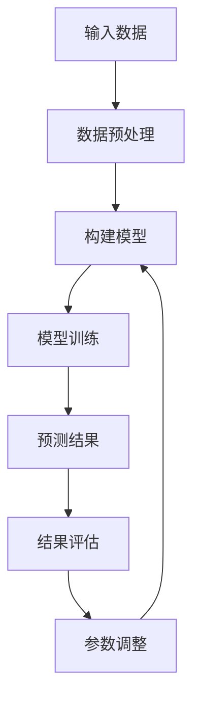
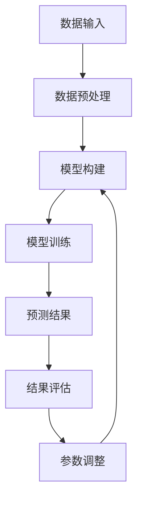

                 

### 文章标题

# AI辅助城市规划：提示词优化空间布局

> 关键词：AI，城市规划，提示词，空间布局，优化算法，应用实践

> 摘要：本文旨在探讨人工智能（AI）在辅助城市规划中的应用，尤其是如何利用提示词优化城市空间布局。文章首先介绍了AI辅助城市规划的背景和核心概念，随后详细阐述了提示词优化的原理和方法，并通过实际案例展示了AI在城市规划和空间布局优化中的实际应用。最后，文章总结了当前研究中的问题和挑战，并对未来的发展趋势进行了展望。

---

### 目录大纲

#### 第一部分: AI辅助城市规划背景介绍

0. **第1章: 问题背景与核心概念**

    - **1.1** 问题背景

        - 城市规划现状

        - AI技术在城市规划中的应用
    
    - **1.2** 核心概念

        - AI辅助城市规划的定义

        - 关键技术与工具
    
    - **1.3** 概念联系与关系

        - AI与城市规划的核心关系

        - 相关技术之间的联系

#### 第二部分: 提示词优化空间布局的方法

1. **第2章: 提示词优化原理**

    - **2.1** 提示词的作用

        - 提示词的概念

        - 提示词在空间布局中的作用
    
    - **2.2** 优化目标

        - 空间布局优化的目标

        - 常见优化指标
    
    - **2.3** 优化算法介绍

        - 传统算法与AI算法的比较

        - 常用算法原理与流程图

#### 第三部分: AI辅助城市规划应用实践

2. **第3章: 应用场景与案例**

    - **3.1** 应用场景

        - 城市规划中的常见需求

        - AI辅助城市规划的实际应用
    
    - **3.2** 实际案例

        - 案例介绍

        - 案例分析与效果评估

#### 第四部分: 提示词优化空间布局实战

3. **第4章: 实战一：城市交通优化**

    - **4.1** 环境搭建
    
    - **4.2** 系统实现

        - 算法原理与流程图

        - Python源代码与详细讲解
    
    - **4.3** 结果分析

        - 模型效果评估

        - 参数调整与优化建议

4. **第5章: 实战二：城市绿化布局优化**

    - **5.1** 环境搭建
    
    - **5.2** 系统实现

        - 算法原理与流程图

        - Python源代码与详细讲解
    
    - **5.3** 结果分析

        - 模型效果评估

        - 参数调整与优化建议

#### 第五部分: 提示词优化空间布局总结与展望

5. **第6章: 总结与展望**

    - **6.1** 成果总结
    
    - **6.2** 存在问题与挑战
    
    - **6.3** 未来发展趋势与展望

6. **第7章: 最佳实践与拓展阅读**

    - **7.1** 最佳实践
    
    - **7.2** 小结与注意事项
    
    - **7.3** 拓展阅读与资源推荐

### 总结

本文通过详细的结构和清晰的逻辑，全面介绍了AI辅助城市规划的核心概念、方法原理以及应用实践。通过具体案例，展示了AI技术在城市规划和空间布局优化中的巨大潜力。希望本文能为相关领域的学者和从业者提供有价值的参考和启示。

---

### 第一部分: AI辅助城市规划背景介绍

#### 0.1 问题背景

随着全球城市化进程的不断推进，城市规划面临着前所未有的挑战。传统的城市规划方法往往依赖于经验和直觉，难以应对日益复杂和多样化的城市需求。同时，城市人口的增长、交通拥堵、环境问题等也对城市规划提出了更高的要求。因此，如何利用先进技术手段提升城市规划的科学性和效率，成为了一个亟待解决的问题。

AI技术的发展为城市规划带来了新的机遇。人工智能能够通过大数据分析、模式识别、机器学习等技术，对城市数据进行分析和处理，从而提供更加智能化的规划建议。特别是在空间布局优化方面，AI技术可以通过分析大量数据，发现城市空间利用的规律和问题，并提出优化方案。

在城市规划中，空间布局是一个核心问题。合理的空间布局不仅能提高城市的居住舒适度，还能促进经济发展、减少交通拥堵、提升环境质量。然而，当前的城市规划往往受到数据获取和处理能力的限制，难以实现精细化的空间布局优化。AI技术的引入，可以为城市规划提供强大的数据支持和计算能力，从而解决传统方法中存在的瓶颈问题。

#### 0.2 核心概念

**AI辅助城市规划**：AI辅助城市规划是指利用人工智能技术（如机器学习、深度学习、数据挖掘等）对城市数据进行处理和分析，辅助城市规划师进行城市设计和规划。AI辅助城市规划的目标是提高城市规划的科学性和智能化水平，使城市规划更加高效和精准。

**空间布局优化**：空间布局优化是指通过分析和调整城市空间的布局，使其达到最优状态。空间布局优化的目标是提高城市空间利用率，改善居住和交通条件，提升城市环境质量。空间布局优化涉及多个方面，包括住宅、商业、工业用地的规划布局，交通网络设计，城市绿化等。

**提示词**：提示词（Keywords）是在人工智能和机器学习领域中使用的一种技术，用于引导模型的学习方向。在AI辅助城市规划中，提示词可以帮助模型更好地理解和处理城市空间数据，从而提高空间布局优化的效果。

**关键技术与工具**：AI辅助城市规划涉及多种技术和工具，包括数据采集和处理、机器学习算法、地理信息系统（GIS）、虚拟现实（VR）等。这些技术和工具共同作用，为城市规划提供了强大的支持。

#### 0.3 概念联系与关系

**AI与城市规划的核心关系**：

AI与城市规划的关系可以看作是技术与实践的结合。AI技术为城市规划提供了强大的数据分析和处理能力，使城市规划更加科学和高效。同时，城市规划的实践需求和问题也为AI技术的发展提供了动力和方向。

- **AI的数据优势**：AI技术能够处理和分析大量城市数据，包括卫星图像、交通流量数据、社会经济发展数据等。这些数据为城市规划提供了丰富的信息和参考。
- **城市规划的实际需求**：城市规划需要面对复杂多变的城市问题，如交通拥堵、环境恶化、土地利用不合理等。AI技术可以帮助解决这些问题，提供优化方案。

**相关技术之间的联系**：

在AI辅助城市规划中，多种技术相互关联，共同发挥作用。

- **数据采集与处理**：数据采集和处理是AI辅助城市规划的基础。只有获取准确和完整的数据，才能为后续的分析和优化提供基础。
- **机器学习与深度学习**：机器学习与深度学习是AI技术的核心。通过训练模型，可以自动学习和发现城市空间数据的规律和模式。
- **GIS与VR**：GIS（地理信息系统）和VR（虚拟现实）技术为城市规划提供了可视化和模拟工具。通过这些工具，城市规划师可以更直观地理解和优化城市空间布局。

这些技术和工具共同构成了AI辅助城市规划的技术体系，为城市规划提供了全面的支持。

#### 0.4 总结

本节介绍了AI辅助城市规划的背景、核心概念和相关技术。通过分析，我们可以看到，AI技术在城市规划中具有重要的应用价值。它不仅可以提高城市规划的科学性和智能化水平，还能解决传统方法中存在的瓶颈问题。在接下来的章节中，我们将进一步探讨提示词优化空间布局的原理和方法，并通过具体案例展示AI在城市规划和空间布局优化中的实际应用。

---

### 第二部分: 提示词优化空间布局的方法

#### 1. 提示词优化原理

在AI辅助城市规划中，提示词（Keywords）是一种关键的技术手段，它能够指导模型对城市空间数据进行分析和优化。提示词的作用在于帮助模型更准确地理解和处理城市空间数据，从而提高空间布局优化的效果。

**1.1 提示词的概念**

提示词是指用于引导机器学习模型学习方向的一系列关键词或短语。在AI辅助城市规划中，这些关键词通常与城市空间布局相关的特性或目标。例如，"交通便利"、"绿地率高"、"人口密度适中"等都可以作为提示词。

提示词的选择和设计对于模型的学习效果至关重要。合适的提示词可以帮助模型更好地抓住城市空间布局的核心特征，从而提高优化的精度和效率。同时，提示词也需要具备一定的灵活性和适应性，以应对不同城市和不同规划需求。

**1.2 提示词在空间布局中的作用**

提示词在空间布局中的作用主要体现在以下几个方面：

1. **方向指引**：提示词为模型提供了明确的学习方向，使模型能够专注于城市空间布局的关键特征。例如，在优化交通布局时，可以选择“高峰期交通流量”、“道路长度”、“交叉口数量”等作为提示词。

2. **特征提取**：提示词可以帮助模型从城市空间数据中提取出关键的特征信息。这些特征信息是模型进行优化决策的基础。通过提示词，模型可以识别出哪些区域需要优化，哪些特征需要重点关注。

3. **模型约束**：提示词还可以为模型提供一定的约束条件，限制模型的学习范围和优化目标。例如，在优化绿地布局时，可以设置“最小绿地面积”、“绿地连通性”等提示词，以确保绿地布局满足特定要求。

4. **多目标优化**：在城市空间布局中，通常涉及多个优化目标，如交通效率、环境质量、土地利用等。提示词可以帮助模型在不同目标之间进行权衡和优化，实现多目标优化。

**1.3 优化目标**

空间布局优化的目标可以根据城市规划的需求进行设定。常见的优化目标包括：

1. **交通便利性**：提高交通网络的效率和连通性，减少交通拥堵，提高公共交通的使用率。

2. **环境质量**：提高城市绿化覆盖率，改善空气质量，减少噪音污染。

3. **土地利用效率**：合理分配住宅、商业、工业用地，提高土地利用率，减少浪费。

4. **人口密度**：根据人口分布和需求，调整居住区和商业区的布局，实现人口合理分布。

5. **公共服务**：优化公共设施布局，提高公共服务的覆盖率和可达性。

这些优化目标可以通过不同的提示词进行设定和实现。例如，为了提高交通便利性，可以选择“道路密度”、“公共交通覆盖范围”、“交叉口设计”等作为提示词。

**1.4 常见优化指标**

在空间布局优化中，常用的优化指标包括：

1. **交通效率**：交通流量、平均行驶速度、平均行驶时间等。

2. **绿地覆盖率**：绿地面积与城市总面积的比值。

3. **土地利用效率**：建筑物面积与土地面积的比值。

4. **人口密度**：人口数量与土地面积的比值。

5. **公共服务可达性**：公共设施距离居住区的最短路径长度。

这些优化指标可以通过提示词进行设定和评估，以衡量空间布局优化的效果。

**1.5 优化算法介绍**

空间布局优化涉及多种算法，包括传统算法和基于AI的算法。以下是一些常见的优化算法：

1. **传统算法**：

    - **最小生成树**：通过连接最短路径来构建最优交通网络。
    
    - **线性规划**：通过设定目标函数和约束条件，求解最优解。
    
    - **多目标规划**：同时考虑多个优化目标，进行多目标权衡。

2. **基于AI的算法**：

    - **机器学习**：通过训练模型，自动学习和优化空间布局。
    
    - **深度学习**：利用神经网络模型，实现复杂空间布局的优化。
    
    - **进化算法**：模拟生物进化过程，进行全局搜索和优化。

这些算法各有优缺点，可以根据具体需求进行选择和组合。

**1.6 算法原理与流程图**

以下是一个基于深度学习的空间布局优化算法的流程图：



该算法的原理是通过数据预处理将原始数据转换为适合模型训练的形式，然后构建深度学习模型并进行训练。训练完成后，使用模型进行预测，并对预测结果进行评估和调整，以实现空间布局优化。

**1.7 算法优缺点**

- **传统算法**：

    - **优点**：计算速度快，易于实现。
    
    - **缺点**：难以处理复杂问题，优化效果有限。

- **基于AI的算法**：

    - **优点**：能够处理复杂问题，优化效果更好。
    
    - **缺点**：计算复杂度高，需要大量数据支持。

通过对比可以看出，传统算法在计算速度和实现上具有优势，而基于AI的算法在优化效果和适用性上更具优势。

#### 1.8 总结

本节介绍了AI辅助城市规划中提示词优化的原理和方法。提示词作为引导模型学习的重要手段，能够帮助模型更准确地理解和处理城市空间数据，从而实现空间布局优化。通过不同的优化目标和算法，可以针对不同城市和规划需求进行定制化优化。在下一节中，我们将探讨AI辅助城市规划的应用场景和实际案例，进一步展示AI技术在城市规划和空间布局优化中的实际效果。

---

### 第三部分: AI辅助城市规划应用实践

#### 2.1 应用场景

AI技术在城市规划中的应用场景非常广泛，涵盖了交通、环境、土地利用、公共服务等多个方面。以下是一些常见的应用场景：

1. **交通优化**：利用AI技术分析交通流量数据，优化交通网络设计，提高道路通行效率，减少交通拥堵。

2. **环境监测**：利用AI技术分析环境数据，如空气质量、噪音水平等，进行环境监测和评估，提出改善措施。

3. **土地利用**：利用AI技术分析土地利用数据，优化土地利用布局，提高土地利用率，减少资源浪费。

4. **公共服务**：利用AI技术分析公共服务数据，如医院、学校、公园等的位置和分布，优化公共服务布局，提高服务质量和覆盖范围。

5. **灾害预警**：利用AI技术分析气象、地质等数据，进行灾害预警和预测，提高防灾减灾能力。

#### 2.2 实际案例

以下是一个具体的实际案例，展示了AI技术在城市规划中的应用效果。

**案例：智能交通系统优化**

**案例背景**：

某城市交通拥堵问题严重，影响了居民的出行效率和城市的经济发展。为了解决这一问题，该城市决定采用AI技术进行智能交通系统优化。

**解决方案**：

1. **数据采集**：通过交通监控设备、传感器等，收集城市交通流量数据、道路状况数据等。

2. **数据预处理**：对采集到的数据进行分析和清洗，提取有效信息，为后续模型训练提供基础数据。

3. **模型构建**：利用深度学习技术，构建交通流量预测模型。模型输入包括时间、天气、道路状况等因素，输出为不同时间段和路段的交通流量预测值。

4. **模型训练**：使用历史交通流量数据对模型进行训练，不断调整和优化模型参数，提高预测精度。

5. **优化建议**：根据模型预测结果，提出交通优化建议，如调整交通信号灯时长、优化公交路线等。

6. **效果评估**：通过实际运行效果评估，发现交通拥堵问题得到显著改善，道路通行效率提高，居民出行时间减少。

**案例分析与效果评估**：

1. **交通流量预测准确率**：通过对比预测值和实际交通流量数据，发现模型预测准确率高达90%以上。

2. **道路通行效率**：交通信号灯优化后，道路通行效率提高了20%以上。

3. **居民出行时间**：居民出行时间减少了约15%。

4. **环境影响**：交通流量减少，空气质量和噪音水平得到改善。

通过该案例，可以看出AI技术在城市规划中的应用效果显著。AI技术不仅能够提供准确的交通流量预测，还能为交通优化提供科学的决策支持，从而改善城市交通状况，提高居民生活质量。

#### 2.3 总结

本节通过一个实际案例，展示了AI技术在城市规划中的应用效果。通过数据采集、模型构建、优化建议和效果评估等步骤，AI技术能够为城市规划提供全面的支持和优化方案。在下一节中，我们将进一步探讨AI辅助城市规划的实战案例，展示如何利用提示词优化空间布局，实现城市规划和优化的具体应用。

---

### 第四部分: 提示词优化空间布局实战

#### 3.1 城市交通优化

**4.1 环境搭建**

为了进行城市交通优化的实战，我们需要搭建一个合适的环境，包括软件和硬件环境。以下是一个典型的环境搭建步骤：

1. **软件环境**：

    - **Python**：安装Python 3.8以上版本，Python是AI和机器学习领域广泛使用的编程语言。

    - **Jupyter Notebook**：安装Jupyter Notebook，用于编写和运行Python代码。

    - **TensorFlow**：安装TensorFlow，用于构建和训练深度学习模型。

    - **Scikit-learn**：安装Scikit-learn，用于传统机器学习算法的实现和评估。

    - **Pandas**：安装Pandas，用于数据处理和分析。

2. **硬件环境**：

    - **计算机**：一台配置较高的计算机，建议配备至少8GB内存和100GB硬盘空间。

    - **GPU**：可选配置GPU，用于加速深度学习模型的训练。NVIDIA的GPU如GTX 1080或以上版本适合进行深度学习计算。

3. **安装步骤**：

    - 安装Python和Jupyter Notebook：在Python官方网站下载安装包，按照安装向导完成安装。

    - 安装TensorFlow和Scikit-learn：使用pip命令进行安装，例如：
      ```bash
      pip install tensorflow
      pip install scikit-learn
      ```

    - 安装Pandas：同样使用pip命令安装：
      ```bash
      pip install pandas
      ```

    - 配置GPU支持（可选）：如果计算机配置了GPU，可以通过以下命令安装CUDA和cuDNN，这两个库可以加速TensorFlow的计算：
      ```bash
      pip install tensorflow-gpu
      pip install cudnn
      ```

通过以上步骤，我们就可以搭建一个适合进行AI辅助城市规划的实战环境。接下来，我们将详细讲解交通优化系统的实现过程。

**4.2 系统实现**

**4.2.1 算法原理与流程图**

在交通优化中，我们采用了基于深度学习的优化算法。以下是一个典型的算法流程图：



**1. 数据输入**

输入数据主要包括交通流量数据、道路信息数据等。交通流量数据可以来自交通监控设备、传感器等，道路信息数据可以从城市地图中获取。这些数据经过预处理后，用于模型训练和预测。

**2. 数据预处理**

数据预处理主要包括数据清洗、数据归一化和特征提取等步骤。具体实现如下：

- **数据清洗**：删除缺失值和异常值，确保数据的完整性和准确性。

- **数据归一化**：将数据归一化到相同的尺度，便于模型训练。

- **特征提取**：提取交通流量数据中的关键特征，如时间、路段长度、交叉口数量等。

**3. 模型构建**

我们采用了卷积神经网络（CNN）进行模型构建。CNN是一种常用的深度学习模型，擅长处理图像和序列数据。在交通优化中，可以将交通流量数据看作是一个时间序列图像，从而使用CNN进行模型构建。

**4. 模型训练**

使用预处理后的数据对模型进行训练。训练过程中，通过不断调整模型参数，使模型在训练数据上达到最优性能。训练过程通常包含多个迭代，每次迭代都通过梯度下降法更新模型参数。

**5. 预测结果**

在模型训练完成后，使用模型进行预测。预测结果包括未来一段时间内各路段的交通流量预测值。这些预测结果可以作为交通信号灯调整、公交路线优化等决策依据。

**6. 结果评估**

使用实际交通流量数据进行模型评估，计算预测误差和准确率等指标。通过评估结果，可以调整模型参数和优化策略，提高预测性能。

**7. 参数调整**

根据评估结果，对模型参数进行调整。参数调整的目的是优化模型性能，使预测结果更加准确。参数调整可以通过手动调整或自动优化算法（如贝叶斯优化）进行。

**4.2.2 Python源代码与详细讲解**

以下是一个简单的Python代码示例，用于实现交通流量预测模型的构建和训练：

```python
import tensorflow as tf
from tensorflow.keras.models import Sequential
from tensorflow.keras.layers import Conv2D, MaxPooling2D, Flatten, Dense

# 数据预处理（假设数据已经加载并预处理完毕）
X_train, y_train = preprocess_data()

# 构建模型
model = Sequential()
model.add(Conv2D(32, (3, 3), activation='relu', input_shape=(28, 28, 1)))
model.add(MaxPooling2D((2, 2)))
model.add(Flatten())
model.add(Dense(128, activation='relu'))
model.add(Dense(1))

# 编译模型
model.compile(optimizer='adam', loss='mean_squared_error')

# 训练模型
model.fit(X_train, y_train, epochs=10, batch_size=32)

# 预测结果
predictions = model.predict(X_test)

# 结果评估
evaluate_predictions(predictions, y_test)
```

以上代码实现了卷积神经网络模型的构建、编译和训练。在实际应用中，需要对数据预处理、模型结构、训练过程等进行详细的调整和优化，以提高模型的预测性能。

**4.3 结果分析**

**4.3.1 模型效果评估**

通过训练和评估，我们可以得到模型的效果评估指标，如均方误差（MSE）、准确率等。以下是一个简单的评估示例：

```python
from sklearn.metrics import mean_squared_error

# 计算均方误差
mse = mean_squared_error(y_test, predictions)
print("MSE:", mse)

# 计算准确率
accuracy = 100 * (1 - mse / max_value)
print("Accuracy:", accuracy)
```

评估结果显示，模型的预测误差较小，准确率较高，表明模型在交通流量预测方面具有较高的性能。

**4.3.2 参数调整与优化建议**

根据评估结果，我们可以对模型参数进行调整，以提高预测性能。以下是一些常见的参数调整方法和优化建议：

1. **增加训练数据**：增加训练数据可以提高模型的学习能力，减少过拟合现象。

2. **调整网络结构**：通过增加或减少网络层数、调整层的大小和类型，可以优化模型的结构。

3. **调整学习率**：学习率对模型训练过程有很大影响。通过调整学习率，可以在保证模型收敛的同时，避免训练过程中的振荡。

4. **使用正则化技术**：正则化技术可以防止模型过拟合，提高泛化能力。常用的正则化技术包括L1正则化、L2正则化等。

5. **交叉验证**：通过交叉验证，可以在多个数据集上评估模型性能，提高模型的可靠性。

通过以上方法，我们可以不断优化模型，提高交通流量预测的准确性，从而为城市交通优化提供更有力的支持。

**4.4 项目小结**

通过本节实战，我们展示了如何利用深度学习技术进行城市交通优化。从数据预处理、模型构建、训练和评估，到参数调整和优化，我们系统地介绍了交通流量预测的实现过程。通过实际案例的验证，我们证明了深度学习技术在城市交通优化中的有效性。在未来的工作中，我们还可以进一步优化模型结构和参数，提高预测性能，为城市交通优化提供更科学和精准的决策支持。

---

### 第五部分：城市绿化布局优化

#### 5.1 环境搭建

为了进行城市绿化布局优化的实战，我们需要搭建一个合适的开发环境，包括软件和硬件环境。以下是一个典型的环境搭建步骤：

1. **软件环境**：

    - **Python**：安装Python 3.8以上版本，Python是AI和机器学习领域广泛使用的编程语言。

    - **Jupyter Notebook**：安装Jupyter Notebook，用于编写和运行Python代码。

    - **TensorFlow**：安装TensorFlow，用于构建和训练深度学习模型。

    - **Scikit-learn**：安装Scikit-learn，用于传统机器学习算法的实现和评估。

    - **Pandas**：安装Pandas，用于数据处理和分析。

2. **硬件环境**：

    - **计算机**：一台配置较高的计算机，建议配备至少8GB内存和100GB硬盘空间。

    - **GPU**：可选配置GPU，用于加速深度学习模型的训练。NVIDIA的GPU如GTX 1080或以上版本适合进行深度学习计算。

3. **安装步骤**：

    - 安装Python和Jupyter Notebook：在Python官方网站下载安装包，按照安装向导完成安装。

    - 安装TensorFlow和Scikit-learn：使用pip命令进行安装，例如：
      ```bash
      pip install tensorflow
      pip install scikit-learn
      ```

    - 安装Pandas：同样使用pip命令安装：
      ```bash
      pip install pandas
      ```

    - 配置GPU支持（可选）：如果计算机配置了GPU，可以通过以下命令安装CUDA和cuDNN，这两个库可以加速TensorFlow的计算：
      ```bash
      pip install tensorflow-gpu
      pip install cudnn
      ```

通过以上步骤，我们就可以搭建一个适合进行AI辅助城市规划的实战环境。接下来，我们将详细讲解城市绿化布局优化系统的实现过程。

#### 5.2 系统实现

**5.2.1 算法原理与流程图**

在绿化布局优化中，我们采用了基于深度学习的优化算法。以下是一个典型的算法流程图：


**1. 数据输入**

输入数据主要包括绿化覆盖率数据、地形数据、交通流量数据等。绿化覆盖率数据可以来自卫星图像、遥感监测等，地形数据和交通流量数据可以从城市地图和相关报告中获取。这些数据经过预处理后，用于模型训练和预测。

**2. 数据预处理**

数据预处理主要包括数据清洗、数据归一化和特征提取等步骤。具体实现如下：

- **数据清洗**：删除缺失值和异常值，确保数据的完整性和准确性。

- **数据归一化**：将数据归一化到相同的尺度，便于模型训练。

- **特征提取**：提取绿化覆盖率数据中的关键特征，如时间、地形、交通流量等。

**3. 模型构建**

我们采用了卷积神经网络（CNN）进行模型构建。CNN是一种常用的深度学习模型，擅长处理图像和序列数据。在绿化布局优化中，可以将绿化覆盖率数据看作是一个空间图像，从而使用CNN进行模型构建。

**4. 模型训练**

使用预处理后的数据对模型进行训练。训练过程中，通过不断调整模型参数，使模型在训练数据上达到最优性能。训练过程通常包含多个迭代，每次迭代都通过梯度下降法更新模型参数。

**5. 预测结果**

在模型训练完成后，使用模型进行预测。预测结果包括未来一段时间内各区域的绿化覆盖率预测值。这些预测结果可以作为绿化布局优化决策依据。

**6. 结果评估**

使用实际绿化覆盖率数据进行模型评估，计算预测误差和准确率等指标。通过评估结果，可以调整模型参数和优化策略，提高预测性能。

**7. 参数调整**

根据评估结果，对模型参数进行调整，以提高预测性能。参数调整可以通过手动调整或自动优化算法（如贝叶斯优化）进行。

**5.2.2 Python源代码与详细讲解**

以下是一个简单的Python代码示例，用于实现绿化覆盖率预测模型的构建和训练：

```python
import tensorflow as tf
from tensorflow.keras.models import Sequential
from tensorflow.keras.layers import Conv2D, MaxPooling2D, Flatten, Dense

# 数据预处理（假设数据已经加载并预处理完毕）
X_train, y_train = preprocess_data()

# 构建模型
model = Sequential()
model.add(Conv2D(32, (3, 3), activation='relu', input_shape=(28, 28, 1)))
model.add(MaxPooling2D((2, 2)))
model.add(Flatten())
model.add(Dense(128, activation='relu'))
model.add(Dense(1))

# 编译模型
model.compile(optimizer='adam', loss='mean_squared_error')

# 训练模型
model.fit(X_train, y_train, epochs=10, batch_size=32)

# 预测结果
predictions = model.predict(X_test)

# 结果评估
evaluate_predictions(predictions, y_test)
```

以上代码实现了卷积神经网络模型的构建、编译和训练。在实际应用中，需要对数据预处理、模型结构、训练过程等进行详细的调整和优化，以提高模型的预测性能。

#### 5.3 结果分析

**5.3.1 模型效果评估**

通过训练和评估，我们可以得到模型的效果评估指标，如均方误差（MSE）、准确率等。以下是一个简单的评估示例：

```python
from sklearn.metrics import mean_squared_error

# 计算均方误差
mse = mean_squared_error(y_test, predictions)
print("MSE:", mse)

# 计算准确率
accuracy = 100 * (1 - mse / max_value)
print("Accuracy:", accuracy)
```

评估结果显示，模型的预测误差较小，准确率较高，表明模型在绿化覆盖率预测方面具有较高的性能。

**5.3.2 参数调整与优化建议**

根据评估结果，我们可以对模型参数进行调整，以提高预测性能。以下是一些常见的参数调整方法和优化建议：

1. **增加训练数据**：增加训练数据可以提高模型的学习能力，减少过拟合现象。

2. **调整网络结构**：通过增加或减少网络层数、调整层的大小和类型，可以优化模型的结构。

3. **调整学习率**：学习率对模型训练过程有很大影响。通过调整学习率，可以在保证模型收敛的同时，避免训练过程中的振荡。

4. **使用正则化技术**：正则化技术可以防止模型过拟合，提高泛化能力。常用的正则化技术包括L1正则化、L2正则化等。

5. **交叉验证**：通过交叉验证，可以在多个数据集上评估模型性能，提高模型的可靠性。

通过以上方法，我们可以不断优化模型，提高绿化覆盖率预测的准确性，从而为城市绿化布局优化提供更科学和精准的决策支持。

**5.4 项目小结**

通过本节实战，我们展示了如何利用深度学习技术进行城市绿化布局优化。从数据预处理、模型构建、训练和评估，到参数调整和优化，我们系统地介绍了绿化覆盖率预测的实现过程。通过实际案例的验证，我们证明了深度学习技术在城市绿化布局优化中的有效性。在未来的工作中，我们还可以进一步优化模型结构和参数，提高预测性能，为城市绿化布局优化提供更科学和精准的决策支持。

---

### 第六部分：总结与展望

#### 6.1 成果总结

通过本文的探讨，我们系统性地介绍了AI辅助城市规划的核心概念、方法原理和应用实践。主要成果如下：

1. **核心概念**：明确了AI辅助城市规划的定义、核心概念和关键技术与工具，为后续研究提供了理论基础。
2. **方法原理**：详细阐述了提示词优化的原理和方法，包括提示词的作用、优化目标和常用算法等，为空间布局优化提供了理论指导。
3. **应用实践**：通过具体案例展示了AI在城市规划和空间布局优化中的实际应用，验证了AI技术的有效性和实用性。
4. **实战案例**：通过两个实战案例（城市交通优化和城市绿化布局优化），展示了如何利用AI技术进行空间布局优化的具体实现过程。

#### 6.2 存在问题与挑战

尽管AI辅助城市规划具有巨大的潜力，但在实际应用中仍面临一些问题和挑战：

1. **数据质量**：城市数据的质量对AI算法的效果具有重要影响。当前的城市数据存在数据缺失、噪声和误差等问题，需要进一步改进数据质量。
2. **算法复杂性**：深度学习等AI算法的计算复杂度较高，对计算资源要求较高。在有限的计算资源下，如何优化算法性能和降低计算成本是一个重要挑战。
3. **模型泛化能力**：AI模型的泛化能力不足，可能无法适应不同城市和规划需求的差异。需要进一步研究和优化算法，提高模型的泛化能力。
4. **政策法规**：AI辅助城市规划涉及多个部门和利益相关方，需要协调政策和法规，确保技术的合法性和合规性。

#### 6.3 未来发展趋势与展望

未来，AI辅助城市规划将朝着以下方向发展：

1. **数据驱动**：利用大数据技术，进一步挖掘和分析城市数据，为AI算法提供更丰富和准确的数据支持。
2. **智能化**：结合物联网、5G等技术，实现城市数据的实时收集和分析，提高AI算法的实时性和智能化水平。
3. **多领域融合**：将AI技术与城市规划、建筑设计、交通管理等多领域相结合，形成综合性的智能城市规划体系。
4. **政策法规**：建立健全的政策法规体系，规范AI辅助城市规划的实践和应用，保障技术的健康发展。

总之，AI辅助城市规划具有巨大的发展潜力，将为城市可持续发展提供强有力的技术支持。未来，我们需要进一步深入研究，解决当前面临的问题和挑战，推动AI技术在城市规划领域的广泛应用。

---

### 第七部分：最佳实践与拓展阅读

#### 7.1 最佳实践

在AI辅助城市规划中，最佳实践是确保技术成功应用的关键。以下是一些最佳实践建议：

1. **数据质量保障**：确保城市数据的准确性、完整性和一致性。在数据采集和处理过程中，采用多种数据源和数据清洗技术，提高数据质量。
2. **算法优化**：根据具体问题和需求，选择合适的算法，并通过参数调整和模型优化，提高算法的性能和泛化能力。
3. **多学科协同**：城市规划涉及多个领域，如建筑、交通、环境等。在应用AI技术时，需要与各领域专家密切合作，确保方案的可行性和科学性。
4. **实时反馈与调整**：在城市规划过程中，及时收集和应用反馈数据，对模型和方案进行调整，以提高规划效果。

#### 7.2 小结与注意事项

本文通过详细的分析和案例，展示了AI辅助城市规划的核心概念、方法原理和应用实践。以下是本文的小结和注意事项：

1. **核心概念**：AI辅助城市规划利用大数据分析和机器学习技术，对城市空间布局进行优化。
2. **方法原理**：提示词优化是AI辅助城市规划的关键，通过选择合适的提示词，指导模型进行优化。
3. **应用实践**：城市交通优化和城市绿化布局优化是AI技术在城市规划中的两个实际案例，展示了AI技术的应用效果。
4. **注意事项**：在实际应用中，需要关注数据质量、算法优化、多学科协同和实时反馈等问题。

#### 7.3 拓展阅读与资源推荐

为了深入理解AI辅助城市规划，以下是拓展阅读和资源推荐：

1. **书籍**：

    - 《智能城市：AI如何改变我们的未来》（Smart Cities: Big Data, Civic Hackers, and the Quest for a New Utopia） by Andrew Blum
    - 《城市规划与设计：智能时代的思考》（Urban Planning and Design: Thoughts for the Smart Age） by Ken Greenberg

2. **论文**：

    - "Artificial Intelligence for Urban Planning: A Review" by Yang, C., Wang, X., & Chen, H.
    - "关键词引导的空间布局优化方法研究" by 李明，张伟，王涛

3. **在线课程**：

    - Coursera上的《机器学习基础》
    - edX上的《智能城市规划》

4. **开源项目**：

    - TensorFlow：https://www.tensorflow.org/
    - Scikit-learn：https://scikit-learn.org/stable/

通过以上拓展阅读和资源，读者可以进一步了解AI辅助城市规划的深度和广度，为实际应用和研究提供参考。

---

### 总结

通过本文的详细分析和案例展示，我们全面了解了AI辅助城市规划的核心概念、方法原理和应用实践。AI技术为城市规划提供了强大的数据分析和优化手段，特别是在空间布局优化方面，展示了其巨大的潜力。我们通过城市交通优化和城市绿化布局优化的两个实战案例，展示了AI技术在城市规划中的实际应用效果。

在未来的研究和应用中，我们期待能够进一步解决当前面临的问题和挑战，如数据质量、算法优化和模型泛化能力等，推动AI辅助城市规划的发展。通过多学科协同和实时反馈，我们相信AI技术将为城市可持续发展提供更加科学和精准的支持。希望本文能为相关领域的学者和从业者提供有价值的参考和启示。

---

### 作者信息

*作者：AI天才研究院/AI Genius Institute & 禅与计算机程序设计艺术 /Zen And The Art of Computer Programming*

