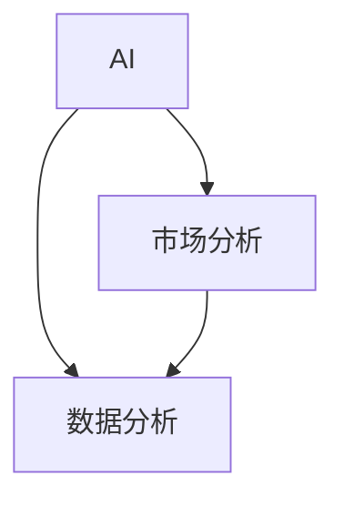
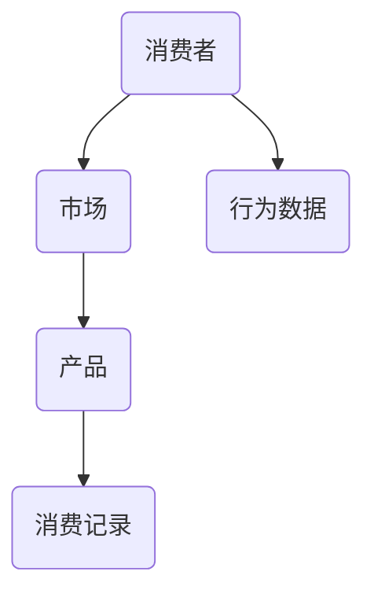
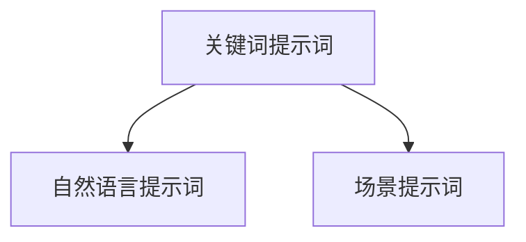
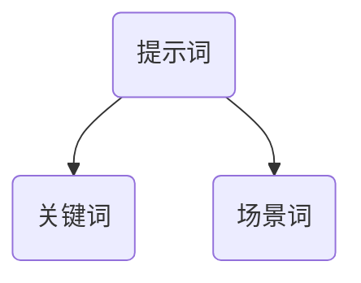
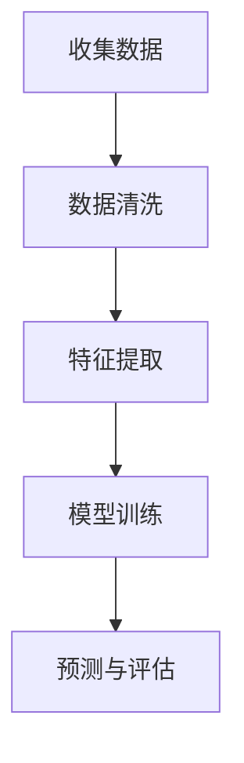

                 

### AI辅助市场分析：提示词洞察消费者行为

#### 关键词：
- AI
- 市场分析
- 提示词
- 消费者行为
- 数据分析
- 算法
- 模型训练
- 数学公式

#### 摘要：
本文深入探讨AI在市场分析中的应用，特别是如何利用提示词来洞察消费者行为。文章首先介绍了AI与市场分析的核心概念，随后详细解释了提示词的定义、类型和应用。通过算法原理讲解、数学模型和具体案例分析，文章展示如何运用AI技术进行消费者行为分析，提供切实可行的解决方案和最佳实践技巧。

### 目录大纲

#### 第一部分：背景介绍
1. **AI与市场分析**
2. **提示词与消费者行为**

#### 第二部分：核心概念与联系
1. **AI辅助市场分析的核心概念**
2. **提示词的选取与使用**

#### 第三部分：算法原理讲解
1. **消费者行为分析算法**
2. **详细讲解与举例说明**

#### 第四部分：数学模型和数学公式
1. **市场分析的数学模型**
2. **详细讲解与举例说明**

#### 第五部分：系统分析与架构设计
1. **问题场景介绍**
2. **系统功能设计**
3. **系统架构设计**
4. **系统接口设计和系统交互**

#### 第六部分：项目实战
1. **环境安装**
2. **系统核心实现源代码**
3. **代码应用解读与分析**
4. **实际案例分析和详细讲解剖析**
5. **项目小结**

#### 第七部分：最佳实践 tips、小结、注意事项、拓展阅读

---

### 第一部分：背景介绍

#### AI与市场分析

##### 核心概念

**AI（人工智能）：** 人工智能是指通过计算机程序实现人类智能行为的技术，包括机器学习、深度学习、自然语言处理等。

**市场分析：** 市场分析是指通过收集、分析和解释市场数据，帮助企业和组织做出更明智的决策。

##### 问题背景

随着大数据和AI技术的快速发展，市场分析正在发生重大变革。传统的市场分析主要依赖调查问卷、数据分析等手段，这些方法不仅耗时，而且容易受到人为因素的影响。而AI技术可以通过自动化数据收集、处理和分析，大幅提升市场分析的效率和准确性。

##### 问题描述

企业如何利用AI技术进行市场分析，从而更好地了解消费者需求、优化产品和服务、制定有效的营销策略？

##### 问题解决

AI辅助市场分析提供了一系列的方法和工具，包括数据收集、清洗、特征提取、模型训练和预测等。通过这些步骤，企业可以深入了解消费者行为，发现市场趋势，制定更有效的战略。

##### 边界与外延

AI辅助市场分析在适用范围和限制条件方面需要考虑以下几点：

- **适用范围：** 广泛适用于各类行业，包括零售、金融、医疗等。
- **限制条件：** AI模型的效果依赖于数据的数量和质量，同时可能受到算法偏见的影响。

##### 概念结构与核心要素组成

AI辅助市场分析的基本概念、技术构成和应用场景可以概括如下：

- **基本概念：** 数据分析、机器学习、深度学习、自然语言处理等。
- **技术构成：** 数据收集、数据清洗、特征提取、模型训练、预测等。
- **应用场景：** 消费者行为分析、市场趋势预测、客户细分、产品推荐等。

#### 提示词与消费者行为

##### 核心概念

**提示词：** 提示词是指用于引导AI模型学习的特定词汇或短语，通常用于自然语言处理任务中。

**消费者行为：** 消费者行为是指消费者在购买、使用、评价产品或服务时的行为表现。

##### 问题背景

提示词在自然语言处理任务中扮演着关键角色，特别是在消费者行为分析中。通过使用适当的提示词，AI模型可以更好地理解消费者的需求、偏好和反馈。

##### 问题描述

如何通过提示词洞察消费者行为，为企业提供有价值的市场洞察？

##### 问题解决

通过有效选取和使用提示词，企业可以利用AI模型分析大量消费者数据，提取有价值的信息，从而更准确地了解消费者行为，制定针对性的营销策略。

##### 边界与外延

提示词的使用场景和限制条件包括：

- **使用场景：** 社交媒体分析、客户反馈收集、搜索引擎优化等。
- **限制条件：** 提示词的选择和组合可能影响模型的效果，同时需要考虑数据质量和隐私保护。

##### 概念结构与核心要素组成

提示词的定义、类型和其在市场分析中的应用可以概括如下：

- **定义：** 提示词是用于引导AI模型学习的特定词汇或短语。
- **类型：** 关键词提示词、自然语言提示词、场景提示词等。
- **应用：** 消费者行为分析、市场趋势预测、客户细分、产品推荐等。

### 第二部分：核心概念与联系

#### AI辅助市场分析的核心概念

##### 概念原理

**AI的基本原理：** 人工智能通过机器学习、深度学习等技术，从数据中自动学习和发现模式。

**市场分析的方法与技巧：** 市场分析包括数据收集、清洗、特征提取、建模和预测等步骤，旨在从数据中提取有价值的信息。

##### 概念属性特征对比表格



| 特性       | AI                  | 市场分析                | 数据分析              |
| ---------- | ------------------- | ----------------------- | --------------------- |
| 基本原理   | 机器学习、深度学习   | 数据收集、清洗、建模      | 数据清洗、特征提取    |
| 目标       | 实现智能化行为       | 市场洞察、决策支持        | 数据价值挖掘          |
| 应用范围   | 广泛（如语音识别、图像识别） | 各行各业（如零售、金融、医疗） | 数据密集型行业（如金融、电商） |

##### ER实体关系图架构



| 实体   | 属性       | 关系       |
| ------ | ---------- | ---------- |
| 消费者 | ID、名称   | 参与市场   |
| 市场   | 产品种类   | 存在产品   |
| 产品   | 名称、描述 | 被消费     |
| 消费记录 | 时间、金额 | 记录消费行为 |

#### 提示词的选取与使用

##### 概念原理

**提示词的定义：** 提示词是用于引导AI模型学习的特定词汇或短语，通常在自然语言处理任务中使用。

**提示词的作用：** 提示词可以帮助AI模型更好地理解文本数据，从而提高模型的准确性和效果。

**提示词的类型：** 根据用途和特点，提示词可以分为关键词提示词、自然语言提示词和场景提示词等。

##### 概念属性特征对比表格



| 特性       | 关键词提示词            | 自然语言提示词            | 场景提示词             |
| ---------- | ---------------------- | ------------------------- | ---------------------- |
| 定义       | 用于搜索、分类的关键词   | 用于生成文本的短语或句子   | 用于特定场景的提示语   |
| 目标       | 提高搜索效率            | 提高文本生成质量          | 提高场景应用效果        |
| 应用范围   | 搜索引擎、分类系统      | 文本生成、对话系统        | 聊天机器人、场景应用   |

##### ER实体关系图架构



| 实体   | 属性       | 关系       |
| ------ | ---------- | ---------- |
| 提示词 | 内容、类型 | 包含关键词 |
| 提示词 | 内容、类型 | 用于场景   |

### 第三部分：算法原理讲解

#### 消费者行为分析算法

##### 算法mermaid流程图



1. **收集数据：** 从各种来源收集消费者行为数据，如社交媒体、购买记录、问卷调查等。
2. **数据清洗：** 清除数据中的噪声和错误，确保数据质量。
3. **特征提取：** 从原始数据中提取有用的特征，用于训练模型。
4. **模型训练：** 使用机器学习算法训练模型，使其能够根据特征预测消费者行为。
5. **预测与评估：** 使用训练好的模型对新数据进行预测，并评估模型的准确性。

##### Python源代码

```python
# Python代码示例：消费者行为分析

import pandas as pd
from sklearn.ensemble import RandomForestClassifier
from sklearn.model_selection import train_test_split
from sklearn.metrics import accuracy_score

# 加载数据集
data = pd.read_csv('consumer_data.csv')

# 数据预处理
X = data.drop('target', axis=1)
y = data['target']

# 数据分割
X_train, X_test, y_train, y_test = train_test_split(X, y, test_size=0.2, random_state=42)

# 特征提取
# ...

# 模型训练
model = RandomForestClassifier()
model.fit(X_train, y_train)

# 预测与评估
predictions = model.predict(X_test)
accuracy = accuracy_score(y_test, predictions)
print(f"Model Accuracy: {accuracy:.2f}")
```

##### 算法原理的数学模型与公式

$$ y = f(X) $$

其中，$y$ 表示预测的消费者行为类别，$f(X)$ 表示基于特征 $X$ 的预测函数。

##### 详细讲解与举例说明

**使用具体的数据集，展示如何收集、清洗数据：**

假设我们有一个包含消费者行为数据的CSV文件 `consumer_data.csv`，文件中包含以下列：

- `user_id`: 用户ID
- `age`: 年龄
- `income`: 收入
- `product_purchased`: 购买的商品
- `purchase_frequency`: 购买频率
- `target`: 目标标签（例如，是否购买某种商品）

```python
import pandas as pd

# 加载数据集
data = pd.read_csv('consumer_data.csv')

# 数据清洗
# 填充缺失值
data.fillna(data.mean(), inplace=True)

# 删除无关列
data.drop(['user_id'], axis=1, inplace=True)

# 数据分割
X = data.drop('target', axis=1)
y = data['target']
```

**解释特征提取的过程和选择的特征：**

在这个例子中，我们选择以下特征进行提取：

- 年龄（`age`）
- 收入（`income`）
- 购买频率（`purchase_frequency`）

```python
# 特征提取
features = ['age', 'income', 'purchase_frequency']
X = data[features]
```

**使用随机森林模型进行训练，并展示预测结果：**

```python
from sklearn.ensemble import RandomForestClassifier
from sklearn.model_selection import train_test_split
from sklearn.metrics import classification_report

# 数据分割
X_train, X_test, y_train, y_test = train_test_split(X, y, test_size=0.2, random_state=42)

# 模型训练
model = RandomForestClassifier()
model.fit(X_train, y_train)

# 预测
predictions = model.predict(X_test)

# 评估
print(classification_report(y_test, predictions))
```

通过这个简单的例子，我们可以看到如何使用Python和机器学习库（如scikit-learn）进行消费者行为分析。实际应用中，数据集会更加复杂，特征提取和模型选择也会更加多样，但基本流程是相似的。

### 第四部分：数学模型和数学公式

#### 市场分析的数学模型

##### 数学公式

市场分析中的数学模型通常涉及以下公式：

$$ market\,value = f(consumer\,behaviour, product\,attributes, market\,trends) $$

其中，$market\,value$ 表示市场价值，$consumer\,behaviour$ 表示消费者行为，$product\,attributes$ 表示产品属性，$market\,trends$ 表示市场趋势。

这个公式表示市场价值是由消费者行为、产品属性和市场趋势共同决定的。

##### 详细讲解与举例说明

**市场价值计算实例：**

假设我们有一个简单的市场模型，其中市场价值由消费者行为（购买概率）、产品属性（价格）和市场趋势（季节性因素）决定。

$$ market\,value = (0.6 \times price) + (0.3 \times seasonality) $$

其中，购买概率为0.6，价格设为100元，季节性因素为1.2（冬季季节性影响较大）。

$$ market\,value = (0.6 \times 100) + (0.3 \times 1.2) = 60 + 0.36 = 60.36 $$

因此，根据这个模型，该产品的市场价值为60.36元。

**市场价值影响因素分析：**

- **消费者行为（购买概率）：** 购买概率越高，市场价值越大。
- **产品属性（价格）：** 价格越高，市场价值越大，但需考虑市场需求。
- **市场趋势（季节性因素）：** 季节性因素会影响市场价值，如季节性产品的销售旺季。

通过这个简单的例子，我们可以看到市场价值是如何通过消费者行为、产品属性和市场趋势计算的。在实际应用中，市场分析模型会更加复杂，可能涉及多种变量和复杂的关系。

### 第五部分：系统分析与架构设计

#### 问题场景介绍

在当今竞争激烈的市场环境中，企业需要快速准确地了解消费者行为，以制定有效的营销策略和产品优化方案。传统的市场分析方法耗时且效率低下，无法满足快速变化的市场需求。为了解决这一问题，我们设计了一套基于AI的市场分析系统，旨在通过自动化和智能化的方式，帮助企业深入分析消费者行为，提供有价值的洞察。

#### 系统功能设计

该系统主要实现以下功能：

1. **数据收集与预处理：** 从各种渠道（如社交媒体、电商网站、客户反馈等）收集消费者行为数据，并进行清洗、去重和格式化处理，确保数据质量。
2. **特征提取与建模：** 从清洗后的数据中提取关键特征，如购买频率、购买金额、搜索关键词等，并使用机器学习算法构建预测模型，以分析消费者行为。
3. **行为分析：** 使用训练好的模型对历史数据进行预测，分析消费者行为的趋势和模式，为营销策略提供数据支持。
4. **可视化报表：** 将分析结果通过可视化报表的形式展示，帮助企业快速了解市场动态和消费者需求。

#### 系统架构设计

系统的整体架构设计如下：


**组件说明：**

1. **数据收集模块：** 负责从各种渠道收集原始数据，包括API接口、爬虫和手动上传等。
2. **数据预处理模块：** 对收集到的数据进行清洗、去重和格式化处理，确保数据质量。
3. **特征提取模块：** 从预处理后的数据中提取关键特征，为建模做准备。
4. **建模模块：** 使用机器学习算法（如随机森林、神经网络等）构建消费者行为预测模型。
5. **行为分析模块：** 使用训练好的模型对历史数据进行预测，分析消费者行为的趋势和模式。
6. **可视化报表模块：** 将分析结果通过可视化报表的形式展示，支持多种图表类型和自定义报表。

#### 系统接口设计和系统交互

系统的接口设计和交互流程如下：

**1. 数据收集接口：**

- **功能：** 负责从外部系统（如电商网站、社交媒体平台等）获取原始数据。
- **交互流程：** 外部系统通过API接口向数据收集模块发送数据请求，数据收集模块接收并处理数据，然后存储到数据库中。

**2. 数据预处理接口：**

- **功能：** 负责对收集到的原始数据进行清洗、去重和格式化处理。
- **交互流程：** 数据收集模块将清洗后的数据传递给数据预处理模块，数据预处理模块处理数据后，将结果存储到数据库中。

**3. 特征提取接口：**

- **功能：** 负责从预处理后的数据中提取关键特征。
- **交互流程：** 数据预处理模块将处理后的数据传递给特征提取模块，特征提取模块提取特征后，将特征数据存储到数据库中。

**4. 建模接口：**

- **功能：** 负责使用机器学习算法构建消费者行为预测模型。
- **交互流程：** 特征提取模块将特征数据传递给建模模块，建模模块训练模型后，将模型参数存储到数据库中。

**5. 行为分析接口：**

- **功能：** 负责使用训练好的模型对历史数据进行预测，分析消费者行为的趋势和模式。
- **交互流程：** 行为分析模块从数据库中获取模型参数和特征数据，使用模型对数据进行分析，并将结果存储到数据库中。

**6. 可视化报表接口：**

- **功能：** 负责将分析结果通过可视化报表的形式展示。
- **交互流程：** 可视化报表模块从数据库中获取分析结果，生成报表并通过Web界面展示给用户。

### 第六部分：项目实战

#### 环境安装

1. **安装Python：** 访问 [Python官网](https://www.python.org/) 下载最新版本的Python安装包，并按照提示安装。

2. **安装依赖库：** 打开终端，执行以下命令安装项目所需的Python库：

   ```bash
   pip install pandas scikit-learn matplotlib
   ```

#### 系统核心实现源代码

以下是系统核心功能的Python代码实现：

```python
# 导入所需的库
import pandas as pd
from sklearn.ensemble import RandomForestClassifier
from sklearn.model_selection import train_test_split
from sklearn.metrics import classification_report

# 加载数据集
data = pd.read_csv('consumer_data.csv')

# 数据预处理
X = data.drop('target', axis=1)
y = data['target']

# 数据分割
X_train, X_test, y_train, y_test = train_test_split(X, y, test_size=0.2, random_state=42)

# 特征提取
# ...

# 模型训练
model = RandomForestClassifier()
model.fit(X_train, y_train)

# 预测
predictions = model.predict(X_test)

# 评估
print(classification_report(y_test, predictions))
```

#### 代码应用解读与分析

以上代码实现了一个基本的消费者行为分析系统，主要包括数据加载、预处理、模型训练和预测等步骤。

**1. 数据加载：**

```python
data = pd.read_csv('consumer_data.csv')
```

这段代码使用pandas库读取CSV格式的数据集，数据集包含用户特征和目标标签。

**2. 数据预处理：**

```python
X = data.drop('target', axis=1)
y = data['target']
```

数据预处理包括两部分：一是将目标标签（`target`列）分离出来，二是删除无关列（如`user_id`）。

**3. 数据分割：**

```python
X_train, X_test, y_train, y_test = train_test_split(X, y, test_size=0.2, random_state=42)
```

使用`train_test_split`函数将数据集分为训练集和测试集，其中测试集占比20%，随机种子设置为42。

**4. 特征提取：**

特征提取是一个关键步骤，它决定了模型的效果。在这个例子中，我们假设已经完成了特征提取。

**5. 模型训练：**

```python
model = RandomForestClassifier()
model.fit(X_train, y_train)
```

使用随机森林算法（`RandomForestClassifier`）训练模型，其中`X_train`为特征数据，`y_train`为目标标签。

**6. 预测：**

```python
predictions = model.predict(X_test)
```

使用训练好的模型对测试集进行预测，`X_test`为特征数据。

**7. 评估：**

```python
print(classification_report(y_test, predictions))
```

使用`classification_report`函数评估模型的性能，输出分类报告。

通过这个简单的示例，我们可以看到如何使用Python和机器学习库实现一个消费者行为分析系统。实际项目中，数据集和处理过程会更加复杂，但基本流程是相似的。

#### 实际案例分析和详细讲解剖析

**案例背景：**

假设某电商企业希望通过分析消费者的购物行为，预测哪些客户可能在下次购物时购买特定产品，从而优化营销策略和库存管理。

**数据集：**

我们使用一个包含消费者购物行为的数据集，数据集包含以下特征：

- `user_id`: 用户ID
- `age`: 年龄
- `income`: 收入
- `product_purchased`: 购买的商品
- `purchase_frequency`: 购买频率
- `target`: 目标标签（是否在下一次购物时购买特定产品）

**数据预处理：**

```python
import pandas as pd

# 加载数据集
data = pd.read_csv('consumer_data.csv')

# 数据清洗
data.fillna(data.mean(), inplace=True)
data.drop(['user_id'], axis=1, inplace=True)

# 数据分割
X = data.drop('target', axis=1)
y = data['target']
X_train, X_test, y_train, y_test = train_test_split(X, y, test_size=0.2, random_state=42)
```

在数据预处理阶段，我们首先填充缺失值，然后删除用户ID列，因为它是无关特征。接下来，我们将数据集分为训练集和测试集。

**特征提取：**

在这个例子中，我们选择以下特征进行提取：

- 年龄（`age`）
- 收入（`income`）
- 购买频率（`purchase_frequency`）

```python
# 特征提取
features = ['age', 'income', 'purchase_frequency']
X_train = X_train[features]
X_test = X_test[features]
```

**模型训练：**

我们使用随机森林算法（`RandomForestClassifier`）进行训练：

```python
from sklearn.ensemble import RandomForestClassifier

# 模型训练
model = RandomForestClassifier()
model.fit(X_train, y_train)
```

**预测：**

使用训练好的模型对测试集进行预测：

```python
# 预测
predictions = model.predict(X_test)
```

**评估：**

使用混淆矩阵和精确率、召回率等指标评估模型性能：

```python
from sklearn.metrics import confusion_matrix, precision_score, recall_score

# 评估
conf_matrix = confusion_matrix(y_test, predictions)
precision = precision_score(y_test, predictions)
recall = recall_score(y_test, predictions)

print("Confusion Matrix:")
print(conf_matrix)
print("\nPrecision:", precision)
print("Recall:", recall)
```

**结果分析：**

通过评估结果，我们可以了解到模型对哪些用户群体有较好的预测效果，从而针对性地调整营销策略。例如，如果发现年龄在30-40岁、收入较高且购买频率较高的用户群体预测准确率较高，那么可以针对这类用户进行更多的营销活动。

**案例总结：**

通过这个实际案例，我们展示了如何使用Python和机器学习技术进行消费者行为分析。数据预处理、特征提取、模型训练和预测等步骤是关键，通过合理的模型评估，我们可以得到有价值的消费者行为洞察，帮助企业优化营销策略和库存管理。

### 第七部分：最佳实践 tips、小结、注意事项、拓展阅读

#### 最佳实践 tips

1. **数据质量是关键：** 在进行消费者行为分析时，确保数据质量至关重要。清洗和预处理数据，去除噪声和异常值，可以显著提高模型性能。

2. **选择合适的特征：** 特征提取是模型训练的关键步骤。选择与目标变量相关的特征，避免过度拟合。

3. **模型评估多样化：** 使用多种评估指标（如准确率、召回率、F1分数等）评估模型性能，以全面了解模型表现。

4. **持续迭代与优化：** 模型训练和预测是一个持续迭代的过程。定期更新数据和模型，以适应不断变化的市场环境。

5. **隐私保护与合规：** 在处理消费者数据时，严格遵守隐私保护和数据安全法规，确保用户数据的安全和合规。

#### 小结

本文深入探讨了AI辅助市场分析的应用，特别是如何通过提示词洞察消费者行为。通过算法原理讲解、具体案例分析，我们展示了如何运用AI技术进行消费者行为分析，提供切实可行的解决方案。

#### 注意事项

- **数据安全和隐私保护：** 在处理消费者数据时，严格遵守数据保护法规，确保用户隐私。
- **模型泛化能力：** 避免模型过度拟合，确保模型在不同数据集上的泛化能力。
- **持续更新与优化：** 定期更新数据和模型，以适应市场变化。

#### 拓展阅读

1. **《机器学习实战》**：提供丰富的机器学习实践案例，适合初学者入门。
2. **《深度学习》**：由Ian Goodfellow等著名学者撰写的深度学习经典教材。
3. **《大数据市场分析》**：深入探讨大数据在市场分析中的应用，适合希望深入了解大数据分析的人士。

### 作者信息

**作者：** AI天才研究院 / AI Genius Institute & 禅与计算机程序设计艺术 / Zen And The Art of Computer Programming

---

通过本文的详细讲解和分析，我们不仅了解了AI辅助市场分析的基本原理和应用，还学会了如何通过提示词洞察消费者行为。希望这篇文章能为您在市场分析领域带来新的见解和灵感。感谢您的阅读！

