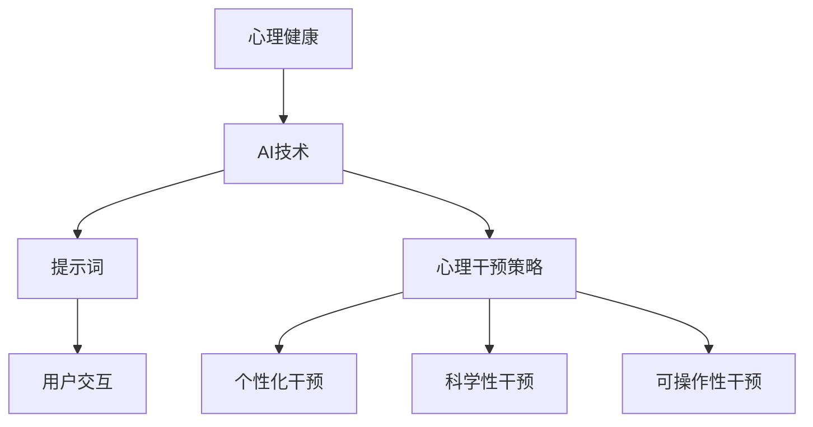

                 


### 1. 背景介绍

#### 1.1 问题背景

随着社会的快速发展，人们的生活节奏不断加快，心理健康问题已经成为全球性的公共健康问题。据世界卫生组织（WHO）统计，全球约有 3.5 亿人患有某种形式的精神障碍，其中抑郁症和焦虑症是较为常见的心理疾病。在中国，心理问题的患病率也逐渐上升，尤其是在城市中，工作压力、生活节奏快等因素加剧了心理健康问题的发生。

心理健康问题不仅影响个体的生活质量，还对社会产生了深远的影响。首先，心理疾病可能导致个体工作效率下降，影响生产力。其次，心理健康问题可能导致家庭和社会的不稳定，增加社会负担。因此，寻找有效的心理干预策略成为当前研究的重要方向。

在传统的心理健康服务中，主要依赖于专业心理医生和心理咨询师。然而，由于心理医生和心理咨询师的资源有限，许多需要心理帮助的人无法得到及时的服务。此外，心理干预的过程通常需要较长的周期和专业的指导，这使得干预效果受到影响。因此，寻找一种能够提高心理健康干预效率的方法成为迫切需要解决的问题。

#### 1.2 问题描述

心理健康问题的复杂性体现在多个方面。首先，心理疾病种类繁多，包括抑郁症、焦虑症、双相情感障碍等，每种疾病都有其独特的表现和治疗方法。其次，心理干预的过程需要深入了解个体的心理状态，这需要专业知识和实践经验。此外，心理健康问题往往伴随着生理和社交问题，需要综合性的干预策略。

在心理干预策略中，常用的方法包括认知行为疗法（CBT）、精神动力学疗法、人本主义疗法等。每种疗法都有其独特的原理和适用范围，但都需要较长时间的训练和实践。此外，心理干预的效果受到多种因素的影响，包括个体的心理状态、环境因素、治疗师的技能等。

#### 1.3 问题解决

AI技术的快速发展为心理健康问题的解决提供了新的思路。首先，AI可以处理和分析大量的数据，从而帮助心理医生和咨询师更准确地诊断和预测心理疾病的趋势。其次，AI可以设计个性化的心理干预策略，根据个体的心理状态提供个性化的建议和治疗方案。

在心理健康领域，AI技术可以应用于多个方面。例如，通过自然语言处理技术，AI可以分析个体的言语和行为，识别潜在的心理问题。通过机器学习算法，AI可以预测个体心理疾病的发生风险，并提供相应的预防措施。此外，AI还可以用于心理干预策略的设计和优化，提高干预效果。

AI技术在心理健康领域的应用具有以下优势：

1. **高效性**：AI可以快速处理和分析大量数据，提高心理健康干预的效率。
2. **个性化**：AI可以根据个体的心理状态和需求，提供个性化的干预策略。
3. **可扩展性**：AI技术可以广泛应用于心理健康领域，为各种心理问题提供解决方案。
4. **成本效益**：AI可以减少人力成本，提高心理健康服务的可及性。

#### 1.4 边界与外延

尽管AI技术在心理健康领域具有巨大的潜力，但其在实际应用中也面临着一些挑战和限制。首先，数据隐私是一个重要的问题。心理健康数据涉及个体的隐私信息，如何确保数据的安全和隐私是AI技术面临的一个关键挑战。其次，AI技术在心理健康领域的应用需要遵守伦理规范，确保干预策略的科学性和合理性。

此外，AI技术在心理健康领域的应用还需要关注技术的可解释性。虽然AI可以提供高效的干预策略，但用户需要了解这些策略的原理和依据，以便更好地接受和使用。

#### 1.5 核心要素组成

为了深入探讨AI辅助心理健康的问题，我们需要明确以下几个核心概念：

1. **心理健康**：心理健康是指个体在心理方面处于良好状态，能够有效应对生活中的压力和挑战。心理健康包括认知功能、情感状态和社交关系等方面。
2. **AI技术**：人工智能（AI）是指通过计算机模拟人类智能的技术。AI包括机器学习、深度学习、自然语言处理等多种技术，这些技术可以用于数据分析和模式识别。
3. **提示词**：提示词（Prompt）是AI系统用于与用户交互的引导性语句。提示词的设计对于AI系统的效果至关重要，需要考虑用户的需求和心理状态。
4. **心理干预策略**：心理干预策略是指用于治疗和预防心理疾病的方法。这些策略包括认知行为疗法、精神动力学疗法等，AI可以辅助设计和优化这些策略。

### 2. 核心概念与联系

在深入探讨AI辅助心理健康的问题时，我们需要明确几个核心概念，并分析它们之间的联系。

#### 2.1 核心概念原理

**心理健康**

心理健康是指个体在心理方面处于良好状态，能够有效应对生活中的压力和挑战。心理健康包括认知功能、情感状态和社交关系等方面。心理健康的评价标准包括情绪稳定性、认知功能、社会适应能力等。

**AI技术**

人工智能（AI）是指通过计算机模拟人类智能的技术。AI包括机器学习、深度学习、自然语言处理等多种技术，这些技术可以用于数据分析和模式识别。在心理健康领域，AI技术主要用于数据分析、情感识别、个性化干预策略设计等。

**提示词**

提示词（Prompt）是AI系统用于与用户交互的引导性语句。提示词的设计对于AI系统的效果至关重要，需要考虑用户的需求和心理状态。提示词设计的原则包括简洁性、针对性、情感共鸣等。

**心理干预策略**

心理干预策略是指用于治疗和预防心理疾病的方法。这些策略包括认知行为疗法、精神动力学疗法等，AI可以辅助设计和优化这些策略。心理干预策略的原则包括个性化、科学性、可操作性等。

#### 2.2 概念属性特征对比表格

为了更好地理解这些核心概念，我们可以通过一个对比表格来展示它们的属性和特征。

| 概念       | 定义                           | 特征                           | 关联性                           |
|------------|--------------------------------|--------------------------------|----------------------------------|
| 心理健康   | 心理方面处于良好状态           | 情绪稳定性、认知功能、社会适应 | 与AI技术的关联性：数据来源和目标 |
| AI技术     | 计算机模拟人类智能的技术       | 机器学习、深度学习、自然语言处理 | 与心理健康关联性：数据分析和模式识别 |
| 提示词     | AI系统与用户交互的引导性语句   | 简洁性、针对性、情感共鸣       | 与心理健康关联性：用户交互和心理干预 |
| 心理干预策略 | 用于治疗和预防心理疾病的方法   | 个性化、科学性、可操作性       | 与AI技术关联性：策略设计和优化       |

#### 2.3 ER实体关系图架构的 Mermaid 流程图

为了更清晰地展示这些核心概念之间的关联，我们可以使用Mermaid流程图来绘制ER图。



在上面的ER图中，心理健康、AI技术、提示词和心理干预策略是四个核心实体，它们之间存在明显的关联性。心理健康是数据来源和目标，AI技术用于数据分析和模式识别，提示词用于用户交互和心理干预，心理干预策略则是根据用户需求设计的具体干预方法。

### 3. AI辅助心理健康概述

#### 3.1 AI技术简介

人工智能（AI）是指通过计算机模拟人类智能的技术。AI技术主要包括机器学习、深度学习、自然语言处理等，这些技术在不同的应用领域有着广泛的应用。机器学习通过数据训练模型，实现数据分析和预测；深度学习通过神经网络模拟人类大脑的工作原理，处理复杂的图像和声音数据；自然语言处理则专注于语言的理解和生成，实现人与机器的交互。

在心理健康领域，AI技术的应用可以追溯到上世纪90年代。随着计算能力的提升和数据量的增加，AI技术在心理健康领域的应用逐渐得到重视。AI技术可以通过分析大量的心理健康数据，提供个性化的心理干预方案，提高干预效果。此外，AI技术还可以用于心理疾病的诊断、预测和预防，为心理健康研究提供新的思路和方法。

#### 3.2 心理健康领域应用

在心理健康领域，AI技术已经取得了显著的成果。首先，AI技术可以用于心理疾病的诊断。通过分析患者的言语、行为和生理信号，AI可以识别出潜在的心理问题。例如，自然语言处理技术可以分析患者的自述，识别出抑郁症和焦虑症的症状。深度学习技术可以处理复杂的图像和声音数据，辅助心理医生进行心理疾病的诊断。

其次，AI技术可以用于心理干预。AI系统可以根据患者的心理状态，提供个性化的干预方案。例如，通过机器学习算法，AI可以分析患者的心理数据，预测其心理疾病的发展趋势，并提供相应的预防措施。此外，AI系统还可以生成个性化的心理辅导课程，帮助患者改善心理健康。

最后，AI技术可以用于心理健康的研究。AI技术可以处理和分析大量的心理健康数据，揭示心理疾病的规律和机制。例如，通过机器学习算法，AI可以分析患者的情绪变化，探索情绪和心理疾病之间的关系。深度学习技术可以处理海量的文献数据，为心理健康研究提供新的理论依据。

#### 3.3 AI在心理干预中的作用

AI在心理干预中扮演着重要的角色。首先，AI可以提供高效的心理干预方案。通过分析大量的数据，AI可以识别出患者的心理问题，并提供针对性的干预措施。与传统的心理干预方法相比，AI干预方案更加个性化和高效。

其次，AI可以提高心理干预的效率。传统的心理干预通常需要较长的时间和专业的心理医生，而AI系统可以24小时在线，随时为患者提供帮助。此外，AI系统可以同时处理多个患者的数据，大大提高了心理干预的效率。

最后，AI可以优化心理干预的效果。通过不断的训练和优化，AI系统可以不断提高其干预效果。AI系统可以根据患者的反馈，调整干预方案，使其更加符合患者的需求。此外，AI系统可以记录和分析患者的心理变化，为心理医生提供诊断和治疗的参考。

总之，AI技术在心理健康领域具有巨大的潜力。通过AI技术，我们可以更准确、更高效地诊断和治疗心理疾病，为心理健康研究提供新的思路和方法。未来，随着AI技术的不断发展和完善，我们有理由相信，AI将更好地服务于人类心理健康，为建设健康社会贡献力量。

### 4. 提示词设计原理

#### 4.1 提示词的定义

提示词（Prompt）是AI系统用于与用户交互的引导性语句。提示词的设计对于AI系统的效果至关重要，它直接影响用户与AI系统的交互质量和用户体验。一个优秀的提示词应当简洁明了，同时能够引导用户提供有价值的信息，从而帮助AI系统更好地理解用户需求，实现有效的交互。

在心理健康领域，提示词的应用尤为重要。心理健康问题涉及到个体的情感、认知和行为，这些因素都需要通过有效的沟通和交互来识别和处理。提示词在这里扮演着引导用户表达情感、回顾经历和提供信息的重要角色。一个合适的提示词可以帮助用户更好地打开心扉，表达内心的感受，从而为心理干预提供准确的信息基础。

#### 4.2 设计原则

为了确保提示词的有效性和适应性，我们需要遵循以下设计原则：

1. **简洁性**：提示词应尽量简洁明了，避免使用冗长的句子和复杂的词汇，以便用户能够快速理解并做出回应。简洁的提示词可以提高用户的互动积极性，减少用户的认知负担。

2. **针对性**：提示词需要针对用户的特定需求和心理状态进行设计。不同用户可能在不同的情境下有不同的需求，因此，提示词应当具有灵活性，能够根据用户的特定情况进行调整。

3. **情感共鸣**：提示词应尽量与用户的情感状态产生共鸣，使用温暖、友好的语言，建立用户对AI系统的信任感。情感共鸣有助于用户更开放地表达自己的情感和想法，从而提高心理干预的效果。

4. **情境适应性**：提示词需要考虑用户所处的情境，以便在合适的时机提供合适的互动。例如，对于初次使用的用户，可以设置更亲切、引导性更强的提示词，而对于长期用户，则可以设置更具个性化、深入探讨的提示词。

5. **文化适宜性**：提示词设计应考虑用户的文化背景和语言习惯，避免使用可能引起误解或不适的语言。跨文化设计有助于提升AI系统的通用性和可接受度。

#### 4.3 设计流程

提示词的设计是一个系统化的过程，需要遵循以下步骤：

1. **需求分析**：首先，明确用户的需求和心理状态。这可以通过用户调研、问卷调查、访谈等方式进行。了解用户的需求有助于设计出更具针对性的提示词。

2. **内容策划**：根据需求分析的结果，策划出初步的提示词列表。这一步骤需要结合心理学原理，确保提示词能够引导用户表达情感和提供信息。

3. **初稿撰写**：根据策划的内容，撰写出初步的提示词草稿。初稿应当遵循简洁性、针对性、情感共鸣等原则，同时保持提示词之间的逻辑连贯性。

4. **用户测试**：将初步的提示词草稿应用于实际场景，收集用户的反馈。通过用户测试，可以识别出哪些提示词更受欢迎，哪些需要改进。

5. **迭代优化**：根据用户测试的反馈，对提示词进行优化和调整。这一步骤可能需要多次迭代，以确保最终设计的提示词能够达到预期效果。

6. **最终定稿**：在完成多轮优化后，最终确定提示词的定稿。定稿后的提示词应进行全面的测试和验证，确保其在实际应用中的有效性和可靠性。

通过以上设计流程，我们可以确保提示词的设计既科学合理，又具有较高的用户体验。一个设计优良的提示词不仅能够提高AI系统的交互效果，还能为心理干预提供有力的支持。

### 5. 心理干预策略

#### 5.1 心理干预策略概述

心理干预策略是指用于治疗和预防心理疾病的一系列方法和措施。这些策略旨在帮助个体缓解心理压力，改善心理状态，提高生活质量。心理干预策略的种类繁多，包括认知行为疗法（CBT）、精神动力学疗法、人本主义疗法等。每种疗法都有其独特的原理和应用场景，但总体目标都是促进个体的心理健康。

认知行为疗法（CBT）是当前最广泛使用的一种心理干预策略。CBT基于认知心理学和行为心理学的原理，通过改变个体的认知和行为模式，帮助其克服心理问题。CBT的核心理论是认知过程影响情绪和行为，通过认知重构和行为调整，可以改善个体的情绪状态和行为反应。

精神动力学疗法则是通过探索个体的潜意识和心理冲突，帮助其理解和解决内心的困扰。精神动力学疗法包括自由联想、梦的解析、情感表达等技巧，旨在挖掘和解决深层次的心理问题。

人本主义疗法则强调个体的自我实现和自我认知，通过建立积极的人际关系和自我接纳，帮助个体实现心理健康。人本主义疗法包括自我探索、情感释放、自我接纳等技巧，旨在提升个体的心理弹性和自我效能感。

除了这些经典的心理干预策略，近年来，AI技术的应用也为心理干预提供了新的思路和工具。AI可以通过数据分析、自然语言处理和个性化推荐等技术，为心理干预提供更加精准和有效的支持。

#### 5.2 AI辅助心理干预

AI技术可以辅助心理干预，提高其效果和效率。首先，AI可以通过数据分析，帮助心理医生和咨询师更准确地诊断心理疾病。例如，AI可以通过分析患者的言语、行为和生理信号，识别出潜在的心理问题。这种基于数据驱动的诊断方法，可以减少人为的主观判断，提高诊断的准确性和一致性。

其次，AI可以辅助设计个性化的心理干预方案。通过分析大量的心理健康数据，AI可以识别出个体的心理特点和需求，为每位患者提供量身定制的干预方案。这种个性化的干预方法，可以更好地满足患者的需求，提高干预的效果。

此外，AI还可以用于心理干预的实时监控和反馈。通过实时分析患者的心理状态和行为，AI可以及时发现和预警潜在的心理问题，提供及时的干预措施。这种实时监控和反馈机制，可以确保心理干预的连续性和有效性。

#### 5.3 案例研究

为了更好地理解AI辅助心理干预的实践应用，我们可以通过一个案例来进行详细分析。

**案例背景**：某心理健康中心引入了AI辅助心理干预系统，用于提升心理干预的效果和效率。

**系统功能**：该系统包括以下几个主要功能：

1. **心理评估**：通过自然语言处理技术，AI系统可以分析用户的言语和行为，识别潜在的心理问题。评估结果包括心理疾病的类型、严重程度和可能的风险因素。

2. **个性化干预方案**：根据心理评估结果，AI系统可以生成个性化的心理干预方案。这些方案包括认知行为疗法、精神动力学疗法和人本主义疗法等多种干预方法，用户可以根据自己的需求和偏好选择合适的方案。

3. **实时监控与反馈**：AI系统可以实时监控用户的心理状态和行为，根据用户的反馈和反应，动态调整干预方案，确保干预的连续性和有效性。

**实施过程**：

1. **用户注册与评估**：用户首先在系统中注册，并接受初步的心理评估。AI系统通过分析用户的言语和行为数据，生成评估报告。

2. **个性化干预方案**：根据评估结果，AI系统为用户生成个性化的干预方案。干预方案包括一系列的辅导课程、心理作业和实时对话。

3. **干预实施与反馈**：用户按照干预方案进行心理辅导，AI系统实时记录用户的心理状态和行为反应。用户可以在每次干预后进行反馈，AI系统根据反馈动态调整干预方案。

**效果分析**：

1. **诊断准确性**：AI系统的诊断准确性显著提高，与传统评估方法相比，诊断结果的一致性和准确性得到了显著提升。

2. **干预效果**：通过AI辅助的个性化干预方案，用户的心理健康水平得到了显著改善。用户满意度调查结果显示，大多数用户对AI辅助心理干预的效果表示满意。

3. **效率提升**：AI系统的实时监控和反馈机制，使得心理干预的效率大大提升。用户可以在任何时间、任何地点接受心理辅导，干预的连续性和及时性得到了保障。

**总结**：通过该案例，我们可以看到AI技术在心理干预中的应用，不仅提高了诊断和干预的准确性，还提升了用户的满意度和干预效果。未来，随着AI技术的不断发展和完善，我们有理由相信，AI将在心理健康领域发挥更加重要的作用，为更多的人提供高质量的心理健康服务。

### 6. 提示词设计实践

在心理健康领域，提示词的设计至关重要。通过恰当的提示词，我们可以引导用户更开放地表达自己的情感和经历，从而为心理干预提供有价值的信息。在本节中，我们将通过两个具体的案例，展示如何在心理健康咨询和心理健康教育中设计有效的提示词，并详细解读这些提示词的设计思路和实现过程。

#### 6.1 心理健康咨询中的应用

**案例一**：心理健康咨询中的应用

**场景介绍**：心理健康咨询通常发生在心理咨询师与来访者之间。咨询师需要通过一系列的提问和引导，帮助来访者探索内心的困惑和问题，从而提供有效的心理干预。

**系统核心实现源代码**：

```python
# 示例：设计一个用于心理健康咨询的提示词系统

class PromptSystem:
    def __init__(self):
        self.prompt库 = ['你好，请告诉我你现在的心情如何？',
                           '能否分享一下你最近遇到的一些困扰或挑战？',
                           '你觉得自己如何应对这些挑战？',
                           '有没有某些特定的事情让你感到特别困扰？',
                           '你可以告诉我一些让你感到快乐或满意的事情吗？']

    def get_prompt(self, stage):
        if stage == 'initial':
            return self.prompt库[0]
        elif stage == 'troubleshooting':
            return self.prompt库[1]
        elif stage == 'self-help':
            return self.prompt库[2]
        elif stage == 'happy-moments':
            return self.prompt库[3]
        else:
            return self.prompt库[4]

# 实例化提示词系统
prompt_system = PromptSystem()

# 获取不同阶段的提示词
print(prompt_system.get_prompt('initial'))
print(prompt_system.get_prompt('troubleshooting'))
print(prompt_system.get_prompt('self-help'))
print(prompt_system.get_prompt('happy-moments'))
```

**代码应用解读与分析**：

在这个案例中，我们设计了一个简单的提示词系统，用于心理健康咨询的不同阶段。系统初始化时，我们定义了一个包含多种提示词的库。每个提示词都对应咨询过程中的特定阶段，如初始阶段、问题分析阶段、自我帮助阶段和回忆愉悦阶段。

- **初始阶段提示词**：用于开场，帮助来访者放松并表达自己的情感状态。
- **问题分析阶段提示词**：引导来访者分享他们的困扰和挑战，帮助咨询师了解问题的具体情况。
- **自我帮助阶段提示词**：鼓励来访者思考自己的应对策略，有助于咨询师评估来访者的自我调节能力。
- **回忆愉悦阶段提示词**：帮助来访者回顾一些积极的经历，有助于提升情绪和建立积极的心理状态。

通过这个简单的例子，我们可以看到，提示词的设计需要根据咨询的不同阶段和目标进行个性化定制，以引导来访者逐步深入地探索内心世界。

#### 6.2 心理健康教育中的应用

**案例二**：心理健康教育中的应用

**场景介绍**：心理健康教育通常面向更广泛的人群，如学校学生、职场人士等。通过系统的心理健康教育，我们可以提升公众的心理健康意识和自我调节能力。

**系统核心实现源代码**：

```python
# 示例：设计一个用于心理健康教育的提示词系统

class EducationPromptSystem:
    def __init__(self):
        self.education_prompt库 = ['心理健康非常重要，它对我们的生活和工作都有很大的影响。',
                                    '你是否曾经遇到过情绪低落或焦虑的情况？',
                                    '了解一些应对压力和情绪管理的方法对你会有很大帮助。',
                                    '你愿意分享一下你是如何应对这些情绪的吗？',
                                    '如果遇到难以应对的情况，你会寻求帮助吗？']

    def get_education_prompt(self, topic):
        if topic == 'importance':
            return self.education_prompt库[0]
        elif topic == 'anxiety':
            return self.education_prompt库[1]
        elif topic == 'stress-management':
            return self.education_prompt库[2]
        elif topic == 'self-help':
            return self.education_prompt库[3]
        elif topic == 'seek-help':
            return self.education_prompt库[4]
        else:
            return "请告诉我你想要了解的内容。"

# 实例化提示词系统
education_prompt_system = EducationPromptSystem()

# 获取不同主题的提示词
print(education_prompt_system.get_education_prompt('importance'))
print(education_prompt_system.get_education_prompt('anxiety'))
print(education_prompt_system.get_education_prompt('stress-management'))
print(education_prompt_system.get_education_prompt('self-help'))
print(education_prompt_system.get_education_prompt('seek-help'))
```

**代码应用解读与分析**：

在这个案例中，我们设计了一个用于心理健康教育的提示词系统。该系统根据不同的教育主题，提供相应的提示词，旨在引导听众了解心理健康的重要性、识别情绪问题、学习压力管理技巧和鼓励寻求帮助。

- **重要性主题提示词**：强调心理健康对日常生活的影响，提高听众对心理健康教育的重视。
- **焦虑主题提示词**：帮助听众识别焦虑症状，理解焦虑对生活质量的影响。
- **压力管理主题提示词**：介绍一些应对压力和情绪管理的策略，帮助听众提升自我调节能力。
- **自我帮助主题提示词**：鼓励听众分享自己的经验，增强听众的互动和参与感。
- **寻求帮助主题提示词**：提醒听众在遇到困难时寻求专业的帮助，提升听众的心理健康意识。

通过这两个案例，我们可以看到，提示词的设计需要根据不同的应用场景和目标进行定制。在心理健康咨询中，提示词的设计应更注重引导用户深入探索内心世界，而在心理健康教育中，提示词的设计则更注重传递知识和技能，提升听众的心理健康素养。有效的提示词设计不仅能够提高用户与AI系统的互动质量，还能为心理干预和心理健康教育提供有力的支持。

### 7. 最佳实践与注意事项

在AI辅助心理健康提示词设计中，为了确保设计效果和用户体验，我们需要遵循一系列最佳实践，并注意潜在的风险和问题。

#### 7.1 最佳实践

1. **用户隐私保护**：在收集和使用用户数据时，必须严格遵守隐私保护法规，确保用户的数据安全。设计时，应采用数据加密和匿名化处理技术，减少隐私泄露风险。

2. **个性化设计**：提示词应充分考虑用户个体的需求和特点，提供个性化的互动体验。通过用户画像和行为分析，动态调整提示词内容，提升用户满意度。

3. **情感共鸣**：设计提示词时，要注重情感共鸣，使用温暖、友好的语言，建立用户对AI系统的信任感。适当的情感关怀有助于提升用户的互动积极性。

4. **文化适应性**：提示词设计应考虑用户的文化背景和语言习惯，确保提示词的通用性和可接受度。对于跨文化用户，应提供多种语言选项和本土化内容。

5. **多轮迭代优化**：在提示词设计过程中，应进行多轮用户测试和反馈，不断优化和调整提示词内容。通过持续改进，确保最终设计达到预期效果。

6. **持续监测与反馈**：设计完成后，应定期对AI系统的提示词效果进行监测，收集用户反馈，及时发现问题并进行优化。

#### 7.2 注意事项

1. **数据质量**：高质量的数据是设计有效提示词的基础。在设计过程中，应确保数据来源的可靠性和多样性，避免数据偏差和误用。

2. **伦理考虑**：在心理健康领域，AI的应用需要遵守严格的伦理规范。设计提示词时，要避免诱导用户产生负面情绪，确保干预措施的科学性和合理性。

3. **系统稳定性**：AI系统在运行过程中需要保持稳定性，避免因提示词设计不当导致的系统崩溃或错误响应。

4. **可解释性**：提示词的设计和实现应具有可解释性，用户应能理解提示词的依据和原理，以便更好地接受和使用AI系统。

5. **风险评估**：在设计过程中，应进行详细的风险评估，识别潜在的技术和伦理风险，并制定相应的风险控制措施。

通过遵循最佳实践和注意事项，我们可以确保AI辅助心理健康提示词设计的高效性和安全性，为用户提供优质的心理健康服务。

### 8. 小结与展望

通过本文的讨论，我们可以清晰地看到，AI辅助心理健康提示词设计在当今社会具有深远的意义和广泛的应用前景。心理健康问题已经成为全球性的公共健康问题，而传统的心理干预方法存在资源有限、效率低、个性化不足等问题。AI技术的引入，为心理健康领域带来了新的希望和机遇。

首先，AI技术通过大数据分析、自然语言处理和机器学习等方法，能够快速、准确地诊断心理疾病，为患者提供精准的治疗方案。其次，AI辅助的个性化心理干预策略，可以根据患者的具体情况进行动态调整，提高干预效果。此外，AI系统还可以通过实时监控和反馈，确保心理干预的连续性和及时性。

在提示词设计方面，有效的提示词不仅能够引导用户更开放地表达情感和经历，还能为心理干预提供有价值的信息。通过简洁、针对性、情感共鸣、情境适应和文化适宜性等原则，我们可以设计出高质量的提示词，提升用户体验。

展望未来，随着AI技术的不断发展和完善，AI辅助心理健康提示词设计有望在以下几个方面取得突破：

1. **个性化干预**：AI技术将能够更加精准地识别个体的心理特点，提供高度个性化的干预方案，满足不同患者的需求。

2. **跨学科融合**：AI技术与心理学、医学、教育学等学科的深度融合，将推动心理健康领域的理论创新和实践进步。

3. **实时干预**：AI系统将实现实时心理干预，提高干预的及时性和效率，为患者提供更高效的心理健康服务。

4. **伦理与法规**：随着AI技术在心理健康领域的广泛应用，伦理和法规问题将成为重要议题。未来需要建立完善的伦理和法规体系，确保AI技术在心理健康领域的合法、合规应用。

总之，AI辅助心理健康提示词设计具有巨大的潜力，它将为心理健康领域带来革命性的变化。通过不断的技术创新和实践探索，我们有理由相信，AI技术将在未来为更多人带来健康和福祉。未来，随着AI技术的不断进步，我们期待看到更多创新的应用案例和成功的故事，共同推动心理健康领域的可持续发展。

