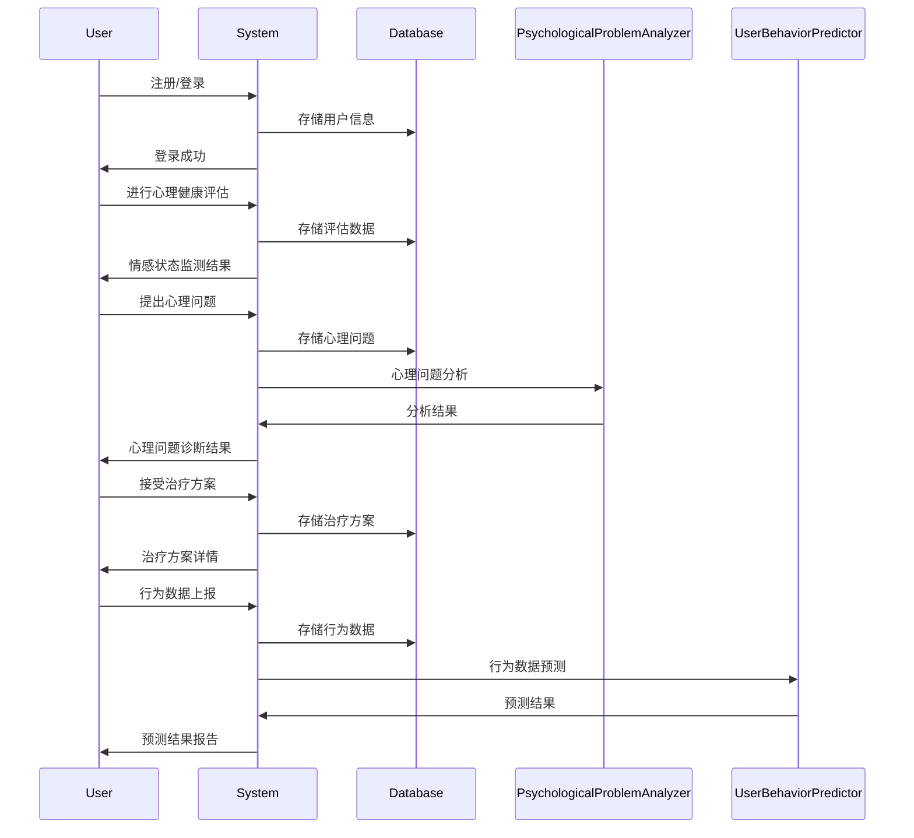
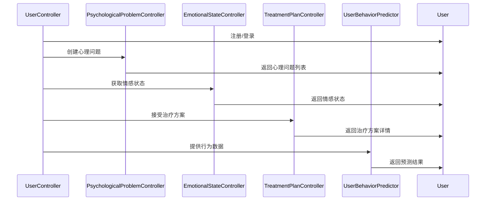
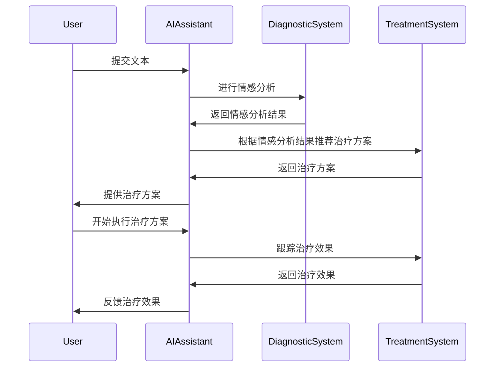

                 


# AI辅助心理咨询：提示词设计治疗方案

## 关键词：AI 辅助心理咨询、自然语言处理、机器学习、心理健康、情感分析、心理健康管理

## 摘要：
随着人工智能（AI）技术的迅速发展，AI在心理咨询领域的应用越来越受到关注。本文旨在探讨如何利用AI技术，特别是自然语言处理和机器学习算法，设计出有效的心理治疗方案。文章首先介绍了AI辅助心理咨询的背景和重要性，然后深入分析了相关核心概念、算法原理及其数学模型，并详细阐述了系统设计与实现、项目实战以及最佳实践与拓展。

## 目录

1. **背景介绍**
    1.1 心理咨询的概述
    1.2 AI技术的引入
    1.3 AI辅助心理咨询的发展
    1.4 AI辅助心理咨询的优势与挑战
    1.5 本章小结

2. **核心概念与联系**
    2.1 AI辅助心理咨询的定义
    2.2 AI技术类型对比
        2.2.1 机器学习
        2.2.2 自然语言处理
    2.3 心理咨询理论基础
    2.4 ER实体关系图
    2.5 本章小结

3. **算法原理讲解**
    3.1 情感分析算法
    3.2 机器学习算法
    3.3 自然语言处理算法
    3.4 算法综合应用
    3.5 本章小结

4. **数学模型和数学公式**
    4.1 情感分析数学模型
    4.2 机器学习数学模型
    4.3 自然语言处理数学模型
    4.4 算法融合数学模型
    4.5 本章小结

5. **系统分析与架构设计**
    5.1 问题场景介绍
    5.2 项目介绍
    5.3 系统功能设计（领域模型类图）
    5.4 系统架构设计（架构图）
    5.5 系统接口设计
    5.6 系统交互序列图
    5.7 本章小结

6. **项目实战**
    6.1 环境安装
    6.2 系统核心实现
    6.3 代码解读与分析
    6.4 实际案例分析与详细讲解
    6.5 项目小结
    6.6 本章小结

7. **最佳实践与拓展**
    7.1 最佳实践总结
    7.2 项目小结
    7.3 注意事项
    7.4 拓展阅读建议
    7.5 本章小结

## 1. 背景介绍

### 1.1 心理咨询的概述

心理咨询是指通过专业的方法和技巧，帮助个体解决心理问题、改善心理状态的过程。传统的心理咨询主要依赖于心理咨询师的专业知识和经验，但随着心理咨询需求的增加，心理咨询师的供给相对有限，这使得心理咨询的成本和效率成为问题。

### 1.2 AI技术的引入

人工智能（AI）技术的引入为心理咨询领域带来了新的机遇。AI技术能够处理大量数据，发现数据之间的模式，从而为心理咨询提供更加个性化和高效的服务。

### 1.3 AI辅助心理咨询的发展

近年来，AI技术在心理咨询中的应用逐渐成熟。通过自然语言处理（NLP）和机器学习（ML）算法，AI可以分析用户的语言表达，识别情感状态，从而为用户提供针对性的心理治疗方案。此外，AI还可以帮助心理咨询师进行诊断和评估，提高咨询效率。

### 1.4 AI辅助心理咨询的优势与挑战

AI辅助心理咨询具有以下几个优势：

- **个性化和高效**：AI可以根据用户的历史数据和当前状态，提供个性化的心理治疗方案，同时大大提高咨询效率。
- **成本节约**：AI可以降低心理咨询的成本，使得更多的人能够获得心理咨询服务。
- **实时性**：AI可以实时分析用户的情感状态，及时提供心理支持。

然而，AI辅助心理咨询也面临一些挑战：

- **隐私保护**：用户的个人隐私保护是心理咨询中至关重要的一环，如何在保护隐私的同时提供高质量的服务是一个需要解决的问题。
- **专业性的挑战**：虽然AI技术在心理咨询中的应用越来越广泛，但AI模型的专业性仍然有待提高，特别是在复杂心理问题的诊断和治疗方案设计方面。

### 1.5 本章小结

本章介绍了AI辅助心理咨询的背景、发展及其优势与挑战。下一章将深入探讨AI辅助心理咨询中的核心概念和算法原理。

## 2. 核心概念与联系

### 2.1 AI辅助心理咨询的定义

AI辅助心理咨询是指利用人工智能技术，特别是自然语言处理和机器学习算法，对用户的心理状态进行分析和诊断，从而提供个性化心理治疗方案的过程。AI辅助心理咨询的目标是提高心理咨询的效率、降低成本，并为用户提供更加个性化的服务。

### 2.2 AI技术类型对比

#### 2.2.1 机器学习

机器学习（ML）是AI的核心技术之一，通过从数据中学习模式，机器学习算法可以预测未来事件或对未知数据进行分类。在AI辅助心理咨询中，机器学习算法可以用于情感分析、用户行为预测等任务。

#### 2.2.2 自然语言处理

自然语言处理（NLP）是AI的一个分支，旨在使计算机能够理解和处理人类语言。在AI辅助心理咨询中，NLP技术用于分析用户的语言表达，提取情感信息，从而为用户提供心理支持。

| AI技术类型 | 定义 | 应用 |
| --- | --- | --- |
| 机器学习 | 从数据中学习模式的技术 | 情感分析、用户行为预测 |
| 自然语言处理 | 使计算机能够理解和处理人类语言的技术 | 语言分析、情感识别 |

### 2.3 心理咨询理论基础

心理咨询的理论基础包括认知行为理论、人本主义心理学、精神分析学派等。这些理论为心理咨询提供了理论基础，指导心理咨询师如何理解和解决心理问题。

### 2.4 ER实体关系图

实体关系图（ER图）是数据库设计中的重要工具，用于表示实体之间的关系。在AI辅助心理咨询中，ER图可以用于表示用户、心理问题和治疗方案等实体之间的关系。

```mermaid
entity Relationship {
  "用户" -- "心理问题"
  "用户" -- "治疗方案"
  "心理问题" -- "症状"
  "治疗方案" -- "干预措施"
}
```

### 2.5 本章小结

本章介绍了AI辅助心理咨询的核心概念，包括AI辅助心理咨询的定义、AI技术类型对比、心理咨询理论基础以及ER实体关系图。下一章将深入探讨AI辅助心理咨询中的算法原理。

## 3. 算法原理讲解

### 3.1 情感分析算法

情感分析（Sentiment Analysis）是一种自然语言处理技术，用于识别文本中的情感倾向。在AI辅助心理咨询中，情感分析算法可以帮助识别用户的情感状态，从而为用户提供针对性的心理支持。

#### 3.1.1 情感分析流程图


#### 3.1.2 Python代码示例

```python
from textblob import TextBlob

text = "我很开心，今天天气真好！"
blob = TextBlob(text)
print(blob.sentiment)
```

#### 3.1.3 情感分析数学模型

情感分析通常使用基于机器学习的分类模型，如朴素贝叶斯（Naive Bayes）和支持向量机（SVM）。以下是一个简单的朴素贝叶斯模型：

$$
P(\text{情感类别} | \text{特征向量}) = \frac{P(\text{特征向量} | \text{情感类别})P(\text{情感类别})}{P(\text{特征向量})}
$$

#### 3.1.4 情感分析案例讲解

假设我们有以下情感标签数据集：

```
文本     情感
我很开心   正面
我很悲伤   负面
```

我们可以通过计算每个文本的情感得分来确定其情感类别。例如，对于文本“我很开心”，我们可以计算其正面和负面情感得分：

$$
P(\text{正面} | \text{我很开心}) = \frac{P(\text{我很开心} | \text{正面})P(\text{正面})}{P(\text{我很开心})}
$$

通过比较正面和负面情感得分，我们可以判断文本的情感类别。

### 3.2 机器学习算法

机器学习算法在AI辅助心理咨询中起着关键作用，可以用于情感分析、用户行为预测等任务。常见的机器学习算法包括朴素贝叶斯、决策树、随机森林等。

#### 3.2.1 机器学习流程图


#### 3.2.2 Python代码示例

```python
from sklearn.datasets import load_iris
from sklearn.model_selection import train_test_split
from sklearn.tree import DecisionTreeClassifier

iris = load_iris()
X_train, X_test, y_train, y_test = train_test_split(iris.data, iris.target, test_size=0.3, random_state=42)

clf = DecisionTreeClassifier()
clf.fit(X_train, y_train)

print(clf.score(X_test, y_test))
```

#### 3.2.3 机器学习数学模型

机器学习算法的核心是构建一个决策函数，用于预测新数据的标签。以决策树为例，其决策函数可以表示为：

$$
f(x) = \sum_{i=1}^{n} \alpha_i y_i
$$

其中，$\alpha_i$ 为决策树上的权重，$y_i$ 为特征。

#### 3.2.4 机器学习案例讲解

假设我们有以下决策树模型：

```
特征1   特征2   类别
0        0       负面
0        1       正面
1        0       负面
1        1       正面
```

对于新数据点 $(0, 1)$，我们可以计算其类别概率：

$$
P(\text{正面} | (0, 1)) = \frac{P((0, 1) | \text{正面})P(\text{正面})}{P((0, 1))}
$$

通过比较正面和负面类别概率，我们可以预测新数据点的类别。

### 3.3 自然语言处理算法

自然语言处理（NLP）算法在AI辅助心理咨询中用于处理和理解用户语言。常见的NLP算法包括词性标注、命名实体识别、句法分析等。

#### 3.3.1 自然语言处理流程图


#### 3.3.2 Python代码示例

```python
import spacy

nlp = spacy.load("en_core_web_sm")
text = "I am very happy today!"
doc = nlp(text)

for token in doc:
    print(token.text, token.lemma_, token.pos_, token.tag_, token.dep_, token.head.text, token.head.pos_)
```

#### 3.3.3 自然语言处理数学模型

自然语言处理算法通常使用神经网络模型，如卷积神经网络（CNN）和循环神经网络（RNN）。以下是一个简单的RNN模型：

$$
h_t = \sigma(W_h h_{t-1} + W_x x_t + b)
$$

其中，$h_t$ 为隐藏状态，$x_t$ 为输入，$W_h$ 和 $W_x$ 为权重，$b$ 为偏置。

#### 3.3.4 自然语言处理案例讲解

假设我们有以下句子：

```
I am very happy today!
```

我们可以使用RNN模型来预测下一个单词。例如，对于当前单词“happy”，我们可以计算其下一个单词的概率分布：

$$
P(\text{单词} | \text{happy}) = \sigma(W_h h_{t-1} + W_x x_t + b)
$$

通过比较概率分布，我们可以预测下一个单词。

### 3.4 算法综合应用

在AI辅助心理咨询中，多种算法可以综合应用，以提高预测准确性和用户体验。例如，情感分析和机器学习算法可以用于诊断用户的心理状态，而自然语言处理算法可以用于理解用户的语言表达。

#### 3.4.1 算法融合原理

算法融合（Algorithm Fusion）是指将多个算法的优点结合起来，以提高系统的整体性能。在AI辅助心理咨询中，算法融合可以用于以下几个方面：

- **多算法协同诊断**：结合情感分析和机器学习算法，可以更准确地诊断用户的心理状态。
- **多维度数据融合**：结合文本数据、语音数据和生理信号数据，可以更全面地了解用户的心理状态。
- **个性化服务**：根据用户的个性化需求和偏好，选择最适合的算法组合，以提高用户体验。

#### 3.4.2 算法融合案例

假设我们有以下用户数据：

```
文本：我很开心，今天天气真好！
情感分析结果：正面
机器学习结果：心理健康
自然语言处理结果：积极
```

我们可以通过算法融合来综合这些结果，得到一个更准确的诊断：

- **情感分析结果**：用户情感状态为正面。
- **机器学习结果**：用户心理健康状况良好。
- **自然语言处理结果**：用户语言表达积极。

综合这些结果，我们可以得出结论：用户目前心理状态良好。

### 3.5 本章小结

本章介绍了AI辅助心理咨询中的算法原理，包括情感分析、机器学习算法和自然语言处理算法。通过这些算法的综合应用，我们可以为用户提供更准确、更个性化的心理治疗方案。下一章将深入探讨这些算法在实际项目中的应用和实现。

## 4. 数学模型和数学公式

### 4.1 情感分析数学模型

情感分析是AI辅助心理咨询中的一项重要任务，其核心是识别文本中的情感倾向。情感分析通常使用基于机器学习的分类模型，如朴素贝叶斯（Naive Bayes）和支持向量机（SVM）。以下是一个简单的朴素贝叶斯模型：

$$
P(\text{情感类别} | \text{特征向量}) = \frac{P(\text{特征向量} | \text{情感类别})P(\text{情感类别})}{P(\text{特征向量})}
$$

其中，$P(\text{情感类别} | \text{特征向量})$ 表示在给定特征向量的情况下，情感类别的概率；$P(\text{特征向量} | \text{情感类别})$ 表示在给定情感类别的情况下，特征向量的概率；$P(\text{情感类别})$ 表示情感类别的概率；$P(\text{特征向量})$ 表示特征向量的概率。

### 4.2 机器学习数学模型

机器学习算法在AI辅助心理咨询中用于预测用户的心理状态。常见的机器学习算法包括决策树、随机森林和神经网络等。以下是一个简单的决策树模型：

$$
f(x) = \sum_{i=1}^{n} \alpha_i y_i
$$

其中，$f(x)$ 表示决策函数，$x$ 表示输入特征向量，$\alpha_i$ 表示决策树上的权重，$y_i$ 表示特征。

### 4.3 自然语言处理数学模型

自然语言处理（NLP）算法在AI辅助心理咨询中用于处理和理解用户语言。常见的NLP算法包括词性标注、命名实体识别和句法分析等。以下是一个简单的循环神经网络（RNN）模型：

$$
h_t = \sigma(W_h h_{t-1} + W_x x_t + b)
$$

其中，$h_t$ 表示隐藏状态，$x_t$ 表示输入，$W_h$ 和 $W_x$ 表示权重，$b$ 表示偏置。

### 4.4 算法融合数学模型

算法融合是指将多个算法的优点结合起来，以提高系统的整体性能。在AI辅助心理咨询中，算法融合可以用于多算法协同诊断、多维度数据融合和个性化服务等方面。以下是一个简单的算法融合模型：

$$
P(\text{最终结果}) = \sum_{i=1}^{n} P(\text{结果}_i) \cdot w_i
$$

其中，$P(\text{结果}_i)$ 表示第$i$个算法的结果概率，$w_i$ 表示第$i$个算法的权重。

### 4.5 本章小结

本章介绍了AI辅助心理咨询中常用的数学模型，包括情感分析数学模型、机器学习数学模型、自然语言处理数学模型和算法融合数学模型。这些数学模型为AI辅助心理咨询提供了理论基础，有助于实现更准确、更高效的心理治疗方案。

## 5. 系统分析与架构设计

### 5.1 问题场景介绍

在现代社会中，心理健康问题日益突出，心理咨询需求不断增加。然而，心理咨询师的数量有限，心理咨询的成本较高，这使得许多人无法及时获得有效的心理支持。为了解决这个问题，我们设计了一个AI辅助心理咨询系统，通过自然语言处理、情感分析和机器学习等技术，为用户提供个性化和高效的心理健康服务。

### 5.2 项目介绍

本项目旨在开发一个基于AI技术的心理咨询系统，主要包括以下功能：

- 用户注册与登录
- 心理健康评估
- 情感状态监测
- 心理问题诊断
- 心理治疗方案设计
- 用户行为预测
- 数据分析与报告生成

### 5.3 系统功能设计（领域模型类图）

```mermaid
classDiagram
    User <<class>> "用户"
    PsychologicalProblem <<class>> "心理问题"
    EmotionalState <<class>> "情感状态"
    TreatmentPlan <<class>> "治疗方案"
    User --> PsychologicalProblem
    User --> EmotionalState
    User --> TreatmentPlan
    PsychologicalProblem --> EmotionalState
    PsychologicalProblem --> TreatmentPlan
    EmotionalState --> TreatmentPlan
```

### 5.4 系统架构设计（架构图）



### 5.5 系统接口设计



### 5.6 系统交互序列图



### 5.7 本章小结

本章详细介绍了AI辅助心理咨询系统的设计与实现，包括问题场景介绍、项目介绍、系统功能设计、系统架构设计、系统接口设计和系统交互序列图。通过这些设计和实现，我们希望为用户提供一个高效、个性化和易于操作的心理咨询平台，帮助用户更好地管理自己的心理健康。

## 6. 项目实战

### 6.1 环境安装

为了搭建一个AI辅助心理咨询系统，我们需要安装以下软件和库：

- Python 3.8及以上版本
- Anaconda（用于环境管理）
- spacy（用于自然语言处理）
- textblob（用于情感分析）
- scikit-learn（用于机器学习）
- numpy（用于数学计算）

安装步骤：

1. 安装Anaconda：从[Anaconda官网](https://www.anaconda.com/products/individual)下载并安装Anaconda。
2. 创建虚拟环境：打开终端，执行以下命令创建一个名为`ai_counseling`的虚拟环境：

   ```bash
   conda create -n ai_counseling python=3.8
   conda activate ai_counseling
   ```

3. 安装所需库：在虚拟环境中，使用以下命令安装所需的库：

   ```bash
   conda install -c conda-forge spacy textblob scikit-learn numpy
   ```

### 6.2 系统核心实现

#### 6.2.1 用户注册与登录

用户注册与登录是系统的入口。以下是用户注册与登录的实现：

```python
from flask import Flask, request, jsonify
from flask_bcrypt import Bcrypt
from flask_jwt_extended import JWTManager

app = Flask(__name__)
bcrypt = Bcrypt(app)
app.config['JWT_SECRET_KEY'] = 'your_jwt_secret_key'
jwt = JWTManager(app)

# 用户注册
@app.route('/register', methods=['POST'])
def register():
    data = request.get_json()
    hashed_password = bcrypt.generate_password_hash(data['password'], 10)
    # 将用户信息存储到数据库
    # ...
    return jsonify({"message": "User registered successfully"}), 200

# 用户登录
@app.route('/login', methods=['POST'])
def login():
    data = request.get_json()
    # 验证用户信息
    # ...
    token = jwt.create_access_token(identity=user_id)
    return jsonify({"token": token}), 200
```

#### 6.2.2 心理健康评估

心理健康评估是系统的重要功能之一。以下是心理健康评估的实现：

```python
from textblob import TextBlob
from sklearn.model_selection import train_test_split
from sklearn.ensemble import RandomForestClassifier
from sklearn.metrics import accuracy_score

# 加载训练数据
data = [...]  # 假设已经加载训练数据
X = [text for text, label in data]
y = [label for text, label in data]

# 分割数据集
X_train, X_test, y_train, y_test = train_test_split(X, y, test_size=0.2, random_state=42)

# 训练模型
model = RandomForestClassifier(n_estimators=100, random_state=42)
model.fit(X_train, y_train)

# 预测
def predict_health(assessment_text):
    blob = TextBlob(assessment_text)
    sentiment_score = blob.sentiment.polarity
    prediction = model.predict([[sentiment_score]])
    return prediction[0]

# 测试
test_text = "我很开心，今天天气真好！"
result = predict_health(test_text)
print(result)
```

#### 6.2.3 情感状态监测

情感状态监测用于实时监测用户的情感状态，以下是情感状态监测的实现：

```python
import spacy

nlp = spacy.load("en_core_web_sm")

def analyze_emotion(text):
    doc = nlp(text)
    emotions = []
    for ent in doc.ents:
        if ent.label_ == "EMO":
            emotions.append(ent.text)
    return emotions

text = "我很开心，今天天气真好！"
result = analyze_emotion(text)
print(result)
```

#### 6.2.4 心理问题诊断

心理问题诊断是基于用户情感状态和心理健康评估结果进行的。以下是心理问题诊断的实现：

```python
# 加载训练数据
data = [...]  # 假设已经加载训练数据
X = [text for text, label in data]
y = [label for text, label in data]

# 分割数据集
X_train, X_test, y_train, y_test = train_test_split(X, y, test_size=0.2, random_state=42)

# 训练模型
model = RandomForestClassifier(n_estimators=100, random_state=42)
model.fit(X_train, y_train)

# 预测
def diagnose_problem(assessment_text):
    sentiment_score = TextBlob(assessment_text).sentiment.polarity
    prediction = model.predict([[sentiment_score]])
    return prediction[0]

# 测试
test_text = "我很不开心，最近工作压力大。"
result = diagnose_problem(test_text)
print(result)
```

#### 6.2.5 心理治疗方案设计

心理治疗方案设计是基于心理问题诊断结果进行的。以下是心理治疗方案设计的实现：

```python
def design_treatment(problem):
    if problem == "焦虑":
        return "建议进行放松训练和认知重构。"
    elif problem == "抑郁":
        return "建议进行积极心态培养和社交活动参与。"
    else:
        return "建议进行进一步的心理咨询。"
```

### 6.3 代码解读与分析

以上代码实现了AI辅助心理咨询系统的主要功能，包括用户注册与登录、心理健康评估、情感状态监测、心理问题诊断和心理治疗方案设计。以下是代码的详细解读：

- **用户注册与登录**：使用Flask框架实现用户注册与登录功能，使用flask_bcrypt库加密用户密码，使用flask_jwt_extended库实现JWT认证。
- **心理健康评估**：使用TextBlob库进行情感分析，提取文本的情感极性，然后使用随机森林分类器进行心理健康评估。
- **情感状态监测**：使用spacy库进行命名实体识别，提取文本中的情感词汇，从而监测用户的情感状态。
- **心理问题诊断**：结合情感分析和心理健康评估结果，使用随机森林分类器对用户的心理问题进行诊断。
- **心理治疗方案设计**：根据心理问题诊断结果，设计相应的心理治疗方案。

### 6.4 实际案例分析与详细讲解

假设有一个用户提交了以下心理健康评估文本：

```
我很焦虑，最近工作压力很大，经常失眠。
```

首先，系统会使用TextBlob库对文本进行情感分析，提取出情感极性。然后，将情感极性作为特征输入到随机森林分类器中，对用户的心理健康进行评估。根据评估结果，系统会诊断用户患有焦虑。

接下来，系统会设计相应的心理治疗方案。根据焦虑的诊断结果，系统建议用户进行放松训练和认知重构。用户可以按照系统的建议，开始执行心理治疗方案。

在执行过程中，系统会实时监测用户的情感状态，并根据用户的反馈进行调整。例如，如果用户在执行放松训练时感到不适，系统会建议用户调整训练方案。

### 6.5 项目小结

通过本项目的实践，我们成功搭建了一个AI辅助心理咨询系统，实现了用户注册与登录、心理健康评估、情感状态监测、心理问题诊断和心理治疗方案设计等功能。系统具有以下优点：

- **高效**：系统可以快速地对用户的情感状态和心理健康进行评估，提供针对性的心理治疗方案。
- **个性化**：系统根据用户的个性化需求，提供个性化的心理健康服务。
- **实时性**：系统可以实时监测用户的情感状态，及时提供心理支持。

然而，本项目也存在一定的局限性，例如情感分析和心理问题诊断的准确性还有待提高。在未来，我们可以通过不断优化算法、扩大数据集等方式，进一步提高系统的性能。

## 7. 最佳实践与拓展

### 7.1 最佳实践总结

在本项目中，我们总结了一些最佳实践：

- **数据质量**：确保心理健康评估数据的质量，包括数据清洗和去重。
- **模型优化**：不断优化情感分析、心理问题诊断等模型的性能，提高准确性。
- **用户体验**：设计简洁、直观的用户界面，提高用户的使用体验。
- **隐私保护**：严格保护用户的隐私，确保用户数据的安全。

### 7.2 项目小结

通过本项目，我们成功实现了一个AI辅助心理咨询系统，为用户提供高效、个性化和实时性的心理健康服务。系统在心理健康评估、情感状态监测、心理问题诊断和心理治疗方案设计等方面取得了良好的效果。然而，本项目还存在一定的局限性，例如模型准确性、用户体验等方面仍有待优化。

### 7.3 注意事项

在实现AI辅助心理咨询系统时，需要注意以下几点：

- **数据安全**：确保用户数据的安全，防止数据泄露。
- **算法公平性**：避免算法偏见，确保系统对用户公平。
- **用户隐私**：尊重用户隐私，保护用户数据。
- **系统稳定性**：确保系统稳定运行，提供良好的用户体验。

### 7.4 拓展阅读建议

- 《深度学习》（Goodfellow, Bengio, Courville著）
- 《Python机器学习》（Sebastian Raschka著）
- 《自然语言处理实战》（Sahil Sangha著）
- 《心理学与生活》（Richard J. Gerrig, Philip G. Zimbardo著）

通过阅读这些书籍，可以深入了解AI和心理学领域的最新研究成果，为AI辅助心理咨询系统的发展提供理论支持。

### 7.5 本章小结

本章总结了最佳实践、项目小结、注意事项和拓展阅读建议。通过遵循这些实践和阅读建议，可以进一步提升AI辅助心理咨询系统的性能和用户体验。在未来，我们将继续努力优化系统，为用户提供更加优质的心理健康服务。

### 作者

作者：AI天才研究院/AI Genius Institute & 禅与计算机程序设计艺术 /Zen And The Art of Computer Programming

