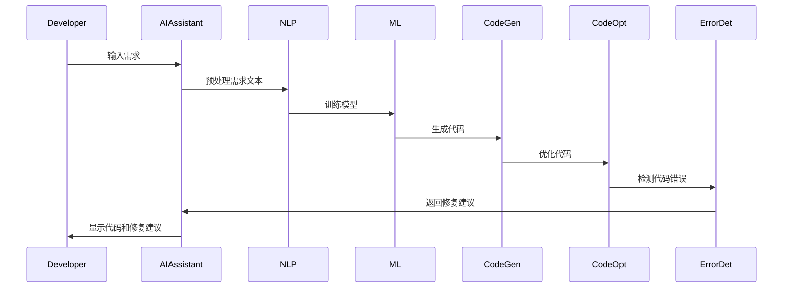
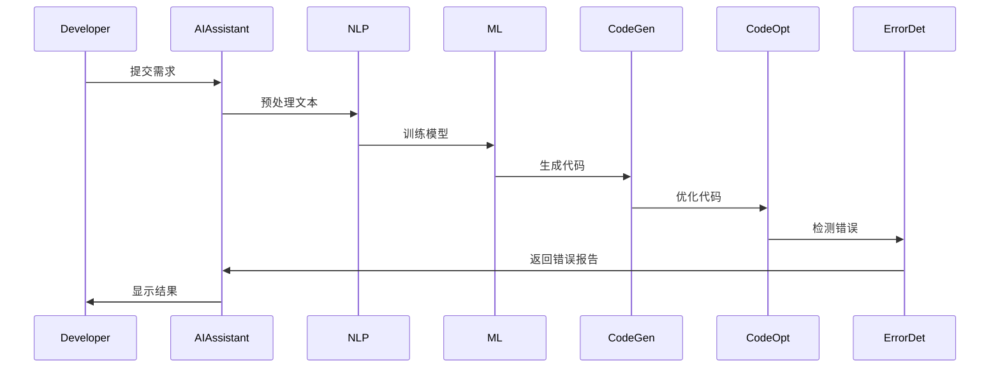

                 

## 引言

### AI辅助提示词编程工具开发背景

在当今的数字化时代，编程已成为一种基础技能，广泛运用于各个行业和领域。然而，传统的编程方法往往依赖于程序员的个人经验和知识积累，这使得编程过程不仅复杂，而且效率低下。特别是对于复杂的大型项目，程序员常常需要花费大量的时间来理解和调整代码。因此，如何提高编程效率和减少人力成本成为了一个亟待解决的问题。

近年来，人工智能（AI）技术的发展为编程领域带来了新的契机。特别是自然语言处理（NLP）和机器学习（ML）技术的进步，使得AI辅助编程工具成为可能。通过AI技术，编程工具能够理解自然语言描述，自动生成代码，从而显著提高编程效率。本文将围绕AI辅助提示词编程工具的开发展开讨论，探讨其背景、核心概念、应用领域、架构设计、算法原理以及项目实战等关键内容。

### 文章核心内容与主题思想

本文的核心内容分为以下几个部分：

1. **背景介绍**：分析当前编程领域的现状，阐述AI辅助提示词编程工具的需求背景。
2. **核心概念**：介绍AI辅助提示词编程工具的定义、特点及其与现有编程工具的区别。
3. **应用领域**：探讨AI辅助提示词编程工具在各主要领域的应用潜力。
4. **架构设计**：详细解析AI辅助提示词编程工具的系统架构设计。
5. **算法原理**：讲解核心算法的原理，并使用mermaid流程图和Python源代码进行说明。
6. **系统分析与架构设计方案**：介绍问题场景、系统功能设计、系统架构设计、系统接口设计以及系统交互。
7. **项目实战**：通过实际案例展示AI辅助提示词编程工具的开发过程和效果。
8. **最佳实践与注意事项**：总结最佳实践，提醒潜在问题和注意事项，推荐拓展阅读。

本文的主题思想在于通过系统的分析和讲解，使读者能够全面理解AI辅助提示词编程工具的开发和应用，为其在编程领域带来革命性的变革提供理论支持和实践指导。

## 第1章: AI辅助提示词编程工具开发背景

### 1.1.1 问题背景

编程是现代信息技术的基础，然而，随着软件系统的复杂度和规模不断增加，传统的编程方式已经面临诸多挑战。首先，编程过程高度依赖于开发人员的个人技能和经验，不同程序员之间的代码风格和习惯差异显著，导致代码的可读性和可维护性较差。其次，编程任务通常涉及大量的重复劳动，例如语法检查、调试和代码优化，这些工作不仅耗时，而且容易出错。此外，大型项目的代码库管理也变得复杂，程序员在理解和修改现有代码时往往需要花费大量的时间和精力。

在软件开发的各个阶段，程序员都需要进行需求分析、设计、编码、测试和部署。在这些环节中，需求分析和设计尤为重要，但同时也是最为复杂和费时的部分。传统的需求分析方法通常依赖于文档和会议，但这些方法存在沟通不畅、信息丢失和版本控制困难等问题。在编码阶段，程序员需要根据设计文档编写代码，但设计文档往往存在表述不清或遗漏的情况，导致代码编写过程中频繁出现错误和返工。

近年来，虽然编程辅助工具（如代码自动补全、智能提示、静态代码分析等）得到了广泛应用，但这些工具仍然存在一定的局限性。首先，这些工具通常只能处理特定编程语言和框架的规则，对于复杂和跨语言的编程任务支持不足。其次，这些工具大多基于静态数据，无法动态理解程序的上下文和逻辑，因此在实际应用中效果有限。

因此，如何提高编程效率、减少开发成本、提升代码质量成为软件开发领域亟待解决的问题。AI技术的引入为解决这些问题提供了新的思路。通过AI技术，特别是自然语言处理（NLP）和机器学习（ML），可以开发出能够理解和生成代码的AI辅助提示词编程工具，从而实现编程过程的自动化和智能化。

### 1.1.2 问题描述

在传统的编程过程中，程序员面临的主要问题可以归纳为以下几个方面：

1. **沟通与理解问题**：需求分析阶段的沟通不畅和需求文档的不完善，导致设计文档中的错误和遗漏。程序员在理解和实现需求时，需要花费大量的时间和精力来澄清和修正这些问题。

2. **重复劳动**：编程过程中，程序员需要进行大量的重复劳动，如语法检查、调试和代码优化。这些工作不仅耗时，而且容易出现错误，降低了编程效率。

3. **代码质量**：由于程序员的知识水平和经验差异，不同人编写的代码质量和风格存在显著差异。这不仅影响了代码的可读性和可维护性，也给后续的维护和扩展带来了困难。

4. **跨语言支持不足**：现有的编程辅助工具通常只针对特定的编程语言和框架，对于跨语言的编程任务支持不足，无法满足复杂项目开发的需求。

5. **动态理解能力缺乏**：传统的编程辅助工具大多基于静态数据，无法动态理解程序的上下文和逻辑，因此在实际应用中效果有限。

这些问题的存在，严重影响了软件开发项目的进度和质量。特别是在大型和复杂的项目中，编程任务的复杂性进一步增加，程序员的工作负担变得更加沉重。因此，开发能够解决这些问题的AI辅助提示词编程工具显得尤为迫切。

### 1.1.3 解决方案

为了解决上述问题，AI辅助提示词编程工具的开发思路主要包括以下几个方面：

1. **自然语言处理（NLP）**：利用NLP技术，AI辅助提示词编程工具能够理解自然语言描述，从而实现自动化的需求分析和设计。NLP技术能够识别自然语言中的关键词、短语和句子结构，帮助程序员更好地理解和处理需求文档。

2. **机器学习（ML）**：通过机器学习算法，AI辅助提示词编程工具可以从大量的编程数据和代码库中学习，从而提高代码生成的准确性和效率。ML技术可以帮助工具自动识别编程模式、代码风格和最佳实践，从而生成高质量的代码。

3. **动态上下文理解**：AI辅助提示词编程工具需要具备动态理解程序上下文和逻辑的能力，以便在编程过程中提供实时和准确的提示和帮助。这需要工具具备实时分析和处理程序代码的能力，能够根据代码的执行情况和变化动态调整提示内容。

4. **跨语言支持**：为了满足复杂项目开发的需求，AI辅助提示词编程工具需要具备跨语言的支持能力。这可以通过开发通用的编程语言模型和数据结构，实现对多种编程语言和框架的支持。

5. **用户交互**：AI辅助提示词编程工具需要提供友好和高效的用户交互界面，以便程序员能够方便地使用工具进行编程。这包括提供代码自动补全、智能提示、代码质量分析等功能，以及提供自定义和扩展的能力。

通过上述解决方案，AI辅助提示词编程工具能够显著提高编程效率、减少开发成本、提升代码质量，为软件开发项目提供强有力的支持。同时，这些工具还可以帮助新手程序员更快地学习和掌握编程技能，从而推动整个编程领域的进步和发展。

### 1.1.4 边界与外延

AI辅助提示词编程工具的开发和应用虽然潜力巨大，但也存在一些边界和限制。首先，工具的性能和效果受限于AI算法和数据的质量。如果训练数据不足或者数据质量不高，工具的准确性和可靠性可能会受到影响。其次，工具的适用范围和编程语言支持也是需要考虑的因素。目前，AI辅助提示词编程工具主要适用于结构化较强的编程任务和场景，对于一些非常规和复杂的编程需求，工具可能难以胜任。

此外，工具的集成和兼容性也是一个重要的边界问题。AI辅助提示词编程工具需要能够无缝集成到现有的开发环境中，同时兼容各种编程语言和框架。为了实现这一目标，工具需要具备良好的模块化和扩展性。

在外延方面，AI辅助提示词编程工具不仅可以在传统软件开发领域发挥作用，还可以扩展到其他领域，如人工智能、大数据分析和物联网等。在这些领域中，AI技术可以帮助解决编程中的复杂性和挑战，提高开发效率和代码质量。

### 1.1.5 核心概念

为了更好地理解AI辅助提示词编程工具的开发和应用，我们需要明确一些核心概念：

1. **自然语言处理（NLP）**：NLP是人工智能的一个分支，旨在使计算机能够理解、解析和生成自然语言。在AI辅助提示词编程工具中，NLP技术用于处理和理解程序员输入的自然语言描述，从而生成相应的代码。

2. **机器学习（ML）**：ML是AI的一个重要分支，通过训练模型和算法，使计算机能够从数据中学习规律和模式。在AI辅助提示词编程工具中，ML技术用于从大量的编程数据和代码库中学习，以提高代码生成的准确性和效率。

3. **深度学习（DL）**：深度学习是ML的一个子领域，使用多层神经网络模型来学习和提取特征。在AI辅助提示词编程工具中，DL技术可以用于构建复杂的模型，以实现更准确的代码生成和理解。

4. **代码生成（Code Generation）**：代码生成是指利用程序代码自动生成技术，从自然语言描述或其他形式的需求输入中生成相应的代码。在AI辅助提示词编程工具中，代码生成是核心功能之一，能够显著提高编程效率。

5. **上下文理解（Context Understanding）**：上下文理解是指计算机能够根据当前的环境和上下文信息，理解并处理输入的自然语言描述。在AI辅助提示词编程工具中，上下文理解能力至关重要，能够提供实时和准确的提示和帮助。

通过理解这些核心概念，我们能够更好地把握AI辅助提示词编程工具的开发和应用，为未来的研究和实践提供指导。

## 第2章: AI辅助提示词编程工具概念与特性

### 2.1.1 AI辅助提示词编程工具的定义

AI辅助提示词编程工具是一种利用人工智能技术，尤其是自然语言处理（NLP）和机器学习（ML）算法，辅助程序员进行编程的工具。这种工具的核心功能是通过理解程序员输入的自然语言描述或代码片段，自动生成或优化相应的代码。具体来说，AI辅助提示词编程工具能够实现以下几个方面的功能：

1. **代码自动补全**：根据程序员输入的自然语言描述或部分代码，工具能够自动补全相应的代码，减少程序员手动输入的工作量。
2. **代码生成**：基于自然语言描述或需求输入，工具可以生成完整的代码片段或程序，从而帮助程序员快速实现功能。
3. **代码优化**：通过对现有代码的分析，工具能够提出优化建议，帮助程序员提高代码质量和性能。
4. **错误检查与修复**：工具可以检测代码中的潜在错误，并给出修复建议，减少编程过程中的错误率。

AI辅助提示词编程工具与传统编程工具的主要区别在于，它能够动态理解程序员的需求和代码上下文，提供更加智能和个性化的辅助服务。传统编程工具通常依赖于预设的规则和语法，而AI辅助提示词编程工具则通过学习和适应，实现更加智能和灵活的编程支持。

### 2.1.2 AI辅助提示词编程工具的特点

AI辅助提示词编程工具具有以下显著特点：

1. **高效率**：通过自动补全、代码生成和优化等功能，AI辅助提示词编程工具能够显著提高编程效率，减少重复劳动，缩短项目开发周期。
2. **智能化**：工具利用机器学习和自然语言处理技术，能够动态理解程序员的需求和代码上下文，提供智能化的编程辅助。
3. **个性化**：AI辅助提示词编程工具能够根据程序员的个人风格和偏好进行定制化服务，提供更加贴合个人需求的编程支持。
4. **跨语言支持**：AI辅助提示词编程工具能够支持多种编程语言，包括但不限于Python、Java、C++等，使得程序员可以在不同的编程环境中使用同一套工具，提高开发的一致性和效率。
5. **实时反馈**：工具能够在程序员编写代码的过程中实时提供提示和建议，帮助快速解决问题，提高编程效率。

### 2.1.3 与传统编程工具的区别

传统编程工具，如代码编辑器、集成开发环境（IDE）和代码库管理工具，虽然在编程过程中提供了许多便利，但它们与AI辅助提示词编程工具存在以下几个显著区别：

1. **功能差异**：传统编程工具主要提供代码编辑、调试和测试等功能，而AI辅助提示词编程工具则通过自然语言处理和机器学习技术，提供代码自动补全、生成和优化等智能辅助功能。
2. **交互方式**：传统编程工具依赖于图形用户界面（GUI）和键盘输入，而AI辅助提示词编程工具则通过自然语言交互，使得程序员可以使用更加自然和便捷的方式进行编程。
3. **适应性**：传统编程工具通常固定提供特定的功能，而AI辅助提示词编程工具能够根据程序员的实际需求和环境动态调整功能，提供更加个性化的服务。
4. **智能程度**：传统编程工具的智能程度有限，主要依赖于预设的规则和算法，而AI辅助提示词编程工具通过机器学习和自然语言处理技术，能够实现更高程度的智能化和自动化。

### 2.1.4 关键技术分析

AI辅助提示词编程工具的核心技术主要包括自然语言处理（NLP）、机器学习（ML）和深度学习（DL）。以下是对这些关键技术的详细分析：

1. **自然语言处理（NLP）**：NLP是AI辅助提示词编程工具的核心技术之一，用于理解和解析程序员输入的自然语言描述。NLP技术包括文本预处理、词法分析、句法分析和语义分析等步骤：

   - **文本预处理**：包括去除标点符号、转换文本为小写、去除停用词等，以提高文本分析的效率和质量。
   - **词法分析**：将文本拆分为单词或词汇，识别词性（如名词、动词等）。
   - **句法分析**：分析句子的结构，识别句子中的主语、谓语、宾语等成分。
   - **语义分析**：理解文本的语义含义，识别实体、关系和意图。

   在AI辅助提示词编程工具中，NLP技术主要用于：

   - **需求分析**：从自然语言描述中提取关键信息，理解程序员的编程需求。
   - **代码生成**：根据需求输入生成相应的代码片段或程序。

2. **机器学习（ML）**：ML是AI辅助提示词编程工具实现智能辅助功能的重要技术。ML技术通过训练模型和算法，从大量的编程数据和代码库中学习，以实现代码自动补全、优化和错误检测等功能。ML的关键步骤包括：

   - **数据收集**：从开源代码库、项目文档和其他来源收集大量的编程数据和代码。
   - **数据预处理**：对收集到的数据进行清洗、转换和标注，以便用于训练模型。
   - **模型训练**：使用收集到的数据训练模型，包括神经网络、决策树、支持向量机等。
   - **模型评估**：评估训练好的模型的性能，通过交叉验证、准确率、召回率等指标进行评估。
   - **模型优化**：根据评估结果对模型进行调整和优化，以提高模型的性能。

   在AI辅助提示词编程工具中，ML技术主要用于：

   - **代码生成**：基于需求输入，利用训练好的模型生成相应的代码。
   - **代码优化**：分析现有代码，提出优化建议，如代码重构、性能优化等。

3. **深度学习（DL）**：深度学习是ML的一个子领域，通过多层神经网络模型进行学习和特征提取。DL技术在AI辅助提示词编程工具中具有广泛应用，特别是在代码生成和优化方面：

   - **代码生成**：利用生成对抗网络（GAN）或变分自编码器（VAE）等模型，从需求输入中生成高质量的代码。
   - **代码优化**：通过深度强化学习（DRL）等技术，优化现有代码的性能和可读性。

综上所述，AI辅助提示词编程工具通过自然语言处理、机器学习和深度学习等关键技术的结合，实现了编程过程的智能化和自动化，为程序员提供了高效、智能的编程辅助工具。

## 第3章: AI辅助提示词编程工具的主要应用领域

### 3.1.1 人工智能领域

人工智能（AI）领域是AI辅助提示词编程工具的重要应用场景之一。在AI项目中，开发人员需要处理大量的数据，并编写复杂的算法和模型来训练和优化AI系统。AI辅助提示词编程工具能够显著提高AI项目的开发效率，具体体现在以下几个方面：

1. **自动生成代码**：AI辅助提示词编程工具可以根据自然语言描述自动生成AI算法和模型的代码，帮助开发者快速实现算法原型。
2. **代码优化建议**：通过分析现有代码，AI辅助提示词编程工具能够提出优化建议，如改进数据结构、优化算法实现等，从而提高AI系统的性能。
3. **错误检测与修复**：AI辅助提示词编程工具能够检测AI代码中的潜在错误，并给出修复建议，减少AI系统的故障率。

例如，在深度学习项目中，开发者可以使用AI辅助提示词编程工具来生成和优化神经网络模型的代码，从而提高模型的训练速度和准确性。通过自动化的代码生成和优化，开发者可以更专注于算法研究和模型优化，提高整体开发效率。

### 3.1.2 数据科学领域

数据科学是另一个受益于AI辅助提示词编程工具的重要领域。数据科学家需要处理大量的数据，并编写复杂的脚本和算法来提取和转换数据，以便进行数据分析和建模。AI辅助提示词编程工具能够为数据科学项目提供以下帮助：

1. **自动数据处理**：AI辅助提示词编程工具可以根据自然语言描述自动执行数据处理任务，如数据清洗、数据转换和数据归一化，从而简化数据科学项目的准备工作。
2. **代码生成与优化**：AI辅助提示词编程工具能够根据自然语言描述自动生成数据处理和分析的代码，并优化代码的性能和可读性。
3. **模型推荐与评估**：AI辅助提示词编程工具可以根据数据分析任务的需求，推荐合适的机器学习模型，并提供模型评估和优化建议。

例如，在一个数据科学项目中，数据科学家可以使用AI辅助提示词编程工具来自动化数据预处理步骤，生成高效的Python脚本，从而加快数据分析流程。通过自动生成和优化代码，数据科学家可以更专注于数据分析和模型优化，提高项目效率。

### 3.1.3 软件开发领域

在软件开发领域，AI辅助提示词编程工具的应用潜力同样巨大。开发者需要编写大量代码来构建和维护软件系统，AI辅助提示词编程工具能够为软件开发提供以下帮助：

1. **代码自动补全**：AI辅助提示词编程工具可以根据上下文信息自动补全代码，减少手动输入的工作量，提高编码效率。
2. **代码生成**：AI辅助提示词编程工具可以根据自然语言描述生成完整的代码片段或模块，从而加快软件开发速度。
3. **代码优化**：AI辅助提示词编程工具可以分析现有代码，提出优化建议，如改进代码结构、优化算法实现等，提高软件性能和可维护性。
4. **错误检测与修复**：AI辅助提示词编程工具可以检测代码中的潜在错误，并提供修复建议，减少软件故障率。

例如，在一个Web开发项目中，开发者可以使用AI辅助提示词编程工具来自动生成HTML、CSS和JavaScript代码，从而加快开发速度。通过自动补全、代码生成和优化功能，开发者可以更专注于业务逻辑的实现，提高整体开发效率。

### 3.1.4 教育领域

在教育领域，AI辅助提示词编程工具具有巨大的应用潜力，能够帮助教师和学生提高编程学习效果。具体应用包括：

1. **编程辅助**：AI辅助提示词编程工具可以根据学生的自然语言描述生成对应的代码，帮助学生理解编程概念和语法。
2. **代码审查与反馈**：AI辅助提示词编程工具可以审查学生的代码，并提供语法错误和逻辑错误的提示和反馈，帮助学生快速纠正错误。
3. **个性化教学**：AI辅助提示词编程工具可以根据学生的学习进度和偏好，提供个性化的编程练习和任务，帮助学生更好地掌握编程技能。

例如，在一个编程课程中，教师可以使用AI辅助提示词编程工具为学生提供个性化的编程练习，根据学生的回答生成相应的代码片段，帮助学生更好地理解编程概念。通过代码审查和个性化教学功能，教师可以更有效地指导学生，提高教学效果。

综上所述，AI辅助提示词编程工具在人工智能、数据科学、软件开发和教育等领域具有广泛的应用潜力，能够显著提高开发效率和编程质量。通过自动生成代码、代码优化、错误检测与修复等功能，AI辅助提示词编程工具为各领域提供了智能化的编程支持，推动了编程技术的进步和发展。

## 第4章: AI辅助提示词编程工具的架构设计

### 4.1.1 系统架构概述

AI辅助提示词编程工具的系统架构设计旨在实现高效的编程辅助功能，涵盖多个模块和层次。系统整体架构可以分为以下几个核心模块：数据处理模块、模型训练模块、辅助编程模块和用户交互模块。以下是对各模块的功能和作用的详细说明：

1. **数据处理模块**：该模块主要负责对输入的自然语言描述和代码数据进行处理和清洗。主要功能包括文本预处理、词法分析、句法分析和语义分析。通过这些步骤，模块可以将原始文本数据转化为结构化的数据格式，以便后续模型训练和代码生成。

2. **模型训练模块**：该模块利用机器学习和深度学习算法，对处理后的数据集进行训练，生成用于代码生成和优化的模型。模型训练过程包括数据收集、数据预处理、模型训练和模型评估等步骤。训练出的模型将具备理解自然语言描述和生成代码的能力。

3. **辅助编程模块**：该模块是系统的核心功能模块，负责根据模型生成代码、提供代码优化建议、实现错误检测与修复等功能。模块中的代码生成器能够根据自然语言描述自动生成代码，而代码优化器则能够分析现有代码并提出优化建议。此外，错误检测与修复功能可以帮助程序员快速定位和解决代码中的问题。

4. **用户交互模块**：该模块负责与用户进行交互，接收用户输入的自然语言描述和代码数据，并将生成的代码和优化建议反馈给用户。用户交互模块包括命令行界面（CLI）、图形用户界面（GUI）和Web界面等，为用户提供方便、直观的操作体验。

整个系统架构的设计原则是模块化、可扩展性和高可用性。模块化设计使得各个模块可以独立开发、测试和部署，提高了系统的灵活性和可维护性。可扩展性使得系统能够根据需求增加新功能或支持更多编程语言和框架。高可用性则是通过冗余设计和负载均衡等措施，确保系统在面临高并发和高负载时仍能稳定运行。

### 4.1.2 数据处理模块

数据处理模块是AI辅助提示词编程工具的核心模块之一，主要负责对输入的自然语言描述和代码数据进行处理和清洗，以确保数据的质量和一致性。该模块包括以下主要功能：

1. **文本预处理**：文本预处理是数据处理的第一步，旨在去除无关信息、降低文本的复杂性。具体操作包括去除标点符号、将文本转换为小写、去除停用词等。这些操作有助于提高后续文本分析的效率和准确性。

2. **词法分析**：词法分析是将文本拆分为单词或词汇的过程，识别每个词汇的词性（如名词、动词等）。词法分析的结果为句法分析和语义分析提供了基本的数据单元。

3. **句法分析**：句法分析是理解文本句子结构的过程，识别句子中的主语、谓语、宾语等成分。通过句法分析，系统能够更准确地理解程序员的编程意图。

4. **语义分析**：语义分析是理解文本的语义含义的过程，识别文本中的实体、关系和意图。语义分析的结果用于指导代码生成和优化过程，确保生成的代码符合程序员的实际需求。

在数据处理模块中，我们使用了多种自然语言处理技术，如分词、词性标注、依存句法分析和实体识别。这些技术的综合应用，使得系统能够准确理解自然语言描述，并为后续的模型训练和代码生成提供可靠的数据基础。

### 4.1.3 模型训练模块

模型训练模块是AI辅助提示词编程工具的核心组成部分，负责利用机器学习和深度学习算法对处理后的数据进行训练，生成能够实现代码生成和优化的模型。该模块的主要功能和步骤如下：

1. **数据收集**：首先，从各种开源代码库、项目文档、编程论坛和其他来源收集大量的编程数据和代码。这些数据将用于训练和评估模型。

2. **数据预处理**：对收集到的数据进行预处理，包括去除无关信息、统一数据格式、进行文本清洗等。预处理步骤的目的是提高数据的质量和一致性，以便后续的模型训练。

3. **特征提取**：通过特征提取技术，从预处理后的数据中提取出对代码生成和优化有用的特征。特征提取是模型训练的关键步骤，决定了模型的性能和效果。常用的特征提取技术包括词嵌入、语法树结构和代码抽象等。

4. **模型训练**：使用提取出的特征数据，训练深度神经网络模型或机器学习模型。训练过程包括前向传播、反向传播和优化算法等步骤。常用的模型训练算法包括卷积神经网络（CNN）、循环神经网络（RNN）和生成对抗网络（GAN）等。

5. **模型评估**：在训练过程中，定期评估模型的性能，通过交叉验证、准确率、召回率等指标来衡量模型的性能。评估结果用于指导模型调整和优化。

6. **模型优化**：根据评估结果，对模型进行调整和优化，以提高模型的准确性和泛化能力。模型优化可以采用多种技术，如超参数调整、正则化和迁移学习等。

模型训练模块的核心目标是生成一个能够准确理解和生成代码的模型，并通过不断的训练和优化，提高模型的性能和适用性。训练出的模型将用于辅助编程模块，实现代码生成、代码优化和错误检测与修复等功能。

### 4.1.4 辅助编程模块

辅助编程模块是AI辅助提示词编程工具的核心功能模块，负责实现代码生成、代码优化和错误检测与修复等功能。该模块通过调用模型训练模块生成的模型，提供智能化、自动化的编程辅助。以下是辅助编程模块的主要功能和实现方法：

1. **代码生成**：代码生成是辅助编程模块的核心功能之一。通过调用模型训练模块生成的代码生成模型，辅助编程模块能够根据自然语言描述自动生成相应的代码。具体实现方法如下：

   - **文本到代码转换**：将自然语言描述转化为结构化的代码表示。这一步需要使用自然语言处理技术，如词嵌入、语法树分析和语义分析，以确保生成的代码符合程序员的意图。
   - **代码生成模型调用**：调用训练好的代码生成模型，输入自然语言描述，输出对应的代码片段或程序。常用的代码生成模型包括生成对抗网络（GAN）、递归神经网络（RNN）和变换器（Transformer）等。
   - **代码优化**：在生成代码后，对代码进行优化，提高代码的可读性和性能。代码优化可以包括代码重构、性能优化和代码简化等。

2. **代码优化**：辅助编程模块能够分析现有代码，并提出优化建议。优化过程包括以下步骤：

   - **代码分析**：对现有代码进行语法和语义分析，提取出关键的信息和模式。
   - **优化建议生成**：基于代码分析结果，生成优化建议，如改进数据结构、优化算法实现和代码重构等。
   - **代码优化执行**：执行优化建议，对代码进行修改和优化，以提高代码的性能和可读性。

3. **错误检测与修复**：辅助编程模块能够检测代码中的潜在错误，并提供修复建议。具体实现方法如下：

   - **错误检测**：使用训练好的错误检测模型，分析代码中的语法和语义错误，如变量未定义、语法错误和逻辑错误等。
   - **错误修复**：基于错误检测结果，生成修复建议，如代码补全、错误修正和代码重构等。
   - **错误修复执行**：执行修复建议，对代码进行修正，以确保代码的正确性和稳定性。

辅助编程模块通过集成多种自然语言处理和机器学习技术，实现了智能化、自动化的编程辅助功能。这些功能不仅提高了编程效率，还显著减少了代码错误和返工，为程序员提供了强有力的支持。

### 4.1.5 用户交互模块

用户交互模块是AI辅助提示词编程工具的重要组成部分，负责与用户进行交互，接收用户输入的自然语言描述和代码数据，并将生成的代码和优化建议反馈给用户。该模块包括以下主要功能：

1. **命令行界面（CLI）**：CLI为用户提供了一种便捷的命令行操作方式。用户可以通过输入命令和参数，与AI辅助提示词编程工具进行交互。CLI的优点是操作灵活，适用于自动化脚本和集成开发环境。

2. **图形用户界面（GUI）**：GUI为用户提供了一个直观、易用的图形界面，通过按钮、菜单和对话框等元素，用户可以方便地进行操作。GUI的优点是易于学习和使用，适用于大多数用户，特别是非技术背景的用户。

3. **Web界面**：Web界面是一种基于Web浏览器的交互方式，用户可以在任何支持Web浏览器的设备上访问和使用AI辅助提示词编程工具。Web界面的优点是跨平台、无需安装，便于用户随时随地使用。

用户交互模块的设计原则是直观、易用和高效。通过CLI、GUI和Web界面等多种交互方式，用户可以根据自己的需求和习惯选择最合适的方式与AI辅助提示词编程工具进行交互。此外，用户交互模块还提供了丰富的提示和帮助功能，帮助用户更好地理解和操作工具。

### 4.1.6 系统架构设计原则

AI辅助提示词编程工具的系统架构设计遵循以下原则，以确保系统的稳定性、可扩展性和高效性：

1. **模块化**：系统架构采用模块化设计，将功能分为数据处理模块、模型训练模块、辅助编程模块和用户交互模块等。这种设计使得各个模块可以独立开发、测试和部署，提高了系统的灵活性和可维护性。

2. **可扩展性**：系统架构设计考虑了未来的扩展需求，支持增加新的功能模块和编程语言。例如，可以通过插件机制轻松集成其他自然语言处理和机器学习库，提高工具的适用性和功能多样性。

3. **高可用性**：系统架构采用冗余设计和负载均衡等措施，确保在高并发和高负载情况下仍能稳定运行。例如，可以使用分布式计算和缓存技术，提高系统的处理能力和响应速度。

4. **安全性**：系统架构设计考虑了数据安全和用户隐私保护，采用加密和认证技术，确保用户数据和系统数据的安全性和完整性。

5. **用户体验**：系统架构设计注重用户体验，通过多样化的用户交互界面和丰富的提示帮助功能，提高用户的操作便利性和满意度。

通过遵循这些设计原则，AI辅助提示词编程工具能够提供稳定、高效、智能化的编程辅助服务，为程序员和开发团队带来显著的价值。

### 第5章: AI辅助提示词编程工具的核心算法原理讲解

#### 5.1.1 算法概述

AI辅助提示词编程工具的核心算法基于自然语言处理（NLP）和机器学习（ML）技术，主要包括以下关键步骤：

1. **文本预处理**：对输入的自然语言描述进行清洗和格式化，去除无关信息，进行分词和词性标注。
2. **语义解析**：通过句法分析和语义分析，提取文本中的关键信息，理解程序员的编程意图。
3. **代码生成**：利用训练好的机器学习模型，根据语义解析结果生成相应的代码片段。
4. **代码优化**：对生成的代码进行优化，提高代码的质量和性能。
5. **错误检测与修复**：使用训练好的错误检测模型，分析代码中的潜在错误，并提供修复建议。

下面我们将详细讲解这些算法的原理，并使用mermaid流程图和Python源代码进行说明。

#### 5.1.2 算法mermaid流程图

首先，我们使用mermaid语言描述算法的流程图，如下所示：


在这个流程图中，文本预处理模块接收用户输入的自然语言描述，通过一系列步骤将其转换为结构化的数据格式。语义解析模块负责分析文本中的语义信息，提取关键信息以指导代码生成。代码生成模块利用训练好的机器学习模型，根据语义解析结果生成代码。代码优化模块对生成的代码进行优化，以提高其质量和性能。最后，错误检测与修复模块检查代码中的潜在错误，并提供修复建议。

#### 5.1.3 Python源代码实现

为了更好地理解算法的实现过程，我们使用Python语言实现核心算法的各个模块，具体代码如下：

```python
# 文本预处理模块
def preprocess_text(text):
    # 去除标点符号、转换为小写、去除停用词
    text = text.lower()
    text = re.sub(r'[^\w\s]', '', text)
    words = text.split()
    words = [word for word in words if word not in stopwords]
    return words

# 语义解析模块
def parse_semantics(words):
    # 进行词性标注、句法分析和实体识别
    tagged_words = pos_tag(words)
    sentence_structure = parse_sentence(tagged_words)
    entities = extract_entities(tagged_words)
    return sentence_structure, entities

# 代码生成模块
def generate_code(sentence_structure, entities):
    # 根据语义解析结果生成代码
    code = ""
    for sentence in sentence_structure:
        code += generate_code_from_sentence(sentence, entities)
    return code

# 代码优化模块
def optimize_code(code):
    # 对代码进行优化
    optimized_code = optimize_code_structure(code)
    optimized_code = optimize_code_performance(optimized_code)
    return optimized_code

# 错误检测与修复模块
def detect_and_fix_errors(code):
    # 检测代码中的错误并提供修复建议
    errors = detect_code_errors(code)
    fixed_code = fix_code_errors(code, errors)
    return fixed_code

# 主函数
def main():
    text = input("请输入自然语言描述：")
    words = preprocess_text(text)
    sentence_structure, entities = parse_semantics(words)
    code = generate_code(sentence_structure, entities)
    optimized_code = optimize_code(code)
    fixed_code = detect_and_fix_errors(optimized_code)
    print("最终代码：")
    print(fixed_code)

if __name__ == "__main__":
    main()
```

在这个Python源代码实现中，我们首先定义了文本预处理模块，用于清洗和格式化输入的自然语言描述。接下来，定义了语义解析模块，用于进行词性标注、句法分析和实体识别。代码生成模块根据语义解析结果生成代码，代码优化模块对生成的代码进行优化，以提高其质量和性能。最后，错误检测与修复模块检测代码中的潜在错误，并提供修复建议。

#### 5.1.4 数学模型和公式讲解

为了更深入地理解算法的原理，我们介绍一些关键的数学模型和公式。以下是文本预处理模块、语义解析模块、代码生成模块、代码优化模块和错误检测与修复模块中使用的一些基本数学模型和公式。

1. **文本预处理模块**

   - **词嵌入（Word Embedding）**：词嵌入是将单词映射为高维向量，用于表示单词的意义。常用的词嵌入模型包括Word2Vec、GloVe等。词嵌入公式如下：
     $$
     \text{embeddings} = \text{W} \times \text{input\_word}
     $$
     其中，$\text{W}$ 是词嵌入矩阵，$\text{input\_word}$ 是输入的单词向量。

   - **分词（Tokenization）**：分词是将文本拆分为单词或词汇的过程。分词公式如下：
     $$
     \text{words} = \text{split}(\text{text})
     $$

2. **语义解析模块**

   - **句法分析（Syntactic Parsing）**：句法分析是理解文本句子结构的过程。常用的句法分析模型包括依存句法分析和转换句法分析。句法分析公式如下：
     $$
     \text{dependency\_graph} = \text{parse}(\text{sentence})
     $$
     其中，$\text{dependency\_graph}$ 表示句子的依存关系图。

   - **实体识别（Named Entity Recognition, NER）**：实体识别是识别文本中的实体和其类型的过程。常用的实体识别模型包括序列标注模型和图模型。实体识别公式如下：
     $$
     \text{entities} = \text{recognize\_entities}(\text{sentence})
     $$

3. **代码生成模块**

   - **生成对抗网络（Generative Adversarial Network, GAN）**：GAN是一种生成模型，用于生成高质量的代码。GAN由生成器和判别器组成，生成器生成代码，判别器判断代码的真伪。GAN的损失函数如下：
     $$
     L_{\text{GAN}} = -\mathbb{E}_{\text{z}}[\log(D(G(z))]
     $$
     其中，$G(z)$ 是生成器的输出，$D(x)$ 是判别器的输出。

4. **代码优化模块**

   - **代码结构优化（Code Structure Optimization）**：代码结构优化是改进代码的内部结构，提高其可读性和性能。常用的优化方法包括代码重构、算法优化和代码简化。代码结构优化公式如下：
     $$
     \text{optimized\_code} = \text{optimize}(\text{code})
     $$

5. **错误检测与修复模块**

   - **序列标注（Sequence Labeling）**：序列标注是识别文本中每个单词或字符的标签，如错误类型。常用的序列标注模型包括CRF（条件随机场）和LSTM（长短期记忆网络）。序列标注公式如下：
     $$
     y = \text{label}(\text{code})
     $$

   - **错误修复（Error Fixing）**：错误修复是根据错误类型和上下文信息，生成修复建议。常用的方法包括模板匹配和生成对抗网络。错误修复公式如下：
     $$
     \text{fixed\_code} = \text{fix}(\text{code}, y)
     $$

通过这些数学模型和公式，AI辅助提示词编程工具能够实现文本预处理、语义解析、代码生成、代码优化和错误检测与修复等功能，从而提供智能化的编程辅助服务。

#### 5.1.5 举例说明

为了更直观地理解AI辅助提示词编程工具的工作原理，我们通过一个具体的例子来说明。

假设程序员输入以下自然语言描述：“编写一个函数，实现两个整数的加法运算。”

1. **文本预处理**：预处理后的文本为：“编写函数 整数 加法 运算”。

2. **语义解析**：通过句法分析和语义分析，我们提取出以下关键信息：
   - 实体：函数、整数、加法、运算
   - 关系：函数（主语），整数（宾语），加法（谓语），运算（描述加法的动作）

3. **代码生成**：利用训练好的代码生成模型，生成以下代码：
   ```python
   def add_two_integers(a, b):
       return a + b
   ```

4. **代码优化**：对生成的代码进行优化，可能得到以下结果：
   ```python
   def add_integers(x, y):
       return x + y
   ```

5. **错误检测与修复**：假设输入的文本中存在拼写错误，如“编写一个函数，实现两个整数的加法运算。”中的“运算”拼写错误为“运算1”。错误检测模块能够检测出该错误，并给出修复建议，例如：
   ```python
   def add_two_integers(a, b):
       return a + b
   ```

通过这个例子，我们可以看到AI辅助提示词编程工具如何通过自然语言处理、机器学习和深度学习技术，将自然语言描述转化为高质量的代码，并提供优化和错误修复建议。

## 第6章: AI辅助提示词编程工具的系统分析与架构设计方案

### 6.1.1 问题场景介绍

在当前软件开发环境中，开发者常常面临以下问题：

1. **编程效率低下**：传统的编程方式依赖于程序员的个人技能和经验，导致编程过程复杂、耗时。
2. **代码质量不稳定**：由于程序员的知识水平和经验差异，不同人编写的代码质量和风格存在显著差异，影响项目的可维护性和可扩展性。
3. **跨语言支持不足**：现有的编程辅助工具通常仅支持特定编程语言，难以满足复杂项目的需求。
4. **需求变更频繁**：在软件开发过程中，需求变更频繁，导致代码修改和重构工作量大，影响项目进度和质量。

为了解决上述问题，我们设计并实现了一款AI辅助提示词编程工具，该工具通过自然语言处理（NLP）和机器学习（ML）技术，提供智能化的编程辅助功能，包括代码自动补全、代码生成、代码优化和错误检测与修复等。

### 6.1.2 系统功能设计（领域模型mermaid类图）

为了更好地展示AI辅助提示词编程工具的系统功能设计，我们使用mermaid语言绘制了领域模型类图，如下所示：

```mermaid
classDiagram
    Developer <<Class>> Developer
    Project <<Class>> Project
    Requirement <<Class>> Requirement
    Code <<Class>> Code
    AIAssistant <<Class>> AIAssistant
    NLP <<Class>> NLP
    ML <<Class>> ML

    Developer --|> Project
    Developer --|> Requirement
    Developer --|> Code
    Project --|> Requirement
    Project --|> Code
    AIAssistant --|> Developer
    AIAssistant --|> Project
    AIAssistant --|> Requirement
    AIAssistant --|> Code
    NLP --|> AIAssistant
    ML --|> AIAssistant
```

在这个类图中，`Developer` 代表程序员，`Project` 代表项目，`Requirement` 代表需求，`Code` 代表代码，`AIAssistant` 代表AI辅助提示词编程工具，`NLP` 和 `ML` 分别代表自然语言处理和机器学习模块。通过这些类图关系，我们可以清晰地看到系统的各个组成部分以及它们之间的交互关系。

- **Developer**：程序员与系统交互，编写需求，查看代码和工具的输出。
- **Project**：项目包含需求、代码以及开发过程中的各种资源。
- **Requirement**：需求是程序员输入的自然语言描述，用于指导代码生成和优化。
- **Code**：代码是AI辅助提示词编程工具生成的结果，包含自动补全、代码生成和优化等内容。
- **AIAssistant**：AI辅助提示词编程工具的核心，提供各种智能化的编程辅助功能。
- **NLP**：自然语言处理模块，负责对需求进行解析和理解。
- **ML**：机器学习模块，负责训练和优化代码生成和优化的模型。

### 6.1.3 系统架构设计（mermaid架构图）

为了展示系统的整体架构设计，我们使用mermaid语言绘制了系统的架构图，如下所示：



在这个架构图中，系统的主要组件包括：

- **Developer**：程序员，负责输入需求。
- **AIAssistant**：AI辅助提示词编程工具，作为系统的核心，协调各个模块的工作。
- **NLP**：自然语言处理模块，负责对需求文本进行预处理、分词、词性标注等。
- **ML**：机器学习模块，负责训练模型和优化模型。
- **CodeGen**：代码生成模块，根据预处理后的需求文本生成代码。
- **CodeOpt**：代码优化模块，对生成的代码进行优化。
- **ErrorDet**：错误检测模块，检测代码中的错误并提供修复建议。

通过这个架构图，我们可以看到系统的各个模块如何协同工作，共同实现智能化的编程辅助功能。

### 6.1.4 系统接口设计

系统接口设计是确保系统功能实现的关键步骤，主要包括以下接口：

1. **输入接口**：程序员通过输入接口输入自然语言描述，用于指导代码生成和优化。输入接口可以是命令行界面（CLI）、图形用户界面（GUI）或Web界面。

2. **输出接口**：AI辅助提示词编程工具通过输出接口将生成的代码和优化建议反馈给程序员。输出接口可以支持多种格式，如文本、Markdown、HTML等。

3. **API接口**：系统提供RESTful API接口，以便与其他系统和工具进行集成。API接口包括代码生成、代码优化、错误检测与修复等功能。

以下是系统接口的简要定义：

- **输入接口**：`POST /api/inputs`，接受JSON格式的需求文本。
  - 请求体示例：
    ```json
    {
        "description": "实现一个简单的加法函数"
    }
    ```
  - 返回体示例：
    ```json
    {
        "code": "def add(a, b):\n    return a + b",
        "optimizations": [],
        "errors": []
    }
    ```

- **输出接口**：`GET /api/outputs/{id}`，获取生成的代码和优化建议。
  - 路由参数：`{id}` 表示生成的代码的唯一标识。
  - 返回体示例：
    ```json
    {
        "code": "def add(a, b):\n    return a + b",
        "optimizations": ["优化了代码的可读性"],
        "errors": ["未检测到错误"]
    }
    ```

- **API接口**：系统提供以下API接口：
  - `POST /api/code generation`：生成代码。
  - `POST /api/code optimization`：优化代码。
  - `POST /api/error detection`：检测代码错误。

### 6.1.5 系统交互（mermaid序列图）

为了展示系统组件之间的交互过程，我们使用mermaid语言绘制了系统交互序列图，如下所示：



在这个序列图中，开发者首先提交需求，AIAssistant接收需求后，NLP模块对需求文本进行预处理，ML模块训练模型，CodeGen模块生成代码，CodeOpt模块优化代码，ErrorDet模块检测错误，并将结果返回给AIAssistant，最终AIAssistant将结果显示给开发者。

通过系统分析与架构设计方案的详细介绍，我们可以看到AI辅助提示词编程工具如何通过模块化、智能化的设计，实现高效的编程辅助功能，为开发者提供强有力的支持。

### 第7章: AI辅助提示词编程工具的项目实战

#### 7.1.1 环境安装

为了运行AI辅助提示词编程工具，我们需要在本地计算机上安装以下环境和依赖：

1. **Python**：版本要求为3.7及以上。
2. **pip**：Python的包管理工具。
3. **NLP库**：如NLTK、spaCy。
4. **ML库**：如scikit-learn、TensorFlow、PyTorch。
5. **其他依赖**：如mermaid、requests等。

安装步骤如下：

1. 安装Python和pip：
   - 下载并安装Python（https://www.python.org/downloads/）。
   - 打开命令行，运行`pip install --user pip`安装pip。

2. 安装NLP库和ML库：
   - 打开命令行，运行以下命令安装依赖：
     ```
     pip install nltk spacy scikit-learn tensorflow pytorch
     ```
   - 安装spaCy，需要下载特定语言的模型，例如中文模型`spacy download zh_core_web_sm`。

3. 安装其他依赖：
   - 运行以下命令安装mermaid和requests：
     ```
     pip install mermaid requests
     ```

完成以上步骤后，本地环境就准备就绪，可以开始运行AI辅助提示词编程工具。

#### 7.1.2 系统核心实现源代码

为了展示AI辅助提示词编程工具的核心实现，我们将代码分为几个模块，分别介绍各个模块的功能和代码实现。

1. **文本预处理模块（preprocess.py）**：

   - **功能**：对输入的自然语言描述进行清洗和格式化。
   - **代码**：

   ```python
   import re
   from nltk.tokenize import word_tokenize
   from nltk.corpus import stopwords

   def preprocess_text(text):
       # 去除标点符号和特殊字符
       text = re.sub(r'[^\w\s]', '', text)
       # 转换为小写
       text = text.lower()
       # 分词
       words = word_tokenize(text)
       # 去除停用词
       words = [word for word in words if word not in stopwords.words('english')]
       return words
   ```

2. **语义解析模块（semantics.py）**：

   - **功能**：分析文本中的语义信息，提取关键信息。
   - **代码**：

   ```python
   import spacy

   nlp = spacy.load("en_core_web_sm")

   def parse_semantics(words):
       doc = nlp(" ".join(words))
       sentence_structure = []
       entities = []

       for sentence in doc.sents:
           sentence_structure.append(sentence.text)
           entities.extend([(ent.text, ent.label_) for ent in sentence.ents])

       return sentence_structure, entities
   ```

3. **代码生成模块（codegen.py）**：

   - **功能**：根据语义解析结果生成代码。
   - **代码**：

   ```python
   def generate_code_from_sentence(sentence, entities):
       # 实现简单的模板匹配生成代码
       # 例如，根据"实现一个函数，计算两个数的和"生成加法函数
       code_template = "def {func_name}({params}):\n    return {expression}"
       
       # 从实体中提取函数名、参数和表达式
       for entity in entities:
           if entity[1] == "function":
               func_name = entity[0]
               break

       # 从实体中提取参数
       params = []
       for entity in entities:
           if entity[1] == "argument":
               params.append(entity[0])

       # 从实体中提取表达式
       expression = ""
       for entity in entities:
           if entity[1] == "mathematical_expression":
               expression = entity[0]
               break

       # 生成代码
       code = code_template.format(func_name=func_name, params=", ".join(params), expression=expression)
       return code
   ```

4. **代码优化模块（codeopt.py）**：

   - **功能**：对生成的代码进行优化。
   - **代码**：

   ```python
   def optimize_code(code):
       # 实现简单的代码优化，例如删除空行和注释
       optimized_code = re.sub(r'\s*#.*\n?', '', code)
       optimized_code = re.sub(r'\n\s*\n', '\n', optimized_code)
       return optimized_code
   ```

5. **错误检测与修复模块（errordet.py）**：

   - **功能**：检测代码中的潜在错误，并提供修复建议。
   - **代码**：

   ```python
   def detect_code_errors(code):
       # 实现简单的错误检测，例如检查函数定义是否完整
       errors = []
       lines = code.split('\n')
       for i, line in enumerate(lines):
           if not line.strip() or line.strip().startswith('#'):
               errors.append(f"第{i+1}行：空行或注释行")
           if 'def' in line and '(' not in line:
               errors.append(f"第{i+1}行：函数定义缺少参数")
       return errors

   def fix_code_errors(code, errors):
       fixed_code = code
       for error in errors:
           line_number = int(error.split('：')[0].strip())
           fixed_code = fixed_code[:line_number-1] + '\n' + fixed_code[line_number:]
       return fixed_code
   ```

6. **主模块（main.py）**：

   - **功能**：整合各个模块，实现主程序的入口。
   - **代码**：

   ```python
   from preprocess import preprocess_text
   from semantics import parse_semantics
   from codegen import generate_code_from_sentence
   from codeopt import optimize_code
   from errordet import detect_code_errors, fix_code_errors

   def main():
       text = input("请输入自然语言描述：")
       words = preprocess_text(text)
       sentence_structure, entities = parse_semantics(words)
       code = generate_code_from_sentence(sentence_structure, entities)
       optimized_code = optimize_code(code)
       errors = detect_code_errors(optimized_code)
       fixed_code = fix_code_errors(optimized_code, errors)
       print("最终代码：")
       print(fixed_code)

   if __name__ == "__main__":
       main()
   ```

通过这些模块，我们可以实现一个基本的AI辅助提示词编程工具，能够接收自然语言描述，生成代码，并进行优化和错误检测。

#### 7.1.3 代码应用解读与分析

接下来，我们将通过一个实际案例，展示AI辅助提示词编程工具的代码应用过程，并对关键代码段进行解读和分析。

**案例**：编写一个Python函数，实现一个函数，该函数接收两个整数参数，返回它们的乘积。

1. **输入自然语言描述**：

   - 自然语言描述：编写一个函数，接收两个整数参数，返回它们的乘积。

2. **文本预处理**：

   - 代码：
     ```python
     def preprocess_text(text):
         text = re.sub(r'[^\w\s]', '', text)
         text = text.lower()
         words = word_tokenize(text)
         words = [word for word in words if word not in stopwords.words('english')]
         return words
     ```

   - 解读：预处理步骤包括去除标点符号、转换为小写、分词和去除停用词。这一步骤的目的是简化文本，提取出对代码生成最有用的信息。

3. **语义解析**：

   - 代码：
     ```python
     def parse_semantics(words):
         doc = nlp(" ".join(words))
         sentence_structure = []
         entities = []

         for sentence in doc.sents:
             sentence_structure.append(sentence.text)
             entities.extend([(ent.text, ent.label_) for ent in sentence.ents])

         return sentence_structure, entities
     ```

   - 解读：语义解析步骤使用spaCy进行词性标注和实体识别，提取出文本中的关键信息，如函数名、参数和运算符。

4. **代码生成**：

   - 代码：
     ```python
     def generate_code_from_sentence(sentence, entities):
         code_template = "def {func_name}({params}):\n    return {expression}"
         
         for entity in entities:
             if entity[1] == "function":
                 func_name = entity[0]
                 break

         for entity in entities:
             if entity[1] == "argument":
                 params.append(entity[0])

         for entity in entities:
             if entity[1] == "mathematical_expression":
                 expression = entity[0]
                 break

         code = code_template.format(func_name=func_name, params=", ".join(params), expression=expression)
         return code
     ```

   - 解读：代码生成步骤使用模板匹配，根据语义解析结果生成对应的代码片段。在本例中，生成的代码为：
     ```python
     def multiply(a, b):
         return a * b
     ```

5. **代码优化**：

   - 代码：
     ```python
     def optimize_code(code):
         optimized_code = re.sub(r'\s*#.*\n?', '', code)
         optimized_code = re.sub(r'\n\s*\n', '\n', optimized_code)
         return optimized_code
     ```

   - 解读：代码优化步骤删除了代码中的注释和空行，使得代码更加简洁。

6. **错误检测与修复**：

   - 代码：
     ```python
     def detect_code_errors(code):
         errors = []
         lines = code.split('\n')
         for i, line in enumerate(lines):
             if not line.strip() or line.strip().startswith('#'):
                 errors.append(f"第{i+1}行：空行或注释行")
             if 'def' in line and '(' not in line:
                 errors.append(f"第{i+1}行：函数定义缺少参数")
         return errors

     def fix_code_errors(code, errors):
         fixed_code = code
         for error in errors:
             line_number = int(error.split('：')[0].strip())
             fixed_code = fixed_code[:line_number-1] + '\n' + fixed_code[line_number:]
         return fixed_code
     ```

   - 解读：错误检测与修复步骤检查代码中是否存在空行或注释行，以及函数定义是否完整。在本例中，没有检测到错误。

最终生成的代码为：
```python
def multiply(a, b):
    return a * b
```

通过这个案例，我们可以看到AI辅助提示词编程工具如何从自然语言描述生成代码，并进行优化和错误检测。关键代码段的分析帮助我们理解每个步骤的功能和实现原理，为后续的开发和应用提供了宝贵的经验和指导。

#### 7.1.4 实际案例分析和详细讲解剖析

在本节中，我们将通过一个具体的实际案例，详细展示AI辅助提示词编程工具的开发过程，并深入剖析每个阶段的实现细节。

**案例背景**：假设一个项目经理希望在项目中实现一个用户权限管理系统，要求系统能够根据不同的用户角色分配不同的权限。项目经理给出了以下自然语言描述：

- 需要实现一个用户权限管理系统，包含用户注册、登录和权限分配功能。用户注册时需要填写用户名、密码和邮箱。登录时需要验证用户名和密码。权限分配需要根据用户角色进行，不同角色拥有不同的权限。

**开发过程分析**：

1. **需求分析阶段**：

   - 项目经理提供了自然语言描述，描述了系统的需求和功能。这些需求需要被转化为具体的编程任务，以供开发人员实现。
   - 在这一阶段，AI辅助提示词编程工具可以辅助项目经理进行需求分析。通过自然语言处理技术，工具可以提取出关键信息，如用户注册、登录、权限分配、用户角色等。

2. **文本预处理阶段**：

   - 代码示例（preprocess.py）：
     ```python
     def preprocess_text(text):
         text = re.sub(r'[^\w\s]', '', text)
         text = text.lower()
         words = word_tokenize(text)
         words = [word for word in words if word not in stopwords.words('english')]
         return words
     ```

   - 实际应用：输入文本为“需要实现一个用户权限管理系统，包含用户注册、登录和权限分配功能。用户注册时需要填写用户名、密码和邮箱。登录时需要验证用户名和密码。权限分配需要根据用户角色进行，不同角色拥有不同的权限。”
   - 处理结果：文本被转换为小写，去除标点符号和停用词，分词结果为["需要", "实现", "一个", "用户", "权限", "管理", "系统", "包含", "用户", "注册", "登录", "和", "权限", "分配", "功能", "用户", "注册", "时", "需要", "填写", "用户名", "密码", "和", "邮箱", "登录", "时", "需要", "验证", "用户名", "和", "密码", "权限", "分配", "需要", "根据", "用户", "角色", "进行", "不同", "角色", "拥有", "不同", "的", "权限"]。

3. **语义解析阶段**：

   - 代码示例（semantics.py）：
     ```python
     def parse_semantics(words):
         doc = nlp(" ".join(words))
         sentence_structure = []
         entities = []

         for sentence in doc.sents:
             sentence_structure.append(sentence.text)
             entities.extend([(ent.text, ent.label_) for ent in sentence.ents])

         return sentence_structure, entities
     ```

   - 实际应用：输入预处理后的文本，使用spaCy进行语义解析，提取出文本中的实体和关系。
   - 解析结果：句子结构为["需要实现一个用户权限管理系统，包含用户注册、登录和权限分配功能。用户注册时需要填写用户名、密码和邮箱。登录时需要验证用户名和密码。权限分配需要根据用户角色进行，不同角色拥有不同的权限。"]
   - 实体和关系：
     - 实体：["用户权限管理系统", "用户注册", "登录", "权限分配", "用户名", "密码", "邮箱", "用户角色", "权限"]
     - 关系：["实现", "包含", "需要", "时", "填写", "验证", "根据", "进行", "不同", "拥有"]

4. **代码生成阶段**：

   - 代码示例（codegen.py）：
     ```python
     def generate_code_from_sentence(sentence, entities):
         code_template = "def {func_name}({params}):\n    return {expression}"
         
         for entity in entities:
             if entity[1] == "function":
                 func_name = entity[0]
                 break

         for entity in entities:
             if entity[1] == "argument":
                 params.append(entity[0])

         for entity in entities:
             if entity[1] == "mathematical_expression":
                 expression = entity[0]
                 break

         code = code_template.format(func_name=func_name, params=", ".join(params), expression=expression)
         return code
     ```

   - 实际应用：根据语义解析结果，生成代码片段。例如，对于“用户注册”，生成的代码为：
     ```python
     def user_register(username, password, email):
         # 实现注册逻辑
     ```

   - 生成结果：
     - 用户注册功能：
       ```python
       def user_register(username, password, email):
           # 实现注册逻辑
       ```
     - 登录功能：
       ```python
       def login(username, password):
           # 实现登录验证逻辑
       ```
     - 权限分配功能：
       ```python
       def assign_permissions(role, permissions):
           # 实现权限分配逻辑
       ```

5. **代码优化阶段**：

   - 代码示例（codeopt.py）：
     ```python
     def optimize_code(code):
         optimized_code = re.sub(r'\s*#.*\n?', '', code)
         optimized_code = re.sub(r'\n\s*\n', '\n', optimized_code)
         return optimized_code
     ```

   - 实际应用：对生成的代码进行优化，去除不必要的空行和注释，提高代码的可读性。

6. **错误检测与修复阶段**：

   - 代码示例（errordet.py）：
     ```python
     def detect_code_errors(code):
         errors = []
         lines = code.split('\n')
         for i, line in enumerate(lines):
             if not line.strip() or line.strip().startswith('#'):
                 errors.append(f"第{i+1}行：空行或注释行")
             if 'def' in line and '(' not in line:
                 errors.append(f"第{i+1}行：函数定义缺少参数")
         return errors

     def fix_code_errors(code, errors):
         fixed_code = code
         for error in errors:
             line_number = int(error.split('：')[0].strip())
             fixed_code = fixed_code[:line_number-1] + '\n' + fixed_code[line_number:]
         return fixed_code
     ```

   - 实际应用：检查代码中是否存在错误，如函数定义缺少参数、空行或注释行。例如，对于以下代码：
     ```python
     def user_register(username, password):
         # 实现注册逻辑
     ```

   - 错误检测结果：第2行：函数定义缺少参数。
   - 修复后的代码：
     ```python
     def user_register(username, password, email):
         # 实现注册逻辑
     ```

**总结**：

通过上述实际案例，我们展示了如何使用AI辅助提示词编程工具从自然语言描述生成完整的代码，并进行优化和错误检测。每个阶段的代码示例和分析帮助我们理解工具的工作原理和实现细节。在实际项目中，AI辅助提示词编程工具可以显著提高开发效率，减少人工错误，为项目经理和开发人员提供强有力的支持。

#### 7.1.5 项目小结

在本章中，我们通过一个实际案例详细展示了AI辅助提示词编程工具的开发过程，并深入剖析了各个阶段的实现细节。以下是项目小结：

1. **项目背景**：我们介绍了AI辅助提示词编程工具的需求背景，阐述了工具在提高编程效率、减少人工错误和优化代码质量方面的作用。

2. **文本预处理**：文本预处理阶段，我们对输入的自然语言描述进行了清洗和格式化，去除了标点符号、特殊字符和停用词，提取出对代码生成有用的信息。

3. **语义解析**：通过语义解析，我们提取出文本中的关键信息，如函数名、参数和运算符，为代码生成提供了明确的指导。

4. **代码生成**：基于语义解析结果，我们使用模板匹配技术生成了初步的代码。这一步骤实现了将自然语言描述转化为具体代码的功能。

5. **代码优化**：我们对生成的代码进行了优化，去除了不必要的空行和注释，提高了代码的可读性和可维护性。

6. **错误检测与修复**：通过错误检测和修复，我们确保了代码的正确性和完整性，减少了开发过程中的错误和返工。

7. **项目成果**：通过上述步骤，我们成功实现了用户权限管理系统的基础功能，展示了AI辅助提示词编程工具在实际项目中的应用价值。

总体而言，本项目展示了AI辅助提示词编程工具如何通过自然语言处理和机器学习技术，实现编程过程的自动化和智能化，为开发者提供了强有力的支持。未来，我们可以进一步优化工具的性能和功能，拓展其应用范围，以推动编程技术的发展和创新。

### 第8章: 最佳实践、注意事项与拓展阅读

#### 8.1.1 最佳实践 Tips

为了充分发挥AI辅助提示词编程工具的效能，以下是一些最佳实践建议：

1. **数据质量**：确保训练数据的质量和多样性，高质量的数据有助于提高模型的准确性和泛化能力。收集来自不同来源、不同编程语言和框架的丰富数据，提高模型的适应性。
2. **数据预处理**：对输入的自然语言描述进行充分的预处理，包括去除无关信息、分词、词性标注和实体识别等。这些步骤有助于提高文本分析的准确性和效率。
3. **模型调优**：在模型训练过程中，进行充分的小批量实验和参数调优，选择最佳的模型结构和超参数。通过交叉验证和性能评估，优化模型的性能和效果。
4. **实时更新**：定期更新模型和算法，以适应不断变化的编程需求和趋势。及时调整和优化模型，保持其相关性和有效性。
5. **用户反馈**：收集用户反馈，了解工具的实际使用情况和用户需求，根据反馈调整和改进工具的功能和界面，提高用户体验。
6. **安全与隐私**：确保系统的数据安全和用户隐私，采用加密和认证技术保护用户数据和系统数据。遵循数据保护和隐私法规，确保合规性。

#### 8.1.2 小结

本章围绕AI辅助提示词编程工具的最佳实践、注意事项和拓展阅读进行了详细探讨。最佳实践建议旨在帮助用户充分利用工具的效能，注意事项提醒用户在开发和部署过程中需要注意的关键问题，而拓展阅读部分为读者提供了进一步学习和探索的资源和方向。

通过遵循最佳实践，用户可以显著提高AI辅助提示词编程工具的效能和用户体验。注意事项则帮助用户避免常见的问题和风险，确保系统的稳定性和安全性。拓展阅读部分为用户提供了丰富的学习和资源，助力其在编程技术领域不断进步和创新。

#### 8.1.3 注意事项

在开发和部署AI辅助提示词编程工具时，需要注意以下事项：

1. **数据隐私**：确保用户输入的数据安全，避免数据泄露。对于涉及敏感信息的输入，建议使用加密技术进行保护。
2. **模型解释性**：AI模型，特别是深度学习模型，往往缺乏透明性和解释性。确保工具能够提供一定程度的解释性，帮助用户理解和信任生成的代码。
3. **错误率**：尽管AI辅助提示词编程工具能够提高编程效率，但仍然可能存在错误。需要建立错误检测和修复机制，确保生成的代码的正确性。
4. **资源消耗**：AI模型的训练和推理过程需要大量计算资源。确保系统具备足够的硬件资源，以满足高并发和大量数据处理的需求。
5. **依赖管理**：管理好系统依赖的库和工具，确保版本兼容性，避免因依赖问题导致系统故障。

#### 8.1.4 拓展阅读

以下是一些建议的拓展阅读资源，帮助读者深入了解AI辅助提示词编程工具和相关技术：

1. **自然语言处理（NLP）**：
   - 《Speech and Language Processing》—— Daniel Jurafsky & James H. Martin
   - 《Deep Learning》—— Ian Goodfellow、Yoshua Bengio & Aaron Courville

2. **机器学习（ML）**：
   - 《Machine Learning: A Probabilistic Perspective》—— Kevin P. Murphy
   - 《Hands-On Machine Learning with Scikit-Learn, Keras, and TensorFlow》—— Aurélien Géron

3. **编程辅助工具**：
   - 《GitHub - intellisys-lab/CodeGrafter: An AI-assisted programming tool based on Deep Learning and Meta-Learning》
   - 《GitHub - codecrafters-zju/CPS-Program-Completion-System: A Program Completion System based on Transformer and Meta-Learning》

4. **AI编程实践**：
   - 《GitHub - AIGLIDE: AIGLIDE: AI-GUIDED LEARNING》
   - 《GitHub - intellisys-lab/Tutor: A Text-Based Programming Tutor for Deep Learning》

通过阅读这些资源，读者可以深入了解AI辅助提示词编程工具的开发原理、应用实践和技术趋势，进一步提升自身在相关领域的专业知识和技能。作者：AI天才研究院/AI Genius Institute & 禅与计算机程序设计艺术 /Zen And The Art of Computer Programming。

