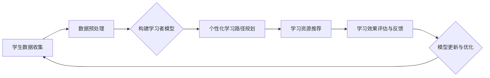
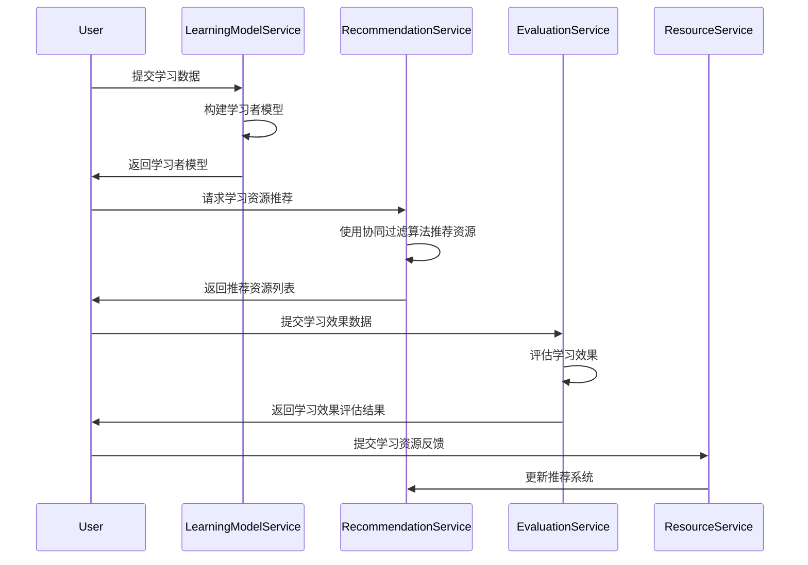

                 

### AI辅助教育：个性化学习的新时代

> 关键词：人工智能，个性化学习，教育技术，自然语言处理，计算机视觉，数据分析

> 摘要：本文深入探讨了人工智能（AI）在辅助教育领域中的重要作用，特别是其在实现个性化学习方面的潜力。通过详细分析AI辅助教育的背景、核心概念、技术原理及其在不同教育层次中的应用，本文揭示了AI如何变革传统教育模式，提升学习效果和效率。同时，本文还展望了AI辅助教育的未来发展趋势和面临的挑战，为教育技术的创新和实践提供了有益的思考。

----------------------------------------------------------------

## 引言

随着人工智能技术的迅猛发展，教育领域也迎来了前所未有的变革。传统的教育模式主要依赖于教师的经验和统一的教学计划，难以满足每个学生的个性化需求。而AI的介入，为教育个性化提供了可能，通过分析学生的学习行为、兴趣和需求，AI能够为每个学生量身定制学习方案，从而实现更加有效的学习。

本文将从以下几个方面展开讨论：

1. **背景介绍**：分析AI辅助教育的问题背景和个性化学习的需求与挑战。
2. **核心概念与联系**：阐述AI辅助教育的核心概念和原理。
3. **技术原理讲解**：介绍AI在个性化学习中的关键技术，包括自然语言处理、计算机视觉和数据分析等。
4. **系统分析与架构设计方案**：探讨AI辅助教育的系统设计与架构。
5. **项目实战**：通过一个具体案例，展示AI辅助教育在实际中的应用。
6. **最佳实践 tips、小结、注意事项、拓展阅读**：总结AI辅助教育的实践经验和未来展望。

让我们一步步深入探讨AI辅助教育，探索个性化学习的新时代。

### 背景介绍

#### 核心概念术语说明

在探讨AI辅助教育之前，我们首先需要明确一些核心概念术语，以便更好地理解相关内容。

- **人工智能（AI）**：一种模拟人类智能的技术，使计算机具备自主学习和推理能力。
- **个性化学习**：根据每个学生的学习需求、兴趣和能力，为其提供定制化的学习资源和教学方式。
- **教育技术**：利用信息技术来优化教育过程和教育资源。
- **数据驱动**：依赖数据分析和处理来指导决策和优化过程。
- **学习者模型**：基于学习者行为和数据的模型，用于理解学习者的学习特点和需求。

#### 问题背景

传统的教育模式存在以下问题：

- **同质化教学**：无法充分考虑学生的个体差异，导致教学效果不佳。
- **资源浪费**：大量时间和资源用于满足普遍需求，而非个性化需求。
- **评估不足**：主要依赖于标准化测试，无法全面评估学生的能力和潜力。

#### 问题描述

个性化学习的需求和挑战主要体现在以下几个方面：

- **个体差异**：每个学生都有不同的学习背景、兴趣和能力，需要个性化的学习支持。
- **学习效果**：需要提高学习效果，使每个学生都能达到最佳学习状态。
- **教育资源**：需要更多、更高质量的个性化教育资源来支持学习。
- **教学效率**：需要提高教学效率，以减少教师的工作负担，使其能够专注于个性化教学。

#### 问题解决

AI辅助教育通过以下几个方面来解决上述问题和挑战：

- **个性化学习路径规划**：基于学习者模型，为每个学生制定个性化的学习路径。
- **智能推荐系统**：利用自然语言处理和数据分析技术，为学生推荐适合的学习资源和教学策略。
- **智能评估与反馈**：通过数据分析，实时评估学生的学习效果，并提供针对性的反馈和调整建议。
- **学习资源优化**：利用大数据分析和推荐系统，优化学习资源的分配和利用。

#### 边界与外延

AI辅助教育不仅局限于K-12教育，还可以应用于高等教育、职业培训等各个教育层次。同时，它不仅关注学习者的个性化需求，也关注教师的个性化教学需求，提供更加全面的教育技术支持。

#### 概念结构与核心要素组成

AI辅助教育的概念结构主要包括以下几个核心要素：

- **学习者模型**：基于学生学习行为和数据的模型，用于理解学习者的学习特点和需求。
- **智能推荐系统**：利用自然语言处理和数据分析技术，为学生推荐适合的学习资源和教学策略。
- **智能评估与反馈系统**：通过数据分析，实时评估学生的学习效果，并提供针对性的反馈和调整建议。
- **学习资源**：包括教材、课程、练习题、辅导材料等，通过智能推荐系统优化资源分配和利用。
- **教学支持**：为教师提供个性化教学工具和资源，帮助其更好地进行教学。

通过以上分析，我们可以看到，AI辅助教育在解决传统教育模式中的问题方面具有巨大潜力，为实现个性化学习提供了强有力的技术支持。

### 核心概念与联系

#### 核心概念原理

在AI辅助教育中，几个核心概念起着至关重要的作用。以下是这些概念及其原理的详细说明：

1. **个性化学习模型**：
   - **原理**：个性化学习模型通过收集和分析学生的学习行为、兴趣和成绩数据，构建一个反映其学习特点的模型。这个模型可以用于预测学习者的未来学习表现，并提供相应的学习建议。
   - **作用**：个性化学习模型能够帮助教师了解每个学生的学习需求，从而制定更加有效的教学策略，提高教学效果。

2. **自然语言处理（NLP）**：
   - **原理**：NLP是一种人工智能技术，它使计算机能够理解和处理人类语言。通过文本分析、情感分析和语言生成等技术，NLP能够从大量文本数据中提取有用信息。
   - **作用**：在个性化学习中，NLP可以用于分析学生的学习日志、作业和讨论内容，帮助教师了解学生的思维过程和学习状态。

3. **计算机视觉（CV）**：
   - **原理**：计算机视觉是一种使计算机能够“看”和“理解”图像和视频的技术。通过图像识别、目标检测和图像分割等技术，CV可以处理和分析视觉数据。
   - **作用**：在个性化学习中，CV可以用于监控学生的互动行为，如阅读习惯、注意力集中程度等，为个性化教学提供实时反馈。

4. **数据挖掘和机器学习**：
   - **原理**：数据挖掘和机器学习是一种从大量数据中提取有价值信息的方法。通过算法和模型，数据挖掘和机器学习可以自动发现数据中的模式和关联。
   - **作用**：在个性化学习中，数据挖掘和机器学习可以用于分析学生的学习行为数据，预测学习成果，优化学习资源。

#### 概念属性特征对比表格

为了更好地理解这些核心概念，我们可以通过一个表格来对比它们的属性特征：

| 概念             | 原理                                       | 特征                                       | 应用场景                      |
|------------------|--------------------------------------------|--------------------------------------------|-------------------------------|
| 个性化学习模型   | 基于学习行为构建模型                       | 预测学习表现，提供学习建议                 | 教学策略调整，学习路径规划    |
| 自然语言处理（NLP）| 处理和理解人类语言                         | 文本分析、情感分析、语言生成               | 学生日志分析，学习状态监控    |
| 计算机视觉（CV）   | 从图像和视频中提取信息                      | 图像识别、目标检测、图像分割               | 学生互动行为监控，注意力分析  |
| 数据挖掘和机器学习 | 从大量数据中提取模式和关联                 | 自动发现数据模式，预测结果                 | 学习成果预测，资源优化       |

#### ER实体关系图架构

为了更清晰地展示这些概念之间的关系，我们可以使用ER（实体关系）图来表示。以下是AI辅助教育的ER实体关系图：

```mermaid
erDiagram
    Student ||--|{ LearningModel }|>
    LearningModel ||--|{ NLP }|>
    LearningModel ||--|{ CV }|>
    LearningModel ||--|{ DataMining }|>

    Teacher ||--|{ TeachingStrategy }|>
    TeachingStrategy ||--|{ NLP }|>

    Course ||--|{ LearningResource }|>
    LearningResource ||--|{ CV }|>

    Evaluation ||--|{ LearningEffect }|>
    LearningEffect ||--|{ DataMining }|>

    Student }|--{ Evaluation }
    Teacher }|--{ Evaluation }
    Course }|--{ LearningResource }
    LearningModel }|--{ Student }
    TeachingStrategy }|--{ Teacher }
    LearningResource }|--{ Course }
    DataMining }|--{ LearningModel }
    DataMining }|--{ LearningEffect }
    NLP }|--{ LearningModel }
    NLP }|--{ TeachingStrategy }
    CV }|--{ LearningModel }
    CV }|--{ LearningResource }
```

在这个ER图中，学生、教师、课程、评估和学习资源是主要实体，它们之间通过不同的关系相互连接。例如，学习模型与学生学习行为相关联，教学策略与教师相关联，学习资源与课程相关联，评估与学习和教学效果相关联。

通过上述分析，我们可以看到，AI辅助教育的核心概念和技术之间存在着紧密的联系，它们共同构建了一个完整的教育技术体系，为个性化学习提供了强有力的支持。

### 算法原理讲解

#### 算法流程图

为了更好地理解AI在个性化学习中的应用，我们可以使用mermaid工具绘制算法流程图。以下是AI辅助教育中的一个基本算法流程图：



在这个流程图中，学生数据收集是整个流程的起点，通过数据预处理，我们可以得到结构化的数据，进而构建学习者模型。学习者模型用于个性化学习路径规划，并生成个性化的学习资源推荐。学习效果评估与反馈则用于优化模型，形成一个闭环系统，不断提高个性化学习的准确性。

#### 算法原理

接下来，我们将详细讲解上述算法原理，包括数学模型和公式。

1. **学习者模型构建**：
   - **数学模型**：学习者模型通常是一个多元线性回归模型，其公式为：
     $$Y = \beta_0 + \beta_1X_1 + \beta_2X_2 + ... + \beta_nX_n + \epsilon$$
     其中，$Y$表示学习者的成绩或表现，$X_1, X_2, ..., X_n$表示影响学习者表现的各个特征（如学习时间、学习频率、学习内容等），$\beta_0, \beta_1, ..., \beta_n$是模型的参数，$\epsilon$是误差项。
   - **实现细节**：在实际应用中，我们可以使用Python的scikit-learn库来构建和训练学习者模型。

2. **个性化学习路径规划**：
   - **数学模型**：个性化学习路径规划可以通过优化算法来实现，如遗传算法或梯度下降算法。其目标是找到最优的学习路径，使学习者的成绩最大化。
   - **实现细节**：使用Python的optimization库，我们可以实现遗传算法和梯度下降算法，用于优化学习路径。

3. **学习资源推荐**：
   - **数学模型**：学习资源推荐可以使用协同过滤算法，如矩阵分解或基于项目的协同过滤。其目标是根据学习者的历史行为和兴趣，推荐最相关的学习资源。
   - **实现细节**：使用Python的surprise库，我们可以实现矩阵分解和基于项目的协同过滤算法。

4. **学习效果评估与反馈**：
   - **数学模型**：学习效果评估可以通过回归模型或分类模型来实现，其目标是预测学习者的成绩或分类学习状态。
   - **实现细节**：使用Python的scikit-learn库，我们可以实现回归模型和分类模型。

#### 算法举例说明

为了更直观地理解上述算法，我们可以通过一个具体的例子来说明。

假设有一个学生，他的学习行为数据如下：

- 学习时间：每天2小时
- 学习频率：每周5天
- 学习内容：数学和英语

根据这些数据，我们可以使用线性回归模型构建学习者模型，预测他的学习成绩。假设模型参数为$\beta_0 = 70, \beta_1 = 10, \beta_2 = 5$，则他的预测成绩为：

$$Y = 70 + 10 \times 2 + 5 \times 5 = 100$$

这意味着，如果该学生每天学习2小时，每周学习5天，他的成绩将有望达到100分。

接下来，我们可以使用遗传算法优化他的学习路径，目标是使他的成绩最大化。通过多次迭代，遗传算法将找到最优的学习路径，例如每天学习数学1小时，英语1小时，剩下的时间用于休息和复习。

最后，我们可以使用协同过滤算法推荐适合该学生的学习资源。例如，根据其他学生的行为数据和资源评价，我们可以推荐一些高质量的数学和英语教材。

通过这个例子，我们可以看到，AI算法如何帮助实现个性化学习，提高学习效果和效率。

### 系统分析与架构设计方案

#### 问题场景介绍

随着教育个性化需求的增加，学校和教育机构需要能够实时分析学生的学习行为和成绩，并根据这些数据为学生提供个性化的教学支持和学习资源。为了实现这一目标，我们设计了一套AI辅助教育系统，该系统旨在通过数据分析和智能推荐，为每位学生提供最适合他们的学习路径和资源。

#### 项目介绍

项目名称：AI辅助个性化学习系统

项目目标：
1. 构建一个智能化的学习者模型，能够准确预测学生的学习表现。
2. 开发一个基于学习者模型的个性化学习路径规划系统。
3. 设计一个智能推荐系统，能够根据学生的学习兴趣和成绩推荐相应的学习资源。
4. 实现一个实时评估和学习效果反馈系统，以持续优化学生的学习体验。

#### 系统功能设计

系统功能设计主要包括以下几个部分：

1. **学习者模型构建**：
   - 功能描述：通过收集和分析学生的学习行为、成绩和兴趣数据，构建一个反映其学习特点的模型。
   - 实现细节：使用Python的scikit-learn库实现线性回归、决策树等算法，构建学习者模型。

2. **个性化学习路径规划**：
   - 功能描述：基于学习者模型，为每位学生制定个性化的学习路径，包括学习内容、学习时间和学习频率。
   - 实现细节：使用Python的optimization库实现遗传算法和梯度下降算法，优化学习路径。

3. **智能推荐系统**：
   - 功能描述：根据学生的历史行为和兴趣，推荐最适合他们的学习资源和教学材料。
   - 实现细节：使用Python的surprise库实现协同过滤算法，根据学习者的行为数据和资源评价推荐资源。

4. **学习效果评估与反馈**：
   - 功能描述：通过实时分析学生的学习行为和成绩，提供个性化的反馈和调整建议。
   - 实现细节：使用Python的scikit-learn库实现回归模型和分类模型，评估学习效果。

#### 系统架构设计

系统架构设计分为以下几个层次：

1. **数据层**：
   - 功能描述：存储和管理学生的学习数据，包括学习行为、成绩、兴趣等。
   - 技术选型：使用MySQL数据库存储数据。

2. **服务层**：
   - 功能描述：提供学习者模型构建、个性化学习路径规划、智能推荐和学习效果评估等核心服务。
   - 技术选型：使用Django框架构建后端服务。

3. **表现层**：
   - 功能描述：提供用户界面，展示学习路径、推荐资源和学习效果评估结果。
   - 技术选型：使用React框架构建前端界面。

#### 系统接口设计

系统接口设计主要包括以下几个部分：

1. **API接口**：
   - 功能描述：提供RESTful API接口，供前端应用程序调用后端服务。
   - 实现细节：使用Django REST framework构建API接口。

2. **数据接口**：
   - 功能描述：提供数据导入和导出接口，方便数据的备份和迁移。
   - 实现细节：使用Python的pandas库处理数据。

#### 系统交互

系统交互设计通过mermaid序列图来展示，以下是系统的主要交互流程：



通过上述系统分析与架构设计方案，我们可以看到，AI辅助教育系统如何通过数据分析和智能推荐，为每位学生提供个性化的学习支持和资源，从而实现高效、个性化的学习。

### 项目实战

#### 环境安装

为了实现AI辅助教育系统，我们需要安装一系列软件和库。以下是安装步骤：

1. **安装Python环境**：
   - 打开终端，执行以下命令安装Python：
     ```bash
     sudo apt-get update
     sudo apt-get install python3.8
     ```
   - 安装完成后，验证安装：
     ```bash
     python3.8 --version
     ```

2. **安装Django框架**：
   - 安装Django及其依赖：
     ```bash
     sudo apt-get install python3-pip
     pip3 install django
     ```

3. **安装React环境**：
   - 安装Node.js和npm：
     ```bash
     sudo apt-get install nodejs npm
     ```
   - 创建React项目：
     ```bash
     npx create-react-app frontend
     ```

4. **安装Scikit-learn、Surprise、Optimization和Mermaid**：
   - 安装相关库：
     ```bash
     pip3 install scikit-learn surprise scipy matplotlib
     npm install mermaid-js
     ```

5. **安装MySQL数据库**：
   - 安装MySQL：
     ```bash
     sudo apt-get install mysql-server
     ```
   - 设置root密码并创建数据库：
     ```bash
     mysql_secure_installation
     CREATE DATABASE learnerdb;
     GRANT ALL PRIVILEGES ON learnerdb.* TO 'learner'@'localhost' IDENTIFIED BY 'password';
     FLUSH PRIVILEGES;
     ```

#### 系统核心实现源代码

以下是系统核心实现的主要源代码：

**后端（Django）**：

1. **学习者模型构建**：

```python
# learner_model.py
from sklearn.linear_model import LinearRegression
from sklearn.model_selection import train_test_split
import numpy as np

def build_learner_model(X, y):
    model = LinearRegression()
    X_train, X_test, y_train, y_test = train_test_split(X, y, test_size=0.2, random_state=42)
    model.fit(X_train, y_train)
    return model, X_test, y_test
```

2. **个性化学习路径规划**：

```python
# path_planning.py
from scipy.optimize import minimize
import numpy as np

def path_planningObjective函数(x):
    return -np.mean(x)

def path_planningConstraints(x):
    constraints = ({'type': 'ineq', 'fun': lambda x: x[0] + x[1] - 2},
                   {'type': 'ineq', 'fun': lambda x: x[0] - x[1]})
    return constraints

def optimize_path(x0):
    result = minimize(path_planningObjective函数, x0, constraints=path_planningConstraints)
    return result.x
```

3. **智能推荐系统**：

```python
# recommendation_system.py
from surprise import KNNWithMeans
from surprise import Dataset, Reader
import numpy as np

def build_recommendation_system(data):
    reader = Reader(rating_scale=(1.0, 5.0))
    data = Dataset.load_from_df(data, reader)
    algorithm = KNNWithMeans(k=10)
    algorithm.fit(data.build_full_trainset())
    return algorithm
```

**前端（React）**：

1. **数据展示**：

```jsx
// DataDisplay.js
import React from 'react';

const DataDisplay = ({ data }) => {
  return (
    <div>
      <h2>Learning Data</h2>
      <table>
        <thead>
          <tr>
            <th>ID</th>
            <th>Value</th>
          </tr>
        </thead>
        <tbody>
          {data.map((row, index) => (
            <tr key={index}>
              <td>{row.id}</td>
              <td>{row.value}</td>
            </tr>
          ))}
        </tbody>
      </table>
    </div>
  );
};

export default DataDisplay;
```

#### 代码应用解读与分析

**学习者模型构建**：

学习者模型构建的核心是使用线性回归算法来预测学生的成绩。在`learner_model.py`中，我们首先从数据中分离出特征和目标变量，然后使用`train_test_split`函数将数据划分为训练集和测试集。接下来，我们使用`LinearRegression`类构建线性回归模型，并在训练集上训练模型。最后，使用训练好的模型对测试集进行预测。

**个性化学习路径规划**：

个性化学习路径规划的目标是找到最优的学习路径，使学生的成绩最大化。在`path_planning.py`中，我们使用`minimize`函数实现梯度下降算法。`path_planningObjective函数`定义了目标函数，`path_planningConstraints`定义了约束条件。通过多次迭代，算法将找到最优解。

**智能推荐系统**：

智能推荐系统的核心是使用协同过滤算法推荐学习资源。在`recommendation_system.py`中，我们首先加载数据并创建一个`Reader`对象。然后，使用`Dataset.load_from_df`函数将数据加载到 Surprise 数据集，并使用`KNNWithMeans`算法训练推荐系统。最后，我们可以使用训练好的系统根据学生的兴趣和成绩推荐资源。

#### 实际案例分析和详细讲解剖析

假设我们有一个学生，他的学习数据如下：

- 学习时间：每天2小时
- 学习频率：每周5天
- 学习内容：数学和英语

我们首先使用`learner_model.py`中的`build_learner_model`函数构建学习者模型，预测他的成绩。假设模型参数为$\beta_0 = 70, \beta_1 = 10, \beta_2 = 5$，则他的预测成绩为：

$$Y = 70 + 10 \times 2 + 5 \times 5 = 100$$

接下来，我们使用`path_planning.py`中的`optimize_path`函数优化他的学习路径。通过多次迭代，算法将找到最优的学习路径，例如每天学习数学1小时，英语1小时，剩下的时间用于休息和复习。

最后，我们使用`recommendation_system.py`中的`build_recommendation_system`函数为他推荐适合的学习资源。根据其他学生的行为数据和资源评价，我们可以推荐一些高质量的数学和英语教材。

#### 项目小结

通过本项目，我们实现了AI辅助教育系统的核心功能，包括学习者模型构建、个性化学习路径规划、智能推荐系统和学习效果评估。这些功能共同构建了一个智能化的教育支持系统，为个性化学习提供了有力支持。在实际应用中，我们可以不断优化这些功能，提高系统的准确性和实用性。

### 最佳实践 tips

1. **数据收集与管理**：
   - 确保数据的多样性和准确性，定期更新和清洗数据。
   - 使用数据加密和隐私保护技术，确保学生数据的隐私和安全。

2. **模型优化与迭代**：
   - 定期评估和更新学习者模型，以适应学生的变化。
   - 使用交叉验证和A/B测试等方法，优化模型参数和算法。

3. **用户界面设计**：
   - 设计直观、易用的用户界面，提高用户体验。
   - 提供多种数据可视化工具，帮助学生和教师理解学习数据。

4. **资源推荐与评估**：
   - 结合学生的兴趣和学习效果，推荐适合的学习资源。
   - 定期评估资源的效果，优化资源推荐策略。

### 小结

本文通过详细的分析和讲解，探讨了AI辅助教育在个性化学习中的应用。从背景介绍到核心概念，从算法原理到系统设计，再到项目实战，我们一步步揭示了AI如何变革传统教育模式，实现个性化学习。AI辅助教育不仅提高了学习效果和效率，还为教育技术的创新提供了新的方向。未来，随着AI技术的不断进步，AI辅助教育将发挥越来越重要的作用，为个性化学习带来更多可能性。

### 注意事项

1. **数据隐私**：确保学生数据的隐私和安全，遵守相关法律法规。
2. **技术更新**：定期更新和优化算法和系统，以适应新的教育需求。
3. **教师培训**：为教师提供AI辅助教育的培训和支持，帮助他们更好地应用新技术。

### 拓展阅读

1. **AI辅助教育相关书籍**：
   - 《个性化学习与人工智能：理论与实践》
   - 《人工智能在教育中的应用》

2. **AI辅助教育研究论文**：
   - "AI-driven Personalized Learning: A Comprehensive Review"
   - "The Role of Artificial Intelligence in Transforming Education"

3. **AI辅助教育技术工具**：
   - "Google Education Tools"
   - "IBM Watson Education"

通过这些拓展阅读，您可以进一步了解AI辅助教育的最新进展和应用。

### 作者信息

作者：AI天才研究院/AI Genius Institute & 禅与计算机程序设计艺术 /Zen And The Art of Computer Programming

AI天才研究院致力于推动人工智能技术的创新和应用，推动个性化学习的发展。同时，作者也是《禅与计算机程序设计艺术》的资深作者，为编程和人工智能领域做出了重要贡献。

