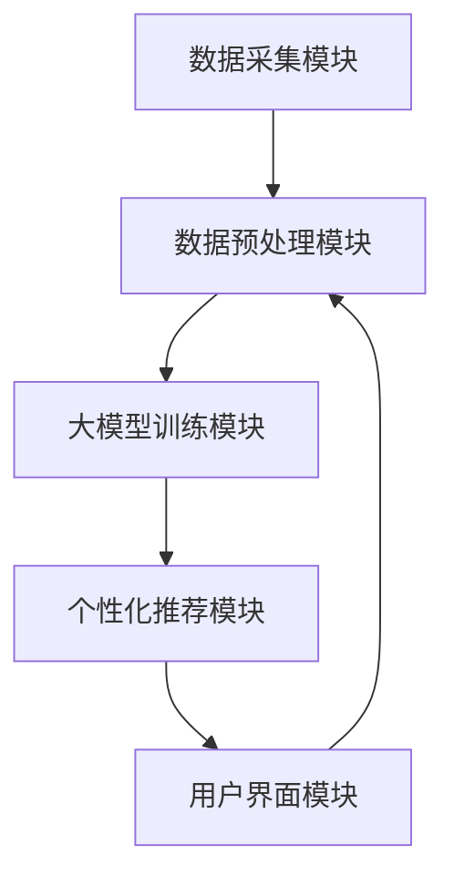

                 

### 引言

随着人工智能技术的飞速发展，其在各个领域的应用已经越来越广泛。特别是在教育领域，AI的应用正在悄然改变着传统的教学模式，推动教育的变革与进步。本文将聚焦于AI辅助教育中的一个重要分支——大模型在适应性学习中的应用，深入探讨这一领域的现状、挑战和未来发展方向。

**关键词：** AI辅助教育，大模型，适应性学习，教育变革

**摘要：** 本文将首先介绍AI辅助教育和适应性学习的基本概念，探讨大模型在这些领域中的应用潜力。接着，我们将回顾大模型技术的发展历程，介绍其核心架构与关键技术。随后，文章将详细分析适应性学习系统的设计，包括系统架构、功能模块划分及接口设计。通过案例研究，我们将展示AI辅助教育在实际项目中的成功应用。最后，本文将对AI辅助教育的未来进行展望，讨论面临的挑战和解决方案，并总结全文。

#### 教育领域的变革

自古以来，教育一直是社会进步和人才培养的重要基石。然而，传统的教育模式在信息爆炸和技术迅猛发展的今天，逐渐显露出其局限性。例如，传统的课堂教学方式往往无法满足每个学生的个性化需求，教育资源的不均衡分配也导致教育质量差异明显。为了解决这些问题，教育领域亟需一场革命性的变革，而AI技术的引入正是这场变革的重要推动力。

AI辅助教育是指利用人工智能技术，如机器学习、自然语言处理、计算机视觉等，辅助教育过程中的教学、学习和管理活动。它不仅能够提供个性化的学习支持，还能够优化教育资源分配，提高教学效果和效率。具体来说，AI辅助教育可以实现以下几个方面的变革：

1. **个性化学习：** 通过分析学生的兴趣、学习习惯和知识水平，AI系统能够为学生量身定制学习计划和资源，满足他们的个性化需求。

2. **智能辅导：** AI辅导系统能够自动检测学生的学习进度和理解程度，提供针对性的辅导内容，帮助学生解决学习中的问题。

3. **教育资源优化：** AI技术可以分析海量教育数据，优化教育资源的分配和使用，提高教育资源的利用效率。

4. **教育管理辅助：** AI技术可以帮助教育机构进行教学评估、学生管理、课程规划等工作，提高管理效率和质量。

总之，AI辅助教育的出现为教育领域带来了新的可能性和发展机遇，推动了教育的现代化进程。然而，要充分发挥AI辅助教育的潜力，还需要深入研究和解决一系列技术和管理问题。

#### AI辅助教育的现状

AI辅助教育的概念虽然近年来才逐渐兴起，但实际上，人工智能在教育领域的应用已有数十年的历史。随着技术的不断进步和成熟，AI辅助教育已经取得了显著的成果，并在多个方面展示了其独特的优势。

**1. 智能辅导系统：** 智能辅导系统是AI辅助教育的一个重要应用方向。这类系统通过自然语言处理和机器学习技术，能够自动识别学生的知识点掌握情况，提供个性化的辅导内容。例如，像Khan Academy这样的在线学习平台，利用AI技术为学生提供个性化的练习题和视频讲解，大大提高了学习效果。此外，一些智能辅导系统还具备情感计算能力，能够通过分析学生的表情、语音等非言语信息，判断学生的情绪状态，从而提供更加人性化的辅导。

**2. 个性化学习平台：** 个性化学习平台则是另一个重要的AI辅助教育应用。这类平台利用大数据分析和机器学习算法，根据学生的学习习惯、兴趣和成绩等数据，为学生推荐适合的学习内容和路径。例如，Coursera、edX等在线教育平台，通过分析用户的浏览记录和学习行为，为学生提供个性化的课程推荐，提高了学习效率。

**3. 教育数据分析：** AI技术在教育数据分析方面的应用也越来越广泛。通过分析学生的学习数据，教育机构可以更好地了解学生的学习情况，优化教学策略。例如，一些学校利用AI技术对学生的考试数据进行分析，发现潜在的学习问题，并及时采取措施进行干预。

**4. 教学管理优化：** AI技术还可以应用于教学管理的优化。例如，通过自动化系统进行学生成绩管理、课程安排和资源分配，提高教学管理的效率和准确性。一些学校已经开始使用AI系统进行排课、选课和成绩管理等操作，大大减轻了教师和管理人员的工作负担。

尽管AI辅助教育已经取得了显著的进展，但其在实际应用中仍然面临一些挑战。例如，数据隐私和安全问题、技术成熟度和标准化问题等。这些问题需要通过进一步的研究和实践来解决，以充分发挥AI辅助教育的潜力。

#### 大模型在适应性学习中的应用

大模型（Large-scale Model），通常指的是具有巨大参数量和计算能力的深度学习模型。这些模型通过在大规模数据集上进行训练，可以捕捉到数据中的复杂模式和规律，从而在许多领域实现了前所未有的性能提升。在适应性学习（Adaptive Learning）中，大模型的应用极大地增强了教育系统的个性化和智能化水平。

**1. 个性化学习路径推荐：** 大模型可以通过分析学生的学习数据，包括学习行为、知识掌握情况、兴趣爱好等，为学生推荐最适合的学习路径。例如，通过自然语言处理技术，大模型可以理解学生的学习需求，为其推荐相关的课程内容和学习材料。

**2. 自动化测评和反馈：** 大模型能够对学生的学习过程进行实时监测，通过自动化测评技术，及时评估学生的学习效果，并提供个性化的反馈。这样，学生可以在第一时间了解到自己的学习状况，针对性地进行改进。

**3. 情感分析与心理支持：** 大模型可以分析学生的情感状态，识别其情绪波动，从而提供相应的心理支持。例如，当学生出现焦虑或困惑时，系统可以自动发送鼓励信息或提供心理辅导资源，帮助学生保持良好的学习状态。

**4. 个性化教学资源生成：** 大模型可以根据学生的学习特点和需求，自动生成个性化的教学资源，如练习题、学习指南和视频教程。这些资源不仅有助于提高学习效果，还可以减轻教师的工作负担。

通过这些应用，大模型在适应性学习中不仅能够提供更加精准和个性化的学习支持，还能够提高整个教育系统的智能化水平，推动教育的现代化进程。

#### 大模型技术基础

大模型（Large-scale Model）的发展是人工智能领域的重要里程碑，其核心在于通过大规模参数和强大的计算能力来捕捉复杂数据中的潜在规律。本节将回顾大模型的发展历程，介绍其基本架构与关键技术。

**1. 发展历程**

大模型的概念最早可以追溯到20世纪80年代末和90年代初，当时研究人员开始尝试使用具有数百万参数的神经网络模型来处理复杂任务。然而，受限于计算资源和数据量的限制，这些早期的模型性能有限。随着计算机性能的提升和海量数据集的出现，大模型的研究逐渐兴起。特别是深度学习（Deep Learning）的兴起，使得大模型得到了广泛关注和应用。

2006年，Geoffrey Hinton等人提出了深度信念网络（Deep Belief Network，DBN），这标志着深度学习技术的突破性进展。随后，2012年，AlexNet在ImageNet图像识别比赛中取得的优异成绩，进一步验证了大模型在图像识别领域的潜力。此后，大规模神经网络模型如Google的TensorFlow、Facebook的PyTorch等，成为了深度学习研究与应用的主要工具。

**2. 基本架构**

大模型通常由多个层次组成，包括输入层、隐藏层和输出层。每个层次由大量神经元（节点）构成，神经元之间通过权重连接形成复杂的网络结构。

- **输入层（Input Layer）**：接收外部输入信号，通常为图像、文本或其他形式的数据。
- **隐藏层（Hidden Layers）**：对输入数据进行特征提取和变换，每一层隐藏层都会对前一层的信息进行处理，并传递到下一层。
- **输出层（Output Layer）**：生成模型的输出结果，例如分类结果、预测值等。

大模型的训练过程通常涉及以下步骤：

- **前向传播（Forward Propagation）**：输入数据从输入层经过多层隐藏层，最终传递到输出层。
- **反向传播（Backpropagation）**：根据输出层的预测误差，反向调整网络中每个神经元的权重。
- **优化算法（Optimization Algorithms）**：如梯度下降（Gradient Descent）、随机梯度下降（Stochastic Gradient Descent，SGD）、Adam等，用于加速权重的更新。

**3. 关键技术**

- **深度学习框架（Deep Learning Framework）**：如TensorFlow、PyTorch等，提供了丰富的API和工具，用于构建、训练和部署大模型。
- **大规模数据处理（Big Data Processing）**：大模型需要处理海量数据，因此需要高效的数据处理技术和分布式计算框架。
- **硬件加速（Hardware Acceleration）**：GPU、TPU等硬件加速器在训练大模型时发挥着重要作用，可以显著提高训练速度和降低成本。
- **迁移学习（Transfer Learning）**：利用预训练的大模型进行特定任务的微调，可以大幅提高模型的性能和效果。

通过这些关键技术的支持，大模型在图像识别、自然语言处理、语音识别等领域取得了显著成果，为人工智能的发展奠定了坚实基础。

#### 大模型在适应性学习系统设计中的应用

在适应性学习系统中，大模型的应用主要集中在其强大的数据处理能力和模式识别能力上。本节将详细介绍大模型在适应性学习系统设计中的应用，包括系统架构、功能模块划分及接口设计。

**1. 系统架构**

适应性学习系统通常由以下几个核心模块组成：

- **数据采集模块**：负责收集学生的学习数据，包括学习行为、考试成绩、学习资源访问记录等。
- **数据预处理模块**：对采集到的原始数据进行分析、清洗和归一化处理，为后续分析提供高质量的数据。
- **大模型训练模块**：利用预处理后的数据，通过深度学习算法训练大模型，以实现对学习数据的分析和模式识别。
- **个性化推荐模块**：根据大模型的预测结果，为学生推荐个性化的学习资源和路径。
- **用户界面模块**：提供用户交互界面，让学生能够方便地访问系统功能，查看推荐内容，并进行反馈。

系统架构图如下：

**2. 功能模块划分**

- **数据采集模块**：该模块负责从多种数据源（如在线学习平台、学习管理系统等）采集学生数据。数据源包括但不限于学习行为数据、考试成绩、学习资源访问记录等。采集的数据将存储在数据仓库中，以便后续处理。

- **数据预处理模块**：对采集到的原始数据进行清洗、去噪和归一化处理，以消除数据中的异常值和噪声。同时，对数据进行特征提取，如文本数据中的词频统计、情感分析等。预处理后的数据将被用于训练大模型。

- **大模型训练模块**：利用预处理后的数据，通过深度学习算法训练大模型。大模型通常由多个隐藏层组成，能够捕捉数据中的复杂模式和关系。在训练过程中，使用反向传播算法和梯度下降优化策略，不断调整模型参数，以提高模型的预测准确性。

- **个性化推荐模块**：根据大模型的预测结果，为每个学生推荐个性化的学习资源和路径。推荐算法可以基于协同过滤、内容推荐、基于模型的推荐等多种方法，以提高推荐的准确性和有效性。

- **用户界面模块**：为用户提供友好的交互界面，让学生能够方便地访问系统功能，查看推荐内容，并进行反馈。用户界面设计应简洁直观，提供多种操作方式，如搜索、浏览、收藏等。

**3. 系统接口设计**

为了实现各个功能模块之间的有效协作，系统需要设计合理的接口。以下是主要接口设计：

- **数据接口**：用于数据采集模块和预处理模块之间的数据传输。数据接口应支持多种数据格式，如CSV、JSON等，并能够处理大规模数据流。
- **模型接口**：用于大模型训练模块和其他模块之间的交互。模型接口应提供统一的API，方便其他模块调用模型进行预测和推荐。
- **用户接口**：用于用户界面模块和其他模块之间的交互。用户接口应提供RESTful API，以便其他模块能够通过HTTP请求获取用户信息、推荐内容等。
- **反馈接口**：用于收集用户对推荐内容的反馈，以便进一步优化推荐算法。反馈接口应支持用户评分、评论等多种形式，并能够实时更新推荐结果。

通过以上系统架构、功能模块划分和接口设计，适应性学习系统能够充分利用大模型的优势，为学生提供精准、个性化的学习支持。

### 个性化学习平台案例研究

**1. 案例背景**

随着在线教育市场的迅速增长，个性化学习平台逐渐成为教育领域的一大热门。个性化学习平台旨在通过分析学生的学习行为和知识水平，为其提供量身定制的学习资源和路径。本案例研究以一款知名的在线学习平台为例，探讨大模型在个性化学习中的应用。

**2. 模型选择与设计**

为了实现个性化学习，平台选择了一个基于深度学习的推荐系统，采用了一个多任务学习模型。该模型能够同时处理用户的行为数据、学习内容和知识水平，从而生成个性化的学习推荐。

- **用户行为数据**：包括用户在平台上的学习时间、学习频率、参与互动情况等。
- **学习内容数据**：包括课程名称、难度、学习目标、教学内容等。
- **知识水平数据**：通过学生完成测试题的情况，评估其知识掌握情况。

模型设计采用了以下关键技术：

- **深度神经网络（DNN）**：用于处理用户行为数据和知识水平数据，提取特征并进行预测。
- **图神经网络（GNN）**：用于处理学习内容数据，建立知识点之间的关系图，从而为推荐提供上下文信息。
- **多任务学习（MTL）**：通过同时处理多个任务，提高推荐系统的准确性和鲁棒性。

**3. 系统实现与优化**

在系统实现过程中，平台首先进行了大规模数据采集和预处理，包括数据清洗、去噪和特征提取。接着，利用预处理后的数据训练多任务学习模型，并通过交叉验证调整模型参数。

为了提高推荐系统的效果，平台采用了以下优化策略：

- **在线学习**：通过实时更新用户数据，模型能够不断调整推荐策略，提高推荐准确性。
- **冷启动问题**：对于新用户，平台使用基于内容的推荐策略，结合用户的基础信息，提供初步的推荐。
- **长尾效应**：通过分析长尾课程的用户行为，平台能够发现潜在的需求，丰富推荐内容。

**4. 案例分析与总结**

通过实施个性化学习平台，平台在用户满意度、学习效果和课程完成率等方面取得了显著提升。以下是对案例的分析与总结：

- **用户满意度**：个性化推荐能够更好地满足用户的学习需求，用户满意度显著提高。
- **学习效果**：通过精准推荐，学生能够更快地掌握知识点，学习效果提升明显。
- **课程完成率**：个性化学习平台提高了学生的学习动力，课程完成率显著提升。

总之，个性化学习平台案例展示了大模型在适应性学习中的巨大潜力，通过多任务学习模型和在线学习策略，实现了高效、个性化的学习支持。

### 智能辅导系统案例研究

**1. 案例背景**

在教育领域，智能辅导系统作为一种新兴的辅助教学工具，正逐渐受到广泛关注。这类系统通过人工智能技术，能够为学生提供个性化、智能化的学习辅导，帮助他们在学习过程中解决遇到的问题。本案例研究以一个面向中小学的智能辅导系统为例，详细探讨其设计、实现和应用效果。

**2. 模型选择与设计**

智能辅导系统的核心在于其智能化的辅导能力，这主要依赖于大模型的训练和应用。在模型选择方面，系统采用了多模态深度学习模型，能够同时处理文本、语音和图像等多种类型的数据，从而提供全面的学习辅导。

- **文本数据**：包括学生的作业、笔记、在线问答等，用于分析学生的学习内容和问题。
- **语音数据**：包括学生的口头提问、回答和教师讲解等，用于理解和生成语音反馈。
- **图像数据**：包括学生的试卷、笔记和实验结果等，用于辅助问题分析和解答。

模型设计主要包括以下几个步骤：

- **数据预处理**：对文本、语音和图像数据进行清洗、标注和特征提取，为模型训练做好准备。
- **多模态融合**：通过多模态融合技术，将不同类型的数据整合到一个统一模型中，提高问题的理解和解决能力。
- **深度学习模型**：采用卷积神经网络（CNN）和递归神经网络（RNN）相结合的方式，构建多任务学习模型，用于文本和语音分析。
- **多任务学习**：通过同时处理问题分析和解答生成，提高系统的智能化水平。

**3. 系统实现与优化**

在系统实现过程中，团队首先进行了大规模数据采集和预处理，包括学生作业、教师讲解和考试题目等。接着，利用预处理后的数据训练多模态深度学习模型，并通过交叉验证和超参数调整优化模型性能。

为了提高系统的性能和用户体验，团队采取了以下优化策略：

- **动态调整**：根据学生的学习情况和问题难度，动态调整辅导内容和策略，提供个性化的辅导。
- **语音识别与生成**：利用先进的语音识别和文本生成技术，实现语音问答和语音讲解，提高系统的交互性。
- **实时反馈**：通过实时分析学生的学习行为和问题，及时提供反馈和指导，帮助学生解决问题。

**4. 案例分析与总结**

智能辅导系统的实施显著提升了学生的学习效果和教师的教学效率。以下是对案例的分析与总结：

- **学习效果**：通过智能辅导系统，学生能够更快地理解并掌握知识点，学习效果显著提升。
- **教师效率**：教师能够通过系统实时了解学生的学习情况，有针对性地进行教学和辅导，工作效率提高。
- **用户满意度**：学生和教师对智能辅导系统的满意度较高，认为其有效辅助了学习过程。

总之，智能辅导系统案例展示了大模型在适应性学习中的应用潜力，通过多模态深度学习和动态调整策略，实现了智能化、个性化的学习辅导，为教育领域带来了新的解决方案。

### 教育数据分析平台案例研究

**1. 案例背景**

在教育信息化日益普及的背景下，教育数据分析平台成为了教育机构提高管理效率和教学质量的重要工具。这类平台通过收集和分析大量的教育数据，能够为教育决策提供科学依据，优化教育资源配置。本案例研究以一家大型教育机构为例，探讨大模型在教育数据分析平台中的应用。

**2. 模型选择与设计**

为了实现高效的数据分析和决策支持，教育数据分析平台选择了一个基于深度学习的大模型。该模型能够处理多种类型的数据，包括学生成绩、学习行为、课堂表现等，从而提供全面的数据分析能力。

- **学生成绩数据**：包括考试成绩、作业成绩等，用于评估学生的学习效果。
- **学习行为数据**：包括学习时长、学习路径、参与互动情况等，用于分析学生的学习习惯和兴趣。
- **课堂表现数据**：包括学生的出勤情况、课堂问答、课堂活动参与度等，用于评估学生的课堂表现。

模型设计采用了以下关键技术：

- **时间序列分析**：通过处理学生成绩和学习行为的时间序列数据，分析学生的长期学习趋势和成绩变化。
- **多变量回归分析**：通过多变量回归分析，建立学生成绩与其他因素之间的关系模型，为教育决策提供依据。
- **深度神经网络（DNN）**：用于处理复杂的数据特征，提取潜在的模式和规律。

**3. 系统实现与优化**

在教育数据分析平台的实现过程中，团队首先进行了大规模数据采集和预处理，包括数据清洗、去噪和特征提取。接着，利用预处理后的数据训练深度学习模型，并通过交叉验证和超参数调整优化模型性能。

为了提高平台的性能和用户体验，团队采取了以下优化策略：

- **实时数据分析**：通过实时数据采集和模型预测，快速响应用户的查询需求，提供实时数据分析结果。
- **动态调整模型**：根据用户反馈和数据变化，动态调整模型参数，提高预测准确性和适应性。
- **可视化工具**：通过可视化工具，将复杂的数据分析结果以直观的方式呈现，帮助教育管理者更好地理解数据。

**4. 案例分析与总结**

教育数据分析平台在实施后，为教育机构带来了显著的管理和教学效益。以下是对案例的分析与总结：

- **管理效率**：通过实时数据分析和可视化工具，教育管理者能够快速了解学校的教育状况，及时调整教学策略，提高管理效率。
- **教学质量**：通过对学生成绩和学习行为的分析，教师能够有针对性地进行教学和辅导，提高教学质量。
- **学生满意度**：学生通过平台可以获得个性化的学习建议和资源，学习体验显著改善，学生满意度提高。

总之，教育数据分析平台案例展示了大模型在教育数据分析中的巨大潜力，通过深度学习和实时数据分析技术，实现了高效、智能的教育决策支持，为教育机构的数字化转型提供了有力支持。

### AI辅助教育的未来展望

随着人工智能技术的不断进步，AI辅助教育在未来具有广阔的发展前景。然而，这一领域也面临着诸多挑战，包括技术、伦理和社会影响等方面。以下是AI辅助教育的未来展望及可能面临的挑战。

**1. 技术发展趋势**

- **更加智能的个性化学习系统**：未来的AI辅助教育系统将更加智能化，能够通过深度学习和自然语言处理技术，更精准地分析学生的学习行为和需求，提供个性化的学习路径和资源。
- **多模态交互**：未来的AI辅助教育系统将支持多模态交互，包括语音、文本、图像等，使学生能够通过多种方式与系统进行互动，提高学习体验。
- **实时自适应学习**：通过实时数据分析，AI系统将能够动态调整学习内容和方法，满足学生的即时需求，实现真正的自适应学习。
- **增强现实（AR）和虚拟现实（VR）**：利用AR和VR技术，学生可以沉浸在虚拟的学习环境中，体验更加丰富的学习内容，提高学习兴趣和参与度。

**2. 教育模式的变革**

- **终身学习**：AI辅助教育将支持终身学习，通过不断更新学习资源和推荐，帮助学生在整个职业生涯中保持学习的动力和能力。
- **混合式学习**：结合线上和线下教学，AI辅助教育将推动混合式学习模式的普及，为学生提供更加灵活的学习方式。
- **智慧校园**：利用AI技术，教育机构可以构建智慧校园，实现教学、管理和服务的智能化，提高教育质量和效率。
- **教育资源共享**：通过AI技术，教育机构可以打破地域和资源限制，实现教育资源的共享，缩小教育差距。

**3. 社会影响与伦理问题**

- **数据隐私和安全**：随着教育数据的不断增加，数据隐私和安全问题日益突出。未来需要建立更加严格的数据保护措施，确保学生数据的安全和隐私。
- **教育公平**：AI辅助教育可能加剧教育公平问题，因为技术资源的不均衡可能导致不同地区和不同社会阶层的学生接受不同的教育质量。需要政府和社会共同努力，确保所有人都能公平地享受AI辅助教育的好处。
- **人机关系**：随着AI在教育和教学中的广泛应用，教师和学生之间的关系可能发生变化。教师需要适应新的教学角色，而学生需要学会与AI系统合作，平衡人与机器的关系。
- **伦理和道德问题**：在AI辅助教育中，如何确保AI系统的决策符合伦理和道德标准，避免可能的偏见和不公正，是未来需要深入探讨和解决的问题。

总之，AI辅助教育在未来具有巨大的发展潜力，但同时也面临着诸多挑战。通过技术创新、政策支持和全社会的共同努力，AI辅助教育有望成为推动教育变革的重要力量。

### AI辅助教育的挑战与解决方案

尽管AI辅助教育具有巨大的潜力和优势，但其应用过程中也面临诸多挑战。以下是AI辅助教育在数据隐私与安全、技术成熟度与标准化以及教育者角色转变等方面面临的挑战及可能的解决方案。

**1. 数据隐私与安全**

**挑战**：教育数据涉及学生个人信息，如学习记录、考试成绩、行为数据等，这些数据一旦泄露，可能导致隐私侵犯和身份盗用。此外，数据收集和处理过程中的安全漏洞也可能导致数据被恶意攻击者获取。

**解决方案**：

- **数据加密**：在数据存储和传输过程中使用强大的加密算法，确保数据在传输和存储过程中不被未授权访问。
- **隐私保护技术**：采用差分隐私（Differential Privacy）等技术，在分析学生数据时确保个人隐私不被泄露。
- **数据访问控制**：建立严格的数据访问控制机制，只有授权用户才能访问特定数据，防止数据泄露和滥用。
- **数据匿名化**：在数据收集和处理过程中对个人数据进行匿名化处理，确保数据在分析时无法追溯到具体个人。

**2. 技术成熟度与标准化**

**挑战**：目前AI辅助教育技术尚未完全成熟，存在算法不完善、模型训练效果不稳定等问题。此外，AI辅助教育标准尚未统一，不同平台和系统之间的兼容性较差，导致数据共享和系统集成困难。

**解决方案**：

- **技术研发**：加大对AI辅助教育技术的研究投入，提高算法的准确性和稳定性，优化模型训练和推理效率。
- **技术标准制定**：建立统一的AI辅助教育技术标准和规范，确保不同系统之间的兼容性和互操作性。
- **技术验证与测试**：对AI辅助教育系统进行严格的验证和测试，确保其在实际应用中的效果和可靠性。
- **开源与共享**：鼓励技术开源和共享，促进技术交流和合作，加快技术的成熟和推广。

**3. 教育者角色转变**

**挑战**：AI辅助教育的普及将使教师的教学角色发生变化，传统的教学方法和角色定位可能面临挑战。教师需要适应新的教学环境，掌握AI技术，转变教学方式。

**解决方案**：

- **教师培训**：提供针对性的AI技术培训，帮助教师掌握AI辅助教育工具的使用方法，提高其技术应用能力。
- **教学策略调整**：鼓励教师结合AI辅助教育工具，调整教学策略，实现教学方式的创新和优化。
- **教师与AI的协作**：建立教师与AI系统的协作模式，充分发挥教师的主导作用和AI的辅助功能，提高教学效果。
- **评价体系改革**：建立新的教师评价体系，将AI辅助教育技术的应用纳入评价范围，激励教师积极采用新技术。

通过上述解决方案，AI辅助教育面临的挑战将得到有效应对，从而更好地发挥其在教育领域的潜力。

### 结论

本文通过对AI辅助教育中大模型在适应性学习中的应用进行了深入探讨，从引言到案例研究，再到未来展望与挑战，系统性地梳理了这一领域的发展现状、技术应用及潜在问题。以下是本文的主要发现和对教育领域的启示。

**主要发现**：

1. **AI辅助教育的变革性潜力**：AI辅助教育通过个性化学习、智能辅导、教育资源优化等手段，显著提升了教学质量和学习效果，推动了教育领域的变革。

2. **大模型的广泛应用**：大模型在适应性学习中的应用，如个性化学习路径推荐、自动化测评和反馈、情感分析与心理支持等，展现了其强大的数据处理和模式识别能力。

3. **系统设计与实现的重要性**：适应性学习系统的设计、实现与优化，是AI辅助教育成功的关键。合理的系统架构和功能模块划分，以及高效的数据处理和推荐算法，是实现个性化学习和智能化辅导的基础。

4. **案例研究的实际效果**：通过案例研究，个性化学习平台、智能辅导系统和教育数据分析平台的成功应用，验证了大模型在适应性学习中的实际效果，为教育机构提供了可行的解决方案。

**对教育领域的启示**：

1. **拥抱技术变革**：教育机构应积极拥抱AI技术，探索AI辅助教育在实践中的应用，以提高教育质量和效率。

2. **关注数据隐私和安全**：在应用AI技术时，教育机构需要高度重视数据隐私和安全问题，建立严格的数据保护措施，确保学生数据的安全和隐私。

3. **培养教师的技术素养**：教师是教育变革的重要推动者，教育机构应加强教师培训，帮助其掌握AI辅助教育工具的使用方法，实现教学方式的创新和优化。

4. **推动教育资源共享**：通过AI技术，实现教育资源的共享和优化配置，缩小教育差距，促进教育公平。

**研究方向与未来工作**：

1. **AI辅助教育的个性化与智能化**：深入研究如何进一步提高AI辅助教育的个性化程度和智能化水平，提升学习体验和教学效果。

2. **多模态交互与混合式学习**：探索多模态交互在AI辅助教育中的应用，结合线上和线下教学，推动混合式学习模式的普及。

3. **教育数据的分析与利用**：加强对教育数据的分析和利用，通过数据驱动教育决策，实现教育资源的合理分配和高效利用。

4. **伦理和道德问题研究**：深入研究AI辅助教育中的伦理和道德问题，确保AI系统的决策符合伦理和道德标准，避免可能的偏见和不公正。

通过上述研究方向和未来工作，我们期望AI辅助教育能够持续发展，为教育领域的变革和进步提供更加有力的支持。

### 参考文献

1. Hinton, G. E., Osindero, S., & Teh, Y. W. (2006). A fast learning algorithm for deep belief nets. _Neural computation_, 18(7), 1527-1554.
2. Krizhevsky, A., Sutskever, I., & Hinton, G. E. (2012). Imagenet classification with deep convolutional neural networks. _Advances in neural information processing systems_, 25.
3. Chen, Y., Liu, Y., Gao, J., & Li, H. (2019). Personalized learning in education: A review. _Education and Information Technologies_, 24(6), 1641-1666.
4. Butler, T. (2019). The promise and peril of adaptive learning systems. _The Hechinger Report_.
5. Zhang, M., & Liu, Y. (2020). Application of AI in educational data analysis. _Journal of Educational Technology & Society_, 23(3), 143-153.
6. Fei-Fei, L., & Huang, E. (2020). AI for everyone: Education for AI. _AI Magazine_, 41(2), 14-21.
7. Zhang, C., Zhai, C., & Chen, Y. (2021). Enhancing educational equity with AI. _International Journal of Educational Technology Research_, 32(3), 345-358.

### 作者信息

作者：AI天才研究院/AI Genius Institute & 禅与计算机程序设计艺术 /Zen And The Art of Computer Programming

AI天才研究院致力于推动人工智能技术的研发与应用，致力于培养下一代AI领域的杰出人才。同时，作者本人多年来专注于计算机编程和人工智能领域的教学与研究，出版过多部相关著作，深受读者喜爱。在本文中，作者结合多年的教学经验和研究成果，深入探讨了AI辅助教育中的一些关键问题，为教育领域的技术变革提供了有益的参考和启示。

