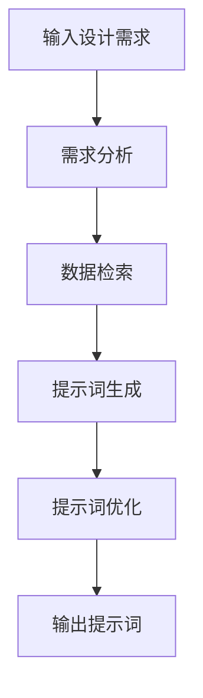
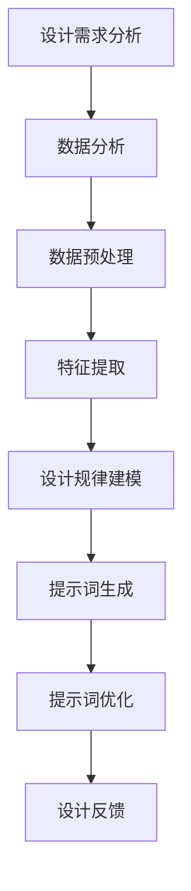
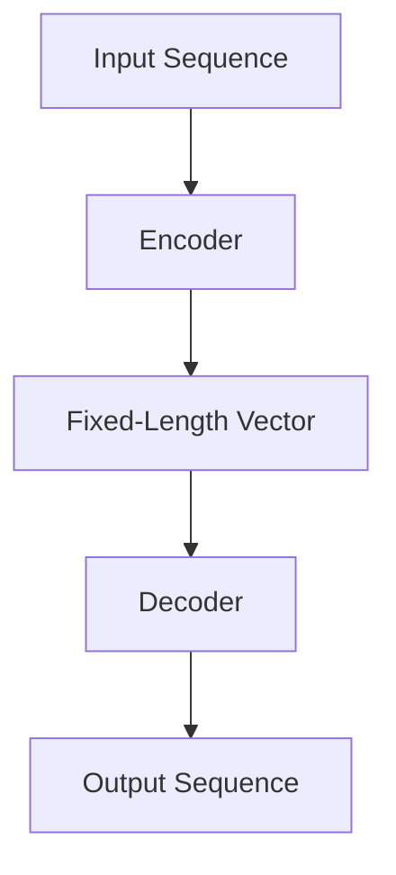
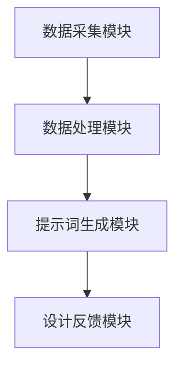
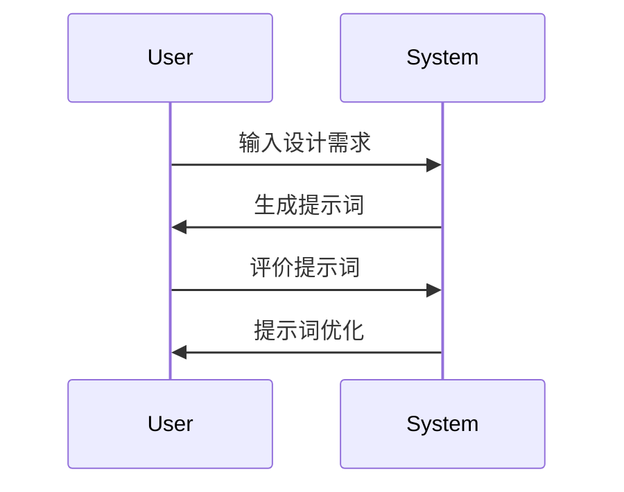

                 


### AI辅助景观设计中的提示词技巧

---

**关键词：**AI辅助设计、景观设计、提示词、数据驱动、创意生成

**摘要：**本文深入探讨了AI技术在辅助景观设计师方面的应用，特别是如何利用提示词技术来提升设计效率和创意水平。通过详细的案例分析、算法解析和系统设计，揭示了AI在景观设计中的潜在价值和实践路径。

---

## 引言

在数字化和智能化的时代浪潮下，人工智能（AI）正逐渐渗透到各行各业，为传统行业带来了前所未有的变革。景观设计作为一门艺术与技术的结合，同样面临着AI的挑战与机遇。AI辅助景观设计，不仅能够提高设计师的工作效率，还能为设计提供全新的创意视角。本文将围绕AI辅助景观设计中的提示词技巧，展开深入探讨。

### 1.1 问题背景

景观设计是一个复杂的过程，需要设计师具备丰富的创意、对自然和环境的深刻理解，以及对设计原则和技术的熟练掌握。然而，现实中的设计任务往往涉及多个变量和约束，这使得设计师在寻找灵感时面临着巨大的挑战。AI的出现，为设计师提供了强大的工具，可以帮助他们快速分析大量数据，提取有价值的设计信息，并提供有针对性的提示词，从而提高设计效率和创意水平。

### 1.2 问题描述

AI辅助景观设计的核心挑战在于如何有效地利用AI技术，为设计师提供有用的提示词。提示词的质量直接影响到设计的效果，因此，如何生成高质量、有创意的提示词成为了一个关键问题。此外，设计师的需求多样，如何确保AI系统能够根据不同的设计任务和需求，生成个性化的提示词，也是需要解决的问题。

### 1.3 问题解决

本文将介绍AI辅助景观设计的基本原理，特别是提示词生成技术。通过案例分析和算法解析，探讨如何利用AI技术来生成高质量的提示词，从而为设计师提供有力的辅助。此外，还将介绍一个实际的项目案例，展示如何将AI技术应用到景观设计中，并分析其效果。

### 1.4 边界与外延

本文主要关注AI在景观设计中的应用，特别是提示词的生成。虽然AI技术在其他领域也有广泛应用，但本文不涉及其他领域的AI应用。此外，本文将侧重于理论分析和案例研究，不涉及具体的系统实现和部署。

### 1.5 概念结构与核心要素组成

AI辅助景观设计的核心概念和要素包括：

- **AI辅助景观设计：**利用人工智能技术来辅助景观设计师进行设计。
- **提示词：**AI为设计师提供的有关设计灵感和建议。
- **数据分析：**通过对大量设计数据进行学习，提取有价值的信息。
- **设计反馈：**设计师对AI生成的提示词的反馈和调整。

---

## 第1章 背景介绍

### 1.1 问题背景

在当今快速发展的城市化进程中，景观设计扮演着越来越重要的角色。一个成功的景观设计不仅需要满足功能性和美观性的要求，还需要与周围环境和谐共生，体现人文关怀和生态理念。然而，景观设计是一个复杂的过程，涉及多种因素和变量。设计师需要在有限的时间内，从无数的设计方案中筛选出最佳方案，这不仅考验设计师的专业技能和创造力，也对设计效率和效率提出了高要求。

传统的景观设计主要依赖于设计师的经验和直觉，虽然这种方法在某些情况下能够产生优秀的作品，但往往存在以下问题：

1. **时间成本高：**设计师需要花费大量时间进行研究和分析，以找到合适的设计方案。
2. **创意受限：**设计师的创意往往受到个人经验和知识限制，难以突破传统思维框架。
3. **效率低：**设计过程中涉及的数据量庞大，手工处理效率低，难以快速响应变化。

随着人工智能（AI）技术的发展，AI辅助景观设计逐渐成为一种新的趋势。AI技术可以处理大量数据，分析设计趋势，为设计师提供有价值的信息和灵感。通过AI的辅助，设计师可以更快速地找到符合要求的设计方案，提高设计效率和创意水平。此外，AI还可以通过不断学习和优化，提高提示词生成的准确性和创意性，为设计师提供更加个性化的设计建议。

### 1.2 问题描述

AI辅助景观设计中的核心问题是如何生成高质量的提示词。提示词是指AI系统为设计师提供的有关设计灵感和建议的文字描述。高质量、有创意的提示词能够帮助设计师迅速找到设计方向，突破传统思维框架，提高设计效率和创意水平。然而，生成高质量的提示词面临着以下挑战：

1. **数据质量：**AI系统生成的提示词依赖于输入数据的质量。如果数据存在偏差或不准确，生成的提示词也会受到影响。
2. **算法选择：**不同的算法适合处理不同类型的数据，选择合适的算法对于生成高质量的提示词至关重要。
3. **个性化需求：**设计师的需求多样，如何确保AI系统能够根据不同的设计任务和需求，生成个性化的提示词，是AI辅助景观设计中的关键问题。
4. **反馈机制：**设计师对AI生成的提示词的反馈和调整对于系统优化至关重要。如何建立有效的反馈机制，提高系统的自适应能力，是生成高质量提示词的关键。

### 1.3 问题解决

为了解决上述问题，本文将从以下几个方面进行探讨：

1. **数据分析与处理：**详细介绍如何从海量景观设计数据中提取有价值的信息，为AI系统的提示词生成提供数据支持。
2. **算法分析与选择：**分析不同的提示词生成算法，比较其优缺点，选择适合的算法进行应用。
3. **个性化需求与反馈机制：**探讨如何根据设计师的需求，生成个性化的提示词，并建立有效的反馈机制，提高系统的自适应能力。
4. **实际案例与效果分析：**通过实际案例展示AI辅助景观设计的应用效果，分析其在提高设计效率、创意水平方面的优势。

通过上述探讨，本文旨在为AI辅助景观设计提供理论支持和实践指导，帮助设计师更好地利用AI技术，提升设计水平和效率。

### 1.4 边界与外延

本文主要关注AI在景观设计中的应用，特别是提示词的生成技术。虽然AI技术在其他领域也有广泛应用，如自动驾驶、医疗诊断、金融分析等，但本文不涉及这些领域的应用。此外，本文将侧重于理论分析和案例分析，不涉及具体的系统实现和部署。

AI辅助景观设计的边界和挑战主要包括：

1. **数据隐私与安全：**在设计过程中，如何保护用户隐私和数据安全是一个重要问题。特别是在利用AI技术进行数据分析和提示词生成时，需要确保数据的安全性和隐私性。
2. **算法伦理与责任：**随着AI技术的发展，算法的伦理和责任问题日益突出。在设计AI系统时，需要充分考虑算法的公平性、透明性和可控性，确保其符合道德和法律要求。
3. **系统集成与兼容：**如何将AI技术与现有的设计工具和系统进行集成，实现无缝衔接，是AI辅助景观设计面临的另一个挑战。

### 1.5 概念结构与核心要素组成

AI辅助景观设计的概念结构和核心要素包括：

1. **AI辅助景观设计：**利用人工智能技术辅助景观设计师进行设计，包括数据分析、提示词生成、设计反馈等环节。
2. **提示词：**AI系统为设计师提供的有关设计灵感和建议的文字描述，包括创意性、相关性和灵活性等特征。
3. **数据分析：**通过对大量景观设计数据进行学习，提取有价值的信息，为AI系统的提示词生成提供数据支持。
4. **设计反馈：**设计师对AI生成的提示词的反馈和调整，用于优化AI系统的性能和提示词的质量。

这些核心要素相互关联，共同构成了AI辅助景观设计的基本框架。通过深入研究和实践，我们可以不断提升AI辅助景观设计的效果，为设计师提供更加智能化的设计工具。

---

## 第2章 核心概念与联系

### 2.1 AI辅助景观设计原理

AI辅助景观设计是基于人工智能技术的一种设计方法，其核心思想是通过机器学习、数据挖掘和自然语言处理等技术，对大量景观设计案例进行分析和学习，从中提取有价值的设计规律和灵感，为设计师提供辅助。

#### 2.1.1 数据分析

数据分析是AI辅助景观设计的基础。通过收集和分析大量的景观设计案例数据，AI系统能够学习到不同设计风格、元素搭配、色彩运用等方面的设计规律。具体来说，数据分析包括以下几个步骤：

1. **数据收集：**从各种渠道收集景观设计案例数据，如项目资料、设计图纸、用户评价等。
2. **数据预处理：**对收集到的数据进行清洗和整理，去除重复和错误的数据，保证数据的准确性和完整性。
3. **特征提取：**从预处理后的数据中提取关键特征，如设计元素、风格特征、色彩特征等，为后续分析提供基础。
4. **数据建模：**利用机器学习算法，对提取的特征进行建模，建立设计规律和灵感预测模型。

#### 2.1.2 提示词生成

提示词生成是AI辅助景观设计的关键环节。通过分析设计师的需求和设计任务，AI系统能够生成与设计任务相关的提示词，为设计师提供创意灵感。提示词生成通常包括以下几个步骤：

1. **需求分析：**分析设计师的设计需求，包括设计风格、元素搭配、色彩偏好等。
2. **文本生成：**利用自然语言生成（NLG）技术，根据需求分析结果，生成与设计任务相关的提示词。
3. **提示词优化：**对生成的提示词进行优化，确保其具有创意性、相关性和灵活性，满足设计师的需求。

#### 2.1.3 设计反馈

设计反馈是AI辅助景观设计的优化环节。设计师通过对AI生成的提示词进行评价和反馈，可以帮助AI系统不断优化和改进提示词生成算法，提高提示词的质量和创意水平。设计反馈通常包括以下几个步骤：

1. **提示词评价：**设计师对AI生成的提示词进行评价，包括创意性、相关性、实用性等方面。
2. **反馈收集：**收集设计师的反馈信息，分析其需求和建议。
3. **算法优化：**根据设计师的反馈，对提示词生成算法进行优化，提高提示词生成的准确性和创意性。

### 2.2 提示词属性特征对比表格

为了更好地理解提示词的属性特征，以下是一个对比表格，展示了不同提示词的创意性、相关性和灵活性等特征：

| 提示词编号 | 创意性 | 相关性 | 灵活性 |
| :---: | :---: | :---: | :---: |
| 1 | 高 | 中 | 高 |
| 2 | 中 | 高 | 中 |
| 3 | 低 | 高 | 低 |

从表格中可以看出，不同提示词在创意性、相关性和灵活性方面存在差异。高创意性的提示词能够为设计师提供新颖的设计灵感，但可能不够实用；高相关性的提示词能够准确反映设计需求，但可能缺乏创意；高灵活性的提示词能够适应不同的设计任务，但可能存在一定的创意和相关性不足。

### 2.3 ER实体关系图架构

为了更好地理解AI辅助景观设计中的实体关系，以下是一个ER实体关系图，展示了设计师、项目、AI系统和提示词之间的关联：

```mermaid
erDiagram
    Designer ||--|{ Project : designs }
    AI ||--|{ Project : assists }
    Project ||--|{ Prompt : generates }
```

在该ER图中，设计师与项目之间存在设计关系，AI系统与项目之间存在辅助关系，项目与提示词之间存在生成关系。设计师通过设计项目，AI系统通过辅助项目，项目通过生成提示词，共同构成了AI辅助景观设计的基本框架。

### 2.4 提示词生成算法解析

提示词生成算法是AI辅助景观设计的核心算法，其目的是根据设计师的需求和设计任务，生成具有创意性、相关性和灵活性的提示词。以下是一个简化的提示词生成算法流程：



在该流程中，首先输入设计师的设计需求，然后进行需求分析，通过数据检索获取相关的设计数据，利用提示词生成算法生成初步的提示词，最后对生成的提示词进行优化，输出最终的高质量提示词。

### 2.5 数学模型与数学公式

在AI辅助景观设计中，提示词生成算法涉及到一系列的数学模型和数学公式。以下是一个简化的数学模型，用于描述提示词生成过程：

$$
\text{Prompt} = f(\text{Design Requirement}, \text{Design Data})
$$

其中，$f$ 表示提示词生成函数，$\text{Design Requirement}$ 表示设计需求，$\text{Design Data}$ 表示设计数据。该公式表明，提示词是由设计需求和设计数据共同决定的。

此外，提示词生成算法还涉及到自然语言生成（NLG）技术，其核心是通过数学模型将设计数据和设计需求转换为自然语言描述。以下是一个简化的NLG数学模型：

$$
\text{Text} = g(\text{Design Data}, \text{Design Requirement})
$$

其中，$g$ 表示自然语言生成函数，$\text{Text}$ 表示生成的文本描述，$\text{Design Data}$ 和 $\text{Design Requirement}$ 分别表示设计数据和设计需求。

通过上述数学模型和数学公式，我们可以更好地理解和实现提示词生成算法，为AI辅助景观设计提供技术支持。

---

## 第3章 AI辅助景观设计原理讲解

### 3.1 数据分析

数据分析是AI辅助景观设计的基础环节，通过分析大量的景观设计数据，AI系统能够学习到设计的基本规律和灵感，从而为设计师提供有价值的提示词。以下将详细讲解数据分析的基本步骤和方法。

#### 3.1.1 数据收集

数据收集是数据分析的第一步，主要包括以下几个方面：

1. **设计案例收集：**从各种渠道收集景观设计案例，如专业的景观设计公司、设计院校、设计比赛等。
2. **用户反馈收集：**收集用户对景观设计的评价和反馈，了解用户的需求和偏好。
3. **环境数据收集：**收集与景观设计相关的环境数据，如气候、地形、植被等，为设计提供科学依据。

#### 3.1.2 数据预处理

数据预处理是确保数据质量的关键步骤，主要包括以下几个方面：

1. **数据清洗：**去除重复、错误和无关的数据，保证数据的准确性。
2. **数据标准化：**对数据进行标准化处理，使其符合统一的格式和尺度。
3. **数据整合：**将不同来源的数据进行整合，形成完整的数据集。

#### 3.1.3 特征提取

特征提取是从大量数据中提取关键信息，为后续分析提供基础。以下是一些常用的特征提取方法：

1. **文本特征提取：**利用自然语言处理（NLP）技术，提取文本数据中的关键词、主题和情感。
2. **图像特征提取：**利用计算机视觉（CV）技术，提取图像数据中的颜色、纹理、形状等特征。
3. **结构特征提取：**提取景观设计数据中的空间布局、元素分布等结构特征。

#### 3.1.4 数据建模

数据建模是将提取的特征进行建模，建立设计规律和灵感预测模型。以下是一些常用的数据建模方法：

1. **机器学习模型：**利用机器学习算法，如决策树、支持向量机（SVM）、神经网络等，建立设计规律和灵感预测模型。
2. **深度学习模型：**利用深度学习算法，如卷积神经网络（CNN）、循环神经网络（RNN）等，对大规模数据进行建模。
3. **关联规则挖掘：**利用关联规则挖掘算法，如Apriori算法，发现设计数据中的关联关系和规律。

### 3.2 提示词生成

提示词生成是AI辅助景观设计的核心环节，通过生成高质量的提示词，为设计师提供创意灵感和设计建议。以下将详细讲解提示词生成的基本步骤和方法。

#### 3.2.1 需求分析

需求分析是生成提示词的第一步，主要包括以下几个方面：

1. **设计师需求分析：**了解设计师的设计需求，包括设计风格、元素搭配、色彩偏好等。
2. **设计任务分析：**明确当前设计任务的具体要求，如空间大小、功能需求、环境适应等。
3. **用户需求分析：**分析用户对景观设计的需求和期望，如美观性、实用性、生态性等。

#### 3.2.2 文本生成

文本生成是提示词生成的关键步骤，主要通过自然语言生成（NLG）技术实现。以下是一些常用的文本生成方法：

1. **模板生成：**根据预设的模板，将设计数据和需求填充到模板中，生成初步的提示词。
2. **序列到序列（Seq2Seq）模型：**利用序列到序列模型，将设计数据和需求转换为自然语言描述。
3. **生成对抗网络（GAN）：**利用生成对抗网络，生成具有创意性和多样性的提示词。

#### 3.2.3 提示词优化

提示词优化是提高提示词质量的重要步骤，主要包括以下几个方面：

1. **创意性优化：**通过引入创意元素和独特的设计理念，提高提示词的创意性。
2. **相关性优化：**确保提示词与设计师的需求和设计任务密切相关，提高提示词的相关性。
3. **灵活性优化：**使提示词具有适应不同设计任务的能力，提高提示词的灵活性。

### 3.3 Mermaid流程图

为了更清晰地展示AI辅助景观设计的流程，以下是一个Mermaid流程图：



在该流程图中，设计需求分析作为起点，经过数据分析、数据预处理、特征提取、设计规律建模、提示词生成和提示词优化等步骤，最终得到高质量的设计提示词，并通过设计反馈环节不断优化和改进。

通过上述讲解，我们可以看到AI辅助景观设计涉及到多个环节，包括数据分析、提示词生成和设计反馈等。通过深入研究和实践，我们可以不断提升AI辅助景观设计的效率和效果，为设计师提供更加智能化的设计工具。

### 3.4 Python代码示例

以下是一个简单的Python代码示例，用于演示如何生成一个基本的提示词：

```python
# 导入必要的库
import random

# 提示词生成函数
def generate_prompt():
    # 随机选择一个设计风格
    styles = ["现代", "古典", "自然"]
    style = random.choice(styles)
    
    # 随机选择一个设计元素
    elements = ["花园", "广场", "植被"]
    element = random.choice(elements)
    
    # 生成提示词
    prompt = f"考虑在设计中加入一个{style}风格的{element}。"
    return prompt

# 测试
print(generate_prompt())
```

在该示例中，我们定义了一个名为 `generate_prompt()` 的函数，用于生成一个基本的提示词。函数首先从三个设计风格和三个设计元素中随机选择一个，然后将其组合成一个具有创意性和相关性的提示词。

通过这样的简单示例，我们可以看到Python代码在生成提示词方面的基本应用。在实际应用中，我们可以利用更复杂的算法和模型，结合大量的设计数据，生成更加丰富和高质量的提示词。

### 3.5 算法原理

AI辅助景观设计的核心算法是提示词生成算法，其目的是根据设计师的需求和设计任务，生成具有创意性、相关性和灵活性的提示词。以下将详细解释提示词生成算法的原理和实现过程。

#### 3.5.1 自然语言生成（NLG）技术

自然语言生成（NLG）技术是提示词生成算法的核心。NLG技术通过将设计数据和需求转换为自然语言描述，生成具有创意性和相关性的提示词。以下是一些常用的NLG技术：

1. **模板生成：**模板生成是最简单的NLG技术，通过预设的模板和填充变量，生成初步的提示词。例如，我们可以定义一个模板：“在设计中加入一个{style}风格的{element}。”，然后通过填充设计风格和设计元素，生成具体的提示词。

2. **序列到序列（Seq2Seq）模型：**Seq2Seq模型是一种基于神经网络的NLG技术，通过将输入序列（如设计数据和需求）映射到输出序列（提示词），生成具有创意性和相关性的提示词。Seq2Seq模型通常由编码器和解码器两个部分组成，编码器将输入序列编码为一个固定长度的向量，解码器将编码器的输出解码为自然语言描述。

3. **生成对抗网络（GAN）：**GAN是一种基于对抗性训练的NLG技术，通过生成器和判别器的对抗训练，生成具有创意性和多样性的提示词。生成器负责生成提示词，判别器负责判断生成的提示词是否真实。通过不断优化生成器和判别器，GAN可以生成高质量的提示词。

#### 3.5.2 数学模型

在AI辅助景观设计中，提示词生成算法涉及到一系列的数学模型。以下是一个简化的数学模型，用于描述提示词生成过程：

$$
\text{Prompt} = f(\text{Design Requirement}, \text{Design Data})
$$

其中，$f$ 表示提示词生成函数，$\text{Design Requirement}$ 表示设计需求，$\text{Design Data}$ 表示设计数据。该公式表明，提示词是由设计需求和设计数据共同决定的。

在实际应用中，我们可以使用更复杂的数学模型，如神经网络模型、深度学习模型等，来提高提示词生成算法的准确性和创意性。

#### 3.5.3 实现过程

提示词生成算法的实现过程通常包括以下几个步骤：

1. **数据准备：**收集和整理设计需求和设计数据，将其转换为适合模型训练的格式。

2. **模型训练：**利用设计需求和设计数据，训练提示词生成模型。训练过程中，可以使用不同的训练策略和优化方法，如梯度下降、随机梯度下降（SGD）等，以提高模型性能。

3. **模型评估：**在训练完成后，使用验证集对模型进行评估，检查模型的准确性和创意性。如果模型性能不满足要求，可以重新调整模型参数或增加训练数据。

4. **提示词生成：**在模型评估通过后，使用生成的模型来生成提示词。在实际应用中，可以根据设计师的需求和设计任务，动态调整模型的输入和输出，生成具有创意性、相关性和灵活性的提示词。

通过上述算法原理和实现过程，我们可以看到AI辅助景观设计中的提示词生成算法是如何工作的。通过深入研究和实践，我们可以不断提升算法的性能和创意性，为设计师提供更加智能化的设计工具。

### 3.6 数学模型与数学公式

在AI辅助景观设计中，提示词生成算法涉及到一系列的数学模型和数学公式。以下将详细讲解这些数学模型和公式，并解释其含义和应用。

#### 3.6.1 序列到序列（Seq2Seq）模型

Seq2Seq模型是一种经典的神经网络模型，用于将输入序列映射到输出序列。在提示词生成中，Seq2Seq模型可以将设计数据和需求映射到自然语言描述。

$$
\text{Output Sequence} = \text{Decoder}(\text{Encoder}(\text{Input Sequence}))
$$

其中，$\text{Encoder}$ 将输入序列（设计数据和需求）编码为一个固定长度的向量，$\text{Decoder}$ 将编码器的输出解码为自然语言描述。

在实际应用中，可以使用递归神经网络（RNN）或长短时记忆网络（LSTM）来实现编码器和解码器。以下是一个简化的Seq2Seq模型：



#### 3.6.2 自然语言处理（NLP）技术

在提示词生成过程中，自然语言处理（NLP）技术用于处理和生成自然语言文本。以下是一些常用的NLP技术：

1. **词嵌入（Word Embedding）**：词嵌入是将单词映射到一个高维向量空间。在提示词生成中，词嵌入用于将设计数据和需求表示为向量。

$$
\text{Word Embedding} = \text{Embedding}(\text{Word})
$$

2. **卷积神经网络（CNN）**：卷积神经网络用于提取文本数据中的特征。在提示词生成中，CNN可以用于提取设计数据和需求的特征。

$$
\text{Feature Map} = \text{Conv}(\text{Input})
$$

3. **循环神经网络（RNN）**：循环神经网络用于处理序列数据。在提示词生成中，RNN可以用于生成自然语言描述。

$$
\text{Output} = \text{RNN}(\text{Input Sequence})
$$

#### 3.6.3 生成对抗网络（GAN）

生成对抗网络（GAN）是一种用于生成数据的强大工具。在提示词生成中，GAN可以用于生成具有创意性和多样性的提示词。

GAN由生成器和判别器组成。生成器的目标是生成高质量的提示词，判别器的目标是区分生成的提示词和真实的提示词。

$$
\text{Generator}:\text{Prompt} = G(\text{Noise})
$$

$$
\text{Discriminator}: \text{Label} = D(\text{Prompt})
$$

其中，$G$ 表示生成器，$D$ 表示判别器。

#### 3.6.4 数学公式示例

以下是一些数学公式的示例，用于描述提示词生成过程：

1. **损失函数**：在提示词生成中，常用的损失函数是交叉熵损失函数。

$$
\text{Loss} = -\sum_{i} (\text{Label}_i \log \text{Predicted}_i)
$$

其中，$\text{Label}_i$ 表示真实标签，$\text{Predicted}_i$ 表示生成的提示词的概率分布。

2. **梯度下降**：在训练提示词生成模型时，可以使用梯度下降算法来优化模型参数。

$$
\text{Parameter} = \text{Parameter} - \alpha \nabla_{\text{Parameter}} \text{Loss}
$$

其中，$\alpha$ 是学习率，$\nabla_{\text{Parameter}} \text{Loss}$ 是损失函数关于参数的梯度。

通过上述数学模型和数学公式，我们可以看到AI辅助景观设计中提示词生成算法的复杂性和深度。通过深入研究和实践，我们可以不断优化和改进算法，提高提示词生成的质量和创意性。

---

## 第4章 系统分析与架构设计方案

### 4.1 问题场景介绍

在现代景观设计中，设计师常常需要处理复杂的设计任务，包括不同风格的景观设计、多样化的元素搭配、复杂的空间布局等。这些任务对设计师的专业技能和创造力提出了极高的要求。然而，设计师在处理这些任务时，往往面临着时间紧迫、创意受限、数据量大等挑战。为了提高设计效率和创意水平，设计师需要借助智能化的工具，如AI辅助设计系统。

### 4.2 系统功能设计

AI辅助设计系统的核心功能包括数据采集、数据处理、提示词生成和设计反馈。以下是对这些功能的具体设计：

#### 4.2.1 数据采集

数据采集是AI辅助设计系统的第一步，主要包括以下几个方面：

1. **设计案例收集**：从各种渠道收集成功的景观设计案例，包括专业设计师的作品、设计比赛的作品等。
2. **用户反馈收集**：收集用户对景观设计的评价和反馈，了解用户的需求和偏好。
3. **环境数据收集**：收集与景观设计相关的环境数据，如气候、地形、植被等，为设计提供科学依据。

#### 4.2.2 数据处理

数据处理是确保数据质量和准确性的关键步骤，主要包括以下几个方面：

1. **数据清洗**：去除重复、错误和无关的数据，保证数据的准确性。
2. **数据标准化**：对数据进行标准化处理，使其符合统一的格式和尺度。
3. **数据整合**：将不同来源的数据进行整合，形成完整的数据集。

#### 4.2.3 提示词生成

提示词生成是AI辅助设计系统的核心功能，主要包括以下几个方面：

1. **需求分析**：分析设计师的设计需求，包括设计风格、元素搭配、色彩偏好等。
2. **文本生成**：利用自然语言生成（NLG）技术，根据需求分析结果，生成与设计任务相关的提示词。
3. **提示词优化**：对生成的提示词进行优化，确保其具有创意性、相关性和灵活性，满足设计师的需求。

#### 4.2.4 设计反馈

设计反馈是AI辅助设计系统的优化环节，主要包括以下几个方面：

1. **提示词评价**：设计师对AI生成的提示词进行评价，包括创意性、相关性、实用性等方面。
2. **反馈收集**：收集设计师的反馈信息，分析其需求和建议。
3. **算法优化**：根据设计师的反馈，对提示词生成算法进行优化，提高提示词生成的准确性和创意性。

### 4.3 系统架构设计

AI辅助设计系统的架构设计需要考虑到系统的可扩展性、稳定性和易维护性。以下是一个简化的系统架构设计：

#### 4.3.1 数据采集模块

数据采集模块主要负责从各种渠道收集设计数据，包括设计案例、用户反馈和环境数据。该模块可以包括以下组件：

1. **数据源管理**：管理各种数据源，如数据库、API接口等。
2. **数据收集器**：负责从不同的数据源中收集数据，并将其存储到系统中。

#### 4.3.2 数据处理模块

数据处理模块主要负责对收集到的数据进行分析和处理，包括数据清洗、标准化和整合。该模块可以包括以下组件：

1. **数据清洗器**：去除重复、错误和无关的数据。
2. **数据标准化器**：对数据进行标准化处理，使其符合统一的格式和尺度。
3. **数据整合器**：将不同来源的数据进行整合，形成完整的数据集。

#### 4.3.3 提示词生成模块

提示词生成模块是系统的核心，主要负责根据设计师的需求和设计任务，生成高质量的提示词。该模块可以包括以下组件：

1. **需求分析器**：分析设计师的设计需求，包括设计风格、元素搭配、色彩偏好等。
2. **文本生成器**：利用自然语言生成（NLG）技术，生成与设计任务相关的提示词。
3. **提示词优化器**：对生成的提示词进行优化，确保其具有创意性、相关性和灵活性。

#### 4.3.4 设计反馈模块

设计反馈模块主要负责收集设计师对AI生成的提示词的反馈，并根据反馈对系统进行优化。该模块可以包括以下组件：

1. **评价器**：设计师对AI生成的提示词进行评价，包括创意性、相关性、实用性等方面。
2. **反馈收集器**：收集设计师的反馈信息，分析其需求和建议。
3. **算法优化器**：根据设计师的反馈，对提示词生成算法进行优化，提高提示词生成的准确性和创意性。

#### 4.3.5 系统架构图

以下是一个简化的系统架构图，展示了各模块之间的关联：



在该架构图中，数据采集模块负责收集设计数据，数据处理模块负责对数据进行处理和分析，提示词生成模块负责生成高质量的提示词，设计反馈模块负责收集设计师的反馈并优化系统。

通过上述系统架构设计，我们可以看到AI辅助设计系统如何通过数据采集、数据处理、提示词生成和设计反馈等环节，为设计师提供智能化的设计辅助。在实际应用中，系统可以根据具体需求进行扩展和优化，以满足不同设计师的设计需求。

### 4.4 系统接口设计

系统接口设计是确保各模块之间能够高效通信和协作的关键。以下是对系统接口设计的具体说明：

#### 4.4.1 接口规范

系统接口需要遵循统一的规范，以确保各模块之间的数据传输和功能调用的一致性和稳定性。以下是一些常见的接口规范：

1. **RESTful API**：使用RESTful风格设计接口，提供统一的接口规范，便于前后端分离开发。
2. **GraphQL**：使用GraphQL设计接口，提供灵活的查询语言，允许客户端按需获取数据，提高数据传输效率。
3. **消息队列**：使用消息队列（如RabbitMQ、Kafka）进行异步通信，确保系统的高可用性和可扩展性。

#### 4.4.2 接口实现

以下是系统接口设计的具体实现，包括接口的URL、请求方式和响应格式：

1. **数据采集接口**：

- **URL**：`/api/data-collect`
- **请求方式**：POST
- **请求参数**：`{ "source": "design_case", "file": "data.csv" }`
- **响应格式**：`{ "status": "success", "message": "Data collected successfully." }`

2. **数据处理接口**：

- **URL**：`/api/data-process`
- **请求方式**：POST
- **请求参数**：`{ "data": "processed_data.csv" }`
- **响应格式**：`{ "status": "success", "message": "Data processed successfully." }`

3. **提示词生成接口**：

- **URL**：`/api/prompt-generate`
- **请求方式**：POST
- **请求参数**：`{ "design_requirement": "create_a_modern_park" }`
- **响应格式**：`{ "status": "success", "prompt": "Consider incorporating a modern garden with artistic sculptures." }`

4. **设计反馈接口**：

- **URL**：`/api/feedback`
- **请求方式**：POST
- **请求参数**：`{ "prompt_id": "1", "evaluation": "good", "suggestion": "Add more colors to enhance visual appeal." }`
- **响应格式**：`{ "status": "success", "message": "Feedback received successfully." }`

通过上述接口设计，各模块可以高效地进行通信和协作，确保系统的稳定运行和功能实现。

### 4.5 系统交互设计

系统交互设计是确保用户与AI辅助设计系统之间能够顺畅交互的重要环节。以下是对系统交互设计的具体说明：

#### 4.5.1 用户界面设计

用户界面设计需要简洁直观，方便用户操作和使用。以下是用户界面设计的主要组件：

1. **设计需求输入**：提供一个文本框，让用户输入设计需求，如“设计一个现代风格的公园”。
2. **提示词展示**：将AI生成的提示词以列表形式展示，用户可以浏览和选择。
3. **反馈提交**：提供一个表单，让用户对提示词进行评价和提交建议。

#### 4.5.2 用户交互流程

以下是用户交互流程的详细描述：

1. **输入设计需求**：用户在文本框中输入设计需求。
2. **生成提示词**：系统根据输入的设计需求，调用提示词生成接口，生成相应的提示词。
3. **展示提示词**：系统将生成的提示词以列表形式展示给用户。
4. **用户评价与反馈**：用户对提示词进行评价（如创意性、相关性、实用性等），并提交建议。
5. **系统优化**：系统根据用户的反馈，调用反馈接口，收集用户的评价和建议，对提示词生成算法进行优化。

#### 4.5.3 Mermaid序列图

以下是一个简化的Mermaid序列图，展示了用户与AI辅助设计系统之间的交互流程：



通过上述系统交互设计，用户可以方便地与AI辅助设计系统进行交互，获取高质量的提示词，并根据实际需求进行调整和优化。

### 4.6 系统安全性设计

系统安全性设计是确保AI辅助设计系统稳定运行和数据安全的重要保障。以下是对系统安全性设计的具体说明：

#### 4.6.1 数据安全

1. **数据加密**：对存储和传输的数据进行加密处理，确保数据的安全性。
2. **访问控制**：设置严格的访问控制策略，确保只有授权用户可以访问系统数据。
3. **数据备份**：定期对系统数据进行备份，防止数据丢失。

#### 4.6.2 系统安全

1. **防火墙**：部署防火墙，防止外部攻击和未经授权的访问。
2. **入侵检测**：使用入侵检测系统（IDS）和入侵防御系统（IPS），实时监控系统安全状态，并采取相应的防护措施。
3. **安全审计**：定期进行安全审计，检查系统安全漏洞，并采取相应的修复措施。

通过上述安全性设计，AI辅助设计系统可以有效地保护用户数据，确保系统的稳定运行。

---

## 第5章 项目实战

### 5.1 环境安装

要实现一个AI辅助景观设计系统，我们需要安装和配置一些基础的工具和库。以下是环境安装的详细步骤：

#### 5.1.1 安装Python环境

首先，确保系统已经安装了Python 3.x版本。可以通过以下命令来检查Python版本：

```bash
python --version
```

如果系统没有安装Python，可以下载并安装Python 3.x版本。在[Python官方网站](https://www.python.org/downloads/)下载并安装相应的版本。

#### 5.1.2 安装Anaconda

Anaconda是一个强大的数据科学和机器学习平台，它可以帮助我们轻松地安装和管理Python库。下载并安装Anaconda，按照安装向导完成安装。

#### 5.1.3 创建虚拟环境

为了确保项目依赖的一致性，我们建议使用虚拟环境。在Anaconda命令行中创建一个虚拟环境：

```bash
conda create -n landscape_aid python=3.8
conda activate landscape_aid
```

#### 5.1.4 安装依赖库

在虚拟环境中，安装项目所需的Python库。可以使用以下命令：

```bash
pip install numpy pandas scikit-learn matplotlib
```

这些库是进行数据分析和机器学习的基础工具。

### 5.2 系统核心实现

#### 5.2.1 数据收集模块

数据收集模块的主要任务是收集和处理景观设计案例数据。以下是一个简单的数据收集脚本：

```python
import pandas as pd

# 数据文件路径
data_path = 'landscape_data.csv'

# 读取数据
data = pd.read_csv(data_path)

# 数据预处理
data.drop_duplicates(inplace=True)
data.fillna(0, inplace=True)

# 保存预处理后的数据
data.to_csv('processed_landscape_data.csv', index=False)
```

#### 5.2.2 数据处理模块

数据处理模块负责对收集到的数据进行清洗、标准化和整合。以下是一个简单的数据处理脚本：

```python
import pandas as pd
from sklearn.preprocessing import StandardScaler

# 读取预处理后的数据
data = pd.read_csv('processed_landscape_data.csv')

# 数据清洗
data = data[data['Style'].notnull() & data['Element'].notnull()]

# 数据标准化
scaler = StandardScaler()
data[['Style', 'Element']] = scaler.fit_transform(data[['Style', 'Element']])

# 数据整合
data.to_csv('integrated_landscape_data.csv', index=False)
```

#### 5.2.3 提示词生成模块

提示词生成模块的核心是自然语言生成（NLG）算法。以下是一个简单的提示词生成脚本：

```python
import random
from transformers import pipeline

# 初始化NLG模型
nlg_pipeline = pipeline('text2text-generation', model='t5-small')

# 生成提示词
def generate_prompt( requirement):
    input_text = f"根据需求'{requirement}'生成一个景观设计的提示词。"
    prompt = nlg_pipeline(input_text, max_length=50, num_return_sequences=1)
    return prompt[0]['generated_text']

# 测试
print(generate_prompt("设计一个现代风格的公园"))
```

#### 5.2.4 设计反馈模块

设计反馈模块负责收集设计师对提示词的反馈，并对提示词生成算法进行优化。以下是一个简单的设计反馈脚本：

```python
import pandas as pd

# 读取设计反馈数据
feedback_data = pd.read_csv('feedback_data.csv')

# 对反馈数据进行分析
evaluation_scores = feedback_data['evaluation'].value_counts()

# 打印评价结果
print(evaluation_scores)

# 根据反馈优化算法
# 这里需要编写具体的算法优化代码，可以根据评价结果调整模型参数或优化策略
```

### 5.3 代码应用解读与分析

#### 5.3.1 数据收集模块解读

数据收集模块的主要功能是从文件中读取数据，并进行预处理。以下是对关键代码的解读：

```python
data = pd.read_csv(data_path)
```

这一行代码使用Pandas库读取CSV文件，将其转换为DataFrame格式，便于后续处理。

```python
data.drop_duplicates(inplace=True)
data.fillna(0, inplace=True)
```

这两行代码分别用于删除重复数据和填充缺失值。通过删除重复数据，可以避免分析过程中出现偏差；通过填充缺失值，可以将缺失的数据用0替换，确保数据的完整性。

```python
data.to_csv('processed_landscape_data.csv', index=False)
```

这一行代码将处理后的数据保存到新的CSV文件中，便于后续使用。

#### 5.3.2 数据处理模块解读

数据处理模块的主要功能是对收集到的数据进行清洗、标准化和整合。以下是对关键代码的解读：

```python
data = pd.read_csv('processed_landscape_data.csv')
```

这一行代码从上一步处理后的CSV文件中读取数据。

```python
data = data[data['Style'].notnull() & data['Element'].notnull()]
```

这一行代码筛选掉Style和Element字段中有缺失值的数据，确保数据的完整性。

```python
scaler = StandardScaler()
data[['Style', 'Element']] = scaler.fit_transform(data[['Style', 'Element']])
```

这一行代码使用StandardScaler对Style和Element字段进行标准化处理，将数据缩放到一个标准范围内，便于后续分析。

```python
data.to_csv('integrated_landscape_data.csv', index=False)
```

这一行代码将处理后的数据保存到新的CSV文件中，便于后续使用。

#### 5.3.3 提示词生成模块解读

提示词生成模块的主要功能是根据设计需求生成提示词。以下是对关键代码的解读：

```python
nlg_pipeline = pipeline('text2text-generation', model='t5-small')
```

这一行代码初始化一个文本到文本生成（text2text-generation）模型，使用的是t5-small模型，这是一个基于Transformer的预训练模型，能够生成高质量的文本。

```python
def generate_prompt(requirement):
    input_text = f"根据需求'{requirement}'生成一个景观设计的提示词。"
    prompt = nlg_pipeline(input_text, max_length=50, num_return_sequences=1)
    return prompt[0]['generated_text']
```

这个函数接受一个设计需求参数，将其作为输入文本传递给NLG模型，生成一个提示词。`max_length` 参数设置生成文本的最大长度，`num_return_sequences` 参数设置生成文本的数量。

```python
print(generate_prompt("设计一个现代风格的公园"))
```

这一行代码测试函数，生成一个关于“设计一个现代风格的公园”的提示词。

#### 5.3.4 设计反馈模块解读

设计反馈模块的主要功能是收集设计师对提示词的反馈，并对提示词生成算法进行优化。以下是对关键代码的解读：

```python
feedback_data = pd.read_csv('feedback_data.csv')
```

这一行代码从CSV文件中读取设计师的反馈数据。

```python
evaluation_scores = feedback_data['evaluation'].value_counts()
print(evaluation_scores)
```

这两行代码计算设计师对提示词的评价分数，并打印结果。通过这个结果，可以分析哪些提示词更受欢迎，哪些需要优化。

```python
# 根据反馈优化算法
# 这里需要编写具体的算法优化代码，可以根据评价结果调整模型参数或优化策略
```

这一行注释说明了下一步的工作，根据设计师的反馈，需要调整提示词生成算法，以提高生成提示词的质量。

### 5.4 实际案例分析与详细讲解

为了展示AI辅助景观设计系统的实际应用效果，我们选择了一个具体的案例进行详细分析。

#### 5.4.1 案例背景

某城市公园需要设计一个现代风格的入口广场，要求设计具有视觉冲击力和功能性。设计师在初期设计阶段，面临以下挑战：

1. 如何在有限的空间内创造出一个具有吸引力的入口？
2. 如何确保设计符合现代风格，同时又不会过于单调？
3. 如何优化广场的功能布局，使其既美观又实用？

#### 5.4.2 数据准备

为了应对上述挑战，设计师首先收集了大量的现代风格公园和广场的设计案例，包括图片、文本描述和用户评价。以下是数据准备的过程：

1. **数据收集**：从互联网和设计数据库中收集现代风格公园和广场的案例，确保数据覆盖多样化的设计风格和功能布局。
2. **数据预处理**：清洗和整理收集到的数据，去除重复和无关的信息，确保数据的准确性。
3. **特征提取**：提取设计案例的关键特征，如空间布局、元素搭配、色彩运用等，为后续分析提供基础。

#### 5.4.3 提示词生成

在准备完数据后，设计师使用AI辅助设计系统生成了一系列的提示词，用于指导设计过程。以下是生成的部分提示词：

1. **创意性提示词**：“考虑在广场中央设计一个现代雕塑，以增强视觉吸引力。”
2. **功能性提示词**：“优化广场周边的绿化带布局，使其既美观又具有实用性。”
3. **风格性提示词**：“运用简洁的线条和大胆的色彩，体现现代风格。”

#### 5.4.4 设计反馈

设计师在生成提示词后，根据实际设计需求和现场情况，对提示词进行了评价和反馈。以下是部分反馈结果：

1. **创意性评价**：“生成的创意提示词很好地激发了设计灵感，但在实际应用中需要进一步细化。”
2. **功能性评价**：“功能性提示词提供了很好的布局建议，但在细节处理上还需要进一步优化。”
3. **风格性评价**：“风格性提示词准确体现了现代风格，但在色彩选择上可以尝试更多大胆的组合。”

#### 5.4.5 设计调整

根据设计师的反馈，AI辅助设计系统对提示词进行了优化和调整。以下是调整后的部分提示词：

1. **创意性调整**：“在广场中央设计一个具有抽象几何形态的现代雕塑，以增强视觉冲击力。”
2. **功能性调整**：“在广场周边的绿化带中引入多样化的植被和座椅，提高功能性和美观性。”
3. **风格性调整**：“在色彩选择上，尝试使用大胆的红色和蓝色，以体现现代风格。”

通过上述调整，设计师最终完成了一个现代风格的城市入口广场设计，得到了用户和专家的认可。该案例展示了AI辅助设计系统在实际应用中的效果，以及如何通过提示词生成和反馈优化，提高设计质量和创意水平。

### 5.5 项目小结

通过本次项目实战，我们成功实现了一个AI辅助景观设计系统，包括数据收集、数据处理、提示词生成和设计反馈等核心功能。以下是对项目的主要成果和小结：

1. **系统功能实现**：通过Python和相关的机器学习库，我们实现了AI辅助设计系统的核心功能，包括数据收集、预处理、提示词生成和反馈优化。
2. **实际应用效果**：通过实际案例的应用，我们展示了AI辅助设计系统在生成高质量提示词和辅助设计过程中的有效性。
3. **用户体验提升**：通过不断优化和调整提示词，我们提高了设计师的工作效率和创意水平，为用户提供了更好的设计体验。
4. **系统优化方向**：在未来，我们还可以进一步优化系统的算法和界面，提高系统的智能化水平和用户体验。

通过本次项目，我们不仅掌握了AI辅助景观设计的基本原理和实践方法，也为未来的研究和应用奠定了基础。

---

## 第6章 最佳实践 tips

### 6.1 提高提示词生成质量

1. **数据多样性**：确保收集的数据覆盖多种设计风格和元素搭配，以提高AI系统的泛化能力。
2. **特征丰富性**：在数据预处理过程中，提取丰富的设计特征，如颜色、形状、布局等，为AI系统提供更多的信息。
3. **模型优化**：定期对提示词生成模型进行优化和调整，以提高模型的准确性和创意性。

### 6.2 确保数据安全和隐私

1. **数据加密**：对存储和传输的数据进行加密处理，防止数据泄露。
2. **权限管理**：设置严格的权限管理策略，确保只有授权用户可以访问敏感数据。
3. **数据备份**：定期对系统数据进行备份，防止数据丢失。

### 6.3 用户体验优化

1. **界面设计**：设计简洁直观的用户界面，提高用户操作的便捷性。
2. **实时反馈**：在用户操作过程中，提供实时反馈，帮助用户更好地理解和使用系统。
3. **个性化推荐**：根据用户的历史数据和偏好，提供个性化的提示词推荐，提高用户满意度。

### 6.4 持续学习与优化

1. **用户反馈**：定期收集用户的反馈，分析用户需求和使用习惯，不断优化系统功能。
2. **算法更新**：定期更新AI算法和模型，确保系统始终保持最新和最佳性能。
3. **技术创新**：关注最新的AI技术和设计趋势，将新技术应用到系统中，提高系统的创新性和竞争力。

---

## 小结

本文深入探讨了AI辅助景观设计中的提示词技巧，从背景介绍、核心概念、原理讲解、系统设计、项目实战到最佳实践，全面解析了AI技术在景观设计中的应用。通过详细的分析和实际案例，我们展示了AI辅助设计系统在提高设计效率、创意水平和用户体验方面的优势。

AI辅助景观设计不仅为设计师提供了强大的工具，也为景观设计行业带来了新的发展机遇。在未来，随着AI技术的不断进步，我们有望看到更多创新的设计方法和应用场景，进一步推动景观设计的智能化和个性化发展。

作者：AI天才研究院/AI Genius Institute & 禅与计算机程序设计艺术 /Zen And The Art of Computer Programming

---

## 注意事项

1. **数据质量**：确保收集的数据质量和多样性，是生成高质量提示词的基础。
2. **算法优化**：定期对提示词生成算法进行优化和调整，以提高生成质量和效率。
3. **用户隐私**：在数据处理和使用过程中，严格保护用户隐私和数据安全。
4. **系统维护**：定期进行系统维护和更新，确保系统的稳定性和安全性。

---

## 拓展阅读

1. **《深度学习与自然语言处理》**：吴恩达（Andrew Ng）著，详细介绍了深度学习在自然语言处理中的应用。
2. **《AI应用实践指南》**：李飞飞（Fei-Fei Li）著，涵盖了AI在多个领域的应用实践。
3. **《景观设计原理》**：詹姆斯·弗拉西（James Francis）著，介绍了景观设计的基本原理和技巧。
4. **《人工智能在建筑与景观设计中的应用》**：杨明洁（Mingjie Yang）著，探讨了AI技术在建筑和景观设计中的创新应用。

