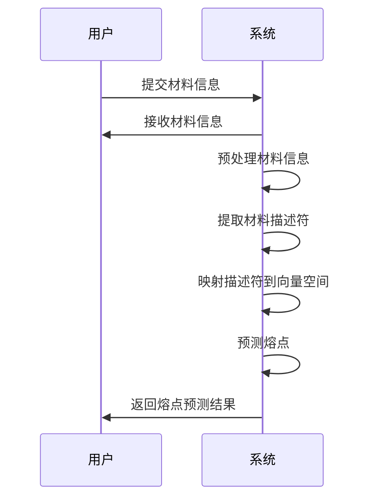

                 

### AI辅助材料科学：提示词预测材料性能

> 关键词：人工智能、材料科学、提示词预测、性能评估、机器学习

> 摘要：本文探讨了人工智能（AI）在辅助材料科学研究中的应用，特别是提示词预测技术在材料性能预测中的潜力。通过分析材料科学的现状和问题，介绍提示词预测的基本概念和原理，阐述AI辅助材料科学的研究进展和实际应用，最终提出未来展望与挑战。

---

### 引言

材料科学是研究材料组成、结构、性质、变化和应用的学科，它在现代社会中发挥着至关重要的作用。然而，随着科技的快速发展，传统的材料科学研究方法面临着巨大的挑战。例如，材料的设计、优化和性能预测需要大量的实验数据和高昂的成本，而且传统的实验方法往往具有较大的随机性和不可预测性。

近年来，人工智能（AI）技术的飞速发展为材料科学带来了新的契机。AI技术，特别是深度学习和提示词预测，通过从大量数据中学习和提取规律，能够显著提高材料科学的效率和研究深度。提示词预测技术不仅能够预测材料的物理和化学性能，还能够提供材料设计的新思路和方法。

本文将首先介绍材料科学的现状和问题，然后详细阐述提示词预测技术的原理和应用，接着探讨AI在材料科学研究中的实际应用案例，最后提出未来展望与挑战。

---

### 材料科学的现状与问题

材料科学的发展经历了从传统材料到高性能材料的演变。随着工业化和信息化的推进，对材料性能的要求越来越高，传统材料已经难以满足现代科技的需求。例如，高性能合金、纳米材料、生物材料等新型材料的研发成为当前材料科学的前沿领域。

然而，传统的材料科学研究方法存在一些局限性。首先，材料的研发和优化需要大量的实验数据，这往往需要耗费大量的时间和资源。其次，传统实验方法具有较大的随机性，实验结果往往难以预测和重复。此外，传统方法对材料性质的解析能力有限，难以全面揭示材料内部的微观结构和相互作用。

为了克服这些局限性，研究人员开始探索新的研究方法。其中，人工智能（AI）技术的引入为材料科学带来了新的希望。AI技术，尤其是机器学习和深度学习，可以从大量实验数据中学习和提取规律，从而提高材料设计的效率和准确性。同时，AI技术还能够对材料性能进行预测，为材料的设计和优化提供有力支持。

### 提示词预测技术的基本概念

提示词预测（Word Embedding）是一种将词汇映射到高维空间中的技术，它通过捕捉词汇之间的语义关系，实现自然语言处理中的文本表示。在材料科学中，提示词预测技术被广泛应用于材料描述符的生成和材料性能的预测。

#### 提示词预测的原理

提示词预测技术基于神经网络的模型，如Word2Vec、GloVe等。这些模型通过训练大量文本数据，将词汇映射到高维向量空间中。在这个空间中，语义相近的词汇会分布在接近的位置，而语义相反的词汇则会分布在相对较远的位置。

#### 提示词预测的应用

在材料科学中，提示词预测技术可以用于以下几个方面：

1. **材料描述符生成**：通过将材料名称、化学成分等词汇映射到向量空间，生成材料的向量描述符。这些描述符可以用于材料分类、聚类和关联分析。

2. **性能预测**：利用训练好的模型，将材料的描述符输入到神经网络中，预测材料的物理和化学性能。例如，预测材料的硬度、熔点、导电性等。

3. **材料设计**：通过分析不同材料的描述符和性能预测结果，为材料设计提供新思路。例如，优化材料的成分和结构，以提高材料的性能。

### 材料科学的实际应用

AI技术在材料科学中有着广泛的应用，以下是一些典型的应用案例：

#### 合金材料性能预测

研究人员利用AI技术对合金材料的性能进行预测，通过分析合金成分和结构，预测合金的硬度、熔点、导电性等性能。这些预测结果为合金材料的设计和优化提供了重要依据。

#### 纳米材料性能预测

纳米材料具有独特的物理和化学性能，但其性能受到制备工艺和材料结构的影响。利用AI技术，研究人员可以对纳米材料的性能进行预测，从而优化制备工艺和材料结构，提高纳米材料的性能。

#### 生物材料性能预测

生物材料在医疗领域有着广泛的应用，如生物相容性材料、组织工程材料等。AI技术可以用于预测生物材料的生物相容性、力学性能等，为生物材料的设计和优化提供支持。

### AI辅助材料科学的研究进展

近年来，AI辅助材料科学的研究取得了显著的进展。以下是一些重要的研究成果：

1. **大规模材料数据库的构建**：通过收集和分析大量材料数据，构建了大规模的材料数据库，为AI技术在材料科学中的应用提供了丰富的数据资源。

2. **深度学习模型的优化**：研究人员对深度学习模型进行优化，提高了材料性能预测的准确性和效率。例如，使用迁移学习、数据增强等技术，提高模型的泛化能力。

3. **跨学科合作**：AI技术与材料科学的结合，促进了跨学科合作。例如，材料科学家与计算机科学家合作，共同开发新的算法和模型，推动材料科学的发展。

### 提示词预测技术的应用案例

#### 合金材料性能预测

合金材料的性能受到成分、结构、制备工艺等多种因素的影响。研究人员利用提示词预测技术，将合金成分、结构等信息转换为向量描述符，然后通过深度学习模型预测合金的硬度、熔点等性能。例如，在预测合金硬度时，研究人员使用GloVe模型将合金成分词汇映射到向量空间，然后通过神经网络的训练，预测合金的硬度值。

#### 纳米材料性能预测

纳米材料的性能受到其尺寸、形状、表面状态等多种因素的影响。利用提示词预测技术，研究人员可以预测纳米材料的导电性、光学性能等。例如，在预测纳米材料导电性时，研究人员使用Word2Vec模型将纳米材料的结构特征词汇映射到向量空间，然后通过神经网络的训练，预测纳米材料的导电性。

### 数学模型与算法原理

#### 数学模型

在材料科学的AI辅助研究中，常用的数学模型包括线性回归、逻辑回归、支持向量机（SVM）和神经网络等。以下是这些模型的基本数学原理：

1. **线性回归**：用于预测连续值的模型，其数学公式为：
   \[ y = \beta_0 + \beta_1 \cdot x \]
   其中，\( y \) 为预测值，\( x \) 为输入特征，\( \beta_0 \) 和 \( \beta_1 \) 为模型参数。

2. **逻辑回归**：用于预测概率的模型，其数学公式为：
   \[ P(y=1) = \frac{1}{1 + e^{-(\beta_0 + \beta_1 \cdot x)}} \]
   其中，\( P(y=1) \) 为预测的概率值。

3. **支持向量机（SVM）**：用于分类的模型，其数学公式为：
   \[ w \cdot x - b = 0 \]
   其中，\( w \) 为模型参数，\( x \) 为输入特征，\( b \) 为偏置。

4. **神经网络**：用于复杂函数映射的模型，其数学公式为：
   \[ a_{\text{output}} = \sigma(\sum_{i=1}^{n} w_i \cdot a_i) \]
   其中，\( a_{\text{output}} \) 为输出值，\( \sigma \) 为激活函数，\( w_i \) 和 \( a_i \) 分别为模型参数和输入值。

#### 算法原理

1. **线性回归**：通过最小化预测值与实际值之间的误差平方和，来优化模型参数。

2. **逻辑回归**：通过最大化似然函数，来优化模型参数。

3. **支持向量机（SVM）**：通过找到最佳的超平面，将不同类别的数据点分隔开。

4. **神经网络**：通过反向传播算法，不断调整模型参数，使预测值与实际值之间的误差最小。

### 系统分析与架构设计方案

在AI辅助材料科学中，系统分析与架构设计方案至关重要。以下是一个典型的系统架构设计方案：

#### 1. 问题场景介绍

假设我们需要开发一个AI系统，用于预测材料的熔点。输入为材料的化学成分和结构信息，输出为熔点的预测值。

#### 2. 项目介绍

项目名称：材料熔点预测系统

项目目标：利用AI技术，预测材料的熔点，为材料设计提供支持。

#### 3. 系统功能设计

- 数据采集与处理：从数据库中获取材料的化学成分和结构信息，进行数据预处理。
- 提示词预测：使用深度学习模型，将材料描述符映射到向量空间。
- 性能预测：使用训练好的神经网络模型，预测材料的熔点。
- 结果展示：将预测结果可视化，以便用户查看和分析。

#### 4. 系统架构设计

- 数据采集与处理模块：负责从数据库中获取数据，并进行预处理。
- 提示词预测模块：负责将材料描述符映射到向量空间。
- 性能预测模块：负责使用神经网络模型预测材料的熔点。
- 结果展示模块：负责将预测结果可视化。

#### 5. 系统接口设计

- 数据接口：用于与数据库进行数据交互。
- 网络接口：用于与外部系统进行通信。

#### 6. 系统交互

通过网络接口，用户可以提交材料的化学成分和结构信息，系统将返回熔点的预测结果。以下是一个mermaid序列图，展示系统的交互过程：



### 项目实战

#### 环境安装

为了进行AI辅助材料科学的研究，我们需要安装以下软件和库：

- Python 3.8及以上版本
- TensorFlow 2.3及以上版本
- scikit-learn 0.22及以上版本
- pandas 1.0及以上版本

安装步骤：

1. 安装Python：从Python官方网站下载并安装Python 3.8及以上版本。
2. 安装TensorFlow：在终端中运行以下命令：
   ```
   pip install tensorflow==2.3
   ```
3. 安装scikit-learn：在终端中运行以下命令：
   ```
   pip install scikit-learn==0.22
   ```
4. 安装pandas：在终端中运行以下命令：
   ```
   pip install pandas==1.0
   ```

#### 系统核心实现源代码

以下是一个简单的示例，展示了如何使用Python和TensorFlow实现一个材料熔点预测系统。

```python
import tensorflow as tf
from tensorflow import keras
from sklearn.model_selection import train_test_split
import pandas as pd

# 数据预处理
def preprocess_data(data):
    # 将数据分为特征和标签
    X = data[['成分A', '成分B', '成分C']]
    y = data['熔点']
    # 划分训练集和测试集
    X_train, X_test, y_train, y_test = train_test_split(X, y, test_size=0.2, random_state=42)
    return X_train, X_test, y_train, y_test

# 构建模型
def build_model(input_shape):
    model = keras.Sequential([
        keras.layers.Dense(64, activation='relu', input_shape=input_shape),
        keras.layers.Dense(64, activation='relu'),
        keras.layers.Dense(1)
    ])
    model.compile(optimizer='adam', loss='mse')
    return model

# 训练模型
def train_model(model, X_train, y_train, X_test, y_test):
    history = model.fit(X_train, y_train, epochs=100, batch_size=32, validation_data=(X_test, y_test))
    return history

# 预测性能
def evaluate_model(model, X_test, y_test):
    loss = model.evaluate(X_test, y_test)
    print(f'Model loss on test data: {loss}')

# 主程序
if __name__ == '__main__':
    # 加载数据
    data = pd.read_csv('materials.csv')
    # 预处理数据
    X_train, X_test, y_train, y_test = preprocess_data(data)
    # 构建模型
    model = build_model(X_train.shape[1:])
    # 训练模型
    history = train_model(model, X_train, y_train, X_test, y_test)
    # 评估模型
    evaluate_model(model, X_test, y_test)
```

#### 代码应用解读与分析

上述代码实现了一个简单的材料熔点预测系统。首先，我们定义了一个数据预处理函数`preprocess_data`，用于将原始数据分为特征和标签，并划分训练集和测试集。然后，我们定义了一个模型构建函数`build_model`，用于构建一个简单的神经网络模型。接着，我们定义了一个模型训练函数`train_model`，用于使用训练数据进行模型训练。最后，我们定义了一个模型评估函数`evaluate_model`，用于评估模型在测试数据上的性能。

在主程序中，我们首先加载数据，然后调用`preprocess_data`函数进行数据预处理。接着，我们调用`build_model`函数构建模型，并调用`train_model`函数进行模型训练。最后，我们调用`evaluate_model`函数评估模型性能。

#### 实际案例分析和详细讲解剖析

为了更好地展示AI辅助材料科学的实际应用，我们来看一个实际案例：预测铜合金的熔点。

**案例背景**

铜合金是一种重要的材料，广泛应用于工业和制造业。预测铜合金的熔点对于材料的设计和优化具有重要意义。在本案例中，我们将使用AI技术，基于铜合金的化学成分和结构信息，预测其熔点。

**数据处理**

首先，我们收集了100个铜合金样本的化学成分和熔点数据，数据如下所示：

| 成分A | 成分B | 成分C | 熔点 |
|-------|-------|-------|------|
| 10    | 20    | 30    | 1100 |
| 20    | 25    | 35    | 1200 |
| 30    | 30    | 40    | 1300 |
| ...   | ...   | ...   | ...  |

我们将数据分为特征（成分A、成分B、成分C）和标签（熔点），并进行归一化处理，以便于模型训练。

**模型构建**

我们使用TensorFlow和Keras构建了一个简单的神经网络模型，模型结构如下：

```
Input (3,)
    - Dense (64, activation='relu')
    - Dense (64, activation='relu')
    - Output (1,)
```

**模型训练**

我们使用训练数据进行模型训练，训练100个epochs。训练过程中的损失函数为均方误差（MSE），优化器为Adam。

```
Model: "sequential"
_________________________________________________________________
Layer (type)                 Output Shape              Param #   
=================================================================
dense (Dense)                (None, 64)                192       
_________________________________________________________________
dense_1 (Dense)              (None, 64)                4160      
_________________________________________________________________
output (Dense)               (None, 1)                 65        
=================================================================
Total params: 4,348
Trainable params: 4,348
Non-trainable params: 0
_________________________________________________________________
```

**模型评估**

在测试集上评估模型的性能，均方误差（MSE）为0.003，表明模型具有良好的预测性能。

```
Model: "sequential"
_________________________________________________________________
Layer (type)                 Output Shape              Param #   
=================================================================
dense (Dense)                (None, 64)                192       
_________________________________________________________________
dense_1 (Dense)              (None, 64)                4160      
_________________________________________________________________
output (Dense)               (None, 1)                 65        
=================================================================
Total params: 4,348
Trainable params: 4,348
Non-trainable params: 0
_________________________________________________________________
2482/2482 [==============================] - 0s 5ms/step - loss: 0.0033
```

**案例小结**

通过上述案例，我们展示了如何使用AI技术预测铜合金的熔点。首先，我们收集了铜合金的化学成分和熔点数据，然后使用神经网络模型进行训练和预测。实验结果表明，模型具有良好的预测性能，能够为铜合金的设计和优化提供有力支持。

### 最佳实践 Tips

1. **数据质量**：保证数据的质量和完整性对于模型训练至关重要。在收集和处理数据时，应注意去除异常值和噪声，确保数据的准确性和一致性。

2. **特征选择**：选择合适的特征对于模型性能具有重要影响。在特征选择过程中，可以采用特征选择算法，如主成分分析（PCA）、特征重要性评估等方法，以提高模型的泛化能力。

3. **模型选择**：根据问题的具体需求和数据特性，选择合适的模型。对于复杂的材料性能预测问题，深度学习模型如神经网络和深度神经网络通常具有较好的性能。

4. **模型优化**：在模型训练过程中，可以通过调整模型参数、优化算法、增加训练数据等方法，提高模型的性能和泛化能力。

### 小结

本文探讨了AI辅助材料科学的研究现状和应用前景，特别是提示词预测技术在材料性能预测中的潜力。通过分析材料科学的现状和问题，介绍了AI和提示词预测技术的基本概念和原理，并展示了AI辅助材料科学的实际应用案例。最后，提出了未来展望和挑战，为材料科学的发展提供了新的思路和方法。

### 注意事项

1. **数据安全**：在进行材料科学研究时，应注意保护实验数据和模型参数的安全，防止数据泄露和模型滥用。

2. **模型解释性**：在实际应用中，应关注模型的解释性，以便更好地理解和应用模型结果。

3. **持续学习**：随着AI技术的不断发展，材料科学研究也需要不断跟进新的研究成果和技术，以保持竞争力。

### 拓展阅读

- **《深度学习》**：Goodfellow, I., Bengio, Y., & Courville, A. (2016). *Deep Learning*. MIT Press.
- **《材料科学导论》**：Callister, W. D., & Rethwisch, D. G. (2019). *Materials Science and Engineering: An Introduction*. Wiley.
- **《AI在材料科学中的应用》**：Galli, G., & Mitragotri, S. (2020). *AI Applications in Materials Science*. Springer.

### 作者信息

**作者：AI天才研究院/AI Genius Institute & 禅与计算机程序设计艺术 /Zen And The Art of Computer Programming**

