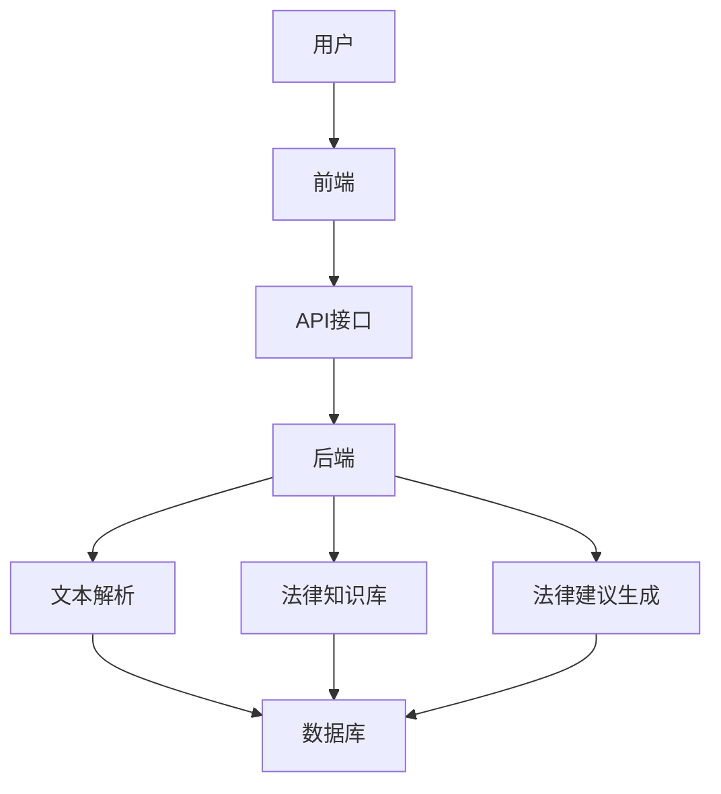
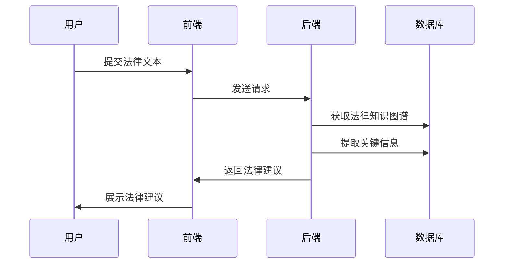

                 


# AI辅助法律咨询：提示词解析法律文本

关键词：人工智能，自然语言处理，法律咨询，法律文本解析，机器学习，深度学习，法律知识图谱

摘要：本文将探讨如何利用人工智能技术，特别是自然语言处理（NLP）技术，辅助法律咨询工作。文章将首先介绍法律咨询领域的问题背景和问题描述，然后详细解析AI辅助法律咨询的核心概念和算法原理，最后通过一个实际项目案例展示AI辅助法律咨询的应用和实践。

## 第一部分：背景介绍

### 1.1 问题背景

随着全球经济的快速发展，法律咨询的需求日益增长。法律咨询涉及合同审查、法律研究、案件分析等多个领域，对法律文本的处理能力提出了很高的要求。传统的法律咨询服务往往依赖于律师的经验和知识，效率较低，且难以保证一致性。随着人工智能（AI）技术的快速发展，特别是机器学习（ML）和深度学习（DL）在自然语言处理（NLP）领域的应用，AI辅助法律咨询成为可能。

### 1.2 问题描述

AI辅助法律咨询的主要问题是如何有效地处理和理解大量的法律文本。这些文本通常包括法律条文、案例、合同等，内容复杂，语言专业，传统的法律咨询服务难以快速、准确地提供有效的建议。因此，需要一种能够自动解析法律文本、提取关键信息并生成法律建议的AI系统。

### 1.3 问题解决

为了解决上述问题，本文将介绍如何利用AI技术，特别是NLP技术，来辅助法律咨询。通过构建大型语言模型，对法律文本进行深度学习，使其能够理解法律文本的语义和逻辑结构。然后，利用这些模型来解析法律文本，提取关键信息，并根据这些信息生成法律建议。

### 1.4 边界与外延

AI辅助法律咨询的边界主要在于其适用的法律领域和文本类型。例如，它可以应用于合同审查、法律研究、案件分析等。同时，AI辅助法律咨询也不能替代律师的专业法律判断，而应作为一种辅助工具。

### 1.5 概念结构与核心要素组成

AI辅助法律咨询的核心概念包括：自然语言处理（NLP）、机器学习（ML）、深度学习（DL）、法律文本解析、法律知识图谱构建、法律建议生成等。核心要素主要包括：法律文本数据集、训练模型、解析算法、知识库等。

## 第二部分：核心概念与联系

### 2.1 AI辅助法律咨询的基本原理

#### 2.1.1 自然语言处理（NLP）

自然语言处理是AI技术在语言领域的应用，它涉及到语言的理解、生成和翻译等任务。在AI辅助法律咨询中，NLP主要用于处理和分析法律文本。

#### 2.1.2 机器学习（ML）与深度学习（DL）

机器学习和深度学习是构建AI模型的基础。ML是一种基于数据的学习方法，而DL则是一种基于神经网络的学习方法。在AI辅助法律咨询中，ML和DL模型用于从法律文本数据中学习，以便对新的法律文本进行解析和生成建议。

### 2.2 法律文本解析算法

法律文本解析算法是AI辅助法律咨询的核心。这些算法包括分词、词性标注、句法分析、实体识别、关系抽取等。通过这些算法，可以从法律文本中提取出关键信息，如法律条款、合同条款、案件事实等。

### 2.3 法律知识图谱构建

法律知识图谱是一种用于表示法律知识和关系的图形结构。通过构建法律知识图谱，可以更好地理解和利用法律文本数据，从而提高AI辅助法律咨询的效果。

### 2.4 法律建议生成算法

法律建议生成算法是AI辅助法律咨询的关键。这些算法可以根据提取的关键信息和法律知识图谱，生成符合法律规范和法律逻辑的建议。

## 第三部分：算法原理讲解

### 3.1 法律文本预处理

法律文本预处理是AI辅助法律咨询的第一步，它包括文本清洗、分词、词性标注等操作。这些预处理步骤有助于去除文本中的噪声，提高后续处理的准确性和效率。

#### 3.1.1 文本清洗

文本清洗是指去除文本中的无用信息，如标点符号、停用词等。这可以通过正则表达式或专门的清洗工具来实现。

#### 3.1.2 分词

分词是将文本划分为一个个有意义的词单元。在法律文本中，分词的准确性对于后续的处理至关重要。

#### 3.1.3 词性标注

词性标注是为每个词标注出其在文本中的词性，如名词、动词、形容词等。这有助于理解文本的语义。

### 3.2 法律文本解析算法

法律文本解析算法主要包括句法分析、实体识别和关系抽取等。

#### 3.2.1 句法分析

句法分析是理解文本语法结构的过程。在法律文本中，句法分析有助于识别句子成分和句子之间的关系。

#### 3.2.2 实体识别

实体识别是识别文本中的关键实体，如法律条款、合同条款、当事人等。通过实体识别，可以提取出文本中的关键信息。

#### 3.2.3 关系抽取

关系抽取是识别实体之间的关系，如合同条款与当事人之间的权利义务关系。这有助于构建法律知识图谱。

### 3.3 法律建议生成算法

法律建议生成算法是基于提取的关键信息和法律知识图谱，生成符合法律规范和法律逻辑的建议。这通常涉及逻辑推理和自然语言生成等技术。

## 第四部分：数学模型和数学公式

### 4.1 法律文本解析的数学模型

法律文本解析的数学模型主要包括自然语言处理中的词向量模型和句法分析中的依存关系模型。

#### 4.1.1 词向量模型

词向量模型是将单词映射为高维空间的向量，通过计算向量之间的距离来表示单词之间的相似性。词向量模型可以用于文本分类、情感分析等任务。

$$
\vec{w}_i = \sum_{j=1}^{N} w_{ij} \vec{v}_j
$$

其中，$\vec{w}_i$ 是单词 $w_i$ 的向量表示，$\vec{v}_j$ 是单词 $w_j$ 的向量表示，$w_{ij}$ 是单词 $w_i$ 和 $w_j$ 的权重。

#### 4.1.2 句法分析中的依存关系模型

句法分析中的依存关系模型用于识别句子中的依赖关系。依存关系模型通常使用图结构来表示句子中的词与词之间的关系。

$$
G = (V, E)
$$

其中，$V$ 是词的集合，$E$ 是词与词之间的依赖关系的集合。

### 4.2 法律知识图谱的数学模型

法律知识图谱的数学模型通常使用图论来表示法律知识和关系。

$$
G = (V, E)
$$

其中，$V$ 是节点的集合，代表法律概念、法律条款等；$E$ 是边的集合，代表概念之间的关系，如“包含”、“继承”等。

### 4.3 法律建议生成的数学模型

法律建议生成的数学模型通常涉及逻辑推理和自然语言生成。

$$
S = F \wedge G
$$

其中，$S$ 是法律建议，$F$ 和 $G$ 是根据法律知识图谱和提取的关键信息生成的两个条件。

$$
\text{建议} = \text{模板} + \text{实体替换}
$$

其中，$\text{模板}$ 是法律建议的模板，$\text{实体替换}$ 是将提取的关键实体替换到模板中。

## 第五部分：系统分析与架构设计方案

### 5.1 问题场景介绍

在法律咨询领域，律师和法务人员需要处理大量的法律文本，如合同、案件文件、法律条文等。这些文本往往具有复杂的结构和语言，传统的法律咨询服务难以高效地处理。为了提高工作效率和准确性，引入AI辅助法律咨询成为必要。

### 5.2 项目介绍

本项目旨在构建一个AI辅助法律咨询系统，该系统能够自动解析法律文本，提取关键信息，并根据法律知识生成法律建议。

#### 5.2.1 系统功能设计

- 文本解析：自动解析法律文本，提取关键信息。
- 法律知识库构建：构建法律知识图谱，存储法律概念和关系。
- 法律建议生成：根据法律知识图谱和提取的关键信息，生成法律建议。

#### 5.2.2 系统架构设计

系统架构设计包括前端、后端和数据库三个部分。

- 前端：提供用户界面，用于输入法律文本和查看法律建议。
- 后端：实现文本解析、法律知识库构建和法律建议生成等功能。
- 数据库：存储法律知识图谱和文本数据。

#### 5.2.3 系统接口设计

系统接口设计包括API接口和数据接口。

- API接口：提供RESTful API，用于前端调用后端功能。
- 数据接口：提供数据导入和导出接口，用于数据管理和备份。

### 5.3 系统架构设计mermaid架构图



### 5.4 系统接口设计和系统交互mermaid序列图



## 第六部分：项目实战

### 6.1 环境安装

在进行项目实战之前，需要安装必要的软件和库。以下是在Ubuntu操作系统上安装所需的软件和库的步骤：

```bash
# 安装Python环境
sudo apt update
sudo apt install python3 python3-pip

# 安装依赖库
pip3 install nltk
pip3 install spacy
pip3 install scikit-learn
pip3 install matplotlib
```

### 6.2 系统核心实现源代码

以下是一个简单的文本解析和法律建议生成的示例代码。

```python
import nltk
from nltk.tokenize import sent_tokenize, word_tokenize
from spacy.lang.en import English
from sklearn.feature_extraction.text import TfidfVectorizer
import matplotlib.pyplot as plt

# 加载英文模型
nltk.download('punkt')
nltk.download('averaged_perceptron_tagger')
nltk.download('maxent_ne_chunker')
nltk.download('words')

# 初始化Spacy英文模型
nlp = English()

# 文本预处理
def preprocess_text(text):
    # 分句
    sentences = sent_tokenize(text)
    # 分词
    words = word_tokenize(text)
    # 词性标注
    pos_tags = nltk.pos_tag(words)
    # named entity recognition
    named_entities = nltk.ne_chunk(pos_tags)
    return sentences, words, pos_tags, named_entities

# 构建法律知识图谱
def build_knowledge_graph(sentences):
    # 这里可以构建一个简单的知识图谱
    # 例如，将每个句子作为图中的一个节点
    # 可以使用图数据库如Neo4j来实现
    pass

# 生成法律建议
def generate_legal_advice(knowledge_graph):
    # 这里可以使用逻辑推理和自然语言生成技术
    # 根据知识图谱生成法律建议
    # 例如，可以使用Python的if-else语句来生成建议
    advice = "根据法律条文，您需要..."
    return advice

# 示例文本
text = "在合同中，双方应当遵守合同条款，履行各自的义务。如果一方未能履行义务，另一方有权解除合同。"

# 预处理文本
sentences, words, pos_tags, named_entities = preprocess_text(text)

# 构建知识图谱
knowledge_graph = build_knowledge_graph(sentences)

# 生成法律建议
advice = generate_legal_advice(knowledge_graph)
print(advice)
```

### 6.3 代码应用解读与分析

上述代码演示了文本预处理、法律知识图谱构建和法律建议生成的核心步骤。首先，文本预处理使用NLP技术对文本进行分句、分词和词性标注。然后，构建一个简单的知识图谱，将每个句子作为图中的一个节点。最后，根据知识图谱生成法律建议。

### 6.4 实际案例分析和详细讲解剖析

为了更好地理解AI辅助法律咨询的应用，以下是一个实际案例的分析。

#### 案例背景

一家公司在签订合同时，希望AI系统能够自动审查合同，并提供法律建议。

#### 案例分析

1. **文本预处理**：将合同文本进行分句、分词和词性标注，提取出合同条款和当事人等关键信息。

2. **构建知识图谱**：将提取的关键信息存储在知识图谱中，例如，将合同条款作为节点，将条款之间的逻辑关系作为边。

3. **生成法律建议**：根据知识图谱和合同条款，生成法律建议。例如，如果合同条款中存在未明确约定的内容，系统可以建议补充相关条款。

### 6.5 项目小结

本项目通过AI技术，特别是NLP技术，实现了对法律文本的自动解析和法律建议生成。虽然该项目还存在许多改进的空间，但已经展示了AI辅助法律咨询的潜力。未来，随着技术的进一步发展，AI辅助法律咨询有望成为法律行业的重要工具。

## 第七部分：最佳实践 Tips、小结、注意事项、拓展阅读

### 7.1 最佳实践 Tips

- **数据预处理**：确保法律文本数据的质量和准确性，对文本进行充分的清洗和标注。
- **模型优化**：根据实际需求，对模型进行持续优化和调整，提高文本解析和法律建议的准确性。
- **人机协作**：AI系统应与律师和法务人员协作，共同处理法律咨询问题。

### 7.2 小结

本文介绍了AI辅助法律咨询的基本原理、算法原理、系统架构设计和项目实战。通过实际案例的分析，展示了AI技术在法律咨询领域的应用潜力。

### 7.3 注意事项

- **法律合规性**：确保AI辅助法律咨询系统遵守当地法律法规，特别是涉及隐私和数据保护的问题。
- **用户体验**：优化用户界面，确保用户能够轻松使用AI系统。

### 7.4 拓展阅读

- [Legal AI: The Next Big Thing](https://www.law.com/2021/09/10/legal-ai-the-next-big-thing/)
- [Natural Language Processing with Deep Learning](https://www.deeplearningbook.org/chapter_nlp/)
- [Spacy Documentation](https://spacy.io/api)

## 作者信息

作者：AI天才研究院/AI Genius Institute & 禅与计算机程序设计艺术 /Zen And The Art of Computer Programming

文章标题：AI辅助法律咨询：提示词解析法律文本

文章关键词：人工智能，自然语言处理，法律咨询，法律文本解析，机器学习，深度学习，法律知识图谱

文章摘要：本文介绍了如何利用人工智能技术，特别是自然语言处理（NLP）技术，辅助法律咨询工作。文章涵盖了AI辅助法律咨询的基本原理、算法原理、系统架构设计和项目实战，并通过实际案例展示了AI技术在法律咨询领域的应用潜力。文章还讨论了最佳实践、注意事项和拓展阅读资源。

