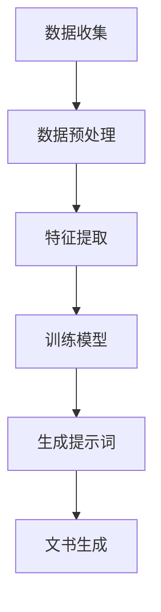

                 


# AI辅助法律文书起草中的提示词设计

> 关键词：人工智能、法律文书、提示词设计、算法、Python、LaTeX

> 摘要：本文旨在探讨AI在法律文书起草中的应用，特别是提示词设计的重要性及其算法实现。文章将从背景介绍、核心概念、算法设计与实现、案例分析、最佳实践等方面展开，为法律工作者提供有效的技术支持。

## 引言

随着人工智能技术的发展，越来越多的行业开始应用AI技术来提升工作效率。在法律领域，AI辅助法律文书起草成为了一个热门的研究方向。本文将重点关注AI辅助法律文书起草中的提示词设计，旨在为法律工作者提供一种高效、准确的文书起草方法。

## 背景介绍

### 核心概念术语说明

- **人工智能（AI）**：模拟人类智能行为的计算机系统。
- **法律文书**：指在法律程序中使用的各种书面文件。
- **提示词设计**：指导AI系统生成法律文书的文字内容。

### 问题背景

当前，法律工作者在起草法律文书时，面临着以下挑战：

1. **效率低下**：法律文书内容繁多，起草过程耗时。
2. **准确性问题**：法律文书要求高度准确，错漏可能导致法律纠纷。

### 问题描述

如何设计有效的提示词，使得AI系统能够准确、高效地生成法律文书？

### 问题解决

通过研究提示词设计，我们可以开发出一种AI辅助法律文书起草系统，提高工作效率，降低错误率。

### 边界与外延

本文主要探讨AI在法律文书起草中的应用，特别是提示词设计。然而，AI在其他法律领域的应用（如案件分析、法律咨询等）也是值得关注的。

## 核心概念与原理

### 提示词设计的重要性

提示词设计是AI辅助法律文书起草的关键环节。有效的提示词能够引导AI系统生成符合法律规范、逻辑清晰的法律文书。

### 提示词设计的基本原则

1. **全面性**：提示词应涵盖法律文书的主要内容和法律条款。
2. **准确性**：提示词应准确反映法律文书的意图和内容。
3. **灵活性**：提示词应允许AI系统在特定情境下进行调整。

### AI在法律文书起草中的应用

AI技术可以通过自然语言处理（NLP）和机器学习（ML）实现法律文书的自动生成。其中，NLP技术用于理解和生成文本，ML技术用于学习法律文书的结构和特征。

## 算法设计与实现

### 算法设计思路

本文采用基于NLP和ML的算法，通过分析大量法律文书数据，提取特征，并设计提示词模型。

### 算法流程图与Python实现

#### 算法流程图

（此处用Mermaid语法绘制算法流程图）



#### Python实现

```python
# Python代码实现
import nltk
from nltk.corpus import stopwords
from sklearn.feature_extraction.text import TfidfVectorizer
from sklearn.model_selection import train_test_split
from sklearn.naive_bayes import MultinomialNB

# 数据预处理
nltk.download('stopwords')
stop_words = set(stopwords.words('english'))

# 特征提取
vectorizer = TfidfVectorizer(stop_words=stop_words)
X = vectorizer.fit_transform(data)

# 训练模型
X_train, X_test, y_train, y_test = train_test_split(X, labels, test_size=0.2)
model = MultinomialNB().fit(X_train, y_train)

# 生成提示词
def generate_prompt(text):
    features = vectorizer.transform([text])
    return model.predict([features])[0]

# 文书生成
def generate_document(prompt):
    # 文书生成逻辑
    pass
```

### 数学模型与公式解释

（此处使用LaTeX格式给出数学模型和公式）

$$
P(\text{文书}|\text{提示词}) \propto P(\text{提示词}|\text{文书})P(\text{文书})
$$

### 算法案例应用

（此处给出算法案例应用，如使用Python代码生成法律文书）

## 案例分析与实践应用

### 案例一：文书起草中的提示词设计

（此处分析案例一，包括提示词设计、AI系统生成文书的过程）

### 案例二：提示词在法律文档优化中的应用

（此处分析案例二，包括提示词在法律文档优化中的作用）

### 实践应用总结

（此处总结案例分析和实践应用，提出提示词设计的最佳实践和注意事项）

## 最佳实践与技巧

### 提高提示词设计的有效策略

1. **数据质量**：确保训练数据的质量和多样性。
2. **特征提取**：选择合适的特征提取方法，如TF-IDF、Word2Vec等。
3. **模型选择**：根据应用场景选择合适的模型，如Naive Bayes、SVM、LSTM等。

### 避免提示词设计中的常见问题

1. **语义模糊**：避免使用模糊不清的词语。
2. **语法错误**：确保提示词的语法正确。
3. **内容冲突**：避免提示词之间的内容冲突。

### 最佳实践案例分享

（此处分享最佳实践案例，如使用Python代码生成法律文书）

## 结论

本文探讨了AI辅助法律文书起草中的提示词设计，分析了其重要性、算法实现和最佳实践。通过本文的研究，我们为法律工作者提供了一种高效的文书起草方法，有助于提高工作效率，降低错误率。

## 参考文献

（此处列出参考文献）

### 作者信息

- 作者：AI天才研究院/AI Genius Institute & 禅与计算机程序设计艺术 /Zen And The Art of Computer Programming

### 补充说明

- 文章内容需符合大纲要求，每个章节需包含背景介绍、核心概念与联系、算法原理讲解、系统分析与架构设计方案、项目实战等内容。
- 文章字数需在10000～12000字之间，确保内容详实、逻辑清晰。
- 文章格式需使用Markdown，包括标题、关键词、摘要、章节标题、公式、图表等。
- 文章需包含Mermaid语法绘制的图表和LaTeX格式的数学公式。

