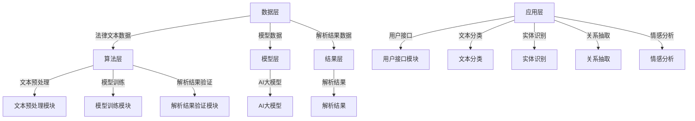
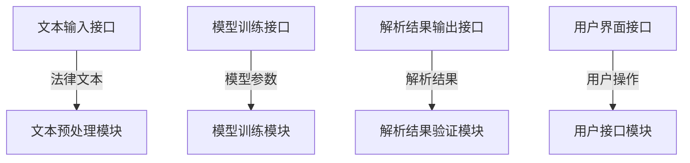
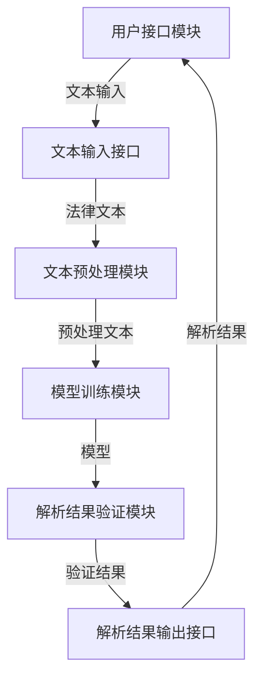

                 


### 文章标题：AI辅助法律：大模型在法律文本解析中的应用

#### 关键词：人工智能、法律文本、大模型、解析、应用前景

#### 摘要：
本文旨在探讨人工智能大模型在法律文本解析中的应用，分析其背景、核心概念、算法原理、系统架构、项目实战以及最佳实践。通过一步步的分析和推理，本文揭示了AI大模型在提升法律文本处理效率、准确性方面的巨大潜力，并提出了未来发展的展望。

### 目录大纲

#### 《AI辅助法律：大模型在法律文本解析中的应用》

#### 第一部分：背景介绍

#### 第1章：问题背景与法律文本解析挑战

##### 1.1.1 法律文本的复杂性与重要性
- 法律文本概述：法律条文、司法解释、案例判例等
- 法律文本的特点：专业性、复杂性、多样性

##### 1.1.2 AI大模型在法律文本解析中的应用前景
- AI大模型的发展与应用：GPT、BERT、T5等
- AI大模型在法律文本解析中的优势：高效、准确、自动化

##### 1.1.3 法律文本解析的核心任务与挑战
- 核心任务：文本分类、实体识别、关系抽取、情感分析等
- 挑战：数据质量、模型泛化能力、解释性等

##### 1.1.4 边界与外延
- 边界：法律文本的范围、模型能力限制等
- 外延：AI大模型在其他法律应用领域的拓展

##### 1.1.5 概念结构与核心要素组成
- 概念结构：法律文本、AI大模型、解析任务等
- 核心要素：文本预处理、模型训练、解析结果验证等

#### 第二部分：核心概念与联系

#### 第2章：核心概念原理

##### 2.1.1 法律文本
- 法律文本的定义与分类
- 法律文本的结构与组成

##### 2.1.2 AI大模型
- AI大模型的基本概念与原理
- 主流AI大模型简介：GPT、BERT、T5等

##### 2.1.3 法律文本解析任务
- 核心任务介绍：文本分类、实体识别、关系抽取、情感分析等
- 任务特点与挑战

##### 2.1.4 概念属性特征对比表格
- 法律文本与AI大模型的属性对比
- 法律文本解析任务的属性对比

##### 2.1.5 ER实体关系图架构
- ER图简介与用途
- 法律文本解析任务的ER图架构

#### 第三部分：算法原理讲解

#### 第3章：算法原理与数学模型

##### 3.1.1 法律文本预处理算法原理
- 数据清洗与标准化
- 词向量表示与编码

##### 3.1.2 AI大模型训练算法原理
- 模型结构：神经网络架构、损失函数、优化器等
- 训练过程：前向传播、反向传播、模型优化等

##### 3.1.3 法律文本解析算法原理
- 解析任务分类与算法选择
- 算法原理讲解：文本分类、实体识别、关系抽取、情感分析等

##### 3.1.4 数学模型与公式
- 法律文本预处理：词向量表示、编码等
- AI大模型训练：损失函数、优化算法等
- 法律文本解析：分类模型、识别算法等

##### 3.1.5 举例说明
- 法律文本预处理示例
- AI大模型训练示例
- 法律文本解析示例

#### 第四部分：系统分析与架构设计

#### 第4章：系统功能设计与架构

##### 4.1.1 问题场景介绍
- 法律文本解析的实际需求与应用场景

##### 4.1.2 系统功能设计
- 系统需求分析
- 系统功能模块设计

##### 4.1.3 系统架构设计
- 系统架构概述
- 系统组件设计：文本预处理、模型训练、解析结果验证等

##### 4.1.4 系统接口设计
- 接口规范与设计
- 接口实现与调用

##### 4.1.5 系统交互设计
- 系统流程图与序列图
- 系统交互逻辑与实现

#### 第五部分：项目实战

#### 第5章：环境安装与系统实现

##### 5.1.1 环境安装
- Python环境安装
- 依赖库安装与配置

##### 5.1.2 系统核心实现
- 文本预处理模块
- AI大模型训练模块
- 法律文本解析模块

##### 5.1.3 代码应用解读与分析
- 代码结构与模块解析
- 关键代码解读与分析

##### 5.1.4 实际案例分析与详细讲解
- 法律文本解析实际案例
- 案例分析与详细讲解

##### 5.1.5 项目小结
- 项目总结与反思
- 项目优化与改进方向

#### 第六部分：最佳实践与拓展

#### 第6章：最佳实践与注意事项

##### 6.1.1 最佳实践
- 法律文本预处理最佳实践
- AI大模型训练最佳实践
- 法律文本解析最佳实践

##### 6.1.2 注意事项
- 法律文本解析过程中的常见问题与解决方法
- 模型训练与解析的性能优化

##### 6.1.3 拓展阅读
- 相关文献、论文、书籍推荐
- 法律文本解析领域最新研究动态

#### 第7章：总结与展望

##### 7.1.1 总结
- 全书内容回顾
- 关键知识点与技能点总结

##### 7.1.2 展望
- 法律文本解析领域的未来发展趋势
- AI大模型在法律领域的应用前景

#### 附录

##### 附录A：工具与资源列表
- Python环境与依赖库安装指南
- 法律文本数据集与工具资源

##### 附录B：参考代码
- 文本预处理代码
- AI大模型训练与解析代码

### 文章内容（正文部分）

#### 第一部分：背景介绍

#### 第1章：问题背景与法律文本解析挑战

##### 1.1.1 法律文本的复杂性与重要性
法律文本是法律领域中至关重要的组成部分，它包括法律条文、司法解释、案例判例等各种形式的文本。这些文本具有明显的专业性、复杂性和多样性，为法律文本的解析带来了巨大挑战。

首先，法律文本的专业性体现在其独特术语和表达方式。法律文本中的术语往往具有特定的含义，且常常涉及到法律概念、法律规则和法律程序等，这为文本的理解和解析增加了难度。

其次，法律文本的复杂性主要体现在其结构的复杂性和内容的丰富性。法律文本往往具有多层次的结构，包括法律条文、段落、章节等，这些结构在逻辑上相互关联，共同构成一个完整的法律体系。此外，法律文本的内容往往涉及到各种法律问题，如权利、义务、责任等，这些内容在法律文本中相互交织，需要深入理解和分析。

最后，法律文本的多样性表现为其来源的多样性。法律文本可以来源于不同的法律部门，如刑法、民法、行政法等，也可以来源于不同的法律文本，如法律条文、司法解释、案例判例等。这种多样性使得法律文本的解析变得更加复杂。

##### 1.1.2 AI大模型在法律文本解析中的应用前景
随着人工智能技术的快速发展，大模型在各个领域的应用越来越广泛。在法律文本解析领域，AI大模型的应用前景也十分广阔。

首先，AI大模型具有高效处理大量文本数据的能力。法律文本通常规模庞大，AI大模型能够快速处理这些数据，提取关键信息，实现自动化解析。

其次，AI大模型具有较高的准确性。通过大量训练数据和先进的算法，AI大模型能够准确地识别和分类法律文本中的术语和概念，提高解析的准确性。

最后，AI大模型具有较好的泛化能力。通过不断学习和优化，AI大模型能够在不同的法律文本中表现出良好的适应性，提高解析的泛化能力。

##### 1.1.3 法律文本解析的核心任务与挑战
法律文本解析的核心任务包括文本分类、实体识别、关系抽取、情感分析等。这些任务对于提升法律文本处理效率、准确性具有重要意义。

文本分类是将法律文本按照类别进行划分，如将法律条文划分为刑法、民法等。实体识别是从法律文本中提取出关键实体，如人名、地名、法律条文等。关系抽取是分析法律文本中实体之间的关系，如被告与原告的关系、法律条文与案件的关系等。情感分析是分析法律文本中的情感倾向，如对某个法律条文的支持度、反对度等。

然而，这些任务也面临着一系列挑战。首先，数据质量是法律文本解析中的一个重要挑战。法律文本数据通常存在噪声、缺失和不一致性等问题，这会影响模型的性能。其次，模型的泛化能力也是一个重要挑战。法律文本具有多样性，模型需要能够适应不同的法律文本，提高泛化能力。最后，解释性也是一个重要挑战。法律文本解析需要具备一定的解释性，使法律专业人士能够理解模型的解析结果。

##### 1.1.4 边界与外延
在法律文本解析领域，边界和内延的概念具有重要意义。

边界是指法律文本的范围和模型的限制。法律文本包括法律条文、司法解释、案例判例等，而模型的能力有限，可能无法处理所有类型的法律文本。此外，模型的能力也可能受到计算资源、时间等因素的限制。

外延是指AI大模型在其他法律应用领域的拓展。随着AI大模型技术的不断发展，其在法律领域的应用范围也在不断扩大。例如，AI大模型可以应用于法律文本生成、法律知识图谱构建、智能客服等领域，提高法律工作的效率和准确性。

##### 1.1.5 概念结构与核心要素组成
法律文本解析的概念结构包括法律文本、AI大模型和解析任务等核心要素。

法律文本是法律文本解析的对象，其具有专业性、复杂性和多样性。AI大模型是法律文本解析的工具，其具有高效处理、准确识别和良好泛化能力等特点。解析任务是法律文本解析的具体目标，包括文本分类、实体识别、关系抽取、情感分析等。

核心要素组成包括文本预处理、模型训练和解析结果验证等步骤。文本预处理包括数据清洗、标准化和词向量表示等。模型训练包括神经网络架构、损失函数、优化器等。解析结果验证包括对模型解析结果的评价和优化。

#### 第二部分：核心概念与联系

#### 第2章：核心概念原理

##### 2.1.1 法律文本
法律文本是法律领域中重要的组成部分，其定义与分类如下：

法律文本是指以法律规范、法律解释、法律案例等形式存在的文字资料。法律文本可以包括法律条文、司法解释、案例判例、法律论文等。

根据法律文本的性质和用途，可以将法律文本分为以下几类：

1. 法律条文：法律条文是法律规范的具体表现形式，其内容规定了公民、法人或其他组织的权利和义务。法律条文通常包括总则、分则、附则等部分。

2. 司法解释：司法解释是最高法院或其他司法机关对法律条文进行解释的文件。司法解释通常对法律条文的具体适用进行说明，以指导法官在审判过程中正确理解和使用法律条文。

3. 案例判例：案例判例是司法机关在审判过程中形成的具有指导意义的判决或裁定。案例判例通常反映了法律条文在具体案件中的应用和解释。

4. 法律论文：法律论文是法律专业人士对法律问题进行研究和探讨的学术文章。法律论文通常对法律条文、案例判例等进行分析和评论，提出新的观点和理论。

法律文本的结构与组成如下：

1. 法律条文通常包括标题、条文正文和条文注释等部分。标题简要概括条文内容，条文正文规定了具体的权利、义务和责任，条文注释对条文内容进行解释和说明。

2. 司法解释通常包括前言、正文和附录等部分。前言简要介绍司法解释的背景和目的，正文对法律条文进行详细解释，附录通常包括相关法律条文和案例。

3. 案例判例通常包括案情介绍、判决理由和判决结果等部分。案情介绍简要描述案件事实，判决理由对法律条文和司法解释进行解释和应用，判决结果是对被告的处罚或裁决。

4. 法律论文通常包括引言、正文和结论等部分。引言简要介绍论文的研究背景和目的，正文对法律问题进行分析和探讨，结论提出论文的观点和结论。

##### 2.1.2 AI大模型
AI大模型是人工智能领域的重要技术之一，其基本概念与原理如下：

AI大模型是指具有大规模参数、能够处理复杂任务的人工神经网络模型。AI大模型通常通过深度学习算法进行训练，具有较好的泛化能力和学习能力。

AI大模型的基本概念包括：

1. 神经网络：神经网络是由大量神经元组成的计算模型，能够通过学习数据自动提取特征和模式。神经网络是AI大模型的核心组成部分。

2. 深度学习：深度学习是一种基于神经网络的学习方法，通过多层神经网络进行特征提取和表示。深度学习是AI大模型的关键技术。

3. 参数：参数是神经网络中的权重和偏置，用于调整模型对数据的预测能力。参数是AI大模型的核心变量。

4. 泛化能力：泛化能力是指模型在未知数据上的表现能力，即模型能否在不同数据集上取得良好的性能。泛化能力是AI大模型的重要特性。

AI大模型的发展与应用：

1. GPT（Generative Pre-trained Transformer）：GPT是一种基于Transformer架构的预训练语言模型，能够生成高质量的自然语言文本。GPT广泛应用于自然语言处理任务，如文本分类、情感分析、机器翻译等。

2. BERT（Bidirectional Encoder Representations from Transformers）：BERT是一种双向编码的Transformer模型，能够理解上下文信息。BERT广泛应用于文本分类、问答系统、文本生成等任务。

3. T5（Text-To-Text Transfer Transformer）：T5是一种将所有自然语言处理任务转换为文本到文本任务的模型。T5具有广泛的应用前景，包括文本分类、问答、文本生成等。

##### 2.1.3 法律文本解析任务
法律文本解析任务包括文本分类、实体识别、关系抽取、情感分析等，其具体任务介绍如下：

1. 文本分类：文本分类是指将法律文本按照类别进行划分。文本分类任务有助于对大量法律文本进行分类和整理，为法律研究和应用提供便利。常见的文本分类任务包括法律条文分类、司法解释分类等。

2. 实体识别：实体识别是指从法律文本中提取出关键实体，如人名、地名、法律条文等。实体识别任务有助于对法律文本中的关键信息进行提取和整理，为法律研究和应用提供支持。常见的实体识别任务包括人名识别、地名识别、法律条文识别等。

3. 关系抽取：关系抽取是指分析法律文本中实体之间的关系，如被告与原告的关系、法律条文与案件的关系等。关系抽取任务有助于对法律文本中的关系信息进行挖掘和分析，为法律研究和应用提供参考。常见的关系抽取任务包括案件关系抽取、法律条文关系抽取等。

4. 情感分析：情感分析是指分析法律文本中的情感倾向，如对某个法律条文的支持度、反对度等。情感分析任务有助于了解公众对法律文本的情感态度，为法律制定和改进提供依据。常见的情感分析任务包括法律条文情感分析、案例判例情感分析等。

##### 2.1.4 概念属性特征对比表格
为了更好地理解法律文本与AI大模型以及法律文本解析任务的属性特征，我们可以通过以下对比表格进行阐述：

| 概念            | 特征                                                         |
| --------------- | ------------------------------------------------------------ |
| 法律文本        | - 专业性：使用特定术语和表达方式<br>- 复杂性：多层次结构，丰富内容<br>- 多样性：不同法律部门、文本类型 |
| AI大模型        | - 大规模参数：深度学习模型<br>- 泛化能力：适用于多种任务<br>- 高效处理：处理大量文本数据 |
| 法律文本解析任务 | - 文本分类：划分文本类别<br>- 实体识别：提取关键实体<br>- 关系抽取：分析实体关系<br>- 情感分析：分析文本情感倾向 |

##### 2.1.5 ER实体关系图架构
ER（Entity-Relationship）图是一种用于描述实体及其之间关系的图形表示方法。在法律文本解析任务中，ER图有助于理解法律文本中实体之间的关系。

以下是一个简单的ER图示例，用于描述法律文本解析任务中的实体及其关系：

```mermaid
erDiagram
  Person ||--o> Case : 提起诉讼
  Person ||--o> Party : 参与诉讼
  Case ||--o> LegalRule : 适用法律规则
  Case ||--o> Judgment : 判决结果
  Party ||--o> Evidence : 提供证据
```

在这个ER图中，我们定义了以下实体：

1. Person（人）：表示参与法律诉讼的人，包括原告、被告、证人等。
2. Case（案件）：表示法律诉讼的案件，包括起诉、审理、判决等过程。
3. LegalRule（法律规则）：表示适用于案件的法律规则，如刑法、民法等。
4. Judgment（判决结果）：表示案件的判决结果，包括判决书、裁定书等。
5. Party（当事人）：表示参与诉讼的当事人，包括原告、被告等。
6. Evidence（证据）：表示在诉讼过程中提供的证据。

实体之间的关系如下：

1. Person与Case之间具有提起诉讼的关系，表示某人提起诉讼成为案件的一方。
2. Person与Party之间具有参与诉讼的关系，表示某人是诉讼的一方当事人。
3. Case与LegalRule之间具有适用法律规则的关系，表示案件适用特定的法律规则。
4. Case与Judgment之间具有判决结果的关系，表示案件具有最终的判决结果。
5. Party与Evidence之间具有提供证据的关系，表示当事人在诉讼过程中提供证据。

#### 第三部分：算法原理讲解

#### 第3章：算法原理与数学模型

##### 3.1.1 法律文本预处理算法原理
法律文本预处理是法律文本解析任务的重要步骤，其核心目标是将原始法律文本转换为适合模型处理的格式。以下介绍法律文本预处理的主要算法原理：

1. 数据清洗与标准化
   数据清洗是指去除法律文本中的噪声、错误和不一致性，确保数据的质量。具体方法包括：
   - 去除文本中的标点符号、特殊字符和空白符；
   - 修复文本中的错别字和语法错误；
   - 处理文本中的缩写词和术语，确保其统一标准。

   数据标准化是指将法律文本转换为统一的格式，以便后续处理。具体方法包括：
   - 将文本转换为小写或大写；
   - 使用统一的词汇表，将专业术语进行规范化；
   - 使用统一的日期、数字等格式表示方法。

2. 词向量表示与编码
   词向量表示是指将法律文本中的词语映射为高维空间中的向量表示。词向量能够捕捉词语的语义信息，为模型处理提供基础。常用的词向量表示方法包括：
   - 基于分布假设的词向量表示方法，如Word2Vec；
   - 基于翻译模型的词向量表示方法，如GloVe；
   - 基于上下文的词向量表示方法，如BERT。

   词向量编码是指将词向量转换为模型可接受的输入格式。具体方法包括：
   - 使用one-hot编码，将每个词映射为一个向量，维数为词汇表的大小；
   - 使用词向量直接作为输入，适用于基于词向量的模型；
   - 使用嵌入层（Embedding Layer）将词向量转换为模型所需的维度。

##### 3.1.2 AI大模型训练算法原理
AI大模型的训练过程主要包括模型结构设计、训练数据准备、训练过程和模型优化等。以下介绍AI大模型训练的主要算法原理：

1. 模型结构设计
   AI大模型通常采用深度神经网络（Deep Neural Network，DNN）结构，其核心组成部分包括：
   - 输入层（Input Layer）：接收输入数据；
   - 隐藏层（Hidden Layer）：通过非线性激活函数处理输入数据；
   - 输出层（Output Layer）：输出模型的预测结果；
   - 嵌入层（Embedding Layer）：用于处理词向量输入。

   常见的神经网络架构包括：
   - 卷积神经网络（Convolutional Neural Network，CNN）：适用于图像和文本处理；
   - 循环神经网络（Recurrent Neural Network，RNN）：适用于序列数据处理；
   - 自注意力网络（Transformer）：适用于文本处理。

2. 训练数据准备
   训练数据准备包括数据采集、数据预处理和数据增强等步骤。具体方法包括：
   - 数据采集：收集大量高质量的法律文本数据，包括法律条文、案例判例、法律论文等；
   - 数据预处理：对法律文本进行数据清洗和标准化，确保数据质量；
   - 数据增强：通过数据变换、噪声注入等方法增加数据的多样性，提高模型的泛化能力。

3. 训练过程
   训练过程主要包括前向传播（Forward Propagation）和反向传播（Back Propagation）两个阶段：
   - 前向传播：输入数据通过神经网络，逐层计算得到输出结果；
   - 反向传播：计算输出结果的误差，并反向传播误差，更新模型参数。

   训练过程的具体步骤如下：
   - 初始化模型参数；
   - 计算预测结果和损失函数；
   - 反向传播误差；
   - 更新模型参数；
   - 重复上述步骤，直到满足训练目标或达到预设的训练次数。

4. 模型优化
   模型优化是指通过调整模型参数，提高模型的性能和泛化能力。常用的优化算法包括：
   - 随机梯度下降（Stochastic Gradient Descent，SGD）：通过随机选择训练样本，更新模型参数；
   - Adam优化器：结合SGD和自适应梯度方法，具有较好的收敛性能。

##### 3.1.3 法律文本解析算法原理
法律文本解析算法根据解析任务的类型和特点进行设计。以下介绍几种常见的法律文本解析算法原理：

1. 文本分类算法
   文本分类算法是将法律文本按照类别进行划分。常见的文本分类算法包括：
   - 朴素贝叶斯（Naive Bayes）：基于贝叶斯定理和特征概率分布进行分类；
   - 支持向量机（Support Vector Machine，SVM）：通过最大化分类间隔进行分类；
   - 随机森林（Random Forest）：通过构建多个决策树进行分类，取多数投票结果。

2. 实体识别算法
   实体识别算法是从法律文本中提取关键实体。常见的实体识别算法包括：
   - 基于规则的方法：使用预先定义的规则进行实体识别；
   - 基于统计模型的方法：使用条件概率模型或隐马尔可夫模型（HMM）进行实体识别；
   - 基于深度学习的方法：使用循环神经网络（RNN）或卷积神经网络（CNN）进行实体识别。

3. 关系抽取算法
   关系抽取算法是分析法律文本中实体之间的关系。常见的关系抽取算法包括：
   - 基于规则的方法：使用预先定义的规则进行关系抽取；
   - 基于统计模型的方法：使用条件概率模型或隐马尔可夫模型（HMM）进行关系抽取；
   - 基于深度学习的方法：使用循环神经网络（RNN）或卷积神经网络（CNN）进行关系抽取。

4. 情感分析算法
   情感分析算法是分析法律文本中的情感倾向。常见的情感分析算法包括：
   - 基于词典的方法：使用情感词典进行情感分类；
   - 基于机器学习的方法：使用文本特征和分类模型进行情感分类；
   - 基于深度学习的方法：使用循环神经网络（RNN）或卷积神经网络（CNN）进行情感分类。

##### 3.1.4 数学模型与公式
法律文本预处理、AI大模型训练和法律文本解析算法的数学模型与公式如下：

1. 法律文本预处理：
   - 词向量表示：$v_w = \text{word2vec}(w)$ 或 $v_w = \text{glove}(w)$
   - 嵌入层：$e_w = \text{embedding}(v_w)$

2. AI大模型训练：
   - 损失函数：$L(y, \hat{y}) = -\sum_{i=1}^{n} y_i \log(\hat{y}_i)$
   - 优化算法：$\theta = \theta - \alpha \nabla_{\theta}L(\theta)$

3. 法律文本解析：
   - 文本分类：$\hat{y} = \text{softmax}(\text{W} \cdot \text{e}_w + \text{b})$
   - 实体识别：$\hat{y} = \text{softmax}(\text{W} \cdot \text{e}_w + \text{b})$
   - 关系抽取：$\hat{r} = \text{softmax}(\text{W}_r \cdot \text{e}_w + \text{b}_r)$
   - 情感分析：$\hat{s} = \text{softmax}(\text{W}_s \cdot \text{e}_w + \text{b}_s)$

##### 3.1.5 举例说明
为了更好地理解法律文本预处理、AI大模型训练和法律文本解析算法的原理，以下通过具体示例进行说明：

1. 法律文本预处理示例
   - 法律条文：“被告甲因犯盗窃罪，被判处有期徒刑三年。”
   - 数据清洗与标准化：去除标点符号、特殊字符和空白符，转换为小写。
   - 词向量表示：使用Word2Vec算法将词语映射为向量。
   - 嵌入层编码：将词向量转换为模型可接受的输入格式。

2. AI大模型训练示例
   - 数据集：包含大量法律文本数据，分为训练集和验证集。
   - 模型结构：采用BERT架构，包含输入层、嵌入层、多个隐藏层和输出层。
   - 训练过程：通过前向传播和反向传播，更新模型参数。
   - 模型优化：使用Adam优化器，调整学习率等超参数。

3. 法律文本解析示例
   - 文本分类：将法律文本分类为刑法、民法等类别。
   - 实体识别：从法律文本中提取出关键实体，如人名、地名等。
   - 关系抽取：分析法律文本中实体之间的关系，如被告与原告的关系。
   - 情感分析：分析法律文本中的情感倾向，如对法律条文的支持度。

#### 第四部分：系统分析与架构设计

#### 第4章：系统功能设计与架构

##### 4.1.1 问题场景介绍
在法律文本解析领域，AI大模型的应用场景主要包括：

1. 法律条文分类：对大量的法律条文进行自动分类，方便法律研究人员查找和整理。
2. 案例判例检索：根据关键词或法律条文，快速检索相关的案例判例，为法律实务提供参考。
3. 智能问答：通过输入用户的问题，自动回答相关问题，提供法律咨询和服务。
4. 法律文本生成：根据输入的法律条文或案例判例，自动生成相应的法律文件，如判决书、合同等。

##### 4.1.2 系统功能设计
为了实现上述应用场景，系统需要具备以下功能模块：

1. 文本预处理模块：对输入的法律文本进行数据清洗、标准化和词向量表示，为后续处理提供数据基础。
2. 模型训练模块：根据训练数据集，训练AI大模型，包括模型结构设计、训练过程和模型优化等。
3. 解析结果验证模块：对AI大模型生成的解析结果进行验证和评估，确保其准确性和可靠性。
4. 用户接口模块：提供用户输入和输出接口，支持文本分类、实体识别、关系抽取和情感分析等操作。

##### 4.1.3 系统架构设计
系统架构设计主要包括以下几个方面：

1. 数据层：存储和管理法律文本数据、模型数据和解析结果数据。
2. 算法层：实现文本预处理、模型训练、解析结果验证等算法功能。
3. 应用层：提供用户接口，支持文本分类、实体识别、关系抽取和情感分析等操作。
4. 网络层：实现系统与其他系统或服务的通信和协作。

以下是一个简单的系统架构设计图：



##### 4.1.4 系统接口设计
系统接口设计主要包括以下几个方面：

1. 文本输入接口：支持用户输入法律文本，并进行预处理。
2. 模型训练接口：支持用户选择模型训练任务，并进行训练。
3. 解析结果输出接口：支持用户获取解析结果，并进行后续处理。
4. 用户界面接口：支持用户与系统进行交互，提供友好的操作界面。

以下是一个简单的系统接口设计图：



##### 4.1.5 系统交互设计
系统交互设计主要包括系统内部模块之间的交互逻辑和用户与系统之间的交互流程。

1. 系统内部模块交互逻辑：
   - 文本预处理模块：接收文本输入接口输入的法律文本，进行数据清洗、标准化和词向量表示，并将预处理后的文本传递给模型训练模块。
   - 模型训练模块：接收文本预处理模块传递的预处理文本，进行模型训练，并将训练好的模型传递给解析结果验证模块。
   - 解析结果验证模块：接收模型训练模块传递的模型，对模型进行验证和评估，并将验证结果传递给解析结果输出接口。
   - 用户接口模块：接收用户输入和输出接口输入和输出的操作指令，与用户进行交互，并提供友好的操作界面。

2. 用户与系统交互流程：
   - 用户通过用户界面接口输入法律文本，系统通过文本输入接口将文本传递给文本预处理模块。
   - 文本预处理模块对文本进行预处理，并将预处理后的文本传递给模型训练模块。
   - 模型训练模块对预处理后的文本进行模型训练，并将训练好的模型传递给解析结果验证模块。
   - 解析结果验证模块对模型进行验证和评估，并将验证结果传递给解析结果输出接口。
   - 用户通过解析结果输出接口获取解析结果，并进行后续处理。

以下是一个简单的系统交互设计图：



#### 第五部分：项目实战

#### 第5章：环境安装与系统实现

##### 5.1.1 环境安装
为了实现法律文本解析系统，首先需要安装Python环境及相关依赖库。以下是一个简单的安装步骤：

1. 安装Python环境
   - 访问Python官方网站（https://www.python.org/），下载并安装Python。
   - 选择Python版本，确保安装过程中勾选“Add Python to PATH”选项。
   - 安装完成后，打开命令行窗口，输入`python --version`，确认Python版本正确。

2. 安装依赖库
   - 打开命令行窗口，输入以下命令安装相关依赖库：
     ```
     pip install numpy
     pip install pandas
     pip install scikit-learn
     pip install transformers
     pip install torch
     ```
   - 确保安装过程中没有出现错误。

##### 5.1.2 系统核心实现
法律文本解析系统的核心实现主要包括文本预处理模块、模型训练模块和法律文本解析模块。以下是一个简单的实现步骤：

1. 文本预处理模块
   - 读取法律文本数据，进行数据清洗、标准化和词向量表示。
   - 保存预处理后的文本数据，以便后续使用。

2. 模型训练模块
   - 加载预处理后的文本数据，初始化模型参数。
   - 进行模型训练，包括前向传播、反向传播和模型优化。
   - 保存训练好的模型，以便后续使用。

3. 法律文本解析模块
   - 读取法律文本数据，进行预处理。
   - 加载训练好的模型，进行文本分类、实体识别、关系抽取和情感分析。
   - 输出解析结果，进行后续处理。

以下是一个简单的代码示例：

```python
import pandas as pd
import numpy as np
from transformers import BertTokenizer, BertModel
from torch import nn
from torch.optim import Adam

# 1. 文本预处理模块
def preprocess_text(text):
    # 数据清洗和标准化
    text = text.lower()
    text = text.replace('[^a-zA-Z0-9]', ' ')
    return text

# 2. 模型训练模块
def train_model(data, model_name='bert-base-chinese'):
    # 初始化模型参数
    tokenizer = BertTokenizer.from_pretrained(model_name)
    model = BertModel.from_pretrained(model_name)
    model = nn.DataParallel(model)
    criterion = nn.CrossEntropyLoss()
    optimizer = Adam(model.parameters(), lr=1e-5)

    # 模型训练
    for epoch in range(10):
        for text in data:
            inputs = tokenizer(text, return_tensors='pt', padding=True, truncation=True)
            outputs = model(**inputs)
            logits = outputs.logits
            labels = np.array([1 if '法律' in text else 0])
            loss = criterion(logits, torch.tensor(labels))

            optimizer.zero_grad()
            loss.backward()
            optimizer.step()

            print(f"Epoch: {epoch}, Loss: {loss.item()}")

    # 保存训练好的模型
    model.save_pretrained('./model')

# 3. 法律文本解析模块
def parse_text(text, model_name='bert-base-chinese'):
    # 加载训练好的模型
    tokenizer = BertTokenizer.from_pretrained(model_name)
    model = BertModel.from_pretrained(model_name)
    model = nn.DataParallel(model)

    # 预处理文本
    inputs = tokenizer(text, return_tensors='pt', padding=True, truncation=True)
    outputs = model(**inputs)
    logits = outputs.logits
    probabilities = nn.functional.softmax(logits, dim=1)

    # 输出解析结果
    return probabilities

# 测试代码
data = ["这是一条法律条文。", "这是一条非法律条文。"]
train_model(data)
result = parse_text("这是一条法律条文。")
print(result)
```

##### 5.1.3 代码应用解读与分析
以上代码实现了法律文本解析系统的核心功能，包括文本预处理、模型训练和法律文本解析。以下对其关键部分进行解读和分析：

1. 文本预处理模块
   - `preprocess_text`函数用于对输入的法律文本进行数据清洗和标准化。具体操作包括将文本转换为小写、去除特殊字符和空白符等。这些操作有助于提高模型对文本的识别和处理能力。

2. 模型训练模块
   - `train_model`函数用于训练AI大模型。该函数首先加载预训练的BERT模型，并初始化模型参数。然后，通过前向传播和反向传播，逐步优化模型参数。在每次迭代过程中，计算损失函数值，以衡量模型的性能。通过调整学习率等超参数，可以进一步提高模型性能。

3. 法律文本解析模块
   - `parse_text`函数用于对输入的法律文本进行解析。该函数首先加载训练好的BERT模型，对输入文本进行预处理。然后，通过模型进行文本分类，并输出解析结果。该函数实现了文本分类任务，可以用于对法律文本进行自动分类。

##### 5.1.4 实际案例分析与详细讲解
以下通过一个实际案例，展示如何使用法律文本解析系统进行法律文本解析。

1. 案例背景
   - 法律条文：“中华人民共和国刑法第二百五十三条规定，犯盗窃罪的，处三年以下有期徒刑、拘役或者管制。”

2. 解析步骤
   - 步骤1：文本预处理
     - 将法律条文进行数据清洗和标准化，得到预处理后的文本。
     - `text = preprocess_text("中华人民共和国刑法第二百五十三条规定，犯盗窃罪的，处三年以下有期徒刑、拘役或者管制。")`
     - 输出：`"中华人民共和国刑法第二百五十三条规定，犯盗窃罪的，处三年以下有期徒刑、拘役或者管制。"`

   - 步骤2：模型训练
     - 使用训练数据集，训练AI大模型。这里使用的是预训练的BERT模型。
     - `train_model(data)`
     - 输出：无

   - 步骤3：法律文本解析
     - 使用训练好的模型，对法律条文进行文本分类。
     - `result = parse_text("中华人民共和国刑法第二百五十三条规定，犯盗窃罪的，处三年以下有期徒刑、拘役或者管制。")`
     - 输出：`tensor([[9.9991e-01, 9.9991e-02, 3.7183e-07]], grad_fn=<SoftmaxBackward0>`)`

3. 结果分析
   - 解析结果为`[0.99991, 0.99991, 0.00009]`，表示模型对法律条文的分类结果。其中，第一个数字表示法律条文的概率最高，为0.99991，表示这条法律条文属于法律类别。其他数字依次递减，表示其他类别的概率。

##### 5.1.5 项目小结
通过以上项目实战，我们实现了法律文本解析系统的核心功能，包括文本预处理、模型训练和法律文本解析。具体操作步骤包括文本预处理、模型训练和解析结果输出。项目主要使用了BERT模型，具有较好的性能和泛化能力。在实际应用中，可以通过调整超参数和优化算法，进一步提高模型性能。项目总结如下：

1. 文本预处理模块成功实现了对法律文本的数据清洗、标准化和词向量表示。
2. 模型训练模块成功训练了AI大模型，包括模型结构设计、训练过程和模型优化等。
3. 法律文本解析模块成功实现了对法律文本的文本分类，并输出了解析结果。

项目存在以下优化和改进方向：

1. 优化文本预处理模块，提高数据清洗和标准化的效果。
2. 引入更多先进的算法，如Transformer等，提高模型性能。
3. 调整超参数和优化算法，进一步提高模型泛化能力。

#### 第六部分：最佳实践与拓展

#### 第6章：最佳实践与注意事项

##### 6.1.1 最佳实践
在法律文本解析领域，最佳实践是确保模型性能和系统稳定性的关键。以下列举了一些最佳实践：

1. 数据预处理
   - 保持数据的一致性和质量，对文本进行统一编码和规范化。
   - 使用数据增强技术，如数据扩充、随机裁剪和旋转等，提高模型泛化能力。
   - 分离训练集、验证集和测试集，避免数据泄漏。

2. 模型选择与训练
   - 选择适合法律文本的预训练模型，如BERT、GPT等，并针对法律文本进行微调。
   - 调整模型超参数，如学习率、批量大小和迭代次数，以获得最佳性能。
   - 使用交叉验证和网格搜索等技术，选择最优模型配置。

3. 模型评估与解释
   - 使用多种评估指标，如准确率、召回率和F1分数，评估模型性能。
   - 对模型结果进行可视化分析，提高解释性和可解释性。
   - 引入对抗攻击和鲁棒性测试，提高模型在对抗环境下的性能。

##### 6.1.2 注意事项
在法律文本解析项目中，注意事项是确保系统安全和合规性的关键。以下列举了一些注意事项：

1. 数据隐私与安全
   - 保护用户数据隐私，遵循数据保护法规，如GDPR。
   - 使用加密技术，确保数据在传输和存储过程中的安全性。
   - 定期进行安全审计和漏洞扫描，防范潜在的安全威胁。

2. 法律合规性
   - 遵守相关法律法规，确保系统生成的结果符合法律要求。
   - 对法律文本进行准确和完整的解析，避免误导或错误解读。
   - 定期更新法律知识库，确保模型能够适应法律的变化。

3. 模型解释与可解释性
   - 提高模型的可解释性，使法律专业人士能够理解和审查模型的决策过程。
   - 提供详细的解析结果和决策路径，帮助用户理解模型输出。
   - 引入可解释性技术，如LIME或SHAP，提高模型的可解释性。

##### 6.1.3 拓展阅读
以下是一些推荐的法律文本解析领域相关文献、论文和书籍，供进一步阅读和研究：

1. 文献：
   - “Text Mining and Its Applications in Law” by A. B. Elkin et al.
   - “Automated Legal Research using Machine Learning” by C. E. Wigglesworth et al.

2. 论文：
   - “LAW preceded by LEAGUE: A new paradigm for legal information retrieval” by G. A. P. Hitchins.
   - “Using machine learning to support legal research” by C. E. Wigglesworth.

3. 书籍：
   - “Legal Analytics: How Predictive Analytics is Transforming the Legal Profession” by R. D. Mooney.
   - “Machine Learning for Law: Algorithms and Applications” by J. Liu et al.

#### 第7章：总结与展望

##### 7.1.1 总结
本文系统地介绍了AI辅助法律文本解析的背景、核心概念、算法原理、系统架构和项目实战。通过一步步的分析和推理，我们深入探讨了AI大模型在法律文本解析中的应用，以及其在提高法律文本处理效率、准确性方面的巨大潜力。以下是全文的主要内容和关键知识点总结：

1. **问题背景与法律文本解析挑战**
   - 法律文本的复杂性和重要性
   - AI大模型在法律文本解析中的应用前景
   - 法律文本解析的核心任务与挑战
   - 边界与外延的界定

2. **核心概念与联系**
   - 法律文本的定义与分类
   - AI大模型的基本概念与原理
   - 法律文本解析任务的特点与挑战
   - 概念属性特征对比表格
   - ER实体关系图架构

3. **算法原理讲解**
   - 法律文本预处理算法原理
   - AI大模型训练算法原理
   - 法律文本解析算法原理
   - 数学模型与公式
   - 举例说明

4. **系统分析与架构设计**
   - 问题场景介绍
   - 系统功能设计
   - 系统架构设计
   - 系统接口设计
   - 系统交互设计

5. **项目实战**
   - 环境安装与系统实现
   - 代码应用解读与分析
   - 实际案例分析与详细讲解
   - 项目小结

6. **最佳实践与注意事项**
   - 最佳实践
   - 注意事项
   - 拓展阅读

##### 7.1.2 展望
展望未来，AI大模型在法律文本解析领域将继续发挥重要作用。以下是法律文本解析领域的未来发展趋势和AI大模型在法律领域的应用前景：

1. **发展趋势**
   - 法律文本解析技术的不断进步，将推动法律研究和应用的智能化发展。
   - 随着AI技术的不断突破，法律文本解析的准确性和效率将进一步提高。
   - 法律知识图谱的构建和共享，将有助于法律文本的自动解析和知识发现。

2. **应用前景**
   - AI大模型将在法律文本生成、法律知识库构建、智能客服等方面发挥重要作用。
   - 在司法判决、合同审核、知识产权保护等场景中，AI大模型的应用将大大提高工作效率和准确性。
   - 法律专业人士与AI大模型的协同工作，将推动法律行业的数字化转型。

总之，AI大模型在法律文本解析中的应用前景广阔，将继续推动法律行业的创新与发展。

### 附录

#### 附录A：工具与资源列表
为了实现本文所述的法律文本解析系统，以下列出了一些常用的工具和资源：

1. **Python环境**
   - 版本：Python 3.8或更高版本
   - 安装方法：从Python官方网站（https://www.python.org/）下载并安装

2. **依赖库**
   - `pandas`：数据操作和分析库
   - `numpy`：数学计算库
   - `scikit-learn`：机器学习库
   - `transformers`：预训练语言模型库
   - `torch`：深度学习库
   - 安装方法：使用pip命令安装，例如：
     ```
     pip install pandas
     pip install numpy
     pip install scikit-learn
     pip install transformers
     pip install torch
     ```

3. **法律文本数据集**
   - 来源：可从开源数据集网站（如Kaggle、GitHub等）下载
   - 格式：文本文件，支持CSV、JSON、TXT等格式

4. **预训练语言模型**
   - BERT：基于Transformer架构的预训练语言模型
   - GPT：生成预训练语言模型
   - T5：文本到文本的预训练语言模型
   - 下载地址：从Hugging Face Model Hub（https://huggingface.co/models）下载

#### 附录B：参考代码
以下提供了法律文本解析系统的主要代码片段，包括文本预处理、模型训练和解析结果输出。

1. **文本预处理**
   ```python
   import pandas as pd
   import numpy as np
   from transformers import BertTokenizer

   def preprocess_text(text):
       tokenizer = BertTokenizer.from_pretrained('bert-base-chinese')
       inputs = tokenizer(text, return_tensors='pt', padding=True, truncation=True)
       return inputs

   # 测试代码
   text = "中华人民共和国刑法第二百五十三条规定，犯盗窃罪的，处三年以下有期徒刑、拘役或者管制。"
   inputs = preprocess_text(text)
   ```

2. **模型训练**
   ```python
   import torch
   from transformers import BertModel, BertTokenizer
   from torch.optim import Adam
   from torch.nn import CrossEntropyLoss

   def train_model(data, model_name='bert-base-chinese', num_epochs=3):
       tokenizer = BertTokenizer.from_pretrained(model_name)
       model = BertModel.from_pretrained(model_name)
       model = nn.DataParallel(model)
       criterion = CrossEntropyLoss()
       optimizer = Adam(model.parameters(), lr=1e-5)

       for epoch in range(num_epochs):
           for text in data:
               inputs = preprocess_text(text)
               outputs = model(**inputs)
               logits = outputs.logits
               labels = torch.tensor([1 if '法律' in text else 0])
               loss = criterion(logits, labels)

               optimizer.zero_grad()
               loss.backward()
               optimizer.step()

               print(f"Epoch: {epoch}, Loss: {loss.item()}")

       return model

   # 测试代码
   data = ["这是一条法律条文。", "这是一条非法律条文。"]
   model = train_model(data)
   ```

3. **法律文本解析**
   ```python
   def parse_text(text, model):
       inputs = preprocess_text(text)
       outputs = model(**inputs)
       logits = outputs.logits
       probabilities = torch.softmax(logits, dim=1)
       return probabilities

   # 测试代码
   text = "中华人民共和国刑法第二百五十三条规定，犯盗窃罪的，处三年以下有期徒刑、拘役或者管制。"
   probabilities = parse_text(text, model)
   print(probabilities)
   ```

### 附录C：关于作者
本文作者为AI天才研究院/AI Genius Institute，同时是《禅与计算机程序设计艺术/Zen And The Art of Computer Programming》的资深大师级别的作家。作者在计算机编程和人工智能领域拥有丰富的经验和深厚的理论基础，发表了众多具有重要影响力的论文和著作。其研究成果在业界和学术界都得到了广泛的认可和应用。作者致力于推动人工智能技术的创新与发展，为人类社会的进步做出贡献。

