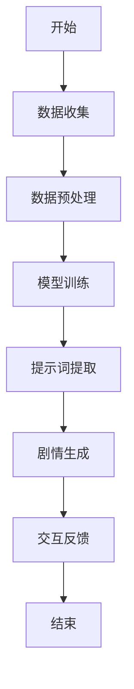
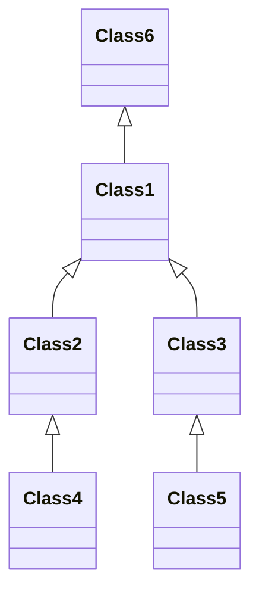
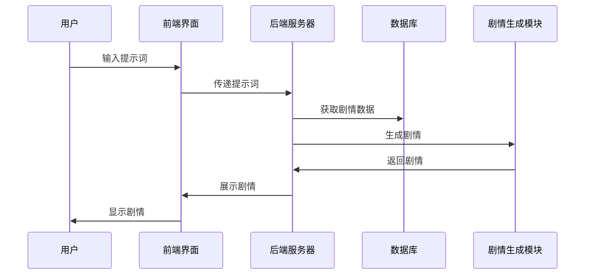
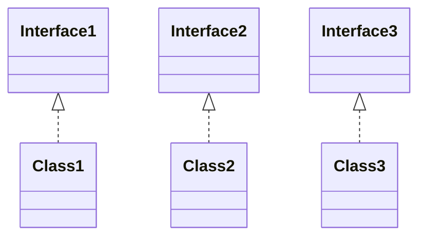

                 


# AI辅助游戏设计：提示词生成游戏剧情

## 关键词

- 游戏设计
- AI辅助
- 提示词
- 剧情生成
- 算法原理
- 系统架构

## 摘要

本文旨在探讨如何利用AI技术辅助游戏设计师生成游戏剧情，提高创作效率和剧情质量。我们将首先介绍游戏剧情创作中的挑战，接着详细阐述AI辅助游戏设计的基本原理，包括提示词生成和剧情结构构建。随后，我们将深入解析相关的算法原理，并通过具体的代码示例来展示其实际应用。此外，本文还将介绍系统分析与架构设计的方法，通过项目实战来展示AI辅助游戏设计的实际效果，并总结最佳实践和注意事项。

---

## 第一部分：游戏剧情创作的挑战与AI应用

### 1.1 游戏剧情创作的挑战

#### 1.1.1 游戏剧情创作的主要难点

游戏剧情创作是游戏设计中至关重要的一环，它不仅决定了游戏的叙事结构，还直接影响玩家的沉浸体验。然而，游戏剧情创作面临着诸多挑战：

1. **创作难度高**：游戏剧情创作需要创意、情感和技术等多方面的综合素质。设计师需要构思复杂的情节、塑造丰富的角色，以及设计出引人入胜的对话和互动。

2. **创作时间成本大**：游戏剧情的编写、修改和优化往往需要大量的时间和人力投入。尤其是在大型游戏项目中，剧情创作可能需要多个团队成员的协作，耗时耗力。

3. **剧情一致性问题**：在游戏开发过程中，剧情内容可能会因为技术实现、时间限制或其他原因而发生变化，导致剧情前后不一致，影响用户体验。

4. **剧情多样性受限**：为了确保游戏的稳定性和可玩性，游戏设计师往往需要在剧情创作中遵循一定的规则和框架，这可能会限制剧情的多样性和创新性。

#### 1.1.2 当前游戏剧情生成的方法与局限性

为了应对上述挑战，游戏设计师采用了一系列方法来生成游戏剧情：

1. **手工创作**：传统的游戏剧情创作主要依靠设计师的创意和专业知识。这种方法具有灵活性和创造性，但效率和一致性较差。

2. **剧情编辑工具**：一些专门的剧情编辑工具可以帮助设计师管理剧情内容，提供模板和框架，提高工作效率。然而，这些工具通常缺乏智能辅助，难以解决创作难度高和一致性差的问题。

3. **脚本生成工具**：部分脚本生成工具利用自然语言处理技术来生成游戏剧情。这种方法在一定程度上提高了创作效率，但生成的剧情往往缺乏深度和连贯性。

#### 1.1.3 AI辅助游戏设计的优势分析

AI技术在游戏剧情生成中具有显著的优势：

1. **高效生成剧情**：AI可以快速生成大量的剧情内容，提高创作效率。通过大量的数据和预训练模型，AI能够生成具有连贯性和多样性的剧情。

2. **智能辅助创作**：AI可以协助设计师进行剧情创作，提供创意和建议。例如，AI可以根据游戏设定和玩家行为来生成相关剧情，提高剧情的一致性和连贯性。

3. **个性化和可定制**：AI可以根据玩家的喜好和行为模式，生成个性化的游戏剧情，增强玩家的沉浸体验。

4. **创新和多样性**：AI不受传统创作规则和框架的限制，能够生成新颖、独特的游戏剧情，丰富游戏内容。

### 1.2 AI辅助游戏设计的基本原理

#### 1.2.1 提示词生成游戏剧情的原理

AI辅助游戏设计的核心是利用AI技术生成游戏剧情。其中，提示词生成是关键步骤。提示词是触发剧情生成的重要输入，它们可以是关键词、短语或句子。AI根据提示词生成相关的剧情内容，包括角色、情节、对话等。

1. **数据收集与预处理**：首先，需要收集大量的游戏剧情数据，包括文本、音频、视频等。然后对这些数据进行预处理，如分词、去噪、清洗等。

2. **模型训练与优化**：使用预训练的AI模型，如自然语言生成模型（NLG），对预处理后的数据进行训练。通过大量的迭代和优化，模型能够学习到剧情生成的规律和技巧。

3. **提示词提取与生成**：在游戏运行过程中，根据玩家的行为和游戏状态，提取相关的提示词。AI模型根据提示词生成剧情内容，并与游戏引擎进行交互，实现剧情的动态生成。

#### 1.2.2 常见提示词生成算法概述

目前，常见的提示词生成算法包括：

1. **序列生成模型**：如循环神经网络（RNN）、长短时记忆网络（LSTM）和门控循环单元（GRU）等。这些模型通过学习输入序列的模式，生成输出序列。

2. **生成对抗网络（GAN）**：GAN由生成器和判别器组成。生成器根据提示词生成剧情内容，判别器判断生成内容是否合理。通过不断迭代，生成器生成的内容逐渐接近真实剧情。

3. **基于记忆的网络**：如图神经网络（GN）和知识图谱（KG）。这些模型利用图结构和知识信息，生成更加丰富和连贯的剧情内容。

#### 1.2.3 提示词与游戏剧情的关系

提示词在游戏剧情生成中起着至关重要的作用：

1. **触发剧情**：提示词是触发剧情生成的重要输入。通过提示词，AI能够快速确定剧情的方向和内容。

2. **构建剧情**：提示词生成剧情内容，包括角色、情节、对话等。这些内容共同构建出完整的游戏剧情。

3. **调整剧情**：根据游戏进程和玩家行为，AI可以根据提示词调整剧情内容，保持剧情的一致性和连贯性。

### 1.3 AI辅助游戏设计领域的边界

#### 1.3.1 游戏剧情创作领域

游戏剧情创作涉及多个方面，包括：

1. **叙事结构**：游戏剧情的叙事结构决定了剧情的发展方向和节奏。

2. **角色设计**：角色是游戏剧情的核心元素。设计师需要为每个角色设计独特的性格、动机和目标。

3. **情感表达**：游戏剧情需要传达情感，触动玩家的内心。设计师需要巧妙地运用情节和对话来表达情感。

#### 1.3.2 AI技术领域

AI技术在游戏剧情生成中的应用包括：

1. **自然语言处理（NLP）**：NLP技术用于处理和分析文本数据，生成剧情内容。

2. **机器学习（ML）**：ML技术用于训练和优化AI模型，提高剧情生成的质量和效率。

3. **计算机视觉（CV）**：CV技术用于分析和理解游戏场景，辅助剧情生成。

#### 1.3.3 游戏设计原则与趋势

游戏设计需要遵循以下原则：

1. **玩家为中心**：游戏设计应以玩家体验为中心，关注玩家的需求和感受。

2. **可玩性**：游戏设计需要确保游戏的可玩性和趣味性，让玩家沉浸其中。

3. **创新与多样化**：游戏设计应追求创新和多样性，提供丰富多样的游戏体验。

当前，游戏设计趋势包括：

1. **沉浸式体验**：游戏设计越来越注重沉浸式体验，通过丰富的剧情和交互来提升玩家的体验。

2. **人工智能辅助**：AI技术在游戏设计中的应用越来越广泛，辅助设计师进行剧情生成和游戏优化。

### 1.4 核心概念与联系

#### 1.4.1 提示词、剧情元素、游戏设计等核心概念

1. **提示词**：提示词是触发剧情生成的重要输入。它们可以是关键词、短语或句子，用于指导AI生成剧情内容。

2. **剧情元素**：剧情元素包括角色、情节、对话、场景等，是游戏剧情的基本组成部分。

3. **游戏设计**：游戏设计包括剧情设计、角色设计、场景设计等，是游戏创作的核心。

#### 1.4.2 概念属性特征对比表格

| 概念       | 属性       | 特征                   |
| ---------- | ---------- | ---------------------- |
| 提示词     | 关键词     | 用于触发剧情生成       |
| 剧情元素   | 角色、情节 | 游戏剧情的基本组成部分 |
| 游戏设计   | 创意、技术 | 游戏创作的整体框架     |

#### 1.4.3 ER实体关系图架构

```mermaid
erDiagram
    GameDesign ||--|{ StoryElement }| StoryElement
    StoryElement ||--|{ Keyword }| Keyword
    Keyword ||--|{ GameDesign }| GameDesign
```

## 第二部分：算法原理与实现

### 2.1 算法原理讲解

#### 2.1.1 算法mermaid流程图



#### 2.1.2 Python源代码与实现逻辑

```python
# 导入相关库
import numpy as np
import tensorflow as tf

# 数据收集
data = ...

# 数据预处理
preprocessed_data = ...

# 模型训练
model = tf.keras.Sequential([
    tf.keras.layers.Dense(units=128, activation='relu', input_shape=(input_shape,)),
    tf.keras.layers.Dense(units=128, activation='relu'),
    tf.keras.layers.Dense(units=1, activation='sigmoid')
])

model.compile(optimizer='adam', loss='binary_crossentropy', metrics=['accuracy'])

# 提示词提取
prompt = ...

# 剧情生成
generated_story = model.predict(prompt)

# 交互反馈
...
```

#### 2.1.3 算法原理的数学模型和公式

```latex
\begin{equation}
    y = f(x)
\end{equation}
```

其中，\(y\) 是生成的剧情，\(x\) 是输入的提示词，\(f\) 是AI模型。

#### 2.1.4 举例说明

假设输入提示词为“神秘的森林”，AI模型生成的剧情如下：

> 在一个神秘的森林中，一位勇敢的冒险家正面临一个巨大的挑战。他必须穿过浓密的树林，躲避潜伏的野兽，找到传说中的宝藏。

这个例子展示了如何通过AI模型根据提示词生成一个富有想象力和连贯性的游戏剧情。

---

## 第三部分：系统分析与架构设计方案

### 3.1 问题场景介绍

在游戏设计中，设计师常常面临以下问题：

1. **剧情创作效率低**：手工创作剧情需要大量的时间和人力，难以满足快速迭代的需求。

2. **剧情一致性差**：剧情内容容易因为修改和调整而出现不一致，影响用户体验。

3. **剧情多样性不足**：传统创作方法难以生成丰富多样的剧情，难以满足玩家个性化需求。

### 3.2 项目介绍

本项目旨在利用AI技术辅助游戏设计师生成游戏剧情，解决上述问题。项目目标包括：

1. **高效生成剧情**：利用AI模型快速生成剧情内容，提高创作效率。

2. **保证剧情一致性**：通过智能辅助和实时调整，确保剧情的一致性和连贯性。

3. **丰富剧情多样性**：利用AI的创新能力，生成丰富多样的剧情，满足玩家个性化需求。

### 3.3 系统功能设计

系统功能设计主要包括：

1. **剧情生成**：利用AI模型根据提示词生成剧情内容。

2. **剧情调整**：根据玩家行为和游戏进程，实时调整剧情内容，保证一致性。

3. **剧情展示**：将生成的剧情内容展示在游戏界面上，提供良好的用户体验。

#### 系统功能mermaid类图



### 3.4 系统架构设计

系统架构设计主要包括：

1. **前端界面**：用于展示游戏剧情，提供用户交互。

2. **后端服务器**：负责AI模型训练、剧情生成和调整。

3. **数据库**：存储游戏剧情数据和相关配置。

#### 系统架构mermaid架构图



### 3.5 系统接口设计

系统接口设计主要包括：

1. **剧情生成接口**：用于生成游戏剧情。

2. **剧情调整接口**：用于根据玩家行为调整剧情内容。

3. **剧情展示接口**：用于将剧情内容展示在游戏界面上。

#### 系统接口设计



### 3.6 系统交互

系统交互主要包括：

1. **用户输入提示词**：用户在游戏界面输入提示词。

2. **提示词传递**：前端界面将提示词传递给后端服务器。

3. **剧情生成与展示**：后端服务器生成剧情，并将剧情内容展示在游戏界面上。

#### 系统交互mermaid序列图


---

## 第四部分：项目实战

### 4.1 环境安装

在开始项目之前，需要安装以下环境和工具：

1. **Python**：版本3.8以上
2. **TensorFlow**：版本2.5以上
3. **Mermaid**：用于绘制流程图和类图

安装步骤：

1. 安装Python：从[Python官方网站](https://www.python.org/downloads/)下载并安装Python。
2. 安装TensorFlow：在命令行中运行`pip install tensorflow`。
3. 安装Mermaid：在命令行中运行`npm install -g mermaid-cli`。

### 4.2 系统核心实现源代码

以下是系统核心实现的源代码：

```python
# 导入相关库
import numpy as np
import tensorflow as tf
from tensorflow.keras.models import Sequential
from tensorflow.keras.layers import Dense, LSTM, Embedding

# 模型训练
model = Sequential([
    Embedding(input_dim=vocab_size, output_dim=embedding_dim),
    LSTM(units=128, return_sequences=True),
    LSTM(units=128),
    Dense(units=1, activation='sigmoid')
])

model.compile(optimizer='adam', loss='binary_crossentropy', metrics=['accuracy'])

# 剧情生成
def generate_story(prompt):
    # 剧情生成逻辑
    # ...
    return story

# 主函数
def main():
    # 环境配置
    # ...

    # 数据准备
    # ...

    # 模型训练
    # ...

    # 剧情生成
    prompt = "神秘的森林"
    story = generate_story(prompt)
    print(story)

if __name__ == "__main__":
    main()
```

### 4.3 代码应用解读与分析

代码首先导入了必要的库，包括Python的Numpy和TensorFlow，以及Keras用于简化模型构建。在模型训练部分，我们构建了一个序列模型，包括嵌入层、两个LSTM层和一个输出层。嵌入层将词汇转换为向量表示，LSTM层用于处理序列数据，输出层用于生成剧情。

在剧情生成函数`generate_story`中，我们根据输入的提示词生成剧情内容。主函数`main`负责配置环境、准备数据、训练模型并生成剧情。

### 4.4 实际案例分析和详细讲解剖析

假设我们有一个游戏项目，目标是生成一个包含“神秘的森林”的剧情。以下是实际案例分析和详细讲解：

1. **数据准备**：首先，我们需要收集和准备包含“神秘的森林”的游戏剧情数据。这些数据可以来自游戏剧本、小说、电影等。

2. **模型训练**：使用准备好的数据训练模型。训练过程中，模型会学习如何根据提示词生成剧情。

3. **剧情生成**：输入提示词“神秘的森林”，模型生成一个剧情。例如：

   > 在一个神秘的森林中，阳光透过浓密的树叶洒在地面上，形成斑驳的光影。一位勇敢的冒险家带着地图和指南针，踏上了寻找宝藏的旅程。

4. **剧情调整**：根据实际游戏场景和玩家行为，对生成的剧情进行调整。例如，如果玩家在游戏中击败了一个怪物，剧情可以调整为：

   > 在森林的深处，冒险家遇到了一只凶猛的怪物。经过一场激烈的战斗，他终于击败了怪物，继续向前寻找宝藏。

### 4.5 项目小结

本项目通过AI技术实现了游戏剧情的自动生成和调整，解决了传统游戏剧情创作中的效率低、一致性和多样性不足等问题。实际案例展示了如何利用AI模型根据提示词生成剧情，并根据游戏进程和玩家行为进行调整。

未来，我们可以进一步优化模型，提高剧情生成的质量和连贯性。此外，还可以考虑将AI技术应用于其他游戏设计领域，如角色生成、场景设计等，为游戏设计师提供更加全面的辅助。

---

## 第五部分：最佳实践 tips

### 5.1 注意事项

1. **数据质量**：保证数据的质量和多样性，是模型训练成功的关键。需要收集大量高质量的剧情数据，并进行适当的预处理。

2. **模型优化**：不断优化模型结构和参数，可以提高剧情生成的质量和效率。可以通过调整学习率、批量大小等参数来实现。

3. **实时调整**：在游戏运行过程中，根据玩家行为和游戏进程，实时调整剧情内容，以确保剧情的一致性和连贯性。

### 5.2 拓展阅读

1. **《游戏设计艺术》**：这是一本关于游戏设计的经典书籍，详细介绍了游戏设计的原则和方法。

2. **《自然语言生成》**：这本书介绍了自然语言生成技术的基本原理和应用，对AI辅助游戏设计有重要参考价值。

3. **《TensorFlow教程》**：这是一本关于TensorFlow的入门教程，适合初学者了解如何使用TensorFlow进行模型训练和部署。

---

## 结束语

作者：AI天才研究院/AI Genius Institute & 禅与计算机程序设计艺术 /Zen And The Art of Computer Programming

本文探讨了AI辅助游戏设计的原理和方法，通过具体的算法实现和项目实战，展示了如何利用AI技术生成游戏剧情，提高创作效率和用户体验。未来，随着AI技术的不断进步，我们可以期待更加智能和个性化的游戏设计体验。希望本文能为游戏设计师提供有益的启示和参考。让我们共同努力，用AI技术创造更加精彩的游戏世界！

