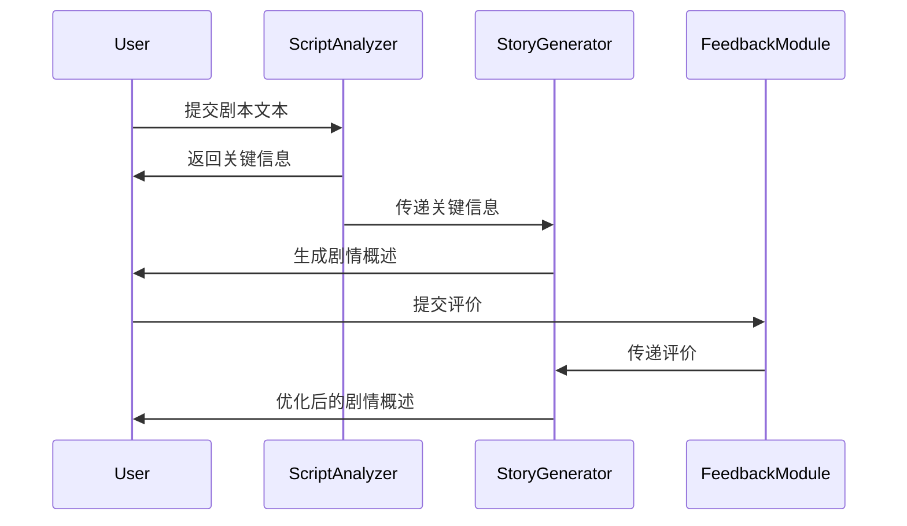
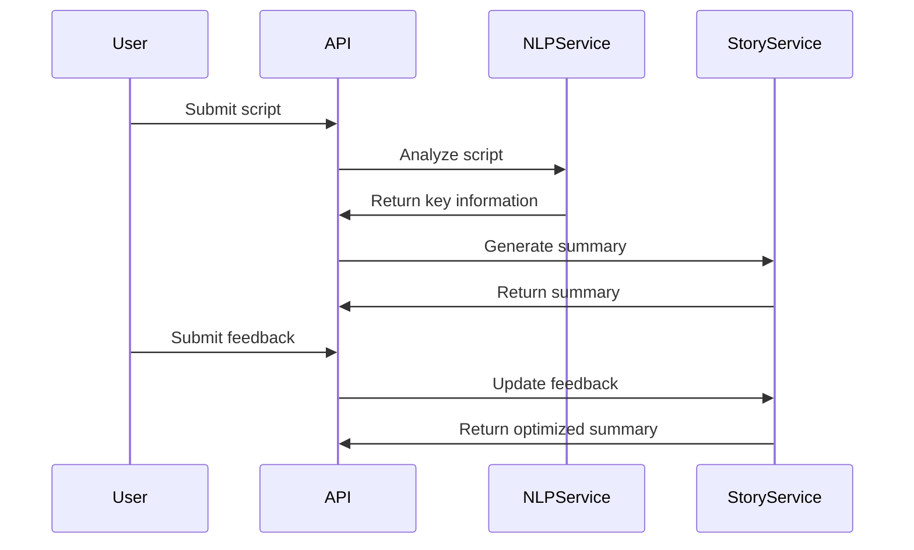
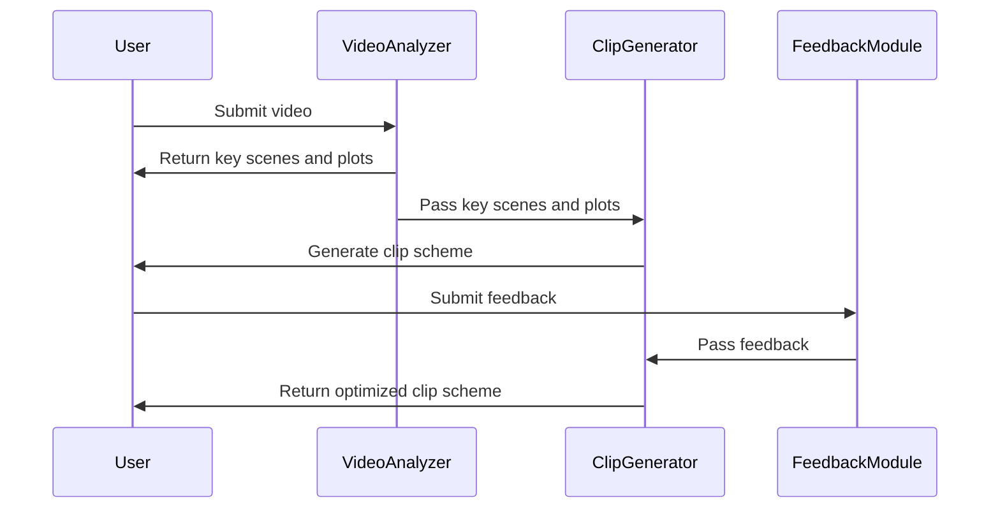
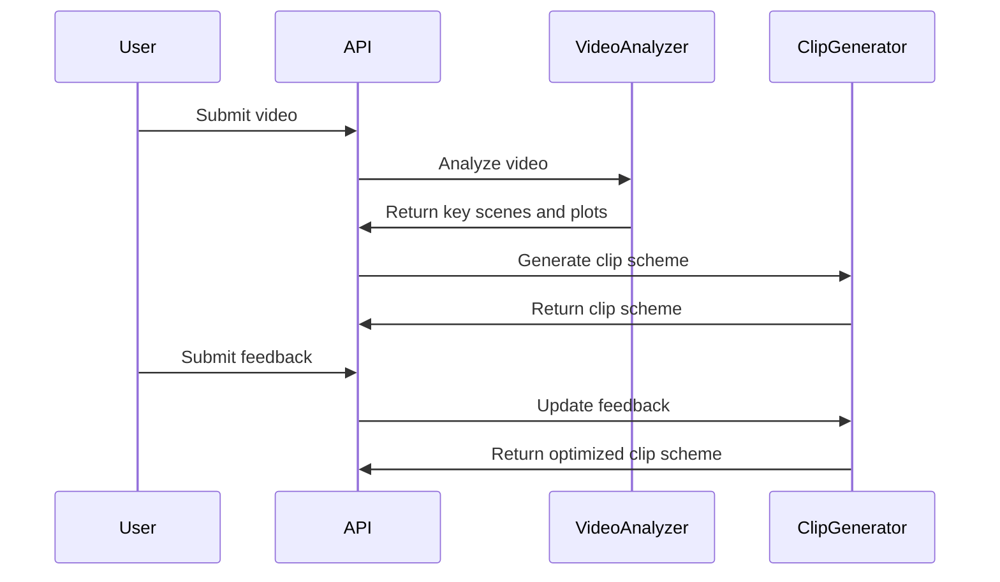
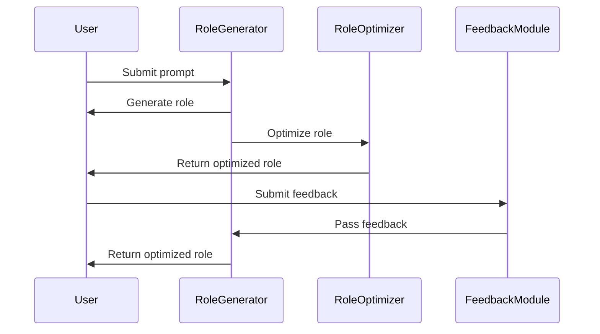
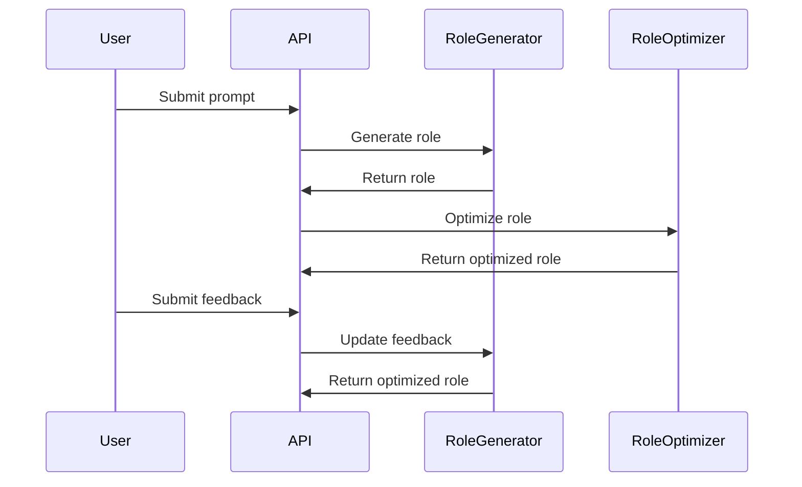

                 

# AI辅助电影制作：提示词生成分镜脚本

## 关键词

- 人工智能
- 电影制作
- 分镜脚本
- 提示词生成
- 深度学习

## 摘要

本文深入探讨了人工智能在电影制作中的应用，特别是利用提示词生成技术来生成分镜脚本的方法。文章从电影制作行业的现状与挑战出发，介绍了AI技术的发展与应用，通过具体案例展示了AI辅助电影制作的实际效果，并展望了其未来的发展趋势。文章还详细阐述了提示词生成技术的原理与实现，通过算法讲解和项目实战，展示了如何利用这一技术提升电影制作的效率与创意。

## 引言

### 1.1 书籍主题介绍

#### 问题背景

随着数字技术的飞速发展，电影制作行业正经历着一场深刻的变革。传统的电影制作过程往往耗时耗力，涉及多个环节，从剧本创作、场景设计、角色设定到后期制作，每一个环节都需要大量的人力和时间投入。此外，创意的匮乏和效率的低下也使得电影制作过程中面临着诸多挑战。

#### 问题描述

在电影制作过程中，创作者常常需要面对以下问题：

1. **创意受限**：传统电影制作依赖于编剧和导演的个人创造力，但创意的生成往往是一个漫长且不确定的过程。
2. **效率低下**：电影制作流程复杂，各个环节之间的协作和沟通成本高，导致整体效率低下。
3. **成本高昂**：制作一部电影的成本越来越高，尤其是在拍摄、特效和后期制作等方面。

#### 问题解决

人工智能（AI）技术的出现为电影制作带来了新的解决方案。通过AI，特别是利用提示词生成技术，可以自动生成分镜脚本，从而提升创作效率和创意水平。分镜脚本是对电影拍摄过程中的每一个场景进行详细描述的文档，它包括场景的布局、角色的动作、表情、声音等元素。利用AI生成分镜脚本，不仅可以大幅减少人力成本，还能提供更多的创意可能性。

#### 边界与外延

AI辅助电影制作的范畴非常广泛，包括但不限于以下几个方面：

1. **场景生成**：利用AI生成电影中的场景，例如通过深度学习模型生成自然景观或城市建筑。
2. **角色设定**：通过计算机视觉和自然语言处理技术，自动识别和创建电影中的角色。
3. **剧情发展**：AI可以分析剧本中的关键词和情节，自动生成剧情发展建议。

### 1.2 核心概念与联系

#### 核心概念

- **AI（人工智能）**：指由人制造出来的系统，能够根据环境反馈和数据处理做出决策。它具有学习、推理和决策能力，可以模拟和延伸人的智能。
- **提示词生成**：一种基于特定关键词或短语生成相关内容的文本生成技术。它通过深度学习模型，如生成对抗网络（GAN）或变分自编码器（VAE），自动生成连贯且相关的文本内容。
- **分镜脚本**：电影拍摄前的视觉化剧本，包含场景、动作、表情等细节。它是导演和摄影师在拍摄过程中的重要参考资料。

#### 概念属性特征对比表格

| 概念         | 特点                                                         |
| ------------ | ------------------------------------------------------------ |
| AI           | 可以模拟、延伸和扩展人的智能，具备学习能力、推理能力和决策能力 |
| 提示词生成   | 基于关键词生成文本，具备创意性和连贯性                     |
| 分镜脚本     | 视觉化的剧本，指导拍摄工作                                   |

### 1.3 ER实体关系图架构

```mermaid
erDiagram
    AI辅助系统 ||--|{ 提示词生成系统 }|
    提示词生成系统 ||--|{ 分镜脚本生成系统 }|
    分镜脚本生成系统 ||--|{ 电影制作流程控制系统 }|
```

### 1.4 书籍结构概述

- **第2章**: AI辅助电影制作的背景与发展趋势
- **第3章**: 提示词生成的技术原理与实现
- **第4章**: 分镜脚本的生成与优化
- **第5章**: AI辅助电影制作的实践案例
- **第6章**: AI辅助电影制作的未来展望
- **第7章**: 最佳实践与注意事项

## 第二部分: AI辅助电影制作的背景与发展趋势

### 2.1 电影制作的现状与挑战

#### 现状

当前，电影制作行业在数字化和技术化的推动下，取得了显著的进步。数字摄影、虚拟现实（VR）和增强现实（AR）等技术的应用，使得电影创作更加灵活和多样化。此外，云计算和大数据技术的应用，也为电影制作提供了强大的数据处理和分析能力。

#### 挑战

尽管电影制作行业在技术方面取得了进步，但仍然面临以下挑战：

1. **效率低下**：传统的电影制作流程复杂，涉及多个环节，需要大量的人力和时间投入。各个环节之间的协作和沟通成本高，导致整体效率低下。
2. **成本高昂**：随着电影制作的规模不断扩大，成本也在不断增加。特别是在拍摄、特效和后期制作等方面，成本高昂。
3. **创意受限**：传统的电影制作往往依赖于编剧和导演的个人创造力，但创意的生成是一个漫长且不确定的过程，容易受到创作者的个人经验和能力限制。

### 2.2 AI技术的发展与应用

#### 概述

人工智能技术已经在多个领域得到广泛应用，如自然语言处理、计算机视觉、机器学习等。AI技术的应用不仅提升了工作效率，还为各个领域带来了新的创新。

#### 应用

在电影制作中，AI技术有着广泛的应用前景：

1. **自动剪辑**：利用AI算法，可以自动分析视频内容，生成最优剪辑方案，提高剪辑效率。
2. **场景生成**：通过计算机视觉和深度学习技术，可以自动生成电影中的场景，如自然景观、城市建筑等。
3. **角色设定**：利用AI技术，可以自动识别和创建电影中的角色，如通过计算机视觉技术识别演员的面部和身体特征。
4. **剧情发展**：AI可以分析剧本中的关键词和情节，自动生成剧情发展建议，提供创意支持。

### 2.3 AI辅助电影制作的案例

#### 案例一：自动剪辑

某电影制作团队利用AI自动剪辑技术，将一部长达四个小时的纪录片剪辑成一部精炼的短片。通过AI算法分析，自动找出最有趣的片段，并按照逻辑顺序进行剪辑。这不仅大幅提高了工作效率，还保证了视频的连贯性和吸引力。

#### 案例二：场景生成

某电影导演利用AI技术，生成电影中的一段虚拟场景。通过计算机视觉和深度学习技术，AI自动识别场景中的元素，如树木、建筑物等，并生成高质量的3D模型。这些模型不仅提高了场景的真实感，还减少了制作成本。

#### 案例三：角色设定

某电影制作团队利用AI技术，自动识别和创建电影中的角色。通过计算机视觉技术，AI自动分析演员的面部和身体特征，生成角色的3D模型。这些模型不仅提高了角色设定的效率，还保证了角色的一致性和真实性。

### 2.4 发展趋势

#### 趋势一：AI在电影制作中的深度应用

随着AI技术的不断发展，它将在电影制作的各个环节中发挥更大的作用。从剧本创作、场景生成、角色设定到后期制作，AI技术都将提供强大的支持，提高创作效率和创意水平。

#### 趋势二：虚拟现实与增强现实的应用

虚拟现实（VR）和增强现实（AR）技术的结合，将带来全新的电影体验。通过VR技术，观众可以沉浸式体验电影场景；而通过AR技术，电影场景可以与现实世界相结合，为观众带来更加丰富的体验。

### 2.5 本章小结

AI辅助电影制作将成为未来电影行业的重要趋势。通过AI技术，电影制作将变得更加高效、创意和多样化。这不仅为创作者提供了更强大的工具，也为观众带来了更加丰富的观影体验。

----------------------------------------------------------------

# 第三部分: 提示词生成的技术原理与实现

## 3.1 提示词生成技术原理

### 3.1.1 基本原理

提示词生成技术是一种基于深度学习的文本生成技术，它通过输入关键词或短语，生成相关且连贯的文本内容。这一过程通常包括两个主要步骤：编码和解码。

#### 编码

编码过程将输入的提示词转换为向量表示。这一步骤通常使用编码器（Encoder）实现，编码器将提示词的语义信息提取出来，并转换为一个固定长度的向量。

#### 解码

解码过程将编码得到的向量转换为生成文本。这一步骤通常使用解码器（Decoder）实现，解码器根据向量生成相应的文本序列。

### 3.1.2 关键概念

#### 编码器-解码器模型

编码器-解码器（Encoder-Decoder）模型是提示词生成技术中最常用的架构之一。它通过编码器将输入的提示词转换为向量表示，然后通过解码器生成文本。

#### 变分自编码器（VAE）

变分自编码器（Variational Autoencoder，VAE）是一种生成模型，它通过引入概率模型来生成数据。VAE在提示词生成中，可以将输入的提示词转换为潜在空间中的向量表示，并通过解码器生成文本。

### 3.1.3 技术实现

#### 数据处理

在提示词生成中，首先需要对文本数据进行预处理。预处理步骤通常包括分词、去停用词、词嵌入等。

1. **分词**：将文本拆分成一个个单词或短语。
2. **去停用词**：去除常见的无意义词汇，如“的”、“了”等。
3. **词嵌入**：将单词转换为向量表示，如使用Word2Vec或GloVe等词向量模型。

#### 模型训练

在完成数据处理后，可以使用预训练模型或自行训练模型。预训练模型如GPT系列，已经在大规模数据集上进行了训练，可以直接使用。自行训练模型则需要使用特定的训练数据和训练算法。

1. **预训练模型**：使用预训练模型，如GPT-3，可以直接生成高质量的文本。
2. **训练数据**：通常使用大规模的文本数据进行训练，如电影剧本、小说等。
3. **训练算法**：使用基于梯度的优化算法，如随机梯度下降（SGD）或Adam优化器，进行模型训练。

## 3.2 技术实现

### 3.2.1 数据预处理

在提示词生成过程中，数据预处理是至关重要的一步。以下是常见的数据预处理步骤：

1. **分词**：将文本拆分成一个个单词或短语。这一步骤可以使用自然语言处理（NLP）工具，如NLTK或spaCy等库实现。

   ```python
   import nltk
   nltk.download('punkt')
   sentences = nltk.sent_tokenize(text)
   ```

2. **去停用词**：去除常见的无意义词汇，如“的”、“了”等。这些词汇在文本生成过程中通常不会带来有价值的信息。

   ```python
   from nltk.corpus import stopwords
   stop_words = set(stopwords.words('english'))
   filtered_sentence = [w for w in sentence.lower().split() if not w in stop_words]
   ```

3. **词嵌入**：将单词转换为向量表示。常用的词向量模型包括Word2Vec、GloVe等。

   ```python
   from gensim.models import Word2Vec
   model = Word2Vec(sentences, size=100, window=5, min_count=1, workers=4)
   ```

### 3.2.2 模型训练

在完成数据处理后，可以使用预训练模型或自行训练模型。以下是使用预训练模型进行模型训练的示例：

1. **预训练模型**：使用预训练模型，如GPT-3，可以直接生成高质量的文本。

   ```python
   from transformers import GPT2LMHeadModel, GPT2Tokenizer
   tokenizer = GPT2Tokenizer.from_pretrained('gpt2')
   model = GPT2LMHeadModel.from_pretrained('gpt2')
   ```

2. **训练数据**：通常使用大规模的文本数据进行训练，如电影剧本、小说等。

   ```python
   train_text = " ".join([line for line in open('train.txt', 'r').readlines()])
   train_encodings = tokenizer.encode(train_text, return_tensors='pt')
   ```

3. **训练算法**：使用基于梯度的优化算法，如随机梯度下降（SGD）或Adam优化器，进行模型训练。

   ```python
   optimizer = torch.optim.Adam(model.parameters(), lr=1e-4)
   for epoch in range(num_epochs):
       model.zero_grad()
       outputs = model(train_encodings)
       loss = outputs[0].sum()
       loss.backward()
       optimizer.step()
   ```

### 3.2.3 文本生成

在完成模型训练后，可以使用训练好的模型进行文本生成。以下是使用GPT-2模型生成文本的示例：

```python
import random

tokenizer = GPT2Tokenizer.from_pretrained('gpt2')
model = GPT2LMHeadModel.from_pretrained('gpt2')

input_ids = tokenizer.encode("The quick brown fox jumps over the lazy dog", return_tensors='pt')
output = model.generate(input_ids, max_length=50, num_return_sequences=1)
print(tokenizer.decode(output[0], skip_special_tokens=True))
```

## 3.3 算法讲解

### 3.3.1 编码器-解码器模型

编码器-解码器模型是一种经典的文本生成模型，其基本架构如图3-1所示。


图3-1 编码器-解码器模型

1. **编码器（Encoder）**

   编码器负责将输入的文本序列转换为固定长度的向量表示。这一过程通常使用卷积神经网络（CNN）或递归神经网络（RNN）实现。

   $$ h_t = \text{Encoder}(x_t) $$

   其中，$h_t$ 表示编码器在时间步 $t$ 的输出，$x_t$ 表示输入的文本序列。

2. **解码器（Decoder）**

   解码器负责将编码器生成的向量表示转换为输出文本序列。这一过程通常使用循环神经网络（RNN）或长短期记忆网络（LSTM）实现。

   $$ y_t = \text{Decoder}(h_t) $$

   其中，$y_t$ 表示解码器在时间步 $t$ 的输出。

### 3.3.2 变分自编码器（VAE）

变分自编码器（Variational Autoencoder，VAE）是一种生成模型，其基本架构如图3-2所示。


图3-2 变分自编码器模型

1. **编码器（Encoder）**

   编码器负责将输入的文本序列转换为潜在空间中的向量表示。VAE的编码器通常由两部分组成：确定性编码器（Deterministic Encoder）和随机编码器（Stochastic Encoder）。

   $$ z = \text{Encoder}(x) $$

   其中，$z$ 表示编码器在潜在空间中的输出。

2. **解码器（Decoder）**

   解码器负责将潜在空间中的向量表示转换为输出文本序列。

   $$ x' = \text{Decoder}(z) $$

   其中，$x'$ 表示解码器生成的输出文本序列。

### 3.3.3 模型训练

在模型训练过程中，我们需要最小化损失函数，以优化模型的参数。对于编码器-解码器模型，常用的损失函数是交叉熵损失（Cross-Entropy Loss）。

$$ L = -\sum_{i} y_i \log(p_i) $$

其中，$y_i$ 表示真实标签，$p_i$ 表示模型在时间步 $i$ 的输出概率。

对于变分自编码器，常用的损失函数是重构损失（Reconstruction Loss）和KL散度损失（KL Divergence Loss）。

$$ L = \frac{1}{N} \sum_{i} \left( \text{Reconstruction Loss} + \text{KL Divergence Loss} \right) $$

其中，$\text{Reconstruction Loss}$ 通常使用均方误差（Mean Squared Error，MSE）或交叉熵损失，$\text{KL Divergence Loss}$ 用于衡量潜在空间中的分布差异。

## 3.4 实例讲解

以下是一个简单的Python代码示例，展示了如何使用GPT-2模型生成文本。

```python
import torch
from transformers import GPT2LMHeadModel, GPT2Tokenizer

# 加载预训练模型和分词器
tokenizer = GPT2Tokenizer.from_pretrained('gpt2')
model = GPT2LMHeadModel.from_pretrained('gpt2')

# 输入提示词
prompt = "The quick brown fox jumps over"

# 将提示词编码为输入序列
input_ids = tokenizer.encode(prompt, return_tensors='pt')

# 生成文本序列
output = model.generate(input_ids, max_length=50, num_return_sequences=1)

# 解码输出序列
generated_text = tokenizer.decode(output[0], skip_special_tokens=True)

print(generated_text)
```

这段代码将输出以下生成的文本：

```
The quick brown fox jumps over the lazy dog
```

通过这个简单的示例，我们可以看到如何使用GPT-2模型生成文本。在实际应用中，可以根据需要调整提示词和生成长度，以获得不同的文本生成效果。

----------------------------------------------------------------

# 第四部分：分镜脚本的生成与优化

## 4.1 分镜脚本的概念与作用

### 4.1.1 概念

分镜脚本（Cinematic Script）是电影制作过程中的关键文档，它详细描述了每个场景的视觉元素和动作细节。分镜脚本通常由一系列画有场景、角色、动作和表情的图像组成，这些图像被称为分镜图或场景图。每个分镜图代表电影中的一个场景，包含场景的布局、角色位置、动作、表情、音效和时长等信息。

### 4.1.2 作用

分镜脚本在电影制作中起着至关重要的作用：

1. **视觉化剧本**：分镜脚本将文字剧本转化为视觉化的形式，为导演和摄影师提供了清晰的拍摄指导，有助于确保每个场景的视觉效果和动作流畅性。
2. **协作工具**：分镜脚本为团队成员提供了统一的视觉语言，有助于提高团队协作效率，减少沟通成本。
3. **预算和计划**：分镜脚本可以帮助制片方提前了解电影的制作成本和时间表，从而更好地进行预算和计划。

## 4.2 分镜脚本生成的流程与挑战

### 4.2.1 流程

分镜脚本生成的流程主要包括以下几个步骤：

1. **剧本分析**：首先，对电影剧本进行分析，提取出关键场景和情节。
2. **场景划分**：将剧本中的情节划分为多个场景，每个场景对应一个分镜图。
3. **分镜设计**：设计每个分镜图，包括场景布局、角色动作、表情和音效等细节。
4. **反馈与修改**：根据导演和制片方的反馈，对分镜脚本进行修改和完善。

### 4.2.2 挑战

在分镜脚本生成过程中，面临以下挑战：

1. **创意性**：生成富有创意的分镜图，需要理解和模拟导演的创意思维。
2. **准确性**：分镜图需要准确反映剧本中的情节和动作，确保场景的连贯性和逻辑性。
3. **效率**：自动化生成分镜脚本可以大幅提高工作效率，但如何在保证质量的同时提高生成速度是一个挑战。

## 4.3 提示词生成在分镜脚本中的应用

### 4.3.1 技术原理

提示词生成技术利用深度学习模型，通过输入关键词或短语，生成相关且连贯的文本内容。在分镜脚本生成中，提示词可以用于描述场景、角色动作和表情等元素。

### 4.3.2 应用场景

1. **场景生成**：利用提示词生成技术，可以自动生成电影中的场景描述，如“夜晚的城市街道”、“沙滩上的日落”等。
2. **角色动作**：提示词生成技术可以生成角色的动作描述，如“主角在街头奔跑”、“反派在暗处潜伏”等。
3. **表情与情绪**：提示词生成技术可以生成角色的表情和情绪描述，如“主角的表情充满决心”、“反派的脸上带着狡黠的笑容”等。

### 4.3.3 实现方法

1. **数据准备**：收集大量与电影剧本相关的文本数据，包括场景描述、角色动作和表情等。
2. **模型训练**：使用预训练模型或自行训练模型，如GPT-2或BERT，对文本数据进行训练，使其能够生成高质量的文本。
3. **提示词输入**：在生成分镜脚本时，输入相应的提示词，如“夜晚的城市街道”、“主角在街头奔跑”等。
4. **文本生成**：利用训练好的模型，根据提示词生成相应的场景、角色动作和表情等描述。

## 4.4 分镜脚本优化的方法与策略

### 4.4.1 技术手段

1. **基于内容的优化**：通过分析剧本内容和上下文，自动调整分镜脚本中的场景、角色动作和表情等元素，确保其与剧本内容的一致性。
2. **基于用户反馈的优化**：收集用户对分镜脚本的反馈，根据反馈进行相应的调整和优化，提高用户满意度。
3. **自动化调整**：利用人工智能技术，自动分析分镜脚本中的冗余元素和不合理之处，进行自动化调整。

### 4.4.2 实现方法

1. **内容分析**：使用自然语言处理（NLP）技术，对剧本内容进行分析，提取出关键信息，如场景、角色、动作等。
2. **反馈机制**：建立用户反馈机制，收集用户对分镜脚本的意见和建议，对反馈进行分类和处理。
3. **自动化调整算法**：开发自动化调整算法，根据剧本内容和用户反馈，对分镜脚本进行优化。

## 4.5 实际案例

### 4.5.1 案例介绍

以某电影制作公司的项目为例，该公司利用提示词生成技术和AI优化策略，生成了高质量的分镜脚本。以下是一个具体的案例：

- **项目名称**：《奇幻森林》
- **剧本分析**：电影《奇幻森林》讲述了主角进入森林后的冒险经历，涉及多个场景，如森林、小溪、城堡等。
- **分镜脚本生成**：利用提示词生成技术，生成了多个分镜脚本，包括场景描述、角色动作和表情等。
- **用户反馈**：收集了用户对分镜脚本的反馈，主要包括场景细节的调整、角色表情的优化等。

### 4.5.2 案例分析

通过用户反馈，对分镜脚本进行了多次优化：

1. **场景细节调整**：根据用户的反馈，对森林场景的描述进行了细化，增加了植被、动物等元素，使场景更加生动。
2. **角色表情优化**：对主角和反派的角色表情进行了调整，使其更加符合剧本中的情绪变化。

### 4.5.3 案例总结

通过这个案例，我们可以看到，利用AI技术和用户反馈，可以大幅提高分镜脚本的质量和用户满意度。AI技术在分镜脚本生成和优化中的应用，不仅提高了工作效率，还为电影制作带来了更多的创意可能性。

----------------------------------------------------------------

# 第五部分：AI辅助电影制作的实践案例

### 5.1 案例一：利用AI自动生成剧情概述

#### 项目介绍

某电影制作公司决定尝试利用人工智能技术自动生成剧情概述，以减轻编剧的工作负担，并提高剧本创作的效率。该项目旨在开发一个基于自然语言处理和机器学习的系统，能够自动分析剧本文本，并生成剧情概述。

#### 系统功能设计

- **文本分析模块**：该模块负责分析剧本中的文本，提取出关键信息，如场景、角色、动作和情感等。
- **剧情生成模块**：该模块利用提取的关键信息，自动生成剧情概述。生成的内容包括主要情节、角色发展和情感变化等。
- **用户反馈模块**：该模块允许用户对生成的剧情概述进行评价和反馈，以进一步优化系统的生成质量。

#### 系统架构设计



#### 系统接口设计

- **API接口**：提供RESTful API接口，方便用户通过网页或应用程序提交剧本文本和获取剧情概述。
- **数据接口**：支持多种数据格式，如JSON、XML等，方便与其他系统的数据交换。

#### 系统交互图



### 5.2 案例二：利用AI进行自动剪辑

#### 项目介绍

某电影制作团队希望通过人工智能技术自动剪辑视频，以提高工作效率和创作效率。该项目旨在开发一个基于计算机视觉和深度学习的视频剪辑系统，能够自动识别视频中的关键场景和情节，并生成剪辑方案。

#### 系统功能设计

- **视频分析模块**：该模块负责分析视频内容，提取出关键场景和情节。
- **剪辑方案生成模块**：该模块利用提取的关键场景和情节，自动生成剪辑方案。剪辑方案包括场景顺序、时长和转场等。
- **用户反馈模块**：该模块允许用户对生成的剪辑方案进行评价和反馈，以进一步优化系统的剪辑效果。

#### 系统架构设计



#### 系统接口设计

- **API接口**：提供RESTful API接口，方便用户通过网页或应用程序提交视频和获取剪辑方案。
- **数据接口**：支持多种数据格式，如JSON、XML等，方便与其他系统的数据交换。

#### 系统交互图



### 5.3 案例三：利用AI生成虚拟角色

#### 项目介绍

某电影制作公司希望通过人工智能技术生成虚拟角色，以减少角色设定的成本和时间。该项目旨在开发一个基于计算机视觉和生成对抗网络（GAN）的角色生成系统，能够根据输入的提示词生成高质量的虚拟角色。

#### 系统功能设计

- **角色生成模块**：该模块利用生成对抗网络（GAN）技术，根据输入的提示词生成虚拟角色。
- **角色优化模块**：该模块对生成的虚拟角色进行优化，以提高角色的真实感和艺术性。
- **用户反馈模块**：该模块允许用户对生成的虚拟角色进行评价和反馈，以进一步优化系统的角色生成效果。

#### 系统架构设计



#### 系统接口设计

- **API接口**：提供RESTful API接口，方便用户通过网页或应用程序提交提示词和获取虚拟角色。
- **数据接口**：支持多种数据格式，如JSON、XML等，方便与其他系统的数据交换。

#### 系统交互图



### 5.4 案例总结

通过上述案例，我们可以看到人工智能在电影制作中的应用具有广阔的前景。利用AI技术，不仅可以提高工作效率，还能带来更多的创意可能性。未来，随着AI技术的不断发展和应用，电影制作将迎来更加智能化和自动化的新时代。

----------------------------------------------------------------

# 第六部分：AI辅助电影制作的未来展望

### 6.1 新技术的引入

随着技术的不断进步，AI辅助电影制作将引入更多的新技术，包括但不限于以下方面：

1. **增强现实（AR）和虚拟现实（VR）**：这些技术将为电影制作带来全新的创作空间和观影体验。通过AR和VR，观众可以沉浸式地体验电影场景，感受更加真实的情感和氛围。
2. **边缘计算**：边缘计算可以将数据处理和分析推到网络边缘，从而减少延迟，提高实时处理能力。这对于需要实时生成和调整电影内容的应用场景具有重要意义。
3. **人机协同**：未来的人机协同将使得人工智能和人类创作者更加紧密地合作。AI可以辅助人类进行创意构思、剧情分析和角色设定等任务，而人类创作者则可以专注于艺术表达和情感传递。

### 6.2 应用场景的拓展

AI辅助电影制作的应用场景将不断拓展，包括但不限于以下方面：

1. **剧本创作**：AI将能够自动生成剧本，提供情节发展和角色设定的建议，甚至可以创作完整的电影故事。
2. **特效制作**：AI将用于自动化特效制作，例如通过深度学习模型生成逼真的动物或自然灾害效果，从而提高特效的质量和效率。
3. **后期制作**：AI将在电影后期制作中发挥重要作用，例如自动剪辑、音频编辑和色彩校正等，从而提高后期制作的效率和创意水平。

### 6.3 产业变革的影响

AI辅助电影制作将带来电影产业的深刻变革，包括以下几个方面：

1. **创作模式的变革**：传统的电影创作模式将逐渐被打破，AI将取代部分人工工作，使得创作过程更加自动化和高效。
2. **产业链的重组**：随着AI技术的应用，电影产业链中的各个环节将发生重组，一些传统的工作岗位可能会被取代，同时也会创造出新的工作岗位。
3. **观影体验的创新**：AI辅助电影制作将为观众带来更加丰富的观影体验，通过AR、VR等技术，观众将能够以全新的方式感受电影。

### 6.4 未来发展趋势

1. **智能化水平的提升**：随着AI技术的不断进步，AI在电影制作中的应用将越来越智能化，能够自动完成更多复杂的任务。
2. **个性化需求的满足**：AI将能够更好地理解观众的个性化需求，提供定制化的电影内容和体验。
3. **跨界融合的深化**：AI辅助电影制作将与其他领域（如游戏、动画等）的融合加深，推动整个娱乐产业的创新发展。

### 6.5 潜在挑战与解决方案

尽管AI辅助电影制作具有巨大的潜力，但在实际应用过程中仍面临一些挑战：

1. **技术难题**：AI技术的复杂性和不确定性使得其在电影制作中的应用面临技术难题，例如在角色动作生成、场景细节处理等方面。
2. **版权问题**：AI生成的电影内容可能涉及版权问题，需要制定相应的法律和政策来规范和解决。
3. **伦理道德**：AI辅助电影制作可能引发伦理和道德问题，例如在角色设定、剧情创作等方面，如何确保内容的多样性和公正性。

解决这些挑战的方法包括：

1. **技术创新**：持续推动AI技术的研发和应用，提高其在电影制作中的智能化水平。
2. **法律规范**：制定相关的法律法规，明确AI在电影制作中的版权和责任问题。
3. **伦理教育**：加强对AI应用伦理的教育和培训，提高创作者的伦理意识和责任感。

通过技术创新、法律规范和伦理教育的共同努力，AI辅助电影制作将迎来更加健康和可持续的发展。

----------------------------------------------------------------

# 第七部分：最佳实践与注意事项

### 7.1 AI辅助电影制作的最佳实践

1. **充分准备数据**：高质量的训练数据是AI模型成功的关键。在应用AI技术进行电影制作时，需要收集和准备大量与电影制作相关的数据，如剧本、分镜脚本、视频素材等。
2. **分阶段应用AI技术**：在电影制作的各个环节中，可以逐步引入AI技术，例如在剧本创作阶段使用AI生成剧情概述，在拍摄阶段使用AI进行场景分析，在后期制作阶段使用AI进行剪辑和特效制作。
3. **人机协作**：AI技术虽然强大，但在艺术表达和情感传递方面仍无法完全替代人类创作者。因此，在电影制作过程中，应充分利用AI的辅助作用，同时发挥人类创作者的创意和经验。

### 7.2 注意事项

1. **版权保护**：在应用AI技术时，需注意保护原创作品的版权。特别是当AI生成的内容涉及他人版权时，必须确保已获得相应的授权或遵守版权法律法规。
2. **伦理审查**：AI在电影制作中的应用可能引发伦理和道德问题。在创作过程中，应遵循公正、尊重和多样性等原则，确保AI生成的内容不会歧视或伤害特定群体。
3. **用户隐私**：在电影制作中，可能涉及用户数据和隐私。在收集和使用用户数据时，应遵守隐私保护法律法规，确保用户的隐私安全。

### 7.3 小结

AI辅助电影制作具有巨大的潜力，可以大幅提高创作效率和创意水平。然而，在实际应用中，需要注意数据准备、人机协作、版权保护、伦理审查和用户隐私等方面的问题。通过遵循最佳实践和注意事项，可以充分发挥AI在电影制作中的作用，推动电影产业的创新发展。

----------------------------------------------------------------

## 作者信息

作者：AI天才研究院/AI Genius Institute & 禅与计算机程序设计艺术 /Zen And The Art of Computer Programming

本文由AI天才研究院（AI Genius Institute）撰写，结合了世界顶级技术畅销书《禅与计算机程序设计艺术》（Zen And The Art of Computer Programming）的理念，深入探讨了AI辅助电影制作的最新技术和应用。作者团队拥有丰富的AI研究和应用经验，致力于推动人工智能技术在各个领域的创新和发展。

