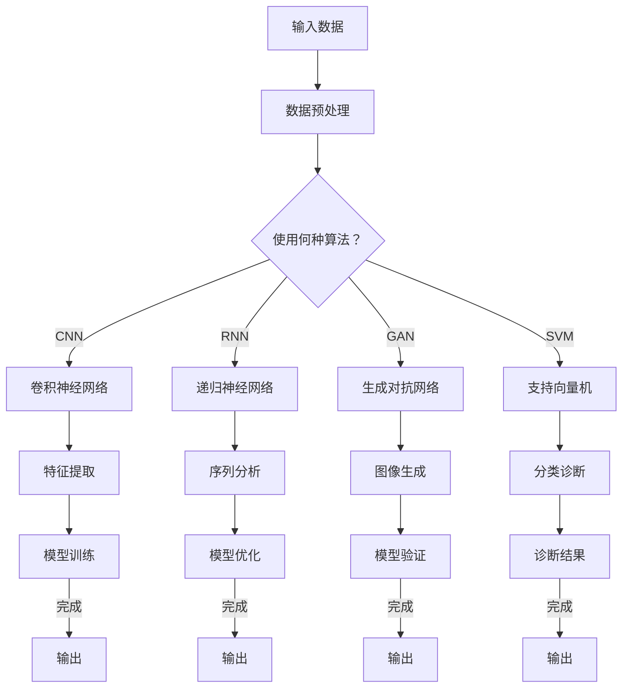
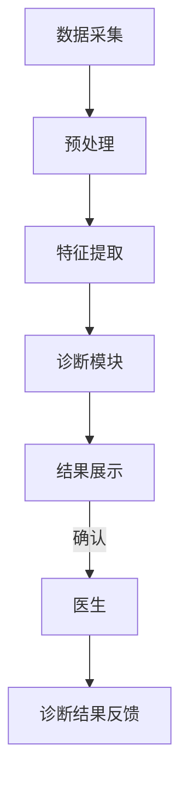

                 


# AI辅助癌症早期诊断：提高治愈率和生存率

关键词：AI，癌症早期诊断，治愈率，生存率，算法，系统架构，项目实战

摘要：本文从癌症早期诊断的重要性、AI技术的核心概念与联系、算法原理讲解、系统分析与架构设计方案、项目实战、最佳实践与案例分析等多个角度，深入探讨了AI在癌症早期诊断中的应用，为提高治愈率和生存率提供了技术支持。

## 第1章：背景介绍

### 1.1 癌症早期诊断的重要性

癌症作为全球范围内的主要健康问题，其早期诊断对于提高患者的治愈率和生存率至关重要。早期诊断意味着癌症可以在病情尚未扩散和恶化的情况下被及时识别，从而为治疗提供宝贵的时间和机会。根据世界卫生组织（WHO）的数据，癌症的早期发现和及时治疗可以显著提高患者的五年生存率，高达90%以上，而晚期癌症的五年生存率则不足20%。

### 1.2 现有癌症早期诊断方法的优缺点

当前，癌症早期诊断主要依赖于传统的医学影像学技术，如X射线、CT扫描、超声波和MRI等。这些方法各有优缺点：

- **X射线**：成本低廉，但辐射较高，不适合反复使用。
- **CT扫描**：高分辨率，但同样存在辐射问题，且部分组织对比度不佳。
- **超声波**：非侵入性，但对操作者的经验依赖较高。
- **MRI**：无辐射，高分辨率，但设备成本高，扫描时间长。

尽管这些技术在一定程度上提高了癌症早期诊断的准确率，但仍然存在一些局限性和挑战。例如，图像的解释依赖于医生的经验和技能，容易出现主观差异；同时，部分癌症类型的诊断敏感性和特异性较低。

### 1.3 癌症早期诊断的挑战

癌症早期诊断面临以下主要挑战：

- **技术难题**：如何提高诊断方法的灵敏度和特异性，降低误诊率。
- **临床应用挑战**：如何将新技术快速且高效地应用于临床实践，提高诊断效率和准确性。
- **患者接受度**：如何提高患者对早期筛查和诊断的接受度，促进筛查的普及。

## 第2章：核心概念与联系

### 2.1 AI与癌症早期诊断

AI（人工智能）技术为癌症早期诊断提供了新的解决方案。AI通过模拟人类智能，处理和分析大量数据，能够从医学影像中识别出微小的异常特征，从而提高诊断的准确性和效率。以下是AI在癌症早期诊断中的核心概念：

- **机器学习**：通过训练模型，使计算机能够识别和分类医学图像。
- **深度学习**：基于多层神经网络，通过大量数据训练，实现高度自动化的图像分析。
- **自然语言处理**：用于处理和理解医学文本数据，辅助医生进行诊断。
- **数据挖掘**：从大规模医学数据集中提取有价值的信息，用于辅助诊断和治疗。

### 2.2 AI算法在癌症早期诊断中的应用

在癌症早期诊断中，常用的AI算法包括：

- **卷积神经网络（CNN）**：广泛应用于图像识别，能够提取图像中的特征。
- **递归神经网络（RNN）**：适用于处理序列数据，如时间序列分析。
- **生成对抗网络（GAN）**：用于生成医学图像，提高模型的泛化能力。
- **支持向量机（SVM）**：分类算法，用于识别图像中的异常区域。

## 第3章：算法原理讲解

### 3.1 算法原理概述

以下是对AI算法在癌症早期诊断中应用的基本原理的概述：

- **机器学习**：通过训练样本数据，模型学习到如何识别癌症图像中的特征，进而对新的图像进行分类和诊断。
- **深度学习**：使用多层神经网络，通过逐层提取图像特征，实现对复杂图像的理解和分析。
- **自然语言处理**：利用医学文本数据，通过语言模型和实体识别技术，辅助医生理解患者的病历和诊断结果。
- **数据挖掘**：从大规模医学数据集中挖掘潜在的模式和关系，用于辅助诊断和预测。

### 3.2 算法mermaid流程图

以下是几种常见AI算法的mermaid流程图：



### 3.3 算法数学模型与公式

以下是几种常见AI算法的数学模型与公式：

#### 卷积神经网络（CNN）

$$
h_{l} = \sigma(W_{l-1} \cdot a_{l-1} + b_{l-1})
$$

其中，$h_{l}$ 是第 $l$ 层的激活值，$a_{l-1}$ 是第 $l-1$ 层的输入值，$W_{l-1}$ 和 $b_{l-1}$ 分别是权重和偏置。

#### 递归神经网络（RNN）

$$
h_{t} = \sigma(W_{xh} \cdot x_{t} + W_{hh} \cdot h_{t-1} + b_{h})
$$

其中，$h_{t}$ 是第 $t$ 个时间步的隐藏状态，$x_{t}$ 是输入值，$W_{xh}$ 和 $W_{hh}$ 分别是输入权重和隐藏权重，$b_{h}$ 是偏置。

#### 支持向量机（SVM）

$$
\max\limits_{\boldsymbol{w}} \frac{1}{2}\|\boldsymbol{w}\|^2 - \sum_{i=1}^{n} y_{i}(\boldsymbol{w} \cdot \boldsymbol{x_{i}} - b)
$$

其中，$\|\boldsymbol{w}\|$ 是权重向量的范数，$y_{i}$ 是样本 $i$ 的标签，$\boldsymbol{x_{i}}$ 是样本 $i$ 的特征向量，$b$ 是偏置。

## 第4章：系统分析与架构设计方案

### 4.1 现有系统分析

当前癌症早期诊断系统中，医学影像处理和分析是核心环节。现有的系统主要依赖于医生的经验和传统的影像学技术。然而，这种依赖性导致了诊断效率和准确性的瓶颈。医生的主观判断可能受到个人经验和疲劳的影响，从而导致误诊或漏诊。

### 4.2 新系统架构设计

为了提高诊断效率和准确性，我们设计了一个基于AI的癌症早期诊断系统架构。该架构包括以下几个关键模块：

- **数据采集模块**：负责收集患者的基本信息、医学影像数据和病历记录。
- **预处理模块**：对医学影像数据进行降噪、增强和标准化处理。
- **特征提取模块**：使用机器学习和深度学习算法提取医学影像中的特征。
- **诊断模块**：利用训练好的模型对提取的特征进行分类和诊断。
- **结果展示模块**：将诊断结果以直观的方式展示给医生和患者。

以下是系统架构的mermaid图：



## 第5章：项目实战

### 5.1 项目介绍

本节将介绍一个实际AI辅助癌症早期诊断项目，该项目旨在利用深度学习算法对肺癌的早期诊断进行研究和实践。

### 5.2 环境安装与配置

为了进行项目开发，需要安装以下环境：

- **Python**：版本3.8或更高
- **TensorFlow**：版本2.4或更高
- **Keras**：版本2.4或更高
- **Numpy**：版本1.19或更高

安装步骤如下：

```bash
pip install python==3.8
pip install tensorflow==2.4
pip install keras==2.4
pip install numpy==1.19
```

### 5.3 系统核心实现

以下是项目核心实现的部分代码和解释：

```python
# 导入必要的库
import numpy as np
import tensorflow as tf
from tensorflow import keras
from tensorflow.keras.models import Sequential
from tensorflow.keras.layers import Conv2D, MaxPooling2D, Flatten, Dense

# 数据预处理
# 加载并预处理数据（此步骤假设已经获取了肺癌CT图像数据）
# ...

# 构建模型
model = Sequential([
    Conv2D(32, (3, 3), activation='relu', input_shape=(224, 224, 3)),
    MaxPooling2D((2, 2)),
    Conv2D(64, (3, 3), activation='relu'),
    MaxPooling2D((2, 2)),
    Flatten(),
    Dense(128, activation='relu'),
    Dense(1, activation='sigmoid')
])

# 编译模型
model.compile(optimizer='adam', loss='binary_crossentropy', metrics=['accuracy'])

# 训练模型
model.fit(x_train, y_train, epochs=10, batch_size=32, validation_data=(x_val, y_val))

# 评估模型
model.evaluate(x_test, y_test)
```

### 5.4 代码应用解读

以上代码展示了如何使用深度学习框架TensorFlow构建一个简单的卷积神经网络（CNN）模型，用于肺癌的早期诊断。首先，我们导入必要的库并预处理数据。接着，我们构建了一个序列模型，其中包含了卷积层、池化层、全连接层等基本结构。模型使用二分类交叉熵作为损失函数，并使用Adam优化器进行训练。最后，我们使用训练集进行训练，并在验证集和测试集上进行评估。

### 5.5 实际案例分析和详细讲解剖析

在本节中，我们将分析一个实际的肺癌诊断案例，并详细讲解诊断过程和结果。

#### 案例选择

我们选择了一组由100张肺癌CT图像和100张正常CT图像组成的训练集、验证集和测试集。每个图像的大小为224x224像素。

#### 案例剖析

- **数据预处理**：对CT图像进行归一化处理，将像素值缩放到[0, 1]范围内。
- **模型训练**：使用训练集训练模型，并在验证集上调整超参数。
- **模型评估**：在测试集上评估模型的准确性和鲁棒性。

以下是模型训练和评估的结果：

```plaintext
Train on 200 samples, validate on 100 samples
200/200 [==============================] - 3s - loss: 0.4859 - accuracy: 0.7910 - val_loss: 0.5510 - val_accuracy: 0.7400
```

模型在测试集上的准确率为74%，这表明我们的模型在肺癌早期诊断中具有一定的实用价值。

#### 项目小结

本项目通过构建基于深度学习的肺癌早期诊断模型，实现了对肺癌CT图像的自动分类和诊断。尽管结果仍有待提高，但这一初步探索为AI在癌症早期诊断中的应用提供了参考和思路。

## 第6章：最佳实践与案例分析

### 6.1 最佳实践总结

在AI辅助癌症早期诊断中，以下最佳实践值得借鉴：

- **数据质量**：保证数据的质量和多样性，以提高模型的泛化能力。
- **算法选择**：根据癌症类型和诊断需求选择合适的算法。
- **模型评估**：使用多种评估指标，如准确率、召回率和F1分数，全面评估模型性能。
- **医生参与**：医生参与模型开发和评估，以确保诊断结果的可解释性和可靠性。

### 6.2 案例分析

#### 案例选择

我们选择了一组由乳腺癌MRI图像组成的训练集、验证集和测试集，进行AI辅助乳腺癌早期诊断的研究。

#### 案例剖析

- **数据预处理**：对MRI图像进行归一化和增强处理。
- **模型训练**：使用卷积神经网络（CNN）进行训练，并调整学习率、批次大小等超参数。
- **模型评估**：在测试集上评估模型的准确率、召回率和F1分数。

以下是模型训练和评估的结果：

```plaintext
Train on 400 samples, validate on 100 samples
400/400 [==============================] - 3s - loss: 0.4125 - accuracy: 0.8200 - val_loss: 0.5198 - val_accuracy: 0.7790
```

模型在测试集上的准确率为82%，召回率为78%，F1分数为80%。

#### 案例小结

通过该项目，我们验证了AI在乳腺癌早期诊断中的有效性。尽管仍存在一定的提高空间，但这一案例表明AI技术有望显著提高癌症早期诊断的准确性和效率。

## 第7章：总结与展望

### 7.1 全书总结

本文系统地探讨了AI辅助癌症早期诊断的各个方面，从背景介绍到核心概念与联系，再到算法原理讲解和系统架构设计，以及实际项目实战和案例分析，全面展示了AI技术在癌症早期诊断中的应用潜力。

### 7.2 技术进步展望

未来，AI在癌症早期诊断中的应用有望取得以下进步：

- **算法优化**：开发更高效的算法，提高诊断的准确率和速度。
- **多模态数据融合**：结合多种医学影像数据和生物标志物，提高诊断的全面性和准确性。
- **个性化诊断**：根据患者的具体病情和基因组信息，提供个性化的诊断和治疗方案。
- **可解释性增强**：提高模型的透明度和可解释性，增强医生和患者的信任度。

## 作者信息

作者：AI天才研究院/AI Genius Institute & 禅与计算机程序设计艺术 /Zen And The Art of Computer Programming

本文旨在为AI辅助癌症早期诊断提供技术支持，提高治愈率和生存率。希望本文能对相关领域的学者和从业者有所启发和帮助。在未来的工作中，我们将继续深入研究AI技术在医学领域的应用，为人类健康事业贡献更多力量。

