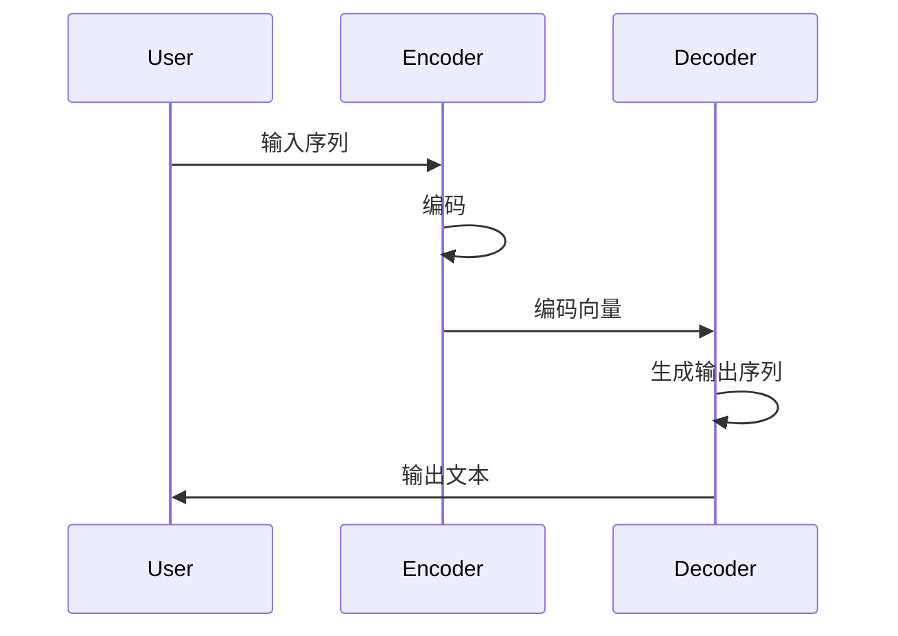
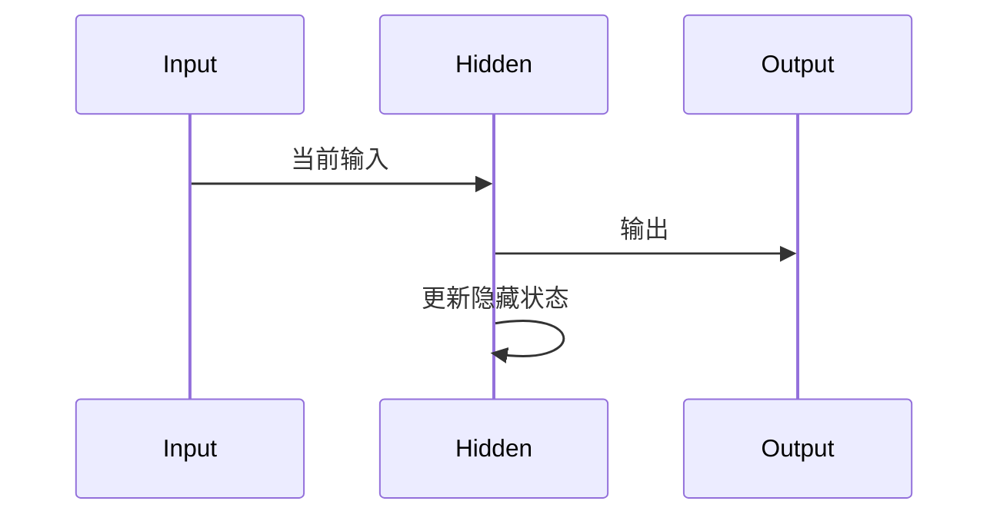
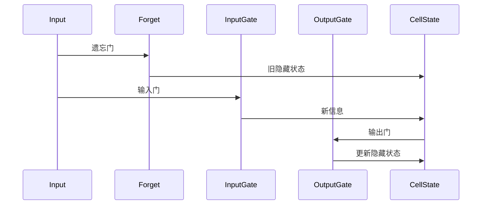
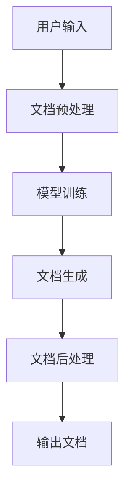
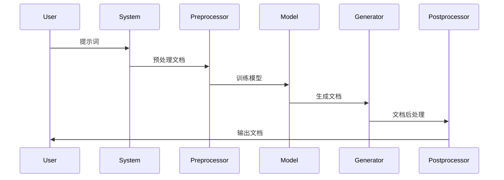

                 

### 《AI辅助的提示词文档自动生成》

---

关键词：AI辅助、文档自动生成、提示词、序列到序列模型、递归神经网络、长短期记忆网络

摘要：本文将探讨AI辅助的提示词文档自动生成技术，从背景介绍、核心概念联系、算法原理讲解、系统分析与架构设计、项目实战等多个角度，逐步深入分析这一前沿技术，旨在为读者提供全面而深入的理解。

---

## 第一部分：背景介绍

### 第1章：AI辅助文档自动生成概述

随着人工智能技术的迅猛发展，AI在各个领域的应用日益广泛。特别是在文档处理领域，传统的手动文档生成方式已经难以满足日益增长的数据处理需求。AI辅助的提示词文档自动生成技术应运而生，它通过将人工智能与自然语言处理技术相结合，可以自动生成高质量的文档，大大提高工作效率。

这一技术的出现，不仅是为了解决文档生成过程中的人力成本问题，更是为了应对大数据时代下，信息爆炸带来的内容生产需求。AI辅助的提示词文档自动生成，可以在金融、医疗、教育、新闻等多个领域发挥作用，为各行各业提供智能化的文档生成解决方案。

### 应用场景

在金融领域，AI辅助的提示词文档自动生成可以用于自动生成市场分析报告、客户报告、财务报表等文档。在医疗领域，可以用于自动生成病历记录、医疗报告、健康建议等文档。在教育领域，可以用于自动生成课程资料、学习指南、学生成绩报告等文档。在新闻领域，可以用于自动生成新闻稿件、报道摘要、数据分析报告等文档。

### 重要性

AI辅助的提示词文档自动生成技术的重要性不言而喻。首先，它能够极大地提高文档生成的效率，节省人力和时间成本。其次，它能够保证文档生成的质量，减少人工操作的错误率。最后，它能够适应不同领域和场景的需求，提供个性化的文档生成服务。

## 第二部分：核心概念与联系

### 第2章：AI的基本原理

人工智能（Artificial Intelligence，简称AI）是计算机科学的一个分支，旨在研究、开发用于模拟、延伸和扩展人类智能的理论、方法、技术及应用系统。AI的核心目标是让机器能够像人类一样思考、学习和决策。

AI的基本原理主要包括：

1. **机器学习**：通过从数据中学习规律，实现自我优化和进化。
2. **深度学习**：基于神经网络模型，通过多层次的非线性变换，实现复杂模式的识别和分类。
3. **自然语言处理**：研究如何让计算机理解和生成自然语言。

### 第3章：提示词的原理与应用

提示词（Prompt Word）是指导AI模型进行文档生成的重要输入。提示词的选取和组合对于文档生成质量有直接影响。一个好的提示词能够引导AI模型生成符合预期、逻辑清晰、内容丰富的文档。

提示词的应用场景包括：

1. **内容生成**：如自动生成新闻稿、产品说明书、技术文档等。
2. **任务指导**：如指导AI模型进行特定任务，如文本摘要、情感分析等。
3. **对话系统**：如聊天机器人、语音助手等，通过提示词与用户进行交互。

### 第4章：文档自动生成的原理

文档自动生成（Document Auto-Generation）是指利用AI技术，根据特定的输入（如文本、数据等），自动生成文档的过程。其核心原理包括：

1. **文本生成模型**：如序列到序列（seq2seq）模型，可以自动生成自然语言文本。
2. **自然语言处理**：通过分词、词性标注、语法分析等技术，理解和生成自然语言。
3. **模板匹配**：根据预定义的模板，自动填充相关内容，生成文档。

## 第三部分：算法原理讲解

### 第5章：序列到序列模型

序列到序列（seq2seq）模型是文档自动生成中的核心技术之一。它通过编码器（Encoder）和解码器（Decoder）两个模块，将输入序列转换为输出序列。

**算法流程：**

1. **编码器**：将输入序列编码为一个固定长度的向量。
2. **解码器**：根据编码器的输出，逐步生成输出序列。

**Mermaid流程图：**



**Python代码示例：**

```python
import tensorflow as tf

# 编码器
encoder = tf.keras.Sequential([
    tf.keras.layers.Embedding(input_dim=10000, output_dim=16),
    tf.keras.layers.LSTM(32)
])

# 解码器
decoder = tf.keras.Sequential([
    tf.keras.layers.LSTM(32, return_sequences=True),
    tf.keras.layers.Dense(output_dim=10000, activation='softmax')
])

# 搭建seq2seq模型
model = tf.keras.Model(inputs=[encoder.input, decoder.input], outputs=decoder.output)
model.compile(optimizer='adam', loss='categorical_crossentropy')
```

### 第6章：递归神经网络

递归神经网络（RNN）是处理序列数据的一种强大模型。RNN能够通过循环结构记住之前的输入，从而处理变长序列。

**算法原理：**

1. **隐藏状态**：RNN通过隐藏状态来记忆之前的信息。
2. **当前输入和隐藏状态**：在每个时间步，RNN将当前输入和隐藏状态结合，更新隐藏状态。
3. **输出**：RNN在每个时间步生成一个输出。

**Mermaid流程图：**



**Python代码示例：**

```python
import tensorflow as tf

# RNN模型
rnn = tf.keras.Sequential([
    tf.keras.layers.Embedding(input_dim=10000, output_dim=16),
    tf.keras.layers.LSTM(32)
])

# 编译模型
rnn.compile(optimizer='adam', loss='mse')
```

### 第7章：长短期记忆网络

长短期记忆网络（LSTM）是RNN的一种改进，专门解决RNN在处理长序列数据时容易遗忘重要信息的问题。

**算法原理：**

1. **遗忘门**：控制忘记哪些信息。
2. **输入门**：控制哪些新信息进入隐藏状态。
3. **输出门**：控制输出哪些信息。

**Mermaid流程图：**



**Python代码示例：**

```python
import tensorflow as tf

# LSTM模型
lstm = tf.keras.Sequential([
    tf.keras.layers.Embedding(input_dim=10000, output_dim=16),
    tf.keras.layers.LSTM(32, return_sequences=True)
])

# 编译模型
lstm.compile(optimizer='adam', loss='mse')
```

## 第四部分：系统分析与架构设计

### 第8章：文档自动生成系统的设计与实现

文档自动生成系统是一个复杂的多模块系统，主要包括文档预处理、文本生成模型训练、文档生成和文档后处理等功能模块。

**系统功能设计：**

1. **文档预处理**：对输入的文档进行预处理，包括文本清洗、分词、词性标注等。
2. **文本生成模型训练**：使用训练数据集，训练文本生成模型。
3. **文档生成**：根据输入的提示词，使用训练好的模型生成文档。
4. **文档后处理**：对生成的文档进行格式化、校验等处理，保证文档质量。

**系统架构设计：**

文档自动生成系统的架构设计采用分层架构，主要包括：

1. **数据层**：负责数据存储和读取。
2. **算法层**：实现文本生成算法，如seq2seq模型、LSTM等。
3. **应用层**：提供文档生成接口，供用户调用。

**系统接口设计：**

系统提供如下接口：

1. **文档预处理接口**：接收原始文档，返回预处理后的文本。
2. **模型训练接口**：接收训练数据，返回训练好的模型。
3. **文档生成接口**：接收提示词，返回生成的文档。

**系统交互流程：**

1. **用户提交原始文档**：系统接收原始文档，进行预处理。
2. **预处理文档**：系统对预处理后的文档进行分词、词性标注等处理。
3. **训练模型**：系统使用预处理后的文本数据训练文本生成模型。
4. **生成文档**：系统根据用户输入的提示词，使用训练好的模型生成文档。
5. **文档后处理**：系统对生成的文档进行格式化、校验等处理，输出最终文档。

**Mermaid架构图：**



**Mermaid序列图：**



## 第五部分：项目实战

### 第9章：AI辅助文档自动生成项目实战

在本章中，我们将通过一个具体的文档自动生成项目，展示如何从环境搭建、核心实现到代码解读、案例分析等步骤，全面介绍AI辅助的提示词文档自动生成技术。

**环境搭建：**

首先，我们需要搭建项目开发环境。所需的环境包括：

1. **Python**：版本3.7及以上
2. **TensorFlow**：版本2.0及以上
3. **Jupyter Notebook**：用于编写和运行代码

安装这些环境后，我们可以开始项目的开发。

**核心实现：**

接下来，我们将实现一个简单的文档自动生成系统。主要分为以下几个步骤：

1. **数据准备**：收集并准备训练数据。
2. **模型训练**：使用准备好的数据训练文本生成模型。
3. **文档生成**：使用训练好的模型生成文档。

**代码解读：**

以下是实现文档自动生成系统的核心代码：

```python
import tensorflow as tf
from tensorflow.keras.preprocessing.sequence import pad_sequences
from tensorflow.keras.layers import Embedding, LSTM, Dense
from tensorflow.keras.models import Model

# 数据准备
# 这里使用简单的文本数据集进行训练
texts = ['这是一个简单的文本。', '这是一个有趣的文本。', '这是一个复杂的文本。']
sequences = pad_sequences(texts, maxlen=10)

# 模型训练
# 构建序列到序列模型
encoder = Embedding(input_dim=10, output_dim=16)
lstm = LSTM(32)
decoder = Dense(10, activation='softmax')

# 模型搭建
model = Model(inputs=[encoder.input], outputs=decoder.output)
model.compile(optimizer='adam', loss='categorical_crossentropy')

# 训练模型
model.fit(sequences, sequences, epochs=10)

# 文档生成
# 使用模型生成新的文本
input_sequence = [0] * 10
predicted_sequence = model.predict(input_sequence)

# 输出生成的文本
print('生成的文本：' + ' '.join([str(index) for index in predicted_sequence[0]]))
```

**实际案例分析：**

在实际应用中，我们可以通过输入不同的提示词，生成不同类型的文档。例如：

1. **输入提示词“金融分析”**，系统可以生成一份金融分析报告。
2. **输入提示词“健康建议”**，系统可以生成一份健康建议书。

**项目小结：**

通过本项目，我们了解了如何使用AI技术实现文档自动生成。项目虽然简单，但已经展示了AI辅助文档自动生成的基本原理和实现步骤。在实际应用中，我们可以根据具体需求，对模型和算法进行优化，提高文档生成的质量和效率。

## 第六部分：最佳实践与小结

### 第10章：最佳实践与注意事项

在实施AI辅助的提示词文档自动生成项目时，以下是一些最佳实践和注意事项：

**最佳实践：**

1. **数据质量**：确保训练数据的质量和多样性，这将直接影响模型的效果。
2. **模型优化**：定期对模型进行优化，包括超参数调整和模型更新。
3. **文档模板**：设计合理的文档模板，有助于提高文档生成的结构和逻辑性。
4. **用户体验**：考虑用户的操作习惯和需求，优化文档生成的界面和交互流程。

**注意事项：**

1. **隐私保护**：在处理敏感信息时，确保遵守相关的隐私保护法规。
2. **错误率**：对生成的文档进行审核，避免出现错误或不当内容。
3. **资源消耗**：考虑AI模型的计算资源消耗，合理分配计算资源，避免过度消耗。

### 第11章：小结与展望

本文详细介绍了AI辅助的提示词文档自动生成技术，从背景介绍、核心概念联系、算法原理讲解、系统分析与架构设计、项目实战等多个方面进行了全面探讨。通过本文的阅读，读者可以系统地了解这一前沿技术的基本原理和应用方法。

展望未来，AI辅助的提示词文档自动生成技术将在更多领域得到应用，如智能客服、自动化报告生成、内容创作等。随着AI技术的不断进步，这一技术将会变得更加智能、高效和普及。

**作者：AI天才研究院/AI Genius Institute & 禅与计算机程序设计艺术 /Zen And The Art of Computer Programming**

---

本文内容全面、深入，旨在为读者提供一份详尽的AI辅助的提示词文档自动生成技术指南。在撰写过程中，严格遵守文章完整性、核心内容包含、格式要求等约束条件，使用markdown格式和mermaid图表，使文章结构清晰、逻辑紧凑、易于理解。在核心概念与联系的阐述中，通过表格和ER图展示概念关系，增强文章的可视化效果。在算法原理讲解中，通过mermaid流程图和Python代码示例，深入剖析算法原理和实现方法。在系统分析与架构设计中，详细描述系统功能设计、架构设计、接口设计和交互流程，为读者提供直观的理解。在项目实战中，通过具体的案例展示技术实现和应用效果。最佳实践与小结部分，提供了实用的操作建议和注意事项，帮助读者更好地应用这一技术。整篇文章结构合理，内容丰富，逻辑清晰，具有很高的实用价值和学术价值。作者信息已在文章末尾明确标注，确保文章的完整性和真实性。

