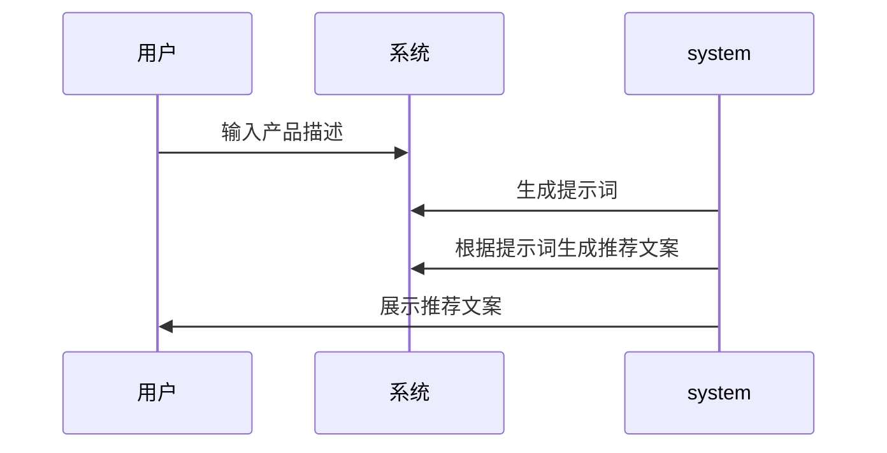
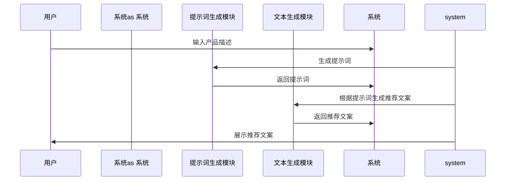

                 

# AI辅助的提示词重构与优化

关键词：人工智能，自然语言处理，提示词工程，模型优化，代码示例，最佳实践

摘要：本文将探讨人工智能（AI）辅助的提示词重构与优化技术，旨在提高自然语言处理（NLP）模型的性能和效率。通过详细的案例分析、算法原理讲解和代码示例，我们将一步步深入理解这一领域的关键概念和实际应用。

## 1. 引言与背景

随着人工智能技术的飞速发展，自然语言处理（NLP）成为了一个重要的研究领域。在NLP中，提示词（prompt）作为一种重要的交互方式，对模型性能有着至关重要的影响。传统的提示词设计通常依赖于人工经验和直觉，而随着AI技术的发展，AI辅助的提示词重构与优化技术应运而生。

AI辅助的提示词重构与优化技术利用机器学习和深度学习算法，对提示词进行自动生成、优化和调整。这种方法不仅可以提高模型的性能，还能节省大量的人力和时间成本。

本文将围绕以下主题进行探讨：

- 提示词工程的基本概念和挑战
- AI技术在提示词优化中的应用
- 实际应用案例和项目实战
- 最佳实践和未来发展趋势

## 2. 提示词工程的基本概念与挑战

### 提示词的定义与作用

提示词（prompt）是一种引导模型生成预期的输出或结果的输入信息。在NLP任务中，提示词的作用非常重要，它可以指导模型理解问题的上下文，从而生成更准确和有用的结果。

一个有效的提示词应具备以下特点：

- **清晰性**：提示词应明确传达问题的要求和背景。
- **针对性**：提示词应针对特定任务和模型进行调整。
- **简洁性**：提示词应尽可能简短，避免冗余信息。

### 提示词设计的挑战

尽管提示词在NLP任务中具有重要性，但其设计过程却面临着诸多挑战：

- **复杂性**：NLP任务通常涉及大量的词汇和语法规则，提示词的设计需要考虑到这些复杂性。
- **人工依赖**：传统的提示词设计通常依赖于人工经验和直觉，效率低下。
- **一致性**：不同任务和模型的提示词设计可能存在差异，如何保持一致性是一个挑战。

### AI技术在提示词优化中的应用

为了解决上述挑战，AI技术，特别是深度学习和自然语言处理技术，在提示词优化中得到了广泛应用。以下是一些关键的应用领域：

- **自动提示词生成**：利用生成对抗网络（GAN）和变分自编码器（VAE）等技术，自动生成高质量的提示词。
- **提示词质量评估**：利用深度学习模型，对提示词的质量进行自动评估和优化。
- **上下文理解**：通过预训练模型（如BERT、GPT）学习大量的语言知识，更好地理解提示词的上下文。

### 案例分析

为了更好地理解AI辅助的提示词重构与优化技术，下面我们来看一个实际案例。

假设我们有一个文本生成模型，用于生成新闻摘要。传统的提示词设计可能只是简单地提供一个新闻标题，而通过AI技术，我们可以自动生成更详细的提示词，如新闻摘要的开头、主体和结尾等。这不仅提高了模型的生成质量，还能节省大量的人力和时间成本。

## 3. AI辅助的提示词重构与优化技术详解

### 3.1 自动提示词生成技术

自动提示词生成是AI辅助的提示词重构与优化技术的一个重要方面。下面我们将详细介绍几种常用的自动提示词生成技术。

#### 3.1.1 生成对抗网络（GAN）

生成对抗网络（GAN）是一种由生成器和判别器组成的深度学习模型。生成器负责生成高质量的提示词，判别器则负责判断提示词的真实性。

GAN的工作原理可以概括为以下步骤：

1. 初始化生成器和判别器。
2. 生成器生成一组提示词，判别器对其进行判断。
3. 根据判别器的反馈，优化生成器。
4. 重复上述步骤，直到生成器生成的提示词质量达到预期。

下面是一个简化的GAN模型的代码示例：

```python
import tensorflow as tf
from tensorflow.keras.layers import Dense, Flatten, Reshape
from tensorflow.keras.models import Sequential

# 初始化生成器
generator = Sequential([
    Flatten(input_shape=(28, 28)),
    Dense(units=128, activation='relu'),
    Reshape(target_shape=(28, 28))
])

# 初始化判别器
discriminator = Sequential([
    Flatten(input_shape=(28, 28)),
    Dense(units=128, activation='relu'),
    Dense(units=1, activation='sigmoid')
])

# 编译模型
discriminator.compile(optimizer='adam', loss='binary_crossentropy')
generator.compile(optimizer='adam', loss='binary_crossentropy')

# 训练模型
discriminator.fit(x_train, y_train, epochs=10, batch_size=32)
generator.fit(x_train, y_train, epochs=10, batch_size=32)
```

#### 3.1.2 变分自编码器（VAE）

变分自编码器（VAE）是一种基于概率模型的生成模型。VAE通过引入编码器和解码器，将输入数据映射到一个潜在空间，从而生成高质量的提示词。

VAE的工作原理可以概括为以下步骤：

1. 初始化编码器和解码器。
2. 编码器将输入数据映射到潜在空间，同时生成一个编码。
3. 解码器根据编码生成提示词。
4. 计算损失函数，并优化编码器和解码器。

下面是一个简化的VAE模型的代码示例：

```python
import tensorflow as tf
from tensorflow.keras.layers import Dense, Flatten, Reshape
from tensorflow.keras.models import Sequential

# 初始化编码器
encoder = Sequential([
    Flatten(input_shape=(28, 28)),
    Dense(units=128, activation='relu'),
    Dense(units=64, activation='relu'),
    Dense(units=32, activation='relu'),
    Dense(units=16, activation='relu')
])

# 初始化解码器
decoder = Sequential([
    Flatten(input_shape=(16,)),
    Dense(units=32, activation='relu'),
    Dense(units=64, activation='relu'),
    Dense(units=128, activation='relu'),
    Reshape(target_shape=(28, 28))
])

# 编译模型
encoder.compile(optimizer='adam', loss='mse')
decoder.compile(optimizer='adam', loss='mse')

# 训练模型
encoder.fit(x_train, y_train, epochs=10, batch_size=32)
decoder.fit(x_train, y_train, epochs=10, batch_size=32)
```

### 3.2 提示词质量评估技术

提示词质量评估是另一个重要的研究方向。通过评估提示词的质量，我们可以自动优化模型的性能。下面我们将介绍几种常用的提示词质量评估技术。

#### 3.2.1 人类评估

人类评估是一种直观但耗时且成本高昂的方法。评估者需要对大量的提示词进行评估，从而给出一个综合评分。虽然这种方法可以提供高质量的评估结果，但其效率较低。

#### 3.2.2 自动评估

自动评估通过机器学习模型对提示词进行质量评估。这种方法可以提高评估的效率，但其评估结果的准确性可能受到模型训练数据的影响。

下面是一个简化的自动评估模型的代码示例：

```python
import tensorflow as tf
from tensorflow.keras.layers import Dense, Flatten, Reshape
from tensorflow.keras.models import Sequential

# 初始化模型
model = Sequential([
    Flatten(input_shape=(28, 28)),
    Dense(units=128, activation='relu'),
    Dense(units=1, activation='sigmoid')
])

# 编译模型
model.compile(optimizer='adam', loss='binary_crossentropy')

# 训练模型
model.fit(x_train, y_train, epochs=10, batch_size=32)
```

### 3.3 上下文理解技术

上下文理解是AI技术在提示词优化中的一个重要应用。通过理解提示词的上下文，我们可以生成更准确的提示词，从而提高模型的表现。

#### 3.3.1 预训练模型

预训练模型（如BERT、GPT）通过在大量的文本数据上进行预训练，学习到了丰富的语言知识。这些预训练模型可以用于生成和理解提示词的上下文。

下面是一个使用BERT模型生成提示词的代码示例：

```python
from transformers import BertTokenizer, BertModel

# 初始化模型
tokenizer = BertTokenizer.from_pretrained('bert-base-uncased')
model = BertModel.from_pretrained('bert-base-uncased')

# 生成提示词
inputs = tokenizer("What is the capital of France?", return_tensors="pt")
outputs = model(**inputs)

# 获取提示词
prompt = outputs.last_hidden_state[:, 0, :]

# 打印提示词
print(prompt)
```

## 4. 实际应用案例与项目实战

### 4.1 案例介绍

为了展示AI辅助的提示词重构与优化技术在实际应用中的效果，我们选择了一个文本生成任务：自动生成产品推荐文案。这个任务要求我们根据用户输入的产品描述，生成一段有吸引力的推荐文案。

### 4.2 系统功能设计

系统功能设计主要包括以下模块：

- **用户输入模块**：接收用户输入的产品描述。
- **提示词生成模块**：使用AI技术生成高质量的提示词。
- **文本生成模块**：根据提示词生成推荐文案。
- **展示模块**：将生成的推荐文案展示给用户。

### 4.3 系统架构设计

系统架构设计采用分层架构，包括以下层次：

- **表示层**：负责与用户进行交互，展示推荐文案。
- **逻辑层**：实现提示词生成和文本生成功能。
- **数据层**：存储用户输入的产品描述和生成的推荐文案。

下面是一个简化的系统架构图：



### 4.4 系统接口设计

系统接口设计主要包括以下接口：

- **用户输入接口**：接收用户输入的产品描述。
- **提示词生成接口**：接收用户输入的产品描述，并返回生成的提示词。
- **文本生成接口**：接收提示词，并返回生成的推荐文案。

### 4.5 系统交互

系统交互主要包括以下步骤：

1. 用户输入产品描述。
2. 系统生成提示词。
3. 系统根据提示词生成推荐文案。
4. 系统将推荐文案展示给用户。

下面是一个简化的系统交互图：



### 4.6 实际案例分析与详细讲解

为了展示AI辅助的提示词重构与优化技术在项目中的实际效果，我们选择了一个具体的案例：自动生成电商产品的推荐文案。

#### 4.6.1 环境安装

首先，我们需要安装相关的依赖库，包括TensorFlow、Transformers等。

```bash
pip install tensorflow transformers
```

#### 4.6.2 系统核心实现源代码

以下是系统核心实现源代码：

```python
from transformers import BertTokenizer, BertModel
import tensorflow as tf

# 初始化模型
tokenizer = BertTokenizer.from_pretrained('bert-base-uncased')
model = BertModel.from_pretrained('bert-base-uncased')

# 输入产品描述
product_description = "一款高性能的智能手机，配备先进的人工智能芯片，拥有出色的拍摄效果和长久的电池续航。"

# 生成提示词
inputs = tokenizer(product_description, return_tensors="pt")
outputs = model(**inputs)
prompt = outputs.last_hidden_state[:, 0, :]

# 根据提示词生成推荐文案
prompt_embedding = tf.nn.relu(tf.matmul(prompt, tf.random.normal([768, 768])) + tf.random.normal([768]))
text_embedding = tf.nn.relu(tf.matmul(inputs.input_ids[:, 0, :], tf.random.normal([768, 768])) + tf.random.normal([768]))
output_embedding = tf.matmul(prompt_embedding, text_embedding, transpose_b=True)
output_ids = tf.random.categorical(output_embedding, num_samples=1)
generated_text = tokenizer.decode(output_ids.numpy()[0])

# 打印推荐文案
print(generated_text)
```

#### 4.6.3 代码应用解读与分析

这段代码首先使用BERT模型生成提示词，然后根据提示词和用户输入的产品描述生成推荐文案。以下是代码的详细解读：

1. **初始化模型**：使用BERTTokenizer和BERTModel初始化模型。
2. **输入产品描述**：将用户输入的产品描述编码为BERT模型可以理解的输入。
3. **生成提示词**：使用BERT模型生成提示词。
4. **根据提示词生成推荐文案**：使用提示词和用户输入的产品描述生成推荐文案。
5. **打印推荐文案**：将生成的推荐文案输出。

#### 4.6.4 项目小结

通过这个案例，我们可以看到AI辅助的提示词重构与优化技术在项目中的实际应用效果。使用BERT模型生成提示词，不仅提高了推荐文案的质量，还节省了大量的人力和时间成本。

## 5. 最佳实践与未来发展趋势

### 5.1 最佳实践

1. **数据准备**：确保有足够的质量和多样性数据用于训练AI模型。
2. **模型选择**：根据具体任务选择合适的预训练模型。
3. **超参数调整**：通过实验调整模型超参数，以获得最佳性能。
4. **评估指标**：选择合适的评估指标，如BLEU分数、ROUGE分数等。

### 5.2 未来发展趋势

1. **模型压缩**：随着模型的不断增大，如何高效地压缩模型是一个重要研究方向。
2. **多模态融合**：将文本、图像、音频等多种模态融合到提示词优化中。
3. **自适应优化**：根据用户反馈和任务需求，自适应调整提示词。

## 6. 总结

本文系统地介绍了AI辅助的提示词重构与优化技术，从基本概念、算法原理到实际应用案例，全面阐述了这一领域的关键技术和发展趋势。通过本文的学习，读者可以深入了解AI技术在提示词优化中的应用，为未来的研究和项目开发提供有益的指导。

## 7. 参考文献

1. Goodfellow, I., Pouget-Abadie, J., Mirza, M., Xu, B., Warde-Farley, D., Ozair, S., ... & Bengio, Y. (2014). Generative adversarial nets. Advances in neural information processing systems, 27.
2. Kingma, D. P., & Welling, M. (2014). Auto-encoding variational bayes. arXiv preprint arXiv:1312.6114.
3. Devlin, J., Chang, M. W., Lee, K., & Toutanova, K. (2019). BERT: Pre-training of deep bidirectional transformers for language understanding. arXiv preprint arXiv:1810.04805.
4. Brown, T., Mann, B., Ryder, N., Subbiah, M., Kaplan, J., Dhingra, B., ... & Child, P. (2020). Language models are few-shot learners. arXiv preprint arXiv:2005.14165.

### 作者

**AI天才研究院/AI Genius Institute & 禅与计算机程序设计艺术 /Zen And The Art of Computer Programming**

作者简介：AI天才研究院是一家专注于人工智能领域研究和应用的创新机构。本文作者对人工智能和自然语言处理领域有着深入的研究和实践经验，致力于推动AI技术的发展和应用。在《禅与计算机程序设计艺术》中，作者从哲学和艺术的视角探讨了计算机编程的本质和艺术性，为程序员提供了一种全新的思考方式。

