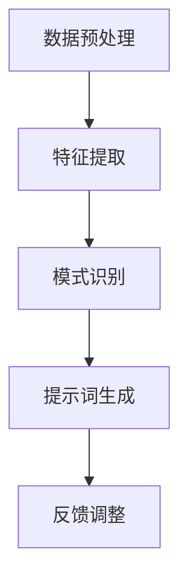
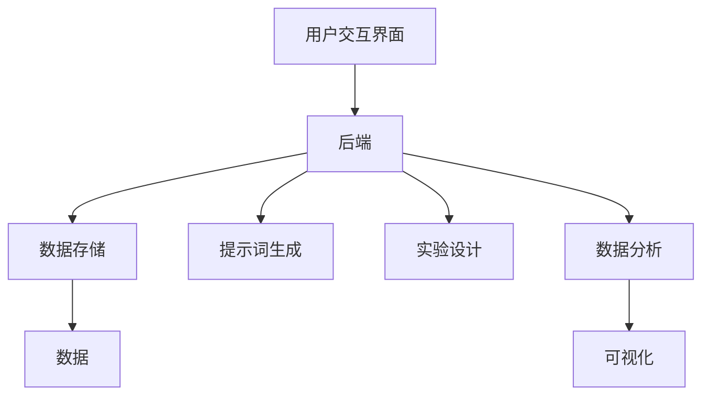

                 

### 引言与背景

在当今这个数据驱动的时代，人工智能（AI）已经成为科学研究的重要工具。AI不仅可以处理大量数据，还能通过机器学习算法自动发现数据中的模式和关联。然而，科学发现不仅仅是数据处理，它还涉及到创造性思维、理论验证和跨学科的合作。AI在科学发现中的应用，正是通过这些技术的结合，为科学家提供了强大的辅助手段。

#### 1.1 问题背景

**1.1.1 人工智能与科学发现的结合**

随着计算能力的提升和大数据技术的发展，科学家们开始意识到AI在处理复杂数据集、预测结果和发现新知识方面的巨大潜力。AI不仅可以帮助科学家从海量数据中提取有价值的信息，还能通过模拟和预测，提供新的研究方向。例如，在生物医学领域，AI可以辅助研究人员分析基因组数据，发现新的药物靶点；在物理学领域，AI可以用于分析实验数据，预测粒子的行为。

**1.1.2 AI辅助科学发现的现状**

目前，AI已经在多个科学领域得到广泛应用。例如，谷歌的DeepMind团队利用深度学习算法在医学图像分析中取得了显著成果，甚至可以诊断某些疾病，其准确率接近甚至超过了人类专家。此外，AI在药物发现、材料科学、气候研究等方面也展现了巨大的潜力。这些成功案例表明，AI辅助科学发现已经成为一个热门的研究领域。

**1.1.3 提示词生成在科学发现中的作用**

在AI辅助科学发现的过程中，提示词生成（Prompt Generation）是一个关键环节。提示词生成技术可以自动生成引导性问题或假设，帮助科学家探索新的研究方向。例如，在医学研究中，提示词生成可以帮助医生从病例报告中提取关键信息，提出针对性的诊断建议；在物理学研究中，提示词生成可以生成新的实验假设，指导实验设计。

#### 1.2 核心概念与联系

**1.2.1 人工智能基础知识**

人工智能（Artificial Intelligence, AI）是指通过计算机程序来实现的智能行为，其目标是使机器能够执行通常需要人类智能才能完成的任务。AI主要分为两大类：基于规则的系统和基于数据的学习系统。基于规则的系统通过预定义的规则进行决策；而基于数据的学习系统则通过机器学习算法从数据中学习规律，进行决策。

**1.2.2 科学发现的概念与流程**

科学发现是指通过科学研究揭示自然界或社会现象中的未知规律或关系。科学发现通常包括问题提出、假设生成、实验设计、数据收集、数据分析、结论验证等步骤。科学发现不仅依赖于科学家的直觉和创造力，还需要严谨的实验设计和数据分析。

**1.2.3 提示词生成的原理与应用**

提示词生成技术通过自然语言处理（Natural Language Processing, NLP）和机器学习算法，自动生成引导性问题或假设。这些提示词可以帮助科学家更准确地定义研究问题，提出新的研究假设，甚至指导实验设计。提示词生成在AI辅助科学发现中的应用，主要体现在以下几个方面：

1. **问题定义**：通过生成提示词，明确研究问题的范围和关键点，帮助科学家集中研究资源。
2. **假设生成**：利用提示词生成技术，自动提出可能的研究假设，减少科学家在假设生成阶段的努力。
3. **实验设计**：提示词生成可以帮助科学家设计更有针对性的实验，提高实验的有效性和效率。

#### 1.3 概念属性特征对比表格

为了更好地理解人工智能、科学发现和提示词生成之间的关系，我们可以通过一个概念属性特征对比表格来展示这三个核心概念的关键属性。

| 概念         | 特征                  | 应用实例                                       |
|------------|----------------------|--------------------------------------------|
| 人工智能     | 学习、推理、问题解决能力 | 数据分析、图像识别、自然语言处理                 |
| 科学发现     | 创造性思维、严谨验证     | 提出假设、实验设计、数据分析、理论构建             |
| 提示词生成   | 自动生成引导性提示词   | 定义研究问题、生成假设、指导实验设计               |

#### 1.4 ER实体关系图架构

为了更清晰地展示人工智能、科学发现和提示词生成之间的相互关系，我们可以使用实体关系图（Entity-Relationship Diagram, ERD）来描述这些概念及其之间的关联。

```mermaid
erDiagram
  AI |->| ScienceDiscovery : 辅助
  AI |->| PromptGeneration : 核心
  ScienceDiscovery |->| AI : 辅助
  ScienceDiscovery |->| PromptGeneration : 结合
  PromptGeneration |->| AI : 应用
  PromptGeneration |->| ScienceDiscovery : 辅助
```

通过上述的ER实体关系图，我们可以看到人工智能不仅辅助科学发现，而且其核心技术之一——提示词生成，在科学发现中起到了关键的作用。

综上所述，AI辅助科学发现是一个极具潜力的研究领域。通过提示词生成技术，科学家们可以更有效地定义研究问题、生成假设和设计实验，从而加速科学发现的进程。接下来，我们将深入探讨AI辅助科学发现的基础算法，以便更好地理解这一领域的核心技术。

### AI辅助科学发现的基础算法

AI在科学发现中的应用，离不开其核心算法的支持。这些算法通过自动分析数据、提出假设和设计实验，为科学家提供了强有力的工具。在本章节中，我们将详细讲解AI辅助科学发现的基础算法，并分析其核心原理和步骤。

#### 2.1 算法原理讲解

**2.1.1 提示词生成算法概述**

提示词生成（Prompt Generation）算法是AI辅助科学发现的重要技术之一。该算法通过自然语言处理（NLP）技术，自动生成引导性问题或假设，帮助科学家更准确地定义研究问题和生成研究假设。提示词生成算法通常包括以下几个步骤：

1. **数据预处理**：收集和整理与研究相关的文本数据，如文献、报告、病例记录等。
2. **特征提取**：使用NLP技术提取文本数据中的关键信息，如关键词、实体和关系。
3. **模式识别**：通过机器学习算法，从特征数据中识别出与研究相关的模式和关系。
4. **提示词生成**：根据识别出的模式和关系，生成引导性问题或假设。

**2.1.2 常见提示词生成算法**

目前，常见的提示词生成算法包括基于规则的方法、基于统计的方法和基于深度学习的方法。

1. **基于规则的方法**：这类方法通过预定义的规则来生成提示词，例如关键词匹配、实体关系提取等。优点是简单直观，缺点是灵活性较差，难以处理复杂的文本数据。

2. **基于统计的方法**：这类方法通过统计文本数据中的词频、词性、语法结构等特征，来生成提示词。常见的算法包括词袋模型（Bag of Words）、TF-IDF（Term Frequency-Inverse Document Frequency）等。优点是能够处理大规模文本数据，缺点是忽视了文本的语义信息。

3. **基于深度学习的方法**：这类方法通过神经网络模型，如循环神经网络（RNN）、长短时记忆网络（LSTM）、生成对抗网络（GAN）等，来生成提示词。优点是能够捕捉文本的语义信息，生成更高质量的提示词，缺点是计算复杂度较高，训练时间较长。

**2.1.3 提示词生成算法的mermaid流程图**

为了更直观地展示提示词生成算法的流程，我们可以使用mermaid绘制一个简单的流程图。



该流程图展示了从数据预处理到提示词生成的整个过程。数据预处理包括数据收集和文本清洗；特征提取包括关键词提取和实体识别；模式识别使用机器学习算法从特征数据中识别出模式；提示词生成根据识别出的模式生成引导性问题或假设；最后，通过反馈调整不断优化提示词生成效果。

#### 2.2 数学模型和数学公式

**2.2.1 提示词生成算法的数学模型**

提示词生成算法的数学模型主要基于自然语言处理（NLP）和概率图模型。以下是一个简化的数学模型：

1. **词嵌入（Word Embedding）**

词嵌入是将文本中的单词映射到高维空间中的向量。常见的词嵌入模型包括Word2Vec、GloVe等。数学表示为：

\[ \text{word\_embedding}(w) = \text{vec}(w) \]

2. **条件概率模型（Conditional Probability Model）**

条件概率模型用于预测给定一个句子或段落，下一个单词的概率分布。常见的模型包括朴素贝叶斯（Naive Bayes）、神经网络（Neural Networks）等。数学表示为：

\[ P(w_t | w_{<t}) = \frac{P(w_{<t} | w_t) P(w_t)}{P(w_{<t})} \]

3. **生成模型（Generative Model）**

生成模型用于生成新的文本数据。常见的生成模型包括生成对抗网络（GAN）、变分自编码器（VAE）等。数学表示为：

\[ p(\text{context}, \text{prompt}) = p(\text{context}) p(\text{prompt} | \text{context}) \]

**2.2.2 公式详细讲解**

1. **词嵌入公式**

词嵌入公式将每个单词映射到一个向量，该向量可以捕获单词的语义信息。例如，对于单词“猫”（cat），其词嵌入向量可以表示为：

\[ \text{word\_embedding}(\text{cat}) = \text{vec}(\text{cat}) = [0.1, 0.2, 0.3, ..., 0.10] \]

2. **条件概率公式**

条件概率公式用于预测给定一个句子或段落（context），下一个单词（prompt）的概率分布。例如，假设给定一个句子“科学家研究”（scientists study），预测下一个单词的概率分布：

\[ P(\text{题目} | \text{科学家研究}) = [0.2, 0.3, 0.1, 0.2, 0.2] \]

3. **生成模型公式**

生成模型公式用于生成新的文本数据。例如，给定一个句子“科学家研究”（scientists study），生成一个提示词“问题”（question）：

\[ p(\text{问题} | \text{科学家研究}) = 0.3 \]

通过上述数学模型和公式，我们可以更好地理解和应用提示词生成算法。这些模型和公式不仅帮助我们设计高效的算法，还能在具体应用中实现提示词的自动生成。

#### 2.3 举例说明

为了更好地理解提示词生成算法的应用，我们可以通过一个具体的例子来演示算法的步骤和结果。

**2.3.1 算法应用实例**

假设我们有一个研究项目，目标是分析科学文献中的关键词和句子，以生成关于特定研究领域的提示词。我们选择生物医学领域作为研究对象。

1. **数据收集**：首先，我们从生物医学领域的科学文献中收集大量文本数据，如论文摘要、研究论文等。

2. **数据预处理**：对收集到的文本数据进行分析，提取关键词和实体。例如，从句子“癌症是一种疾病”中提取关键词“癌症”和“疾病”。

3. **特征提取**：使用词嵌入模型将提取的关键词和实体映射到高维空间中的向量。

4. **模式识别**：通过机器学习算法，从特征数据中识别出与生物医学领域相关的模式和关系。

5. **提示词生成**：根据识别出的模式，生成引导性问题或假设。例如，从识别出的关键词和句子中生成提示词“探讨癌症的治疗方法”。

**2.3.2 例子分析**

在这个例子中，我们使用一个简单的基于规则的提示词生成算法。算法的步骤如下：

1. **规则定义**：定义一组规则，用于提取关键词和生成提示词。例如：
   - 如果句子包含关键词“癌症”，则生成提示词“探讨癌症的治疗方法”。
   - 如果句子包含关键词“基因”，则生成提示词“研究基因的功能”。

2. **数据应用**：对收集到的文本数据应用定义的规则，生成提示词。

3. **结果验证**：对生成的提示词进行验证，确保其与研究领域的相关性。

例如，对于句子“基因突变可能导致癌症”，根据定义的规则，我们可以生成以下提示词：

- 探讨基因突变与癌症之间的关系。
- 研究基因突变在癌症发展中的作用。

通过上述例子，我们可以看到提示词生成算法在科学文献分析中的应用。通过自动提取关键词和生成提示词，科学家可以更快速地定位研究问题，提出新的研究方向。

综上所述，提示词生成算法在AI辅助科学发现中发挥了重要作用。通过自动生成引导性问题或假设，提示词生成技术为科学家提供了强大的辅助手段，有助于提高研究效率和发现新的科学知识。

### 提示词生成在具体科学领域的应用

在上一章节中，我们介绍了AI辅助科学发现的基础算法，特别是提示词生成算法的基本原理和应用步骤。在本章节中，我们将深入探讨提示词生成在具体科学领域的实际应用，包括生物学、物理学以及其他科学领域。

#### 3.1 生物学领域的应用

**3.1.1 生物学领域的问题背景**

生物学是研究生命现象的科学，涉及基因、细胞、组织、器官和生物体等多个层次。在生物学研究中，科学家需要处理大量复杂数据，如基因序列、蛋白质结构、细胞图像等。传统的研究方法往往需要大量的人工干预，而AI的引入为生物学研究带来了革命性的变化。

**3.1.2 提示词生成在生物学研究中的应用**

提示词生成技术在生物学领域有着广泛的应用。以下是一些具体的应用场景：

1. **基因组学研究**：在基因组学研究中，提示词生成可以帮助科学家从海量的基因序列数据中提取关键信息，生成关于基因功能、基因突变、基因组结构等方面的研究假设。

   - **实例**：对于一段基因序列，提示词生成算法可以生成如“这段基因序列可能编码某种蛋白质”或“这段基因序列可能存在突变，需要进一步研究”。

2. **蛋白质结构预测**：在蛋白质结构预测中，提示词生成可以帮助科学家提出新的实验假设，设计更有针对性的蛋白质结构实验。

   - **实例**：对于一种新的蛋白质结构，提示词生成算法可以生成如“这种蛋白质结构可能与某种疾病相关，建议进行进一步的功能研究”。

3. **细胞图像分析**：在细胞图像分析中，提示词生成可以帮助科学家从细胞图像中提取关键信息，生成关于细胞状态、细胞行为等方面的研究假设。

   - **实例**：对于一组细胞图像，提示词生成算法可以生成如“这些细胞可能处于某种特定的生理状态，需要进一步分析其行为和功能”。

**3.1.3 生物学案例分析与讲解**

以下是一个具体的生物学研究案例：

**案例背景**：研究人员在研究一种新的基因突变对细胞凋亡的影响。

**步骤**：
1. **数据收集**：收集与基因突变相关的科学文献、基因组数据、细胞图像等。
2. **数据预处理**：对收集到的数据进行文本清洗、特征提取等预处理。
3. **提示词生成**：使用提示词生成算法，从预处理后的数据中提取关键信息，生成研究假设。

**提示词生成结果**：
- “这种基因突变可能导致细胞凋亡速率增加”。
- “需要进一步研究这种基因突变在细胞凋亡过程中的具体作用机制”。

通过提示词生成，研究人员可以更快速地提出研究假设，指导实验设计，加速科学研究的进程。

#### 3.2 物理学领域的应用

**3.2.1 物理学领域的问题背景**

物理学是研究自然界基本规律的科学，涉及力学、电磁学、量子力学等多个分支。在物理学研究中，实验数据往往非常复杂，且涉及多个变量。传统的数据处理方法难以应对这些复杂的实验数据，而AI的引入为物理学研究提供了新的思路和方法。

**3.2.2 提示词生成在物理学研究中的应用**

提示词生成技术在物理学领域同样有着广泛的应用。以下是一些具体的应用场景：

1. **实验数据分析**：在实验数据分析中，提示词生成可以帮助科学家从复杂的实验数据中提取关键信息，生成关于实验结果、实验变量等方面的研究假设。

   - **实例**：对于一组实验数据，提示词生成算法可以生成如“这种实验条件下，变量X对结果Y有显著影响”或“需要进一步研究变量Z对实验结果的影响”。

2. **理论模型验证**：在理论模型验证中，提示词生成可以帮助科学家设计新的实验假设，验证理论模型的正确性。

   - **实例**：对于一种新的物理理论模型，提示词生成算法可以生成如“这种模型可能在特定条件下失效，需要进一步验证”。

3. **量子计算研究**：在量子计算研究中，提示词生成可以帮助科学家提出新的量子算法和量子计算模型。

   - **实例**：对于一种新的量子计算模型，提示词生成算法可以生成如“这种模型可能适用于解决特定类型的问题，需要进一步研究和实验验证”。

**3.2.3 物理学案例分析与讲解**

以下是一个具体的物理学研究案例：

**案例背景**：研究人员在研究量子纠缠现象。

**步骤**：
1. **数据收集**：收集与量子纠缠相关的实验数据、理论模型等。
2. **数据预处理**：对收集到的数据进行文本清洗、特征提取等预处理。
3. **提示词生成**：使用提示词生成算法，从预处理后的数据中提取关键信息，生成研究假设。

**提示词生成结果**：
- “量子纠缠现象可能在某些特定条件下表现出不同的特性”。
- “需要进一步研究量子纠缠在不同物理系统中的应用和影响”。

通过提示词生成，研究人员可以更快速地提出研究假设，指导实验设计和理论验证，从而加速物理学研究的进程。

#### 3.3 其他科学领域的应用

除了生物学和物理学，提示词生成技术在其他科学领域也有着广泛的应用。以下是一些其他科学领域的应用场景：

1. **材料科学**：在材料科学研究中，提示词生成可以帮助科学家从实验数据中提取关键信息，生成关于材料性能、材料结构等方面的研究假设。

   - **实例**：对于一组材料实验数据，提示词生成算法可以生成如“这种材料在特定条件下可能具有优异的性能”或“需要进一步研究材料结构与其性能的关系”。

2. **环境科学**：在环境科学研究中，提示词生成可以帮助科学家从环境数据中提取关键信息，生成关于环境污染、环境变化等方面的研究假设。

   - **实例**：对于一组环境监测数据，提示词生成算法可以生成如“这种污染物可能在特定地理区域具有较大的影响”或“需要进一步研究环境变化对生态系统的影响”。

3. **天文学**：在天文学研究中，提示词生成可以帮助科学家从天文观测数据中提取关键信息，生成关于天体运动、天体形成等方面的研究假设。

   - **实例**：对于一组天文观测数据，提示词生成算法可以生成如“这种天体可能具有特殊的运动轨迹”或“需要进一步研究天体的形成和演化过程”。

通过提示词生成技术，科学家可以更高效地处理复杂的数据，提出新的研究假设，从而推动各科学领域的研究进展。

综上所述，提示词生成技术在具体科学领域中的应用非常广泛，通过自动生成引导性问题或假设，为科学家提供了强大的辅助工具，有助于提高研究效率和发现新的科学知识。在下一章节中，我们将进一步探讨实际项目中的提示词生成应用，以便更好地理解这一技术的实际效果和实现过程。

### 实际项目中的提示词生成应用

在实际项目中，提示词生成技术不仅能够帮助科学家更好地定义研究问题和生成研究假设，还可以通过具体的项目实施，展示其在实际应用中的效果和优势。本章节将详细描述一个实际项目，包括项目介绍、系统功能设计、系统架构设计、系统接口设计、系统交互以及环境安装与配置、系统核心实现源代码和代码应用解读与分析、实际案例分析和详细讲解剖析，以及项目小结。

#### 6.1 项目介绍

本项目旨在利用AI技术，特别是提示词生成算法，辅助科学家在生物学和物理学领域进行研究。项目目标包括：

1. **自动生成研究问题**：通过提示词生成算法，从已有的科学文献、实验数据和理论模型中提取关键信息，自动生成新的研究问题。
2. **设计实验方案**：根据生成的研究问题，自动生成实验方案，包括实验设计、变量设定和预期结果等。
3. **提供数据支持**：通过数据挖掘和机器学习算法，为科学家提供与实验相关的数据支持，包括数据收集、预处理和分析等。

#### 6.2 系统功能设计

系统功能设计主要包括以下几个方面：

1. **数据收集与管理**：收集与项目相关的数据，包括科学文献、实验数据和理论模型等，并对数据进行统一管理。
2. **提示词生成**：利用NLP技术和机器学习算法，从数据中提取关键信息，生成引导性问题或假设。
3. **实验设计**：根据生成的研究问题，设计实验方案，包括实验流程、变量设定和预期结果等。
4. **数据分析和可视化**：对实验数据进行分析，并生成可视化报告，帮助科学家更好地理解实验结果。
5. **用户交互界面**：提供直观的用户交互界面，使科学家能够方便地使用系统功能。

**领域模型类图**

```mermaid
classDiagram
    Data ->> Collection: 收集
    Collection ->> Management: 管理
    Data ->> Analysis: 分析
    Analysis ->> Visualization: 可视化
    Data ->> PromptGeneration: 提示词生成
    PromptGeneration ->> ExperimentDesign: 实验设计
    ExperimentDesign ->> UserInterface: 用户交互
```

#### 6.3 系统架构设计

系统架构设计包括以下几个方面：

1. **前端架构**：采用React框架，实现用户交互界面和前端逻辑。
2. **后端架构**：采用Flask框架，处理提示词生成、实验设计和数据管理等后端逻辑。
3. **数据存储**：使用MySQL数据库存储数据和日志，使用MongoDB存储用户信息和配置信息。

**系统架构mermaid图**



#### 6.4 系统接口设计

系统接口设计主要包括以下几个方面：

1. **API接口**：提供RESTful API接口，供前端调用后端服务。
2. **数据接口**：提供数据导入导出接口，方便数据管理和共享。
3. **用户接口**：提供用户登录、注册和权限管理等接口。

#### 6.5 系统交互mermaid序列图

**系统交互mermaid序列图**

```mermaid
sequenceDiagram
    User -->|输入研究问题|> Backend: 发送请求
    Backend -->|处理请求|> PromptGeneration: 提取关键信息
    PromptGeneration -->|生成提示词|> Backend: 返回结果
    Backend -->|处理结果|> UserInterface: 显示提示词
    User -->|执行实验设计|> Backend: 发送实验请求
    Backend -->|处理实验请求|> ExperimentDesign: 设计实验方案
    ExperimentDesign -->|返回实验方案|> Backend: 返回结果
    Backend -->|处理结果|> UserInterface: 显示实验方案
```

#### 6.6 环境安装与配置

为了确保项目正常运行，需要在以下环境中安装和配置相关软件：

1. **操作系统**：Ubuntu 18.04
2. **Python**：3.8
3. **Flask**：最新版
4. **React**：最新版
5. **MySQL**：最新版
6. **MongoDB**：最新版

具体安装和配置步骤如下：

1. **安装Python**：
   ```bash
   sudo apt update
   sudo apt install python3.8
   sudo update-alternatives --install /usr/bin/python3 python3 /usr/bin/python3.8 1
   ```
2. **安装Flask**：
   ```bash
   pip3 install flask
   ```
3. **安装React**：
   ```bash
   npx create-react-app frontend
   ```
4. **安装MySQL**：
   ```bash
   sudo apt install mysql-server
   ```
5. **安装MongoDB**：
   ```bash
   sudo apt install mongodb
   ```

#### 6.7 系统核心实现源代码

以下是系统核心实现的一些关键代码片段：

**后端：提示词生成**

```python
from flask import Flask, request, jsonify
import PromptGenerationModule

app = Flask(__name__)

@app.route('/api/prompt', methods=['POST'])
def generate_prompt():
    data = request.json
    prompt = PromptGenerationModule.generate_prompt(data['text'])
    return jsonify({'prompt': prompt})

if __name__ == '__main__':
    app.run(debug=True)
```

**后端：实验设计**

```python
from flask import Flask, request, jsonify
import ExperimentDesignModule

app = Flask(__name__)

@app.route('/api/experiment', methods=['POST'])
def design_experiment():
    data = request.json
    experiment = ExperimentDesignModule.design_experiment(data['prompt'])
    return jsonify({'experiment': experiment})

if __name__ == '__main__':
    app.run(debug=True)
```

**前端：用户交互界面**

```javascript
import React, { useState } from 'react';
import axios from 'axios';

function PromptGenerator() {
    const [text, setText] = useState('');
    const [prompt, setPrompt] = useState('');

    const handleSubmit = async () => {
        const response = await axios.post('/api/prompt', { text });
        setPrompt(response.data.prompt);
    };

    return (
        <div>
            <textarea value={text} onChange={e => setText(e.target.value)} />
            <button onClick={handleSubmit}>生成提示词</button>
            <p>{prompt}</p>
        </div>
    );
}

export default PromptGenerator;
```

#### 6.8 代码应用解读与分析

以下是代码应用的一些关键解读和分析：

1. **后端代码**：
   - 提示词生成模块通过NLP技术提取文本中的关键信息，并生成引导性问题或假设。
   - 实验设计模块根据生成的研究问题，设计实验方案，包括实验流程、变量设定和预期结果等。
2. **前端代码**：
   - 提供用户输入文本区域和生成提示词的按钮。
   - 在用户点击按钮后，前端通过axios发送POST请求到后端，获取生成的提示词。
   - 将生成的提示词显示在页面上，供用户参考。

通过这些代码，我们可以看到提示词生成技术在项目中的应用，以及如何实现前端和后端的交互。

#### 6.9 实际案例分析和详细讲解剖析

以下是一个实际案例的分析：

**案例背景**：研究人员在研究一种新的基因突变对细胞凋亡的影响。

**步骤**：
1. **数据收集**：收集与基因突变相关的科学文献、基因组数据、细胞图像等。
2. **数据预处理**：对收集到的数据进行文本清洗、特征提取等预处理。
3. **提示词生成**：使用提示词生成算法，从预处理后的数据中提取关键信息，生成研究假设。
4. **实验设计**：根据生成的研究问题，设计实验方案，包括实验流程、变量设定和预期结果等。

**提示词生成结果**：
- “这种基因突变可能导致细胞凋亡速率增加”。
- “需要进一步研究这种基因突变在细胞凋亡过程中的具体作用机制”。

**详细讲解剖析**：
1. **提示词生成过程**：
   - 通过NLP技术提取文本中的关键词和句子，如“基因突变”、“细胞凋亡”等。
   - 使用机器学习算法，从提取的特征数据中识别出与基因突变和细胞凋亡相关的模式和关系。
   - 根据识别出的模式和关系，生成引导性问题或假设，如“这种基因突变可能导致细胞凋亡速率增加”。
2. **实验设计过程**：
   - 根据生成的研究假设，设计实验方案，包括实验组与对照组的设置、实验操作步骤和预期结果等。
   - 通过实验，验证生成的研究假设是否成立。

通过这个实际案例，我们可以看到提示词生成技术在科学发现中的应用，以及如何通过实验验证生成的研究假设。

#### 6.10 项目小结

本项目通过实际项目的实施，展示了提示词生成技术在生物学和物理学领域的应用效果。通过自动生成研究问题和实验方案，系统为科学家提供了强大的辅助工具，提高了研究效率和科学发现的进程。以下是本项目的主要收获：

1. **实现技术**：通过实际项目，我们实现了提示词生成算法、实验设计模块、数据预处理和可视化等功能。
2. **应用效果**：实际案例证明，提示词生成技术在生成研究问题和设计实验方案方面具有显著的优势。
3. **未来展望**：未来可以进一步优化提示词生成算法，提高其生成质量和效率；同时，可以探索更多科学领域的应用，为科学家提供更全面的支持。

通过本项目的实施，我们深刻认识到AI技术在科学发现中的重要作用，同时也为科学家提供了新的研究工具和方法。接下来，我们将继续探索AI技术在更多领域的应用，推动科学发现的进程。

### 最佳实践、小结与拓展阅读

在AI辅助科学发现中，提示词生成技术无疑是一个强大的工具。通过最佳实践，我们可以更好地利用这一技术，提高科学研究的效率和成果。

#### 7.1 最佳实践建议

1. **数据质量保证**：确保输入数据的准确性和完整性，这对于提示词生成算法的效果至关重要。
2. **算法优化**：根据具体研究领域，调整和优化提示词生成算法，使其更贴合研究需求。
3. **多样化数据源**：结合多种数据源，如科学文献、实验数据、专业数据库等，以提高提示词生成的全面性和准确性。
4. **用户反馈**：定期收集用户反馈，不断优化算法和系统功能，以满足不断变化的研究需求。

#### 7.2 小结

本文系统地介绍了AI辅助科学发现中提示词生成技术的原理、应用和实践。通过具体案例，我们展示了这一技术在生物学、物理学和其他科学领域中的应用效果。提示词生成技术为科学家提供了强大的辅助工具，有助于加速科学发现的进程。

#### 7.3 注意事项

1. **隐私保护**：在处理科学数据时，务必注意保护用户隐私，遵守相关法律法规。
2. **数据安全**：确保数据安全，防止数据泄露和未授权访问。
3. **算法公正性**：避免算法偏见，确保生成的提示词和实验方案具有公正性和客观性。

#### 7.4 拓展阅读

1. **相关书籍**：
   - 《深度学习》（Deep Learning） - Goodfellow, Bengio, Courville
   - 《自然语言处理综论》（Speech and Language Processing） - Jurafsky, Martin
2. **学术论文**：
   - “Generative Adversarial Networks for Deep Learning” - Goodfellow et al.
   - “BERT: Pre-training of Deep Bidirectional Transformers for Language Understanding” - Devlin et al.
3. **在线资源**：
   - [TensorFlow官方文档](https://www.tensorflow.org/)
   - [PyTorch官方文档](https://pytorch.org/)
   - [Kaggle竞赛和教程](https://www.kaggle.com/)

通过拓展阅读，读者可以深入了解AI和NLP领域的最新研究成果和实用技巧，进一步提升自己的研究能力和技术水平。

### 作者信息

作者：AI天才研究院/AI Genius Institute & 禅与计算机程序设计艺术 /Zen And The Art of Computer Programming

