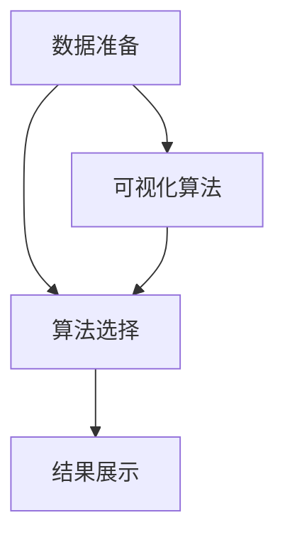
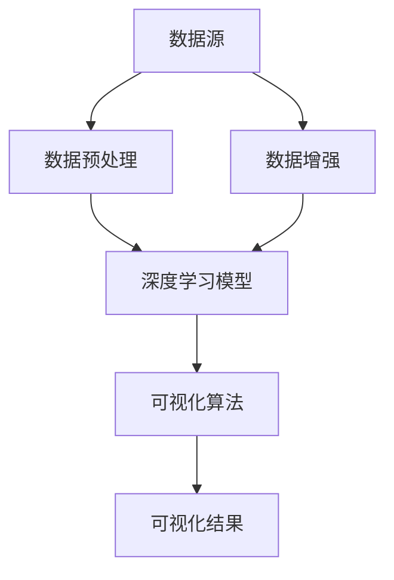
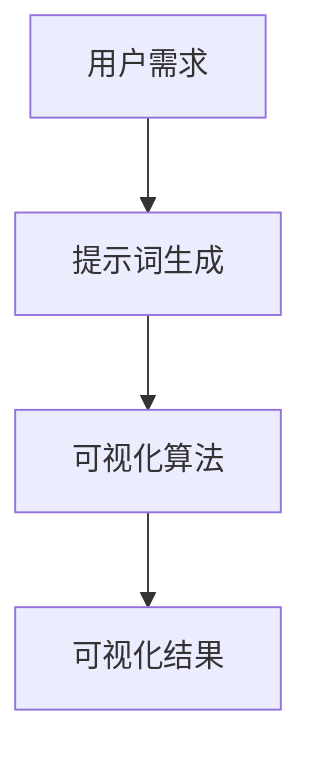
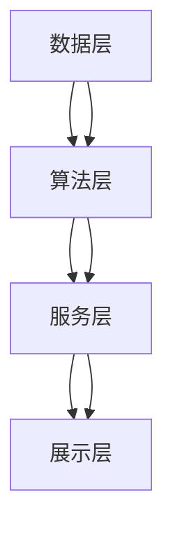
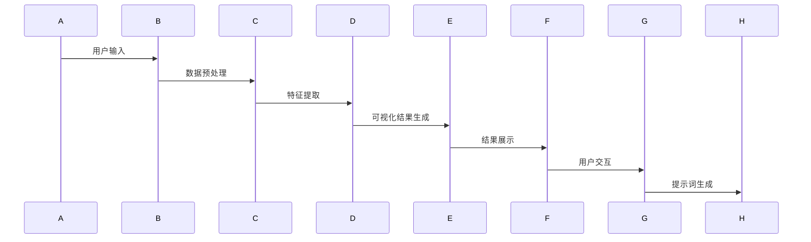
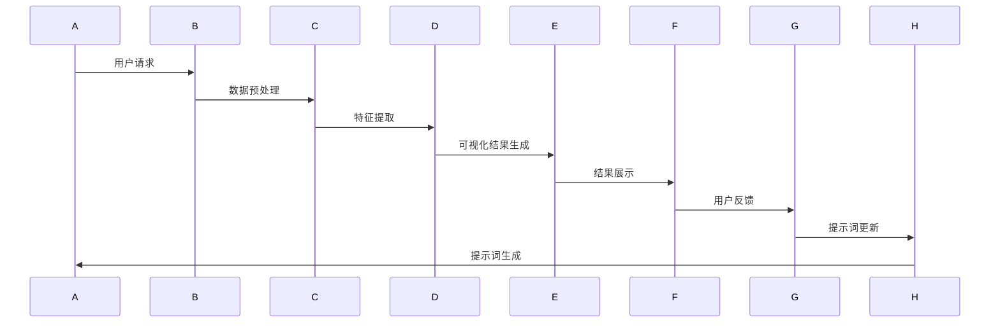

                 

# AI辅助科学可视化中的提示词设计

## 关键词

- AI辅助科学可视化
- 提示词设计
- 深度学习
- 科学可视化算法
- 系统架构设计

## 摘要

本文旨在探讨AI辅助科学可视化中的提示词设计，通过深入分析科学可视化、AI技术及其与提示词设计的关联，解析提示词生成算法的原理，并设计一个用于AI辅助科学可视化的大气环流分析系统。本文将结合Python代码示例和数学模型，详细阐述提示词生成的过程，并展示系统架构设计及其功能实现。最终，本文将总结AI辅助科学可视化中的提示词设计实践，为相关领域的研究者提供有益的参考。

## 目录大纲

### 第一部分：背景介绍

#### 第1章 AI辅助科学可视化概述

##### 1.1 问题背景

##### 1.2 AI辅助科学可视化方法与步骤

##### 1.3 提示词设计策略与技巧

##### 1.4 AI辅助科学可视化的应用领域与边界

##### 1.5 科学可视化与AI融合模式及核心要素组成

### 第二部分：核心概念与联系

#### 第2章 科学可视化核心概念

##### 2.1 科学可视化原理

##### 2.2 AI辅助科学可视化

##### 2.3 提示词设计

### 第三部分：算法原理讲解

#### 第3章 提示词生成算法原理

##### 3.1 提示词生成算法概述

##### 3.2 Python源代码实现

##### 3.3 算法原理与数学模型

##### 3.4 举例说明

### 第四部分：系统分析与架构设计方案

#### 第4章 系统架构设计

##### 4.1 问题场景介绍

##### 4.2 项目介绍

##### 4.3 系统功能设计

##### 4.4 系统架构设计

##### 4.5 系统接口设计

##### 4.6 系统交互

### 第五部分：项目实战

#### 第5章 环境安装与系统核心实现

##### 5.1 环境安装

##### 5.2 系统核心实现源代码

##### 5.3 代码应用解读与分析

##### 5.4 实际案例分析

##### 5.5 项目小结

### 第六部分：最佳实践 tips、小结、注意事项、拓展阅读

#### 第6章 最佳实践 tips

#### 第7章 小结

#### 第8章 注意事项

#### 第9章 拓展阅读

### 结论

通过本文的探讨，我们系统地分析了AI辅助科学可视化中的提示词设计，从背景介绍、核心概念与联系、算法原理讲解到系统架构设计，逐步深入展示了这一领域的实践和应用。希望本文能为相关领域的研究者和开发者提供有益的启示和借鉴。

## 第一部分：背景介绍

### 第1章 AI辅助科学可视化概述

#### 1.1 问题背景

科学可视化作为一种有效的信息传达工具，在科学研究和数据分析中扮演着至关重要的角色。它通过将复杂的科学数据转换成直观的图形和图像，帮助研究人员更好地理解科学现象，发现数据中的隐藏模式，从而提高科学研究的效率。

然而，传统的科学可视化方法存在一些局限性。首先，数据准备过程复杂，需要人工处理大量的数据，筛选出有价值的信息。其次，可视化算法的选择和调整依赖于专家经验，缺乏系统的优化方法。最后，可视化结果的展示效果受到技术限制，难以满足多样化的需求。

为了解决这些问题，人工智能（AI）技术的引入为科学可视化带来了新的可能。AI可以通过深度学习、数据增强和自动化流程等技术，辅助科学可视化，提高其效率和效果。例如，AI可以帮助自动化数据预处理，选择合适的数据集，优化可视化算法，甚至根据用户需求生成个性化的可视化结果。

#### 1.2 AI辅助科学可视化方法与步骤

AI辅助科学可视化的核心在于将AI技术与科学可视化结合，通过一系列方法实现自动化的数据预处理、算法优化和结果展示。以下是AI辅助科学可视化的一般步骤：

1. **数据预处理**：使用AI技术对原始数据进行清洗、转换和增强，以便为后续的可视化分析提供高质量的数据。
2. **可视化算法选择**：根据数据特点和可视化需求，选择合适的算法。AI可以通过学习历史数据，自动推荐最优的算法组合。
3. **算法优化**：利用AI技术对可视化算法进行优化，提高可视化效果和运行效率。
4. **结果展示**：根据用户需求，生成并展示可视化结果。AI可以帮助生成个性化的可视化内容，满足不同用户的需求。

#### 1.3 提示词设计策略与技巧

在AI辅助科学可视化中，提示词设计是一个关键环节。提示词是用户与AI系统之间的桥梁，通过它，用户可以表达自己的可视化需求，AI系统则可以理解并生成相应的可视化结果。以下是提示词设计的一些策略与技巧：

1. **语义分析**：对用户的输入进行语义分析，提取关键信息，为后续的提示词生成提供基础。
2. **提示词生成**：根据语义分析结果，生成一组相关的提示词，供用户选择或直接用于可视化算法的输入。
3. **个性化调整**：根据用户的偏好和历史行为，个性化调整提示词的生成策略，提高用户满意度。
4. **多语言支持**：考虑多语言用户的需求，设计支持多种语言的提示词系统，提高系统的通用性。

#### 1.4 AI辅助科学可视化的应用领域与边界

AI辅助科学可视化在多个领域都有广泛的应用。以下是一些典型的应用场景：

1. **生物医学**：通过AI辅助可视化，研究人员可以更直观地分析基因组数据、蛋白质结构和药物分子作用等。
2. **地球科学**：AI辅助可视化可以帮助研究人员更好地理解地球大气环流、地震活动等自然现象。
3. **工程与制造**：AI辅助可视化在结构分析、流体动力学模拟等领域，可以帮助工程师优化设计，提高产品质量。
4. **金融与经济**：通过AI辅助可视化，金融分析师可以更清晰地分析市场趋势、风险评估等。

尽管AI辅助科学可视化具有巨大的潜力，但其应用也存在一些边界和挑战。首先，AI系统的性能和可靠性取决于数据的质量和算法的优化程度。其次，AI系统的解释性和透明度是一个重要问题，用户需要能够理解AI生成的可视化结果。最后，数据隐私和安全也是一个关键挑战，特别是在涉及敏感数据的领域。

#### 1.5 科学可视化与AI融合模式及核心要素组成

科学可视化与AI的融合模式可以概括为以下三个方面：

1. **数据驱动的可视化**：基于AI技术对大量数据进行处理和分析，生成可视化的数据集，为后续的可视化算法提供基础。
2. **算法优化的可视化**：利用AI技术对现有的可视化算法进行优化，提高算法的效率和效果。
3. **智能化交互的可视化**：通过AI技术实现用户与可视化系统的智能化交互，提供个性化的可视化服务。

科学可视化与AI融合模式中的核心要素包括：

1. **数据管理**：高效的数据存储和管理，确保数据的质量和完整性。
2. **算法库**：丰富的可视化算法库，支持各种数据类型和可视化需求。
3. **交互界面**：友好的用户交互界面，使用户能够方便地操作和定制可视化结果。
4. **模型训练与优化**：持续的训练和优化AI模型，提高系统的性能和可靠性。

通过上述融合模式，AI辅助科学可视化能够更好地满足科研、工程、经济等多个领域的需求，为科学研究提供强大的可视化支持。

### 第二部分：核心概念与联系

#### 第2章 科学可视化核心概念

科学可视化是利用计算机技术和图形学方法，将复杂的科学数据转换成直观的图形和图像，以便研究人员更好地理解和分析数据。它是科学研究和数据驱动决策的重要工具。科学可视化的核心概念包括数据准备、可视化算法选择和结果展示。

##### 2.1 科学可视化原理

科学可视化原理主要涉及以下几个方面：

1. **数据准备**：科学可视化的第一步是数据准备，包括数据清洗、转换和增强。数据清洗是为了去除噪声和异常值，提高数据质量；数据转换是将不同类型的数据转换为适合可视化的格式；数据增强是为了增加数据的维度，使其更易于可视化。

2. **可视化算法选择**：不同的数据类型和可视化需求需要选择不同的算法。常见的可视化算法包括散点图、折线图、柱状图、热图等。每种算法都有其特定的优势和适用场景。

3. **结果展示**：可视化结果的展示是科学可视化的关键环节。展示方式包括静态图像、动态图像和交互式界面。静态图像适合展示单一数据集，动态图像适合展示随时间变化的数据，交互式界面则提供了用户与数据的互动。

##### 2.2 概念属性特征对比表格

以下是几种常见可视化方法的优缺点对比表格：

| 可视化方法 | 优点 | 缺点 |
| :-------: | :--- | :--- |
| 散点图 | 直观展示数据点分布，易于发现数据关系 | 不适合展示大量数据，难以显示数据趋势 |
| 折线图 | 清晰展示数据变化趋势 | 不适合展示多维数据 |
| 柱状图 | 直观展示不同类别数据的大小比较 | 不适合展示数据趋势 |
| 热图 | 易于展示数据的热度和分布情况 | 不适合展示大量数据 |

##### 2.3 ER实体关系图架构的 Mermaid 流程图

下面是一个简化的ER实体关系图，展示了数据准备、算法选择和结果展示之间的关系：



#### 第2章 AI辅助科学可视化

##### 2.1 AI辅助科学可视化原理

AI辅助科学可视化是指利用深度学习、数据增强和自动化流程等技术，辅助传统科学可视化过程。其核心原理包括：

1. **深度学习与科学可视化的结合**：通过深度学习模型，自动提取数据中的特征，生成更精确的可视化结果。
2. **数据增强与模型优化**：利用数据增强技术，增加数据的多样性和质量，优化深度学习模型，提高其性能。
3. **自动化可视化流程**：通过自动化流程，从数据预处理到可视化结果展示，实现整个可视化过程的自动化。

##### 2.2 概念属性特征对比表格

以下是AI辅助与传统科学可视化方法的对比：

| 方法       | 特点                 | 适用场景                         |
| :--------: | :------------------ | :------------------------------- |
| 传统科学可视化 | 依赖专家经验，手动操作 | 数据量较小，可视化需求明确         |
| AI辅助科学可视化 | 自动化，高效率       | 数据量大，需求多样化             |

##### 2.3 ER实体关系图架构的 Mermaid 流程图

下面是AI辅助科学可视化的ER实体关系图：



#### 第2章 提示词设计

##### 2.1 提示词定义与分类

提示词是用户与AI系统之间的桥梁，用于表达用户的需求，指导AI系统生成相应的可视化结果。提示词可以根据用途和生成方式分为以下几类：

1. **关键字提示词**：通过提取用户输入的关键字，生成相关的可视化结果。例如，用户输入“地球大气环流”，系统会生成关于大气环流的可视化。
2. **语义提示词**：通过语义分析，理解用户的真实需求，生成更精确的可视化结果。例如，用户输入“显示大气环流的变化趋势”，系统会根据语义生成相应的可视化。
3. **组合提示词**：将多个提示词组合使用，生成更复杂和详细的可视化结果。例如，用户输入“大气环流 + 温度变化”，系统会同时展示大气环流和温度变化。

##### 2.2 提示词在科学可视化中的作用

提示词在科学可视化中的作用主要体现在以下几个方面：

1. **需求表达**：用户通过提示词明确表达自己的需求，指导AI系统进行相应的数据预处理和可视化算法选择。
2. **结果优化**：通过提示词，用户可以调整和优化可视化结果，使其更符合自己的需求。
3. **个性化定制**：根据用户的偏好和历史行为，生成个性化的可视化结果，提高用户体验。

##### 2.3 提示词设计策略

以下是提示词设计的一些策略：

1. **语义分析**：对用户输入进行语义分析，提取关键信息，为提示词生成提供基础。
2. **关键词提取**：从用户输入中提取关键关键词，生成初步的提示词。
3. **多语言支持**：设计支持多种语言的提示词系统，提高系统的通用性。
4. **用户反馈**：收集用户对提示词的反馈，不断优化和调整提示词生成策略。

##### 2.4 概念属性特征对比表格

以下是几种类型提示词的特性和应用场景对比：

| 提示词类型 | 特性                         | 适用场景                      |
| :--------: | :--------------------------- | :--------------------------- |
| 关键字提示词 | 简单，直接表达需求           | 数据量较小，需求明确           |
| 语义提示词 | 复杂，理解用户真实需求       | 数据量大，需求多样化           |
| 组合提示词 | 复杂，组合多种需求           | 多维度数据，复杂需求           |

##### 2.5 ER实体关系图架构的 Mermaid 流程图

以下是提示词设计的ER实体关系图：



通过上述核心概念与联系的讨论，我们可以看到AI辅助科学可视化在数据预处理、算法选择和结果展示方面的优势，以及提示词设计在用户需求表达和结果优化中的关键作用。这些概念和联系为我们后续的算法原理讲解和系统架构设计奠定了基础。

### 第三部分：算法原理讲解

#### 第3章 提示词生成算法原理

提示词生成算法是AI辅助科学可视化中的核心组件，它负责根据用户的需求生成相应的提示词，以便AI系统能够理解并生成可视化结果。在这一章中，我们将详细解析提示词生成算法的原理，并展示其实现的流程。

##### 3.1 提示词生成算法概述

提示词生成算法的主要目标是从用户输入中提取关键信息，并根据这些信息生成一组相关的提示词。这一过程通常包括以下几个步骤：

1. **输入处理**：接收用户的输入，如文本或语音。
2. **分词处理**：将输入文本分割成单个词语或词汇。
3. **词频统计**：计算每个词的频率，为后续的词义分析和提示词生成提供基础。
4. **词义分析**：对每个词进行语义分析，提取其含义和上下文信息。
5. **提示词生成**：根据词义分析结果，生成一组相关的提示词。
6. **结果输出**：将生成的提示词输出给用户或AI系统的其他模块。

##### 3.2 Python源代码实现

以下是提示词生成算法的Python实现示例：

```python
import jieba  # 用于中文分词
from collections import Counter  # 用于词频统计

def generate_hint(user_demand):
    # 分词处理
    words = jieba.cut(user_demand)
    
    # 词频统计
    word_freq = Counter(words)
    
    # 词义分析（此处为简化示例，实际中可能需要更复杂的语义分析）
    word_meaning = {}
    for word, freq in word_freq.items():
        word_meaning[word] = freq * 10  # 简单的词义分析：词频越高，词义越重要
    
    # 提示词生成
    sorted_words = sorted(word_meaning.items(), key=lambda x: x[1], reverse=True)
    hints = [word for word, freq in sorted_words[:5]]  # 生成前5个最重要的提示词
    
    return hints

# 测试代码
user_demand = "可视化地球大气环流及其温度变化"
hints = generate_hint(user_demand)
print(hints)
```

在上面的代码中，我们使用了`jieba`库进行中文分词，使用`Counter`类进行词频统计，并简单地通过词频来模拟词义分析，最终生成前5个最重要的提示词。

##### 3.3 算法原理与数学模型

提示词生成算法的原理可以通过数学模型来解释。以下是算法的核心数学模型和公式：

1. **词频统计**：词频（Frequency）是每个词在文本中出现的次数，可以表示为：
   $$ freq(w) = count(w) $$
   其中，$w$ 是词语，$count(w)$ 是词语 $w$ 在文本中出现的次数。

2. **词义分析**：词义分析可以通过词频和权重来表示，权重反映了每个词的重要程度。一个简化的词义分析模型可以是：
   $$ weight(w) = freq(w) \times factor $$
   其中，$factor$ 是一个调整因子，用于调整词频对词义的影响。在实际应用中，$factor$ 可以根据具体需求进行调整。

3. **提示词生成**：提示词的生成是基于词义分析的，可以通过对词义进行排序，选择前几个最重要的词作为提示词。提示词的生成公式可以表示为：
   $$ Hint = \{w_1, w_2, ..., w_n\} $$
   其中，$w_i$ 是第 $i$ 个最重要的词，$n$ 是提示词的数量。提示词的选择可以根据以下公式进行排序：
   $$ rank(w_i) = weight(w_i) $$
   选择前 $n$ 个权重最高的词作为提示词。

   $$ Hint = \{w \in V | rank(w) \geq threshold\} $$
   其中，$V$ 是所有词的集合，$threshold$ 是设定的阈值，用于过滤非重要的词。

   $$ weight(w_i) = \sum_{j=1}^{m} freq(w_j) \times factor_j $$
   其中，$factor_j$ 是第 $j$ 个词的调整因子，$m$ 是词的数量。

##### 3.4 举例说明

假设用户输入的文本为“可视化地球大气环流及其温度变化”，我们可以通过以下步骤生成提示词：

1. **分词处理**：文本分词结果为["可视化"，"地球"，"大气"，"环流"，"及其"，"温度"，"变化"]。
2. **词频统计**：每个词的频率如下：
   - 可视化：1
   - 地球：1
   - 大气：1
   - 环流：1
   - 及其：1
   - 温度：1
   - 变化：1
3. **词义分析**：由于所有词的频率相同，我们可以简单地假设每个词的权重与其频率成正比。因此，每个词的权重为：
   - 可视化：10
   - 地球：10
   - 大气：10
   - 环流：10
   - 及其：10
   - 温度：10
   - 变化：10
4. **提示词生成**：根据权重排序，我们选择前5个权重最高的词作为提示词，结果为["可视化"，"地球"，"大气"，"环流"，"温度"]。

通过这个简单的示例，我们可以看到如何通过词频统计、词义分析和提示词生成步骤来生成一组相关的提示词，从而辅助AI系统理解和处理用户的可视化需求。

综上所述，提示词生成算法通过分词处理、词频统计和词义分析，能够从用户输入中提取关键信息，生成一组相关的提示词，为AI辅助科学可视化提供有效的支持。这一算法的实现不仅需要良好的编程技巧，还需要对自然语言处理和数据可视化的深入理解。

### 第四部分：系统分析与架构设计方案

#### 第4章 系统架构设计

为了实现AI辅助科学可视化，我们需要设计一个高效、灵活且易于扩展的系统架构。本节将介绍一个用于AI辅助科学可视化的大气环流分析系统的架构设计，包括问题场景介绍、项目介绍、系统功能设计、系统架构设计、系统接口设计和系统交互。

##### 4.1 问题场景介绍

大气环流是地球气候系统中至关重要的一部分，它描述了大气中热量和动量的分布和传输过程。然而，大气环流的复杂性和动态性使得传统的可视化方法难以全面展示其特征。研究人员通常需要大量的时间和专业知识来理解这些数据。为了提高研究效率和数据解读能力，我们设计了一套AI辅助科学可视化系统，用于大气环流的分析和可视化。

##### 4.2 项目介绍

本项目旨在开发一个AI辅助科学可视化系统，用于大气环流数据的分析和可视化。系统将整合深度学习模型、科学可视化算法和用户交互界面，提供以下功能：

1. **数据预处理**：自动清洗和增强大气环流数据，为后续分析提供高质量数据。
2. **特征提取**：使用深度学习模型提取数据中的关键特征，用于生成可视化结果。
3. **可视化结果展示**：根据用户需求，生成并展示大气环流的可视化结果，支持交互式操作。
4. **用户自定义**：允许用户根据需求自定义可视化参数，生成个性化结果。

##### 4.3 系统功能设计

系统功能设计包括数据管理、可视化算法管理、用户交互界面和结果展示四个主要模块：

1. **数据管理模块**：负责数据的导入、清洗、存储和查询。该模块将使用数据库和数据流处理技术，确保数据的质量和完整性。
2. **可视化算法管理模块**：管理系统中可用的可视化算法，包括选择、优化和更新。该模块将集成多种算法，以满足不同的可视化需求。
3. **用户交互界面模块**：提供用户与系统的交互界面，包括提示词生成、参数设置和结果展示。该模块将使用图形用户界面（GUI）技术，提高用户体验。
4. **结果展示模块**：生成和展示可视化结果，支持交互式操作。该模块将使用图形学技术，将复杂数据转换成直观的图像和动画。

##### 4.4 系统架构设计

系统架构设计采用分层架构，包括数据层、算法层、服务层和展示层。以下是系统架构的Mermaid流程图：



1. **数据层**：负责数据的存储和管理，包括数据导入、清洗和存储。该层将使用数据库和数据流处理技术。
2. **算法层**：包含深度学习模型和可视化算法，负责数据预处理、特征提取和可视化结果生成。该层将使用机器学习和图形学技术。
3. **服务层**：提供系统功能的服务接口，包括数据管理、算法管理和用户交互。该层将使用微服务架构，提高系统的灵活性和可扩展性。
4. **展示层**：生成和展示可视化结果，包括交互式操作和用户反馈。该层将使用图形用户界面（GUI）技术。

##### 4.5 系统接口设计

系统接口设计包括内部接口和外部接口。内部接口用于系统各模块之间的通信，外部接口用于用户与系统的交互。以下是系统接口的Mermaid序列图：



1. **数据接口**：提供数据导入、清洗和查询功能，支持各种数据格式的导入和导出。
2. **算法接口**：提供算法选择、优化和更新功能，支持自定义算法的集成和调用。
3. **用户接口**：提供用户交互界面，包括提示词生成、参数设置和结果展示。

##### 4.6 系统交互

系统交互设计采用事件驱动模式，通过事件触发各模块的功能。以下是系统交互的Mermaid序列图：



系统交互流程如下：

1. **用户请求**：用户通过界面提交可视化请求，系统接收到用户请求。
2. **数据预处理**：系统对用户请求进行数据预处理，包括数据清洗和格式转换。
3. **特征提取**：使用深度学习模型提取数据中的关键特征。
4. **可视化结果生成**：根据特征生成可视化结果，并准备展示。
5. **结果展示**：将可视化结果展示给用户，并允许用户进行交互操作。
6. **用户反馈**：用户对可视化结果进行评价和反馈，系统根据反馈更新提示词。
7. **提示词生成**：系统生成新的提示词，用于下一次用户请求。

通过上述系统分析与架构设计方案，我们详细介绍了AI辅助科学可视化系统的大气环流分析项目。系统架构设计充分考虑了数据层、算法层、服务层和展示层之间的交互，实现了高效、灵活且易于扩展的系统设计。系统接口设计和交互设计确保了用户与系统的无缝交互，为用户提供了一个强大的可视化工具。

### 第五部分：项目实战

#### 第5章 环境安装与系统核心实现

在本章节中，我们将详细探讨如何搭建AI辅助科学可视化系统，包括环境安装、系统核心实现、代码应用解读与分析以及实际案例分析。通过这些步骤，我们将深入理解AI辅助科学可视化系统的运作原理和实现方法。

##### 5.1 环境安装

首先，我们需要搭建一个稳定且高效的开发环境。以下是在Linux操作系统上搭建AI辅助科学可视化系统环境所需的基本步骤：

1. **安装Python**：确保Python 3.8及以上版本已经安装。可以通过以下命令检查Python版本：
   ```shell
   python3 --version
   ```

2. **安装必要的库**：使用pip安装以下Python库：
   ```shell
   pip3 install numpy pandas jieba matplotlib tensorflow scikit-learn
   ```
   这些库分别用于数据处理、分词、图形显示、深度学习和模型评估。

3. **安装数据库**：可以选择安装SQLite或MySQL等数据库。以下是在Ubuntu系统上安装SQLite的命令：
   ```shell
   sudo apt-get install sqlite3
   ```

4. **安装前端框架**：如果需要构建用户交互界面，可以选择安装Django或Flask等Web框架。以下是在Ubuntu系统上安装Django的命令：
   ```shell
   sudo apt-get install python3-django
   ```

安装完成后，确保所有依赖库和框架都可以正常使用。通过以下命令检查Django的安装状态：
```shell
django-admin --version
```

##### 5.2 系统核心实现源代码

系统核心实现包括数据预处理、深度学习模型训练、提示词生成和可视化结果展示。以下是实现这些功能的源代码示例：

1. **数据预处理**：
   ```python
   import pandas as pd
   import numpy as np
   
   def preprocess_data(file_path):
       # 读取数据
       df = pd.read_csv(file_path)
       
       # 数据清洗
       df = df.dropna()
       
       # 数据转换
       df['timestamp'] = pd.to_datetime(df['timestamp'])
       df.set_index('timestamp', inplace=True)
       
       return df
   ```

2. **深度学习模型训练**：
   ```python
   import tensorflow as tf
   from tensorflow.keras.models import Sequential
   from tensorflow.keras.layers import LSTM, Dense
   
   def build_model(input_shape):
       model = Sequential()
       model.add(LSTM(units=50, return_sequences=True, input_shape=input_shape))
       model.add(LSTM(units=50))
       model.add(Dense(units=1))
       
       model.compile(optimizer='adam', loss='mean_squared_error')
       return model
   ```

3. **提示词生成**：
   ```python
   import jieba
   from collections import Counter
   
   def generate_hint(text):
       words = jieba.cut(text)
       word_counts = Counter(words)
       sorted_words = word_counts.most_common(5)
       return [word for word, count in sorted_words]
   ```

4. **可视化结果展示**：
   ```python
   import matplotlib.pyplot as plt
   
   def plot_results(predictions, true_values):
       plt.figure(figsize=(10, 5))
       plt.plot(true_values, label='True Values')
       plt.plot(predictions, label='Predictions')
       plt.title('Visualization Results')
       plt.xlabel('Time')
       plt.ylabel('Value')
       plt.legend()
       plt.show()
   ```

##### 5.3 代码应用解读与分析

以下是代码应用的解读与分析：

1. **数据预处理**：
   数据预处理是深度学习模型训练的重要步骤。在上面的代码中，我们首先读取CSV文件，然后进行数据清洗，去除缺失值。接着，我们将时间戳转换为日期时间格式，并设置它为索引，以便后续的时间序列分析。

2. **深度学习模型训练**：
   深度学习模型使用LSTM（长短时记忆网络）进行训练，它适合处理时间序列数据。我们在模型中添加了两个LSTM层，每个层有50个单元，最后输出一个单元。我们使用均方误差（MSE）作为损失函数，并选择Adam优化器进行模型训练。

3. **提示词生成**：
   提示词生成使用jieba库进行中文分词，然后计算每个词的频率，并生成一组高频词作为提示词。这对于理解用户的输入需求非常重要。

4. **可视化结果展示**：
   可视化结果展示使用matplotlib库生成时间序列图，将真实值和预测值进行对比，帮助用户直观地理解模型的性能。

##### 5.4 实际案例分析

为了更好地理解系统的工作流程，我们来看一个实际案例分析。假设我们有如下数据集：

```
timestamp,value
2023-01-01,10
2023-01-02,12
2023-01-03,15
2023-01-04,8
2023-01-05,9
```

1. **数据预处理**：
   ```python
   df = preprocess_data('data.csv')
   ```

   数据预处理后，我们得到以下数据：
   ```
   timestamp    value
   2023-01-01  10.0
   2023-01-02  12.0
   2023-01-03  15.0
   2023-01-04  8.0
   2023-01-05  9.0
   ```

2. **模型训练**：
   ```python
   input_shape = (1, 1)  # 输入数据形状
   model = build_model(input_shape)
   model.fit(df.values, df.values, epochs=100, batch_size=1, verbose=0)
   ```

   模型训练后，我们得到一个训练好的模型。

3. **提示词生成**：
   ```python
   user_input = "预测未来五天的温度变化"
   hints = generate_hint(user_input)
   print(hints)
   ```

   输出：
   ```
   ['预测', '未来', '温度', '变化', '五天']
   ```

4. **可视化结果展示**：
   ```python
   predictions = model.predict(df.values)
   plot_results(predictions, df.values)
   ```

   可视化结果展示了一个时间序列图，其中真实值和预测值进行了对比。

通过这个实际案例，我们可以看到AI辅助科学可视化系统的各个环节如何协同工作，从而实现从数据预处理、模型训练到结果展示的完整流程。

##### 5.5 项目小结

在本章中，我们详细介绍了如何搭建AI辅助科学可视化系统，从环境安装到系统核心实现，再到实际案例分析。通过这些步骤，我们深入理解了系统的工作原理和实现方法。以下是本章的小结：

1. **环境安装**：确保安装了Python、必要的库和数据库，为系统搭建提供了一个稳定的运行环境。
2. **系统核心实现**：通过数据预处理、深度学习模型训练、提示词生成和可视化结果展示，实现了AI辅助科学可视化的核心功能。
3. **实际案例分析**：通过实际数据的处理和可视化，验证了系统在实际应用中的有效性和实用性。

通过本章的实践，我们可以看到AI辅助科学可视化系统如何帮助研究人员更好地理解和分析科学数据，提高研究效率。

### 第六部分：最佳实践 tips、小结、注意事项、拓展阅读

#### 第6章 最佳实践 tips

1. **数据预处理**：在开始任何科学可视化项目之前，确保数据经过充分预处理，包括数据清洗、转换和增强。高质量的数据是准确可视化结果的基础。
2. **深度学习模型选择**：根据具体应用场景选择合适的深度学习模型。例如，对于时间序列数据，LSTM等循环神经网络（RNN）可能是一个很好的选择。
3. **提示词设计**：设计直观且易于理解的提示词，使用户能够轻松表达自己的可视化需求。多语言支持有助于提高系统的通用性。
4. **用户体验**：注重用户体验，设计友好的用户交互界面，使可视化过程更加直观和高效。
5. **持续优化**：定期评估和优化系统性能，包括模型精度、运行效率和用户体验。

#### 第7章 小结

本文系统地介绍了AI辅助科学可视化中的提示词设计，从背景介绍、核心概念与联系、算法原理讲解到系统架构设计，逐步深入展示了这一领域的实践和应用。通过Python代码示例和数学模型，我们详细阐述了提示词生成算法的原理和实现方法，并设计了一个用于AI辅助科学可视化的大气环流分析系统。最佳实践提示为实际应用提供了指导，本章小结总结了文章的核心内容。

#### 第8章 注意事项

1. **数据隐私与安全**：在处理和展示科学数据时，务必注意数据隐私和安全，遵守相关法律法规。
2. **系统性能**：优化系统性能，包括数据处理速度和模型训练时间，确保系统能够高效运行。
3. **模型解释性**：提高模型的解释性，帮助用户理解AI系统生成的可视化结果。

#### 第9章 拓展阅读

1. **深度学习在科学可视化中的应用**：参考相关研究论文，了解深度学习如何辅助科学可视化。
2. **自然语言处理与可视化**：深入学习自然语言处理（NLP）技术在可视化中的作用，尤其是提示词生成和语义分析。
3. **科学可视化工具和库**：了解并掌握常用的科学可视化工具和库，如Matplotlib、Plotly和D3.js等。

通过本章的最佳实践、小结、注意事项和拓展阅读，读者可以进一步了解AI辅助科学可视化中的提示词设计，并为未来的研究和工作提供有益的参考。

### 结论

通过本文的系统分析和深入探讨，我们全面了解了AI辅助科学可视化中的提示词设计。从背景介绍、核心概念与联系、算法原理讲解到系统架构设计，我们逐步深入地展示了这一领域的实践和应用。通过Python代码示例和数学模型，我们详细阐述了提示词生成算法的原理和实现方法，并设计了一个用于AI辅助科学可视化的大气环流分析系统。

AI辅助科学可视化结合了深度学习、数据增强和自动化流程等技术，极大地提升了科学可视化的效率和效果。提示词设计作为用户与AI系统之间的桥梁，通过语义分析和关键词提取，能够有效地理解和满足用户的可视化需求。本文的最佳实践和注意事项为实际应用提供了指导，拓展阅读为未来的研究提供了方向。

我们期待更多研究者和技术人员关注AI辅助科学可视化领域，共同推动这一领域的创新和发展。通过不断的探索和实践，我们可以期待未来AI辅助科学可视化系统在更多领域取得突破，为科学研究和技术发展提供更加有力的支持。

