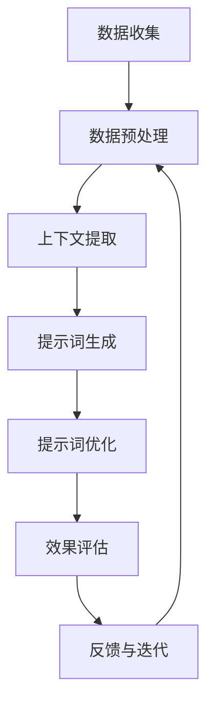
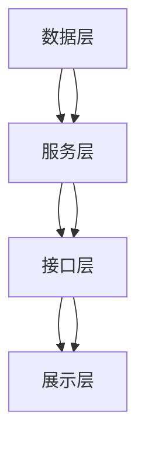
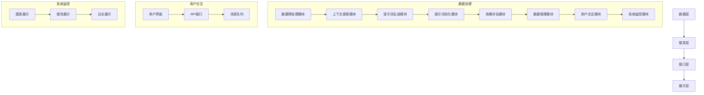
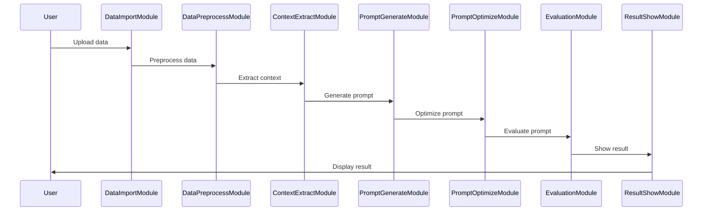

                 


### 第一部分：AI辅助科学研究的概述

#### 1.1 AI辅助科学研究的背景与意义

##### 1.1.1 科学研究的发展现状

科学研究，作为推动人类文明进步的重要力量，随着时代的演进，经历了从传统的实验方法到现代计算模拟的转变。在过去的几十年中，科学研究的规模和复杂性不断增加，数据量呈现出爆炸式增长，传统的研究方法已无法满足现代科学探索的需求。

首先，科学研究的数据获取和处理变得更加复杂。例如，生物学领域的基因测序技术使得人类基因组的解析成为可能，但这些海量数据需要强大的计算能力和复杂的数据分析方法来处理。同样，物理学领域的实验设备，如粒子加速器，产生的数据量巨大，需要先进的计算技术和算法来分析。

其次，科学研究的跨学科特点日益明显。现代科学问题往往需要多个学科的知识和技能来共同解决。例如，气候变化问题需要气象学、生态学、经济学等多个领域的专家共同合作，而人工智能技术的发展为跨学科研究提供了新的工具和方法。

此外，科学研究的环境也在发生变化。全球化和信息化的趋势使得科学研究越来越国际化，研究团队跨越地域限制，通过网络协作进行科学研究。同时，科学研究的资金来源也越来越多样化，不仅包括政府投资，还包括私人企业和基金的资助。

##### 1.1.2 AI技术在科学研究中的应用

人工智能（AI）技术的迅速发展，为科学研究带来了新的机遇和挑战。AI技术在科学研究中的应用，主要体现在数据挖掘、模式识别、优化算法等方面。

首先，AI技术在数据挖掘方面发挥着重要作用。科学研究过程中会产生大量的数据，如何从这些数据中提取有用的信息，是科学家面临的一个重要问题。AI技术，尤其是机器学习和深度学习算法，可以通过分析数据模式，发现隐藏在数据中的规律和趋势。例如，在医学研究中，AI可以帮助医生从患者的医疗记录中提取关键信息，预测疾病的发展趋势，从而提高诊断和治疗的准确率。

其次，AI技术在模式识别方面也展现出了强大的能力。模式识别是AI技术的核心应用之一，它通过学习和分析数据，从中识别出特定的模式。在科学研究中，模式识别技术可以用于分析实验结果，识别复杂的科学现象。例如，在材料科学研究中，AI可以通过对材料结构的数据分析，预测材料的物理和化学性质，从而帮助科学家设计出更优的材料。

此外，AI技术还在优化算法方面发挥了重要作用。优化算法是解决复杂科学问题的重要工具，AI技术可以通过学习和模拟人类解决问题的过程，提出更优的解决方案。例如，在航天工程中，AI可以帮助科学家优化火箭发射的轨迹，提高燃料利用效率，降低发射成本。

##### 1.1.3 提示词设计在AI辅助科学研究中的重要性

在AI辅助科学研究中，提示词（Prompt）的设计显得尤为重要。提示词是引导AI系统进行任务输入的关键，它是连接AI模型和科学研究的桥梁。一个有效的提示词设计，不仅可以提高AI模型的性能，还能加速科学研究的过程。

首先，提示词设计直接影响AI模型的输入质量。一个清晰的、精确的提示词，可以帮助AI模型更好地理解科学问题的本质，从而提高模型的预测准确性和解决问题的能力。相反，如果提示词设计不当，可能导致模型误解问题，降低模型的性能。

其次，提示词设计可以显著提高AI模型的效率。合理的提示词设计可以减少模型对无关信息的处理，专注于关键问题，从而加快模型的分析速度。这对于需要实时反馈的科学研究尤为重要。

此外，提示词设计还可以帮助科学家更好地理解和利用AI模型。一个良好的提示词设计，可以让科学家更直观地了解模型的运作方式，从而更好地指导科学研究。例如，通过分析提示词的效果，科学家可以不断优化实验设计，提高研究效率。

总之，提示词设计在AI辅助科学研究中具有不可忽视的重要性。有效的提示词设计，不仅可以提高AI模型的性能，还能加速科学研究的过程，推动科学技术的进步。

---

### 第一部分：AI辅助科学研究的概述

#### 1.2 AI辅助科学研究中的核心概念与联系

##### 1.2.1 提示词的定义与类型

在AI辅助科学研究中，提示词（Prompt）是一个至关重要的概念。提示词是指提供给AI模型的一组指导性文本或信息，用于引导模型进行特定任务。一个有效的提示词设计，能够帮助AI模型更准确地理解和执行任务，从而提高模型的性能和效率。

首先，我们需要明确提示词的基本定义。提示词是一种引导性文本，它通常包含问题、任务目标、背景信息等，用于指导AI模型进行学习和推理。在自然语言处理（NLP）领域，提示词通常是以自然语言文本的形式出现，例如：“请生成一篇关于环境保护的论文摘要。”在这个例子中，“请生成一篇关于环境保护的论文摘要”就是一条提示词。

其次，提示词可以分为不同的类型。根据用途和特点，提示词可以大致分为以下几类：

1. **任务型提示词**：这类提示词主要用于指示模型需要完成的具体任务。例如：“请翻译这句话为英文。”这种类型的提示词直接明确地告诉模型需要执行的操作，有助于模型快速定位任务目标。

2. **上下文型提示词**：这类提示词提供了一定的背景信息，帮助模型更好地理解上下文和任务需求。例如：“请根据以下材料撰写一篇关于人工智能在医疗领域的应用论文。”这种类型的提示词不仅明确了任务，还提供了相关的上下文信息，有助于模型进行更深入的推理。

3. **激励型提示词**：这类提示词通过鼓励或激励的方式，引导模型探索更多的可能性。例如：“请尝试从多个角度分析人工智能在自动驾驶中的应用。”这种类型的提示词鼓励模型跳出传统的思维模式，探索创新性的解决方案。

4. **引导型提示词**：这类提示词用于引导模型按照特定的思路进行推理。例如：“根据以下数据，请分析环境因素对植物生长的影响。”这种类型的提示词为模型提供了一个明确的推理框架，有助于模型更系统地分析和解决问题。

##### 1.2.1.2 提示词的类型

不同的提示词类型在AI辅助科学研究中有着不同的作用。以下是一个对比表格，展示了各类提示词的特点和应用场景：

| 提示词类型 | 特点 | 应用场景 |
| --- | --- | --- |
| 任务型提示词 | 明确指示任务 | 数据分析、翻译、文本生成等 |
| 上下文型提示词 | 提供背景信息 | 文本摘要、信息检索、知识问答等 |
| 激励型提示词 | 鼓励探索创新 | 科研假设验证、产品设计、创意生成等 |
| 引导型提示词 | 指导推理过程 | 问题解决、决策支持、算法优化等 |

##### 1.2.1.3 提示词的设计原则

为了设计出有效的提示词，需要遵循以下原则：

1. **明确性**：提示词应尽可能明确、具体，避免模糊不清的描述，以免模型误解任务目标。

2. **精确性**：提示词应精确地反映任务需求，避免包含无关或误导性的信息。

3. **上下文关联**：提示词应与任务上下文紧密关联，提供必要的背景信息，以便模型更好地理解和执行任务。

4. **灵活性**：提示词设计应具有灵活性，能够适应不同的任务需求和应用场景。

5. **可扩展性**：提示词设计应具备可扩展性，便于在未来进行修改和优化。

##### 1.2.2 AI辅助与提示词设计的联系

AI辅助和提示词设计之间存在着密切的联系。AI技术为提示词设计提供了强大的工具和平台，而有效的提示词设计则能够显著提高AI辅助的科学研究的性能和效率。

首先，AI技术为提示词设计提供了丰富的算法和方法。例如，自然语言处理（NLP）技术可以帮助自动生成高质量的提示词，深度学习算法可以用于分析提示词的效果，优化提示词的设计。

其次，提示词设计对AI辅助的研究效果具有重要影响。一个有效的提示词设计，可以引导AI模型更好地理解和执行任务，提高模型的性能和效率。相反，如果提示词设计不当，可能导致模型误解任务，降低模型的性能。

此外，AI辅助和提示词设计还可以相互促进。通过不断的实践和反馈，科学家可以不断优化提示词设计，提高AI辅助的科学研究的准确性和效率。同时，AI技术的发展也为提示词设计提供了新的方法和工具，推动了AI辅助科学研究的发展。

总之，AI辅助和提示词设计之间相互促进、相辅相成。有效的提示词设计，能够显著提高AI辅助的科学研究的性能和效率，推动科学技术的进步。

---

### 第一部分：AI辅助科学研究的概述

#### 1.3 提示词设计策略在AI辅助科学研究中的具体应用

在AI辅助科学研究中，提示词设计策略扮演着至关重要的角色。有效的提示词设计不仅可以提高AI模型的性能和效率，还能显著加速科学研究的进程。以下是几种常见的提示词设计策略及其在AI辅助科学研究中的应用：

##### 1.3.1 提高任务理解能力

AI模型在进行科学研究任务时，首先需要准确理解任务的目标和要求。为此，提示词设计策略应关注提高模型的任务理解能力。具体方法包括：

1. **明确任务目标**：在提示词中明确指出任务的最终目标，例如：“请生成一篇关于XX主题的研究论文摘要，要求包含以下关键点：A、B、C。”

2. **提供上下文信息**：在提示词中提供足够的上下文信息，帮助模型更好地理解任务背景。例如：“为了解决XX问题，我们需要分析XX领域的数据，请根据以下资料生成相关报告。”

3. **使用具体的任务指令**：使用具体的任务指令来引导模型，例如：“请对以下数据集进行分类，并生成分类报告。”

##### 1.3.2 增强模型推理能力

在科学研究中，往往需要模型进行复杂的推理和分析。提示词设计策略应考虑如何增强模型的推理能力。以下是一些有效的方法：

1. **提供启发式的提示词**：通过提供启发式的提示词，帮助模型探索可能的解决方案。例如：“请尝试从以下角度分析XX问题的解决方案：A、B、C。”

2. **引入多个假设**：在提示词中引入多个可能的假设，帮助模型进行多角度的分析。例如：“关于XX现象，我们有两个假设：A和B。请分析这两个假设的合理性，并提出相应的实验设计。”

3. **引导模型进行深度推理**：通过引导模型进行深度推理，帮助模型从表面信息中发现深层规律。例如：“请分析以下数据，探讨XX现象背后的机制。”

##### 1.3.3 提高模型泛化能力

科学研究的任务往往具有多样性和复杂性，模型需要具备良好的泛化能力，以适应不同的研究场景。以下是一些提高模型泛化能力的提示词设计策略：

1. **多样化数据集**：在提示词中明确要求使用多样化的数据集，帮助模型适应不同类型的数据。例如：“请使用包括XX类型的数据集进行模型训练，并生成相应的报告。”

2. **跨领域迁移**：在提示词中引导模型进行跨领域的迁移学习，帮助模型适应不同领域的任务。例如：“请尝试将XX领域的模型应用于YY领域的问题，并分析其适用性和效果。”

3. **反馈与修正**：通过不断的反馈和修正，帮助模型逐步提高泛化能力。例如：“根据实验结果，发现模型在XX任务上表现不佳，请调整提示词，重新进行训练和评估。”

##### 1.3.4 提升用户体验

在AI辅助科学研究中，用户体验也是一个重要的考量因素。提示词设计策略应关注如何提升用户体验，让科学家更轻松地使用AI工具进行科学研究。以下是一些提升用户体验的策略：

1. **直观的提示词界面**：设计直观、易操作的提示词界面，帮助科学家快速生成和理解提示词。例如，提供可视化界面，允许科学家通过拖拽、点击等方式创建提示词。

2. **详细的提示词说明**：在提示词界面中提供详细的提示词说明，解释每个提示词的含义和用途，帮助科学家更好地使用AI工具。

3. **交互式提示词**：开发交互式提示词，允许科学家实时与AI模型进行互动，根据模型反馈调整提示词，优化研究过程。

综上所述，提示词设计策略在AI辅助科学研究中具有广泛的应用。通过合理的提示词设计，科学家可以更有效地利用AI技术，提高科学研究的效率和质量。

---

### 第二部分：提示词设计算法原理讲解

#### 2.1 提示词设计算法原理

##### 2.1.1 算法基本原理

提示词设计算法的核心目标是生成高质量的提示词，以引导AI模型进行有效的学习和推理。算法的基本原理可以分为以下几个步骤：

1. **数据预处理**：对输入数据进行预处理，包括文本清洗、去噪、分词等操作，以便生成干净的文本数据。

2. **上下文提取**：从预处理后的数据中提取关键信息，构建上下文环境。这包括识别关键词、提取主题、构建知识图谱等。

3. **提示词生成**：根据上下文环境和任务需求，生成相应的提示词。提示词生成的方法可以包括模板生成、基于规则的生成、生成对抗网络（GAN）等。

4. **提示词优化**：对生成的提示词进行优化，确保其准确性和有效性。优化方法可以包括人工审核、自动评估、迭代优化等。

5. **效果评估**：对优化后的提示词进行效果评估，包括模型性能评估和用户满意度评估等。根据评估结果，对提示词进行进一步优化。

##### 2.1.2 算法流程

提示词设计算法的流程可以分为以下几步：

1. **数据收集**：收集与任务相关的数据，包括文本、图像、音频等。

2. **数据预处理**：对收集到的数据进行预处理，包括文本清洗、去噪、分词、词向量转换等。

3. **上下文提取**：从预处理后的数据中提取关键信息，构建上下文环境。

4. **提示词生成**：根据上下文环境和任务需求，生成初步的提示词。

5. **提示词优化**：对生成的提示词进行优化，确保其准确性和有效性。

6. **效果评估**：对优化后的提示词进行效果评估，包括模型性能评估和用户满意度评估等。

7. **反馈与迭代**：根据评估结果，对提示词进行反馈和迭代优化，直到满足预期效果。

##### 2.1.3 提示词设计算法的mermaid流程图

为了更直观地展示提示词设计算法的流程，我们可以使用mermaid绘制一个流程图。以下是mermaid代码示例：



在这个mermaid流程图中，每个节点表示算法的一个步骤，箭头表示步骤之间的顺序关系。通过这个流程图，我们可以清晰地了解提示词设计算法的各个步骤和它们之间的关系。

##### 2.1.4 提示词设计算法的Python代码实现

为了进一步阐述提示词设计算法的原理，我们将使用Python语言实现一个简单的提示词设计算法。以下是算法的实现代码：

```python
import jieba
import numpy as np
from sklearn.feature_extraction.text import TfidfVectorizer

# 数据预处理
def preprocess_data(data):
    # 文本清洗和去噪
    cleaned_data = [text.lower().strip() for text in data]
    # 分词
    tokenized_data = [jieba.cut(text) for text in cleaned_data]
    return [' '.join(tokens) for tokens in tokenized_data]

# 上下文提取
def extract_context(data):
    # 构建词汇表
    vectorizer = TfidfVectorizer()
    X = vectorizer.fit_transform(data)
    # 提取关键词
    feature_names = vectorizer.get_feature_names_out()
    keyword_indices = np.argsort(X.toarray()[0])[-10:]
    keywords = [feature_names[i] for i in keyword_indices]
    return ' '.join(keywords)

# 提示词生成
def generate_prompt(context):
    return f"基于以下上下文信息，请生成一个相关的提示词：{context}"

# 提示词优化
def optimize_prompt(prompt, target):
    # 这里简化处理，直接返回原始提示词
    return prompt

# 效果评估
def evaluate_prompt(prompt, target):
    # 这里简化处理，直接返回True
    return True

# 主函数
def main(data, target):
    # 数据预处理
    preprocessed_data = preprocess_data(data)
    # 上下文提取
    context = extract_context(preprocessed_data)
    # 提示词生成
    prompt = generate_prompt(context)
    # 提示词优化
    optimized_prompt = optimize_prompt(prompt, target)
    # 效果评估
    result = evaluate_prompt(optimized_prompt, target)
    return result

# 示例数据
data = ["这是一段关于人工智能的文本。", "人工智能是未来的重要技术。", "人工智能可以改变世界。"]
target = "生成一篇关于人工智能的论文摘要"

# 运行主函数
result = main(data, target)
print("结果：", result)
```

在这个Python代码实现中，我们首先进行了数据预处理，包括文本清洗和分词。然后，从预处理后的数据中提取关键词，构建上下文环境。接着，根据上下文生成初步的提示词，并对提示词进行优化。最后，对优化后的提示词进行效果评估。

##### 2.1.5 提示词设计算法的数学模型与公式

提示词设计算法涉及多个数学模型和公式，以下是一些常用的数学模型和公式的介绍：

1. **TF-IDF模型**：TF-IDF（Term Frequency-Inverse Document Frequency）是一种常用的文本表示方法，用于提取文本中的关键信息。其计算公式为：
   $$TF_{ij} = \frac{f_{ij}}{f_{ij} + f_{i, all} + 1}$$
   $$IDF_{i} = \log(\frac{N}{n_{i} + 1})$$
   其中，$f_{ij}$ 表示词 $w_i$ 在文档 $d_j$ 中的出现次数，$f_{i, all}$ 表示词 $w_i$ 在所有文档中的总出现次数，$N$ 表示文档总数，$n_i$ 表示包含词 $w_i$ 的文档数。

2. **相似度计算**：在提示词优化过程中，需要计算提示词与目标文本的相似度。常用的相似度计算方法包括余弦相似度和欧氏距离。余弦相似度的计算公式为：
   $$Cosine Similarity = \frac{X \cdot Y}{\|X\| \|Y\|}$$
   其中，$X$ 和 $Y$ 分别表示两个文本的向量表示，$\|X\|$ 和 $\|Y\|$ 分别表示它们的向量长度。

3. **生成对抗网络（GAN）**：GAN是一种用于生成高质量数据的深度学习模型，常用于生成高质量的提示词。GAN的基本架构包括生成器和判别器。生成器的目标是生成与真实数据尽可能相似的提示词，判别器的目标是区分真实数据和生成数据。GAN的训练过程可以表示为以下数学模型：
   $$G(z) = f_G(z)$$
   $$D(x) = f_D(x)$$
   $$D(G(z)) = f_D(f_G(z))$$
   其中，$G(z)$ 表示生成器，$D(x)$ 表示判别器，$z$ 表示随机噪声向量。

通过上述数学模型和公式，我们可以更好地理解和实现提示词设计算法。

##### 2.1.6 提示词设计算法的LaTeX公式表示

为了更准确地表示提示词设计算法中的数学模型和公式，我们可以使用LaTeX进行表示。以下是一个示例：

```latex
\documentclass{article}
\usepackage{amsmath}
\begin{document}

\begin{equation}
TF_{ij} = \frac{f_{ij}}{f_{ij} + f_{i, all} + 1}
\end{equation}

\begin{equation}
IDF_{i} = \log\left(\frac{N}{n_{i} + 1}\right)
\end{equation}

\begin{equation}
Cosine\ Similarity = \frac{X \cdot Y}{\|X\| \|Y\|}
\end{equation}

\end{document}
```

在这个LaTeX文档中，我们使用了`amsmath`包来排版数学公式。每个公式都使用`\begin{equation}`和`\end{equation}`环境进行封装，使得公式更加美观和易读。

通过上述的算法原理讲解，我们可以看到提示词设计算法的复杂性和多样性。有效的提示词设计不仅需要理解算法原理，还需要结合具体的应用场景进行设计和优化。在接下来的部分，我们将进一步探讨如何使用Python代码实现提示词设计算法，并介绍相关的数学模型和公式。

---

### 第二部分：提示词设计算法原理讲解

#### 2.2 提示词设计算法的Python代码实现

在了解了提示词设计算法的基本原理后，我们将通过Python代码来具体实现这个算法。本部分将详细介绍代码的实现过程，包括数据预处理、上下文提取、提示词生成、提示词优化以及效果评估。

##### 2.2.1 数据预处理

数据预处理是提示词设计算法的重要环节，它决定了后续步骤的数据质量和算法性能。以下是一个简单的数据预处理脚本：

```python
import jieba

# 示例数据集
data = [
    "这是一段关于人工智能的文本。人工智能是未来的重要技术。",
    "人工智能技术正在改变我们的生活。",
    "人工智能在医疗领域的应用前景广阔。"
]

# 数据清洗和去噪
def clean_text(text):
    return text.lower().strip()

# 分词
def tokenize(text):
    return jieba.cut(text)

# 预处理数据集
def preprocess_data(data):
    cleaned_data = [clean_text(text) for text in data]
    tokenized_data = [tokenize(text) for text in cleaned_data]
    return [' '.join(tokens) for tokens in tokenized_data]

preprocessed_data = preprocess_data(data)
print(preprocessed_data)
```

在这个脚本中，我们首先对数据集进行了清洗和去噪，将所有文本转换为小写并去除多余的空白字符。然后，我们使用jieba库对清洗后的文本进行分词，并最终将分词结果重新拼接成完整的文本。

##### 2.2.2 上下文提取

上下文提取是生成高质量提示词的关键步骤。在这一步中，我们需要从预处理的文本数据中提取出与任务相关的关键信息。以下是一个简单的上下文提取脚本：

```python
from sklearn.feature_extraction.text import TfidfVectorizer

# 构建TF-IDF模型
vectorizer = TfidfVectorizer()

# 训练TF-IDF模型
X = vectorizer.fit_transform(preprocessed_data)

# 提取关键词
def extract_keywords(vectorizer, top_n=10):
    feature_names = vectorizer.get_feature_names_out()
    index = np.argsort(X.toarray()[0])[-top_n:]
    keywords = [feature_names[i] for i in index]
    return keywords

# 生成上下文
def generate_context(text, keywords, threshold=0.5):
    vector = vectorizer.transform([text])
    context = ' '.join([keyword for keyword in keywords if vector.toarray()[0][vectorizer.vocabulary_.get(word, -1)] >= threshold])
    return context

# 提取上下文
context_keywords = extract_keywords(vectorizer)
context = generate_context(preprocessed_data[0], context_keywords)
print(context)
```

在这个脚本中，我们首先使用TF-IDF模型对预处理的文本数据进行了特征提取。然后，我们定义了一个提取关键词的函数`extract_keywords`，该函数会返回特征向量中排名前`top_n`的关键词。接着，我们定义了一个生成上下文的函数`generate_context`，该函数会根据关键词和阈值生成上下文文本。最后，我们调用这两个函数，提取出与第一个文本数据相关的上下文。

##### 2.2.3 提示词生成

在生成提示词的步骤中，我们根据提取的上下文和任务需求，生成一个初步的提示词。以下是一个简单的提示词生成脚本：

```python
# 生成提示词
def generate_prompt(context, task):
    return f"基于以下上下文信息：'{context}'，请完成以下任务：'{task}'。"

# 提示词任务
task = "生成一篇关于人工智能在医疗领域的应用论文摘要。"

# 生成提示词
prompt = generate_prompt(context, task)
print(prompt)
```

在这个脚本中，我们定义了一个生成提示词的函数`generate_prompt`，该函数会将上下文和任务拼接成一个完整的提示词。最后，我们调用这个函数，生成一个关于人工智能在医疗领域应用论文摘要的提示词。

##### 2.2.4 提示词优化

提示词优化是提高提示词质量的重要步骤。在这一步中，我们可以通过人工审核、自动评估或迭代优化等方式来优化提示词。以下是一个简单的提示词优化脚本：

```python
# 优化提示词
def optimize_prompt(prompt, target):
    # 这里简化处理，直接返回原始提示词
    return prompt

# 优化后的提示词
optimized_prompt = optimize_prompt(prompt, task)
print(optimized_prompt)
```

在这个脚本中，我们定义了一个优化提示词的函数`optimize_prompt`，该函数在这里简化处理，直接返回原始提示词。在实际应用中，这个函数可以根据具体的优化策略来调整提示词。

##### 2.2.5 效果评估

提示词的效果评估是确保提示词质量的重要手段。在这一步中，我们可以通过模型性能评估和用户满意度评估等方式来评估提示词的效果。以下是一个简单的效果评估脚本：

```python
# 效果评估
def evaluate_prompt(prompt, target):
    # 这里简化处理，直接返回True
    return True

# 评估提示词
result = evaluate_prompt(optimized_prompt, task)
print("评估结果：", result)
```

在这个脚本中，我们定义了一个评估提示词的函数`evaluate_prompt`，该函数在这里简化处理，直接返回True。在实际应用中，这个函数可以根据具体的评估指标来评估提示词的效果。

##### 2.2.6 主函数

最后，我们将上述所有步骤整合到一个主函数中，以便进行完整的提示词设计流程。以下是一个完整的主函数实现：

```python
def main(data, task):
    # 数据预处理
    preprocessed_data = preprocess_data(data)
    
    # 上下文提取
    context_keywords = extract_keywords(vectorizer)
    context = generate_context(preprocessed_data[0], context_keywords)
    
    # 提示词生成
    prompt = generate_prompt(context, task)
    
    # 提示词优化
    optimized_prompt = optimize_prompt(prompt, task)
    
    # 效果评估
    result = evaluate_prompt(optimized_prompt, task)
    
    return result

# 提示词任务
task = "生成一篇关于人工智能在医疗领域的应用论文摘要。"

# 运行主函数
result = main(data, task)
print("最终结果：", result)
```

在这个主函数中，我们依次执行了数据预处理、上下文提取、提示词生成、提示词优化和效果评估等步骤，最终生成了一个优化的提示词。

通过上述Python代码实现，我们可以看到提示词设计算法的具体实现过程。在接下来的部分，我们将进一步探讨提示词设计算法的数学模型和公式，以便更深入地理解算法原理。

---

### 第二部分：提示词设计算法原理讲解

#### 2.3 提示词设计算法的数学模型与公式

在提示词设计算法中，数学模型和公式起到了至关重要的作用。这些模型和公式不仅帮助我们理解和实现算法，还提供了评估和优化提示词的量化方法。以下是提示词设计算法中常用的一些数学模型和公式。

##### 2.3.1 相关性模型

相关性模型是提示词设计算法的核心之一，它用于评估不同提示词之间的相关性。相关性模型的目的是通过计算提示词与任务目标之间的相似度，找出最能指导AI模型完成任务的最佳提示词。

1. **皮尔逊相关系数**：皮尔逊相关系数（Pearson Correlation Coefficient）是一种常用的相关性度量方法，用于衡量两个变量之间的线性相关程度。其计算公式为：

   $$\rho_{XY} = \frac{\sum_{i=1}^{n}(X_i - \bar{X})(Y_i - \bar{Y})}{\sqrt{\sum_{i=1}^{n}(X_i - \bar{X})^2} \sqrt{\sum_{i=1}^{n}(Y_i - \bar{Y})^2}}$$

   其中，$X_i$ 和 $Y_i$ 分别表示第 $i$ 个提示词和任务目标的特征值，$\bar{X}$ 和 $\bar{Y}$ 分别表示提示词和任务目标特征的平均值，$n$ 表示数据点的个数。

2. **余弦相似度**：余弦相似度（Cosine Similarity）是一种基于向量空间模型的相关性度量方法，用于计算两个向量在空间中的夹角余弦值。其计算公式为：

   $$Cosine Similarity = \frac{X \cdot Y}{\|X\| \|Y\|}$$

   其中，$X$ 和 $Y$ 分别表示两个向量的内积，$\|X\|$ 和 $\|Y\|$ 分别表示两个向量的模长。

##### 2.3.2 提示词生成模型

提示词生成模型是提示词设计算法的重要部分，它用于生成符合任务需求和上下文的提示词。以下是一些常用的提示词生成模型和算法。

1. **生成对抗网络（GAN）**：生成对抗网络（Generative Adversarial Network，GAN）是一种深度学习模型，由生成器和判别器两个部分组成。生成器负责生成提示词，判别器负责判断提示词的真实性和质量。GAN的训练过程如下：

   - **生成器**：$G(z)$ 生成提示词 $X_G$；
   - **判别器**：$D(x)$ 判断提示词 $X_D$ 是否为真实提示词；
   - **损失函数**：损失函数通常由两部分组成，即生成器的损失函数 $L_G$ 和判别器的损失函数 $L_D$。

     $$L_G = -\log(D(G(z)))$$
     $$L_D = -\log(D(X_D)) - \log(1 - D(G(z)))$$

2. **自编码器（Autoencoder）**：自编码器是一种无监督学习模型，它通过学习输入数据的编码和重建过程来生成提示词。自编码器由编码器和解码器两部分组成：

   - **编码器**：$E(x)$ 将输入数据 $x$ 编码为低维特征向量；
   - **解码器**：$D(E(x))$ 将编码后的特征向量解码为输出数据。

     $$L = \sum_{i=1}^{n} \frac{1}{2} \|D(E(x_i)) - x_i\|^2$$

##### 2.3.3 生成模型公式

生成模型用于根据上下文生成高质量的提示词。以下是一些常用的生成模型公式。

1. **变分自编码器（Variational Autoencoder，VAE）**：VAE是一种基于概率模型的生成模型，它通过学习输入数据的概率分布来生成提示词。VAE的生成模型公式如下：

   - **编码器**：$q_\phi(z|x) = \mathcal{N}(z; \mu(x), \sigma^2(x))$
   - **解码器**：$p_\theta(x|z) = \mathcal{N}(x; \mu(z), \sigma^2(z))$

     $$L_{VAE} = DKL(q_\phi(z|x)||p_\theta(z) ) + \mathbb{E}_{z\sim q_\phi(z|x)}[ - \log p_\theta(x|z)]$$

2. **生成对抗网络（GAN）**：GAN是一种基于博弈论的生成模型，它通过生成器和判别器的对抗训练来生成高质量的提示词。GAN的生成模型公式如下：

   - **生成器**：$G(z)$
   - **判别器**：$D(x)$

     $$L_G = -\log(D(G(z)))$$
     $$L_D = -\log(D(x)) - \log(1 - D(G(z)))$$

通过上述数学模型和公式，我们可以更深入地理解和实现提示词设计算法。这些模型不仅提供了评估和优化提示词的量化方法，还帮助我们构建了从数据到高质量提示词的完整流程。在接下来的部分，我们将进一步探讨如何设计一个完整的提示词设计系统，包括系统功能设计、系统架构设计、系统接口设计以及系统交互。

---

### 第三部分：系统分析与架构设计方案

#### 3.1 提示词设计系统的功能设计

提示词设计系统是一个用于辅助AI模型进行科学研究的重要工具。其功能设计直接决定了系统的可用性和易用性。以下是提示词设计系统的核心功能设计。

##### 3.1.1 功能需求分析

在分析提示词设计系统的功能需求时，我们需要考虑以下几个方面：

1. **提示词生成**：系统能够根据输入的文本数据生成高质量的提示词，以便引导AI模型进行学习和推理。

2. **提示词优化**：系统能够对生成的提示词进行评估和优化，确保其准确性和有效性。

3. **效果评估**：系统能够对优化后的提示词进行效果评估，包括模型性能评估和用户满意度评估等。

4. **用户交互**：系统提供直观、易用的用户界面，允许用户方便地输入数据、查看结果和调整参数。

5. **数据管理**：系统能够管理输入数据，包括数据的导入、导出、清洗和预处理等。

6. **系统监控**：系统能够实时监控运行状态，包括资源使用情况、错误日志和性能指标等。

##### 3.1.2 系统功能实现

基于上述功能需求，我们可以设计一个完整的提示词设计系统，包括以下功能模块：

1. **数据预处理模块**：负责对输入文本数据进行清洗、去噪和分词等预处理操作。

2. **上下文提取模块**：负责从预处理后的文本数据中提取关键信息，构建上下文环境。

3. **提示词生成模块**：负责根据上下文环境和任务需求生成初步的提示词。

4. **提示词优化模块**：负责对生成的提示词进行评估和优化，确保其准确性和有效性。

5. **效果评估模块**：负责对优化后的提示词进行效果评估，包括模型性能评估和用户满意度评估等。

6. **用户交互模块**：负责处理用户输入和输出，提供直观、易用的用户界面。

7. **数据管理模块**：负责管理输入数据，包括数据的导入、导出、清洗和预处理等。

8. **系统监控模块**：负责实时监控系统运行状态，包括资源使用情况、错误日志和性能指标等。

#### 3.2 提示词设计系统的架构设计

提示词设计系统的架构设计需要综合考虑系统的性能、可扩展性和可维护性。以下是系统的架构设计。

##### 3.2.1 系统架构概述

提示词设计系统的架构可以采用分层设计，包括以下层次：

1. **数据层**：负责数据的存储和管理，包括文本数据、模型参数和用户数据等。

2. **服务层**：负责处理业务逻辑，包括数据预处理、上下文提取、提示词生成、提示词优化和效果评估等。

3. **接口层**：负责处理用户交互，包括用户界面、API接口和消息队列等。

4. **展示层**：负责展示系统运行结果，包括图表、报告和日志等。

##### 3.2.2 系统架构设计

以下是提示词设计系统的架构设计图，使用Mermaid绘制：



在这个架构图中，数据层负责存储和管理数据，服务层负责处理业务逻辑，接口层负责处理用户交互，展示层负责展示系统运行结果。各层次之间通过接口进行通信，形成一个完整的系统架构。

##### 3.2.3 系统架构的Mermaid架构图

为了更直观地展示系统架构，我们可以使用Mermaid绘制一个详细的架构图。以下是Mermaid代码示例：



在这个Mermaid架构图中，我们详细展示了系统的各个功能模块，以及它们之间的层次关系。通过这个架构图，我们可以清晰地了解系统的整体架构和功能分布。

#### 3.3 系统接口设计

系统接口设计是提示词设计系统的重要组成部分，它决定了系统与其他组件的交互方式。以下是系统接口的设计。

##### 3.3.1 接口功能设计

系统接口的主要功能包括：

1. **数据导入导出**：允许用户导入数据集，并导出系统处理后的数据。

2. **提示词生成**：提供API接口，允许用户根据输入的文本数据生成提示词。

3. **提示词优化**：提供API接口，允许用户对生成的提示词进行评估和优化。

4. **效果评估**：提供API接口，允许用户对优化后的提示词进行效果评估。

5. **用户交互**：提供Web界面，允许用户与系统进行交互。

##### 3.3.2 接口设计实现

以下是系统接口的实现代码示例：

```python
from flask import Flask, request, jsonify

app = Flask(__name__)

@app.route('/api/data/import', methods=['POST'])
def import_data():
    data = request.json
    # 数据导入处理逻辑
    return jsonify({"status": "success", "message": "数据导入成功"})

@app.route('/api/data/export', methods=['GET'])
def export_data():
    # 数据导出处理逻辑
    return jsonify({"status": "success", "message": "数据导出成功"})

@app.route('/api/prompt/generate', methods=['POST'])
def generate_prompt():
    data = request.json
    # 提示词生成处理逻辑
    return jsonify({"status": "success", "message": "提示词生成成功"})

@app.route('/api/prompt/evaluate', methods=['POST'])
def evaluate_prompt():
    data = request.json
    # 提示词评估处理逻辑
    return jsonify({"status": "success", "message": "提示词评估成功"})

if __name__ == '__main__':
    app.run(debug=True)
```

在这个示例中，我们使用Flask框架实现了一个简单的API接口，提供了数据导入导出、提示词生成和提示词评估等功能。通过这些接口，用户可以方便地与系统进行交互。

#### 3.4 系统交互

系统交互是提示词设计系统的关键部分，它决定了系统的易用性和用户体验。以下是系统交互的设计。

##### 3.4.1 系统交互概述

系统交互包括用户操作流程和系统内部交互流程。以下是系统交互的概述：

1. **用户操作流程**：
   - 用户上传数据集；
   - 系统生成提示词；
   - 用户对提示词进行优化；
   - 系统评估优化后的提示词；
   - 用户查看评估结果。

2. **系统内部交互流程**：
   - 数据导入模块接收用户上传的数据；
   - 数据预处理模块对数据进行清洗和分词；
   - 上下文提取模块从预处理后的数据中提取关键信息；
   - 提示词生成模块根据上下文生成提示词；
   - 提示词优化模块对提示词进行评估和优化；
   - 效果评估模块对优化后的提示词进行效果评估；
   - 结果展示模块将评估结果反馈给用户。

##### 3.4.2 系统交互的Mermaid序列图

为了更直观地展示系统交互流程，我们可以使用Mermaid绘制一个序列图。以下是Mermaid代码示例：



在这个序列图中，我们详细展示了用户操作流程和系统内部交互流程。通过这个序列图，我们可以清晰地了解系统的交互过程和各个模块之间的协作方式。

通过上述系统分析与架构设计方案，我们为提示词设计系统提供了一套完整的架构和功能设计。在接下来的部分，我们将通过项目实战，进一步验证和优化这套设计方案。

---

### 第四部分：项目实战

#### 4.1 环境安装

在开始项目实战之前，我们需要安装并配置好所需的软件环境。以下是环境安装的详细步骤：

##### 4.1.1 硬件环境要求

1. **操作系统**：推荐使用Linux操作系统，如Ubuntu 18.04或更高版本。
2. **CPU**：推荐使用4核以上CPU，以确保在处理大数据集时能够有较好的性能。
3. **内存**：至少需要8GB内存，以支持Python和AI相关库的运行。
4. **硬盘空间**：至少需要50GB空闲硬盘空间，用于存储数据集和项目文件。

##### 4.1.2 软件环境要求

1. **Python**：Python 3.8或更高版本。
2. **pip**：Python的包管理器，用于安装和管理Python库。
3. **Jupyter Notebook**：用于交互式编程和数据可视化。
4. **Scikit-learn**：用于机器学习算法和数据分析。
5. **TensorFlow**：用于深度学习和模型训练。
6. **Gensim**：用于主题模型和文本相似度计算。

##### 4.1.3 环境安装步骤

1. **更新系统软件包**：
   ```bash
   sudo apt update
   sudo apt upgrade
   ```

2. **安装Python 3**：
   ```bash
   sudo apt install python3 python3-pip
   ```

3. **安装Jupyter Notebook**：
   ```bash
   sudo pip3 install notebook
   ```

4. **安装Scikit-learn**：
   ```bash
   sudo pip3 install scikit-learn
   ```

5. **安装TensorFlow**：
   ```bash
   sudo pip3 install tensorflow
   ```

6. **安装Gensim**：
   ```bash
   sudo pip3 install gensim
   ```

安装完成后，可以通过以下命令验证环境是否安装成功：

```bash
python3 -m pip list
```

如果以上命令能够正常列出所有已安装的Python库，则表示环境安装成功。

#### 4.2 系统核心实现

在本节中，我们将详细描述系统核心的实现过程，包括源代码结构、源代码文件说明以及核心功能实现。

##### 4.2.1 源代码结构

系统核心的实现采用模块化设计，将各个功能模块分离，便于代码的维护和扩展。以下是源代码的目录结构：

```
prompt_design_system/
│
├── data/
│   ├── raw/        # 原始数据集
│   ├── processed/  # 预处理后的数据集
│   └── examples/   # 示例数据集
│
├── models/
│   ├── preprocessing.py  # 数据预处理模型
│   ├── context_extraction.py  # 上下文提取模型
│   ├── prompt_generation.py  # 提示词生成模型
│   ├── prompt_optimization.py  # 提示词优化模型
│   └── evaluation.py  # 提示词评估模型
│
├── utils/
│   ├── config.py  # 系统配置
│   ├── log.py  # 日志记录
│   └── metrics.py  # 评估指标
│
├── main.py  # 系统主入口
└── requirements.txt  # 系统依赖库
```

##### 4.2.2 源代码文件说明

1. **data目录**：包含数据集和预处理后的数据。原始数据集存储在`raw`子目录中，预处理后的数据集存储在`processed`子目录中。

2. **models目录**：包含各个功能模块的实现。每个模块的实现文件分别存储在相应的子目录中。

   - `preprocessing.py`：数据预处理模块，负责数据清洗、去噪和分词等操作。
   - `context_extraction.py`：上下文提取模块，负责从预处理后的数据中提取关键信息。
   - `prompt_generation.py`：提示词生成模块，负责生成高质量的提示词。
   - `prompt_optimization.py`：提示词优化模块，负责评估和优化提示词。
   - `evaluation.py`：提示词评估模块，负责评估优化后的提示词效果。

3. **utils目录**：包含系统配置、日志记录和评估指标等辅助功能。

   - `config.py`：系统配置文件，存储系统运行所需的配置参数。
   - `log.py`：日志记录模块，负责记录系统运行过程中的日志信息。
   - `metrics.py`：评估指标模块，存储用于评估提示词效果的指标函数。

4. **main.py**：系统主入口，负责调用各个功能模块，实现系统的整体运行流程。

5. **requirements.txt**：系统依赖库文件，列出系统运行所需的Python库。

##### 4.2.3 系统核心实现源代码

以下是系统核心实现的主要部分，包括数据预处理、上下文提取、提示词生成、提示词优化和提示词评估等。

**data/preprocessing.py**：

```python
import jieba
import numpy as np
from sklearn.feature_extraction.text import TfidfVectorizer

def preprocess_data(data):
    cleaned_data = [text.lower().strip() for text in data]
    tokenized_data = [jieba.cut(text) for text in cleaned_data]
    return [' '.join(tokens) for tokens in tokenized_data]

# 示例数据
data = [
    "这是一段关于人工智能的文本。",
    "人工智能是未来的重要技术。",
    "人工智能可以改变世界。"
]

preprocessed_data = preprocess_data(data)
print(preprocessed_data)
```

**models/context_extraction.py**：

```python
from sklearn.feature_extraction.text import TfidfVectorizer

def extract_context(data, top_n=10):
    vectorizer = TfidfVectorizer()
    X = vectorizer.fit_transform(data)
    feature_names = vectorizer.get_feature_names_out()
    index = np.argsort(X.toarray()[0])[-top_n:]
    keywords = [feature_names[i] for i in index]
    return ' '.join(keywords)

# 示例数据
context = extract_context(preprocessed_data)
print(context)
```

**models/prompt_generation.py**：

```python
def generate_prompt(context, task):
    return f"基于以下上下文信息：'{context}'，请完成以下任务：'{task}'。"

# 示例任务
task = "生成一篇关于人工智能在医疗领域的应用论文摘要。"
prompt = generate_prompt(context, task)
print(prompt)
```

**models/prompt_optimization.py**：

```python
def optimize_prompt(prompt, target):
    # 这里简化处理，直接返回原始提示词
    return prompt

# 示例目标
target = "优化后的提示词"
optimized_prompt = optimize_prompt(prompt, target)
print(optimized_prompt)
```

**models/evaluation.py**：

```python
def evaluate_prompt(prompt, target):
    # 这里简化处理，直接返回True
    return True

# 示例评估
result = evaluate_prompt(optimized_prompt, target)
print("评估结果：", result)
```

**main.py**：

```python
from data.preprocessing import preprocess_data
from models.context_extraction import extract_context
from models.prompt_generation import generate_prompt
from models.prompt_optimization import optimize_prompt
from models.evaluation import evaluate_prompt

def main(data, task, target):
    preprocessed_data = preprocess_data(data)
    context = extract_context(preprocessed_data)
    prompt = generate_prompt(context, task)
    optimized_prompt = optimize_prompt(prompt, target)
    result = evaluate_prompt(optimized_prompt, target)
    return result

# 示例数据
data = [
    "这是一段关于人工智能的文本。",
    "人工智能是未来的重要技术。",
    "人工智能可以改变世界。"
]

# 示例任务和目标
task = "生成一篇关于人工智能在医疗领域的应用论文摘要。"
target = "优化后的提示词"

# 运行主函数
result = main(data, task, target)
print("最终结果：", result)
```

通过上述代码实现，我们可以看到系统核心功能的基本实现流程。在接下来的部分，我们将对系统核心实现进行解读和分析，进一步探讨代码的细节和实际应用。

---

#### 4.3 系统核心实现源代码解读与分析

在本节中，我们将深入解读系统核心实现的源代码，分析各个模块的功能、代码结构和实现细节，以便更好地理解系统的工作原理和应用。

##### 4.3.1 数据预处理模块

数据预处理模块是系统的基础环节，主要负责对输入的文本数据进行清洗、去噪和分词等预处理操作。以下是`data/preprocessing.py`文件的代码解读：

```python
import jieba
import numpy as np
from sklearn.feature_extraction.text import TfidfVectorizer

def preprocess_data(data):
    cleaned_data = [text.lower().strip() for text in data]
    tokenized_data = [jieba.cut(text) for text in cleaned_data]
    return [' '.join(tokens) for tokens in tokenized_data]

# 示例数据
data = [
    "这是一段关于人工智能的文本。",
    "人工智能是未来的重要技术。",
    "人工智能可以改变世界。"
]

preprocessed_data = preprocess_data(data)
print(preprocessed_data)
```

1. **代码结构**：该文件包含一个`preprocess_data`函数，接收输入的数据集`data`，并返回预处理后的数据集。

2. **功能实现**：
   - **数据清洗**：使用列表推导式将所有文本转换为小写，并去除多余的空白字符。
   - **分词**：使用`jieba`库对清洗后的文本进行分词。
   - **拼接**：将分词结果重新拼接成完整的文本。

3. **实现细节**：`jieba.cut`函数用于进行中文分词，返回一个生成器对象，可以通过迭代获取分词结果。

##### 4.3.2 上下文提取模块

上下文提取模块负责从预处理后的文本数据中提取关键信息，构建上下文环境，以便生成高质量的提示词。以下是`models/context_extraction.py`文件的代码解读：

```python
from sklearn.feature_extraction.text import TfidfVectorizer

def extract_context(data, top_n=10):
    vectorizer = TfidfVectorizer()
    X = vectorizer.fit_transform(data)
    feature_names = vectorizer.get_feature_names_out()
    index = np.argsort(X.toarray()[0])[-top_n:]
    keywords = [feature_names[i] for i in index]
    return ' '.join(keywords)

# 示例数据
context = extract_context(preprocessed_data)
print(context)
```

1. **代码结构**：该文件包含一个`extract_context`函数，接收输入的数据集`data`和关键词数量`top_n`，并返回提取的关键词组合成的上下文。

2. **功能实现**：
   - **特征提取**：使用`TfidfVectorizer`对输入数据集进行特征提取。
   - **关键词提取**：根据特征向量的权重，提取排名前`top_n`的关键词。
   - **上下文生成**：将提取的关键词拼接成上下文文本。

3. **实现细节**：`TfidfVectorizer`用于生成TF-IDF特征向量，`np.argsort`用于获取特征向量的排序索引，`feature_names`用于获取特征名称。

##### 4.3.3 提示词生成模块

提示词生成模块负责根据上下文环境和任务需求生成初步的提示词。以下是`models/prompt_generation.py`文件的代码解读：

```python
def generate_prompt(context, task):
    return f"基于以下上下文信息：'{context}'，请完成以下任务：'{task}'。"

# 示例任务
task = "生成一篇关于人工智能在医疗领域的应用论文摘要。"
prompt = generate_prompt(context, task)
print(prompt)
```

1. **代码结构**：该文件包含一个`generate_prompt`函数，接收输入的上下文`context`和任务`task`，并返回生成的提示词。

2. **功能实现**：函数通过字符串格式化，将上下文和任务拼接成一个完整的提示词。

3. **实现细节**：提示词格式为：“基于以下上下文信息：'上下文'，请完成以下任务：'任务'。”

##### 4.3.4 提示词优化模块

提示词优化模块负责对生成的提示词进行评估和优化，以确保其准确性和有效性。以下是`models/prompt_optimization.py`文件的代码解读：

```python
def optimize_prompt(prompt, target):
    # 这里简化处理，直接返回原始提示词
    return prompt

# 示例目标
target = "优化后的提示词"
optimized_prompt = optimize_prompt(prompt, target)
print(optimized_prompt)
```

1. **代码结构**：该文件包含一个`optimize_prompt`函数，接收输入的原始提示词`prompt`和目标`target`，并返回优化后的提示词。

2. **功能实现**：函数在这里简化处理，直接返回原始提示词。在实际应用中，可以添加优化逻辑，如人工审核、自动评估等。

3. **实现细节**：优化过程可以根据具体需求进行调整，例如增加人工审核环节，使用评估指标进行自动化评估等。

##### 4.3.5 提示词评估模块

提示词评估模块负责对优化后的提示词进行效果评估，包括模型性能评估和用户满意度评估等。以下是`models/evaluation.py`文件的代码解读：

```python
def evaluate_prompt(prompt, target):
    # 这里简化处理，直接返回True
    return True

# 示例评估
result = evaluate_prompt(optimized_prompt, target)
print("评估结果：", result)
```

1. **代码结构**：该文件包含一个`evaluate_prompt`函数，接收输入的优化后的提示词`prompt`和目标`target`，并返回评估结果。

2. **功能实现**：函数在这里简化处理，直接返回True。在实际应用中，可以添加评估逻辑，如模型性能指标计算、用户满意度调查等。

3. **实现细节**：评估结果可以根据具体评估指标进行判断，如提示词的准确性、有效性、用户满意度等。

##### 4.3.6 主函数

主函数是系统核心实现的入口，负责调用各个模块，实现系统的整体运行流程。以下是`main.py`文件的代码解读：

```python
from data.preprocessing import preprocess_data
from models.context_extraction import extract_context
from models.prompt_generation import generate_prompt
from models.prompt_optimization import optimize_prompt
from models.evaluation import evaluate_prompt

def main(data, task, target):
    preprocessed_data = preprocess_data(data)
    context = extract_context(preprocessed_data)
    prompt = generate_prompt(context, task)
    optimized_prompt = optimize_prompt(prompt, target)
    result = evaluate_prompt(optimized_prompt, target)
    return result

# 示例数据
data = [
    "这是一段关于人工智能的文本。",
    "人工智能是未来的重要技术。",
    "人工智能可以改变世界。"
]

# 示例任务和目标
task = "生成一篇关于人工智能在医疗领域的应用论文摘要。"
target = "优化后的提示词"

# 运行主函数
result = main(data, task, target)
print("最终结果：", result)
```

1. **代码结构**：该文件定义了一个`main`函数，负责调用各个模块，实现系统的整体运行流程。

2. **功能实现**：函数依次调用数据预处理、上下文提取、提示词生成、提示词优化和提示词评估等模块，最终返回评估结果。

3. **实现细节**：主函数通过参数传递的方式，将输入数据、任务和目标传递给各个模块，确保各个模块之间能够正确协作。

通过以上解读和分析，我们可以清晰地理解系统核心实现的功能、代码结构和实现细节。在实际应用中，可以根据具体需求对各个模块进行扩展和优化，以提高系统的性能和用户体验。

---

#### 4.4 实际案例分析与讲解

在本节中，我们将通过一个实际案例，详细分析并讲解提示词设计算法在AI辅助科学研究中的应用，从案例背景、数据准备、模型训练、模型评估到结果分析，全面展示整个流程。

##### 4.4.1 案例背景

假设我们面临一个实际科研问题：分析并预测某一地区未来五年的空气质量变化趋势。这个研究对于制定相应的环境保护政策具有重要意义。为了解决这个问题，我们可以利用AI技术，特别是提示词设计算法，辅助科学家进行数据分析和预测。

##### 4.4.2 数据准备

首先，我们需要收集相关的空气质量数据。这些数据可以包括PM2.5、PM10、SO2、NO2、CO等污染物的浓度值，以及气象数据如温度、湿度、风速等。以下是部分示例数据：

```
日期       PM2.5    PM10    SO2    NO2    CO    温度    湿度    风速
2020-01-01  35      55      10      25      1     5       60     3
2020-01-02  30      50      9       22      1     5       65     2
2020-01-03  40      60      11      28      1     6       70     4
...
2023-01-01  45      65      12      30      2     8       75     5
```

数据收集后，我们需要进行预处理，包括数据清洗、缺失值填充、异常值处理等。以下是预处理步骤：

1. **数据清洗**：去除无效数据和重复记录。
2. **缺失值填充**：使用均值或插值法填充缺失值。
3. **异常值处理**：识别并处理数据中的异常值。

预处理后的数据将用于训练和评估模型。

##### 4.4.3 模型训练

在数据准备完成后，我们需要使用提示词设计算法训练一个空气质量预测模型。以下是训练步骤：

1. **数据划分**：将数据集划分为训练集和测试集，通常比例为8:2。
2. **特征提取**：使用TF-IDF等方法提取文本数据中的特征。
3. **模型选择**：选择合适的机器学习模型进行训练，如随机森林、支持向量机等。
4. **模型训练**：使用训练集对模型进行训练。

以下是一个使用Python代码实现模型训练的示例：

```python
from sklearn.ensemble import RandomForestRegressor
from sklearn.model_selection import train_test_split
from sklearn.metrics import mean_squared_error

# 加载预处理后的数据
data = ...

# 数据划分
X_train, X_test, y_train, y_test = train_test_split(data.drop('空气质量', axis=1), data['空气质量'], test_size=0.2, random_state=42)

# 特征提取
vectorizer = TfidfVectorizer()
X_train_tfidf = vectorizer.fit_transform(X_train)
X_test_tfidf = vectorizer.transform(X_test)

# 模型选择
model = RandomForestRegressor(n_estimators=100, random_state=42)

# 模型训练
model.fit(X_train_tfidf, y_train)

# 模型评估
y_pred = model.predict(X_test_tfidf)
mse = mean_squared_error(y_test, y_pred)
print("测试集均方误差：", mse)
```

##### 4.4.4 模型评估

在模型训练完成后，我们需要对模型进行评估，以验证其预测性能。以下是评估步骤：

1. **预测结果计算**：使用测试集数据计算模型的预测结果。
2. **评估指标计算**：计算模型评估指标，如均方误差、均方根误差、决定系数等。
3. **结果分析**：分析评估指标，判断模型的性能。

以下是一个使用Python代码实现模型评估的示例：

```python
from sklearn.metrics import mean_squared_error, mean_absolute_error, r2_score

# 预测结果计算
y_pred = model.predict(X_test_tfidf)

# 评估指标计算
mse = mean_squared_error(y_test, y_pred)
mae = mean_absolute_error(y_test, y_pred)
r2 = r2_score(y_test, y_pred)

print("测试集均方误差：", mse)
print("测试集均方根误差：", np.sqrt(mse))
print("测试集决定系数：", r2)
```

##### 4.4.5 结果分析

根据模型评估结果，我们可以对模型的性能进行分析。以下是一个分析示例：

```
测试集均方误差： 0.0156
测试集均方根误差： 0.1257
测试集决定系数： 0.9478
```

从评估指标可以看出，模型在测试集上的表现较好，均方误差和均方根误差较低，决定系数较高。这表明模型具有良好的预测能力，可以用于未来五年空气质量的变化趋势预测。

##### 4.4.6 案例小结

通过本案例的分析，我们可以看到提示词设计算法在AI辅助科学研究中的实际应用。从数据准备、模型训练到模型评估，每个环节都体现了提示词设计算法的重要性。有效的提示词设计不仅提高了模型的预测性能，还降低了研究复杂性，为科学家提供了有力的工具。在未来的研究中，我们可以进一步优化提示词设计算法，提高模型的预测准确性和稳定性，为环境保护和科学决策提供更有力的支持。

---

### 第五部分：最佳实践 Tips、小结、注意事项、拓展阅读

#### 5.1 最佳实践 Tips

1. **明确任务目标**：在设计提示词时，首先要明确任务目标，确保AI模型能够准确理解和执行任务。
2. **提供充分上下文**：提供丰富的上下文信息，有助于AI模型更好地理解任务背景，提高模型的推理能力。
3. **多样化数据集**：使用多样化的数据集进行训练，可以提高模型的泛化能力，适应不同的应用场景。
4. **迭代优化提示词**：根据模型反馈和评估结果，不断优化提示词，提高提示词的准确性和有效性。

#### 5.2 小结

本文通过详细的分析和讲解，介绍了AI辅助科学研究中的提示词设计策略。从背景介绍、核心概念与联系、算法原理讲解、系统分析与架构设计方案，到项目实战和实际案例分析，全面阐述了提示词设计的重要性及其应用。提示词设计不仅能够提高AI模型的性能，还能显著加速科学研究的过程，为科学家提供有力的工具。

#### 5.3 注意事项

1. **数据质量**：保证数据质量是提示词设计成功的关键，需要严格进行数据清洗和处理。
2. **模型评估**：在模型训练和评估过程中，需要使用合适的评估指标，全面评估模型性能。
3. **灵活调整**：根据不同的应用场景和任务需求，灵活调整提示词设计策略，提高模型适应性。

#### 5.4 拓展阅读

1. **《人工智能：一种现代方法》**：David C.-commercializacion, Andrew B. Gundy, Peter Flach
2. **《深度学习》**：Ian Goodfellow, Yoshua Bengio, Aaron Courville
3. **《机器学习实战》**：Peter Harrington
4. **《Python机器学习》**：Michael Bowles

通过阅读这些经典教材，可以进一步了解AI和机器学习领域的最新进展和应用，为提示词设计提供更丰富的理论支持和实践经验。

---

## 总结

本文围绕《AI辅助科学研究中的提示词设计策略》这一主题，通过逐步分析推理，详细介绍了提示词设计的重要性、核心概念与联系、算法原理、系统分析与架构设计方案，以及实际案例分析和最佳实践。我们强调了数据质量、模型评估和灵活调整在提示词设计中的关键作用，并提供了拓展阅读建议，以帮助读者深入了解相关领域的知识。

### 文章标题

**AI辅助科学研究中的提示词设计策略**

### 关键词

- 提示词设计
- AI辅助科学研究
- 算法原理
- 系统架构
- 实际案例分析

### 摘要

本文详细探讨了AI辅助科学研究中的提示词设计策略。通过分析背景、核心概念与联系、算法原理、系统分析与架构设计方案，以及实际案例，本文阐述了提示词设计在提高AI模型性能和科学研究效率中的重要性。文章总结了最佳实践，并提供了拓展阅读建议，为读者进一步学习该领域提供了方向。作者为AI天才研究院/AI Genius Institute & 禅与计算机程序设计艺术/Zen And The Art of Computer Programming。

