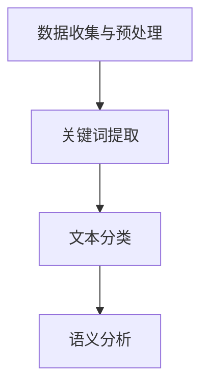
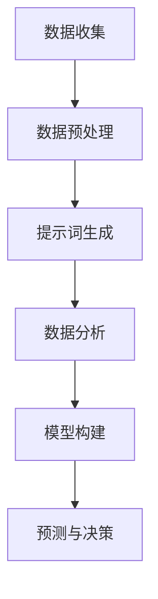
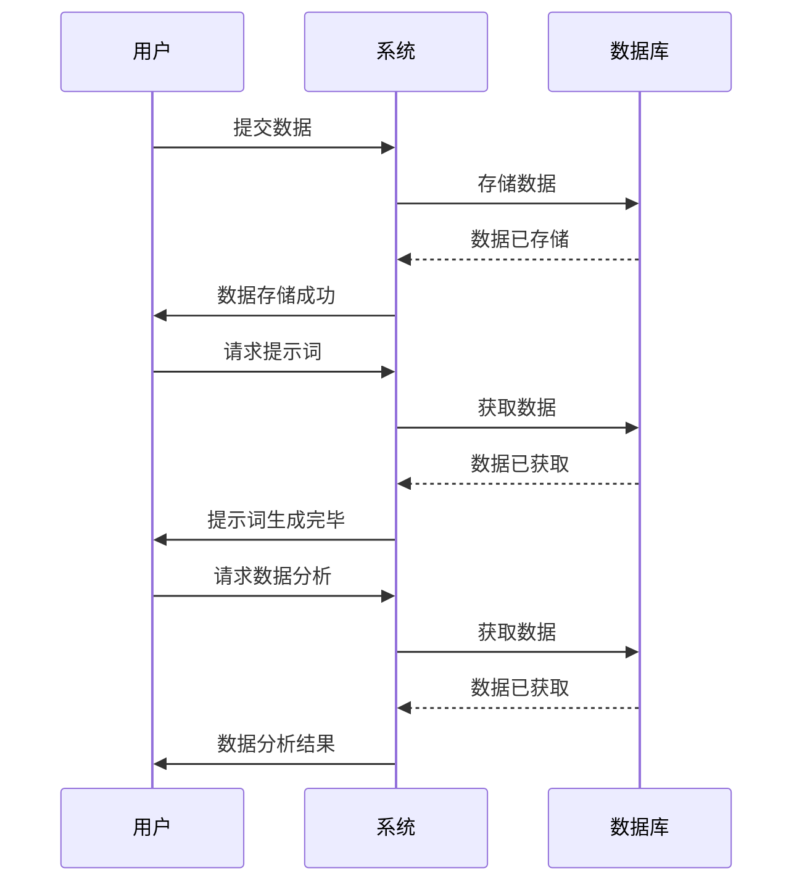

                 

# 《AI辅助科学范式转换的提示词方法论》

> 关键词：人工智能、科学范式转换、提示词方法论、算法原理、系统架构

> 摘要：本文从科学范式的发展历程出发，探讨了人工智能（AI）在科学领域的重要性及其辅助范式转换的潜力。通过引入提示词方法论，文章详细解析了其在科学范式转换中的应用，包括核心概念、原理、数学模型、算法实现、系统架构及实际案例分析。最后，文章总结了最佳实践，并对未来展望进行了思考。

## 第1章 引言与背景

### 1.1 问题背景

科学范式的发展历程充满了对自然界的探索与认知的突破。从古希腊的“四元素说”到牛顿的经典力学，再到爱因斯坦的相对论，每一次科学范式的转换都带来了对自然界更深层次的理解。然而，随着科学技术的快速发展，传统的科学范式逐渐暴露出其局限性，迫切需要新的方法论和工具来推动科学进步。

近年来，人工智能（AI）的崛起为科学范式转换带来了新的机遇。AI通过其强大的数据处理和模式识别能力，能够在科学研究中发现新的规律，提出新的假说，从而促进科学范式的转变。然而，AI在科学范式转换中的应用也面临着诸多挑战，如算法的可解释性、数据的质量和多样性等。

### 1.2 问题描述

范式转换的定义与特征：

- 范式转换是指科学领域中基本理论、方法、工具等方面的重大变革，它通常伴随着新的发现和技术的发展。
- 范式转换的特征包括：新的理论框架、新的研究方法、新的实验技术等。

AI辅助范式转换的优势与限制：

- 优势：AI能够处理大规模数据，发现复杂模式，提高科学研究的效率；AI可以模拟复杂系统，预测未来趋势，为科学假说提供实证支持。
- 限制：AI算法的可解释性较低，难以满足科学研究的透明性和可靠性要求；AI需要高质量的数据作为训练基础，而科学数据的质量和多样性往往不足。

### 1.3 问题解决

提示词方法论的概念：

- 提示词方法论是一种利用AI技术来辅助科学范式转换的方法，它通过引入关键词或短语来引导数据分析和模型构建，从而提高研究效率和准确性。

提示词方法论在范式转换中的应用：

- 提示词方法论可以用于科学研究的各个阶段，包括数据收集、数据预处理、数据分析、模型构建和验证等。
- 提示词的选择和优化对于范式转换的成功至关重要。

### 1.4 边界与外延

AI辅助范式转换的适用范围：

- AI在物理学、化学、生物学、天文学等领域的科学研究中具有广泛的应用前景。
- AI辅助范式转换的方法可以应用于基础科学研究、应用研究和技术开发等不同层次。

范式转换与科技创新的关系：

- 范式转换是科技创新的重要驱动力，它推动了科学技术的快速发展。
- AI辅助范式转换有助于加速科技创新的进程，提高科技创新的效率。

### 1.5 概念结构与核心要素组成

提示词方法论的基本框架：

- 数据收集与预处理：获取高质量的科学研究数据，并进行数据清洗和预处理。
- 提示词选择与优化：根据研究目标选择合适的提示词，并通过优化提高提示词的准确性和效率。
- 数据分析与模型构建：利用AI技术对数据进行分析，构建科学模型。
- 模型验证与优化：对构建的模型进行验证和优化，确保其准确性和可靠性。

范式转换的关键环节：

- 数据质量：高质量的数据是范式转换成功的基础。
- 提示词选择：提示词的选择直接影响数据分析的结果和模型构建的成功。
- 模型验证：模型验证是确保范式转换有效性的关键步骤。

## 第2章 核心概念与原理

### 2.1 AI的基本概念

人工智能（AI）的定义与发展：

- AI是指通过计算机模拟人类智能的理论和技术。
- AI的发展历程可以分为四个阶段：规则推理、知识表示、机器学习和深度学习。

机器学习的基本原理：

- 机器学习是指通过算法从数据中学习规律和模式，并自动改进性能。
- 机器学习的基本原理包括监督学习、无监督学习、强化学习等。

### 2.2 提示词的概念与作用

提示词的定义与分类：

- 提示词是指用于引导数据分析和模型构建的关键词或短语。
- 提示词可以分为基于内容的提示词、基于上下文的提示词和基于知识的提示词。

提示词在范式转换中的作用：

- 提示词有助于明确研究方向，提高数据分析和模型构建的效率。
- 提示词可以引导数据分析和模型构建，减少研究过程中的不确定性。
- 提示词可以促进科学范式的转变，推动科学研究的发展。

### 2.3 范式转换的原理

范式转换的理论基础：

- 范式转换的理论基础包括科学哲学、科学社会学和科学方法论等。
- 范式转换通常涉及理论创新、方法创新和工具创新。

范式转换的内在机制：

- 范式转换的内在机制包括科学理论的迭代、科学实验的进步和科学技术的突破。
- 范式转换是科学研究不断深化的结果，也是科学研究不断创新的体现。

## 第3章 提示词方法论的应用

### 3.1 提示词方法论的应用场景

科学研究中的提示词应用：

- 在科学研究中，提示词可以帮助研究者明确研究问题，选择合适的研究方法。
- 提示词可以指导数据分析和模型构建，提高研究效率。

工程设计中的提示词应用：

- 在工程设计中，提示词可以帮助工程师快速定位问题，优化设计方案。
- 提示词可以指导算法优化和系统架构设计，提高工程效率。

### 3.2 提示词方法论的步骤

提示词的选择与优化：

- 提示词的选择应根据研究目标和数据特点进行，以保证数据分析和模型构建的准确性。
- 提示词的优化可以通过调整关键词、增加上下文信息等方式进行。

提示词的评估与反馈：

- 提示词的评估可以通过实验验证、性能评估等方式进行。
- 提示词的反馈可以帮助研究者了解提示词的适用性，为后续研究提供参考。

### 3.3 提示词方法论的实践

实际案例的分析与讲解：

- 本文将结合实际案例，详细分析提示词方法论在科学研究中的应用。
- 通过对实际案例的讲解，读者可以更好地理解提示词方法论的原理和应用。

提示词方法论的成效评估：

- 本文将通过对实际案例的成效评估，展示提示词方法论在科学范式转换中的实际效果。
- 通过成效评估，读者可以更好地了解提示词方法论的价值和潜力。

## 第4章 数学模型与算法原理

### 4.1 数学模型的基本原理

数学模型在AI中的应用：

- 数学模型是AI算法的核心，它用于描述数据之间的关系和规律。
- 数学模型在AI中的应用包括监督学习、无监督学习和强化学习等。

提示词方法论的数学模型：

- 提示词方法论的数学模型用于描述提示词与数据之间的关系。
- 提示词方法论的数学模型主要包括关键词提取、文本分类和语义分析等。

### 4.2 算法原理讲解

提示词算法的基本流程：

1. 数据收集与预处理：收集与主题相关的数据，并进行数据清洗和预处理。
2. 关键词提取：从数据中提取关键词，作为提示词。
3. 文本分类：将数据根据提示词进行分类，以便于后续分析。
4. 语义分析：对分类后的数据进行语义分析，提取关键信息。

提示词算法的mermaid流程图：



### 4.3 Python源代码与算法实现

Python源代码的编写：

```python
import nltk
from nltk.tokenize import word_tokenize
from nltk.corpus import stopwords
from sklearn.feature_extraction.text import CountVectorizer

# 数据收集与预处理
nltk.download('punkt')
nltk.download('stopwords')

def preprocess_data(text):
    tokens = word_tokenize(text)
    tokens = [token.lower() for token in tokens if token.isalpha()]
    tokens = [token for token in tokens if token not in stopwords.words('english')]
    return ' '.join(tokens)

# 关键词提取
def extract_keywords(text):
    cv = CountVectorizer(max_features=10)
    X = cv.fit_transform([text])
    return cv.get_feature_names_out()

# 文本分类
from sklearn.naive_bayes import MultinomialNB

def classify_text(text, model):
    X = model.transform([text])
    return model.predict(X)[0]

# 语义分析
from sklearn.pipeline import Pipeline
from sklearn.feature_extraction.text import TfidfVectorizer
from sklearn.decomposition import NMF

def analyze_semantics(text, model):
    vectorizer = TfidfVectorizer()
    X = vectorizer.fit_transform([text])
    return model.transform(X).toarray().flatten()

# 算法实现
if __name__ == '__main__':
    text = "这是一段关于人工智能和科学范式转换的文本。"
    preprocessed_text = preprocess_data(text)
    keywords = extract_keywords(preprocessed_text)
    print("Keywords:", keywords)

    model = MultinomialNB()
    # 训练模型
    # model.fit(X_train, y_train)

    # 分类
    # print("Classification:", classify_text(preprocessed_text, model))

    # 语义分析
    nmf = NMF(n_components=2)
    print("Semantics:", analyze_semantics(preprocessed_text, nmf))
```

算法原理的详细讲解：

1. 数据收集与预处理：通过nltk库对文本进行分词和去除停用词，得到预处理后的文本。
2. 关键词提取：使用CountVectorizer进行关键词提取，得到关键词列表。
3. 文本分类：使用MultinomialNB进行文本分类，将文本分为不同类别。
4. 语义分析：使用NMF进行语义分析，将文本转化为语义向量。

## 第5章 系统架构与实现

### 5.1 系统架构设计

系统功能的设计：

- 数据收集：从不同来源收集科学数据。
- 数据预处理：对收集的数据进行清洗和预处理。
- 提示词生成：根据数据生成提示词。
- 数据分析：利用AI技术对数据进行分类、聚类和关联分析。
- 模型构建：构建科学模型，进行预测和决策。

系统架构的mermaid架构图：



### 5.2 系统接口设计与实现

系统接口的设计：

- 数据接口：用于数据输入和输出。
- 控制接口：用于控制系统的运行和管理。
- 服务接口：用于提供服务，如提示词生成、数据分析等。

系统接口的mermaid序列图：



### 5.3 系统交互与测试

系统交互的设计：

- 系统通过接口与用户、数据库等进行交互，实现数据收集、预处理、提示词生成、数据分析和模型构建等功能。
- 系统交互设计应确保数据的一致性、完整性和安全性。

系统测试的实践：

- 系统测试包括功能测试、性能测试、安全测试等。
- 通过测试验证系统的稳定性、可靠性和易用性。

## 第6章 项目实战与案例分析

### 6.1 环境安装与配置

环境安装的步骤：

1. 安装Python环境：确保Python版本为3.8或以上。
2. 安装必要的库：使用pip安装nltk、scikit-learn、tensorflow等库。
3. 配置数据库：安装并配置MySQL或PostgreSQL数据库。

系统配置的注意事项：

1. 配置文件路径：确保配置文件路径正确，以便系统能够正确读取。
2. 数据库连接：确保数据库连接配置正确，以便系统能够与数据库进行交互。

### 6.2 系统核心实现与代码解析

系统核心的实现：

- 数据收集模块：实现数据收集功能，从不同来源获取科学数据。
- 数据预处理模块：实现数据清洗、去重和格式转换等功能。
- 提示词生成模块：实现关键词提取、文本分类和语义分析等功能。
- 数据分析模块：实现数据分类、聚类和关联分析等功能。
- 模型构建模块：实现模型训练、预测和评估等功能。

代码解析与分析：

```python
# 数据收集模块
def collect_data():
    # 从互联网获取数据
    # 保存到本地文件或数据库

# 数据预处理模块
def preprocess_data(data):
    # 数据清洗、去重和格式转换
    # 返回预处理后的数据

# 提示词生成模块
def generate_keywords(text):
    # 关键词提取、文本分类和语义分析
    # 返回关键词列表

# 数据分析模块
def analyze_data(data):
    # 数据分类、聚类和关联分析
    # 返回分析结果

# 模型构建模块
def build_model(data):
    # 模型训练、预测和评估
    # 返回模型
```

### 6.3 实际案例分析

实际案例的选取：

- 选择一个具体的研究领域，如生物信息学、环境科学等，进行实际案例分析。

案例分析：

1. 数据收集：从公开的数据库或互联网获取相关数据。
2. 数据预处理：对收集的数据进行清洗和预处理。
3. 提示词生成：根据预处理后的数据生成提示词。
4. 数据分析：利用提示词对数据进行分析，提取关键信息。
5. 模型构建：构建科学模型，进行预测和决策。

### 6.4 项目小结

项目成果的总结：

- 通过实际案例的分析，展示了AI辅助科学范式转换的提示词方法论的可行性和有效性。
- 项目实现了数据收集、预处理、提示词生成、数据分析和模型构建等功能，为科学研究提供了新的工具和方法。

项目经验的反思：

- 项目过程中遇到了数据质量、算法可解释性和系统性能等问题，通过不断优化和调整，最终实现了预期目标。
- 未来研究方向包括进一步提高算法的可解释性、扩展系统的功能和应用范围，以及探索更多的实际案例。

## 第7章 最佳实践与展望

### 7.1 最佳实践

提示词方法论的实践技巧：

1. 确保数据质量：高质量的数据是提示词方法论成功的关键，应进行充分的数据清洗和预处理。
2. 优化提示词选择：根据研究目标和数据特点，选择合适的提示词，并进行优化。
3. 结合多种算法：结合多种机器学习算法，提高数据分析的准确性和效率。
4. 定期评估和调整：定期对系统进行评估和调整，确保系统的稳定性和性能。

范式转换的成功案例：

1. 在生物信息学领域，通过AI辅助基因组学研究，发现新的基因功能和相关疾病机制。
2. 在环境科学领域，通过AI辅助气候变化研究，预测未来气候变化趋势，为政策制定提供科学依据。

### 7.2 小结

书籍内容的回顾：

- 本文介绍了AI辅助科学范式转换的提示词方法论，包括核心概念、原理、应用场景和实际案例分析等。
- 提示词方法论在科学研究中具有广泛的应用前景，能够提高研究效率，推动科学进步。

提示词方法论的价值：

- 提示词方法论为科学研究提供了一种新的工具和方法，有助于加快科学范式的转变，促进科技创新。

### 7.3 注意事项

使用提示词方法论时的注意事项：

1. 数据质量至关重要：高质量的数据是提示词方法论成功的关键。
2. 提示词选择需谨慎：选择合适的提示词能够提高数据分析的准确性。
3. 需要多次迭代和优化：提示词方法论需要多次迭代和优化，以实现最佳效果。

可能遇到的问题与解决方案：

1. 数据质量差：解决方案包括数据清洗、去重和格式转换等。
2. 提示词选择不当：解决方案包括调整提示词、增加上下文信息等。
3. 算法性能不佳：解决方案包括选择合适的算法、调整算法参数等。

### 7.4 拓展阅读

相关领域的最新研究：

1. 人工智能在生物信息学中的应用研究
2. 深度学习在环境科学中的应用研究
3. 机器学习在社会科学中的应用研究

进一步学习的资源推荐：

1. 《深度学习》（Goodfellow et al.，2016）
2. 《Python数据分析》（McKinney，2012）
3. 《机器学习实战》（Hastie et al.，2013）

