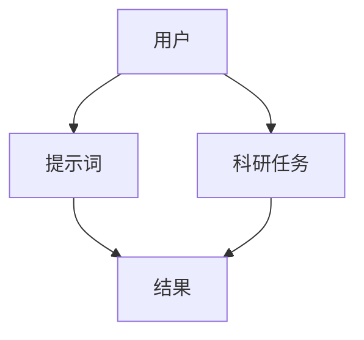

                 

### 第一部分: 引言

#### 1. 引言

在本篇技术博客中，我们将深入探讨AI辅助科研中的提示词设计方法。AI技术在科研领域的应用日益广泛，而提示词设计在其中扮演着至关重要的角色。本文旨在通过一步步的分析，帮助读者理解提示词的定义、特点、设计方法及其在AI辅助科研中的应用，最终形成一套高效实用的提示词设计最佳实践。

#### 1.1 问题背景

随着AI技术的快速发展，许多科研任务开始借助AI工具来实现自动化、智能化。在这些任务中，提示词的设计成为了一个关键问题。提示词不仅影响AI模型的学习效果，还直接决定了科研结果的准确性和效率。

#### 1.2 问题描述

提示词设计的问题可以归纳为以下几点：

- 如何定义和识别有效的提示词？
- 提示词的特点是什么？
- 提示词在AI辅助科研中如何发挥作用？
- 提示词设计面临哪些挑战？

#### 1.3 问题解决

为了解决上述问题，我们需要：

- 理解提示词的定义和特点。
- 探讨提示词与AI辅助科研的关系。
- 研究提示词的分类及其属性特征。
- 分析提示词设计的方法和工具。

#### 1.4 边界与外延

在本文中，我们将关注以下边界与外延：

- 提示词的定义范围。
- AI辅助科研的具体应用场景。
- 提示词设计的理论和技术框架。

#### 1.5 概念结构与核心要素组成

本文将采用以下概念结构与核心要素组成：

- 提示词的定义、特点及分类。
- 提示词与AI辅助科研的关系。
- 提示词设计的方法和工具。
- 提示词设计的实践案例。

### 第二部分：核心概念与联系

#### 2.1 提示词的定义

提示词（Prompt Word）是指用于引导AI模型进行学习、推理或决策的特定词汇或短语。在AI辅助科研中，提示词通常用于辅助AI模型理解任务目标、数据特征和预期输出。

#### 2.2 提示词的特点

- **引导性**：提示词能够引导AI模型关注特定的任务目标或数据特征。
- **多样性**：提示词可以根据不同的任务需求和数据特点进行灵活调整。
- **适应性**：提示词可以根据AI模型的反馈进行实时调整，以提高学习效果。

#### 2.3 提示词与AI辅助科研的关系

提示词在AI辅助科研中起着桥梁作用，连接用户需求与AI模型输出。通过设计合适的提示词，可以提高AI模型的训练效率和预测准确性，从而实现科研任务的自动化和智能化。

#### 2.4 提示词的分类

根据用途和特点，提示词可以分为以下几类：

- **数据特征提示词**：用于引导AI模型关注特定的数据特征。
- **任务目标提示词**：用于明确AI模型需要完成的任务目标。
- **推理引导提示词**：用于引导AI模型进行推理和决策。

#### 2.5 提示词与相关概念的联系

提示词与以下相关概念密切相关：

- **AI模型**：提示词通过引导AI模型关注特定任务和数据，影响模型的训练和推理效果。
- **数据集**：提示词的设计需要考虑数据集的分布和特征，以避免模型过拟合。
- **用户需求**：提示词的设计应满足用户需求，实现科研任务的自动化和智能化。

#### 2.6 提示词属性特征对比表格

下面是一个简单的提示词属性特征对比表格：

| 类别            | 特征                | 说明                                                         |
| --------------- | ------------------ | ------------------------------------------------------------ |
| 数据特征提示词  | 数据关联性、引导性   | 用于引导AI模型关注特定数据特征，提高模型学习效果。             |
| 任务目标提示词  | 目标明确性、引导性   | 用于明确AI模型需要完成的任务目标，确保模型输出符合预期。       |
| 推理引导提示词  | 推理性、引导性      | 用于引导AI模型进行推理和决策，提高模型推理效果。             |

#### 2.7 提示词ER实体关系图

下面是一个简单的提示词ER实体关系图：

- **用户**：进行科研任务的主体。
- **提示词**：用于引导AI模型完成科研任务。
- **科研任务**：用户指定的任务目标。
- **结果**：AI模型输出的科研结果。

### 第三部分：提示词设计方法概述

#### 3.1 提示词设计的重要性

提示词设计是AI辅助科研的核心环节，直接影响AI模型的学习效果和科研结果。一个优秀的提示词设计能够提高模型的学习效率和准确性，从而实现科研任务的自动化和智能化。

#### 3.2 提示词设计的流程

提示词设计通常包括以下流程：

1. **需求分析**：明确科研任务的目标和需求，确定提示词的用途。
2. **数据准备**：收集并整理相关数据，为提示词设计提供基础。
3. **初步设计**：根据需求分析，设计初步的提示词方案。
4. **模型训练**：使用AI模型对初步设计的提示词进行训练，验证效果。
5. **迭代优化**：根据模型训练结果，对提示词进行迭代优化，提高效果。

#### 3.3 提示词设计的挑战

提示词设计面临以下挑战：

- **多样性**：不同任务和场景下，需要设计不同类型的提示词，难以统一标准。
- **适应性**：提示词需要根据AI模型和用户需求进行实时调整，适应性要求高。
- **准确性**：提示词设计需要确保AI模型输出结果的准确性和可靠性。

### 第四部分：提示词设计原理

#### 4.1 语言理解原理

语言理解是AI模型的关键能力，它包括以下几个层次：

1. **词法分析**：将文本分解为单词或词组。
2. **语法分析**：分析文本的语法结构，确定句子成分和关系。
3. **语义分析**：理解文本的含义和语境。
4. **情

