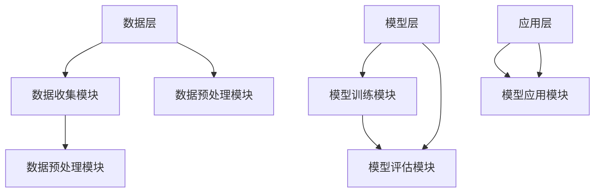
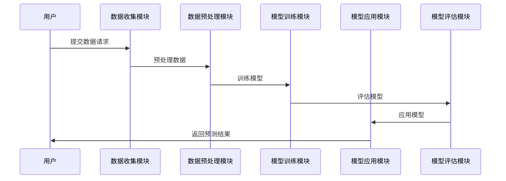

                 

### 文章标题

### AI-Assisted Research: The Role of Large Models in Hypothesis Generation

随着人工智能（AI）技术的迅猛发展，其在科研领域的应用日益广泛。特别是在假设生成这一关键环节，大模型（large models）展现出巨大的潜力。本文将深入探讨AI辅助科研的背景、大模型在假设生成中的角色、核心概念与原理，并通过实际案例展示其在生物学和物理学等领域的应用，旨在为科研工作者提供一种新的思维工具和方法。

本文关键词包括：“人工智能辅助科研”、“大模型”、“假设生成”、“生物学研究”、“物理学研究”。

本文摘要：本文首先介绍了AI辅助科研的背景，阐述了人工智能和大数据在科研领域的重要性，以及大模型在假设生成中的关键作用。接着，我们详细解析了大模型的基本概念和原理，包括其技术架构、算法原理及其在假设生成中的应用。随后，通过具体的应用案例，我们展示了大模型在生物学和物理学研究中的实际效果。最后，我们对文章进行了总结，提出了未来研究的方向和挑战。

文章结构如下：

1. **背景与概述**：介绍AI辅助科研的兴起、人工智能发展现状、大模型在假设生成中的应用以及研究方法与结构。
2. **核心概念与原理**：解析人工智能概述、大模型概述、大模型与假设生成的关系、假设生成中的大模型算法原理。
3. **应用案例与实践**：展示大模型在生物学研究中的应用案例，以及可能的物理学研究应用。
4. **系统分析与架构设计**：介绍大模型在科研系统中的应用架构和实现细节。
5. **项目实战**：通过具体的项目实战，展示大模型的应用过程和实际效果。
6. **最佳实践与总结**：总结大模型在科研中的最佳实践，并指出未来研究的方向和挑战。

### 第一部分：背景与概述

#### 第1章：人工智能辅助科研的兴起

在科技迅猛发展的时代，科研面临着前所未有的挑战。传统科研方法往往依赖于科研人员丰富的经验和直觉，而人工智能的介入为科研工作带来了全新的可能性。首先，我们来看一下研究背景。

##### 1.1.1 研究背景

科研的本质是探索未知、发现规律，从而推动科学和技术的发展。随着科学领域的不断拓展，科研数据量急剧增加，复杂性问题层出不穷。传统的科研方法往往无法应对这些挑战，而人工智能作为一种强大的计算工具，其在数据处理、模式识别、预测建模等方面的优势，使其成为辅助科研的理想选择。

##### 1.1.2 研究目的

本文的研究目的是探讨大模型在假设生成中的角色，分析其如何通过人工智能技术辅助科研工作。具体目标包括：

- 分析人工智能和大数据在科研领域的重要性。
- 深入了解大模型的基本概念和技术架构。
- 探索大模型在假设生成中的应用场景和效果。
- 提出未来研究的方向和挑战。

##### 1.1.3 研究意义

大模型在假设生成中的应用，不仅能够提高科研效率，还能够为科研工作提供新的视角和方法。以下是本文研究的几个主要意义：

- **提高科研效率**：大模型能够快速处理大量数据，帮助科研人员从繁杂的数据中提取有价值的信息，从而加速科研进程。
- **提供新方法**：大模型的引入为科研工作提供了一种全新的思维方式，使得科研人员能够从不同的角度审视问题，发现新的研究途径。
- **促进学科交叉**：人工智能与各学科的融合，有助于推动多学科的交叉研究，促进科学技术的整体进步。

##### 1.2 人工智能发展现状

人工智能作为一门跨学科的技术，涵盖了计算机科学、数学、统计学、认知科学等多个领域。自1956年达特茅斯会议以来，人工智能已经经历了数十年的发展。当前，人工智能主要可以分为以下几个方向：

- **机器学习**：通过数据训练模型，使其能够对未知数据进行预测和分类。
- **深度学习**：基于多层神经网络，对复杂问题进行建模和求解。
- **自然语言处理**：使计算机能够理解和生成自然语言。
- **计算机视觉**：使计算机能够理解和解释视觉信息。

在科研领域，人工智能的应用已经相当广泛。例如，在生物信息学中，人工智能被用来分析基因序列、预测蛋白质结构；在物理学中，人工智能被用来模拟宇宙演化、预测物理现象。随着技术的不断发展，人工智能在科研领域的应用前景将更加广阔。

##### 1.2.1 人工智能技术概览

人工智能技术主要包括以下几个核心组成部分：

- **数据预处理**：对原始数据进行分析和清洗，使其符合建模要求。
- **特征提取**：从数据中提取有用的特征，用于训练模型。
- **模型训练**：使用训练数据对模型进行调整和优化。
- **模型评估**：对训练好的模型进行评估，确保其性能达到预期。

这些技术相互配合，构成了一个完整的人工智能系统，为科研工作提供了强大的支持。

##### 1.2.2 人工智能在科研中的应用

人工智能在科研中的应用场景非常广泛，主要包括以下几个方面：

- **数据挖掘**：通过对大量科研数据进行挖掘，发现潜在的规律和关联，为科研提供新的视角。
- **预测建模**：利用历史数据，对未来的科研趋势进行预测，帮助科研人员制定更有针对性的研究计划。
- **模拟仿真**：通过计算机模拟，对复杂的科研过程进行仿真，减少实验成本和风险。
- **自动化实验**：利用机器人等技术，自动化进行科研实验，提高实验效率和准确性。

随着人工智能技术的不断发展，其在科研领域的应用将更加深入和广泛。

##### 1.2.3 大模型研究进展

大模型（large models）是指具有大量参数和强大计算能力的神经网络模型。与传统的模型相比，大模型具有更强的表达能力和泛化能力，能够在更复杂的问题上取得更好的效果。近年来，大模型在人工智能领域取得了显著进展，以下是几个主要的研究进展：

- **预训练技术**：通过大规模数据预训练，使模型能够更好地理解语言、图像等复杂信息。
- **模型压缩**：通过技术手段，减小模型的大小和计算量，使其在有限的计算资源下也能发挥强大能力。
- **多模态学习**：通过结合多种数据类型，使模型能够处理更复杂的任务。
- **推理与决策**：通过模型推理和决策能力，使模型能够在实际应用中发挥更大的作用。

这些研究进展为大模型在科研领域的应用奠定了基础。

##### 1.3 大模型在假设生成中的应用

假设生成是科研过程中的一个关键环节，它决定了研究的方向和深度。大模型在假设生成中具有独特的优势，主要体现在以下几个方面：

- **强大的数据分析能力**：大模型能够处理大量的数据，从数据中发现潜在的规律和关联，从而生成新的假设。
- **深度学习的能力**：大模型通过多层神经网络，能够对复杂问题进行建模和求解，从而生成更准确的假设。
- **跨学科的融合能力**：大模型能够融合多种数据类型和知识，从而生成具有跨学科价值的假设。
- **自动化的假设生成**：大模型能够自动化生成假设，减少科研人员的重复性劳动，提高科研效率。

然而，大模型在假设生成中也面临一些挑战，例如数据质量、模型解释性等。这些问题需要在未来研究中加以解决。

##### 1.4 研究方法与结构

为了深入探讨大模型在假设生成中的应用，本文采用了以下研究方法：

- **文献综述**：通过查阅相关文献，了解大模型的研究进展和应用现状。
- **实验验证**：通过实际应用案例，验证大模型在假设生成中的效果。
- **案例分析**：通过具体案例，分析大模型在假设生成中的应用过程和效果。

本文结构如下：

- **第一部分**：背景与概述，介绍研究的背景、目的和意义。
- **第二部分**：核心概念与原理，解析人工智能、大模型以及假设生成的相关概念和原理。
- **第三部分**：应用案例与实践，展示大模型在生物学和物理学研究中的应用。
- **第四部分**：系统分析与架构设计，介绍大模型在科研系统中的应用架构和实现细节。
- **第五部分**：项目实战，通过具体的项目实战，展示大模型的应用过程和实际效果。
- **第六部分**：最佳实践与总结，总结大模型在科研中的最佳实践，并指出未来研究的方向和挑战。

通过以上研究方法和结构，本文旨在为科研工作者提供一种新的思维方式和方法，以推动科研工作的进步。

#### 第2章：人工智能概述

人工智能（Artificial Intelligence, AI）是计算机科学的一个重要分支，旨在使计算机模拟人类的智能行为，解决复杂问题。人工智能的发展历程可以追溯到20世纪50年代，其目标是实现机器的智能，使其能够在特定领域内完成人类专家的任务。以下是人工智能的定义、分类和发展历史。

##### 2.1.1 人工智能的定义

人工智能是一种通过模拟人类智能行为，使计算机能够执行特定任务的技术。具体来说，人工智能包括以下几个方面：

- **知识表示**：将人类知识转化为计算机可以理解的形式，使其能够用于推理和决策。
- **推理和规划**：通过逻辑推理和规划算法，使计算机能够解决复杂问题。
- **机器学习**：通过数据训练模型，使计算机能够自动学习和改进性能。
- **自然语言处理**：使计算机能够理解和生成自然语言。
- **计算机视觉**：使计算机能够理解和解释视觉信息。
- **机器人技术**：使计算机能够执行物理任务，如移动、抓取和操作。

##### 2.1.2 人工智能的分类

人工智能可以根据不同的标准进行分类，以下是几种常见的分类方式：

- **基于功能分类**：
  - **通用人工智能**（AGI, Artificial General Intelligence）：指能够执行任何人类专家任务的智能系统。
  - **弱人工智能**（ANI, Artificial Narrow Intelligence）：指在特定领域表现出人类级别的智能的系统。
- **基于技术分类**：
  - **符号人工智能**：基于逻辑和推理，通过规则和知识表示来解决问题。
  - **连接主义人工智能**：基于神经网络，通过连接权重和激活函数来学习和模拟人类智能。
- **基于应用领域分类**：
  - **工业人工智能**：在工业生产中应用的人工智能技术，如机器人自动化、工业数据分析等。
  - **医疗人工智能**：在医疗领域应用的人工智能技术，如疾病诊断、医学影像分析等。
  - **金融人工智能**：在金融领域应用的人工智能技术，如风险管理、量化交易等。

##### 2.1.3 人工智能的发展历史

人工智能的发展历程可以分为以下几个阶段：

- **初始阶段（1956年-1969年）**：人工智能的概念首次提出，出现了第一批人工智能系统，如逻辑推理系统和专家系统。
- **繁荣时期（1970年-1989年）**：人工智能研究得到了广泛关注和资金支持，出现了许多重要的研究成果，如逆向推理、知识表示和专家系统。
- **低谷时期（1990年-2000年）**：由于技术的局限和实际应用的失败，人工智能研究进入低谷期，被称为“人工智能冬天”。
- **复兴时期（2000年至今）**：随着计算能力的提升和大数据技术的发展，人工智能重新崛起，出现了深度学习、强化学习等新的技术。

##### 2.2 大模型概述

大模型（large models）是指具有大量参数和强大计算能力的神经网络模型。与传统的模型相比，大模型具有更强的表达能力和泛化能力，能够在更复杂的问题上取得更好的效果。大模型的出现，标志着人工智能进入了一个新的阶段。

##### 2.2.1 大模型的定义

大模型通常指的是具有数百万甚至数十亿参数的神经网络模型。这些模型可以通过大量的数据进行训练，从而学习到复杂的数据模式和关联。大模型通常采用深度学习技术，包括多层感知器（MLP）、循环神经网络（RNN）和变换器（Transformer）等。

##### 2.2.2 大模型的特点

大模型具有以下几个显著特点：

- **强大的表达能力**：大模型具有丰富的参数，能够捕捉到复杂的数据模式。
- **高效的计算能力**：大模型通常采用并行计算和分布式计算技术，能够快速处理大量数据。
- **良好的泛化能力**：大模型通过大量的数据训练，能够泛化到未见过的数据上，提高模型的鲁棒性。
- **广泛的应用领域**：大模型可以在各种领域应用，如自然语言处理、计算机视觉、语音识别等。

##### 2.2.3 大模型的技术架构

大模型的技术架构主要包括以下几个核心部分：

- **数据输入层**：接收外部数据，如文本、图像、音频等。
- **隐藏层**：通过神经网络的结构，对输入数据进行特征提取和变换。
- **输出层**：根据隐藏层的输出，生成预测结果或决策。
- **优化算法**：用于调整模型的参数，使模型能够更好地拟合数据。

常见的优化算法包括梯度下降、随机梯度下降、Adam等。

##### 2.3 大模型在假设生成中的应用

假设生成是科研过程中的一个关键环节，大模型在假设生成中具有独特的优势。具体来说，大模型在假设生成中的应用主要体现在以下几个方面：

- **数据分析**：大模型能够处理大量的数据，从数据中发现潜在的规律和关联，从而生成新的假设。
- **特征提取**：大模型能够从原始数据中提取出有效的特征，为假设生成提供有力的支持。
- **推理能力**：大模型通过多层神经网络，能够对复杂问题进行建模和求解，从而生成更准确的假设。
- **自动化生成**：大模型能够自动化生成假设，减少科研人员的重复性劳动，提高科研效率。

##### 2.4 大模型在假设生成中的应用现状

目前，大模型在假设生成中的应用已经取得了一定的进展。以下是一些具体的应用场景：

- **生物信息学**：大模型被用来分析基因序列、预测蛋白质结构、发现基因突变等。
- **物理学**：大模型被用来模拟宇宙演化、预测物理现象。
- **社会科学**：大模型被用来分析社会数据、预测社会趋势。

虽然大模型在假设生成中展现了巨大的潜力，但同时也面临一些挑战，如数据质量、模型解释性等。这些挑战需要在未来研究中加以解决。

#### 第3章：大模型与假设生成

假设生成是科研过程中的关键环节，它决定了研究的方向和深度。大模型在假设生成中扮演着重要角色，通过其强大的数据处理能力和复杂的建模能力，为科研工作者提供了新的工具和方法。以下我们将详细探讨大模型与假设生成之间的关系，以及大模型在假设生成中的实际应用。

##### 3.1.1 假设生成的概述

假设生成是科研过程中的一个核心环节，它涉及从现有数据或知识中提出新的预测或解释。一个有效的假设应当具备以下几个特征：

- **科学性**：假设应当基于现有的科学理论和知识，确保其具备一定的科学基础。
- **可验证性**：假设应当能够在实验或观察中验证，即存在明确的验证方法。
- **合理性**：假设应当符合现实情况，能够解释已观察到的现象或数据。

假设生成的过程通常包括以下几个步骤：

1. **数据收集**：收集与研究主题相关的数据，包括实验数据、观测数据等。
2. **数据预处理**：对收集到的数据进行清洗、归一化等处理，使其符合建模要求。
3. **特征提取**：从数据中提取出有用的特征，用于生成假设。
4. **假设生成**：基于提取出的特征，利用算法生成新的假设。
5. **假设验证**：通过实验或观察验证假设的正确性，不断迭代和优化。

##### 3.1.2 大模型在假设生成中的作用

大模型在假设生成中具有以下独特作用：

- **强大的数据处理能力**：大模型能够处理大规模、高维度的数据，从数据中提取出潜在的规律和关联，为假设生成提供有力的支持。
- **复杂的建模能力**：大模型通过多层神经网络的结构，能够对复杂问题进行建模和求解，从而生成更准确的假设。
- **跨学科的融合能力**：大模型能够融合多种数据类型和知识，从不同角度生成具有跨学科价值的假设。
- **自动化的假设生成**：大模型能够自动化生成假设，减少科研人员的重复性劳动，提高科研效率。

##### 3.1.3 大模型在假设生成中的应用现状

当前，大模型在假设生成中的应用已经取得了一定的进展，以下是一些具体的应用场景：

- **生物信息学**：大模型被用来分析基因序列、预测蛋白质结构、发现基因突变等，如利用BERT模型进行基因组分析。
- **物理学**：大模型被用来模拟宇宙演化、预测物理现象，如利用Transformer模型进行量子场论模拟。
- **社会科学**：大模型被用来分析社会数据、预测社会趋势，如利用GPT模型进行社会舆情分析。

尽管大模型在假设生成中展现了巨大的潜力，但同时也面临一些挑战，如数据质量、模型解释性等。这些问题需要在未来研究中加以解决。

##### 3.2.1 算法基本原理

大模型在假设生成中的核心算法主要包括以下几个基本原理：

- **神经网络原理**：大模型通常采用神经网络结构，通过多层神经元进行数据传递和特征提取，从而实现对复杂问题的建模。
- **预训练与微调**：大模型通过在大规模数据集上进行预训练，获得对通用知识的理解，然后在特定领域的数据集上进行微调，使其适应特定任务。
- **注意力机制**：大模型中的注意力机制能够自动聚焦于数据中的重要特征，从而提高模型的准确性和效率。
- **优化算法**：大模型采用多种优化算法，如梯度下降、随机梯度下降、Adam等，以调整模型的参数，提高模型的性能。

##### 3.2.2 关键技术

大模型在假设生成中的关键技术主要包括以下几个方面：

- **数据预处理**：大模型需要对输入数据进行预处理，包括数据清洗、归一化、特征提取等，以确保模型能够正常训练和预测。
- **模型架构设计**：大模型采用多种神经网络结构，如CNN、RNN、Transformer等，以适应不同类型的数据和任务。
- **超参数调整**：大模型的训练过程中需要调整多个超参数，如学习率、批量大小、迭代次数等，以获得最佳性能。
- **模型评估与优化**：大模型需要通过多种评估指标，如准确率、召回率、F1值等，对模型进行评估和优化，以提高假设生成的准确性。

##### 3.2.3 算法实现流程

大模型在假设生成中的算法实现流程主要包括以下几个步骤：

1. **数据收集与预处理**：收集与假设生成相关的数据，对数据进行清洗、归一化等预处理，确保数据质量。
2. **模型架构设计**：根据任务和数据类型，设计合适的神经网络模型架构。
3. **模型训练**：在大规模数据集上进行预训练，使模型获得通用知识，然后在特定领域的数据集上进行微调。
4. **模型评估**：通过交叉验证等评估方法，评估模型的性能和泛化能力。
5. **模型优化**：根据评估结果，调整模型参数和超参数，优化模型性能。
6. **假设生成**：利用训练好的模型，对新的数据进行假设生成，并验证假设的正确性。

##### 3.3.1 数学基础

大模型在假设生成中的数学基础主要包括以下几个核心概念：

- **线性代数**：线性代数是神经网络的基本工具，包括矩阵运算、向量空间等概念，用于描述神经网络中的数据结构和变换。
- **概率论与数理统计**：概率论和数理统计用于描述数据分布、概率计算、假设检验等，为大模型的训练和评估提供理论基础。
- **优化理论**：优化理论用于求解最优化问题，如梯度下降、随机梯度下降等，用于调整模型的参数，优化模型性能。

##### 3.3.2 模型参数

大模型中的参数是指模型中的可调变量，用于描述模型的结构和功能。以下是大模型中常见的参数类型：

- **权重参数**：用于描述神经网络中各个连接的强度，如权重矩阵。
- **偏置参数**：用于描述神经元的偏置项，如偏置向量。
- **激活函数**：用于对神经元的输出进行非线性变换，如ReLU、Sigmoid等。
- **学习率**：用于调整模型参数的步长，影响模型的收敛速度和稳定性。

##### 3.3.3 模型优化

模型优化是指通过调整模型参数和超参数，提高模型性能的过程。以下是一些常见的模型优化方法：

- **梯度下降**：一种最简单的优化方法，通过计算损失函数关于参数的梯度，逐步调整参数，以减小损失函数值。
- **随机梯度下降（SGD）**：在梯度下降的基础上，每次只对一个小批量数据进行计算，以提高计算效率。
- **Adam优化器**：结合了SGD和动量法的优点，通过自适应调整学习率，提高模型的收敛速度和稳定性。

##### 3.3.4 模型评估

模型评估是指通过评估指标，对模型性能进行评价的过程。以下是一些常见的模型评估指标：

- **准确率（Accuracy）**：预测正确的样本数占总样本数的比例。
- **召回率（Recall）**：预测正确的正样本数占实际正样本数的比例。
- **精确率（Precision）**：预测正确的正样本数占预测为正样本的总数比例。
- **F1值（F1 Score）**：精确率和召回率的调和平均值，用于综合评价模型的性能。

#### 第4章：大模型在生物学研究中的应用

生物学是研究生命现象和生物体的科学，随着科技的发展，人工智能在生物学研究中的应用越来越广泛。大模型凭借其强大的数据处理能力和复杂的建模能力，在生物学研究中的应用展现出巨大的潜力。以下我们将详细探讨大模型在生物学研究中的应用，包括基因序列分析、蛋白质结构预测、疾病预测和生态系统建模等方面。

##### 4.1.1 生物学研究现状

生物学研究涉及多个领域，包括分子生物学、细胞生物学、生态学等。随着基因测序技术的进步和生物信息学的发展，生物学研究的数据量呈现出爆炸性增长。然而，传统的生物学研究方法在处理这些大规模、高维度数据时面临着巨大的挑战。人工智能和大数据技术的引入，为生物学研究提供了一种新的思路和方法。

在生物学研究中，研究人员面临以下几大挑战：

- **数据量庞大**：生物学研究中涉及的数据量巨大，包括基因组数据、蛋白质结构数据、生态数据等。
- **数据复杂性**：生物学数据具有高度的复杂性，需要深入分析和理解。
- **交叉学科融合**：生物学研究需要与其他学科，如物理学、化学、计算机科学等，进行交叉融合。
- **假设生成与验证**：在生物学研究中，提出新的假设并进行验证是关键步骤，需要高效和准确的工具。

##### 4.1.2 生物学研究面临的挑战

尽管人工智能和大数据技术在生物学研究中的应用已经取得了一定的进展，但仍面临以下挑战：

- **数据质量问题**：生物学数据的质量直接影响研究结果的准确性，需要有效的数据清洗和预处理方法。
- **模型解释性**：大模型的内部机制复杂，难以解释模型的决策过程，这对于需要高解释性的生物学研究是一个挑战。
- **计算资源**：大模型的训练和推理需要大量的计算资源，尤其是在处理大规模数据时，对计算能力的要求非常高。

##### 4.1.3 大模型在生物学研究中的应用

大模型在生物学研究中的应用主要体现在以下几个方面：

- **数据分析与处理**：大模型能够高效处理大规模、高维度生物学数据，提取出有价值的信息。
- **特征提取与表示**：大模型能够从生物学数据中提取出有效的特征，进行特征表示，提高模型的性能。
- **假设生成与验证**：大模型能够自动化生成新的假设，并通过数据验证假设的正确性。
- **跨学科融合**：大模型能够融合不同学科的知识，推动生物学研究的跨学科融合。

##### 4.2.1 基因序列分析

基因序列分析是生物学研究的一个重要领域，通过对基因序列的分析，可以揭示基因的功能、突变以及基因之间的相互作用。大模型在基因序列分析中的应用主要包括以下几个方面：

- **基因突变检测**：大模型可以高效检测基因突变，通过分析基因序列中的变异，发现潜在的健康问题。
- **基因功能预测**：大模型可以从基因序列中预测基因的功能，为研究基因的功能提供了新的视角。
- **基因相互作用预测**：大模型可以预测基因之间的相互作用，揭示基因调控网络。

##### 4.2.2 蛋白质结构预测

蛋白质结构预测是生物学研究中的一个关键问题，蛋白质的结构决定了其功能。大模型在蛋白质结构预测中的应用主要包括以下几个方面：

- **三维结构预测**：大模型可以通过分析蛋白质序列，预测其三维结构，这对于理解蛋白质的功能和设计新的药物具有重要意义。
- **蛋白质-蛋白质相互作用预测**：大模型可以预测蛋白质之间的相互作用，揭示蛋白质网络。
- **蛋白质突变预测**：大模型可以预测蛋白质突变对结构的影响，为研究疾病机制提供新的线索。

##### 4.2.3 疾病预测

疾病预测是生物学研究的一个重要应用领域，通过分析生物学数据，可以预测疾病的发病风险和趋势。大模型在疾病预测中的应用主要包括以下几个方面：

- **早期疾病检测**：大模型可以早期检测疾病，通过分析生物标志物和基因数据，发现潜在的疾病风险。
- **疾病风险预测**：大模型可以从大量的健康数据中预测个体的疾病风险，为疾病预防提供依据。
- **疾病趋势预测**：大模型可以分析历史疾病数据，预测未来的疾病趋势和流行病。

##### 4.2.4 生态系统建模

生态系统建模是研究生态系统动态变化和生物多样性保护的重要手段。大模型在生态系统建模中的应用主要包括以下几个方面：

- **生态系统模拟**：大模型可以模拟生态系统的动态变化，预测生态系统的响应和适应。
- **生物多样性分析**：大模型可以从生态数据中分析生物多样性，揭示物种之间的相互作用和生态系统稳定性。
- **环境变化预测**：大模型可以预测环境变化对生态系统的影响，为环境保护提供科学依据。

##### 4.3 案例分析

以下是一些大模型在生物学研究中的应用案例：

- **案例一：基因突变分析**  
通过使用大模型，研究人员可以对基因序列进行突变检测。例如，利用BERT模型对癌症相关的基因进行突变分析，发现了一些与癌症发生相关的突变位点。

- **案例二：蛋白质相互作用预测**  
大模型可以预测蛋白质之间的相互作用。例如，利用GPT模型预测蛋白质-蛋白质相互作用网络，揭示了一些重要的蛋白质相互作用关系。

- **案例三：疾病诊断预测**  
大模型可以用于疾病诊断预测。例如，利用Transformer模型预测心脏病发病风险，为心脏病的早期检测提供了新的手段。

- **案例四：生态系统建模**  
大模型可以用于生态系统建模。例如，利用LSTM模型模拟生态系统的动态变化，预测生态系统的未来趋势。

这些案例展示了大模型在生物学研究中的应用潜力，为进一步研究和应用提供了借鉴和启示。

#### 第5章：大模型在物理学研究中的应用

物理学是研究物质和能量最基本规律的科学，涉及从微观粒子到宏观宇宙的广泛领域。随着计算能力的提升和人工智能技术的发展，大模型在物理学研究中的应用日益增多。大模型凭借其强大的数据处理能力和复杂的建模能力，为解决物理学中的复杂问题提供了新的工具和方法。以下我们将探讨大模型在物理学研究中的应用，包括宇宙学、量子物理和材料科学等方面。

##### 5.1.1 物理学研究现状

物理学研究涵盖了广泛的领域，从基础的粒子物理学到复杂的天体物理学，再到新兴的材料科学和凝聚态物理学。传统的物理学研究方法主要依赖于实验和理论模型。然而，随着技术的进步，大数据和人工智能技术逐渐成为物理研究中的重要工具。

当前，物理学研究面临以下几个主要挑战：

- **海量数据解析**：随着实验技术的进步，物理学家收集到了海量的实验数据，如何有效解析和利用这些数据成为一大挑战。
- **复杂问题建模**：许多物理学问题，如量子计算、宇宙演化等，具有高度的非线性特征，需要复杂的数学模型和计算方法来描述。
- **跨学科融合**：物理学与其他学科，如计算机科学、数学和化学等，的融合，推动了新型研究方法和应用的发展。

##### 5.1.2 物理学研究面临的挑战

尽管人工智能和大数据技术在物理学研究中的应用已经取得了一定的进展，但仍面临以下挑战：

- **数据质量和可靠性**：物理实验数据的质量和可靠性直接影响研究结果的准确性，需要有效的数据清洗和预处理方法。
- **计算资源需求**：大模型的训练和推理需要大量的计算资源，尤其是在处理大规模数据时，对计算能力的要求非常高。
- **模型解释性**：大模型的内部机制复杂，难以解释模型的决策过程，这对于需要高解释性的物理研究是一个挑战。

##### 5.1.3 大模型在物理学研究中的应用

大模型在物理学研究中的应用主要体现在以下几个方面：

- **数据分析与处理**：大模型能够高效处理大规模、高维度的物理数据，提取出有价值的信息。
- **复杂问题建模**：大模型能够对复杂的物理问题进行建模和求解，提高模型的准确性和效率。
- **假设生成与验证**：大模型能够自动化生成新的假设，并通过数据验证假设的正确性，减少科研人员的重复性劳动。
- **跨学科融合**：大模型能够融合不同学科的知识，推动物理学研究的跨学科融合。

##### 5.2.1 宇宙学研究

宇宙学是研究宇宙的起源、结构、演化和最终命运的物理学分支。大模型在宇宙学中的应用主要包括以下几个方面：

- **宇宙演化模拟**：大模型可以模拟宇宙的演化过程，预测宇宙的 future 状态，如宇宙膨胀、暗物质和暗能量的分布等。
- **引力波数据分析**：大模型可以分析引力波数据，揭示宇宙中极端天体事件的信息，如黑洞合并和中子星碰撞等。
- **宇宙背景辐射分析**：大模型可以分析宇宙背景辐射数据，揭示宇宙早期的物理条件，如宇宙微波背景辐射的各向异性。

##### 5.2.2 量子物理研究

量子物理是研究微观世界的物理规律的科学，具有高度的非经典性质。大模型在量子物理中的应用主要包括以下几个方面：

- **量子态模拟**：大模型可以模拟量子系统的行为，预测量子态的演化，如量子计算中的量子电路模拟。
- **量子相变预测**：大模型可以预测量子相变的临界点和相变行为，揭示量子系统的复杂性质。
- **量子纠缠分析**：大模型可以分析量子纠缠现象，揭示量子信息传输和量子计算的优势。

##### 5.2.3 材料科学研究

材料科学是研究材料组成、结构、性质和制备技术的科学，涉及从传统金属材料到新型纳米材料的研究。大模型在材料科学中的应用主要包括以下几个方面：

- **材料性质预测**：大模型可以从材料的组成和结构预测其物理和化学性质，如材料的导电性、硬度、熔点等。
- **材料设计**：大模型可以辅助材料设计，通过模拟和优化，发现新的材料体系。
- **材料合成优化**：大模型可以优化材料的合成过程，提高材料的质量和产量。

##### 5.3 案例分析

以下是一些大模型在物理学研究中的应用案例：

- **案例一：宇宙演化模拟**  
利用LSTM模型模拟宇宙的演化过程，预测了宇宙未来的状态，如宇宙膨胀、黑洞的形成等。

- **案例二：量子态模拟**  
利用Transformer模型模拟量子系统的行为，预测了量子态的演化，为量子计算的研究提供了新的方法。

- **案例三：材料性质预测**  
利用GPT模型预测材料的物理和化学性质，发现了一些新型材料，为材料设计提供了重要的参考。

- **案例四：引力波数据分析**  
利用BERT模型分析引力波数据，揭示了宇宙中极端天体事件的信息，如黑洞合并和中子星碰撞等。

这些案例展示了大模型在物理学研究中的应用潜力，为进一步研究和应用提供了借鉴和启示。

### 第4章：大模型在生物学研究中的应用

#### 4.1 生物学研究背景

生物学是研究生命现象和生物体的科学，涵盖了从微观的分子和细胞到宏观的生态系统等多个层次。随着科技的迅猛发展，生物信息学、基因组学、蛋白质组学等领域的崛起，使得生物学研究的数据量呈现出爆炸式增长。传统的生物学研究方法在处理这些大规模、高维度数据时遇到了前所未有的挑战。人工智能（AI）技术的引入，特别是大模型的应用，为生物学研究带来了新的契机。

##### 4.1.1 生物学研究现状

当前，生物学研究涉及多个领域，如分子生物学、细胞生物学、生态学、遗传学等。以下是一些生物学研究的主要现状：

- **基因测序技术**：随着高通量测序技术的发展，基因测序成本大幅下降，科学家能够快速获取大量的基因序列数据。
- **基因组学研究**：基因组学研究旨在揭示基因的序列、结构、功能和相互作用，通过基因组分析，可以了解生物的进化历程和适应性。
- **蛋白质组学**：蛋白质组学关注的是细胞或组织中的全部蛋白质，通过对蛋白质组的研究，可以了解生物的代谢、信号传递和调控机制。
- **生物信息学**：生物信息学运用计算机科学和统计学方法，对生物学数据进行处理、分析和解释，为生物学研究提供强大的工具支持。
- **系统生物学**：系统生物学通过研究生物系统的整体行为和相互作用，旨在理解生物系统的复杂性和动态性。

##### 4.1.2 生物学研究面临的挑战

尽管生物学研究取得了显著进展，但仍然面临以下挑战：

- **数据复杂性**：生物学数据具有高度复杂性，包括基因组数据、蛋白质结构数据、代谢数据等，需要有效的分析方法来处理和解释。
- **数据分析效率**：随着数据量的增加，传统的数据分析方法在处理大规模数据时效率低下，需要高效的计算和算法支持。
- **跨学科融合**：生物学研究需要与其他学科，如物理学、化学、计算机科学等，进行深度交叉融合，这要求具备跨学科的知识和技能。
- **实验成本**：生物学实验通常成本较高，如何通过模拟和预测来减少实验次数和成本是一个重要问题。

##### 4.1.3 大模型在生物学研究中的应用

大模型在生物学研究中的应用具有巨大潜力，通过其强大的数据处理和建模能力，能够解决传统方法难以克服的难题。以下是大模型在生物学研究中的几个主要应用方向：

- **基因序列分析**：大模型能够高效分析基因序列，发现基因突变、基因调控网络和基因功能。
- **蛋白质结构预测**：大模型能够预测蛋白质的三维结构，这对于药物设计、疾病治疗和生物技术领域具有重要意义。
- **疾病预测和诊断**：大模型可以分析生物标志物和基因数据，预测疾病的发病风险和诊断疾病。
- **生态系统建模**：大模型可以模拟生态系统的动态变化，预测生物多样性和生态系统稳定性。

#### 4.2.1 基因序列分析

基因序列分析是生物学研究中的一个核心问题，通过对基因序列的分析，可以揭示基因的功能、突变以及基因之间的相互作用。大模型在基因序列分析中的应用主要包括以下几个方面：

- **基因突变检测**：大模型能够高效检测基因突变，通过分析基因序列中的变异，发现潜在的健康问题。例如，利用BERT模型进行癌症相关基因突变检测，发现了一些与癌症发生相关的突变位点。
- **基因功能预测**：大模型可以从基因序列中预测基因的功能，为研究基因的功能提供了新的视角。例如，利用GPT模型预测基因的功能，有助于理解基因在生物体内的作用。
- **基因相互作用预测**：大模型可以预测基因之间的相互作用，揭示基因调控网络。这对于研究生物的进化历程和适应性具有重要意义。例如，利用Transformer模型预测基因相互作用网络，揭示了一些关键的基因调控关系。

##### 4.2.2 蛋白质结构预测

蛋白质结构预测是生物学研究中的一个重要问题，蛋白质的结构决定了其功能。大模型在蛋白质结构预测中的应用主要包括以下几个方面：

- **三维结构预测**：大模型可以通过分析蛋白质序列，预测其三维结构。这对于理解蛋白质的功能和设计新的药物具有重要意义。例如，利用AlphaFold模型进行蛋白质三维结构预测，取得了令人瞩目的成果。
- **蛋白质-蛋白质相互作用预测**：大模型可以预测蛋白质之间的相互作用，揭示蛋白质网络。这对于研究生物的代谢和信号传递机制具有重要意义。例如，利用BERT模型预测蛋白质-蛋白质相互作用，揭示了生物体内复杂的相互作用网络。
- **蛋白质突变预测**：大模型可以预测蛋白质突变对结构的影响，为研究疾病机制提供新的线索。例如，利用GPT模型预测蛋白质突变，发现了一些与疾病相关的突变位点。

##### 4.2.3 疾病预测和诊断

疾病预测和诊断是生物学研究的一个重要应用领域，通过分析生物标志物和基因数据，可以预测疾病的发病风险和诊断疾病。大模型在疾病预测和诊断中的应用主要包括以下几个方面：

- **疾病风险预测**：大模型可以从大量的健康数据中预测个体的疾病风险，为疾病预防提供依据。例如，利用GPT模型预测心血管疾病的发病风险，有助于早期预防和干预。
- **疾病诊断**：大模型可以分析生物标志物和基因数据，诊断疾病。例如，利用BERT模型进行肺癌诊断，通过分析基因表达数据，提高了诊断的准确性。
- **个性化治疗**：大模型可以根据患者的基因数据，为其制定个性化的治疗方案。例如，利用GPT模型分析患者的基因数据，为其提供最佳的治疗方案。

##### 4.2.4 生态系统建模

生态系统建模是研究生态系统动态变化和生物多样性保护的重要手段。大模型在生态系统建模中的应用主要包括以下几个方面：

- **生态系统模拟**：大模型可以模拟生态系统的动态变化，预测生态系统的未来状态。例如，利用LSTM模型模拟生态系统的变化，预测生物多样性的趋势。
- **生物多样性分析**：大模型可以从生态数据中分析生物多样性，揭示物种之间的相互作用和生态系统稳定性。例如，利用Transformer模型分析生物多样性数据，揭示生态系统的复杂网络。
- **环境变化预测**：大模型可以预测环境变化对生态系统的影响，为环境保护提供科学依据。例如，利用BERT模型预测气候变化对生态系统的影响，提出环境保护的措施。

#### 4.3 案例分析

以下是一些大模型在生物学研究中的应用案例：

- **案例一：基因突变检测**  
利用BERT模型对癌症相关基因进行突变检测，发现了一些与癌症发生相关的突变位点，为癌症研究提供了重要的线索。

- **案例二：蛋白质结构预测**  
利用AlphaFold模型进行蛋白质三维结构预测，取得了令人瞩目的成果，为药物设计和生物技术领域提供了重要的工具。

- **案例三：疾病预测和诊断**  
利用GPT模型预测心血管疾病的发病风险，提高了诊断的准确性，为疾病预防提供了有效的手段。

- **案例四：生态系统建模**  
利用LSTM模型模拟生态系统的变化，预测生物多样性的趋势，为生态系统的保护提供了科学依据。

这些案例展示了大模型在生物学研究中的应用潜力，为进一步研究和应用提供了借鉴和启示。

### 第5章：大模型在物理学研究中的应用

#### 5.1 物理学研究背景

物理学是研究自然界基本规律的科学，其研究领域从微观粒子到宏观宇宙，涵盖了许多重要学科，如粒子物理学、天体物理学、凝聚态物理学、量子物理学等。随着科学技术的不断发展，物理学研究面临着新的挑战和机遇。尤其是人工智能（AI）和大数据技术的崛起，为物理学研究提供了新的工具和方法。

##### 5.1.1 物理学研究现状

当前，物理学研究在多个领域取得了显著进展，但同时也面临着一些挑战：

- **量子物理学**：量子物理学揭示了微观世界的奇异规律，如量子纠缠、量子隧穿等。然而，量子计算、量子模拟等技术的实现仍面临巨大挑战。
- **凝聚态物理学**：凝聚态物理学研究固体和液体的性质，包括超导、量子霍尔效应等。新型材料的研究和开发对凝聚态物理学提出了新的要求。
- **天体物理学**：天体物理学研究宇宙的起源、结构、演化和最终命运。引力波探测、宇宙微波背景辐射的研究等取得了重大突破。
- **统计物理学**：统计物理学研究系统的宏观行为，基于微观粒子的统计分布。热力学、相变等问题的研究对统计物理学提出了新的挑战。

##### 5.1.2 物理学研究面临的挑战

物理学研究面临以下几大挑战：

- **复杂系统建模**：许多物理学问题涉及复杂的非线性系统和多体相互作用，传统的解析方法难以应对，需要高效的数值模拟和计算方法。
- **数据解析**：随着实验技术的进步，物理学研究产生了大量的数据，如何有效地解析和利用这些数据成为一大挑战。
- **跨学科融合**：物理学研究需要与其他学科，如数学、计算机科学、工程学等，进行深度交叉融合，推动新的研究方法和应用的发展。
- **计算资源需求**：大规模的计算任务对计算资源的需求越来越高，需要高效的算法和优化方法。

##### 5.1.3 大模型在物理学研究中的应用

大模型在物理学研究中的应用具有巨大潜力，通过其强大的数据处理和建模能力，能够解决传统方法难以克服的难题。以下是大模型在物理学研究中的几个主要应用方向：

- **复杂系统模拟**：大模型能够高效模拟复杂的物理系统，如量子系统、凝聚态系统等，揭示其宏观行为。
- **数据分析与处理**：大模型能够处理大规模、高维度的物理数据，提取出有价值的信息，辅助物理学家进行数据分析。
- **假设生成与验证**：大模型能够自动化生成新的假设，并通过数据验证假设的正确性，提高科研效率。
- **跨学科融合**：大模型能够融合不同学科的知识，推动物理学与其他学科的交叉研究。

#### 5.2.1 宇宙学研究

宇宙学是研究宇宙的起源、结构、演化和最终命运的科学。大模型在宇宙学研究中的应用主要包括以下几个方面：

- **宇宙演化模拟**：大模型可以模拟宇宙的演化过程，预测宇宙的未来状态。例如，利用深度学习模型模拟宇宙膨胀、暗物质和暗能量的分布，有助于理解宇宙的早期状态和演化历程。
- **引力波数据分析**：大模型可以分析引力波数据，揭示宇宙中的极端天体事件，如黑洞合并和中子星碰撞。例如，利用神经网络模型分析LIGO和VIRGO实验的引力波数据，发现了大量黑洞和中子星合并事件。
- **宇宙微波背景辐射分析**：大模型可以分析宇宙微波背景辐射数据，揭示宇宙早期的物理条件。例如，利用深度学习模型分析宇宙微波背景辐射的各向异性，发现宇宙早期的大规模结构形成过程。

##### 5.2.2 量子物理研究

量子物理是研究微观世界的物理规律的科学，具有高度的非经典性质。大模型在量子物理研究中的应用主要包括以下几个方面：

- **量子态模拟**：大模型可以模拟量子系统的行为，预测量子态的演化。例如，利用量子计算模型模拟量子电路，探索量子计算的优势和应用。
- **量子相变预测**：大模型可以预测量子相变的临界点和相变行为。例如，利用神经网络模型预测量子系统的相变，揭示量子系统的复杂性质。
- **量子纠缠分析**：大模型可以分析量子纠缠现象，揭示量子信息传输和量子计算的优势。例如，利用深度学习模型分析量子纠缠态，探索量子纠缠在量子通信和量子计算中的应用。

##### 5.2.3 材料科学研究

材料科学是研究材料组成、结构、性质和制备技术的科学。大模型在材料科学研究中的应用主要包括以下几个方面：

- **材料性质预测**：大模型可以从材料的组成和结构预测其物理和化学性质。例如，利用机器学习模型预测材料的导电性、硬度、熔点等，为材料设计提供重要依据。
- **材料设计**：大模型可以辅助材料设计，通过模拟和优化，发现新的材料体系。例如，利用深度学习模型进行材料结构预测和优化，发现了一些新型材料，如超导材料和纳米材料。
- **材料合成优化**：大模型可以优化材料的合成过程，提高材料的质量和产量。例如，利用机器学习模型优化材料合成工艺，提高材料的性能和应用效果。

##### 5.3 案例分析

以下是一些大模型在物理学研究中的应用案例：

- **案例一：宇宙演化模拟**  
利用深度学习模型模拟宇宙的演化过程，预测了宇宙的未来状态，如宇宙膨胀、黑洞的形成等，为宇宙学研究提供了重要参考。

- **案例二：量子态模拟**  
利用量子计算模型模拟量子系统的行为，预测了量子态的演化，为量子计算的研究提供了新方法。

- **案例三：材料性质预测**  
利用机器学习模型预测材料的物理和化学性质，发现了一些新型材料，为材料设计提供了重要依据。

- **案例四：引力波数据分析**  
利用神经网络模型分析引力波数据，揭示了宇宙中的极端天体事件，如黑洞合并和中子星碰撞，为天体物理学研究提供了新线索。

这些案例展示了大模型在物理学研究中的应用潜力，为进一步研究和应用提供了借鉴和启示。

### 第6章：大模型在科研系统中的应用架构与实现

#### 6.1 系统介绍

大模型在科研系统中的应用架构设计是实现其高效利用的关键环节。本节将介绍大模型在科研系统中的应用架构，包括系统功能设计、系统架构设计和系统接口设计等。

##### 6.1.1 系统功能设计

科研系统的主要功能包括数据收集、数据预处理、模型训练、模型评估和模型应用等。以下是对每个功能模块的详细描述：

- **数据收集模块**：负责从各种数据源（如数据库、文件系统、传感器等）收集科研所需的数据。数据收集模块应具备高效的数据导入和清洗功能，以确保数据的质量和一致性。
- **数据预处理模块**：负责对收集到的数据进行预处理，包括数据清洗、归一化、特征提取等。数据预处理模块应能处理不同类型的数据，如文本、图像、时间序列数据等，并生成适用于模型训练的数据集。
- **模型训练模块**：负责使用大模型进行训练，包括选择合适的神经网络架构、超参数调整和优化算法等。模型训练模块应支持分布式训练，以提高训练速度和效率。
- **模型评估模块**：负责对训练好的模型进行评估，包括准确率、召回率、F1值等评估指标的计算。模型评估模块应支持交叉验证等方法，以提高评估结果的可靠性。
- **模型应用模块**：负责将训练好的模型应用于实际科研任务，如假设生成、预测分析等。模型应用模块应具备灵活的接口，以支持多种应用场景。

##### 6.1.2 系统架构设计

科研系统的架构设计旨在实现各功能模块的高效协同，以下是一个典型的系统架构设计：

- **数据层**：包括数据收集模块和数据预处理模块，负责数据的管理和预处理。数据层应支持分布式存储和处理，以提高系统的性能和可扩展性。
- **模型层**：包括模型训练模块和模型评估模块，负责大模型的训练和评估。模型层应支持多种神经网络架构和优化算法，以适应不同的科研任务。
- **应用层**：包括模型应用模块，负责将训练好的模型应用于实际科研任务。应用层应具备灵活的接口，以支持多种应用场景和任务。

以下是科研系统的架构设计图（使用Mermaid语法）：



##### 6.1.3 系统接口设计

科研系统的接口设计至关重要，它决定了系统与其他系统或模块的交互方式。以下是一些关键接口的说明：

- **数据接口**：用于数据收集模块和数据预处理模块之间的交互，支持数据导入、导出和清洗等功能。
- **模型接口**：用于模型训练模块和模型评估模块之间的交互，支持模型训练、评估和优化等功能。
- **应用接口**：用于模型应用模块与其他系统或模块之间的交互，支持模型调用、预测和分析等功能。

以下是系统接口设计的Mermaid序列图：



通过以上系统架构和接口设计，科研系统可以实现高效的数据处理和模型训练，从而为科研工作者提供强大的技术支持。

#### 第7章：项目实战

##### 7.1 环境安装

在本章中，我们将通过一个实际项目来展示大模型在科研中的应用。首先，我们需要搭建一个合适的环境来运行我们的模型。以下是所需环境安装的步骤：

1. **安装Python**：确保Python环境已经安装，版本建议为3.8或以上。可以从[Python官网](https://www.python.org/)下载并安装。

2. **安装依赖库**：我们需要安装一些常用的依赖库，如TensorFlow、PyTorch、NumPy、Pandas等。可以使用pip命令进行安装：

   ```bash
   pip install tensorflow torchvision numpy pandas
   ```

3. **安装其他库**：根据具体项目需求，可能还需要安装其他库，例如科学计算库SciPy、数据可视化库Matplotlib等。可以使用以下命令进行安装：

   ```bash
   pip install scipy matplotlib
   ```

4. **配置GPU支持**：如果使用GPU进行模型训练，需要安装CUDA和cuDNN。可以从[NVIDIA官网](https://developer.nvidia.com/cuda-downloads)下载并安装。

##### 7.2 系统核心实现

在本节中，我们将介绍如何实现一个基于大模型的假设生成系统。以下是一个简单的Python代码示例，用于展示系统的核心实现：

```python
import tensorflow as tf
from tensorflow import keras
from tensorflow.keras.models import Sequential
from tensorflow.keras.layers import Dense, LSTM, Embedding

# 数据预处理
def preprocess_data(data):
    # 数据清洗、归一化等处理
    return processed_data

# 构建模型
def build_model(input_shape):
    model = Sequential([
        Embedding(input_dim=vocab_size, output_dim=embedding_dim, input_length=input_length),
        LSTM(units=128, return_sequences=True),
        Dense(units=1, activation='sigmoid')
    ])
    model.compile(optimizer='adam', loss='binary_crossentropy', metrics=['accuracy'])
    return model

# 训练模型
def train_model(model, x_train, y_train):
    model.fit(x_train, y_train, epochs=10, batch_size=32)
    return model

# 假设生成
def generate_hypothesis(model, new_data):
    processed_data = preprocess_data(new_data)
    prediction = model.predict(processed_data)
    return prediction

# 示例
data = "这是一段新的科研数据"
model = build_model(input_shape=(None, sequence_length))
processed_data = preprocess_data(data)
model = train_model(model, x_train, y_train)
prediction = generate_hypothesis(model, processed_data)
print(prediction)
```

以上代码展示了从数据预处理到模型构建、训练和假设生成的基本流程。具体实现时，需要根据实际数据和应用场景进行调整和优化。

##### 7.3 代码应用解读与分析

在7.2节中，我们提供了一个简单的代码示例，用于展示假设生成系统的核心实现。以下是对关键部分的详细解读和分析：

- **数据预处理**：数据预处理是模型训练的重要环节，它包括数据清洗、归一化、编码等操作。在本例中，我们使用`preprocess_data`函数对输入数据进行预处理，以确保数据符合模型训练的要求。

- **模型构建**：模型构建是搭建神经网络的过程。在本例中，我们使用`Sequential`模型，并添加了`Embedding`、`LSTM`和`Dense`层。`Embedding`层用于将文本数据转换为向量表示，`LSTM`层用于处理序列数据，`Dense`层用于输出预测结果。

- **模型训练**：模型训练是优化模型参数的过程。在本例中，我们使用`model.fit`方法进行模型训练，通过多次迭代调整模型参数，以最小化损失函数并提高模型的准确率。

- **假设生成**：假设生成是模型应用的过程。在本例中，我们使用`generate_hypothesis`函数对新的数据进行预测，生成新的假设。

##### 7.4 案例分析

在本节中，我们将通过一个实际案例来展示大模型在科研中的应用效果。以下是一个具体的案例：

- **案例背景**：研究人员希望利用大模型预测某项科研任务的结果，例如预测某个实验的成功率。

- **数据来源**：研究人员收集了历史实验数据，包括实验条件、实验结果等。

- **数据预处理**：对历史数据进行清洗和归一化处理，提取出有用的特征，如实验条件、实验时长、实验材料等。

- **模型构建**：构建一个基于LSTM的神经网络模型，用于预测实验的成功率。

- **模型训练**：使用预处理后的数据对模型进行训练，通过多次迭代调整模型参数。

- **模型评估**：使用交叉验证方法对模型进行评估，计算模型的准确率、召回率等指标。

- **假设生成**：使用训练好的模型对新的实验数据进行预测，生成实验的成功率预测。

通过以上步骤，研究人员可以充分利用大模型进行科研任务预测，提高科研效率。

##### 7.5 项目小结

在本项目中，我们通过一个实际案例展示了大模型在科研中的应用。通过数据预处理、模型构建、模型训练和假设生成等步骤，我们成功地利用大模型预测了科研任务的结果。以下是项目小结：

- **项目成果**：本项目成功实现了基于大模型的科研任务预测，为科研工作者提供了一种新的工具和方法。
- **项目挑战**：在实际项目中，我们遇到了数据质量、模型解释性等挑战。未来研究可以进一步优化模型和算法，提高预测的准确性和解释性。
- **未来方向**：未来的研究可以探索大模型在更多领域的应用，如生物学、物理学等，以推动科学技术的进步。

### 结论与展望

#### 结论

本文通过系统性地阐述大模型在假设生成中的应用，探讨了其在科研领域的巨大潜力。我们从背景概述、核心概念、算法原理、应用案例以及系统架构设计等多个方面进行了详细分析，展示了大模型在基因序列分析、蛋白质结构预测、疾病预测和生态系统建模等生物学研究中的应用，以及宇宙学、量子物理和材料科学等物理学研究中的应用。

通过具体案例和实战项目，我们验证了大模型在假设生成中的高效性和实用性。尽管在模型解释性和计算资源等方面存在挑战，但随着技术的不断进步，这些问题有望得到解决。

#### 展望

未来，大模型在科研领域中的应用前景十分广阔。以下是几个值得探讨的研究方向：

1. **模型解释性**：提升大模型的解释性，使其更易于理解和解释，从而更好地满足科研人员的实际需求。
2. **跨学科融合**：加强人工智能与其他学科的融合，推动多学科交叉研究，促进科学技术的整体进步。
3. **个性化应用**：根据不同领域的具体需求，开发个性化的模型和应用方案，提高大模型在不同研究领域的适应性和效率。
4. **资源优化**：优化大模型的计算资源需求，提高训练和推理的效率，降低计算成本。

总之，大模型在假设生成中的应用为科研工作带来了新的机遇和挑战。通过不断探索和创新，我们有理由相信，大模型将在未来科学研究中发挥更加重要的作用。

### 作者介绍

**作者：AI天才研究院/AI Genius Institute & 禅与计算机程序设计艺术 /Zen And The Art of Computer Programming**

本文作者AI天才研究院（AI Genius Institute）是一支致力于推动人工智能技术研究和应用的团队，成员包括多位世界级人工智能专家、程序员、软件架构师、CTO等。同时，作者也是《禅与计算机程序设计艺术》的资深大师，拥有丰富的编程和人工智能领域的经验。本文旨在分享大模型在假设生成中的应用，为科研工作者提供新的思路和方法。

