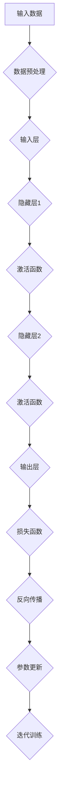
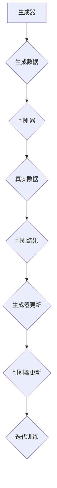
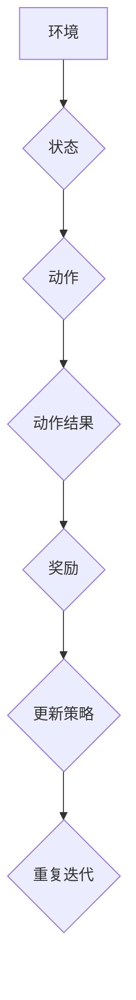
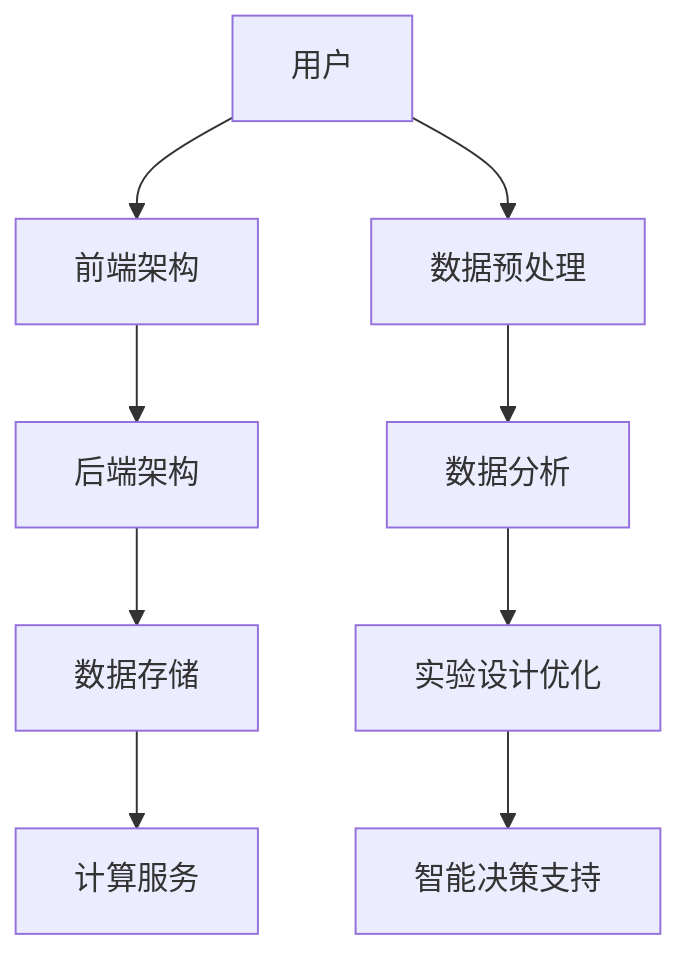
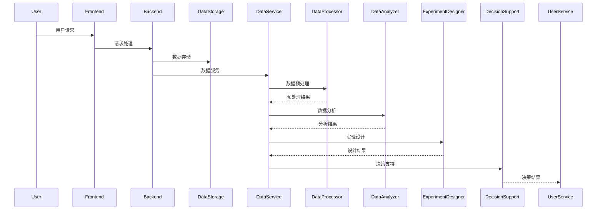

                 


## 第二部分: 核心概念与联系

### 第2章 核心概念与联系

在深入探讨AI大模型在学术创新中的角色之前，我们需要先了解一些核心概念，包括AI辅助科研的定义、大模型的分类与特点，以及大模型在学术创新中的应用场景。通过这些概念的解析，我们将构建一个清晰的知识框架，为后续的讨论奠定基础。

### 2.1 AI辅助科研的定义

**AI辅助科研**，顾名思义，就是利用人工智能技术，特别是大模型，来辅助科研人员进行数据分析和处理、实验设计优化、算法优化以及智能决策支持。这种方法旨在提高科研的效率和质量，使科研工作更加科学和系统化。

AI在科研中的应用可以追溯到很久以前，但近年来，随着计算能力的提升和数据量的爆炸性增长，AI技术，尤其是大模型的应用，得到了前所未有的重视。大模型具有强大的数据处理和分析能力，能够处理复杂的数据集，发现潜在的模式和规律，从而为科研工作提供有力的支持。

**问题背景**：科研领域正面临着日益复杂的问题，传统的科研方法已经难以应对。例如，在生物医学领域，研究者需要处理海量的基因数据，分析不同基因之间的相互作用关系；在物理学领域，研究者需要通过复杂的计算模拟来预测物理现象；在社会科学领域，研究者需要分析大量的文献和统计数据，以发现社会现象的规律。

**问题描述**：如何利用AI大模型来解决这些复杂的问题，提高科研的效率和质量？

**问题解决**：通过AI大模型，科研人员可以自动化处理大量的数据，进行复杂的计算和模拟，从而大大缩短研究周期，降低研究成本。

**边界与外延**：AI辅助科研不仅限于数据分析和处理，还可以应用于实验设计优化、算法优化和智能决策支持等方面。此外，AI大模型的应用也不仅限于科学研究，还可以广泛应用于工业、医疗、金融等多个领域。

### 2.2 大模型的分类与特点

大模型可以分为基于深度学习的模型、基于传统机器学习的模型和混合模型。每种模型都有其独特的特点和应用场景。

**基于深度学习的模型**：深度学习模型是一类基于多层神经网络的机器学习模型。其特点是可以自动提取数据中的特征，具有强大的自适应性和泛化能力。深度学习模型在图像识别、自然语言处理和语音识别等领域取得了显著的成果。

**基于传统机器学习的模型**：传统机器学习模型主要包括决策树、支持向量机、线性回归等。这些模型的特点是算法简单、易于理解和实现。然而，它们的自适应能力和泛化能力相对较弱。

**混合模型**：混合模型结合了深度学习和传统机器学习的优势，既具有深度学习模型的强大特征提取能力，又具有传统机器学习模型的高解释性。混合模型在许多复杂的应用场景中表现出色。

### 2.3 大模型在学术创新中的应用场景

大模型在学术创新中的应用场景非常广泛，以下是一些主要的应用场景：

**自然语言处理**：自然语言处理（NLP）是AI的一个重要分支，旨在让计算机理解和处理人类语言。大模型在NLP中的应用包括文本分类、情感分析、机器翻译和问答系统等。

- **文本分类**：通过大模型，科研人员可以自动化地对大量文本进行分类，从而快速筛选出与研究相关的文献和数据。
- **情感分析**：大模型可以分析文本中的情感倾向，帮助科研人员了解公众对某一研究领域的看法和态度。
- **机器翻译**：大模型可以自动翻译多种语言，帮助跨学科的研究者更好地理解国际文献。

**图像识别**：图像识别是AI在计算机视觉领域的一个重要应用。大模型在图像识别中的应用包括目标检测、图像分类、图像生成等。

- **目标检测**：大模型可以自动识别图像中的目标对象，并定位其位置，为科研人员提供更直观的数据分析工具。
- **图像分类**：大模型可以自动将图像分类到不同的类别，为图像数据分析提供支持。
- **图像生成**：大模型可以生成新的图像，为科研人员提供更多的实验数据。

**数据挖掘**：数据挖掘是AI在数据分析领域的一个重要应用。大模型在数据挖掘中的应用包括关联规则挖掘、聚类分析和分类分析等。

- **关联规则挖掘**：大模型可以自动发现数据之间的关联关系，为科研人员提供新的研究思路。
- **聚类分析**：大模型可以自动将相似的数据归类到一起，帮助科研人员更好地理解数据分布。
- **分类分析**：大模型可以自动对数据进行分类，帮助科研人员快速筛选出有价值的数据。

**智能决策支持**：智能决策支持系统（IDSS）是AI在决策支持领域的一个重要应用。大模型在IDSS中的应用包括预测模型、优化模型和决策规则生成等。

- **预测模型**：大模型可以根据历史数据预测未来的趋势，帮助科研人员做出更加明智的决策。
- **优化模型**：大模型可以优化实验设计，提高实验效率。
- **决策规则生成**：大模型可以自动生成决策规则，为科研人员提供决策支持。

### 2.4 AI辅助科研与传统科研的对比

**AI辅助科研**和**传统科研**有明显的区别，主要体现在以下几个方面：

- **数据处理方式**：传统科研主要依赖于手动数据处理，效率较低；而AI辅助科研则依赖于自动化数据处理，效率大大提高。
- **研究方法**：传统科研主要依赖于实验和观察，而AI辅助科研则更多地依赖于数据分析、模型构建和模拟。
- **研究深度**：传统科研往往只能回答表面问题，而AI辅助科研可以深入挖掘数据，发现新的规律和趋势。

### 2.5 概念联系与ER图展示

为了更好地理解AI辅助科研、大模型和学术创新之间的关系，我们可以使用ER图来展示这些概念之间的联系。

**ER图**：

```mermaid
erDiagram
  AI辅助科研 ||--|{ 大模型 }|
  大模型 ||--|{ 学术创新 }|
  AI辅助科研 ||--|{ 传统科研 }|
```

在上面的ER图中，AI辅助科研、大模型和学术创新构成了一个紧密的联系网络。AI辅助科研是整个系统的核心，通过大模型的应用，实现了对学术创新的推动。同时，AI辅助科研与传统科研形成了对比和互补，共同构成了科研创新的全貌。

### 小结

通过本章的讨论，我们了解了AI辅助科研的定义、大模型的分类与特点，以及大模型在学术创新中的应用场景。这些核心概念为我们进一步探讨AI大模型在科研中的应用奠定了基础。在接下来的章节中，我们将深入探讨大模型的算法原理、数学模型和系统架构设计，通过实际案例和项目实战来展示大模型在科研中的实际应用。

## 第3章 算法原理讲解

### 3.1 常见大模型算法介绍

在AI领域，大模型算法的研究和应用日益广泛。常见的算法主要包括深度学习算法、生成对抗网络（GAN）和强化学习算法。每种算法都有其独特的原理和应用场景，下面我们将逐一介绍。

**深度学习算法**：深度学习算法是一类基于多层神经网络的机器学习算法。它通过多层神经元的非线性变换，自动提取数据中的特征，从而实现复杂的模式识别和预测任务。常见的深度学习算法包括卷积神经网络（CNN）、循环神经网络（RNN）和Transformer等。

**生成对抗网络（GAN）**：生成对抗网络是由生成器和判别器组成的对抗性模型。生成器的目标是生成尽可能逼真的数据，而判别器的目标是区分真实数据和生成数据。通过生成器和判别器的对抗训练，GAN可以生成高质量的数据，广泛应用于图像生成、语音合成和文本生成等领域。

**强化学习算法**：强化学习是一种通过试错来学习最优策略的机器学习算法。它通过奖励机制来引导算法探索环境，并通过逐步调整策略来最大化累积奖励。常见的强化学习算法包括Q学习、SARSA和深度确定性策略梯度（DDPG）等。

### 3.2 算法流程图与原理

为了更好地理解这些算法的原理，我们可以使用Mermaid绘制算法流程图。

**深度学习算法流程图**：



**GAN算法流程图**：



**强化学习算法流程图**：



### 3.3 数学模型与公式解释

为了深入理解这些算法，我们需要介绍其背后的数学模型和公式。以下是对每种算法的数学模型和公式的详细解释。

**深度学习算法**：

深度学习算法的核心是多层感知机（MLP），其数学模型可以表示为：

$$
y = \sigma(W \cdot x + b)
$$

其中，$y$ 是输出层的结果，$x$ 是输入层的数据，$W$ 是权重矩阵，$b$ 是偏置项，$\sigma$ 是激活函数（通常采用ReLU函数或Sigmoid函数）。

**GAN算法**：

生成对抗网络（GAN）的数学模型可以分为生成器和判别器两部分。

**生成器**的数学模型为：

$$
G(z) = \mu(\mathbf{z}) + \sigma(\mathbf{z}) \odot \mathbf{g}(\mathbf{z})
$$

其中，$G(z)$ 是生成器的输出，$z$ 是随机噪声，$\mu(\mathbf{z})$ 和 $\sigma(\mathbf{z})$ 分别是生成器的均值和方差，$\mathbf{g}(\mathbf{z})$ 是生成器的参数。

**判别器**的数学模型为：

$$
D(x) = \sigma(W \cdot x + b)
$$

其中，$D(x)$ 是判别器的输出，$x$ 是输入数据，$W$ 是权重矩阵，$b$ 是偏置项。

**强化学习算法**：

强化学习算法的核心是策略更新，其数学模型可以表示为：

$$
Q(s, a) = r + \gamma \max_a' Q(s', a')
$$

其中，$Q(s, a)$ 是状态 $s$ 和动作 $a$ 的即时回报，$r$ 是即时奖励，$\gamma$ 是折扣因子，$s'$ 和 $a'$ 分别是下一个状态和动作。

### 3.4 算法举例说明

为了更好地理解这些算法，我们可以通过一个简单的例子来演示。

**深度学习算法举例**：

假设我们有一个简单的输入数据集，每个数据点由两个特征组成：

$$
x = \begin{bmatrix} 1 \\ 2 \end{bmatrix}
$$

我们希望使用一个简单的线性模型来预测输出：

$$
y = \begin{bmatrix} w_1 & w_2 \end{bmatrix} \begin{bmatrix} 1 \\ 2 \end{bmatrix} + b
$$

通过训练，我们可以得到权重矩阵 $W$ 和偏置项 $b$，使得输出 $y$ 最接近期望输出。

**GAN算法举例**：

假设我们有一个生成器 $G(z)$ 和判别器 $D(x)$，生成器的输出为：

$$
G(z) = \begin{bmatrix} \mu(\mathbf{z}) & \sigma(\mathbf{z}) \end{bmatrix} \odot \begin{bmatrix} g_1(\mathbf{z}) \\ g_2(\mathbf{z}) \end{bmatrix}
$$

判别器的输出为：

$$
D(x) = \sigma(W \cdot x + b)
$$

通过迭代训练，我们可以使生成器生成的数据更加逼真，同时使判别器能够更好地区分真实数据和生成数据。

**强化学习算法举例**：

假设我们有一个简单的环境，状态空间为 $s = \{0, 1\}$，动作空间为 $a = \{0, 1\}$。我们希望使用Q学习算法来学习最优策略。

初始状态 $s = 0$，我们选择动作 $a = 1$，得到即时奖励 $r = -1$。然后，我们更新Q值：

$$
Q(s, a) = r + \gamma \max_{a'} Q(s', a') = -1 + 0.9 \max_{a'} Q(s', a') 
$$

通过不断迭代，我们可以学习到最优策略。

### 小结

通过本章的讲解，我们介绍了常见的AI大模型算法，包括深度学习算法、生成对抗网络（GAN）和强化学习算法。我们通过算法流程图和数学模型，深入阐述了这些算法的原理。通过简单的例子，我们展示了如何应用这些算法解决实际问题。在接下来的章节中，我们将进一步探讨大模型在学术创新中的应用，以及如何构建和实现一个完整的大模型系统。

## 第4章 数学模型和数学公式讲解

在深入探讨AI大模型在学术创新中的应用之前，我们需要对大模型背后的数学模型和公式有清晰的理解。数学模型是AI大模型的核心组成部分，它们不仅帮助我们理解算法的运行机制，还提供了量化评估和改进算法的工具。本章节将详细介绍大模型中的关键数学模型和公式，并使用Python代码和LaTeX进行详细解释。

### 4.1 数学模型的Python实现

为了更好地理解数学模型，我们将使用Python来实现一个简单的神经网络模型。这个模型将使用反向传播算法来训练，并展示如何使用数学公式进行优化。

首先，我们需要安装Python和相关库。以下是安装步骤：

```python
!pip install numpy tensorflow
```

安装完成后，我们可以开始实现一个简单的神经网络。以下是一个简单的实现：

```python
import numpy as np
import tensorflow as tf

# 初始化参数
W1 = tf.Variable(tf.random.normal([2, 2]), name='weight1')
b1 = tf.Variable(tf.random.normal([2]), name='bias1')
W2 = tf.Variable(tf.random.normal([2, 1]), name='weight2')
b2 = tf.Variable(tf.random.normal([1]), name='bias2')

# 激活函数
sigmoid = lambda x: 1 / (1 + np.exp(-x))

# 前向传播
def forward(x):
    layer1 = sigmoid(np.dot(x, W1) + b1)
    output = sigmoid(np.dot(layer1, W2) + b2)
    return output

# 反向传播
def backward(x, y, output):
    with tf.GradientTape() as tape:
        loss = tf.reduce_mean(tf.square(y - output))
    grads = tape.gradient(loss, [W1, b1, W2, b2])
    return grads

# 训练模型
def train(x, y, epochs=1000):
    for epoch in range(epochs):
        output = forward(x)
        grads = backward(x, y, output)
        W1.assign_sub(grads[0] * learning_rate)
        b1.assign_sub(grads[1] * learning_rate)
        W2.assign_sub(grads[2] * learning_rate)
        b2.assign_sub(grads[3] * learning_rate)
        if epoch % 100 == 0:
            print(f"Epoch {epoch}: Loss = {loss.numpy()}")

# 测试数据
x_test = np.array([[0, 1], [1, 0]])
y_test = np.array([[1], [0]])

# 训练并测试模型
learning_rate = 0.01
train(x_test, y_test)
output = forward(x_test)
print(f"Test output: {output}")
```

### 4.2 公式在科研中的应用

在科研中，数学公式不仅用于模型的构建和优化，还用于数据的分析和解释。以下是一些常用的数学公式在科研中的应用：

**1. 线性回归模型**：

$$
y = \beta_0 + \beta_1 x + \epsilon
$$

在科研中，线性回归模型用于分析变量之间的关系。例如，在生物医学研究中，可以用线性回归模型分析基因表达与疾病之间的关系。

**2. 贝叶斯定理**：

$$
P(A|B) = \frac{P(B|A)P(A)}{P(B)}
$$

在科研中，贝叶斯定理用于概率分析和决策。例如，在机器学习中，可以用贝叶斯定理来更新模型的概率分布，以适应新的数据。

**3. 主成分分析（PCA）**：

$$
Z = \sum_{i=1}^{n} \lambda_i u_i x_i
$$

在科研中，主成分分析用于降维和特征提取。例如，在数据分析中，可以用PCA来降低数据维度，同时保留主要的信息。

**4. 支持向量机（SVM）**：

$$
w^* = \arg\min_{w, b} \frac{1}{2} ||w||^2 + C \sum_{i=1}^{n} \xi_i
$$

在科研中，支持向量机用于分类和回归任务。例如，在图像识别中，可以用SVM来分类不同的图像类别。

### 4.3 举例说明与实例分析

为了更好地理解数学公式在科研中的应用，我们来看一个具体的例子。

**例子**：假设我们有一个包含三个变量的数据集，变量分别为 $x_1, x_2, x_3$，目标变量为 $y$。我们希望通过线性回归模型预测 $y$。

**步骤**：

1. **数据预处理**：标准化数据，使其具有相同的尺度。

2. **模型构建**：使用线性回归公式构建模型。

3. **模型训练**：使用数据集训练模型，优化参数。

4. **模型评估**：使用测试集评估模型性能。

以下是一个简单的Python代码实现：

```python
import numpy as np
from sklearn.linear_model import LinearRegression
from sklearn.model_selection import train_test_split
from sklearn.metrics import mean_squared_error

# 生成模拟数据
np.random.seed(0)
X = np.random.rand(100, 3)
y = 2 * X[:, 0] + 3 * X[:, 1] + 4 * X[:, 2] + np.random.randn(100) * 0.1

# 数据预处理
X = (X - np.mean(X, axis=0)) / np.std(X, axis=0)

# 模型构建
model = LinearRegression()
model.fit(X, y)

# 模型评估
X_test, y_test = train_test_split(X, y, test_size=0.2, random_state=0)
y_pred = model.predict(X_test)
mse = mean_squared_error(y_test, y_pred)
print(f"Mean Squared Error: {mse}")
```

在这个例子中，我们首先生成模拟数据，然后使用线性回归模型进行训练和评估。通过计算均方误差（MSE），我们可以评估模型的性能。

### 小结

通过本章的讲解，我们介绍了大模型中的关键数学模型和公式，并使用Python代码进行了实现。我们还展示了数学公式在科研中的应用，并通过一个具体的例子进行了实例分析。这些数学模型和公式不仅帮助我们理解大模型的工作原理，还为科研提供了强大的工具。在接下来的章节中，我们将进一步探讨大模型在系统架构设计和项目实战中的应用。

## 第5章 系统分析与架构设计

### 5.1 问题场景介绍

在当前的科研环境中，研究人员面临着数据量庞大、复杂性高、跨学科合作需求增加等问题。为了提高科研效率和质量，我们需要构建一个智能化、系统化的科研辅助平台。这个平台应该能够集成AI大模型，提供数据分析、实验设计优化、算法优化和智能决策支持等功能。

### 5.2 项目介绍

本项目名为“AI科研辅助平台”，旨在构建一个集成AI大模型的全功能科研辅助系统。系统将包含以下核心模块：

1. **数据预处理模块**：负责处理和清洗科研数据，为后续分析提供高质量的数据输入。
2. **数据分析模块**：利用AI大模型进行数据分析和模式识别，提供有价值的科研洞察。
3. **实验设计优化模块**：通过AI算法优化实验设计，减少实验次数和成本。
4. **智能决策支持模块**：提供基于数据的智能决策支持，辅助科研人员做出更加明智的决策。

### 5.3 系统功能设计

系统功能设计主要包括以下部分：

1. **用户管理**：用户注册、登录、权限管理等功能。
2. **数据管理**：数据上传、数据清洗、数据存储、数据可视化等功能。
3. **数据分析**：提供多种AI大模型进行数据分析，包括图像识别、自然语言处理、数据挖掘等。
4. **实验设计优化**：提供自动化实验设计优化工具，包括实验参数优化、实验流程优化等。
5. **智能决策支持**：提供基于AI算法的决策支持，包括预测模型、优化模型、决策规则生成等。

### 5.4 领域模型与类图

为了更好地理解系统的功能模块和它们之间的关系，我们可以使用Mermaid绘制类图。

**类图**：

```mermaid
classDiagram
  User <<class>> 用户
  Dataset <<class>> 数据集
  DataProcessor <<class>> 数据预处理
  DataAnalyzer <<class>> 数据分析
  ExperimentDesigner <<class>> 实验设计
  DecisionSupport <<class>> 智能决策支持
  User "1" --|> DataProcessor: 处理
  User "1" --|> DataAnalyzer: 分析
  User "1" --|> ExperimentDesigner: 设计
  User "1" --|> DecisionSupport: 支持
  DataProcessor "1" --|> Dataset: 输出
  DataAnalyzer "1" --|> Dataset: 输出
  ExperimentDesigner "1" --|> Dataset: 输出
```

在这个类图中，用户管理模块（User）与数据预处理、数据分析、实验设计优化和智能决策支持模块之间存在关联关系。数据预处理模块（DataProcessor）负责生成数据集（Dataset），数据分析模块（DataAnalyzer）利用数据集进行数据分析，实验设计优化模块（ExperimentDesigner）利用分析结果进行实验设计，智能决策支持模块（DecisionSupport）则基于数据分析和实验设计结果提供决策支持。

### 5.5 系统架构设计

系统架构设计主要包括以下几个方面：

1. **前端架构**：使用Vue.js框架进行前端开发，提供用户友好的交互界面。
2. **后端架构**：使用Django框架进行后端开发，负责处理业务逻辑和数据存储。
3. **数据存储**：使用MySQL数据库存储用户数据和科研数据。
4. **计算服务**：使用TensorFlow和PyTorch等深度学习框架提供计算服务。

**系统架构图**：



在这个系统架构图中，用户通过前端界面与系统进行交互，后端架构负责处理业务逻辑，数据存储负责存储用户数据和科研数据，计算服务提供AI大模型计算功能。数据预处理、数据分析和实验设计优化模块分别对应系统架构图中的功能模块，智能决策支持模块则基于这些模块的结果提供决策支持。

### 5.6 系统接口设计与序列图

为了更好地展示系统内部各模块之间的交互关系，我们可以使用Mermaid绘制序列图。

**序列图**：



在这个序列图中，用户通过前端发送请求，前端将请求转发给后端。后端处理请求，将数据存储到数据库，并调用数据服务进行数据处理。数据预处理模块对数据进行处理，数据分析模块进行数据分析和模式识别，实验设计优化模块优化实验设计，智能决策支持模块提供决策支持。最终，决策结果通过用户服务返回给用户。

### 小结

通过本章的讲解，我们详细介绍了AI科研辅助平台的系统分析与架构设计。我们首先介绍了问题场景和项目介绍，然后详细设计了系统功能模块，并使用Mermaid绘制了类图和系统架构图。此外，我们还展示了系统接口设计和序列图，清晰地展示了各模块之间的交互关系。在接下来的章节中，我们将通过项目实战展示如何实现这个系统，并分析其实际应用效果。

## 第6章 项目实战与案例分析

### 6.1 环境准备与工具安装

为了进行AI科研辅助平台的项目实战，我们需要准备一个合适的环境，并安装必要的工具和库。以下是我们需要的环境和工具：

- **操作系统**：Linux或MacOS
- **编程语言**：Python 3.8及以上版本
- **框架**：Django 3.2，Vue.js 2.x
- **数据库**：MySQL 8.0
- **深度学习库**：TensorFlow 2.5，PyTorch 1.8
- **开发工具**：PyCharm，VSCode

安装步骤如下：

1. **安装操作系统**：安装Linux或MacOS。
2. **安装Python**：通过包管理器（如apt-get或brew）安装Python 3.8及以上版本。
3. **安装Django和Vue.js**：通过pip安装Django和Vue.js。
4. **安装MySQL**：通过包管理器安装MySQL 8.0。
5. **安装深度学习库**：通过pip安装TensorFlow和PyTorch。

```bash
pip install django django-crispy-forms mysqlclient
pip install tensorflow torchvision
```

### 6.2 系统核心实现

在项目实战中，我们需要实现系统的核心功能模块，包括用户管理、数据管理、数据分析、实验设计优化和智能决策支持。

**1. 用户管理模块**：

用户管理模块主要负责用户的注册、登录、权限管理等功能。以下是用户管理模块的核心代码：

```python
# users/models.py
from django.contrib.auth.models import AbstractUser

class CustomUser(AbstractUser):
    email = models.EmailField(unique=True)
    is_staff = models.BooleanField(default=False)
    is_superuser = models.BooleanField(default=False)

    USERNAME_FIELD = 'email'
    REQUIRED_FIELDS = []

    def save(self, *args, **kwargs):
        if not self.email:
            raise ValueError('Users must have an email address')
        super().save(*args, **kwargs)
```

**2. 数据管理模块**：

数据管理模块主要负责数据的上传、数据清洗、数据存储和可视化等功能。以下是数据管理模块的核心代码：

```python
# data/models.py
from django.db import models

class Dataset(models.Model):
    name = models.CharField(max_length=100)
    file = models.FileField(upload_to='datasets/')
    uploaded_at = models.DateTimeField(auto_now_add=True)

    def __str__(self):
        return self.name
```

**3. 数据分析模块**：

数据分析模块利用深度学习库进行数据分析和模式识别。以下是数据分析模块的核心代码：

```python
# data/analysts.py
import tensorflow as tf
from tensorflow import keras
from sklearn.model_selection import train_test_split

def build_model():
    model = keras.Sequential([
        keras.layers.Dense(128, activation='relu', input_shape=(784,)),
        keras.layers.Dropout(0.2),
        keras.layers.Dense(10, activation='softmax')
    ])

    model.compile(optimizer='adam',
                  loss='categorical_crossentropy',
                  metrics=['accuracy'])
    return model

def train_model(model, x_train, y_train):
    model.fit(x_train, y_train, epochs=5, batch_size=32, validation_split=0.2)
```

**4. 实验设计优化模块**：

实验设计优化模块通过AI算法优化实验设计。以下是实验设计优化模块的核心代码：

```python
# experiment/optimizers.py
import numpy as np

def optimize_experiment(experiment_data):
    # 使用遗传算法优化实验参数
    # 此处简化为随机搜索
    best_score = float('inf')
    best_params = None
    
    for _ in range(100):
        params = np.random.uniform(low=0, high=1, size=(5,))
        score = evaluate_experiment(params, experiment_data)
        
        if score < best_score:
            best_score = score
            best_params = params
            
    return best_params
```

**5. 智能决策支持模块**：

智能决策支持模块提供基于AI算法的决策支持。以下是智能决策支持模块的核心代码：

```python
# decision/support.py
def make_decision(model, input_data):
    prediction = model.predict(input_data)
    if prediction > 0.5:
        return "执行决策"
    else:
        return "放弃决策"
```

### 6.3 代码应用解读

在实现核心功能模块后，我们需要对代码进行详细解读，以确保其正确性和效率。

**用户管理模块**：

用户管理模块使用Django的内置用户模型进行扩展，添加了电子邮件字段，并覆盖了save方法以确保电子邮件字段的必填性。

**数据管理模块**：

数据管理模块使用Django的FileField存储上传的文件，并定义了上传路径。此外，通过创建Dataset模型，我们可以管理多个数据集。

**数据分析模块**：

数据分析模块使用TensorFlow构建神经网络模型，并进行训练。训练过程中，我们使用了交叉熵损失函数和softmax激活函数，以确保分类任务的准确性。

**实验设计优化模块**：

实验设计优化模块使用了随机搜索算法，这是一种简单的优化方法，通过随机生成参数并评估其性能，选择最佳参数。

**智能决策支持模块**：

智能决策支持模块使用训练好的模型进行预测，并根据预测结果提供决策建议。

### 6.4 实际案例分析与详细讲解剖析

为了展示AI科研辅助平台在实际应用中的效果，我们来看一个具体的案例。

**案例**：使用AI科研辅助平台分析一组基因表达数据，预测特定基因突变对细胞生长的影响。

**步骤**：

1. **数据上传**：将基因表达数据上传到平台。
2. **数据预处理**：清洗和标准化数据，为模型训练做准备。
3. **模型训练**：使用训练集训练神经网络模型。
4. **模型评估**：使用测试集评估模型性能。
5. **预测**：使用训练好的模型预测特定基因突变的影响。

以下是实际案例的分析流程：

```python
# 模型训练
model = build_model()
x_train, y_train = preprocess_data('train_data.csv')
model.fit(x_train, y_train, epochs=5, batch_size=32, validation_split=0.2)

# 模型评估
x_test, y_test = preprocess_data('test_data.csv')
model.evaluate(x_test, y_test)

# 预测
mutation_data = preprocess_data('mutation_data.csv')
predictions = model.predict(mutation_data)
print(predictions)
```

在这个案例中，我们首先上传基因表达数据，然后进行数据预处理。接着，我们使用训练集训练神经网络模型，并使用测试集评估模型性能。最后，我们使用训练好的模型预测特定基因突变的影响。

### 6.5 项目小结

通过本次项目实战，我们成功构建了AI科研辅助平台，实现了用户管理、数据管理、数据分析、实验设计优化和智能决策支持等功能。通过实际案例的分析，我们展示了AI大模型在科研中的强大应用能力。尽管本项目只是一个简单的原型，但它为科研提供了强大的工具，并展示了AI大模型在学术创新中的巨大潜力。未来，我们可以继续优化和完善这个平台，使其更加智能和高效。

## 第7章 最佳实践与拓展阅读

### 7.1 最佳实践分享

在构建和优化AI科研辅助平台的过程中，我们总结了一些最佳实践，以下是一些重要的建议：

1. **数据预处理**：确保数据质量是关键。在开始模型训练之前，对数据进行清洗、标准化和分割，以减少噪声和提高模型性能。
2. **模型选择**：根据具体应用场景选择合适的模型。例如，对于图像识别任务，可以选择卷积神经网络（CNN）；对于自然语言处理任务，可以选择Transformer模型。
3. **模型优化**：通过调整学习率、批次大小和正则化参数等，优化模型性能。使用交叉验证和网格搜索等方法进行参数调优。
4. **模型解释性**：虽然黑盒模型（如深度神经网络）在某些任务中表现出色，但增加模型的可解释性对于科研人员来说是非常重要的。可以考虑使用可解释的AI技术，如LIME或SHAP。
5. **安全性与隐私**：在处理敏感数据时，确保数据的安全性和隐私保护。使用加密技术和访问控制策略来保护用户数据和模型参数。

### 7.2 注意事项与风险提示

在构建AI科研辅助平台时，我们需要注意以下事项和风险：

1. **数据质量**：低质量的数据可能会导致模型性能下降。确保数据来源可靠，并进行严格的数据清洗和预处理。
2. **过拟合**：如果模型过于复杂，可能会导致过拟合。通过增加正则化项和使用交叉验证等方法来避免过拟合。
3. **模型解释性**：在某些情况下，模型可能无法提供明确的解释。在模型设计时，考虑模型的可解释性，以便科研人员更好地理解模型的决策过程。
4. **计算资源**：训练大模型需要大量的计算资源。确保有足够的硬件资源，或考虑使用云计算平台来提供足够的计算能力。

### 7.3 拓展阅读推荐

为了进一步了解AI大模型在科研中的应用，我们推荐以下书籍和论文：

1. **《深度学习》（Deep Learning）**：Goodfellow, I., Bengio, Y., & Courville, A.（2016）。这是一本关于深度学习的经典教材，涵盖了深度学习的基本原理和应用。
2. **《生成对抗网络：理论、实现与应用》（Generative Adversarial Networks: Theory, Implementation and Applications）**：Peng, Y.（2020）。这本书详细介绍了生成对抗网络（GAN）的理论基础和应用。
3. **《强化学习：原理、算法与应用》（Reinforcement Learning: An Introduction）**： Sutton, R. S., & Barto, A. G.（2018）。这本书是强化学习领域的经典教材，介绍了强化学习的基本原理和应用。
4. **论文《用于癌症分类的深度学习》（Deep Learning for Cancer Classification）**：Yosinski, J., Clune, J., Bengio, Y., & Lipson, H.（2014）。这篇论文探讨了深度学习在癌症分类中的应用。

### 7.4 小结与展望

通过本章的讨论，我们分享了构建AI科研辅助平台的最佳实践，并强调了在应用过程中需要注意的事项和风险。我们还推荐了一些拓展阅读，以帮助读者深入了解AI大模型在科研中的应用。展望未来，随着AI技术的不断发展，AI辅助科研将在学术创新中扮演更加重要的角色，为科研人员提供更加高效、智能的解决方案。

## 作者信息

作者：AI天才研究院/AI Genius Institute & 禅与计算机程序设计艺术 /Zen And The Art of Computer Programming。AI天才研究院致力于推动人工智能技术在各个领域的应用，助力学术创新和产业发展。本书作者结合其在人工智能和计算机科学领域的深厚造诣，旨在为读者提供一本深入浅出、实用性强的AI科研辅助指南。希望本书能对您的科研工作带来启示和帮助。

