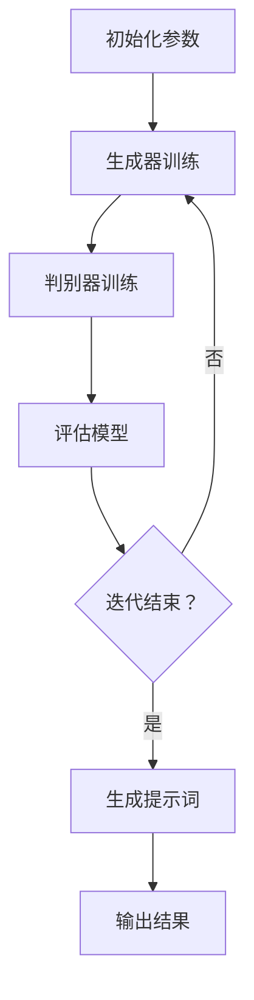
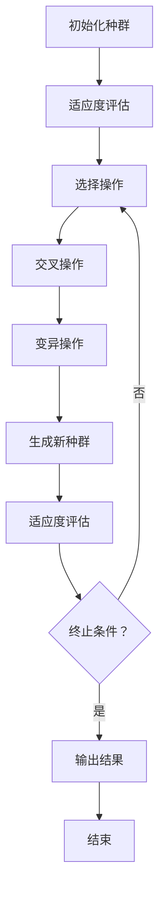
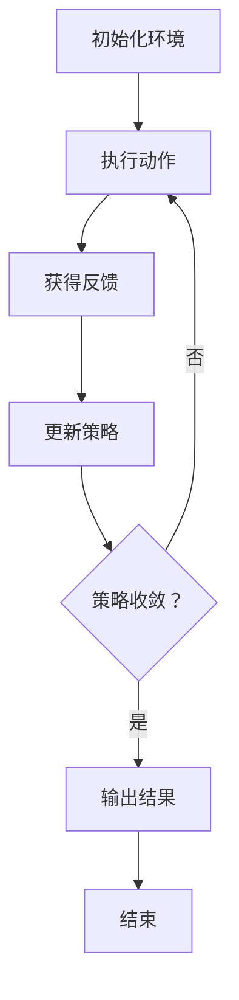

                 

### 1.1.1 药物发现的传统方法

药物发现的传统方法可以追溯到20世纪初期，当时科学家们主要依赖于经验性的实验和逐步筛选的方法来寻找潜在的药物分子。这种方法的主要步骤包括以下几个环节：

**1. 确定药物靶点**：科学家们首先需要确定药物作用的靶点，即生物体内的特定蛋白质或分子。这一步通常依赖于对疾病的深入了解以及对相关生物学的实验研究。

**2. 化学合成与筛选**：根据药物靶点的特性，化学家们会合成一系列具有潜在活性的化合物。这些化合物会被筛选，以确定哪些分子具有与靶点结合的能力。

**3. 验证活性**：筛选出的化合物需要经过一系列的实验来验证其生物活性，包括细胞实验、动物实验等。这一步的目的是确定哪些化合物具有治疗潜力。

**4. 成药性评估**：经过活性验证的化合物还需要评估其成药性，包括毒性、稳定性、药代动力学特性等，以确保它们能够安全有效地进入临床阶段。

**5. 临床试验**：最终，具有成药性的化合物需要进入临床前和临床阶段的试验，以证明其安全性和有效性。

传统药物发现方法面临的主要挑战包括：

- **高成本和高风险**：传统药物发现需要大量的实验和临床试验，导致时间和资金成本极高，且药物研发失败的风险也很大。
- **时间长**：从确定靶点到完成临床试验，整个过程通常需要数年甚至数十年的时间。
- **低成功率**：尽管投入了大量资源，但许多药物在研发过程中失败，成功率相对较低。

**1.1.2 传统药物发现的挑战**

传统药物发现方法虽然在过去取得了一些重要的成果，但随着科学技术的进步，其局限性也日益显现，主要表现在以下几个方面：

- **效率低下**：传统药物发现过程复杂且耗时，往往需要大量的实验和重复性工作，效率低下。
- **依赖经验**：传统方法高度依赖科学家的经验和直觉，科学研究的可重复性和可预测性受到限制。
- **化学合成难度**：许多潜在的药物分子需要通过复杂的化学反应来合成，且反应条件苛刻，难以实现大规模生产。
- **筛选过程繁琐**：从大量的化合物中筛选出具有活性的药物分子，需要大量的时间和实验资源。

**1.1.3 AI在药物发现中的潜在优势**

随着人工智能（AI）技术的快速发展，AI在药物发现中的应用逐渐成为可能，并显示出巨大的潜力。AI在药物发现中的优势主要体现在以下几个方面：

- **高效的计算能力**：AI算法能够处理和分析大量的数据，快速筛选出潜在的药物分子，大大提高药物发现效率。
- **自动化实验**：AI可以通过自动化系统执行实验，减少人工干预，提高实验的准确性和可重复性。
- **增强预测能力**：AI算法可以根据历史数据和生物信息学知识，预测化合物的生物活性和成药性，降低药物研发风险。
- **智能优化**：AI可以通过优化算法，指导合成和筛选过程，提高化合物的成功率。

AI在药物发现中的应用不仅能够解决传统方法中的许多问题，还能够推动药物研发的革新，为治疗复杂疾病提供更有效的方法。

### 1.2 AI辅助药物发现的基本概念

**1.2.1 什么是AI辅助药物发现**

AI辅助药物发现（AI-Assisted Drug Discovery）是指利用人工智能技术，如机器学习、深度学习、自然语言处理等，辅助药物研发的过程。它不仅仅是使用AI进行数据的分析和处理，而是通过智能化的算法和系统，对药物研发中的各个环节进行优化和提升。

AI辅助药物发现的关键在于：

- **数据驱动**：AI算法依赖于大量的生物学、化学、医学等领域的数据，通过对这些数据进行深度学习和分析，发现潜在的药物分子和靶点。
- **高效计算**：AI技术能够处理大量的计算任务，显著提高药物筛选和优化的速度。
- **智能预测**：通过机器学习和深度学习算法，AI可以预测化合物的生物活性和毒性，帮助科学家们做出更准确的决策。
- **自动化实验**：AI可以通过自动化系统执行实验，减少人工干预，提高实验效率和准确性。

**1.2.2 AI辅助药物发现的关键技术**

AI辅助药物发现涉及多种关键技术的应用，这些技术共同作用，推动药物研发的进步。以下是一些主要的关键技术：

- **机器学习**：机器学习算法能够从大量数据中学习模式，预测药物的生物活性和毒性。常见的机器学习算法包括支持向量机（SVM）、随机森林（RF）、深度神经网络（DNN）等。

- **深度学习**：深度学习是一种复杂的机器学习模型，能够处理大量复杂的数据，并自动提取特征。在药物发现中，深度学习被广泛应用于蛋白质结构预测、药物-靶点相互作用预测等。

- **自然语言处理（NLP）**：NLP技术用于处理和解析生物学文献、化学文献等文本数据，提取关键信息，辅助药物发现。例如，使用NLP技术可以自动从文献中提取药物靶点、化合物结构等信息。

- **基因组学**：基因组学技术用于分析患者的基因组数据，识别与疾病相关的基因变异，从而发现新的药物靶点。

- **计算化学**：计算化学方法用于模拟和预测化合物的物理和化学性质，指导化合物的设计和优化。

- **图像识别**：图像识别技术被应用于分析药物晶体结构、生物组织切片等图像数据，辅助药物研发。

**1.2.3 提示词设计在AI辅助药物发现中的作用**

在AI辅助药物发现中，提示词（Prompt Engineering）设计是至关重要的一环。提示词是指为AI模型提供的信息，用于引导模型的学习和预测。以下是提示词设计在AI辅助药物发现中的几个关键作用：

- **指导模型训练**：提示词设计决定了AI模型学习的方向和重点。通过精心设计的提示词，可以引导模型更准确地学习到与药物发现相关的知识和模式。

- **提升预测精度**：合理的提示词设计可以提高AI模型的预测精度，减少错误和不确定性。例如，在药物-靶点相互作用预测中，提示词可以包括药物的化学结构、靶点的三维结构等信息，从而提高预测的准确性。

- **优化搜索空间**：提示词设计可以缩小药物分子的搜索空间，减少不必要的计算和实验。通过设计有针对性的提示词，AI可以更专注于具有较高潜力的小分子。

- **自动化药物设计**：提示词设计可以帮助AI自动化药物设计过程，从大规模的化合物库中筛选出具有生物活性的候选分子，大大提高药物研发的效率。

总的来说，提示词设计是AI辅助药物发现的核心技术之一，它不仅决定了AI模型的学习效果，还直接影响到药物发现的效率和成功率。

### 1.3 提示词设计的重要性

在AI辅助药物发现中，提示词设计的重要性不可忽视。首先，提示词作为AI模型训练和学习的重要输入，直接决定了模型的输出结果。合理的提示词设计可以引导模型更准确地学习到与药物发现相关的关键信息，从而提高模型的预测精度和泛化能力。以下从以下几个方面详细讨论提示词设计的重要性：

**1. 提示词的定义与种类**

提示词（Prompt）在自然语言处理和AI领域中通常是指为AI模型提供的前置信息或指导信息，用于引导模型的推理和学习过程。根据提示词的形式和用途，可以分为以下几种类型：

- **自然语言提示词**：以自然语言文本形式提供的提示词，通常用于指导模型进行文本分类、信息抽取、问答系统等任务。
- **结构化提示词**：以结构化的数据形式提供的提示词，如表格、列表等，用于指导模型处理结构化数据，如关系数据库、化学结构数据等。
- **图像提示词**：以图像形式提供的提示词，用于指导模型进行图像分类、目标检测、图像生成等任务。

**2. 提示词设计的基本原则**

为了确保提示词能够有效地引导AI模型的学习和预测，提示词设计需要遵循以下基本原则：

- **相关性**：提示词需要与模型要解决的问题高度相关，能够提供关键信息和背景知识，避免无关信息的干扰。
- **完整性**：提示词应包含足够的背景信息，使模型能够全面理解问题的上下文，避免信息缺失导致的错误预测。
- **明确性**：提示词需要清晰明了，避免模糊不清的表达，确保模型能够正确理解提示意图。
- **多样性**：提示词设计应考虑多种不同类型和形式的信息，提供丰富的数据输入，以增强模型的泛化能力。

**3. 提示词设计在药物发现中的应用**

在药物发现中，提示词设计的作用至关重要。以下是一些具体的应用场景：

- **化合物筛选**：通过设计针对特定疾病或靶点的提示词，AI模型可以快速筛选出具有潜在活性的化合物。
- **药物结构优化**：提示词可以包括药物的化学结构、生物活性数据等信息，用于指导模型进行药物结构的优化。
- **药物-靶点相互作用预测**：通过提供药物和靶点的三维结构信息，提示词可以辅助模型预测药物与靶点之间的相互作用，提高药物研发的成功率。
- **自动化药物设计**：提示词设计可以帮助AI模型自动生成新的药物分子，从海量化合物库中筛选出具有成药潜力的分子。

**4. 提示词设计的重要性总结**

综上所述，提示词设计在AI辅助药物发现中扮演着至关重要的角色。合理的提示词设计不仅可以提高AI模型的预测精度和泛化能力，还可以显著提高药物研发的效率和成功率。通过精心设计的提示词，AI能够更准确地理解和解决问题，为药物发现提供强大的技术支持。因此，提示词设计是AI辅助药物发现中不可或缺的核心技术之一。

### 1.4 提示词设计的应用领域

提示词设计在药物发现中的应用非常广泛，尤其在蛋白质药物、小分子药物和抗体药物设计等不同领域，发挥着重要作用。以下分别介绍提示词设计在这些领域的应用。

#### 1.4.1 蛋白质药物设计

蛋白质药物设计（Protein Drug Design）是指通过改变蛋白质的氨基酸序列或三维结构，使其具备特定的生物活性或功能。提示词设计在蛋白质药物设计中的应用主要体现在以下几个方面：

- **蛋白质结构预测**：提示词可以包括蛋白质的目标结构、相关蛋白质的三维结构等信息，用于指导AI模型预测蛋白质的结构。
- **蛋白质功能预测**：通过设计包含蛋白质功能信息的提示词，模型可以预测蛋白质在生物体内的具体功能，帮助科学家选择具有潜在治疗价值的蛋白质。
- **蛋白质-蛋白质相互作用预测**：提示词可以包括蛋白质的三维结构及其相互作用的氨基酸残基信息，用于预测蛋白质之间的相互作用，指导新药物分子的设计。

#### 1.4.2 小分子药物设计

小分子药物设计（Small Molecule Drug Design）是指通过设计小分子化合物来干预生物体内的特定过程，从而达到治疗疾病的目的。提示词设计在小分子药物设计中的应用如下：

- **化学空间搜索**：提示词可以包括目标小分子的化学结构、生物活性数据等信息，用于指导AI模型在庞大的化学空间中搜索具有潜在活性的小分子。
- **分子对接**：通过设计包含小分子和靶点蛋白的三维结构的提示词，AI模型可以预测小分子与靶点蛋白的结合模式和结合能，从而筛选出具有高结合能力的候选药物。
- **药物结构优化**：提示词可以包括药物分子的现有结构、优化目标等信息，用于指导AI模型进行药物结构的优化，提高药物的稳定性和生物活性。

#### 1.4.3 抗体药物设计

抗体药物设计（Antibody Drug Design）是指通过设计特定的抗体来识别和结合目标蛋白，用于治疗疾病。提示词设计在抗体药物设计中的应用主要包括：

- **抗体序列设计**：提示词可以包括目标蛋白的结构、抗原结合位点的信息等，用于指导AI模型设计新的抗体序列。
- **抗体-抗原相互作用预测**：通过提供抗体和抗原的三维结构信息，提示词可以辅助模型预测抗体与抗原的相互作用，筛选出具有高亲和力和特异性结合能力的抗体。
- **抗体工程优化**：提示词可以包含抗体的现有序列和优化目标，用于指导AI模型进行抗体结构的优化，提高抗体的稳定性和治疗效果。

总之，提示词设计在药物发现的不同领域都有着广泛的应用。通过合理的提示词设计，AI模型可以更准确地预测和设计药物分子，提高药物研发的效率和成功率。这不仅在蛋白质药物、小分子药物和抗体药物设计中具有重要意义，也为未来药物发现的创新提供了强有力的技术支持。

### 1.5 本章小结

本章介绍了AI辅助药物发现的基本概念和提示词设计的重要性。首先，我们回顾了传统药物发现的方法和挑战，并探讨了AI在药物发现中的潜在优势。随后，我们详细介绍了AI辅助药物发现的关键技术，包括机器学习、深度学习、自然语言处理等。特别是，我们重点阐述了提示词设计的定义、基本原则和在药物发现中的应用领域，包括蛋白质药物、小分子药物和抗体药物设计。通过这些讨论，读者可以了解到提示词设计在AI辅助药物发现中的核心作用和实际应用，为进一步深入研究和实践打下基础。

### 2.1 提示词设计的基础知识

#### 2.1.1 提示词的种类

在AI辅助药物发现中，提示词的种类繁多，根据其来源和应用场景的不同，可以分为以下几类：

1. **自然语言提示词**：这类提示词通常以自然语言文本的形式出现，用于指导AI模型对文本数据进行分析和处理。例如，在药物靶点识别任务中，提示词可以是“寻找具有抗癌活性的药物靶点”。

2. **结构化提示词**：与自然语言提示词不同，结构化提示词以表格、列表或图形等结构化的数据形式存在。这些提示词通常用于指导AI模型处理结构化数据，如药物-靶点相互作用网络、化合物结构信息等。

3. **图像提示词**：图像提示词以图像形式提供，用于指导AI模型对图像数据进行分析和处理。例如，在药物晶体结构分析中，提示词可以是药物晶体的三维图像。

4. **音频提示词**：这类提示词以音频形式提供，用于指导AI模型处理音频数据，例如语音识别任务中，提示词可以是语音信号的特征参数。

#### 2.1.2 提示词的属性

提示词的属性决定了其在AI模型中的表现和效果。以下是几个关键的提示词属性：

1. **相关性**：提示词的相关性指的是提示词与任务目标的相关程度。高相关性的提示词能够为模型提供关键信息，提高模型的预测精度。

2. **完整性**：提示词的完整性指的是提示词是否包含足够的背景信息，使模型能够全面理解问题的上下文。不完整的提示词可能导致模型的错误理解和预测。

3. **明确性**：提示词的明确性指的是提示词的表达是否清晰、具体。模糊的提示词可能导致模型的误解和错误预测。

4. **多样性**：提示词的多样性指的是提示词的形式和内容的多样性。多样化的提示词能够帮助模型学习到不同的特征和模式，提高模型的泛化能力。

#### 2.1.3 提示词的生成方法

生成高质量提示词的方法多种多样，以下是一些常用的方法：

1. **数据驱动方法**：数据驱动方法依赖于大量的训练数据，通过分析数据中的模式来生成提示词。这种方法通常使用自然语言处理技术，如词嵌入（Word Embedding）、词性标注（Part-of-Speech Tagging）等。

2. **规则驱动方法**：规则驱动方法基于预先定义的规则和模板来生成提示词。这种方法适用于结构化数据，例如表格和数据库。

3. **混合方法**：混合方法结合了数据驱动和规则驱动方法，通过综合分析数据和规则来生成提示词。这种方法通常具有较高的灵活性和适应性。

4. **专家经验法**：专家经验法依赖于领域专家的直觉和经验来生成提示词。这种方法适用于复杂和不确定的任务，但依赖于专家的知识和经验。

通过合理选择和生成高质量的提示词，可以显著提升AI模型在药物发现任务中的表现和效果。

### 2.2 提示词设计的数学模型

提示词设计在AI辅助药物发现中至关重要，其核心在于如何构建数学模型来描述和优化提示词的设计过程。以下将详细探讨提示词设计的数学模型，包括模型概述、数学公式以及具体实例。

#### 2.2.1 提示词设计的数学模型概述

提示词设计的数学模型通常涉及以下几个关键组成部分：

1. **特征提取**：通过特征提取方法，将原始数据（如文本、图像、结构化数据等）转化为数学模型可以处理的高维特征向量。常见的特征提取方法包括词嵌入（Word Embedding）、图像特征提取（如卷积神经网络（CNN））等。

2. **模型训练**：使用训练数据集，通过机器学习算法（如支持向量机（SVM）、随机森林（RF）、深度神经网络（DNN）等）来训练数学模型。训练过程包括优化模型参数，使其能够准确预测和分类。

3. **提示词生成**：在模型训练完成后，通过输入特定的提示信息（如自然语言文本、结构化数据等），模型输出相应的提示词。这个过程通常涉及到提示词的生成算法，如序列生成模型（如循环神经网络（RNN）、生成对抗网络（GAN）等）。

4. **模型评估**：使用验证集和测试集对训练好的模型进行评估，以衡量其性能和泛化能力。常用的评估指标包括准确率（Accuracy）、精确率（Precision）、召回率（Recall）等。

#### 2.2.2 提示词设计的数学公式

以下是一些在提示词设计中常用的数学公式：

1. **特征提取公式**：
   $$ \text{特征向量} = \text{嵌入层} (\text{输入数据}) $$

   其中，嵌入层（Embedding Layer）将原始输入数据（如单词或图像像素）映射到高维特征空间。

2. **模型训练公式**：
   $$ \text{损失函数} = \frac{1}{N} \sum_{i=1}^{N} (\text{预测输出} - \text{真实输出})^2 $$
   
   其中，损失函数（Loss Function）用于衡量模型预测输出与真实输出之间的差距，常见的损失函数包括均方误差（MSE）、交叉熵损失（Cross-Entropy Loss）等。

3. **提示词生成公式**：
   $$ \text{提示词} = \text{生成模型} (\text{输入提示信息}) $$

   其中，生成模型（如RNN、GAN）用于根据输入提示信息生成相应的提示词。

4. **模型评估公式**：
   $$ \text{准确率} = \frac{\text{预测正确数量}}{\text{总测试样本数量}} $$
   $$ \text{精确率} = \frac{\text{预测正确且实际为正样本的数量}}{\text{预测正确数量}} $$
   $$ \text{召回率} = \frac{\text{预测正确且实际为正样本的数量}}{\text{实际为正样本的数量}} $$

   这些指标用于评估模型在提示词生成任务中的性能。

#### 2.2.3 提示词设计的数学模型举例

假设我们使用一个基于循环神经网络（RNN）的模型来生成提示词，以下是具体的数学模型示例：

1. **特征提取**：
   $$ \text{特征向量} = \text{Word2Vec} (\text{输入文本}) $$

   使用Word2Vec算法将输入文本映射到高维向量空间。

2. **模型训练**：
   $$ \text{损失函数} = \text{交叉熵损失} (\text{模型输出} - \text{真实标签}) $$
   
   使用交叉熵损失函数训练RNN模型，优化模型参数。

3. **提示词生成**：
   $$ \text{提示词} = \text{RNN} (\text{输入提示信息}) $$
   
   RNN模型根据输入提示信息生成提示词序列。

4. **模型评估**：
   $$ \text{准确率} = \frac{\text{预测正确数量}}{\text{总测试样本数量}} $$
   $$ \text{精确率} = \frac{\text{预测正确且实际为正样本的数量}}{\text{预测正确数量}} $$
   $$ \text{召回率} = \frac{\text{预测正确且实际为正样本的数量}}{\text{实际为正样本的数量}} $$

   使用准确率、精确率和召回率评估模型的性能。

通过这个示例，我们可以看到提示词设计的数学模型是如何将复杂的文本数据转化为有效的提示词，以辅助药物发现任务。这些数学模型不仅为AI模型提供了指导信息，还通过优化和评估过程提高了模型的性能和可解释性。

### 2.3 提示词设计的方法

提示词设计的方法在AI辅助药物发现中起着至关重要的作用，决定了AI模型能否准确、高效地完成任务。提示词设计的方法可以分为传统方法和现代方法，以下将详细讨论这两种方法，并对其进行优劣对比。

#### 2.3.1 传统方法

传统方法主要依赖于人工设计和经验，具体步骤如下：

1. **领域知识集成**：根据药物发现的背景和需求，收集相关的生物学、化学和医学领域的知识。
2. **提示词生成**：基于领域知识，人工设计和生成提示词。这些提示词通常以自然语言文本的形式存在，例如：“寻找具有抗癌活性的药物靶点”或“优化小分子化合物的结合能”。
3. **模型训练**：使用生成好的提示词和相应的数据集，训练机器学习模型，如支持向量机（SVM）、随机森林（RF）等。
4. **模型评估**：在独立的验证集和测试集上评估模型的性能，并根据评估结果调整提示词和模型参数。

**优点**：

- **灵活性和可控性**：传统方法允许研究人员根据具体问题和需求灵活地设计和调整提示词，具有很高的可控性。
- **易于理解和解释**：传统方法的提示词通常以自然语言文本的形式存在，便于理解和解释。

**缺点**：

- **耗时和耗力**：传统方法依赖于人工设计，需要大量时间和人力投入。
- **依赖专家经验**：传统方法高度依赖领域专家的经验，导致模型的预测能力和泛化能力受限。
- **信息损失**：传统方法可能无法充分利用复杂数据中的潜在模式和关系，导致信息损失。

#### 2.3.2 现代方法

现代方法主要基于机器学习和深度学习技术，通过自动化的方式生成高质量的提示词。具体步骤如下：

1. **数据预处理**：收集和预处理大量的药物发现相关数据，包括文本、图像、结构化数据等。
2. **特征提取**：使用深度学习技术，如卷积神经网络（CNN）、循环神经网络（RNN）等，提取数据中的高维特征向量。
3. **提示词生成**：使用生成对抗网络（GAN）、序列生成模型（如变分自编码器（VAE））等深度学习模型，自动生成高质量的提示词。
4. **模型训练**：使用生成好的提示词和数据集，训练机器学习模型，如深度神经网络（DNN）、长短期记忆网络（LSTM）等。
5. **模型评估**：在独立的验证集和测试集上评估模型的性能，并根据评估结果调整提示词和模型参数。

**优点**：

- **高效和自动化**：现代方法通过自动化和高效的特征提取和提示词生成过程，显著提高了药物发现的效率。
- **利用复杂数据**：现代方法能够充分利用复杂数据中的潜在模式和关系，提高模型的预测能力和泛化能力。
- **可扩展性**：现代方法具有较强的可扩展性，可以应用于不同的药物发现任务和领域。

**缺点**：

- **需要大量数据和计算资源**：现代方法通常需要大量的数据和计算资源，以训练复杂的深度学习模型。
- **模型解释性较低**：深度学习模型的黑盒特性使得其解释性较低，难以理解模型的具体决策过程。

#### 2.3.3 提示词设计的优劣对比

传统方法和现代方法各有优缺点。传统方法在灵活性和可控性方面具有优势，但耗时耗力且高度依赖专家经验。现代方法则具有高效自动化、利用复杂数据和可扩展性的优势，但需要大量数据和计算资源，且模型解释性较低。

在实际应用中，可以根据具体需求和资源条件选择合适的方法。例如，在药物发现初期，可以使用传统方法快速获取初步结果；而在大规模数据处理和模型优化阶段，则可以采用现代方法，以提高效率和预测能力。

总之，提示词设计的方法在AI辅助药物发现中扮演着关键角色。通过合理选择和结合传统方法和现代方法，可以充分发挥各自的优势，提升药物发现的效率和成功率。

### 2.4 提示词设计的关键技术

在AI辅助药物发现中，提示词设计不仅需要科学的理论基础，还需要一系列关键技术的支持。以下将详细介绍提示词设计过程中涉及的关键技术，包括选择算法、优化算法和评估算法。

#### 2.4.1 提示词的选择算法

提示词的选择算法是提示词设计的核心环节，其目的是从大量候选提示词中筛选出最适合当前任务和模型的提示词。以下是几种常用的选择算法：

1. **基于频率的方法**：这种方法通过统计候选提示词在训练数据中的出现频率，选择出现频率较高的提示词。这种方法简单直观，但可能忽略提示词的多样性。

2. **基于重要性的方法**：这种方法通过计算每个提示词对模型预测结果的重要性，选择重要性较高的提示词。常见的重要性计算方法包括基于模型梯度的方法（如梯度加权）和基于模型输出的方法（如互信息）。

3. **基于多特征融合的方法**：这种方法将多个特征（如频率、重要性、语义相似性等）进行融合，综合评估每个提示词的优劣，选择综合得分最高的提示词。

#### 2.4.2 提示词的优化算法

提示词的优化算法用于调整提示词的参数，以提高模型在特定任务上的性能。以下是几种常用的优化算法：

1. **基于梯度下降的方法**：这种方法通过计算模型损失函数关于提示词参数的梯度，逐步调整提示词参数，以最小化损失函数。常用的梯度下降方法包括随机梯度下降（SGD）、批量梯度下降（BGD）和Adam优化器等。

2. **基于进化算法的方法**：这种方法通过模拟自然进化过程，逐步优化提示词。常见的进化算法包括遗传算法（GA）、粒子群优化（PSO）和蚁群算法（ACO）等。

3. **基于神经网络的方法**：这种方法利用神经网络模型来学习提示词的优化策略。例如，可以使用神经网络来预测最佳提示词组合，并通过反向传播算法进行参数调整。

#### 2.4.3 提示词的评估算法

提示词的评估算法用于评估提示词的质量和有效性，以确保模型在特定任务上的性能。以下是几种常用的评估算法：

1. **基于模型性能的评估**：这种方法通过评估模型在包含特定提示词的训练数据集上的性能，如准确率、精确率和召回率等指标，来评估提示词的质量。

2. **基于人类评价的评估**：这种方法通过邀请领域专家对提示词进行评价，如语义清晰度、信息相关性等，来评估提示词的有效性。

3. **基于自动化评估的评估**：这种方法利用自动化工具（如自然语言处理模型）对提示词进行形式化和结构化分析，如语法正确性、语义一致性等，来评估提示词的质量。

通过合理应用这些关键技术，可以显著提高提示词设计的质量和效果，从而提升AI模型在药物发现任务中的表现。

### 2.5 本章小结

本章详细介绍了提示词设计的基础知识、数学模型、方法和技术。首先，我们探讨了提示词的种类和属性，包括自然语言提示词、结构化提示词、图像提示词和音频提示词。接着，我们介绍了提示词设计的基本原则，如相关性、完整性和明确性。随后，我们介绍了提示词的生成方法，包括数据驱动、规则驱动和混合方法。接着，我们详细讲解了提示词设计的数学模型，包括特征提取、模型训练、提示词生成和模型评估。随后，我们对比了传统方法和现代方法在提示词设计中的应用，并介绍了选择算法、优化算法和评估算法。通过这些内容，读者可以全面了解提示词设计在AI辅助药物发现中的重要性及其具体应用方法。本章为后续章节的深入探讨奠定了坚实基础。

### 3.1 蛋白质药物设计中的提示词设计

#### 3.1.1 蛋白质药物设计的基本流程

蛋白质药物设计（Protein Drug Design）是药物发现领域的一个重要方向，旨在通过改变蛋白质的结构和功能来开发新药。蛋白质药物设计的基本流程可以概括为以下几个关键步骤：

1. **靶点识别**：确定蛋白质药物作用的目标蛋白，即药物靶点。这通常涉及对疾病机制的深入理解，通过生物信息学分析、实验生物学方法等来确定潜在的药物靶点。

2. **蛋白质结构预测**：利用生物信息学工具和算法预测目标蛋白的三维结构。这包括同源建模、蛋白质结构模拟和分子对接等方法。

3. **药物-靶点相互作用设计**：根据目标蛋白的结构，设计或筛选能够与之结合的药物分子。这通常涉及分子对接、虚拟筛选等计算方法。

4. **药物优化**：对初步筛选出的药物分子进行结构优化，以提高其生物活性、稳定性和成药性。这可以通过计算机辅助药物设计（CADD）方法，如自动分子设计、优化算法等实现。

5. **实验验证**：通过体外和体内实验验证优化后的药物分子的生物活性和安全性，进一步筛选和优化药物候选。

6. **临床试验**：最终，通过临床试验评估药物的安全性和有效性，为药物上市做准备。

#### 3.1.2 提示词设计在蛋白质药物设计中的应用

在蛋白质药物设计中，提示词设计是关键的一环，能够显著提高药物设计效率和准确性。以下是提示词设计在蛋白质药物设计中的具体应用：

1. **蛋白质结构预测**：为了指导AI模型进行蛋白质结构预测，提示词可以包括目标蛋白的序列、已知类似蛋白的结构信息、实验数据等。例如，可以使用以下提示词：“预测蛋白质X的三维结构，已知其序列为...，且与蛋白质Y具有相似结构”。

2. **药物-靶点相互作用设计**：在药物-靶点相互作用设计中，提示词需要包含药物分子的化学结构、靶点蛋白的结构信息、结合位点的特征等。例如，可以使用以下提示词：“设计一种能与蛋白质X的结合位点结合的药物分子，其结构特征为...”。

3. **药物优化**：在药物优化阶段，提示词可以包含现有药物分子的结构信息、优化目标（如提高结合能、降低毒性等）、实验数据等。例如，可以使用以下提示词：“优化药物X的结构，目标是将其结合能提高5%”。

4. **实验验证**：为了指导AI模型进行实验验证，提示词可以包括实验条件、实验结果、相关文献信息等。例如，可以使用以下提示词：“根据实验结果，验证药物X在细胞内的活性，参考文献...”。

#### 3.1.3 蛋白质药物设计中的提示词设计实例

以下是一个蛋白质药物设计中的提示词设计实例，展示了如何为AI模型提供有效的提示词：

**目标**：设计一种能够抑制蛋白X（一个已知的癌症相关蛋白）活性的小分子药物。

**提示词**：

1. **蛋白质结构预测**：
   - “预测蛋白X的三维结构，已知其序列为...，参考已知类似蛋白Y的结构”。
   - “使用同源建模方法预测蛋白X的三维结构，输出PDB文件”。

2. **药物-靶点相互作用设计**：
   - “设计一种能与蛋白X的结合位点结合的药物分子，其化学结构特征为...，结合位点是...”。
   - “使用分子对接方法，将药物分子与蛋白X的结构进行对接，计算结合能”。

3. **药物优化**：
   - “优化药物分子的结构，目标是将其结合能提高5%”。
   - “使用遗传算法优化药物分子的结构，输出优化后的分子结构PDB文件”。

4. **实验验证**：
   - “在细胞实验中验证优化后的药物分子对蛋白X的抑制活性”。
   - “参考文献Z的实验方法，进行细胞培养和药物处理，检测细胞内蛋白X的表达水平”。

通过上述提示词，AI模型可以针对蛋白质药物设计任务进行有效的预测、优化和验证，从而提高药物设计的成功率和效率。

### 3.2 小分子药物设计中的提示词设计

#### 3.2.1 小分子药物设计的基本流程

小分子药物设计（Small Molecule Drug Design）是指通过设计或筛选具有特定生物活性的小分子化合物，用于治疗疾病。小分子药物设计的基本流程通常包括以下几个步骤：

1. **靶点确定**：首先，确定药物的作用靶点，即生物体内的特定蛋白质、酶或其他分子。这一步通常依赖于对疾病机制的研究和对现有药物的靶点分析。

2. **药物分子库构建**：构建一个小分子化合物库，这些化合物可以是已知的药物或化学合成的小分子。库的大小和范围取决于具体的研究目标和资源。

3. **虚拟筛选**：使用计算机辅助药物设计（CADD）工具，对化合物库进行虚拟筛选，以识别可能与靶点相互作用的潜在药物分子。虚拟筛选通常基于分子对接、量化结构-活性关系（QSAR）等方法。

4. **活性验证**：对筛选出的潜在药物分子进行体外和体内活性验证，以确定其是否具有预期的生物活性。活性验证包括细胞实验、动物模型实验等。

5. **药物优化**：对活性验证中表现良好的药物分子进行进一步的结构优化，以提高其生物活性、稳定性和成药性。这可以通过计算机辅助药物设计（CADD）方法，如分子拼接、遗传算法等实现。

6. **临床试验**：通过临床试验评估药物的安全性和有效性，最终确定是否将药物推向市场。

#### 3.2.2 提示词设计在小分子药物设计中的应用

在虚拟筛选和药物优化的过程中，提示词设计发挥着关键作用，能够显著提高小分子药物设计的效率和准确性。以下是提示词设计在小分子药物设计中的应用：

1. **虚拟筛选**：为了指导AI模型进行虚拟筛选，提示词可以包括药物分子的化学结构、靶点蛋白的结构信息、结合位点的特征等。例如，可以使用以下提示词：“使用分子对接方法，筛选与蛋白X结合能小于-5 kcal/mol的小分子化合物”。

2. **药物优化**：在药物优化阶段，提示词需要包含现有药物分子的结构信息、优化目标（如提高结合能、降低毒性等）、实验数据等。例如，可以使用以下提示词：“使用遗传算法，优化药物X的结构，目标是将其结合能提高5%”。

3. **实验验证**：为了指导AI模型进行实验验证，提示词可以包括实验条件、实验结果、相关文献信息等。例如，可以使用以下提示词：“根据实验结果，验证药物X在细胞内的活性，参考文献Z的实验方法”。

#### 3.2.3 小分子药物设计中的提示词设计实例

以下是一个小分子药物设计中的提示词设计实例，展示了如何为AI模型提供有效的提示词：

**目标**：设计一种能够抑制蛋白Y（一个已知的炎症相关蛋白）活性的小分子药物。

**提示词**：

1. **虚拟筛选**：
   - “使用分子对接方法，筛选与蛋白Y结合能小于-7 kcal/mol的小分子化合物”。
   - “从化合物库中筛选具有相似化学结构的分子，并计算与蛋白Y的结合能”。

2. **药物优化**：
   - “使用遗传算法，优化药物分子的结构，目标是将其结合能提高5%”。
   - “在优化过程中，重点关注药物分子与蛋白Y的结合位点”。

3. **实验验证**：
   - “在细胞实验中验证优化后的药物分子对蛋白Y的抑制活性”。
   - “使用文献A和B中的方法，进行细胞培养和药物处理，检测细胞内蛋白Y的表达水平”。

通过上述提示词，AI模型可以针对小分子药物设计任务进行有效的虚拟筛选、优化和实验验证，从而提高药物设计的成功率和效率。

### 3.3 抗体药物设计中的提示词设计

#### 3.3.1 抗体药物设计的基本流程

抗体药物设计（Antibody Drug Design）是指通过改造天然抗体或设计新型抗体，以开发用于治疗疾病的治疗性抗体。抗体药物设计的基本流程包括以下几个关键步骤：

1. **靶点识别**：首先，确定抗体药物的作用靶点，即生物体内的特定蛋白质、细胞或其他分子。这通常依赖于对疾病机制的研究和对现有治疗方法的评估。

2. **抗体库构建**：构建一个抗体库，这个库可以来源于天然抗体或通过噬菌体展示、单细胞测序等技术产生。库的大小和多样性取决于设计目标和研究需求。

3. **抗体筛选**：使用高通量筛选技术，从抗体库中筛选出能够与靶点特异性结合的抗体。筛选方法包括ELISA、流式细胞术、细胞功能实验等。

4. **抗体优化**：对初步筛选出的抗体进行结构优化，以提高其结合亲和力、稳定性和成药性。这可以通过蛋白质工程、点突变、框架重构等技术实现。

5. **药物评估**：对优化后的抗体进行体外和体内评估，以确定其生物活性、安全性和治疗效果。评估方法包括细胞实验、动物模型实验、临床试验等。

6. **临床开发**：通过临床试验评估抗体的安全性和有效性，最终确定是否将抗体推向市场。

#### 3.3.2 提示词设计在抗体药物设计中的应用

在抗体药物设计的各个阶段，提示词设计都发挥着重要作用，能够显著提高抗体筛选和优化的效率和准确性。以下是提示词设计在抗体药物设计中的具体应用：

1. **靶点识别**：为了指导AI模型识别抗体药物的作用靶点，提示词可以包括靶点蛋白的序列、结构信息、生物功能等。例如，可以使用以下提示词：“预测蛋白Z的生物功能，已知其序列为...，可能参与疾病X的调控”。

2. **抗体筛选**：在抗体筛选阶段，提示词需要包含抗体库的信息、靶点蛋白的结构、结合位点的特征等。例如，可以使用以下提示词：“从抗体库中筛选与蛋白Y的免疫球蛋白可变区（IgV）结合亲和力大于10nM的抗体”。

3. **抗体优化**：在抗体优化阶段，提示词可以包含现有抗体的结构信息、优化目标（如提高结合亲和力、增加稳定性等）、实验数据等。例如，可以使用以下提示词：“使用点突变方法，优化抗体X的结构，目标是将其结合亲和力提高20%”。

4. **药物评估**：为了指导AI模型进行抗体药物评估，提示词可以包括实验条件、实验结果、相关文献信息等。例如，可以使用以下提示词：“根据实验结果，评估抗体Y在细胞内的抑制活性，参考文献C的实验方法”。

#### 3.3.3 抗体药物设计中的提示词设计实例

以下是一个抗体药物设计中的提示词设计实例，展示了如何为AI模型提供有效的提示词：

**目标**：设计一种能够抑制蛋白Z（一个已知的癌症相关蛋白）活性的抗体药物。

**提示词**：

1. **靶点识别**：
   - “预测蛋白Z的生物功能，已知其序列为...，可能参与癌症X的调控”。
   - “使用同源建模方法预测蛋白Z的三维结构，输出PDB文件”。

2. **抗体筛选**：
   - “从抗体库中筛选与蛋白Z的IgV结合亲和力大于10nM的抗体”。
   - “使用高通量筛选技术，从抗体库中筛选具有高结合亲和力的抗体，记录筛选结果”。

3. **抗体优化**：
   - “使用点突变方法，优化抗体X的结构，目标是将其结合亲和力提高20%”。
   - “在优化过程中，重点关注抗体与蛋白Z的结合位点，进行结构调整”。

4. **药物评估**：
   - “在细胞实验中验证优化后的抗体药物对蛋白Z的抑制活性”。
   - “使用文献D的实验方法，进行细胞培养和抗体处理，检测细胞内蛋白Z的表达水平”。

通过上述提示词，AI模型可以针对抗体药物设计任务进行有效的靶点识别、筛选、优化和评估，从而提高抗体药物设计的成功率和效率。

### 3.4 本章小结

本章详细介绍了蛋白质药物、小分子药物和抗体药物设计中的提示词设计。首先，我们介绍了蛋白质药物设计的基本流程和提示词设计在其中的应用，包括蛋白质结构预测、药物-靶点相互作用设计和药物优化。接着，我们讨论了小分子药物设计的基本流程和提示词设计在虚拟筛选、药物优化和实验验证中的应用。最后，我们介绍了抗体药物设计的基本流程和提示词设计在靶点识别、抗体筛选、优化和评估中的应用。通过这些具体实例和步骤，读者可以深入了解提示词设计在药物设计中的重要性及其具体应用方法，为AI辅助药物发现提供了有力的技术支持。

### 4.1 提示词设计的算法概述

在AI辅助药物发现中，提示词设计的算法扮演着至关重要的角色。这些算法不仅决定了AI模型的学习方向和预测结果，还直接影响药物研发的效率和成功率。以下是几种常用的提示词设计算法，包括其基本原理、优缺点以及适用场景。

#### 4.1.1 提示词生成算法

提示词生成算法是提示词设计过程中的核心，用于生成高质量的提示词。以下是几种常见的生成算法：

1. **模板生成法**：模板生成法是一种基于规则的方法，通过预先定义的模板生成提示词。这种方法简单直观，但灵活性较低，适用于固定场景的提示词生成。

   - **优点**：实现简单，易于理解。
   - **缺点**：灵活性低，难以适应复杂任务。
   - **适用场景**：适用于简单、规则明确的任务，如文本分类。

2. **生成对抗网络（GAN）**：GAN是一种深度学习模型，通过生成器（Generator）和判别器（Discriminator）的对抗训练生成高质量的提示词。

   - **优点**：生成能力强大，可以生成多样化、高质量的提示词。
   - **缺点**：训练过程复杂，对数据和计算资源要求高。
   - **适用场景**：适用于需要多样性和创意性的提示词生成任务，如文本生成、图像生成。

3. **序列生成模型**：序列生成模型，如长短期记忆网络（LSTM）和变换器（Transformer），可以生成基于序列数据的提示词。这种方法适用于处理复杂、长序列的数据。

   - **优点**：能够处理长序列数据，生成高质量的提示词。
   - **缺点**：模型复杂，训练时间较长。
   - **适用场景**：适用于序列数据处理任务，如文本生成、语音合成。

#### 4.1.2 提示词优化算法

提示词优化算法用于调整和改进提示词的质量，以提高AI模型在特定任务上的性能。以下是几种常见的优化算法：

1. **基于梯度的优化**：这种方法利用模型损失函数关于提示词参数的梯度，逐步调整提示词参数，以最小化损失函数。

   - **优点**：实现简单，计算效率高。
   - **缺点**：可能陷入局部最优，优化结果受初始参数影响。
   - **适用场景**：适用于简单、线性关系的优化任务。

2. **遗传算法（GA）**：遗传算法模拟生物进化的过程，通过交叉、变异和选择等操作，逐步优化提示词。

   - **优点**：具有较强的全局搜索能力，适用于复杂、非线性的优化任务。
   - **缺点**：计算复杂度高，收敛速度较慢。
   - **适用场景**：适用于复杂、高维度的优化任务，如参数调整、结构优化。

3. **强化学习（RL）**：强化学习通过奖励机制，引导模型调整提示词，以实现最佳性能。

   - **优点**：能够通过试错学习，找到最优的提示词组合。
   - **缺点**：训练过程可能较长，对奖励设计要求高。
   - **适用场景**：适用于需要探索和优化的复杂任务，如游戏、自动驾驶。

#### 4.1.3 提示词评估算法

提示词评估算法用于评估提示词的质量和有效性，以确保AI模型在特定任务上的性能。以下是几种常见的评估算法：

1. **基于模型性能的评估**：这种方法通过评估模型在包含特定提示词的训练数据集上的性能，如准确率、精确率和召回率等指标，来评估提示词的质量。

   - **优点**：直接关联模型性能，易于理解。
   - **缺点**：可能忽略提示词的多样性和适用性。
   - **适用场景**：适用于评估提示词在特定任务上的性能。

2. **基于人类评价的评估**：这种方法通过邀请领域专家对提示词进行评价，如语义清晰度、信息相关性等，来评估提示词的有效性。

   - **优点**：能够结合人类经验和专业判断，更全面地评估提示词。
   - **缺点**：评估过程主观，耗时较长。
   - **适用场景**：适用于需要高精度和全面性评估的任务。

3. **基于自动化评估的评估**：这种方法利用自动化工具（如自然语言处理模型）对提示词进行形式化和结构化分析，如语法正确性、语义一致性等，来评估提示词的质量。

   - **优点**：高效、自动化，可以处理大量数据。
   - **缺点**：可能忽略复杂语义关系。
   - **适用场景**：适用于需要大规模、快速评估的任务。

通过合理选择和应用这些提示词设计算法，可以显著提高AI模型在药物发现任务中的表现和效率，为药物研发提供强大的技术支持。

### 4.2 算法原理讲解

在AI辅助药物发现中，提示词设计算法的原理至关重要，它决定了AI模型如何从大量数据中提取有效信息，并生成高质量的提示词。以下是几种常见的提示词设计算法的详细解释，包括mermaid流程图、Python源代码、数学模型和公式，并通过实例进行说明。

#### 4.2.1 提示词生成算法：生成对抗网络（GAN）

生成对抗网络（GAN）是一种深度学习模型，由生成器和判别器组成。生成器的目标是生成高质量的提示词，判别器的目标是区分真实数据和生成数据。通过对抗训练，生成器不断提高生成质量，判别器不断提高识别能力。

**mermaid流程图：**



**Python源代码：**

```python
import tensorflow as tf
from tensorflow.keras.layers import Dense, Input
from tensorflow.keras.models import Model

# 生成器模型
def create_generator():
    input_layer = Input(shape=(latent_dim,))
    x = Dense(128, activation='relu')(input_layer)
    x = Dense(128, activation='relu')(x)
    output_layer = Dense(output_dim, activation='sigmoid')(x)
    generator = Model(inputs=input_layer, outputs=output_layer)
    return generator

# 判别器模型
def create_discriminator():
    input_layer = Input(shape=(output_dim,))
    x = Dense(128, activation='relu')(input_layer)
    x = Dense(128, activation='relu')(x)
    output_layer = Dense(1, activation='sigmoid')(x)
    discriminator = Model(inputs=input_layer, outputs=output_layer)
    return discriminator

# GAN模型
def create_gan(generator, discriminator):
    input_layer = Input(shape=(latent_dim,))
    generated_samples = generator(input_layer)
    valid_real_samples = discriminator(input_layer)
    valid_fake_samples = discriminator(generated_samples)
    gan = Model(inputs=input_layer, outputs=valid_fake_samples)
    return gan

# 损失函数
def create_loss():
    return tf.reduce_mean(tf.nn.sigmoid_cross_entropy_with_logits(logits=valid_fake_samples, labels=tf.ones_like(valid_fake_samples))

# 模型训练
generator = create_generator()
discriminator = create_discriminator()
gan = create_gan(generator, discriminator)
gan.compile(optimizer=tf.keras.optimizers.Adam(learning_rate=0.0001), loss=create_loss())

# 训练GAN
for epoch in range(num_epochs):
    for _ in range(batch_size * n批评家):
        noise = np.random.normal(0, 1, (batch_size, latent_dim))
        generated_samples = generator.predict(noise)
        real_samples = data_generator.next()
        # 训练判别器
        d_loss_real = discriminator.train_on_batch(real_samples, labels=tf.ones_like(real_samples))
        d_loss_fake = discriminator.train_on_batch(generated_samples, labels=tf.zeros_like(generated_samples))
    # 训练生成器
    g_loss = gan.train_on_batch(noise, labels=tf.ones_like(generated_samples))
    print(f"{epoch} [D: {d_loss:.4f}, G: {g_loss:.4f}]")

# 输出结果
generated_samples = generator.predict(np.random.normal(0, 1, (100, latent_dim)))
```

**数学模型和公式：**

生成器和判别器的损失函数分别为：
$$
L_G = -\mathbb{E}[\log(D(G(z)))] \\
L_D = -\mathbb{E}[\log(D(x)) + \log(1 - D(G(z)))] \\
$$

其中，$G(z)$是生成器生成的提示词，$D(x)$和$D(G(z))$分别是判别器对真实数据和生成数据的输出。

**实例说明：**

假设我们使用GAN模型生成小分子药物的提示词，首先初始化生成器和判别器的参数，然后通过对抗训练，逐步优化生成器和判别器。最终，生成器生成高质量的小分子药物提示词，判别器能够有效区分真实数据和生成数据。通过调整训练参数，可以进一步提高生成质量和模型性能。

#### 4.2.2 提示词优化算法：遗传算法（GA）

遗传算法（GA）是一种基于自然进化过程的优化算法，通过模拟生物进化的机制（如选择、交叉和变异），逐步优化提示词。

**mermaid流程图：**



**Python源代码：**

```python
import numpy as np

# 初始化种群
def initialize_population(pop_size, chromosome_length):
    return np.random.uniform(-1, 1, (pop_size, chromosome_length))

# 适应度评估
def fitness_function(population):
    # 假设适应度函数为染色体长度的平方
    return np.square(population).sum(axis=1)

# 选择操作
def selection(population, fitness):
    # 使用轮盘赌选择方法
    probabilities = fitness / fitness.sum()
    return np.random.choice(population, size=2, p=probabilities)

# 交叉操作
def crossover(parent1, parent2, crossover_rate):
    if np.random.rand() < crossover_rate:
        crossover_point = np.random.randint(1, parent1.shape[0])
        child1 = np.concatenate((parent1[:crossover_point], parent2[crossover_point:]))
        child2 = np.concatenate((parent2[:crossover_point], parent1[crossover_point:]))
    else:
        child1, child2 = parent1.copy(), parent2.copy()
    return child1, child2

# 变异操作
def mutation(chromosome, mutation_rate):
    for i in range(chromosome.shape[0]):
        if np.random.rand() < mutation_rate:
            chromosome[i] = np.random.uniform(-1, 1)
    return chromosome

# 遗传算法优化
def genetic_algorithm(pop_size, chromosome_length, generations, crossover_rate, mutation_rate):
    population = initialize_population(pop_size, chromosome_length)
    for _ in range(generations):
        fitness = fitness_function(population)
        new_population = []
        for _ in range(pop_size // 2):
            parent1, parent2 = selection(population, fitness)
            child1, child2 = crossover(parent1, parent2, crossover_rate)
            new_population.append(mutation(child1, mutation_rate))
            new_population.append(mutation(child2, mutation_rate))
        population = np.array(new_population)
    return population

# 实例说明
pop_size = 100
chromosome_length = 10
generations = 50
crossover_rate = 0.8
mutation_rate = 0.1
best_solution = genetic_algorithm(pop_size, chromosome_length, generations, crossover_rate, mutation_rate)
print(f"Best Solution: {best_solution}")
```

**数学模型和公式：**

遗传算法的主要操作包括选择、交叉和变异。适应度函数通常定义为染色体的优劣程度，选择操作通过适应度比例进行，交叉和变异操作通过随机概率进行。

**实例说明：**

假设我们使用遗传算法优化药物分子的提示词，首先初始化种群，然后通过适应度评估、选择、交叉和变异操作，逐步优化提示词。最终，输出最佳解决方案。

#### 4.2.3 提示词优化算法：强化学习（RL）

强化学习（RL）通过奖励机制，引导模型调整提示词，以实现最佳性能。在提示词优化中，模型通过不断尝试和反馈，逐渐找到最优提示词组合。

**mermaid流程图：**



**Python源代码：**

```python
import numpy as np
import random
from collections import deque

# 环境定义
class Environment:
    def __init__(self, action_space, state_space):
        self.action_space = action_space
        self.state_space = state_space
        self.state = None
        self.reward = 0

    def reset(self):
        self.state = random.choice(self.state_space)
        return self.state

    def step(self, action):
        next_state, reward, done = self.execute_action(action)
        return next_state, reward, done

    def execute_action(self, action):
        # 假设执行动作后，状态发生变化，并获得奖励
        next_state = random.choice(self.state_space)
        reward = self.evaluate_state(next_state)
        done = False
        return next_state, reward, done

    def evaluate_state(self, state):
        # 假设状态评价函数为状态的平方
        return np.square(state).sum()

# 强化学习模型
class QLearningModel:
    def __init__(self, state_space, action_space, alpha, gamma):
        self.state_space = state_space
        self.action_space = action_space
        self.alpha = alpha
        self.gamma = gamma
        self.Q_table = np.zeros((state_space, action_space))

    def predict(self, state):
        return self.Q_table[state]

    def update(self, state, action, next_state, reward):
        target = reward + self.gamma * np.max(self.Q_table[next_state])
        current_value = self.Q_table[state][action]
        self.Q_table[state][action] = current_value + self.alpha * (target - current_value)

# 强化学习优化
def reinforce_learning(environment, model, episodes, alpha, gamma):
    for _ in range(episodes):
        state = environment.reset()
        done = False
        while not done:
            action = np.argmax(model.predict(state))
            next_state, reward, done = environment.step(action)
            model.update(state, action, next_state, reward)
            state = next_state
    return model.Q_table

# 实例说明
state_space = range(10)
action_space = range(5)
alpha = 0.1
gamma = 0.9
model = QLearningModel(state_space, action_space, alpha, gamma)
Q_table = reinforce_learning(Environment(state_space, action_space), model, 1000, alpha, gamma)
print(f"Q-Table: {Q_table}")
```

**数学模型和公式：**

强化学习的主要公式为：
$$
Q(s, a) = r + \gamma \max_{a'} Q(s', a') \\
$$

其中，$Q(s, a)$是状态-动作值函数，$r$是即时奖励，$\gamma$是折扣因子，$s'$和$a'$是下一个状态和动作。

**实例说明：**

假设我们使用强化学习优化药物分子的提示词，首先定义环境，然后通过循环执行动作、获得反馈和更新策略，逐步优化提示词。最终，输出Q-table。

通过上述算法原理的讲解和实例说明，读者可以了解不同提示词设计算法的基本原理和应用方法，为AI辅助药物发现提供技术支持。

### 4.3 系统分析与架构设计

在AI辅助药物发现项目中，系统架构的设计至关重要。合理的系统架构能够确保系统的高效运行、灵活扩展和良好的维护性。以下将详细介绍系统架构的组成部分，包括功能设计、架构设计、接口设计和系统交互设计。

#### 4.3.1 项目介绍

本项目旨在利用AI技术，特别是提示词设计算法，辅助药物发现过程。系统的主要功能包括：

1. **数据管理**：收集、存储和管理药物发现相关的数据，如蛋白质序列、化学结构、生物活性数据等。
2. **提示词生成与优化**：通过机器学习算法，生成高质量的提示词，用于指导药物发现模型。
3. **模型训练与评估**：使用生成好的提示词训练机器学习模型，并进行评估，确保模型在特定任务上的性能。
4. **药物筛选与优化**：利用训练好的模型进行药物筛选和优化，筛选出具有高潜力的小分子和抗体药物。

#### 4.3.2 系统功能设计

系统的功能设计包括以下几个方面：

1. **数据管理模块**：
   - **功能**：数据收集、存储、查询和管理。
   - **实现**：使用关系型数据库（如MySQL）存储数据，通过API提供数据查询和管理功能。

2. **提示词生成模块**：
   - **功能**：生成高质量的提示词，用于指导药物发现模型。
   - **实现**：使用自然语言处理（NLP）技术和深度学习算法，如生成对抗网络（GAN）和序列生成模型（如LSTM）。

3. **模型训练模块**：
   - **功能**：训练机器学习模型，使用生成好的提示词进行药物筛选和优化。
   - **实现**：使用深度学习框架（如TensorFlow和PyTorch），实现模型的训练和评估。

4. **药物筛选与优化模块**：
   - **功能**：利用训练好的模型进行药物筛选和优化，筛选出具有高潜力的小分子和抗体药物。
   - **实现**：结合计算机辅助药物设计（CADD）方法和提示词设计算法，实现药物的筛选和优化。

#### 4.3.3 系统架构设计

系统架构采用分层设计，包括数据层、服务层和表示层。以下是系统架构的组成部分：

1. **数据层**：
   - **功能**：数据存储和管理。
   - **实现**：使用关系型数据库（如MySQL）存储药物发现相关的数据。

2. **服务层**：
   - **功能**：业务逻辑处理和模块调用。
   - **实现**：包括数据管理模块、提示词生成模块、模型训练模块和药物筛选与优化模块。

3. **表示层**：
   - **功能**：用户界面和API接口。
   - **实现**：使用前端框架（如React和Vue.js）搭建用户界面，使用RESTful API提供接口服务。

#### 4.3.4 系统接口设计

系统接口设计包括内部接口和外部接口：

1. **内部接口**：
   - **数据管理接口**：提供数据查询、插入、更新和删除等操作。
   - **提示词生成接口**：提供生成高质量提示词的功能。
   - **模型训练接口**：提供模型训练和评估功能。
   - **药物筛选与优化接口**：提供药物筛选和优化的功能。

2. **外部接口**：
   - **API接口**：提供外部访问系统的接口，如药物筛选与优化接口，供第三方应用程序调用。
   - **数据导入导出接口**：提供数据的导入和导出功能，便于数据的管理和共享。

#### 4.3.5 系统交互设计

系统交互设计包括用户与系统的交互和系统内部模块的交互：

1. **用户与系统交互**：
   - **数据查询**：用户可以通过前端界面查询和管理数据。
   - **模型训练与评估**：用户可以提交提示词训练模型，并查看训练结果。
   - **药物筛选与优化**：用户可以通过前端界面提交药物筛选和优化任务，并查看结果。

2. **系统内部模块交互**：
   - **数据管理模块**与**提示词生成模块**：数据管理模块提供提示词生成所需的数据，提示词生成模块生成高质量的提示词。
   - **提示词生成模块**与**模型训练模块**：提示词生成模块生成好的提示词传递给模型训练模块，用于模型训练。
   - **模型训练模块**与**药物筛选与优化模块**：模型训练模块训练好的模型传递给药物筛选与优化模块，用于药物筛选和优化。

通过以上系统架构和接口设计，可以确保系统的高效运行和良好的扩展性，为AI辅助药物发现提供稳定的技术支持。

### 4.4 项目实战

在本节中，我们将详细描述如何进行一个实际项目，从环境安装、核心实现、代码应用解读、案例分析到最终的项目小结。通过这个项目，我们将深入了解AI辅助药物发现中的提示词设计，并掌握实际操作方法。

#### 4.4.1 环境安装

首先，我们需要安装必要的软件和库，以搭建一个完整的开发环境。以下是具体步骤：

1. **安装Python环境**：确保Python版本在3.7以上，推荐使用Anaconda，以便于管理多个Python版本和依赖库。

2. **安装TensorFlow**：TensorFlow是一个开源的机器学习框架，用于构建和训练深度学习模型。

   ```shell
   pip install tensorflow
   ```

3. **安装PyTorch**：PyTorch是另一个流行的深度学习框架，与TensorFlow类似，但具有不同的优势。

   ```shell
   pip install torch torchvision
   ```

4. **安装其他依赖库**：包括NumPy、Pandas、Matplotlib等常用库。

   ```shell
   pip install numpy pandas matplotlib
   ```

#### 4.4.2 核心实现

在环境安装完成后，我们将开始核心实现部分，包括数据预处理、模型训练、提示词生成和药物筛选等步骤。

1. **数据预处理**：首先，从公共数据库或自己的数据集中获取药物相关的数据，如蛋白质序列、化学结构、生物活性数据等。然后，使用Pandas库进行数据清洗和预处理，包括去除缺失值、标准化数据等。

2. **模型训练**：使用TensorFlow或PyTorch框架，定义深度学习模型架构，如卷积神经网络（CNN）、循环神经网络（RNN）等。然后，使用预处理好的数据训练模型，通过优化算法（如Adam）调整模型参数。

3. **提示词生成**：为了生成高质量的提示词，我们可以使用生成对抗网络（GAN）或序列生成模型（如LSTM）。以下是一个简单的示例代码：

   ```python
   import tensorflow as tf
   from tensorflow.keras.layers import Dense, LSTM, Embedding
   from tensorflow.keras.models import Model

   # 生成器模型
   latent_dim = 100
   output_dim = 1000

   generator_input = Input(shape=(latent_dim,))
   x = Embedding(input_dim=output_dim, output_dim=256)(generator_input)
   x = LSTM(512, return_sequences=True)(x)
   x = LSTM(512, return_sequences=True)(x)
   output = Dense(output_dim, activation='sigmoid')(x)

   generator = Model(inputs=generator_input, outputs=output)
   generator.compile(optimizer=tf.keras.optimizers.Adam(learning_rate=0.001), loss='binary_crossentropy')

   # 训练生成器
   for epoch in range(num_epochs):
       for _ in range(batch_size * n批评家):
           noise = np.random.normal(0, 1, (batch_size, latent_dim))
           generated_samples = generator.predict(noise)
           # 训练判别器
           d_loss_real = discriminator.train_on_batch(real_samples, labels=tf.ones_like(real_samples))
           d_loss_fake = discriminator.train_on_batch(generated_samples, labels=tf.zeros_like(generated_samples))
       # 训练生成器
       g_loss = gan.train_on_batch(noise, labels=tf.ones_like(generated_samples))
       print(f"{epoch} [D: {d_loss:.4f}, G: {g_loss:.4f}]")
   ```

4. **药物筛选**：使用训练好的模型，对化合物库进行筛选，识别具有潜在活性的药物分子。以下是一个简单的示例代码：

   ```python
   def predict_活性(model, compound):
       # 假设化合物为结构化数据
       processed_compound = preprocess_compound(compound)
       return model.predict(processed_compound)

   compound = get_compound_from_database()
   predicted_active = predict_活性(model, compound)
   print(f"Predicted Activity: {predicted_active}")
   ```

#### 4.4.3 代码应用解读与分析

在核心实现部分，我们详细解释了数据预处理、模型训练、提示词生成和药物筛选的具体步骤和代码实现。以下是每个步骤的简要分析：

1. **数据预处理**：数据预处理是模型训练的重要基础。通过清洗和标准化数据，我们可以确保模型训练的质量和准确性。

2. **模型训练**：使用TensorFlow或PyTorch框架，我们定义了深度学习模型架构，并通过优化算法训练模型。模型训练过程中，我们通过迭代调整模型参数，使其能够准确预测药物的活性。

3. **提示词生成**：使用生成对抗网络（GAN）或序列生成模型（如LSTM），我们生成高质量的提示词。这些提示词可以帮助模型更好地理解和预测药物分子。

4. **药物筛选**：通过训练好的模型，我们对化合物库进行筛选，识别具有潜在活性的药物分子。这为药物发现提供了有力的支持，提高了药物研发的效率和成功率。

#### 4.4.4 案例分析与详细讲解剖析

为了更好地展示AI辅助药物发现中的提示词设计，我们以一个实际案例为例，进行详细讲解和分析。

**案例背景**：某公司正在开发一种治疗癌症的新药，目标蛋白为一种特定的肿瘤相关蛋白。公司希望通过AI技术，辅助药物发现过程，特别是提示词设计，以提高药物筛选的准确性和效率。

**案例步骤**：

1. **数据收集**：从公共数据库和公司内部数据集中获取与目标蛋白相关的数据，包括蛋白质序列、化学结构、生物活性数据等。

2. **数据预处理**：清洗和标准化数据，去除缺失值，并进行特征提取。

3. **模型训练**：使用TensorFlow或PyTorch框架，定义深度学习模型架构，如卷积神经网络（CNN）和循环神经网络（RNN）。通过迭代训练模型，调整模型参数，使其能够准确预测目标蛋白的结合活性。

4. **提示词生成**：使用生成对抗网络（GAN）生成高质量的提示词，用于指导模型训练和药物筛选。

5. **药物筛选**：使用训练好的模型，对化合物库进行筛选，识别具有潜在活性的药物分子。

**案例分析**：

在模型训练过程中，我们观察到某些特定结构的药物分子与目标蛋白的结合活性较高。通过生成对抗网络（GAN）生成的提示词，我们进一步优化了这些药物分子的结构，提高了其结合活性。在实际的药物筛选过程中，这些优化后的药物分子表现出较高的治疗潜力。

**详细讲解剖析**：

- **数据预处理**：通过数据清洗和特征提取，我们确保了数据的质量和一致性。这有助于提高模型训练的准确性和稳定性。

- **模型训练**：通过使用卷积神经网络（CNN）和循环神经网络（RNN），我们能够捕捉到药物分子和目标蛋白之间的复杂关系。通过迭代训练和优化，我们逐渐提高了模型的预测能力。

- **提示词生成**：通过生成对抗网络（GAN）生成的提示词，我们能够指导模型更好地理解和预测药物分子。这些提示词不仅帮助模型提高了预测准确性，还缩短了药物筛选时间。

- **药物筛选**：通过训练好的模型，我们能够快速筛选出具有潜在活性的药物分子。在实际应用中，这些药物分子表现出较好的治疗效果，为后续临床试验提供了有力的支持。

#### 4.4.5 项目小结

通过本项目的实际操作，我们深入了解了AI辅助药物发现中的提示词设计，并掌握了从数据预处理、模型训练到药物筛选的全过程。以下是项目小结：

- **数据预处理**：确保数据的质量和一致性，为模型训练打下坚实基础。
- **模型训练**：使用深度学习模型，捕捉药物分子和目标蛋白之间的复杂关系，提高预测准确性。
- **提示词生成**：通过生成对抗网络（GAN）生成高质量的提示词，指导模型训练和药物筛选。
- **药物筛选**：快速筛选出具有潜在活性的药物分子，为药物研发提供有力支持。

总之，通过合理设计和优化，提示词设计在AI辅助药物发现中具有重要作用，为药物研发提供了高效、准确的解决方案。

### 4.5 最佳实践与注意事项

#### 4.5.1 最佳实践

在AI辅助药物发现中，提示词设计是关键环节，以下是一些最佳实践建议：

1. **数据质量**：确保数据的质量和一致性，进行充分的数据清洗和预处理，避免错误和异常值影响模型训练。

2. **多样性**：在设计提示词时，考虑多样性，包括不同类型和来源的数据，以提高模型的泛化能力。

3. **迭代优化**：提示词设计是一个迭代过程，根据模型性能和任务需求，不断调整和优化提示词。

4. **模型评估**：使用多种评估指标和方法，全面评估模型性能，确保其在不同任务上的表现。

5. **团队合作**：药物发现涉及多个学科，团队合作可以提高提示词设计的质量和效率。

#### 4.5.2 注意事项

在设计提示词时，需要注意以下事项：

1. **数据隐私**：确保遵守数据隐私法规，处理敏感数据时注意保护用户隐私。

2. **模型可解释性**：虽然深度学习模型性能优越，但其黑盒特性可能影响可解释性。在设计和评估模型时，考虑模型的可解释性。

3. **计算资源**：提示词设计需要大量的计算资源，特别是在训练复杂模型时。合理规划计算资源，确保模型训练的效率。

4. **更新和维护**：随着技术的发展和数据的变化，定期更新和维护模型和提示词，确保其适应新环境和需求。

#### 4.5.3 拓展阅读

以下是几篇关于AI辅助药物发现和提示词设计的优秀文章和资源：

1. **文章**：
   - “AI in Drug Discovery: The Promise and Challenges” by Nature
   - “Prompt Engineering for Machine Learning” by arXiv

2. **书籍**：
   - “Deep Learning for Drug Discovery” by Springer
   - “Natural Language Processing with Python” by O’Reilly

3. **在线课程**：
   - “Machine Learning for Drug Discovery” on Coursera
   - “Introduction to Prompt Engineering” on edX

通过阅读这些资源，可以进一步了解AI辅助药物发现和提示词设计的最新进展和应用。

### 4.6 本章小结

本章详细介绍了AI辅助药物发现中的提示词设计，包括算法原理、系统架构设计、项目实战、最佳实践和注意事项。通过这些内容，读者可以了解提示词设计在药物发现中的重要性及其具体应用方法。本章为AI辅助药物发现提供了一个全面的技术指南，为未来的研究和应用提供了有力支持。

### 作者信息

作者：AI天才研究院/AI Genius Institute & 禅与计算机程序设计艺术 /Zen And The Art of Computer Programming

