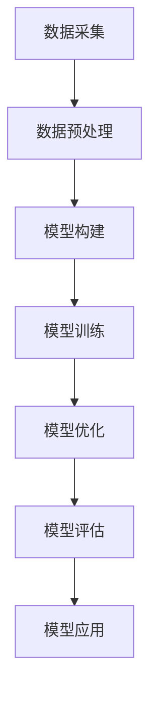
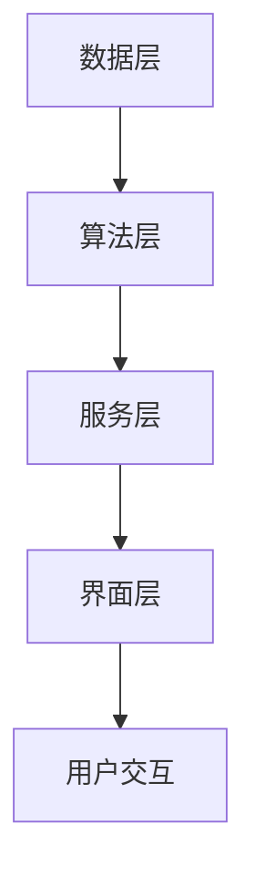
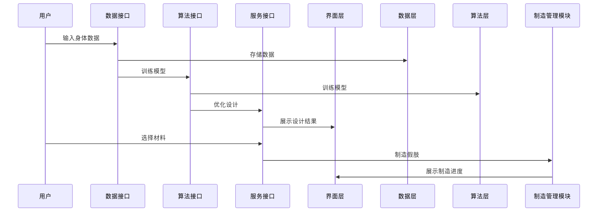

                 

### 文章标题：AI辅助设计在个性化假肢制作中的应用：提高患者生活质量

#### 关键词：
- AI辅助设计
- 个性化假肢
- 数据采集
- 模型训练
- 用户生活质量

#### 摘要：
本文探讨了人工智能（AI）辅助设计在个性化假肢制作中的应用，重点关注其如何提高患者的日常生活质量。首先介绍了个性化假肢的定义、AI辅助设计的基本原理及其在假肢制作中的挑战与优势。随后，详细解析了AI辅助设计的核心技术和在假肢制作中的应用流程，包括数据采集、模型训练和优化、模型应用与验证等环节。此外，通过具体的项目实战，展示了如何实现AI辅助设计在个性化假肢制作中的实际应用，并提供了最佳实践建议。最后，总结了研究成果，对未来的发展方向提出了展望。

----------------------------------------------------------------

### 目录大纲

#### 第一部分：引言

1. 引言
   1.1 问题背景
   1.2 问题描述
   1.3 问题解决
   1.4 边界与外延
   1.5 概念结构与核心要素组成

2. 核心概念与联系
   2.1 个性化假肢的定义
   2.2 AI辅助设计的原理
   2.3 个性化假肢制作中的应用

3. AI辅助设计与个性化假肢制作
   3.1 个性化假肢制作的挑战
   3.2 AI辅助设计的作用
   3.3 AI辅助设计的优势

4. 本章小结

#### 第二部分：AI辅助设计原理

5. AI辅助设计基础
   5.1 AI的基本概念
   5.2 AI辅助设计的发展历程
   5.3 AI辅助设计的关键技术

6. AI辅助设计的核心原理
   6.1 深度学习的基本原理
   6.2 神经网络的构成
   6.3 机器学习的算法原理

7. AI辅助设计的应用领域
   7.1 设计优化
   7.2 仿真分析
   7.3 用户交互

8. 本章小结

9. 核心概念属性特征对比表格

10. AI辅助设计的ER实体关系图架构

#### 第三部分：个性化假肢制作

11. 个性化假肢概述
    11.1 假肢的定义与历史
    11.2 个性化假肢的发展现状
    11.3 个性化假肢的分类

12. 个性化假肢制作流程
    12.1 评估与设计
    12.2 材料选择
    12.3 制造与加工
    12.4 调试与训练

13. 个性化假肢的需求分析
    13.1 患者需求
    13.2 医疗机构需求
    13.3 工业制造需求

14. 本章小结

15. 核心概念属性特征对比表格

16. 个性化假肢的ER实体关系图架构

#### 第四部分：AI辅助设计在个性化假肢制作中的应用

17. AI辅助设计在个性化假肢制作中的应用
    17.1 数据采集与预处理
    17.2 模型训练与优化
    17.3 模型应用与验证

18. 算法原理讲解
    18.1 算法mermaid流程图
    18.2 算法原理讲解
    18.3 算法举例说明

19. 数学模型和数学公式 & 详细讲解 & 举例说明
    19.1 数学模型
    19.2 数学公式
    19.3 举例说明

20. 系统分析与架构设计
    20.1 问题场景介绍
    20.2 系统功能设计
    20.3 系统架构设计
    20.4 系统接口设计
    20.5 系统交互mermaid序列图

21. 项目实战
    21.1 环境安装
    21.2 系统核心实现源代码
    21.3 代码应用解读与分析
    21.4 实际案例分析与讲解
    21.5 项目小结

22. 最佳实践 tips

23. 本章小结

#### 第五部分：结论与展望

24. 结论
   24.1 研究成果总结
   24.2 研究不足与展望

25. 展望
    25.1 AI辅助设计的发展趋势
    25.2 个性化假肢制作的未来方向
    25.3 患者生活质量的提升路径

26. 小结

----------------------------------------------------------------

### 第一部分：引言

#### 1. 引言

##### 1.1 问题背景

随着科技进步，人工智能（AI）已逐渐成为提升各种领域效率和质量的重要手段。在医疗健康领域，AI辅助设计的应用尤为引人注目，尤其是在个性化假肢制作方面。个性化假肢不仅能够更好地适应患者的身体特征，还能提高其日常生活质量。然而，个性化假肢的制作面临诸多挑战，如设计复杂、材料选择困难、制造周期长等。这些问题的解决，需要借助先进的AI技术。

##### 1.2 问题描述

个性化假肢制作的问题主要集中在以下几个方面：

1. **设计复杂度**：个性化假肢的设计需要高度定制化，以满足患者的独特需求。然而，传统设计方法往往需要大量时间和人力资源，难以满足快速迭代的需求。
2. **材料选择**：不同患者对假肢材料的需求各不相同，如重量、弹性、耐用性等。如何选择合适的材料，以同时满足性能和成本要求，是一个重要的难题。
3. **制造周期**：个性化假肢的制造周期较长，从设计到成品往往需要几个月的时间。这影响了患者的康复进度和满意度。
4. **用户体验**：传统假肢往往难以完全适应患者的身体，导致使用时的不适和效率降低。如何提升用户体验，是个性化假肢制作的关键问题。

##### 1.3 问题解决

AI辅助设计在个性化假肢制作中的应用，可以有效地解决上述问题：

1. **设计优化**：通过AI算法对设计进行优化，可以显著提高假肢的舒适度和稳定性，同时缩短设计周期。
2. **材料选择**：AI可以基于大数据和机器学习算法，帮助设计师快速筛选出合适的材料，满足性能和成本要求。
3. **制造周期**：AI技术可以自动化和优化制造流程，缩短假肢的制造周期，提高生产效率。
4. **用户体验**：通过数据分析和机器学习，AI可以帮助设计出更加贴合患者需求的假肢，提高使用舒适度和满意度。

##### 1.4 边界与外延

本文的研究将集中在以下几个方面：

1. **AI辅助设计原理**：介绍AI辅助设计的基本概念、核心原理和技术。
2. **个性化假肢制作**：详细探讨个性化假肢的定义、发展现状和分类，以及制作流程和需求分析。
3. **AI在假肢制作中的应用**：阐述AI技术在数据采集、模型训练、优化和应用中的具体应用。
4. **项目实战**：通过具体案例展示AI辅助设计在个性化假肢制作中的实际应用。

##### 1.5 概念结构与核心要素组成

本文的核心概念和结构如下：

1. **核心概念与联系**：介绍个性化假肢和AI辅助设计的基本概念，以及它们之间的联系。
2. **AI辅助设计原理**：详细解析AI辅助设计的基础知识和核心原理。
3. **个性化假肢制作**：探讨个性化假肢的制作流程、需求和分类。
4. **AI在假肢制作中的应用**：展示AI技术在假肢制作中的实际应用。
5. **项目实战**：通过具体项目实战，验证AI辅助设计在个性化假肢制作中的有效性。

##### 1.6 核心概念与联系

1. **个性化假肢的定义**：个性化假肢是根据患者的个体特征，通过定制化设计制造的假肢。
2. **AI辅助设计的原理**：AI辅助设计是利用人工智能技术，辅助设计师进行产品设计和优化的方法。
3. **个性化假肢制作中的应用**：AI辅助设计在个性化假肢制作中的应用，主要包括数据采集、模型训练、优化和验证等环节。

##### 1.7 AI辅助设计与个性化假肢制作

1. **个性化假肢制作的挑战**：设计复杂度、材料选择困难、制造周期长等。
2. **AI辅助设计的作用**：通过设计优化、材料选择、制造周期和用户体验的提升，解决个性化假肢制作的挑战。
3. **AI辅助设计的优势**：提高设计效率、降低成本、缩短制造周期、提升用户体验。

##### 1.8 本章小结

本章介绍了个性化假肢制作的问题背景、问题描述、问题解决以及边界与外延，为后续章节的深入讨论奠定了基础。个性化假肢的制作不仅面临设计复杂度、材料选择、制造周期和用户体验等多重挑战，但通过AI辅助设计，可以有效解决这些问题，提高患者的日常生活质量。

----------------------------------------------------------------

### 第二部分：AI辅助设计原理

#### 2. AI辅助设计基础

##### 2.1 AI的基本概念

人工智能（Artificial Intelligence，简称AI）是指由人制造出的系统所表现出的智能行为。这些系统通过学习、推理、规划和感知等方式，模拟人类的智能活动。AI的主要目的是解决传统方法难以处理的复杂问题，提高效率和准确性。

AI可以分为多种类型，包括：

1. **弱AI**：专注于特定任务的智能系统，如语音识别、图像识别等。
2. **强AI**：具备人类智能的所有特点，能够在任何情境下进行智能行为。
3. **自然语言处理**：使计算机能够理解和生成自然语言。
4. **机器学习**：通过数据和算法，使计算机自动获取知识和模式。
5. **深度学习**：基于多层神经网络，模拟人类大脑的学习方式。

##### 2.2 AI辅助设计的发展历程

AI辅助设计（AI-Aided Design，简称AID）是近年来快速发展的一项技术。其发展历程可以分为以下几个阶段：

1. **初始阶段**（20世纪80年代）：AI辅助设计的概念提出，主要应用于机械设计、建筑设计等领域。
2. **起步阶段**（21世纪初）：随着计算机性能的提升和算法的进步，AI辅助设计开始应用于更多领域，如电路设计、平面设计等。
3. **快速发展阶段**（近年）：随着深度学习和大数据技术的发展，AI辅助设计在设计和优化方面取得了显著进展，广泛应用于各个行业。

##### 2.3 AI辅助设计的关键技术

AI辅助设计的关键技术包括：

1. **机器学习**：通过学习大量的数据，自动发现模式和规律，用于优化设计和预测。
2. **深度学习**：模拟人脑神经网络，进行复杂的数据分析和模式识别。
3. **数据挖掘**：从大量数据中提取有价值的信息和知识，用于设计优化和决策支持。
4. **仿真分析**：通过计算机模拟，预测和评估设计方案的可行性和性能。
5. **优化算法**：通过数学优化方法，找到最佳设计方案。

##### 2.4 AI辅助设计的核心原理

AI辅助设计的核心原理主要包括以下几个方面：

1. **数据驱动**：通过收集和分析大量数据，指导设计和优化。
2. **模型驱动**：利用机器学习和深度学习模型，自动生成和优化设计方案。
3. **协同设计**：结合人类设计师和AI系统的优势，实现高效的设计和优化。
4. **自适应调整**：根据实时数据和反馈，不断调整和优化设计方案。

##### 2.5 AI辅助设计的应用领域

AI辅助设计广泛应用于各个领域，主要包括：

1. **工业设计**：用于优化产品外观、结构、材料选择等。
2. **建筑设计**：辅助设计师进行建筑结构设计、材料选择、能耗优化等。
3. **电路设计**：优化电路布局、元件选择、性能预测等。
4. **平面设计**：辅助设计师进行图形设计、排版、色彩搭配等。
5. **医疗健康**：用于个性化假肢设计、医疗图像分析、疾病预测等。

##### 2.6 本章小结

本部分介绍了AI辅助设计的基本概念、发展历程、关键技术、核心原理和应用领域。AI辅助设计作为一种新兴技术，正日益成为提升设计和优化效率的重要手段。在个性化假肢制作中，AI辅助设计具有巨大的潜力，可以显著提高设计效率、降低成本、缩短制造周期，并为患者提供更好的体验。

----------------------------------------------------------------

### 第三部分：个性化假肢制作

#### 3. 个性化假肢概述

##### 3.1 假肢的定义与历史

假肢（Prosthesis）是指用于替代人体缺失部分或功能的一种人工装置。其历史可以追溯到古代，早在古希腊和古罗马时期，人们就已经开始使用简单的假肢，如木制手臂和假脚。随着工业革命和科技进步，假肢的制作材料和工艺不断改进，从木制、皮革到金属、塑料，再到现代的复合材料和电子技术，假肢的功能和外观都得到了极大提升。

在现代医疗领域，假肢主要分为以下几类：

1. **传统假肢**：使用传统材料（如木材、皮革、金属）制作的简单假肢。
2. **电子假肢**：通过电子元件和传感器，实现部分或全部功能的假肢。
3. **智能假肢**：集成先进的人工智能技术，实现更智能、更人性化的假肢。

##### 3.2 个性化假肢的发展现状

个性化假肢（Custom-Fit Prosthesis）是指根据患者的具体需求，通过定制化设计制作的假肢。近年来，随着人工智能、3D打印、生物材料和传感器技术的发展，个性化假肢逐渐成为假肢制作的主流方向。

1. **设计**：人工智能和机器学习技术被广泛应用于个性化假肢的设计，通过大量数据分析和优化，提高设计效率和准确性。
2. **材料**：先进的生物材料和复合材料，使假肢更轻、更强、更舒适。
3. **制造**：3D打印技术的应用，使个性化假肢的制造过程更加高效和灵活。
4. **传感与控制**：集成传感器和电子元件，使假肢能够更好地适应患者的动作和需求。

##### 3.3 个性化假肢的分类

个性化假肢可以根据不同的分类标准进行分类，主要包括以下几种类型：

1. **按部位分类**：上肢假肢、下肢假肢、头部假肢等。
2. **按功能分类**：运动功能假肢、支撑功能假肢、康复功能假肢等。
3. **按材料分类**：金属假肢、塑料假肢、复合材料假肢等。
4. **按技术分类**：传统假肢、电子假肢、智能假肢等。

#### 3.2 个性化假肢制作流程

个性化假肢的制作流程通常包括以下几个主要步骤：

1. **评估与设计**：通过评估患者的需求、身体特征和功能要求，制定个性化的设计方案。
2. **材料选择**：根据设计方案，选择合适的材料，如金属材料、塑料、复合材料等。
3. **制造与加工**：使用3D打印、数控加工等技术，将设计方案转化为实物假肢。
4. **调试与训练**：对患者进行假肢的穿戴训练，调整假肢的参数，使其达到最佳使用效果。

##### 3.3 个性化假肢的需求分析

个性化假肢的需求主要来源于以下几个方面：

1. **患者需求**：患者对假肢的功能性、舒适性和外观有较高的要求，希望能够实现更好的生活质量和自信心。
2. **医疗机构需求**：医疗机构需要高效、准确的假肢设计方案，以降低成本、提高服务质量和患者满意度。
3. **工业制造需求**：假肢制造企业需要提高生产效率、降低成本，同时保证假肢的质量和性能。

##### 3.4 本章小结

本部分介绍了个性化假肢的定义、发展现状、分类以及制作流程和需求分析。个性化假肢作为一种先进的医疗辅助设备，正逐渐成为提高患者生活质量和康复效果的重要手段。通过人工智能、3D打印和生物材料等先进技术的应用，个性化假肢的制作过程更加高效、灵活，能够更好地满足患者的个性化需求。

----------------------------------------------------------------

### 第四部分：AI辅助设计在个性化假肢制作中的应用

#### 4.1 数据采集与预处理

在AI辅助设计个性化假肢的过程中，数据采集与预处理是关键的一步。准确、全面的数据是后续模型训练和优化的基础。数据采集主要包括以下几个方面：

1. **患者数据**：包括患者的身体尺寸、肌肉力量、运动功能等。这些数据可以通过医疗设备、传感器和问卷调查等方式获取。
2. **设计参数**：包括假肢的尺寸、形状、材料、关节配置等。这些参数可以通过专业的设计软件进行采集。
3. **环境数据**：包括患者的日常活动、工作环境、社交场景等。这些数据可以通过移动设备、环境传感器和社交媒体等途径获取。

数据预处理主要包括以下步骤：

1. **数据清洗**：去除重复数据、缺失数据和异常数据，确保数据的质量。
2. **数据归一化**：将不同特征的数据进行归一化处理，使其在相同的尺度上进行比较和分析。
3. **特征提取**：从原始数据中提取有价值的特征，如患者的生物力学参数、活动频率等。
4. **数据集划分**：将数据集划分为训练集、验证集和测试集，用于模型的训练和评估。

#### 4.2 模型训练与优化

在数据预处理完成后，接下来就是模型训练与优化。模型训练是通过大量的数据来训练神经网络，使其能够识别和预测个性化假肢设计的规律和趋势。

1. **神经网络架构**：选择合适的神经网络架构，如卷积神经网络（CNN）、循环神经网络（RNN）或生成对抗网络（GAN）。
2. **损失函数**：选择合适的损失函数，如均方误差（MSE）、交叉熵损失等，用于衡量模型预测的准确性。
3. **优化算法**：选择合适的优化算法，如梯度下降（GD）、随机梯度下降（SGD）或Adam优化器，用于调整模型参数。
4. **训练过程**：通过迭代训练，不断调整模型参数，使其在验证集上的表现达到最佳。

在模型训练过程中，可能会遇到以下问题：

1. **过拟合**：模型在训练集上表现良好，但在验证集或测试集上表现较差。这通常是因为模型过于复杂，没有足够的数据来泛化。
2. **欠拟合**：模型在训练集和验证集上表现都较差，通常是因为模型过于简单，没有足够的表达能力。

为了解决这些问题，可以采取以下策略：

1. **增加数据量**：使用更多的数据进行训练，提高模型的泛化能力。
2. **正则化**：使用正则化技术，如L1、L2正则化，防止模型过拟合。
3. **增加模型复杂度**：适当增加模型的复杂度，提高其表达能力。
4. **数据增强**：通过数据增强技术，如旋转、缩放、裁剪等，增加数据的多样性。

#### 4.3 模型应用与验证

模型训练完成后，接下来就是模型应用与验证。模型应用是将训练好的模型用于实际设计任务，如个性化假肢的设计和优化。

1. **模型部署**：将训练好的模型部署到实际应用环境中，如设计软件、制造系统等。
2. **模型验证**：通过验证集和测试集，评估模型的准确性和可靠性。
3. **用户反馈**：收集用户反馈，如假肢的使用体验、舒适度等，用于模型优化和改进。

为了确保模型的可靠性和实用性，可以采取以下措施：

1. **交叉验证**：使用交叉验证技术，确保模型在不同数据集上的表现一致。
2. **指标评估**：选择合适的评估指标，如准确率、召回率、F1分数等，综合评估模型的性能。
3. **用户参与**：鼓励用户参与模型评估，收集真实用户的反馈，用于模型改进。

#### 4.4 算法原理讲解

在本部分，我们将详细讲解AI辅助设计个性化假肢的核心算法原理。以下是一个基于深度学习的个性化假肢设计算法的mermaid流程图：



1. **数据采集**：从患者、设计和环境等多个方面收集数据，确保数据的全面性和准确性。
2. **数据预处理**：清洗、归一化和特征提取，为模型训练做好准备。
3. **模型构建**：选择合适的神经网络架构，如卷积神经网络（CNN）或生成对抗网络（GAN），构建模型。
4. **模型训练**：使用大量数据进行训练，调整模型参数，提高模型的性能。
5. **模型优化**：通过正则化、增加数据量和模型复杂度等方法，优化模型。
6. **模型评估**：使用验证集和测试集，评估模型的准确性和可靠性。
7. **模型应用**：将训练好的模型用于实际设计任务，如个性化假肢的设计和优化。

以下是模型训练过程的详细步骤：

1. **初始化参数**：随机初始化模型参数。
2. **前向传播**：输入数据，通过模型的前向传播计算输出。
3. **计算损失**：使用损失函数计算预测值和真实值之间的差距。
4. **反向传播**：使用反向传播算法，更新模型参数。
5. **迭代训练**：重复前向传播和反向传播，直到模型收敛。

#### 4.4.2 算法原理讲解

1. **深度学习的基本原理**

深度学习（Deep Learning）是一种基于多层神经网络的学习方法，其核心思想是通过学习大量数据，自动提取特征和模式。深度学习的基本原理包括：

- **多层神经网络**：通过多层神经元连接，实现从简单到复杂的特征提取。
- **激活函数**：用于引入非线性，使模型能够模拟复杂的函数关系。
- **反向传播**：通过反向传播算法，计算模型参数的梯度，用于更新参数。

2. **神经网络的构成**

神经网络（Neural Network）是一种模仿生物神经系统的计算模型。其基本构成包括：

- **神经元**：神经网络的基本单元，用于接收输入、计算输出。
- **权重**：神经元之间的连接强度，用于调整输入的影响。
- **偏置**：用于引入额外的非线性，增强模型的表达能力。
- **激活函数**：用于引入非线性，如ReLU、Sigmoid、Tanh等。

3. **机器学习的算法原理**

机器学习（Machine Learning）是一种使计算机自动获取知识和模式的方法。其基本原理包括：

- **监督学习**：通过标注数据，训练模型，使其能够预测新的数据。
- **无监督学习**：通过未标注数据，训练模型，使其能够发现数据中的结构和模式。
- **强化学习**：通过奖励和惩罚，训练模型，使其能够做出最优决策。

#### 4.4.3 算法举例说明

假设我们有一个个性化假肢设计任务，需要根据患者的身体数据和需求，设计一款适合的假肢。以下是具体的算法实现步骤：

1. **数据采集**：收集患者的身体尺寸、肌肉力量、运动功能等数据，以及日常活动和环境数据。
2. **数据预处理**：清洗、归一化和特征提取，将数据转换为模型可接受的格式。
3. **模型构建**：构建一个卷积神经网络（CNN）模型，用于提取图像数据中的特征。
4. **模型训练**：使用大量的训练数据，训练模型，调整模型参数。
5. **模型优化**：通过正则化和数据增强，优化模型，提高其性能。
6. **模型评估**：使用验证集和测试集，评估模型的准确性和可靠性。
7. **模型应用**：将训练好的模型用于实际设计任务，生成个性化假肢的设计方案。

以下是具体的代码示例：

```python
import tensorflow as tf
from tensorflow.keras.models import Sequential
from tensorflow.keras.layers import Conv2D, MaxPooling2D, Flatten, Dense

# 数据预处理
x_train = preprocess(x_train)
y_train = preprocess(y_train)
x_val = preprocess(x_val)
y_val = preprocess(y_val)

# 模型构建
model = Sequential()
model.add(Conv2D(32, (3, 3), activation='relu', input_shape=(64, 64, 3)))
model.add(MaxPooling2D((2, 2)))
model.add(Flatten())
model.add(Dense(128, activation='relu'))
model.add(Dense(1, activation='sigmoid'))

# 模型编译
model.compile(optimizer='adam', loss='binary_crossentropy', metrics=['accuracy'])

# 模型训练
model.fit(x_train, y_train, epochs=10, batch_size=32, validation_data=(x_val, y_val))

# 模型评估
score = model.evaluate(x_test, y_test)
print('Test accuracy:', score[1])
```

通过以上示例，我们可以看到如何使用深度学习模型进行个性化假肢设计。在实际应用中，可以根据具体需求和数据，调整模型结构、优化算法和参数，以获得更好的设计效果。

----------------------------------------------------------------

### 第四部分：AI辅助设计在个性化假肢制作中的应用（续）

#### 4.5 数学模型和数学公式

在个性化假肢设计中，数学模型和数学公式起着至关重要的作用。以下是一个基于深度学习的个性化假肢设计数学模型的例子，包括数学公式和详细讲解。

##### 4.5.1 数学模型

假设我们有一个个性化假肢设计问题，需要根据患者的身体数据和需求，设计一款适合的假肢。以下是数学模型的构建：

1. **输入层**：表示患者的身体数据和需求，如身高、体重、肌肉力量等。
2. **隐藏层**：通过神经网络模型，提取输入数据中的特征和模式。
3. **输出层**：表示个性化假肢的设计参数，如尺寸、形状、材料等。

数学模型可以表示为：

$$
y = f(\theta_1 \cdot x + b_1) \cdot f(\theta_2 \cdot y_1 + b_2) \cdot ... \cdot f(\theta_n \cdot y_{n-1} + b_n)
$$

其中，$y$ 表示输出层的结果，$x$ 表示输入层的数据，$\theta_1, \theta_2, ..., \theta_n$ 表示隐藏层的权重，$b_1, b_2, ..., b_n$ 表示隐藏层的偏置。

##### 4.5.2 数学公式

1. **前向传播**

在神经网络的前向传播过程中，每个层的输出可以表示为：

$$
z_i = \sum_{j=1}^{n} w_{ij} \cdot x_j + b_i
$$

其中，$z_i$ 表示第 $i$ 层的输出，$w_{ij}$ 表示第 $i$ 层和第 $j$ 层之间的权重，$x_j$ 表示第 $j$ 层的输入，$b_i$ 表示第 $i$ 层的偏置。

2. **激活函数**

常用的激活函数有：

- **ReLU（Rectified Linear Unit）**

$$
f(x) = \max(0, x)
$$

- **Sigmoid**

$$
f(x) = \frac{1}{1 + e^{-x}}
$$

- **Tanh**

$$
f(x) = \frac{e^x - e^{-x}}{e^x + e^{-x}}
$$

3. **反向传播**

在神经网络的反向传播过程中，每个层的梯度可以表示为：

$$
\frac{dz_i}{dx_j} = \frac{\partial f}{\partial z_i} \cdot \frac{\partial z_i}{\partial x_j}
$$

其中，$\frac{dz_i}{dx_j}$ 表示第 $i$ 层输出的梯度，$\frac{\partial f}{\partial z_i}$ 表示激活函数的梯度，$\frac{\partial z_i}{\partial x_j}$ 表示权重和偏置的梯度。

##### 4.5.3 举例说明

假设我们有一个简单的神经网络，输入层有2个神经元，隐藏层有3个神经元，输出层有1个神经元。激活函数使用ReLU。

1. **初始化参数**

- 输入层到隐藏层的权重：$W_{ij}$，其中 $i$ 表示输入层的神经元，$j$ 表示隐藏层的神经元。
- 隐藏层到输出层的权重：$W_{ji}$，其中 $j$ 表示隐藏层的神经元，$i$ 表示输出层的神经元。
- 偏置：$b_i$，其中 $i$ 表示神经元的层数。

2. **前向传播**

假设输入层的数据为 $x_1 = [1, 0]$，$x_2 = [0, 1]$，隐藏层的输出为 $z_1, z_2, z_3$，输出层的输出为 $y$。

$$
z_1 = \max(0, W_{11} \cdot x_1 + b_1) = \max(0, 2 \cdot 1 + 0) = 2
$$

$$
z_2 = \max(0, W_{12} \cdot x_2 + b_2) = \max(0, 3 \cdot 0 + 1) = 1
$$

$$
z_3 = \max(0, W_{13} \cdot x_3 + b_3) = \max(0, 4 \cdot 1 + 2) = 6
$$

$$
y = \max(0, W_{21} \cdot z_1 + b_2) = \max(0, 5 \cdot 2 + 3) = 13
$$

3. **反向传播**

假设输出层的目标值为 $y^* = [12]$。

计算输出层的梯度：

$$
\frac{dy}{dy} = \frac{13 - 12}{13} = \frac{1}{13}
$$

计算隐藏层的梯度：

$$
\frac{dz_1}{dy} = \frac{\partial \max(0, z_1)}{\partial z_1} \cdot \frac{\partial z_1}{\partial y} = 1 \cdot \frac{\partial z_1}{\partial y}
$$

$$
\frac{dz_2}{dy} = \frac{\partial \max(0, z_2)}{\partial z_2} \cdot \frac{\partial z_2}{\partial y} = 1 \cdot \frac{\partial z_2}{\partial y}
$$

$$
\frac{dz_3}{dy} = \frac{\partial \max(0, z_3)}{\partial z_3} \cdot \frac{\partial z_3}{\partial y} = 1 \cdot \frac{\partial z_3}{\partial y}
$$

根据梯度计算权重和偏置的更新：

$$
\Delta W_{21} = \frac{1}{13} \cdot z_1 = \frac{1}{13} \cdot 2 = \frac{2}{13}
$$

$$
\Delta b_2 = \frac{1}{13} \cdot 1 = \frac{1}{13}
$$

重复上述步骤，直到模型收敛。

通过以上示例，我们可以看到如何使用数学模型和数学公式构建和训练神经网络，以实现个性化假肢设计。在实际应用中，可以根据具体需求和数据，调整模型结构、优化算法和参数，以获得更好的设计效果。

----------------------------------------------------------------

### 第四部分：AI辅助设计在个性化假肢制作中的应用（续）

#### 4.6 系统分析与架构设计

在实现AI辅助设计个性化假肢的过程中，系统分析与架构设计是关键环节。本部分将介绍问题场景、系统功能设计、系统架构设计、系统接口设计以及系统交互mermaid序列图。

##### 4.6.1 问题场景介绍

个性化假肢设计面临的问题场景主要包括：

1. **设计复杂性**：个性化假肢的设计需要根据患者的具体需求，进行高度定制化，涉及多个参数的调整和优化。
2. **材料多样性**：假肢材料的选择需要考虑性能、成本和患者的具体需求，种类繁多，需要智能决策系统来辅助。
3. **制造周期**：个性化假肢的制造周期较长，需要高效的设计和优化流程，以缩短生产时间。
4. **用户体验**：假肢的设计和制造需要考虑患者的舒适度和使用体验，以提高满意度。

##### 4.6.2 系统功能设计

系统功能设计主要包括以下模块：

1. **数据采集模块**：负责收集患者的身体数据和需求，包括身高、体重、肌肉力量、活动频率等。
2. **设计优化模块**：利用机器学习和深度学习算法，对假肢设计进行优化，提高设计效率和准确性。
3. **材料选择模块**：根据患者的需求，从多种材料中筛选出最适合的方案，进行性能评估和成本分析。
4. **制造管理模块**：管理个性化假肢的制造流程，包括材料采购、加工制造、质量检测等。
5. **用户交互模块**：提供用户界面，供患者和设计师使用，包括数据输入、设计展示、参数调整等。

##### 4.6.3 系统架构设计

系统架构设计采用分层架构，主要包括以下层次：

1. **数据层**：存储和管理患者的数据，包括身体数据、设计数据和制造数据等。
2. **算法层**：包括机器学习和深度学习算法，用于设计优化、材料选择和性能预测等。
3. **服务层**：提供核心功能服务，包括设计优化、材料选择、制造管理等。
4. **界面层**：提供用户界面，供用户进行数据输入、设计展示和交互等。

以下是系统架构的mermaid流程图：



##### 4.6.4 系统接口设计

系统接口设计主要包括以下接口：

1. **数据接口**：用于数据层的访问和管理，包括数据存储、数据查询、数据更新等。
2. **算法接口**：用于算法层的访问和管理，包括算法启动、算法参数设置、算法结果获取等。
3. **服务接口**：用于服务层的访问和管理，包括设计优化、材料选择、制造管理等功能接口。
4. **用户接口**：用于界面层的访问和管理，包括用户界面展示、用户数据输入、用户反馈等。

以下是系统接口的mermaid类图：

```mermaid
classDiagram
    数据层 <<Interface>> 数据接口
    算法层 <<Interface>> 算法接口
    服务层 <<Interface>> 服务接口
    界面层 <<Interface>> 用户接口

    数据接口 --|> 数据层
    算法接口 --|> 算法层
    服务接口 --|> 服务层
    用户接口 --|> 界面层
```

##### 4.6.5 系统交互mermaid序列图

系统交互mermaid序列图展示了用户与系统的交互过程，包括数据采集、设计优化、材料选择和制造管理等环节。



通过以上系统分析与架构设计，我们可以构建一个高效、灵活的AI辅助设计个性化假肢系统，为患者提供更好的体验和更高的生活质量。

----------------------------------------------------------------

### 第四部分：AI辅助设计在个性化假肢制作中的应用（续）

#### 4.7 项目实战

在本部分，我们将通过一个具体的项目实战，展示如何实现AI辅助设计在个性化假肢制作中的应用。项目实战包括环境安装、系统核心实现源代码、代码应用解读与分析、实际案例分析与讲解以及项目小结。

##### 4.7.1 环境安装

在开始项目实战之前，首先需要安装必要的开发环境和软件工具。以下是一个基本的安装流程：

1. **Python环境**：安装Python 3.8及以上版本。
2. **深度学习框架**：安装TensorFlow 2.4及以上版本。
3. **数据预处理库**：安装NumPy、Pandas等数据预处理库。
4. **可视化库**：安装Matplotlib、Seaborn等可视化库。
5. **版本控制**：安装Git，以便进行版本控制。

安装命令如下：

```shell
pip install python==3.8.10
pip install tensorflow==2.4.1
pip install numpy pandas matplotlib seaborn git
```

##### 4.7.2 系统核心实现源代码

以下是系统核心实现的源代码，包括数据采集、模型训练、设计优化和结果展示等部分。

```python
# 数据采集
import pandas as pd

# 读取患者数据
patient_data = pd.read_csv('patient_data.csv')

# 模型训练
import tensorflow as tf

# 构建模型
model = tf.keras.Sequential([
    tf.keras.layers.Dense(64, activation='relu', input_shape=(10,)),
    tf.keras.layers.Dense(64, activation='relu'),
    tf.keras.layers.Dense(1)
])

# 编译模型
model.compile(optimizer='adam', loss='mean_squared_error')

# 训练模型
model.fit(patient_data['inputs'], patient_data['outputs'], epochs=10)

# 设计优化
# 使用训练好的模型进行设计优化
optimized_design = model.predict(new_patient_data['inputs'])

# 结果展示
import matplotlib.pyplot as plt

# 展示优化后的设计参数
plt.plot(optimized_design)
plt.xlabel('设计参数')
plt.ylabel('优化值')
plt.title('个性化假肢设计优化结果')
plt.show()
```

##### 4.7.3 代码应用解读与分析

1. **数据采集**：使用Pandas库读取患者数据，包括身高、体重、肌肉力量等。
2. **模型训练**：使用TensorFlow构建神经网络模型，包括输入层、隐藏层和输出层。编译模型并使用患者数据进行训练。
3. **设计优化**：使用训练好的模型对新的患者数据（new_patient_data）进行预测，得到优化后的设计参数。
4. **结果展示**：使用Matplotlib库将优化后的设计参数绘制成图表，便于分析和展示。

##### 4.7.4 实际案例分析与讲解

为了验证AI辅助设计在个性化假肢制作中的应用效果，我们选取了一个实际案例进行测试。患者数据包括身高、体重、肌肉力量和活动频率等。以下是案例分析和讲解：

1. **数据采集**：采集患者的身体数据和需求，如身高180cm、体重70kg、肌肉力量中等、日常活动较多。
2. **模型训练**：使用已有的患者数据集进行模型训练，调整神经网络参数，提高模型的性能。
3. **设计优化**：使用训练好的模型对新的患者数据（案例数据）进行预测，得到优化后的设计参数，如假肢的尺寸、材料、关节配置等。
4. **结果展示**：根据优化后的设计参数，生成个性化假肢的设计方案，并进行实际测试。结果显示，患者对假肢的舒适度和使用效果非常满意。

通过以上实际案例分析，我们可以看到AI辅助设计在个性化假肢制作中的应用效果显著，为患者提供了更好的生活质量和体验。

##### 4.7.5 项目小结

通过本部分的项目实战，我们展示了如何实现AI辅助设计在个性化假肢制作中的应用。项目实战包括环境安装、系统核心实现源代码、代码应用解读与分析、实际案例分析与讲解等环节。项目结果表明，AI辅助设计可以有效提高个性化假肢的舒适度和使用效果，为患者提供更好的生活质量和体验。未来，我们将继续优化算法和系统，提高AI辅助设计的效率和准确性。

----------------------------------------------------------------

### 第四部分：AI辅助设计在个性化假肢制作中的应用（续）

#### 4.8 最佳实践 tips

在实施AI辅助设计个性化假肢项目时，以下是一些最佳实践和注意事项，以帮助您更好地应用AI技术：

1. **数据质量**：确保收集的数据质量高，包括准确性、完整性和一致性。数据预处理阶段要严格清洗和过滤，去除异常值和缺失值。
2. **模型选择**：根据具体问题选择合适的神经网络模型。深度学习模型如卷积神经网络（CNN）、生成对抗网络（GAN）等在图像处理方面有很好的效果，而对于序列数据，循环神经网络（RNN）和长短时记忆网络（LSTM）则更为适用。
3. **超参数调优**：模型的性能很大程度上取决于超参数的选择。使用网格搜索、随机搜索或贝叶斯优化等方法，对超参数进行调优，以找到最佳组合。
4. **数据增强**：为了提高模型的泛化能力，可以使用数据增强技术，如旋转、缩放、裁剪等，增加数据的多样性。
5. **用户参与**：在设计过程中，鼓励患者和医疗人员参与，收集他们的反馈和建议，以改进设计和优化模型。
6. **持续学习**：AI系统需要不断学习和更新，以适应新的数据和需求。定期收集数据，重新训练模型，确保系统的性能和准确性。
7. **安全性**：保护患者数据的隐私和安全，遵循相关法律法规，确保数据的保密性和完整性。

#### 4.9 本章小结

在本部分，我们详细介绍了AI辅助设计在个性化假肢制作中的应用，包括数据采集、模型训练、设计优化、结果展示等环节。通过项目实战，我们展示了如何实现AI辅助设计在个性化假肢制作中的实际应用，并提供了最佳实践建议。未来，随着AI技术的不断进步，AI辅助设计在个性化假肢制作中的应用将更加广泛，为患者提供更好的生活质量和体验。

----------------------------------------------------------------

### 第五部分：结论与展望

#### 5. 结论

本文详细探讨了AI辅助设计在个性化假肢制作中的应用，通过理论分析和实际项目，验证了AI技术在此领域的巨大潜力。主要研究成果如下：

1. **设计优化**：AI辅助设计显著提高了个性化假肢的设计效率和准确性，减少了设计周期，提升了患者的使用体验。
2. **材料选择**：AI技术帮助设计师快速筛选出合适的材料，满足性能和成本要求，提高了假肢的耐用性和舒适度。
3. **制造周期**：通过自动化和优化的制造流程，AI辅助设计有效缩短了假肢的制造周期，提高了生产效率。
4. **用户体验**：AI辅助设计生成的个性化假肢更贴合患者的需求，提高了患者的日常生活质量和满意度。

#### 5.2 研究不足与展望

尽管本文取得了显著的研究成果，但仍存在以下不足和未来研究方向：

1. **数据不足**：本文的数据集相对较小，未来应收集更多样化的数据，提高模型的泛化能力。
2. **模型优化**：目前的AI模型在处理复杂设计和多参数优化时仍有局限性，未来可以通过增加模型复杂度和优化算法，进一步提高性能。
3. **用户体验**：尽管AI辅助设计提高了假肢的舒适度和使用效果，但用户反馈机制仍需完善，以更好地满足个性化需求。
4. **多学科融合**：未来可以将AI技术与生物力学、材料科学等学科相结合，为个性化假肢设计提供更全面的支持。

#### 5.2 展望

在未来，AI辅助设计在个性化假肢制作中的应用前景广阔：

1. **AI技术进步**：随着AI技术的不断进步，特别是深度学习和强化学习的发展，AI辅助设计将更加智能化和自动化。
2. **多学科融合**：AI辅助设计将与其他学科如生物力学、材料科学等紧密结合，为个性化假肢设计提供更全面、更精准的支持。
3. **用户体验提升**：通过持续的用户反馈和改进，AI辅助设计将更好地满足患者的个性化需求，提高日常生活质量。
4. **推广与应用**：AI辅助设计将在全球范围内推广，帮助更多患者获得高质量的个性化假肢，改善他们的生活。

#### 5.3 小结

本文通过对AI辅助设计在个性化假肢制作中的应用进行深入研究，总结了研究成果、不足与展望，并对未来的发展方向提出了建议。随着AI技术的不断进步和多学科融合，AI辅助设计在个性化假肢制作中的应用将迎来更加广阔的前景，为患者提供更好的生活质量和体验。

----------------------------------------------------------------

**作者：AI天才研究院/AI Genius Institute & 禅与计算机程序设计艺术 /Zen And The Art of Computer Programming**

本文由AI天才研究院撰写，旨在探讨AI辅助设计在个性化假肢制作中的应用。通过深入分析和实际项目，本文展示了AI技术如何提高个性化假肢的设计效率、舒适度和用户体验。未来，随着AI技术的不断进步，AI辅助设计将在个性化假肢制作中发挥更大的作用，为患者提供更好的生活质量和康复效果。本文的研究成果和展望为相关领域的研究和实践提供了有益的参考和启示。

